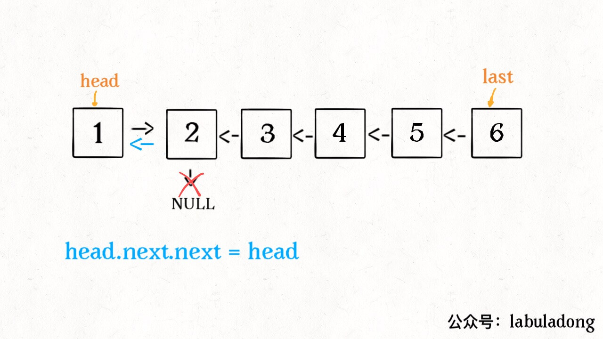
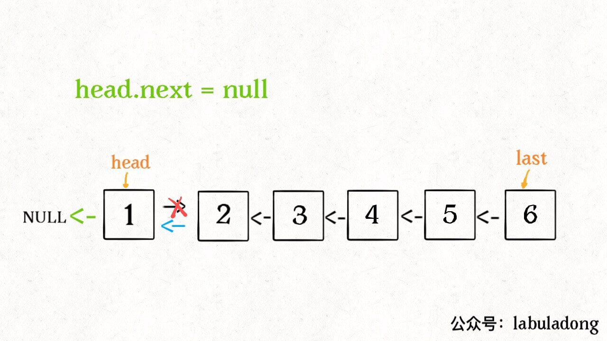
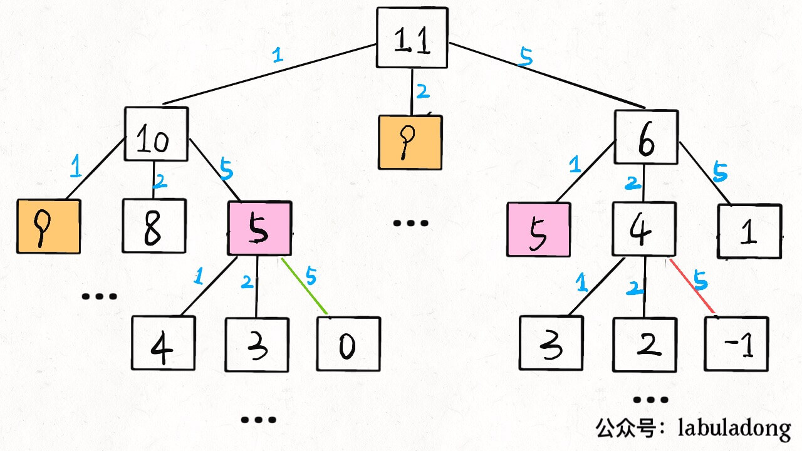
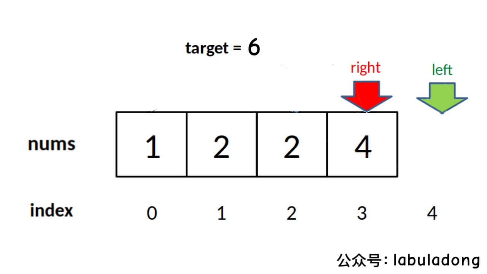
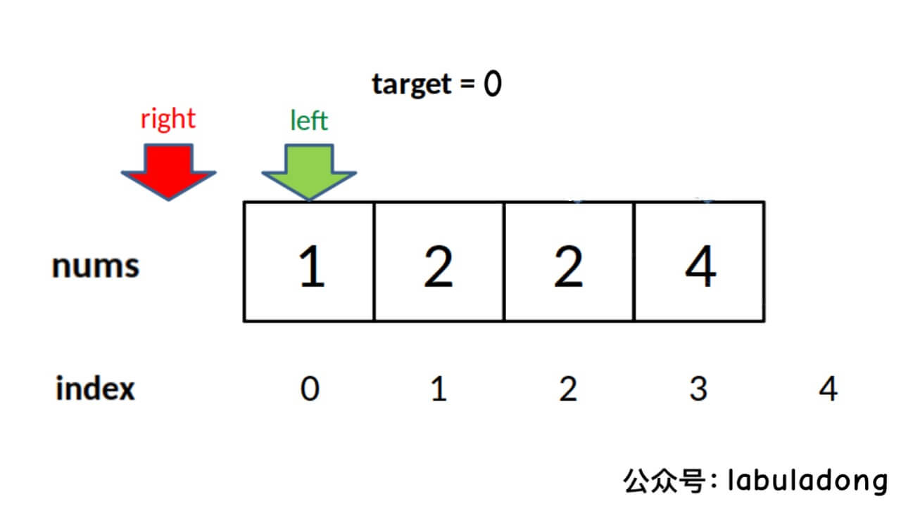
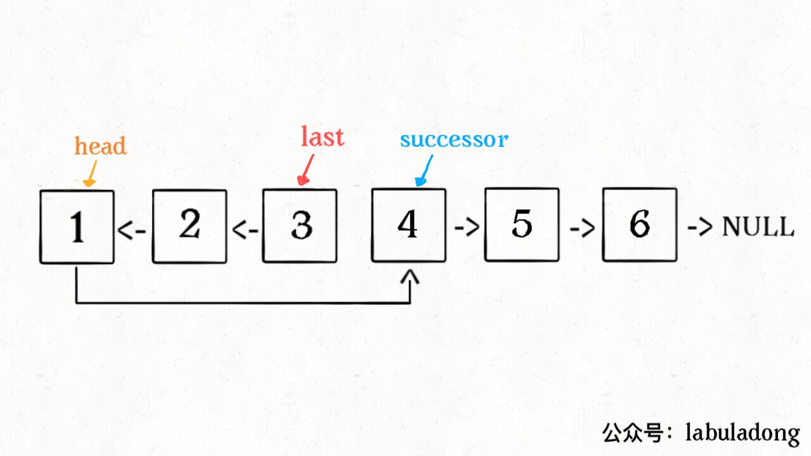
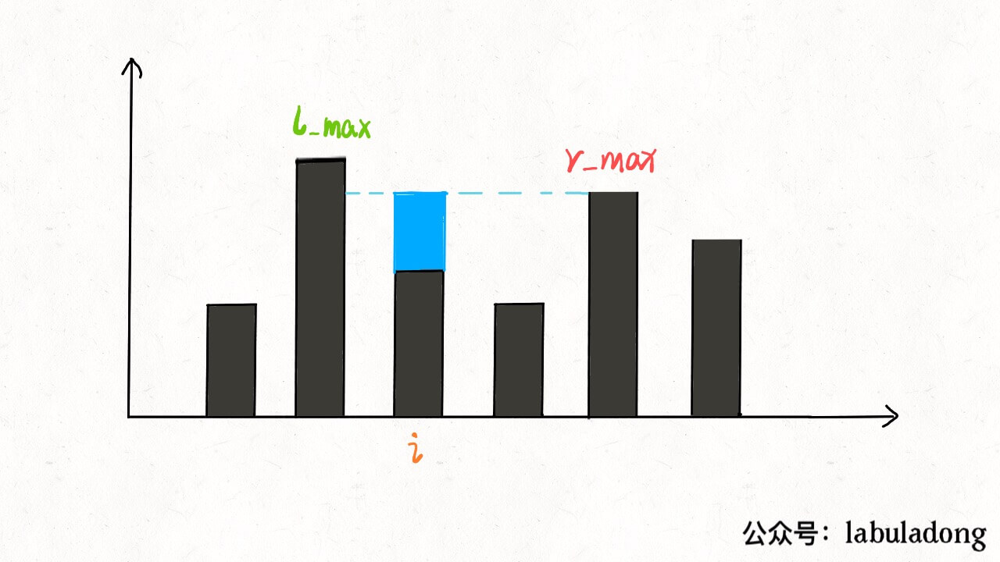

https://leetcode.cn/problems/01-matrix multi-language solutions 👇

```cpp
// by chatGPT (cpp)
class Solution {
public:
    vector<vector<int>> updateMatrix(vector<vector<int>>& mat) {
        int m = mat.size(), n = mat[0].size();
        // the result array that stores the answer
        vector<vector<int>> res(m, vector<int>(n, -1));
        // initialize the queue, putting all coordinates with value 0 into it
        queue<pair<int, int>> q;
        for (int i = 0; i < m; i++) {
            for (int j = 0; j < n; j++) {
                if (mat[i][j] == 0) {
                    q.push({i, j});
                    res[i][j] = 0;
                }
            }
        }
        // run the BFS framework, spreading outward from cells with value 0
        vector<vector<int>> dirs{{0, 1}, {0, -1}, {1, 0}, {-1, 0}};
        while (!q.empty()) {
            auto cur = q.front();
            q.pop();
            int x = cur.first, y = cur.second;
            // spread out in all four directions
            for (auto& dir : dirs) {
                int nextX = x + dir[0];
                int nextY = y + dir[1];
                // ensure the adjacent coordinate is in bounds and hasn't been computed
                if (nextX >= 0 && nextX < m && nextY >= 0 && nextY < n
                        && res[nextX][nextY] == -1) {
                    q.push({nextX, nextY});
                    // moving from mat[x][y] to mat[nextX][nextY] takes one step
                    res[nextX][nextY] = res[x][y] + 1;
                }
            }
        }

        return res;
    }
};
```

```go
// by chatGPT (go)
func updateMatrix(mat [][]int) [][]int {
    m, n := len(mat), len(mat[0])
    // the result array that stores the answer
    res := make([][]int, m)
    for i := range res {
        res[i] = make([]int, n)
        for j := range res[i] {
            res[i][j] = -1
        }
    }
    // initialize the queue, putting all coordinates with value 0 into it
    q := make([][2]int, 0)
    for i := 0; i < m; i++ {
        for j := 0; j < n; j++ {
            if mat[i][j] == 0 {
                q = append(q, [2]int{i, j})
                res[i][j] = 0
            }
        }
    }
    // run the BFS framework, spreading outward from cells with value 0
    dirs := [][]int{{0, 1}, {0, -1}, {1, 0}, {-1, 0}}
    for len(q) > 0 {
        cur := q[0]
        q = q[1:]
        x, y := cur[0], cur[1]
        // spread out in all four directions
        for _, dir := range dirs {
            nextX, nextY := x+dir[0], y+dir[1]
            // ensure the adjacent coordinate is in bounds and hasn't been computed
            if nextX >= 0 && nextX < m && nextY >= 0 && nextY < n && res[nextX][nextY] == -1 {
                q = append(q, [2]int{nextX, nextY})
                // moving from mat[x][y] to mat[nextX][nextY] takes one step
                res[nextX][nextY] = res[x][y] + 1
            }
        }
    }

    return res
}
```

```java
// by labuladong (java)
class Solution {
    public int[][] updateMatrix(int[][] mat) {
        int m = mat.length, n = mat[0].length;
        // the result array that stores the answer
        int[][] res = new int[m][n];
        // initialize all entries with the special value -1, meaning not yet computed,
        // can be used later to check whether a coordinate has been computed, avoiding duplicate traversal
        for (int[] row : res) {
            Arrays.fill(row, -1);
        }

        Queue<int[]> q = new LinkedList<>();
        // initialize the queue, putting all coordinates with value 0 into it
        for (int i = 0; i < m; i++) {
            for (int j = 0; j < n; j++) {
                if (mat[i][j] == 0) {
                    q.offer(new int[]{i, j});
                    res[i][j] = 0;
                }
            }
        }
        // run the BFS framework, spreading outward from cells with value 0
        int[][] dirs = new int[][]{{0, 1}, {0, -1}, {1, 0}, {-1, 0}};
        while (!q.isEmpty()) {
            int[] cur = q.poll();
            int x = cur[0], y = cur[1];
            // spread out in all four directions
            for (int i = 0; i < 4; i++) {
                int nextX = x + dirs[i][0];
                int nextY = y + dirs[i][1];
                // ensure the adjacent coordinate is in bounds and hasn't been computed
                if (nextX >= 0 && nextX < m && nextY >= 0 && nextY < n
                        && res[nextX][nextY] == -1) {
                    q.offer(new int[]{nextX, nextY});
                    // moving from mat[x][y] to mat[nextX][nextY] takes one step
                    res[nextX][nextY] = res[x][y] + 1;
                }
            }
        }

        return res;
    }
}
```

```javascript
// by chatGPT (javascript)
function updateMatrix(mat) {
  const m = mat.length, n = mat[0].length;
  // the result array that stores the answer
  const res = new Array(m).fill().map(() => new Array(n).fill(-1));

  const q = [];
  // initialize the queue, putting all coordinates with value 0 into it
  for (let i = 0; i < m; i++) {
    for (let j = 0; j < n; j++) {
      if (mat[i][j] === 0) {
        q.push([i, j]);
        res[i][j] = 0;
      }
    }
  }
  // run the BFS framework, spreading outward from cells with value 0
  const dirs = [[0, 1], [0, -1], [1, 0], [-1, 0]];
  while (q.length) {
    const cur = q.shift();
    const x = cur[0], y = cur[1];
    // spread out in all four directions
    for (let i = 0; i < 4; i++) {
      const nextX = x + dirs[i][0];
      const nextY = y + dirs[i][1];
      // ensure the adjacent coordinate is in bounds and hasn't been computed
      if (nextX >= 0 && nextX < m && nextY >= 0 && nextY < n
        && res[nextX][nextY] === -1) {
        q.push([nextX, nextY]);
        // moving from mat[x][y] to mat[nextX][nextY] takes one step
        res[nextX][nextY] = res[x][y] + 1;
      }
    }
  }

  return res;
}
```

```python
# by chatGPT (python)
from collections import deque

class Solution:
    def updateMatrix(self, mat: List[List[int]]) -> List[List[int]]:
        m, n = len(mat), len(mat[0])
        # the result array that stores the answer
        res = [[-1] * n for _ in range(m)]

        q = deque()
        # initialize the queue, putting all coordinates with value 0 into it
        for i in range(m):
            for j in range(n):
                if mat[i][j] == 0:
                    q.append((i, j))
                    res[i][j] = 0

        # run the BFS framework, spreading outward from cells with value 0
        dirs = [[0, 1], [0, -1], [1, 0], [-1, 0]]
        while q:
            x, y = q.popleft()
            # spread out in all four directions
            for dx, dy in dirs:
                nextX, nextY = x + dx, y + dy
                # ensure the adjacent coordinate is in bounds and hasn't been computed
                if 0 <= nextX < m and 0 <= nextY < n and res[nextX][nextY] == -1:
                    q.append((nextX, nextY))
                    # moving from mat[x][y] to mat[nextX][nextY] takes one step
                    res[nextX][nextY] = res[x][y] + 1

        return res
```

https://leetcode.cn/problems/01-matrix multi-language solutions 👆

https://leetcode.cn/problems/0i0mDW multi-language solutions 👇

```cpp
// by chatGPT (cpp)
class Solution {
public:
    int memo[201][201];

    int minPathSum(vector<vector<int>>& grid) {
        int m = grid.size();
        int n = grid[0].size();
        // build the memo with every entry initialized to -1
        memset(memo, -1, sizeof(memo));

        return dp(grid, m - 1, n - 1);
    }

    int dp(vector<vector<int>>& grid, int i, int j) {
        // base case
        if (i == 0 && j == 0) {
            return grid[0][0];
        }
        if (i < 0 || j < 0) {
            return INT_MAX;
        }
        // avoid redundant computation
        if (memo[i][j] != -1) {
            return memo[i][j];
        }
        // record the computed result into the memo
        memo[i][j] = min(
            dp(grid, i - 1, j),
            dp(grid, i, j - 1)
        ) + grid[i][j];

        return memo[i][j];
    }
};
```

```go
// by chatGPT (go)
func minPathSum(grid [][]int) int {
    m := len(grid)
    n := len(grid[0])
    // build the memo with every entry initialized to -1
    memo := make([][]int, m)
    for i := 0; i < m; i++ {
        memo[i] = make([]int, n)
        for j := 0; j < n; j++ {
            memo[i][j] = -1
        }
    }

    return dp(grid, m - 1, n - 1, memo)
}

func dp(grid [][]int, i int, j int, memo [][]int) int {
    // base case
    if i == 0 && j == 0 {
        return grid[0][0]
    }
    if i < 0 || j < 0 {
        return math.MaxInt32
    }
    // avoid redundant computation
    if memo[i][j] != -1 {
        return memo[i][j]
    }
    // record the computed result into the memo
    left := dp(grid, i - 1, j, memo)
    up := dp(grid, i, j - 1, memo)
    curr := grid[i][j] + min(left, up)
    memo[i][j] = curr
    return curr
}

func min(a, b int) int {
    if a < b {
        return a
    }
    return b
}
```

```java
// by labuladong (java)
class Solution {
    int[][] memo;

    public int minPathSum(int[][] grid) {
        int m = grid.length;
        int n = grid[0].length;
        // build the memo with every entry initialized to -1
        memo = new int[m][n];
        for (int[] row : memo)
            Arrays.fill(row, -1);

        return dp(grid, m - 1, n - 1);
    }

    int dp(int[][] grid, int i, int j) {
        // base case
        if (i == 0 && j == 0) {
            return grid[0][0];
        }
        if (i < 0 || j < 0) {
            return Integer.MAX_VALUE;
        }
        // avoid redundant computation
        if (memo[i][j] != -1) {
            return memo[i][j];
        }
        // record the computed result into the memo
        memo[i][j] = Math.min(
                dp(grid, i - 1, j),
                dp(grid, i, j - 1)
        ) + grid[i][j];

        return memo[i][j];
    }
}
```

```javascript
// by chatGPT (javascript)
var minPathSum = function(grid) {
    var m = grid.length;
    var n = grid[0].length;
    // build the memo with every entry initialized to -1
    var memo = new Array(m);
    for (var i = 0; i < memo.length; i++) {
        memo[i] = new Array(n);
        memo[i].fill(-1);
    }

    return dp(grid, m - 1, n - 1, memo);
};

function dp(grid, i, j, memo) {
    // base case
    if (i == 0 && j == 0) {
        return grid[0][0];
    }
    if (i < 0 || j < 0) {
        return Number.MAX_VALUE;
    }
    // avoid redundant computation
    if (memo[i][j] != -1) {
        return memo[i][j];
    }
    // record the computed result into the memo
    memo[i][j] = Math.min(
            dp(grid, i - 1, j, memo),
            dp(grid, i, j - 1, memo)
        ) + grid[i][j];

    return memo[i][j];
}
```

```python
# by chatGPT (python)
class Solution:
    def __init__(self):
        self.memo = None

    def minPathSum(self, grid: List[List[int]]) -> int:
        m = len(grid)
        n = len(grid[0])
        # build the memo with every entry initialized to -1
        self.memo = [[-1 for _ in range(n)] for _ in range(m)]

        return self.dp(grid, m - 1, n - 1)

    def dp(self, grid: List[List[int]], i: int, j: int) -> int:
        # base case
        if i == 0 and j == 0:
            return grid[0][0]
        if i < 0 or j < 0:
            return float('inf')
        # avoid redundant computation
        if self.memo[i][j] != -1:
            return self.memo[i][j]
        # record the computed result into the memo
        self.memo[i][j] = min(
            self.dp(grid, i - 1, j),
            self.dp(grid, i, j - 1)
        ) + grid[i][j]

        return self.memo[i][j]
```

https://leetcode.cn/problems/0i0mDW multi-language solutions 👆

https://leetcode.cn/problems/1fGaJU multi-language solutions 👇

```cpp
// by labuladong (cpp)
class Solution {
    public:
    vector<vector<int>> threeSum(vector<int>& nums) {
        sort(nums.begin(), nums.end());
        // n = 3, start from nums[0] looking for triples that sum to 0
        return nSumTarget(nums, 3, 0, 0);
    }

    /* Note: nums must be sorted before calling this function */
    // n: which kind of nSum to compute; start: which index to start from (usually 0); target: the desired sum
    vector<vector<int>> nSumTarget(
            vector<int>& nums, int n, int start, int target) {

        int sz = nums.size();
        vector<vector<int>> res;
        // must be at least 2Sum, and the array size cannot be less than n
        if (n < 2 || sz < n) return res;
        // 2Sum is the base case
        if (n == 2) {
            // the standard two pointer routine
            int lo = start, hi = sz - 1;
            while (lo < hi) {
                int sum = nums[lo] + nums[hi];
                int left = nums[lo], right = nums[hi];
                if (sum < target) {
                    while (lo < hi && nums[lo] == left) lo++;
                } else if (sum > target) {
                    while (lo < hi && nums[hi] == right) hi--;
                } else {
                    res.push_back({left, right});
                    while (lo < hi && nums[lo] == left) lo++;
                    while (lo < hi && nums[hi] == right) hi--;
                }
            }
        } else {
            // when n > 2, recursively compute the (n-1)Sum result
            for (int i = start; i < sz; i++) {
                vector<vector<int>>
                        sub = nSumTarget(nums, n - 1, i + 1, target - nums[i]);
                for (vector<int>& arr : sub) {
                    // (n-1)Sum plus nums[i] gives nSum
                    arr.push_back(nums[i]);
                    res.push_back(arr);
                }
                while (i < sz - 1 && nums[i] == nums[i + 1]) i++;
            }
        }
        return res;
    }
};
```

```go
// by chatGPT (go)
func threeSum(nums []int) [][]int {
    sort.Ints(nums)
    // n = 3, start from nums[0] looking for triples that sum to 0
    return nSumTarget(nums, 3, 0, 0)
}

/* Note: nums must be sorted before calling this function */
// n: which kind of nSum to compute; start: which index to start from (usually 0); target: the desired sum
func nSumTarget(nums []int, n int, start int, target int) [][]int {
    sz := len(nums)
    var res [][]int
    // must be at least 2Sum, and the array size cannot be less than n
    if n < 2 || sz < n {
        return res
    }
    // 2Sum is the base case
    if n == 2 {
        // the standard two pointer routine
        lo, hi := start, sz-1
        for lo < hi {
            sum := nums[lo] + nums[hi]
            left, right := nums[lo], nums[hi]
            if sum < target {
                for lo < hi && nums[lo] == left {
                    lo++
                }
            } else if sum > target {
                for lo < hi && nums[hi] == right {
                    hi--
                }
            } else {
                res = append(res, []int{left, right})
                for lo < hi && nums[lo] == left {
                    lo++
                }
                for lo < hi && nums[hi] == right {
                    hi--
                }
            }
        }
    } else {
        // when n > 2, recursively compute the (n-1)Sum result
        for i := start; i < sz; i++ {
            sub := nSumTarget(nums, n-1, i+1, target-nums[i])
            for _, arr := range sub {
                // (n-1)Sum plus nums[i] gives nSum
                arr = append(arr, nums[i])
                res = append(res, arr)
            }
            for i < sz-1 && nums[i] == nums[i+1] {
                i++
            }
        }
    }
    return res
}
```

```java
// by chatGPT (java)
class Solution {
    public List<List<Integer>> threeSum(int[] nums) {
        Arrays.sort(nums);
        // n = 3, start from nums[0] looking for triples that sum to 0
        return nSumTarget(nums, 3, 0, 0);
    }

    /* Note: nums must be sorted before calling this function */
    // n: which kind of nSum to compute; start: which index to start from (usually 0); target: the desired sum
    public List<List<Integer>> nSumTarget(
            int[] nums, int n, int start, int target) {

        int sz = nums.length;
        List<List<Integer>> res = new ArrayList<>();
        // must be at least 2Sum, and the array size cannot be less than n
        if (n < 2 || sz < n) return res;
        // 2Sum is the base case
        if (n == 2) {
            // the standard two pointer routine
            int lo = start, hi = sz - 1;
            while (lo < hi) {
                int sum = nums[lo] + nums[hi];
                int left = nums[lo], right = nums[hi];
                if (sum < target) {
                    while (lo < hi && nums[lo] == left) lo++;
                } else if (sum > target) {
                    while (lo < hi && nums[hi] == right) hi--;
                } else {
                    List<Integer> triplet = new ArrayList<>();
                    triplet.add(left);
                    triplet.add(right);
                    res.add(triplet);
                    while (lo < hi && nums[lo] == left) lo++;
                    while (lo < hi && nums[hi] == right) hi--;
                }
            }
        } else {
            // when n > 2, recursively compute the (n-1)Sum result
            for (int i = start; i < sz; i++) {
                List<List<Integer>> sub =
                        nSumTarget(nums, n - 1, i + 1, target - nums[i]);
                for (List<Integer> arr : sub) {
                    // (n-1)Sum plus nums[i] gives nSum
                    arr.add(nums[i]);
                    res.add(arr);
                }
                while (i < sz - 1 && nums[i] == nums[i + 1]) i++;
            }
        }
        return res;
    }
}
```

```javascript
// by chatGPT (javascript)
var threeSum = function(nums) {
    nums.sort((a, b) => a - b);
    // n = 3, start from nums[0] looking for triples that sum to 0
    return nSumTarget(nums, 3, 0, 0);
};

/* Note: nums must be sorted before calling this function */
// n: which kind of nSum to compute; start: which index to start from (usually 0); target: the desired sum
var nSumTarget = function(nums, n, start, target) {
    var sz = nums.length;
    var res = [];
    // must be at least 2Sum, and the array size cannot be less than n
    if (n < 2 || sz < n) return res;
    // 2Sum is the base case
    if (n === 2) {
        // the standard two pointer routine
        var lo = start, hi = sz - 1;
        while (lo < hi) {
            var sum = nums[lo] + nums[hi];
            var left = nums[lo], right = nums[hi];
            if (sum < target) {
                while (lo < hi && nums[lo] === left) lo++;
            } else if (sum > target) {
                while (lo < hi && nums[hi] === right) hi--;
            } else {
                res.push([left, right]);
                while (lo < hi && nums[lo] === left) lo++;
                while (lo < hi && nums[hi] === right) hi--;
            }
        }
    } else {
        // when n > 2, recursively compute the (n-1)Sum result
        for (var i = start; i < sz; i++) {
            var sub = nSumTarget(nums, n - 1, i + 1, target - nums[i]);
            for (var j = 0; j < sub.length; j++) {
                // (n-1)Sum plus nums[i] gives nSum
                sub[j].push(nums[i]);
                res.push(sub[j]);
            }
            while (i < sz - 1 && nums[i] === nums[i + 1]) i++;
        }
    }
    return res;
};
```

```python
# by chatGPT (python)
class Solution:
    def threeSum(self, nums: List[int]) -> List[List[int]]:
        nums.sort()
        # n = 3, start from nums[0] looking for triples that sum to 0
        return self.nSumTarget(nums, 3, 0, 0)

    # Note: nums must be sorted before calling this function
    # n: which kind of nSum to compute; start: which index to start from (usually 0); target: the desired sum
    def nSumTarget(self, nums: List[int], n: int, start: int, target: int) -> List[List[int]]:
        sz = len(nums)
        res = []
        # must be at least 2Sum, and the array size cannot be less than n
        if n < 2 or sz < n:
            return res
        # 2Sum is the base case
        if n == 2:
            # the standard two pointer routine
            lo, hi = start, sz - 1
            while lo < hi:
                _sum = nums[lo] + nums[hi]
                left, right = nums[lo], nums[hi]
                if _sum < target:
                    while lo < hi and nums[lo] == left:
                        lo += 1
                elif _sum > target:
                    while lo < hi and nums[hi] == right:
                        hi -= 1
                else:
                    res.append([left, right])
                    while lo < hi and nums[lo] == left:
                        lo += 1
                    while lo < hi and nums[hi] == right:
                        hi -= 1
        else:
            # when n > 2, recursively compute the (n-1)Sum result
            for i in range(start, sz):
                if i > start and nums[i] == nums[i - 1]:
                    continue
                sub = self.nSumTarget(nums, n - 1, i + 1, target - nums[i])
                for arr in sub:
                    # (n-1)Sum plus nums[i] gives nSum
                    arr.append(nums[i])
                    res.append(arr)
        return res
```

https://leetcode.cn/problems/1fGaJU multi-language solutions 👆

https://leetcode.cn/problems/2AoeFn multi-language solutions 👇

```cpp
// by chatGPT (cpp)
class Solution {
public:
    // memo
    int memo[100][100];

    int uniquePaths(int m, int n) {
        memset(memo, 0, sizeof(memo));
        return dp(m - 1, n - 1);
    }

    // definition: dp(x, y) = number of paths from (0, 0) to (x, y)
    int dp(int x, int y) {
        // base case
        if (x == 0 && y == 0) {
            return 1;
        }
        if (x < 0 || y < 0) {
            return 0;
        }
        // avoid redundant computation
        if (memo[x][y] > 0) {
            return memo[x][y];
        }
        // state transition equation:
        // the number of paths to (x, y) equals the sum of paths to (x - 1, y) and (x, y - 1)
        memo[x][y] = dp(x - 1, y) + dp(x, y - 1);
        return memo[x][y];
    }
};
```

```go
// by chatGPT (go)
func uniquePaths(m int, n int) int {
    // memo
    memo := make([][]int, m)
    for i := range memo {
        memo[i] = make([]int, n)
    }
    return dp(m-1, n-1, memo)
}

// definition: dp(x, y) = number of paths from (0, 0) to (x, y)
func dp(x int, y int, memo [][]int) int {
    // base case
    if x == 0 && y == 0 {
        return 1
    }
    if x < 0 || y < 0 {
        return 0
    }
    // avoid redundant computation
    if memo[x][y] > 0 {
        return memo[x][y]
    }
    // state transition equation:
    // the number of paths to (x, y) equals the sum of paths to (x - 1, y) and (x, y - 1)
    memo[x][y] = dp(x-1, y, memo) + dp(x, y-1, memo)
    return memo[x][y]
}
```

```java
// by labuladong (java)
class Solution {
    // memo
    int[][] memo;

    public int uniquePaths(int m, int n) {
        memo = new int[m][n];
        return dp(m - 1, n - 1);
    }

    // definition: dp(x, y) = number of paths from (0, 0) to (x, y)
    int dp(int x, int y) {
        // base case
        if (x == 0 && y == 0) {
            return 1;
        }
        if (x < 0 || y < 0) {
            return 0;
        }
        // avoid redundant computation
        if (memo[x][y] > 0) {
            return memo[x][y];
        }
        // state transition equation:
        // the number of paths to (x, y) equals the sum of paths to (x - 1, y) and (x, y - 1)
        memo[x][y] = dp(x - 1, y) + dp(x, y - 1);
        return memo[x][y];
    }
}
```

```javascript
// by chatGPT (javascript)
var uniquePaths = function(m, n) {
    // memo
    let memo = new Array(m).fill().map(() => new Array(n).fill(0));

    // definition: dp(x, y) = number of paths from (0, 0) to (x, y)
    var dp = function(x, y) {
        // base case
        if (x === 0 && y === 0) {
            return 1;
        }
        if (x < 0 || y < 0) {
            return 0;
        }
        // avoid redundant computation
        if (memo[x][y] > 0) {
            return memo[x][y];
        }
        // state transition equation:
        // the number of paths to (x, y) equals the sum of paths to (x - 1, y) and (x, y - 1)
        memo[x][y] = dp(x - 1, y) + dp(x, y - 1);
        return memo[x][y];
    };

    return dp(m - 1, n - 1);
};
```

```python
# by chatGPT (python)
class Solution:
    def __init__(self):
        self.memo = None
    
    def uniquePaths(self, m: int, n: int) -> int:
        self.memo = [[0] * n for _ in range(m)]
        return self.dp(m-1, n-1)
    
    def dp(self, x: int, y: int) -> int:
        # base case
        if x == 0 and y == 0:
            return 1
        if x < 0 or y < 0:
            return 0
        # avoid redundant computation
        if self.memo[x][y] > 0:
            return self.memo[x][y]
        # state transition equation:
        # the number of paths to (x, y) equals the sum of paths to (x - 1, y) and (x, y - 1)
        self.memo[x][y] = self.dp(x - 1, y) + self.dp(x, y - 1)
        return self.memo[x][y]
```

https://leetcode.cn/problems/2AoeFn multi-language solutions 👆

https://leetcode.cn/problems/3sum multi-language solutions 👇

```cpp
// by labuladong (cpp)
class Solution {
    public:
    vector<vector<int>> threeSum(vector<int>& nums) {
        sort(nums.begin(), nums.end());
        // n = 3, start from nums[0] looking for triples that sum to 0
        return nSumTarget(nums, 3, 0, 0);
    }

    /* Note: nums must be sorted before calling this function */
    // n: which kind of nSum to compute; start: which index to start from (usually 0); target: the desired sum
    vector<vector<int>> nSumTarget(
            vector<int>& nums, int n, int start, int target) {

        int sz = nums.size();
        vector<vector<int>> res;
        // must be at least 2Sum, and the array size cannot be less than n
        if (n < 2 || sz < n) return res;
        // 2Sum is the base case
        if (n == 2) {
            // the standard two pointer routine
            int lo = start, hi = sz - 1;
            while (lo < hi) {
                int sum = nums[lo] + nums[hi];
                int left = nums[lo], right = nums[hi];
                if (sum < target) {
                    while (lo < hi && nums[lo] == left) lo++;
                } else if (sum > target) {
                    while (lo < hi && nums[hi] == right) hi--;
                } else {
                    res.push_back({left, right});
                    while (lo < hi && nums[lo] == left) lo++;
                    while (lo < hi && nums[hi] == right) hi--;
                }
            }
        } else {
            // when n > 2, recursively compute the (n-1)Sum result
            for (int i = start; i < sz; i++) {
                vector<vector<int>>
                        sub = nSumTarget(nums, n - 1, i + 1, target - nums[i]);
                for (vector<int>& arr : sub) {
                    // (n-1)Sum plus nums[i] gives nSum
                    arr.push_back(nums[i]);
                    res.push_back(arr);
                }
                while (i < sz - 1 && nums[i] == nums[i + 1]) i++;
            }
        }
        return res;
    }
};
```

```go
// by chatGPT (go)
func threeSum(nums []int) [][]int {
    sort.Ints(nums)
    // n = 3, start from nums[0] looking for triples that sum to 0
    return nSumTarget(nums, 3, 0, 0)
}

/* Note: nums must be sorted before calling this function */
// n: which kind of nSum to compute; start: which index to start from (usually 0); target: the desired sum
func nSumTarget(nums []int, n int, start int, target int) [][]int {
    sz := len(nums)
    var res [][]int
    // must be at least 2Sum, and the array size cannot be less than n
    if n < 2 || sz < n {
        return res
    }
    // 2Sum is the base case
    if n == 2 {
        // the standard two pointer routine
        lo, hi := start, sz-1
        for lo < hi {
            sum := nums[lo] + nums[hi]
            left, right := nums[lo], nums[hi]
            if sum < target {
                for lo < hi && nums[lo] == left {
                    lo++
                }
            } else if sum > target {
                for lo < hi && nums[hi] == right {
                    hi--
                }
            } else {
                res = append(res, []int{left, right})
                for lo < hi && nums[lo] == left {
                    lo++
                }
                for lo < hi && nums[hi] == right {
                    hi--
                }
            }
        }
    } else {
        // when n > 2, recursively compute the (n-1)Sum result
        for i := start; i < sz; i++ {
            sub := nSumTarget(nums, n-1, i+1, target-nums[i])
            for _, arr := range sub {
                // (n-1)Sum plus nums[i] gives nSum
                arr = append(arr, nums[i])
                res = append(res, arr)
            }
            for i < sz-1 && nums[i] == nums[i+1] {
                i++
            }
        }
    }
    return res
}
```

```java
// by chatGPT (java)
class Solution {
    public List<List<Integer>> threeSum(int[] nums) {
        Arrays.sort(nums);
        // n = 3, start from nums[0] looking for triples that sum to 0
        return nSumTarget(nums, 3, 0, 0);
    }

    /* Note: nums must be sorted before calling this function */
    // n: which kind of nSum to compute; start: which index to start from (usually 0); target: the desired sum
    public List<List<Integer>> nSumTarget(
            int[] nums, int n, int start, int target) {

        int sz = nums.length;
        List<List<Integer>> res = new ArrayList<>();
        // must be at least 2Sum, and the array size cannot be less than n
        if (n < 2 || sz < n) return res;
        // 2Sum is the base case
        if (n == 2) {
            // the standard two pointer routine
            int lo = start, hi = sz - 1;
            while (lo < hi) {
                int sum = nums[lo] + nums[hi];
                int left = nums[lo], right = nums[hi];
                if (sum < target) {
                    while (lo < hi && nums[lo] == left) lo++;
                } else if (sum > target) {
                    while (lo < hi && nums[hi] == right) hi--;
                } else {
                    res.add(new ArrayList<>(Arrays.asList(left, right)));
                    while (lo < hi && nums[lo] == left) lo++;
                    while (lo < hi && nums[hi] == right) hi--;
                }
            }
        } else {
            // when n > 2, recursively compute the (n-1)Sum result
            for (int i = start; i < sz; i++) {
                List<List<Integer>>
                        sub = nSumTarget(nums, n - 1, i + 1, target - nums[i]);
                for (List<Integer> arr : sub) {
                    // (n-1)Sum plus nums[i] gives nSum
                    arr.add(nums[i]);
                    res.add(arr);
                }
                while (i < sz - 1 && nums[i] == nums[i + 1]) i++;
            }
        }
        return res;
    }
}
```

```javascript
// by chatGPT (javascript)
var threeSum = function(nums) {
  nums.sort((a, b) => a - b);
  // n = 3, start from nums[0] looking for triples that sum to 0
  return nSumTarget(nums, 3, 0, 0);
}

/* Note: nums must be sorted before calling this function */
// n: which kind of nSum to compute; start: which index to start from (usually 0); target: the desired sum
var nSumTarget = function(nums, n, start, target) {
  var sz = nums.length;
  var res = [];
  // must be at least 2Sum, and the array size cannot be less than n
  if (n < 2 || sz < n) return res;
  // 2Sum is the base case
  if (n == 2) {
    // the standard two pointer routine
    var lo = start, hi = sz - 1;
    while (lo < hi) {
      var sum = nums[lo] + nums[hi];
      var left = nums[lo], right = nums[hi];
      if (sum < target) {
        while (lo < hi && nums[lo] == left) lo++;
      } else if (sum > target) {
        while (lo < hi && nums[hi] == right) hi--;
      } else {
        res.push([left, right]);
        while (lo < hi && nums[lo] == left) lo++;
        while (lo < hi && nums[hi] == right) hi--;
      }
    }
  } else {
    // when n > 2, recursively compute the (n-1)Sum result
    for (var i = start; i < sz; i++) {
      var sub = nSumTarget(nums, n - 1, i + 1, target - nums[i]);
      for (var j = 0; j < sub.length; j++) {
        // (n-1)Sum plus nums[i] gives nSum
        sub[j].push(nums[i]);
        res.push(sub[j]);
      }
      while (i < sz - 1 && nums[i] == nums[i + 1]) i++;
    }
  }
  return res;
};
```

```python
# by chatGPT (python)
class Solution:
    def threeSum(self, nums: List[int]) -> List[List[int]]:
        nums.sort()
        # n = 3, start from nums[0] looking for triples that sum to 0
        return self.nSumTarget(nums, 3, 0, 0)

    # Note: nums must be sorted before calling this function
    # n: which kind of nSum to compute; start: which index to start from (usually 0); target: the desired sum
    def nSumTarget(self, nums: List[int], n: int, start: int, target: int) -> List[List[int]]:
        sz = len(nums)
        res = []
        # must be at least 2Sum, and the array size cannot be less than n
        if n < 2 or sz < n:
            return res
        # 2Sum is the base case
        if n == 2:
            # the standard two pointer routine
            lo, hi = start, sz - 1
            while lo < hi:
                s = nums[lo] + nums[hi]
                left, right = nums[lo], nums[hi]
                if s < target:
                    while lo < hi and nums[lo] == left:
                        lo += 1
                elif s > target:
                    while lo < hi and nums[hi] == right:
                        hi -= 1
                else:
                    res.append([left, right])
                    while lo < hi and nums[lo] == left:
                        lo += 1
                    while lo < hi and nums[hi] == right:
                        hi -= 1
        else:
            # when n > 2, recursively compute the (n-1)Sum result
            for i in range(start, sz):
                sub = self.nSumTarget(nums, n - 1, i + 1, target - nums[i])
                for arr in sub:
                    # (n-1)Sum plus nums[i] gives nSum
                    arr.append(nums[i])
                    res.append(arr)
                while i < sz - 1 and nums[i] == nums[i + 1]:
                    i += 1
        return res
```

https://leetcode.cn/problems/3sum multi-language solutions 👆

https://leetcode.cn/problems/3sum-closest multi-language solutions 👇

```cpp
// by chatGPT (cpp)
class Solution {
public:
    int threeSumClosest(vector<int>& nums, int target) {
        if (nums.size() < 3) {
            return 0;
        }
        // don't forget to sort the array first
        sort(nums.begin(), nums.end());
        // record the deviation between the three-sum and the target
        int delta = INT_MAX;
        for (int i = 0; i < nums.size() - 2; i++) {
            // fix nums[i] as the first number of the three-sum,
            // then search nums[i+1..] for the two-sum closest to target - nums[i]
            int sum = nums[i] + twoSumClosest(nums, i + 1, target - nums[i]);
            if (abs(delta) > abs(target - sum)) {
                delta = target - sum;
            }
        }
        return target - delta;
    }

    // in nums[start..], search for the two-sum closest to target
    int twoSumClosest(vector<int>& nums, int start, int target) {
        int lo = start, hi = nums.size() - 1;
        // record the deviation between the two-sum and the target
        int delta = INT_MAX;
        while (lo < hi) {
            int sum = nums[lo] + nums[hi];
            if (abs(delta) > abs(target - sum)) {
                delta = target - sum;
            }
            if (sum < target) {
                lo++;
            } else {
                hi--;
            }
        }
        return target - delta;
    }
};
```

```go
// by chatGPT (go)
func threeSumClosest(nums []int, target int) int {
    if len(nums) < 3 {
        return 0
    }
    // sort the array first
    sort.Ints(nums)
    // record the deviation between the three-sum and the target
    delta := math.MaxInt32
    for i := 0; i < len(nums)-2; i++ {
        // fix nums[i] as the first number of the three-sum,
        // then search nums[i+1..] for the two-sum closest to target - nums[i]
        sum := nums[i] + twoSumClosest(nums, i+1, target-nums[i])
        if int(math.Abs(float64(delta))) > int(math.Abs(float64(target-sum))) {
            delta = target - sum
        }
    }
    return target - delta
}

// in nums[start..], search for the two-sum closest to target
func twoSumClosest(nums []int, start int, target int) int {
    lo, hi := start, len(nums)-1
    // record the deviation between the two-sum and the target
    delta := math.MaxInt32
    for lo < hi {
        sum := nums[lo] + nums[hi]
        if int(math.Abs(float64(delta))) > int(math.Abs(float64(target-sum))) {
            delta = target - sum
        }
        if sum < target {
            lo++
        } else {
            hi--
        }
    }
    return target - delta
}
```

```java
// by labuladong (java)
class Solution {
    public int threeSumClosest(int[] nums, int target) {
        if (nums.length < 3) {
            return 0;
        }
        // don't forget to sort the array first
        Arrays.sort(nums);
        // record the deviation between the three-sum and the target
        int delta = Integer.MAX_VALUE;
        for (int i = 0; i < nums.length - 2; i++) {
            // fix nums[i] as the first number of the three-sum,
            // then search nums[i+1..] for the two-sum closest to target - nums[i]
            int sum = nums[i] + twoSumClosest(nums, i + 1, target - nums[i]);
            if (Math.abs(delta) > Math.abs(target - sum)) {
                delta = target - sum;
            }
        }
        return target - delta;
    }

    // in nums[start..], search for the two-sum closest to target
    int twoSumClosest(int[] nums, int start, int target) {
        int lo = start, hi = nums.length - 1;
        // record the deviation between the two-sum and the target
        int delta = Integer.MAX_VALUE;
        while (lo < hi) {
            int sum = nums[lo] + nums[hi];
            if (Math.abs(delta) > Math.abs(target - sum)) {
                delta = target - sum;
            }
            if (sum < target) {
                lo++;
            } else {
                hi--;
            }
        }
        return target - delta;
    }
}
```

```javascript
// by chatGPT (javascript)
var threeSumClosest = function(nums, target) {
    if (nums.length < 3) {
        return 0;
    }
    // don't forget to sort the array first
    nums.sort(function(a, b) {
        return a - b;
    });
    // record the deviation between the three-sum and the target
    var delta = Number.MAX_SAFE_INTEGER;
    for (var i = 0; i < nums.length - 2; i++) {
        // fix nums[i] as the first number of the three-sum,
        // then search nums[i+1..] for the two-sum closest to target - nums[i]
        var sum = nums[i] + twoSumClosest(nums, i + 1, target - nums[i]);
        if (Math.abs(delta) > Math.abs(target - sum)) {
            delta = target - sum;
        }
    }
    return target - delta;
};

// in nums[start..], search for the two-sum closest to target
var twoSumClosest = function(nums, start, target) {
    var lo = start, hi = nums.length - 1;
    // record the deviation between the two-sum and the target
    var delta = Number.MAX_SAFE_INTEGER;
    while (lo < hi) {
        var sum = nums[lo] + nums[hi];
        if (Math.abs(delta) > Math.abs(target - sum)) {
            delta = target - sum;
        }
        if (sum < target) {
            lo++;
        } else {
            hi--;
        }
    }
    return target - delta;
};
```

```python
# by chatGPT (python)
class Solution:
    def threeSumClosest(self, nums: List[int], target: int) -> int:
        if len(nums) < 3:
            return 0
        # don't forget to sort the array first
        nums.sort()
        # record the deviation between the three-sum and the target
        delta = float('inf')
        for i in range(len(nums) - 2):
            # fix nums[i] as the first number of the three-sum,
            # then search nums[i+1..] for the two-sum closest to target - nums[i]
            sum_ = nums[i] + self.twoSumClosest(nums, i + 1, target - nums[i])
            if abs(delta) > abs(target - sum_):
                delta = target - sum_
        return target - delta

    # in nums[start..], search for the two-sum closest to target
    def twoSumClosest(self, nums: List[int], start: int, target: int) -> int:
        lo, hi = start, len(nums) - 1
        # record the deviation between the two-sum and the target
        delta = float('inf')
        while lo < hi:
            sum_ = nums[lo] + nums[hi]
            if abs(delta) > abs(target - sum_):
                delta = target - sum_
            if sum_ < target:
                lo += 1
            else:
                hi -= 1
        return target - delta
```

https://leetcode.cn/problems/3sum-closest multi-language solutions 👆

https://leetcode.cn/problems/3sum-smaller multi-language solutions 👇

```cpp
// by chatGPT (cpp)
class Solution {
public:
    int threeSumSmaller(vector<int>& nums, int target) {
        if (nums.size() < 3) {
            return 0;
        }
        // don't forget to sort the array first
        sort(nums.begin(), nums.end());
        int res = 0;
        for (int i = 0; i < nums.size() - 2; i++) {
            // fix nums[i] as the first number of the three-sum,
            // then in nums[i+1..], count two-sums smaller than target - nums[i]
            res += twoSumSmaller(nums, i + 1, target - nums[i]);
        }
        return res;
    }

    // in nums[start..], count the number of two-sums smaller than target
    int twoSumSmaller(vector<int>& nums, int start, int target) {
        int lo = start, hi = nums.size() - 1;
        int count = 0;
        while (lo < hi) {
            if (nums[lo] + nums[hi] < target) {
                // nums[lo] and nums[lo+1..hi]
                // any pairwise sum within is less than target
                count += hi - lo;
                lo++;
            } else {
                hi--;
            }
        }
        return count;
    }
};
```

```go
// by chatGPT (go)
func threeSumSmaller(nums []int, target int) int {
    if len(nums) < 3 {
        return 0
    }
    // don't forget to sort the array first
    sort.Ints(nums)
    res := 0
    for i := 0; i < len(nums) - 2; i++ {
        // fix nums[i] as the first number of the three-sum,
        // then in nums[i+1..], count two-sums smaller than target - nums[i]
        res += twoSumSmaller(nums, i + 1, target - nums[i])
    }
    return res
}

// in nums[start..], count the number of two-sums smaller than target
func twoSumSmaller(nums []int, start int, target int) int {
    lo, hi := start, len(nums) - 1
    count := 0
    for lo < hi {
        if nums[lo] + nums[hi] < target {
            // nums[lo] and nums[lo+1..hi]
            // any pairwise sum within is less than target
            count += hi - lo
            lo++
        } else {
            hi--
        }
    }
    return count
}
```

```java
// by labuladong (java)
class Solution {
    public int threeSumSmaller(int[] nums, int target) {
        if (nums.length < 3) {
            return 0;
        }
        // don't forget to sort the array first
        Arrays.sort(nums);
        int res = 0;
        for (int i = 0; i < nums.length - 2; i++) {
            // fix nums[i] as the first number of the three-sum,
            // then in nums[i+1..], count two-sums smaller than target - nums[i]
            res += twoSumSmaller(nums, i + 1, target - nums[i]);
        }
        return res;
    }

    // in nums[start..], count the number of two-sums smaller than target
    int twoSumSmaller(int[] nums, int start, int target) {
        int lo = start, hi = nums.length - 1;
        int count = 0;
        while (lo < hi) {
            if (nums[lo] + nums[hi] < target) {
                // nums[lo] and nums[lo+1..hi]
                // any pairwise sum within is less than target
                count += hi - lo;
                lo++;
            } else {
                hi--;
            }
        }
        return count;
    }
}
```

```javascript
// by chatGPT (javascript)
var threeSumSmaller = function(nums, target) {
    // if the array length is less than 3, return 0
    if(nums.length < 3) {
        return 0;
    }
    // sort the array ascending
    nums.sort(function(a,b) {return a - b;});
    // define variable res, initialize to 0
    var res = 0;
    // enumerate the first element
    for (var i = 0; i < nums.length - 2; i++) {
        // for elements after the first, search for two-sums less than target - nums[i]
        res += twoSumSmaller(nums, i + 1, target - nums[i]);
    }
    // return the answer
    return res;

    // in nums[start..], count two-sums less than target
    function twoSumSmaller(nums, start, target) {
        var lo = start, hi = nums.length - 1;
        var count = 0;
        while (lo < hi) {
            // if nums[lo] + nums[hi] < target, then any pair of nums[lo..hi] with nums[hi] sums to less than targetet
            if (nums[lo] + nums[hi] < target) {
                // count two-sums less than target after including nums[lo], then move lo one position
                count += hi - lo;
                lo++;
            } else {
                // if nums[lo] + nums[hi] >= target, move hi back one position
                hi--;
            }
        }
        // return the count of two-sums smaller than target
        return count;
    }
};
```

```python
# by chatGPT (python)
class Solution:
    def threeSumSmaller(self, nums: List[int], target: int) -> int:
        if len(nums) < 3:
            return 0
        nums.sort()
        res = 0
        for i in range(len(nums) - 2):
            # fix nums[i] as the first number of the three-sum,
            # then in nums[i+1..], count two-sums smaller than target - nums[i]
            res += self.twoSumSmaller(nums, i + 1, target - nums[i])
        return res

    def twoSumSmaller(self, nums: List[int], start: int, target: int) -> int:
        lo = start
        hi = len(nums) - 1
        count = 0
        while lo < hi:
            if nums[lo] + nums[hi] < target:
                # nums[lo] and nums[lo+1..hi]
                # any pairwise sum within is less than target
                count += hi - lo
                lo += 1
            else:
                hi -= 1
        return count
```

https://leetcode.cn/problems/3sum-smaller multi-language solutions 👆

https://leetcode.cn/problems/3u1WK4 multi-language solutions 👇

```cpp
// by chatGPT (cpp)
class Solution {
public:
    ListNode *getIntersectionNode(ListNode *headA, ListNode *headB) {
        // p1 points to the head of list A, p2 points to the head of list B
        ListNode *p1 = headA, *p2 = headB;
        while (p1 != p2) {
            // p1 advances one step; if it reaches the end of list A, switch to list B
            if (p1 == nullptr) p1 = headB;
            else               p1 = p1->next;
            // p2 advances one step; if it reaches the end of list B, switch to list A
            if (p2 == nullptr) p2 = headA;
            else               p2 = p2->next;
        }
        return p1;
    }
};
```

```go
// by chatGPT (go)
func getIntersectionNode(headA, headB *ListNode) *ListNode {
    // p1 points to the head of list A, p2 points to the head of list B
    p1, p2 := headA, headB
    for p1 != p2 {
        // p1 advances one step; if it reaches the end of list A, switch to list B
        if p1 == nil {
            p1 = headB
        } else {
            p1 = p1.Next
        }
        // p2 advances one step; if it reaches the end of list B, switch to list A
        if p2 == nil {
            p2 = headA
        } else {
            p2 = p2.Next
        }
    }
    return p1
}
```

```java
// by labuladong (java)
public class Solution {
    public ListNode getIntersectionNode(ListNode headA, ListNode headB) {
        // p1 points to the head of list A, p2 points to the head of list B
        ListNode p1 = headA, p2 = headB;
        while (p1 != p2) {
            // p1 advances one step; if it reaches the end of list A, switch to list B
            if (p1 == null) p1 = headB;
            else            p1 = p1.next;
            // p2 advances one step; if it reaches the end of list B, switch to list A
            if (p2 == null) p2 = headA;
            else            p2 = p2.next;
        }
        return p1;
    }
}
```

```javascript
// by chatGPT (javascript)
var getIntersectionNode = function(headA, headB) {
    // p1 points to the head of list A, p2 points to the head of list B
    let p1 = headA, p2 = headB;
    while (p1 !== p2) {
        // p1 advances one step; if it reaches the end of list A, switch to list B
        if (p1 === null) p1 = headB;
        else            p1 = p1.next;
        // p2 advances one step; if it reaches the end of list B, switch to list A
        if (p2 === null) p2 = headA;
        else            p2 = p2.next;
    }
    return p1;
};
```

```python
# by chatGPT (python)
class Solution:
    def getIntersectionNode(self, headA: ListNode, headB: ListNode) -> ListNode:
        # p1 points to the head of list A, p2 points to the head of list B
        p1, p2 = headA, headB
        while p1 != p2:
            # p1 advances one step; if it reaches the end of list A, switch to list B
            if p1 is None:
                p1 = headB
            else:
                p1 = p1.next
            # p2 advances one step; if it reaches the end of list B, switch to list A
            if p2 is None:
                p2 = headA
            else:
                p2 = p2.next
        return p1
```

https://leetcode.cn/problems/3u1WK4 multi-language solutions 👆

https://leetcode.cn/problems/4sum multi-language solutions 👇

```cpp
// by labuladong (cpp)
class Solution {
    public:
    vector<vector<int>> fourSum(vector<int>& nums, int target) {
        sort(nums.begin(), nums.end());
        // n = 4, starting from nums[0], find quadruples summing to target
        return nSumTarget(nums, 4, 0, target);
    }

    /* Note: nums must be sorted before calling this function */
    // n: which kind of nSum to compute; start: which index to start from (usually 0); target: the desired sum
    vector<vector<int>> nSumTarget(
            vector<int>& nums, int n, int start, int target) {

        int sz = nums.size();
        vector<vector<int>> res;
        // must be at least 2Sum, and the array size cannot be less than n
        if (n < 2 || sz < n) return res;
        // 2Sum is the base case
        if (n == 2) {
            // the standard two pointer routine
            int lo = start, hi = sz - 1;
            while (lo < hi) {
                int sum = nums[lo] + nums[hi];
                int left = nums[lo], right = nums[hi];
                if (sum < target) {
                    while (lo < hi && nums[lo] == left) lo++;
                } else if (sum > target) {
                    while (lo < hi && nums[hi] == right) hi--;
                } else {
                    res.push_back({left, right});
                    while (lo < hi && nums[lo] == left) lo++;
                    while (lo < hi && nums[hi] == right) hi--;
                }
            }
        } else {
            // when n > 2, recursively compute the (n-1)Sum result
            for (int i = start; i < sz; i++) {
                vector<vector<int>>
                        sub = nSumTarget(nums, n - 1, i + 1, target - nums[i]);
                for (vector<int>& arr : sub) {
                    // (n-1)Sum plus nums[i] gives nSum
                    arr.push_back(nums[i]);
                    res.push_back(arr);
                }
                while (i < sz - 1 && nums[i] == nums[i + 1]) i++;
            }
        }
        return res;
    }
};
```

```go
// by chatGPT (go)
func fourSum(nums []int, target int) [][]int {
    sort.Ints(nums)
    // n = 4, starting from nums[0], find quadruples summing to target
    return nSumTarget(nums, 4, 0, target)
}

/* Note: nums must be sorted before calling this function */
// n: which kind of nSum to compute; start: which index to start from (usually 0); target: the desired sum
func nSumTarget(nums []int, n, start, target int) [][]int {
    sz := len(nums)
    res := [][]int{}
    // must be at least 2Sum, and the array size cannot be less than n
    if n < 2 || sz < n {
        return res
    }
    // 2Sum is the base case
    if n == 2 {
        // the standard two pointer routine
        lo, hi := start, sz-1
        for lo < hi {
            sum := nums[lo] + nums[hi]
            left, right := nums[lo], nums[hi]
            if sum < target {
                for lo < hi && nums[lo] == left {
                    lo++
                }
            } else if sum > target {
                for lo < hi && nums[hi] == right {
                    hi--
                }
            } else {
                res = append(res, []int{left, right})
                for lo < hi && nums[lo] == left {
                    lo++
                }
                for lo < hi && nums[hi] == right {
                    hi--
                }
            }
        }
    } else {
        // when n > 2, recursively compute the (n-1)Sum result
        for i := start; i < sz; i++ {
            sub := nSumTarget(nums, n-1, i+1, target-nums[i])
            for _, arr := range sub {
                // (n-1)Sum plus nums[i] gives nSum
                arr = append(arr, nums[i])
                res = append(res, arr)
            }
            for i < sz-1 && nums[i] == nums[i+1] {
                i++
            }
        }
    }
    return res
}
```

```java
// by chatGPT (java)
class Solution {
    public List<List<Integer>> fourSum(int[] nums, int target) {
        Arrays.sort(nums);
        // n = 4, starting from nums[0], find quadruples summing to target
        return nSumTarget(nums, 4, 0, target);
    }

    /* Note: nums must be sorted before calling this function */
    // n: which kind of nSum to compute; start: which index to start from (usually 0); target: the desired sum
    private List<List<Integer>> nSumTarget(int[] nums, int n, int start, int target) {
        int sz = nums.length;
        List<List<Integer>> res = new ArrayList<>();
        // must be at least 2Sum, and the array size cannot be less than n
        if (n < 2 || sz < n) return res;
        // 2Sum is the base case
        if (n == 2) {
            // the standard two pointer routine
            int lo = start, hi = sz - 1;
            while (lo < hi) {
                int sum = nums[lo] + nums[hi];
                int left = nums[lo], right = nums[hi];
                if (sum < target) {
                    while (lo < hi && nums[lo] == left) lo++;
                } else if (sum > target) {
                    while (lo < hi && nums[hi] == right) hi--;
                } else {
                    res.add(new ArrayList<>(Arrays.asList(left, right)));
                    while (lo < hi && nums[lo] == left) lo++;
                    while (lo < hi && nums[hi] == right) hi--;
                }
            }
        } else {
            // when n > 2, recursively compute the (n-1)Sum result
            for (int i = start; i < sz; i++) {
                List<List<Integer>> sub = nSumTarget(nums, n - 1, i + 1, target - nums[i]);
                for (List<Integer> arr : sub) {
                    // (n-1)Sum plus nums[i] gives nSum
                    arr.add(nums[i]);
                    res.add(arr);
                }
                while (i < sz - 1 && nums[i] == nums[i + 1]) i++;
            }
        }
        return res;
    }
}
```

```javascript
// by chatGPT (javascript)
var fourSum = function(nums, target) {
  nums.sort((a, b) => a - b);
  // n = 4, starting from nums[0], find quadruples summing to target
  return nSumTarget(nums, 4, 0, target);
};

/* Note: nums must be sorted before calling this function */
// n: which kind of nSum to compute; start: which index to start from (usually 0); target: the desired sum
var nSumTarget = function(nums, n, start, target) {
  var sz = nums.length;
  var res = [];
  // must be at least 2Sum, and the array size cannot be less than n
  if (n < 2 || sz < n) return res;
  // 2Sum is the base case
  if (n === 2) {
    // the standard two pointer routine
    var lo = start, hi = sz - 1;
    while (lo < hi) {
      var sum = nums[lo] + nums[hi];
      var left = nums[lo], right = nums[hi];
      if (sum < target) {
        while (lo < hi && nums[lo] === left) lo++;
      } else if (sum > target) {
        while (lo < hi && nums[hi] === right) hi--;
      } else {
        res.push([left, right]);
        while (lo < hi && nums[lo] === left) lo++;
        while (lo < hi && nums[hi] === right) hi--;
      }
    }
  } else {
    // when n > 2, recursively compute the (n-1)Sum result
    for (var i = start; i < sz; i++) {
      var sub = nSumTarget(nums, n - 1, i + 1, target - nums[i]);
      for (var arr of sub) {
        // (n-1)Sum plus nums[i] gives nSum
        arr.push(nums[i]);
        res.push(arr);
      }
      while (i < sz - 1 && nums[i] === nums[i + 1]) i++;
    }
  }
  return res;
};
```

```python
# by chatGPT (python)
class Solution:
    def fourSum(self, nums: List[int], target: int) -> List[List[int]]:
        nums.sort()
        # n = 4, starting from nums[0], find quadruples summing to target
        return self.nSumTarget(nums, 4, 0, target)
        
    # Note: nums must be sorted before calling this function
    # n: which kind of nSum to compute; start: which index to start from (usually 0); target: the desired sum
    def nSumTarget(self, nums: List[int], n: int, start: int, target: int) -> List[List[int]]:
        sz = len(nums)
        res = []
        # must be at least 2Sum, and the array size cannot be less than n
        if n < 2 or sz < n:
            return res
        # 2Sum is the base case
        if n == 2:
            # the standard two pointer routine
            lo, hi = start, sz - 1
            while lo < hi:
                s = nums[lo] + nums[hi]
                left, right = nums[lo], nums[hi]
                if s < target:
                    while lo < hi and nums[lo] == left:
                        lo += 1
                elif s > target:
                    while lo < hi and nums[hi] == right:
                        hi -= 1
                else:
                    res.append([left, right])
                    while lo < hi and nums[lo] == left:
                        lo += 1
                    while lo < hi and nums[hi] == right:
                        hi -= 1
        else:
            # when n > 2, recursively compute the (n-1)Sum result
            for i in range(start, sz):
                sub = self.nSumTarget(nums, n - 1, i + 1, target - nums[i])
                for arr in sub:
                    # (n-1)Sum plus nums[i] gives nSum
                    arr.append(nums[i])
                    res.append(arr)
                while i < sz - 1 and nums[i] == nums[i + 1]:
                    i += 1
        return res
```

https://leetcode.cn/problems/4sum multi-language solutions 👆

https://leetcode.cn/problems/8Zf90G multi-language solutions 👇

```cpp
// by chatGPT (cpp)
class Solution {
public:
    int evalRPN(vector<string>& tokens) {
        stack<int> stk;
        for (const auto& token : tokens) {
            if (string("+-*/").find(token) != string::npos) {
                // it's an operator: pop two numbers from the stack, compute the result, then pushit back
                int a = stk.top();
                stk.pop();
                int b = stk.top();
                stk.pop();
                switch (token[0]) {
                    case '+':
                        stk.push(b + a);
                        break;
                    case '*':
                        stk.push(b * a);
                        break;
                    // for subtraction and division, don't swap the order; the second popped value is the dividend (minuend)
                    case '-':
                        stk.push(b - a);
                        break;
                    case '/':
                        stk.push(b / a);
                        break;
                }
            } else {
                // it's a number, just pushit onto the stack
                stk.push(stoi(token));
            }
        }
        // only one number remains in the stack at the end - that's the result
        return stk.top();
    }
};
```

```go
// by chatGPT (go)
func evalRPN(tokens []string) int {
    stk := make([]int, 0)
    for _, token := range tokens {
        if strings.Contains("+-*/", token) {
            // it's an operator: pop two numbers from the stack, compute the result, then pushit back
            a, b := stk[len(stk)-1], stk[len(stk)-2]
            stk = stk[:len(stk)-2]
            switch token {
            case "+":
                stk = append(stk, a+b)
            case "*":
                stk = append(stk, a*b)
            // for subtraction and division, don't swap the order; the second popped value is the dividend (minuend)
            case "-":
                stk = append(stk, b-a)
            case "/":
                stk = append(stk, b/a)
            }
        } else {
            // it's a number, just pushit onto the stack
            num, _ := strconv.Atoi(token)
            stk = append(stk, num)
        }
    }
    // only one number remains in the stack at the end - that's the result
    return stk[0]
}
```

```java
// by labuladong (java)
class Solution {
    public int evalRPN(String[] tokens) {
        Stack<Integer> stk = new Stack<>();
        for (String token : tokens) {
            if ("+-*/".contains(token)) {
                // it's an operator: pop two numbers from the stack, compute the result, then pushit back
                int a = stk.pop(), b = stk.pop();
                switch (token) {
                    case "+":
                        stk.push(a + b);
                        break;
                    case "*":
                        stk.push(a * b);
                        break;
                    // for subtraction and division, don't swap the order; the second popped value is the dividend (minuend)
                    case "-":
                        stk.push(b - a);
                        break;
                    case "/":
                        stk.push(b / a);
                        break;
                }
            } else {
                // it's a number, just pushit onto the stack
                stk.push(Integer.parseInt(token));
            }
        }
        // only one number remains in the stack at the end - that's the result
        return stk.pop();
    }
}
```

```javascript
// by chatGPT (javascript)
var evalRPN = function(tokens) {
    let stk = [];
    for (let i = 0; i < tokens.length; i++) {
        let token = tokens[i];
        if ("+-*/".includes(token)) {
            // it's an operator: pop two numbers from the stack, compute the result, then pushit back
            let a = stk.pop(), b = stk.pop();
            switch (token) {
                case "+":
                    stk.push(a + b);
                    break;
                case "*":
                    stk.push(a * b);
                    break;
                // for subtraction and division, don't swap the order; the second popped value is the dividend (minuend)
                case "-":
                    stk.push(b - a);
                    break;
                case "/":
                    stk.push(parseInt(b / a));
                    break;
            }
        } else {
            // it's a number, just pushit onto the stack
            stk.push(parseInt(token));
        }
    }
    // only one number remains in the stack at the end - that's the result
    return stk.pop();
};
```

```python
# by chatGPT (python)
class Solution:
    def evalRPN(self, tokens: List[str]) -> int:
        stk = []
        for token in tokens:
            if token in "+-*/":
                # it's an operator: pop two numbers from the stack, compute the result, then pushit back
                a = stk.pop()
                b = stk.pop()
                if token == "+":
                    stk.append(a + b)
                elif token == "-":
                    stk.append(b - a)
                elif token == "*":
                    stk.append(a * b)
                else: # token == "/"
                    stk.append(int(b / a))
            else:
                # it's a number, just pushit onto the stack
                stk.append(int(token))
        # only one number remains in the stack at the end - that's the result
        return stk.pop()
```

https://leetcode.cn/problems/8Zf90G multi-language solutions 👆

https://leetcode.cn/problems/B1IidL multi-language solutions 👇

```cpp
// by chatGPT (cpp)
class Solution {
public:
    int peakIndexInMountainArray(vector<int>& nums) {
        // use a closed-interval binary search on both ends
        int left = 0, right = nums.size() - 1;
        // since the problem ensures a solution, use left == right as the termination
        while (left < right) {
            int mid = left + (right - left) / 2;
            if (nums[mid] > nums[mid + 1]) {
                // mid itself is the peak, or the peak is on its left
                right = mid;
            } else {
                // there is a peak on the right side of mid
                left = mid + 1;
            }
        }
        return left;
    }
};
```

```go
// by chatGPT (go)
func peakIndexInMountainArray(nums []int) int {
    // use a closed-interval binary search on both ends
    left, right := 0, len(nums)-1
    // since the problem ensures a solution, use left == right as the termination
    for left < right {
        mid := left + (right-left)/2
        if nums[mid] > nums[mid+1] {
            // mid itself is the peak, or the peak is on its left
            right = mid
        } else {
            // there is a peak on the right side of mid
            left = mid + 1
        }
    }
    return left
}
```

```java
// by labuladong (java)
class Solution {
    public int peakIndexInMountainArray(int[] nums) {
        // use a closed-interval binary search on both ends
        int left = 0, right = nums.length - 1;
        // since the problem ensures a solution, use left == right as the termination
        while (left < right) {
            int mid = left + (right - left) / 2;
            if (nums[mid] > nums[mid + 1]) {
                // mid itself is the peak, or the peak is on its left
                right = mid;
            } else {
                // there is a peak on the right side of mid
                left = mid + 1;
            }
        }
        return left;
    }
}
```

```javascript
// by chatGPT (javascript)
var peakIndexInMountainArray = function(nums) {
  // use a closed-interval binary search on both ends
  let left = 0, right = nums.length - 1;
  // since the problem ensures a solution, use left == right as the termination
  while (left < right) {
    let mid = left + Math.floor((right - left) / 2);
    if (nums[mid] > nums[mid + 1]) {
      // mid itself is the peak, or the peak is on its left
      right = mid;
    } else {
      // there is a peak on the right side of mid
      left = mid + 1;
    }
  }
  return left;
};
```

```python
# by chatGPT (python)
class Solution:
    def peakIndexInMountainArray(self, nums: List[int]) -> int:
        # use a closed-interval binary search on both ends
        left, right = 0, len(nums) - 1
        # since the problem ensures a solution, use left == right as the termination
        while left < right:
            mid = left + (right - left) // 2
            if nums[mid] > nums[mid + 1]:
                # mid itself is the peak, or the peak is on its left
                right = mid
            else:
                # there is a peak on the right side of mid
                left = mid + 1
        return left
```

https://leetcode.cn/problems/B1IidL multi-language solutions 👆

https://leetcode.cn/problems/FortPu multi-language solutions 👇

```cpp
// by labuladong (cpp)
class RandomizedSet {
    public:
    // store the element's value
    vector<int> nums;
    // record the index of each element in nums
    unordered_map<int,int> valToIndex;

    bool insert(int val) {
        // if val alreadyexists, no need to insert
        if (valToIndex.count(val)) {
            return false;
        }
        // if val does not exist, append it to the end of nums,
        // and record the index of val
        valToIndex[val] = nums.size();
        nums.push_back(val);
        return true;
    }

    bool remove(int val) {
        // if val does not exist, no need to delete
        if (!valToIndex.count(val)) {
            return false;
        }
        // first get the index of val
        int index = valToIndex[val];
        // update the last element's index entry to `index`
        valToIndex[nums.back()] = index;
        // swap val with the last element
        swap(nums[index], nums.back());
        // delete element val from the array
        nums.pop_back();
        // delete the index entry corresponds to to val
        valToIndex.erase(val);
        return true;
    }

    int getRandom() {
        // randomly pick one element from nums
        return nums[rand() % nums.size()];
    }
};
```

```go
// by chatGPT (go)
// define a struct
type RandomizedSet struct {
    // store the element's value
    nums []int
    // record the index of each element in nums
    valToIndex map[int]int
}

// insert operation
func (r *RandomizedSet) insert(val int) bool {
    // if val alreadyexists, no need to insert
    if _, ok := r.valToIndex[val]; ok {
        return false
    }
    // if val does not exist, append it to the end of nums,
    // and record the index of val
    r.valToIndex[val] = len(r.nums)
    r.nums = append(r.nums, val)
    return true
}

// delete operation
func (r *RandomizedSet) remove(val int) bool {
    // if val does not exist, no need to delete
    if _, ok := r.valToIndex[val]; !ok {
        return false
    }
    // first get the index of val
    index := r.valToIndex[val]
    // update the last element's index entry to `index`
    r.valToIndex[r.nums[len(r.nums)-1]] = index
    // swap val with the last element
    r.nums[index], r.nums[len(r.nums)-1] = r.nums[len(r.nums)-1], r.nums[index]
    // delete element val from the array
    r.nums = r.nums[:len(r.nums)-1]
    // delete the index entry corresponds to to val
    delete(r.valToIndex, val)
    return true
}

// fetch a random element
func (r *RandomizedSet) getRandom() int {
    // randomly pick one element from nums
    return r.nums[rand.Intn(len(r.nums))]
}
```

```java
// by chatGPT (java)
class RandomizedSet {
    // store the element's value
    List<Integer> nums;
    // record the index of each element in nums
    Map<Integer, Integer> valToIndex;

    public boolean insert(int val) {
        // if val alreadyexists, no need to insert
        if (valToIndex.containsKey(val)) {
            return false;
        }
        // if val does not exist, append it to the end of nums,
        // and record the index of val
        valToIndex.put(val, nums.size());
        nums.add(val);
        return true;
    }

    public boolean remove(int val) {
        // if val does not exist, no need to delete
        if (!valToIndex.containsKey(val)) {
            return false;
        }
        // first get the index of val
        int index = valToIndex.get(val);
        // update the last element's index entry to `index`
        valToIndex.put(nums.get(nums.size()-1), index);
        // swap val with the last element
        Collections.swap(nums, index, nums.size()-1);
        // delete element val from the array
        nums.remove(nums.size()-1);
        // delete the index entry corresponds to to val
        valToIndex.remove(val);
        return true;
    }

    public int getRandom() {
        // randomly pick one element from nums
        return nums.get((int)(Math.random() * nums.size()));
    }
}
```

```javascript
// by chatGPT (javascript)
/**
 * Initialize your data structure here.
 */
var RandomizedSet = function() {
    // store the element's value
    this.nums = [];
    // record the index of each element in nums
    this.valToIndex = new Map();
};

/**
 * Inserts a value to the set. Returns true if the set did not alreadycontain the specified element.
 * @param {number} val
 * @return {boolean}
 */
RandomizedSet.prototype.insert = function(val) {
    // if val alreadyexists, no need to insert
    if (this.valToIndex.has(val)) {
        return false;
    }
    // if val does not exist, append it to the end of nums,
    // and record the index of val
    this.valToIndex.set(val, this.nums.length);
    this.nums.push(val);
    return true;
};

/**
 * Removes a value from the set. Returns true if the set contained the specified element.
 * @param {number} val
 * @return {boolean}
 */
RandomizedSet.prototype.remove = function(val) {
    // if val does not exist, no need to delete
    if (!this.valToIndex.has(val)) {
        return false;
    }
    // first get the index of val
    const index = this.valToIndex.get(val);
    // update the last element's index entry to `index`
    this.valToIndex.set(this.nums[this.nums.length - 1], index);
    // swap val with the last element
    [this.nums[index], this.nums[this.nums.length - 1]] = [this.nums[this.nums.length - 1], this.nums[index]];
    // delete element val from the array
    this.nums.pop();
    // delete the index entry corresponds to to val
    this.valToIndex.delete(val);
    return true;
};

/**
 * Get a random element from the set.
 * @return {number}
 */
RandomizedSet.prototype.getRandom = function() {
    // randomly pick one element from nums
    return this.nums[Math.floor(Math.random() * this.nums.length)];
};
```

```python
# by chatGPT (python)
class RandomizedSet:
    def __init__(self):
        # store the element's value
        self.nums = []
        # record the index of each element in nums
        self.valToIndex = {}

    def insert(self, val: int) -> bool:
        # if val alreadyexists, no need to insert
        if val in self.valToIndex:
            return False
        # if val does not exist, append it to the end of nums,
        # and record the index of val
        self.valToIndex[val] = len(self.nums)
        self.nums.append(val)
        return True

    def remove(self, val: int) -> bool:
        # if val does not exist, no need to delete
        if val not in self.valToIndex:
            return False
        # first get the index of val
        index = self.valToIndex[val]
        # update the last element's index entry to `index`
        self.valToIndex[self.nums[-1]] = index
        # swap val with the last element
        self.nums[index], self.nums[-1] = self.nums[-1], self.nums[index]
        # delete element val from the array
        self.nums.pop()
        # delete the index entry corresponds to to val
        self.valToIndex.pop(val)
        return True

    def getRandom(self) -> int:
        # randomly pick one element from nums
        return self.nums[random.randint(0, len(self.nums) - 1)]
```

https://leetcode.cn/problems/FortPu multi-language solutions 👆

https://leetcode.cn/problems/Gu0c2T multi-language solutions 👇

```cpp
// by chatGPT (cpp)
class Solution {
private:
    // memo
    vector<int> memo;
    // dp function
    int dp(vector<int>& nums, int start) {
        if (start >= nums.size()) {
            return 0;
        }
        // avoid redundant computation
        if (memo[start] != -1) {
            return memo[start];
        }
        int res = max(dp(nums, start + 1),
                      nums[start] + dp(nums, start + 2));
        // record into memo
        memo[start] = res;
        return res;
    }

public:
    // main function
    int rob(vector<int>& nums) {
        // initialize the memo
        memo.resize(nums.size(), -1);
        // the robber starts robbing from house 0
        return dp(nums, 0);
    }
};
```

```go
// by chatGPT (go)
import (
    "fmt"
)

func rob(nums []int) int {
    // initialize the memo
    memo := make([]int, len(nums))
    for i := 0; i < len(memo); i++ {
        memo[i] = -1
    }
    // the robber starts robbing from house 0
    return dp(nums, 0, memo)
}

// return the maximum that dp[start..] can rob
func dp(nums []int, start int, memo []int) int {
    if start >= len(nums) {
        return 0
    }
    // avoid redundant computation
    if memo[start] != -1 {
        return memo[start]
    }

    res := max(dp(nums, start+1, memo), nums[start]+dp(nums, start+2, memo))
    // record into memo
    memo[start] = res
    return res
}

func max(x, y int) int {
    if x > y {
        return x
    }
    return y
}
```

```java
// by labuladong (java)
class Solution {
    // memo
    private int[] memo;
    // main function
    public int rob(int[] nums) {
        // initialize the memo
        memo = new int[nums.length];
        Arrays.fill(memo, -1);
        // the robber starts robbing from house 0
        return dp(nums, 0);
    }

    // return the maximum that dp[start..] can rob
    private int dp(int[] nums, int start) {
        if (start >= nums.length) {
            return 0;
        }
        // avoid redundant computation
        if (memo[start] != -1) return memo[start];

        int res = Math.max(dp(nums, start + 1),
                nums[start] + dp(nums, start + 2));
        // record into memo
        memo[start] = res;
        return res;
    }
}
```

```javascript
// by chatGPT (javascript)
var rob = function(nums) {
    // memo
    const memo = new Array(nums.length).fill(-1);
    
    // return the maximum that dp[start..] can rob
    const dp = (start) => {
        if (start >= nums.length) {
            return 0;
        }
        // avoid redundant computation
        if (memo[start] != -1) return memo[start];

        const res = Math.max(dp(start + 1), nums[start] + dp(start + 2));
        // record into memo
        memo[start] = res;
        return res;
    }

    // the robber starts robbing from house 0
    return dp(0);
};
```

```python
# by chatGPT (python)
class Solution:
    def __init__(self):
        # memo
        self.memo = None
    
    # main function
    def rob(self, nums: List[int]) -> int:
        # initialize the memo
        self.memo = [-1] * len(nums)
        # the robber starts robbing from house 0
        return self.dp(nums, 0)
    
    # return the maximum that dp[start..] can rob
    def dp(self, nums: List[int], start: int) -> int:
        if start >= len(nums):
            return 0
        # avoid redundant computation
        if self.memo[start] != -1:
            return self.memo[start]
        res = max(self.dp(nums, start + 1),
                  nums[start] + self.dp(nums, start + 2))
        # record into memo
        self.memo[start] = res
        return res
```

https://leetcode.cn/problems/Gu0c2T multi-language solutions 👆

https://leetcode.cn/problems/IDBivT multi-language solutions 👇

```cpp
// by labuladong (cpp)
class Solution {
    public:
    vector<string> generateParenthesis(int n) {
        if (n == 0) return {};
        // record all valid parenthesis combinations
        vector<string> res;
        // path during backtracking
        string track;
        // initialize the available counts of left and right parentheses to n
        backtrack(n, n, track, res);
        return res;
    }

    // `left` left parentheses and `rgiht` right parentheses available
    void backtrack(int left, int right, 
                string& track, vector<string>& res) {
        // if there are too many left parentheses left, it's invalid
        if (right < left) return;
        // a count below 0 is definitely invalid
        if (left < 0 || right < 0) return;
        // when all parentheses are used up, we get a valid combination
        if (left == 0 && right == 0) {
            res.push_back(track);
            return;
        }
        
        // try placing a left parenthesis
        track.push_back('('); // choose
        backtrack(left - 1, right, track, res);
        track.pop_back(); // undo the choice

        // try placing a right parenthesis
        track.push_back(')'); // choose
        backtrack(left, right - 1, track, res);
        track.pop_back(); // undo the choice
    }
}
```

```go
// by chatGPT (go)
func generateParenthesis(n int) []string {
    if n == 0 {
        return []string{}
    }
    // record all valid parenthesis combinations
    var res []string
    // path during backtracking
    var track string
    // initialize the available counts of left and right parentheses to n
    backtrack(n, n, &track, &res)
    return res
}

// `left` left parentheses available, `right` right parentheses available
func backtrack(left, right int, track *string, res *[]string) {
    // if there are too many left parentheses left, it's invalid
    if right < left {
        return
    }
    // a count below 0 is definitely invalid
    if left < 0 || right < 0 {
        return
    }
    // when all parentheses are used up, we get a valid combination
    if left == 0 && right == 0 {
        *res = append(*res, *track)
        return
    }

    // try placing a left parenthesis
    *track += "(" // choose
    backtrack(left-1, right, track, res)
    *track = (*track)[:len(*track)-1] // undo the choice

    // try placing a right parenthesis
    *track += ")" // choose
    backtrack(left, right-1, track, res)
    *track = (*track)[:len(*track)-1] // undo the choice
}
```

```java
// by chatGPT (java)
class Solution {
    public List<String> generateParenthesis(int n) {
        if (n == 0) return new ArrayList<>();
        // record all valid parenthesis combinations
        List<String> res = new ArrayList<>();
        // path during backtracking
        StringBuilder track = new StringBuilder();
        // initialize the available counts of left and right parentheses to n
        backtrack(n, n, track, res);
        return res;
    }

    // `left` left parentheses available, `right` right parentheses available
    void backtrack(int left, int right, 
                StringBuilder track, List<String> res) {
        // if there are too many left parentheses left, it's invalid
        if (right < left) return;
        // a count below 0 is definitely invalid
        if (left < 0 || right < 0) return;
        // when all parentheses are used up, we get a valid combination
        if (left == 0 && right == 0) {
            res.add(track.toString());
            return;
        }
        
        // try placing a left parenthesis
        track.append('('); // choose
        backtrack(left - 1, right, track, res);
        track.deleteCharAt(track.length() - 1); // undo the choice

        // try placing a right parenthesis
        track.append(')'); // choose
        backtrack(left, right - 1, track, res);
        track.deleteCharAt(track.length() - 1); // undo the choice
    }
}
```

```javascript
// by chatGPT (javascript)
var generateParenthesis = function(n) {
    if (n === 0) return [];
    // record all valid parenthesis combinations
    var res = [];
    // path during backtracking
    var track = "";
    // initialize the available counts of left and right parentheses to n
    backtrack(n, n, track, res);
    return res;
};

// `left` left parentheses and `rgiht` right parentheses available
var backtrack = function(left, right, track, res) {
    // if there are too many left parentheses left, it's invalid
    if (right < left) return;
    // a count below 0 is definitely invalid
    if (left < 0 || right < 0) return;
    // when all parentheses are used up, we get a valid combination
    if (left === 0 && right === 0) {
        res.push(track);
        return;
    }

    // try placing a left parenthesis
    track += '('; // choose
    backtrack(left - 1, right, track, res);
    track = track.substring(0, track.length - 1); // undo the choice

    // try placing a right parenthesis
    track += ')'; // choose
    backtrack(left, right - 1, track, res);
    track = track.substring(0, track.length - 1); // undo the choice
};
```

```python
# by chatGPT (python)
class Solution:
    def generateParenthesis(self, n: int) -> List[str]:
        if n == 0:
            return []
        # record all valid parenthesis combinations
        res = []
        # the path during backtracking
        track = ""
        # initialize the available counts of left and right parentheses to n
        self.backtrack(n, n, track, res)
        return res

    # `left` left parentheses and `rgiht` right parentheses available
    def backtrack(self, left: int, right: int, track: str, res: List[str]) -> None:
        # if too many right parens remain, it's invalid
        if right < left:
            return
        # a count below 0 is definitely invalid
        if left < 0 or right < 0:
            return
        # when all parentheses are used up, we get a valid combination
        if left == 0 and right == 0:
            res.append(track)
            return

        # try placing a left parenthesis
        track += '(' # choose
        self.backtrack(left - 1, right, track, res)
        track = track[:-1] # undo the choice

        # try placing a right parenthesis
        track += ')' # choose
        self.backtrack(left, right - 1, track, res)
        track = track[:-1] # undo the choice
```

https://leetcode.cn/problems/IDBivT multi-language solutions 👆

https://leetcode.cn/problems/M1oyTv multi-language solutions 👇

```cpp
// by labuladong (cpp)
class Solution {
    public:
    string minWindow(string s, string t) {
        unordered_map<char, int> need, window;
        for (char c : t) need[c]++;

        int left = 0, right = 0;
        int valid = 0;
        // record the start index and length of the minimum window substring
        int start = 0, len = INT_MAX;
        /**<extend down -200>
        
        */
        while (right < s.size()) {
            // c is the char to be moved into the window
            char c = s[right];
            // move the window right
            right++;
            // perform a series of updates on the data inside the window
            if (need.count(c)) {
                window[c]++;
                if (window[c] == need[c])
                    valid++;
            }

            // decide whether the left side of the window should shrink
            while (valid == need.size()) {
                /**<extend down -200>
                
                */
                // update the minimum window substring here
                if (right - left < len) {
                    start = left;
                    len = right - left;
                }
                // d is the char to be moved out of the window
                char d = s[left];
                // move the window left
                left++;
                // perform a series of updates on the data inside the window
                if (need.count(d)) {
                    if (window[d] == need[d])
                        valid--;
                    window[d]--;
                }
            }
            /**<extend up -50>
            
            */
        }
        // return the minimum window substring
        return len == INT_MAX ?
                "" : s.substr(start, len);
    }
};
```

```go
// by chatGPT (go)
func minWindow(s string, t string) string {
    need := make(map[byte]int)
    window := make(map[byte]int)
    for i := 0; i < len(t); i++ {
        need[t[i]]++
    }

    left, right, valid := 0, 0, 0 
    // record the start index and length of the minimum window substring
    start, len := 0, math.MaxInt32
    /**<extend down -200>
    
    */
    for right < len(s) {
        // c is the char to be moved into the window
        c := s[right]
        // move the window right
        right++
        // perform a series of updates on the data inside the window
        if _, ok := need[c]; ok {
            window[c]++
            if window[c] == need[c] {
                valid++
            }
        }

        // decide whether the left side of the window should shrink
        for valid == len(need) {
        	/**<extend down -200>
            
            */
            // update the minimum window substring here
            if right-left < len {
                start = left
                len = right - left
            }

            // d is the char to be moved out of the window
            d := s[left]
            // move the window left
            left++
            // perform a series of updates on the data inside the window
            if _, ok := need[d]; ok {
                if window[d] == need[d] {
                    valid--
                }
                window[d]--
            }
        }
        /**<extend up -50>
        
        */
    }
    // return the minimum window substring
    if len == math.MaxInt32 {
    	return ""
    }
    return s[start : start+len]
}
```

```java
// by chatGPT (java)
class Solution {
    public String minWindow(String s, String t) {
        HashMap<Character, Integer> need = new HashMap<>();
        HashMap<Character, Integer> window = new HashMap<>();
        for (char c : t.toCharArray()) {
            need.put(c, need.getOrDefault(c, 0) + 1);
        }
        int left = 0, right = 0;
        int valid = 0;
        // record the start index and length of the minimum window substring
        int start = 0, len = Integer.MAX_VALUE;
        /**<extend down -200>
        
        */
        while (right < s.length()) {
            // c is the char to be moved into the window
            char c = s.charAt(right);
            // move the window right
            right++;
            // perform a series of updates on the data inside the window
            if (need.containsKey(c)) {
                window.put(c, window.getOrDefault(c, 0) + 1);
                if (window.get(c).equals(need.get(c))) {
                    valid++;
                }
            }

            // decide whether the left side of the window should shrink
            while (valid == need.size()) {
                /**<extend down -200>
                
                */
                // update the minimum window substring here
                if (right - left < len) {
                    start = left;
                    len = right - left;
                }
                // d is the char to be moved out of the window
                char d = s.charAt(left);
                // move the window left
                left++;
                // perform a series of updates on the data inside the window
                if (need.containsKey(d)) {
                    if (window.get(d).equals(need.get(d))) {
                        valid--;
                    }
                    window.put(d, window.get(d) - 1);
                }
            }
            /**<extend up -50>
            
            */
        }
        // return the minimum window substring
        return len == Integer.MAX_VALUE ?
                "" : s.substring(start, start + len);
    }
}
```

```javascript
// by chatGPT (javascript)
var minWindow = function(s, t) {
    var need = new Map();
    var window = new Map();
    for (var c of t) {
        need.set(c, need.has(c) ? need.get(c) + 1 : 1);
    }

    var left = 0, right = 0;
    var valid = 0;
    // record the start index and length of the minimum window substring
    var start = 0, len = Number.MAX_SAFE_INTEGER;
    /**<extend down -200>
    
    */
    while (right < s.length) {
        // c is the char to be moved into the window
        var c = s[right];
        // move the window right
        right++;
        // perform a series of updates on the data inside the window
        if (need.has(c)) {
            window.set(c, window.has(c) ? window.get(c) + 1 : 1);
            if (window.get(c) === need.get(c))
                valid++;
        }

        // decide whether the left side of the window should shrink
        while (valid === need.size) {
            /**<extend down -200>
            
            */
            // update the minimum window substring here
            if (right - left < len) {
                start = left;
                len = right - left;
            }
            // d is the char to be moved out of the window
            var d = s[left];
            // move the window left
            left++;
            // perform a series of updates on the data inside the window
            if (need.has(d)) {
                if (window.get(d) === need.get(d))
                    valid--;
                window.set(d, window.get(d) - 1);
            }
        }
        /**<extend up -50>
        
        */
    }
    // return the minimum window substring
    return len === Number.MAX_SAFE_INTEGER ?
            "" : s.substring(start, start + len);
};
```

```python
# by chatGPT (python)
class Solution:
    def minWindow(self, s: str, t: str) -> str:
        from collections import defaultdict
        need, window = defaultdict(int), defaultdict(int)
        for c in t:
            need[c] += 1
        
        left, right = 0, 0
        valid = 0
        # record the start index and length of the minimum window substring
        start, length = 0, float('inf')
        # 
        while right < len(s):
            # c is the char to be moved into the window
            c = s[right]
            # move the window right
            right += 1
            # perform a series of updates on the data inside the window
            if c in need:
                window[c] += 1
                if window[c] == need[c]:
                    valid += 1
            
            # decide whether the left side of the window should shrink
            while valid == len(need):
                # 
                # update the minimum window substring here
                if right - left < length:
                    start = left
                    length = right - left
                # d is the char to be moved out of the window
                d = s[left]
                # move the window left
                left += 1
                # perform a series of updates on the data inside the window
                if d in need:
                    if window[d] == need[d]:
                        valid -= 1
                    window[d] -= 1
            # 
        # return the minimum window substring
        return '' if length == float('inf') else s[start:start+length]
```

https://leetcode.cn/problems/M1oyTv multi-language solutions 👆

https://leetcode.cn/problems/MPnaiL multi-language solutions 👇

```cpp
// by labuladong (cpp)
class Solution {
    public:

    // check whether s contains any permutation of t
    bool checkInclusion(string t, string s) {
        unordered_map<char, int> need, window;
        for (char c : t) need[c]++;

        int left = 0, right = 0;
        int valid = 0;
        while (right < s.size()) {
            char c = s[right];
            right++;
            // perform a series of updates on the data inside the window
            if (need.count(c)) {
                window[c]++;
                if (window[c] == need[c])
                    valid++;
            }

            // decide whether the left side of the window should shrink
            while (right - left >= t.size()) {
                // check here whether a valid substring has been found
                if (valid == need.size())
                    return true;
                char d = s[left];
                left++;
                // perform a series of updates on the data inside the window
                if (need.count(d)) {
                    if (window[d] == need[d])
                        valid--;
                    window[d]--;
                }
            }
        }
        // no matching substring found
        return false;
    }
};
```

```go
// by chatGPT (go)
func checkInclusion(t string, s string) bool {
    need := make(map[byte]int)
    window := make(map[byte]int)
    for i := range t {
        need[t[i]]++
    }

    left, right := 0, 0
    valid := 0
    for right < len(s) {
        c := s[right]
        right++
        // perform a series of updates on the data inside the window
        if _, ok := need[c]; ok {
            window[c]++
            if window[c] == need[c] {
                valid++
            }
        }

        // decide whether the left side of the window should shrink
        for right-left >= len(t) {
            // check here whether a valid substring has been found
            if valid == len(need) {
                return true
            }
            d := s[left]
            left++
            // perform a series of updates on the data inside the window
            if _, ok := need[d]; ok {
                if window[d] == need[d] {
                    valid--
                }
                window[d]--
            }
        }
    }
    // no matching substring found
    return false
}
```

```java
// by chatGPT (java)
class Solution {
    public boolean checkInclusion(String t, String s) {
        Map<Character, Integer> need = new HashMap<>();
        Map<Character, Integer> window = new HashMap<>();
        for (char c : t.toCharArray()) need.put(c, need.getOrDefault(c, 0) + 1);

        int left = 0, right = 0;
        int valid = 0;
        while (right < s.length()) {
            char c = s.charAt(right);
            right++;
            // perform a series of updates on the data inside the window
            if (need.containsKey(c)) {
                window.put(c, window.getOrDefault(c, 0) + 1);
                if (window.get(c).equals(need.get(c)))
                    valid++;
            }

            // decide whether the left side of the window should shrink
            while (right - left >= t.length()) {
                // check here whether a valid substring has been found
                if (valid == need.size())
                    return true;
                char d = s.charAt(left);
                left++;
                // perform a series of updates on the data inside the window
                if (need.containsKey(d)) {
                    if (window.get(d).equals(need.get(d)))
                        valid--;
                    window.put(d, window.get(d) - 1);
                }
            }
        }
        // no matching substring found
        return false;
    }
}
```

```javascript
// by chatGPT (javascript)
var checkInclusion = function(t, s) {
  const need = new Map();
  const window = new Map();
  for (let c of t) {
    need.set(c, (need.get(c) || 0) + 1);
  }

  let left = 0, right = 0;
  let valid = 0;
  while (right < s.length) {
    const c = s[right];
    right++;
    // perform a series of updates on the data inside the window
    if (need.has(c)) {
      window.set(c, (window.get(c) || 0) + 1);
      if (window.get(c) === need.get(c)) {
        valid++;
      }
    }

    // decide whether the left side of the window should shrink
    while (right - left >= t.length) {
      // check here whether a valid substring has been found
      if (valid === need.size) {
        return true;
      }
      const d = s[left];
      left++;
      // perform a series of updates on the data inside the window
      if (need.has(d)) {
        if (window.get(d) === need.get(d)) {
          valid--;
        }
        window.set(d, (window.get(d) || 0) - 1);
      }
    }
  }
  // no matching substring found
  return false;
};
```

```python
# by chatGPT (python)
class Solution:
    def checkInclusion(self, t: str, s: str) -> bool:
        need, window = {}, {}
        for c in t:
            need[c] = need.get(c, 0) + 1
        
        left, right = 0, 0
        valid = 0
        while right < len(s):
            c = s[right]
            right += 1
            # perform a series of updates on the data inside the window
            if c in need:
                window[c] = window.get(c, 0) + 1
                if window[c] == need[c]:
                    valid += 1
            
            # decide whether the left side of the window should shrink
            while right - left >= len(t):
                # check here whether a valid substring has been found
                if valid == len(need):
                    return True
                d = s[left]
                left += 1
                # perform a series of updates on the data inside the window
                if d in need:
                    if window[d] == need[d]:
                        valid -= 1
                    window[d] -= 1
        
        # no matching substring found
        return False
```

https://leetcode.cn/problems/MPnaiL multi-language solutions 👆

https://leetcode.cn/problems/N6YdxV multi-language solutions 👇

```cpp
// by chatGPT (cpp)
class Solution {
public:
    int searchInsert(vector<int>& nums, int target) {
        return left_bound(nums, target);
    }
    
    // left-boundary binary search
    int left_bound(vector<int>& nums, int target) {
        if (nums.size() == 0) return -1;
        int left = 0;
        int right = nums.size(); // note
        
        while (left < right) { // note
            int mid = left + (right - left) / 2;
            if (nums[mid] == target) {
                right = mid;
            } else if (nums[mid] < target) {
                left = mid + 1;
            } else if (nums[mid] > target) {
                right = mid; // note
            }
        }
        return left;
    }
};
```

```go
// by chatGPT (go)
func searchInsert(nums []int, target int) int {
    return leftBound(nums, target)
}

// left-boundary binary search
func leftBound(nums []int, target int) int {
    if len(nums) == 0 {
        return -1
    }
    left, right := 0, len(nums)

    for left < right {
        mid := left + (right - left)/2
        if nums[mid] == target {
            right = mid
        } else if nums[mid] < target {
            left = mid + 1
        } else if nums[mid] > target {
            right = mid
        }
    }
    return left
}
```

```java
// by labuladong (java)
class Solution {
    public int searchInsert(int[] nums, int target) {
        return left_bound(nums, target);
    }

    // left-boundary binary search
    int left_bound(int[] nums, int target) {
        if (nums.length == 0) return -1;
        int left = 0;
        int right = nums.length; // note

        while (left < right) { // note
            int mid = left + (right - left) / 2;
            if (nums[mid] == target) {
                right = mid;
            } else if (nums[mid] < target) {
                left = mid + 1;
            } else if (nums[mid] > target) {
                right = mid; // note
            }
        }
        return left;
    }
}
```

```javascript
// by chatGPT (javascript)
var Solution = function() {};

Solution.prototype.searchInsert = function(nums, target) {
  return this.left_bound(nums, target);
};

// left-boundary binary search
Solution.prototype.left_bound = function(nums, target) {
  if (nums.length == 0) return -1;
  var left = 0;
  var right = nums.length; // note

  while (left < right) { // note
    var mid = left + Math.floor((right - left) / 2);
    if (nums[mid] == target) {
      right = mid;
    } else if (nums[mid] < target) {
      left = mid + 1;
    } else if (nums[mid] > target) {
      right = mid; // note
    }
  }
  return left;
};
```

```python
# by chatGPT (python)
class Solution:
    def searchInsert(self, nums: List[int], target: int) -> int:
        return self.left_bound(nums, target)
    
    # left-boundary binary search
    def left_bound(self, nums: List[int], target: int) -> int:
        if len(nums) == 0:
            return -1
        left, right = 0, len(nums) # note

        while left < right: # note
            mid = left + (right - left) // 2
            if nums[mid] == target:
                right = mid
            elif nums[mid] < target:
                left = mid + 1
            elif nums[mid] > target:
                right = mid # note

        return left
```

https://leetcode.cn/problems/N6YdxV multi-language solutions 👆

https://leetcode.cn/problems/NUPfPr multi-language solutions 👇

```cpp
// by chatGPT (cpp)
class Solution {
public:
    bool canPartition(vector<int>& nums) {
        int sum = 0;
        for (int num : nums) sum += num;
        // when the sum is odd, it's impossible to partition into two equal-sum subsets
        if (sum % 2 != 0) return false;
        int n = nums.size();
        sum = sum / 2;
        vector<vector<bool>> dp(n + 1, vector<bool>(sum + 1, false));
        // base case
        for (int i = 0; i <= n; i++)
            dp[i][0] = true;

        for (int i = 1; i <= n; i++) {
            for (int j = 1; j <= sum; j++) {
                if (j - nums[i - 1] < 0) {
                    // knapsack capacity is insufficient; cannot pack item i
                    dp[i][j] = dp[i - 1][j];
                } else {
                    // pack into the knapsack or not
                    dp[i][j] = dp[i - 1][j] || dp[i - 1][j - nums[i - 1]];
                }
            }
        }
        return dp[n][sum];
    }
};
```

```go
// by chatGPT (go)
func canPartition(nums []int) bool {
    sum := 0
    for _, num := range nums {
        sum += num
    }
    // when the sum is odd, it's impossible to partition into two equal-sum subsets
    if sum%2 != 0 {
        return false
    }
    n := len(nums)
    sum = sum / 2
    dp := make([][]bool, n+1)
    for i := 0; i <= n; i++ {
        dp[i] = make([]bool, sum+1)
        // base case
        dp[i][0] = true
    }

    for i := 1; i <= n; i++ {
        for j := 1; j <= sum; j++ {
            if j-nums[i-1] < 0 {
                // knapsack capacity is insufficient; cannot pack item i
                dp[i][j] = dp[i-1][j]
            } else {
                // pack into the knapsack or not
                dp[i][j] = dp[i-1][j] || dp[i-1][j-nums[i-1]]
            }
        }
    }
    return dp[n][sum]
}
```

```java
// by labuladong (java)
class Solution {
    public boolean canPartition(int[] nums) {
        int sum = 0;
        for (int num : nums) sum += num;
        // when the sum is odd, it's impossible to partition into two equal-sum subsets
        if (sum % 2 != 0) return false;
        int n = nums.length;
        sum = sum / 2;
        boolean[][] dp = new boolean[n + 1][sum + 1];
        // base case
        for (int i = 0; i <= n; i++)
            dp[i][0] = true;

        for (int i = 1; i <= n; i++) {
            for (int j = 1; j <= sum; j++) {
                if (j - nums[i - 1] < 0) {
                    // knapsack capacity is insufficient; cannot pack item i
                    dp[i][j] = dp[i - 1][j];
                } else {
                    // pack into the knapsack or not
                    dp[i][j] = dp[i - 1][j] || dp[i - 1][j - nums[i - 1]];
                }
            }
        }
        return dp[n][sum];
    }
}
```

```javascript
// by chatGPT (javascript)
var canPartition = function(nums) {
    let sum = 0;
    for (let num of nums) {
        sum += num;
    }
    // when the sum is odd, it's impossible to partition into two equal-sum subsets
    if (sum % 2 !== 0) {
        return false;
    }
    let n = nums.length;
    sum = sum / 2;
    let dp = new Array(n + 1).fill(false).map(() => new Array(sum + 1).fill(false));
    // base case
    for (let i = 0; i <= n; i++) {
        dp[i][0] = true;
    }

    for (let i = 1; i <= n; i++) {
        for (let j = 1; j <= sum; j++) {
            if (j - nums[i - 1] < 0) {
                // knapsack capacity is insufficient; cannot pack item i
                dp[i][j] = dp[i - 1][j];
            } else {
                // pack into the knapsack or not
                dp[i][j] = dp[i - 1][j] || dp[i - 1][j - nums[i - 1]];
            }
        }
    }
    return dp[n][sum];
};
```

```python
# by chatGPT (python)
class Solution:
    def canPartition(self, nums: List[int]) -> bool:
        sum = 0
        for num in nums:
            sum += num
        # when the sum is odd, it's impossible to partition into two equal-sum subsets
        if sum % 2 != 0:
            return False
        n = len(nums)
        sum = sum // 2
        dp = [[False] * (sum + 1) for _ in range(n + 1)]
        # base case
        for i in range(n + 1):
            dp[i][0] = True

        for i in range(1, n + 1):
            for j in range(1, sum + 1):
                if j - nums[i - 1] < 0:
                    # knapsack capacity is insufficient; cannot pack item i
                    dp[i][j] = dp[i - 1][j]
                else:
                    # pack into the knapsack or not
                    dp[i][j] = dp[i - 1][j] or dp[i - 1][j - nums[i - 1]]
        return dp[n][sum]
```

https://leetcode.cn/problems/NUPfPr multi-language solutions 👆

https://leetcode.cn/problems/O4NDxx multi-language solutions 👇

```cpp
// by chatGPT (cpp)
class NumMatrix {
private:
    // preSum[i][j] stores the sum of the submatrix [0, 0, i, j]
    vector<vector<int>> preSum;

public:
    NumMatrix(vector<vector<int>>& matrix) {
        int m = matrix.size(), n = matrix[0].size();
        if (m == 0 || n == 0) return;
        // build the prefix-sum matrix
        preSum = vector<vector<int>>(m + 1, vector<int>(n + 1, 0));
        for (int i = 1; i <= m; i++) {
            for (int j = 1; j <= n; j++) {
                // compute the sum of every submatrix [0, 0, i, j]
                preSum[i][j] = preSum[i-1][j] + preSum[i][j-1] + matrix[i - 1][j - 1] - preSum[i-1][j-1];
            }
        }
    }

    // compute the sum of the submatrix [x1, y1, x2, y2]
    int sumRegion(int x1, int y1, int x2, int y2) {
        // the target submatrix sum is computed from four adjacent submatrix sums
        return preSum[x2+1][y2+1] - preSum[x1][y2+1] - preSum[x2+1][y1] + preSum[x1][y1];
    }
};
```

```go
// by chatGPT (go)
type NumMatrix struct {
    // preSum[i][j] stores the sum of the submatrix [0, 0, i, j]
    preSum [][]int
}

func Constructor(matrix [][]int) NumMatrix {
    m, n := len(matrix), len(matrix[0])
    if m == 0 || n == 0 {
        return NumMatrix{}
    }
    // build the prefix-sum matrix
    preSum := make([][]int, m+1)
    for i := range preSum {
        preSum[i] = make([]int, n+1)
    }
    for i := 1; i <= m; i++ {
        for j := 1; j <= n; j++ {
            // compute the sum of every submatrix [0, 0, i, j]
            preSum[i][j] = preSum[i-1][j] + preSum[i][j-1] + matrix[i-1][j-1] - preSum[i-1][j-1]
        }
    }
    return NumMatrix{preSum}
}

// compute the sum of the submatrix [x1, y1, x2, y2]
func (this *NumMatrix) SumRegion(x1 int, y1 int, x2 int, y2 int) int {
    // the target submatrix sum is computed from four adjacent submatrix sums
    return this.preSum[x2+1][y2+1] - this.preSum[x1][y2+1] - this.preSum[x2+1][y1] + this.preSum[x1][y1]
}
```

```java
// by labuladong (java)
class NumMatrix {
    // preSum[i][j] stores the sum of submatrix [0, 0, i-1, j-1]
    private int[][] preSum;

    public NumMatrix(int[][] matrix) {
        int m = matrix.length, n = matrix[0].length;
        if (m == 0 || n == 0) return;
        // build the prefix-sum matrix
        preSum = new int[m + 1][n + 1];
        for (int i = 1; i <= m; i++) {
            for (int j = 1; j <= n; j++) {
                // compute the sum of every submatrix [0, 0, i, j]
                preSum[i][j] = preSum[i-1][j] + preSum[i][j-1] + matrix[i - 1][j - 1] - preSum[i-1][j-1];
            }
        }
    }

    // compute the sum of the submatrix [x1, y1, x2, y2]
    public int sumRegion(int x1, int y1, int x2, int y2) {
        // the target submatrix sum is computed from four adjacent submatrix sums
        return preSum[x2+1][y2+1] - preSum[x1][y2+1] - preSum[x2+1][y1] + preSum[x1][y1];
    }
}
```

```javascript
// by chatGPT (javascript)
var NumMatrix = function(matrix) {
    // preSum[i][j] stores the sum of the submatrix [0, 0, i, j]
    var preSum;

    var m = matrix.length, n = matrix[0].length;
    if (m == 0 || n == 0) return;
    // build the prefix-sum matrix
    preSum = new Array(m + 1);
    for (var i = 0; i <= m; i++) {
        preSum[i] = new Array(n + 1).fill(0);
    }
    for (var i = 1; i <= m; i++) {
        for (var j = 1; j <= n; j++) {
            // compute the sum of every submatrix [0, 0, i, j]
            preSum[i][j] = preSum[i-1][j] + preSum[i][j-1] + matrix[i - 1][j - 1] - preSum[i-1][j-1];
        }
    }

    // compute the sum of the submatrix [x1, y1, x2, y2]
    this.sumRegion = function(x1, y1, x2, y2) {
        // the target submatrix sum is computed from four adjacent submatrix sums
        return preSum[x2+1][y2+1] - preSum[x1][y2+1] - preSum[x2+1][y1] + preSum[x1][y1];
    }
};
```

```python
# by chatGPT (python)
class NumMatrix:
    def __init__(self, matrix: List[List[int]]):
        m, n = len(matrix), len(matrix[0])
        if m == 0 or n == 0:
            return
        # build the prefix-sum matrix
        self.preSum = [[0] * (n + 1) for _ in range(m + 1)]
        for i in range(1, m + 1):
            for j in range(1, n + 1):
                # compute the sum of every submatrix [0, 0, i, j]
                self.preSum[i][j] = self.preSum[i - 1][j] + self.preSum[i][j - 1] + matrix[i - 1][j - 1] - self.preSum[i - 1][j - 1]

    # compute the sum of the submatrix [x1, y1, x2, y2]
    def sumRegion(self, x1: int, y1: int, x2: int, y2: int) -> int:
        # the target submatrix sum is computed from four adjacent submatrix sums
        return self.preSum[x2 + 1][y2 + 1] - self.preSum[x1][y2 + 1] - self.preSum[x2 + 1][y1] + self.preSum[x1][y1]
```

https://leetcode.cn/problems/O4NDxx multi-language solutions 👆

https://leetcode.cn/problems/OrIXps multi-language solutions 👇

```cpp
// by chatGPT (cpp)
class LRUCache {
    int cap;
    unordered_map<int, int> cache;
    list<int> keys;

public:
    LRUCache(int capacity) {
        this->cap = capacity;
    }

    int get(int key) {
        auto it = cache.find(key);
        if (it == cache.end()) {
            return -1;
        }
        // mark key as the most recently used
        makeRecently(key);
        return it->second;
    }

    void put(int key, int val) {
        auto it = cache.find(key);
        if (it != cache.end()) {
            // modify the value of `key`
            it->second = val;
            // mark key as the most recently used
            makeRecently(key);
            return;
        }

        if (cache.size() >= this->cap) {
            // the head of the list is the least recently used key
            int oldestKey = keys.front();
            keys.pop_front();
            cache.erase(oldestKey);
        }
        // append the new key to the end of the list
        keys.push_back(key);
        cache[key] = val;
    }

private:
    void makeRecently(int key) {
        int val = cache[key];
        // delete key and re-insert it at the rear
        keys.remove(key);
        keys.push_back(key);
        cache[key] = val;
    }
};
```

```go
// by chatGPT (go)
type LRUCache struct {
    cap  int
    cache map[int]int
}

// Constructor: create an LRU Cache instance
func Constructor(capacity int) LRUCache {
    return LRUCache{
        cap:  capacity,
        cache: make(map[int]int),
    }
}

// Get geta key 's value
func (this *LRUCache) Get(key int) int {
    if val, ok := this.cache[key]; ok {
        this.makeRecently(key)
        return val
    }
    return -1
}

// Put inserta key/value
func (this *LRUCache) Put(key int, value int) {
    if _, ok := this.cache[key]; ok {
        this.cache[key] = value
        this.makeRecently(key)
        return
    }
    if len(this.cache) >= this.cap {
        this.removeLeastRecently()
    }
    this.cache[key] = value
}

// makeRecently mark an element as recently used
func (this *LRUCache) makeRecently(key int) {
    val := this.cache[key]
    delete(this.cache, key)
    this.cache[key] = val
}

// removeLeastRecently removes the least recently used element
func (this *LRUCache) removeLeastRecently() {
    for k := range this.cache {
        delete(this.cache, k)
        break
    }
}
```

```java
// by labuladong (java)
class LRUCache {
    int cap;
    LinkedHashMap<Integer, Integer> cache = new LinkedHashMap<>();
    public LRUCache(int capacity) {
        this.cap = capacity;
    }

    public int get(int key) {
        if (!cache.containsKey(key)) {
            return -1;
        }
        // mark key as the most recently used
        makeRecently(key);
        return cache.get(key);
    }

    public void put(int key, int val) {
        if (cache.containsKey(key)) {
            // modify the value of `key`
            cache.put(key, val);
            // mark key as the most recently used
            makeRecently(key);
            return;
        }

        if (cache.size() >= this.cap) {
            // the head of the list is the least recently used key
            int oldestKey = cache.keySet().iteratortor().next();
            cache.remove(oldestKey);
        }
        // append the new key to the end of the list
        cache.put(key, val);
    }

    private void makeRecently(int key) {
        int val = cache.get(key);
        // delete key and re-insert it at the rear
        cache.remove(key);
        cache.put(key, val);
    }
}
```

```javascript
// by chatGPT (javascript)
var LRUCache = function(capacity) {
  this.cap = capacity;
  this.cache = new Map();
};

LRUCache.prototype.get = function(key) {
  if (!this.cache.has(key)) {
    return -1;
  }
  // mark key as the most recently used
  this.makeRecently(key);
  return this.cache.get(key);
};

LRUCache.prototype.put = function(key, val) {
  if (this.cache.has(key)) {
    // modify the value of `key`
    this.cache.set(key, val);
    // mark key as the most recently used
    this.makeRecently(key);
    return;
  }

  if (this.cache.size >= this.cap) {
    // the head of the list is the least recently used key
    const oldestKey = this.cache.keys().next().value;
    this.cache.delete(oldestKey);
  }
  // append the new key to the end of the list
  this.cache.set(key, val);
};

LRUCache.prototype.makeRecently = function(key) {
  const val = this.cache.get(key);
  // delete key and re-insert it at the rear
  this.cache.delete(key);
  this.cache.set(key, val);
};
```

```python
# by chatGPT (python)
class LRUCache:
    def __init__(self, capacity: int):
        self.cap = capacity
        self.cache = {}

    def get(self, key: int) -> int:
        if key not in self.cache:
            return -1
        # mark key as the most recently used
        self.makeRecently(key)
        return self.cache[key]

    def put(self, key: int, val: int) -> None:
        if key in self.cache:
            # modify the value of `key`
            self.cache[key] = val
            # mark key as the most recently used
            self.makeRecently(key)
            return

        if len(self.cache) >= self.cap:
            # the head of the list is the least recently used key
            oldest_key = next(iter(self.cache))
            self.cache.pop(oldest_key)

        # append the new key to the end of the list
        self.cache[key] = val

    def makeRecently(self, key: int) -> None:
        val = self.cache[key]
        # delete key and re-insert it at the rear
        del self.cache[key]
        self.cache[key] = val
```

https://leetcode.cn/problems/OrIXps multi-language solutions 👆

https://leetcode.cn/problems/PzWKhm multi-language solutions 👇

```cpp
// by chatGPT (cpp)
class Solution {
public:
    int rob(vector<int>& nums) {
        int n = nums.size();
        if (n == 1) return nums[0];

        vector<int> memo1(n, -1);
        vector<int> memo2(n, -1);
        // the two calls use two different memos
        return max(
            dp(nums, 0, n - 2, memo1),
            dp(nums, 1, n - 1, memo2)
        );
    }

    // definition: compute the optimal result for the closed interval [start, end]
    int dp(vector<int>& nums, int start, int end, vector<int>& memo) {
        if (start > end) {
            return 0;
        }

        if (memo[start] != -1) {
            return memo[start];
        }
        // state transition equation
        int res = max(
            dp(nums, start + 2, end, memo) + nums[start],
            dp(nums, start + 1, end, memo)
        );

        memo[start] = res;
        return res;
    }
};
```

```go
// by chatGPT (go)
import "fmt"

func rob(nums []int) int {
    n := len(nums)
    if n == 1 {
        return nums[0]
    }

    memo1 := make([]int, n)
    memo2 := make([]int, n)
    for i := range memo1 {
        memo1[i] = -1
        memo2[i] = -1
    }
    // the two calls use two different memos
    return max(dp(nums, 0, n - 2, memo1), dp(nums, 1, n - 1, memo2))
}

// definition: compute the optimal result for the closed interval [start, end]
func dp(nums []int, start, end int, memo []int) int {
    if start > end {
        return 0
    }

    if memo[start] != -1 {
        return memo[start]
    }
    // state transition equation
    res := max(dp(nums, start + 2, end, memo) + nums[start], dp(nums, start + 1, end, memo))

    memo[start] = res
    return res
}

func max(x, y int) int {
    if x > y {
        return x
    }
    return y
}
```

```java
// by labuladong (java)
class Solution {

    public int rob(int[] nums) {
        int n = nums.length;
        if (n == 1) return nums[0];

        int[] memo1 = new int[n];
        int[] memo2 = new int[n];
        Arrays.fill(memo1, -1);
        Arrays.fill(memo2, -1);
        // the two calls use two different memos
        return Math.max(
                dp(nums, 0, n - 2, memo1),
                dp(nums, 1, n - 1, memo2)
        );
    }

    // definition: compute the optimal result for the closed interval [start, end]
    int dp(int[] nums, int start, int end, int[] memo) {
        if (start > end) {
            return 0;
        }

        if (memo[start] != -1) {
            return memo[start];
        }
        // state transition equation
        int res = Math.max(
                dp(nums, start + 2, end, memo) + nums[start],
                dp(nums, start + 1, end, memo)
        );

        memo[start] = res;
        return res;
    }
}
```

```javascript
// by chatGPT (javascript)
var rob = function(nums) {
    const n = nums.length;
    if (n === 1) return nums[0];

    const memo1 = new Array(n).fill(-1);
    const memo2 = new Array(n).fill(-1);
    // the two calls use two different memos
    return Math.max(
        dp(nums, 0, n - 2, memo1),
        dp(nums, 1, n - 1, memo2)
    );
};

// definition: compute the optimal result for the closed interval [start, end]
function dp(nums, start, end, memo) {
    if (start > end) {
        return 0;
    }

    if (memo[start] !== -1) {
        return memo[start];
    }
    // state transition equation
    const res = Math.max(
        dp(nums, start + 2, end, memo) + nums[start],
        dp(nums, start + 1, end, memo)
    );

    memo[start] = res;
    return res;
}
```

```python
# by chatGPT (python)
class Solution:
    def rob(self, nums: List[int]) -> int:
        n = len(nums)
        if n == 1:
            return nums[0]
        memo1 = [-1]*n
        memo2 = [-1]*n
        # the two calls use two different memos
        return max(
            self.dp(nums, 0, n-2, memo1),
            self.dp(nums, 1, n-1, memo2)
        )

    # definition: compute the optimal result for the closed interval [start, end]
    def dp(self, nums: List[int], start: int, end: int, memo: List[int]) -> int:
        if start > end:
            return 0
        if memo[start] != -1:
            return memo[start]
        # state transition equation
        res = max(
            self.dp(nums, start+2, end, memo) + nums[start],
            self.dp(nums, start+1, end, memo)
        )
        memo[start] = res
        return res
```

https://leetcode.cn/problems/PzWKhm multi-language solutions 👆

https://leetcode.cn/problems/QA2IGt multi-language solutions 👇

```cpp
// by chatGPT (cpp)
class Solution {
public:
    vector<int> findOrder(int numCourses, vector<vector<int>>& prerequisites) {
        // build the graph, same as the cycle-detection algorithm
        vector<vector<int>> graph(numCourses);
        for (auto& edge : prerequisites) {
            int from = edge[1], to = edge[0];
            graph[from].push_back(to);
        }
        // compute in-degrees, same as the cycle-detection algorithm
        vector<int> indegree(numCourses);
        for (auto& edge : prerequisites) {
            int from = edge[1], to = edge[0];
            indegree[to]++;
        }

        // initialize the queue based on in-degrees, same as the cycle-detection algorithm
        queue<int> q;
        for (int i = 0; i < numCourses; i++) {
            if (indegree[i] == 0) {
                q.push(i);
            }
        }

        // record the topological-sort result
        vector<int> res(numCourses);
        // record the traversal order (indices) of the nodes
        int count = 0;
        // start running the BFS algorithm
        while (!q.empty()) {
            int cur = q.front();
            q.pop();
            // the order in which nodes are popped is the topological order
            res[count] = cur;
            count++;
            for (int next : graph[cur]) {
                indegree[next]--;
                if (indegree[next] == 0) {
                    q.push(next);
                }
            }
        }

        if (count != numCourses) {
            // a cycle exists, no topological order possible
            return {};
        }
        
        return res;
    }
};
```

```go
// by chatGPT (go)
// main function
func findOrder(numCourses int, prerequisites [][]int) []int {
    // build the graph, same as the cycle-detection algorithm
    graph := buildGraph(numCourses, prerequisites)
    // compute in-degrees, same as the cycle-detection algorithm
    indegree := make([]int, numCourses)
    for _, edge := range prerequisites {
        _, to := edge[1], edge[0]
        indegree[to]++
    }

    // initialize the queue based on in-degrees, same as the cycle-detection algorithm
    q := make([]int, 0)
    for i := 0; i < numCourses; i++ {
        if indegree[i] == 0 {
            q = append(q, i)
        }
    }

    // record the topological-sort result
    res := make([]int, numCourses)
    // record the traversal order (indices) of the nodes
    count := 0
    // start running the BFS algorithm
    for len(q) > 0 {
        cur := q[0]
        q = q[1:]
        // the order in which nodes are popped is the topological order
        res[count] = cur
        count++
        for _, next := range graph[cur] {
            indegree[next]--
            if indegree[next] == 0 {
                q = append(q, next)
            }
        }
    }

    if count != numCourses {
        // a cycle exists, no topological order possible
        return []int{}
    }

    return res
}

// build-graph function
func buildGraph(numCourses int, prerequisites [][]int) [] []int {
    // the graph has numCourses nodes in total
    graph := make([][]int, numCourses)
    for i := 0; i < numCourses; i++ {
        graph[i] = make([]int, 0)
    }
    for _, edge := range prerequisites {
        from, to := edge[1], edge[0]
        // must finish course `from` before course `to`
        // add a directed edge from `from` to `to` in the graph
        graph[from] = append(graph[from], to)
    }
    return graph
}
```

```java
// by labuladong (java)
class Solution {
    // main function
    public int[] findOrder(int numCourses, int[][] prerequisites) {
        // build the graph, same as the cycle-detection algorithm
        List<Integer>[] graph = buildGraph(numCourses, prerequisites);
        // compute in-degrees, same as the cycle-detection algorithm
        int[] indegree = new int[numCourses];
        for (int[] edge : prerequisites) {
            int from = edge[1], to = edge[0];
            indegree[to]++;
        }

        // initialize the queue based on in-degrees, same as the cycle-detection algorithm
        Queue<Integer> q = new LinkedList<>();
        for (int i = 0; i < numCourses; i++) {
            if (indegree[i] == 0) {
                q.offer(i);
                /**<extend up -200>
                
                */
            }
        }

        // record the topological-sort result
        int[] res = new int[numCourses];
        // record the traversal order (indices) of the nodes
        int count = 0;
        // start running the BFS algorithm
        while (!q.isEmpty()) {
            int cur = q.poll();
            // the order in which nodes are popped is the topological order
            res[count] = cur;
            count++;
            for (int next : graph[cur]) {
                /**<extend up -200>
                
                */
                indegree[next]--;
                if (indegree[next] == 0) {
                    q.offer(next);
                }
            }
        }

        if (count != numCourses) {
            // a cycle exists, no topological order possible
            return new int[]{};
        }
        
        return res;
    }

    // build-graph function
    List<Integer>[] buildGraph(int numCourses, int[][] prerequisites) {
        // the graph has numCourses nodes in total
        List<Integer>[] graph = new LinkedList[numCourses];
        for (int i = 0; i < numCourses; i++) {
            graph[i] = new LinkedList<>();
        }
        for (int[] edge : prerequisites) {
            int from = edge[1], to = edge[0];
            // must finish course `from` before course `to`
            // add a directed edge from `from` to `to` in the graph
            graph[from].add(to);
        }
        return graph;
    }
}
```

```javascript
// by chatGPT (javascript)
var findOrder = function(numCourses, prerequisites) {
    // build the graph, same as the cycle-detection algorithm
    const graph = buildGraph(numCourses, prerequisites);
    // compute in-degrees, same as the cycle-detection algorithm
    const indegree = new Array(numCourses).fill(0);
    for (const [from, to] of prerequisites) {
        indegree[to]++;
    }

    // initialize the queue based on in-degrees, same as the cycle-detection algorithm
    const q = [];
    for (let i = 0; i < numCourses; i++) {
        if (indegree[i] === 0) {
            q.push(i);
            /**<extend up -200>
            
            */
        }
    }

    // record the topological-sort result
    const res = new Array(numCourses);
    // record the traversal order (indices) of the nodes
    let count = 0;
    // start running the BFS algorithm
    while (q.length > 0) {
        const cur = q.shift();
        // the order in which nodes are popped is the topological order
        res[count] = cur;
        count++;
        for (const next of graph[cur]) {
            /**<extend up -200>
            
            */
            indegree[next]--;
            if (indegree[next] === 0) {
                q.push(next);
            }
        }
    }

    if (count !== numCourses) {
        // a cycle exists, no topological order possible
        return [];
    }

    return res;
};

// build-graph function
function buildGraph(numCourses, prerequisites) {
    // the graph has numCourses nodes in total
    const graph = new Array(numCourses).map(() => []);
    for (const [from, to] of prerequisites) {
        // must finish course `from` before course `to`
        // add a directed edge from `from` to `to` in the graph
        graph[from].push(to);
    }
    return graph;
}
```

```python
# by chatGPT (python)
class Solution:
    def findOrder(self, numCourses: int, prerequisites: List[List[int]]) -> List[int]:
        # build the graph, same as the cycle-detection algorithm
        graph = self.buildGraph(numCourses, prerequisites)
        # compute in-degrees, same as the cycle-detection algorithm
        indegree = [0] * numCourses
        for edge in prerequisites:
            from_, to = edge[1], edge[0]
            indegree[to] += 1

        # initialize the queue based on in-degrees, same as the cycle-detection algorithm
        q = collections.deque()
        for i in range(numCourses):
            if indegree[i] == 0:
                q.append(i)

        # record the topological-sort result
        res = [0] * numCourses
        # record the traversal order (indices) of the nodes
        count = 0
        # start running the BFS algorithm
        while q:
            cur = q.popleft()
            # the order in which nodes are popped is the topological order
            res[count] = cur
            count += 1
            for next_ in graph[cur]:
                indegree[next_] -= 1
                if indegree[next_] == 0:
                    q.append(next_)

        if count != numCourses:
            # a cycle exists, no topological order possible
            return []

        return res

    # build-graph function
    def buildGraph(self, numCourses: int, prerequisites: List[List[int]]) -> List[List[int]]:
        # the graph has numCourses nodes in total
        graph = [[] for _ in range(numCourses)]
        for edge in prerequisites:
            from_, to = edge[1], edge[0]
            # must finish course `from` before course `to`
            # add a directed edge from `from` to `to` in the graph
            graph[from_].append(to)
        return graph
```

https://leetcode.cn/problems/QA2IGt multi-language solutions 👆

https://leetcode.cn/problems/SLwz0R multi-language solutions 👇

```cpp
// by chatGPT (cpp)
class Solution {
public:
    // main function
    ListNode* removeNthFromEnd(ListNode* head, int n) {
        // dummy head node
        ListNode* dummy = new ListNode(-1);
        dummy->next = head;
        // to delete the n-th from the end, first find the (n+1)-th from the end
        ListNode* x = findFromEnd(dummy, n + 1);
        // remove the n-th node from the end
        x->next = x->next->next;
        return dummy->next;
    }

    // return the k-th node from the end of the list
    ListNode* findFromEnd(ListNode* head, int k) {
        ListNode* p1 = head;
        // p1 first walks k steps
        for (int i = 0; i < k; i++) {
            p1 = p1->next;
        }
        ListNode* p2 = head;
        // p1 and p2 both walk n - k steps
        while (p1 != nullptr) {
            p2 = p2->next;
            p1 = p1->next;
        }
        // p2 now points to the (n - k)-th node
        return p2;
    }
};
```

```go
// by chatGPT (go)
// removeNthFromEnd main function
func removeNthFromEnd(head *ListNode, n int) *ListNode {
    // dummy head node
    dummy := &ListNode{-1, head}
    // to delete the n-th from the end, first find the (n+1)-th from the end
    x := findFromEnd(dummy, n + 1)
    // remove the n-th node from the end
    x.Next = x.Next.Next
    return dummy.Next
}

// findFromEnd returns the k-th node from the end of the list
func findFromEnd(head *ListNode, k int) *ListNode {
    p1 := head
    // p1 first walks k steps
    for i := 0; i < k; i++ {
        p1 = p1.Next
    }
    p2 := head
    // p1 and p2 both walk n - k steps
    for p1 != nil {
        p2 = p2.Next
        p1 = p1.Next
    }
    // p2 now points to the (n - k)-th node
    return p2
}
```

```java
// by labuladong (java)
class Solution {
    // main function
    public ListNode removeNthFromEnd(ListNode head, int n) {
        // dummy head node
        ListNode dummy = new ListNode(-1);
        dummy.next = head;
        // to delete the n-th from the end, first find the (n+1)-th from the end
        ListNode x = findFromEnd(dummy, n + 1);
        // remove the n-th node from the end
        x.next = x.next.next;
        return dummy.next;
    }

    // return the k-th node from the end of the list
    ListNode findFromEnd(ListNode head, int k) {
        ListNode p1 = head;
        // p1 first walks k steps
        for (int i = 0; i < k; i++) {
            p1 = p1.next;
        }
        ListNode p2 = head;
        // p1 and p2 both walk n - k steps
        while (p1 != null) {
            p2 = p2.next;
            p1 = p1.next;
        }
        // p2 now points to the (n - k)-th node
        return p2;
    }
}
```

```javascript
// by chatGPT (javascript)
var removeNthFromEnd = function(head, n) {
    // dummy head node
    var dummy = new ListNode(-1);
    dummy.next = head;
    // to delete the n-th from the end, first find the (n+1)-th from the end
    var x = findFromEnd(dummy, n + 1);
    // remove the n-th node from the end
    x.next = x.next.next;
    return dummy.next;
};

// return the k-th node from the end of the list
var findFromEnd = function(head, k) {
    var p1 = head;
    // p1 first walks k steps
    for (var i = 0; i < k; i++) {
        p1 = p1.next;
    }
    var p2 = head;
    // p1 and p2 both walk n - k steps
    while (p1 != null) {
        p2 = p2.next;
        p1 = p1.next;
    }
    // p2 now points to the (n - k)-th node
    return p2;
};
```

```python
# by chatGPT (python)
class Solution:
    def removeNthFromEnd(self, head: ListNode, n: int) -> ListNode:
        # dummy head node
        dummy = ListNode(-1)
        dummy.next = head
        # to delete the n-th from the end, first find the (n+1)-th from the end
        x = self.findFromEnd(dummy, n + 1)
        # remove the n-th node from the end
        x.next = x.next.next
        return dummy.next

    # return the k-th node from the end of the list
    def findFromEnd(self, head: ListNode, k: int) -> ListNode:
        p1 = head
        # p1 first walks k steps
        for i in range(k):
            p1 = p1.next
        p2 = head
        # p1 and p2 both walk n - k steps
        while p1:
            p2 = p2.next
            p1 = p1.next
        # p2 now points to the (n - k)-th node
        return p2
```

https://leetcode.cn/problems/SLwz0R multi-language solutions 👆

https://leetcode.cn/problems/SsGoHC multi-language solutions 👇

```cpp
// by chatGPT (cpp)
class Solution {
public:
    vector<vector<int>> merge(vector<vector<int>>& intervals) {
        vector<vector<int>> res;
        // sort intervals in ascending order of `start`
        sort(intervals.begin(), intervals.end(), [](vector<int>& a, vector<int>& b) {
            return a[0] < b[0];
        });

        res.push_back(intervals[0]);
        for (int i = 1; i < intervals.size(); i++) {
            vector<int>& curr = intervals[i];
            // reference to the last element of res
            vector<int>& last = res.back();
            if (curr[0] <= last[1]) {
                last[1] = max(last[1], curr[1]);
            } else {
                // handle the next interval to merge
                res.push_back(curr);
            }
        }
        return res;
    }
};
```

```go
// by chatGPT (go)
func merge(intervals [][]int) [][]int {
    res := [][]int{}
    // sort intervals in ascending order of `start`
    sort.Slice(intervals, func(i, j int) bool {
        return intervals[i][0] < intervals[j][0]
    })

    res = append(res, intervals[0])
    for i := 1; i < len(intervals); i++ {
        curr := intervals[i]
        // reference to the last element of res
        last := res[len(res)-1]
        if curr[0] <= last[1] {
            last[1] = max(last[1], curr[1])
        } else {
            // handle the next interval to merge
            res = append(res, curr)
        }
    }
    return res
}

func max(a, b int) int {
    if a > b {
        return a
    }
    return b
}
```

```java
// by labuladong (java)
class Solution {
    public int[][] merge(int[][] intervals) {
        LinkedList<int[]> res = new LinkedList<>();
        // sort intervals in ascending order of `start`
        Arrays.sort(intervals, (a, b) -> {
            return a[0] - b[0];
        });

        res.add(intervals[0]);
        for (int i = 1; i < intervals.length; i++) {
            int[] curr = intervals[i];
            // reference to the last element of res
            int[] last = res.getLast();
            if (curr[0] <= last[1]) {
                last[1] = Math.max(last[1], curr[1]);
            } else {
                // handle the next interval to merge
                res.add(curr);
            }
        }
        return res.toArray(new int[0][0]);
    }
}
```

```javascript
// by chatGPT (javascript)
var merge = function(intervals) {
    let res = [];
    // sort intervals in ascending order of `start`
    intervals.sort((a, b) => {
        return a[0] - b[0];
    });

    res.push(intervals[0]);
    for (let i = 1; i < intervals.length; i++) {
        let curr = intervals[i];
        // reference to the last element of res
        let last = res[res.length - 1];
        if (curr[0] <= last[1]) {
            last[1] = Math.max(last[1], curr[1]);
        } else {
            // handle the next interval to merge
            res.push(curr);
        }
    }
    return res;
};
```

```python
# by chatGPT (python)
class Solution:
    def merge(self, intervals: List[List[int]]) -> List[List[int]]:
        res = []
        # sort intervals in ascending order of `start`
        intervals.sort(key=lambda x: x[0])
        res.append(intervals[0])
        for curr in intervals[1:]:
            # reference to the last element of res
            last = res[-1]
            if curr[0] <= last[1]:
                last[1] = max(last[1], curr[1])
            else:
                # handle the next interval to merge
                res.append(curr)
        return res
```

https://leetcode.cn/problems/SsGoHC multi-language solutions 👆

https://leetcode.cn/problems/TVdhkn multi-language solutions 👇

```cpp
// by labuladong (cpp)
class Solution {
    public:
    vector<vector<int>> res;
    vector<vector<int>> subsets(vector<int>& nums) {
        // record the path we have walked
        vector<int> track;
        backtrack(nums, 0, track);
        return res;
    }

    void backtrack(vector<int>& nums, int start, vector<int>& track) {
        res.push_back(track);
        for (int i = start; i < nums.size(); i++) {
            // make a choice
            track.push_back(nums[i]);
            // backtrack
            backtrack(nums, i + 1, track);
            // undo the choice
            track.pop_back();
        }
    }
};
```

```go
// by chatGPT (go)
// LeetCode Solution for Subsets
func subsets(nums []int) [][]int {
    var res [][]int
    backtrack := func(nums []int, start int, track []int) {
        tmp := make([]int, len(track))
        copy(tmp, track)
        res = append(res, tmp)
        for i := start; i < len(nums); i++ {
            // make a choice
            track = append(track, nums[i])
            // backtrack
            backtrack(nums, i+1, track)
            // undo the choice
            track = track[:len(track)-1]
        }
    }
    backtrack(nums, 0, []int{})
    return res
}
```

```java
// by chatGPT (java)
class Solution {
    List<List<Integer>> res = new ArrayList<>();
    
    public List<List<Integer>> subsets(int[] nums) {
        List<Integer> track = new ArrayList<>();
        backtrack(nums, 0, track);
        return res;
    }
    
    private void backtrack(int[] nums, int start, List<Integer> track) {
        res.add(new ArrayList<>(track));
        for (int i = start; i < nums.length; i++) {
            // make a choice
            track.add(nums[i]);
            // backtrack
            backtrack(nums, i + 1, track);
            // undo the choice
            track.remove(track.size() - 1);
        }
    }
}
```

```javascript
// by chatGPT (javascript)
var subsets = function(nums) {
    // record the path we have walked
    var res = [];
    var backtrack = function(nums, start, track) {
        res.push(track.slice()); // append a copy of the path
        for (var i = start; i < nums.length; i++) {
            // make a choice
            track.push(nums[i]);
            // backtrack
            backtrack(nums, i + 1, track);
            // undo the choice
            track.pop();
        }
    }
    var track = [];
    backtrack(nums, 0, track);
    return res;
};
```

```python
# by chatGPT (python)
class Solution:
    def __init__(self):
        self.res = []
    
    def subsets(self, nums: List[int]) -> List[List[int]]:
        # record the path we have walked
        track = []
        self.backtrack(nums, 0, track)
        return self.res

    def backtrack(self, nums: List[int], start: int, track: List[int]) -> None:
        self.res.append(track[:])
        for i in range(start, len(nums)):
            # make a choice
            track.append(nums[i])
            # backtrack
            self.backtrack(nums, i + 1, track)
            # undo the choice
            track.pop()
```

https://leetcode.cn/problems/TVdhkn multi-language solutions 👆

https://leetcode.cn/problems/UHnkqh multi-language solutions 👇

```cpp
// by chatGPT (cpp)
class Solution {
public:
    ListNode* reverseList(ListNode* head) {
        if (head == nullptr || head->next == nullptr) {
            return head;
        }
        ListNode* last = reverseList(head->next);
        /**<extend up -200>
        
        */
        head->next->next = head;
        /**<extend up -200>
        
        */
        head->next = nullptr;
        /**<extend up -200>
        
        */
        return last;
    }
};
```

```go
// by chatGPT (go)
func removeNthFromEnd(head *ListNode, n int) *ListNode {
    // dummy node, convenient for handling head deletion
    dummy := &ListNode{Val: 0, Next: head}

    // the fast pointer advances n steps first
    fast := head
    for i := 0; i < n; i++ {
        fast = fast.Next
    }

    // slow and fast pointers move together until fast reaches the tail
    slow := dummy
    for fast != nil {
        slow = slow.Next
        fast = fast.Next
    }

    // delete the n-th node from the end
    slow.Next = slow.Next.Next

    // return the head
    return dummy.Next
}
```

```java
// by labuladong (java)
class Solution {
    public ListNode reverseList(ListNode head) {
        if (head == null || head.next == null) {
            return head;
        }
        ListNode last = reverseList(head.next);
        /**<extend up -200>
        
        */
        head.next.next = head;
        /**<extend up -200>
        
        */
        head.next = null;
        /**<extend up -200>
        
        */
        return last;
    }
}
```

```javascript
// by chatGPT (javascript)
/**
 * Given a string, find the length of the longest substring without repeating chars.
 *
 * Example 1:
 *
 * input: "abcabcbb"
 * output: 3
 * Explanation: the longest substring without repeating chars is "abc", so its length is 3.
 *
 * Example 2:
 *
 * input: "bbbbb"
 * output: 1
 * Explanation: the longest substring without repeating chars is "b", so its length is 1.
 *
 * Example 3:
 *
 * input: "pwwkew"
 * output: 3
 * Explanation: the longest substring without repeating chars is "wke", so its length is 3.
 *      Note: your answer must be the length of a substring; "pwke" is a subsequence, not a substring.
 */

var lengthOfLongestSubstring = function(s) {
    let n = s.length, ans = 0;
    let index = new Map(); // store the last occurrence position of each char
    // i is the left pointer, j is the right pointer
    for (let j = 0, i = 0; j < n; j++) {
        if (index.has(s[j])) {
            // if a duplicate char appears, move the left pointer to just past its previous occurrence
            i = Math.max(index.get(s[j]) + 1, i);
        }
        ans = Math.max(ans, j - i + 1); // update the result
        index.set(s[j], j); // updatechar's position
    }
    return ans;
};
```

```python
# by chatGPT (python)
# please keep all original comments!
class Solution:
    def removeNthFromEnd(self, head: ListNode, n: int) -> ListNode:
        # create a dummy node to avoid special-casing the head
        dummy = ListNode(0, head)
        # the fast pointer advances n steps first
        fast = head
        for i in range(n):
            fast = fast.next
        # the slow pointer starts moving, keeping n steps behind the fast pointer
        slow = dummy
        while fast is not None:
            fast = fast.next
            slow = slow.next
        # at this point slow points to the (n+1)-th from the end - just delete the next node
        slow.next = slow.next.next
        return dummy.next
```

https://leetcode.cn/problems/UHnkqh multi-language solutions 👆

https://leetcode.cn/problems/VabMRr multi-language solutions 👇

```cpp
// by labuladong (cpp)
class Solution {
    public:
    vector<int> findAnagrams(string s, string t) {
        unordered_map<char, int> need, window;
        for (char c : t) need[c]++;

        int left = 0, right = 0;
        int valid = 0;
        vector<int> res; // record the result
        while (right < s.size()) {
            char c = s[right];
            right++;
            // perform a series of updates on the data inside the window
            if (need.count(c)) {
                window[c]++;
                if (window[c] == need[c])
                    valid++;
            }
            // decide whether the left side of the window should shrink
            while (right - left >= t.size()) {
                // when the window is valid, add the start index to res
                if (valid == need.size())
                    res.push_back(left);
                char d = s[left];
                left++;
                // perform a series of updates on the data inside the window
                if (need.count(d)) {
                    if (window[d] == need[d])
                        valid--;
                    window[d]--;
                }
            }
        }
        return res;
    }
};
```

```go
// by chatGPT (go)
func findAnagrams(s string, t string) []int {
    need, window := make(map[byte]int), make(map[byte]int)
    for i := range t {
        need[t[i]]++
    }

    left, right := 0, 0
    valid := 0
    var res []int
    for right < len(s) {
        c := s[right]
        right++
        // perform a series of updates on the data inside the window
        update := func(c byte) {
            if _, ok := need[c]; ok {
                window[c]++
                if window[c] == need[c] {
                    valid++
                }
            }
        }
        update(c)
        // decide whether the left side of the window should shrink
        for right - left >= len(t) {
            // when the window is valid, add the start index to res
            if valid == len(need) {
                res = append(res, left)
            }
            d := s[left]
            left++
            // perform a series of updates on the data inside the window
            update := func(d byte) {
                if _, ok := need[d]; ok {
                    if window[d] == need[d] {
                        valid--
                    }
                    window[d]--
                }
            }
            update(d)
        }
    }
    return res
}
```

```java
// by chatGPT (java)
class Solution {
    public List<Integer> findAnagrams(String s, String t) {
        Map<Character, Integer> need = new HashMap<>();
        Map<Character, Integer> window = new HashMap<>();
        for (char c : t.toCharArray()) {
            need.put(c, need.getOrDefault(c, 0) + 1);
        }

        int left = 0, right = 0, valid = 0;
        List<Integer> res = new ArrayList<>(); // record the result
        while (right < s.length()) {
            char c = s.charAt(right);
            right++;
            // perform a series of updates on the data inside the window
            if (need.containsKey(c)) {
                window.put(c, window.getOrDefault(c, 0) + 1);
                if (window.get(c).equals(need.get(c))) {
                    valid++;
                }
            }
            // decide whether the left side of the window should shrink
            while (right - left >= t.length()) {
                // when the window is valid, add the start index to res
                if (valid == need.size()) {
                    res.add(left);
                }
                char d = s.charAt(left);
                left++;
                // perform a series of updates on the data inside the window
                if (need.containsKey(d)) {
                    if (window.get(d).equals(need.get(d))) {
                        valid--;
                    }
                    window.put(d, window.get(d) - 1);
                }
            }
        }
        return res;
    }
}
```

```javascript
// by chatGPT (javascript)
var findAnagrams = function(s, t) {
    var need = {}, window = {};
    for (var i = 0; i < t.length; i++) {
        var c = t[i];
        need[c] = (need[c] || 0) + 1;
    }

    var left = 0, right = 0;
    var valid = 0;
    var res = [];
    while (right < s.length) {
        var c = s[right];
        right++;

        // perform a series of updates on the data inside the window
        if (need.hasOwnProperty(c)) {
            window[c] = (window[c] || 0) + 1;
            if (window[c] === need[c])
                valid++;
        }
        
        // decide whether the left side of the window should shrink
        while (right - left >= t.length) {
            // when the window is valid, add the start index to res
            if (valid === Object.keys(need).length)
                res.push(left);
            var d = s[left];
            left++;

            // perform a series of updates on the data inside the window
            if (need.hasOwnProperty(d)) {
                if (window[d] === need[d])
                    valid--;
                window[d]--;
            }
        }
    }
    return res;
};
```

```python
# by chatGPT (python)
class Solution:
    def findAnagrams(self, s: str, t: str) -> List[int]:
        need, window = {}, {}
        for c in t:
            need[c] = need.get(c, 0) + 1  # count char occurrences in the target string

        left, right = 0, 0
        valid = 0
        res = []
        while right < len(s):
            c = s[right]  # the char moving into the window
            right += 1
            # update the data inside the window
            if c in need:
                window[c] = window.get(c, 0) + 1
                if window[c] == need[c]:
                    valid += 1

            # decide whether the left side of the window should shrink
            while right - left >= len(t):
                # when the window is valid, add the start index to res
                if valid == len(need):
                    res.append(left)
                d = s[left]  # the char moving out of the window
                left += 1
                # update the data inside the window
                if d in need:
                    if window[d] == need[d]:
                        valid -= 1
                    window[d] -= 1

        return res
```

https://leetcode.cn/problems/VabMRr multi-language solutions 👆

https://leetcode.cn/problems/VvJkup multi-language solutions 👇

```cpp
// by chatGPT (cpp)
class Solution {
public:
    vector<vector<int>> res;

    /* main: given a set of distinct numbers, return all their permutations */
    vector<vector<int>> permute(vector<int>& nums) {
        // record the "path"
        vector<int> track;
        // elements on the "path" are marked true to prevent reuse
        vector<bool> used(nums.size(), false);

        backtrack(nums, track, used);
        return res;
    }

    // path: recorded in track
    // choices: elements of nums not yet in track (used[i] is false)
    // termination condition: every element of nums appears in track
    void backtrack(vector<int>& nums, vector<int>& track, vector<bool>& used) {
        // trigger the termination condition
        if (track.size() == nums.size()) {
            res.push_back(track);
            return;
        }

        for (int i = 0; i < nums.size(); i++) {
            // exclude invalid choices
            if (used[i]) {
                /**<extend up -200>
                
                */
                // nums[i] is alreadyin track; skip
                continue;
            }
            // make a choice
            track.push_back(nums[i]);
            used[i] = true;
            // recurse into the next level of the decision tree
            backtrack(nums, track, used);
            // undo the choice
            track.pop_back();
            used[i] = false;
        }
    }
};
```

```go
// by chatGPT (go)
func permute(nums []int) [][]int {
    res := [][]int{}

    /* parameters used by the backtrack function */
    var backtrack func(nums, track []int, used []bool)
    backtrack = func(nums, track []int, used []bool) {
        // the "undo the choice" step undoes the previous choice, so no termination condition is needed
        if len(track) == len(nums) {
            temp := make([]int, len(track))
            copy(temp, track)
            res = append(res, temp)
            return
        }

        for i := 0; i < len(nums); i++ {
            // exclude invalid choices
            if used[i] {
                continue
            }
            // make a choice
            track = append(track, nums[i])
            used[i] = true
            // recurse into the next level of the decision tree
            backtrack(nums, track, used)
            // "undo the choice" - perform backtracking
            track = track[:len(track)-1]
            used[i] = false
        }
    }

    backtrack(nums, []int{}, make([]bool, len(nums)))
    return res
}
```

```java
// by labuladong (java)
class Solution {

    List<List<Integer>> res = new LinkedList<>();

    /* main: given a set of distinct numbers, return all their permutations */
    List<List<Integer>> permute(int[] nums) {
        // record the "path"
        LinkedList<Integer> track = new LinkedList<>();
        // elements on the "path" are marked true to prevent reuse
        boolean[] used = new boolean[nums.length];
        
        backtrack(nums, track, used);
        return res;
    }

    // path: recorded in track
    // choices: elements of nums not yet in track (used[i] is false)
    // termination condition: every element of nums appears in track
    void backtrack(int[] nums, LinkedList<Integer> track, boolean[] used) {
        // trigger the termination condition
        if (track.size() == nums.length) {
            res.add(new LinkedList(track));
            return;
        }

        for (int i = 0; i < nums.length; i++) {
            // exclude invalid choices
            if (used[i]) {
                /**<extend up -200>
                
                */
                // nums[i] is alreadyin track; skip
                continue;
            }
            // make a choice
            track.add(nums[i]);
            used[i] = true;
            // recurse into the next level of the decision tree
            backtrack(nums, track, used);
            // undo the choice
            track.removeLast();
            used[i] = false;
        }
    }
}
```

```javascript
// by chatGPT (javascript)
var permute = function(nums) {
  const res = [];

  const backtrack = (track, used) => {
    if (track.length === nums.length) {
      res.push([...track]);
      return;
    }

    for (let i = 0; i < nums.length; i++) {
      if (used[i]) {
        // nums[i] is alreadyin track; skip
        continue;
      }
      track.push(nums[i]);
      used[i] = true;
      backtrack(track, used);
      track.pop();
      used[i] = false;
    }
  };

  backtrack([], []);
  return res;
};
```

```python
# by chatGPT (python)
class Solution:
    def __init__(self):
        self.res = []

    def permute(self, nums: List[int]) -> List[List[int]]:
        track = []
        used = [False] * len(nums)
        self.backtrack(nums, track, used)
        return self.res

    def backtrack(self, nums: List[int], track: List[int], used: List[bool]) -> None:
        if len(track) == len(nums):
            self.res.append(track.copy())
            return

        for i in range(len(nums)):
            if used[i]:
                # nums[i] is alreadyin track; skip
                continue
            track.append(nums[i])
            used[i] = True
            self.backtrack(nums, track, used)
            track.pop()
            used[i] = False
```

https://leetcode.cn/problems/VvJkup multi-language solutions 👆

https://leetcode.cn/problems/WhsWhI multi-language solutions 👇

```cpp
// by chatGPT (cpp)
class Solution {
public:
    int longestConsecutive(vector<int>& nums) {
        // convert into a hash set for fast lookup
        unordered_set<int> set;
        for (int num : nums) {
            set.insert(num);
        }

        int res = 0;

        for (int num : set) {
            if (set.count(num - 1)) {
                // num is not the first of a consecutive subsequence; skip
                continue;
            }
            // num is the first of a consecutive subsequence; start counting upward
            int curNum = num;
            int curLen = 1;

            while (set.count(curNum + 1)) {
                curNum += 1;
                curLen += 1;
            }
            // update the length of the longest consecutive sequence
            res = max(res, curLen);
        }

        return res;
    }
};
```

```go
// by chatGPT (go)
func longestConsecutive(nums []int) int {
    // convert into a hash set for fast lookup
    set := make(map[int]bool)
    for _, num := range nums {
        set[num] = true
    }

    res := 0

    for num := range set {
        if set[num-1] {
            // num is not the first of a consecutive subsequence; skip
            continue
        }
        // num is the first of a consecutive subsequence; start counting upward
        curNum := num
        curLen := 1

        for set[curNum+1] {
            curNum += 1
            curLen += 1
        }
        // update the length of the longest consecutive sequence
        res = max(res, curLen)
    }

    return res
}

func max(a, b int) int {
    if a > b {
        return a
    }
    return b
}
```

```java
// by labuladong (java)
class Solution {
    public int longestConsecutive(int[] nums) {
        // convert into a hash set for fast lookup
        HashSet<Integer> set = new HashSet<Integer>();
        for (int num : nums) {
            set.add(num);
        }

        int res = 0;

        for (int num : set) {
            if (set.contains(num - 1)) {
                // num is not the first of a consecutive subsequence; skip
                continue;
            }
            // num is the first of a consecutive subsequence; start counting upward
            int curNum = num;
            int curLen = 1;

            while (set.contains(curNum + 1)) {
                curNum += 1;
                curLen += 1;
            }
            // update the length of the longest consecutive sequence
            res = Math.max(res, curLen);
        }

        return res;
    }
}
```

```javascript
// by chatGPT (javascript)
var longestConsecutive = function(nums) {
    // convert into a hash set for fast lookup
    const set = new Set(nums);
    let res = 0;

    for (const num of set) {
        if (set.has(num - 1)) {
            // num is not the first of a consecutive subsequence; skip
            continue;
        }
        // num is the first of a consecutive subsequence; start counting upward
        let curNum = num;
        let curLen = 1;

        while (set.has(curNum + 1)) {
            curNum += 1;
            curLen += 1;
        }
        // update the length of the longest consecutive sequence
        res = Math.max(res, curLen);
    }

    return res;
};
```

```python
# by chatGPT (python)
class Solution:
    def longestConsecutive(self, nums: List[int]) -> int:
        # convert into a hash set for fast lookup
        num_set = set(nums)
        
        res = 0
        
        for num in num_set:
            if num - 1 in num_set:
                # num is not the first of a consecutive subsequence; skip
                continue
            # num is the first of a consecutive subsequence; start counting upward
            cur_num = num
            cur_len = 1
            
            while cur_num + 1 in num_set:
                cur_num += 1
                cur_len += 1
            # update the length of the longest consecutive sequence
            res = max(res, cur_len)
        
        return res
```

https://leetcode.cn/problems/WhsWhI multi-language solutions 👆

https://leetcode.cn/problems/XltzEq multi-language solutions 👇

```cpp
// by chatGPT (cpp)
class Solution {
public:
    bool isPalindrome(string s) {
        // first lower-case every char and strip spaces and punctuation
        string filtered;
        for (int i = 0; i < s.length(); i++) {
            char c = s[i];
            if (isalnum(c)) { // use isalnum to check whether it's a letter or digit
                filtered += tolower(c); // use tolower to convert the char to lowercase
            }
        }

        // then run a two pointer check on the remaining target chars to test for a palindrome
        s = filtered;
        // two pointers moving toward each other from the two ends
        int left = 0, right = s.length() - 1;
        while (left < right) {
            if (s[left] != s[right]) {
                return false;
            }
            left++;
            right--;
        }
        return true;
    }
};
```

```go
// by chatGPT (go)
func isPalindrome(s string) bool {
    // first lower-case every char and strip spaces and punctuation
    sb := strings.Builder{}
    for _, c := range s {
        if unicode.IsLetter(c) || unicode.IsDigit(c) {
            sb.WriteRune(unicode.ToLower(c))
        }
    }

    // then run a two pointer check on the remaining target chars to test for a palindrome
    s = sb.String()
    // two pointers moving toward each other from the two ends
    left, right := 0, len(s)-1
    for left < right {
        if s[left] != s[right] {
            return false
        }
        left++
        right--
    }
    return true
}
```

```java
// by labuladong (java)
class Solution {
    public boolean isPalindrome(String s) {
        // first lower-case every char and strip spaces and punctuation
        StringBuilder sb = new StringBuilder();
        for (int i = 0; i < s.length(); i++) {
            char c = s.charAt(i);
            if (Character.isLetterOrDigit(c)) {
                sb.append(Character.toLowerCase(c));
            }
        }

        // then run a two pointer check on the remaining target chars to test for a palindrome
        s = sb.toString();
        // two pointers moving toward each other from the two ends
        int left = 0, right = s.length() - 1;
        while (left < right) {
            if (s.charAt(left) != s.charAt(right)) {
                return false;
            }
            left++;
            right--;
        }
        return true;
    }
}
```

```javascript
// by chatGPT (javascript)
var isPalindrome = function(s) {
  // first lower-case every char and strip spaces and punctuation
  let sb = '';
  for (let i = 0; i < s.length; i++) {
    let c = s.charAt(i);
    if (/[0-9a-zA-Z]/.test(c)) {
      sb += c.toLowerCase();
    }
  }

  // then run a two pointer check on the remaining target chars to test for a palindrome
  s = sb;
  // two pointers moving toward each other from the two ends
  let left = 0, right = s.length - 1;
  while (left < right) {
    if (s.charAt(left) !== s.charAt(right)) {
      return false;
    }
    left++;
    right--;
  }
  return true;
}
```

```python
# by chatGPT (python)
class Solution:
    def isPalindrome(self, s: str) -> bool:
        # first lower-case every char and strip spaces and punctuation
        sb = []
        for c in s:
            if c.isalnum():
                sb.append(c.lower())
                
        # then run a two pointer check on the remaining target chars to test for a palindrome
        s = ''.join(sb)
        # two pointers moving toward each other from the two ends
        left, right = 0, len(s) - 1
        while left < right:
            if s[left] != s[right]:
                return False
            left += 1
            right -= 1
        return True
```

https://leetcode.cn/problems/XltzEq multi-language solutions 👆

https://leetcode.cn/problems/YaVDxD multi-language solutions 👇

```cpp
// by chatGPT (cpp)
class Solution {
public:
    int findTargetSumWays(vector<int>& nums, int target) {
        if (nums.empty()) return 0;
        return dp(nums, 0, target);
    }

    // memo
    unordered_map<string, int> memo;

    int dp(vector<int>& nums, int i, int remain) {
        // base case
        if (i == nums.size()) {
            if (remain == 0) return 1;
            return 0;
        }
        // convert the pair to strings to use as a hash-map key
        string key = to_string(i) + "," + to_string(remain);
        // avoid redundant computation
        if (memo.count(key)) {
            return memo[key];
        }
        // still brute-force
        int result = dp(nums, i + 1, remain - nums[i]) + dp(nums, i + 1, remain + nums[i]);
        // record into memo
        memo[key] = result;
        return result;
    }
};
```

```go
// by chatGPT (go)
func findTargetSumWays(nums []int, target int) int {
    if len(nums) == 0 {
        return 0
    }
    // initialize the memo
    memo := make(map[string]int)
    return dp(nums, 0, target, memo)
}

func dp(nums []int, i int, remain int, memo map[string]int) int {
    // base case
    if i == len(nums) {
        if remain == 0 {
            return 1
        }
        return 0
    }
    key := fmt.Sprintf("%d,%d", i, remain)
    // avoid redundant computation
    if _, ok := memo[key]; ok {
        return memo[key]
    }
    // brute force
    result := dp(nums, i+1, remain-nums[i], memo) + dp(nums, i+1, remain+nums[i], memo)
    // record the result into the memo
    memo[key] = result
    return result
}
```

```java
// by labuladong (java)
class Solution {
    public int findTargetSumWays(int[] nums, int target) {
        if (nums.length == 0) return 0;
        return dp(nums, 0, target);
    }

    // memo
    HashMap<String, Integer> memo = new HashMap<>();

    int dp(int[] nums, int i, int remain) {
        // base case
        if (i == nums.length) {
            if (remain == 0) return 1;
            return 0;
        }
        // convert the pair to strings to use as a hash-map key
        String key = i + "," + remain;
        // avoid redundant computation
        if (memo.containsKey(key)) {
            return memo.get(key);
        }
        // still brute-force
        int result = dp(nums, i + 1, remain - nums[i]) + dp(nums, i + 1, remain + nums[i]);
        // record into memo
        memo.put(key, result);
        return result;
    }
}
```

```javascript
// by chatGPT (javascript)
var findTargetSumWays = function(nums, target) {
    if (nums.length === 0) return 0;
    // memo
    let memo = new Map();

    function dp(nums, i, remain) {
        // base case
        if (i === nums.length) {
            if (remain === 0) return 1;
            return 0;
        }
        // convert the pair to strings to use as a hash-map key
        let key = i + "," + remain;
        // avoid redundant computation
        if (memo.has(key)) {
            return memo.get(key);
        }
        // still brute-force
        let result = dp(nums, i + 1, remain - nums[i]) + dp(nums, i + 1, remain + nums[i]);
        // record into memo
        memo.set(key, result);
        return result;
    }

    return dp(nums, 0, target);
};
```

```python
# by chatGPT (python)
class Solution:
    def __init__(self):
        self.memo = {}
    
    def findTargetSumWays(self, nums: List[int], target: int) -> int:
        if len(nums) == 0:
            return 0
        return self.dp(nums, 0, target)
    
    def dp(self, nums: List[int], i: int, remain: int) -> int:
        # base case
        if i == len(nums):
            if remain == 0:
                return 1
            return 0
        # convert the pair to strings to use as a hash-map key
        key = str(i) + "," + str(remain)
        # avoid redundant computation
        if key in self.memo:
            return self.memo[key]
        # still brute-force
        result = self.dp(nums, i + 1, remain - nums[i]) + self.dp(nums, i + 1, remain + nums[i])
        # record into memo
        self.memo[key] = result
        return result
```

https://leetcode.cn/problems/YaVDxD multi-language solutions 👆

https://leetcode.cn/problems/Ygoe9J multi-language solutions 👇

```cpp
// by chatGPT (cpp)
class Solution {
    vector<vector<int>> res;
    list<int> track;

public:
    vector<vector<int>> combinationSum(vector<int>& candidates, int target) {
        if (candidates.empty()) {
            return res;
        }
        backtrack(candidates, 0, target, 0);
        return res;
    }

    // main function of the backtracking algorithm
    void backtrack(vector<int>& candidates, int start, int target, int sum) {
        if (sum == target) {
            // found the target sum
            res.push_back(vector<int>(track.begin(), track.end()));
            return;
        }

        if (sum > target) {
            // exceeded the target sum; terminate immediately
            return;
        }

        // backtracking algorithm framework
        for (int i = start; i < candidates.size(); i++) {
            // choose candidates[i]
            track.push_back(candidates[i]);
            sum += candidates[i];
            // recurse into the next layer of the backtracking tree
            backtrack(candidates, i, target, sum);
            // undo the choice candidates[i]
            sum -= candidates[i];
            track.pop_back();
        }
    }
};
```

```go
// by chatGPT (go)
func combinationSum(candidates []int, target int) [][]int {
    res := [][]int{}
    if len(candidates) == 0 {
        return res
    }
    backtrack(candidates, []int{}, target, 0, &res)
    return res
}

// backtracking algorithm framework
func backtrack(candidates []int, path []int, target, sum int, res *[][]int) {
    if sum == target {
        // found the target sum
        *res = append(*res, append([]int{}, path...))
        return
    }
    if sum > target {
        // exceeded the target sum; terminate immediately
        return
    }
    for i := 0; i < len(candidates); i++ {
        // choose candidates[i]
        path = append(path, candidates[i])
        sum += candidates[i]
        // recurse into the next layer of the backtracking tree
        backtrack(candidates[i:], path, target, sum, res)
        // undo the choice candidates[i]
        sum -= candidates[i]
        path = path[:len(path)-1]
    }
}
```

```java
// by labuladong (java)
class Solution {
    List<List<Integer>> res = new LinkedList<>();

    public List<List<Integer>> combinationSum(int[] candidates, int target) {
        if (candidates.length == 0) {
            return res;
        }
        backtrack(candidates, 0, target, 0);
        return res;
    }

    // record the backtracking path
    LinkedList<Integer> track = new LinkedList<>();

    // main function of the backtracking algorithm
    void backtrack(int[] candidates, int start, int target, int sum) {
        if (sum == target) {
            // found the target sum
            res.add(new LinkedList<>(track));
            return;
        }

        if (sum > target) {
            // exceeded the target sum; terminate immediately
            return;
        }

        // backtracking algorithm framework
        for (int i = start; i < candidates.length; i++) {
            // choose candidates[i]
            track.add(candidates[i]);
            sum += candidates[i];
            // recurse into the next layer of the backtracking tree
            backtrack(candidates, i, target, sum);
            // undo the choice candidates[i]
            sum -= candidates[i];
            track.removeLast();
        }
    }
}
```

```javascript
// by chatGPT (javascript)
var combinationSum = function(candidates, target) {
    var res = [];
    if (candidates.length === 0) {
        return res;
    }

    // record the backtracking path
    var track = [];

    // main function of the backtracking algorithm
    var backtrack = function(candidates, start, target, sum) {
        if (sum === target) {
            // found the target sum
            res.push([...track]);
            return;
        }

        if (sum > target) {
            // exceeded the target sum; terminate immediately
            return;
        }

        // backtracking algorithm framework
        for (var i = start; i < candidates.length; i++) {
            // choose candidates[i]
            track.push(candidates[i]);
            sum += candidates[i];
            // recurse into the next layer of the backtracking tree
            backtrack(candidates, i, target, sum);
            // undo the choice candidates[i]
            sum -= candidates[i];
            track.pop();
        }
    };

    backtrack(candidates, 0, target, 0);
    return res;
};
```

```python
# by chatGPT (python)
class Solution:
    def __init__(self):
        self.res = []
        self.track = []

    def combinationSum(self, candidates: List[int], target: int) -> List[List[int]]:
        if not candidates:
            return self.res
        self.backtrack(candidates, 0, target, 0)
        return self.res

    # record the backtracking path
    def backtrack(self, candidates, start, target, summation):
        if summation == target:
            # found the target sum
            self.res.append(self.track[:])
            return
        if summation > target:
            # exceeded the target sum; terminate immediately
            return
        # backtracking algorithm framework
        for i in range(start, len(candidates)):
            # choose candidates[i]
            self.track.append(candidates[i])
            summation += candidates[i]
            # recurse into the next layer of the backtracking tree
            self.backtrack(candidates, i, target, summation)
            # undo the choice candidates[i]
            summation -= candidates[i]
            self.track.pop()
```

https://leetcode.cn/problems/Ygoe9J multi-language solutions 👆

https://leetcode.cn/problems/ZL6zAn multi-language solutions 👇

```cpp
// by chatGPT (cpp)
class Solution {
public:
    int maxAreaOfIsland(vector<vector<int>>& grid) {
        // record the maximum island area
        int res = 0;
        int m = grid.size(), n = grid[0].size();
        for (int i = 0; i < m; i++) {
            for (int j = 0; j < n; j++) {
                if (grid[i][j] == 1) {
                    // flood the island and update the maximum island area
                    res = max(res, dfs(grid, i, j));
                }
            }
        }
        return res;
    }

    // flood the land adjacent to (i, j), and return the area flooded
    int dfs(vector<vector<int>>& grid, int i, int j) {
        int m = grid.size(), n = grid[0].size();
        if (i < 0 || j < 0 || i >= m || j >= n) {
            // out of index bounds
            return 0;
        }
        if (grid[i][j] == 0) {
            // alreadyturned to sea water
            return 0;
        }
        // turn (i, j) into sea water
        grid[i][j] = 0;

        return dfs(grid, i + 1, j)
                + dfs(grid, i, j + 1)
                + dfs(grid, i - 1, j)
                + dfs(grid, i, j - 1) + 1;
    }
};
```

```go
// by chatGPT (go)
// record the maximum island area
func maxAreaOfIsland(grid [][]int) int {
    res := 0
    m, n := len(grid), len(grid[0])
    for i := 0; i < m; i++ {
        for j := 0; j < n; j++ {
            if grid[i][j] == 1 {
                // flood the island and update the maximum island area
                res = max(res, dfs(grid, i, j))
            }
        }
    }
    return res
}

// flood the land adjacent to (i, j), and return the area flooded
func dfs(grid [][]int, i, j int) int {
    m, n := len(grid), len(grid[0])
    if i < 0 || j < 0 || i >= m || j >= n {
        // out of index bounds
        return 0
    }
    if grid[i][j] == 0 {
        // alreadyturned to sea water
        return 0
    }
    // turn (i, j) into sea water
    grid[i][j] = 0

    return dfs(grid, i+1, j) +
        dfs(grid, i, j+1) +
        dfs(grid, i-1, j) +
        dfs(grid, i, j-1) + 1
}

func max(a, b int) int {
    if a > b {
        return a
    }
    return b
}
```

```java
// by labuladong (java)
class Solution {
    public int maxAreaOfIsland(int[][] grid) {
        // record the maximum island area
        int res = 0;
        int m = grid.length, n = grid[0].length;
        for (int i = 0; i < m; i++) {
            for (int j = 0; j < n; j++) {
                if (grid[i][j] == 1) {
                    // flood the island and update the maximum island area
                    res = Math.max(res, dfs(grid, i, j));
                }
            }
        }
        return res;
    }

    // flood the land adjacent to (i, j), and return the area flooded
    int dfs(int[][] grid, int i, int j) {
        int m = grid.length, n = grid[0].length;
        if (i < 0 || j < 0 || i >= m || j >= n) {
            // out of index bounds
            return 0;
        }
        if (grid[i][j] == 0) {
            // alreadyturned to sea water
            return 0;
        }
        // turn (i, j) into sea water
        grid[i][j] = 0;

        return dfs(grid, i + 1, j)
                + dfs(grid, i, j + 1)
                + dfs(grid, i - 1, j)
                + dfs(grid, i, j - 1) + 1;
    }
}
```

```javascript
// by chatGPT (javascript)
var maxAreaOfIsland = function(grid) {
    let res = 0;
    let m = grid.length, n = grid[0].length;

    function dfs(grid, i, j) {
        if (i < 0 || j < 0 || i >= m || j >= n) {
            // out of index bounds
            return 0;
        }
        if (grid[i][j] == 0) {
            // alreadyturned to sea water
            return 0;
        }
        // turn (i, j) into sea water
        grid[i][j] = 0;

        return dfs(grid, i + 1, j)
                + dfs(grid, i, j + 1)
                + dfs(grid, i - 1, j)
                + dfs(grid, i, j - 1) + 1;
    }

    for (let i = 0; i < m; i++) {
        for (let j = 0; j < n; j++) {
            if (grid[i][j] == 1) {
                res = Math.max(res, dfs(grid, i, j));
            }
        }
    }
    return res;
};
```

```python
# by chatGPT (python)
class Solution:
    def maxAreaOfIsland(self, grid: List[List[int]]) -> int:
        # record the maximum island area
        res = 0
        m, n = len(grid), len(grid[0])
        for i in range(m):
            for j in range(n):
                if grid[i][j] == 1:
                    # flood the island and update the maximum island area
                    res = max(res, self.dfs(grid, i, j))
        return res
    
    # flood the land adjacent to (i, j), and return the area flooded
    def dfs(self, grid: List[List[int]], i: int, j: int) -> int:
        m, n = len(grid), len(grid[0])
        if i < 0 or j < 0 or i >= m or j >= n:
            # out of index bounds
            return 0
        if grid[i][j] == 0:
            # alreadyturned to sea water
            return 0
        # turn (i, j) into sea water
        grid[i][j] = 0
        
        return (self.dfs(grid, i + 1, j) 
                + self.dfs(grid, i, j + 1) 
                + self.dfs(grid, i - 1, j) 
                + self.dfs(grid, i, j - 1) + 1)
```

https://leetcode.cn/problems/ZL6zAn multi-language solutions 👆

https://leetcode.cn/problems/aMhZSa multi-language solutions 👇

```cpp
// by chatGPT (cpp)
class Solution {
public:
    bool isPalindrome(ListNode* head) {
        ListNode *slow, *fast;
        slow = fast = head;
        while (fast != nullptr && fast->next != nullptr) {
            slow = slow->next;
            fast = fast->next->next;
        }

        if (fast != nullptr)
            slow = slow->next;

        ListNode *left = head;
        ListNode *right = reverse(slow);
        while (right != nullptr) {
            if (left->val != right->val)
                return false;
            left = left->next;
            right = right->next;
        }

        return true;
    }

    ListNode* reverse(ListNode* head) {
        ListNode *pre = nullptr, *cur = head;
        while (cur != nullptr) {
            ListNode *next = cur->next;
            cur->next = pre;
            pre = cur;
            cur = next;
        }
        return pre;
    }
};
```

```go
// by chatGPT (go)
func isPalindrome(head *ListNode) bool {
    slow, fast := head, head
    for fast != nil && fast.Next != nil {
        slow = slow.Next
        fast = fast.Next.Next
    }
    if fast != nil {
        slow = slow.Next
    }
    left, right := head, reverse(slow)
    for right != nil {
        if left.Val != right.Val {
            return false
        }
        left = left.Next
        right = right.Next
    }
    return true
}

func reverse(head *ListNode) *ListNode {
    var pre *ListNode
    cur := head
    for cur != nil {
        next := cur.Next
        cur.Next = pre
        pre = cur
        cur = next
    }
    return pre
}
```

```java
// by labuladong (java)
class Solution {
    public boolean isPalindrome(ListNode head) {
        ListNode slow, fast;
        slow = fast = head;
        while (fast != null && fast.next != null) {
            slow = slow.next;
            fast = fast.next.next;
        }

        if (fast != null)
            slow = slow.next;

        ListNode left = head;
        ListNode right = reverse(slow);
        while (right != null) {
            if (left.val != right.val)
                return false;
            left = left.next;
            right = right.next;
        }

        return true;
    }

    ListNode reverse(ListNode head) {
        ListNode pre = null, cur = head;
        while (cur != null) {
            ListNode next = cur.next;
            cur.next = pre;
            pre = cur;
            cur = next;
        }
        return pre;
    }
}
```

```javascript
// by chatGPT (javascript)
var isPalindrome = function(head) {
    let slow, fast;
    slow = fast = head;
    while (fast != null && fast.next != null) {
        slow = slow.next;
        fast = fast.next.next;
    }

    if (fast != null)
        slow = slow.next;

    let left = head;
    let right = reverse(slow);
    while (right != null) {
        if (left.val != right.val)
            return false;
        left = left.next;
        right = right.next;
    }

    return true;
};

var reverse = function(head) {
    let pre = null, cur = head;
    while (cur != null) {
        let next = cur.next;
        cur.next = pre;
        pre = cur;
        cur = next;
    }
    return pre;
};
```

```python
# by chatGPT (python)
class Solution:
    def isPalindrome(self, head: ListNode) -> bool:
        slow, fast = head, head
        while fast and fast.next:
            slow = slow.next
            fast = fast.next.next
        
        if fast:
            slow = slow.next
        
        left = head
        right = self.reverse(slow)
        while right:
            if left.val != right.val:
                return False
            left = left.next
            right = right.next
        
        return True

    def reverse(self, head: ListNode) -> ListNode:
        pre, cur = None, head
        while cur:
            nxt = cur.next
            cur.next = pre
            pre = cur
            cur = nxt
        return pre
```

https://leetcode.cn/problems/aMhZSa multi-language solutions 👆

https://leetcode.cn/problems/add-binary multi-language solutions 👇

```cpp
// by chatGPT (cpp)
class Solution {
public:
    string addBinary(string a, string b) {
        // reverse the two input binary strings so least-significant bits come first, easier for carry handling
        reverse(a.begin(), a.end());
        reverse(b.begin(), b.end());
        // store the result
        string res = "";

        int m = a.size(), n = b.size();
        // carry records the carry-over
        int carry = 0;
        int i = 0;

        // begin the add-simulation logic similar to [2. Add Two Numbers](#2)
        // only here we operate on binary strings
        while (i < max(m, n) || carry > 0) {
            int val = carry;
            val += i < m ? (a[i] - '0') : 0;
            val += i < n ? (b[i] - '0') : 0;
            res.push_back(val % 2 + '0');
            carry = val / 2;
            i++;
        }

        reverse(res.begin(), res.end());
        return res;
    }
};
```

```go
// by chatGPT (go)
func addBinary(a string, b string) string {
    // reverse the two input binary strings so least-significant bits come first, easier for carry handling
    reverse := func(str string) string {
        reversed := []rune(str)
        for i, j := 0, len(reversed)-1; i < j; i, j = i+1, j-1 {
            reversed[i], reversed[j] = reversed[j], reversed[i]
        }
        return string(reversed)
    }
    a = reverse(a)
    b = reverse(b)
    // store the result
    var sb strings.Builder

    m, n := len(a), len(b)
    // carry records the carry-over
    carry := 0
    i := 0

    // begin the add-simulation logic similar to [2. Add Two Numbers](#2)
    // only here we operate on binary strings
    for i < max(m, n) || carry > 0 {
        val := carry
        if i < m {
            val += int(a[i] - '0')
        }
        if i < n {
            val += int(b[i] - '0')
        }
        sb.WriteString(strconv.Itoa(val % 2))
        carry = val / 2
        i++
    }

    return reverse(sb.String())
}

func max(a, b int) int {
    if a > b {
        return a
    }
    return b
}
```

```java
// by labuladong (java)
class Solution {
    public String addBinary(String a, String b) {
        // reverse the two input binary strings so least-significant bits come first, easier for carry handling
        a = new StringBuilder(a).reverse().toString();
        b = new StringBuilder(b).reverse().toString();
        // store the result
        StringBuilder sb = new StringBuilder();

        int m = a.length(), n = b.length();
        // carry records the carry-over
        int carry = 0;
        int i = 0;

        // begin the add-simulation logic similar to [2. Add Two Numbers](#2)
        // only here we operate on binary strings
        while (i < Math.max(m, n) || carry > 0) {
            int val = carry;
            val += i < m ? (a.charAt(i) - '0') : 0;
            val += i < n ? (b.charAt(i) - '0') : 0;
            sb.append(val % 2);
            carry = val / 2;
            i++;
        }

        return sb.reverse().toString();
    }
}
```

```javascript
// by chatGPT (javascript)
var addBinary = function(a, b) {
  // reverse the two input binary strings so least-significant bits come first, easier for carry handling
  a = a.split("").reverse().join("");
  b = b.split("").reverse().join("");
  // store the result
  var sb = "";

  var m = a.length, n = b.length;
  // carry records the carry-over
  var carry = 0;
  var i = 0;

  // begin the add-simulation logic similar to [2. Add Two Numbers](#2)
  // only here we operate on binary strings
  while (i < Math.max(m, n) || carry > 0) {
    var val = carry;
    val += i < m ? parseInt(a.charAt(i)) : 0;
    val += i < n ? parseInt(b.charAt(i)) : 0;
    sb += (val % 2);
    carry = Math.floor(val / 2);
    i++;
  }

  return sb.split("").reverse().join("");
};
```

```python
# by chatGPT (python)
class Solution:
    def addBinary(self, a: str, b: str) -> str:
        # reverse the two input binary strings so least-significant bits come first, easier for carry handling
        a = a[::-1]
        b = b[::-1]
        # store the result
        sb = []

        m, n = len(a), len(b)
        # carry records the carry-over
        carry = 0
        i = 0

        # begin the add-simulation logic similar to [2. Add Two Numbers](#2)
        # only here we operate on binary strings
        while i < max(m, n) or carry > 0:
            val = carry
            val += int(a[i]) if i < m else 0
            val += int(b[i]) if i < n else 0
            sb.append(str(val % 2))
            carry = val // 2
            i += 1

        return "".join(sb[::-1])
```

https://leetcode.cn/problems/add-binary multi-language solutions 👆

https://leetcode.cn/problems/add-two-numbers multi-language solutions 👇

```cpp
// by chatGPT (cpp)
class Solution {
public:
    ListNode* addTwoNumbers(ListNode* l1, ListNode* l2) {
        // pointers on the two linked lists
        ListNode *p1 = l1, *p2 = l2;
        // dummy head node (a common trick when building a new linked list)
        ListNode *dummy = new ListNode(-1);
        // pointer p builds the new linked list
        ListNode *p = dummy;
        // record the carry
        int carry = 0;
        // perform addition; the loop ends only when both lists are done and there is no carry
        while (p1 != nullptr || p2 != nullptr || carry > 0) {
            // first add the previous carry
            int val = carry;
            if (p1 != nullptr) {
                val += p1->val;
                p1 = p1->next;
            }
            if (p2 != nullptr) {
                val += p2->val;
                p2 = p2->next;
            }
            // handle the carry case
            carry = val / 10;
            val = val % 10;
            // build a new node
            p->next = new ListNode(val);
            p = p->next;
        }
        // return the head of the result list (skip the dummy head)
        return dummy->next;
    }
};
```

```go
// by chatGPT (go)
func addTwoNumbers(l1 *ListNode, l2 *ListNode) *ListNode {
    // pointers on the two linked lists
    p1, p2 := l1, l2
    // dummy head node (a common trick when building a new linked list)
    dummy := &ListNode{-1, nil}
    // pointer p builds the new linked list
    p := dummy
    // record the carry
    carry := 0
    // perform addition; the loop ends only when both lists are done and there is no carry
    for p1 != nil || p2 != nil || carry > 0 {
        // first add the previous carry
        val := carry
        if p1 != nil {
            val += p1.Val
            p1 = p1.Next
        }
        if p2 != nil {
            val += p2.Val
            p2 = p2.Next
        }
        // handle the carry case
        carry = val / 10
        val = val % 10
        // build a new node
        p.Next = &ListNode{val, nil}
        p = p.Next
    }
    // return the head of the result list (skip the dummy head)
    return dummy.Next
}
```

```java
// by labuladong (java)
class Solution {
    public ListNode addTwoNumbers(ListNode l1, ListNode l2) {
        // pointers on the two linked lists
        ListNode p1 = l1, p2 = l2;
        // dummy head node (a common trick when building a new linked list)
        ListNode dummy = new ListNode(-1);
        // pointer p builds the new linked list
        ListNode p = dummy;
        // record the carry
        int carry = 0;
        // perform addition; the loop ends only when both lists are done and there is no carry
        while (p1 != null || p2 != null || carry > 0) {
            // first add the previous carry
            int val = carry;
            if (p1 != null) {
                val += p1.val;
                p1 = p1.next;
            }
            if (p2 != null) {
                val += p2.val;
                p2 = p2.next;
            }
            // handle the carry case
            carry = val / 10;
            val = val % 10;
            // build a new node
            p.next = new ListNode(val);
            p = p.next;
        }
        // return the head of the result list (skip the dummy head)
        return dummy.next;
    }
}
```

```javascript
// by chatGPT (javascript)
var addTwoNumbers = function(l1, l2) {
    // pointers on the two linked lists
    let p1 = l1, p2 = l2;
    // dummy head node (a common trick when building a new linked list)
    let dummy = new ListNode(-1);
    // pointer p builds the new linked list
    let p = dummy;
    // record the carry
    let carry = 0;
    // perform addition; the loop ends only when both lists are done and there is no carry
    while (p1 !== null || p2 !== null || carry > 0) {
        // first add the previous carry
        let val = carry;
        if (p1 !== null) {
            val += p1.val;
            p1 = p1.next;
        }
        if (p2 !== null) {
            val += p2.val;
            p2 = p2.next;
        }
        // handle the carry case
        carry = Math.floor(val / 10);
        val = val % 10;
        // build a new node
        p.next = new ListNode(val);
        p = p.next;
    }
    // return the head of the result list (skip the dummy head)
    return dummy.next;
};
```

```python
# by chatGPT (python)
class Solution:
    def addTwoNumbers(self, l1: ListNode, l2: ListNode) -> ListNode:
        # pointers on the two linked lists
        p1, p2 = l1, l2
        # dummy head node (a common trick when building a new linked list)
        dummy = ListNode(-1)
        # pointer p builds the new linked list
        p = dummy
        # record the carry
        carry = 0
        # perform addition; the loop ends only when both lists are done and there is no carry
        while p1 or p2 or carry:
            # first add the previous carry
            val = carry
            if p1:
                val += p1.val
                p1 = p1.next
            if p2:
                val += p2.val
                p2 = p2.next
            # handle the carry case
            carry, val = divmod(val, 10)
            # build a new node
            p.next = ListNode(val)
            p = p.next
        # return the head of the result list (skip the dummy head)
        return dummy.next
```

https://leetcode.cn/problems/add-two-numbers multi-language solutions 👆

https://leetcode.cn/problems/add-two-numbers-ii multi-language solutions 👇

```cpp
// by chatGPT (cpp)
class Solution {
public:
    ListNode* addTwoNumbers(ListNode* l1, ListNode* l2) {
        // move the linked-list elements into the stack
        stack<int> stk1, stk2;
        while (l1 != nullptr) {
            stk1.push(l1->val);
            l1 = l1->next;
        }
        while (l2 != nullptr) {
            stk2.push(l2->val);
            l2 = l2->next;
        }

        // from here on we essentially reuse the logic from problem 2
        // note: the new node must be inserted directly after dummy

        // dummy head node (a common trick when building a new linked list)
        ListNode* dummy = new ListNode(-1);

        // record the carry
        int carry = 0;
        // perform addition; the loop ends only when both lists are done and there is no carry
        while (!stk1.empty() || !stk2.empty() || carry > 0) {
            // first add the previous carry
            int val = carry;
            if (!stk1.empty()) {
                val += stk1.top();
                stk1.pop();
            }
            if (!stk2.empty()) {
                val += stk2.top();
                stk2.pop();
            }
            // handle the carry case
            carry = val / 10;
            val = val % 10;
            // build a new node and attach it directly after dummy
            ListNode* newNode = new ListNode(val);
            newNode->next = dummy->next;
            dummy->next = newNode;
        }
        // return the head of the result list (skip the dummy head)
        ListNode* result = dummy->next;
        delete dummy;
        return result;
    }
};
```

```go
// by chatGPT (go)
func addTwoNumbers(l1 *ListNode, l2 *ListNode) *ListNode {
    // move the linked-list elements into the stack
    stk1 := []int{}
    for l1 != nil {
        stk1 = append(stk1, l1.Val)
        l1 = l1.Next
    }
    stk2 := []int{}
    for l2 != nil {
        stk2 = append(stk2, l2.Val)
        l2 = l2.Next
    }

    // from here on we essentially reuse the logic from problem 2
    // note: the new node must be inserted directly after dummy

    // dummy head node (a common trick when building a new linked list)
    dummy := &ListNode{-1, nil}

    // record the carry
    carry := 0
    // perform addition; the loop ends only when both lists are done and there is no carry
    for len(stk1) > 0 || len(stk2) > 0 || carry > 0 {
        // first add the previous carry
        val := carry
        if len(stk1) > 0 {
            val += stk1[len(stk1)-1]
            stk1 = stk1[:len(stk1)-1]
        }
        if len(stk2) > 0 {
            val += stk2[len(stk2)-1]
            stk2 = stk2[:len(stk2)-1]
        }
        // handle the carry case
        carry = val / 10
        val = val % 10
        // build a new node and attach it directly after dummy
        newNode := &ListNode{val, dummy.Next}
        dummy.Next = newNode
    }
    // return the head of the result list (skip the dummy head)
    return dummy.Next
}
```

```java
// by labuladong (java)
class Solution {
    public ListNode addTwoNumbers(ListNode l1, ListNode l2) {
        // move the linked-list elements into the stack
        Stack<Integer> stk1 = new Stack<>();
        while (l1 != null) {
            stk1.push(l1.val);
            l1 = l1.next;
        }
        Stack<Integer> stk2 = new Stack<>();
        while (l2 != null) {
            stk2.push(l2.val);
            l2 = l2.next;
        }

        // from here on we essentially reuse the logic from problem 2
        // note: the new node must be inserted directly after dummy

        // dummy head node (a common trick when building a new linked list)
        ListNode dummy = new ListNode(-1);

        // record the carry
        int carry = 0;
        // perform addition; the loop ends only when both lists are done and there is no carry
        while (!stk1.isEmpty() || !stk2.isEmpty() || carry > 0) {
            // first add the previous carry
            int val = carry;
            if (!stk1.isEmpty()) {
                val += stk1.pop();
            }
            if (!stk2.isEmpty()) {
                val += stk2.pop();
            }
            // handle the carry case
            carry = val / 10;
            val = val % 10;
            // build a new node and attach it directly after dummy
            ListNode newNode = new ListNode(val);
            newNode.next = dummy.next;
            dummy.next = newNode;
        }
        // return the head of the result list (skip the dummy head)
        return dummy.next;
    }
}
```

```javascript
// by chatGPT (javascript)
var addTwoNumbers = function(l1, l2) {
  // move the linked-list elements into the stack
  const stk1 = [];
  while (l1 !== null) {
    stk1.push(l1.val);
    l1 = l1.next;
  }
  const stk2 = [];
  while (l2 !== null) {
    stk2.push(l2.val);
    l2 = l2.next;
  }

  // from here on we essentially reuse the logic from problem 2
  // note: the new node must be inserted directly after dummy

  // dummy head node (a common trick when building a new linked list)
  const dummy = new ListNode(-1);

  // record the carry
  let carry = 0;
  // perform addition; the loop ends only when both lists are done and there is no carry
  while (stk1.length || stk2.length || carry > 0) {
    // first add the previous carry
    let val = carry;
    if (stk1.length) {
      val += stk1.pop();
    }
    if (stk2.length) {
      val += stk2.pop();
    }
    // handle the carry case
    carry = Math.floor(val / 10);
    val = val % 10;
    // build a new node and attach it directly after dummy
    const newNode = new ListNode(val);
    newNode.next = dummy.next;
    dummy.next = newNode;
  }
  // return the head of the result list (skip the dummy head)
  return dummy.next;
};
```

```python
# by chatGPT (python)
class Solution:
    def addTwoNumbers(self, l1: ListNode, l2: ListNode) -> ListNode:
        # move the linked-list elements into the stack
        stk1 = []
        while l1:
            stk1.append(l1.val)
            l1 = l1.next
        stk2 = []
        while l2:
            stk2.append(l2.val)
            l2 = l2.next

        # from here on we essentially reuse the logic from problem 2
        # note: the new node must be inserted directly after dummy

        # dummy head node (a common trick when building a new linked list)
        dummy = ListNode(-1)

        # record the carry
        carry = 0
        # perform addition; the loop ends only when both lists are done and there is no carry
        while stk1 or stk2 or carry > 0:
            # first add the previous carry
            val = carry
            if stk1:
                val += stk1.pop()
            if stk2:
                val += stk2.pop()
            # handle the carry case
            carry = val // 10
            val = val % 10
            # build a new node and attach it directly after dummy
            newNode = ListNode(val)
            newNode.next = dummy.next
            dummy.next = newNode
        # return the head of the result list (skip the dummy head)
        return dummy.next
```

https://leetcode.cn/problems/add-two-numbers-ii multi-language solutions 👆

https://leetcode.cn/problems/additive-number multi-language solutions 👇

```cpp
// by chatGPT (cpp)
class Solution {
public:
    bool isAdditiveNumber(string num) {
        // enumerate the first two digits
        int n = num.size();
        for (int i = 1; i <= n; i++) {
            for (int j = i + 1; j <= n; j++) {
                string first = num.substr(0, i);
                string second = num.substr(i, j-i);
                if (isValid(num, first, second)) {
                    return true;
                }
            }
        }
        return false;
    }

private:
    // definition: with the first two numbers of `num` being first and second, decide whether `num` satisfies the additive-number property
    bool isValid(string num, string first, string second) {
        if ((first[0] == '0' && first.size() > 1)
                || (second[0] == '0' && second.size() > 1)) {
            // a number starting with 0 can only be 0 itself
            return false;
        }
        string sumStr = strAdd(first, second);
        string next = num.substr(first.size() + second.size());
        if (next.find(sumStr) != 0) {
            // does not satisfy the additive-number property
            return false;
        }
        if (next == sumStr) {
            // alreadyfinished matching the whole string
            return true;
        }
        // by the recursive definition, keep matching the next three numbers; I use recursion here because it's easier to write
        // you can switch to an iteratortive version too
        return isValid(num.substr(first.size()), second, sumStr);
    }

    // simulate column-style addition - see this problem for details
    // https://leetcode-cn.com/problems/add-strings/
    string strAdd(string a, string b) {
        int n = a.size(), m = b.size();
        int i = n - 1, j = m - 1, add = 0;
        string builder;
        while (i >= 0 || j >= 0 || add != 0) {
            int x = i >= 0 ? a[i] - '0' : 0;
            int y = j >= 0 ? b[j] - '0' : 0;
            int result = x + y + add;
            builder.push_back(result % 10 + '0');
            add = result / 10;
            i--;
            j--;
        }
        reverse(builder.begin(), builder.end());
        return builder;
    }
};
```

```go
// by chatGPT (go)
import (
	"strconv"
	"strings"
)

// isAdditiveNumber - enumerate the first two numbers
func isAdditiveNumber(num string) bool {
	n := len(num)
	for i := 1; i <= n; i++ {
		for j := i + 1; j <= n; j++ {
			first := num[:i]
			second := num[i:j]
			if isValid(num, first, second) {
				return true
			}
		}
	}
	return false
}

// isValid - definition: with the first two numbers being first and second, check whether num satisfies the additive-number property
func isValid(num string, first string, second string) bool {
	if (strings.HasPrefix(first, "0") && len(first) > 1) ||
		(strings.HasPrefix(second, "0") && len(second) > 1) {
		// a number starting with 0 can only be 0 itself
		return false
	}
	sumStr := strAdd(first, second)
	next := num[len(first)+len(second):]
	if !strings.HasPrefix(next, sumStr) {
		// does not satisfy the additive-number property
		return false
	}
	if next == sumStr {
		// alreadyfinished matching the whole string
		return true
	}
	// by the recursive definition, keep matching the next three numbers; I use recursion here because it's easier to write
	// you can switch to an iteratortive version too
	return isValid(num[len(first):], second, sumStr)
}

// strAdd - simulate column-style addition; see this problem for details
// https://leetcode.cn/problems/add-strings/
func strAdd(a, b string) string {
	i, j, carry := len(a)-1, len(b)-1, 0
	ans := ""
	for i >= 0 || j >= 0 {
		x, _ := strconv.Atoi(string(a[i]))
		y, _ := strconv.Atoi(string(b[j]))
		sum := x + y + carry
		tmp := sum % 10
		carry = sum / 10
		ans = strconv.Itoa(tmp) + ans
		i--
		j--
	}
	if carry > 0 {
		ans = "1" + ans
	}
	return ans
}
```

```java
// by labuladong (java)
class Solution {
    public boolean isAdditiveNumber(String num) {
        // enumerate the first two digits
        int n = num.length();
        for (int i = 1; i <= n; i++) {
            // first enumerate the first digit
            String first = num.substring(0, i);
            for (int j = i + 1; j <= n; j++) {
                // then enumerate the second digit
                String second = num.substring(i, j);
                if (isValid(num, first, second)) {
                    return true;
                }
            }
        }
        return false;
    }

    // definition: with the first two numbers of `num` being first and second, decide whether `num` satisfies the additive-number property
    boolean isValid(String num, String first, String second) {
        if (first.startsWith("0") && first.length() > 1
                || second.startsWith("0") && second.length() > 1) {
            // a number starting with 0 can only be 0 itself
            return false;
        }
        String sumStr = strAdd(first, second);
        String next = num.substring(first.length() + second.length());
        if (!next.startsWith(sumStr)) {
            // does not satisfy the additive-number property
            return false;
        }
        if (next.equals(sumStr)) {
            // alreadyfinished matching the whole string
            return true;
        }
        // by the recursive definition, keep matching the next three numbers; I use recursion here because it's easier to write
        // you can switch to an iteratortive version too
        return isValid(num.substring(first.length()), second, sumStr);
    }

    // simulate column-style addition - see this problem for details
    // https://leetcode.cn/problems/add-strings/
    String strAdd(String a, String b) {
        int n = a.length(), m = b.length();
        int i = n - 1, j = m - 1, add = 0;
        StringBuilder builder = new StringBuilder();
        while (i >= 0 || j >= 0 || add != 0) {
            int x = i >= 0 ? a.charAt(i) - '0' : 0;
            int y = j >= 0 ? b.charAt(j) - '0' : 0;
            int result = x + y + add;
            builder.append(result % 10);
            add = result / 10;
            i--;
            j--;
        }
        return builder.reverse().toString();
    }
}
```

```javascript
// by chatGPT (javascript)
var isAdditiveNumber = function(num) {
    // enumerate the first two digits
    let n = num.length;
    for (let i = 1; i <= n; i++) {
        for (let j = i + 1; j <= n; j++) {
            let first = num.substring(0, i);
            let second = num.substring(i, j);
            if (isValid(num, first, second)) {
                return true;
            }
        }
    }
    return false;
}

var isValid = function(num, first, second) {
    if ((first.startsWith("0") && first.length > 1)
            || (second.startsWith("0") && second.length > 1)) {
        // a number starting with 0 can only be 0 itself
        return false;
    }
    let sumStr = strAdd(first, second);
    let next = num.substring(first.length + second.length);
    if (!next.startsWith(sumStr)) {
        // does not satisfy the additive-number property
        return false;
    }
    if (next === sumStr) {
        // alreadyfinished matching the whole string
        return true;
    }
    // by the recursive definition, keep matching the next three numbers; I use recursion here because it's easier to write
    // you can switch to an iteratortive version too
    return isValid(num.substring(first.length), second, sumStr);
}

var strAdd = function(a, b) {
    let n = a.length, m = b.length;
    let i = n - 1, j = m - 1, add = 0;
    let builder = [];
    while (i >= 0 || j >= 0 || add != 0) {
        let x = i >= 0 ? a.charAt(i) - '0' : 0;
        let y = j >= 0 ? b.charAt(j) - '0' : 0;
        let result = x + y + add;
        builder.push(result % 10);
        add = Math.floor(result / 10);
        i--;
        j--;
    }
    return builder.reverse().join('');
}
```

```python
# by chatGPT (python)
class Solution:
    def isAdditiveNumber(self, num):
        # enumerate the first two digits
        n = len(num)
        for i in range(1, n + 1):
            for j in range(i + 1, n + 1):
                first = num[0 : i]
                second = num[i : j]
                if self.isValid(num, first, second):
                    return True
        return False

    def isValid(self, num, first, second):
        # definition: with the first two numbers of `num` being first and second, decide whether `num` satisfies the additive-number property
        if (first.startswith("0") and len(first) > 1) or (second.startswith("0") and len(second) > 1):
            # a number starting with 0 can only be 0 itself
            return False
        sumStr = self.strAdd(first, second)
        next = num[len(first) + len(second):]
        if not next.startswith(sumStr):
            # does not satisfy the additive-number property
            return False
        if next == sumStr:
            # alreadyfinished matching the whole string
            return True
        # by the recursive definition, keep matching the next three numbers; I use recursion here because it's easier to write
        # you can switch to an iteratortive version too
        return self.isValid(num[len(first):], second, sumStr)

    def strAdd(self, a, b):
        # simulate column-style addition - see this problem for details
        # https://leetcode.cn/problems/add-strings/
        n, m = len(a), len(b)
        i, j, add = n - 1, m - 1, 0
        builder = []
        while i >= 0 or j >= 0 or add != 0:
            x = int(a[i]) if i >= 0 else 0
            y = int(b[j]) if j >= 0 else 0
            result = x + y + add
            builder.append(result % 10)
            add = result // 10
            i -= 1
            j -= 1
        return ''.join(str(i) for i in builder[::-1])
```

https://leetcode.cn/problems/additive-number multi-language solutions 👆

https://leetcode.cn/problems/advantage-shuffle multi-language solutions 👇

```cpp
// by chatGPT (cpp)
class Solution {
public:
    vector<int> advantageCount(vector<int>& nums1, vector<int>& nums2) {
        int n = nums1.size();
        // sort nums2 in descending order
        priority_queue<pair<int, int>> maxpq;
        for (int i = 0; i < n; i++) {
            maxpq.push({i, nums2[i]});
        }
        // sort nums1 in ascending order
        sort(nums1.begin(), nums1.end());

        // nums1[left] is the min, nums1[right] is the max
        int left = 0, right = n - 1;
        vector<int> res(n);

        while (!maxpq.empty()) {
            auto [i, maxval] = maxpq.top(); maxpq.pop();
            // maxval is the max in nums2, i is its index
            if (maxval < nums1[right]) {
                // if nums1[right] can beat maxval, send it in
                res[i] = nums1[right];
                right--;
            } else {
                // otherwise mix in the smallest value and save energy
                res[i] = nums1[left];
                left++;
            }
        }
        return res;
    }
};
```

```go
// by chatGPT (go)
func advantageCount(nums1 []int, nums2 []int) []int {
    n := len(nums1)
    // sort nums2 in descending order
    maxpq := make(PriorityQueue, 0)
    heap.Init(&maxpq)
    for i := 0; i < n; i++ {
        heap.Push(&maxpq, []int{i, nums2[i]})
    }
    // sort nums1 in ascending order
    sort.Ints(nums1)

    // nums1[left] is the min, nums1[right] is the max
    left, right := 0, n-1
    res := make([]int, n)

    for maxpq.Len() > 0 {
        pair := heap.Pop(&maxpq).([]int)
        // maxval is the max in nums2, i is its index
        i, maxval := pair[0], pair[1]
        if maxval < nums1[right] {
            // if nums1[right] can beat maxval, send it in
            res[i] = nums1[right]
            right--
        } else {
            // otherwise mix in the smallest value and save energy
            res[i] = nums1[left]
            left++
        }
    }
    return res
}

// define a PriorityQueue type sorted by the given comparator
type PriorityQueue [][]int

func (pq PriorityQueue) Len() int {
    return len(pq)
}

func (pq PriorityQueue) Less(i, j int) bool {
    return pq[i][1] > pq[j][1]
}

func (pq PriorityQueue) Swap(i, j int) {
    pq[i], pq[j] = pq[j], pq[i]
}

func (pq *PriorityQueue) Push(x interface{}) {
    item := x.([]int)
    *pq = append(*pq, item)
}

func (pq *PriorityQueue) Pop() interface{} {
    old := *pq
    n := len(old)
    item := old[n-1]
    *pq = old[0 : n-1]
    return item
}
```

```java
// by labuladong (java)
class Solution {
    public int[] advantageCount(int[] nums1, int[] nums2) {
        int n = nums1.length;
        // sort nums2 in descending order
        PriorityQueue<int[]> maxpq = new PriorityQueue<>(
                (int[] pair1, int[] pair2) -> {
                    return pair2[1] - pair1[1];
                }
        );
        for (int i = 0; i < n; i++) {
            maxpq.offer(new int[]{i, nums2[i]});
        }
        // sort nums1 in ascending order
        Arrays.sort(nums1);

        // nums1[left] is the min, nums1[right] is the max
        int left = 0, right = n - 1;
        int[] res = new int[n];

        while (!maxpq.isEmpty()) {
            int[] pair = maxpq.poll();
            // maxval is the max in nums2, i is its index
            int i = pair[0], maxval = pair[1];
            if (maxval < nums1[right]) {
                // if nums1[right] can beat maxval, send it in
                res[i] = nums1[right];
                right--;
            } else {
                // otherwise mix in the smallest value and save energy
                res[i] = nums1[left];
                left++;
            }
        }
        return res;
    }
}
```

```javascript
// by chatGPT (javascript)
var advantageCount = function(nums1, nums2) {
    var n = nums1.length;
    // sort nums2 in descending order
    var maxpq = new PriorityQueue((pair1, pair2) => pair2[1] - pair1[1]);
    for (var i = 0; i < n; i++) {
        maxpq.offer([i, nums2[i]]);
    }
    // sort nums1 in ascending order
    nums1.sort((a, b) => a - b);
    // nums1[left] is the min, nums1[right] is the max
    var left = 0, right = n - 1;
    var res = new Array(n);

    while (!maxpq.isEmpty()) {
        var pair = maxpq.poll();
        // maxval is the max in nums2, i is its index
        var i = pair[0], maxval = pair[1];
        if (maxval < nums1[right]) {
            // if nums1[right] can beat maxval, send it in
            res[i] = nums1[right];
            right--;
        } else {
            // otherwise mix in the smallest value and save energy
            res[i] = nums1[left];
            left++;
        }
    }
    return res;
}
```

```python
# by chatGPT (python)
class Solution:
    def advantageCount(self, nums1: List[int], nums2: List[int]) -> List[int]:
        n = len(nums1)
        # sort nums2 in descending order
        maxpq = []
        for i in range(n):
            maxpq.append([i, nums2[i]])
        maxpq.sort(key=lambda x: -x[1])

        # sort nums1 in ascending order
        nums1.sort()

        # nums1[left] is the min, nums1[right] is the max
        left, right = 0, n - 1
        res = [0] * n

        while maxpq:
            pair = maxpq.pop(0)
            # maxval is the max in nums2, i is its index
            i, maxval = pair[0], pair[1]
            if maxval < nums1[right]:
                # if nums1[right] can beat maxval, send it in
                res[i] = nums1[right]
                right -= 1
            else:
                # otherwise mix in the smallest value and save energy
                res[i] = nums1[left]
                left += 1
        return res
```

https://leetcode.cn/problems/advantage-shuffle multi-language solutions 👆

https://leetcode.cn/problems/all-paths-from-source-to-target multi-language solutions 👇

```cpp
// by chatGPT (cpp)
class Solution {
    // record all paths
    vector<vector<int>> res;

public:
    vector<vector<int>> allPathsSourceTarget(vector<vector<int>>& graph) {
        deque<int> path;
        traverse(graph, 0, path);
        return res;
    }

    /* graph traversal framework */
    void traverse(vector<vector<int>>& graph, int s, deque<int>& path) {

        // add node s to the path
        path.push_back(s);

        int n = graph.size();
        if (s == n - 1) {
            // reached the destination
            res.push_back(vector<int>(path.begin(), path.end()));
            path.pop_back();
            return;
        }

        // recurse into every neighbor
        for (int v : graph[s]) {
            traverse(graph, v, path);
        }

        // remove node s from the path
        path.pop_back();
    }
};
```

```go
// by chatGPT (go)
func allPathsSourceTarget(graph [][]int) [][]int {
    res := [][]int{}
    path := []int{}
    
    var traverse func(graph [][]int, s int, path []int)
    traverse = func(graph [][]int, s int, path []int) {
        // add node s to the path
        path = append(path, s)

        n := len(graph)
        if s == n - 1 {
            // reached the destination
            tmp := make([]int, len(path))
            copy(tmp, path)
            res = append(res, tmp)
            path = path[:len(path) - 1]
            return
        }

        // recurse into every neighbor
        for _, v := range graph[s] {
            traverse(graph, v, path)
        }

        // remove node s from the path
        path = path[:len(path) - 1]
    }
    
    traverse(graph, 0, path)
    return res
}
```

```java
// by labuladong (java)
class Solution {
    // record all paths
    List<List<Integer>> res = new LinkedList<>();

    public List<List<Integer>> allPathsSourceTarget(int[][] graph) {
        LinkedList<Integer> path = new LinkedList<>();
        traverse(graph, 0, path);
        return res;
    }

    /* graph traversal framework */
    void traverse(int[][] graph, int s, LinkedList<Integer> path) {

        // add node s to the path
        path.addLast(s);

        int n = graph.length;
        if (s == n - 1) {
            // reached the destination
            res.add(new LinkedList<>(path));
            path.removeLast();
            return;
        }

        // recurse into every neighbor
        for (int v : graph[s]) {
            traverse(graph, v, path);
        }

        // remove node s from the path
        path.removeLast();
    }
}
```

```javascript
// by chatGPT (javascript)
var allPathsSourceTarget = function(graph) {
    // record all paths
    var res = [];

    var traverse = function(graph, s, path) {
        // add node s to the path
        path.push(s);

        var n = graph.length;
        if (s === n - 1) {
            // reached the destination
            res.push(path.slice());
            path.pop();
            return;
        }

        // recurse into every neighbor
        for (var i = 0; i < graph[s].length; i++) {
            traverse(graph, graph[s][i], path);
        }

        // remove node s from the path
        path.pop();
    };

    var path = [];
    traverse(graph, 0, path);

    return res;
};
```

```python
# by chatGPT (python)
from typing import List

class Solution:
    def __init__(self):
        # record all paths
        self.res = []

    def allPathsSourceTarget(self, graph: List[List[int]]) -> List[List[int]]:
        path = []
        self.traverse(graph, 0, path)
        return self.res

    """ graph'straverseframework """
    def traverse(self, graph: List[List[int]], s: int, path: List[int]) -> None:
        # add node s to the path
        path.append(s)

        n = len(graph)
        if s == n - 1:
            # reached the destination
            self.res.append(path[:])
            path.pop()
            return

        # recurse into every neighbor
        for v in graph[s]:
            self.traverse(graph, v, path)

        # remove node s from the path
        path.pop()
```

https://leetcode.cn/problems/all-paths-from-source-to-target multi-language solutions 👆

https://leetcode.cn/problems/bP4bmD multi-language solutions 👇

```cpp
// by chatGPT (cpp)
class Solution {
    // record all paths
    vector<vector<int>> res;

public:
    vector<vector<int>> allPathsSourceTarget(vector<vector<int>>& graph) {
        deque<int> path;
        traverse(graph, 0, path);
        return res;
    }

    /* graph traversal framework */
    void traverse(vector<vector<int>>& graph, int s, deque<int>& path) {

        // add node s to the path
        path.push_back(s);

        int n = graph.size();
        if (s == n - 1) {
            // reached the destination
            res.push_back(vector<int>(path.begin(), path.end()));
            path.pop_back();
            return;
        }

        // recurse into every neighbor
        for (int v : graph[s]) {
            traverse(graph, v, path);
        }

        // remove node s from the path
        path.pop_back();
    }
};
```

```go
// by chatGPT (go)
func allPathsSourceTarget(graph [][]int) [][]int {
    // record all paths
    res := [][]int{}
    var traverse func(graph [][]int, s int, path []int)

    traverse = func(graph [][]int, s int, path []int) {
        // add node s to the path
        path = append(path, s)

        n := len(graph)
        if s == n-1 {
            // reached the destination
            tmp := make([]int, len(path))
            copy(tmp, path)
            res = append(res, tmp)
            path = path[:len(path)-1]
            return
        }

        // recurse into every neighbor
        for _, v := range graph[s] {
            traverse(graph, v, path)
        }

        // remove node s from the path
        path = path[:len(path)-1]
    }

    path := make([]int, 0)
    traverse(graph, 0, path)
    return res
}
```

```java
// by labuladong (java)
class Solution {
    // record all paths
    List<List<Integer>> res = new LinkedList<>();

    public List<List<Integer>> allPathsSourceTarget(int[][] graph) {
        LinkedList<Integer> path = new LinkedList<>();
        traverse(graph, 0, path);
        return res;
    }

    /* graph traversal framework */
    void traverse(int[][] graph, int s, LinkedList<Integer> path) {

        // add node s to the path
        path.addLast(s);

        int n = graph.length;
        if (s == n - 1) {
            // reached the destination
            res.add(new LinkedList<>(path));
            path.removeLast();
            return;
        }

        // recurse into every neighbor
        for (int v : graph[s]) {
            traverse(graph, v, path);
        }

        // remove node s from the path
        path.removeLast();
    }
}
```

```javascript
// by chatGPT (javascript)
var allPathsSourceTarget = function(graph) {
    // record all paths
    let res = [];

    let traverse = function(graph, s, path) {
        // add node s to the path
        path.push(s);

        let n = graph.length;
        if (s == n - 1) {
            // reached the destination
            res.push([...path]);
            path.pop();
            return;
        }

        // recurse into every neighbor
        for (let v of graph[s]) {
            traverse(graph, v, path);
        }

        // remove node s from the path
        path.pop();
    };

    let path = [];
    traverse(graph, 0, path);

    return res;
};
```

```python
# by chatGPT (python)
class Solution:
    # record all paths
    res = []

    def allPathsSourceTarget(self, graph: List[List[int]]) -> List[List[int]]:
        path = []
        self.traverse(graph, 0, path)
        return self.res

    # graph traversal framework
    def traverse(self, graph: List[List[int]], s: int, path: List[int]) -> None:

        # add node s to the path
        path.append(s)

        n = len(graph)
        if s == n - 1:
            # reached the destination
            self.res.append(path[:])
            path.pop()
            return

        # recurse into every neighbor
        for v in graph[s]:
            self.traverse(graph, v, path)

        # remove node s from the path
        path.pop()
```

https://leetcode.cn/problems/bP4bmD multi-language solutions 👆

https://leetcode.cn/problems/ba-shu-zi-fan-yi-cheng-zi-fu-chuan-lcof multi-language solutions 👇

```cpp
// by chatGPT (cpp)
class Solution {
public:
    int translateNum(int num) {
        string s = to_string(num);
        int n = s.length();
        if (n < 1) {
            return 0;
        }
        // definition: dp[i] is the number of ways to decode s[0..i-1]
        vector<int> dp(n + 1);
        // base case: s is empty or has only one char
        dp[0] = 1;
        dp[1] = 1;

        // note: dp array and s differ in index by one
        for (int i = 2; i <= n; i++) {
            char c = s[i - 1], d = s[i - 2];
            if ('0' <= c && c <= '9') {
                // 1. s[i] can stand as a single letter
                dp[i] += dp[i - 1];
            }
            if (d == '1' || d == '2' && c <= '5') {
                // 2. s[i] and s[i - 1] together represent one letter
                dp[i] += dp[i - 2];
            }
        }
        return dp[n];
    }
};
```

```go
// by chatGPT (go)
func translateNum(num int) int {
    s := strconv.Itoa(num)
    n := len(s)
    if n < 1 {
        return 0
    }
    // definition: dp[i] is the number of ways to decode s[0..i-1]
    dp := make([]int, n+1)
    // base case: s is empty or has only one char
    dp[0] = 1
    dp[1] = 1

    // note: dp array and s differ in index by one
    for i := 2; i <= n; i++ {
        c, d := s[i-1], s[i-2]
        if '0' <= c && c <= '9' {
            // 1. s[i] can stand as a single letter
            dp[i] += dp[i-1]
        }
        if (d == '1' || (d == '2' && c <= '5')) {
            // 2. s[i] and s[i - 1] together represent one letter
            dp[i] += dp[i-2]
        }
    }
    return dp[n]
}
```

```java
// by labuladong (java)
class Solution {
    public int translateNum(int num) {
        String s = num + "";
        int n = s.length();
        if (n < 1) {
            return 0;
        }
        // definition: dp[i] is the number of ways to decode s[0..i-1]
        int[] dp = new int[n + 1];
        // base case: s is empty or has only one char
        dp[0] = 1;
        dp[1] = 1;

        // note: dp array and s differ in index by one
        for (int i = 2; i <= n; i++) {
            char c = s.charAt(i - 1), d = s.charAt(i - 2);
            if ('0' <= c && c <= '9') {
                // 1. s[i] can stand as a single letter
                dp[i] += dp[i - 1];
            }
            if (d == '1' || d == '2' && c <= '5') {
                // 2. s[i] and s[i - 1] together represent one letter
                dp[i] += dp[i - 2];
            }
        }
        return dp[n];
    }
}
```

```javascript
// by chatGPT (javascript)
var translateNum = function(num) {
    var s = num.toString();
    var n = s.length;
    if (n < 1) {
        return 0;
    }
    // definition: dp[i] is the number of ways to decode s[0..i-1]
    var dp = new Array(n + 1).fill(0);
    // base case: s is empty or has only one char
    dp[0] = 1;
    dp[1] = 1;

    // note: dp array and s differ in index by one
    for (var i = 2; i <= n; i++) {
        var c = s.charAt(i - 1), d = s.charAt(i - 2);
        if ('0' <= c && c <= '9') {
            // 1. s[i] can stand as a single letter
            dp[i] += dp[i - 1];
        }
        if (d == '1' || d == '2' && c <= '5') {
            // 2. s[i] and s[i - 1] together represent one letter
            dp[i] += dp[i - 2];
        }
    }
    return dp[n];
};
```

```python
# by chatGPT (python)
class Solution:
    def translateNum(self, num: int) -> int:
        s = str(num)
        n = len(s)
        if n < 1:
            return 0
        # definition: dp[i] is the number of ways to decode s[0..i-1]
        dp = [0] * (n + 1)
        # base case: s is empty or has only one char
        dp[0] = 1
        dp[1] = 1

        # note: dp array and s differ in index by one
        for i in range(2, n + 1):
            c = s[i - 1]
            d = s[i - 2]
            if '0' <= c <= '9':
                # 1. s[i] can stand as a single letter
                dp[i] += dp[i - 1]
            if d == '1' or (d == '2' and c <= '5'):
                # 2. s[i] and s[i - 1] together represent one letter
                dp[i] += dp[i - 2]
        return dp[n]
```

https://leetcode.cn/problems/ba-shu-zi-fan-yi-cheng-zi-fu-chuan-lcof multi-language solutions 👆

https://leetcode.cn/problems/ba-shu-zu-pai-cheng-zui-xiao-de-shu-lcof multi-language solutions 👇

```cpp
// by chatGPT (cpp)
class Solution {
public:
    string minNumber(vector<int>& nums) {
        int n = nums.size();
        vector<string> strs(n);
        for (int i = 0; i < n; i++) {
            strs[i] = to_string(nums[i]);
        }
        sort(strs.begin(), strs.end(), [](const string& s1, const string& s2) {
            // see which concatenation produces the smaller number; place it first
            // no need to convert to int - string comparison is the same/the same to positive-integer comparison
            // and the concatenated string is long enough to overflow int
            return (s1 + s2) < (s2 + s1);
        });

        return accumulate(strs.begin(), strs.end(), string(""));
    }
};
```

```go
// by chatGPT (go)
func minNumber(nums []int) string {
    n := len(nums)
    strs := make([]string, n)
    for i := 0; i < n; i++ {
        strs[i] = strconv.Itoa(nums[i])
    }
    sort.Slice(strs, func(i, j int) bool {
        // see which concatenation produces the smaller number; place it first
        // no need to convert to int - string comparison is the same/the same to positive-integer comparison
        // and the concatenated string is long enough to overflow int
        return strs[i]+strs[j] < strs[j]+strs[i]
    })

    return strings.Join(strs, "")
}
```

```java
// by labuladong (java)
class Solution {
    public String minNumber(int[] nums) {
        int n = nums.length;
        String[] strs = new String[n];
        for (int i = 0; i < n; i++) {
            strs[i] = Integer.toString(nums[i]);
        }
        Arrays.sort(strs, (s1, s2) -> {
            // see which concatenation produces the smaller number; place it first
            // no need to convert to int - string comparison is the same/the same to positive-integer comparison
            // and the concatenated string is long enough to overflow int
            return (s1 + s2).compareTo(s2 + s1);
        });

        return String.join("", strs);
    }
}
```

```javascript
// by chatGPT (javascript)
var minNumber = function(nums) {
    const n = nums.length;
    const strs = new Array(n);
    for (let i = 0; i < n; i++) {
        strs[i] = nums[i].toString();
    }
    strs.sort((s1, s2) => {
        // see which concatenation produces the smaller number; place it first
        // no need to convert to int - string comparison is the same/the same to positive-integer comparison
        // and the concatenated string is long enough to overflow int
        return (s1 + s2).localeCompare(s2 + s1);
    });

    return strs.join("");
}
```

```python
# by chatGPT (python)
class Solution:
    def minNumber(self, nums: List[int]) -> str:
        n = len(nums)
        strs = [str(num) for num in nums]

        def compare(s1: str, s2: str) -> int:
            # see which concatenation produces the smaller number; place it first
            # no need to convert to int - string comparison is the same/the same to positive-integer comparison
            # and the concatenated string is long enough to overflow int
            return -1 if s1 + s2 < s2 + s1 else 1

        strs.sort(key=functools.cmp_to_key(compare))

        return ''.join(strs)
```

https://leetcode.cn/problems/ba-shu-zu-pai-cheng-zui-xiao-de-shu-lcof multi-language solutions 👆

https://leetcode.cn/problems/ba-zi-fu-chuan-zhuan-huan-cheng-zheng-shu-lcof multi-language solutions 👇

```cpp
// by chatGPT (cpp)
class Solution {
public:
    int strToInt(string str) {
        int n = str.length();
        int i = 0;
        // record the sign
        int sign = 1;
        // use long to avoid int overflow
        long res = 0;
        // skip leading whitespace
        while (i < n && str[i] == ' ') {
            i++;
        }
        if (i == n) {
            return 0;
        }

        // record the sign
        if (str[i] == '-') {
            sign = -1;
            i++;
        } else if (str[i] == '+') {
            i++;
        }
        if (i == n) {
            return 0;
        }

        // count the digits
        while (i < n && '0' <= str[i] && str[i] <= '9') {
            res = res * 10 + str[i] - '0';
            if (res > INT_MAX) {
                break;
            }
            i++;
        }
        // on overflow, casting to int will produce a value different from the real one
        if ((int) res != res) {
            return sign == 1 ? INT_MAX : INT_MIN;
        }
        return (int) res * sign;
    }
};
```

```go
// by chatGPT (go)
func myAtoi(str string) int {
    n := len(str)
    i := 0
    // record the sign
    sign := 1
    // use long to avoid int overflow
    var res int64 = 0
    // skip leading whitespace
    for i < n && str[i] == ' ' {
        i++
    }
    if i == n {
        return 0
    }

    // record the sign
    if str[i] == '-' {
        sign = -1
        i++
    } else if str[i] == '+' {
        i++
    }
    if i == n {
        return 0
    }

    // count the digits
    for i < n && '0' <= str[i] && str[i] <= '9' {
        res = res * 10 + int64(str[i]-'0')
        if res > math.MaxInt32 {
            break
        }
        i++
    }
    // on overflow, casting to int will produce a value different from the real one
    if int(res) != res {
        if sign == 1 {
            return math.MaxInt32
        } else {
            return math.MinInt32
        }
    }
    return int(res) * sign
}
```

```java
// by labuladong (java)
class Solution {
    public int myAtoi(String str) {
        int n = str.length();
        int i = 0;
        // record the sign
        int sign = 1;
        // use long to avoid int overflow
        long res = 0;
        // skip leading whitespace
        while (i < n && str.charAt(i) == ' ') {
            i++;
        }
        if (i == n) {
            return 0;
        }

        // record the sign
        if (str.charAt(i) == '-') {
            sign = -1;
            i++;
        } else if (str.charAt(i) == '+') {
            i++;
        }
        if (i == n) {
            return 0;
        }

        // count the digits
        while (i < n && '0' <= str.charAt(i) && str.charAt(i) <= '9') {
            res = res * 10 + str.charAt(i) - '0';
            if (res > Integer.MAX_VALUE) {
                break;
            }
            i++;
        }
        // on overflow, casting to int will produce a value different from the real one
        if ((int) res != res) {
            return sign == 1 ? Integer.MAX_VALUE : Integer.MIN_VALUE;
        }
        return (int) res * sign;
    }
}
```

```javascript
// by chatGPT (javascript)
var myAtoi = function(str) {
    let n = str.length;
    let i = 0;
    // record the sign
    let sign = 1;
    // use BigInt to avoid int overflow
    let res = BigInt(0);
    // skip leading whitespace
    while (i < n && str[i] === ' ') {
        i++;
    }
    if (i === n) {
        return 0;
    }

    // record the sign
    if (str[i] === '-') {
        sign = -1;
        i++;
    } else if (str[i] === '+') {
        i++;
    }
    if (i === n) {
        return 0;
    }

    // count the digits
    while (i < n && '0' <= str[i] && str[i] <= '9') {
        res = res * BigInt(10) + BigInt(str[i].charCodeAt() - '0'.charCodeAt());
        if (res > BigInt(Number.MAX_VALUE)) {
            break;
        }
        i++;
    }
    // on overflow, casting to int will produce a value different from the real one
    if (res > BigInt(Number.MAX_VALUE)) {
        return sign === 1 ? Number.MAX_VALUE : Number.MIN_VALUE;
    }
    return Number(res) * sign;
};
```

```python
# by chatGPT (python)
class Solution:
    def myAtoi(self, s: str) -> int:
        n = len(s)
        i = 0
        # record the sign
        sign = 1
        # use long to avoid int overflow
        res = 0
        # skip leading whitespace
        while i < n and s[i] == ' ':
            i += 1
        if i == n:
            return 0

        # record the sign
        if s[i] == '-':
            sign = -1
            i += 1
        elif s[i] == '+':
            i += 1
        if i == n:
            return 0

        # count the digits
        while i < n and '0' <= s[i] <= '9':
            res = res * 10 + ord(s[i]) - ord('0')
            if res > pow(2, 31) - 1:
                break
            i += 1
        # on overflow, casting to int will produce a value different from the real one
        if res != int(res):
            return sign == 1 and pow(2, 31) - 1 or -pow(2, 31)
        return int(res) * sign
```

https://leetcode.cn/problems/ba-zi-fu-chuan-zhuan-huan-cheng-zheng-shu-lcof multi-language solutions 👆

https://leetcode.cn/problems/bao-han-minhan-shu-de-zhan-lcof multi-language solutions 👇

```cpp
// by chatGPT (cpp)
// original approach
class MinStack1 {
    // record all elements in the stack
    stack<int> stk;
    // keep a stage-by-stage record of the minimum element in the stack
    stack<int> minStk;

public:
    void push(int val) {
        stk.push(val);
        // maintain the top of minStk as the smallest element of the stack
        if (minStk.empty() || val <= minStk.top()) {
            // the newly pushed element is the smallest in the entire stack
            minStk.push(val);
        }
        else {
            // the inserted element is on the larger side
            minStk.push(minStk.top());
        }
    }

    void pop() {
        stk.pop();
        minStk.pop();
    }

    int top() {
        return stk.top();
    }

    int getMin() {
        // top of minStk is the smallest element in the stack
        return minStk.top();
    }
};
// optimized version
class MinStack {
    // record all elements in the stack
    stack<int> stk;
    // keep a stage-by-stage record of the minimum element in the stack
    stack<int> minStk;

public:
    void push(int val) {
        stk.push(val);
        // maintain the top of minStk as the smallest element of the stack
        if (minStk.empty() || val <= minStk.top()) {
            // the newly pushed element is the smallest in the entire stack
            minStk.push(val);
        }
    }

    void pop() {
        // note Java's quirk: compare Integer equality with .equals()
        if (stk.top() == minStk.top()) {
            // the popped element is the smallest in the stack
            minStk.pop();
        }
        stk.pop();
    }

    int top() {
        return stk.top();
    }

    int getMin() {
        // top of minStk is the smallest element in the stack
        return minStk.top();
    }
};
```

```go
// by chatGPT (go)
type MinStack1 struct {
    stk    []int
    minStk []int
}

func (this *MinStack1) Push(val int) {
    this.stk = append(this.stk, val)
    // maintain the top of minStk as the smallest element of the stack
    if len(this.minStk) == 0 || val <= this.minStk[len(this.minStk)-1] {
        // the newly pushed element is the smallest in the entire stack
        this.minStk = append(this.minStk, val)
    } else {
        // the inserted element is on the larger side
        this.minStk = append(this.minStk, this.minStk[len(this.minStk)-1])
    }
}

func (this *MinStack1) Pop() {
    this.stk = this.stk[:len(this.stk)-1]
    this.minStk = this.minStk[:len(this.minStk)-1]
}

func (this *MinStack1) Top() int {
    return this.stk[len(this.stk)-1]
}

func (this *MinStack1) GetMin() int {
    // top of minStk is the smallest element in the stack
    return this.minStk[len(this.minStk)-1]
}

type MinStack struct {
    stk    []int
    minStk []int
}

func (this *MinStack) Push(val int) {
    this.stk = append(this.stk, val)
    // maintain the top of minStk as the smallest element of the stack
    if len(this.minStk) == 0 || val <= this.minStk[len(this.minStk)-1] {
        // the newly pushed element is the smallest in the entire stack
        this.minStk = append(this.minStk, val)
    }
}

func (this *MinStack) Pop() {
    // note Go's quirk: int comparisons can use == directly
    if this.stk[len(this.stk)-1] == this.minStk[len(this.minStk)-1] {
        // the popped element is the smallest in the stack
        this.minStk = this.minStk[:len(this.minStk)-1]
    }
    this.stk = this.stk[:len(this.stk)-1]
}

func (this *MinStack) Top() int {
    return this.stk[len(this.stk)-1]
}

func (this *MinStack) GetMin() int {
    // top of minStk is the smallest element in the stack
    return this.minStk[len(this.minStk)-1]
}
```

```java
// by labuladong (java)
// original approach
class MinStack1 {
    // record all elements in the stack
    Stack<Integer> stk = new Stack<>();
    // keep a stage-by-stage record of the minimum element in the stack
    Stack<Integer> minStk = new Stack<>();

    public void push(int val) {
        stk.push(val);
        // maintain the top of minStk as the smallest element of the stack
        if (minStk.isEmpty() || val <= minStk.peek()) {
            // the newly pushed element is the smallest in the entire stack
            minStk.push(val);
        } else {
            // the inserted element is on the larger side
            minStk.push(minStk.peek());
        }
    }
    
    public void pop() {
        stk.pop();
        minStk.pop();
    }
    
    public int top() {
        return stk.peek();
    }
    
    public int getMin() {
        // top of minStk is the smallest element in the stack
        return minStk.peek();
    }
}
// optimized version
class MinStack {
    // record all elements in the stack
    Stack<Integer> stk = new Stack<>();
    // keep a stage-by-stage record of the minimum element in the stack
    Stack<Integer> minStk = new Stack<>();

    public void push(int val) {
        stk.push(val);
        // maintain the top of minStk as the smallest element of the stack
        if (minStk.isEmpty() || val <= minStk.peek()) {
            // the newly pushed element is the smallest in the entire stack
            minStk.push(val);
        }
    }

    public void pop() {
        // note Java's quirk: compare Integer equality with .equals()
        if (stk.peek().equals(minStk.peek())) {
            // the popped element is the smallest in the stack
            minStk.pop();
        }
        stk.pop();
    }

    public int top() {
        return stk.peek();
    }

    public int getMin() {
        // top of minStk is the smallest element in the stack
        return minStk.peek();
    }
}
```

```javascript
// by chatGPT (javascript)
/**
 * @constructor
 */
var MinStack1 = function() {
    // record all elements in the stack
    this.stk = [];
    // keep a stage-by-stage record of the minimum element in the stack
    this.minStk = [];
};

/**
 * @param {number} val
 * @return {void}
 */
MinStack1.prototype.push= function(val) {
    this.stk.push(val);
    // maintain the top of minStk as the smallest element of the stack
    if (this.minStk.length === 0 || val <= this.minStk[this.minStk.length - 1]) {
        // the newly pushed element is the smallest in the entire stack
        this.minStk.push(val);
    } else {
        // the inserted element is on the larger side
        this.minStk.push(this.minStk[this.minStk.length - 1]);
    }
};

/**
 * @return {void}
 */
MinStack1.prototype.pop = function() {
    this.stk.pop();
    this.minStk.pop();
};

/**
 * @return {number}
 */
MinStack1.prototype.top = function() {
    return this.stk[this.stk.length - 1];
};

/**
 * @return {number}
 */
MinStack1.prototype.getMin = function() {
    // top of minStk is the smallest element in the stack
    return this.minStk[this.minStk.length - 1];
};

/**
 * @constructor
 */
var MinStack = function() {
    // record all elements in the stack
    this.stk = [];
    // keep a stage-by-stage record of the minimum element in the stack
    this.minStk = [];
};

/**
 * @param {number} val
 * @return {void}
 */
MinStack.prototype.push= function(val) {
    this.stk.push(val);
    // maintain the top of minStk as the smallest element of the stack
    if (this.minStk.length === 0 || val <= this.minStk[this.minStk.length - 1]) {
        // the newly pushed element is the smallest in the entire stack
        this.minStk.push(val);
    }
};

/**
 * @return {void}
 */
MinStack.prototype.pop = function() {
    // note JavaScript's quirk: Number comparison uses === directly
    if (this.stk[this.stk.length - 1] === this.minStk[this.minStk.length - 1]) {
        // the popped element is the smallest in the stack
        this.minStk.pop();
    }
    this.stk.pop();
};

/**
 * @return {number}
 */
MinStack.prototype.top = function() {
    return this.stk[this.stk.length - 1];
};

/**
 * @return {number}
 */
MinStack.prototype.getMin = function() {
    // top of minStk is the smallest element in the stack
    return this.minStk[this.minStk.length - 1];
};
```

```python
# by chatGPT (python)
# original approach
class MinStack1:
    def __init__(self):
        # record all elements in the stack
        self.stk = []
        # keep a stage-by-stage record of the minimum element in the stack
        self.minStk = []

    def push(self, val: int) -> None:
        self.stk.append(val)
        # maintain the top of minStk as the smallest element of the stack
        if not self.minStk or val <= self.minStk[-1]:
            # the newly pushed element is the smallest in the entire stack
            self.minStk.append(val)
        else:
            # the inserted element is on the larger side
            self.minStk.append(self.minStk[-1])
    
    def pop(self) -> None:
        self.stk.pop()
        self.minStk.pop()
    
    def top(self) -> int:
        return self.stk[-1]
    
    def getMin(self) -> int:
        # top of minStk is the smallest element in the stack
        return self.minStk[-1]


# optimized version
class MinStack:
    def __init__(self):
        # record all elements in the stack
        self.stk = []
        # keep a stage-by-stage record of the minimum element in the stack
        self.minStk = []

    def push(self, val: int) -> None:
        self.stk.append(val)
        # maintain the top of minStk as the smallest element of the stack
        if not self.minStk or val <= self.minStk[-1]:
            # the newly pushed element is the smallest in the entire stack
            self.minStk.append(val)

    def pop(self) -> None:
        # note Python's language quirk: Integer equality doesn't require .equals()
        if self.stk[-1] == self.minStk[-1]:
            # the popped element is the smallest in the stack
            self.minStk.pop()
        self.stk.pop()

    def top(self) -> int:
        return self.stk[-1]

    def getMin(self) -> int:
        # top of minStk is the smallest element in the stack
        return self.minStk[-1]
```

https://leetcode.cn/problems/bao-han-minhan-shu-de-zhan-lcof multi-language solutions 👆

https://leetcode.cn/problems/best-time-to-buy-and-sell-stock multi-language solutions 👇

```cpp
// by chatGPT (cpp)
class Solution {
public:
    int maxProfit(vector<int>& prices) {
        int n = prices.size();
        vector<vector<int>> dp(n, vector<int>(2));
        for (int i = 0; i < n; i++) {
            if (i - 1 == -1) {
                // base case
                dp[i][0] = 0;
                dp[i][1] = -prices[i];
                continue;
            }
            dp[i][0] = max(dp[i - 1][0], dp[i - 1][1] + prices[i]);
            dp[i][1] = max(dp[i - 1][1], -prices[i]);
        }
        return dp[n - 1][0];
    }
};
```

```go
// by chatGPT (go)
func maxProfit(prices []int) int {
    n := len(prices)
    dp := make([][]int, n)
    for i := 0; i < n; i++ {
        dp[i] = make([]int, 2)
        if i - 1 == -1 {
            // base case
            dp[i][0] = 0
            dp[i][1] = -prices[i]
            continue
        }
        dp[i][0] = max(dp[i-1][0], dp[i-1][1]+prices[i])
        dp[i][1] = max(dp[i-1][1], -prices[i])
    }
    return dp[n-1][0]
}

func max(a, b int) int {
    if a > b {
        return a
    }
    return b
}
```

```java
// by labuladong (java)
class Solution {
    public int maxProfit(int[] prices) {
        int n = prices.length;
        int[][] dp = new int[n][2];
        for (int i = 0; i < n; i++) {
            if (i - 1 == -1) {
                // base case
                dp[i][0] = 0;
                dp[i][1] = -prices[i];
                continue;
            }
            dp[i][0] = Math.max(dp[i - 1][0], dp[i - 1][1] + prices[i]);
            dp[i][1] = Math.max(dp[i - 1][1], -prices[i]);
        }
        return dp[n - 1][0];
    }
}
```

```javascript
// by chatGPT (javascript)
/**
 * @param {number[]} prices
 * @return {number}
 */
var maxProfit = function(prices) {
    const n = prices.length;
    const dp = new Array(n).map(() => new Array(2));
    for (let i = 0; i < n; i++) {
        if (i - 1 === -1) {
            // base case
            dp[i][0] = 0;
            dp[i][1] = -prices[i];
            continue;
        }
        dp[i][0] = Math.max(dp[i - 1][0], dp[i - 1][1] + prices[i]);
        dp[i][1] = Math.max(dp[i - 1][1], -prices[i]);
    }
    return dp[n - 1][0];
};
```

```python
# by chatGPT (python)
class Solution:
    def maxProfit(self, prices: List[int]) -> int:
        n = len(prices)
        dp = [[0] * 2 for _ in range(n)]
        for i in range(n):
            if i - 1 == -1:
                # base case
                dp[i][0] = 0
                dp[i][1] = -prices[i]
                continue
            dp[i][0] = max(dp[i - 1][0], dp[i - 1][1] + prices[i])
            dp[i][1] = max(dp[i - 1][1], -prices[i])
        return dp[n - 1][0]
```

https://leetcode.cn/problems/best-time-to-buy-and-sell-stock multi-language solutions 👆

https://leetcode.cn/problems/best-time-to-buy-and-sell-stock-ii multi-language solutions 👇

```cpp
// by chatGPT (cpp)
class Solution {
public:
    int maxProfit(vector<int>& prices) {
        int n = prices.size();
        vector<vector<int>> dp(n, vector<int>(2));
        for (int i = 0; i < n; i++) {
            if (i - 1 == -1) {
                // base case
                dp[i][0] = 0;
                dp[i][1] = -prices[i];
                continue;
            }
            dp[i][0] = max(dp[i - 1][0], dp[i - 1][1] + prices[i]);
            dp[i][1] = max(dp[i - 1][1], dp[i - 1][0] - prices[i]);
        }
        return dp[n - 1][0];
    }
};
```

```go
// by chatGPT (go)
func maxProfit(prices []int) int {
    n := len(prices)
    dp := make([][]int, n)
    for i := 0; i < n; i++ {
        dp[i] = make([]int, 2)
        if i-1 == -1 {
            // base case
            dp[i][0] = 0
            dp[i][1] = -prices[i]
            continue
        }
        dp[i][0] = max(dp[i-1][0], dp[i-1][1]+prices[i])
        dp[i][1] = max(dp[i-1][1], dp[i-1][0]-prices[i])
    }
    return dp[n-1][0]
}

func max(a, b int) int {
    if a > b {
        return a
    }
    return b
}
```

```java
// by labuladong (java)
class Solution {
    public int maxProfit(int[] prices) {
        int n = prices.length;
        int[][] dp = new int[n][2];
        for (int i = 0; i < n; i++) {
            if (i - 1 == -1) {
                // base case
                dp[i][0] = 0;
                dp[i][1] = -prices[i];
                continue;
            }
            dp[i][0] = Math.max(dp[i - 1][0], dp[i - 1][1] + prices[i]);
            dp[i][1] = Math.max(dp[i - 1][1], dp[i - 1][0] - prices[i]);
        }
        return dp[n - 1][0];
    }
}
```

```javascript
// by chatGPT (javascript)
var maxProfit = function(prices) {
    const n = prices.length;
    const dp = new Array(n).fill(0).map(() => new Array(2).fill(0));
    for (let i = 0; i < n; i++) {
        if (i - 1 === -1) {
            // base case
            dp[i][0] = 0;
            dp[i][1] = -prices[i];
            continue;
        }
        dp[i][0] = Math.max(dp[i - 1][0], dp[i - 1][1] + prices[i]);
        dp[i][1] = Math.max(dp[i - 1][1], dp[i - 1][0] - prices[i]);
    }
    return dp[n - 1][0];
};
```

```python
# by chatGPT (python)
class Solution:
    def maxProfit(self, prices: List[int]) -> int:
        n = len(prices)
        dp = [[0] * 2 for _ in range(n)]
        for i in range(n):
            if i - 1 == -1:
                dp[i][0] = 0
                dp[i][1] = -prices[i]
                continue
            dp[i][0] = max(dp[i - 1][0], dp[i - 1][1] + prices[i])
            dp[i][1] = max(dp[i - 1][1], dp[i - 1][0] - prices[i])
        return dp[n - 1][0]
```

https://leetcode.cn/problems/best-time-to-buy-and-sell-stock-ii multi-language solutions 👆

https://leetcode.cn/problems/best-time-to-buy-and-sell-stock-iii multi-language solutions 👇

```cpp
// by chatGPT (cpp)
class Solution {
public:
    int maxProfit(vector<int>& prices) {
        int max_k = 2, n = prices.size();
        int dp[n][max_k + 1][2];
        for (int i = 0; i < n; i++) {
            for (int k = max_k; k >= 1; k--) {
                if (i - 1 == -1) {
                    // handle the base case
                    dp[i][k][0] = 0;
                    dp[i][k][1] = -prices[i];
                    continue;
                }
                dp[i][k][0] = max(dp[i-1][k][0], dp[i-1][k][1] + prices[i]);
                dp[i][k][1] = max(dp[i-1][k][1], dp[i-1][k-1][0] - prices[i]);
            }
        }
        // enumerated n × max_k × 2 states - correct.
        return dp[n - 1][max_k][0];
    }
};
```

```go
// by chatGPT (go)
func maxProfit(prices []int) int {
    max_k, n := 2, len(prices)
    dp := make([][][]int, n)
    for i := range dp {
        dp[i] = make([][]int, max_k+1)
        for j := range dp[i] {
            dp[i][j] = make([]int, 2)
        }
    }
    for i := 0; i < n; i++ {
        for k := max_k; k >= 1; k-- {
            if i-1 == -1 {
                // handle the base case
                dp[i][k][0] = 0
                dp[i][k][1] = -prices[i]
                continue
            }
            dp[i][k][0] = func() int {
                if dp[i-1][k][0] > dp[i-1][k][1]+prices[i] {
                    return dp[i-1][k][0]
                }
                return dp[i-1][k][1] + prices[i]
            }()
            dp[i][k][1] = func() int {
                if dp[i-1][k][1] > dp[i-1][k-1][0]-prices[i] {
                    return dp[i-1][k][1]
                }
                return dp[i-1][k-1][0] - prices[i]
            }()
        }
    }
    // enumerated n × max_k × 2 states - correct.
    return dp[n-1][max_k][0]
}
```

```java
// by labuladong (java)
class Solution {
    public int maxProfit(int[] prices) {
        int max_k = 2, n = prices.length;
        int[][][] dp = new int[n][max_k + 1][2];
        for (int i = 0; i < n; i++) {
            for (int k = max_k; k >= 1; k--) {
                if (i - 1 == -1) {
                    // handle the base case
                    dp[i][k][0] = 0;
                    dp[i][k][1] = -prices[i];
                    continue;
                }
                dp[i][k][0] = Math.max(dp[i-1][k][0], dp[i-1][k][1] + prices[i]);
                dp[i][k][1] = Math.max(dp[i-1][k][1], dp[i-1][k-1][0] - prices[i]);
            }
        }
        // enumerated n × max_k × 2 states - correct.
        return dp[n - 1][max_k][0];
    }
}
```

```javascript
// by chatGPT (javascript)
var maxProfit = function(prices) {
    let max_k = 2, n = prices.length;
    let dp = Array(n).fill().map(() => Array(max_k + 1).fill().map(() => Array(2).fill(0)));
    for (let i = 0; i < n; i++) {
        for (let k = max_k; k >= 1; k--) {
            if (i - 1 == -1) {
                // handle the base case
                dp[i][k][0] = 0;
                dp[i][k][1] = -prices[i];
                continue;
            }
            dp[i][k][0] = Math.max(dp[i-1][k][0], dp[i-1][k][1] + prices[i]);
            dp[i][k][1] = Math.max(dp[i-1][k][1], dp[i-1][k-1][0] - prices[i]);
        }
    }
    // enumerated n × max_k × 2 states - correct.
    return dp[n - 1][max_k][0];
};
```

```python
# by chatGPT (python)
class Solution:
    def maxProfit(self, prices: List[int]) -> int:
        max_k = 2
        n = len(prices)
        dp = [[[0 for _ in range(2)] for _ in range(max_k + 1)] for _ in range(n)]
        for i in range(n):
            for k in range(max_k, 0, -1):
                if i - 1 == -1:
                    # handle the base case
                    dp[i][k][0] = 0
                    dp[i][k][1] = -prices[i]
                    continue
                dp[i][k][0] = max(dp[i-1][k][0], dp[i-1][k][1] + prices[i])
                dp[i][k][1] = max(dp[i-1][k][1], dp[i-1][k-1][0] - prices[i])
        # enumerated n × max_k × 2 states - correct.
        return dp[n - 1][max_k][0]
```

https://leetcode.cn/problems/best-time-to-buy-and-sell-stock-iii multi-language solutions 👆

https://leetcode.cn/problems/best-time-to-buy-and-sell-stock-iv multi-language solutions 👇

```cpp
// by chatGPT (cpp)
class Solution {
public:
    int maxProfit(int max_k, vector<int>& prices) {
        int n = prices.size();
        if (n <= 0) {
            return 0;
        }
        if (max_k > n / 2) {
            // case where the number of transactions k is unlimited
            return maxProfit_k_inf(prices);
        }

        // base case: 
        // dp[-1][...][0] = dp[...][0][0] = 0
        // dp[-1][...][1] = dp[...][0][1] = -infinity
        vector<vector<vector<int>>> dp(n, vector<vector<int>>(max_k + 1, vector<int>(2)));
        // base case when k = 0
        for (int i = 0; i < n; i++) {
            dp[i][0][1] = INT_MIN;
            dp[i][0][0] = 0;
        }

        for (int i = 0; i < n; i++) {
            for (int k = max_k; k >= 1; k--) {
                if (i - 1 == -1) {
                    // handle the base case when i = -1
                    dp[i][k][0] = 0;
                    dp[i][k][1] = -prices[i];
                    continue;
                }
                // state transition equation
                dp[i][k][0] = max(dp[i - 1][k][0], dp[i - 1][k][1] + prices[i]);
                dp[i][k][1] = max(dp[i - 1][k][1], dp[i - 1][k - 1][0] - prices[i]);
            }
        }
        return dp[n - 1][max_k][0];
    }

private:
    // the unlimited-k solution from problem 122
    int maxProfit_k_inf(vector<int>& prices) {
        int n = prices.size();
        vector<vector<int>> dp(n, vector<int>(2));
        for (int i = 0; i < n; i++) {
            if (i - 1 == -1) {
                // base case
                dp[i][0] = 0;
                dp[i][1] = -prices[i];
                continue;
            }
            dp[i][0] = max(dp[i - 1][0], dp[i - 1][1] + prices[i]);
            dp[i][1] = max(dp[i - 1][1], dp[i - 1][0] - prices[i]);
        }
        return dp[n - 1][0];
    }
};
```

```go
// by chatGPT (go)
func maxProfit(max_k int, prices []int) int {
    n := len(prices)
    if n <= 0 {
        return 0
    }
    if max_k > n/2 {
        // case where the number of transactions k is unlimited
        return maxProfitKInf(prices)
    }

    // base case: 
    // dp[-1][...][0] = dp[...][0][0] = 0
    // dp[-1][...][1] = dp[...][0][1] = -infinity
    dp := make([][][]int, n)
    for i := 0; i < n; i++ {
        dp[i] = make([][]int, max_k+1)
        for k := 0; k <= max_k; k++ {
            dp[i][k] = make([]int, 2)
        }
    }

    // base case when k = 0
    for i := 0; i < n; i++ {
        dp[i][0][1] = -1 << 31
        dp[i][0][0] = 0
    }

    for i := 0; i < n; i++ {
        for k := max_k; k >= 1; k-- {
            if i-1 == -1 {
                // handle the base case when i = -1
                dp[i][k][0] = 0
                dp[i][k][1] = -prices[i]
                continue
            }
            // state transition equation
            dp[i][k][0] = max(dp[i-1][k][0], dp[i-1][k][1]+prices[i])
            dp[i][k][1] = max(dp[i-1][k][1], dp[i-1][k-1][0]-prices[i])
        }
    }
    return dp[n-1][max_k][0]
}

// the unlimited-k solution from problem 122
func maxProfitKInf(prices []int) int {
    n := len(prices)
    dp := make([][]int, n)
    for i := 0; i < n; i++ {
        dp[i] = make([]int, 2)
    }

    for i := 0; i < n; i++ {
        if i-1 == -1 {
            // base case
            dp[i][0] = 0
            dp[i][1] = -prices[i]
            continue
        }
        dp[i][0] = max(dp[i-1][0], dp[i-1][1]+prices[i])
        dp[i][1] = max(dp[i-1][1], dp[i-1][0]-prices[i])
    }
    return dp[n-1][0]
}

func max(a, b int) int {
    if a > b {
        return a
    }
    return b
}
```

```java
// by labuladong (java)
class Solution {
    public int maxProfit(int max_k, int[] prices) {
        int n = prices.length;
        if (n <= 0) {
            return 0;
        }
        if (max_k > n / 2) {
            // case where the number of transactions k is unlimited
            return maxProfit_k_inf(prices);
        }

        // base case: 
        // dp[-1][...][0] = dp[...][0][0] = 0
        // dp[-1][...][1] = dp[...][0][1] = -infinity
        int[][][] dp = new int[n][max_k + 1][2];
        // base case when k = 0
        for (int i = 0; i < n; i++) {
            dp[i][0][1] = Integer.MIN_VALUE;
            dp[i][0][0] = 0;
        }

        for (int i = 0; i < n; i++)
            for (int k = max_k; k >= 1; k--) {
                if (i - 1 == -1) {
                    // handle the base case when i = -1
                    dp[i][k][0] = 0;
                    dp[i][k][1] = -prices[i];
                    continue;
                }
                // state transition equation
                dp[i][k][0] = Math.max(dp[i - 1][k][0], dp[i - 1][k][1] + prices[i]);
                dp[i][k][1] = Math.max(dp[i - 1][k][1], dp[i - 1][k - 1][0] - prices[i]);
            }
        return dp[n - 1][max_k][0];
    }

    // the unlimited-k solution from problem 122
    private int maxProfit_k_inf(int[] prices) {
        int n = prices.length;
        int[][] dp = new int[n][2];
        for (int i = 0; i < n; i++) {
            if (i - 1 == -1) {
                // base case
                dp[i][0] = 0;
                dp[i][1] = -prices[i];
                continue;
            }
            dp[i][0] = Math.max(dp[i - 1][0], dp[i - 1][1] + prices[i]);
            dp[i][1] = Math.max(dp[i - 1][1], dp[i - 1][0] - prices[i]);
        }
        return dp[n - 1][0];
    }
}
```

```javascript
// by chatGPT (javascript)
var maxProfit = function(max_k, prices) {
    var n = prices.length;
    if (n <= 0) {
        return 0;
    }
    if (max_k > Math.floor(n / 2)) {
        // case where the number of transactions k is unlimited
        return maxProfit_k_inf(prices);
    }

    // base case: 
    // dp[-1][...][0] = dp[...][0][0] = 0
    // dp[-1][...][1] = dp[...][0][1] = -infinity
    var dp = new Array(n).fill(0).map(()=>new Array(max_k + 1).fill(0).map(()=>new Array(2).fill(0)));
    // base case when k = 0
    for (var i = 0; i < n; i++) {
        dp[i][0][1] = Number.NEGATIVE_INFINITY;
        dp[i][0][0] = 0;
    }

    for (var i = 0; i < n; i++)
        for (var k = max_k; k >= 1; k--) {
            if (i - 1 == -1) {
                // handle the base case when i = -1
                dp[i][k][0] = 0;
                dp[i][k][1] = -prices[i];
                continue;
            }
            // state transition equation
            dp[i][k][0] = Math.max(dp[i - 1][k][0], dp[i - 1][k][1] + prices[i]);
            dp[i][k][1] = Math.max(dp[i - 1][k][1], dp[i - 1][k - 1][0] - prices[i]);
        }
    return dp[n - 1][max_k][0];
}

// the unlimited-k solution from problem 122
var maxProfit_k_inf = function(prices) {
    var n = prices.length;
    var dp = new Array(n).fill(0).map(()=>new Array(2).fill(0));
    for (var i = 0; i < n; i++) {
        if (i - 1 == -1) {
            // base case
            dp[i][0] = 0;
            dp[i][1] = -prices[i];
            continue;
        }
        dp[i][0] = Math.max(dp[i - 1][0], dp[i - 1][1] + prices[i]);
        dp[i][1] = Math.max(dp[i - 1][1], dp[i - 1][0] - prices[i]);
    }
    return dp[n - 1][0];
}
```

```python
# by chatGPT (python)
class Solution:
    def maxProfit(self, max_k: int, prices: List[int]) -> int:
        n = len(prices)
        if n <= 0:
            return 0
        if max_k > n // 2:
            # case where the number of transactions k is unlimited
            return self.maxProfit_k_inf(prices)

        # base case: 
        # dp[-1][...][0] = dp[...][0][0] = 0
        # dp[-1][...][1] = dp[...][0][1] = -infinity
        dp = [[[0] * 2 for _ in range(max_k + 1)] for _ in range(n)]
        # base case when k = 0
        for i in range(n):
            dp[i][0][1] = float('-inf')
            dp[i][0][0] = 0

        for i in range(n):
            for k in range(max_k, 0, -1):
                if i - 1 == -1:
                    # handle the base case when i = -1
                    dp[i][k][0] = 0
                    dp[i][k][1] = -prices[i]
                    continue
                # state transition equation
                dp[i][k][0] = max(dp[i - 1][k][0], dp[i - 1][k][1] + prices[i])
                dp[i][k][1] = max(dp[i - 1][k][1], dp[i - 1][k - 1][0] - prices[i])
        return dp[n - 1][max_k][0]

    # the unlimited-k solution from problem 122
    def maxProfit_k_inf(self, prices: List[int]) -> int:
        n = len(prices)
        dp = [[0] * 2 for _ in range(n)]
        for i in range(n):
            if i - 1 == -1:
                # base case
                dp[i][0] = 0
                dp[i][1] = -prices[i]
                continue
            dp[i][0] = max(dp[i - 1][0], dp[i - 1][1] + prices[i])
            dp[i][1] = max(dp[i - 1][1], dp[i - 1][0] - prices[i])
        return dp[n - 1][0]
```

https://leetcode.cn/problems/best-time-to-buy-and-sell-stock-iv multi-language solutions 👆

https://leetcode.cn/problems/best-time-to-buy-and-sell-stock-with-cooldown multi-language solutions 👇

```cpp
// by chatGPT (cpp)
class Solution {
public:
    int maxProfit(vector<int>& prices) {
        int n = prices.size();
        vector<vector<int>> dp(n, vector<int>(2));
        for (int i = 0; i < n; i++) {
            if (i - 1 == -1) {
                // base case 1
                dp[i][0] = 0;
                dp[i][1] = -prices[i];
                continue;
            }
            if (i - 2 == -1) {
                // base case 2
                dp[i][0] = max(dp[i - 1][0], dp[i - 1][1] + prices[i]);
                // when i - 2 < 0, derive the base case from the transition equation
                dp[i][1] = max(dp[i - 1][1], -prices[i]);
                //   dp[i][1]
                // = max(dp[i-1][1], dp[-1][0] - prices[i])
                // = max(dp[i-1][1], 0 - prices[i])
                // = max(dp[i-1][1], -prices[i])
                continue;
            }
            dp[i][0] = max(dp[i - 1][0], dp[i - 1][1] + prices[i]);
            dp[i][1] = max(dp[i - 1][1], dp[i - 2][0] - prices[i]);
        }
        return dp[n - 1][0];
    }
};
```

```go
// by chatGPT (go)
func maxProfit(prices []int) int {
    n := len(prices)
    dp := make([][2]int, n)
    for i := 0; i < n; i++ {
        if i-1 == -1 {
            // base case 1
            dp[i][0] = 0
            dp[i][1] = -prices[i]
            continue
        }
        if i-2 == -1 {
            // base case 2
            dp[i][0] = max(dp[i-1][0], dp[i-1][1]+prices[i])
            // when i - 2 < 0, derive the base case from the transition equation
            dp[i][1] = max(dp[i-1][1], -prices[i])
            //   dp[i][1]
            // = max(dp[i-1][1], dp[-1][0] - prices[i])
            // = max(dp[i-1][1], 0 - prices[i])
            // = max(dp[i-1][1], -prices[i])
            continue
        }
        dp[i][0] = max(dp[i-1][0], dp[i-1][1]+prices[i])
        dp[i][1] = max(dp[i-1][1], dp[i-2][0]-prices[i])
    }
    return dp[n-1][0]
}

func max(x, y int) int {
    if x > y {
        return x
    }
    return y
}
```

```java
// by labuladong (java)
class Solution {
    public int maxProfit(int[] prices) {
        int n = prices.length;
        int[][] dp = new int[n][2];
        for (int i = 0; i < n; i++) {
            if (i - 1 == -1) {
                // base case 1
                dp[i][0] = 0;
                dp[i][1] = -prices[i];
                continue;
            }
            if (i - 2 == -1) {
                // base case 2
                dp[i][0] = Math.max(dp[i - 1][0], dp[i - 1][1] + prices[i]);
                // when i - 2 < 0, derive the base case from the transition equation
                dp[i][1] = Math.max(dp[i - 1][1], -prices[i]);
                //   dp[i][1]
                // = max(dp[i-1][1], dp[-1][0] - prices[i])
                // = max(dp[i-1][1], 0 - prices[i])
                // = max(dp[i-1][1], -prices[i])
                continue;
            }
            dp[i][0] = Math.max(dp[i - 1][0], dp[i - 1][1] + prices[i]);
            dp[i][1] = Math.max(dp[i - 1][1], dp[i - 2][0] - prices[i]);
        }
        return dp[n - 1][0];
    }
}
```

```javascript
// by chatGPT (javascript)
/**
 * @param {number[]} prices
 * @return {number}
 */
var maxProfit = function(prices) {
    let n = prices.length;
    let dp = Array.from(Array(n), () => new Array(2).fill(0));
    for (let i = 0; i < n; i++) {
        if (i - 1 == -1) {
            // base case 1
            dp[i][0] = 0;
            dp[i][1] = -prices[i];
            continue;
        }
        if (i - 2 == -1) {
            // base case 2
            dp[i][0] = Math.max(dp[i - 1][0], dp[i - 1][1] + prices[i]);
            // when i - 2 < 0, derive the base case from the transition equation
            dp[i][1] = Math.max(dp[i - 1][1], -prices[i]);
            //   dp[i][1]
            // = max(dp[i-1][1], dp[-1][0] - prices[i])
            // = max(dp[i-1][1], 0 - prices[i])
            // = max(dp[i-1][1], -prices[i])
            continue;
        }
        dp[i][0] = Math.max(dp[i - 1][0], dp[i - 1][1] + prices[i]);
        dp[i][1] = Math.max(dp[i - 1][1], dp[i - 2][0] - prices[i]);
    }
    return dp[n - 1][0];
};
```

```python
# by chatGPT (python)
class Solution:
    def maxProfit(self, prices: List[int]) -> int:
        n = len(prices)
        dp = [[0]*2 for _ in range(n)]
        for i in range(n):
            if i - 1 == -1:
                # base case 1
                dp[i][0] = 0
                dp[i][1] = -prices[i]
                continue
            if i - 2 == -1:
                # base case 2
                dp[i][0] = max(dp[i - 1][0], dp[i - 1][1] + prices[i])
                # when i - 2 < 0, derive the base case from the transition equation
                dp[i][1] = max(dp[i - 1][1], -prices[i])
                #   dp[i][1]
                # = max(dp[i-1][1], dp[-1][0] - prices[i])
                # = max(dp[i-1][1], 0 - prices[i])
                # = max(dp[i-1][1], -prices[i])
                continue
            dp[i][0] = max(dp[i - 1][0], dp[i - 1][1] + prices[i])
            dp[i][1] = max(dp[i - 1][1], dp[i - 2][0] - prices[i])
        return dp[n - 1][0]
```

https://leetcode.cn/problems/best-time-to-buy-and-sell-stock-with-cooldown multi-language solutions 👆

https://leetcode.cn/problems/best-time-to-buy-and-sell-stock-with-transaction-fee multi-language solutions 👇

```cpp
// by chatGPT (cpp)
class Solution {
public:
    int maxProfit(vector<int>& prices, int fee) {
        int n = prices.size();
        vector<vector<int>> dp(n, vector<int>(2));
        for (int i = 0; i < n; i++) {
            if (i - 1 == -1) {
                // base case
                dp[i][0] = 0;
                dp[i][1] = -prices[i] - fee;
                //   dp[i][1]
                // = max(dp[i - 1][1], dp[i - 1][0] - prices[i] - fee)
                // = max(dp[-1][1], dp[-1][0] - prices[i] - fee)
                // = max(-inf, 0 - prices[i] - fee)
                // = -prices[i] - fee
                continue;
            }
            dp[i][0] = max(dp[i - 1][0], dp[i - 1][1] + prices[i]);
            dp[i][1] = max(dp[i - 1][1], dp[i - 1][0] - prices[i] - fee);
        }
        return dp[n - 1][0];
    }
};
```

```go
// by chatGPT (go)
func maxProfit(prices []int, fee int) int {
    n := len(prices)
    dp := make([][2]int, n)
    for i := 0; i < n; i++ {
        if i-1 == -1 {
            // base case
            dp[i][0] = 0
            dp[i][1] = -prices[i] - fee
            // dp[i][1]
            // = max(dp[i-1][1], dp[i-1][0]-prices[i]-fee)
            // = max(dp[-1][1], dp[-1][0]-prices[i]-fee)
            // = max(-inf, 0-prices[i]-fee)
            // = -prices[i]-fee
            continue
        }
        dp[i][0] = max(dp[i-1][0], dp[i-1][1]+prices[i])
        dp[i][1] = max(dp[i-1][1], dp[i-1][0]-prices[i]-fee)
    }
    return dp[n-1][0]
}

func max(a, b int) int {
    if a > b {
        return a
    }
    return b
}
```

```java
// by labuladong (java)
class Solution {
    public int maxProfit(int[] prices, int fee) {
        int n = prices.length;
        int[][] dp = new int[n][2];
        for (int i = 0; i < n; i++) {
            if (i - 1 == -1) {
                // base case
                dp[i][0] = 0;
                dp[i][1] = -prices[i] - fee;
                //   dp[i][1]
                // = max(dp[i - 1][1], dp[i - 1][0] - prices[i] - fee)
                // = max(dp[-1][1], dp[-1][0] - prices[i] - fee)
                // = max(-inf, 0 - prices[i] - fee)
                // = -prices[i] - fee
                continue;
            }
            dp[i][0] = Math.max(dp[i - 1][0], dp[i - 1][1] + prices[i]);
            dp[i][1] = Math.max(dp[i - 1][1], dp[i - 1][0] - prices[i] - fee);
        }
        return dp[n - 1][0];
    }
}
```

```javascript
// by chatGPT (javascript)
var maxProfit = function(prices, fee) {
    const n = prices.length;
    const dp = new Array(n).map(() => new Array(2).fill(0));
    for (let i = 0; i < n; i++) {
        if (i - 1 === -1) {
            // base case
            dp[i][0] = 0;
            dp[i][1] = -prices[i] - fee;
            //   dp[i][1]
            // = max(dp[i - 1][1], dp[i - 1][0] - prices[i] - fee)
            // = max(dp[-1][1], dp[-1][0] - prices[i] - fee)
            // = max(-inf, 0 - prices[i] - fee)
            // = -prices[i] - fee
            continue;
        }
        dp[i][0] = Math.max(dp[i - 1][0], dp[i - 1][1] + prices[i]);
        dp[i][1] = Math.max(dp[i - 1][1], dp[i - 1][0] - prices[i] - fee);
    }
    return dp[n - 1][0];
};
```

```python
# by chatGPT (python)
class Solution:
    def maxProfit(self, prices: List[int], fee: int) -> int:
        n = len(prices)
        dp = [[0]*2 for _ in range(n)]
        for i in range(n):
            if i - 1 == -1:
                # base case
                dp[i][0] = 0
                dp[i][1] = -prices[i] - fee
                #   dp[i][1]
                # = max(dp[i - 1][1], dp[i - 1][0] - prices[i] - fee)
                # = max(dp[-1][1], dp[-1][0] - prices[i] - fee)
                # = max(-inf, 0 - prices[i] - fee)
                # = -prices[i] - fee
                continue
            dp[i][0] = max(dp[i - 1][0], dp[i - 1][1] + prices[i])
            dp[i][1] = max(dp[i - 1][1], dp[i - 1][0] - prices[i] - fee)
        return dp[n - 1][0]
```

https://leetcode.cn/problems/best-time-to-buy-and-sell-stock-with-transaction-fee multi-language solutions 👆

https://leetcode.cn/problems/binary-search multi-language solutions 👇

```cpp
// by chatGPT (cpp)
class Solution {
public:
    int search(vector<int>& nums, int target) {
        int left = 0;
        int right = nums.size() - 1; // note

        while (left <= right) {
            int mid = left + (right - left) / 2;
            if (nums[mid] == target)
                return mid;
            else if (nums[mid] < target)
                left = mid + 1; // note
            else if (nums[mid] > target)
                right = mid - 1; // note
        }
        return -1;
    }
};
```

```go
// by chatGPT (go)
func search(nums []int, target int) int {
    left := 0
    right := len(nums) - 1 // note

    for left <= right {
        mid := left + (right - left) / 2
        if nums[mid] == target {
            return mid
        } else if nums[mid] < target {
            left = mid + 1 // note
        } else if nums[mid] > target {
            right = mid - 1 // note
        }
    }
    return -1
}
```

```java
// by labuladong (java)
class Solution {
    public int search(int[] nums, int target) {
        int left = 0;
        int right = nums.length - 1; // note

        while(left <= right) {
            int mid = left + (right - left) / 2;
            if(nums[mid] == target)
                return mid;
            else if (nums[mid] < target)
                left = mid + 1; // note
            else if (nums[mid] > target)
                right = mid - 1; // note
        }
        return -1;
    }
}
```

```javascript
// by chatGPT (javascript)
var search = function(nums, target) {
    var left = 0;
    var right = nums.length - 1; // note

    while (left <= right) {
        var mid = left + Math.floor((right - left) / 2);
        if (nums[mid] == target)
            return mid;
        else if (nums[mid] < target)
            left = mid + 1; // note
        else if (nums[mid] > target)
            right = mid - 1; // note
    }
    return -1;
};
```

```python
# by chatGPT (python)
class Solution:
    def search(self, nums: List[int], target: int) -> int:
        left = 0
        right = len(nums) - 1  # note

        while left <= right:
            mid = left + (right - left) // 2
            if nums[mid] == target:
                return mid
            elif nums[mid] < target:
                left = mid + 1  # note
            elif nums[mid] > target:
                right = mid - 1  # note

        return -1
```

https://leetcode.cn/problems/binary-search multi-language solutions 👆

https://leetcode.cn/problems/binary-search-tree-to-greater-sum-tree multi-language solutions 👇

```cpp
// by chatGPT (cpp)
class Solution {
public:
    TreeNode* bstToGst(TreeNode* root) {
        traverse(root);
        return root;
    }

    // record the running sum
    int sum = 0;
    void traverse(TreeNode* root) {
        if (root == nullptr) {
            return;
        }
        traverse(root->right);
        // maintain the running sum
        sum += root->val;
        // convert the BST into a greater-sum tree
        root->val = sum;
        traverse(root->left);
    }
};
```

```go
// by chatGPT (go)
/**
 * Definition for a binary tree node.
 * type TreeNode struct {
 *     Val int
 *     Left *TreeNode
 *     Right *TreeNode
 * }
 */
func bstToGst(root *TreeNode) *TreeNode {
    var sum int
    // define an in-order traversal function that maintains the sum variable
    var traverse func(node *TreeNode)
    traverse = func(node *TreeNode) {
        if node == nil {
            return
        }
        traverse(node.Right)
        // maintain the running sum
        sum += node.Val
        // convert the BST into a greater-sum tree
        node.Val = sum
        traverse(node.Left)
    }
    traverse(root)
    return root
}
```

```java
// by labuladong (java)
class Solution {
    public TreeNode bstToGst(TreeNode root) {
        traverse(root);
        return root;
    }

    // record the running sum
    int sum = 0;
    void traverse(TreeNode root) {
        if (root == null) {
            return;
        }
        traverse(root.right);
        // maintain the running sum
        sum += root.val;
        // convert the BST into a greater-sum tree
        root.val = sum;
        traverse(root.left);
    }
}
```

```javascript
// by chatGPT (javascript)
/**
 * @param {TreeNode} root
 * @return {TreeNode}
 */
var bstToGst = function(root) {
  let sum = 0;
  
  const traverse = function(root) {
    if (root == null) {
      return;
    }
    traverse(root.right);
    // maintain the running sum
    sum += root.val;
    // convert the BST into a greater-sum tree
    root.val = sum;
    traverse(root.left);
  }
  
  traverse(root);
  return root;
};
```

```python
# by chatGPT (python)
class Solution:
    def bstToGst(self, root: TreeNode) -> TreeNode:
        # record the running sum
        sum = 0
        
        # in-order traverse the BST, recursively accumulating node values
        def traverse(root: TreeNode) -> None:
            nonlocal sum
            if not root:
                return
            traverse(root.right)
            # maintain the running sum
            sum += root.val
            # convert the BST into a greater-sum tree
            root.val = sum
            traverse(root.left)
            
        traverse(root)
        return root
```

https://leetcode.cn/problems/binary-search-tree-to-greater-sum-tree multi-language solutions 👆

https://leetcode.cn/problems/binary-tree-inorder-traversal multi-language solutions 👇

```cpp
// by chatGPT (cpp)
class Solution {
public:
    /* dynamic-programming approach */
    // definition: given a node, return the in-order traversal of its subtree
    vector<int> inorderTraversal(TreeNode* root) {
        vector<int> res;
        if (root == NULL) {
            return res;
        }
        vector<int> left = inorderTraversal(root->left);
        res.insert(res.end(), left.begin(), left.end());
        res.push_back(root->val);
        vector<int> right = inorderTraversal(root->right);
        res.insert(res.end(), right.begin(), right.end());
        return res;
    }

    /* backtracking approach */
    vector<int> res;

    // return the pre-order traversal result
    vector<int> inorderTraversal2(TreeNode* root) {
        traverse(root);
        return res;
    }

    // binary tree traversal function
    void traverse(TreeNode* root) {
        if (root == NULL) {
            return;
        }
        traverse(root->left);
        // in-order position
        res.push_back(root->val);
        traverse(root->right);
    }
};
```

```go
// by chatGPT (go)
/**
 * Definition for a binary tree node.
 * type TreeNode struct {
 *     Val int
 *     Left *TreeNode
 *     Right *TreeNode
 * }
 */

// dynamic-programming approach
// definition: given a node, return the in-order traversal of its subtree
func inorderTraversal(root *TreeNode) []int {
    res := []int{}
    if root == nil {
        return res
    }
    res = append(res, inorderTraversal(root.Left)...)
    res = append(res, root.Val)
    res = append(res, inorderTraversal(root.Right)...)
    return res
}

// backtracking algorithm approach
func inorderTraversal2(root *TreeNode) []int {
    res := []int{}
    // binary tree traversal function
    var traverse func(node *TreeNode)
    traverse = func(node *TreeNode) {
        if node == nil {
            return
        }
        traverse(node.Left)
        // in-order position
        res = append(res, node.Val)
        traverse(node.Right)
    }

    traverse(root)
    return res
}
```

```java
// by labuladong (java)
class Solution {
    /* dynamic-programming approach */
    // definition: given a node, return the in-order traversal of its subtree
    public List<Integer> inorderTraversal(TreeNode root) {
        LinkedList<Integer> res = new LinkedList<>();
        if (root == null) {
            return res;
        }
        res.addAll(inorderTraversal(root.left));
        res.add(root.val);
        res.addAll(inorderTraversal(root.right));
        return res;
    }

    /* backtracking approach */
    LinkedList<Integer> res = new LinkedList<>();

    // return the pre-order traversal result
    public List<Integer> inorderTraversal2(TreeNode root) {
        traverse(root);
        return res;
    }

    // binary tree traversal function
    void traverse(TreeNode root) {
        if (root == null) {
            return;
        }
        traverse(root.left);
        // in-order position
        res.add(root.val);
        traverse(root.right);
    }
}
```

```javascript
// by chatGPT (javascript)
var inorderTraversal = function(root) {
    let res = new LinkedList();
    if (root === null) {
        return res;
    }
    res.addAll(inorderTraversal(root.left));
    res.add(root.val);
    res.addAll(inorderTraversal(root.right));
    return res;
};

var inorderTraversal2 = function(root) {
    let res = new LinkedList();
    if (root === null) {
        return res;
    }
    
    traverse(root);
    return res;
};

const traverse = function(root, res) {
    if (root === null) {
        return;
    }
    traverse(root.left, res);
    // in-order position
    res.add(root.val);
    traverse(root.right, res);
}
```

```python
# by chatGPT (python)
class Solution:
    def inorderTraversal(self, root: TreeNode) -> List[int]:
        """dynamic-programming approach
        Definition:given a node, return the in-order traversal of its subtree
        """
        res = []
        if not root:
            return res
        res += self.inorderTraversal(root.left)
        res.append(root.val)
        res += self.inorderTraversal(root.right)
        return res
    
    def inorderTraversal2(self, root: TreeNode) -> List[int]:
        """backtracking approach"""
        self.res = []
        self.traverse(root)
        return self.res
    
    def traverse(self, root: TreeNode):
        """binary-tree traversal function"""
        if not root:
            return
        self.traverse(root.left)
        # in-order position
        self.res.append(root.val)
        self.traverse(root.right)
```

https://leetcode.cn/problems/binary-tree-inorder-traversal multi-language solutions 👆

https://leetcode.cn/problems/binary-tree-level-order-traversal multi-language solutions 👇

```cpp
// by chatGPT (cpp)
class Solution {
public:
    vector<vector<int>> levelOrder(TreeNode* root) {
        vector<vector<int>> res;
        if (root == nullptr) {
            return res;
        }

        queue<TreeNode*> q;
        q.push(root);
        // while loop iterates level by level from top to bottom
        while (!q.empty()) {
            int sz = q.size();
            // record the node values at this level
            vector<int> level;
            // for loop iterates each level from left to right
            for (int i = 0; i < sz; i++) {
                TreeNode* cur = q.front();
                q.pop();
                level.push_back(cur->val);
                if (cur->left != nullptr)
                    q.push(cur->left);
                if (cur->right != nullptr)
                    q.push(cur->right);
            }
            res.push_back(level);
        }
        return res;
    }
};
```

```go
// by chatGPT (go)
func levelOrder(root *TreeNode) [][]int {
    res := [][]int{}
    if root == nil {
        return res
    }

    q := []*TreeNode{root}
    // while loop iterates level by level from top to bottom
    for len(q) > 0 {
        sz := len(q)
        // record the node values at this level
        level := []int{}
        // for loop iterates each level from left to right
        for i := 0; i < sz; i++ {
            cur := q[0]
            q = q[1:]
            level = append(level, cur.Val)
            if cur.Left != nil {
                q = append(q, cur.Left)
            }
            if cur.Right != nil {
                q = append(q, cur.Right)
            }
        }
        res = append(res, level)
    }
    return res
}
```

```java
// by labuladong (java)
class Solution {
    public List<List<Integer>> levelOrder(TreeNode root) {
        List<List<Integer>> res = new LinkedList<>();
        if (root == null) {
            return res;
        }

        Queue<TreeNode> q = new LinkedList<>();
        q.offer(root);
        // while loop iterates level by level from top to bottom
        while (!q.isEmpty()) {
            int sz = q.size();
            // record the node values at this level
            List<Integer> level = new LinkedList<>();
            // for loop iterates each level from left to right
            for (int i = 0; i < sz; i++) {
                TreeNode cur = q.poll();
                level.add(cur.val);
                if (cur.left != null)
                    q.offer(cur.left);
                if (cur.right != null)
                    q.offer(cur.right);
            }
            res.add(level);
        }
        return res;
    }
}
```

```javascript
// by chatGPT (javascript)
var levelOrder = function(root) {
    let res = [];
    if (root == null) {
        return res;
    }

    let q = [];
    q.push(root);
    // while loop iterates level by level from top to bottom
    while (q.length > 0) {
        let sz = q.length;
        // record the node values at this level
        let level = [];
        // for loop iterates each level from left to right
        for (let i = 0; i < sz; i++) {
            let cur = q.shift();
            level.push(cur.val);
            if (cur.left != null)
                q.push(cur.left);
            if (cur.right != null)
                q.push(cur.right);
        }
        res.push(level);
    }
    return res;
};
```

```python
# by chatGPT (python)
class Solution:
    def levelOrder(self, root: TreeNode) -> List[List[int]]:
        res = []
        if not root:
            return res

        q = []
        q.append(root)
        # while loop iterates level by level from top to bottom
        while q:
            sz = len(q)
            # record the node values at this level
            level = []
            # for loop iterates each level from left to right
            for i in range(sz):
                cur = q.pop(0)
                level.append(cur.val)
                if cur.left:
                    q.append(cur.left)
                if cur.right:
                    q.append(cur.right)
            res.append(level)
        return res
```

https://leetcode.cn/problems/binary-tree-level-order-traversal multi-language solutions 👆

https://leetcode.cn/problems/binary-tree-level-order-traversal-ii multi-language solutions 👇

```cpp
// by chatGPT (cpp)
class Solution {
public:
    vector<vector<int>> levelOrderBottom(TreeNode* root) {
        vector<vector<int>> res;
        if (root == NULL) {
            return res;
        }

        queue<TreeNode*> q;
        q.push(root);
        // while loop iterates level by level from top to bottom
        while (!q.empty()) {
            int sz = q.size();
            // record the node values at this level
            vector<int> level;
            // for loop iterates each level from left to right
            for (int i = 0; i < sz; i++) {
                TreeNode* cur = q.front();
                q.pop();
                level.push_back(cur->val);
                if (cur->left != NULL)
                    q.push(cur->left);
                if (cur->right != NULL)
                    q.push(cur->right);
            }
            // prepend each level to get bottom-up level-order traversal.
            res.insert(res.begin(), level);
        }
        return res;
    }
};
```

```go
// by chatGPT (go)
func levelOrderBottom(root *TreeNode) [][]int {
    res := make([][]int, 0)
    if root == nil {
        return res
    }

    q := make([]*TreeNode, 0)
    q = append(q, root)
    // while loop iterates level by level from top to bottom
    for len(q) > 0 {
        sz := len(q)
        // record the node values at this level
        level := make([]int, 0)
        // for loop iterates each level from left to right
        for i := 0; i < sz; i++ {
            cur := q[0]
            q = q[1:]
            level = append(level, cur.Val)
            if cur.Left != nil {
                q = append(q, cur.Left)
            }
            if cur.Right != nil {
                q = append(q, cur.Right)
            }
        }
        // prepend each level to get bottom-up level-order traversal.
        res = append([][]int{level}, res...)
    }
    return res
}
```

```java
// by labuladong (java)
class Solution {
    public List<List<Integer>> levelOrderBottom(TreeNode root) {
        LinkedList<List<Integer>> res = new LinkedList<>();
        if (root == null) {
            return res;
        }

        Queue<TreeNode> q = new LinkedList<>();
        q.offer(root);
        // while loop iterates level by level from top to bottom
        while (!q.isEmpty()) {
            int sz = q.size();
            // record the node values at this level
            List<Integer> level = new LinkedList<>();
            // for loop iterates each level from left to right
            for (int i = 0; i < sz; i++) {
                TreeNode cur = q.poll();
                level.add(cur.val);
                if (cur.left != null)
                    q.offer(cur.left);
                if (cur.right != null)
                    q.offer(cur.right);
            }
            // prepend each level to get bottom-up level-order traversal.
            res.addFirst(level);
        }
        return res;
    }
}
```

```javascript
// by chatGPT (javascript)
var levelOrderBottom = function(root) {
    let res = [];
    if (root == null) {
        return res;
    }

    let q = [];
    q.push(root);
    // while loop iterates level by level from top to bottom
    while (q.length > 0) {
        let sz = q.length;
        // record the node values at this level
        let level = [];
        // for loop iterates each level from left to right
        for (let i = 0; i < sz; i++) {
            let cur = q.shift();
            level.push(cur.val);
            if (cur.left != null)
                q.push(cur.left);
            if (cur.right != null)
                q.push(cur.right);
        }
        // prepend each level to get bottom-up level-order traversal.
        res.unshift(level);
    }
    return res;
};
```

```python
# by chatGPT (python)
class Solution:
    def levelOrderBottom(self, root: TreeNode) -> List[List[int]]:
        res = []
        if not root:
            return res
        
        q = collections.deque([root])
        # while loop iterates level by level from top to bottom
        while q:
            sz = len(q)
            # record the node values at this level
            level = []
            # for loop iterates each level from left to right
            for i in range(sz):
                cur = q.popleft()
                level.append(cur.val)
                if cur.left:
                    q.append(cur.left)
                if cur.right:
                    q.append(cur.right)
            # prepend each level to get bottom-up level-order traversal.
            res.insert(0, level)
        return res
```

https://leetcode.cn/problems/binary-tree-level-order-traversal-ii multi-language solutions 👆

https://leetcode.cn/problems/binary-tree-postorder-traversal multi-language solutions 👇

```cpp
// by chatGPT (cpp)
class Solution {
public:
    /* dynamic-programming approach */
    // definition: given a node, return the post-order traversal of its subtree
    vector<int> postorderTraversal(TreeNode* root) {
        vector<int> res;
        if (root == nullptr) {
            return res;
        }
        // post-order: left subtree, then right subtree, then root value
        auto left = postorderTraversal(root->left);
        auto right = postorderTraversal(root->right);
        res.insert(res.end(), left.begin(), left.end());
        res.insert(res.end(), right.begin(), right.end());
        res.push_back(root->val);
        return res;
    }

    /* backtracking approach */
    vector<int> res;

    // return the post-order traversal result
    vector<int> postorderTraversal2(TreeNode* root) {
        traverse(root);
        return res;
    }

    // binary tree traversal function
    void traverse(TreeNode* root) {
        if (root == nullptr) {
            return;
        }
        traverse(root->left);
        traverse(root->right);
        // post-order position
        res.push_back(root->val);
    }
};
```

```go
// by chatGPT (go)
// dynamic-programming approach
// definition: given a node, return the post-order traversal of its subtree
func postorderTraversal(root *TreeNode) []int {
    res := []int{}
    if root == nil {
        return res
    }
    // post-order: left subtree, then right subtree, then root value
    res = append(res, postorderTraversal(root.Left)...)
    res = append(res, postorderTraversal(root.Right)...)
    res = append(res, root.Val)
    return res
}

// backtracking algorithm approach
func postorderTraversal2(root *TreeNode) []int {
    res := []int{}
    traverse(root, &res)
    return res
}

// binary tree traversal function
func traverse(root *TreeNode, res *[]int) {
    if root == nil {
        return
    }
    traverse(root.Left, res)
    traverse(root.Right, res)
    // post-order position
    *res = append(*res, root.Val)
}
```

```java
// by labuladong (java)
class Solution {
    /* dynamic-programming approach */
    // definition: given a node, return the post-order traversal of its subtree
    public List<Integer> postorderTraversal(TreeNode root) {
        LinkedList<Integer> res = new LinkedList<>();
        if (root == null) {
            return res;
        }
        // post-order: left subtree, then right subtree, then root value
        res.addAll(postorderTraversal(root.left));
        res.addAll(postorderTraversal(root.right));
        res.add(root.val);
        return res;
    }

    /* backtracking approach */
    LinkedList<Integer> res = new LinkedList<>();

    // return the post-order traversal result
    public List<Integer> postorderTraversal2(TreeNode root) {
        traverse(root);
        return res;
    }

    // binary tree traversal function
    void traverse(TreeNode root) {
        if (root == null) {
            return;
        }
        traverse(root.left);
        traverse(root.right);
        // post-order position
        res.add(root.val);
    }
}
```

```javascript
// by chatGPT (javascript)
/**
 * @param {TreeNode} root
 * @return {number[]}
 */
var postorderTraversal = function(root) {
    const res = [];
    /* dynamic-programming approach */
    // definition: given a node, return the post-order traversal of its subtree
    if (root == null) {
        return res;
    }
    // post-order: left subtree, then right subtree, then root value
    res.push(...postorderTraversal(root.left));
    res.push(...postorderTraversal(root.right));
    res.push(root.val);

    /* backtracking approach */
    /*LinkedList<Integer> res = new LinkedList<>();*/

    // return the post-order traversal result
    // public List<Integer> postorderTraversal2(TreeNode root) {
    //     traverse(root);
    //     return res;
    // }

    // binary tree traversal function
    // void traverse(TreeNode root) {
    //     if (root == null) {
    //         return;
    //     }
    //     traverse(root.left);
    //     traverse(root.right);
    //     // post-order position
    //     res.add(root.val);
    // }

    return res;
}
```

```python
# by chatGPT (python)
class Solution:
    def postorderTraversal(self, root: TreeNode) -> List[int]:
        res = []
        if not root:
            return res
        # post-order: left subtree, then right subtree, then root value
        res += self.postorderTraversal(root.left)
        res += self.postorderTraversal(root.right)
        res.append(root.val)
        return res

    res = []

    def postorderTraversal2(self, root: TreeNode) -> List[int]:
        self.traverse(root)
        return self.res

    def traverse(self, root: TreeNode):
        if not root:
            return
        self.traverse(root.left)
        self.traverse(root.right)
        # post-order position
        self.res.append(root.val)
```

https://leetcode.cn/problems/binary-tree-postorder-traversal multi-language solutions 👆

https://leetcode.cn/problems/binary-tree-preorder-traversal multi-language solutions 👇

```cpp
// by chatGPT (cpp)
class Solution {
private:
    /* dynamic-programming approach */
    // definition: given a node, return the pre-order traversal of its subtree
    vector<int> preorderTraversal(TreeNode* root) {
        vector<int> res;
        if (!root) {
            return res;
        }
        // pre-order: first the root value, then the left subtree, then the right subtree
        res.push_back(root->val);
        vector<int> left = preorderTraversal(root->left);
        res.insert(res.end(), left.begin(), left.end());
        vector<int> right = preorderTraversal(root->right);
        res.insert(res.end(), right.begin(), right.end());
        return res;
    }

    /* backtracking approach */
    vector<int> res;

    // binary tree traversal function
    void traverse(TreeNode* root) {
        if (!root) {
            return;
        }
        // pre-order position
        res.push_back(root->val);
        traverse(root->left);
        traverse(root->right);
    }

public:
    // return the pre-order traversal result
    vector<int> preorderTraversal2(TreeNode* root) {
        traverse(root);
        return res;
    }
};
```

```go
// by chatGPT (go)
/**
 * Definition for a binary tree node.
 * type TreeNode struct {
 *     Val int
 *     Left *TreeNode
 *     Right *TreeNode
 * }
 */
 
func preorderTraversal(root *TreeNode) []int {
    var res []int
    if root == nil {
        return res
    }

    // dynamic-programming approach
    // pre-order: first the root value, then the left subtree, then the right subtree
    res = append(res, root.Val)
    res = append(res, preorderTraversal(root.Left)...)
    res = append(res, preorderTraversal(root.Right)...)

    // backtracking algorithm approach
    // traverse(root, &res)

    return res
}

// backtracking algorithm
// func traverse(root *TreeNode, res *[]int) {
//     if root == nil {
//         return
//     }
//     *res = append(*res, root.Val)
//     traverse(root.Left, res)
//     traverse(root.Right, res)
// }
```

```java
// by labuladong (java)
class Solution {
    /* dynamic-programming approach */
    // definition: given a node, return the pre-order traversal of its subtree
    public List<Integer> preorderTraversal(TreeNode root) {
        LinkedList<Integer> res = new LinkedList<>();
        if (root == null) {
            return res;
        }
        // pre-order: first the root value, then the left subtree, then the right subtree
        res.add(root.val);
        res.addAll(preorderTraversal(root.left));
        res.addAll(preorderTraversal(root.right));
        return res;
    }

    /* backtracking approach */
    LinkedList<Integer> res = new LinkedList<>();

    // return the pre-order traversal result
    public List<Integer> preorderTraversal2(TreeNode root) {
        traverse(root);
        return res;
    }

    // binary tree traversal function
    void traverse(TreeNode root) {
        if (root == null) {
            return;
        }
        // pre-order position
        res.add(root.val);
        traverse(root.left);
        traverse(root.right);
    }
}
```

```javascript
// by chatGPT (javascript)
var Solution = function() {

    /* dynamic-programming approach */
    // definition: given a node, return the pre-order traversal of its subtree
    this.preorderTraversal = function(root) {
        let res = [];
        if (root == null) {
            return res;
        }
        // pre-order: first the root value, then the left subtree, then the right subtree
        res.push(root.val);
        res = res.concat(this.preorderTraversal(root.left));
        res = res.concat(this.preorderTraversal(root.right));
        return res;
    };

    /* backtracking approach */
    let res = [];

    // return the pre-order traversal result
    this.preorderTraversal2 = function(root) {
        traverse(root);
        return res;
    };

    // binary tree traversal function
    function traverse(root) {
        if (root == null) {
            return;
        }
        // pre-order position
        res.push(root.val);
        traverse(root.left);
        traverse(root.right);
    }
};
```

```python
# by chatGPT (python)
# Definition for a binary tree node.
# class TreeNode:
#     def __init__(self, val=0, left=None, right=None):
#         self.val = val
#         self.left = left
#         self.right = right

class Solution:
    # dynamic-programming approach
    # definition: given a node, return the pre-order traversal of its subtree
    def preorderTraversal(self, root: TreeNode) -> List[int]:
        res = []
        if not root:
            return res
        # pre-order: first the root value, then the left subtree, then the right subtree
        res.append(root.val)
        res.extend(self.preorderTraversal(root.left))
        res.extend(self.preorderTraversal(root.right))
        return res

    # backtracking algorithm approach
    def __init__(self):
        self.res = []

    # return the pre-order traversal result
    def preorderTraversal2(self, root: TreeNode) -> List[int]:
        self.traverse(root)
        return self.res

    # binary tree traversal function
    def traverse(self, root: TreeNode) -> None:
        if not root:
            return
        # pre-order position
        self.res.append(root.val)
        self.traverse(root.left)
        self.traverse(root.right)
```

https://leetcode.cn/problems/binary-tree-preorder-traversal multi-language solutions 👆

https://leetcode.cn/problems/binary-tree-zigzag-level-order-traversal multi-language solutions 👇

```cpp
// by chatGPT (cpp)
class Solution {
public:
    vector<vector<int>> zigzagLevelOrder(TreeNode* root) {
        vector<vector<int>> res;
        if (root == nullptr) {
            return res;
        }

        queue<TreeNode*> q;
        q.push(root);
        // true means move right, false means move left
        bool flag = true;

        // while loop iterates level by level from top to bottom
        while (!q.empty()) {
            int sz = q.size();
            // record the node values at this level
            list<int> level;
            // for loop iterates each level from left to right
            for (int i = 0; i < sz; i++) {
                TreeNode* cur = q.front();
                q.pop();
                // perform a zigzag traversal
                if (flag) {
                    level.push_back(cur->val);
                } else {
                    level.push_front(cur->val);
                }
                if (cur->left != nullptr)
                    q.push(cur->left);
                if (cur->right != nullptr)
                    q.push(cur->right);
            }
            // switch direction
            flag = !flag;
            res.emplace_back(level.begin(), level.end());
        }
        return res;
    }
};
```

```go
// by chatGPT (go)
func zigzagLevelOrder(root *TreeNode) [][]int {
    res := make([][]int, 0)
    if root == nil {
        return res
    }

    q := make([]*TreeNode, 0)
    q = append(q, root)
    // true means move right, false means move left
    flag := true

    // while loop iterates level by level from top to bottom
    for len(q) > 0 {
        sz := len(q)
        // record the node values at this level
        level := make([]int, 0, sz)
        // for loop iterates each level from left to right
        for i := 0; i < sz; i++ {
            cur := q[0]
            q = q[1:]
            // perform a zigzag traversal
            if flag {
                level = append(level, cur.Val)
            } else {
                level = append([]int{cur.Val}, level...)
            }
            if cur.Left != nil {
                q = append(q, cur.Left)
            }
            if cur.Right != nil {
                q = append(q, cur.Right)
            }
        }
        // switch direction
        flag = !flag
        res = append(res, level)
    }
    return res
}
```

```java
// by labuladong (java)
class Solution {
    public List<List<Integer>> zigzagLevelOrder(TreeNode root) {
        List<List<Integer>> res = new LinkedList<>();
        if (root == null) {
            return res;
        }

        Queue<TreeNode> q = new LinkedList<>();
        q.offer(root);
        // true means move right, false means move left
        boolean flag = true;

        // while loop iterates level by level from top to bottom
        while (!q.isEmpty()) {
            int sz = q.size();
            // record the node values at this level
            LinkedList<Integer> level = new LinkedList<>();
            // for loop iterates each level from left to right
            for (int i = 0; i < sz; i++) {
                TreeNode cur = q.poll();
                // perform a zigzag traversal
                if (flag) {
                    level.addLast(cur.val);
                } else {
                    level.addFirst(cur.val);
                }
                if (cur.left != null)
                    q.offer(cur.left);
                if (cur.right != null)
                    q.offer(cur.right);
            }
            // switch direction
            flag = !flag;
            res.add(level);
        }
        return res;
    }
}
```

```javascript
// by chatGPT (javascript)
var zigzagLevelOrder = function(root) {
    let res = [];
    if (root == null) {
        return res;
    }

    let q = [];
    q.push(root);
    // true means move right, false means move left
    let flag = true;

    // while loop iterates level by level from top to bottom
    while (q.length > 0) {
        let sz = q.length;
        // record the node values at this level
        let level = [];
        // for loop iterates each level from left to right
        for (let i = 0; i < sz; i++) {
            let cur = q.shift();
            // perform a zigzag traversal
            if (flag) {
                level.push(cur.val);
            } else {
                level.unshift(cur.val);
            }
            if (cur.left != null)
                q.push(cur.left);
            if (cur.right != null)
                q.push(cur.right);
        }
        // switch direction
        flag = !flag;
        res.push(level);
    }
    return res;
};
```

```python
# by chatGPT (python)
class Solution:
    def zigzagLevelOrder(self, root: TreeNode) -> List[List[int]]:
        res = []
        if not root:
            return res

        q = collections.deque()
        q.append(root)
        # True means move right, False means move left
        flag = True

        # while loop iterates level by level from top to bottom
        while q:
            sz = len(q)
            # record the node values at this level
            level = collections.deque()
            # for loop iterates each level from left to right
            for i in range(sz):
                cur = q.popleft()
                # perform a zigzag traversal
                if flag:
                    level.append(cur.val)
                else:
                    level.appendleft(cur.val)
                if cur.left:
                    q.append(cur.left)
                if cur.right:
                    q.append(cur.right)
            # switch direction
            flag = not flag
            res.append(list(level))
        return res
```

https://leetcode.cn/problems/binary-tree-zigzag-level-order-traversal multi-language solutions 👆

https://leetcode.cn/problems/bu-ke-pai-zhong-de-shun-zi-lcof multi-language solutions 👇

```cpp
// by chatGPT (cpp)
class Solution {
public:
    bool isStraight(vector<int>& nums) {
        unordered_set<int> numSet;
        int maxVal = INT_MIN, minVal = INT_MAX;
        for (int num : nums) {
            if (num == 0) {
                // "Junior" - no need to handle
                continue;
            }
            if (numSet.count(num)) {
                // duplicates appear, can't form a straight
                return false;
            }
            numSet.insert(num);

            maxVal = max(maxVal, num);
            minVal = min(minVal, num);
        }
        // counting jokers, any spread less than 4 can form a straight
        return maxVal - minVal <= 4;
    }
};
```

```go
// by chatGPT (go)
func isStraight(nums []int) bool {
    numSet := make(map[int]bool)
    max, min := math.MinInt32, math.MaxInt32
    for _, num := range nums {
        if num == 0 {
            // "Junior" - no need to handle
            continue
        }
        if numSet[num] {
            // duplicates appear, can't form a straight
            return false
        }
        numSet[num] = true

        max = int(math.Max(float64(max), float64(num)))
        min = int(math.Min(float64(min), float64(num)))
    }
    // counting jokers, any spread less than 4 can form a straight
    return max - min <= 4
}
```

```java
// by labuladong (java)
class Solution {
    public boolean isStraight(int[] nums) {
        Set<Integer> numSet = new HashSet<>();
        int max = Integer.MIN_VALUE, min = Integer.MAX_VALUE;
        for (int num : nums) {
            if (num == 0) {
                // "Junior" - no need to handle
                continue;
            }
            if (numSet.contains(num)) {
                // duplicates appear, can't form a straight
                return false;
            }
            numSet.add(num);

            max = Math.max(max, num);
            min = Math.min(min, num);
        }
        // counting jokers, any spread less than 4 can form a straight
        return max - min <= 4;
    }
}
```

```javascript
// by chatGPT (javascript)
var isStraight = function(nums) {
    let numSet = new Set();
    let max = -Infinity, min = Infinity;
    for (let num of nums) {
        if (num === 0) {
            // "Junior" - no need to handle
            continue;
        }
        if (numSet.has(num)) {
            // duplicates appear, can't form a straight
            return false;
        }
        numSet.add(num);

        max = Math.max(max, num);
        min = Math.min(min, num);
    }
    // counting jokers, any spread less than 4 can form a straight
    return max - min <= 4;
};
```

```python
# by chatGPT (python)
class Solution:
    def isStraight(self, nums: List[int]) -> bool:
        numSet = set()
        maximum, minimum = float('-inf'), float('inf')
        for num in nums:
            if num == 0:
                # "Junior" - no need to handle
                continue
            if num in numSet:
                # duplicates appear, can't form a straight
                return False
            numSet.add(num)
            maximum = max(maximum, num)
            minimum = min(minimum, num)
        # counting jokers, any spread less than 4 can form a straight
        return maximum - minimum <= 4
```

https://leetcode.cn/problems/bu-ke-pai-zhong-de-shun-zi-lcof multi-language solutions 👆

https://leetcode.cn/problems/bu-yong-jia-jian-cheng-chu-zuo-jia-fa-lcof multi-language solutions 👇

```cpp
// by chatGPT (cpp)
class Solution {
public:
    int add(int a, int b) {
        if (a == 0 || b == 0) {
            return a == 0 ? b : a;
        }
        // let a = 1001
        // let b = 0101
        // sum 1100
        int sum = a ^ b;
        // carry 0001 << 1 = 0010
        int carry = (a & b) << 1;
        // add(1100, 0010)
        return add(sum, carry);
    }
};
```

```go
// by chatGPT (go)
func add(a int, b int) int {
    if a == 0 || b == 0 {
        if a == 0 {
            return b
        } else {
            return a
        }
    }

    // let a = 1001
    // let b = 0101
    // sum 1100
    sum := a ^ b

    // carry 0001 << 1 = 0010
    carry := (a & b) << 1

    // add(1100, 0010)
    return add(sum, carry)
}
```

```java
// by labuladong (java)
class Solution {
    public int add(int a, int b) {
        if(a == 0 || b == 0) {
            return a == 0 ? b : a;
        }
        // let a = 1001
        // let b = 0101
        // sum 1100
        int sum = a ^ b;
        // carry 0001 << 1 = 0010
        int carry = (a & b) << 1;
        // add(1100, 0010)
        return add(sum, carry);
    }
}
```

```javascript
// by chatGPT (javascript)
var add = function(a, b) {
    if (a == 0 || b == 0) {
        return a == 0 ? b : a;
    }
    // let a = 1001
    // let b = 0101
    // sum 1100
    let sum = a ^ b;
    // carry 0001 << 1 = 0010
    let carry = (a & b) << 1;
    // add(1100, 0010)
    return add(sum, carry);
};
```

```python
# by chatGPT (python)
class Solution:
    def add(self, a: int, b: int) -> int:
        if a == 0 or b == 0:
            return b if a == 0 else a
        # let a = 1001
        # let b = 0101
        # sum 1100
        sum = a ^ b
        # carry 0001 << 1 = 0010
        carry = (a & b) << 1
        # add(1100, 0010)
        return self.add(sum, carry)
```

https://leetcode.cn/problems/bu-yong-jia-jian-cheng-chu-zuo-jia-fa-lcof multi-language solutions 👆

https://leetcode.cn/problems/bulb-switcher multi-language solutions 👇

```cpp
// by chatGPT (cpp)
class Solution {
public:
    int bulbSwitch(int n) {
        return (int) sqrt(n);
    }
};
```

```go
// by chatGPT (go)
func bulbSwitch(n int) int {
    return int(math.Sqrt(float64(n)))
}
```

```java
// by labuladong (java)
class Solution {
    public int bulbSwitch(int n) {
        return (int)Math.sqrt(n);
    }
}
```

```javascript
// by chatGPT (javascript)
/**
 * @param {number} n
 * @return {number}
 */
var bulbSwitch = function(n) {
  return Math.floor(Math.sqrt(n));
};
```

```python
# by chatGPT (python)
class Solution:
    def bulbSwitch(self, n: int) -> int:
        return int(n ** 0.5)
```

https://leetcode.cn/problems/bulb-switcher multi-language solutions 👆

https://leetcode.cn/problems/burst-balloons multi-language solutions 👇

```cpp
// by chatGPT (cpp)
class Solution {
public:
    int maxCoins(vector<int>& nums) {
        int n = nums.size();
        // add the virtual balloons on both sides
        vector<int> points(n + 2);
        points[0] = points[n + 1] = 1;
        for (int i = 1; i <= n; i++) {
            points[i] = nums[i - 1];
        }
        // the base case is alreadyinitialized to 0
        vector<vector<int>> dp(n + 2, vector<int>(n + 2, 0));
        // begin the state transition
        // i should run from bottom to top
        for (int i = n; i >= 0; i--) {
            // j should run from left to right
            for (int j = i + 1; j < n + 2; j++) {
                // which balloon is burst last?
                for (int k = i + 1; k < j; k++) {
                    // pick the best choice
                    dp[i][j] = max(
                            dp[i][j],
                            dp[i][k] + dp[k][j] + points[i] * points[j] * points[k]
                    );
                }
            }
        }
        return dp[0][n + 1];
    }
};
```

```go
// by chatGPT (go)
func maxCoins(nums []int) int {
    n := len(nums)
    // add the virtual balloons on both sides
    points := make([]int, n+2)
    points[0] = points[n+1] = 1
    for i := 1; i <= n; i++ {
        points[i] = nums[i-1]
    }
    // the base case is alreadyinitialized to 0
    dp := make([][]int, n+2)
    for i := 0; i <= n+1; i++ {
        dp[i] = make([]int, n+2)
    }
    // begin the state transition
    // i should run from bottom to top
    for i := n; i >= 0; i-- {
        // j should run from left to right
        for j := i + 1; j < n+2; j++ {
            // which balloon is burst last?
            for k := i + 1; k < j; k++ {
                // pick the best choice
                dp[i][j] = max(dp[i][j], dp[i][k]+dp[k][j]+points[i]*points[j]*points[k])
            }
        }
    }
    return dp[0][n+1]
}

func max(a, b int) int {
    if a > b {
        return a
    }
    return b
}
```

```java
// by labuladong (java)
class Solution {
    public int maxCoins(int[] nums) {
        int n = nums.length;
        // add the virtual balloons on both sides
        int[] points = new int[n + 2];
        points[0] = points[n + 1] = 1;
        for (int i = 1; i <= n; i++) {
            points[i] = nums[i - 1];
        }
        // the base case is alreadyinitialized to 0
        int[][] dp = new int[n + 2][n + 2];
        // begin the state transition
        // i should run from bottom to top
        for (int i = n; i >= 0; i--) {
            // j should run from left to right
            for (int j = i + 1; j < n + 2; j++) {
                // which balloon is burst last?
                for (int k = i + 1; k < j; k++) {
                    // pick the best choice
                    dp[i][j] = Math.max(
                            dp[i][j],
                            dp[i][k] + dp[k][j] + points[i] * points[j] * points[k]
                    );
                }
            }
        }
        return dp[0][n + 1];
    }
}
```

```javascript
// by chatGPT (javascript)
var maxCoins = function(nums) {
    let n = nums.length;
    // add the virtual balloons on both sides
    let points = new Array(n + 2).fill(0);
    points[0] = points[n + 1] = 1;
    for (let i = 1; i <= n; i++) {
        points[i] = nums[i - 1];
    }
    // the base case is alreadyinitialized to 0
    let dp = new Array(n + 2).fill().map(() => new Array(n + 2).fill(0));
    // begin the state transition
    // i should run from bottom to top
    for (let i = n; i >= 0; i--) {
        // j should run from left to right
        for (let j = i + 1; j < n + 2; j++) {
            // which balloon is burst last?
            for (let k = i + 1; k < j; k++) {
                // pick the best choice
                dp[i][j] = Math.max(
                    dp[i][j],
                    dp[i][k] + dp[k][j] + points[i] * points[j] * points[k]
                );
            }
        }
    }
    return dp[0][n + 1];
};
```

```python
# by chatGPT (python)
class Solution:
    def maxCoins(self, nums: List[int]) -> int:
        n = len(nums)
        # add the virtual balloons on both sides
        points = [0] * (n + 2)
        points[0], points[n + 1] = 1, 1
        for i in range(1, n + 1):
            points[i] = nums[i - 1]
        # the base case is alreadyinitialized to 0
        dp = [[0] * (n + 2) for _ in range(n + 2)]
        # begin the state transition
        # i should run from bottom to top
        for i in range(n, -1, -1):
            # j should run from left to right
            for j in range(i + 1, n + 2):
                # which balloon is burst last?
                for k in range(i + 1, j):
                    # pick the best choice
                    dp[i][j] = max(
                        dp[i][j],
                        dp[i][k] + dp[k][j] + points[i] * points[j] * points[k]
                    )
        return dp[0][n + 1]
```

https://leetcode.cn/problems/burst-balloons multi-language solutions 👆

https://leetcode.cn/problems/c32eOV multi-language solutions 👇

```cpp
// by chatGPT (cpp)
class Solution {
public:
    ListNode *detectCycle(ListNode *head) {
        ListNode *fast, *slow;
        fast = slow = head;
        while (fast != nullptr && fast->next != nullptr) {
            fast = fast->next->next;
            slow = slow->next;
            if (fast == slow) break;
            /**<extend down -200>
            
            */
        }
        // the code on is similar to the hasCycle function
        if (fast == nullptr || fast->next == nullptr) {
            // if fast hits null, there is no cycle
            return nullptr;
        }

        // re-point to the head node
        slow = head;
        /**<extend up -100>
        
        */
        // slow and fast pointers advance together; their meeting point is the cycle's start
        while (slow != fast) {
            fast = fast->next;
            slow = slow->next;
        }
        return slow;
    }
};
```

```go
// by chatGPT (go)
func detectCycle(head *ListNode) *ListNode {
    fast, slow := head, head
    for fast != nil && fast.Next != nil {
        fast = fast.Next.Next
        slow = slow.Next
        if fast == slow {
            break
            /**<extend down -200>
            
            */
        }
    }
    // the code on is similar to the hasCycle function
    if fast == nil || fast.Next == nil {
        // if fast hits null, there is no cycle
        return nil
    }

    // re-point to the head node
    slow = head
    /**<extend up -100>
    
    */
    // slow and fast pointers advance together; their meeting point is the cycle's start
    for slow != fast {
        fast = fast.Next
        slow = slow.Next
    }
    return slow
}
```

```java
// by labuladong (java)
public class Solution {
    public ListNode detectCycle(ListNode head) {
        ListNode fast, slow;
        fast = slow = head;
        while (fast != null && fast.next != null) {
            fast = fast.next.next;
            slow = slow.next;
            if (fast == slow) break;
            /**<extend down -200>
            
            */
        }
        // the code on is similar to the hasCycle function
        if (fast == null || fast.next == null) {
            // if fast hits null, there is no cycle
            return null;
        }

        // re-point to the head node
        slow = head;
        /**<extend up -100>
        
        */
        // slow and fast pointers advance together; their meeting point is the cycle's start
        while (slow != fast) {
            fast = fast.next;
            slow = slow.next;
        }
        return slow;
    }
}
```

```javascript
// by chatGPT (javascript)
var detectCycle = function(head) {
    let fast, slow;
    fast = slow = head;
    while (fast !== null && fast.next !== null) {
        fast = fast.next.next;
        slow = slow.next;
        if (fast === slow) break;
        /**<extend down -200>
        
        */
    }
    // the code on is similar to the hasCycle function
    if (fast === null || fast.next === null) {
        // if fast hits null, there is no cycle
        return null;
    }

    // re-point to the head node
    slow = head;
    /**<extend up -100>
    
    */
    // slow and fast pointers advance together; their meeting point is the cycle's start
    while (slow !== fast) {
        fast = fast.next;
        slow = slow.next;
    }
    return slow;
};
```

```python
# by chatGPT (python)
class Solution:
    def detectCycle(self, head: ListNode) -> ListNode:
        fast, slow = head, head
        while fast and fast.next:
            fast = fast.next.next
            slow = slow.next
            if fast == slow:
                break
            """
            <extend down -200>
            
            """
        # the code on is similar to the hasCycle function
        if not fast or not fast.next:
            # if fast hits null, there is no cycle
            return None

        # re-point to the head node
        slow = head
        """
        <extend up -100>
        
        """
        # slow and fast pointers advance together; their meeting point is the cycle's start
        while slow != fast:
            slow = slow.next
            fast = fast.next
        return slow
```

https://leetcode.cn/problems/c32eOV multi-language solutions 👆

https://leetcode.cn/problems/capacity-to-ship-packages-within-d-days multi-language solutions 👇

```cpp
// by chatGPT (cpp)
class Solution {
public:
    int shipWithinDays(vector<int>& weights, int days) {
        int left = 0;
        int right = 1;
        for (int w : weights) {
            left = max(left, w);
            right += w;
        }

        while (left < right) {
            int mid = left + (right - left) / 2;
            if (f(weights, mid) <= days) {
                right = mid;
            } else {
                left = mid + 1;
            }
        }

        return left;
    }

    // definition: with capacity x, it takes f(x) days to ship all goods
    // f(x) is monotonically decreasing as x increases
    int f(vector<int>& weights, int x) {
        int days = 0;
        for (int i = 0; i < weights.size(); ) {
            // pack as much cargo as possible
            int cap = x;
            while (i < weights.size()) {
                if (cap < weights[i]) break;
                else cap -= weights[i];
                i++;
            }
            days++;
        }
        return days;
    }
};
```

```go
// by chatGPT (go)
func shipWithinDays(weights []int, days int) int {
    left := 0
    right := 1
    for _, w := range weights {
        left = max(left, w)
        right += w
    }

    for left < right {
        mid := left + (right-left)/2
        if f(weights, mid) <= days {
            right = mid
        } else {
            left = mid + 1
        }
    }

    return left
}

// definition: with capacity x, it takes f(x) days to ship all goods
// f(x) is monotonically decreasing as x increases
func f(weights []int, x int) int {
    days := 0
    for i := 0; i < len(weights); {
        // pack as much cargo as possible
        cap := x
        for i < len(weights) {
            if cap < weights[i] {
                break
            } else {
                cap -= weights[i]
                i++
            }
        }
        days++
    }
    return days
}

func max(a, b int) int {
    if a > b {
        return a
    }
    return b
}
```

```java
// by labuladong (java)
class Solution {
    public int shipWithinDays(int[] weights, int days) {
        int left = 0;
        int right = 1;
        for (int w : weights) {
            left = Math.max(left, w);
            right += w;
        }

        while (left < right) {
            int mid = left + (right - left) / 2;
            if (f(weights, mid) <= days) {
                right = mid;
            } else {
                left = mid + 1;
            }
        }

        return left;
    }

    // definition: with capacity x, it takes f(x) days to ship all goods
    // f(x) is monotonically decreasing as x increases
    int f(int[] weights, int x) {
        int days = 0;
        for (int i = 0; i < weights.length; ) {
            // pack as much cargo as possible
            int cap = x;
            while (i < weights.length) {
                if (cap < weights[i]) break;
                else cap -= weights[i];
                i++;
            }
            days++;
        }
        return days;
    }
}
```

```javascript
// by chatGPT (javascript)
var shipWithinDays = function(weights, days) {
    let left = 0;
    let right = 1;
    for (let w of weights) {
        left = Math.max(left, w);
        right += w;
    }

    while (left < right) {
        let mid = left + Math.floor((right - left) / 2);
        if (f(weights, mid) <= days) {
            right = mid;
        } else {
            left = mid + 1;
        }
    }

    return left;
};

// definition: with capacity x, it takes f(x) days to ship all goods
// f(x) is monotonically decreasing as x increases
function f(weights, x) {
    let days = 0;
    for (let i = 0; i < weights.length; ) {
        // pack as much cargo as possible
        let cap = x;
        while (i < weights.length) {
            if (cap < weights[i]) break;
            else cap -= weights[i];
            i++;
        }
        days++;
    }
    return days;
}
```

```python
# by chatGPT (python)
class Solution:
    def shipWithinDays(self, weights: List[int], days: int) -> int:
        left = max(weights)
        right = sum(weights)

        while left < right:
            mid = (left + right) // 2
            if self.f(weights, mid) <= days:
                right = mid
            else:
                left = mid + 1

        return left

    # definition: with capacity x, it takes f(x) days to ship all goods
    # f(x) is monotonically decreasing as x increases
    def f(self, weights, x):
        days = 0
        i = 0
        while i < len(weights):
            # pack as much cargo as possible
            cap = x
            while i < len(weights):
                if cap < weights[i]:
                    break
                else:
                    cap -= weights[i]
                    i += 1
            days += 1
        return days
```

https://leetcode.cn/problems/capacity-to-ship-packages-within-d-days multi-language solutions 👆

https://leetcode.cn/problems/car-pooling multi-language solutions 👇

```cpp
// by chatGPT (cpp)
class Solution {
public:
    bool carPooling(vector<vector<int>>& trips, int capacity) {
        // there are at most 1000 stations
        vector<int> nums(1001, 0);
        // build the diff-array solution
        Difference df(nums);

        for (const auto& trip : trips) {
            // number of passengers
            int val = trip[0];
            // passengers board at station trip[1]
            int i = trip[1];
            // passengers have alighted by station trip[2],
            // i.e. the passenger is on the bus over [trip[1], trip[2] - 1]
            int j = trip[2] - 1;
            // perform an interval operation
            df.increment(i, j, val);
        }

        vector<int> res = df.result();

        // the bus must never exceed capacity from start to end
        for (int i = 0; i < res.size(); i++) {
            if (capacity < res[i]) {
                return false;
            }
        }
        return true;
    }

    // difference-array utility class
    class Difference {
        // difference array
        vector<int> diff;

        /* given an initial array - range operations will apply to it */
        public:
        Difference(vector<int>& nums) {
            diff.resize(nums.size());
            // build the difference array from the initial array
            diff[0] = nums[0];
            for (int i = 1; i < nums.size(); i++) {
                diff[i] = nums[i] - nums[i - 1];
            }
        }

        /* add `val` (which can be negative) to the closed interval [i, j] */
        void increment(int i, int j, int val) {
            diff[i] += val;
            if (j + 1 < diff.size()) {
                diff[j + 1] -= val;
            }
        }

        /* return the result array */
        vector<int> result() {
            vector<int> res(diff.size());
            // build the result array from the difference array
            res[0] = diff[0];
            for (int i = 1; i < diff.size(); i++) {
                res[i] = res[i - 1] + diff[i];
            }
            return res;
        }
    };
};
```

```go
// by chatGPT (go)
func carPooling(trips [][]int, capacity int) bool {
    // there are at most 1000 stations
    nums := make([]int, 1001)
    // build the diff-array solution
    df := Difference{nums}

    for _, trip := range trips {
        // number of passengers
        val := trip[0]
        // passengers board at station trip[1]
        i := trip[1]
        // passengers have alighted by station trip[2],
        // i.e. the passenger is on the bus over [trip[1], trip[2] - 1]
        j := trip[2] - 1
        // perform an interval operation
        df.increment(i, j, val)
    }

    res := df.result()

    // the bus must never exceed capacity from start to end
    for _, val := range res {
        if capacity < val {
            return false
        }
    }
    return true
}

// difference-array utility class
type Difference struct {
    // difference array
    diff []int
}

/* given an initial array - range operations will apply to it */
func (df *Difference) Difference(nums []int) {
    df.diff = make([]int, len(nums))
    // build the difference array from the initial array
    df.diff[0] = nums[0]
    for i := 1; i < len(nums); i++ {
        df.diff[i] = nums[i] - nums[i-1]
    }
}

/* add `val` (which can be negative) to the closed interval [i, j] */
func (df *Difference) increment(i int, j int, val int) {
    df.diff[i] += val
    if j+1 < len(df.diff) {
        df.diff[j+1] -= val
    }
}

/* return the result array */
func (df *Difference) result() []int {
    res := make([]int, len(df.diff))
    // build the result array from the difference array
    res[0] = df.diff[0]
    for i := 1; i < len(df.diff); i++ {
        res[i] = res[i-1] + df.diff[i]
    }
    return res
}
```

```java
// by labuladong (java)
class Solution {
    public boolean carPooling(int[][] trips, int capacity) {
        // there are at most 1000 stations
        int[] nums = new int[1001];
        // build the diff-array solution
        Difference df = new Difference(nums);

        for (int[] trip : trips) {
            // number of passengers
            int val = trip[0];
            // passengers board at station trip[1]
            int i = trip[1];
            // passengers have alighted by station trip[2],
            // i.e. the passenger is on the bus over [trip[1], trip[2] - 1]
            int j = trip[2] - 1;
            // perform an interval operation
            df.increment(i, j, val);
        }

        int[] res = df.result();

        // the bus must never exceed capacity from start to end
        for (int i = 0; i < res.length; i++) {
            if (capacity < res[i]) {
                return false;
            }
        }
        return true;
    }

    // difference-array utility class
    class Difference {
        // difference array
        private int[] diff;

        /* given an initial array - range operations will apply to it */
        public Difference(int[] nums) {
            assert nums.length > 0;
            diff = new int[nums.length];
            // build the difference array from the initial array
            diff[0] = nums[0];
            for (int i = 1; i < nums.length; i++) {
                diff[i] = nums[i] - nums[i - 1];
            }
        }

        /* add `val` (which can be negative) to the closed interval [i, j] */
        public void increment(int i, int j, int val) {
            diff[i] += val;
            if (j + 1 < diff.length) {
                diff[j + 1] -= val;
            }
        }

        /* return the result array */
        public int[] result() {
            int[] res = new int[diff.length];
            // build the result array from the difference array
            res[0] = diff[0];
            for (int i = 1; i < diff.length; i++) {
                res[i] = res[i - 1] + diff[i];
            }
            return res;
        }
    }

}
```

```javascript
// by chatGPT (javascript)
var carPooling = function(trips, capacity) {
    // there are at most 1000 stations
    const nums = new Array(1001).fill(0);
    // build the diff-array solution
    const df = new Difference(nums);

    for (const trip of trips) {
        // number of passengers
        const val = trip[0];
        // passengers board at station trip[1]
        const i = trip[1];
        // passengers have alighted by station trip[2],
        // i.e. the passenger is on the bus over [trip[1], trip[2] - 1]
        const j = trip[2] - 1;
        // perform an interval operation
        df.increment(i, j, val);
    }

    const res = df.result();

    // the bus must never exceed capacity from start to end
    for (let i = 0; i < res.length; i++) {
        if (capacity < res[i]) {
            return false;
        }
    }
    return true;

    // difference-array utility class
    function Difference(nums) {
        // difference array
        let diff = new Array(nums.length).fill(0);

        /* given an initial array - range operations will apply to it */
        this.increment = function(i, j, val) {
            diff[i] += val;
            if (j + 1 < diff.length) {
                diff[j + 1] -= val;
            }
        }

        /* return the result array */
        this.result = function() {
            const res = new Array(diff.length).fill(0);
            // build the result array from the difference array
            res[0] = diff[0];
            for (let i = 1; i < diff.length; i++) {
                res[i] = res[i - 1] + diff[i];
            }
            return res;
        }

        // build the difference array from the initial array
        diff[0] = nums[0];
        for (let i = 1; i < nums.length; i++) {
            diff[i] = nums[i] - nums[i - 1];
        }
    }
};
```

```python
# by chatGPT (python)
class Solution:
    def carPooling(self, trips: List[List[int]], capacity: int) -> bool:
        # there are at most 1000 stations
        nums = [0] * 1001
        # build the diff-array solution
        df = self.Difference(nums)

        for trip in trips:
            # number of passengers
            val = trip[0]
            # passengers board at station trip[1]
            i = trip[1]
            # passengers have alighted by station trip[2],
            # i.e. the passenger is on the bus over [trip[1], trip[2] - 1]
            j = trip[2] - 1
            # perform an interval operation
            df.increment(i, j, val)

        res = df.result()

        # the bus must never exceed capacity from start to end
        for i in range(len(res)):
            if capacity < res[i]:
                return False
        return True

    # difference-array utility class
    class Difference:
        # difference array
        diff = []

        """given an initial array, range operations will apply to it"""
        def __init__(self, nums):
            assert len(nums) > 0
            self.diff = [0] * len(nums)
            # build the difference array from the initial array
            self.diff[0] = nums[0]
            for i in range(1, len(nums)):
                self.diff[i] = nums[i] - nums[i - 1]

        """add val (which can be negative) to the closed interval [i, j]"""
        def increment(self, i, j, val):
            self.diff[i] += val
            if j + 1 < len(self.diff):
                self.diff[j + 1] -= val

        """return the result array"""
        def result(self):
            res = [0] * len(self.diff)
            # build the result array from the difference array
            res[0] = self.diff[0]
            for i in range(1, len(self.diff)):
                res[i] = res[i - 1] + self.diff[i]
            return res
```

https://leetcode.cn/problems/car-pooling multi-language solutions 👆

https://leetcode.cn/problems/cheapest-flights-within-k-stops multi-language solutions 👇

```cpp
// by chatGPT (cpp)
class Solution {
    unordered_map<int, vector<vector<int>>> indegree;
    int src, dst;
    // memo
    vector<vector<int>> memo;

public:
    int findCheapestPrice(int n, vector<vector<int>>& flights, int src, int dst, int K) {
        // convert the number of intermediate stops into a number of edges
        K++;
        this->src = src;
        this->dst = dst;
        // initialize the memo by filling with a special value
        memo = vector<vector<int>>(n, vector<int>(K + 1, -888));

        for (auto &f : flights) {
            int from = f[0];
            int to = f[1];
            int price = f[2];
            // record who points to this node and the edge weight
            indegree[to].push_back(vector<int>{from, price});
        }

        return dp(dst, K);
    }

    // definition: shortest path weight from src reaching s within k steps
    int dp(int s, int k) {
        // base case
        if (s == src) {
            return 0;
        }
        if (k == 0) {
            return -1;
        }
        // check the memo to avoid redundant computation
        if (memo[s][k] != -888) {
            return memo[s][k];
        }

        // initialize to the maximum so we can take the min later
        int res = INT_MAX;
        if (indegree.count(s)) {
            // when s has incoming neighbors, decompose into subproblems
            auto &v = indegree[s];
            for (auto &p : v) {
                int from = p[0];
                int price = p[1];
                // the shortest path weight from src to a neighboring incoming node
                int subProblem = dp(from, k - 1);
                /**<extend up -300>
                
                */
                // skip the cases that have no solution
                if (subProblem != -1) {
                    res = min(res, subProblem + price);
                }
            }
        }
        // store in the memo
        memo[s][k] = res == INT_MAX ? -1 : res;
        return memo[s][k];
    }
};
```

```go
// by chatGPT (go)
func findCheapestPrice(n int, flights [][]int, src int, dst int, K int) int {
    // convert the number of intermediate stops into a number of edges
    K++
    // initialize the memo by filling with a special value
    memo := make([][]int, n)
    for i := range memo {
        memo[i] = make([]int, K+1)
        for j := range memo[i] {
            memo[i][j] = -888
        }
    }

    indegree := make(map[int][][]int)
    for _, f := range flights {
        from, to, price := f[0], f[1], f[2]
        // record who points to this node and the edge weight
        indegree[to] = append(indegree[to], []int{from, price})
    }

    return dp(dst, K, src, memo, indegree)
}

// definition: shortest path weight from src reaching s within k steps
func dp(s int, k int, src int, memo [][]int, indegree map[int][][]int) int {
    // base case
    if s == src {
        return 0
    }
    if k == 0 {
        return -1
    }
    // check the memo to avoid redundant computation
    if memo[s][k] != -888 {
        return memo[s][k]
    }

    // initialize to the maximum so we can take the min later
    res := math.MaxInt32
    if v, ok := indegree[s]; ok {
        // when s has incoming neighbors, decompose into subproblems
        for _, edge := range v {
            from, price := edge[0], edge[1]
            // the shortest path weight from src to a neighboring incoming node
            subProblem := dp(from, k-1, src, memo, indegree)
            // skip the cases that have no solution
            if subProblem != -1 {
                res = min(res, subProblem+price)
            }
        }
    }
    // store in the memo
    if res == math.MaxInt32 {
        memo[s][k] = -1
    } else {
        memo[s][k] = res
    }
    return memo[s][k]
}

func min(x, y int) int {
    if x < y {
        return x
    }
    return y
}
```

```java
// by labuladong (java)
class Solution {
    HashMap<Integer, List<int[]>> indegree;
    int src, dst;
    // memo
    int[][] memo;

    public int findCheapestPrice(int n, int[][] flights, int src, int dst, int K) {
        // convert the number of intermediate stops into a number of edges
        K++;
        this.src = src;
        this.dst = dst;
        // initialize the memo by filling with a special value
        memo = new int[n][K + 1];
        for (int[] row : memo) {
            Arrays.fill(row, -888);
        }

        indegree = new HashMap<>();
        for (int[] f : flights) {
            int from = f[0];
            int to = f[1];
            int price = f[2];
            // record who points to this node and the edge weight
            indegree.putIfAbsent(to, new LinkedList<>());
            indegree.get(to).add(new int[]{from, price});
        }

        return dp(dst, K);
    }

    // definition: shortest path weight from src reaching s within k steps
    int dp(int s, int k) {
        // base case
        if (s == src) {
            return 0;
        }
        if (k == 0) {
            return -1;
        }
        // check the memo to avoid redundant computation
        if (memo[s][k] != -888) {
            return memo[s][k];
        }

        // initialize to the maximum so we can take the min later
        int res = Integer.MAX_VALUE;
        if (indegree.containsKey(s)) {
            // when s has incoming neighbors, decompose into subproblems
            for (int[] v : indegree.get(s)) {
                int from = v[0];
                int price = v[1];
                // the shortest path weight from src to a neighboring incoming node
                int subProblem = dp(from, k - 1);
                /**<extend up -300>
                
                */
                // skip the cases that have no solution
                if (subProblem != -1) {
                    res = Math.min(res, subProblem + price);
                }
            }
        }
        // store in the memo
        memo[s][k] = res == Integer.MAX_VALUE ? -1 : res;
        return memo[s][k];
    }
}
```

```javascript
// by chatGPT (javascript)
var findCheapestPrice = function(n, flights, src, dst, K) {
    // convert the number of intermediate stops into a number of edges
    K++;
    // define the memo
    const memo = Array.from({ length: n }, () => Array(K + 1).fill(-888));
    // initialize the start and end
    const [source, target] = [src, dst];

    // build the in-degree dict
    const indegree = new Map();
    for (const [from, to, price] of flights) {
        indegree.set(to, (indegree.get(to) || []).concat([[from, price]]));
    }

    function dp(s, k) {
        // base case
        if (s === source) {
            return 0;
        }
        if (k === 0) {
            return -1;
        }
        // check the memo to avoid redundant computation
        if (memo[s][k] !== -888) {
            return memo[s][k];
        }

        // initialize to the maximum so we can take the min later
        let res = Infinity;
        if (indegree.has(s)) {
            // when s has incoming neighbors, decompose into subproblems
            for (const [from, price] of indegree.get(s)) {
                // the shortest path weight from src to a neighboring incoming node
                const subProblem = dp(from, k - 1);
                /**<extend up -300>
                
                */
                // skip the cases that have no solution
                if (subProblem !== -1) {
                    res = Math.min(res, subProblem + price);
                }
            }
        }
        // store in the memo
        memo[s][k] = res === Infinity ? -1 : res;
        return memo[s][k];
    }

    return dp(target, K);
};
```

```python
# by chatGPT (python)
class Solution:
    def findCheapestPrice(self, n: int, flights: List[List[int]], src: int, dst: int, K: int) -> int:
        # convert the number of intermediate stops into a number of edges
        K += 1
        # initialize the memo by filling with a special value
        memo = [[-888] * (K + 1) for _ in range(n)]
        # define an in-degree dict
        indegree = {}
        for f in flights:
            from_, to, price = f
            # record who points to this node and the edge weight
            if to not in indegree:
                indegree[to] = []
            indegree[to].append([from_, price])

        # definition: shortest path weight from src reaching s within k steps
        def dp(s: int, k: int) -> int:
            # base case
            if s == src:
                return 0
            if k == 0:
                return -1
            # check the memo to avoid redundant computation
            if memo[s][k] != -888:
                return memo[s][k]

            # initialize to the maximum so we can take the min later
            res = float('inf')
            if s in indegree:
                # when s has incoming neighbors, decompose into subproblems
                for v in indegree[s]:
                    from_, price = v
                    # the shortest path weight from src to a neighboring incoming node
                    sub_problem = dp(from_, k - 1)
                    # skip the cases that have no solution
                    if sub_problem != -1:
                        res = min(res, sub_problem + price)

            # store in the memo
            memo[s][k] = -1 if res == float('inf') else res
            return memo[s][k]

        return dp(dst, K)
```

https://leetcode.cn/problems/cheapest-flights-within-k-stops multi-language solutions 👆

https://leetcode.cn/problems/chou-shu-lcof multi-language solutions 👇

```cpp
// by chatGPT (cpp)
class Solution {
public:
    int nthUglyNumber(int n) {
        // can be thought of as three pointers to the heads of sorted linked lists
        int p2 = 1, p3 = 1, p5 = 1;
        // can be thought of as the values of the heads of three sorted lists
        int product2 = 1, product3 = 1, product5 = 1;
        // can be thought of as the finally merged sorted list (result list)
        int ugly[n + 1];
        // can be thought of as a pointer on the result linked list
        int p = 1;

        // start merging the three sorted linked lists
        while (p <= n) {
            // take the smallest node among the three linked lists
            int minVal = min({product2, product3, product5});
            // attach to the result linked list
            ugly[p] = minVal;
            p++;
            // advance the pointer on the corresponds to sorted list
            if (minVal == product2) {
                product2 = 2 * ugly[p2];
                p2++;
            }
            if (minVal == product3) {
                product3 = 3 * ugly[p3];
                p3++;
            }
            if (minVal == product5) {
                product5 = 5 * ugly[p5];
                p5++;
            }
        }
        // return the n-th ugly number
        return ugly[n];
    }
};
```

```go
// by chatGPT (go)
func nthUglyNumber(n int) int {
    // can be thought of as three pointers to the heads of sorted linked lists
    p2, p3, p5 := 1, 1, 1
    // can be thought of as the values of the heads of three sorted lists
    product2, product3, product5 := 1, 1, 1
    // can be thought of as the finally merged sorted list (result list)
    ugly := make([]int, n+1)
    // can be thought of as a pointer on the result linked list
    p := 1

    // start merging the three sorted linked lists
    for p <= n {
        // take the smallest node among the three linked lists
        min := min(min(product2, product3), product5)
        // attach to the result linked list
        ugly[p] = min
        p++
        // advance the pointer on the corresponds to sorted list
        if min == product2 {
            product2 = 2 * ugly[p2]
            p2++
        }
        if min == product3 {
            product3 = 3 * ugly[p3]
            p3++
        }
        if min == product5 {
            product5 = 5 * ugly[p5]
            p5++
        }
    }
    // return the n-th ugly number
    return ugly[n]
}

func min(x, y int) int {
    if x < y {
        return x
    }
    return y
}
```

```java
// by labuladong (java)
class Solution {
    public int nthUglyNumber(int n) {
        // can be thought of as three pointers to the heads of sorted linked lists
        int p2 = 1, p3 = 1, p5 = 1;
        // can be thought of as the values of the heads of three sorted lists
        int product2 = 1, product3 = 1, product5 = 1;
        // can be thought of as the finally merged sorted list (result list)
        int[] ugly = new int[n + 1];
        // can be thought of as a pointer on the result linked list
        int p = 1;

        // start merging the three sorted linked lists
        while (p <= n) {
            // take the smallest node among the three linked lists
            int min = Math.min(Math.min(product2, product3), product5);
            // attach to the result linked list
            ugly[p] = min;
            p++;
            // advance the pointer on the corresponds to sorted list
            if (min == product2) {
                product2 = 2 * ugly[p2];
                p2++;
            }
            if (min == product3) {
                product3 = 3 * ugly[p3];
                p3++;
            }
            if (min == product5) {
                product5 = 5 * ugly[p5];
                p5++;
            }
        }
        // return the n-th ugly number
        return ugly[n];
    }
}
```

```javascript
// by chatGPT (javascript)
var nthUglyNumber = function(n) {
    // can be thought of as three pointers to the heads of sorted linked lists
    let p2 = 1, p3 = 1, p5 = 1;
    // can be thought of as the values of the heads of three sorted lists
    let product2 = 1, product3 = 1, product5 = 1;
    // can be thought of as the finally merged sorted list (result list)
    let ugly = new Array(n+1);
    // can be thought of as a pointer on the result linked list
    let p = 1;

    // start merging the three sorted linked lists
    while (p <= n) {
        // take the smallest node among the three linked lists
        let min = Math.min(Math.min(product2, product3), product5);
        // attach to the result linked list
        ugly[p] = min;
        p++;
        // advance the pointer on the corresponds to sorted list
        if (min === product2) {
            product2 = 2 * ugly[p2];
            p2++;
        }
        if (min === product3) {
            product3 = 3 * ugly[p3];
            p3++;
        }
        if (min === product5) {
            product5 = 5 * ugly[p5];
            p5++;
        }
    }
    // return the n-th ugly number
    return ugly[n];
};
```

```python
# by chatGPT (python)
class Solution:
    def nthUglyNumber(self, n: int) -> int:
        # can be thought of as three pointers to the heads of sorted linked lists
        p2, p3, p5 = 1, 1, 1
        # can be thought of as the values of the heads of three sorted lists
        product2, product3, product5 = 1, 1, 1
        # can be thought of as the finally merged sorted list (result list)
        ugly = [0] * (n+1)
        # can be thought of as a pointer on the result linked list
        p = 1

        # start merging the three sorted linked lists
        while p <= n:
            # take the smallest node among the three linked lists
            min_val = min(product2, product3, product5)
            # attach to the result linked list
            ugly[p] = min_val
            p += 1
            # advance the pointer on the corresponds to sorted list
            if min_val == product2:
                product2 = 2 * ugly[p2]
                p2 += 1
            if min_val == product3:
                product3 = 3 * ugly[p3]
                p3 += 1
            if min_val == product5:
                product5 = 5 * ugly[p5]
                p5 += 1

        # return the n-th ugly number
        return ugly[n]
```

https://leetcode.cn/problems/chou-shu-lcof multi-language solutions 👆

https://leetcode.cn/problems/climbing-stairs multi-language solutions 👇

```cpp
// by chatGPT (cpp)
class Solution {
public:
    // memo
    vector<int> memo;

    int climbStairs(int n) {
        memo.resize(n + 1, 0);
        return dp(n);
    }

    // definition: dp(n) = number of ways to climb to step n
    int dp(int n) {
        // base case
        if (n <= 2) {
            return n;
        }
        if (memo[n] > 0) {
            return memo[n];
        }
        // state transition equation:
        // the number of ways to climb to step n equals the ways to climb to n-1 plus the ways to climb to n-2.
        memo[n] = dp(n - 1) + dp(n - 2);
        return memo[n];
    }
};
```

```go
// by chatGPT (go)
func climbStairs(n int) int {
    memo := make([]int, n+1)
    var dp func(int) int
    dp = func(n int) int {
        // base case
        if n <= 2 {
            return n
        }
        if memo[n] > 0 {
            return memo[n]
        }
        // state transition equation:
        // the number of ways to climb to step n equals the ways to climb to n-1 plus the ways to climb to n-2.
        memo[n] = dp(n-1) + dp(n-2)
        return memo[n]
    }
    return dp(n)
}
```

```java
// by labuladong (java)
class Solution {
    // memo
    int[] memo;

    public int climbStairs(int n) {
        memo = new int[n + 1];
        return dp(n);
    }

    // definition: dp(n) = number of ways to climb to step n
    int dp(int n) {
        // base case
        if (n <= 2) {
            return n;
        }
        if (memo[n] > 0) {
            return memo[n];
        }
        // state transition equation:
        // the number of ways to climb to step n equals the ways to climb to n-1 plus the ways to climb to n-2.
        memo[n] = dp(n - 1) + dp(n - 2);
        return memo[n];
    }
}
```

```javascript
// by chatGPT (javascript)
var climbStairs = function(n) {
    // memo
    const memo = new Array(n + 1).fill(0);
    return dp(n);

    // definition: dp(n) = number of ways to climb to step n
    function dp(n) {
        // base case
        if (n <= 2) {
            return n;
        }
        if (memo[n] > 0) {
            return memo[n];
        }
        // state transition equation:
        // the number of ways to climb to step n equals the ways to climb to n-1 plus the ways to climb to n-2.
        memo[n] = dp(n - 1) + dp(n - 2);
        return memo[n];
    }
};
```

```python
# by chatGPT (python)
class Solution:
    # memo
    memo = []

    def climbStairs(self, n: int) -> int:
        self.memo = [0] * (n + 1)
        return self.dp(n)

    # definition: dp(n) = number of ways to climb to step n
    def dp(self, n: int) -> int:
        # base case
        if n <= 2:
            return n
        if self.memo[n] > 0:
            return self.memo[n]
        # state transition equation:
        # the number of ways to climb to step n equals the ways to climb to n-1 plus the ways to climb to n-2.
        self.memo[n] = self.dp(n - 1) + self.dp(n - 2)
        return self.memo[n]
```

https://leetcode.cn/problems/climbing-stairs multi-language solutions 👆

https://leetcode.cn/problems/coin-change multi-language solutions 👇

```cpp
// by chatGPT (cpp)
class Solution {
    vector<int> memo;

    public:
    int coinChange(vector<int>& coins, int amount) {
        memo.resize(amount + 1);
        // initialize the dp array entirely with a special value
        fill(memo.begin(), memo.end(), -666);
        return dp(coins, amount);
    }

    int dp(vector<int>& coins, int amount) {
        if (amount == 0) return 0;
        if (amount < 0) return -1;
        // check the memo to avoid redundant computation
        if (memo[amount] != -666)
            return memo[amount];

        int res = INT_MAX;
        for (int coin : coins) {
            // compute the result of the subproblem
            int subProblem = dp(coins, amount - coin);
            /**<extend up -200> 
            
            */
            // skip if the subproblem has no solution
            if (subProblem == -1) continue;
            // pick the optimal subproblem result, then add one
            res = min(res, subProblem + 1);
        }
        // save the computed result into the memo
        memo[amount] = (res == INT_MAX) ? -1 : res;
        return memo[amount];
    }
};
```

```go
// by chatGPT (go)
func coinChange(coins []int, amount int) int {
    memo := make([]int, amount+1)
    for i := 0; i <= amount; i++ {
        memo[i] = -666
    }
    return dp(coins, amount, memo)
}

func dp(coins []int, amount int, memo []int) int {
    if amount == 0 {
        return 0
    }
    if amount < 0 {
        return -1
    }
    // check the memo to avoid redundant computation
    if memo[amount] != -666 {
        return memo[amount]
    }

    res := math.MaxInt32
    for _, coin := range coins {
        // compute the result of the subproblem
        subProblem := dp(coins, amount-coin, memo)
        // skip if the subproblem has no solution
        if subProblem == -1 {
            continue
        }
        // pick the optimal subproblem result, then add one
        res = min(res, subProblem+1)
    }
    // save the computed result into the memo
    if res == math.MaxInt32 {
        memo[amount] = -1
    } else {
        memo[amount] = res
    }
    return memo[amount]
}

func min(a, b int) int {
    if a < b {
        return a
    }
    return b
}
```

```java
// by labuladong (java)
class Solution {
    int[] memo;

    public int coinChange(int[] coins, int amount) {
        memo = new int[amount + 1];
        // initialize the dp array entirely with a special value
        Arrays.fill(memo, -666);
        return dp(coins, amount);
    }

    int dp(int[] coins, int amount) {
        if (amount == 0) return 0;
        if (amount < 0) return -1;
        // check the memo to avoid redundant computation
        if (memo[amount] != -666)
            return memo[amount];

        int res = Integer.MAX_VALUE;
        for (int coin : coins) {
            // compute the result of the subproblem
            int subProblem = dp(coins, amount - coin);
            /**<extend up -200> 
            
            */
            // skip if the subproblem has no solution
            if (subProblem == -1) continue;
            // pick the optimal subproblem result, then add one
            res = Math.min(res, subProblem + 1);
        }
        // save the computed result into the memo
        memo[amount] = (res == Integer.MAX_VALUE) ? -1 : res;
        return memo[amount];
    }
}
```

```javascript
// by chatGPT (javascript)
var coinChange = function(coins, amount) {
    let memo = new Array(amount + 1).fill(-666);
    return dp(coins, amount);

    function dp(coins, amount) {
        if (amount == 0) return 0;
        if (amount < 0) return -1;
        // check the memo to avoid redundant computation
        if (memo[amount] != -666)
            return memo[amount];

        let res = Number.MAX_SAFE_INTEGER;
        for (let coin of coins) {
            // compute the result of the subproblem
            let subProblem = dp(coins, amount - coin);
            // skip if the subproblem has no solution
            if (subProblem == -1) continue;
            // pick the optimal subproblem result, then add one
            res = Math.min(res, subProblem + 1);
        }
        // save the computed result into the memo
        memo[amount] = (res == Number.MAX_SAFE_INTEGER) ? -1 : res;
        return memo[amount];
    }
};
```

```python
# by chatGPT (python)
class Solution:
    def __init__(self):
        self.memo = []

    def coinChange(self, coins: List[int], amount: int) -> int:
        self.memo = [-666] * (amount + 1)
        return self.dp(coins, amount)

    def dp(self, coins: List[int], amount: int) -> int:
        if amount == 0:
            return 0
        if amount < 0:
            return -1
        # check the memo to avoid redundant computation
        if self.memo[amount] != -666:
            return self.memo[amount]

        res = float("inf")
        for coin in coins:
            # compute the result of the subproblem
            sub_problem = self.dp(coins, amount - coin)
            # skip if the subproblem has no solution
            if sub_problem == -1:
                continue
            # pick the optimal subproblem result, then add one
            res = min(res, sub_problem + 1)

        # save the computed result into the memo
        self.memo[amount] = -1 if res == float("inf") else res
        return self.memo[amount]
```

https://leetcode.cn/problems/coin-change multi-language solutions 👆

https://leetcode.cn/problems/coin-change-ii multi-language solutions 👇

```cpp
// by chatGPT (cpp)
class Solution {
public:
    int change(int amount, vector<int>& coins) {
        int n = coins.size();
        vector<vector<int>> dp(n + 1, vector<int>(amount + 1));
        // base case
        for (int i = 0; i <= n; i++)
            dp[i][0] = 1;

        for (int i = 1; i <= n; i++) {
            for (int j = 1; j <= amount; j++)
                if (j - coins[i-1] >= 0)
                    dp[i][j] = dp[i - 1][j]
                            + dp[i][j - coins[i-1]];
                else
                    dp[i][j] = dp[i - 1][j];
        }
        return dp[n][amount];
    }
};
```

```go
// by chatGPT (go)
func change(amount int, coins []int) int {
    n := len(coins)
    dp := make([][]int, n+1)
    for i := range dp {
        dp[i] = make([]int, amount+1)
        dp[i][0] = 1
    }

    for i := 1; i <= n; i++ {
        for j := 1; j <= amount; j++ {
            if j-coins[i-1] >= 0 {
                dp[i][j] = dp[i-1][j] + dp[i][j-coins[i-1]]
            } else {
                dp[i][j] = dp[i-1][j]
            }
        }
    }

    return dp[n][amount]
}
```

```java
// by labuladong (java)
class Solution {
    public int change(int amount, int[] coins) {
        int n = coins.length;
        int[][] dp = new int[n + 1][amount + 1];
        // base case
        for (int i = 0; i <= n; i++)
            dp[i][0] = 1;

        for (int i = 1; i <= n; i++) {
            for (int j = 1; j <= amount; j++)
                if (j - coins[i-1] >= 0)
                    dp[i][j] = dp[i - 1][j]
                            + dp[i][j - coins[i-1]];
                else
                    dp[i][j] = dp[i - 1][j];
        }
        return dp[n][amount];
    }
}
```

```javascript
// by chatGPT (javascript)
var change = function(amount, coins) {
    let n = coins.length;
    let dp = Array.from(Array(n + 1), () => Array(amount + 1).fill(0));
    // base case
    for (let i = 0; i <= n; i++) {
        dp[i][0] = 1;
    }

    for (let i = 1; i <= n; i++) {
        for (let j = 1; j <= amount; j++) {
            if (j - coins[i-1] >= 0) {
                dp[i][j] = dp[i - 1][j] + dp[i][j - coins[i-1]];
            } else {
                dp[i][j] = dp[i - 1][j];
            }
        }
    }
    return dp[n][amount];
};
```

```python
# by chatGPT (python)
class Solution:
    def change(self, amount: int, coins: List[int]) -> int:
        n = len(coins)
        dp = [[0]*(amount + 1) for i in range(n+1)]
        # base case
        for i in range(n+1):
            dp[i][0] = 1

        for i in range(1, n+1):
            for j in range(1, amount+1):
                if j - coins[i-1] >= 0:
                    dp[i][j] = dp[i - 1][j] + dp[i][j - coins[i-1]]
                else:
                    dp[i][j] = dp[i - 1][j]
        return dp[n][amount]
```

https://leetcode.cn/problems/coin-change-ii multi-language solutions 👆

https://leetcode.cn/problems/combination-sum multi-language solutions 👇

```cpp
// by chatGPT (cpp)
class Solution {
public:
    vector<vector<int>> res;

    vector<vector<int>> combinationSum(vector<int>& candidates, int target) {
        if (candidates.size() == 0) {
            return res;
        }
        backtrack(candidates, 0, target, 0);
        return res;
    }

    // record the backtracking path
    vector<int> track;

    // main function of the backtracking algorithm
    void backtrack(vector<int>& candidates, int start, int target, int sum) {
        if (sum == target) {
            // found the target sum
            res.push_back(track);
            return;
        }

        if (sum > target) {
            // exceeded the target sum; terminate immediately
            return;
        }

        // backtracking algorithm framework
        for (int i = start; i < candidates.size(); i++) {
            // choose candidates[i]
            track.push_back(candidates[i]);
            sum += candidates[i];
            // recurse into the next layer of the backtracking tree
            backtrack(candidates, i, target, sum);
            // undo the choice candidates[i]
            sum -= candidates[i];
            track.pop_back();
        }
    }
};
```

```go
// by chatGPT (go)
func combinationSum(candidates []int, target int) [][]int {
	var res [][]int

	// define the backtracking function
	var backtrack func(start int, target int, sum int, track []int)

	backtrack = func(start int, target int, sum int, track []int) {
		// if the current sum equals target, we have found a valid combination
		if sum == target {
			// since track is a reference type, we need to regenerate an array object to save into the result set
			res = append(res, append([]int{}, track...))
			return
		}

		// if the current sum exceeds target, terminate the backtracking
		if sum > target {
			return
		}

		// traverse the candidate array starting from the given position
		for i := start; i < len(candidates); i++ {
			// add the current candidate to the path
			track = append(track, candidates[i])
			sum += candidates[i]
			// continue with the next element
			backtrack(i, target, sum, track)
			// backtrack: remove the current element from the path
			sum -= candidates[i]
			track = track[:len(track)-1]
		}
	}

	backtrack(0, target, 0, []int{})

	return res
}
```

```java
// by labuladong (java)
class Solution {
    List<List<Integer>> res = new LinkedList<>();

    public List<List<Integer>> combinationSum(int[] candidates, int target) {
        if (candidates.length == 0) {
            return res;
        }
        backtrack(candidates, 0, target, 0);
        return res;
    }

    // record the backtracking path
    LinkedList<Integer> track = new LinkedList<>();

    // main function of the backtracking algorithm
    void backtrack(int[] candidates, int start, int target, int sum) {
        if (sum == target) {
            // found the target sum
            res.add(new LinkedList<>(track));
            return;
        }

        if (sum > target) {
            // exceeded the target sum; terminate immediately
            return;
        }

        // backtracking algorithm framework
        for (int i = start; i < candidates.length; i++) {
            // choose candidates[i]
            track.add(candidates[i]);
            sum += candidates[i];
            // recurse into the next layer of the backtracking tree
            backtrack(candidates, i, target, sum);
            // undo the choice candidates[i]
            sum -= candidates[i];
            track.removeLast();
        }
    }
}
```

```javascript
// by chatGPT (javascript)
var combinationSum = function(candidates, target) {
    let res = [];
    let track = [];
    
    backtrack(candidates, 0, target, 0, track);
    
    return res;
    
    function backtrack(candidates, start, target, sum, track) {
        if (sum === target) {
            // found the target sum
            res.push([...track]);
            return;
        }

        if (sum > target) {
            // exceeded the target sum; terminate immediately
            return;
        }

        // backtracking algorithm framework
        for (let i = start; i < candidates.length; i++) {
            // choose candidates[i]
            track.push(candidates[i]);
            sum += candidates[i];
            // recurse into the next layer of the backtracking tree
            backtrack(candidates, i, target, sum, track);
            // undo the choice candidates[i]
            sum -= candidates[i];
            track.pop();
        }
    }
};
```

```python
# by chatGPT (python)
class Solution:
    def __init__(self):
        self.res = []

    def combinationSum(self, candidates: List[int], target: int) -> List[List[int]]:
        if not candidates:
            return self.res
        self.backtrack(candidates, 0, target, 0)
        return self.res

    # record the backtracking path
    track = []

    # backtracking main function
    def backtrack(self, candidates, start, target, sum):
        if sum == target:
            # found the target sum
            self.res.append(self.track[:])
            return

        if sum > target:
            # exceeded the target sum; terminate immediately
            return

        # backtracking algorithm framework
        for i in range(start, len(candidates)):
            # choose candidates[i]
            self.track.append(candidates[i])
            sum += candidates[i]
            # recurse into the next layer of the backtracking tree
            self.backtrack(candidates, i, target, sum)
            # undo the choice candidates[i]
            sum -= candidates[i]
            self.track.pop()
```

https://leetcode.cn/problems/combination-sum multi-language solutions 👆

https://leetcode.cn/problems/combinations multi-language solutions 👇

```cpp
// by labuladong (cpp)
class Solution {
    public:

    vector<vector<int>>res;
    vector<vector<int>> combine(int n, int k) {
        if (k <= 0 || n <= 0) return res;
        vector<int> track;
        backtrack(n, k, 1, track);
        return res;
    }

    void backtrack(int n, int k, int start, vector<int>& track) {
        // reached the bottom of the tree
        if (k == track.size()) {
            res.push_back(track);
            return;
        }
        // note: i starts incrementing from `start`
        for (int i = start; i <= n; i++) {
            // make a choice
            track.push_back(i);
            backtrack(n, k, i + 1, track);
            // undo the choice
            track.pop_back();
        }
    }
};
```

```go
// by chatGPT (go)
func combine(n int, k int) [][]int {
    res := [][]int{}
    if k <= 0 || n <= 0 {
        return res
    }
    track := []int{}
    backtrack := func(n, k, start int, track []int) {}
    backtrack = func(n, k, start int, track []int) {
        // reached the bottom of the tree
        if k == len(track) {
            ans := make([]int, k)
            copy(ans, track)
            res = append(res, ans)
            return
        }
        // note: i starts incrementing from `start`
        for i := start; i <= n; i++ {
            // make a choice
            track = append(track, i)
            backtrack(n, k, i+1, track)
            // undo the choice
            track = track[:len(track)-1]
        }
    }
    backtrack(n, k, 1, track)
    return res
}
```

```java
// by chatGPT (java)
class Solution {
    List<List<Integer>> res = new LinkedList<>();

    public List<List<Integer>> combine(int n, int k) {
        if (k <= 0 || n <= 0) {
            return res;
        }
        List<Integer> track = new LinkedList<>();
        backtrack(n, k, 1, track);
        return res;
    }

    void backtrack(int n, int k, int start, List<Integer> track) {
        // reached the bottom of the tree
        if (k == track.size()) {
            res.add(new LinkedList<>(track));
            return;
        }
        // note: i starts incrementing from `start`
        for (int i = start; i <= n; i++) {
            // make a choice
            track.add(i);
            backtrack(n, k, i + 1, track);
            // undo the choice
            track.remove(track.size() - 1);
        }
    }
}
```

```javascript
// by chatGPT (javascript)
var combine = function(n, k) {
    let res = [];
    if (k <= 0 || n <= 0) return res;
    let track = [];
    backtrack(n, k, 1, track, res);
    return res;
};

var backtrack = function(n, k, start, track, res) {
    // reached the bottom of the tree
    if (k === track.length) {
        res.push([...track]);
        return;
    }
    // note: i starts incrementing from `start`
    for (let i = start; i <= n; i++) {
        // make a choice
        track.push(i);
        backtrack(n, k, i + 1, track, res);
        // undo the choice
        track.pop();
    }
};

// Example usage
console.log(combine(4, 2)); // [[1,2],[1,3],[1,4],[2,3],[2,4],[3,4]]
```

```python
# by chatGPT (python)
class Solution:
    def __init__(self):
        self.res = []

    def combine(self, n: int, k: int) -> List[List[int]]:
        if k <= 0 or n <= 0:
            return self.res
        track = []
        self.backtrack(n, k, 1, track)
        return self.res

    def backtrack(self, n: int, k: int, start: int, track: List[int]) -> None:
        # reached the bottom of the tree
        if k == len(track):
            self.res.append(track[:])
            return
        # note: i starts incrementing from `start`
        for i in range(start, n + 1):
            # make a choice
            track.append(i)
            self.backtrack(n, k, i + 1, track)
            # undo the choice
            track.pop()
```

https://leetcode.cn/problems/combinations multi-language solutions 👆

https://leetcode.cn/problems/cong-shang-dao-xia-da-yin-er-cha-shu-ii-lcof multi-language solutions 👇

```cpp
// by chatGPT (cpp)
class Solution {
public:
    vector<vector<int>> levelOrder(TreeNode* root) {
        vector<vector<int>> res;
        if (root == nullptr) {
            return res;
        }

        queue<TreeNode*> q;
        q.push(root);
        // while loop iterates level by level from top to bottom
        while (!q.empty()) {
            int sz = q.size();
            // record the node values at this level
            vector<int> level;
            // for loop iterates each level from left to right
            for (int i = 0; i < sz; i++) {
                TreeNode* cur = q.front();
                q.pop();
                level.push_back(cur->val);
                if (cur->left != nullptr)
                    q.push(cur->left);
                if (cur->right != nullptr)
                    q.push(cur->right);
            }
            res.push_back(level);
        }
        return res;
    }
};
```

```go
// by chatGPT (go)
func levelOrder(root *TreeNode) [][]int {
    res := [][]int{}
    if root == nil {
        return res
    }

    q := []*TreeNode{root}
    // while loop iterates level by level from top to bottom
    for len(q) != 0 {
        sz := len(q)
        // record the node values at this level
        level := []int{}
        // for loop iterates each level from left to right
        for i := 0; i < sz; i++ {
            cur := q[0]
            q = q[1:]
            level = append(level, cur.Val)
            if cur.Left != nil {
                q = append(q, cur.Left)
            }
            if cur.Right != nil {
                q = append(q, cur.Right)
            }
        }
        res = append(res, level)
    }
    return res
}
```

```java
// by labuladong (java)
class Solution {
    public List<List<Integer>> levelOrder(TreeNode root) {
        List<List<Integer>> res = new LinkedList<>();
        if (root == null) {
            return res;
        }

        Queue<TreeNode> q = new LinkedList<>();
        q.offer(root);
        // while loop iterates level by level from top to bottom
        while (!q.isEmpty()) {
            int sz = q.size();
            // record the node values at this level
            List<Integer> level = new LinkedList<>();
            // for loop iterates each level from left to right
            for (int i = 0; i < sz; i++) {
                TreeNode cur = q.poll();
                level.add(cur.val);
                if (cur.left != null)
                    q.offer(cur.left);
                if (cur.right != null)
                    q.offer(cur.right);
            }
            res.add(level);
        }
        return res;
    }
}
```

```javascript
// by chatGPT (javascript)
var levelOrder = function(root) {
    let res = [];
    if (root == null) {
        return res;
    }

    let q = [];
    q.push(root);
    // while loop iterates level by level from top to bottom
    while (q.length > 0) {
        let sz = q.length;
        // record the node values at this level
        let level = [];
        // for loop iterates each level from left to right
        for (let i = 0; i < sz; i++) {
            let cur = q.shift();
            level.push(cur.val);
            if (cur.left != null)
                q.push(cur.left);
            if (cur.right != null)
                q.push(cur.right);
        }
        res.push(level);
    }
    return res;
};
```

```python
# by chatGPT (python)
class Solution:
    def levelOrder(self, root: TreeNode) -> List[List[int]]:
        res = []
        if not root:
            return res

        q = collections.deque()
        q.append(root)
        # while loop iterates level by level from top to bottom
        while q:
            sz = len(q)
            # record the node values at this level
            level = []
            # for loop iterates each level from left to right
            for i in range(sz):
                cur = q.popleft()
                level.append(cur.val)
                if cur.left:
                    q.append(cur.left)
                if cur.right:
                    q.append(cur.right)
            res.append(level)
        return res
```

https://leetcode.cn/problems/cong-shang-dao-xia-da-yin-er-cha-shu-ii-lcof multi-language solutions 👆

https://leetcode.cn/problems/cong-shang-dao-xia-da-yin-er-cha-shu-iii-lcof multi-language solutions 👇

```cpp
// by chatGPT (cpp)
class Solution {
public:
    vector<vector<int>> zigzagLevelOrder(TreeNode* root) {
        vector<vector<int>> res;
        if (root == nullptr) {
            return res;
        }

        queue<TreeNode*> q;
        q.push(root);
        // true means move right, false means move left
        bool flag = true;

        // while loop iterates level by level from top to bottom
        while (!q.empty()) {
            int sz = q.size();
            // record the node values at this level
            deque<int> level;
            // for loop iterates each level from left to right
            for (int i = 0; i < sz; i++) {
                TreeNode* cur = q.front();
                q.pop();
                // perform a zigzag traversal
                if (flag) {
                    level.push_back(cur->val);
                } else {
                    level.push_front(cur->val);
                }
                if (cur->left != nullptr)
                    q.push(cur->left);
                if (cur->right != nullptr)
                    q.push(cur->right);
            }
            // switch direction
            flag = !flag;
            res.emplace_back(vector<int>(level.begin(), level.end()));
        }
        return res;
    }
};
```

```go
// by chatGPT (go)
func zigzagLevelOrder(root *TreeNode) [][]int {
    res := [][]int{}
    if root == nil {
        return res
    }

    q := []*TreeNode{root}
    // true means move right, false means move left
    flag := true

    // while loop iterates level by level from top to bottom
    for len(q) > 0 {
        sz := len(q)
        // record the node values at this level
        level := []int{}
        // for loop iterates each level from left to right
        for i := 0; i < sz; i++ {
            cur := q[0]
            q = q[1:]
            // perform a zigzag traversal
            if flag {
                level = append(level, cur.Val)
            } else {
                level = append([]int{cur.Val}, level...)
            }
            if cur.Left != nil {
                q = append(q, cur.Left)
            }
            if cur.Right != nil {
                q = append(q, cur.Right)
            }
        }
        // switch direction
        flag = !flag
        res = append(res, level)
    }
    return res
}
```

```java
// by labuladong (java)
class Solution {
    public List<List<Integer>> zigzagLevelOrder(TreeNode root) {
        List<List<Integer>> res = new LinkedList<>();
        if (root == null) {
            return res;
        }

        Queue<TreeNode> q = new LinkedList<>();
        q.offer(root);
        // true means move right, false means move left
        boolean flag = true;

        // while loop iterates level by level from top to bottom
        while (!q.isEmpty()) {
            int sz = q.size();
            // record the node values at this level
            LinkedList<Integer> level = new LinkedList<>();
            // for loop iterates each level from left to right
            for (int i = 0; i < sz; i++) {
                TreeNode cur = q.poll();
                // perform a zigzag traversal
                if (flag) {
                    level.addLast(cur.val);
                } else {
                    level.addFirst(cur.val);
                }
                if (cur.left != null)
                    q.offer(cur.left);
                if (cur.right != null)
                    q.offer(cur.right);
            }
            // switch direction
            flag = !flag;
            res.add(level);
        }
        return res;
    }
}
```

```javascript
// by chatGPT (javascript)
var zigzagLevelOrder = function(root) {
    let res = [];
    if (root === null) {
        return res;
    }

    let q = [];
    q.push(root);
    // true means move right, false means move left
    let flag = true;

    // while loop iterates level by level from top to bottom
    while (q.length !== 0) {
        let sz = q.length;
        // record the node values at this level
        let level = [];
        // for loop iterates each level from left to right
        for (let i = 0; i < sz; i++) {
            let cur = q.shift();
            // perform a zigzag traversal
            if (flag) {
                level.push(cur.val);
            } else {
                level.unshift(cur.val);
            }
            if (cur.left !== null)
                q.push(cur.left);
            if (cur.right !== null)
                q.push(cur.right);
        }
        // switch direction
        flag = !flag;
        res.push(level);
    }
    return res;
};
```

```python
# by chatGPT (python)
class Solution:
    def zigzagLevelOrder(self, root: TreeNode) -> List[List[int]]:
        res = []
        if root is None:
            return res
        
        q = deque([root])
        # True means move right, False means move left
        flag = True
        
        # while loop iterates level by level from top to bottom
        while q:
            sz = len(q)
            # record the node values at this level
            level = deque()
            # for loop iterates each level from left to right
            for i in range(sz):
                cur = q.popleft()
                # perform a zigzag traversal
                if flag:
                    level.append(cur.val)
                else:
                    level.appendleft(cur.val)
                if cur.left:
                    q.append(cur.left)
                if cur.right:
                    q.append(cur.right)
            # switch direction
            flag = not flag
            res.append(list(level))
        return res
```

https://leetcode.cn/problems/cong-shang-dao-xia-da-yin-er-cha-shu-iii-lcof multi-language solutions 👆

https://leetcode.cn/problems/cong-shang-dao-xia-da-yin-er-cha-shu-lcof multi-language solutions 👇

```cpp
// by chatGPT (cpp)
class Solution {
public:
    vector<vector<int>> levelOrder(TreeNode* root) {
        vector<vector<int>> res;
        if (root == nullptr) {
            return res;
        }

        queue<TreeNode*> q;
        q.push(root);
        // while loop iterates level by level from top to bottom
        while (!q.empty()) {
            int sz = q.size();
            // record the node values at this level
            vector<int> level;
            // for loop iterates each level from left to right
            for (int i = 0; i < sz; i++) {
                TreeNode* cur = q.front();
                q.pop();
                level.push_back(cur->val);
                if (cur->left != nullptr)
                    q.push(cur->left);
                if (cur->right != nullptr)
                    q.push(cur->right);
            }
            res.push_back(level);
        }
        return res;
    }
};
```

```go
// by chatGPT (go)
func levelOrder(root *TreeNode) [][]int {
    res := [][]int{}
    if root == nil {
        return res
    }

    q := []*TreeNode{}
    q = append(q, root)
    // while loop iterates level by level from top to bottom
    for len(q) > 0 {
        sz := len(q)
        // record the node values at this level
        level := []int{}
        // for loop iterates each level from left to right
        for i := 0; i < sz; i++ {
            cur := q[0]
            q = q[1:]
            level = append(level, cur.Val)
            if cur.Left != nil {
                q = append(q, cur.Left)
            }
            if cur.Right != nil {
                q = append(q, cur.Right)
            }
        }
        res = append(res, level)
    }
    return res
}
```

```java
// by labuladong (java)
class Solution {
    public List<List<Integer>> levelOrder(TreeNode root) {
        List<List<Integer>> res = new LinkedList<>();
        if (root == null) {
            return res;
        }

        Queue<TreeNode> q = new LinkedList<>();
        q.offer(root);
        // while loop iterates level by level from top to bottom
        while (!q.isEmpty()) {
            int sz = q.size();
            // record the node values at this level
            List<Integer> level = new LinkedList<>();
            // for loop iterates each level from left to right
            for (int i = 0; i < sz; i++) {
                TreeNode cur = q.poll();
                level.add(cur.val);
                if (cur.left != null)
                    q.offer(cur.left);
                if (cur.right != null)
                    q.offer(cur.right);
            }
            res.add(level);
        }
        return res;
    }
}
```

```javascript
// by chatGPT (javascript)
var levelOrder = function(root) {
    let res = [];
    if (!root) {
        return res;
    }

    let q = [];
    q.push(root);
    // while loop iterates level by level from top to bottom
    while (q.length > 0) {
        let sz = q.length;
        // record the node values at this level
        let level = [];
        // for loop iterates each level from left to right
        for (let i = 0; i < sz; i++) {
            let cur = q.shift();
            level.push(cur.val);
            if (cur.left !== null) {
                q.push(cur.left);
            }
            if (cur.right !== null) {
                q.push(cur.right);
            }
        }
        res.push(level);
    }
    return res;
};
```

```python
# by chatGPT (python)
class Solution:
    def levelOrder(self, root: TreeNode) -> List[List[int]]:
        res = []
        if root is None:
            return res
        
        q = collections.deque()
        q.append(root)
        # while loop iterates level by level from top to bottom
        while q:
            sz = len(q)
            # record the node values at this level
            level = []
            # for loop iterates each level from left to right
            for i in range(sz):
                cur = q.popleft()
                level.append(cur.val)
                if cur.left:
                    q.append(cur.left)
                if cur.right:
                    q.append(cur.right)
            res.append(level)
        return res
```

https://leetcode.cn/problems/cong-shang-dao-xia-da-yin-er-cha-shu-lcof multi-language solutions 👆

https://leetcode.cn/problems/cong-wei-dao-tou-da-yin-lian-biao-lcof multi-language solutions 👇

```cpp
// by chatGPT (cpp)
class Solution {
public:
    vector<int> reversePrint(ListNode* head) {
        traverse(head);
        return res;
    }

    // record the linked-list length
    int len = 0;
    // result array
    vector<int> res;
    // the pointer into the result array
    int p = 0;

    // recursively traverse the singly linked list
    void traverse(ListNode* head) {
        if (head == nullptr) {
            // reached the end of the list - now we know its total length
            // create the result array
            res.resize(len);
            return;
        }
        len++;
        traverse(head->next);
        // post-order position lets us operate on the list in reverse
        res[p] = head->val;
        p++;
    }

    // use the "decompose the problem" mindset to write the recursive solution
    // because C++'s vector supports push_back, we don't need to change the return type
    vector<int> reversePrint2(ListNode* head) {
        // base case
        if (head == nullptr) {
            return {};
        }

        // compute the result of reversing the sub-list, e.g. [3,2]
        vector<int> subProblem = reversePrint2(head->next);
        // append head's value to the end of the reversed sub-list, e.g. [3,2,1]
        subProblem.push_back(head->val);
        return subProblem;
    }
};
```

```go
// by chatGPT (go)
/*
use the "traversal" mindset to write the recursive solution
*/

func reversePrint(head *ListNode) []int {
    var res []int
    var len int

    // recursively traverse the singly linked list
    var traverse func(*ListNode)
    traverse = func(head *ListNode) {
        if head == nil {
            // reached the end of the list - now we know its total length
            // create the result array
            res = make([]int, len)
            return
        }
        len++
        traverse(head.Next)
        // post-order position lets us operate on the list in reverse
        res[len-p-1] = head.Val
        p++
    }

    traverse(head)
    return res
}

/*
use the "decompose-the-problem" mindset to write the recursive solution
because Go notsupportholdgeneraltype, so we return the valuemodifybecome []int
Definition:given a singly linked list, return its reversed values, e.g. 1->2->3
*/
func reversePrint2(head *ListNode) []int {
    // base case
    if head == nil {
        return []int{}
    }

    // compute the result of reversing the sub-list, e.g. [3,2]
    subProblem := reversePrint2(head.Next)
    // append head's value to the end of the reversed sub-list, e.g. [3,2,1]
    return append(subProblem, head.Val)
}
```

```java
// by labuladong (java)
// use the "traversal" mindset to write the recursive solution
class Solution {
    public int[] reversePrint(ListNode head) {
        traverse(head);
        return res;
    }

    // record the linked-list length
    int len = 0;
    // result array
    int[] res;
    // the pointer into the result array
    int p = 0;

    // recursively traverse the singly linked list
    void traverse(ListNode head) {
        if (head == null) {
            // reached the end of the list - now we know its total length
            // create the result array
            res = new int[len];
            return;
        }
        len++;
        traverse(head.next);
        // post-order position lets us operate on the list in reverse
        res[p] = head.val;
        p++;
    }


    // use the "decompose the problem" mindset to write the recursive solution
    // because Java 's int[] arraynotsupporthold add mutualclose'soperatedo, so we return the valuemodifybecome List
    // Definition:given a singly linked list, return its reversed values, e.g. 1->2->3
    List<Integer> reversePrint2(ListNode head) {
        // base case
        if (head == null) {
            return new LinkedList<>();
        }

        // compute the result of reversing the sub-list, e.g. [3,2]
        List<Integer> subProblem = reversePrint2(head.next);
        // append head's value to the end of the reversed sub-list, e.g. [3,2,1]
        subProblem.add(head.val);
        return subProblem;
    }
}
```

```javascript
// by chatGPT (javascript)
/**
 * use the "traversal" mindset to write the recursive solution
 */

var reversePrint = function(head) {
  let len = 0; // record the linked-list length
  let res = []; // result array
  let p = 0; // the pointer into the result array

  // recursively traverse the singly linked list
  const traverse = (head) => {
    if (!head) {
      // reached the end of the list - now we know its total length
      // create the result array
      res = new Array(len);
      return;
    }
    len++;
    traverse(head.next);
    // post-order position lets us operate on the list in reverse
    res[p] = head.val;
    p++;
  };

  traverse(head);
  return res;
};


/**
 * use the "decompose-the-problem" mindset to write the recursive solution
 * because Java 's int[] arraynotsupporthold add mutualclose'soperatedo, so we return the valuemodifybecome List
 * Definition:given a singly linked list, return its reversed values, e.g. 1->2->3
 */
var reversePrint2 = function(head) {
  // base case
  if (!head) {
    return new LinkedList();
  }

  // compute the result of reversing the sub-list, e.g. [3,2]
  let subProblem = reversePrint2(head.next);
  // append head's value to the end of the reversed sub-list, e.g. [3,2,1]
  subProblem.push(head.val);
  return subProblem;
};
```

```python
# by chatGPT (python)
class Solution:
    def reversePrint(self, head: ListNode) -> List[int]:
        # use the "traversal" mindset to write the recursive solution
        def traverse(head):
            nonlocal len_, res, p
            if not head:
                res = [0] * len_
                return
            len_ += 1
            traverse(head.next)
            res[p] = head.val
            p += 1
        
        len_ = 0
        res = []
        p = 0
        traverse(head)
        return res

    def reversePrint2(self, head: ListNode) -> List[int]:
        # use the "decompose the problem" mindset to write the recursive solution
        def sub_problem(head):
            if not head:
                return []
            sub_res = sub_problem(head.next)
            sub_res.append(head.val)
            return sub_res
        
        return sub_problem(head)
```

https://leetcode.cn/problems/cong-wei-dao-tou-da-yin-lian-biao-lcof multi-language solutions 👆

https://leetcode.cn/problems/connecting-cities-with-minimum-cost multi-language solutions 👇

```cpp
// by chatGPT (cpp)
class Solution {
public:
    int minimumCost(int n, vector<vector<int>>& connections) {
        // cities are numbered 1..n, so initialize with size n + 1
        UF uf(n + 1);
        // sort all edges by ascending weight
        sort(connections.begin(), connections.end(), [](vector<int>& a, vector<int>& b){
            return a[2] < b[2];
        });
        // record the total weight of the MST
        int mst = 0;
        for (auto& edge : connections) {
            int u = edge[0];
            int v = edge[1];
            int weight = edge[2];
            // if this edge would create a cycle, do not add it to the MST
            if (uf.connected(u, v)) {
                continue;
            }
            // if this edge does not create a cycle, it belongs to the MST
            mst += weight;
            uf.union_(u, v);
        }
        // ensure every node ends up connected
        // strictly speaking uf.count() == 1 means all nodes are connected
        // but since node 0 is unused, it counts as one extra component
        return uf.count() == 2 ? mst : -1;
    }

private:
    class UF {
    public:
        // number of connected components
        int count;
        // store one tree
        vector<int> parent;
        // record the "weight" of the tree
        vector<int> size;

        // n is the number of nodes in the graph
        UF(int n) : count(n), parent(n), size(n, 1) {
            for (int i = 0; i < n; i++) {
                parent[i] = i;
            }
        }

        // connect node p and node q
        void union_(int p, int q) {
            int rootP = find(p);
            int rootQ = find(q);
            if (rootP == rootQ)
                return;

            // attach the smaller tree below the larger tree to keep balance
            if (size[rootP] > size[rootQ]) {
                parent[rootQ] = rootP;
                size[rootP] += size[rootQ];
            } else {
                parent[rootP] = rootQ;
                size[rootQ] += size[rootP];
            }
            // merge two connected components into one
            count--;
        }

        // check whether node p and node q are connected
        bool connected(int p, int q) {
            int rootP = find(p);
            int rootQ = find(q);
            return rootP == rootQ;
        }

        // return the root of node x's connected component
        int find(int x) {
            while (parent[x] != x) {
                // perform path compression
                parent[x] = parent[parent[x]];
                x = parent[x];
            }
            return x;
        }
    };
};
```

```go
// by chatGPT (go)
func minimumCost(n int, connections [][]int) int {
    // cities are numbered 1..n, so initialize with size n + 1
    uf := NewUF(n + 1)
    // sort all edges by ascending weight
    sort.Slice(connections, func(i, j int) bool {
        return connections[i][2] < connections[j][2]
    })
    // record the total weight of the MST
    mst := 0
    for _, edge := range connections {
        u := edge[0]
        v := edge[1]
        weight := edge[2]
        // if this edge would create a cycle, do not add it to the MST
        if uf.connected(u, v) {
            continue
        }
        // if this edge does not create a cycle, it belongs to the MST
        mst += weight
        uf.union(u, v)
    }
    // ensure every node ends up connected
    // strictly speaking uf.count() == 1 means all nodes are connected
    // but since node 0 is unused, it counts as one extra component
    if uf.count() == 2 {
        return mst
    }
    return -1
}

type UF struct {
    // number of connected components
    count int
    // store one tree
    parent []int
    // record the "weight" of the tree
    size []int
}

// n is the number of nodes in the graph
func NewUF(n int) *UF {
    uf := &UF{}
    uf.count = n
    uf.parent = make([]int, n)
    uf.size = make([]int, n)
    for i := 0; i < n; i++ {
        uf.parent[i] = i
        uf.size[i] = 1
    }
    return uf
}

// connect node p and node q
func (uf *UF) union(p, q int) {
    rootP := uf.find(p)
    rootQ := uf.find(q)
    if rootP == rootQ {
        return
    }

    // attach the smaller tree below the larger tree to keep balance
    if uf.size[rootP] > uf.size[rootQ] {
        uf.parent[rootQ] = rootP
        uf.size[rootP] += uf.size[rootQ]
    } else {
        uf.parent[rootP] = rootQ
        uf.size[rootQ] += uf.size[rootP]
    }
    // merge two connected components into one
    uf.count--
}

// check whether node p and node q are connected
func (uf *UF) connected(p, q int) bool {
    rootP := uf.find(p)
    rootQ := uf.find(q)
    return rootP == rootQ
}

// return the root of node x's connected component
func (uf *UF) find(x int) int {
    for uf.parent[x] != x {
        // perform path compression
        uf.parent[x] = uf.parent[uf.parent[x]]
        x = uf.parent[x]
    }
    return x
}

// return the number of connected components in the graph
func (uf *UF) count() int {
    return uf.count
}
```

```java
// by labuladong (java)
class Solution {
    public int minimumCost(int n, int[][] connections) {
        // cities are numbered 1..n, so initialize with size n + 1
        UF uf = new UF(n + 1);
        // sort all edges by ascending weight
        Arrays.sort(connections, (a, b) -> (a[2] - b[2]));
        // record the total weight of the MST
        int mst = 0;
        for (int[] edge : connections) {
            int u = edge[0];
            int v = edge[1];
            int weight = edge[2];
            // if this edge would create a cycle, do not add it to the MST
            if (uf.connected(u, v)) {
                continue;
            }
            // if this edge does not create a cycle, it belongs to the MST
            mst += weight;
            uf.union(u, v);
        }
        // ensure every node ends up connected
        // strictly speaking uf.count() == 1 means all nodes are connected
        // but since node 0 is unused, it counts as one extra component
        return uf.count() == 2 ? mst : -1;
    }

    class UF {
        // number of connected components
        private int count;
        // store one tree
        private int[] parent;
        // record the "weight" of the tree
        private int[] size;

        // n is the number of nodes in the graph
        public UF(int n) {
            this.count = n;
            parent = new int[n];
            size = new int[n];
            for (int i = 0; i < n; i++) {
                parent[i] = i;
                size[i] = 1;
            }
        }

        // connect node p and node q
        public void union(int p, int q) {
            int rootP = find(p);
            int rootQ = find(q);
            if (rootP == rootQ)
                return;

            // attach the smaller tree below the larger tree to keep balance
            if (size[rootP] > size[rootQ]) {
                parent[rootQ] = rootP;
                size[rootP] += size[rootQ];
            } else {
                parent[rootP] = rootQ;
                size[rootQ] += size[rootP];
            }
            // merge two connected components into one
            count--;
        }

        // check whether node p and node q are connected
        public boolean connected(int p, int q) {
            int rootP = find(p);
            int rootQ = find(q);
            return rootP == rootQ;
        }

        // return the root of node x's connected component
        private int find(int x) {
            while (parent[x] != x) {
                // perform path compression
                parent[x] = parent[parent[x]];
                x = parent[x];
            }
            return x;
        }

        // return the number of connected components in the graph
        public int count() {
            return count;
        }
    }
}
```

```javascript
// by chatGPT (javascript)
/**
 * @param {number} n
 * @param {number[][]} connections
 * @return {number}
 */
var minimumCost = function(n, connections) {
    // cities are numbered 1..n, so initialize with size n + 1
    const uf = new UF(n + 1);
    // sort all edges by ascending weight
    connections.sort((a, b) => a[2] - b[2]);
    // record the total weight of the MST
    let mst = 0;
    for (const edge of connections) {
        const u = edge[0];
        const v = edge[1];
        const weight = edge[2];
        // if this edge would create a cycle, do not add it to the MST
        if (uf.connected(u, v)) {
            continue;
        }
        // if this edge does not create a cycle, it belongs to the MST
        mst += weight;
        uf.union(u, v);
    }
    // ensure every node ends up connected
    // strictly speaking uf.count() == 1 means all nodes are connected
    // but since node 0 is unused, it counts as one extra component
    return uf.count() == 2 ? mst : -1;
};

class UF {
    // number of connected components
    #count;
    // store one tree
    #parent;
    // record the "weight" of the tree
    #size;

    // n is the number of nodes in the graph
    constructor(n) {
        this.#count = n;
        this.#parent = new Array(n);
        this.#size = new Array(n);
        for (let i = 0; i < n; i++) {
            this.#parent[i] = i;
            this.#size[i] = 1;
        }
    }

    // connect node p and node q
    union(p, q) {
        const rootP = this.find(p);
        const rootQ = this.find(q);
        if (rootP === rootQ)
            return;

        // attach the smaller tree below the larger tree to keep balance
        if (this.#size[rootP] > this.#size[rootQ]) {
            this.#parent[rootQ] = rootP;
            this.#size[rootP] += this.#size[rootQ];
        } else {
            this.#parent[rootP] = rootQ;
            this.#size[rootQ] += this.#size[rootP];
        }
        // merge two connected components into one
        this.#count--;
    }

    // check whether node p and node q are connected
    connected(p, q) {
        const rootP = this.find(p);
        const rootQ = this.find(q);
        return rootP === rootQ;
    }

    // return the root of node x's connected component
    find(x) {
        while (this.#parent[x] !== x) {
            // perform path compression
            this.#parent[x] = this.#parent[this.#parent[x]];
            x = this.#parent[x];
        }
        return x;
    }

    // return the number of connected components in the graph
    count() {
        return this.#count;
    }
}
```

```python
# by chatGPT (python)
class Solution:
    def minimumCost(self, n: int, connections: List[List[int]]) -> int:
        # cities are numbered 1..n, so initialize with size n + 1
        uf = UF(n + 1)
        # sort all edges by ascending weight
        connections.sort(key=lambda x: x[2])
        # record the total weight of the MST
        mst = 0
        for edge in connections:
            u, v, weight = edge
            # if this edge would create a cycle, do not add it to the MST
            if uf.connected(u, v):
                continue
            # if this edge does not create a cycle, it belongs to the MST
            mst += weight
            uf.union(u, v)
        # ensure every node ends up connected
        # strictly speaking uf.count() == 1 means all nodes are connected
        # but since node 0 is unused, it counts as one extra component
        return mst if uf.count() == 2 else -1

class UF:
    # number of connected components
    def __init__(self, n: int):
        self.count = n
        # store one tree
        self.parent = list(range(n))
        # record the "weight" of the tree
        self.size = [1] * n

    # connect node p and node q
    def union(self, p: int, q: int):
        rootP = self.find(p)
        rootQ = self.find(q)
        if rootP == rootQ:
            return

        # attach the smaller tree below the larger tree to keep balance
        if self.size[rootP] > self.size[rootQ]:
            self.parent[rootQ] = rootP
            self.size[rootP] += self.size[rootQ]
        else:
            self.parent[rootP] = rootQ
            self.size[rootQ] += self.size[rootP]
        # merge two connected components into one
        self.count -= 1

    # check whether node p and node q are connected
    def connected(self, p: int, q: int) -> bool:
        rootP = self.find(p)
        rootQ = self.find(q)
        return rootP == rootQ

    # return the root of node x's connected component
    def find(self, x: int) -> int:
        while self.parent[x] != x:
            # perform path compression
            self.parent[x] = self.parent[self.parent[x]]
            x = self.parent[x]
        return x

    # return the number of connected components in the graph
    def count(self) -> int:
        return self.count
```

https://leetcode.cn/problems/connecting-cities-with-minimum-cost multi-language solutions 👆

https://leetcode.cn/problems/construct-binary-tree-from-inorder-and-postorder-traversal multi-language solutions 👇

```cpp
// by chatGPT (cpp)
class Solution {
private:
    // store the value-to-index mapping for inorder
    unordered_map<int, int> valToIndex;

public:
    TreeNode* buildTree(vector<int>& inorder, vector<int>& postorder) {
        for (int i = 0; i < inorder.size(); i++) {
            valToIndex[inorder[i]] = i;
        }
        return build(inorder, 0, inorder.size() - 1,
                     postorder, 0, postorder.size() - 1);
    }

    /*
       Definition:
       the in-order array is inorder[inStart..inEnd],
       the post-order array is postorder[postStart..postEnd],
       build this binary tree and return its root node
    */
    TreeNode* build(vector<int>& inorder, int inStart, int inEnd,
                    vector<int>& postorder, int postStart, int postEnd) {

        if (inStart > inEnd) {
            return nullptr;
        }
        // the root node's value is the last element of the post-order array
        int rootVal = postorder[postEnd];
        // index of rootVal in the in-order array
        int index = valToIndex[rootVal];
        // number of nodes in the left subtree
        int leftSize = index - inStart;
        TreeNode* root = new TreeNode(rootVal);
        /**<extend up -200>
        
        */
        // recursively build the left and right subtrees
        root->left = build(inorder, inStart, index - 1,
                            postorder, postStart, postStart + leftSize - 1);

        root->right = build(inorder, index + 1, inEnd,
                            postorder, postStart + leftSize, postEnd - 1);
        return root;
    }
};
```

```go
// by chatGPT (go)
func buildTree(inorder []int, postorder []int) *TreeNode {
    // store the value-to-index mapping for inorder
    valToIndex := make(map[int]int)
    for i, val := range inorder {
        valToIndex[val] = i
    }
    return build(inorder, 0, len(inorder)-1,
                 postorder, 0, len(postorder)-1, valToIndex)
}

/*
   Definition:
   the in-order array is inorder[inStart..inEnd],
   the post-order array is postorder[postStart..postEnd],
   build this binary tree and return its root node
*/
func build(inorder []int, inStart int, inEnd int,
           postorder []int, postStart int, postEnd int,
           valToIndex map[int]int) *TreeNode {
    if inStart > inEnd {
        return nil
    }
    // the root node's value is the last element of the post-order array
    rootVal := postorder[postEnd]
    // index of rootVal in the in-order array
    index := valToIndex[rootVal]
    // number of nodes in the left subtree
    leftSize := index - inStart
    root := &TreeNode{Val: rootVal}
    // recursively build the left and right subtrees
    root.Left = build(inorder, inStart, index-1,
                      postorder, postStart, postStart+leftSize-1, valToIndex)
    root.Right = build(inorder, index+1, inEnd,
                       postorder, postStart+leftSize, postEnd-1, valToIndex)
    return root
}
```

```java
// by labuladong (java)
class Solution {
    // store the value-to-index mapping for inorder
    HashMap<Integer, Integer> valToIndex = new HashMap<>();

    public TreeNode buildTree(int[] inorder, int[] postorder) {
        for (int i = 0; i < inorder.length; i++) {
            valToIndex.put(inorder[i], i);
        }
        return build(inorder, 0, inorder.length - 1,
                    postorder, 0, postorder.length - 1);
    }

    /*
       Definition:
       the in-order array is inorder[inStart..inEnd],
       the post-order array is postorder[postStart..postEnd],
       build this binary tree and return its root node
    */
    TreeNode build(int[] inorder, int inStart, int inEnd,
                int[] postorder, int postStart, int postEnd) {

        if (inStart > inEnd) {
            return null;
        }
        // the root node's value is the last element of the post-order array
        int rootVal = postorder[postEnd];
        // index of rootVal in the in-order array
        int index = valToIndex.get(rootVal);
        // number of nodes in the left subtree
        int leftSize = index - inStart;
        TreeNode root = new TreeNode(rootVal);
        /**<extend up -200>
        
        */
        // recursively build the left and right subtrees
        root.left = build(inorder, inStart, index - 1,
                         postorder, postStart, postStart + leftSize - 1);
        
        root.right = build(inorder, index + 1, inEnd,
                          postorder, postStart + leftSize, postEnd - 1);
        return root;
    }
}
```

```javascript
// by chatGPT (javascript)
/**
 * @param {number[]} inorder
 * @param {number[]} postorder
 * @return {TreeNode}
 */
var buildTree = function(inorder, postorder) {
    // store the value-to-index mapping for inorder
    const valToIndex = new Map();
    for (let i = 0; i < inorder.length; i++) {
        valToIndex.set(inorder[i], i);
    }
    return build(inorder, 0, inorder.length - 1, postorder, 0, postorder.length - 1, valToIndex);
};

/**
* Definition:
* the in-order array is inorder[inStart..inEnd],
* the post-order array is postorder[postStart..postEnd],
* build this binary tree and return its root node
*/
function build(inorder, inStart, inEnd, postorder, postStart, postEnd, valToIndex) {
    if (inStart > inEnd) {
        return null;
    }
    // the root node's value is the last element of the post-order array
    const rootVal = postorder[postEnd];
    // index of rootVal in the in-order array
    const index = valToIndex.get(rootVal);
    // number of nodes in the left subtree
    const leftSize = index - inStart;
    const root = new TreeNode(rootVal);
    /**<extend up -200>
    
    */
    // recursively build the left and right subtrees
    root.left = build(inorder, inStart, index - 1, postorder, postStart, postStart + leftSize - 1, valToIndex);
    root.right = build(inorder, index + 1, inEnd, postorder, postStart + leftSize, postEnd - 1, valToIndex);
    return root;
}
```

```python
# by chatGPT (python)
class Solution:
    def __init__(self):
        # store the value-to-index mapping for inorder
        self.valToIndex = {}

    def buildTree(self, inorder: List[int], postorder: List[int]) -> TreeNode:
        for i in range(len(inorder)):
            self.valToIndex[inorder[i]] = i
        return self.build(inorder, 0, len(inorder) - 1,
                          postorder, 0, len(postorder) - 1)

    '''
    Definition:
    the in-order array is inorder[inStart..inEnd],
    the post-order array is postorder[postStart..postEnd],
    build this binary tree and return its root node
    '''
    def build(self, inorder: List[int], inStart: int, inEnd: int,
              postorder: List[int], postStart: int, postEnd: int) -> TreeNode:

        if inStart > inEnd:
            return None
        # the root node's value is the last element of the post-order array
        rootVal = postorder[postEnd]
        # index of rootVal in the in-order array
        index = self.valToIndex[rootVal]
        # number of nodes in the left subtree
        leftSize = index - inStart
        root = TreeNode(rootVal)
        '''
        <extend up -200>
        
        '''
        # recursively build the left and right subtrees
        root.left = self.build(inorder, inStart, index - 1,
                               postorder, postStart, postStart + leftSize - 1)

        root.right = self.build(inorder, index + 1, inEnd,
                                postorder, postStart + leftSize, postEnd - 1)
        return root
```

https://leetcode.cn/problems/construct-binary-tree-from-inorder-and-postorder-traversal multi-language solutions 👆

https://leetcode.cn/problems/construct-binary-tree-from-preorder-and-inorder-traversal multi-language solutions 👇

```cpp
// by chatGPT (cpp)
class Solution {
private:
    // store the value-to-index mapping for inorder
    unordered_map<int, int> valToIndex;

public:
    TreeNode* buildTree(vector<int>& preorder, vector<int>& inorder) {
        for (int i = 0; i < inorder.size(); i++) {
            valToIndex[inorder[i]] = i;
        }
        return build(preorder, 0, preorder.size() - 1,
                     inorder, 0, inorder.size() - 1);
    }

    /*
       definition: the pre-order array is preorder[preStart..preEnd],
       the in-order array is inorder[inStart..inEnd],
       build this binary tree and return its root node
    */
    TreeNode* build(vector<int>& preorder, int preStart, int preEnd,
                    vector<int>& inorder, int inStart, int inEnd) {
        if (preStart > preEnd) {
            return nullptr;
        }

        // the root node's value is the first element of the pre-order array
        int rootVal = preorder[preStart];
        // index of rootVal in the in-order array
        int index = valToIndex[rootVal];

        int leftSize = index - inStart;

        // first construct the current root node
        TreeNode* root = new TreeNode(rootVal);
        // recursively build the left and right subtrees
        root->left = build(preorder, preStart + 1, preStart + leftSize,
                           inorder, inStart, index - 1);
        root->right = build(preorder, preStart + leftSize + 1, preEnd,
                            inorder, index + 1, inEnd);

        return root;
    }
};
```

```go
// by chatGPT (go)
func buildTree(preorder []int, inorder []int) *TreeNode {
    // store the value-to-index mapping for inorder
    valToIndex := make(map[int]int)
    for i, v := range inorder {
        valToIndex[v] = i
    }
    return build(preorder, 0, len(preorder)-1,
                 inorder, 0, len(inorder)-1, valToIndex)
}

/*
   definition: the pre-order array is preorder[preStart..preEnd],
   the in-order array is inorder[inStart..inEnd],
   build this binary tree and return its root node
*/
func build(preorder []int, preStart int, preEnd int,
           inorder []int, inStart int, inEnd int,
           valToIndex map[int]int) *TreeNode {
    if preStart > preEnd {
        return nil
    }

    // the root node's value is the first element of the pre-order array
    rootVal := preorder[preStart]
    // index of rootVal in the in-order array
    index := valToIndex[rootVal]

    leftSize := index - inStart

    // first construct the current root node
    root := &TreeNode{Val: rootVal}
    // recursively build the left and right subtrees
    root.Left = build(preorder, preStart+1, preStart+leftSize,
                      inorder, inStart, index-1, valToIndex)

    root.Right = build(preorder, preStart+leftSize+1, preEnd,
                       inorder, index+1, inEnd, valToIndex)
    return root
}
```

```java
// by labuladong (java)
class Solution {
    // store the value-to-index mapping for inorder
    HashMap<Integer, Integer> valToIndex = new HashMap<>();

    public TreeNode buildTree(int[] preorder, int[] inorder) {
        for (int i = 0; i < inorder.length; i++) {
            valToIndex.put(inorder[i], i);
        }
        return build(preorder, 0, preorder.length - 1,
                    inorder, 0, inorder.length - 1);
    }

    /*
       definition: the pre-order array is preorder[preStart..preEnd],
       the in-order array is inorder[inStart..inEnd],
       build this binary tree and return its root node
    */
    TreeNode build(int[] preorder, int preStart, int preEnd,
                   int[] inorder, int inStart, int inEnd) {
        if (preStart > preEnd) {
            return null;
        }

        // the root node's value is the first element of the pre-order array
        int rootVal = preorder[preStart];
        // index of rootVal in the in-order array
        int index = valToIndex.get(rootVal);

        int leftSize = index - inStart;

        // first construct the current root node
        TreeNode root = new TreeNode(rootVal);
        /**<extend up -200>
        
        */
        // recursively build the left and right subtrees
        root.left = build(preorder, preStart + 1, preStart + leftSize,
                inorder, inStart, index - 1);

        root.right = build(preorder, preStart + leftSize + 1, preEnd,
                inorder, index + 1, inEnd);
        return root;
    }
}
```

```javascript
// by chatGPT (javascript)
var buildTree = function(preorder, inorder) {
    // store the value-to-index mapping for inorder
    var valToIndex = new Map();
    for (var i = 0; i < inorder.length; i++) {
        valToIndex.set(inorder[i], i);
    }
    return build(preorder, 0, preorder.length - 1,
                inorder, 0, inorder.length - 1);
};

/*
   definition: the pre-order array is preorder[preStart..preEnd],
   the in-order array is inorder[inStart..inEnd],
   build this binary tree and return its root node
*/
var build = function(preorder, preStart, preEnd,
               inorder, inStart, inEnd) {
    if (preStart > preEnd) {
        return null;
    }
    // the root node's value is the first element of the pre-order array
    var rootVal = preorder[preStart];
    // index of rootVal in the in-order array
    var index = valToIndex.get(rootVal);
    var leftSize = index - inStart;
    // first construct the current root node
    var root = new TreeNode(rootVal);
    // recursively build the left and right subtrees
    root.left = build(preorder, preStart + 1, preStart + leftSize,
            inorder, inStart, index - 1);
    root.right = build(preorder, preStart + leftSize + 1, preEnd,
            inorder, index + 1, inEnd);
    return root;
};
```

```python
# by chatGPT (python)
class Solution:
    def buildTree(self, preorder: List[int], inorder: List[int]) -> TreeNode:
        # store the value-to-index mapping for inorder
        valToIndex = {}
        for i in range(len(inorder)):
            valToIndex[inorder[i]] = i

        return self.build(preorder, 0, len(preorder) - 1,
                          inorder, 0, len(inorder) - 1, valToIndex)

    def build(self, preorder, preStart, preEnd, inorder, inStart, inEnd, valToIndex):
        if preStart > preEnd:
            return None

        # the root node's value is the first element of the pre-order array
        rootVal = preorder[preStart]
        # index of rootVal in the in-order array
        index = valToIndex[rootVal]

        leftSize = index - inStart

        # first construct the current root node
        root = TreeNode(rootVal)

        # recursively build the left and right subtrees
        root.left = self.build(preorder, preStart + 1, preStart + leftSize,
                               inorder, inStart, index - 1, valToIndex)

        root.right = self.build(preorder, preStart + leftSize + 1, preEnd,
                                inorder, index + 1, inEnd, valToIndex)
        return root
```

https://leetcode.cn/problems/construct-binary-tree-from-preorder-and-inorder-traversal multi-language solutions 👆

https://leetcode.cn/problems/construct-binary-tree-from-preorder-and-postorder-traversal multi-language solutions 👇

```cpp
// by chatGPT (cpp)
class Solution {
    // store the value-to-index mapping for postorder
    unordered_map<int, int> valToIndex;

public:
    TreeNode* constructFromPrePost(vector<int>& preorder, vector<int>& postorder) {
        for (int i = 0; i < postorder.size(); i++) {
            valToIndex[postorder[i]] = i;
        }
        return build(preorder, 0, preorder.size() - 1,
                     postorder, 0, postorder.size() - 1);
    }

    // definition: given preorder[preStart..preEnd] and postorder[postStart..postEnd]
    // build the binary tree and return the root.
    TreeNode* build(vector<int>& preorder, int preStart, int preEnd,
                    vector<int>& postorder, int postStart, int postEnd) {
        if (preStart > preEnd) {
            return nullptr;
        }
        if (preStart == preEnd) {
            return new TreeNode(preorder[preStart]);
        }

        // the root node's value is the first element of the pre-order array
        int rootVal = preorder[preStart];
        // root.left's value is the second element of the pre-order
        // the key to building from pre- and post-order is identifying the root of the left subtree
        // determine the index ranges of the left/right subtrees in preorder and postorder
        int leftRootVal = preorder[preStart + 1];
        // index of leftRootVal in the post-order array
        int index = valToIndex[leftRootVal];
        // number of elements in the left subtree
        int leftSize = index - postStart + 1;

        // first construct the current root node
        TreeNode* root = new TreeNode(rootVal);

        // recursively build the left and right subtrees
        // derive the index boundaries of the subtrees from the root index and element counts
        root->left = build(preorder, preStart + 1, preStart + leftSize,
                           postorder, postStart, index);
        root->right = build(preorder, preStart + leftSize + 1, preEnd,
                            postorder, index + 1, postEnd - 1);

        return root;
    }
};
```

```go
// by chatGPT (go)
// Definition for a binary tree node.
// type TreeNode struct {
//     Val int
//     Left *TreeNode
//     Right *TreeNode
// }

func constructFromPrePost(preorder []int, postorder []int) *TreeNode {
    // store the value-to-index mapping for postorder
    valToIndex := make(map[int]int)
    for i, v := range postorder {
        valToIndex[v] = i
    }
    return build(preorder, 0, len(preorder)-1, postorder, 0, len(postorder)-1, valToIndex)
}

// by preorder[preStart..preEnd] and postorder[postStart..postEnd] build the binary tree and return the root.
func build(preorder []int, preStart int, preEnd int, postorder []int, postStart int, postEnd int, valToIndex map[int]int) *TreeNode {
    if preStart > preEnd {
        return nil
    }
    if preStart == preEnd {
        return &TreeNode{Val: preorder[preStart]}
    }

    // the root node's value is the first element of the pre-order array
    rootVal := preorder[preStart]
    // root.left's value is the second element of the pre-order
    // the key to building from pre- and post-order is identifying the root of the left subtree
    // determine the index ranges of the left/right subtrees in preorder and postorder
    leftRootVal := preorder[preStart+1]
    // index of leftRootVal in the post-order array
    index := valToIndex[leftRootVal]
    // number of elements in the left subtree
    leftSize := index - postStart + 1

    // first construct the current root node
    root := &TreeNode{Val: rootVal}
    // recursively build the left and right subtrees
    // derive the index boundaries of the subtrees from the root index and element counts
    root.Left = build(preorder, preStart+1, preStart+leftSize, postorder, postStart, index, valToIndex)
    root.Right = build(preorder, preStart+leftSize+1, preEnd, postorder, index+1, postEnd-1, valToIndex)

    return root
}
```

```java
// by labuladong (java)
class Solution {
    // store the value-to-index mapping for postorder
    HashMap<Integer, Integer> valToIndex = new HashMap<>();

    public TreeNode constructFromPrePost(int[] preorder, int[] postorder) {
        for (int i = 0; i < postorder.length; i++) {
            valToIndex.put(postorder[i], i);
        }
        return build(preorder, 0, preorder.length - 1,
                    postorder, 0, postorder.length - 1);
    }

    // definition: given preorder[preStart..preEnd] and postorder[postStart..postEnd]
    // build the binary tree and return the root.
    TreeNode build(int[] preorder, int preStart, int preEnd,
                   int[] postorder, int postStart, int postEnd) {
        if (preStart > preEnd) {
            return null;
        }
        if (preStart == preEnd) {
            return new TreeNode(preorder[preStart]);
        }

        // the root node's value is the first element of the pre-order array
        int rootVal = preorder[preStart];
        // root.left's value is the second element of the pre-order
        // the key to building from pre- and post-order is identifying the root of the left subtree
        // determine the index ranges of the left/right subtrees in preorder and postorder
        int leftRootVal = preorder[preStart + 1];
        // index of leftRootVal in the post-order array
        int index = valToIndex.get(leftRootVal);
        // number of elements in the left subtree
        int leftSize = index - postStart + 1;

        // first construct the current root node
        TreeNode root = new TreeNode(rootVal);
        /**<extend up -200>
        
        */
        // recursively build the left and right subtrees
        // derive the index boundaries of the subtrees from the root index and element counts
        root.left = build(preorder, preStart + 1, preStart + leftSize,
                postorder, postStart, index);
        root.right = build(preorder, preStart + leftSize + 1, preEnd,
                postorder, index + 1, postEnd - 1);

        return root;
    }
}
```

```javascript
// by chatGPT (javascript)
/**
 * @param {number[]} preorder
 * @param {number[]} postorder
 * @return {TreeNode}
 */
var constructFromPrePost = function(preorder, postorder) {
    // store the value-to-index mapping for postorder
    const valToIndex = new Map();
    for (let i = 0; i < postorder.length; i++) {
        valToIndex.set(postorder[i], i);
    }
    return build(preorder, 0, preorder.length - 1,
                postorder, 0, postorder.length - 1, valToIndex);
};

/**
 * @param {number[]} preorder
 * @param {number} preStart
 * @param {number} preEnd
 * @param {number[]} postorder
 * @param {number} postStart
 * @param {number} postEnd
 * @param {Map} valToIndex
 * @return {TreeNode}
 */
function build(preorder, preStart, preEnd, postorder, postStart, postEnd, valToIndex) {
    if (preStart > preEnd) {
        return null;
    }
    if (preStart === preEnd) {
        return new TreeNode(preorder[preStart]);
    }

    // the root node's value is the first element of the pre-order array
    const rootVal = preorder[preStart];
    // root.left's value is the second element of the pre-order
    // the key to building from pre- and post-order is identifying the root of the left subtree
    // determine the index ranges of the left/right subtrees in preorder and postorder
    const leftRootVal = preorder[preStart + 1];
    // index of leftRootVal in the post-order array
    const index = valToIndex.get(leftRootVal);
    // number of elements in the left subtree
    const leftSize = index - postStart + 1;

    // first construct the current root node
    const root = new TreeNode(rootVal);

    // recursively build the left and right subtrees
    // derive the index boundaries of the subtrees from the root index and element counts
    root.left = build(preorder, preStart + 1, preStart + leftSize,
            postorder, postStart, index, valToIndex);
    root.right = build(preorder, preStart + leftSize + 1, preEnd,
            postorder, index + 1, postEnd - 1, valToIndex);

    return root;
}
```

```python
# by chatGPT (python)
class Solution:
    # store the value-to-index mapping for postorder
    valToIndex = {}

    def constructFromPrePost(self, preorder: List[int], postorder: List[int]) -> TreeNode:
        for i in range(len(postorder)):
            self.valToIndex[postorder[i]] = i
        return self.build(preorder, 0, len(preorder) - 1,
                           postorder, 0, len(postorder) - 1)

    # definition: given preorder[preStart..preEnd] and postorder[postStart..postEnd]
    # build the binary tree and return the root.
    def build(self, preorder, preStart, preEnd, postorder, postStart, postEnd):
        if preStart > preEnd:
            return None
        if preStart == preEnd:
            return TreeNode(preorder[preStart])

        # the root node's value is the first element of the pre-order array
        rootVal = preorder[preStart]
        # root.left's value is the second element of the pre-order
        # the key to building from pre- and post-order is identifying the root of the left subtree
        # determine the index ranges of the left/right subtrees in preorder and postorder
        leftRootVal = preorder[preStart + 1]
        # index of leftRootVal in the post-order array
        index = self.valToIndex[leftRootVal]
        # number of elements in the left subtree
        leftSize = index - postStart + 1

        # first construct the current root node
        root = TreeNode(rootVal)
        # recursively build the left and right subtrees
        # derive the index boundaries of the subtrees from the root index and element counts
        root.left = self.build(preorder, preStart + 1, preStart + leftSize,
                               postorder, postStart, index)
        root.right = self.build(preorder, preStart + leftSize + 1, preEnd,
                                postorder, index + 1, postEnd - 1)

        return root
```

https://leetcode.cn/problems/construct-binary-tree-from-preorder-and-postorder-traversal multi-language solutions 👆

https://leetcode.cn/problems/container-with-most-water multi-language solutions 👇

```cpp
// by chatGPT (cpp)
class Solution {
public:
    int maxArea(vector<int>& height) {
        int left = 0, right = height.size() - 1;
        int res = 0;
        while (left < right) {
            // rectangle area between [left, right]
            int cur_area = min(height[left], height[right]) * (right - left);
            res = max(res, cur_area);
            // two pointer technique: move the lower side
            if (height[left] < height[right]) {
                left++;
            } else {
                right--;
            }
        }
        return res;
    }
};
```

```go
// by chatGPT (go)
func maxArea(height []int) int {
    left, right := 0, len(height)-1
    res := 0
    for left < right {
        // rectangle area between [left, right]
        curArea := func() int {
            if height[left] < height[right] {
                return height[left] * (right - left)
            }
            return height[right] * (right - left)
        }()
        res = func() int {
            if curArea > res {
                return curArea
            }
            return res
        }()
        // two pointer technique: move the lower side
        if height[left] < height[right] {
            left++
        } else {
            right--
        }
    }
    return res
}
```

```java
// by labuladong (java)
class Solution {
    public int maxArea(int[] height) {
        int left = 0, right = height.length - 1;
        int res = 0;
        while (left < right) {
            // rectangle area between [left, right]
            int cur_area = Math.min(height[left], height[right]) * (right - left);
            res = Math.max(res, cur_area);
            // two pointer technique: move the lower side
            if (height[left] < height[right]) {
                left++;
            } else {
                right--;
            }
        }
        return res;
    }
}
```

```javascript
// by chatGPT (javascript)
/**
 * @param {number[]} height
 * @return {number}
 */
var maxArea = function(height) {
    let left = 0, right = height.length - 1;
    let res = 0;
    while (left < right) {
        // rectangle area between [left, right]
        const cur_area = Math.min(height[left], height[right]) * (right - left);
        res = Math.max(res, cur_area);
        // two pointer technique: move the lower side
        if (height[left] < height[right]) {
            left++;
        } else {
            right--;
        }
    }
    return res;
};
```

```python
# by chatGPT (python)
class Solution:
    def maxArea(self, height: List[int]) -> int:
        left, right = 0, len(height)-1
        res = 0
        while left < right:
            # rectangle area between [left, right]
            cur_area = min(height[left], height[right]) * (right - left)
            res = max(res, cur_area)
            # two pointer technique: move the lower side
            if height[left] < height[right]:
                left += 1
            else:
                right -= 1
        return res
```

https://leetcode.cn/problems/container-with-most-water multi-language solutions 👆

https://leetcode.cn/problems/convert-bst-to-greater-tree multi-language solutions 👇

```cpp
// by chatGPT (cpp)
class Solution {
public:
    TreeNode* convertBST(TreeNode* root) {
        traverse(root);
        return root;
    }

    // record the running sum
    int sum = 0;
    void traverse(TreeNode* root) {
        if (root == nullptr) {
            return;
        }
        traverse(root->right);
        // maintain the running sum
        sum += root->val;
        // convert the BST into a greater-sum tree
        root->val = sum;
        traverse(root->left);
    }
};
```

```go
// by chatGPT (go)
func convertBST(root *TreeNode) *TreeNode {
    // record the running sum
    var sum int
    var traverse func(node *TreeNode)
    traverse = func(node *TreeNode) {
        if node == nil {
            return
        }
        traverse(node.Right)
        // maintain the running sum
        sum += node.Val
        // convert the BST into a greater-sum tree
        node.Val = sum
        traverse(node.Left)
    }
    traverse(root)
    return root
}
```

```java
// by labuladong (java)
class Solution {
    public TreeNode convertBST(TreeNode root) {
        traverse(root);
        return root;
    }

    // record the running sum
    int sum = 0;
    void traverse(TreeNode root) {
        if (root == null) {
            return;
        }
        traverse(root.right);
        // maintain the running sum
        sum += root.val;
        // convert the BST into a greater-sum tree
        root.val = sum;
        traverse(root.left);
    }
}
```

```javascript
// by chatGPT (javascript)
/**
 * @param {TreeNode} root
 * @return {TreeNode}
 */
var convertBST = function(root) {
    // record the running sum
    let sum = 0;
    // in-order traversal of nodes
    const traverse = function(node) {
        if (!node) {
            return;
        }
        traverse(node.right);  // first traversethe right subtree
        sum += node.val;  // maintain the running sum
        node.val = sum;  // set BST node valuesupdateas accumulateaddand
        traverse(node.left);  // traversethe left subtree
    }
    traverse(root);
    return root;
};
```

```python
# by chatGPT (python)
class Solution:
    def convertBST(self, root: TreeNode) -> TreeNode:
        self.sum = 0
        self.traverse(root)
        return root

    def traverse(self, root: TreeNode) -> None:
        if not root:
            return
        self.traverse(root.right)
        # maintain the running sum
        self.sum += root.val
        # convert the BST into a greater-sum tree
        root.val = self.sum
        self.traverse(root.left)
```

https://leetcode.cn/problems/convert-bst-to-greater-tree multi-language solutions 👆

https://leetcode.cn/problems/copy-list-with-random-pointer multi-language solutions 👇

```cpp
// by chatGPT (cpp)
class Solution {
public:
    Node* copyRandomList(Node* head) {
        unordered_map<Node*, Node*> originToClone;
        // first pass: clone every node
        for (Node* p = head; p != nullptr; p = p->next) {
            if (originToClone.count(p) == 0) {
                originToClone[p] = new Node(p->val);
            }
        }
        // second pass: wire up the connections between the cloned nodes
        for (Node* p = head; p != nullptr; p = p->next) {
            if (p->next != nullptr) {
                originToClone[p]->next = originToClone[p->next];
            }
            if (p->random != nullptr) {
                originToClone[p]->random = originToClone[p->random];
            }
        }
        // return the head of the cloned list
        return originToClone[head];
    }
};

// traverse recursively
class Solution2 {
public:
    Node* copyRandomList(Node* head) {
        traverse(head);
        return originToClone[head];
    }

private:
    // record DFS-visited nodes to avoid revisiting
    unordered_set<Node*> visited;
    // record the mapping from original to cloned nodes
    unordered_map<Node*, Node*> originToClone;

    // DFS graph traversal framework
    void traverse(Node* node) {
        if (node == nullptr) {
            return;
        }
        if (visited.count(node) > 0) {
            return;
        }
        // pre-order position: mark as visited
        visited.insert(node);
        // pre-order position: clone the node
        if (originToClone.count(node) == 0) {
            originToClone[node] = new Node(node->val);
        }
        Node* cloneNode = originToClone[node];

        // recursively traverse neighbors and build the cloned graph
        // after recursion, the neighbor must alreadyexist in originToClone
        traverse(node->next);
        cloneNode->next = originToClone[node->next];

        traverse(node->random);
        cloneNode->random = originToClone[node->random];
    }
};
```

```go
// by chatGPT (go)
func copyRandomList(head *Node) *Node {
    originToClone := make(map[*Node]*Node)
    // first pass: clone every node
    for p := head; p != nil; p = p.Next {
        if _, ok := originToClone[p]; !ok {
            originToClone[p] = &Node{
                Val: p.Val,
            }
        }
    }
    // second pass: wire up the connections between the cloned nodes
    for p := head; p != nil; p = p.Next {
        if p.Next != nil {
            originToClone[p].Next = originToClone[p.Next]
        }
        if p.Random != nil {
            originToClone[p].Random = originToClone[p.Random]
        }
    }
    // return the head of the cloned list
    return originToClone[head]
}

// traverse recursively
func copyRandomList2(head *Node) *Node {
    visited := make(map[*Node]bool)
    originToClone := make(map[*Node]*Node)
    traverse(head, visited, originToClone)
    return originToClone[head]
}

// DFS graph traversal framework
func traverse(node *Node, visited map[*Node]bool, originToClone map[*Node]*Node) {
    if node == nil {
        return
    }
    if visited[node] {
        return
    }
    // pre-order position: mark as visited
    visited[node] = true
    // pre-order position: clone the node
    if _, ok := originToClone[node]; !ok {
        originToClone[node] = &Node{
            Val: node.Val,
        }
    }
    cloneNode := originToClone[node]

    // recursively traverse neighbors and build the cloned graph
    // after recursion, the neighbor must alreadyexist in originToClone

    traverse(node.Next, visited, originToClone)
    cloneNode.Next = originToClone[node.Next]

    traverse(node.Random, visited, originToClone)
    cloneNode.Random = originToClone[node.Random]
}
```

```java
// by labuladong (java)
class Solution {
    public Node copyRandomList(Node head) {
        HashMap<Node, Node> originToClone = new HashMap<>();
        // first pass: clone every node
        for (Node p = head; p != null; p = p.next) {
            if (!originToClone.containsKey(p)) {
                originToClone.put(p, new Node(p.val));
            }
        }
        // second pass: wire up the connections between the cloned nodes
        for (Node p = head; p != null; p = p.next) {
            if (p.next != null) {
                originToClone.get(p).next = originToClone.get(p.next);
            }
            if (p.random != null) {
                originToClone.get(p).random = originToClone.get(p.random);
            }
        }
        // return the head of the cloned list
        return originToClone.get(head);
    }
}

// traverse recursively
class Solution2 {
    public Node copyRandomList(Node head) {
        traverse(head);
        return originToClone.get(head);
    }

    // record DFS-visited nodes to avoid revisiting
    HashSet<Node> visited = new HashSet<>();
    // record the mapping from original to cloned nodes
    HashMap<Node, Node> originToClone = new HashMap<>();

    // DFS graph traversal framework
    void traverse(Node node) {
        if (node == null) {
            return;
        }
        if (visited.contains(node)) {
            return;
        }
        // pre-order position: mark as visited
        visited.add(node);
        // pre-order position: clone the node
        if (!originToClone.containsKey(node)) {
            originToClone.put(node, new Node(node.val));
        }
        Node cloneNode = originToClone.get(node);

        // recursively traverse neighbors and build the cloned graph
        // after recursion, the neighbor must alreadyexist in originToClone

        traverse(node.next);
        cloneNode.next = originToClone.get(node.next);

        traverse(node.random);
        cloneNode.random = originToClone.get(node.random);
    }
}
```

```javascript
// by chatGPT (javascript)
var copyRandomList = function(head) {
    const originToClone = new Map();

    // first pass: clone every node
    for (let p = head; p !== null; p = p.next) {
        if (!originToClone.has(p)) {
            originToClone.set(p, new Node(p.val));
        }
    }

    // second pass: wire up the connections between the cloned nodes
    for (let p = head; p !== null; p = p.next) {
        if (p.next !== null) {
            originToClone.get(p).next = originToClone.get(p.next);
        }
        if (p.random !== null) {
            originToClone.get(p).random = originToClone.get(p.random);
        }
    }

    // return the head of the cloned list
    return originToClone.get(head);
};

// traverse recursively
var copyRandomList2 = function(head) {
    const visited = new Set();
    const originToClone = new Map();

    const traverse = (node) => {
        if (node === null) {
            return;
        }
        if (visited.has(node)) {
            return;
        }
        // pre-order position: mark as visited
        visited.add(node);
        // pre-order position: clone the node
        if (!originToClone.has(node)) {
            originToClone.set(node, new Node(node.val));
        }
        const cloneNode = originToClone.get(node);

        // recursively traverse neighbors and build the cloned graph
        // after recursion, the neighbor must alreadyexist in originToClone
        traverse(node.next);
        cloneNode.next = originToClone.get(node.next);

        traverse(node.random);
        cloneNode.random = originToClone.get(node.random);
    };

    traverse(head);
    return originToClone.get(head);
};
```

```python
# by chatGPT (python)
class Solution:
    def copyRandomList(self, head: 'Node') -> 'Node':
        originToClone = {}
        # first pass: clone every node
        p = head
        while p:
            if p not in originToClone:
                originToClone[p] = Node(p.val)
            p = p.next
        # second pass: wire up the connections between the cloned nodes
        p = head
        while p:
            if p.next:
                originToClone[p].next = originToClone[p.next]
            if p.random:
                originToClone[p].random = originToClone[p.random]
            p = p.next
        # return the head of the cloned list
        return originToClone.get(head)

# traverse recursively
class Solution2:
    def copyRandomList(self, head: 'Node') -> 'Node':
        self.visited = set()
        self.originToClone = {}
        self.traverse(head)
        return self.originToClone.get(head)

    # DFS graph traversal framework
    def traverse(self, node):
        if not node:
            return
        if node in self.visited:
            return
        # pre-order position: mark as visited
        self.visited.add(node)
        # pre-order position: clone the node
        if node not in self.originToClone:
            self.originToClone[node] = Node(node.val)
        cloneNode = self.originToClone[node]

        # recursively traverse neighbors and build the cloned graph
        # after recursion, the neighbor must alreadyexist in originToClone
        self.traverse(node.next)
        cloneNode.next = self.originToClone.get(node.next)

        self.traverse(node.random)
        cloneNode.random = self.originToClone.get(node.random)
```

https://leetcode.cn/problems/copy-list-with-random-pointer multi-language solutions 👆

https://leetcode.cn/problems/corporate-flight-bookings multi-language solutions 👇

```cpp
// by chatGPT (cpp)
class Solution {
public:
    vector<int> corpFlightBookings(vector<vector<int>>& bookings, int n) {
        // initialize nums with all zeros
        vector<int> nums(n);
        // build the diff-array solution
        Difference df(nums);

        for (auto& booking : bookings) {
            // note: subtract one when converting to an array index
            int i = booking[0] - 1;
            int j = booking[1] - 1;
            int val = booking[2];
            // add val over the interval nums[i..j]
            df.increment(i, j, val);
        }
        // return the finally result array
        return df.result();
    }

private:
    class Difference {
        // difference array
        vector<int> diff;

    public:
        Difference(vector<int>& nums) {
            assert(nums.size() > 0);
            diff = vector<int>(nums.size());
            // build the difference array
            diff[0] = nums[0];
            for (int i = 1; i < nums.size(); i++) {
                diff[i] = nums[i] - nums[i - 1];
            }
        }

        /* add `val` (which can be negative) to the closed interval [i, j] */
        void increment(int i, int j, int val) {
            diff[i] += val;
            if (j + 1 < diff.size()) {
                diff[j + 1] -= val;
            }
        }

        vector<int> result() {
            vector<int> res(diff.size());
            // build the result array from the difference array
            res[0] = diff[0];
            for (int i = 1; i < diff.size(); i++) {
                res[i] = res[i - 1] + diff[i];
            }
            return res;
        }
    };
};
```

```go
// by chatGPT (go)
func corpFlightBookings(bookings [][]int, n int) []int {
    // initialize nums with all zeros
    nums := make([]int, n)
    // build the diff-array solution
    df := Difference{nums}

    for _, booking := range bookings {
        // note: subtract one when converting to an array index
        i := booking[0] - 1
        j := booking[1] - 1
        val := booking[2]
        // add val over the interval nums[i..j]
        df.increment(i, j, val)
    }
    // return the finally result array
    return df.result()
}

type Difference struct {
    // difference array
    diff []int
}

func (df *Difference) increment(i, j, val int) {
    df.diff[i] += val
    if j+1 < len(df.diff) {
        df.diff[j+1] -= val
    }
}

func (df *Difference) result() []int {
    res := make([]int, len(df.diff))
    // build the result array from the difference array
    res[0] = df.diff[0]
    for i := 1; i < len(df.diff); i++ {
        res[i] = res[i-1] + df.diff[i]
    }
    return res
}
```

```java
// by labuladong (java)
class Solution {
    public int[] corpFlightBookings(int[][] bookings, int n) {
        // initialize nums with all zeros
        int[] nums = new int[n];
        // build the diff-array solution
        Difference df = new Difference(nums);

        for (int[] booking : bookings) {
            // note: subtract one when converting to an array index
            int i = booking[0] - 1;
            int j = booking[1] - 1;
            int val = booking[2];
            // add val over the interval nums[i..j]
            df.increment(i, j, val);
        }
        // return the finally result array
        return df.result();
    }

    class Difference {
        // difference array
        private int[] diff;

        public Difference(int[] nums) {
            assert nums.length > 0;
            diff = new int[nums.length];
            // build the difference array
            diff[0] = nums[0];
            for (int i = 1; i < nums.length; i++) {
                diff[i] = nums[i] - nums[i - 1];
            }
        }

        /* add `val` (which can be negative) to the closed interval [i, j] */
        public void increment(int i, int j, int val) {
            diff[i] += val;
            if (j + 1 < diff.length) {
                diff[j + 1] -= val;
            }
        }

        public int[] result() {
            int[] res = new int[diff.length];
            // build the result array from the difference array
            res[0] = diff[0];
            for (int i = 1; i < diff.length; i++) {
                res[i] = res[i - 1] + diff[i];
            }
            return res;
        }
    }

}
```

```javascript
// by chatGPT (javascript)
var corpFlightBookings = function(bookings, n) {
    // initialize nums with all zeros
    let nums = new Array(n).fill(0);
    // build the diff-array solution
    let df = new Difference(nums);

    for (let booking of bookings) {
        // note: subtract one when converting to an array index
        let i = booking[0] - 1;
        let j = booking[1] - 1;
        let val = booking[2];
        // add val over the interval nums[i..j]
        df.increment(i, j, val);
    }
    // return the finally result array
    return df.result();
}

class Difference {
    // difference array
    constructor(nums) {
        if (nums.length <= 0) {
            throw new Error('nums array should not be empty');
        }
        this.diff = new Array(nums.length).fill(0);
        // build the difference array
        this.diff[0] = nums[0];
        for (let i = 1; i < nums.length; i++) {
            this.diff[i] = nums[i] - nums[i - 1];
        }
    }

    /* add `val` (which can be negative) to the closed interval [i, j] */
    increment(i, j, val) {
        this.diff[i] += val;
        if (j + 1 < this.diff.length) {
            this.diff[j + 1] -= val;
        }
    }

    result() {
        let res = new Array(this.diff.length).fill(0);
        // build the result array from the difference array
        res[0] = this.diff[0];
        for (let i = 1; i < this.diff.length; i++) {
            res[i] = res[i - 1] + this.diff[i];
        }
        return res;
    }
}
```

```python
# by chatGPT (python)
class Solution:
    def corpFlightBookings(self, bookings: List[List[int]], n: int) -> List[int]:
        # initialize nums with all zeros
        nums = [0] * n
        # build the diff-array solution
        df = Difference(nums)

        for booking in bookings:
            # note: subtract one when converting to an array index
            i, j, val = booking[0] - 1, booking[1] - 1, booking[2]
            # add val over the interval nums[i..j]
            df.increment(i, j, val)
        # return the finally result array
        return df.result()

    class Difference:
        # difference array
        def __init__(self, nums: List[int]):
            assert len(nums) > 0
            self.diff = [0] * len(nums)
            # build the difference array
            self.diff[0] = nums[0]
            for i in range(1, len(nums)):
                self.diff[i] = nums[i] - nums[i - 1]

        # add val (which can be negative) to the closed interval [i, j]
        def increment(self, i: int, j: int, val: int) -> None:
            self.diff[i] += val
            if j + 1 < len(self.diff):
                self.diff[j + 1] -= val

        def result(self) -> List[int]:
            res = [0] * len(self.diff)
            # build the result array from the difference array
            res[0] = self.diff[0]
            for i in range(1, len(self.diff)):
                res[i] = res[i - 1] + self.diff[i]
            return res
```

https://leetcode.cn/problems/corporate-flight-bookings multi-language solutions 👆

https://leetcode.cn/problems/count-complete-tree-nodes multi-language solutions 👇

```cpp
// by chatGPT (cpp)
class Solution {
public:
    int countNodes(TreeNode* root) {
        TreeNode* l = root;
        TreeNode* r = root;
        // record the heights of the left and right subtrees
        int hl = 0, hr = 0;
        while (l != nullptr) {
            l = l->left;
            hl++;
        }
        while (r != nullptr) {
            r = r->right;
            hr++;
        }
        // if left and right subtree heights match, it's a perfect tree
        if (hl == hr) {
            return pow(2, hl) - 1;
        }
        // if heights differ, fall back to the generic binary-tree logic
        return 1 + countNodes(root->left) + countNodes(root->right);
    }
};
```

```go
// by chatGPT (go)
func countNodes(root *TreeNode) int {
    // record the heights of the left and right subtrees
    hl, hr := 0, 0
    l, r := root, root
    for l != nil {
        l = l.Left
        hl++
    }
    for r != nil {
        r = r.Right
        hr++
    }
    // if left and right subtree heights match, it's a perfect tree
    if hl == hr {
        return int(math.Pow(2, float64(hl))) - 1
    }
    // if heights differ, fall back to the generic binary-tree logic
    return 1 + countNodes(root.Left) + countNodes(root.Right)
}
```

```java
// by labuladong (java)
class Solution {
    public int countNodes(TreeNode root) {
        TreeNode l = root, r = root;
        // record the heights of the left and right subtrees
        int hl = 0, hr = 0;
        while (l != null) {
            l = l.left;
            hl++;
        }
        while (r != null) {
            r = r.right;
            hr++;
        }
        // if left and right subtree heights match, it's a perfect tree
        if (hl == hr) {
            return (int) Math.pow(2, hl) - 1;
        }
        // if heights differ, fall back to the generic binary-tree logic
        return 1 + countNodes(root.left) + countNodes(root.right);
    }
}
```

```javascript
// by chatGPT (javascript)
var countNodes = function(root) {
    let l = root, r = root;
    // record the heights of the left and right subtrees
    let hl = 0, hr = 0;

    while (l !== null) {
        l = l.left;
        hl++;
    }

    while (r !== null) {
        r = r.right;
        hr++;
    }

    // if left and right subtree heights match, it's a perfect tree
    if (hl === hr) {
        return Math.pow(2, hl) - 1;
    }

    // if heights differ, fall back to the generic binary-tree logic
    return 1 + countNodes(root.left) + countNodes(root.right);
};
```

```python
# by chatGPT (python)
class Solution:
    def countNodes(self, root: Optional[TreeNode]) -> int:
        l, r = root, root
        hl, hr = 0, 0
        # record the heights of the left and right subtrees
        while l:
            l = l.left
            hl += 1
        while r:
            r = r.right
            hr += 1
        # if left and right subtree heights match, it's a perfect tree
        if hl == hr:
            return 2 ** hl - 1
        # if heights differ, fall back to the generic binary-tree logic
        return 1 + self.countNodes(root.left) + self.countNodes(root.right)
```

https://leetcode.cn/problems/count-complete-tree-nodes multi-language solutions 👆

https://leetcode.cn/problems/count-numbers-with-unique-digits multi-language solutions 👇

```cpp
// by chatGPT (cpp)
class Solution {
public:
    int countNumbersWithUniqueDigits(int n) {
        if (n == 0) return 1;
        if (n == 1) return 10;
        int res = 9;
        // compute n-digit factorials: count permutations of distinct digits
        for (int i = 1; i < n; i++) {
            res *= (10 - i);
        }
        // the lastdd the permutations/combinations of (n-1)-digit numbers
        return res + countNumbersWithUniqueDigits(n - 1);
    }
};
```

```go
// by chatGPT (go)
// Solution function 
func countNumbersWithUniqueDigits(n int) int {
    if n == 0 { 
        return 1
    }
    if n == 1 { 
        return 10
    }
    res := 9
    
    // compute n-digit factorials: count permutations of distinct digits
    for i := 1; i < n; i++ {
        res *= (10 - i)
    }
    // the lastdd the permutations/combinations of (n-1)-digit numbers
    return res + countNumbersWithUniqueDigits(n - 1)
}
```

```java
// by labuladong (java)
class Solution {
    public int countNumbersWithUniqueDigits(int n) {
        if (n == 0) return 1;
        if (n == 1) return 10;
        int res = 9;
        // compute n-digit factorials: count permutations of distinct digits
        for (int i = 1; i < n; i++) {
            res *= (10 - i);
        }
        // the lastdd the permutations/combinations of (n-1)-digit numbers
        return res + countNumbersWithUniqueDigits(n - 1);
    }
}
```

```javascript
// by chatGPT (javascript)
var countNumbersWithUniqueDigits = function(n) {
    if (n == 0) return 1;
    if (n == 1) return 10;
    var res = 9;
    // compute n-digit factorials: count permutations of distinct digits
    for (var i = 1; i < n; i++) {
        res *= (10 - i);
    }
    // the lastdd the permutations/combinations of (n-1)-digit numbers
    return res + countNumbersWithUniqueDigits(n - 1);
};
```

```python
# by chatGPT (python)
class Solution:
    def countNumbersWithUniqueDigits(self, n: int) -> int:
        if n == 0:
            return 1
        if n == 1:
            return 10
        res = 9
        # compute n-digit factorials: count permutations of distinct digits
        for i in range(1, n):
            res *= (10 - i)
        # the lastdd the permutations/combinations of (n-1)-digit numbers
        return res + self.countNumbersWithUniqueDigits(n - 1)
```

https://leetcode.cn/problems/count-numbers-with-unique-digits multi-language solutions 👆

https://leetcode.cn/problems/count-of-range-sum multi-language solutions 👇

```cpp
// by chatGPT (cpp)
class Solution {
private:
    int lower, upper;
    int count = 0;
    vector<long long> temp;
public:
    int countRangeSum(vector<int>& nums, int lower, int upper) {
        this->lower = lower;
        this->upper = upper;
        vector<long long> preSum(nums.size() + 1);
        for (int i = 0; i < nums.size(); i++) {
            preSum[i + 1] = nums[i] + preSum[i];
        }
        sort(preSum, 0, preSum.size()- 1);
        return count;
    }

    // merge sort
    void sort(vector<long long>& nums, int lo, int hi) {
        if (lo == hi) {
            // no need to sort a single element
            return;
        }
        int mid = lo + (hi - lo) / 2;
        // first sort the left half nums[lo..mid]
        sort(nums, lo, mid);
        // then sort the right half nums[mid+1..hi]
        sort(nums, mid + 1, hi);
        // merge two sorted halves into a single sorted array
        merge(nums, lo, mid, hi);
    }

    // merge operation
    void merge(vector<long long>& nums, int lo, int mid, int hi) {
        temp.assign(mid - lo + 1 + hi - mid, 0);
        int i = lo, j = mid + 1, k = 0, start = mid + 1, end = mid + 1;
        while (i <= mid) {
            while (start <= hi && nums[start] - nums[i] < lower) {
                start++;
            }
            while (end <= hi && nums[end] - nums[i] <= upper) {
                end++;
            }
            count += end - start;
            while (j <= hi && nums[j] < nums[i]) {
                temp[k++] = nums[j++];
            }
            temp[k++] = nums[i++];
        }
        while (j <= hi) {
            temp[k++] = nums[j++];
        }
        for (int p = 0; p < k; p++) {
            nums[lo + p] = temp[p];
        }
    }
};
```

```go
// by chatGPT (go)
// solution: merge sort
// whencomplexdegree: O(nlogn)
// space complexity: O(n)
func countRangeSum(nums []int, lower int, upper int) int {
    // prefix-sum array
    presum := make([]int64, len(nums)+1)
    for i := 0; i < len(nums); i++ {
        presum[i+1] = int64(nums[i]) + presum[i]
    }

    // merge sort
    temp := make([]int64, len(nums)+1)
    return mergeSort(presum, temp, 0, len(presum)-1, lower, upper)
}

// set nums[lo..hi] divideothersort, thenmerge into a sorted array
func mergeSort(nums, temp []int64, lo, hi, lower, upper int) int {
    if lo == hi {
        return 0
    }
    mid := lo + (hi-lo)/2
    count := mergeSort(nums, temp, lo, mid, lower, upper) + mergeSort(nums, temp, mid+1, hi, lower, upper)

    // countleft-closed right-openinterval [start, end) in'selementfallin  [lower, upper] in
    start, end := mid+1, mid+1
    for i := lo; i <= mid; i++ {
        for start <= hi && nums[start]-nums[i] < int64(lower) {
            start++
        }
        for end <= hi && nums[end]-nums[i] <= int64(upper) {
            end++
        }
        count += end - start
    }

    // merge sorted arrays
    copy(temp[lo:hi+1], nums[lo:hi+1])
    i, j := lo, mid+1
    for k := lo; k <= hi; k++ {
        if i == mid+1 {
            nums[k] = temp[j]
            j++
        } else if j == hi+1 || temp[i] <= temp[j] {
            nums[k] = temp[i]
            i++
        } else {
            nums[k] = temp[j]
            j++
        }
    }

    return count
}
```

```java
// by labuladong (java)
class Solution {
    int lower, upper;

    public int countRangeSum(int[] nums, int lower, int upper) {
        this.lower = lower;
        this.upper = upper;
        long[] preSum = new long[nums.length + 1];
        for (int i = 0; i < nums.length; i++) {
            preSum[i + 1] = (long) nums[i] + preSum[i];
        }
        sort(preSum);
        return count;
    }

    // helper for merging sorted arrays
    private long[] temp;
    private int count = 0;

    public void sort(long[] nums) {
        // first to auxiliary arrayopenopen upinsidestoreempty
        temp = new long[nums.length];
        // sort the entire array(in placemodify)
        sort(nums, 0, nums.length - 1);
    }

    // Definition:setsubarray nums[lo..hi] perform sorting
    private void sort(long[] nums, int lo, int hi) {
        if (lo == hi) {
            // no need to sort a single element
            return;
        }
        // this is written to avoid overflow; equivalent to (hi + lo) / 2
        int mid = lo + (hi - lo) / 2;
        // first sort the left half nums[lo..mid]
        sort(nums, lo, mid);
        // then sort the right half nums[mid+1..hi]
        sort(nums, mid + 1, hi);
        // merge two sorted halves into a single sorted array
        merge(nums, lo, mid, hi);
    }

    // set nums[lo..mid] and nums[mid+1..hi] these merge two sorted arraysbecomeahasorderarray
    private void merge(long[] nums, int lo, int mid, int hi) {
        // first take  nums[lo..hi] restoresystemto auxiliary arrayin
        // withconvenientmergenext's resultcandirectlystore nums
        for (int i = lo; i <= hi; i++) {
            temp[i] = nums[i];
        }

        // this code TLEs
        // for (int i = lo; i <= mid; i++) {
        //     // in interval [mid + 1, hi] infind lower <= delta <= upper 'selement
        //     for (int k = mid + 1; k <= hi; k++) {
        //         long delta = nums[k] - nums[i];
        //         if (delta <= upper && delta >= lower) {
        //             count++;
        //         }
        //     }
        // }

        // perform efficiency optimization
        // dimensionprotectleft-closed right-openinterval [start, end) in'selementfallin  [lower, upper] in
        int start = mid + 1, end = mid + 1;
        for (int i = lo; i <= mid; i++) {
            while (start <= hi && nums[start] - nums[i] < lower) {
                start++;
            }
            while (end <= hi && nums[end] - nums[i] <= upper) {
                end++;
            }
            count += end - start;
        }

        // array two pointer technique: merge two sorted arrays
        int i = lo, j = mid + 1;
        for (int p = lo; p <= hi; p++) {
            if (i == mid + 1) {
                // the left half has been fully merged
                nums[p] = temp[j++];
            } else if (j == hi + 1) {
                // the right half has been fully merged
                nums[p] = temp[i++];
            } else if (temp[i] > temp[j]) {
                nums[p] = temp[j++];
            } else {
                nums[p] = temp[i++];
            }
        }
    }
}
```

```javascript
// by chatGPT (javascript)
var countRangeSum = function(nums, lower, upper) {
    let count = 0;
    const n = nums.length;
    const preSum = new Array(n + 1).fill(0);
    for (let i = 0; i < n; i++) {
        preSum[i + 1] = nums[i] + preSum[i];
    }

    mergeSort(preSum, 0, n);

    return count;

    function mergeSort(nums, left, right) {
        if (left >= right) {
            return;
        }
        const mid = left + Math.floor((right - left) / 2);
        mergeSort(nums, left, mid);
        mergeSort(nums, mid + 1, right);

        let i = left;
        let j = mid + 1;
        let k = 0;
        let t = 0;
        const temp = new Array(right - left + 1);

        while (i <= mid && j <= right) {
            if (nums[i] <= nums[j]) {
                // countintervaland count
                while (t <= right && nums[t] - nums[i] < lower) {
                    t++;
                }
                while (k <= right && nums[k] - nums[i] <= upper) {
                    k++;
                }
                count += k - t;
                temp[i - left] = nums[i++];
            } else {
                temp[i - left] = nums[j++];
            }
        }
        while (i <= mid) {
            temp[i - left] = nums[i++];
        }
        while (j <= right) {
            temp[i - left] = nums[j++];
        }
        for (let p = left; p <= right; p++) {
            nums[p] = temp[p - left];
        }
    }
};
```

```python
# by chatGPT (python)
class Solution:
    def __init__(self):
        self.lower, self.upper = 0, 0

    def countRangeSum(self, nums: List[int], lower: int, upper: int) -> int:
        # define a global variable
        self.lower, self.upper = lower, upper
        # prefix-sum array
        preSum = [0] * (len(nums) + 1)
        for i in range(len(nums)):
            preSum[i + 1] = nums[i] + preSum[i]
        # sort
        self.sort(preSum)
        return self.count

    def sort(self, nums):
        # define an auxiliary merge array
        self.temp = [0] * len(nums)
        # define the counter
        self.count = 0
        # call the recursive sort method
        self._sort(nums, 0, len(nums) - 1)

    def _sort(self, nums, lo, hi):
        # sortsubarraynums[lo..hi]
        if lo == hi:
            return
        mid = lo + (hi - lo) // 2
        self._sort(nums, lo, mid)
        self._sort(nums, mid + 1, hi)
        self._merge(nums, lo, mid, hi)

    def _merge(self, nums, lo, mid, hi):
        # mergetwo sorted subarrays nums[lo..mid] and nums[mid+1..hi]
        
        # first set nums[lo..hi] restoresystemto temporarywhenarray temp in
        for i in range(lo, hi + 1):
            self.temp[i] = nums[i]

        # left/right counters start and end
        start, end = mid + 1, mid + 1
        for i in range(lo, mid + 1):
            while start <= hi and nums[start] - nums[i] < self.lower:
                start += 1
            while end <= hi and nums[end] - nums[i] <= self.upper:
                end += 1
            # update the counter
            self.count += end - start

        # array merge using the two pointer technique
        i, j = lo, mid + 1
        for p in range(lo, hi + 1):
            if i > mid:
                nums[p] = self.temp[j]
                j += 1
            elif j > hi:
                nums[p] = self.temp[i]
                i += 1
            elif self.temp[i] < self.temp[j]:
                nums[p] = self.temp[i]
                i += 1
            else:
                nums[p] = self.temp[j]
                j += 1
```

https://leetcode.cn/problems/count-of-range-sum multi-language solutions 👆

https://leetcode.cn/problems/count-primes multi-language solutions 👇

```cpp
// by chatGPT (cpp)
class Solution {
public:
    int countPrimes(int n) {
        vector<bool> isPrime(n, true); // vector instead of array
        for (int i = 2; i * i < n; i++)
            if (isPrime[i])
                for (int j = i * i; j < n; j += i)
                    isPrime[j] = false;

        int count = 0;
        for (int i = 2; i < n; i++)
            if (isPrime[i]) count++;

        return count;
    }
};
```

```go
// by chatGPT (go)
func countPrimes(n int) int {
    // create boolean array with default value true
    isPrime := make([]bool, n)
    for i := range isPrime {
        isPrime[i] = true
    }

    // loop through all numbers up to the square root of n
    for i := 2; i*i < n; i++ {
        if isPrime[i] {
            // loop through multiples of i and mark them as not prime
            for j := i * i; j < n; j += i {
                isPrime[j] = false
            }
        }
    }

    // count number of primes
    count := 0
    for i := 2; i < n; i++ {
        if isPrime[i] {
            count++
        }
    }

    return count
}
```

```java
// by labuladong (java)
class Solution {
    public int countPrimes(int n) {
        boolean[] isPrime = new boolean[n];
        Arrays.fill(isPrime, true);
        for (int i = 2; i * i < n; i++)
            if (isPrime[i])
                for (int j = i * i; j < n; j += i)
                    isPrime[j] = false;

        int count = 0;
        for (int i = 2; i < n; i++)
            if (isPrime[i]) count++;

        return count;
    }
}
```

```javascript
// by chatGPT (javascript)
/**
 * @param {number} n
 * @return {number}
 */
var countPrimes = function(n) {
    const isPrime = new Array(n).fill(true);
    for (let i = 2; i * i < n; i++) {
        if (isPrime[i]) {
            for (let j = i * i; j < n; j += i) {
                isPrime[j] = false;
            }
        }
    }
    let count = 0;
    for (let i = 2; i < n; i++) {
        if (isPrime[i]) count++;
    }
    return count;
};
```

```python
# by chatGPT (python)
class Solution:
    def countPrimes(self, n: int) -> int:
        isPrime = [True]*n
        for i in range(2, int(n**0.5)+1):
            if isPrime[i]:
                for j in range(i*i, n, i):
                    isPrime[j] = False

        count = 0
        for i in range(2, n):
            if isPrime[i]:
                count += 1

        return count
```

https://leetcode.cn/problems/count-primes multi-language solutions 👆

https://leetcode.cn/problems/count-sub-islands multi-language solutions 👇

```cpp
// by chatGPT (cpp)
class Solution {
public:
    int countSubIslands(vector<vector<int>>& grid1, vector<vector<int>>& grid2) {
        int m = grid1.size(), n = grid1[0].size();
        for (int i = 0; i < m; i++) {
            for (int j = 0; j < n; j++) {
                if (grid1[i][j] == 0 && grid2[i][j] == 1) {
                    // this island is definitely not a sub-island - flood it
                    dfs(grid2, i, j);
                }
            }
        }
        // the islands left in grid2 are all sub-islands - count them
        int res = 0;
        for (int i = 0; i < m; i++) {
            for (int j = 0; j < n; j++) {
                if (grid2[i][j] == 1) {
                    res++;
                    dfs(grid2, i, j);
                }
            }
        }
        return res;
    }

    // starting from (i, j), turn all adjacent land into sea
    void dfs(vector<vector<int>>& grid, int i, int j) {
        int m = grid.size(), n = grid[0].size();
        if (i < 0 || j < 0 || i >= m || j >= n) {
            return;
        }
        if (grid[i][j] == 0) {
            return;
        }

        grid[i][j] = 0;
        dfs(grid, i + 1, j);
        dfs(grid, i, j + 1);
        dfs(grid, i - 1, j);
        dfs(grid, i, j - 1);
    }
};
```

```go
// by chatGPT (go)
/**
 * Definition for a binary tree node.
 * type TreeNode struct {
 *     Val int
 *     Left *TreeNode
 *     Right *TreeNode
 * }
 */
func countSubIslands(grid1 [][]int, grid2 [][]int) int {
    m, n := len(grid1), len(grid1[0])
    for i := 0; i < m; i++ {
        for j := 0; j < n; j++ {
            if grid1[i][j] == 0 && grid2[i][j] == 1 {
                // this island is definitely not a sub-island - flood it
                dfs(grid2, i, j)
            }
        }
    }
    // the islands left in grid2 are all sub-islands - count them
    res := 0
    for i := 0; i < m; i++ {
        for j := 0; j < n; j++ {
            if grid2[i][j] == 1 {
                res++
                dfs(grid2, i, j)
            }
        }
    }
    return res
}

// starting from (i, j), turn all adjacent land into sea
func dfs(grid [][]int, i, j int) {
    m, n := len(grid), len(grid[0])
    if i < 0 || j < 0 || i >= m || j >= n {
        return
    }
    if grid[i][j] == 0 {
        return
    }

    grid[i][j] = 0
    dfs(grid, i+1, j)
    dfs(grid, i, j+1)
    dfs(grid, i-1, j)
    dfs(grid, i, j-1)
}
```

```java
// by labuladong (java)
class Solution {
    public int countSubIslands(int[][] grid1, int[][] grid2) {
        int m = grid1.length, n = grid1[0].length;
        for (int i = 0; i < m; i++) {
            for (int j = 0; j < n; j++) {
                if (grid1[i][j] == 0 && grid2[i][j] == 1) {
                    // this island is definitely not a sub-island - flood it
                    dfs(grid2, i, j);
                }
            }
        }
        // the islands left in grid2 are all sub-islands - count them
        int res = 0;
        for (int i = 0; i < m; i++) {
            for (int j = 0; j < n; j++) {
                if (grid2[i][j] == 1) {
                    res++;
                    dfs(grid2, i, j);
                }
            }
        }
        return res;
    }

    // starting from (i, j), turn all adjacent land into sea
    void dfs(int[][] grid, int i, int j) {
        int m = grid.length, n = grid[0].length;
        if (i < 0 || j < 0 || i >= m || j >= n) {
            return;
        }
        if (grid[i][j] == 0) {
            return;
        }

        grid[i][j] = 0;
        dfs(grid, i + 1, j);
        dfs(grid, i, j + 1);
        dfs(grid, i - 1, j);
        dfs(grid, i, j - 1);
    }
}
```

```javascript
// by chatGPT (javascript)
/**
 * @param {number[][]} grid1
 * @param {number[][]} grid2
 * @return {number}
 */
var countSubIslands = function(grid1, grid2) {
    const m = grid1.length, n = grid1[0].length;

    // flood non-sub-islands
    for (let i = 0; i < m; i++) {
        for (let j = 0; j < n; j++) {
            if (grid1[i][j] == 0 && grid2[i][j] == 1) {
                dfs(grid2, i, j);
            }
        }
    }

    // count the number of sub-islands
    let res = 0;
    for (let i = 0; i < m; i++) {
        for (let j = 0; j < n; j++) {
            if (grid2[i][j] == 1) {
                res++;
                dfs(grid2, i, j);
            }
        }
    }
    return res;
};

// depth-first traversal
function dfs(grid, i, j) {
    const m = grid.length, n = grid[0].length;
    if (i < 0 || j < 0 || i >= m || j >= n) {
        return;
    }
    if (grid[i][j] == 0) {
        return;
    }

    grid[i][j] = 0;
    dfs(grid, i + 1, j);
    dfs(grid, i, j + 1);
    dfs(grid, i - 1, j);
    dfs(grid, i, j - 1);
}
```

```python
# by chatGPT (python)
class Solution:
    def countSubIslands(self, grid1: List[List[int]], grid2: List[List[int]]) -> int:
        m, n = len(grid1), len(grid1[0])

        # traverse grid2, setnonsub-island'sislandflooded
        for i in range(m):
            for j in range(n):
                if grid1[i][j] == 0 and grid2[i][j] == 1:
                    self.dfs(grid2, i, j)

        # the islands left in grid2 are all sub-islands - count them
        res = 0
        for i in range(m):
            for j in range(n):
                if grid2[i][j] == 1:
                    res += 1
                    self.dfs(grid2, i, j)

        return res

    # starting from (i, j), turn all adjacent land into sea
    def dfs(self, grid: List[List[int]], i: int, j: int) -> None:
        m, n = len(grid), len(grid[0])
        if i < 0 or j < 0 or i >= m or j >= n:
            return
        if grid[i][j] == 0:
            return

        grid[i][j] = 0
        self.dfs(grid, i + 1, j)
        self.dfs(grid, i, j + 1)
        self.dfs(grid, i - 1, j)
        self.dfs(grid, i, j - 1)
```

https://leetcode.cn/problems/count-sub-islands multi-language solutions 👆

https://leetcode.cn/problems/couples-holding-hands multi-language solutions 👇

```cpp
// by chatGPT (cpp)
class Solution {
public:
    int minSwapsCouples(vector<int>& row) {
        int n = row.size();
        UF uf(n);
        for (int i = 0; i < n; i += 2) {
            // connect the two people's couple_ids
            uf.Union(row[i] / 2, row[i + 1] / 2);
        }
        // the difference vs. number of components is the number of swaps needed
        return n - uf.Count();
    }
};

// union-find algorithm template
class UF {
private:
    // record the number of connected components
    int count;
    // store multiple trees
    vector<int> parent;
public:
    UF(int n) {
        this->count = n;
        parent = vector<int>(n);
        for (int i = 0; i < n; i++) {
            parent[i] = i;
        }
    }

    /* connect p and q */
    void Union(int p, int q) {
        int rootP = Find(p);
        int rootQ = Find(q);
        if (rootP == rootQ)
            return;

        parent[rootQ] = rootP;
        count--;
    }

    /* check whether p and q are connected */
    bool Connected(int p, int q) {
        int rootP = Find(p);
        int rootQ = Find(q);
        // nodes on the same tree are mutually connected
        return rootP == rootQ;
    }

    /* return the root node of node x */
    int Find(int x) {
        while (parent[x] != x) {
            // perform path compression
            parent[x] = parent[parent[x]];
            x = parent[x];
        }
        return x;
    }

    int Count() {
        return count;
    }
};
```

```go
// by chatGPT (go)
func minSwapsCouples(row []int) int {
    n := len(row)
    uf := NewUF(n)
    for i := 0; i < n; i += 2 {
        // connect the two people's couple_ids
        uf.Union(row[i]/2, row[i+1]/2)
    }
    // the difference vs. number of components is the number of swaps needed
    return n - uf.Count()
}

type UF struct {
    // record the number of connected components
    count int
    // store multiple trees
    parent []int
}

func NewUF(n int) *UF {
    uf := &UF{}
    uf.count = n
    uf.parent = make([]int, n)
    for i := 0; i < n; i++ {
        uf.parent[i] = i
    }
    return uf
}

/* connect p and q */
func (uf *UF) Union(p, q int) {
    rootP := uf.find(p)
    rootQ := uf.find(q)
    if rootP == rootQ {
        return
    }
    uf.parent[rootQ] = rootP
    uf.count--
}

/* check whether p and q are connected */
func (uf *UF) Connected(p, q int) bool {
    rootP := uf.find(p)
    rootQ := uf.find(q)
    // nodes on the same tree are mutually connected
    return rootP == rootQ
}

/* return the root node of node x */
func (uf *UF) find(x int) int {
    for uf.parent[x] != x {
        // perform path compression
        uf.parent[x] = uf.parent[uf.parent[x]]
        x = uf.parent[x]
    }
    return x
}

func (uf *UF) Count() int {
    return uf.count
}
```

```java
// by labuladong (java)
class Solution {
    public int minSwapsCouples(int[] row) {
        int n = row.length;
        UF uf = new UF(n);
        for (int i = 0; i < n; i += 2) {
            // connect the two people's couple_ids
            uf.union(row[i] / 2, row[i + 1] / 2);
        }
        // the difference vs. number of components is the number of swaps needed
        return n - uf.count();
    }
}

// union-find algorithm template
class UF {
    // record the number of connected components
    private int count;
    // store multiple trees
    private int[] parent;

    public UF(int n) {
        this.count = n;
        parent = new int[n];
        for (int i = 0; i < n; i++) {
            parent[i] = i;
        }
    }

    /* connect p and q */
    public void union(int p, int q) {
        int rootP = find(p);
        int rootQ = find(q);
        if (rootP == rootQ)
            return;

        parent[rootQ] = rootP;
        count--;
    }

    /* check whether p and q are connected */
    public boolean connected(int p, int q) {
        int rootP = find(p);
        int rootQ = find(q);
        // nodes on the same tree are mutually connected
        return rootP == rootQ;
    }

    /* return the root node of node x */
    private int find(int x) {
        while (parent[x] != x) {
            // perform path compression
            parent[x] = parent[parent[x]];
            x = parent[x];
        }
        return x;
    }

    public int count() {
        return count;
    }
}
```

```javascript
// by chatGPT (javascript)
/**
 * @param {number[]} row
 * @return {number}
 */
var minSwapsCouples = function(row) {
    const n = row.length;
    const uf = new UF(n);
    for (let i = 0; i < n; i += 2) {
        // connect the two people's couple_ids
        uf.union(Math.floor(row[i] / 2), Math.floor(row[i + 1] / 2));
    }
    // the difference vs. number of components is the number of swaps needed
    return n - uf.count();
};

// union-find algorithm template
class UF {
    // record the number of connected components
    #count;
    // store multiple trees
    #parent;

    constructor(n) {
        this.#count = n;
        this.#parent = new Array(n).fill().map((_, i) => i);
    }

    /* connect p and q */
    union(p, q) {
        const rootP = this.find(p);
        const rootQ = this.find(q);
        if (rootP === rootQ) {
            return;
        }

        this.#parent[rootQ] = rootP;
        this.#count--;
    }

    /* check whether p and q are connected */
    connected(p, q) {
        const rootP = this.find(p);
        const rootQ = this.find(q);
        // nodes on the same tree are mutually connected
        return rootP === rootQ;
    }

    /* return the root node of node x */
    find(x) {
        while (this.#parent[x] !== x) {
            // perform path compression
            this.#parent[x] = this.#parent[this.#parent[x]];
            x = this.#parent[x];
        }
        return x;
    }

    count() {
        return this.#count;
    }
}
```

```python
# by chatGPT (python)
class Solution:
    def minSwapsCouples(self, row: List[int]) -> int:
        n = len(row)
        uf = UF(n)
        for i in range(0, n, 2):
            # connect the two people's couple_ids
            uf.union(row[i] // 2, row[i + 1] // 2)
        # the difference vs. number of components is the number of swaps needed
        return n - uf.count()

class UF:
    def __init__(self, n: int):
        self.count = n
        self.parent = [i for i in range(n)]

    def union(self, p: int, q: int) -> None:
        rootP = self.find(p)
        rootQ = self.find(q)
        if rootP == rootQ:
            return

        self.parent[rootQ] = rootP
        self.count -= 1

    def connected(self, p: int, q: int) -> bool:
        rootP = self.find(p)
        rootQ = self.find(q)
        # nodes on the same tree are mutually connected
        return rootP == rootQ

    def find(self, x: int) -> int:
        while self.parent[x] != x:
            # perform path compression
            self.parent[x] = self.parent[self.parent[x]]
            x = self.parent[x]
        return x

    def count(self) -> int:
        return self.count
```

https://leetcode.cn/problems/couples-holding-hands multi-language solutions 👆

https://leetcode.cn/problems/course-schedule multi-language solutions 👇

```cpp
// by chatGPT (cpp)
class Solution {
    // record nodes visited in a single traverse recursion
    vector<bool> onPath;
    // record visited nodes to avoid revisiting
    vector<bool> visited;
    // record whether the graph has a cycle
    bool hasCycle = false;

public:
    bool canFinish(int numCourses, vector<vector<int>>& prerequisites) {
        vector<vector<int>> graph = buildGraph(numCourses, prerequisites);

        visited.resize(numCourses, false);
        onPath.resize(numCourses, false);

        for (int i = 0; i < numCourses; i++) {
            // traverse every node in the graph
            traverse(graph, i);
        }
        // without circular dependencies you can complete all courses
        return !hasCycle;
    }

    void traverse(vector<vector<int>>& graph, int s) {
        if (onPath[s]) {
            // a cycle is found
            hasCycle = true;
            /**<extend up -150>
            
            */
        }

        if (visited[s] || hasCycle) {
            // once a cycle is found, no need to keep traversing
            return;
        }
        // pre-order traversal code position
        visited[s] = true;
        onPath[s] = true;
        for (int t : graph[s]) {
            traverse(graph, t);
        }
        // post-order traversal code position
        onPath[s] = false;
    }

    vector<vector<int>> buildGraph(int numCourses, vector<vector<int>>& prerequisites) {
        // the graph has numCourses nodes in total
        vector<vector<int>> graph(numCourses);
        for (auto edge : prerequisites) {
            int from = edge[1];
            int to = edge[0];
            // must finish course `from` before course `to`
            // add a directed edge from `from` to `to` in the graph
            graph[from].push_back(to);
        }
        return graph;
    }
};
```

```go
// by chatGPT (go)
func canFinish(numCourses int, prerequisites [][]int) bool {
    // record nodes visited in a single traverse recursion
    onPath := make([]bool, numCourses)
    // record visited nodes to avoid revisiting
    visited := make([]bool, numCourses)
    // record whether the graph has a cycle
    hasCycle := false

    graph := buildGraph(numCourses, prerequisites)

    for i := 0; i < numCourses; i++ {
        // traverse every node in the graph
        traverse(graph, i, &hasCycle, visited, onPath)
    }
    // without circular dependencies you can complete all courses
    return !hasCycle
}

func traverse(graph []LinkedList, s int, hasCycle *bool, visited, onPath []bool) {
    if onPath[s] {
        // a cycle is found
        *hasCycle = true
        /**<extend up -150>
        
        */
    }

    if visited[s] || *hasCycle {
        // once a cycle is found, no need to keep traversing
        return
    }
    // pre-order traversal code position
    visited[s] = true
    onPath[s] = true
    for _, t := range graph[s].list {
        traverse(graph, t, hasCycle, visited, onPath)
    }
    // post-order traversal code position
    onPath[s] = false
}

type LinkedList struct {
    list []int
}

func buildGraph(numCourses int, prerequisites [][]int) []LinkedList {
    // the graph has numCourses nodes in total
    graph := make([]LinkedList, numCourses)
    for i := 0; i < numCourses; i++ {
        graph[i] = LinkedList{list: []int{}}
    }
    for _, edge := range prerequisites {
        from := edge[1]
        to := edge[0]
        // must finish course `from` before course `to`
        // add a directed edge from `from` to `to` in the graph
        graph[from].list = append(graph[from].list, to)
    }
    return graph
}
```

```java
// by labuladong (java)
class Solution {
    // record nodes visited in a single traverse recursion
    boolean[] onPath;
    // record visited nodes to avoid revisiting
    boolean[] visited;
    // record whether the graph has a cycle
    boolean hasCycle = false;

    public boolean canFinish(int numCourses, int[][] prerequisites) {
        List<Integer>[] graph = buildGraph(numCourses, prerequisites);

        visited = new boolean[numCourses];
        onPath = new boolean[numCourses];

        for (int i = 0; i < numCourses; i++) {
            // traverse every node in the graph
            traverse(graph, i);
        }
        // without circular dependencies you can complete all courses
        return !hasCycle;
    }

    void traverse(List<Integer>[] graph, int s) {
        if (onPath[s]) {
            // a cycle is found
            hasCycle = true;
            /**<extend up -150>
            
            */
        }

        if (visited[s] || hasCycle) {
            // once a cycle is found, no need to keep traversing
            return;
        }
        // pre-order traversal code position
        visited[s] = true;
        onPath[s] = true;
        for (int t : graph[s]) {
            traverse(graph, t);
        }
        // post-order traversal code position
        onPath[s] = false;
    }

    List<Integer>[] buildGraph(int numCourses, int[][] prerequisites) {
        // the graph has numCourses nodes in total
        List<Integer>[] graph = new LinkedList[numCourses];
        for (int i = 0; i < numCourses; i++) {
            graph[i] = new LinkedList<>();
        }
        for (int[] edge : prerequisites) {
            int from = edge[1];
            int to = edge[0];
            // must finish course `from` before course `to`
            // add a directed edge from `from` to `to` in the graph
            graph[from].add(to);
        }
        return graph;
    }
}
```

```javascript
// by chatGPT (javascript)
var canFinish = function(numCourses, prerequisites) {
    // record nodes visited in a single traverse recursion
    const onPath = new Array(numCourses).fill(false);
    // record visited nodes to avoid revisiting
    const visited = new Array(numCourses).fill(false);
    // record whether the graph has a cycle
    let hasCycle = false;

    const graph = buildGraph(numCourses, prerequisites);

    for (let i = 0; i < numCourses; i++) {
        // traverse every node in the graph
        traverse(graph, i);
    }

    // without circular dependencies you can complete all courses
    return !hasCycle;

    function traverse(graph, s) {
        if (onPath[s]) {
            // a cycle is found
            hasCycle = true;
            /**<extend up -150>
            
            */
            return;
        }

        if (visited[s] || hasCycle) {
            // once a cycle is found, no need to keep traversing
            return;
        }
        // pre-order traversal code position
        visited[s] = true;
        onPath[s] = true;
        for (let t of graph[s]) {
            traverse(graph, t);
        }
        // post-order traversal code position
        onPath[s] = false;
    }

    function buildGraph(numCourses, prerequisites) {
        // the graph has numCourses nodes in total
        const graph = new Array(numCourses).map(() => []);
        for (let edge of prerequisites) {
            const from = edge[1];
            const to = edge[0];
            // must finish course `from` before course `to`
            // add a directed edge from `from` to `to` in the graph
            graph[from].push(to);
        }
        return graph;
    }
};
```

```python
# by chatGPT (python)
class Solution:
    def canFinish(self, numCourses: int, prerequisites: List[List[int]]) -> bool:
        # record nodes visited in a single traverse recursion
        onPath = [False] * numCourses
        # record visited nodes to avoid revisiting
        visited = [False] * numCourses
        # record whether the graph has a cycle
        hasCycle = [False]

        graph = self.buildGraph(numCourses, prerequisites)

        def traverse(s):
            if onPath[s]:
                # a cycle is found
                hasCycle[0] = True
                """
                <extend up -150>
                
                """
            if visited[s] or hasCycle[0]:
                # once a cycle is found, no need to keep traversing
                return
            # pre-order traversal code position
            visited[s] = True
            onPath[s] = True
            for t in graph[s]:
                traverse(t)
            # post-order traversal code position
            onPath[s] = False
        
        for i in range(numCourses):
            # traverse every node in the graph
            traverse(i)
        
        # without circular dependencies you can complete all courses
        return not hasCycle[0]
    
    def buildGraph(self, numCourses, prerequisites):
        # the graph has numCourses nodes in total
        graph = [[] for _ in range(numCourses)]
        for from_, to in prerequisites:
            # modifydonelessonprocess from_ only canmodifylessonprocess to
            # in graphinaddadd onefrom  from_ pointtoward to directed edge
            graph[from_].append(to)
        return graph
```

https://leetcode.cn/problems/course-schedule multi-language solutions 👆

https://leetcode.cn/problems/course-schedule-ii multi-language solutions 👇

```cpp
// by chatGPT (cpp)
class Solution {
public:
    vector<int> findOrder(int numCourses, vector<vector<int>>& prerequisites) {
        // build the graph, same as the cycle-detection algorithm
        vector<vector<int>> graph(numCourses);
        // compute in-degrees, same as the cycle-detection algorithm
        vector<int> indegree(numCourses, 0);
        for (auto& edge : prerequisites) {
            int from = edge[1], to = edge[0];
            graph[from].push_back(to);
            indegree[to]++;
        }

        // initialize the queue based on in-degrees, same as the cycle-detection algorithm
        queue<int> q;
        for (int i = 0; i < numCourses; i++) {
            if (indegree[i] == 0) {
                q.push(i);
            }
        }

        // record the topological-sort result
        vector<int> res;
        // start running the BFS algorithm
        while (!q.empty()) {
            int cur = q.front();
            q.pop();
            // the order in which nodes are popped is the topological order
            res.push_back(cur);
            for (int next : graph[cur]) {
                indegree[next]--;
                if (indegree[next] == 0) {
                    q.push(next);
                }
            }
        }

        if (res.size() != numCourses) {
            // a cycle exists, no topological order possible
            return {};
        }

        return res;
    }
};
```

```go
// by chatGPT (go)
func findOrder(numCourses int, prerequisites [][]int) []int {
    // build the graph, same as the cycle-detection algorithm
    graph := buildGraph(numCourses, prerequisites)
    // compute in-degrees, same as the cycle-detection algorithm
    indegree := make([]int, numCourses)
    for _, edge := range prerequisites {
        _, to := edge[1], edge[0]
        from, to := edge[1], edge[0]
        _, to := edge[1], edge[0]
        from, to := edge[1], edge[0]
        _, to := edge[1], edge[0]
        from, to := edge[1], edge[0]
        _, to := edge[1], edge[0]
        from, to := edge[1], edge[0]
        _, to := edge[1], edge[0]
        from, to := edge[1], edge[0]
        _, to := edge[1], edge[0]
        from, to := edge[1], edge[0]
        _, to := edge[1], edge[0]
        from, to := edge[1], edge[0]
        _, to := edge[1], edge[0]
        from, to := edge[1], edge[0]
        _, to := edge[1], edge[0]
        from, to := edge[1], edge[0]
        _, to := edge[1], edge[0]
        indegree[to]++
    }

    // initialize the queue based on in-degrees, same as the cycle-detection algorithm
    q := make([]int, 0)
    for i := 0; i < numCourses; i++ {
        if indegree[i] == 0 {
            q = append(q, i)
        }
    }

    // record the topological-sort result
    res := make([]int, numCourses)
    // record the traversal order (indices) of the nodes
    count := 0
    // start running the BFS algorithm
    for len(q) > 0 {
        cur := q[0]
        q = q[1:]
        // the order in which nodes are popped is the topological order
        res[count] = cur
        count++
        for _, next := range graph[cur] {
            indegree[next]--
            if indegree[next] == 0 {
                q = append(q, next)
            }
        }
    }

    if count != numCourses {
        // a cycle exists, no topological order possible
        return []int{}
    }

    return res
}

// build-graph function
func buildGraph(numCourses int, prerequisites [][]int) []([]int) {
    // the graph has numCourses nodes in total
    graph := make([]([]int), numCourses)
    for i := 0; i < numCourses; i++ {
        graph[i] = make([]int, 0)
    }
    for _, edge := range prerequisites {
        from, to := edge[1], edge[0]
        // must finish course `from` before course `to`
        // add a directed edge from `from` to `to` in the graph
        graph[from] = append(graph[from], to)
    }
    return graph
}
```

```java
// by labuladong (java)
class Solution {
    // main function
    public int[] findOrder(int numCourses, int[][] prerequisites) {
        // build the graph, same as the cycle-detection algorithm
        List<Integer>[] graph = buildGraph(numCourses, prerequisites);
        // compute in-degrees, same as the cycle-detection algorithm
        int[] indegree = new int[numCourses];
        for (int[] edge : prerequisites) {
            int from = edge[1], to = edge[0];
            indegree[to]++;
        }

        // initialize the queue based on in-degrees, same as the cycle-detection algorithm
        Queue<Integer> q = new LinkedList<>();
        for (int i = 0; i < numCourses; i++) {
            if (indegree[i] == 0) {
                q.offer(i);
                /**<extend up -200>
                
                */
            }
        }

        // record the topological-sort result
        int[] res = new int[numCourses];
        // record the traversal order (indices) of the nodes
        int count = 0;
        // start running the BFS algorithm
        while (!q.isEmpty()) {
            int cur = q.poll();
            // the order in which nodes are popped is the topological order
            res[count] = cur;
            count++;
            for (int next : graph[cur]) {
                /**<extend up -200>
                
                */
                indegree[next]--;
                if (indegree[next] == 0) {
                    q.offer(next);
                }
            }
        }

        if (count != numCourses) {
            // a cycle exists, no topological order possible
            return new int[]{};
        }
        
        return res;
    }

    // build-graph function
    List<Integer>[] buildGraph(int numCourses, int[][] prerequisites) {
        // the graph has numCourses nodes in total
        List<Integer>[] graph = new LinkedList[numCourses];
        for (int i = 0; i < numCourses; i++) {
            graph[i] = new LinkedList<>();
        }
        for (int[] edge : prerequisites) {
            int from = edge[1], to = edge[0];
            // must finish course `from` before course `to`
            // add a directed edge from `from` to `to` in the graph
            graph[from].add(to);
        }
        return graph;
    }
}
```

```javascript
// by chatGPT (javascript)
var findOrder = function(numCourses, prerequisites) {
    // build the graph, same as the cycle-detection algorithm
    const graph = buildGraph(numCourses, prerequisites);
    // compute in-degrees, same as the cycle-detection algorithm
    const indegree = new Array(numCourses).fill(0);
    for (const [from, to] of prerequisites) {
        indegree[to]++;
    }

    // initialize the queue based on in-degrees, same as the cycle-detection algorithm
    const q = [];
    for (let i = 0; i < numCourses; i++) {
        if (indegree[i] === 0) {
            q.push(i);
            /**<extend up -200>
            
            */
        }
    }

    // record the topological-sort result
    const res = new Array(numCourses);
    // record the traversal order (indices) of the nodes
    let count = 0;
    // start running the BFS algorithm
    while (q.length > 0) {
        const cur = q.shift();
        // the order in which nodes are popped is the topological order
        res[count] = cur;
        count++;
        for (const next of graph[cur]) {
            /**<extend up -200>
            
            */
            indegree[next]--;
            if (indegree[next] === 0) {
                q.push(next);
            }
        }
    }

    if (count !== numCourses) {
        // a cycle exists, no topological order possible
        return [];
    }

    return res;
}

// build-graph function
function buildGraph(numCourses, prerequisites) {
    // the graph has numCourses nodes in total
    const graph = new Array(numCourses).fill().map(() => []);
    for (const [from, to] of prerequisites) {
        // must finish course `from` before course `to`
        // add a directed edge from `from` to `to` in the graph
        graph[from].push(to);
    }
    return graph;
}
```

```python
# by chatGPT (python)
class Solution:
    def findOrder(self, numCourses: int, prerequisites: List[List[int]]) -> List[int]:
        # build the graph, same as the cycle-detection algorithm
        graph = self.buildGraph(numCourses, prerequisites)
        # compute in-degrees, same as the cycle-detection algorithm
        indegree = [0] * numCourses
        for edge in prerequisites:
            from_course, to_course = edge[1], edge[0]
            indegree[to_course] += 1

        # initialize the queue based on in-degrees, same as the cycle-detection algorithm
        q = []
        for i in range(numCourses):
            if indegree[i] == 0:
                q.append(i)

        # record the topological-sort result
        res = []
        # record the traversal order (indices) of the nodes
        count = 0
        # start running the BFS algorithm
        while q:
            cur = q.pop(0)
            # the order in which nodes are popped is the topological order
            res.append(cur)
            count += 1
            for next_course in graph[cur]:
                indegree[next_course] -= 1
                if indegree[next_course] == 0:
                    q.append(next_course)

        if count != numCourses:
            # a cycle exists, no topological order possible
            return []

        return res

    # build-graph function
    def buildGraph(self, numCourses: int, prerequisites: List[List[int]]) -> List[List[int]]:
        # the graph has numCourses nodes in total
        graph = [[] for _ in range(numCourses)]
        for edge in prerequisites:
            from_course, to_course = edge[1], edge[0]
            # must finish course `from` before course `to`
            # add a directed edge from `from` to `to` in the graph
            graph[from_course].append(to_course)
        return graph
```

https://leetcode.cn/problems/course-schedule-ii multi-language solutions 👆

https://leetcode.cn/problems/da-yin-cong-1dao-zui-da-de-nwei-shu-lcof multi-language solutions 👇

```cpp
// by chatGPT (cpp)
class Solution {
public:
    vector<int> printNumbers(int n) {
        // first generate the n-digit 9
        int max = 0;
        for (int i = 0; i < n; i++) {
            max = 10 * max + 9;
        }
        // fill in the result array
        vector<int> res(max);
        for (int i = 1; i <= max; i++) {
            res[i - 1] = i;
        }
        return res;
    }
};
```

```go
// by chatGPT (go)
func printNumbers(n int) []int {
    // first generate the n-digit 9
    max := 0
    for i := 0; i < n; i++ {
        max = 10 * max + 9
    }
    // fill in the result array
    res := make([]int, max)
    for i := 1; i <= max; i++ {
        res[i-1] = i
    }
    return res
}
```

```java
// by labuladong (java)
class Solution {
    public int[] printNumbers(int n) {
        // first generate the n-digit 9
        int max = 0;
        for (int i = 0; i < n; i++) {
            max = 10 * max + 9;
        }
        // fill in the result array
        int[] res = new int[max];
        for (int i = 1; i <= max; i++) {
            res[i - 1] = i;
        }
        return res;
    }
}
```

```javascript
// by chatGPT (javascript)
/**
 * @param {number} n
 * @return {number[]}
 */
var printNumbers = function(n) {
    // first generate the n-digit 9
    let max = 0;
    for (let i = 0; i < n; i++) {
        max = 10 * max + 9;
    }
    // fill in the result array
    let res = new Array(max);
    for (let i = 1; i <= max; i++) {
        res[i - 1] = i;
    }
    return res;
};
```

```python
# by chatGPT (python)
class Solution:
    def printNumbers(self, n: int) -> List[int]:
        # first generate the n-digit 9
        max_num = 0
        for i in range(n):
            max_num = max_num * 10 + 9
            
        # fill in the result array
        res = []
        for i in range(1, max_num + 1):
            res.append(i)
        
        return res
```

https://leetcode.cn/problems/da-yin-cong-1dao-zui-da-de-nwei-shu-lcof multi-language solutions 👆

https://leetcode.cn/problems/delete-node-in-a-bst multi-language solutions 👇

```cpp
// by chatGPT (cpp)
class Solution {
public:
    TreeNode* deleteNode(TreeNode* root, int key) {
        if (root == nullptr) {
            return nullptr;
        }
        if (root->val == key) {
            // these two ifs correctly handle cases 1 and 2
            if (root->left == nullptr) {
                return root->right;
            }
            if (root->right == nullptr) {
                return root->left;
            }
            // handle case 3
            // get the smallest node of the right subtree
            TreeNode* minNode = getMin(root->right);
            // delete the smallest node of the right subtree
            root->right = deleteNode(root->right, minNode->val);
            // replace `root` with the smallest node of the right subtree
            minNode->left = root->left;
            minNode->right = root->right;
            root = minNode;
        } else if (root->val > key) {
            root->left = deleteNode(root->left, key);
        } else if (root->val < key) {
            root->right = deleteNode(root->right, key);
        }
        return root;
    }

    TreeNode* getMin(TreeNode* node) {
        // the leftmost in a BST is the smallest
        while (node->left != nullptr) {
            node = node->left;
        }
        return node;
    }
};
```

```go
// by chatGPT (go)
func deleteNode(root *TreeNode, key int) *TreeNode {
    if root == nil {
        return nil
    }
    if root.Val == key {
        // these two ifs correctly handle cases 1 and 2
        if root.Left == nil {
            return root.Right
        }
        if root.Right == nil {
            return root.Left
        }
        // handle case 3
        // get the smallest node of the right subtree
        minNode := getMin(root.Right)
        // delete the smallest node of the right subtree
        root.Right = deleteNode(root.Right, minNode.Val)
        // replace `root` with the smallest node of the right subtree
        minNode.Left = root.Left
        minNode.Right = root.Right
        root = minNode
    } else if root.Val > key {
        root.Left = deleteNode(root.Left, key)
    } else if root.Val < key {
        root.Right = deleteNode(root.Right, key)
    }
    return root
}

func getMin(node *TreeNode) *TreeNode {
    // the leftmost in a BST is the smallest
    for node.Left != nil {
        node = node.Left
    }
    return node
}
```

```java
// by labuladong (java)
class Solution {
    public TreeNode deleteNode(TreeNode root, int key) {
        if (root == null) return null;
        if (root.val == key) {
            // these two ifs correctly handle cases 1 and 2
            if (root.left == null) return root.right;
            if (root.right == null) return root.left;
            // handle case 3
            // get the smallest node of the right subtree
            TreeNode minNode = getMin(root.right);
            // delete the smallest node of the right subtree
            root.right = deleteNode(root.right, minNode.val);
            // replace `root` with the smallest node of the right subtree
            minNode.left = root.left;
            minNode.right = root.right;
            root = minNode;
        } else if (root.val > key) {
            root.left = deleteNode(root.left, key);
        } else if (root.val < key) {
            root.right = deleteNode(root.right, key);
        }
        return root;
    }

    TreeNode getMin(TreeNode node) {
        // the leftmost in a BST is the smallest
        while (node.left != null) node = node.left;
        return node;
    }
}
```

```javascript
// by chatGPT (javascript)
/**
 * @param {TreeNode} root
 * @param {number} key
 * @return {TreeNode}
 */
var deleteNode = function(root, key) {
    if (root == null) return null;
    if (root.val == key) {
        // these two ifs correctly handle cases 1 and 2
        if (root.left == null) return root.right;
        if (root.right == null) return root.left;
        // handle case 3
        // get the smallest node of the right subtree
        let minNode = getMin(root.right);
        // delete the smallest node of the right subtree
        root.right = deleteNode(root.right, minNode.val);
        // replace `root` with the smallest node of the right subtree
        minNode.left = root.left;
        minNode.right = root.right;
        root = minNode;
    } else if (root.val > key) {
        root.left = deleteNode(root.left, key);
    } else if (root.val < key) {
        root.right = deleteNode(root.right, key);
    }
    return root;
};

var getMin = function(node) {
    // the leftmost in a BST is the smallest
    while (node.left != null) node = node.left;
    return node;
};
```

```python
# by chatGPT (python)
class Solution:
    def deleteNode(self, root: TreeNode, key: int) -> TreeNode:
        if not root:
            return None
        if root.val == key:
            # these two ifs correctly handle cases 1 and 2
            if not root.left:
                return root.right
            if not root.right:
                return root.left
            # handle case 3
            # get the smallest node of the right subtree
            min_node = self.getMin(root.right)
            # delete the smallest node of the right subtree
            root.right = self.deleteNode(root.right, min_node.val)
            # replace `root` with the smallest node of the right subtree
            min_node.left = root.left
            min_node.right = root.right
            root = min_node
        elif root.val > key:
            root.left = self.deleteNode(root.left, key)
        elif root.val < key:
            root.right = self.deleteNode(root.right, key)
        return root

    def getMin(self, node: TreeNode) -> TreeNode:
        # the leftmost in a BST is the smallest
        while node.left:
            node = node.left
        return node
```

https://leetcode.cn/problems/delete-node-in-a-bst multi-language solutions 👆

https://leetcode.cn/problems/delete-operation-for-two-strings multi-language solutions 👇

```cpp
// by chatGPT (cpp)
class Solution {
public:
    int minDistance(string s1, string s2) {
        int m = s1.length(), n = s2.length();
        // reuse the lcs-length function from earlier
        int lcs = longestCommonSubsequence(s1, s2);
        return m - lcs + n - lcs;
    }

    // compute the length of the longest common subsequence
    int longestCommonSubsequence(string s1, string s2) {
        int m = s1.length(), n = s2.length();
        // definition: dp[i][j] is the lcs length of s1[0..i-1] and s2[0..j-1]
        vector<vector<int>> dp(m + 1, vector<int>(n + 1, 0));

        for (int i = 1; i <= m; i++) {
            for (int j = 1; j <= n; j++) {
                // now i and j start at 1, so subtract one
                if (s1[i - 1] == s2[j - 1]) {
                    // s1[i-1] and s2[j-1] must both be in the lcs
                    dp[i][j] = 1 + dp[i - 1][j - 1];
                } else {
                    // at least one of s1[i-1] and s2[j-1] is not in the lcs
                    dp[i][j] = max(dp[i][j - 1], dp[i - 1][j]);
                }
            }
        }
        return dp[m][n];
    }
};
```

```go
// by chatGPT (go)
func minDistance(s1 string, s2 string) int {
    m, n := len(s1), len(s2)
    // reuse the lcs-length function from earlier
    lcs := longestCommonSubsequence(s1, s2)
    return m - lcs + n - lcs
}

// compute the length of the longest common subsequence
func longestCommonSubsequence(s1 string, s2 string) int {
    m, n := len(s1), len(s2)
    // definition: dp[i][j] is the lcs length of s1[0..i-1] and s2[0..j-1]
    dp := make([][]int, m+1)
    for i := 0; i <= m; i++ {
        dp[i] = make([]int, n+1)
    }

    for i := 1; i <= m; i++ {
        for j := 1; j <= n; j++ {
            // now i and j start at 1, so subtract one
            if s1[i-1] == s2[j-1] {
                // s1[i-1] and s2[j-1] must both be in the lcs
                dp[i][j] = 1 + dp[i-1][j-1]
            } else {
                // at least one of s1[i-1] and s2[j-1] is not in the lcs
                dp[i][j] = max(dp[i][j-1], dp[i-1][j])
            }
        }
    }
    return dp[m][n]
}

func max(a, b int) int {
    if a > b {
        return a
    }
    return b
}
```

```java
// by labuladong (java)
class Solution {
    public int minDistance(String s1, String s2) {
        int m = s1.length(), n = s2.length();
        // reuse the lcs-length function from earlier
        int lcs = longestCommonSubsequence(s1, s2);
        return m - lcs + n - lcs;
    }

    // compute the length of the longest common subsequence
    int longestCommonSubsequence(String s1, String s2) {
        int m = s1.length(), n = s2.length();
        // definition: dp[i][j] is the lcs length of s1[0..i-1] and s2[0..j-1]
        int[][] dp = new int[m + 1][n + 1];

        for (int i = 1; i <= m; i++) {
            for (int j = 1; j <= n; j++) {
                // now i and j start at 1, so subtract one
                if (s1.charAt(i - 1) == s2.charAt(j - 1)) {
                    // s1[i-1] and s2[j-1] must both be in the lcs
                    dp[i][j] = 1 + dp[i - 1][j - 1];
                } else {
                    // at least one of s1[i-1] and s2[j-1] is not in the lcs
                    dp[i][j] = Math.max(dp[i][j - 1], dp[i - 1][j]);
                }
            }
        }
        return dp[m][n];
    }
}
```

```javascript
// by chatGPT (javascript)
var minDistance = function(s1, s2) {
    const m = s1.length, n = s2.length;
    // reuse the lcs-length function from earlier
    const lcs = longestCommonSubsequence(s1, s2);
    return m - lcs + n - lcs;
};

// compute the length of the longest common subsequence
function longestCommonSubsequence(s1, s2) {
    const m = s1.length, n = s2.length;
    // definition: dp[i][j] is the lcs length of s1[0..i-1] and s2[0..j-1]
    const dp = Array.from(Array(m + 1), () => new Array(n + 1).fill(0));

    for (let i = 1; i <= m; i++) {
        for (let j = 1; j <= n; j++) {
            // now i and j start at 1, so subtract one
            if (s1.charAt(i - 1) == s2.charAt(j - 1)) {
                // s1[i-1] and s2[j-1] must both be in the lcs
                dp[i][j] = 1 + dp[i - 1][j - 1];
            } else {
                // at least one of s1[i-1] and s2[j-1] is not in the lcs
                dp[i][j] = Math.max(dp[i][j - 1], dp[i - 1][j]);
            }
        }
    }
    return dp[m][n];
};
```

```python
# by chatGPT (python)
class Solution:
    def minDistance(self, s1: str, s2: str) -> int:
        m, n = len(s1), len(s2)
        # reuse the lcs-length function from earlier
        lcs = self.longestCommonSubsequence(s1, s2)
        return m - lcs + n - lcs

    # compute the length of the longest common subsequence
    def longestCommonSubsequence(self, s1: str, s2: str) -> int:
        m, n = len(s1), len(s2)
        # definition: dp[i][j] is the LCS length of s1[0..i-1] and s2[0..j-1]
        dp = [[0] * (n + 1) for _ in range(m + 1)]

        for i in range(1, m + 1):
            for j in range(1, n + 1):
                # now i and j start at 1, so subtract one
                if s1[i - 1] == s2[j - 1]:
                    # s1[i-1] and s2[j-1] must both be in the lcs
                    dp[i][j] = 1 + dp[i - 1][j - 1]
                else:
                    # at least one of s1[i-1] and s2[j-1] is not in the lcs
                    dp[i][j] = max(dp[i][j - 1], dp[i - 1][j])
        return dp[m][n]
```

https://leetcode.cn/problems/delete-operation-for-two-strings multi-language solutions 👆

https://leetcode.cn/problems/design-twitter multi-language solutions 👇

```cpp
// by chatGPT (cpp)
class Twitter {
private:
    // Tweet class
    class Tweet {
    private:
        int id;
        // timestamps order the news feed by time
        int timestamp;
        // points to the next tweet, like a singly linked list
        Tweet *next;

    public:
        Tweet(int id) {
            this->id = id;
            // when creating a new tweet, record and update the timestamp 
            this->timestamp = globalTime++;
        }

        int getId() {
            return id;
        }

        int getTimestamp() {
            return timestamp;
        }

        Tweet* getNext() {
            return next;
        }

        void setNext(Tweet *next) {
            this->next = next;
        }
    };

    // User class
    class User {
    private:
        // record this user's id and posted tweets
        int id;
        Tweet *tweetHead;
        // record this user's followers
        unordered_set<User*> followedUserSet;

    public:
        User(int id) {
            this->id = id;
            this->tweetHead = nullptr;
            this->followedUserSet = unordered_set<User*>();
        }

        int getId() {
            return id;
        }

        Tweet* getTweetHead() {
            return tweetHead;
        }

        unordered_set<User*> getFollowedUserSet() {
            return followedUserSet;
        }

        bool equals(User* other) {
            return this->id == other->id;
        }

        // follow others
        void follow(User *other) {
            followedUserSet.insert(other);
        }

        // unfollow others
        void unfollow(User *other) {
            followedUserSet.erase(other);
        }

        // post a tweet
        void post(Tweet *tweet) {
            // use the newly posted tweet as the head of the list
            tweet->setNext(tweetHead);
            tweetHead = tweet;
        }
    };

    // global timestamp
    int globalTime = 0;
    // record the mapping from user ID to user instance
    unordered_map<int, User*> idToUser;

public:
    void postTweet(int userId, int tweetId) {
        // if this user doesn't exist, create one
        if (idToUser.find(userId) == idToUser.end()) {
            idToUser[userId] = new User(userId);
        }
        User* user = idToUser[userId];
        user->post(new Tweet(tweetId));
    }

    vector<int> getNewsFeed(int userId) {
        vector<int> res = vector<int>();
        if (idToUser.find(userId) == idToUser.end()) {
            return res;
        }
        // get the list of users this user follows
        User* user = idToUser[userId];
        unordered_set<User*> followedUserSet = user->getFollowedUserSet();
        // each user's tweets form a list sorted by time
        // now run the merge-k-sorted-lists logic to extract the most recent 10 events on the timeline
        auto cmp = [](Tweet* a, Tweet* b) -> bool {
            // sort each tweet by post time descending (most recent first in the feed)
            return b->getTimestamp() < a->getTimestamp();
        };
        priority_queue<Tweet*, vector<Tweet*>, decltype(cmp)> pq(cmp);
        // the user's own tweets are also on the timeline
        if (user->getTweetHead() != nullptr) {
            pq.push(user->getTweetHead());
        }
        for (User* other : followedUserSet) {
            if (other->getTweetHead() != nullptr) {
                pq.push(other->getTweetHead());
            }
        }
        // merge multiple sorted linked lists
        int count = 0;
        while (!pq.empty() && count < 10) {
            Tweet* tweet = pq.top();
            pq.pop();
            res.push_back(tweet->getId());
            if (tweet->getNext() != nullptr) {
                pq.push(tweet->getNext());
            }
            count++;
        }
        return res;
    }

    void follow(int followerId, int followeeId) {
        // if the user doesn't exist yet, create one
        if (idToUser.find(followerId) == idToUser.end()) {
            idToUser[followerId] = new User(followerId);
        }
        if (idToUser.find(followeeId) == idToUser.end()) {
            idToUser[followeeId] = new User(followeeId);
        }

        User* follower = idToUser[followerId];
        User* followee = idToUser[followeeId];
        // the follower follows the followee
        follower->follow(followee);
    }

    void unfollow(int followerId, int followeeId) {
        if (idToUser.find(followerId) == idToUser.end() || idToUser.find(followeeId) == idToUser.end()) {
            return;
        }
        User* follower = idToUser[followerId];
        User* followee = idToUser[followeeId];
        // the follower unfollows the followee
        follower->unfollow(followee);
    }
};
```

```go
// by chatGPT (go)
type Twitter struct {
    // global timestamp
    globalTime int
    // record the mapping from user ID to user instance
    idToUser map[int]*User
}

// Tweet class
type Tweet struct {
    id        int
    // timestamps order the news feed by time
    timestamp int
    // points to the next tweet, like a singly linked list
    next      *Tweet
}

func NewTweet(id int) *Tweet {
    return &Tweet{
        id:        id,
        timestamp: globalTime,
    }
}

// User class
type User struct {
    // record this user's id and posted tweets
    id            int
    tweetHead     *Tweet
    // record this user's followers
    followedUsers map[int]*User
}

func NewUser(id int) *User {
    return &User{
        id:            id,
        followedUsers: make(map[int]*User),
    }
}

func (u *User) Post(tweet *Tweet) {
    // use the newly posted tweet as the head of the list
    tweet.next = u.tweetHead
    u.tweetHead = tweet
}

func (u *User) Follow(other *User) {
    u.followedUsers[other.id] = other
}

func (u *User) Unfollow(other *User) {
    delete(u.followedUsers, other.id)
}

func (u *User) Eq(other *User) bool {
    return u.id == other.id
}

func (t *Twitter) PostTweet(userId int, tweetId int) {
    // if this user doesn't exist, create one
    if _, ok := t.idToUser[userId]; !ok {
        t.idToUser[userId] = NewUser(userId)
    }
    user := t.idToUser[userId]
    user.Post(NewTweet(tweetId))
}

func (t *Twitter) GetNewsFeed(userId int) []int {
    res := make([]int, 0)
    if _, ok := t.idToUser[userId]; !ok {
        return res
    }
    // get the list of users this user follows
    user := t.idToUser[userId]
    followedUserSet := user.followedUsers
    // each user's tweets form a list sorted by time
    // now run the merge-k-sorted-lists logic to extract the most recent 10 events on the timeline
    pq := make(PriorityQueue, 0)
    // sort each tweet by post time descending (most recent first in the feed)
    heap.Init(&pq)
    // the user's own tweets are also on the timeline
    if user.tweetHead != nil {
        heap.Push(&pq, user.tweetHead)
    }
    for _, other := range followedUserSet {
        if other.tweetHead != nil {
            heap.Push(&pq, other.tweetHead)
        }
    }
    // merge multiple sorted linked lists
    count := 0
    for pq.Len() > 0 && count < 10 {
        tweet := heap.Pop(&pq).(*Tweet)
        res = append(res, tweet.id)
        if tweet.next != nil {
            heap.Push(&pq, tweet.next)
        }
        count++
    }
    return res
}

func (t *Twitter) Follow(followerId int, followeeId int) {
    // if the user doesn't exist yet, create one
    if _, ok := t.idToUser[followerId]; !ok {
        t.idToUser[followerId] = NewUser(followerId)
    }
    if _, ok := t.idToUser[followeeId]; !ok {
        t.idToUser[followeeId] = NewUser(followeeId)
    }

    follower := t.idToUser[followerId]
    followee := t.idToUser[followeeId]
    // the follower follows the followee
    follower.Follow(followee)
}

func (t *Twitter) Unfollow(followerId int, followeeId int) {
    if _, ok := t.idToUser[followerId]; !ok || _, ok := t.idToUser[followeeId]; !ok {
        return
    }
    follower := t.idToUser[followerId]
    followee := t.idToUser[followeeId]
    // the follower unfollows the followee
    follower.Unfollow(followee)
}

type PriorityQueue []*Tweet

func (pq PriorityQueue) Len() int {
    return len(pq)
}

func (pq PriorityQueue) Less(i, j int) bool {
    return pq[i].timestamp > pq[j].timestamp
}

func (pq PriorityQueue) Swap(i, j int) {
    pq[i], pq[j] = pq[j], pq[i]
}

func (pq *PriorityQueue) Pop() interface{} {
    n := len(*pq)
    item := (*pq)[n-1]
    *pq = (*pq)[:n-1]
    return item
}

func (pq *PriorityQueue) Push(item interface{}) {
    *pq = append(*pq, item.(*Tweet))
}
```

```java
// by labuladong (java)
class Twitter {
    // global timestamp
    int globalTime = 0;
    // record the mapping from user ID to user instance
    HashMap<Integer, User> idToUser = new HashMap<>();

    // Tweet class
    class Tweet {
        private int id;
        // timestamps order the news feed by time
        private int timestamp;
        // points to the next tweet, like a singly linked list
        private Tweet next;

        public Tweet(int id) {
            this.id = id;
            // when creating a new tweet, record and update the timestamp 
            this.timestamp = globalTime++;
        }

        public int getId() {
            return id;
        }

        public int getTimestamp() {
            return timestamp;
        }

        public Tweet getNext() {
            return next;
        }

        public void setNext(Tweet next) {
            this.next = next;
        }
    }

    // User class
    class User {
        // record this user's id and posted tweets
        private int id;
        private Tweet tweetHead;
        // record this user's followers
        private HashSet<User> followedUserSet;

        public User(int id) {
            this.id = id;
            this.tweetHead = null;
            this.followedUserSet = new HashSet<>();
        }

        public int getId() {
            return id;
        }

        public Tweet getTweetHead() {
            return tweetHead;
        }

        public HashSet<User> getFollowedUserSet() {
            return followedUserSet;
        }

        public boolean equals(User other) {
            return this.id == other.id;
        }

        // follow others
        public void follow(User other) {
            followedUserSet.add(other);
        }

        // unfollow others
        public void unfollow(User other) {
            followedUserSet.remove(other);
        }

        // post a tweet
        public void post(Tweet tweet) {
            // use the newly posted tweet as the head of the list
            tweet.setNext(tweetHead);
            tweetHead = tweet;
        }
    }

    public void postTweet(int userId, int tweetId) {
        // if this user doesn't exist, create one
        if (!idToUser.containsKey(userId)) {
            idToUser.put(userId, new User(userId));
        }
        User user = idToUser.get(userId);
        user.post(new Tweet(tweetId));
    }

    public List<Integer> getNewsFeed(int userId) {
        List<Integer> res = new LinkedList<>();
        if (!idToUser.containsKey(userId)) {
            return res;
        }
        // get the list of users this user follows
        User user = idToUser.get(userId);
        Set<User> followedUserSet = user.getFollowedUserSet();
        // each user's tweets form a list sorted by time
        // now run the merge-k-sorted-lists logic to extract the most recent 10 events on the timeline
        PriorityQueue<Tweet> pq = new PriorityQueue<>((a, b) -> {
            // sort each tweet by post time descending (most recent first in the feed)
            return b.timestamp - a.timestamp;
        });
        // the user's own tweets are also on the timeline
        if (user.getTweetHead() != null) {
            pq.offer(user.getTweetHead());
        }
        for (User other : followedUserSet) {
            if (other.getTweetHead() != null) {
                pq.offer(other.tweetHead);
            }
        }
        // merge multiple sorted linked lists
        int count = 0;
        while (!pq.isEmpty() && count < 10) {
            Tweet tweet = pq.poll();
            res.add(tweet.getId());
            if (tweet.getNext() != null) {
                pq.offer(tweet.getNext());
            }
            count++;
        }
        return res;
    }

    public void follow(int followerId, int followeeId) {
        // if the user doesn't exist yet, create one
        if (!idToUser.containsKey(followerId)) {
            idToUser.put(followerId, new User(followerId));
        }
        if (!idToUser.containsKey(followeeId)) {
            idToUser.put(followeeId, new User(followeeId));
        }

        User follower = idToUser.get(followerId);
        User followee = idToUser.get(followeeId);
        // the follower follows the followee
        follower.follow(followee);
    }

    public void unfollow(int followerId, int followeeId) {
        if (!idToUser.containsKey(followerId) || !idToUser.containsKey(followeeId)) {
            return;
        }
        User follower = idToUser.get(followerId);
        User followee = idToUser.get(followeeId);
        // the follower unfollows the followee
        follower.unfollow(followee);
    }
}
```

```javascript
// by chatGPT (javascript)
var Twitter = function() {
    // global timestamp
    let globalTime = 0;
    // record the mapping from user ID to user instance
    const idToUser = new Map();

    // Tweet class
    function Tweet(id) {
        this.id = id;
        // timestamps order the news feed by time
        this.timestamp = globalTime++;
        // points to the next tweet, like a singly linked list
        this.next = null;
    }

    // User class
    function User(id) {
        // record this user's id and posted tweets
        this.id = id;
        this.tweetHead = null;
        // record this user's followers
        this.followedUserSet = new Set();
    }

    User.prototype.equals = function(other) {
        return this.id === other.id;
    }

    // follow others
    User.prototype.follow = function(other) {
        this.followedUserSet.add(other);
    }

    // unfollow others
    User.prototype.unfollow = function(other) {
        this.followedUserSet.delete(other);
    }

    // post a tweet
    User.prototype.post = function(tweet) {
        // use the newly posted tweet as the head of the list
        tweet.next = this.tweetHead;
        this.tweetHead = tweet;
    }

    this.postTweet = function(userId, tweetId) {
        // if this user doesn't exist, create one
        if (!idToUser.has(userId)) {
            idToUser.set(userId, new User(userId));
        }
        const user = idToUser.get(userId);
        user.post(new Tweet(tweetId));
    };

    this.getNewsFeed = function(userId) {
        const res = [];
        if (!idToUser.has(userId)) {
            return res;
        }
        // get the list of users this user follows
        const user = idToUser.get(userId);
        const followedUserSet = user.followedUserSet;
        // each user's tweets form a list sorted by time
        // now run the merge-k-sorted-lists logic to extract the most recent 10 events on the timeline
        const pq = new PriorityQueue((a, b) => {
            // sort each tweet by post time descending (most recent first in the feed)
            return b.timestamp - a.timestamp;
        });
        // the user's own tweets are also on the timeline
        if (user.tweetHead !== null) {
            pq.offer(user.tweetHead);
        }
        for (const other of followedUserSet) {
            if (other.tweetHead !== null) {
                pq.offer(other.tweetHead);
            }
        }
        // merge multiple sorted linked lists
        let count = 0;
        while (!pq.isEmpty() && count < 10) {
            const tweet = pq.poll();
            res.push(tweet.id);
            if (tweet.next !== null) {
                pq.offer(tweet.next);
            }
            count++;
        }
        return res;
    };

    this.follow = function(followerId, followeeId) {
        // if the user doesn't exist yet, create one
        if (!idToUser.has(followerId)) {
            idToUser.set(followerId, new User(followerId));
        }
        if (!idToUser.has(followeeId)) {
            idToUser.set(followeeId, new User(followeeId));
        }

        const follower = idToUser.get(followerId);
        const followee = idToUser.get(followeeId);
        // the follower follows the followee
        follower.follow(followee);
    };

    this.unfollow = function(followerId, followeeId) {
        if (!idToUser.has(followerId) || !idToUser.has(followeeId)) {
            return;
        }
        const follower = idToUser.get(followerId);
        const followee = idToUser.get(followeeId);
        // the follower unfollows the followee
        follower.unfollow(followee);
    };
};

// priority-queue implementation
class PriorityQueue {
    constructor(comparator) {
        this.heap = [];
        this.comparator = comparator;
    }

    /**
     * sift-up operation
     * @param {number} index - sift upnode's index
     */
    swim(index) {
        let currentIndex = index;
        while (currentIndex > 0) {
            const parentIndex = Math.floor((currentIndex - 1) / 2);
            if (this.comparator(this.heap[currentIndex], this.heap[parentIndex]) >= 0) {
                break;
            }
            [this.heap[currentIndex], this.heap[parentIndex]] = [this.heap[parentIndex], this.heap[currentIndex]];
            currentIndex = parentIndex;
        }
    }

    /**
     * sift-down operation
     * @param {number} index - sift downnode's index
     */
    sink(index) {
        let currentIndex = index;
        while (currentIndex * 2 + 1 < this.heap.length) {
            const leftIndex = currentIndex * 2 + 1;
            const rightIndex = currentIndex * 2 + 2 < this.heap.length ? currentIndex * 2 + 2 : leftIndex;
            const smallerIndex = this.comparator(this.heap[leftIndex], this.heap[rightIndex]) <= 0 ? leftIndex : rightIndex;
            if (this.comparator(this.heap[currentIndex], this.heap[smallerIndex]) <= 0) {
                break;
            }
            [this.heap[currentIndex], this.heap[smallerIndex]] = [this.heap[smallerIndex], this.heap[currentIndex]];
            currentIndex = smallerIndex;
        }
    }

    /**
     * insert an element
     * @param {*} value - insert's value
     */
    offer(value) {
        this.heap.push(value);
        this.swim(this.heap.length - 1);
    }

    /**
     * pop the heap top
     * @return {*} heap top elements
     */
    poll() {
        if (this.size() === 0) {
            return null;
        }
        if (this.size() === 1) {
            return this.heap.pop();
        }
        const top = this.heap[0];
        this.heap[0] = this.heap.pop();
        this.sink(0);
        return top;
    }

    /**
     * get the heap size
     * @return {number} heapsize
     */
    size() {
        return this.heap.length;
    }
}
```

```python
# by chatGPT (python)
class Twitter:
    def __init__(self):
        # global timestamp
        self.globalTime = 0
        # record the mapping from user ID to user instance
        self.idToUser = {}

    # Tweet class
    class Tweet:
        def __init__(self, id: int):
            self.id = id
            # timestamps order the news feed by time
            self.timestamp = Twitter.globalTime
            Twitter.globalTime += 1
            # points to the next tweet, like a singly linked list
            self.next = None

        def get_id(self) -> int:
            return self.id

        def get_timestamp(self) -> int:
            return self.timestamp

        def get_next(self):
            return self.next

        def set_next(self, next_tweet):
            self.next = next_tweet

    # User class
    class User:
        def __init__(self, id: int):
            # record this user's id and posted tweets
            self.id = id
            self.tweet_head = None
            # record this user's followers
            self.followed_user_set = set()

        def get_id(self):
            return self.id

        def get_tweet_head(self) -> Tweet:
            return self.tweet_head

        def get_followed_user_set(self):
            return self.followed_user_set

        def __eq__(self, other):
            return self.id == other.id

        # follow others
        def follow(self, other):
            self.followed_user_set.add(other)

        # unfollow others
        def unfollow(self, other):
            self.followed_user_set.discard(other)

        # post a tweet
        def post(self, tweet: Tweet):
            # use the newly posted tweet as the head of the list
            tweet.set_next(self.tweet_head)
            self.tweet_head = tweet

    def postTweet(self, userId: int, tweetId: int) -> None:
        # if this user doesn't exist, create one
        if userId not in self.idToUser:
            self.idToUser[userId] = Twitter.User(userId)
        user = self.idToUser[userId]
        user.post(Twitter.Tweet(tweetId))

    def getNewsFeed(self, userId: int) -> List[int]:
        res = []
        if userId not in self.idToUser:
            return res
        # get the list of users this user follows
        user = self.idToUser[userId]
        followed_user_set = user.get_followed_user_set()
        # each user's tweets form a list sorted by time
        # now run the merge-k-sorted-lists logic to extract the most recent 10 events on the timeline
        pq = []
        # the user's own tweets are also on the timeline
        if user.get_tweet_head():
            heappush(pq, (-user.tweet_head.timestamp, user.get_tweet_head())) # sort each tweet by post time descending (most recent first in the feed)
        for other in followed_user_set:
            if other.get_tweet_head():
                heappush(pq, (-other.tweet_head.timestamp, other.get_tweet_head()))
        # merge multiple sorted linked lists
        count = 0
        while pq and count < 10:
            _, tweet = heappop(pq)
            res.append(tweet.get_id())
            if tweet.get_next():
                heappush(pq, (-tweet.get_next().timestamp, tweet.get_next()))
            count += 1
        return res

    def follow(self, followerId: int, followeeId: int) -> None:
        # if the user doesn't exist yet, create one
        if followerId not in self.idToUser:
            self.idToUser[followerId] = Twitter.User(followerId)
        if followeeId not in self.idToUser:
            self.idToUser[followeeId] = Twitter.User(followeeId)

        follower = self.idToUser[followerId]
        followee = self.idToUser[followeeId]
        # the follower follows the followee
        follower.follow(followee)

    def unfollow(self, followerId: int, followeeId: int) -> None:
        if followerId not in self.idToUser or followeeId not in self.idToUser:
            return
        follower = self.idToUser[followerId]
        followee = self.idToUser[followeeId]
        # the follower unfollows the followee
        follower.unfollow(followee)
```

https://leetcode.cn/problems/design-twitter multi-language solutions 👆

https://leetcode.cn/problems/di-yi-ge-zhi-chu-xian-yi-ci-de-zi-fu-lcof multi-language solutions 👇

```cpp
// by chatGPT (cpp)
class Solution {
public:
    char firstUniqChar(string s) {
        int count[26] = {0};
        for (char c : s) {
            // convert the char into a digit
            count[c - 'a']++;
        }
        for (int i = 0; i < s.length(); i++) {
            char c = s[i];
            if (count[c - 'a'] == 1) {
                // the first char that appears exactly once
                return c;
            }
        }
        return ' ';
    }
};
```

```go
// by chatGPT (go)
func firstUniqChar(s string) byte {
    count := make([]int, 26)
    for _, c := range s {
        // convert the char into a digit
        count[c-'a']++
    }
    for _, c := range s {
        if count[c-'a'] == 1 {
            // the first char that appears exactly once
            return byte(c)
        }
    }
    return ' '
}
```

```java
// by labuladong (java)
class Solution {
    public char firstUniqChar(String s) {
        int[] count = new int[26];
        for (char c : s.toCharArray()) {
            // convert the char into a digit
            count[c - 'a']++;
        }
        for (int i = 0; i < s.length(); i++) {
            char c = s.charAt(i);
            if (count[c - 'a'] == 1) {
                // the first char that appears exactly once
                return c;
            }
        }
        return ' ';
    }
}
```

```javascript
// by chatGPT (javascript)
var firstUniqChar = function(s) {
    var count = new Array(26).fill(0);
    for (var i = 0; i < s.length; i++) {
        // convert the char into a digit
        count[s.charCodeAt(i) - 97]++;
    }
    for (var i = 0; i < s.length; i++) {
        var c = s.charAt(i);
        if (count[c.charCodeAt(0) - 97] == 1) {
            // the first char that appears exactly once
            return c;
        }
    }
    return ' ';
};
```

```python
# by chatGPT (python)
class Solution:
    def firstUniqChar(self, s: str) -> str:
        count = [0] * 26
        for c in s:
            # convert the char into a digit
            count[ord(c) - ord('a')] += 1
        for c in s:
            if count[ord(c) - ord('a')] == 1:
                # the first char that appears exactly once
                return c
        return ' '
```

https://leetcode.cn/problems/di-yi-ge-zhi-chu-xian-yi-ci-de-zi-fu-lcof multi-language solutions 👆

https://leetcode.cn/problems/diameter-of-binary-tree multi-language solutions 👇

```cpp
// by chatGPT (cpp)
class Solution {
    int maxDiameter = 0;

public:
    int diameterOfBinaryTree(TreeNode* root) {
        maxDepth(root);
        return maxDiameter;
    }

    int maxDepth(TreeNode* root) {
        if (root == nullptr) {
            return 0;
        }
        int leftMax = maxDepth(root->left);
        int rightMax = maxDepth(root->right);
        // post-order position - also compute the maximum diameter
        maxDiameter = max(maxDiameter, leftMax + rightMax);
        return 1 + max(leftMax, rightMax);
    }
};

// this is a simple but inefficient solution
class BadSolution {
public:
    int diameterOfBinaryTree(TreeNode* root) {
        if (root == nullptr) {
            return 0;
        }
        // compute the maximum heights of the left and right subtrees
        int leftMax = maxDepth(root->left);
        int rightMax = maxDepth(root->right);
        // the diameter rooted at this node `root`
        int res = leftMax + rightMax;
        // recursetraverse root->left and root->right two subtrees
        return max(res,
                max(diameterOfBinaryTree(root->left),
                    diameterOfBinaryTree(root->right)));
    }

    int maxDepth(TreeNode* root) {
        if (root == nullptr) {
            return 0;
        }
        int leftMax = maxDepth(root->left);
        int rightMax = maxDepth(root->right);
        return 1 + max(leftMax, rightMax);
    }
};
```

```go
// by mario_huang (go)
var maxDiameter int

func diameterOfBinaryTree(root *TreeNode) int {
    // record the length of the maximum diameter
    maxDiameter = 0
    maxDepth(root)
    return maxDiameter
}

func maxDepth(root *TreeNode) int {
    if root == nil {
        return 0
    }
    leftMax := maxDepth(root.Left)
    rightMax := maxDepth(root.Right)
    // nextorderposition, orderconvenientcomputelargeststraightpath
    myDiameter := leftMax + rightMax
    maxDiameter = max(maxDiameter, myDiameter)
    return max(leftMax, rightMax) + 1
}

// this is a simple but inefficient solution
func diameterOfBinaryTree(root *TreeNode) int {
    if root == nil {
        return 0
    }
    // compute the maximum heights of the left and right subtrees
    maxDepth := func(root *TreeNode) int {
        if root == nil {
            return 0
        }
        leftMax := maxDepth(root.Left)
        rightMax := maxDepth(root.Right)
        return 1 + max(leftMax, rightMax)
    }
    leftMax := maxDepth(root.Left)
    rightMax := maxDepth(root.Right)
    // the diameter rooted at this node `root`
    res := leftMax + rightMax
    // recursetraverse root.Left and root.Right two subtrees
    return max(res,
        max(diameterOfBinaryTree(root.Left),
            diameterOfBinaryTree(root.Right)))
}

func max(a, b int) int {
    if a > b {
        return a
    }
    return b
}
```

```java
// by labuladong (java)
class Solution {
    int maxDiameter = 0;

    public int diameterOfBinaryTree(TreeNode root) {
        maxDepth(root);
        return maxDiameter;
    }

    int maxDepth(TreeNode root) {
        if (root == null) {
            return 0;
        }
        int leftMax = maxDepth(root.left);
        int rightMax = maxDepth(root.right);
        // post-order position - also compute the maximum diameter
        maxDiameter = Math.max(maxDiameter, leftMax + rightMax);
        return 1 + Math.max(leftMax, rightMax);
    }
}

// this is a simple but inefficient solution
class BadSolution {
    public int diameterOfBinaryTree(TreeNode root) {
        if (root == null) {
            return 0;
        }
        // compute the maximum heights of the left and right subtrees
        int leftMax = maxDepth(root.left);
        int rightMax = maxDepth(root.right);
        // the diameter rooted at this node `root`
        int res = leftMax + rightMax;
        // recursively traverse the two subtrees root.left and root.right
        return Math.max(res,
                Math.max(diameterOfBinaryTree(root.left),
                        diameterOfBinaryTree(root.right)));
    }

    int maxDepth(TreeNode root) {
        if (root == null) {
            return 0;
        }
        int leftMax = maxDepth(root.left);
        int rightMax = maxDepth(root.right);
        return 1 + Math.max(leftMax, rightMax);
    }
}
```

```javascript
// by chatGPT (javascript)
var diameterOfBinaryTree = function(root) {
    let maxDiameter = 0;

    const maxDepth = (root) => {
        if (root == null) {
            return 0;
        }
        let leftMax = maxDepth(root.left);
        let rightMax = maxDepth(root.right);
        // post-order position - also compute the maximum diameter
        maxDiameter = Math.max(maxDiameter, leftMax + rightMax);
        return 1 + Math.max(leftMax, rightMax);
    };

    maxDepth(root);
    return maxDiameter;
}

// this is a simple but inefficient solution
var BadSolution = function() {};

BadSolution.prototype.diameterOfBinaryTree = function(root) {
    if (root == null) {
        return 0;
    }
    // compute the maximum heights of the left and right subtrees
    let leftMax = this.maxDepth(root.left);
    let rightMax = this.maxDepth(root.right);
    // the diameter rooted at this node `root`
    let res = leftMax + rightMax;
    // recursively traverse the two subtrees root.left and root.right
    return Math.max(res,
            Math.max(this.diameterOfBinaryTree(root.left),
                    this.diameterOfBinaryTree(root.right)));
};

BadSolution.prototype.maxDepth = function(root) {
    if (root == null) {
        return 0;
    }
    let leftMax = this.maxDepth(root.left);
    let rightMax = this.maxDepth(root.right);
    return 1 + Math.max(leftMax, rightMax);
};
```

```python
# by chatGPT (python)
class Solution:
    def __init__(self):
        self.maxDiameter = 0
        
    def diameterOfBinaryTree(self, root: TreeNode) -> int:
        self.maxDepth(root)
        return self.maxDiameter
    
    def maxDepth(self, root: TreeNode) -> int:
        if not root:
            return 0
        leftMax = self.maxDepth(root.left)
        rightMax = self.maxDepth(root.right)
        # post-order position - also compute the maximum diameter
        self.maxDiameter = max(self.maxDiameter, leftMax + rightMax)
        return 1 + max(leftMax, rightMax)
 
# this is a simple but inefficient solution
class BadSolution:
    def diameterOfBinaryTree(self, root: TreeNode) -> int:
        if not root:
            return 0
        # compute the maximum heights of the left and right subtrees
        leftMax = self.maxDepth(root.left)
        rightMax = self.maxDepth(root.right)
        # the diameter rooted at this node `root`
        res = leftMax + rightMax
        # recursively traverse the two subtrees root.left and root.right
        return max(res, max(self.diameterOfBinaryTree(root.left), self.diameterOfBinaryTree(root.right)))

    def maxDepth(self, root: TreeNode) -> int:
        if not root:
            return 0
        leftMax = self.maxDepth(root.left)
        rightMax = self.maxDepth(root.right)
        return 1 + max(leftMax, rightMax)
```

https://leetcode.cn/problems/diameter-of-binary-tree multi-language solutions 👆

https://leetcode.cn/problems/diao-zheng-shu-zu-shun-xu-shi-qi-shu-wei-yu-ou-shu-qian-mian-lcof multi-language solutions 👇

```cpp
// by chatGPT (cpp)
class Solution {
public:
    vector<int> exchange(vector<int>& nums) {
        // maintain that nums[0..slow) are all odd
        int fast = 0, slow = 0;
        while (fast < nums.size()) {
            if (nums[fast] % 2 == 1) {
                // when fast hits an odd number, swap it into nums[slow]
                int temp = nums[slow];
                nums[slow] = nums[fast];
                nums[fast] = temp;
                slow++;
            }
            fast++;
        }
        return nums;
    }
};
```

```go
// by chatGPT (go)
func exchange(nums []int) []int {
    // maintain that nums[0..slow) are all odd
    fast, slow := 0, 0
    for fast < len(nums) {
        if nums[fast]%2 == 1 {
            // when fast hits an odd number, swap it into nums[slow]
            temp := nums[slow]
            nums[slow] = nums[fast]
            nums[fast] = temp
            slow++
        }
        fast++
    }
    return nums
}
```

```java
// by labuladong (java)
class Solution {
    public int[] exchange(int[] nums) {
        // maintain that nums[0..slow) are all odd
        int fast = 0, slow = 0;
        while (fast < nums.length) {
            if (nums[fast] % 2 == 1) {
                // when fast hits an odd number, swap it into nums[slow]
                int temp = nums[slow];
                nums[slow] = nums[fast];
                nums[fast] = temp;
                slow++;
            }
            fast++;
        }
        return nums;
    }
}
```

```javascript
// by chatGPT (javascript)
var exchange = function(nums) {
    // maintain that nums[0..slow) are all odd
    let fast = 0, slow = 0;
    while (fast < nums.length) {
        if (nums[fast] % 2 === 1) {
            // when fast hits an odd number, swap it into nums[slow]
            let temp = nums[slow];
            nums[slow] = nums[fast];
            nums[fast] = temp;
            slow++;
        }
        fast++;
    }
    return nums;
};
```

```python
# by chatGPT (python)
class Solution:
    def exchange(self, nums: List[int]) -> List[int]:
        # maintain that nums[0..slow) are all odd
        fast, slow = 0, 0
        while fast < len(nums):
            if nums[fast] % 2 == 1:
                # when fast hits an odd number, swap it into nums[slow]
                nums[slow], nums[fast] = nums[fast], nums[slow]
                slow += 1
            fast += 1
        return nums
```

https://leetcode.cn/problems/diao-zheng-shu-zu-shun-xu-shi-qi-shu-wei-yu-ou-shu-qian-mian-lcof multi-language solutions 👆

https://leetcode.cn/problems/different-ways-to-add-parentheses multi-language solutions 👇

```cpp
// by chatGPT (cpp)
class Solution {
private:
    unordered_map<string, vector<int>> memo;
public:
    vector<int> diffWaysToCompute(string input) {
        // avoid redundant computation
        if (memo.count(input)) {
            return memo[input];
        }
        vector<int> res;
        for (int i = 0; i < input.length(); i++) {
            char c = input[i];
            // scan the operators in the expression `input`
            if (c == '-' || c == '*' || c == '+') {
                /****** divide ******/
                // split around the operator into two strings and recurse
                vector<int> left = diffWaysToCompute(input.substr(0, i));
                vector<int> right = diffWaysToCompute(input.substr(i + 1));
                /****** conquer ******/
                // build the original problem's answer from the subproblem results
                for (int a : left)
                    for (int b : right)
                        if (c == '+')
                            res.push_back(a + b);
                        else if (c == '-')
                            res.push_back(a - b);
                        else if (c == '*')
                            res.push_back(a * b);
            }
        }
        // base case
        // if res is empty, the expression is just a number with no operators
        if (res.empty()) {
            res.push_back(stoi(input));
        }
        // add the result into the memo
        memo[input] = res;
        return res;
    }
};
```

```go
// by chatGPT (go)
func diffWaysToCompute(input string) []int {
    memo := make(map[string][]int)
    return compute(input, memo)
}

func compute(input string, memo map[string][]int) []int {
    // avoid redundant computation
    if val, ok := memo[input]; ok {
        return val
    }
    res := make([]int, 0)
    for i := 0; i < len(input); i++ {
        c := input[i]
        // scan the operators in the expression `input`
        if c == '-' || c == '*' || c == '+' {
            /****** divide ******/
            // split around the operator into two strings and recurse
            left := compute(input[0:i], memo)
            right := compute(input[i+1:], memo)
            /****** conquer ******/
            // build the original problem's answer from the subproblem results
            for _, a := range left {
                for _, b := range right {
                    if c == '+' {
                        res = append(res, a+b)
                    } else if c == '-' {
                        res = append(res, a-b)
                    } else if c == '*' {
                        res = append(res, a*b)
                    }
                }
            }
        }
    }
    // base case
    // if res is empty, the expression is just a number with no operators
    if len(res) == 0 {
        n, _ := strconv.Atoi(input)
        res = append(res, n)
    }
    // add the result into the memo
    memo[input] = res
    return res
}
```

```java
// by labuladong (java)
class Solution {

    HashMap<String, List<Integer>> memo = new HashMap<>();

    public List<Integer> diffWaysToCompute(String input) {
        // avoid redundant computation
        if (memo.containsKey(input)) {
            return memo.get(input);
        }
        List<Integer> res = new LinkedList<>();
        for (int i = 0; i < input.length(); i++) {
            char c = input.charAt(i);
            // scan the operators in the expression `input`
            if (c == '-' || c == '*' || c == '+') {
                /****** divide ******/
                // split around the operator into two strings and recurse
                List<Integer>
                        left = diffWaysToCompute(input.substring(0, i));
                List<Integer>
                        right = diffWaysToCompute(input.substring(i + 1));
                /****** conquer ******/
                // build the original problem's answer from the subproblem results
                for (int a : left)
                    for (int b : right)
                        if (c == '+')
                            res.add(a + b);
                        else if (c == '-')
                            res.add(a - b);
                        else if (c == '*')
                            res.add(a * b);
            }
        }
        // base case
        // if res is empty, the expression is just a number with no operators
        if (res.isEmpty()) {
            res.add(Integer.parseInt(input));
        }
        // add the result into the memo
        memo.put(input, res);
        return res;
    }
}
```

```javascript
// by chatGPT (javascript)
var diffWaysToCompute = function(input) {
    let memo = new Map();
    const compute = (input) => {
        if (memo.has(input)) {
            return memo.get(input);
        }
        let res = [];
        for (let i = 0; i < input.length; i++) {
            let c = input.charAt(i);
            // scan the operators in the expression `input`
            if (c == '-' || c == '*' || c == '+') {
                /****** divide ******/
                // split around the operator into two strings and recurse
                let left = compute(input.substring(0, i));
                let right = compute(input.substring(i + 1));
                /****** conquer ******/
                // build the original problem's answer from the subproblem results
                for (let a of left) {
                    for (let b of right) {
                        if (c == '+') {
                            res.push(a + b);
                        } else if (c == '-') {
                            res.push(a - b);
                        } else if (c == '*') {
                            res.push(a * b);
                        }
                    }
                }
            }
        }
        // base case
        // if res is empty, the expression is just a number with no operators
        if (res.length == 0) {
            res.push(parseInt(input));
        }
        // add the result into the memo
        memo.set(input, res);
        return res;
    };
    return compute(input);
};
```

```python
# by chatGPT (python)
class Solution:
    def __init__(self):
        self.memo = {}

    def diffWaysToCompute(self, input: str) -> List[int]:
        # avoid redundant computation
        if input in self.memo:
            return self.memo[input]
        res = []
        for i in range(len(input)):
            c = input[i]
            # scan the operators in the expression `input`
            if c in ['-', '*', '+']:
                # split around the operator into two strings and recurse
                left = self.diffWaysToCompute(input[:i])
                right = self.diffWaysToCompute(input[i+1:])
                # build the original problem's answer from the subproblem results
                for a in left:
                    for b in right:
                        if c == '+':
                            res.append(a + b)
                        elif c == '-':
                            res.append(a - b)
                        elif c == '*':
                            res.append(a * b)
        # base case
        # if res is empty, the expression is just a number with no operators
        if not res:
            res.append(int(input))
        # add the result into the memo
        self.memo[input] = res
        return res
```

https://leetcode.cn/problems/different-ways-to-add-parentheses multi-language solutions 👆

https://leetcode.cn/problems/dungeon-game multi-language solutions 👇

```cpp
// by chatGPT (cpp)
class Solution {
public:
    int calculateMinimumHP(vector<vector<int>>& grid) {
        int m = grid.size();
        int n = grid[0].size();
        // initialize the memo with all -1
        memo = vector<vector<int>>(m, vector<int>(n, -1));

        return dp(grid, 0, 0);
    }

    // memo: eliminate overlapping subproblems
    vector<vector<int>> memo;

    /* definition: minimum initial HP needed to reach the bottom-right starting from (i, j) */
    int dp(vector<vector<int>>& grid, int i, int j) {
        int m = grid.size();
        int n = grid[0].size();
        // base case
        if (i == m - 1 && j == n - 1) {
            return grid[i][j] >= 0 ? 1 : -grid[i][j] + 1;
        }
        if (i == m || j == n) {
            return INT_MAX;
        }
        // avoid redundant computation
        if (memo[i][j] != -1) {
            return memo[i][j];
        }
        // state transition logic
        int res = min(
                dp(grid, i, j + 1),
                dp(grid, i + 1, j)
        ) - grid[i][j];
        // the knight's HP must be at least 1
        memo[i][j] = res <= 0 ? 1 : res;

        return memo[i][j];
    }
};
```

```go
// by chatGPT (go)
import "math"

func calculateMinimumHP(grid [][]int) int {
    m := len(grid)
    n := len(grid[0])
    // initialize the memo with all -1
    memo := make([][]int, m)
    for i := range memo {
        memo[i] = make([]int, n)
        for j := range memo[i] {
            memo[i][j] = -1
        }
    }

    return dp(grid, 0, 0, memo)
}

/* definition: minimum initial HP needed to reach the bottom-right starting from (i, j) */
func dp(grid [][]int, i, j int, memo [][]int) int {
    m := len(grid)
    n := len(grid[0])
    // base case
    if i == m-1 && j == n-1 {
        if grid[i][j] >= 0 {
            return 1
        } else {
            return -grid[i][j] + 1
        }
    }
    if i == m || j == n {
        return math.MaxInt32
    }
    // avoid redundant computation
    if memo[i][j] != -1 {
        return memo[i][j]
    }
    // state transition logic
    res := int(math.Min(
        float64(dp(grid, i, j+1, memo)),
        float64(dp(grid, i+1, j, memo)),
    )) - grid[i][j]
    // the knight's HP must be at least 1
    if res <= 0 {
        memo[i][j] = 1
    } else {
        memo[i][j] = res
    }

    return memo[i][j]
}
```

```java
// by labuladong (java)
class Solution {

    public int calculateMinimumHP(int[][] grid) {
        int m = grid.length;
        int n = grid[0].length;
        // initialize the memo with all -1
        memo = new int[m][n];
        for (int[] row : memo) {
            Arrays.fill(row, -1);
        }

        return dp(grid, 0, 0);
    }

    // memo: eliminate overlapping subproblems
    int[][] memo;

    /* definition: minimum initial HP needed to reach the bottom-right starting from (i, j) */
    int dp(int[][] grid, int i, int j) {
        int m = grid.length;
        int n = grid[0].length;
        // base case
        if (i == m - 1 && j == n - 1) {
            return grid[i][j] >= 0 ? 1 : -grid[i][j] + 1;
        }
        if (i == m || j == n) {
            return Integer.MAX_VALUE;
        }
        // avoid redundant computation
        if (memo[i][j] != -1) {
            return memo[i][j];
        }
        // state transition logic
        int res = Math.min(
                dp(grid, i, j + 1),
                dp(grid, i + 1, j)
        ) - grid[i][j];
        // the knight's HP must be at least 1
        memo[i][j] = res <= 0 ? 1 : res;

        return memo[i][j];
    }
}
```

```javascript
// by chatGPT (javascript)
var calculateMinimumHP = function(grid) {
    const m = grid.length;
    const n = grid[0].length;
    // initialize the memo with all -1
    const memo = new Array(m).fill().map(() => new Array(n).fill(-1));

    function dp(i, j) {
        // base case
        if (i === m - 1 && j === n - 1) {
            return grid[i][j] >= 0 ? 1 : -grid[i][j] + 1;
        }
        if (i === m || j === n) {
            return Number.MAX_VALUE;
        }
        // avoid redundant computation
        if (memo[i][j] !== -1) {
            return memo[i][j];
        }
        // state transition logic
        const res = Math.min(dp(i, j + 1), dp(i + 1, j)) - grid[i][j];
        // the knight's HP must be at least 1
        memo[i][j] = res <= 0 ? 1 : res;

        return memo[i][j];
    }

    return dp(0, 0);
};
```

```python
# by chatGPT (python)
class Solution:
    def calculateMinimumHP(self, grid: List[List[int]]) -> int:
        m, n = len(grid), len(grid[0])
        # initialize the memo with all -1
        memo = [[-1 for _ in range(n)] for _ in range(m)]

        return self.dp(grid, 0, 0, memo)

    def dp(self, grid: List[List[int]], i: int, j: int, memo: List[List[int]]) -> int:
        m, n = len(grid), len(grid[0])
        # base case
        if i == m - 1 and j == n - 1:
            return 1 if grid[i][j] >= 0 else -grid[i][j] + 1
        if i == m or j == n:
            return float('inf')
        # avoid redundant computation
        if memo[i][j] != -1:
            return memo[i][j]
        # state transition logic
        res = min(
                self.dp(grid, i, j + 1, memo),
                self.dp(grid, i + 1, j, memo)
        ) - grid[i][j]
        # the knight's HP must be at least 1
        memo[i][j] = 1 if res <= 0 else res

        return memo[i][j]
```

https://leetcode.cn/problems/dungeon-game multi-language solutions 👆

https://leetcode.cn/problems/edit-distance multi-language solutions 👇

```cpp
// by chatGPT (cpp)
class Solution {
public:
    int minDistance(string word1, string word2) {
        int m = word1.length(), n = word2.length();
        vector<vector<int>> dp(m + 1, vector<int>(n + 1));
        // base case
        for (int i = 1; i <= m; i++)
            dp[i][0] = i;
        for (int j = 1; j <= n; j++)
            dp[0][j] = j;
        // solve bottom-up
        for (int i = 1; i <= m; i++) {
            for (int j = 1; j <= n; j++) {
                if (word1[i - 1] == word2[j - 1])
                    dp[i][j] = dp[i - 1][j - 1];
                else
                    dp[i][j] = min(
                        dp[i - 1][j] + 1,
                        /**<extend up -300>
                        
                        */
                        dp[i][j - 1] + 1,
                        /**<extend up -300>
                        
                        */
                        dp[i - 1][j - 1] + 1
                        /**<extend up -300>
                        
                        */
                    );
            }
        }
        // stores the minimum edit distance for the whole s1 and s2
        return dp[m][n];
    }

    int min(int a, int b, int c) {
        return std::min(a, std::min(b, c));
    }
};
```

```go
// by chatGPT (go)
func minDistance(s1 string, s2 string) int {
    m, n := len(s1), len(s2)
    dp := make([][]int, m+1)
    for i := range dp {
        dp[i] = make([]int, n+1)
    }
    // base case
    for i := 1; i <= m; i++ {
        dp[i][0] = i
    }
    for j := 1; j <= n; j++ {
        dp[0][j] = j
    }
    // solve bottom-up
    for i := 1; i <= m; i++ {
        for j := 1; j <= n; j++ {
            if s1[i-1] == s2[j-1] {
                dp[i][j] = dp[i-1][j-1]
            } else {
                dp[i][j] = min(
                    dp[i-1][j]+1,
                    /**<extend up -300>
                    
                    */
                    dp[i][j-1]+1,
                    /**<extend up -300>
                    
                    */
                    dp[i-1][j-1]+1,
                    /**<extend up -300>
                    
                    */
                )
            }
        }
    }
    // stores the minimum edit distance for the whole s1 and s2
    return dp[m][n]
}

func min(a, b, c int) int {
    if a < b {
        if a < c {
            return a
        }
        return c
    } else if b < c {
        return b
    }
    return c
}
```

```java
// by labuladong (java)
class Solution {
    public int minDistance(String s1, String s2) {
        int m = s1.length(), n = s2.length();
        int[][] dp = new int[m + 1][n + 1];
        // base case
        for (int i = 1; i <= m; i++)
            dp[i][0] = i;
        for (int j = 1; j <= n; j++)
            dp[0][j] = j;
        // solve bottom-up
        for (int i = 1; i <= m; i++)
            for (int j = 1; j <= n; j++)
                if (s1.charAt(i - 1) == s2.charAt(j - 1))
                    dp[i][j] = dp[i - 1][j - 1];
                else
                    dp[i][j] = min(
                        dp[i - 1][j] + 1,
                        /**<extend up -300>
                        
                        */
                        dp[i][j - 1] + 1,
                        /**<extend up -300>
                        
                        */
                        dp[i - 1][j - 1] + 1
                        /**<extend up -300>
                        
                        */
                    );
        // stores the minimum edit distance for the whole s1 and s2
        return dp[m][n];
    }

    int min(int a, int b, int c) {
        return Math.min(a, Math.min(b, c));
    }
}
```

```javascript
// by chatGPT (javascript)
var minDistance = function(s1, s2) {
    let m = s1.length, n = s2.length;
    let dp = new Array(m + 1).fill().map(() => new Array(n + 1).fill(0));
    // base case
    for (let i = 1; i <= m; i++)
        dp[i][0] = i;
    for (let j = 1; j <= n; j++)
        dp[0][j] = j;
    // solve bottom-up
    for (let i = 1; i <= m; i++)
        for (let j = 1; j <= n; j++)
            if (s1.charAt(i - 1) == s2.charAt(j - 1))
                dp[i][j] = dp[i - 1][j - 1];
            else
                dp[i][j] = Math.min(
                    dp[i - 1][j] + 1,
                    /**<extend up -300>
                    
                    */
                    dp[i][j - 1] + 1,
                    /**<extend up -300>
                    
                    */
                    dp[i - 1][j - 1] + 1
                    /**<extend up -300>
                    
                    */
                );
    // stores the minimum edit distance for the whole s1 and s2
    return dp[m][n];
}

function min(a, b, c) {
    return Math.min(a, Math.min(b, c));
}
```

```python
# by chatGPT (python)
class Solution:
    def minDistance(self, word1: str, word2: str) -> int:
        m, n = len(word1), len(word2)
        dp = [[0] * (n+1) for _ in range(m+1)]
        
        # base case
        for i in range(1, m+1):
            dp[i][0] = i
        for j in range(1, n+1):
            dp[0][j] = j
        
        # solve bottom-up
        for i in range(1, m+1):
            for j in range(1, n+1):
                if word1[i-1] == word2[j-1]:
                    dp[i][j] = dp[i-1][j-1]
                else:
                    dp[i][j] = min(
                        dp[i-1][j] + 1, # insert
                        dp[i][j-1] + 1, # delete
                        dp[i-1][j-1] + 1 # replace
                    )
        
        # storestore-ingthe entire word1 and word2 'ssmallestediteditdistance
        return dp[m][n]
```

https://leetcode.cn/problems/edit-distance multi-language solutions 👆

https://leetcode.cn/problems/er-cha-shu-de-jing-xiang-lcof multi-language solutions 👇

```cpp
// by chatGPT (cpp)
// the "traversal" approach
class Solution {
public:
    // binary tree traversal function
    void traverse(TreeNode* root) {
        if (root == nullptr) {
            return;
        }

        /**** pre-order position ****/
        // each node simply needs to swap its left and right children
        TreeNode* tmp = root->left;
        root->left = root->right;
        root->right = tmp;

        // traversal framework: visit the nodes of the left and right subtrees
        traverse(root->left);
        traverse(root->right);
    }

    // main function
    TreeNode* invertTree(TreeNode* root) {
        // traverse the binary tree, swapping each node's children
        traverse(root);
        return root;
    }
};

// the "decompose the problem" approach
class Solution2 {
public:
    // definition: invert the tree rooted at `root` and return the new root
    TreeNode* invertTree(TreeNode* root) {
        if (root == nullptr) {
            return nullptr;
        }
        // using the function definition, first invert the left and right subtrees
        TreeNode* left = invertTree(root->left);
        TreeNode* right = invertTree(root->right);

        // then swap the left and right children
        root->left = right;
        root->right = left;

        // consistent with the definition: the tree rooted at `root` has been inverted; return root
        return root;
    }
};
```

```go
// by chatGPT (go)
/**
 * Definition for a binary tree node.
 * type TreeNode struct {
 *     Val int
 *     Left *TreeNode
 *     Right *TreeNode
 * }
 */

// the "traversal" approach
func invertTree(root *TreeNode) *TreeNode {
    // traverse the binary tree, swapping each node's children
    traverse(root)
    return root
}

// binary tree traversal function
func traverse(root *TreeNode) {
    if root == nil {
        return
    }
    //each node simply needs to swap its left and right children
    tmp := root.Left
    root.Left = root.Right
    root.Right = tmp

    // traversal framework: visit the nodes of the left and right subtrees
    traverse(root.Left)
    traverse(root.Right)
}

// the "decompose the problem" approach
func invertTree(root *TreeNode) *TreeNode {
    if root == nil {
        return nil
    }
    // using the function definition, first invert the left and right subtrees
    left := invertTree(root.Left)
    right := invertTree(root.Right)

    // then swap the left and right children
    root.Left = right
    root.Right = left

    // consistent with the definition: the tree rooted at `root` has been inverted; return root
    return root
}
```

```java
// by labuladong (java)
// the "traversal" approach
class Solution {
    // main function
    public TreeNode invertTree(TreeNode root) {
        // traverse the binary tree, swapping each node's children
        traverse(root);
        return root;
    }

    // binary tree traversal function
    void traverse(TreeNode root) {
        if (root == null) {
            return;
        }

        /**** pre-order position ****/
        // each node simply needs to swap its left and right children
        TreeNode tmp = root.left;
        root.left = root.right;
        root.right = tmp;

        // traversal framework: visit the nodes of the left and right subtrees
        traverse(root.left);
        traverse(root.right);
    }
}

// the "decompose the problem" approach
class Solution2 {
    // definition: invert the tree rooted at `root` and return the new root
    TreeNode invertTree(TreeNode root) {
        if (root == null) {
            return null;
        }
        // using the function definition, first invert the left and right subtrees
        TreeNode left = invertTree(root.left);
        TreeNode right = invertTree(root.right);

        // then swap the left and right children
        root.left = right;
        root.right = left;

        // consistent with the definition: the tree rooted at `root` has been inverted; return root
        return root;
    }
}
```

```javascript
// by chatGPT (javascript)
// the "traversal" approach
var Solution = function() {};

// main function
Solution.prototype.invertTree = function(root) {
    // traverse the binary tree, swapping each node's children
    this.traverse(root);
    return root;
};

// binary tree traversal function
Solution.prototype.traverse = function(root) {
    if (root == null) {
        return;
    }

    /**** pre-order position ****/
    // each node simply needs to swap its left and right children
    var tmp = root.left;
    root.left = root.right;
    root.right = tmp;

    // traversal framework: visit the nodes of the left and right subtrees
    this.traverse(root.left);
    this.traverse(root.right);
};

// the "decompose the problem" approach
var Solution2 = function() {};

// definition: invert the tree rooted at `root` and return the new root
Solution2.prototype.invertTree = function(root) {
    if (root == null) {
        return null;
    }
    // using the function definition, first invert the left and right subtrees
    var left = this.invertTree(root.left);
    var right = this.invertTree(root.right);

    // then swap the left and right children
    root.left = right;
    root.right = left;

    // consistent with the definition: the tree rooted at `root` has been inverted; return root
    return root;
};
```

```python
# by chatGPT (python)
# the "traversal" approach
class Solution:
    # main function
    def invertTree(self, root: TreeNode) -> TreeNode:
        # traverse the binary tree, swapping each node's children
        self.traverse(root)
        return root

    # binary tree traversal function
    def traverse(self, root: TreeNode) -> None:
        if root is None:
            return

        # pre-order position
        # each node simply needs to swap its left and right children
        tmp = root.left
        root.left = root.right
        root.right = tmp

        # traversal framework: visit the nodes of the left and right subtrees
        self.traverse(root.left)
        self.traverse(root.right)


# the "decompose the problem" approach
class Solution2:
    # definition: invert the tree rooted at `root` and return the new root
    def invertTree(self, root: TreeNode) -> TreeNode:
        if root is None:
            return None

        # using the function definition, first invert the left and right subtrees
        left = self.invertTree(root.left)
        right = self.invertTree(root.right)

        # then swap the left and right children
        root.left = right
        root.right = left

        # consistent with the definition: the tree rooted at `root` has been inverted; return root
        return root
```

https://leetcode.cn/problems/er-cha-shu-de-jing-xiang-lcof multi-language solutions 👆

https://leetcode.cn/problems/er-cha-shu-de-shen-du-lcof multi-language solutions 👇

```cpp
// by chatGPT (cpp)
/***** Solution 1: backtracking *****/
class Solution {
    int depth = 0;
    int res = 0;

public:
    int maxDepth(TreeNode* root) {
        traverse(root);
        return res;
    }

    // traverse the binary tree
    void traverse(TreeNode* root) {
        if (root == nullptr) {
            return;
        }

        // pre-order position
        depth++;
        // record the maximum depth while traversing
        res = std::max(res, depth);
        traverse(root->left);
        traverse(root->right);
        // post-order position
        depth--;
    }
};

/***** Solution 2: dynamic programming *****/
class Solution2 {
public:
    // definition: given a node, return the maximum depth of the tree rooted at that node
    int maxDepth(TreeNode* root) {
        if (root == nullptr) {
            return 0;
        }
        int leftMax = maxDepth(root->left);
        int rightMax = maxDepth(root->right);
        // derive the depth of the whole tree from the depths of the subtrees
        return 1 + std::max(leftMax, rightMax);
    }
};
```

```go
// by chatGPT (go)
/**
 * Definition for a binary tree node.
 * type TreeNode struct {
 *     Val int
 *     Left *TreeNode
 *     Right *TreeNode
 * }
 */

 // Solution 1: backtracking
func maxDepth(root *TreeNode) int {
    depth := 0
    res := 0
    var traverse func(root *TreeNode)

    traverse = func(root *TreeNode) {
        if root == nil {
            return
        }

        depth++
        res = Max(res, depth)
        traverse(root.Left)
        traverse(root.Right)
        depth--
    }

    traverse(root)
    return res
}

// Solution 2: dynamic programming
func maxDepth2(root *TreeNode) int {
    if root == nil {
        return 0
    }
    leftMax := maxDepth(root.Left)
    rightMax := maxDepth(root.Right)
    return 1 + Max(leftMax, rightMax)
}

func Max(a, b int) int {
    if a > b {
        return a
    }
    return b
}
```

```java
// by labuladong (java)
/***** Solution 1: backtracking *****/
class Solution {

    int depth = 0;
    int res = 0;

    public int maxDepth(TreeNode root) {
        traverse(root);
        return res;
    }

    // traverse the binary tree
    void traverse(TreeNode root) {
        if (root == null) {
            return;
        }

        // pre-order position
        depth++;
        // record the maximum depth while traversing
        res = Math.max(res, depth);
        traverse(root.left);
        traverse(root.right);
        // post-order position
        depth--;
    }
}

/***** Solution 2: dynamic programming *****/
class Solution2 {
    // definition: given a node, return the maximum depth of the tree rooted at that node
    public int maxDepth(TreeNode root) {
        if (root == null) {
            return 0;
        }
        int leftMax = maxDepth(root.left);
        int rightMax = maxDepth(root.right);
        // derive the depth of the whole tree from the depths of the subtrees
        return 1 + Math.max(leftMax, rightMax);
    }
}
```

```javascript
// by chatGPT (javascript)
// Solution 1: backtracking
var maxDepth = function(root) {
    let depth = 0;
    let res = 0;
    
    // traverse the binary tree
    function traverse(root) {
        if (root === null) {
            return;
        }
        
        // pre-order position
        depth++;
        // record the maximum depth while traversing
        res = Math.max(res, depth);
        traverse(root.left);
        traverse(root.right);
        // post-order position
        depth--;
    }
    
    traverse(root);
    return res;
};

// Solution 2: dynamic programming
var maxDepth = function(root) {
    // definition: given a node, return the maximum depth of the tree rooted at that node
    if (root === null) {
        return 0;
    }
    let leftMax = maxDepth(root.left);
    let rightMax = maxDepth(root.right);
    // derive the depth of the whole tree from the depths of the subtrees
    return 1 + Math.max(leftMax, rightMax);
};
```

```python
# by chatGPT (python)
# Solution 1: backtracking
class Solution:
    def maxDepth(self, root: TreeNode) -> int:
        depth, res = 0, 0
        self.traverse(root, depth, res)
        return res
    
    # traverse the binary tree
    def traverse(self, root: TreeNode, depth: int, res: int) -> None:
        if not root:
            return
        # pre-order position
        depth += 1
        # record the maximum depth while traversing
        res = max(res, depth)
        self.traverse(root.left, depth, res)
        self.traverse(root.right, depth, res)
        # post-order position
        depth -= 1

# Solution 2: dynamic programming
class Solution2:
    # definition: given a node, return the maximum depth of its subtree
    def maxDepth(self, root: TreeNode) -> int:
        if not root:
            return 0
        leftMax = self.maxDepth(root.left)
        rightMax = self.maxDepth(root.right)
        # derive the depth of the whole tree from the depths of the subtrees
        return 1 + max(leftMax, rightMax)
```

https://leetcode.cn/problems/er-cha-shu-de-shen-du-lcof multi-language solutions 👆

https://leetcode.cn/problems/er-cha-shu-de-zui-jin-gong-gong-zu-xian-lcof multi-language solutions 👇

```cpp
// by chatGPT (cpp)
class Solution {
public:
    TreeNode* lowestCommonAncestor(TreeNode* root, TreeNode* p, TreeNode* q) {
        // base case
        if (root == nullptr) return nullptr;
        if (root == p || root == q) return root;

        TreeNode* left = lowestCommonAncestor(root->left, p, q);
        TreeNode* right = lowestCommonAncestor(root->right, p, q);
        // case 1
        if (left != nullptr && right != nullptr) {
            return root;
        }
        // case 2
        if (left == nullptr && right == nullptr) {
            return nullptr;
        }
        // case 3
        return left == nullptr ? right : left;
    }
};
```

```go
// by chatGPT (go)
func lowestCommonAncestor(root, p, q *TreeNode) *TreeNode {
    // base case
    if root == nil {
        return nil
    }
    if root == p || root == q {
        return root
    }

    left := lowestCommonAncestor(root.Left, p, q)
    right := lowestCommonAncestor(root.Right, p, q)
    // case 1
    if left != nil && right != nil {
        return root
    }
    // case 2
    if left == nil && right == nil {
        return nil
    }
    // case 3
    if left == nil {
        return right
    } else {
        return left
    }
}
```

```java
// by labuladong (java)
class Solution {
    public TreeNode lowestCommonAncestor(TreeNode root, TreeNode p, TreeNode q) {
        // base case
        if (root == null) return null;
        if (root == p || root == q) return root;

        TreeNode left = lowestCommonAncestor(root.left, p, q);
        TreeNode right = lowestCommonAncestor(root.right, p, q);
        // case 1
        if (left != null && right != null) {
            return root;
        }
        // case 2
        if (left == null && right == null) {
            return null;
        }
        // case 3
        return left == null ? right : left;
    }
}
```

```javascript
// by chatGPT (javascript)
/**
 * @param {TreeNode} root
 * @param {TreeNode} p
 * @param {TreeNode} q
 * @return {TreeNode}
 */
var lowestCommonAncestor = function(root, p, q) {
    // base case
    if (root == null) return null;
    if (root == p || root == q) return root;

    var left = lowestCommonAncestor(root.left, p, q);
    var right = lowestCommonAncestor(root.right, p, q);
    // case 1
    if (left != null && right != null) {
        return root;
    }
    // case 2
    if (left == null && right == null) {
        return null;
    }
    // case 3
    return left == null ? right : left;
};
```

```python
# by chatGPT (python)
class Solution:
    def lowestCommonAncestor(self, root: 'TreeNode', p: 'TreeNode', q: 'TreeNode') -> 'TreeNode':
        # base case
        if not root:
            return None
        if root == p or root == q:
            return root
        
        left = self.lowestCommonAncestor(root.left, p, q)
        right = self.lowestCommonAncestor(root.right, p, q)
        
        # case 1
        if left and right:
            return root
        
        # case 2
        if not left and not right:
            return None
        
        # case 3
        return right if not left else left
```

https://leetcode.cn/problems/er-cha-shu-de-zui-jin-gong-gong-zu-xian-lcof multi-language solutions 👆

https://leetcode.cn/problems/er-cha-sou-suo-shu-de-di-kda-jie-dian-lcof multi-language solutions 👇

```cpp
// by chatGPT (cpp)
class Solution {
public:
    int kthLargest(TreeNode* root, int k) {
        // leverage the in-order traversal property of a BST
        traverse(root, k);
        return res;
    }

    // record the result
    int res = 0;
    // record the rank of the current element
    int rank = 0;
    void traverse(TreeNode* root, int k) {
        if (root == nullptr) {
            return;
        }
        traverse(root->right, k);
        /* in-order traversal code position */
        rank++;
        if (k == rank) {
            // find the k-th largest element
            res = root->val;
            return;
        }
        /*****************/
        traverse(root->left, k);
    }
};
```

```go
// by chatGPT (go)
func kthLargest(root *TreeNode, k int) int {
    // leverage the in-order traversal property of a BST
    traverse := func(node *TreeNode, k int) {}
    res, rank := 0, 0

    traverse = func(node *TreeNode, k int) {
        if node == nil {
            return
        }
        traverse(node.Right, k)
        /* in-order traversal code position */
        rank++
        if k == rank {
            // find the k-th largest element
            res = node.Val
            return
        }
        /*****************/
        traverse(node.Left, k)
    }

    traverse(root, k)
    return res
}
```

```java
// by labuladong (java)
class Solution {
    public int kthLargest(TreeNode root, int k) {
        // leverage the in-order traversal property of a BST
        traverse(root, k);
        return res;
    }

    // record the result
    int res = 0;
    // record the rank of the current element
    int rank = 0;
    void traverse(TreeNode root, int k) {
        if (root == null) {
            return;
        }
        traverse(root.right, k);
        /* in-order traversal code position */
        rank++;
        if (k == rank) {
            // find the k-th largest element
            res = root.val;
            return;
        }
        /*****************/
        traverse(root.left, k);
    }
}
```

```javascript
// by chatGPT (javascript)
var kthLargest = function(root, k) {
    let res = 0, rank = 0;

    const traverse = function(root, k) {
        if (root === null) {
            return;
        }
        traverse(root.right, k);
        /* in-order traversal code position */
        rank++;
        if (k === rank) {
            // find the k-th largest element
            res = root.val;
            return;
        }
        /*****************/
        traverse(root.left, k);
    }

    traverse(root, k);
    return res;
};
```

```python
# by chatGPT (python)
class Solution:
    def kthLargest(self, root: TreeNode, k: int) -> int:
        # leverage the in-order traversal property of a BST
        self.rank = 0
        self.traverse(root, k)
        return self.res
    
    # record the result
    res = 0
    # record the rank of the current element
    rank = 0
    
    def traverse(self, root: TreeNode, k: int) -> None:
        if not root:
            return
        
        self.traverse(root.right, k)
        """ in-order traversecodeposition """
        self.rank += 1
        if self.rank == k:
            # find the k-th largest element
            self.res = root.val
            return
        /*****************/
        self.traverse(root.left, k)
```

https://leetcode.cn/problems/er-cha-sou-suo-shu-de-di-kda-jie-dian-lcof multi-language solutions 👆

https://leetcode.cn/problems/er-cha-sou-suo-shu-de-hou-xu-bian-li-xu-lie-lcof multi-language solutions 👇

```cpp
// by chatGPT (cpp)
class Solution {
public:
    bool verifyPostorder(vector<int>& postorder) {
        return check(postorder, 0, postorder.size() - 1);
    }

    // definition: check whether postorder[i..j] is a valid BST
    bool check(vector<int>& postorder, int i, int j) {
        if (i >= j) {
            return true;
        }
        // the root value is the last element of the post-order result
        int root = postorder[j];

        // postorder[i..left) is the left subtree, all should be less than root
        int left = i;
        while (left < j && postorder[left] < root) {
            left++;
        }

        // postorder[left..j) is the right subtree, all should be greater than root
        int right = left;
        while (right < j && postorder[right] > root) {
            right++;
        }
        if (right != j) {
            return false;
        }
        // recursively check that both subtrees [i..left) and [left..j) satisfy the BST property
        return check(postorder, i, left - 1) && check(postorder, left, j - 1);
    }
};
```

```go
// by chatGPT (go)
func verifyPostorder(postorder []int) bool {
    return check(postorder, 0, len(postorder) - 1)
}

// definition: check whether postorder[i..j] is a valid BST
func check(postorder []int, i int, j int) bool {
    if i >= j {
        return true
    }
    // the root value is the last element of the post-order result
    root := postorder[j]
    /**<extend up -200>
    
    */

    // postorder[i..left) is the left subtree, all should be less than root
    left := i
    for left < j && postorder[left] < root {
        left++
    }

    // postorder[left..j) is the right subtree, all should be greater than root
    right := left
    for right < j && postorder[right] > root {
        right++
    }
    if right != j {
        return false
    }
    // recursively check that both subtrees [i..left) and [left..j) satisfy the BST property
    return check(postorder, i, left - 1) && check(postorder, left, j - 1)
}
```

```java
// by labuladong (java)
class Solution {
    public boolean verifyPostorder(int[] postorder) {
        return check(postorder, 0, postorder.length - 1);
    }

    // definition: check whether postorder[i..j] is a valid BST
    boolean check(int[] postorder, int i, int j) {
        if (i >= j) {
            return true;
        }
        // the root value is the last element of the post-order result
        int root = postorder[j];
        /**<extend up -200>
        
        */

        // postorder[i..left) is the left subtree, all should be less than root
        int left = i;
        while (left < j && postorder[left] < root) {
            left++;
        }

        // postorder[left..j) is the right subtree, all should be greater than root
        int right = left;
        while (right < j && postorder[right] > root) {
            right++;
        }
        if (right != j) {
            return false;
        }
        // recursively check that both subtrees [i..left) and [left..j) satisfy the BST property
        return check(postorder, i, left - 1) && check(postorder, left, j - 1);
    }

}
```

```javascript
// by chatGPT (javascript)
var verifyPostorder = function(postorder) {
    return check(postorder, 0, postorder.length - 1);
};

// definition: check whether postorder[i..j] is a valid BST
function check(postorder, i, j) {
    if (i >= j) {
        return true;
    }
    // the root value is the last element of the post-order result
    let root = postorder[j];

    // postorder[i..left) is the left subtree, all should be less than root
    let left = i;
    while (left < j && postorder[left] < root) {
        left++;
    }

    // postorder[left..j) is the right subtree, all should be greater than root
    let right = left;
    while (right < j && postorder[right] > root) {
        right++;
    }
    if (right != j) {
        return false;
    }
    // recursively check that both subtrees [i..left) and [left..j) satisfy the BST property
    return check(postorder, i, left - 1) && check(postorder, left, j - 1);
}
```

```python
# by chatGPT (python)
class Solution:
    def verifyPostorder(self, postorder: List[int]) -> bool:
        return self.check(postorder, 0, len(postorder)-1)

    def check(self, postorder: List[int], i: int, j: int) -> bool:
        if i >= j:
            return True
        # the root value is the last element of the post-order result
        root = postorder[j]

        # postorder[i..left) is the left subtree, all should be less than root
        left = i
        while left < j and postorder[left] < root:
            left += 1

        # postorder[left..j) is the right subtree, all should be greater than root
        right = left
        while right < j and postorder[right] > root:
            right += 1

        if right != j:
            return False

        # recursively check that both subtrees [i..left) and [left..j) satisfy the BST property
        return self.check(postorder, i, left-1) and self.check(postorder, left, j-1)
```

https://leetcode.cn/problems/er-cha-sou-suo-shu-de-hou-xu-bian-li-xu-lie-lcof multi-language solutions 👆

https://leetcode.cn/problems/er-jin-zhi-zhong-1de-ge-shu-lcof multi-language solutions 👇

```cpp
// by chatGPT (cpp)
class Solution {
public:
    int hammingWeight(uint32_t n) {
        int res = 0;
        while (n != 0) {
            n = n & (n - 1);
            res++;
        }
        return res;
    }
};
```

```go
// by chatGPT (go)
func hammingWeight(num uint32) int {
    res := 0
    for num != 0 {
        num &= (num - 1)
        res++
    }
    return res
}
```

```java
// by labuladong (java)
public class Solution {
    // you need to treat n as an unsigned value
    public int hammingWeight(int n) {
        int res = 0;
        while (n != 0) {
            n = n & (n - 1);
            res++;
        }
        return res;
    }
}
```

```javascript
// by chatGPT (javascript)
/**
 * @param {number} n - a positive integer
 * @return {number} - the number of bits set to 1 in the binary representation of n
 */
var hammingWeight = function(n) {
    let res = 0;
    while (n !== 0) {
        n = n & (n - 1);
        res++;
    }
    return res;
};
```

```python
# by chatGPT (python)
class Solution:
    def hammingWeight(self, n: int) -> int:
        """
        :type n: int
        :rtype: int
        """
        res = 0
        while n != 0:
            n &= n - 1
            res += 1
        return res
```

https://leetcode.cn/problems/er-jin-zhi-zhong-1de-ge-shu-lcof multi-language solutions 👆

https://leetcode.cn/problems/er-wei-shu-zu-zhong-de-cha-zhao-lcof multi-language solutions 👇

```cpp
// by chatGPT (cpp)
class Solution {
public:
    bool searchMatrix(vector<vector<int>>& matrix, int target) {
        int m = matrix.size(), n = matrix[0].size();
        // initialize at the top-right corner
        int i = 0, j = n - 1;
        while (i < m && j >= 0) {
            if (matrix[i][j] == target) {
                return true;
            }
            if (matrix[i][j] < target) {
                // need a larger value, move down
                i++;
            } else {
                // need a smaller value, move left
                j--;
            }
        }
        // not found inside the while loop -> target does not exist
        return false;
    }
};
```

```go
// by chatGPT (go)
func searchMatrix(matrix [][]int, target int) bool {
    m, n := len(matrix), len(matrix[0])
    // initialize at the top-right corner
    i, j := 0, n-1
    for i < m && j >= 0 {
        if matrix[i][j] == target {
            return true
        }
        if matrix[i][j] < target {
            // need a larger value, move down
            i++
        } else {
            // need a smaller value, move left
            j--
        }
    }
    // not found inside the while loop -> target does not exist
    return false
}
```

```java
// by labuladong (java)
class Solution {
    public boolean searchMatrix(int[][] matrix, int target) {
        int m = matrix.length, n = matrix[0].length;
        // initialize at the top-right corner
        int i = 0, j = n - 1;
        while (i < m && j >= 0) {
            if (matrix[i][j] == target) {
                return true;
            }
            if (matrix[i][j] < target) {
                // need a larger value, move down
                i++;
            } else {
                // need a smaller value, move left
                j--;
            }
        }
        // not found inside the while loop -> target does not exist
        return false;
    }
}
```

```javascript
// by chatGPT (javascript)
var searchMatrix = function(matrix, target) {
    const m = matrix.length;
    const n = matrix[0].length;
    // initialize at the top-right corner
    let i = 0;
    let j = n - 1;
    while (i < m && j >= 0) {
        if (matrix[i][j] === target) {
            return true;
        }
        if (matrix[i][j] < target) {
            // need a larger value, move down
            i++;
        } else {
            // need a smaller value, move left
            j--;
        }
    }
    // not found inside the while loop -> target does not exist
    return false;
};
```

```python
# by chatGPT (python)
class Solution:
    def searchMatrix(self, matrix: List[List[int]], target: int) -> bool:
        m, n = len(matrix), len(matrix[0])
        # initialize at the top-right corner
        i, j = 0, n - 1
        while i < m and j >= 0:
            if matrix[i][j] == target:
                return True
            if matrix[i][j] < target:
                # need a larger value, move down
                i += 1
            else:
                # need a smaller value, move left
                j -= 1
        # not found inside the while loop -> target does not exist
        return False
```

https://leetcode.cn/problems/er-wei-shu-zu-zhong-de-cha-zhao-lcof multi-language solutions 👆

https://leetcode.cn/problems/evaluate-reverse-polish-notation multi-language solutions 👇

```cpp
// by chatGPT (cpp)
class Solution {
public:
    int evalRPN(vector<string>& tokens) {
        stack<int> stk;
        for (const string& token : tokens) {
            if (string("+-*/").find(token) != string::npos) {
                // it's an operator: pop two numbers from the stack, compute the result, then pushit back
                int a = stk.top(); stk.pop();
                int b = stk.top(); stk.pop();
                switch (token[0]) {
                    case '+':
                        stk.push(a + b);
                        break;
                    case '*':
                        stk.push(a * b);
                        break;
                    // for subtraction and division, don't swap the order; the second popped value is the dividend (minuend)
                    case '-':
                        stk.push(b - a);
                        break;
                    case '/':
                        stk.push(b / a);
                        break;
                }
            } else {
                // it's a number, just pushit onto the stack
                stk.push(stoi(token));
            }
        }
        // only one number remains in the stack at the end - that's the result
        return stk.top();
    }
};
```

```go
// by chatGPT (go)
func evalRPN(tokens []string) int {
    stk := make([]int, 0)
    for _, token := range tokens {
        if strings.Contains("+-*/", token) {
            // it's an operator: pop two numbers from the stack, compute the result, then pushit back
            a, b := stk[len(stk)-1], stk[len(stk)-2]
            stk = stk[:len(stk)-2]
            switch token {
            case "+":
                stk = append(stk, b+a)
            case "*":
                stk = append(stk, b*a)
            // for subtraction and division, don't swap the order; the second popped value is the dividend (minuend)
            case "-":
                stk = append(stk, b-a)
            case "/":
                stk = append(stk, b/a)
            }
        } else {
            // it's a number, just pushit onto the stack
            num, _ := strconv.Atoi(token)
            stk = append(stk, num)
        }
    }
    // only one number remains in the stack at the end - that's the result
    return stk[0]
}
```

```java
// by labuladong (java)
class Solution {
    public int evalRPN(String[] tokens) {
        Stack<Integer> stk = new Stack<>();
        for (String token : tokens) {
            if ("+-*/".contains(token)) {
                // it's an operator: pop two numbers from the stack, compute the result, then pushit back
                int a = stk.pop(), b = stk.pop();
                switch (token) {
                    case "+":
                        stk.push(a + b);
                        break;
                    case "*":
                        stk.push(a * b);
                        break;
                    // for subtraction and division, don't swap the order; the second popped value is the dividend (minuend)
                    case "-":
                        stk.push(b - a);
                        break;
                    case "/":
                        stk.push(b / a);
                        break;
                }
            } else {
                // it's a number, just pushit onto the stack
                stk.push(Integer.parseInt(token));
            }
        }
        // only one number remains in the stack at the end - that's the result
        return stk.pop();
    }
}
```

```javascript
// by chatGPT (javascript)
/**
 * @param {string[]} tokens
 * @return {number}
 */
var evalRPN = function(tokens) {
    const stk = [];
    for (let i = 0; i < tokens.length; i++) {
        const token = tokens[i];
        if ("+-*/".indexOf(token) !== -1) {
            // it's an operator: pop two numbers from the stack, compute the result, then pushit back
            const a = stk.pop(), b = stk.pop();
            switch (token) {
                case "+":
                    stk.push(a + b);
                    break;
                case "*":
                    stk.push(a * b);
                    break;
                // for subtraction and division, don't swap the order; the second popped value is the dividend (minuend)
                case "-":
                    stk.push(b - a);
                    break;
                case "/":
                    stk.push(b / a | 0); // round down (take the integer part)
                    break;
            }
        } else {
            // it's a number, just pushit onto the stack
            stk.push(parseInt(token));
        }
    }
    // only one number remains in the stack at the end - that's the result
    return stk.pop();
};
```

```python
# by chatGPT (python)
class Solution:
    def evalRPN(self, tokens: List[str]) -> int:
        stk = []
        for token in tokens:
            if token in "+-*/":
                # it's an operator: pop two numbers from the stack, compute the result, then pushit back
                a, b = stk.pop(), stk.pop()
                if token == "+":
                    stk.append(a + b)
                elif token == "*":
                    stk.append(a * b)
                # for subtraction and division, don't swap the order; the second popped value is the dividend (minuend)
                elif token == "-":
                    stk.append(b - a)
                else:
                    stk.append(int(b / a))
            else:
                # it's a number, just pushit onto the stack
                stk.append(int(token))
        # only one number remains in the stack at the end - that's the result
        return stk.pop()
```

https://leetcode.cn/problems/evaluate-reverse-polish-notation multi-language solutions 👆

https://leetcode.cn/problems/exam-room multi-language solutions 👇

```cpp
// by chatGPT (cpp)
class ExamRoom {
private:
    // map endpoint p to the segment with p as its left endpoint
    unordered_map<int, vector<int>> startMap;
    // map endpoint p to the segment with p as its right endpoint
    unordered_map<int, vector<int>> endMap;
    // store all segments in ascending length order
    set<vector<int>> pq;
    int N;
public:
    ExamRoom(int N) {
        this->N = N;
        startMap.clear();
        endMap.clear();
        pq.clear();
        pq.insert({-1, N});
    }

    int seat() {
        // take the longest segment from the sorted set
        auto longest = prev(pq.end());
        int x = longest->at(0);
        int y = longest->at(1);
        int seat;
        if (x == -1) { // case 1
            seat = 0;
        } else if (y == N) { // case 2
            seat = N - 1;
        } else { // case 3
            seat = (y - x) / 2 + x;
        }
        // split the longest segment into two parts
        auto left = vector<int>{x, seat};
        auto right = vector<int>{seat, y};
        removeInterval(*longest);
        addInterval(left);
        addInterval(right);
        return seat;
    }

    void leave(int p) {
        // retrieve the segments to the left and right of p
        auto right = startMap[p];
        auto left = endMap[p];
        // merge two segments into one
        auto merged = vector<int>{left[0], right[1]};
        removeInterval(left);
        removeInterval(right);
        addInterval(merged);
    }


    /* add a segment */
    void addInterval(vector<int> intv) {
        pq.insert(intv);
        startMap[intv[0]] = intv;
        endMap[intv[1]] = intv;
    }

    /* remove a segment */
    void removeInterval(vector<int> intv) {
        pq.erase(intv);
        startMap.erase(intv[0]);
        endMap.erase(intv[1]);
    }

    /* compute the length of a segment */
    int distance(vector<int> intv) {
        int x = intv[0];
        int y = intv[1];
        if (x == -1) return y;
        if (y == N) return N - 1 - x;
        // the length between the midpoint and an endpoint
        return (y - x) / 2;
    }
};
```

```go
// by chatGPT (go)
type ExamRoom struct {
    // map endpoint p to the segment with p as its left endpoint
    startMap map[int][]int
    // map endpoint p to the segment with p as its right endpoint
    endMap map[int][]int
    // store all segments in ascending length order
    pq TreeSet
    N int
}

func Constructor(N int) ExamRoom {
    s := make(map[int][]int)
    e := make(map[int][]int)
    pq := newSTreeSet(func(a, b []int) int {
        distA := distance(a)
        distB := distance(b)
        if distA == distB {
            return b[0] - a[0]
        }
        return distA - distB
    })
    addInterval := func(intv []int) {
        pq.add(intv)
        s[intv[0]] = intv
        e[intv[1]] = intv
    }
    removeInterval := func(intv []int) {
        pq.remove(intv)
        delete(s, intv[0])
        delete(e, intv[1])
    }
    
    addInterval([]int{-1, N})
    return ExamRoom{startMap: s, endMap: e, pq: pq, N: N}
}

func (this *ExamRoom) Seat() int {
    longest := this.pq.last()
    x, y := longest[0], longest[1]
    var seat int
    if x == -1 { // case 1
        seat = 0
    } else if y == this.N { // case 2
        seat = this.N - 1
    } else { // case 3
        seat = (y - x) / 2 + x
    }
    left := []int{x, seat}
    right := []int{seat, y}
    removeInterval := func() {
        this.pq.remove(longest)
        delete(this.startMap, longest[0])
        delete(this.endMap, longest[1])
    }
    removeInterval()
    addInterval(left)
    addInterval(right)
    return seat
}

func (this *ExamRoom) Leave(p int)  {
    right, left := this.startMap[p], this.endMap[p]
    merged := []int{left[0], right[1]}
    removeInterval := func(intv []int) {
        this.pq.remove(intv)
        delete(this.startMap, intv[0])
        delete(this.endMap, intv[1])
    }
    removeInterval(left)
    removeInterval(right)
    addInterval(merged)
}

/* compute the length of a segment */
func distance(intv []int) int {
    x, y := intv[0], intv[1]
    if x == -1 {
        return y
    }
    if y == N {
        return N - 1 - x
    }
    return (y - x) / 2
}

type lambdaHeap struct {
    less func(i, j []int) bool
    pq   [][]int
}

func (h lambdaHeap) Len() int { return len(h.pq) }
func (h lambdaHeap) Less(i, j int) bool {
    return h.less(h.pq[i], h.pq[j])
}
func (h lambdaHeap) Swap(i, j int) {
    h.pq[i], h.pq[j] = h.pq[j], h.pq[i]
}
func (h *lambdaHeap) Push(x interface{}) {
    h.pq = append(h.pq, x.([]int))
}
func (h *lambdaHeap) Pop() interface{} {
    n := len(h.pq)
    x := h.pq[n-1]
    h.pq = h.pq[:n-1]
    return x
}

type TreeSet struct {
    less func(i, j []int) int
    heap lambdaHeap
}

func newSTreeSet(f func(i, j []int) int) TreeSet {
    h := lambdaHeap{less: func(i, j []int) bool {
        return f(i, j) < 0
    }}
    return TreeSet{less: f, heap: h}
}

func (t TreeSet) resize(n int) {
    pq := lambdaHeap{less: t.heap.less, pq: make([][]int, n)}
    copy(pq.pq, t.heap.pq)
    t.heap = pq
}

func (t *TreeSet) add(x []int) {
    t.heap.Push(x)
    if len(t.heap.pq) > (cap(t.heap.pq) >> 1) {
        t.resize(len(t.heap.pq) << 1)
    }
    for i, j := len(t.heap.pq)-1, (len(t.heap.pq)-2)>>1; i > 0 && t.heap.Less(i, j); i, j = j, (j-1)>>1 {
        t.heap.Swap(i, j)
    }
}

func (t *TreeSet) find(x []int) int {
    l, r := 0, len(t.heap.pq)-1
    less := t.less(x, t.heap.pq[0])
    if less < 0 {
        return -1
    } else if less == 0 {
        return 0
    }
    for l < r {
        mid := (l + r) >> 1
        if t.less(x, t.heap.pq[mid]) < 0 {
            r = mid
        } else {
            l = mid + 1
        }
    }
    return l
}

func (t *TreeSet) remove(x []int) {
    i := t.find(x)
    if i == -1 {
        return
    }
    t.heap.Swap(i, len(t.heap.pq)-1)
    t.heap.pq = t.heap.pq[:len(t.heap.pq)-1]
    for i < len(t.heap.pq) {
        left, right := (i<<1)|1, (i+1)<<1
        if left >= len(t.heap.pq) {
            break
        }
        k := left
        if right < len(t.heap.pq) && t.heap.Less(right, left) {
            k = right
        }
        if !t.heap.Less(k, i) {
            break
        }
        t.heap.Swap(i, k)
        i = k
    }
}
```

```java
// by labuladong (java)
class ExamRoom {
    // map endpoint p to the segment with p as its left endpoint
    private Map<Integer, int[]> startMap;
    // map endpoint p to the segment with p as its right endpoint
    private Map<Integer, int[]> endMap;
    // store all segments in ascending length order
    private TreeSet<int[]> pq;
    private int N;

    public ExamRoom(int N) {
        this.N = N;
        startMap = new HashMap<>();
        endMap = new HashMap<>();
        pq = new TreeSet<>((a, b) -> {
            int distA = distance(a);
            int distB = distance(b);
            // if lengths are equal, compare indices
            if (distA == distB)
                return b[0] - a[0];
            return distA - distB;
        });
        // pre-insert a virtual segment into the sorted set
        addInterval(new int[]{-1, N});
    }

    public int seat() {
        // take the longest segment from the sorted set
        int[] longest = pq.last();
        int x = longest[0];
        int y = longest[1];
        int seat;
        if (x == -1) { // case 1
            seat = 0;
        } else if (y == N) { // case 2
            seat = N - 1;
        } else { // case 3
            seat = (y - x) / 2 + x;
        }
        // split the longest segment into two parts
        int[] left = new int[]{x, seat};
        int[] right = new int[]{seat, y};
        removeInterval(longest);
        addInterval(left);
        addInterval(right);
        return seat;
    }

    public void leave(int p) {
        // retrieve the segments to the left and right of p
        int[] right = startMap.get(p);
        int[] left = endMap.get(p);
        // merge two segments into one
        int[] merged = new int[]{left[0], right[1]};
        removeInterval(left);
        removeInterval(right);
        addInterval(merged);
    }


    /* add a segment */
    private void addInterval(int[] intv) {
        pq.add(intv);
        startMap.put(intv[0], intv);
        endMap.put(intv[1], intv);
    }

    /* remove a segment */
    private void removeInterval(int[] intv) {
        pq.remove(intv);
        startMap.remove(intv[0]);
        endMap.remove(intv[1]);
    }

    /* compute the length of a segment */
    private int distance(int[] intv) {
        int x = intv[0];
        int y = intv[1];
        if (x == -1) return y;
        if (y == N) return N - 1 - x;
        // the length between the midpoint and an endpoint
        return (y - x) / 2;
    }
}
```

```javascript
// by chatGPT (javascript)
/**
 * @param {number} N
 */
var ExamRoom = function(N) {
    // map endpoint p to the segment with p as its left endpoint
    this.startMap = new Map();
    // map endpoint p to the segment with p as its right endpoint
    this.endMap = new Map();
    // store all segments in ascending length order
    this.pq = new TreeMap((a, b) => {
        let distA = this.distance(a);
        let distB = this.distance(b);
        // if lengths are equal, compare indices
        if (distA === distB) {
            return b[0] - a[0];
        }
        return distA - distB;
    });
    this.N = N;
    // pre-insert a virtual segment into the sorted set
    this.addInterval([-1, N]);
};

/**
 * @return {number}
 */
ExamRoom.prototype.seat = function() {
    // take the longest segment from the sorted set
    let longest = this.pq.last();
    let x = longest[0];
    let y = longest[1];
    let seat;
    if (x === -1) { // case 1
        seat = 0;
    } else if (y === this.N) { // case 2
        seat = this.N - 1;
    } else { // case 3
        seat = Math.floor((y - x) / 2) + x;
    }
    // split the longest segment into two parts
    let left = [x, seat];
    let right = [seat, y];
    this.removeInterval(longest);
    this.addInterval(left);
    this.addInterval(right);
    return seat;
};

/**
 * @param {number} p
 * @return {void}
 */
ExamRoom.prototype.leave = function(p) {
    // retrieve the segments to the left and right of p
    let right = this.startMap.get(p);
    let left = this.endMap.get(p);
    // merge two segments into one
    let merged = [left[0], right[1]];
    this.removeInterval(left);
    this.removeInterval(right);
    this.addInterval(merged);
};

/**
 * @param {number[]} intv
 * @return {void}
 */
ExamRoom.prototype.addInterval = function(intv) {
    this.pq.add(intv);
    this.startMap.set(intv[0], intv);
    this.endMap.set(intv[1], intv);
};

/**
 * @param {number[]} intv
 * @return {void}
 */
ExamRoom.prototype.removeInterval = function(intv) {
    this.pq.remove(intv);
    this.startMap.delete(intv[0]);
    this.endMap.delete(intv[1]);
};

/**
 * @param {number[]} intv
 * @return {number}
 */
ExamRoom.prototype.distance = function(intv) {
    let x = intv[0];
    let y = intv[1];
    if (x === -1) {
        return y;
    }
    if (y === this.N) {
        return this.N - 1 - x;
    }
    // the length between the midpoint and an endpoint
    return Math.floor((y - x) / 2);
};
```

```python
# by chatGPT (python)
class ExamRoom:
    def __init__(self, N: int):
        self.N = N
        self.startMap = {}
        self.endMap = {}
        self.pq = [(self.distance([-1, self.N]), -1, self.N)]  # aunitgroup, the first elementas length, nexttwoas coordinate
                                                               # all segments are sorted by length; the first element is the smallest
                                                               # means the very first virtual segment
    def seat(self) -> int:
        # from priority queuetakeexitlengthlargest'ssegment
        dist, x, y = heapq.heappop(self.pq)
        if x == -1:     # if the largest segment is the virtual segment, directlyreturn
            seat = 0
        elif y == self.N:
            seat = self.N - 1
        else:
            seat = (y - x) // 2 + x  # computeseatbitposition
        # take newsegmentdividebecometwoincludepriority queue
        heapq.heappush(self.pq, (self.distance([x, seat]), x, seat))
        heapq.heappush(self.pq, (self.distance([seat, y]), seat, y))
        # update both maps
        self.startMap[seat] = [x, seat]
        self.endMap[seat] = [seat, y]
        return seat

    def leave(self, p: int) -> None:
        # from two mapsfoundleft and rightsegment, andtheydelete
        left, right = self.startMap[p], self.endMap[p]
        del self.startMap[p], self.endMap[p]
        # from priority queueindeletetwosegment
        self.pq.remove((self.distance(left), left[0], left[1]))
        self.pq.remove((self.distance(right), right[0], right[1]))
        # mergeleft and rightsegmentbecomeas anew'ssegment
        merged = [left[0], right[1]]
        heapq.heappush(self.pq, (self.distance(merged), merged[0], merged[1]))

    def distance(self, interval: List[int]) -> int:
        x, y = interval
        if x == -1: return y
        if y == self.N: return self.N - 1 - x
        return abs(y - x) // 2
```

https://leetcode.cn/problems/exam-room multi-language solutions 👆

https://leetcode.cn/problems/factorial-trailing-zeroes multi-language solutions 👇

```cpp
// by chatGPT (cpp)
class Solution {
public:
    int trailingZeroes(int n) {
        int res = 0;
        long long divisor = 5;
        while (divisor <= n) {
            res += n / divisor;
            divisor *= 5;
        }
        return res;
    }
};
```

```go
// by chatGPT (go)
func trailingZeroes(n int) int {
    res := 0
    divisor := int64(5)
    for divisor <= int64(n) {
        res += n / int(divisor)
        divisor *= 5
    }
    return res
}
```

```java
// by labuladong (java)
class Solution {
    public int trailingZeroes(int n) {
        int res = 0;
        long divisor = 5;
        while (divisor <= n) {
            res += n / divisor;
            divisor *= 5;
        }
        return res;
    }
}
```

```javascript
// by chatGPT (javascript)
/**
 * @param {number} n
 * @return {number}
 */
var trailingZeroes = function(n) {
    let res = 0;
    let divisor = 5;
    while (divisor <= n) {
        res += Math.floor(n / divisor);
        divisor *= 5;
    }
    return res;
};
```

```python
# by chatGPT (python)
class Solution:
    def trailingZeroes(self, n: int) -> int:
        res = 0
        divisor = 5
        while divisor <= n:
            res += n // divisor
            divisor *= 5
        return res
```

https://leetcode.cn/problems/factorial-trailing-zeroes multi-language solutions 👆

https://leetcode.cn/problems/fan-zhuan-dan-ci-shun-xu-lcof multi-language solutions 👇

```cpp
// by chatGPT (cpp)
class Solution {
public:
    string reverseWords(string s) {
        // pre-clean the data: strip extra whitespace
        string sb;
        for (int i = 0; i < s.length(); i++) {
            char c = s[i];
            if (c != ' ') {
                // letters/digits inside a word
                sb += c;
            } else if (!sb.empty() && sb[sb.length() - 1] != ' ') {
                // keep one space between words
                sb += ' ';
            }
        }
        if (sb.empty()) {
            return "";
        }
        // if there is trailing whitespace, strip it
        if (sb[sb.length() - 1] == ' ') {
            sb.erase(sb.length() - 1, 1);
        }

        // the cleaned-up string
        char* chars = new char[sb.length() + 1];
        strcpy(chars, sb.c_str());
        int n = strlen(chars);
        // perform the word reversal: reverse the whole string first
        reverse(chars, 0, n - 1);
        // then reverse each individual word
        for (int i = 0; i < n; ) {
            for (int j = i; j < n; j++) {
                if (j + 1 == n || chars[j + 1] == ' ') {
                    // chars[i..j] is a word; reverse it
                    reverse(chars, i, j);
                    // move i to the first letter of the next word
                    i = j + 2;
                    break;
                }
            }
        }
        // finallyly produce the answer the problem asks for
        string res(chars);
        delete[] chars;
        return res;
    }

    // reverse arr[i..j]
    void reverse(char* arr, int i, int j) {
        while (i < j) {
            char temp = arr[i];
            arr[i] = arr[j];
            arr[j] = temp;
            i++;
            j--;
        }
    }
};
```

```go
// by chatGPT (go)
func reverseWords(s string) string {
    var sb strings.Builder
    // first clear washonebelowdata, take manyremaining'semptycellalldelete drop
    for i := 0; i < len(s); i++ {
        c := s[i]
        if c != ' ' {
            // letters/digits inside a word
            sb.WriteByte(c)
        } else if sb.Len() > 0 && sb.String()[sb.Len()-1] != ' ' {
            // keep one space between words
            sb.WriteByte(' ')
        }
    }
    // if there is trailing whitespace, strip it
    if sb.Len() > 0 && sb.String()[sb.Len()-1] == ' ' {
        sb.Truncate(sb.Len() - 1)
    }

    // the cleaned-up string
    chars := []byte(sb.String())
    n := len(chars)
    // perform the word reversal: reverse the whole string first
    reverse := func(arr []byte, i int, j int) {
        for i < j {
            arr[i], arr[j] = arr[j], arr[i]
            i++
            j--
        }
    }
    reverse(chars, 0, n-1)
    // then reverse each individual word
    for i := 0; i < n; {
        for j := i; j < n; j++ {
            if j+1 == n || chars[j+1] == ' ' {
                // chars[i..j] is a word; reverse it
                reverse(chars, i, j)
                // move i to the first letter of the next word
                i = j + 2
                break
            }
        }
    }
    // finallyly produce the answer the problem asks for
    return string(chars)
}
```

```java
// by labuladong (java)
class Solution {
    public String reverseWords(String s) {
        StringBuilder sb = new StringBuilder();
        // pre-clean the data: strip extra whitespace
        for (int i = 0; i < s.length(); i++) {
            char c = s.charAt(i);
            if (c != ' ') {
                // letters/digits inside a word
                sb.append(c);
            } else if (!sb.isEmpty() && sb.charAt(sb.length() - 1) != ' ') {
                // keep one space between words
                sb.append(' ');
            }
        }
        if (sb.isEmpty()) {
            return "";
        }
        // if there is trailing whitespace, strip it
        if (sb.charAt(sb.length() - 1) == ' ') {
            sb.deleteCharAt(sb.length() - 1);
        }

        // the cleaned-up string
        char[] chars = sb.toString().toCharArray();
        int n = chars.length;
        // perform the word reversal: reverse the whole string first
        reverse(chars, 0, n - 1);
        // then reverse each individual word
        for (int i = 0; i < n; ) {
            for (int j = i; j < n; j++) {
                if (j + 1 == n || chars[j + 1] == ' ') {
                    // chars[i..j] is a word; reverse it
                    reverse(chars, i, j);
                    // move i to the first letter of the next word
                    i = j + 2;
                    break;
                }
            }
        }
        // finallyly produce the answer the problem asks for
        return new String(chars);
    }

    // reverse arr[i..j]
    void reverse(char[] arr, int i, int j) {
        while (i < j) {
            char temp = arr[i];
            arr[i] = arr[j];
            arr[j] = temp;
            i++;
            j--;
        }
    }
}
```

```javascript
// by chatGPT (javascript)
/**
 * @param {string} s
 * @return {string}
 */
var reverseWords = function(s) {
  let sb = "";
  // pre-clean the data: strip extra whitespace
  for (let i = 0; i < s.length; i++) {
    let c = s.charAt(i);
    if (c !== ' ') {
      // letters/digits inside a word
      sb += c;
    } else if (sb.length > 0 && sb.charAt(sb.length - 1) !== ' ') {
      // keep one space between words
      sb += ' ';
    }
  }
  // if there is trailing whitespace, strip it
  if (sb.charAt(sb.length - 1) === ' ') {
    sb = sb.slice(0, sb.length - 1);
  }

  // the cleaned-up string
  let chars = sb.split('');
  let n = chars.length;
  // perform the word reversal: reverse the whole string first
  reverse(chars, 0, n - 1);
  // then reverse each individual word
  for (let i = 0; i < n; ) {
    for (let j = i; j < n; j++) {
      if (j + 1 === n || chars[j + 1] === ' ') {
        // chars[i..j] is a word; reverse it
        reverse(chars, i, j);
        // move i to the first letter of the next word
        i = j + 2;
        break;
      }
    }
  }
  // finallyly produce the answer the problem asks for
  return chars.join('');
};

// reverse arr[i..j]
function reverse(arr, i, j) {
  while (i < j) {
    let temp = arr[i];
    arr[i] = arr[j];
    arr[j] = temp;
    i++;
    j--;
  }
}
```

```python
# by chatGPT (python)
class Solution:
    def reverseWords(self, s: str) -> str:
        # pre-clean the data: strip extra whitespace
        sb = []
        for c in s:
            if c != ' ':
                # letters/digits inside a word
                sb.append(c)
            elif sb and sb[-1] != ' ':
                # keep one space between words
                sb.append(' ')
        if not sb:
            return ""
        # if there is trailing whitespace, strip it
        if sb[-1] == ' ':
            sb.pop()

        # the cleaned-up string
        chars = ''.join(sb)
        chars = list(chars)
        n = len(chars)
        # perform the word reversal: reverse the whole string first
        self.reverse(chars, 0, n - 1)
        # then reverse each individual word
        i = 0
        while i < n:
            j = i
            while j < n:
                if j + 1 == n or chars[j + 1] == ' ':
                    # chars[i..j] is a word; reverse it
                    self.reverse(chars, i, j)
                    # move i to the first letter of the next word
                    i = j + 2
                    break
                j += 1
        # finallyly produce the answer the problem asks for
        return ''.join(chars)

    # reverse arr[i..j]
    def reverse(self, arr, i, j):
        while i < j:
            arr[i], arr[j] = arr[j], arr[i]
            i += 1
            j -= 1
```

https://leetcode.cn/problems/fan-zhuan-dan-ci-shun-xu-lcof multi-language solutions 👆

https://leetcode.cn/problems/fan-zhuan-lian-biao-lcof multi-language solutions 👇

```cpp
// by chatGPT (cpp)
class Solution {
public:
    ListNode* reverseList(ListNode* head) {
        // if the list is empty or has only one node, return it directly
        if (head == nullptr || head->next == nullptr) {
            return head;
        }
        ListNode* last = nullptr;
        // start iteratortively reversing nodes
        while (head != nullptr) {
            // first savecurrentnode'ssuccessor node
            ListNode* next = head->next;
            // point the current node to the previous node
            head->next = last;
            // update prev to be the current node
            last = head;
            // update the current node to be its successor
            head = next;
        }
        // reverselinked listfinish, return the head
        return last;
    }
};
```

```go
// by chatGPT (go)
/**
 * Definition for singly-linked list.
 * type ListNode struct {
 *     Val int
 *     Next *ListNode
 * }
 */

func reverseList(head *ListNode) *ListNode {
    // if the list is empty or has only one node, return head directly
    if head == nil || head.Next == nil {
        return head
    }
    // recursively process the next node
    last := reverseList(head.Next)
    // for the current node:
    // originalcomepointdownwardonenodes'spointerreversepointupwardonenodes
    head.Next.Next = head
    // originalcomepointdownwardonenodes'spointerpointtowardnil
    head.Next = nil
    // return the last node of the list (the new head after reversal)
    return last
}
```

```java
// by labuladong (java)
class Solution {
    public ListNode reverseList(ListNode head) {
        if (head == null || head.next == null) {
            return head;
        }
        ListNode last = reverseList(head.next);
        /**<extend up -200>
        
        */
        head.next.next = head;
        /**<extend up -200>
        
        */
        head.next = null;
        /**<extend up -200>
        
        */
        return last;
    }
}
```

```javascript
// by chatGPT (javascript)
/**
 * @param {ListNode} head
 * @return {ListNode}
 */
var reverseList = function(head) {
  if (head === null || head.next === null) {
    return head;
  }
  var last = reverseList(head.next);
  /**<extend up -200>
  
  */
  head.next.next = head;
  /**<extend up -200>
  
  */
  head.next = null;
  /**<extend up -200>
  
  */
  return last;
};
```

```python
# by chatGPT (python)
class Solution:
    def reverseList(self, head: ListNode) -> ListNode:
        # if the list is empty or has only one element, return head directly
        if head == None or head.next==None:
            return head
        # recursereverse-linked-listnextside'ssome
        last = self.reverseList(head.next)
        """
        the linked list before reversal
        head      --> 3 --> 4 --> 5 --> null
        last      --> 5 --> null
        """
        # make the next node's `next` point back to the current node
        head.next.next = head
        """
        the linked list after reversal
        last      --> 5 --> 4 --> 3 --> null
                          ↑
        head      --> 4 ---┘
        """
        # set the current node's next pointer to null
        head.next = None
        """
        the linked list after reversal
        last      --> 5 --> 4 --> 3 --> null
        head      --> null
        """
        # return the reversed list
        return last
```

https://leetcode.cn/problems/fan-zhuan-lian-biao-lcof multi-language solutions 👆

https://leetcode.cn/problems/fei-bo-na-qi-shu-lie-lcof multi-language solutions 👇

```cpp
// by chatGPT (cpp)
class Solution {
public:
    int fib(int n) {
        if (n == 0 || n == 1) {
            // base case
            return n;
        }
        int Q = 1000000007;
        // represent dp[i - 1] and dp[i - 2] respectively
        int dp_i_1 = 1, dp_i_2 = 0;
        for (int i = 2; i <= n; i++) {
            // dp[i] = dp[i - 1] + dp[i - 2];
            int dp_i = (dp_i_1 % Q + dp_i_2 % Q) % Q;
            dp_i_2 = dp_i_1;
            dp_i_1 = dp_i;
        }
        return dp_i_1;
    }
};
```

```go
// by chatGPT (go)
func fib(n int) int {
    if n == 0 || n == 1 {
        // base case
        return n
    }
    Q := 1000000007
    // represent dp[i - 1] and dp[i - 2] respectively
    dp_i_1, dp_i_2 := 1, 0
    for i := 2; i <= n; i++ {
        // dp[i] = dp[i - 1] + dp[i - 2];
        dp_i := (dp_i_1 % Q + dp_i_2 % Q) % Q
        dp_i_2 = dp_i_1
        dp_i_1 = dp_i
    }
    return dp_i_1
}
```

```java
// by labuladong (java)
class Solution {
    public int fib(int n) {
        if (n == 0 || n == 1) {
            // base case
            return n;
        }
        int Q = 1000000007;
        // represent dp[i - 1] and dp[i - 2] respectively
        int dp_i_1 = 1, dp_i_2 = 0;
        for (int i = 2; i <= n; i++) {
            // dp[i] = dp[i - 1] + dp[i - 2];
            int dp_i = (dp_i_1 % Q + dp_i_2 % Q) % Q;
            dp_i_2 = dp_i_1;
            dp_i_1 = dp_i;
        }
        return dp_i_1;
    }
}
```

```javascript
// by chatGPT (javascript)
/**
 * @param {number} n
 * @return {number}
 */
var fib = function(n) {
    if (n === 0 || n === 1) {
        // base case
        return n;
    }
    const Q = 1000000007;
    // represent dp[i - 1] and dp[i - 2] respectively
    let dp_i_1 = 1, dp_i_2 = 0;
    for (let i = 2; i <= n; i++) {
        // dp[i] = dp[i - 1] + dp[i - 2];
        const dp_i = (dp_i_1 % Q + dp_i_2 % Q) % Q;
        dp_i_2 = dp_i_1;
        dp_i_1 = dp_i;
    }
    return dp_i_1;
};
```

```python
# by chatGPT (python)
class Solution:
    def fib(self, n: int) -> int:
        if n == 0 or n == 1:
            # base case
            return n
        Q = 1000000007
        # represent dp[i - 1] and dp[i - 2] respectively
        dp_i_1, dp_i_2 = 1, 0
        for i in range(2, n + 1):
            # dp[i] = dp[i - 1] + dp[i - 2];
            dp_i = (dp_i_1 % Q + dp_i_2 % Q) % Q
            dp_i_2 = dp_i_1
            dp_i_1 = dp_i
        return dp_i_1
```

https://leetcode.cn/problems/fei-bo-na-qi-shu-lie-lcof multi-language solutions 👆

https://leetcode.cn/problems/fibonacci-number multi-language solutions 👇

```cpp
// by chatGPT (cpp)
class Solution {
public:
    int fib(int n) {
        if (n == 0 || n == 1) {
            // base case
            return n;
        }
        // represent dp[i - 1] and dp[i - 2] respectively
        int dp_i_1 = 1, dp_i_2 = 0;
        for (int i = 2; i <= n; i++) {
            // dp[i] = dp[i - 1] + dp[i - 2];
            int dp_i = dp_i_1 + dp_i_2;
            dp_i_2 = dp_i_1;
            dp_i_1 = dp_i;
        }
        return dp_i_1;
    }
};
```

```go
// by chatGPT (go)
func fib(n int) int {
    if n == 0 || n == 1 {
        // base case
        return n
    }
    // represent dp[i - 1] and dp[i - 2] respectively
    dp_i_1, dp_i_2 := 1, 0
    for i := 2; i <= n; i++ {
        // dp[i] = dp[i - 1] + dp[i - 2];
        dp_i := dp_i_1 + dp_i_2
        dp_i_2 = dp_i_1
        dp_i_1 = dp_i
    }
    return dp_i_1
}
```

```java
// by labuladong (java)
class Solution {
    public int fib(int n) {
        if (n == 0 || n == 1) {
            // base case
            return n;
        }
        // represent dp[i - 1] and dp[i - 2] respectively
        int dp_i_1 = 1, dp_i_2 = 0;
        for (int i = 2; i <= n; i++) {
            // dp[i] = dp[i - 1] + dp[i - 2];
            int dp_i = dp_i_1 + dp_i_2;
            dp_i_2 = dp_i_1;
            dp_i_1 = dp_i;
        }
        return dp_i_1;
    }
}
```

```javascript
// by chatGPT (javascript)
/**
 * @param {number} n
 * @return {number}
 */
var fib = function(n) {
    if (n === 0 || n === 1) {
        // base case
        return n;
    }
    // represent dp[i - 1] and dp[i - 2] respectively
    let dp_i_1 = 1, dp_i_2 = 0;
    for (let i = 2; i <= n; i++) {
        // dp[i] = dp[i - 1] + dp[i - 2];
        const dp_i = dp_i_1 + dp_i_2;
        dp_i_2 = dp_i_1;
        dp_i_1 = dp_i;
    }
    return dp_i_1;
};
```

```python
# by chatGPT (python)
class Solution:
    def fib(self, n: int) -> int:
        if n == 0 or n == 1:
            # base case
            return n
        # represent dp[i - 1] and dp[i - 2] respectively
        dp_i_1, dp_i_2 = 1, 0
        for i in range(2, n+1):
            # dp[i] = dp[i - 1] + dp[i - 2];
            dp_i = dp_i_1 + dp_i_2
            dp_i_2 = dp_i_1
            dp_i_1 = dp_i
        return dp_i_1
```

https://leetcode.cn/problems/fibonacci-number multi-language solutions 👆

https://leetcode.cn/problems/find-all-anagrams-in-a-string multi-language solutions 👇

```cpp
// by labuladong (cpp)
class Solution {
    public:
    vector<int> findAnagrams(string s, string t) {
        unordered_map<char, int> need, window;
        for (char c : t) need[c]++;

        int left = 0, right = 0;
        int valid = 0;
        vector<int> res; // record the result
        while (right < s.size()) {
            char c = s[right];
            right++;
            // perform a series of updates on the data inside the window
            if (need.count(c)) {
                window[c]++;
                if (window[c] == need[c])
                    valid++;
            }
            // decide whether the left side of the window should shrink
            while (right - left >= t.size()) {
                // when the window is valid, add the start index to res
                if (valid == need.size())
                    res.push_back(left);
                char d = s[left];
                left++;
                // perform a series of updates on the data inside the window
                if (need.count(d)) {
                    if (window[d] == need[d])
                        valid--;
                    window[d]--;
                }
            }
        }
        return res;
    }
};
```

```go
// by chatGPT (go)
func findAnagrams(s string, t string) []int {
    need := make(map[byte]int)
    window := make(map[byte]int)
    for i := 0; i < len(t); i++ {
        need[t[i]]++
    }

    left, right := 0, 0
    valid := 0
    var res []int
    for right < len(s) {
        c := s[right]
        right++
        // perform a series of updates on the data inside the window
        if _, ok := need[c]; ok {
            window[c]++
            if window[c] == need[c] {
                valid++
            }
        }
        // decide whether the left side of the window should shrink
        for right - left >= len(t) {
            // when the window is valid, add the start index to res
            if valid == len(need) {
                res = append(res, left)
            }
            d := s[left]
            left++
            // perform a series of updates on the data inside the window
            if _, ok := need[d]; ok {
                if window[d] == need[d] {
                    valid--
                }
                window[d]--
            }
        }
    }
    return res
}
```

```java
// by chatGPT (java)
class Solution {
    public List<Integer> findAnagrams(String s, String t) {
        Map<Character, Integer> need = new HashMap<>();
        Map<Character, Integer> window = new HashMap<>();
        for (char c : t.toCharArray()) need.put(c, need.getOrDefault(c, 0) + 1);

        int left = 0, right = 0;
        int valid = 0;
        List<Integer> res = new ArrayList<>();
        while (right < s.length()) {
            char c = s.charAt(right);
            right++;
            // perform a series of updates on the data inside the window
            if (need.containsKey(c)) {
                window.put(c, window.getOrDefault(c, 0) + 1);
                if (window.get(c).equals(need.get(c)))
                    valid++;
            }
            // decide whether the left side of the window should shrink
            while (right - left >= t.length()) {
                // when the window is valid, add the start index to res
                if (valid == need.size())
                    res.add(left);
                char d = s.charAt(left);
                left++;
                // perform a series of updates on the data inside the window
                if (need.containsKey(d)) {
                    if (window.get(d).equals(need.get(d)))
                        valid--;
                    window.put(d, window.get(d) - 1);
                }
            }
        }
        return res;
    }
}
```

```javascript
// by chatGPT (javascript)
/**
 * @param {string} s
 * @param {string} t
 * @return {number[]}
 */
var findAnagrams = function(s, t) {
    const need = new Map();
    const window = new Map();
    for (const c of t) {
        need.set(c, (need.get(c) || 0) + 1);
    }

    let left = 0, right = 0;
    let valid = 0;
    const res = [];

    while (right < s.length) {
        const c = s[right];
        right++;
        // perform a series of updates on the data inside the window
        if (need.has(c)) {
            window.set(c, (window.get(c) || 0) + 1);
            if (window.get(c) === need.get(c)) {
                valid++;
            }
        }
        // decide whether the left side of the window should shrink
        while (right - left >= t.length) {
            // when the window is valid, add the start index to res
            if (valid === need.size) {
                res.push(left);
            }
            const d = s[left];
            left++;
            // perform a series of updates on the data inside the window
            if (need.has(d)) {
                if (window.get(d) === need.get(d)) {
                    valid--;
                }
                window.set(d, window.get(d) - 1);
            }
        }
    }
    return res;
};
```

```python
# by chatGPT (python)
class Solution:
    def findAnagrams(self, s: str, t: str) -> List[int]:
        need = {}
        window = {}
        for c in t:
            if c in need:
                need[c] += 1
            else:
                need[c] = 1

        left = 0
        right = 0
        valid = 0
        res = []
        
        while right < len(s):
            c = s[right]
            right += 1
            # perform a series of updates on the data inside the window
            if c in need:
                if c in window:
                    window[c] += 1
                else:
                    window[c] = 1
                if window[c] == need[c]:
                    valid += 1
            # decide whether the left side of the window should shrink
            while right - left >= len(t):
                # when the window is valid, add the start index to res
                if valid == len(need):
                    res.append(left)
                d = s[left]
                left += 1
                # perform a series of updates on the data inside the window
                if d in need:
                    if window[d] == need[d]:
                        valid -= 1
                    window[d] -= 1

        return res
```

https://leetcode.cn/problems/find-all-anagrams-in-a-string multi-language solutions 👆

https://leetcode.cn/problems/find-all-duplicates-in-an-array multi-language solutions 👇

```cpp
// by chatGPT (cpp)
class Solution {
public:
    vector<int> findDuplicates(vector<int>& nums) {
        int n = nums.size();
        vector<int> res;
        // simulate a hash set with an array
        vector<int> seen(n + 1);
        for (int num : nums) {
            if (seen[num] == 0) {
                // add to the hash set
                seen[num] = 1;
            } else {
                // duplicate elements found
                res.push_back(num);
            }
        }
        return res;
    }
};

class Solution2 {
public:
    vector<int> findDuplicates(vector<int>& nums) {
        vector<int> res;
        for (int num : nums) {
            // note the indexing: element sizes start at 1, with a one-position offset
            if (nums[abs(num) - 1] < 0) {
                // we alreadyturned the element at the corresponds to index negative,
                // this means num appears twice
                res.push_back(abs(num));
            } else {
                // set the index num - 1 to a negative value
                nums[abs(num) - 1] *= -1;
            }
        }

        return res;
    }
};
```

```go
// by chatGPT (go)
func findDuplicates(nums []int) []int {
    n := len(nums)
    res := make([]int, 0)
    // simulate a hash set with an array
    seen := make([]int, n+1)
    for _, num := range nums {
        if seen[num] == 0 {
            // add to the hash set
            seen[num] = 1
        } else {
            // duplicate elements found
            res = append(res, num)
        }
    }
    return res
}

func findDuplicates2(nums []int) []int {
    res := make([]int, 0)
    for _, num := range nums {
        // note the indexing: element sizes start at 1, with a one-position offset
        if nums[abs(num)-1] < 0 {
            // we alreadyturned the element at the corresponds to index negative,
            // this means num appears twice
            res = append(res, abs(num))
        } else {
            // set the index num - 1 to a negative value
            nums[abs(num)-1] *= -1
        }
    }

    return res
}

func abs(a int) int {
    if a < 0 {
        return -a
    }
    return a
}
```

```java
// by labuladong (java)
class Solution {
    public List<Integer> findDuplicates(int[] nums) {
        int n = nums.length;
        List<Integer> res = new LinkedList<>();
        // simulate a hash set with an array
        int[] seen = new int[n + 1];
        for (int num : nums) {
            if (seen[num] == 0) {
                // add to the hash set
                seen[num] = 1;
            } else {
                // duplicate elements found
                res.add(num);
            }
        }
        return res;
    }
}

class Solution2 {
    public List<Integer> findDuplicates(int[] nums) {
        List<Integer> res = new LinkedList<>();
        for (int num : nums) {
            // note the indexing: element sizes in nums start at 1,
            // since indices start at 0, there's a one-position offset
            if (nums[Math.abs(num) - 1] < 0) {
                // we alreadyturned the element at the corresponds to index negative,
                // this means num appears twice
                res.add(Math.abs(num));
            } else {
                // set the index num - 1 to a negative value
                nums[Math.abs(num) - 1] *= -1;
            }
        }

        return res;
    }
}
```

```javascript
// by chatGPT (javascript)
var findDuplicates = function(nums) {
    const n = nums.length;
    const res = [];
    // simulate a hash set with an array
    const seen = new Array(n + 1).fill(0);
    for (let i = 0; i < n; i++) {
        const num = nums[i];
        if (seen[num] === 0) {
            // add to the hash set
            seen[num] = 1;
        } else {
            // duplicate elements found
            res.push(num);
        }
    }
    return res;
};

var findDuplicates2 = function(nums) {
    const res = [];
    for (let i = 0; i < nums.length; i++) {
        const num = Math.abs(nums[i]);
        // note the indexing: element sizes start at 1, with a one-position offset
        if (nums[num - 1] < 0) {
            // we alreadyturned the element at the corresponds to index negative,
            // this means num appears twice
            res.push(num);
        } else {
            // set the index num - 1 to a negative value
            nums[num - 1] *= -1;
        }
    }

    return res;
};
```

```python
# by chatGPT (python)
class Solution:
    def findDuplicates(self, nums: List[int]) -> List[int]:
        n = len(nums)
        res = []
        # simulate a hash set with an array
        seen = [0] * (n + 1)
        for num in nums:
            if seen[num] == 0:
                # add to the hash set
                seen[num] = 1
            else:
                # duplicate elements found
                res.append(num)
        return res


class Solution2:
    def findDuplicates(self, nums: List[int]) -> List[int]:
        res = []
        for num in nums:
            # note the indexing: element sizes start at 1, with a one-position offset
            if nums[abs(num) - 1] < 0:
                # we alreadyturned the element at the corresponds to index negative,
                # this means num appears twice
                res.append(abs(num))
            else:
                # set the index num - 1 to a negative value
                nums[abs(num) - 1] *= -1
        return res
```

https://leetcode.cn/problems/find-all-duplicates-in-an-array multi-language solutions 👆

https://leetcode.cn/problems/find-all-numbers-disappeared-in-an-array multi-language solutions 👇

```cpp
// by chatGPT (cpp)
class Solution {
public:
    vector<int> findDisappearedNumbers(vector<int>& nums) {
        int n = nums.size();
        vector<int> count(n + 1, 0);
        for (int num : nums) {
            count[num]++;
        }
        vector<int> res;
        for (int num = 1; num <= n; num++) {
            if (count[num] == 0) {
                res.push_back(num);
            }
        }
        return res;
    }
};

class Solution2 {
public:
    vector<int> findDisappearedNumbers(vector<int>& nums) {
        for (int num : nums) {
            // note the indexing: element sizes start at 1, with a one-position offset
            if (nums[abs(num) - 1] < 0) {
                // we alreadyturned the element at the corresponds to index negative,
                // this means num appears twice, but we don't need to act - let the index stay negative
            } else {
                // set the index num - 1 to a negative value
                nums[abs(num) - 1] *= -1;
            }
        }

        vector<int> res;
        for (int i = 0; i < nums.size(); i++) {
            if (nums[i] > 0) {
                // no element corresponds to this index - we've found a missing element
                res.push_back(i + 1);
            }
        }

        return res;
    }
};
```

```go
// by chatGPT (go)
func findDisappearedNumbers(nums []int) []int {
    n := len(nums)
    count := make([]int, n+1)
    for _, num := range nums {
        count[num]++
    }
    res := make([]int, 0)
    for num := 1; num <= n; num++ {
        if count[num] == 0 {
            res = append(res, num)
        }
    }
    return res
}


func findDisappearedNumbers2(nums []int) []int {
    for _, num := range nums {
        // note the indexing: element sizes start at 1, with a one-position offset
        if nums[abs(num)-1] < 0 {
            // we alreadyturned the element at the corresponds to index negative,
            // this means num appears twice, but we don't need to act - let the index stay negative
        } else {
            // set the index num - 1 to a negative value
            nums[abs(num)-1] *= -1
        }
    }

    res := make([]int, 0)
    for i, num := range nums {
        if num > 0 {
            // no element corresponds to this index - we've found a missing element
            res = append(res, i+1)
        }
    }

    return res
}

func abs(x int) int {
    if x < 0 {
        return -x
    }
    return x
}
```

```java
// by labuladong (java)
class Solution {
    public List<Integer> findDisappearedNumbers(int[] nums) {
        int n = nums.length;
        int[] count = new int[n + 1];
        for (int num : nums) {
            count[num]++;
        }
        List<Integer> res = new LinkedList<>();
        for (int num = 1; num <= n; num++) {
            if (count[num] == 0) {
                res.add(num);
            }
        }
        return res;
    }
}


class Solution2 {
    public List<Integer> findDisappearedNumbers(int[] nums) {
        for (int num : nums) {
            // note the indexing: element sizes in nums start at 1,
            // since indices start at 0, there's a one-position offset
            if (nums[Math.abs(num) - 1] < 0) {
                // we alreadyturned the element at the corresponds to index negative,
                // this means num appears twice, butwewhatallnotuse do, let/makeindexcontinueprotectholdnegativenumber
            } else {
                // set the index num - 1 to a negative value
                nums[Math.abs(num) - 1] *= -1;
            }
        }

        List<Integer> res = new LinkedList<>();
        for (int i = 0; i < nums.length; i++) {
            if (nums[i] > 0) {
                // no element corresponds to this index - we've found a missing element
                res.add(i + 1);
            }
        }

        return res;
    }
}
```

```javascript
// by chatGPT (javascript)
var findDisappearedNumbers = function(nums) {
    const n = nums.length;
    const count = new Array(n+1).fill(0);
    for (let i = 0; i < n; i++) {
        count[nums[i]]++;
    }
    const res = [];
    for (let i = 1; i <= n; i++) {
        if (count[i] === 0) {
            res.push(i);
        }
    }
    return res;
}

var findDisappearedNumbers2 = function(nums) {
    for (let i = 0; i < nums.length; i++) {
        const num = Math.abs(nums[i]);
        // note the indexing: element sizes start at 1, with a one-position offset
        if (nums[num - 1] > 0) {
            // set the index num - 1 to a negative value
            nums[num - 1] *= -1;
        }
    }

    const res = [];
    for (let i = 0; i < nums.length; i++) {
        if (nums[i] > 0) {
            // no element corresponds to this index - we've found a missing element
            res.push(i + 1);
        }
    }

    return res;
}
```

```python
# by chatGPT (python)
class Solution:
    def findDisappearedNumbers(self, nums: List[int]) -> List[int]:
        n = len(nums)
        count = [0] * (n + 1)
        for num in nums:
            count[num] += 1
        res = []
        for num in range(1, n+1):
            if count[num] == 0:
                res.append(num)
        return res

class Solution2:
    def findDisappearedNumbers(self, nums: List[int]) -> List[int]:
        for num in nums:
            # note the indexing: element sizes start at 1, with a one-position offset
            if nums[abs(num) - 1] < 0:
                # we alreadyturned the element at the corresponds to index negative,
                # this means num appears twice, but we don't need to act - let the index stay negative
                pass
            else:
                # set the index num - 1 to a negative value
                nums[abs(num) - 1] *= -1

        res = []
        for i in range(len(nums)):
            if nums[i] > 0:
                # no element corresponds to this index - we've found a missing element
                res.append(i + 1)

        return res
```

https://leetcode.cn/problems/find-all-numbers-disappeared-in-an-array multi-language solutions 👆

https://leetcode.cn/problems/find-distance-in-a-binary-tree multi-language solutions 👇

```cpp
// by chatGPT (cpp)
class Solution {
public:
    int findDistance(TreeNode* root, int p, int q) {
        lca(root, p, q);
        return res;
    }

private:
    bool found = false;
    int res = 0;

    // definition: when the subtree contains neither p nor q, return 0;
    // when the subtree contains exactly one of p or q, return the distance from root to that node;
    // when the subtree contains both p and q, return a placeholder value (the answer is recorded in the external res variable)
    int lca(TreeNode* root, int p, int q) {
        if (found) {
            // when found is true, the answer is alreadyrecorded in the global res
            // the recursive function's return value isn't needed - any value is fine
            return 123;
        }
        if (!root) {
            return 0;
        }

        int left = lca(root->left, p, q);
        int right = lca(root->right, p, q);

        if (left == 0 && right == 0) {
            // neither subtree of root contains p or q
            if (root->val == p || root->val == q) {
                return 1;
            }
            return 0;
        }

        if (left != 0 && right != 0 && !found) {
            // the current node `root` is the lowest common ancestor of p and q
            // the answer has been computed - update the global variable
            res = left + right;
            // the return value of this recursive function no longer matters - terminate the recursion
            found = true;
            return 456;
        }

        // here exactly one of left or right is 0, meaning only one node was found
        // `branch` is the distance to this node
        int branch = left == 0 ? right : left;

        if (root->val == p || root->val == q) {
            res = branch;
        }

        return branch + 1;
    }
};
```

```go
// by chatGPT (go)
/**
 * Definition for a binary tree node.
 * type TreeNode struct {
 *     Val int
 *     Left *TreeNode
 *     Right *TreeNode
 * }
 */
func findDistance(root *TreeNode, p int, q int) int {
    var found bool = false
    var res int = 0

    // definition: when the subtree contains neither p nor q, return 0;
    // when the subtree contains exactly one of p or q, return the distance from root to that node;
    // when the subtree contains both p and q, return a placeholder value (the answer is recorded in the external res variable)
    var lca func(root *TreeNode, p, q int) int
    lca = func(root *TreeNode, p, q int) int {
        if found {
            // when found is true, the answer is alreadyrecorded in the global res
            // the recursive function's return value isn't needed - any value is fine
            return 123
        }
        if root == nil {
            return 0
        }

        left := lca(root.Left, p, q)
        right := lca(root.Right, p, q)

        if left == 0 && right == 0 {
            // neither subtree of root contains p or q
            if root.Val == p || root.Val == q {
                return 1
            }
            return 0
        }

        if left != 0 && right != 0 && !found {
            // the current node `root` is the lowest common ancestor of p and q
            // the answer has been computed - update the global variable
            res = left + right
            // the return value of this recursive function no longer matters - terminate the recursion
            found = true
            return 456
        }

        // here exactly one of left or right is 0, meaning only one node was found
        // `branch` is the distance to this node
        branch := 0
        if left == 0 {
            branch = right
        } else {
            branch = left
        }

        if root.Val == p || root.Val == q {
            res = branch
        }

        return branch + 1
    }
    lca(root, p, q)
    return res
}
```

```java
// by labuladong (java)
class Solution {
    public int findDistance(TreeNode root, int p, int q) {
        lca(root, p, q);
        return res;
    }


    boolean found = false;
    int res = 0;

    // definition: when the subtree contains neither p nor q, return 0;
    // when the subtree contains exactly one of p or q, return the distance from root to that node;
    // when the subtree contains both p and q, return a placeholder value (the answer is recorded in the external res variable)
    int lca(TreeNode root, int p, int q) {
        if (found) {
            // when found is true, the answer is alreadyrecorded in the global res
            // the recursive function's return value isn't needed - any value is fine
            return 123;
        }
        if (root == null) {
            return 0;
        }

        int left = lca(root.left, p, q);
        int right = lca(root.right, p, q);

        if (left == 0 && right == 0) {
            // neither subtree of root contains p or q
            if (root.val == p || root.val == q) {
                return 1;
            }
            return 0;
        }

        if (left != 0 && right != 0 && !found) {
            // the current node `root` is the lowest common ancestor of p and q
            // the answer has been computed - update the global variable
            res = left + right;
            // the return value of this recursive function no longer matters - terminate the recursion
            found = true;
            return 456;
        }

        // here exactly one of left or right is 0, meaning only one node was found
        // `branch` is the distance to this node
        int branch = left == 0 ? right : left;

        if (root.val == p || root.val == q) {
            res = branch;
        }

        return branch + 1;
    }
}
```

```javascript
// by chatGPT (javascript)
var findDistance = function(root, p, q) {
    var found = false;
    var res = 0;

    // definition: when the subtree contains neither p nor q, return 0;
    // when the subtree contains exactly one of p or q, return the distance from root to that node;
    // when the subtree contains both p and q, return a placeholder value (the answer is recorded in the external res variable)
    var lca = function(root, p, q) {
        if (found) {
            // when found is true, the answer is alreadyrecorded in the global res
            // the recursive function's return value isn't needed - any value is fine
            return 123;
        }
        if (root == null) {
            return 0;
        }

        var left = lca(root.left, p, q);
        var right = lca(root.right, p, q);

        if (left == 0 && right == 0) {
            // neither subtree of root contains p or q
            if (root.val == p || root.val == q) {
                return 1;
            }
            return 0;
        }

        if (left != 0 && right != 0 && !found) {
            // the current node `root` is the lowest common ancestor of p and q
            // the answer has been computed - update the global variable
            res = left + right;
            // the return value of this recursive function no longer matters - terminate the recursion
            found = true;
            return 456;
        }

        // here exactly one of left or right is 0, meaning only one node was found
        // `branch` is the distance to this node
        var branch = left == 0 ? right : left;

        if (root.val == p || root.val == q) {
            res = branch;
        }

        return branch + 1;
    };

    lca(root, p, q);
    return res;
}
```

```python
# by chatGPT (python)
class Solution:
    def findDistance(self, root: TreeNode, p: int, q: int) -> int:
        self.found = False
        self.res = 0
        self.lca(root, p, q)
        return self.res

    # definition: when the subtree contains neither p nor q, return 0;
    # when the subtree contains exactly one of p or q, return the distance from root to that node;
    # when the subtree contains both p and q, return a placeholder value (the answer is recorded in the external res variable)
    def lca(self, root: TreeNode, p: int, q: int) -> int:
        if self.found:
            # when found is true, the answer is alreadyrecorded in the global res
            # the recursive function's return value isn't needed - any value is fine
            return 123
        if root is None:
            return 0

        left = self.lca(root.left, p, q)
        right = self.lca(root.right, p, q)

        if left == 0 and right == 0:
            # neither subtree of root contains p or q
            if root.val == p or root.val == q:
                return 1
            return 0

        if left != 0 and right != 0 and not self.found:
            # the current node `root` is the lowest common ancestor of p and q
            # the answer has been computed - update the global variable
            self.res = left + right
            # the return value of this recursive function no longer matters - terminate the recursion
            self.found = True
            return 456

        # here exactly one of left or right is 0, meaning only one node was found
        # `branch` is the distance to this node
        branch = right if left == 0 else left

        if root.val == p or root.val == q:
            self.res = branch

        return branch + 1
```

https://leetcode.cn/problems/find-distance-in-a-binary-tree multi-language solutions 👆

https://leetcode.cn/problems/find-duplicate-subtrees multi-language solutions 👇

```cpp
// by chatGPT (cpp)
#include <unordered_map>
#include <vector>
using namespace std;

class Solution {
    // record every subtree and its occurrence count
    unordered_map<string, int> memo;
    // record the roots of duplicate subtrees
    vector<TreeNode*> res;

public:
    /* main function */
    vector<TreeNode*> findDuplicateSubtrees(TreeNode* root) {
        traverse(root);
        return res;
    }

    string traverse(TreeNode* root) {
        if (root == nullptr) {
            return "#";
        }

        string left = traverse(root->left);
        string right = traverse(root->right);

        string subTree = left + "," + right + "," + to_string(root->val);

        int freq = memo[subTree];
        // even on repeats it's added to the result set only once
        if (freq == 1) {
            res.push_back(root);
        }
        // increment the occurrence count for the corresponds to subtree
        memo[subTree] = freq + 1;
        return subTree;
    }
};
```

```go
// by chatGPT (go)
import (
    "strconv"
)

// TreeNode Definition for a binary tree node.

// findDuplicateSubtrees record every subtree and its count
func findDuplicateSubtrees(root *TreeNode) []*TreeNode {
    memo := make(map[string]int)
    res := []*TreeNode{}

    traverse(root, memo, &res)

    return res
}

// traverse depthgoodfirst traverse
func traverse(root *TreeNode, memo map[string]int, res *[]*TreeNode) string {
    if root == nil {
        return "#"
    }

    left := traverse(root.Left, memo, res)
    right := traverse(root.Right, memo, res)

    subTree := left + "," + right + "," + strconv.Itoa(root.Val)

    freq := memo[subTree]
    // even on repeats it's added to the result set only once
    if freq == 1 {
        *res = append(*res, root)
    }
    // increment the occurrence count for the corresponds to subtree
    memo[subTree]++
    return subTree
}
```

```java
// by labuladong (java)
class Solution {
    // record every subtree and its occurrence count
    HashMap<String, Integer> memo = new HashMap<>();
    // record the roots of duplicate subtrees
    LinkedList<TreeNode> res = new LinkedList<>();

    /* main function */
    public List<TreeNode> findDuplicateSubtrees(TreeNode root) {
        traverse(root);
        return res;
    }

    String traverse(TreeNode root) {
        if (root == null) {
            return "#";
        }

        String left = traverse(root.left);
        String right = traverse(root.right);

        String subTree = left + "," + right + "," + root.val;

        int freq = memo.getOrDefault(subTree, 0);
        // even on repeats it's added to the result set only once
        if (freq == 1) {
            res.add(root);
        }
        // increment the occurrence count for the corresponds to subtree
        memo.put(subTree, freq + 1);
        return subTree;
    }
}
```

```javascript
// by chatGPT (javascript)
var findDuplicateSubtrees = function(root) {
    // record every subtree and its occurrence count
    const memo = new Map();
    // record the roots of duplicate subtrees
    const res = [];

    /* main function */
    const traverse = function(root) {
        if (root == null) {
            return "#";
        }

        const left = traverse(root.left);
        const right = traverse(root.right);

        const subTree = left + "," + right + "," + root.val;

        const freq = memo.get(subTree) || 0;
        // even on repeats it's added to the result set only once
        if (freq === 1) {
            res.push(root);
        }
        // increment the occurrence count for the corresponds to subtree
        memo.set(subTree, freq + 1);
        return subTree;
    };

    traverse(root);
    return res;
};
```

```python
# by chatGPT (python)
class Solution:
    def findDuplicateSubtrees(self, root: TreeNode) -> List[TreeNode]:
        memo = {}
        res = []

        def traverse(root):
            if not root:
                return "#"

            left = traverse(root.left)
            right = traverse(root.right)

            subTree = left + "," + right + "," + str(root.val)

            freq = memo.get(subTree, 0)
            # even on repeats it's added to the result set only once
            if freq == 1:
                res.append(root)
            # increment the occurrence count for the corresponds to subtree
            memo[subTree] = freq + 1
            return subTree

        traverse(root)
        return res
```

https://leetcode.cn/problems/find-duplicate-subtrees multi-language solutions 👆

https://leetcode.cn/problems/find-first-and-last-position-of-element-in-sorted-array multi-language solutions 👇

```cpp
// by chatGPT (cpp)
class Solution {
public:
    vector<int> searchRange(vector<int>& nums, int target) {
        int left = left_bound(nums, target);
        int right = right_bound(nums, target);
        return {left, right};
    }

    int left_bound(vector<int>& nums, int target) {
        int left = 0, right = nums.size() - 1;
        // search range is [left, right]
        while (left <= right) {
            int mid = left + (right - left) / 2;
            if (nums[mid] < target) {
                // search range becomes [mid+1, right]
                left = mid + 1;
            } else if (nums[mid] > target) {
                // search range becomes [left, mid-1]
                right = mid - 1;
            } else if (nums[mid] == target) {
                // shrink right boundary
                right = mid - 1;
            }
        }
        // check the out-of-bounds case
        if (left >= nums.size() || nums[left] != target) {
            /* <extend up -300>
            
            */
            return -1;
        }
        return left;
    }

    int right_bound(vector<int>& nums, int target) {
        int left = 0, right = nums.size() - 1;
        while (left <= right) {
            int mid = left + (right - left) / 2;
            if (nums[mid] < target) {
                left = mid + 1;
            } else if (nums[mid] > target) {
                right = mid - 1;
            } else if (nums[mid] == target) {
                // just change this to shrink left boundary
                left = mid + 1;
            }
        }
        // changed to check whether right is out of bounds; see diagram below
        if (right < 0 || nums[right] != target) {
            /* <extend up -300>
            
            */
            return -1;
        }
        return right;
    }
};
```

```go
// by chatGPT (go)
func searchRange(nums []int, target int) []int {
    return []int{leftBound(nums, target), rightBound(nums, target)}
}

func leftBound(nums []int, target int) int {
    left, right := 0, len(nums)-1
    // search range is [left, right]
    for left <= right {
        mid := left + (right-left)/2
        if nums[mid] < target {
            // search range becomes [mid+1, right]
            left = mid + 1
        } else if nums[mid] > target {
            // search range becomes [left, mid-1]
            right = mid - 1
        } else if nums[mid] == target {
            // shrink right boundary
            right = mid - 1
        }
    }
    // check the out-of-bounds case
    if left >= len(nums) || nums[left] != target {
        /**<extend up -300>
        
        */
        return -1
    }
    return left
}

func rightBound(nums []int, target int) int {
    left, right := 0, len(nums)-1
    for left <= right {
        mid := left + (right-left)/2
        if nums[mid] < target {
            left = mid + 1
        } else if nums[mid] > target {
            right = mid - 1
        } else if nums[mid] == target {
            // just change this to shrink left boundary
            left = mid + 1
        }
    }
    // changed to check whether right is out of bounds; see diagram below
    if right < 0 || nums[right] != target {
        /**<extend up -300>
        
        */
        return -1
    }
    return right
}
```

```java
// by labuladong (java)
class Solution {
    public int[] searchRange(int[] nums, int target) {
        return new int[]{left_bound(nums, target), right_bound(nums, target)};
    }

    int left_bound(int[] nums, int target) {
        int left = 0, right = nums.length - 1;
        // search range is [left, right]
        while (left <= right) {
            int mid = left + (right - left) / 2;
            if (nums[mid] < target) {
                // search range becomes [mid+1, right]
                left = mid + 1;
            } else if (nums[mid] > target) {
                // search range becomes [left, mid-1]
                right = mid - 1;
            } else if (nums[mid] == target) {
                // shrink right boundary
                right = mid - 1;
            }
        }
        // check the out-of-bounds case
        if (left >= nums.length || nums[left] != target) {
            /**<extend up -300>
            
            */
            return -1;
        }
        return left;
    }

    int right_bound(int[] nums, int target) {
        int left = 0, right = nums.length - 1;
        while (left <= right) {
            int mid = left + (right - left) / 2;
            if (nums[mid] < target) {
                left = mid + 1;
            } else if (nums[mid] > target) {
                right = mid - 1;
            } else if (nums[mid] == target) {
                // just change this to shrink left boundary
                left = mid + 1;
            }
        }
        // changed to check whether right is out of bounds; see diagram below
        if (right < 0 || nums[right] != target) {
            /**<extend up -300>
            
            */
            return -1;
        }
        return right;
    }
}
```

```javascript
// by chatGPT (javascript)
var searchRange = function(nums, target) {
  return [left_bound(nums, target), right_bound(nums, target)];
};

var left_bound = function(nums, target) {
  let left = 0,
    right = nums.length - 1;
  // search range is [left, right]
  while (left <= right) {
    let mid = left + Math.floor((right - left) / 2);
    if (nums[mid] < target) {
      // search range becomes [mid+1, right]
      left = mid + 1;
    } else if (nums[mid] > target) {
      // search range becomes [left, mid-1]
      right = mid - 1;
    } else if (nums[mid] === target) {
      // shrink right boundary
      right = mid - 1;
    }
  }
  // check the out-of-bounds case
  if (left >= nums.length || nums[left] !== target) {
    /**<extend up -300>
    
    */
    return -1;
  }
  return left;
};

var right_bound = function(nums, target) {
  let left = 0,right = nums.length - 1;
  while (left <= right) {
    let mid = left + Math.floor((right - left) / 2);
    if (nums[mid] < target) {
      left = mid + 1;
    } else if (nums[mid] > target) {
      right = mid - 1;
    } else if (nums[mid] === target) {
      // just change this to shrink left boundary
      left = mid + 1;
    }
  }
  // changed to check whether right is out of bounds; see diagram below
  if (right < 0 || nums[right] !== target) {
    /**<extend up -300>
    
    */
    return -1;
  }
  return right;
};
```

```python
# by chatGPT (python)
class Solution:
    def searchRange(self, nums: List[int], target: int) -> List[int]:
        return [self.left_bound(nums, target), self.right_bound(nums, target)]
    
    def left_bound(self, nums: List[int], target: int) -> int:
        left, right = 0, len(nums) - 1
        # search range is [left, right]
        while left <= right:
            mid = left + (right - left) // 2
            if nums[mid] < target:
                # search range becomes [mid+1, right]
                left = mid + 1
            elif nums[mid] > target:
                # search range becomes [left, mid-1]
                right = mid - 1
            elif nums[mid] == target:
                # shrink right boundary
                right = mid - 1
        # check the out-of-bounds case
        if left >= len(nums) or nums[left] != target:
            """
            <extend up -300>
            
            """f
            return -1
        return left
    
    def right_bound(self, nums: List[int], target: int) -> int:
        left, right = 0, len(nums) - 1
        while left <= right:
            mid = left + (right - left) // 2
            if nums[mid] < target:
                left = mid + 1
            elif nums[mid] > target:
                right = mid - 1
            elif nums[mid] == target:
                # just change this to shrink left boundary
                left = mid + 1
        # changed to check whether right is out of bounds; see diagram below
        if right < 0 or nums[right] != target:
            '''
            <extend up -300>
            
            '''
            return -1
        return right
```

https://leetcode.cn/problems/find-first-and-last-position-of-element-in-sorted-array multi-language solutions 👆

https://leetcode.cn/problems/find-k-closest-elements multi-language solutions 👇

```cpp
// by chatGPT (cpp)
class Solution {
public:
    vector<int> findClosestElements(vector<int>& arr, int k, int x) {
        // binary search to find x's position
        int p = left_bound(arr, x);
        // both-open interval (left, right)
        int left = p - 1, right = p;
        vector<int> res;
        // expand the window until it contains k elements
        while (right - left - 1 < k) {
            if (left == -1) {
                res.push_back(arr[right]);
                right++;
            } else if (right == arr.size()) {
                res.insert(res.begin(), arr[left]);
                left--;
            } else if (x - arr[left] > arr[right] - x) {
                res.push_back(arr[right]);
                right++;
            } else {
                res.insert(res.begin(), arr[left]);
                left--;
            }
        }
        return res;
    }

    // binary search for left boundary
    int left_bound(vector<int>& nums, int target) {
        int left = 0;
        int right = nums.size();

        while (left < right) {
            int mid = left + (right - left) / 2;
            if (nums[mid] == target) {
                right = mid;
            } else if (nums[mid] < target) {
                left = mid + 1;
            } else if (nums[mid] > target) {
                right = mid;
            }
        }
        return left;
    }
};
```

```go
// by chatGPT (go)
func findClosestElements(arr []int, k int, x int) []int {
    // binary search to find x's position
    p := left_bound(arr, x)
    // both-open interval (left, right)
    left, right := p-1, p
    res := make([]int, 0)
    // expand the window until it contains k elements
    for right-left-1 < k {
        if left == -1 {
            res = append(res, arr[right])
            right++
        } else if right == len(arr) {
            res = append([]int{arr[left]}, res...)
            left--
        } else if x-arr[left] > arr[right]-x {
            res = append(res, arr[right])
            right++
        } else {
            res = append([]int{arr[left]}, res...)
            left--
        }
    }
    return res
}

// binary search for left boundary
func left_bound(nums []int, target int) int {
    left := 0
    right := len(nums)

    for left < right {
        mid := left + (right-left)/2
        if nums[mid] == target {
            right = mid
        } else if nums[mid] < target {
            left = mid + 1
        } else if nums[mid] > target {
            right = mid
        }
    }
    return left
}
```

```java
// by labuladong (java)
class Solution {
    public List<Integer> findClosestElements(int[] arr, int k, int x) {
        // binary search to find x's position
        int p = left_bound(arr, x);
        // both-open interval (left, right)
        int left = p - 1, right = p;
        LinkedList<Integer> res = new LinkedList<>();
        // expand the window until it contains k elements
        while (right - left - 1 < k) {
            if (left == -1) {
                res.addLast(arr[right]);
                right++;
            } else if (right == arr.length) {
                res.addFirst(arr[left]);
                left--;
            } else if (x - arr[left] > arr[right] - x) {
                res.addLast(arr[right]);
                right++;
            } else {
                res.addFirst(arr[left]);
                left--;
            }
        }
        return res;
    }

    // binary search for left boundary
    int left_bound(int[] nums, int target) {
        int left = 0;
        int right = nums.length;

        while (left < right) {
            int mid = left + (right - left) / 2;
            if (nums[mid] == target) {
                right = mid;
            } else if (nums[mid] < target) {
                left = mid + 1;
            } else if (nums[mid] > target) {
                right = mid;
            }
        }
        return left;
    }
}
```

```javascript
// by chatGPT (javascript)
var findClosestElements = function(arr, k, x) {
    // binary search to find x's position
    let p = left_bound(arr, x);
    // both-open interval (left, right)
    let left = p - 1, right = p;
    let res = [];
    // expand the window until it contains k elements
    while (right - left - 1 < k) {
        if (left == -1) {
            res.push(arr[right]);
            right++;
        } else if (right == arr.length) {
            res.unshift(arr[left]);
            left--;
        } else if (x - arr[left] > arr[right] - x) {
            res.push(arr[right]);
            right++;
        } else {
            res.unshift(arr[left]);
            left--;
        }
    }
    return res;
};

// binary search for left boundary
var left_bound = function(nums, target) {
    let left = 0;
    let right = nums.length;

    while (left < right) {
        let mid = left + Math.floor((right - left) / 2);
        if (nums[mid] == target) {
            right = mid;
        } else if (nums[mid] < target) {
            left = mid + 1;
        } else if (nums[mid] > target) {
            right = mid;
        }
    }
    return left;
};
```

```python
# by chatGPT (python)
class Solution:
    def findClosestElements(self, arr: List[int], k: int, x: int) -> List[int]:
        # binary search to find x's position
        p = self.left_bound(arr, x)
        # both-open interval (left, right)
        left, right = p - 1, p
        res = []
        # expand the window until it contains k elements
        while right - left - 1 < k:
            if left == -1:
                res.append(arr[right])
                right += 1
            elif right == len(arr):
                res.insert(0, arr[left])
                left -= 1
            elif x - arr[left] > arr[right] - x:
                res.append(arr[right])
                right += 1
            else:
                res.insert(0, arr[left])
                left -= 1
        return res

    # binary search for left boundary
    def left_bound(self, nums: List[int], target: int) -> int:
        left, right = 0, len(nums)

        while left < right:
            mid = left + (right - left) // 2
            if nums[mid] == target:
                right = mid
            elif nums[mid] < target:
                left = mid + 1
            elif nums[mid] > target:
                right = mid
        return left
```

https://leetcode.cn/problems/find-k-closest-elements multi-language solutions 👆

https://leetcode.cn/problems/find-k-pairs-with-smallest-sums multi-language solutions 👇

```cpp
// by chatGPT (cpp)
class Solution {
public:
    vector<vector<int>> kSmallestPairs(vector<int>& nums1, vector<int>& nums2, int k) {
        // store triples (num1[i], nums2[i], i)
        // i records the index in nums2 used to generate the next node
        priority_queue<vector<int>, vector<vector<int>>, greater<vector<int>>> pq([](const vector<int>& a, const vector<int>& b) {
            // sort pairs in ascending order of their sum
            return a[0] + a[1] < b[0] + b[1];
        });
        // initialize the priority queue using the logic from problem 23
        for (int i = 0; i < nums1.size(); i++) {
            pq.push({nums1[i], nums2[0], 0});
        }

        vector<vector<int>> res;
        // run the merge-k-sorted-lists logic
        while (!pq.empty() && k > 0) {
            auto cur = pq.top();
            pq.pop();
            k--;
            // add the next node in the list to the priority queue
            int next_index = cur[2] + 1;
            if (next_index < nums2.size()) {
                pq.push({cur[0], nums2[next_index], next_index});
            }

            vector<int> pair = {cur[0], cur[1]};
            res.push_back(pair);
        }
        return res;
    }
};
```

```go
// by chatGPT (go)
func kSmallestPairs(nums1 []int, nums2 []int, k int) [][]int {
    // store triples (num1[i], nums2[i], i)
    // i records the index in nums2 used to generate the next node
    pq := make(PriorityQueue, 0)
    heap.Init(&pq)
    // initialize the priority queue using the logic from problem 23
    for i := 0; i < len(nums1); i++ {
        pq.Push([]int{nums1[i], nums2[0], 0})
    }

    res := make([][]int, 0)
    // run the merge-k-sorted-lists logic
    for pq.Len() > 0 && k > 0 {
        cur := pq.Pop().([]int)
        k--
        // add the next node in the list to the priority queue
        next_index := cur[2] + 1
        if next_index < len(nums2) {
            pq.Push([]int{cur[0], nums2[next_index], next_index})
        }

        pair := []int{cur[0], cur[1]}
        res = append(res, pair)
    }
    return res
}

type PriorityQueue [][]int

func (pq PriorityQueue) Len() int { return len(pq) }

func (pq PriorityQueue) Less(i, j int) bool {
    return pq[i][0]+pq[i][1] < pq[j][0]+pq[j][1]
}

func (pq PriorityQueue) Swap(i, j int) {
    pq[i], pq[j] = pq[j], pq[i]
}

func (pq *PriorityQueue) Push(x interface{}) {
    *pq = append(*pq, x.([]int))
}

func (pq *PriorityQueue) Pop() interface{} {
    old := *pq
    n := len(old)
    item := old[n-1]
    *pq = old[0 : n-1]
    return item
}
```

```java
// by labuladong (java)
class Solution {
    public List<List<Integer>> kSmallestPairs(int[] nums1, int[] nums2, int k) {
        // store triples (num1[i], nums2[i], i)
        // i records the index in nums2 used to generate the next node
        PriorityQueue<int[]> pq = new PriorityQueue<>((a, b) -> {
            // sort pairs in ascending order of their sum
            return (a[0] + a[1]) - (b[0] + b[1]);
        });
        // initialize the priority queue using the logic from problem 23
        for (int i = 0; i < nums1.length; i++) {
            pq.offer(new int[]{nums1[i], nums2[0], 0});
        }

        List<List<Integer>> res = new ArrayList<>();
        // run the merge-k-sorted-lists logic
        while (!pq.isEmpty() && k > 0) {
            int[] cur = pq.poll();
            k--;
            // add the next node in the list to the priority queue
            int next_index = cur[2] + 1;
            if (next_index < nums2.length) {
                pq.add(new int[]{cur[0], nums2[next_index], next_index});
            }

            List<Integer> pair = new ArrayList<>();
            pair.add(cur[0]);
            pair.add(cur[1]);
            res.add(pair);
        }
        return res;
    }
}
```

```javascript
// by chatGPT (javascript)
var kSmallestPairs = function(nums1, nums2, k) {
    // store triples (num1[i], nums2[i], i)
    // i records the index in nums2 used to generate the next node
    const pq = new PriorityQueue((a, b) => {
        // sort pairs in ascending order of their sum
        return (a[0] + a[1]) - (b[0] + b[1]);
    });
    // initialize the priority queue using the logic from problem 23
    for (let i = 0; i < nums1.length; i++) {
        pq.offer([nums1[i], nums2[0], 0]);
    }

    const res = [];
    // run the merge-k-sorted-lists logic
    while (!pq.isEmpty() && k > 0) {
        const cur = pq.poll();
        k--;
        // add the next node in the list to the priority queue
        const next_index = cur[2] + 1;
        if (next_index < nums2.length) {
            pq.add([cur[0], nums2[next_index], next_index]);
        }

        const pair = [cur[0], cur[1]];
        res.push(pair);
    }
    return res;
};

// priority queue'srealnow, use atstore triples
class PriorityQueue {
    constructor(comparator) {
        this.heap = [];
        this.comparator = comparator;
    }

    isEmpty() {
        return this.heap.length === 0;
    }

    size() {
        return this.heap.length;
    }

    peek() {
        return this.heap[0];
    }

    offer(value) {
        this.heap.push(value);
        this.bubbleUp(this.heap.length - 1);
    }

    poll() {
        const result = this.heap[0];
        const end = this.heap.pop();
        if (this.heap.length > 0) {
            this.heap[0] = end;
            this.bubbleDown(0);
        }
        return result;
    }

    bubbleUp(index) {
        while (index > 0) {
            const parentIndex = (index - 1) >> 1;
            if (this.comparator(this.heap[index], this.heap[parentIndex]) < 0) {
                const tmp = this.heap[index];
                this.heap[index] = this.heap[parentIndex];
                this.heap[parentIndex] = tmp;
                index = parentIndex;
            } else {
                break;
            }
        }
    }

    bubbleDown(index) {
        const lastIndex = this.heap.length - 1;
        while (STATUS_PASSED_TEST) {
            const leftIndex = index * 2 + 1;
            const rightIndex = index * 2 + 2;
            let findIndex = index;
            if (leftIndex <= lastIndex && this.comparator(this.heap[leftIndex], this.heap[findIndex]) < 0) {
                findIndex = leftIndex;
            }
            if (rightIndex <= lastIndex && this.comparator(this.heap[rightIndex], this.heap[findIndex]) < 0) {
                findIndex = rightIndex;
            }
            if (index !== findIndex) {
                const tmp = this.heap[index];
                this.heap[index] = this.heap[findIndex];
                this.heap[findIndex] = tmp;
                index = findIndex;
            } else {
                break;
            }
        }
    }
}
```

```python
# by chatGPT (python)
import heapq

class Solution:
    def kSmallestPairs(self, nums1: List[int], nums2: List[int], k: int) -> List[List[int]]:
        # store triples (num1[i], nums2[i], i)
        # i records the index in nums2 used to generate the next node
        pq = []
        for i in range(len(nums1)):
            heapq.heappush(pq, [nums1[i], nums2[0], 0])
            
        res = []
        # run the merge-k-sorted-lists logic
        while pq and k > 0:
            cur = heapq.heappop(pq)
            k -= 1
            # add the next node in the list to the priority queue
            next_index = cur[2] + 1
            if next_index < len(nums2):
                heapq.heappush(pq, [cur[0], nums2[next_index], next_index])
            
            pair = [cur[0], cur[1]]
            res.append(pair)
        
        return res
```

https://leetcode.cn/problems/find-k-pairs-with-smallest-sums multi-language solutions 👆

https://leetcode.cn/problems/find-median-from-data-stream multi-language solutions 👇

```cpp
// by chatGPT (cpp)
class MedianFinder {
private:
    priority_queue<int> large;  // min-heap
    priority_queue<int, vector<int>, greater<int>> small;  // max-heap

public:
    /** initialize your data structure here. */
    MedianFinder() {
        
    }
    
    void addNum(int num) {
        if (small.size() >= large.size()) {
            small.push(num);
            large.push(small.top());
            small.pop();
        } else {
            large.push(num);
            small.push(large.top());
            large.pop();
        }
    }
    
    double findMedian() {
        /**<extend up -100>
        
        */
        // otherwise, the top of the larger heap is the median
        if (large.size() < small.size()) {
            return small.top();
        } else if (large.size() > small.size()) {
            return large.top();
        }
        // if both heaps have the same size, the average of the two tops is the median
        return (large.top() + small.top()) / 2.0;
        /**<extend up -100>
        
        */
    }
};
```

```go
// by chatGPT (go)
import "container/heap"

type MedianFinder struct {
    large *PriorityQueue
    small *PriorityQueue
}

// min-heap
type PriorityQueue []int

func (pq PriorityQueue) Len() int {
    return len(pq)
}

func (pq PriorityQueue) Less(i, j int) bool {
    return pq[i] < pq[j]
}

func (pq PriorityQueue) Swap(i, j int) {
    pq[i], pq[j] = pq[j], pq[i]
}

func (pq *PriorityQueue) Push(x interface{}) {
    *pq = append(*pq, x.(int))
}

func (pq *PriorityQueue) Pop() interface{} {
    old := *pq
    n := len(old)
    x := old[n-1]
    *pq = old[:n-1]
    return x
}

// max-heap
type ReversePriorityQueue []int

func (rpq ReversePriorityQueue) Len() int {
    return len(rpq)
}

func (rpq ReversePriorityQueue) Less(i, j int) bool {
    return rpq[i] > rpq[j]
}

func (rpq ReversePriorityQueue) Swap(i, j int) {
    rpq[i], rpq[j] = rpq[j], rpq[i]
}

func (rpq *ReversePriorityQueue) Push(x interface{}) {
    *rpq = append(*rpq, x.(int))
}

func (rpq *ReversePriorityQueue) Pop() interface{} {
    old := *rpq
    n := len(old)
    x := old[n-1]
    *rpq = old[:n-1]
    return x
}

func Constructor() MedianFinder {
    // min-heap
    large := &PriorityQueue{}
    // max-heap
    small := &ReversePriorityQueue{}

    return MedianFinder{
        large: large,
        small: small,
    }
}

func (this *MedianFinder) FindMedian() float64 {
    // otherwise, the top of the larger heap is the median
    if this.large.Len() < this.small.Len() {
        return float64(this.small.Top())
    } else if this.large.Len() > this.small.Len() {
        return float64(this.large.Top())
    }
    // if both heaps have the same size, the average of the two tops is the median
    return (float64(this.large.Top()) + float64(this.small.Top())) / 2.0
}

func (this *MedianFinder) AddNum(num int) {
    if this.small.Len() >= this.large.Len() {
        this.small.Push(num)
        heap.Push(this.large, this.small.Pop())
    } else {
        this.large.Push(num)
        heap.Push(this.small, this.large.Pop())
    }
}

// return the heap top
func (pq *PriorityQueue) Top() int {
    return (*pq)[0]
}

// return the heap top
func (rpq *ReversePriorityQueue) Top() int {
    return (*rpq)[0]
}
```

```java
// by labuladong (java)
class MedianFinder {
    private PriorityQueue<Integer> large;
    private PriorityQueue<Integer> small;

    public MedianFinder() {
        // min-heap
        large = new PriorityQueue<>();
        // max-heap
        small = new PriorityQueue<>((a, b) -> {
            return b - a;
        });
    }

    public double findMedian() {
        /**<extend up -100>
        
        */
        // otherwise, the top of the larger heap is the median
        if (large.size() < small.size()) {
            return small.peek();
        } else if (large.size() > small.size()) {
            return large.peek();
        }
        // if both heaps have the same size, the average of the two tops is the median
        return (large.peek() + small.peek()) / 2.0;
        /**<extend up -100>
        
        */
    }

    public void addNum(int num) {
        if (small.size() >= large.size()) {
            small.offer(num);
            large.offer(small.poll());
        } else {
            large.offer(num);
            small.offer(large.poll());
        }
    }
}
```

```javascript
// by chatGPT (javascript)
var MedianFinder = function() {
    // min-heap
    var large = new PriorityQueue();
    // max-heap
    var small = new PriorityQueue(function(a, b) {
        return b - a;
    });

    this.findMedian = function() {
        // otherwise, the top of the larger heap is the median
        if (large.size() < small.size()) {
            return small.peek();
        } else if (large.size() > small.size()) {
            return large.peek();
        }
        // if both heaps have the same size, the average of the two tops is the median
        return (large.peek() + small.peek()) / 2.0;
    };

    this.addNum = function(num) {
        if (small.size() >= large.size()) {
            small.offer(num);
            large.offer(small.poll());
        } else {
            large.offer(num);
            small.offer(large.poll());
        }
    };
};
```

```python
# by chatGPT (python)
class MedianFinder:
    def __init__(self):
        # min-heap
        self.large = []
        # max-heap
        self.small = []

    def findMedian(self) -> float:
        # otherwise, the top of the larger heap is the median
        if len(self.large) < len(self.small):
            return float(self.small[0])
        elif len(self.large) > len(self.small):
            return float(self.large[0])
        # if both heaps have the same size, the average of the two tops is the median
        return (self.large[0] + self.small[0]) / 2.0

    def addNum(self, num: int) -> None:
        if len(self.small) >= len(self.large):
            self.small.append(num)
            self.large.append(-heapq.heappushpop(self.small, -self.large[0]))
        else:
            self.large.append(num)
            self.small.append(-heapq.heappushpop(self.large, -self.small[0]))
```

https://leetcode.cn/problems/find-median-from-data-stream multi-language solutions 👆

https://leetcode.cn/problems/find-mode-in-binary-search-tree multi-language solutions 👇

```cpp
// by chatGPT (cpp)
class Solution {
public:
    vector<int> mode;
    TreeNode* prev = nullptr;
    // repetition count of the current element
    int curCount = 0;
    // global longest equal-sequence length
    int maxCount = 0;

    vector<int> findMode(TreeNode* root) {
        // perform an in-order traversal
        traverse(root);

        vector<int> res(mode.size());
        for (int i = 0; i < res.size(); i++) {
            res[i] = mode[i];
        }
        return res;
    }

    void traverse(TreeNode* root) {
        if (root == nullptr) {
            return;
        }
        traverse(root->left);

        // in-order position
        if (prev == nullptr) {
            // initialize
            curCount = 1;
            maxCount = 1;
            mode.push_back(root->val);
        } else {
            if (root->val == prev->val) {
                // the case where root.val is duplicated
                curCount++;
                if (curCount == maxCount) {
                    // root.val is the majority element
                    mode.push_back(root->val);
                } else if (curCount > maxCount) {
                    // update the majority element
                    mode.clear();
                    maxCount = curCount;
                    mode.push_back(root->val);
                }
            }

            if (root->val != prev->val) {
                // the case where root.val is not duplicated
                curCount = 1;
                if (curCount == maxCount) {
                    mode.push_back(root->val);
                }
            }
        }
        // don't forget to update prev
        prev = root;

        traverse(root->right);
    }
};
```

```go
// by chatGPT (go)
func findMode(root *TreeNode) []int {
    var mode []int
    var prev *TreeNode
    var curCount, maxCount int

    traverse := func(node *TreeNode) {
        if node == nil {
            return
        }
        traverse(node.Left)

        // in-order position
        if prev == nil {
            // initialize
            curCount = 1
            maxCount = 1
            mode = append(mode, node.Val)
        } else {
            if node.Val == prev.Val {
                // node.Val the duplicated case
                curCount++
                if curCount == maxCount {
                    // node.Val ismajoritynumber
                    mode = append(mode, node.Val)
                } else if curCount > maxCount {
                    // update the majority element
                    mode = make([]int, 0)
                    maxCount = curCount
                    mode = append(mode, node.Val)
                }
            }

            if node.Val != prev.Val {
                // node.Val notthe duplicated case
                curCount = 1
                if curCount == maxCount {
                    mode = append(mode, node.Val)
                }
            }
        }
        // don't forget to update prev
        prev = node

        traverse(node.Right)
    }

    traverse(root)

    return mode
}
```

```java
// by labuladong (java)
class Solution {
    ArrayList<Integer> mode = new ArrayList<>();
    TreeNode prev = null;
    // repetition count of the current element
    int curCount = 0;
    // global longest equal-sequence length
    int maxCount = 0;

    public int[] findMode(TreeNode root) {
        // perform an in-order traversal
        traverse(root);

        int[] res = new int[mode.size()];
        for (int i = 0; i < res.length; i++) {
            res[i] = mode.get(i);
        }
        return res;
    }

    void traverse(TreeNode root) {
        if (root == null) {
            return;
        }
        traverse(root.left);

        // in-order position
        if (prev == null) {
            // initialize
            curCount = 1;
            maxCount = 1;
            mode.add(root.val);
        } else {
            if (root.val == prev.val) {
                // the case where root.val is duplicated
                curCount++;
                if (curCount == maxCount) {
                    // root.val is the majority element
                    mode.add(root.val);
                } else if (curCount > maxCount) {
                    // update the majority element
                    mode.clear();
                    maxCount = curCount;
                    mode.add(root.val);
                }
            }

            if (root.val != prev.val) {
                // the case where root.val is not duplicated
                curCount = 1;
                if (curCount == maxCount) {
                    mode.add(root.val);
                }
            }
        }
        // don't forget to update prev
        prev = root;

        traverse(root.right);
    }
}
```

```javascript
// by chatGPT (javascript)
var findMode = function(root) {
    let mode = [];
    let prev = null;
    // repetition count of the current element
    let curCount = 0;
    // global longest equal-sequence length
    let maxCount = 0;

    function traverse(root) {
        if (root === null) {
            return;
        }
        traverse(root.left);

        // in-order position
        if (prev === null) {
            // initialize
            curCount = 1;
            maxCount = 1;
            mode.push(root.val);
        } else {
            if (root.val === prev.val) {
                // the case where root.val is duplicated
                curCount++;
                if (curCount === maxCount) {
                    // root.val is the majority element
                    mode.push(root.val);
                } else if (curCount > maxCount) {
                    // update the majority element
                    mode = [root.val];
                    maxCount = curCount;
                }
            }

            if (root.val !== prev.val) {
                // the case where root.val is not duplicated
                curCount = 1;
                if (curCount === maxCount) {
                    mode.push(root.val);
                }
            }
        }
        // don't forget to update prev
        prev = root;

        traverse(root.right);
    }

    traverse(root);

    return mode;
};
```

```python
# by chatGPT (python)
class Solution:
    def __init__(self):
        self.mode = []
        self.prev = None
        # repetition count of the current element
        self.curCount = 0
        # global longest equal-sequence length
        self.maxCount = 0
    
    def findMode(self, root: TreeNode) -> List[int]:
        # perform an in-order traversal
        self.traverse(root)

        return self.mode
    
    def traverse(self, root: TreeNode) -> None:
        if not root:
            return
        self.traverse(root.left)

        # in-order position
        if not self.prev:
            # initialize
            self.curCount = 1
            self.maxCount = 1
            self.mode.append(root.val)
        else:
            if root.val == self.prev.val:
                # the case where root.val is duplicated
                self.curCount += 1
                if self.curCount == self.maxCount:
                    # root.val is the majority element
                    self.mode.append(root.val)
                elif self.curCount > self.maxCount:
                    # update the majority element
                    self.mode.clear()
                    self.maxCount = self.curCount
                    self.mode.append(root.val)

            if root.val != self.prev.val:
                # the case where root.val is not duplicated
                self.curCount = 1
                if self.curCount == self.maxCount:
                    self.mode.append(root.val)

        # don't forget to update prev
        self.prev = root
        self.traverse(root.right)
```

https://leetcode.cn/problems/find-mode-in-binary-search-tree multi-language solutions 👆

https://leetcode.cn/problems/first-unique-char-in-a-string multi-language solutions 👇

```cpp
// by chatGPT (cpp)
class Solution {
public:
    int firstUniqChar(string s) {
        int count[26] = {0};
        for (char c : s) {
            // convert the char into a digit
            count[c - 'a']++;
        }
        for (int i = 0; i < s.length(); i++) {
            char c = s[i];
            if (count[c - 'a'] == 1) {
                // the first char that appears exactly once
                return i;
            }
        }
        return -1;
    }
};
```

```go
// by chatGPT (go)
func firstUniqChar(s string) int {
    // createbuildaa 26-element integerarraycount
    count := make([]int, 26)
    // iterate over every char in string s
    for _, c := range s {
        // convert the char into a digit
        count[c-'a']++
    }
    // iterate over every char in string s
    for i, c := range s {
        // foundthe first char that appears exactly once
        if count[c-'a'] == 1 {
            return i
        }
    }
    // no char appears exactly once
    return -1
}
```

```java
// by labuladong (java)
class Solution {
    public int firstUniqChar(String s) {
        int[] count = new int[26];
        for (char c : s.toCharArray()) {
            // convert the char into a digit
            count[c - 'a']++;
        }
        for (int i = 0; i < s.length(); i++) {
            char c = s.charAt(i);
            if (count[c - 'a'] == 1) {
                // the first char that appears exactly once
                return i;
            }
        }
        return -1;
    }
}
```

```javascript
// by chatGPT (javascript)
var firstUniqChar = function(s) {
    let count = new Array(26).fill(0);
    for (let i = 0; i < s.length; i++) {
        // convert the char into a digit
        count[s.charCodeAt(i) - 97]++;
    }
    for (let i = 0; i < s.length; i++) {
        if (count[s.charCodeAt(i) - 97] === 1) {
            // the first char that appears exactly once
            return i;
        }
    }
    return -1;
}
```

```python
# by chatGPT (python)
class Solution:
    def firstUniqChar(self, s: str) -> int:
        count = [0]*26
        for c in s:
            # convert the char into a digit
            count[ord(c) - ord('a')] += 1
        for i in range(len(s)):
            c = s[i]
            if count[ord(c) - ord('a')] == 1:
                # the first char that appears exactly once
                return i
        return -1
```

https://leetcode.cn/problems/first-unique-char-in-a-string multi-language solutions 👆

https://leetcode.cn/problems/flatten-binary-tree-to-linked-list multi-language solutions 👇

```cpp
// by chatGPT (cpp)
class Solution {
public:
    // definition: flatten the tree rooted at `root` into a list
    void flatten(TreeNode* root) {
        // base case
        if (root == nullptr) return;
        // first recursively flatten the left and right subtrees
        flatten(root->left);
        flatten(root->right);

        /**** post-order position ****/
        // 1. the left and right subtrees are alreadyflattened into a list
        TreeNode* left = root->left;
        TreeNode* right = root->right;

        // 2. attach the left subtree as the right subtree
        root->left = nullptr;
        root->right = left;

        // 3. attach the original right subtree to the end of the current right subtree
        TreeNode* p = root;
        while (p->right != nullptr) {
            p = p->right;
        }
        p->right = right;
        /**<extend up -50>
        
        */
    }
};
```

```go
// by chatGPT (go)
// define a TreeNode struct

// define the solver function
func flatten(root *TreeNode)  {
    // base case
    if root == nil {
        return
    }
    // first recursively flatten the left and right subtrees
    flatten(root.Left)
    flatten(root.Right)

    /**** post-order position ****/
    // 1. the left and right subtrees are alreadyflattened into a list
    left := root.Left
    right := root.Right

    // 2. attach the left subtree as the right subtree
    root.Left = nil
    root.Right = left

    // 3. attach the original right subtree to the end of the current right subtree
    p := root
    for p.Right != nil {
        p = p.Right
    }
    p.Right = right
}
```

```java
// by labuladong (java)
class Solution {
    // definition: flatten the tree rooted at `root` into a list
    public void flatten(TreeNode root) {
        // base case
        if (root == null) return;
        // first recursively flatten the left and right subtrees
        flatten(root.left);
        flatten(root.right);

        /**** post-order position ****/
        // 1. the left and right subtrees are alreadyflattened into a list
        TreeNode left = root.left;
        TreeNode right = root.right;

        // 2. attach the left subtree as the right subtree
        root.left = null;
        root.right = left;

        // 3. attach the original right subtree to the end of the current right subtree
        TreeNode p = root;
        while (p.right != null) {
            p = p.right;
        }
        p.right = right;
        /**<extend up -50>
        
        */
    }
}
```

```javascript
// by chatGPT (javascript)
/**
 * @param {TreeNode} root
 * @return {void} Do not return anything, modify root in-place instead.
 */
var flatten = function(root) {
    // base case
    if (root == null) return;
    // first recursively flatten the left and right subtrees
    flatten(root.left);
    flatten(root.right);

    /**** post-order position ****/
    // 1. the left and right subtrees are alreadyflattened into a list
    var left = root.left;
    var right = root.right;

    // 2. attach the left subtree as the right subtree
    root.left = null;
    root.right = left;

    // 3. attach the original right subtree to the end of the current right subtree
    var p = root;
    while (p.right != null) {
        p = p.right;
    }
    p.right = right;
};
```

```python
# by chatGPT (python)
class Solution:
    def flatten(self, root: TreeNode) -> None:
        """
        Do not return anything, modify root in-place instead.
        """
        # base case
        if not root:
            return
        
        # first recursively flatten the left and right subtrees
        self.flatten(root.left)
        self.flatten(root.right)
        
        # post-order position
        # 1. the left and right subtrees are alreadyflattened into a list
        left = root.left
        right = root.right
        
        # 2. attach the left subtree as the right subtree
        root.left = None
        root.right = left
        
        # 3. attach the original right subtree to the end of the current right subtree
        p = root
        while p.right:
            p = p.right
        p.right = right
```

https://leetcode.cn/problems/flatten-binary-tree-to-linked-list multi-language solutions 👆

https://leetcode.cn/problems/flatten-nested-list-iteratortor multi-language solutions 👇

```cpp
// by chatGPT (cpp)
class NestedIterator {
private:
    std::deque<NestedInteger> list;

public:
    NestedIterator(std::vector<NestedInteger> &nestedList) {
        // we don't use the nestedList reference directly because its belowlying implementation isn't fixed
        // must ensure that deque, otherwisebelowside's push_front willveryloweffect
        list = std::deque<NestedInteger>(nestedList.begin(), nestedList.end());
    }

    int next() {
        // the hasNext method ensures the first element is an integer
        int val = list.front().getInteger();
        list.pop_front();
        return val;
    }

    bool hasNext() {
        // keep unpacking list elements until the first element is an integer
        while (!list.empty() && !list.front().isInteger()) {
            // enter the loop while the first element of the list is itself a list
            std::vector<NestedInteger> first = list.front().getList();
            // flatten the first list and prepend it in order
            list.pop_front();
            for (int i = first.size() - 1; i >= 0; i--) {
                list.push_front(first[i]);
            }
        }
        return !list.empty();
    }
};
```

```go
// by chatGPT (go)
type NestedIterator struct {
    list []NestedInteger
}

func Constructor(nestedList []*NestedInteger) *NestedIterator {
    list := make([]NestedInteger, 0)
    for _, nestedInt := range nestedList {
        list = append(list, *nestedInt)
    }
    return &NestedIterator{list}
}

func (this *NestedIterator) Next() int {
    // the hasNext method ensures the first element is an integer
    res := this.list[0].GetInteger()
    this.list = this.list[1:]
    return res
}

func (this *NestedIterator) HasNext() bool {
    // keep unpacking list elements until the first element is an integer
    for len(this.list) > 0 && !this.list[0].IsInteger() {
        // enter the loop while the first element of the list is itself a list
        first := this.list[0].GetList()
        this.list = this.list[1:]
        // flatten the first list and prepend it in order
        for i := len(first) - 1; i >= 0; i-- {
            this.list = append([]NestedInteger{first[i]}, this.list...)
        }
    }
    return len(this.list) > 0
}
```

```java
// by labuladong (java)
public class NestedIterator implements Iterator<Integer> {
    private LinkedList<NestedInteger> list;

    public NestedIterator(List<NestedInteger> nestedList) {
        // we don't use the nestedList reference directly because its belowlying implementation isn't fixed
        // must be a LinkedList, otherwise the addFirst below is inefficient
        list = new LinkedList<>(nestedList);
    }

    public Integer next() {
        // the hasNext method ensures the first element is an integer
        return list.remove(0).getInteger();
    }

    public boolean hasNext() {
        // keep unpacking list elements until the first element is an integer
        while (!list.isEmpty() && !list.get(0).isInteger()) {
            // enter the loop while the first element of the list is itself a list
            List<NestedInteger> first = list.remove(0).getList();
            // flatten the first list and prepend it in order
            for (int i = first.size() - 1; i >= 0; i--) {
                list.addFirst(first.get(i));
            }
        }
        return !list.isEmpty();
    }
}
```

```javascript
// by chatGPT (javascript)
/**
 * @constructor
 * @param {Array<NestedInteger>} nestedList
 */
var NestedIterator = function(nestedList) {
    // we don't use the nestedList reference directly because its belowlying implementation isn't fixed
    // must be a LinkedList, otherwise the addFirst below is inefficient
    this.list = new LinkedList(nestedList);
};

/**
 * @this NestedIterator
 * @returns {number}
 */
NestedIterator.prototype.next = function() {
    // the hasNext method ensures the first element is an integer
    return this.list.remove(0).getInteger();
};

/**
 * @this NestedIterator
 * @returns {boolean}
 */
NestedIterator.prototype.hasNext = function() {
    // keep unpacking list elements until the first element is an integer
    while (!this.list.isEmpty() && !this.list.get(0).isInteger()) {
        // enter the loop while the first element of the list is itself a list
        const first = this.list.remove(0).getList();
        // flatten the first list and prepend it in order
        for (let i = first.length - 1; i >= 0; i--) {
            this.list.addFirst(first[i]);
        }
    }
    return !this.list.isEmpty();
};
```

```python
# by chatGPT (python)
class NestedIterator:
    def __init__(self, nestedList: [NestedInteger]):
        # we don't use the nestedList reference directly because its belowlying implementation isn't fixed
        # must be a LinkedList, otherwise the addFirst below is inefficient
        self.list = deque(nestedList)

    def next(self) -> int:
        # the hasNext method ensures the first element is an integer
        return self.list.popleft().getInteger()

    def hasNext(self) -> bool:
        # keep unpacking list elements until the first element is an integer
        while self.list and not self.list[0].isInteger():
            # enter the loop while the first element of the list is itself a list
            first = self.list.popleft().getList()
            # flatten the first list and prepend it in order
            for i in range(len(first)-1, -1, -1):
                self.list.appendleft(first[i])
        return bool(self.list)
```

https://leetcode.cn/problems/flatten-nested-list-iteratortor multi-language solutions 👆

https://leetcode.cn/problems/flip-game multi-language solutions 👇

```cpp
// by chatGPT (cpp)
class Solution {
public:
    vector<string> generatePossibleNextMoves(string currentState) {
        vector<string> res;
        for (int i = 1; i < currentState.size(); i++) {
            if (currentState[i] == '+' && currentState[i - 1] == '+') {
                // make a choice
                currentState[i] = '-';
                currentState[i - 1] = '-';
                res.push_back(currentState);
                // undo the choice
                currentState[i] = '+';
                currentState[i - 1] = '+';
            }
        }
        return res;
    }
};
```

```go
// by chatGPT (go)
func generatePossibleNextMoves(currentState string) []string {
    res := []string{}
    arr := []rune(currentState)
    for i := 1; i < len(arr); i++ {
        if arr[i] == '+' && arr[i-1] == '+' {
            // make a choice
            arr[i] = '-'
            arr[i-1] = '-'
            res = append(res, string(arr))
            // undo the choice
            arr[i] = '+'
            arr[i-1] = '+'
        }
    }
    return res
}
```

```java
// by labuladong (java)
class Solution {
    public List<String> generatePossibleNextMoves(String currentState) {
        List<String> res = new ArrayList<>();
        char[] arr = currentState.toCharArray();
        for (int i = 1; i < arr.length; i++) {
            if (arr[i] == '+' && arr[i - 1] == '+') {
                // make a choice
                arr[i] = '-';
                arr[i - 1] = '-';
                res.add(new String(arr));
                // undo the choice
                arr[i] = '+';
                arr[i - 1] = '+';
            }
        }
        return res;
    }
}
```

```javascript
// by chatGPT (javascript)
var generatePossibleNextMoves = function(currentState) {
    var res = [];
    var arr = Array.from(currentState);
    for (var i = 1; i < arr.length; i++) {
        if (arr[i] === '+' && arr[i - 1] === '+') {
            // make a choice
            arr[i] = '-';
            arr[i - 1] = '-';
            res.push(arr.join(''));
            // undo the choice
            arr[i] = '+';
            arr[i - 1] = '+';
        }
    }
    return res;
}
```

```python
# by chatGPT (python)
class Solution(object):
    def generatePossibleNextMoves(self, currentState):
        """
        :type currentState: str
        :rtype: List[str]
        """
        res = []
        for i in range(1, len(currentState)):
            if currentState[i] == '+' and currentState[i - 1] == '+':
                 # make a choice
                res.append(currentState[:i - 1] + '--' + currentState[i + 1:])
                # undo the choice is not needed in python due to its immutability of string
        return res
```

https://leetcode.cn/problems/flip-game multi-language solutions 👆

https://leetcode.cn/problems/flip-game-ii multi-language solutions 👇

```cpp
// by chatGPT (cpp)
class Solution {
public:
    // directly reuse the code from problem 293 to generate all possible next moves
    vector<string> generatePossibleNextMoves(string currentState) {
        vector<string> res;
        for (int i = 1; i < currentState.size(); i++) {
            if (currentState[i] == '+' && currentState[i - 1] == '+') {
                // make a choice
                currentState[i] = '-';
                currentState[i - 1] = '-';
                res.push_back(currentState);
                // undo the choice
                currentState[i] = '+';
                currentState[i - 1] = '+';
            }
        }
        return res;
    }

    // memo
    unordered_map<string, bool> memo;

    bool canWin(string currentState) {
        // record into memo
        memo.clear();
        return dp(currentState);
    }

    // definition: given string s, return whether the first player can win
    bool dp(string s) {
        if (memo.find(s) != memo.end()) {
            // this situation was seen before - return the result directly
            return memo[s];
        }
        vector<string> nextStates = generatePossibleNextMoves(s);
        bool res = false;
        for (string nextState : nextStates) {
            // if any is false, the current player wins
            bool win = dp(nextState);
            // post-order position: make a decision
            if (!win) {
                res = true;
                break;
            }
        }
        // record into memo
        memo[s] = res;
        return res;
    }
};
```

```go
// by chatGPT (go)
import "strings"

// directly reuse the code from problem 293 to generate all possible next moves
func generatePossibleNextMoves(currentState string) []string {
    res := make([]string, 0)
    arr := []rune(currentState)
    for i := 1; i < len(arr); i++ {
        if arr[i] == '+' && arr[i-1] == '+' {
            // making a choice
            // make a choice
            arr[i] = '-'
            arr[i-1] = '-'
            res = append(res, string(arr))
            // undo choice
            // undo the choice
            arr[i] = '+'
            arr[i-1] = '+'
        }
    }
    return res
}

func canWin(currentState string) bool {
    // Definition: Enter string s, return whether the first hand can win in this face.
    // definition: given string s, return whether the first player can win
    var dp func(string, map[string]bool) bool
    dp = func(s string, memo map[string]bool) bool {
        if _, ok := memo[s]; ok {
            // have encountered this position before, return the result directly
            // this situation was seen before - return the result directly
            return memo[s]
        }
        res := false
        nextStates := generatePossibleNextMoves(s)
        for _, nextState := range nextStates {
            // As long as one is false, it means the current player won
            // if any is false, the current player wins
            win := dp(nextState, memo)
            // subsequent position, make a judgment
            // post-order position: make a decision
            if !win {
                res = true
                break
            }
        }
        // record in the memo
        // record into memo
        memo[s] = res
        return res
    }

    // memo is a map that acts as the memoization for dp.
    // memo
    memo := make(map[string]bool)
    return dp(currentState, memo)
}
```

```java
// by labuladong (java)
class Solution {

    // directly reuse the code from problem 293 to generate all possible next moves
    List<String> generatePossibleNextMoves(String currentState) {
        List<String> res = new ArrayList<>();
        char[] arr = currentState.toCharArray();
        for (int i = 1; i < arr.length; i++) {
            if (arr[i] == '+' && arr[i - 1] == '+') {
                // make a choice
                arr[i] = '-';
                arr[i - 1] = '-';
                res.add(new String(arr));
                // undo the choice
                arr[i] = '+';
                arr[i - 1] = '+';
            }
        }
        return res;
    }

    // memo
    Map<String, Boolean> memo = new HashMap<>();

    public boolean canWin(String currentState) {
        // record into memo
        memo.clear();
        return dp(currentState);
    }

    // definition: given string s, return whether the first player can win
    boolean dp(String s) {
        if (memo.containsKey(s)) {
            // this situation was seen before - return the result directly
            return memo.get(s);
        }
        boolean res = false;
        List<String> nextStates = generatePossibleNextMoves(s);
        for (String nextState : nextStates) {
            // if any is false, the current player wins
            boolean win = dp(nextState);
            // post-order position: make a decision
            if (!win) {
                res = true;
                break;
            }
        }
        // record into memo
        memo.put(s, res);
        return res;
    }
}
```

```python
# by chatGPT (python)
class Solution:

    # directly reuse the code from problem 293 to generate all possible next moves
    def generatePossibleNextMoves(self, currentState):
        res = []
        arr = list(currentState)
        for i in range(1, len(arr)):
            if arr[i] == '+' and arr[i - 1] == '+':
                # make a choice
                arr[i] = '-'
                arr[i - 1] = '-'
                res.append("".join(arr))
                # undo the choice
                arr[i] = '+'
                arr[i - 1] = '+'
        return res

    # memo
    memo = {}

    def canWin(self, currentState):
        # record into memo
        self.memo.clear()
        return self.dp(currentState)

    # definition: given string s, return whether the first player can win
    def dp(self, s):
        if s in self.memo:
            # this situation was seen before - return the result directly
            return self.memo[s]
        res = False
        nextStates = self.generatePossibleNextMoves(s)
        for nextState in nextStates:
            # if any is false, the current player wins
            win = self.dp(nextState)
            # post-order position: make a decision
            if not win:
                res = True
                break
        # record into memo
        self.memo[s] = res
        return res
```

https://leetcode.cn/problems/flip-game-ii multi-language solutions 👆

https://leetcode.cn/problems/freedom-trail multi-language solutions 👇

```cpp
// by labuladong (cpp)
class Solution {
    public:
    // char -> list of indices
    unordered_map<char, vector<int>> charToIndex;
    // memo
    vector<vector<int>> memo;

    /* main function */
    int findRotateSteps(string ring, string key) {
        int m = ring.size();
        int n = key.size();
        // initialize the entire memo to 0
        memo.resize(m, vector<int>(n, 0));
        // record the char->index map on the ring
        for (int i = 0; i < ring.size(); i++) {
            charToIndex[ring[i]].push_back(i);
        }
        // the dial pointer initially faces 12 o'clock,
        // start typing key from its first char
        return dp(ring, 0, key, 0);
    }

    // compute the minimum operations when the dial points at ring[i] and we still need to type key[j..]
    int dp(string& ring, int i, string& key, int j) {
        // base case: input fully consumed
        if (j == key.size()) return 0;
        // look up the memo to avoid overlapping subproblems
        if (memo[i][j] != 0) return memo[i][j];

        int n = ring.size();
        // make a choice
        int res = INT_MAX;
        // the ring may contain multiple chars equal to key[j]
        for (int k : charToIndex[key[j]]) {
            // number of pointer rotations
            int delta = abs(k - i);
            // choose clockwise or counter-clockwise
            delta = min(delta, n - delta);
            // turn the pointer to ring[k] and continue typing key[j+1..]
            int subProblem = dp(ring, k, key, j + 1);
            // choose the option with the fewest "global" operations
            // add one because pressing the button also counts as an op
            res = min(res, 1 + delta + subProblem);
        }
        // save the result into the memo
        memo[i][j] = res;
        return res;
    }
};
```

```go
// by chatGPT (go)
// computetwomutualsubtract'sabsolute value
func abs(a, b int) int {
    if a > b {
        return b - a + 2*b
    } else {
        return a - b + 2*b
    }
}

// return the minimum of two numbers
func min(a, b int) int {
    if a < b {
        return a
    } else {
        return b
    }
}

/* main function */
func findRotateSteps(ring string, key string) int {
    m := len(ring)
    n := len(key)
    // initialize the entire memo to 0
    memo := make([][]int, m)
    for i := range memo {
        memo[i] = make([]int, n)
    }
    // record the char->index map on the ring
    charToIndex := make(map[byte][]int)
    for i := range ring {
        charToIndex[ring[i]] = append(charToIndex[ring[i]], i)
    }
    // the dial pointer initially faces 12 o'clock,
    // start typing key from its first char
    return dp(ring, 0, key, 0, charToIndex, memo)
}

// compute the minimum operations when the dial points at ring[i] and we still need to type key[j..]
func dp(ring string, i int, key string, j int, charToIndex map[byte][]int, memo [][]int) int {
    // base case: input fully consumed
    if j == len(key) {
        return 0
    }
    // look up the memo to avoid overlapping subproblems
    if memo[i][j] != 0 {
        return memo[i][j]
    }

    n := len(ring)
    // make a choice
    res := math.MaxInt32
    // the ring may contain multiple chars equal to key[j]
    for _, k := range charToIndex[key[j]] {
        // number of pointer rotations
        delta := abs(k-i, n)
        // choose clockwise or counter-clockwise
        delta = min(delta, n-delta)
        // turn the pointer to ring[k] and continue typing key[j+1..]
        subProblem := dp(ring, k, key, j+1, charToIndex, memo)
        // choose the option with the fewest "global" operations
        // add one because pressing the button also counts as an op
        res = min(res, 1+delta+subProblem)
    }
    // save the result into the memo
    memo[i][j] = res
    return res
}
```

```java
// by chatGPT (java)
class Solution {
    // char -> list of indices
    Map<Character, List<Integer>> charToIndex = new HashMap<>();
    // memo
    int[][] memo;

    /* main function */
    public int findRotateSteps(String ring, String key) {
        int m = ring.length();
        int n = key.length();
        // initialize the entire memo to 0
        memo = new int[m][n];
        for (int[] row : memo) {
            Arrays.fill(row, 0);
        }
        // record the char->index map on the ring
        for (int i = 0; i < ring.length(); i++) {
            char c = ring.charAt(i);
            List<Integer> list = charToIndex.getOrDefault(c, new ArrayList<>());
            list.add(i);
            charToIndex.put(c, list);
        }
        // the dial pointer initially faces 12 o'clock,
        // start typing key from its first char
        return dp(ring, 0, key, 0);
    }

    // compute the minimum operations when the dial points at ring[i] and we still need to type key[j..]
    private int dp(String ring, int i, String key, int j) {
        // base case: input fully consumed
        if (j == key.length()) return 0;
        // look up the memo to avoid overlapping subproblems
        if (memo[i][j] != 0) return memo[i][j];

        int n = ring.length();
        // make a choice
        int res = Integer.MAX_VALUE;
        char c = key.charAt(j);
        // the ring may contain multiple chars equal to key[j]
        for (int k : charToIndex.getOrDefault(c, new ArrayList<>())) {
            // number of pointer rotations
            int delta = Math.abs(k - i);
            // choose clockwise or counter-clockwise
            delta = Math.min(delta, n - delta);
            // turn the pointer to ring[k] and continue typing key[j+1..]
            int subProblem = dp(ring, k, key, j + 1);
            // choose the option with the fewest "global" operations
            // add one because pressing the button also counts as an op
            res = Math.min(res, 1 + delta + subProblem);
        }
        // save the result into the memo
        memo[i][j] = res;
        return res;
    }
}
```

```javascript
// by chatGPT (javascript)
var findRotateSteps = function(ring, key) {
    // char -> list of indices
    const charToIndex = {};
    // memo
    const memo = [];

    /* recordcircularcycleoncharto index'smapping */
    for (let i = 0; i < ring.length; i++) {
        const char = ring.charAt(i);
        if (charToIndex[char] === undefined) {
            charToIndex[char] = [];
        }
        charToIndex[char].push(i);
    }

    /* computecirculardiskpointerin  ring[i], given/input key[j..] 'smostfewoperatedonumber */
    function dp(i, j) {
        // base case: input fully consumed
        if (j === key.length) {
            return 0;
        }
        // look up the memo to avoid overlapping subproblems
        if (memo[i] !== undefined && memo[i][j] !== undefined) {
            return memo[i][j];
        }

        const n = ring.length;
        // make a choice
        let res = Infinity;
        // the ring may contain multiple chars equal to key[j]
        for (let k of charToIndex[key.charAt(j)]) {
            // number of pointer rotations
            let delta = Math.abs(k - i);
            // choose clockwise or counter-clockwise
            delta = Math.min(delta, n - delta);
            // turn the pointer to ring[k] and continue typing key[j+1..]
            const subProblem = dp(k, j + 1);
            // choose the option with the fewest "global" operations
            // add one because pressing the button also counts as an op
            res = Math.min(res, 1 + delta + subProblem);
        }
        // save the result into the memo
        if (memo[i] === undefined) {
            memo[i] = [];
        }
        memo[i][j] = res;
        return res;
    }

    return dp(0, 0);
};
```

```python
# by chatGPT (python)
class Solution:
    def __init__(self):
        # char -> list of indices
        self.charToIndex = {}
        # memo
        self.memo = []

    # main function
    def findRotateSteps(self, ring: str, key: str) -> int:
        m = len(ring)
        n = len(key)
        # initialize the entire memo to 0
        self.memo = [[0] * n for _ in range(m)]
        # record the char->index map on the ring
        for i in range(m):
            char = ring[i]
            if char in self.charToIndex:
                self.charToIndex[char].append(i)
            else:
                self.charToIndex[char] = [i]
        # the dial pointer initially faces 12 o'clock,
        # start typing key from its first char
        return self.dp(ring, 0, key, 0)

    # compute the minimum operations when the dial points at ring[i] and we still need to type key[j..]
    def dp(self, ring: str, i: int, key: str, j: int) -> int:
        # base case: input fully consumed
        if j == len(key):
            return 0
        # look up the memo to avoid overlapping subproblems
        if self.memo[i][j] != 0:
            return self.memo[i][j]

        n = len(ring)
        # make a choice
        res = float('inf')
        # the ring may contain multiple chars equal to key[j]
        for k in self.charToIndex[key[j]]:
            # number of pointer rotations
            delta = abs(k - i)
            # choose clockwise or counter-clockwise
            delta = min(delta, n - delta)
            # turn the pointer to ring[k] and continue typing key[j+1..]
            subProblem = self.dp(ring, k, key, j + 1)
            # choose the option with the fewest "global" operations
            # add one because pressing the button also counts as an op
            res = min(res, 1 + delta + subProblem)

        # save the result into the memo
        self.memo[i][j] = res
        return res
```

https://leetcode.cn/problems/freedom-trail multi-language solutions 👆

https://leetcode.cn/problems/fu-za-lian-biao-de-fu-zhi-lcof multi-language solutions 👇

```cpp
// by chatGPT (cpp)
class Solution {
public:
    Node* copyRandomList(Node* head) {
        unordered_map<Node*, Node*> originToClone;
        // first pass: clone every node
        for (Node* p = head; p != nullptr; p = p->next) {
            if (originToClone.find(p) == originToClone.end()) {
                originToClone[p] = new Node(p->val);
            }
        }
        // second pass: wire up the connections between the cloned nodes
        for (Node* p = head; p != nullptr; p = p->next) {
            if (p->next != nullptr) {
                originToClone[p]->next = originToClone[p->next];
            }
            if (p->random != nullptr) {
                originToClone[p]->random = originToClone[p->random];
            }
        }
        // return the head of the cloned list
        return originToClone[head];
    }
};

// traverse recursively
class Solution2 {
public:
    Node* copyRandomList(Node* head) {
        traverse(head);
        return originToClone[head];
    }

private:
    // record DFS-visited nodes to avoid revisiting
    unordered_set<Node*> visited;
    // record the mapping from original to cloned nodes
    unordered_map<Node*, Node*> originToClone;

    // DFS graph traversal framework
    void traverse(Node* node) {
        if (node == nullptr) {
            return;
        }
        if (visited.find(node) != visited.end()) {
            return;
        }
        // pre-order position: mark as visited
        visited.insert(node);
        // pre-order position: clone the node
        if (originToClone.find(node) == originToClone.end()) {
            originToClone[node] = new Node(node->val);
        }
        Node* cloneNode = originToClone[node];

        // recursively traverse neighbors and build the cloned graph
        // after recursion, the neighbor must alreadyexist in originToClone

        traverse(node->next);
        cloneNode->next = originToClone[node->next];

        traverse(node->random);
        cloneNode->random = originToClone[node->random];
    }
};
```

```go
// by chatGPT (go)
/**
 * Definition for a Node.
 * type Node struct {
 *     Val int
 *     Next *Node
 *	   Random *Node
 * }
 */

func copyRandomList(head *Node) *Node {
    originToClone := make(map[*Node]*Node)
    // first pass: clone every node
    for p := head; p != nil; p = p.Next {
        if _, ok := originToClone[p]; !ok {
            originToClone[p] = &Node{Val:p.Val}
        }
    }
    // second pass: wire up the connections between the cloned nodes
    for p := head; p != nil; p = p.Next {
        if p.Next != nil {
            originToClone[p].Next = originToClone[p.Next]
        }
        if p.Random != nil {
            originToClone[p].Random = originToClone[p.Random]
        }
    }
    // return the head of the cloned list
    return originToClone[head]
}

// traverse recursively
func copyRandomList2(head *Node) *Node {
    if head == nil {
        return nil
    }
    visited := make(map[*Node]bool)
    originToClone := make(map[*Node]*Node)
    traverse(head, visited, originToClone)
    return originToClone[head]
}

// DFS graph traversal framework
func traverse(node *Node, visited map[*Node]bool, originToClone map[*Node]*Node) {
    if visited[node] {
        return
    }
    // pre-order position: mark as visited
    visited[node] = true
    // pre-order position: clone the node
    if _, ok := originToClone[node]; !ok {
        originToClone[node] = &Node{Val:node.Val}
    }
    cloneNode := originToClone[node]

    // recursively traverse neighbors and build the cloned graph
    // after recursion, the neighbor must alreadyexist in originToClone
    if node.Next != nil {
        traverse(node.Next, visited, originToClone)
        cloneNode.Next = originToClone[node.Next]
    }
    if node.Random != nil {
        traverse(node.Random, visited, originToClone)
        cloneNode.Random = originToClone[node.Random]
    }
}
```

```java
// by labuladong (java)
class Solution {
    public Node copyRandomList(Node head) {
        HashMap<Node, Node> originToClone = new HashMap<>();
        // first pass: clone every node
        for (Node p = head; p != null; p = p.next) {
            if (!originToClone.containsKey(p)) {
                originToClone.put(p, new Node(p.val));
            }
        }
        // second pass: wire up the connections between the cloned nodes
        for (Node p = head; p != null; p = p.next) {
            if (p.next != null) {
                originToClone.get(p).next = originToClone.get(p.next);
            }
            if (p.random != null) {
                originToClone.get(p).random = originToClone.get(p.random);
            }
        }
        // return the head of the cloned list
        return originToClone.get(head);
    }
}

// traverse recursively
class Solution2 {
    public Node copyRandomList(Node head) {
        traverse(head);
        return originToClone.get(head);
    }

    // record DFS-visited nodes to avoid revisiting
    HashSet<Node> visited = new HashSet<>();
    // record the mapping from original to cloned nodes
    HashMap<Node, Node> originToClone = new HashMap<>();

    // DFS graph traversal framework
    void traverse(Node node) {
        if (node == null) {
            return;
        }
        if (visited.contains(node)) {
            return;
        }
        // pre-order position: mark as visited
        visited.add(node);
        // pre-order position: clone the node
        if (!originToClone.containsKey(node)) {
            originToClone.put(node, new Node(node.val));
        }
        Node cloneNode = originToClone.get(node);

        // recursively traverse neighbors and build the cloned graph
        // after recursion, the neighbor must alreadyexist in originToClone

        traverse(node.next);
        cloneNode.next = originToClone.get(node.next);

        traverse(node.random);
        cloneNode.random = originToClone.get(node.random);
    }
}
```

```javascript
// by chatGPT (javascript)
var copyRandomList = function(head) {
    const originToClone = new Map();

    // first pass: clone every node
    for (let p = head; p != null; p = p.next) {
        if (!originToClone.has(p)) {
            originToClone.set(p, new Node(p.val));
        }
    }

    // second pass: wire up the connections between the cloned nodes
    for (let p = head; p != null; p = p.next) {
        if (p.next != null) {
            originToClone.get(p).next = originToClone.get(p.next);
        }
        if (p.random != null) {
            originToClone.get(p).random = originToClone.get(p.random);
        }
    }

    // return the head of the cloned list
    return originToClone.get(head);
};

// traverse recursively
var copyRandomList2 = function(head) {
    const visited = new Set();
    const originToClone = new Map();

    // DFS graph traversal framework
    const traverse = (node) => {
        if (node == null) {
            return;
        }
        if (visited.has(node)) {
            return;
        }

        // pre-order position: mark as visited
        visited.add(node);

        // pre-order position: clone the node
        if (!originToClone.has(node)) {
            originToClone.set(node, new Node(node.val));
        }

        const cloneNode = originToClone.get(node);

        // recursively traverse neighbors and build the cloned graph
        // after recursion, the neighbor must alreadyexist in originToClone

        traverse(node.next);
        cloneNode.next = originToClone.get(node.next);

        traverse(node.random);
        cloneNode.random = originToClone.get(node.random);
    };

    traverse(head);
    return originToClone.get(head);
};
```

```python
# by chatGPT (python)
class Solution:
    def copyRandomList(self, head: 'Node') -> 'Node':
        originToClone = {}
        # first pass: clone every node
        for p in [head]:
            while p:
                if p not in originToClone:
                    originToClone[p] = Node(p.val)
                p = p.next
        # second pass: wire up the connections between the cloned nodes
        for p in [head]:
            while p:
                if p.next:
                    originToClone[p].next = originToClone[p.next]
                if p.random:
                    originToClone[p].random = originToClone[p.random]
                p = p.next
        # return the head of the cloned list
        return originToClone.get(head)

class Solution2:
    def copyRandomList(self, head: 'Node') -> 'Node':
        self.visited = set()
        self.originToClone = {}
        self.traverse(head)
        return self.originToClone.get(head)

    # DFS graph traversal framework
    def traverse(self, node):
        if not node:
            return
        if node in self.visited:
            return
        # pre-order position: mark as visited
        self.visited.add(node)
        # pre-order position: clone the node
        if node not in self.originToClone:
            self.originToClone[node] = Node(node.val)
        cloneNode = self.originToClone[node]

        # recursively traverse neighbors and build the cloned graph
        # after recursion, the neighbor must alreadyexist in originToClone

        self.traverse(node.next)
        cloneNode.next = self.originToClone.get(node.next)

        self.traverse(node.random)
        cloneNode.random = self.originToClone.get(node.random)
```

https://leetcode.cn/problems/fu-za-lian-biao-de-fu-zhi-lcof multi-language solutions 👆

https://leetcode.cn/problems/g5c51o multi-language solutions 👇

```cpp
// by chatGPT (cpp)
// solve this problem with a priority queue
class Solution {
public:
    vector<int> topKFrequent(vector<int>& nums, int k) {
        // element in nums -> its frequency of occurrence
        unordered_map<int, int> valToFreq;
        for (int v : nums) {
            valToFreq[v]++;
        }

        priority_queue<pair<int, int>, vector<pair<int, int>>, greater<pair<int, int>>> pq;
        // queue sorted ascending by the value (occurrence count) in each pair
        for (auto entry : valToFreq) {
            pq.push(make_pair(entry.second, entry.first));
            if (pq.size() > k) {
                // pop the smallest to keep the k highest-frequency elements
                pq.pop();
            }
        }

        vector<int> res(k);
        for (int i = 0; i < k; i++) {
            // the res array stores the top k largest elements
            res[i] = pq.top().second;
            pq.pop();
        }

        return res;
    }
};

// solve this problem with counting sort
class Solution2 {
public:
    vector<int> topKFrequent(vector<int>& nums, int k) {
        // element in nums -> its frequency of occurrence
        unordered_map<int, int> valToFreq;
        for (int v : nums) {
            valToFreq[v]++;
        }

        // frequency -> the elements with this frequency
        vector<vector<int>> freqToVals(nums.size() + 1);
        for (auto entry : valToFreq) {
            int val = entry.first;
            int freq = entry.second;
            freqToVals[freq].push_back(val);
        }

        vector<int> res;
        // freqToVals, read from back to front, holds the most frequent elements
        for (int i = freqToVals.size() - 1; i >= 0; i--) {
            if (freqToVals[i].size() == 0) continue;
            for (int j = 0; j < freqToVals[i].size(); j++) {
                // put the k most-frequent elements into res
                res.push_back(freqToVals[i][j]);
                if (res.size() == k) {
                    return res;
                }
            }
        }

        return res;
    }
};
```

```go
// by chatGPT (go)
// solve this problem with a priority queue
func topKFrequent(nums []int, k int) []int {
    // element in nums -> its frequency of occurrence
    valToFreq := make(map[int]int)
    for _, v := range nums {
        valToFreq[v] = valToFreq[v] + 1
    }

    // nature-ize's lambda
    lessFn := func(a, b interface{}) bool {
        a.(*MapEntry).Value.(int)
        return a.(*MapEntry).Value.(int) < b.(*MapEntry).Value.(int)
    }

    pq := priorityqueue.NewPriorityQueue(lessFn)
    for key, val := range valToFreq {
        pq.Insert(&MapEntry{Key: key, Value: val})
        if pq.Len() > k {
            pq.Pop()
        }
    }

    res := make([]int, k)
    for i := k - 1; i >= 0; i-- {
        // the res array stores the top k largest elements
        res[i] = pq.Pop().(*MapEntry).Key.(int)
    }

    return res
}

// MapEntry mentionprovideto priority queueuse'sdatastructure
type MapEntry struct {
    Key   interface{}
    Value interface{}
}

// solve this problem with counting sort
func topKFrequent2(nums []int, k int) []int {
    // element in nums -> its frequency of occurrence
    valToFreq := make(map[int]int)
    for _, v := range nums {
        valToFreq[v] = valToFreq[v] + 1
    }

    // frequency -> the elements with this frequency
    freqToVals := make([][]int, len(nums)+1)
    for key, val := range valToFreq {
        if freqToVals[val] == nil {
            freqToVals[val] = make([]int, 0)
        }
        freqToVals[val] = append(freqToVals[val], key)
    }

    res := make([]int, k)
    p := 0
    // freqToVals, read from back to front, holds the most frequent elements
    for i := len(freqToVals) - 1; i > 0; i-- {
        valList := freqToVals[i]
        if valList == nil {
            continue
        }
        for _, val := range valList {
            // put the k most-frequent elements into res
            res[p] = val
            p++
            if p == k {
                return res
            }
        }
    }

    return nil
}
```

```java
// by labuladong (java)
// solve this problem with a priority queue
class Solution {
    public int[] topKFrequent(int[] nums, int k) {
        // element in nums -> its frequency of occurrence
        HashMap<Integer, Integer> valToFreq = new HashMap<>();
        for (int v : nums) {
            valToFreq.put(v, valToFreq.getOrDefault(v, 0) + 1);
        }

        PriorityQueue<Map.Entry<Integer, Integer>>
                pq = new PriorityQueue<>((entry1, entry2) -> {
            // queue sorted ascending by the value (occurrence count) in each pair
            return entry1.getValue().compareTo(entry2.getValue());
        });

        for (Map.Entry<Integer, Integer> entry : valToFreq.entrySet()) {
            pq.offer(entry);
            if (pq.size() > k) {
                // pop the smallest to keep the k highest-frequency elements
                pq.poll();
            }
        }

        int[] res = new int[k];
        for (int i = k - 1; i >= 0; i--) {
            // the res array stores the top k largest elements
            res[i] = pq.poll().getKey();
        }

        return res;
    }
}

// solve this problem with counting sort
class Solution2 {
    public int[] topKFrequent(int[] nums, int k) {
        // element in nums -> its frequency of occurrence
        HashMap<Integer, Integer> valToFreq = new HashMap<>();
        for (int v : nums) {
            valToFreq.put(v, valToFreq.getOrDefault(v, 0) + 1);
        }

        // frequency -> the elements with this frequency
        ArrayList<Integer>[] freqToVals = new ArrayList[nums.length + 1];
        for (int val : valToFreq.keySet()) {
            int freq = valToFreq.get(val);
            if (freqToVals[freq] == null) {
                freqToVals[freq] = new ArrayList<>();
            }
            freqToVals[freq].add(val);
        }

        int[] res = new int[k];
        int p = 0;
        // freqToVals, read from back to front, holds the most frequent elements
        for (int i = freqToVals.length - 1; i > 0; i--) {
            ArrayList<Integer> valList = freqToVals[i];
            if (valList == null) continue;
            for (int j = 0; j < valList.size(); j++) {
                // put the k most-frequent elements into res
                res[p] = valList.get(j);
                p++;
                if (p == k) {
                    return res;
                }
            }
        }

        return null;
    }
}
```

```javascript
// by chatGPT (javascript)
/**
 * @param {number[]} nums
 * @param {number} k
 * @return {number[]}
 */
var topKFrequent = function(nums, k) {
  // element in nums -> its frequency of occurrence
  const valToFreq = new Map();
  for (const v of nums) {
    valToFreq.set(v, (valToFreq.get(v) || 0) + 1);
  }

  const compare = (entry1, entry2) => entry1[1] - entry2[1];
  // queue sorted ascending by the value (occurrence count) in each pair
  const pq = new PriorityQueue(compare);

  for (const entry of valToFreq.entries()) {
    pq.push(entry);
    if (pq.size() > k) {
      // pop the smallest to keep the k highest-frequency elements
      pq.pop();
    }
  }

  const res = new Array(k);
  for (let i = k - 1; i >= 0; i--) {
    // the res array stores the top k largest elements
    res[i] = pq.pop()[0];
  }

  return res;
};

/**
 * @param {number[]} nums
 * @param {number} k
 * @return {number[]}
 */
var topKFrequent2 = function(nums, k) {
  // element in nums -> its frequency of occurrence
  const valToFreq = new Map();
  for (const v of nums) {
    valToFreq.set(v, (valToFreq.get(v) || 0) + 1);
  }

  // frequency -> the elements with this frequency
  const maxFreq = nums.length;
  const freqToVals = new Array(maxFreq + 1).map(() => new Array());
  for (const [val, freq] of valToFreq.entries()) {
    freqToVals[freq].push(val);
  }

  const res = new Array(k);
  let p = 0;
  // freqToVals, read from back to front, holds the most frequent elements
  for (let freq = maxFreq; freq > 0; freq--) {
    const valList = freqToVals[freq];
    for (const val of valList) {
      // put the k most-frequent elements into res
      res[p] = val;
      p++;
      if (p === k) {
        return res;
      }
    }
  }

  return null;
}
```

```python
# by chatGPT (python)
class Solution:
    def topKFrequent(self, nums: List[int], k: int) -> List[int]:
        # element in nums -> its frequency of occurrence
        valToFreq = {}
        for v in nums:
            valToFreq[v] = valToFreq.get(v, 0) + 1

        # binary heap ordered ascending by the value (negative element frequency) in each pair
        # from binary heapinpopexitcome's isfrequencylargest'skey (frequencymorelarge, negativevaluemoresmall)
        pq = [(-freq, val) for val, freq in valToFreq.items()]
        heapq.heapify(pq)

        # put the top k largest elements into res
        res = []
        for i in range(k):
            res.append(heapq.heappop(pq)[1])

        return res


class Solution2:
    def topKFrequent(self, nums: List[int], k: int) -> List[int]:
        # element in nums -> its frequency of occurrence
        valToFreq = {}
        for v in nums:
            valToFreq[v] = valToFreq.get(v, 0) + 1

        # frequency -> the elements with this frequency
        freqToVals = [[] for _ in range(len(nums) + 1)]
        for val, freq in valToFreq.items():
            freqToVals[freq].append(val)

        # freqToVals, read from back to front, holds the most frequent elements
        res = []
        for i in range(len(nums), 0, -1):
            if freqToVals[i]:
                for val in freqToVals[i]:
                    res.append(val)
                    if len(res) == k:
                        return res

        return res
```

https://leetcode.cn/problems/g5c51o multi-language solutions 👆

https://leetcode.cn/problems/gaM7Ch multi-language solutions 👇

```cpp
// by chatGPT (cpp)
class Solution {
public:
    vector<int> memo;

    int coinChange(vector<int>& coins, int amount) {
        memo.resize(amount + 1, -666);
        // initialize the dp array entirely with a special value
        return dp(coins, amount);
    }

    int dp(vector<int>& coins, int amount) {
        if (amount == 0) return 0;
        if (amount < 0) return -1;
        // check the memo to avoid redundant computation
        if (memo[amount] != -666)
            return memo[amount];

        int res = INT_MAX;
        for (int coin : coins) {
            // compute the result of the subproblem
            int subProblem = dp(coins, amount - coin);
            /**<extend up -200> 
            
            */
            // skip if the subproblem has no solution
            if (subProblem == -1) continue;
            // pick the optimal subproblem result, then add one
            res = min(res, subProblem + 1);
        }
        // save the computed result into the memo
        memo[amount] = (res == INT_MAX) ? -1 : res;
        return memo[amount];
    }
};
```

```go
// by chatGPT (go)
func coinChange(coins []int, amount int) int {
    memo := make([]int, amount+1)
    // initialize the dp array entirely with a special value
    for i := 0; i < len(memo); i++ {
        memo[i] = -666
    }
    return dp(coins, amount, memo)
}

func dp(coins []int, amount int, memo []int) int {
    if amount == 0 {
        return 0
    }
    if amount < 0 {
        return -1
    }
    // check the memo to avoid redundant computation
    if memo[amount] != -666 {
        return memo[amount]
    }

    res := math.MaxInt32
    for _, coin := range coins {
        // compute the result of the subproblem
        subProblem := dp(coins, amount-coin, memo)
        /**<extend up -200>
        
        */
        // skip if the subproblem has no solution
        if subProblem == -1 {
            continue
        }
        // pick the optimal subproblem result, then add one
        res = min(res, subProblem+1)
    }
    // save the computed result into the memo
    if res == math.MaxInt32 {
        memo[amount] = -1
    } else {
        memo[amount] = res
    }
    return memo[amount]
}

func min(x, y int) int {
    if x < y {
        return x
    }
    return y
}
```

```java
// by labuladong (java)
class Solution {
    int[] memo;

    public int coinChange(int[] coins, int amount) {
        memo = new int[amount + 1];
        // initialize the dp array entirely with a special value
        Arrays.fill(memo, -666);
        return dp(coins, amount);
    }

    int dp(int[] coins, int amount) {
        if (amount == 0) return 0;
        if (amount < 0) return -1;
        // check the memo to avoid redundant computation
        if (memo[amount] != -666)
            return memo[amount];

        int res = Integer.MAX_VALUE;
        for (int coin : coins) {
            // compute the result of the subproblem
            int subProblem = dp(coins, amount - coin);
            /**<extend up -200> 
            
            */
            // skip if the subproblem has no solution
            if (subProblem == -1) continue;
            // pick the optimal subproblem result, then add one
            res = Math.min(res, subProblem + 1);
        }
        // save the computed result into the memo
        memo[amount] = (res == Integer.MAX_VALUE) ? -1 : res;
        return memo[amount];
    }
}
```

```javascript
// by chatGPT (javascript)
var coinChange = function(coins, amount) {
    let memo = new Array(amount + 1).fill(-666);
    return dp(coins, amount);

    function dp(coins, amount) {
        if (amount == 0) return 0;
        if (amount < 0) return -1;
        // check the memo to avoid redundant computation
        if (memo[amount] != -666)
            return memo[amount];

        let res = Number.MAX_VALUE;
        for (let coin of coins) {
            // compute the result of the subproblem
            let subProblem = dp(coins, amount - coin);
            /**<extend up -200> 
            
            */
            // skip if the subproblem has no solution
            if (subProblem == -1) continue;
            // pick the optimal subproblem result, then add one
            res = Math.min(res, subProblem + 1);
        }
        // save the computed result into the memo
        memo[amount] = (res == Number.MAX_VALUE) ? -1 : res;
        return memo[amount];
    }
};
```

```python
# by chatGPT (python)
class Solution:
    def coinChange(self, coins: List[int], amount: int) -> int:
        memo = [-666] * (amount + 1)  # initialize the dp array entirely with a special value
        return self.dp(coins, amount, memo)

    def dp(self, coins: List[int], amount: int, memo: List[int]) -> int:
        if amount == 0:
            return 0
        if amount < 0:
            return -1
        # check the memo to avoid redundant computation
        if memo[amount] != -666:
            return memo[amount]

        res = float('inf')
        for coin in coins:
            # compute the result of the subproblem
            sub_problem = self.dp(coins, amount - coin, memo)
            # skip if the subproblem has no solution
            if sub_problem == -1:
                continue
            # pick the optimal subproblem result, then add one
            res = min(res, sub_problem + 1)

        # save the computed result into the memo
        memo[amount] = -1 if res == float('inf') else res
        return memo[amount]
```

https://leetcode.cn/problems/gaM7Ch multi-language solutions 👆

https://leetcode.cn/problems/gas-station multi-language solutions 👇

```cpp
// by chatGPT (cpp)
class Solution {
public:
    int canCompleteCircuit(vector<int>& gas, vector<int>& cost) {
        int n = gas.size();
        // equivalent to a coordinate point and a low point in the figure
        int sum = 0, minSum = 0;
        int start = 0;
        for (int i = 0; i < n; i++) {
            sum += gas[i] - cost[i];
            if (sum < minSum) {
                // passing station i causes sum to reach a new low
                // so station i + 1 is the low point (the start)
                start = i + 1;
                minSum = sum;
            }
        }
        if (sum < 0) {
            // total fuel less than total consumption: no solution
            return -1;
        }
        // circular-array property
        return start == n ? 0 : start;
    }
};
```

```go
// by chatGPT (go)
func canCompleteCircuit(gas []int, cost []int) int {
    n := len(gas)
    // equivalent to a coordinate point and a low point in the figure
    sum, minSum := 0, 0
    start := 0
    for i := 0; i < n; i++ {
        sum += gas[i] - cost[i]
        if sum < minSum {
            // passing station i causes sum to reach a new low
            // so station i + 1 is the low point (the start)
            start = i + 1
            minSum = sum
        }
    }
    if sum < 0 {
        // total fuel less than total consumption: no solution
        return -1
    }
    // circular-array property
    if start == n {
        return 0
    }
    return start
}
```

```java
// by labuladong (java)
class Solution {
    public int canCompleteCircuit(int[] gas, int[] cost) {
        int n = gas.length;
        // equivalent to a coordinate point and a low point in the figure
        int sum = 0, minSum = 0;
        int start = 0;
        for (int i = 0; i < n; i++) {
            sum += gas[i] - cost[i];
            if (sum < minSum) {
                // passing station i causes sum to reach a new low
                // so station i + 1 is the low point (the start)
                start = i + 1;
                minSum = sum;
            }
        }
        if (sum < 0) {
            // total fuel less than total consumption: no solution
            return -1;
        }
        // circular-array property
        return start == n ? 0 : start;
    }
}
```

```javascript
// by chatGPT (javascript)
var canCompleteCircuit = function(gas, cost) {
    const n = gas.length;
    // equivalent to a coordinate point and a low point in the figure
    let sum = 0, minSum = 0;
    let start = 0;
    for (let i = 0; i < n; i++) {
        sum += gas[i] - cost[i];
        if (sum < minSum) {
            // passing station i causes sum to reach a new low
            // so station i + 1 is the low point (the start)
            start = i + 1;
            minSum = sum;
        }
    }
    if (sum < 0) {
        // total fuel less than total consumption: no solution
        return -1;
    }
    // circular-array property
    return start == n ? 0 : start;
};
```

```python
# by chatGPT (python)
class Solution:
    def canCompleteCircuit(self, gas: List[int], cost: List[int]) -> int:
        n = len(gas)
        # equivalent to a coordinate point and a low point in the figure
        sum_, minSum, start = 0, 0, 0
        for i in range(n):
            sum_ += gas[i] - cost[i]
            if sum_ < minSum:
                # passing station i causes sum to reach a new low
                # so station i + 1 is the low point (the start)
                start = i + 1
                minSum = sum_
        if sum_ < 0:
            # total fuel less than total consumption: no solution
            return -1
        # circular-array property
        return 0 if start == n else start
```

https://leetcode.cn/problems/gas-station multi-language solutions 👆

https://leetcode.cn/problems/generate-parentheses multi-language solutions 👇

```cpp
// by labuladong (cpp)
class Solution {
    public:
    vector<string> generateParenthesis(int n) {
        if (n == 0) return {};
        // record all valid parenthesis combinations
        vector<string> res;
        // path during backtracking
        string track;
        // initialize the available counts of left and right parentheses to n
        backtrack(n, n, track, res);
        return res;
    }

    // `left` left parentheses and `rgiht` right parentheses available
    void backtrack(int left, int right, 
                string& track, vector<string>& res) {
        // if there are too many left parentheses left, it's invalid
        if (right < left) return;
        // a count below 0 is definitely invalid
        if (left < 0 || right < 0) return;
        // when all parentheses are used up, we get a valid combination
        if (left == 0 && right == 0) {
            res.push_back(track);
            return;
        }
        
        // try placing a left parenthesis
        track.push_back('('); // choose
        backtrack(left - 1, right, track, res);
        track.pop_back(); // undo the choice

        // try placing a right parenthesis
        track.push_back(')'); // choose
        backtrack(left, right - 1, track, res);
        track.pop_back(); // undo the choice
    }
}
```

```go
// by chatGPT (go)
func generateParenthesis(n int) []string {
    if n == 0 {
        return []string{}
    }
    // record all valid parenthesis combinations
    res := []string{}
    // path during backtracking
    var track string
    // initialize the available counts of left and right parentheses to n
    backtrack(n, n, &track, &res)
    return res
}

// `left` left parentheses available, `right` right parentheses available
func backtrack(left int, right int, track *string, res *[]string) {
    // if there are too many left parentheses left, it's invalid
    if right < left {
        return
    }
    // a count below 0 is definitely invalid
    if left < 0 || right < 0 {
        return
    }
    // when all parentheses are used up, we get a valid combination
    if left == 0 && right == 0 {
        *res = append(*res, *track)
        return
    }

    // try placing a left parenthesis
    *track += "(" // choose
    backtrack(left-1, right, track, res)
    *track = (*track)[:len(*track)-1] // undo the choice

    // try placing a right parenthesis
    *track += ")" // choose
    backtrack(left, right-1, track, res)
    *track = (*track)[:len(*track)-1] // undo the choice
}
```

```java
// by chatGPT (java)
class Solution {
    public List<String> generateParenthesis(int n) {
        if (n == 0) return new ArrayList<>();
        // record all valid parenthesis combinations
        List<String> res = new ArrayList<>();
        // path during backtracking
        StringBuilder track = new StringBuilder();
        // initialize the available counts of left and right parentheses to n
        backtrack(n, n, track, res);
        return res;
    }

    // `left` left parentheses available, `right` right parentheses available
    void backtrack(int left, int right, 
                StringBuilder track, List<String> res) {
        // if there are too many left parentheses left, it's invalid
        if (right < left) return;
        // a count below 0 is definitely invalid
        if (left < 0 || right < 0) return;
        // when all parentheses are used up, we get a valid combination
        if (left == 0 && right == 0) {
            res.add(track.toString());
            return;
        }
        
        // try placing a left parenthesis
        track.append('('); // choose
        backtrack(left - 1, right, track, res);
        track.deleteCharAt(track.length() - 1); // undo the choice

        // try placing a right parenthesis
        track.append(')'); // choose
        backtrack(left, right - 1, track, res);
        track.deleteCharAt(track.length() - 1); // undo the choice
    }
}
```

```javascript
// by chatGPT (javascript)
var generateParenthesis = function(n) {
    if (n === 0) return [];
    // record all valid parenthesis combinations
    var res = [];
    // path during backtracking
    var track = "";
    // initialize the available counts of left and right parentheses to n
    backtrack(n, n, track, res);
    return res;
};

// `left` left parentheses available, `right` right parentheses available
function backtrack(left, right, track, res) {
    // if there are too many left parentheses left, it's invalid
    if (right < left) return;
    // a count below 0 is definitely invalid
    if (left < 0 || right < 0) return;
    // when all parentheses are used up, we get a valid combination
    if (left === 0 && right === 0) {
        res.push(track);
        return;
    }

    // try placing a left parenthesis
    track += '('; // choose
    backtrack(left - 1, right, track, res);
    track = track.slice(0, -1); // undo the choice

    // try placing a right parenthesis
    track += ')'; // choose
    backtrack(left, right - 1, track, res);
    track = track.slice(0, -1); // undo the choice
}
```

```python
# by chatGPT (python)
class Solution:
    def generateParenthesis(self, n: int) -> List[str]:
        if n == 0:
            return []
        # record all valid parenthesis combinations
        res = []
        # the path during backtracking
        track = ''
        # initialize the available counts of left and right parentheses to n
        self.backtrack(n, n, track, res)
        return res

    # `left` left parentheses available, `right` right parentheses available
    def backtrack(self, left, right, track, res):
        # if there are too many left parentheses left, it's invalid
        if right < left:
            return
        # a count below 0 is definitely invalid
        if left < 0 or right < 0:
            return
        # when all parentheses are used up, we get a valid combination
        if left == 0 and right == 0:
            res.append(track)
            return

        # try placing a left parenthesis
        track += '('  # choose
        self.backtrack(left - 1, right, track, res)
        track = track[:-1]  # undo the choice

        # try placing a right parenthesis
        track += ')'  # choose
        self.backtrack(left, right - 1, track, res)
        track = track[:-1]  # undo the choice
```

https://leetcode.cn/problems/generate-parentheses multi-language solutions 👆

https://leetcode.cn/problems/gou-jian-cheng-ji-shu-zu-lcof multi-language solutions 👇

```cpp
// by chatGPT (cpp)
class Solution {
public:
    vector<int> constructArr(vector<int>& nums) {
        int n = nums.size();
        if (n == 0) {
            return vector<int>();
        }
        // left-to-right prefix product: prefix[i] is the product of nums[0..i]
        vector<int> prefix(n);
        prefix[0] = nums[0];
        for (int i = 1; i < n; i++) {
            prefix[i] = prefix[i - 1] * nums[i];
        }
        // right-to-left prefix product: suffix[i] is the product of nums[i..n-1]
        vector<int> suffix(n);
        suffix[n - 1] = nums[n - 1];
        for (int i = n - 2; i >= 0; i--) {
            suffix[i] = suffix[i + 1] * nums[i];
        }
        // result array
        vector<int> res(n);
        res[0] = suffix[1];
        res[n - 1] = prefix[n - 2];
        for (int i = 1; i < n - 1; i++) {
            // the product excluding nums[i] is the product of everything left and right of nums[i]
            res[i] = prefix[i - 1] * suffix[i + 1];
        }
        return res;
    }
};
```

```go
// by chatGPT (go)
func constructArr(nums []int) []int {
    n := len(nums)
    if n == 0 {
        return []int{}
    }
    // left-to-right prefix product: prefix[i] is the product of nums[0..i]
    prefix := make([]int, n)
    prefix[0] = nums[0]
    for i := 1; i < n; i++ {
        prefix[i] = prefix[i-1] * nums[i]
    }
    // right-to-left prefix product: suffix[i] is the product of nums[i..n-1]
    suffix := make([]int, n)
    suffix[n-1] = nums[n-1]
    for i := n - 2; i >= 0; i-- {
        suffix[i] = suffix[i+1] * nums[i]
    }
    // result array
    res := make([]int, n)
    res[0] = suffix[1]
    res[n-1] = prefix[n-2]
    for i := 1; i < n-1; i++ {
        // the product excluding nums[i] is the product of everything left and right of nums[i]
        res[i] = prefix[i-1] * suffix[i+1]
    }
    return res
}
```

```java
// by labuladong (java)
class Solution {
    public int[] constructArr(int[] nums) {
        int n = nums.length;
        if (n == 0) {
            return new int[0];
        }
        // left-to-right prefix product: prefix[i] is the product of nums[0..i]
        int[] prefix = new int[n];
        prefix[0] = nums[0];
        for (int i = 1; i < nums.length; i++) {
            prefix[i] = prefix[i - 1] * nums[i];
        }
        // right-to-left prefix product: suffix[i] is the product of nums[i..n-1]
        int[] suffix = new int[n];
        suffix[n - 1] = nums[n - 1];
        for (int i = n - 2; i >= 0; i--) {
            suffix[i] = suffix[i + 1] * nums[i];
        }
        // result array
        int[] res = new int[n];
        res[0] = suffix[1];
        res[n - 1] = prefix[n - 2];
        for (int i = 1; i < n - 1; i++) {
            // the product excluding nums[i] is the product of everything left and right of nums[i]
            res[i] = prefix[i - 1] * suffix[i + 1];
        }
        return res;
    }
}
```

```javascript
// by chatGPT (javascript)
var constructArr = function(nums) {
    var n = nums.length;
    if (n == 0) {
        return new Array(0);
    }
    // left-to-right prefix product: prefix[i] is the product of nums[0..i]
    var prefix = new Array(n);
    prefix[0] = nums[0];
    for (var i = 1; i < nums.length; i++) {
        prefix[i] = prefix[i - 1] * nums[i];
    }
    // right-to-left prefix product: suffix[i] is the product of nums[i..n-1]
    var suffix = new Array(n);
    suffix[n - 1] = nums[n - 1];
    for (var i = n - 2; i >= 0; i--) {
        suffix[i] = suffix[i + 1] * nums[i];
    }
    // result array
    var res = new Array(n);
    res[0] = suffix[1];
    res[n - 1] = prefix[n - 2];
    for (var i = 1; i < n - 1; i++) {
        // the product excluding nums[i] is the product of everything left and right of nums[i]
        res[i] = prefix[i - 1] * suffix[i + 1];
    }
    return res;
};
```

```python
# by chatGPT (python)
class Solution:
    def constructArr(self, nums: List[int]) -> List[int]:
        n = len(nums)
        if n == 0:
            return []
        # left-to-right prefix product: prefix[i] is the product of nums[0..i]
        prefix = [0] * n
        prefix[0] = nums[0]
        for i in range(1, n):
            prefix[i] = prefix[i - 1] * nums[i]
        # right-to-left prefix product: suffix[i] is the product of nums[i..n-1]
        suffix = [0] * n
        suffix[n - 1] = nums[n - 1]
        for i in range(n - 2, -1, -1):
            suffix[i] = suffix[i + 1] * nums[i]
        # result array
        res = [0] * n
        res[0] = suffix[1]
        res[n - 1] = prefix[n - 2]
        for i in range(1, n - 1):
            # the product excluding nums[i] is the product of everything left and right of nums[i]
            res[i] = prefix[i - 1] * suffix[i + 1]
        return res
```

https://leetcode.cn/problems/gou-jian-cheng-ji-shu-zu-lcof multi-language solutions 👆

https://leetcode.cn/problems/graph-valid-tree multi-language solutions 👇

```cpp
// by chatGPT (cpp)
class Solution {
public:
    bool validTree(int n, vector<vector<int>>& edges) {
        // initialize n nodes 0..n-1
        UF uf(n);
        // iterate over every edge and connect its two endpoints
        for (auto edge : edges) {
            int u = edge[0];
            int v = edge[1];
            // if both nodes are alreadyin the same component, a cycle would be created
            if (uf.connected(u, v)) {
                /**<extend down -200>
                
                */
                return false;
            }
            // this edge does not create a cycle, can be part of the tree
            uf.union(u, v);
            /**<extend down -150>
            
            */
        }
        // ensure only one tree forms at the end (one component)
        return uf.count() == 1;
    }

private:
    class UF {
        // number of connected components
        int count;
        // store one tree
        vector<int> parent;
        // record the "weight" of the tree
        vector<int> size;

    public:
        // n is the number of nodes in the graph
        UF(int n) {
            count = n;
            parent.resize(n);
            size.resize(n);
            for (int i = 0; i < n; i++) {
                parent[i] = i;
                size[i] = 1;
            }
        }

        // connect node p and node q
        void union(int p, int q) {
            int rootP = find(p);
            int rootQ = find(q);
            if (rootP == rootQ)
                return;

            // attach the smaller tree below the larger tree to keep balance
            if (size[rootP] > size[rootQ]) {
                parent[rootQ] = rootP;
                size[rootP] += size[rootQ];
            } else {
                parent[rootP] = rootQ;
                size[rootQ] += size[rootP];
            }
            // merge two connected components into one
            count--;
        }

        // check whether node p and node q are connected
        bool connected(int p, int q) {
            int rootP = find(p);
            int rootQ = find(q);
            return rootP == rootQ;
        }

        // return the root of node x's connected component
        int find(int x) {
            while (parent[x] != x) {
                // perform path compression
                parent[x] = parent[parent[x]];
                x = parent[x];
            }
            return x;
        }

        // return the number of connected components in the graph
        int count() {
            return count;
        }
    };
};
```

```go
// by chatGPT (go)
type UF struct {
    // number of connected components
    count   int
    parent  []int
    size    []int
}

func newUF(n int) *UF {
    uf := new(UF)
    uf.count = n
    uf.parent = make([]int, n)
    uf.size = make([]int, n)
    for i := 0; i < n; i++ {
        uf.parent[i] = i
        uf.size[i] = 1
    }
    return uf
}

func (uf *UF) Union(p, q int) {
    rootP := uf.Find(p)
    rootQ := uf.Find(q)
    if rootP == rootQ {
        return
    }

    // attach the smaller tree below the larger tree to keep balance
    if uf.size[rootP] > uf.size[rootQ] {
        uf.parent[rootQ] = rootP
        uf.size[rootP] += uf.size[rootQ]
    } else {
        uf.parent[rootP] = rootQ
        uf.size[rootQ] += uf.size[rootP]
    }
    // merge two connected components into one
    uf.count--
}

func (uf *UF) Connected(p, q int) bool {
    rootP := uf.Find(p)
    rootQ := uf.Find(q)
    return rootP == rootQ
}

func (uf *UF) Find(x int) int {
    for uf.parent[x] != x {
        // perform path compression
        uf.parent[x] = uf.parent[uf.parent[x]]
        x = uf.parent[x]
    }
    return x
}

func (uf *UF) Count() int {
    return uf.count
}

func validTree(n int, edges [][]int) bool {
    // initialize n nodes 0..n-1
    uf := newUF(n)
    // iterate over every edge and connect its two endpoints
    for _, edge := range edges {
        u, v := edge[0], edge[1]
        // if both nodes are alreadyin the same component, a cycle would be created
        if uf.Connected(u, v) {
            /*
                
            */
            return false
        }
        // this edge does not create a cycle, can be part of the tree
        uf.Union(u, v)
        /*
            
        */
    }
    // ensure only one tree forms at the end (one component)
    return uf.Count() == 1
}
```

```java
// by labuladong (java)
class Solution {
    public boolean validTree(int n, int[][] edges) {
        // initialize n nodes 0..n-1
        UF uf = new UF(n);
        // iterate over every edge and connect its two endpoints
        for (int[] edge : edges) {
            int u = edge[0];
            int v = edge[1];
            // if both nodes are alreadyin the same component, a cycle would be created
            if (uf.connected(u, v)) {
                /**<extend down -200>
                
                */
                return false;
            }
            // this edge does not create a cycle, can be part of the tree
            uf.union(u, v);
            /**<extend down -150>
            
            */
        }
        // ensure only one tree forms at the end (one component)
        return uf.count() == 1;
    }

    class UF {
        // number of connected components
        private int count;
        // store one tree
        private int[] parent;
        // record the "weight" of the tree
        private int[] size;

        // n is the number of nodes in the graph
        public UF(int n) {
            this.count = n;
            parent = new int[n];
            size = new int[n];
            for (int i = 0; i < n; i++) {
                parent[i] = i;
                size[i] = 1;
            }
        }

        // connect node p and node q
        public void union(int p, int q) {
            int rootP = find(p);
            int rootQ = find(q);
            if (rootP == rootQ)
                return;

            // attach the smaller tree below the larger tree to keep balance
            if (size[rootP] > size[rootQ]) {
                parent[rootQ] = rootP;
                size[rootP] += size[rootQ];
            } else {
                parent[rootP] = rootQ;
                size[rootQ] += size[rootP];
            }
            // merge two connected components into one
            count--;
        }

        // check whether node p and node q are connected
        public boolean connected(int p, int q) {
            int rootP = find(p);
            int rootQ = find(q);
            return rootP == rootQ;
        }

        // return the root of node x's connected component
        private int find(int x) {
            while (parent[x] != x) {
                // perform path compression
                parent[x] = parent[parent[x]];
                x = parent[x];
            }
            return x;
        }

        // return the number of connected components in the graph
        public int count() {
            return count;
        }
    }
}
```

```javascript
// by chatGPT (javascript)
/**
 * @param {number} n
 * @param {number[][]} edges
 * @return {boolean}
 */
var validTree = function(n, edges) {
    // initialize n nodes 0..n-1
    let uf = new UF(n);
    // iterate over every edge and connect its two endpoints
    for (let edge of edges) {
        let u = edge[0];
        let v = edge[1];
        // if both nodes are alreadyin the same component, a cycle would be created
        if (uf.connected(u, v)) {
            return false;
        }
        // this edge does not create a cycle, can be part of the tree
        uf.union(u, v);
    }
    // ensure only one tree forms at the end (one component)
    return uf.count() == 1;
};

class UF {
    constructor(n) {
        this.count = n;
        this.parent = new Array(n);
        this.size = new Array(n);
        for (let i = 0; i < n; i++) {
            this.parent[i] = i;
            this.size[i] = 1;
        }
    }
    
    // connect node p and node q
    union(p, q) {
        let rootP = this.find(p);
        let rootQ = this.find(q);
        if (rootP === rootQ) {
            return;
        }
    
        // attach the smaller tree below the larger tree to keep balance
        if (this.size[rootP] > this.size[rootQ]) {
            this.parent[rootQ] = rootP;
            this.size[rootP] += this.size[rootQ];
        } else {
            this.parent[rootP] = rootQ;
            this.size[rootQ] += this.size[rootP];
        }
        // merge two connected components into one
        this.count--;
    }

    // check whether node p and node q are connected
    connected(p, q) {
        let rootP = this.find(p);
        let rootQ = this.find(q);
        return rootP === rootQ;
    }

    // return the root of node x's connected component
    find(x) {
        while (this.parent[x] !== x) {
            // perform path compression
            this.parent[x] = this.parent[this.parent[x]];
            x = this.parent[x];
        }
        return x;
    }

    // return the number of connected components in the graph
    count() {
        return this.count;
    }
}
```

```python
# by chatGPT (python)
class Solution:
    def validTree(self, n: int, edges: List[List[int]]) -> bool:
        # initialize n nodes 0..n-1
        uf = UF(n)
        # iterate over every edge and connect its two endpoints
        for edge in edges:
            u, v = edge[0], edge[1]
            # if both nodes are alreadyin the same component, a cycle would be created
            if uf.connected(u, v):
                '''
                
                '''
                return False
            # this edge does not create a cycle, can be part of the tree
            uf.union(u, v)
            '''
            
            '''
        # ensure only one tree forms at the end (one component)
        return uf.count() == 1

class UF:
    # number of connected components
    def count(self)->int:
        return self.__count

    # n is the number of nodes in the graph
    def __init__(self, n: int):
        self.__count = n
        self.__parent = list(range(n))
        self.__size = [1] * n

    # connect node p and node q
    def union(self, p: int, q: int):
        rootP = self.find(p)
        rootQ = self.find(q)
        if rootP == rootQ:
            return

        # attach the smaller tree below the larger tree to keep balance
        if self.__size[rootP] > self.__size[rootQ]:
            self.__parent[rootQ] = rootP
            self.__size[rootP] += self.__size[rootQ]
        else:
            self.__parent[rootP] = rootQ
            self.__size[rootQ] += self.__size[rootP]
        # merge two connected components into one
        self.__count -= 1

    # check whether node p and node q are connected
    def connected(self, p: int, q: int) -> bool:
        rootP = self.find(p)
        rootQ = self.find(q)
        return rootP == rootQ

    # return the root of node x's connected component
    def find(self, x: int) -> int:
        while self.__parent[x] != x:
            # perform path compression
            self.__parent[x] = self.__parent[self.__parent[x]]
            x = self.__parent[x]
        return x
```

https://leetcode.cn/problems/graph-valid-tree multi-language solutions 👆

https://leetcode.cn/problems/group-anagrams multi-language solutions 👇

```cpp
// by chatGPT (cpp)
class Solution {
public:
    vector<vector<string>> groupAnagrams(vector<string>& strs) {
        // mapping from encoding to group
        unordered_map<string, vector<string>> codeToGroup;
        for (string s : strs) {
            // encode the string
            string code = encode(s);
            // group together strings with the same encoding
            codeToGroup[code].push_back(s);
        }

        // fetch the result
        vector<vector<string>> res;
        for (auto group : codeToGroup) {
            res.push_back(group.second);
        }

        return res;
    }

    // encode using the occurrence count of each char
    string encode(string s) {
        vector<char> count(26, 0);
        for (char c : s) {
            int delta = c - 'a';
            count[delta]++;
        }
        string code(count.begin(), count.end());
        return code;
    }
};
```

```go
// by chatGPT (go)
func groupAnagrams(strs []string) [][]string {
    // mapping from encoding to group
    codeToGroup := make(map[string][]string)
    for _, s := range strs {
        // encode the string
        code := encode(s)
        // group together strings with the same encoding
        codeToGroup[code] = append(codeToGroup[code], s)
    }

    // fetch the result
    res := make([][]string, 0, len(codeToGroup))
    for _, group := range codeToGroup {
        res = append(res, group)
    }

    return res
}

// encode using the occurrence count of each char
func encode(s string) string {
    count := make([]byte, 26)
    for i := 0; i < len(s); i++ {
        delta := s[i] - 'a'
        count[delta]++
    }
    return string(count)
}
```

```java
// by labuladong (java)
class Solution {
    public List<List<String>> groupAnagrams(String[] strs) {
        // mapping from encoding to group
        HashMap<String, List<String>> codeToGroup = new HashMap<>();
        for (String s : strs) {
            // encode the string
            String code = encode(s);
            // group together strings with the same encoding
            codeToGroup.putIfAbsent(code, new LinkedList<>());
            codeToGroup.get(code).add(s);
        }

        // fetch the result
        List<List<String>> res = new LinkedList<>();
        for (List<String> group : codeToGroup.values()) {
            res.add(group);
        }

        return res;
    }

    // encode using the occurrence count of each char
    String encode(String s) {
        char[] count = new char[26];
        for (char c : s.toCharArray()) {
            int delta = c - 'a';
            count[delta]++;
        }
        return new String(count);
    }
}
```

```javascript
// by chatGPT (javascript)
var groupAnagrams = function(strs) {
    // mapping from encoding to group
    let codeToGroup = new Map();
    for (let s of strs) {
        // encode the string
        let code = encode(s);
        // group together strings with the same encoding
        if (!codeToGroup.has(code)) {
            codeToGroup.set(code, []);
        }
        codeToGroup.get(code).push(s);
    }

    // fetch the result
    let res = [];
    for (let group of codeToGroup.values()) {
        res.push(group);
    }

    return res;
};

// encode using the occurrence count of each char
function encode(s) {
    let count = new Array(26).fill(0);
    for (let c of s) {
        let delta = c.charCodeAt() - 'a'.charCodeAt();
        count[delta]++;
    }
    return count.toString();
}
```

```python
# by chatGPT (python)
class Solution:
    def groupAnagrams(self, strs: List[str]) -> List[List[str]]:
        # mapping from encoding to group
        codeToGroup = {}
        for s in strs:
            # encode the string
            code = self.encode(s)
            # group together strings with the same encoding
            if code not in codeToGroup:
                codeToGroup[code] = []
            codeToGroup[code].append(s)

        # fetch the result
        res = []
        for group in codeToGroup.values():
            res.append(group)

        return res

    # encode using the occurrence count of each char
    def encode(self, s: str) -> str:
        count = [0] * 26
        for c in s:
            delta = ord(c) - ord('a')
            count[delta] += 1
        return str(count)
```

https://leetcode.cn/problems/group-anagrams multi-language solutions 👆

https://leetcode.cn/problems/gu-piao-de-zui-da-li-run-lcof multi-language solutions 👇

```cpp
// by chatGPT (cpp)
class Solution {
public:
    int maxProfit(vector<int>& prices) {
        int n = prices.size();
        vector<vector<int>> dp(n, vector<int>(2));
        for (int i = 0; i < n; i++) {
            if (i - 1 == -1) {
                // base case
                dp[i][0] = 0;
                dp[i][1] = -prices[i];
                continue;
            }
            dp[i][0] = max(dp[i - 1][0], dp[i - 1][1] + prices[i]);
            dp[i][1] = max(dp[i - 1][1], -prices[i]);
        }
        return dp[n - 1][0];
    }
};
```

```go
// by chatGPT (go)
func maxProfit(prices []int) int {
    n := len(prices)
    dp := make([][]int, n)
    for i := range dp {
        dp[i] = make([]int, 2)
    }
    for i := 0; i < n; i++ {
        if i-1 == -1 {
            dp[i][0] = 0
            dp[i][1] = -prices[i]
            continue
        }
        dp[i][0] = max(dp[i-1][0], dp[i-1][1]+prices[i])
        dp[i][1] = max(dp[i-1][1], -prices[i])
    }
    return dp[n-1][0]
}

func max(a, b int) int {
    if a > b {
        return a
    }
    return b
}
```

```java
// by labuladong (java)
class Solution {
    public int maxProfit(int[] prices) {
        int n = prices.length;
        int[][] dp = new int[n][2];
        for (int i = 0; i < n; i++) {
            if (i - 1 == -1) {
                // base case
                dp[i][0] = 0;
                dp[i][1] = -prices[i];
                continue;
            }
            dp[i][0] = Math.max(dp[i - 1][0], dp[i - 1][1] + prices[i]);
            dp[i][1] = Math.max(dp[i - 1][1], -prices[i]);
        }
        return dp[n - 1][0];
    }
}
```

```javascript
// by chatGPT (javascript)
var maxProfit = function(prices) {
    const n = prices.length;
    const dp = Array.from(Array(n), () => new Array(2).fill(0));
    for (let i = 0; i < n; i++) {
        if (i - 1 === -1) {
            // base case
            dp[i][0] = 0;
            dp[i][1] = -prices[i];
            continue;
        }
        dp[i][0] = Math.max(dp[i - 1][0], dp[i - 1][1] + prices[i]);
        dp[i][1] = Math.max(dp[i - 1][1], -prices[i]);
    }
    return dp[n - 1][0];
};
```

```python
# by chatGPT (python)
class Solution:
    def maxProfit(self, prices: List[int]) -> int:
        n = len(prices)
        dp = [[0]*2 for _ in range(n)]
        for i in range(n):
            if i - 1 == -1:
                dp[i][0] = 0
                dp[i][1] = -prices[i]
                continue
            dp[i][0] = max(dp[i-1][0], dp[i-1][1]+prices[i])
            dp[i][1] = max(dp[i-1][1], -prices[i])
        return dp[n-1][0]
```

https://leetcode.cn/problems/gu-piao-de-zui-da-li-run-lcof multi-language solutions 👆

https://leetcode.cn/problems/h54YBf multi-language solutions 👇

```cpp
// by chatGPT (cpp)
class Codec {
    string SEP = ",";
    string NULL = "#";

public:
    /* main function: serialize the binary tree into a string */
    string serialize(TreeNode* root) {
        stringstream ss;
        serialize(root, ss);
        return ss.str();
    }

    /* helper: serialize the binary tree into a stringstream */
    void serialize(TreeNode* root, stringstream& ss) {
        if (root == nullptr) {
            ss << NULL << SEP;
            return;
        }

        /****** pre-order position ******/
        ss << root->val << SEP;
        /***********************/

        serialize(root->left, ss);
        serialize(root->right, ss);
    }

    /* main function: deserialize the string back into a binary tree */
    TreeNode* deserialize(string data) {
        // convert the string into a list
        vector<string> nodes;
        stringstream ss(data);
        string s;
        while (getline(ss, s, SEP[0])) {
            nodes.push_back(s);
        }
        return deserialize(nodes);
    }

    /* helper function: build a binary tree from the `nodes` list */
    TreeNode* deserialize(vector<string>& nodes) {
        if (nodes.empty()) return nullptr;

        /****** pre-order position ******/
        // the leftmost item in the list is the root
        string first = nodes[0];
        nodes.erase(nodes.begin());
        if (first == NULL) return nullptr;
        TreeNode* root = new TreeNode(stoi(first));
        /***********************/

        root->left = deserialize(nodes);
        root->right = deserialize(nodes);

        return root;
    }
};
```

```go
// by chatGPT (go)
type Codec struct {
    SEP  string
    NULL string
}

func Constructor() Codec {
    return Codec{",", "#"}
}

/* main function: serialize the binary tree into a string */
func (this *Codec) serialize(root *TreeNode) string {
    var sb strings.Builder
    this.serializeHelper(root, &sb)
    return sb.String()
}

/* helper: serialize the binary tree into a StringBuilder */
func (this *Codec) serializeHelper(root *TreeNode, sb *strings.Builder) {
    if root == nil {
        sb.WriteString(this.NULL)
        sb.WriteString(this.SEP)
        return
    }

    /****** pre-order position ******/
    sb.WriteString(strconv.Itoa(root.Val))
    sb.WriteString(this.SEP)
    /***********************/

    this.serializeHelper(root.Left, sb)
    this.serializeHelper(root.Right, sb)
}

/* main function: deserialize the string back into a binary tree */
func (this *Codec) deserialize(data string) *TreeNode {
    // convert the string into a list
    nodes := strings.Split(data, this.SEP)
    return this.deserializeHelper(&nodes)
}

/* helper function: build a binary tree from the `nodes` list */
func (this *Codec) deserializeHelper(nodes *[]string) *TreeNode {
    if len(*nodes) == 0 {
        return nil
    }

    /****** pre-order position ******/
    // the leftmost item in the list is the root
    first := (*nodes)[0]
    *nodes = (*nodes)[1:]
    if first == this.NULL {
        return nil
    }
    val, _ := strconv.Atoi(first)
    root := &TreeNode{val, nil, nil}
    /***********************/

    root.Left = this.deserializeHelper(nodes)
    root.Right = this.deserializeHelper(nodes)

    return root
}
```

```java
// by labuladong (java)
public class Codec {
    String SEP = ",";
    String NULL = "#";

    /* main function: serialize the binary tree into a string */
    public String serialize(TreeNode root) {
        StringBuilder sb = new StringBuilder();
        serialize(root, sb);
        return sb.toString();
    }

    /* helper: serialize the binary tree into a StringBuilder */
    void serialize(TreeNode root, StringBuilder sb) {
        if (root == null) {
            sb.append(NULL).append(SEP);
            return;
        }

        /****** pre-order position ******/
        sb.append(root.val).append(SEP);
        /***********************/

        serialize(root.left, sb);
        serialize(root.right, sb);
    }

    /* main function: deserialize the string back into a binary tree */
    public TreeNode deserialize(String data) {
        // convert the string into a list
        LinkedList<String> nodes = new LinkedList<>();
        for (String s : data.split(SEP)) {
            nodes.addLast(s);
        }
        return deserialize(nodes);
    }

    /* helper function: build a binary tree from the `nodes` list */
    TreeNode deserialize(LinkedList<String> nodes) {
        if (nodes.isEmpty()) return null;

        /****** pre-order position ******/
        // the leftmost item in the list is the root
        String first = nodes.removeFirst();
        if (first.equals(NULL)) return null;
        TreeNode root = new TreeNode(Integer.parseInt(first));
        /***********************/

        root.left = deserialize(nodes);
        root.right = deserialize(nodes);

        return root;
    }
}
```

```javascript
// by chatGPT (javascript)
var Codec = function() {
    this.SEP = ",";
    this.NULL = "#";
};

/* main function: serialize the binary tree into a string */
Codec.prototype.serialize = function(root) {
    let sb = [];
    this._serialize(root, sb);
    return sb.join('');
};

/* helper: serialize the binary tree into a StringBuilder */
Codec.prototype._serialize = function(root, sb) {
    if (!root) {
        sb.push(this.NULL, this.SEP);
        return;
    }

    /****** pre-order position ******/
    sb.push(root.val, this.SEP);
    /***********************/

    this._serialize(root.left, sb);
    this._serialize(root.right, sb);
};

/* main function: deserialize the string back into a binary tree */
Codec.prototype.deserialize = function(data) {
    // convert the string into a list
    let nodes = data.split(this.SEP);
    return this._deserialize(nodes);
};

/* helper function: build a binary tree from the `nodes` list */
Codec.prototype._deserialize = function(nodes) {
    if (!nodes.length) return null;

    /****** pre-order position ******/
    // the leftmost item in the list is the root
    let first = nodes.shift();
    if (first === this.NULL) return null;
    let root = new TreeNode(parseInt(first));
    /***********************/

    root.left = this._deserialize(nodes);
    root.right = this._deserialize(nodes);

    return root;
};
```

```python
# by chatGPT (python)
class Codec:
    SEP = ","
    NULL = "#"

    def serialize(self, root: TreeNode) -> str:
        """
        Encodes a tree to a single string.

        :param root: TreeNode
        :return: str
        """
        sb = []
        self._serialize(root, sb)
        return self.SEP.join(sb)

    def _serialize(self, root: TreeNode, sb: List[str]) -> None:
        """
        Helper function to serialize the tree.

        :param root: TreeNode
        :param sb: List[str]
        """
        if root is None:
            sb.append(self.NULL)
            return

        # pre-order position
        sb.append(str(root.val))
        # recursively traverse the left subtree
        self._serialize(root.left, sb)
        # recursively traverse the right subtree
        self._serialize(root.right, sb)

    def deserialize(self, data: str) -> TreeNode:
        """
        Decodes your encoded data to tree.

        :param data: str
        :return: TreeNode
        """
        nodes = data.split(self.SEP)
        return self._deserialize(nodes)

    def _deserialize(self, nodes: List[str]) -> TreeNode:
        """
        Helper function to deserialize the tree.

        :param nodes: List[str]
        :return: TreeNode
        """
        if not nodes:
            return None

        # pre-order position
        val = nodes.pop(0)
        if val == self.NULL:
            return None

        # create the current node
        root = TreeNode(int(val))
        # recursively build the left subtree
        root.left = self._deserialize(nodes)
        # recursively build the right subtree
        root.right = self._deserialize(nodes)

        return root
```

https://leetcode.cn/problems/h54YBf multi-language solutions 👆

https://leetcode.cn/problems/he-bing-liang-ge-pai-xu-de-lian-biao-lcof multi-language solutions 👇

```cpp
// by chatGPT (cpp)
class Solution {
public:
    ListNode* mergeTwoLists(ListNode* l1, ListNode* l2) {
        // dummy head node
        ListNode* dummy = new ListNode(-1);
        ListNode* p = dummy;
        ListNode* p1 = l1;
        ListNode* p2 = l2;

        while (p1 != nullptr && p2 != nullptr) {
            /**<extend down -200>
            
            */
            // compare the two pointers p1 and p2
            // attach the node with the smaller value to pointer p
            if (p1->val > p2->val) {
                p->next = p2;
                p2 = p2->next;
            } else {
                p->next = p1;
                p1 = p1->next;
            }
            // pointer p keeps moving forward
            p = p->next;
        }

        if (p1 != nullptr) {
            p->next = p1;
        }

        if (p2 != nullptr) {
            p->next = p2;
        }

        return dummy->next;
    }
};
```

```go
// by chatGPT (go)
func mergeTwoLists(l1 *ListNode, l2 *ListNode) *ListNode {
    // dummy head node
    dummy := &ListNode{-1, nil}
    p := dummy
    p1, p2 := l1, l2

    for p1 != nil && p2 != nil {
        /**<extend down -200>
        
        */
        // compare the two pointers p1 and p2
        // attach the node with the smaller value to pointer p
        if p1.Val > p2.Val {
            p.Next = p2
            p2 = p2.Next
        } else {
            p.Next = p1
            p1 = p1.Next
        }
        // pointer p keeps moving forward
        p = p.Next
    }

    if p1 != nil {
        p.Next = p1
    }

    if p2 != nil {
        p.Next = p2
    }

    return dummy.Next
}
```

```java
// by labuladong (java)
class Solution {
    public ListNode mergeTwoLists(ListNode l1, ListNode l2) {
        // dummy head node
        ListNode dummy = new ListNode(-1), p = dummy;
        ListNode p1 = l1, p2 = l2;

        while (p1 != null && p2 != null) {
            /**<extend down -200>
            
            */
            // compare the two pointers p1 and p2
            // attach the node with the smaller value to pointer p
            if (p1.val > p2.val) {
                p.next = p2;
                p2 = p2.next;
            } else {
                p.next = p1;
                p1 = p1.next;
            }
            // pointer p keeps moving forward
            p = p.next;
        }

        if (p1 != null) {
            p.next = p1;
        }

        if (p2 != null) {
            p.next = p2;
        }

        return dummy.next;
    }
}
```

```javascript
// by chatGPT (javascript)
var mergeTwoLists = function(l1, l2) {
    // dummy head node
    let dummy = new ListNode(-1), p = dummy;
    let p1 = l1, p2 = l2;

    while (p1 != null && p2 != null) {
        /**<extend down -200>
        
        */
        // compare the two pointers p1 and p2
        // attach the node with the smaller value to pointer p
        if (p1.val > p2.val) {
            p.next = p2;
            p2 = p2.next;
        } else {
            p.next = p1;
            p1 = p1.next;
        }
        // pointer p keeps moving forward
        p = p.next;
    }

    if (p1 != null) {
        p.next = p1;
    }

    if (p2 != null) {
        p.next = p2;
    }

    return dummy.next;
};
```

```python
# by chatGPT (python)
class Solution:
    def mergeTwoLists(self, l1: ListNode, l2: ListNode) -> ListNode:
        # dummy head node
        dummy = ListNode(-1)
        p = dummy
        p1, p2 = l1, l2
        
        while p1 and p2:
            # compare the two pointers p1 and p2
            # attach the node with the smaller value to pointer p
            if p1.val > p2.val:
                p.next = p2
                p2 = p2.next
            else:
                p.next = p1
                p1 = p1.next
            # pointer p keeps moving forward
            p = p.next
        
        if p1:
            p.next = p1
        if p2:
            p.next = p2
        
        return dummy.next
```

https://leetcode.cn/problems/he-bing-liang-ge-pai-xu-de-lian-biao-lcof multi-language solutions 👆

https://leetcode.cn/problems/he-wei-sde-liang-ge-shu-zi-lcof multi-language solutions 👇

```cpp
// by chatGPT (cpp)
class Solution {
public:
    vector<int> twoSum(vector<int>& nums, int target) {
        // left and right two pointers
        int left = 0, right = nums.size() - 1;
        while (left < right) {
            int sum = nums[left] + nums[right];
            if (sum < target) {
                // make the sum a bit bigger
                left++;
            } else if (sum > target) {
                // make the sum a bit smaller
                right--;
            } else {
                // found the two numbers
                return {nums[left], nums[right]};
            }
        }
        return {};
    }
};
```

```go
// by chatGPT (go)
func twoSum(nums []int, target int) []int {
    // left and right two pointers
    left, right := 0, len(nums)-1
    for left < right {
        sum := nums[left] + nums[right]
        if sum < target {
            // make the sum a bit bigger
            left++
        } else if sum > target {
            // make the sum a bit smaller
            right--
        } else {
            // found the two numbers
            return []int{nums[left], nums[right]}
        }
    }
    return nil
}
```

```java
// by labuladong (java)
class Solution {
    public int[] twoSum(int[] nums, int target) {
        // left and right two pointers
        int left = 0, right = nums.length - 1;
        while (left < right) {
            int sum = nums[left] + nums[right];
            if (sum < target) {
                // make the sum a bit bigger
                left++;
            } else if (sum > target) {
                // make the sum a bit smaller
                right--;
            } else {
                // found the two numbers
                return new int[]{nums[left], nums[right]};
            }
        }
        return null;
    }
}
```

```javascript
// by chatGPT (javascript)
var twoSum = function(nums, target) {
    // left and right two pointers
    let left = 0, right = nums.length - 1;
    while (left < right) {
        let sum = nums[left] + nums[right];
        if (sum < target) {
            // make the sum a bit bigger
            left++;
        } else if (sum > target) {
            // make the sum a bit smaller
            right--;
        } else {
            // found the two numbers
            return [nums[left], nums[right]];
        }
    }
    return null;
};
```

```python
# by chatGPT (python)
class Solution:
    def twoSum(self, nums: List[int], target: int) -> List[int]:
        # left and right two pointers
        left, right = 0, len(nums) - 1
        while left < right:
            sum = nums[left] + nums[right]
            if sum < target:
                # make the sum a bit bigger
                left += 1
            elif sum > target:
                # make the sum a bit smaller
                right -= 1
            else:
                # found the two numbers
                return [nums[left], nums[right]]
        return None
```

https://leetcode.cn/problems/he-wei-sde-liang-ge-shu-zi-lcof multi-language solutions 👆

https://leetcode.cn/problems/house-robber multi-language solutions 👇

```cpp
// by chatGPT (cpp)
class Solution {
private:
    // memo
    vector<int> memo;
public:
    // main function
    int rob(vector<int>& nums) {
        // initialize the memo
        memo = vector<int>(nums.size(), -1);
        // the robber starts robbing from house 0
        return dp(nums, 0);
    }

    // return the maximum that dp[start..] can rob
    int dp(vector<int>& nums, int start) {
        if (start >= nums.size()) {
            return 0;
        }
        // avoid redundant computation
        if (memo[start] != -1) {
            return memo[start];
        }

        int res = max(dp(nums, start + 1), nums[start] + dp(nums, start + 2));
        // record into memo
        memo[start] = res;
        return res;
    }
};
```

```go
// by chatGPT (go)
import "math"

// main function
func rob(nums []int) int {
    // memo array
    memo := make([]int, len(nums))
    // fillfillmemoarrayas  -1
    for i := range memo {
        memo[i] = -1
    }
    // the robber starts robbing from house 0
    return dp(nums, 0, memo)
}

// return the maximum that dp[start..] can rob
func dp(nums []int, start int, memo []int) int {
    if start >= len(nums) {
        return 0
    }
    // avoid redundant computation
    if memo[start] != -1 {
        return memo[start]
    }

    res := int(math.Max(float64(dp(nums, start+1, memo)), float64(nums[start]+dp(nums, start+2, memo))))
    // record into memo
    memo[start] = res
    return res
}
```

```java
// by labuladong (java)
class Solution {
    // memo
    private int[] memo;
    // main function
    public int rob(int[] nums) {
        // initialize the memo
        memo = new int[nums.length];
        Arrays.fill(memo, -1);
        // the robber starts robbing from house 0
        return dp(nums, 0);
    }

    // return the maximum that dp[start..] can rob
    private int dp(int[] nums, int start) {
        if (start >= nums.length) {
            return 0;
        }
        // avoid redundant computation
        if (memo[start] != -1) return memo[start];

        int res = Math.max(dp(nums, start + 1),
                nums[start] + dp(nums, start + 2));
        // record into memo
        memo[start] = res;
        return res;
    }
}
```

```javascript
// by chatGPT (javascript)
var rob = function(nums) {
    // memo
    let memo = new Array(nums.length).fill(-1);
    // the robber starts robbing from house 0
    return dp(nums, 0, memo);
};

// return the maximum that dp[start..] can rob
function dp(nums, start, memo) {
    if (start >= nums.length) {
        return 0;
    }
    // avoid redundant computation
    if (memo[start] != -1) return memo[start];

    let res = Math.max(dp(nums, start + 1, memo),
            nums[start] + dp(nums, start + 2, memo));
    // record into memo
    memo[start] = res;
    return res;
}
```

```python
# by chatGPT (python)
class Solution:
    def __init__(self):
        self.memo = []

    def rob(self, nums: List[int]) -> int:
        self.memo = [-1] * len(nums)
        # the robber starts robbing from house 0
        return self.dp(nums, 0)

    # return the maximum that dp[start..] can rob
    def dp(self, nums: List[int], start: int) -> int:
        if start >= len(nums):
            return 0
        # avoid redundant computation
        if self.memo[start] != -1:
            return self.memo[start]

        res = max(self.dp(nums, start + 1),
                  nums[start] + self.dp(nums, start + 2))
        # record into memo
        self.memo[start] = res
        return res
```

https://leetcode.cn/problems/house-robber multi-language solutions 👆

https://leetcode.cn/problems/house-robber-ii multi-language solutions 👇

```cpp
// by chatGPT (cpp)
class Solution {
public:
    int rob(vector<int>& nums) {
        int n = nums.size();
        if (n == 1) return nums[0];

        vector<int> memo1(n, -1);
        vector<int> memo2(n, -1);
        // the two calls use two different memos
        return max(
                dp(nums, 0, n - 2, memo1),
                dp(nums, 1, n - 1, memo2)
        );
    }

    // definition: compute the optimal result for the closed interval [start, end]
    int dp(vector<int>& nums, int start, int end, vector<int>& memo) {
        if (start > end) {
            return 0;
        }

        if (memo[start] != -1) {
            return memo[start];
        }
        // state transition equation
        int res = max(
                dp(nums, start + 2, end, memo) + nums[start],
                dp(nums, start + 1, end, memo)
        );

        memo[start] = res;
        return res;
    }
};
```

```go
// by chatGPT (go)
func rob(nums []int) int {
    n := len(nums)
    if n == 1 {
        return nums[0]
    }

    memo1 := make([]int, n)
    memo2 := make([]int, n)
    for i := 0; i < n; i++ {
        memo1[i] = -1
        memo2[i] = -1
    }
    // the two calls use two different memos
    return max(
        func() int {
            res := dp(nums, 0, n-2, memo1)
            return res
        }(),
        func() int {
            res := dp(nums, 1, n-1, memo2)
            return res
        }(),
    )
}

// definition: compute the optimal result for the closed interval [start, end]
func dp(nums []int, start, end int, memo []int) int {
    if start > end {
        return 0
    }

    if memo[start] != -1 {
        return memo[start]
    }
    // state transition equation
    res := max(
        func() int {
            res := dp(nums, start+2, end, memo) + nums[start]
            return res
        }(),
        func() int {
            res := dp(nums, start+1, end, memo)
            return res
        }(),
    )

    memo[start] = res
    return res
}

func max(a, b int) int {
    if a > b {
        return a
    }
    return b
}
```

```java
// by labuladong (java)
class Solution {

    public int rob(int[] nums) {
        int n = nums.length;
        if (n == 1) return nums[0];

        int[] memo1 = new int[n];
        int[] memo2 = new int[n];
        Arrays.fill(memo1, -1);
        Arrays.fill(memo2, -1);
        // the two calls use two different memos
        return Math.max(
                dp(nums, 0, n - 2, memo1),
                dp(nums, 1, n - 1, memo2)
        );
    }

    // definition: compute the optimal result for the closed interval [start, end]
    int dp(int[] nums, int start, int end, int[] memo) {
        if (start > end) {
            return 0;
        }

        if (memo[start] != -1) {
            return memo[start];
        }
        // state transition equation
        int res = Math.max(
                dp(nums, start + 2, end, memo) + nums[start],
                dp(nums, start + 1, end, memo)
        );

        memo[start] = res;
        return res;
    }
}
```

```javascript
// by chatGPT (javascript)
var rob = function(nums) {
    const n = nums.length;
    if (n == 1) return nums[0];

    const memo1 = new Array(n).fill(-1);
    const memo2 = new Array(n).fill(-1);
    // the two calls use two different memos
    return Math.max(
        dp(nums, 0, n - 2, memo1),
        dp(nums, 1, n - 1, memo2)
    );
};

// definition: compute the optimal result for the closed interval [start, end]
const dp = function(nums, start, end, memo) {
    if (start > end) {
        return 0;
    }

    if (memo[start] != -1) {
        return memo[start];
    }
    // state transition equation
    const res = Math.max(
        dp(nums, start + 2, end, memo) + nums[start],
        dp(nums, start + 1, end, memo)
    );

    memo[start] = res;
    return res;
};
```

```python
# by chatGPT (python)
class Solution:
    def rob(self, nums: List[int]) -> int:
        n = len(nums)
        if n == 1:
            return nums[0]

        memo1 = [-1] * n
        memo2 = [-1] * n
        # the two calls use two different memos
        return max(
            self.dp(nums, 0, n - 2, memo1),
            self.dp(nums, 1, n - 1, memo2)
        )

    # definition: compute the optimal result for the closed interval [start, end]
    def dp(self, nums: List[int], start: int, end: int, memo: List[int]) -> int:
        if start > end:
            return 0

        if memo[start] != -1:
            return memo[start]
        # state transition equation
        res = max(
            self.dp(nums, start + 2, end, memo) + nums[start],
            self.dp(nums, start + 1, end, memo)
        )

        memo[start] = res
        return res
```

https://leetcode.cn/problems/house-robber-ii multi-language solutions 👆

https://leetcode.cn/problems/house-robber-iii multi-language solutions 👇

```cpp
// by chatGPT (cpp)
class Solution {
public:
    unordered_map<TreeNode*, int> memo;

    int rob(TreeNode* root) {
        if (root == nullptr) return 0;
        // use a memo to eliminate overlapping subproblems
        if (memo.count(root))
            return memo[root];
        // rob, then move two houses ahead
        int do_it = root->val
                    + (root->left == nullptr ?
                       0 : rob(root->left->left) + rob(root->left->right))
                    + (root->right == nullptr ?
                       0 : rob(root->right->left) + rob(root->right->right));
        // don't rob, move to the next house
        int not_do = rob(root->left) + rob(root->right);

        int res = max(do_it, not_do);
        memo[root] = res;
        return res;
    }
};
```

```go
// by chatGPT (go)
// Definition for a binary tree node.
// type TreeNode struct {
//     Val int
//     Left *TreeNode
//     Right *TreeNode
// }

func rob(root *TreeNode) int {
    memo := make(map[*TreeNode]int)
    var robSub func(*TreeNode) int
    robSub = func(node *TreeNode) int {
        if node == nil {
            return 0
        }
        if _, ok := memo[node]; ok {
            return memo[node]
        }
        // consider robbing this node
        doIt := node.Val
        if node.Left != nil {
            doIt += robSub(node.Left.Left) + robSub(node.Left.Right)
        }
        if node.Right != nil {
            doIt += robSub(node.Right.Left) + robSub(node.Right.Right)
        }
        // do not rob this node
        notDo := robSub(node.Left) + robSub(node.Right)
        res := max(doIt, notDo)
        memo[node] = res
        return res
    }
    return robSub(root)
}

func max(x, y int) int {
    if x > y {
        return x
    }
    return y
}
```

```java
// by labuladong (java)
class Solution {
    Map<TreeNode, Integer> memo = new HashMap<>();

    public int rob(TreeNode root) {
        if (root == null) return 0;
        // use a memo to eliminate overlapping subproblems
        if (memo.containsKey(root))
            return memo.get(root);
        // rob, then move two houses ahead
        int do_it = root.val
                + (root.left == null ?
                0 : rob(root.left.left) + rob(root.left.right))
                + (root.right == null ?
                0 : rob(root.right.left) + rob(root.right.right));
        // don't rob, move to the next house
        int not_do = rob(root.left) + rob(root.right);

        int res = Math.max(do_it, not_do);
        memo.put(root, res);
        return res;
    }
}
```

```javascript
// by chatGPT (javascript)
var rob = function(root) {
    const memo = new Map();
    if (root === null) {
        return 0;
    }
    // use a memo to eliminate overlapping subproblems
    if (memo.has(root)) {
        return memo.get(root);
    }
    // rob, then move two houses ahead
    let do_it = root.val +
        ((root.left === null) ?
            0 :
            rob(root.left.left) + rob(root.left.right)) +
        ((root.right === null) ?
            0 :
            rob(root.right.left) + rob(root.right.right));
    // don't rob, move to the next house
    let not_do = rob(root.left) + rob(root.right);
    let res = Math.max(do_it, not_do);
    memo.set(root, res);
    return res;
};
```

```python
# by chatGPT (python)
class Solution:
    def __init__(self):
        self.memo = {}

    def rob(self, root: TreeNode) -> int:
        if not root:
            return 0

        # use a memo to eliminate overlapping subproblems
        if root in self.memo:
            return self.memo[root]

        # rob, then jump two houses ahead
        do_it = root.val
        if root.left:
            do_it += self.rob(root.left.left) + self.rob(root.left.right)
        if root.right:
            do_it += self.rob(root.right.left) + self.rob(root.right.right)

        # don't rob, move to the next house
        not_do = self.rob(root.left) + self.rob(root.right)

        res = max(do_it, not_do)
        self.memo[root] = res
        return res
```

https://leetcode.cn/problems/house-robber-iii multi-language solutions 👆

https://leetcode.cn/problems/hua-dong-chuang-kou-de-zui-da-zhi-lcof multi-language solutions 👇

```cpp
// by chatGPT (cpp)
class Solution {
    /* monotonic queue implementation */
    class MonotonicQueue {
        deque<int> q;
    public:
        void push(int n) {
            // delete every element smaller than n
            while (!q.empty() && q.back() < n) {
                 /**<extend down -300>
                
                */
                q.pop_back();
            }
            // then append n at the end
            q.push_back(n);
        }

        int max() {
            return q.front();
        }

        void pop(int n) {
            if (n == q.front()) {
                q.pop_front();
            }
        }
    };

public:
    /* implementation of the solver function */
    vector<int> maxSlidingWindow(vector<int>& nums, int k) {
        MonotonicQueue window;
        vector<int> res;

        for (int i = 0; i < nums.size(); i++) {
            if (i < k - 1) {
                // fill the first k - 1 elements of the window first
                window.push(nums[i]);
            } else {
                /**<extend up -150>
                
                */
                // slide the window forward and admit the new number
                window.push(nums[i]);
                // record the maximum in the current window
                res.push_back(window.max());
                // shift out the old digit
                window.pop(nums[i - k + 1]);
            }
        }
        return res;
    }
};
```

```go
// by chatGPT (go)
type MonotonicQueue struct {
    q []int
}

func (mq *MonotonicQueue) push(n int) {
    // delete every element smaller than n
    for len(mq.q) > 0 && mq.q[len(mq.q)-1] < n {
        mq.q = mq.q[:len(mq.q)-1]
    }
    // then append n at the end
    mq.q = append(mq.q, n)
}

func (mq *MonotonicQueue) max() int {
    return mq.q[0]
}

func (mq *MonotonicQueue) pop(n int) {
    if n == mq.q[0] {
        mq.q = mq.q[1:]
    }
}

func maxSlidingWindow(nums []int, k int) []int {
    window := &MonotonicQueue{}
    res := []int{}

    for i := 0; i < len(nums); i++ {
        if i < k-1 {
            // fill the first k - 1 of the window first
            window.push(nums[i])
        } else {
            // slide the window forward and admit the new number
            window.push(nums[i])
            // record the maximum in the current window
            res = append(res, window.max())
            // shift out the old digit
            window.pop(nums[i-k+1])
        }
    }
    return res
}
```

```java
// by labuladong (java)
class Solution {
    /* monotonic queue implementation */
    class MonotonicQueue {
        LinkedList<Integer> q = new LinkedList<>();
        public void push(int n) {
            // delete every element smaller than n
            while (!q.isEmpty() && q.getLast() < n) {
                 /**<extend down -300>
                
                */
                q.pollLast();
            }
            // then append n at the end
            q.addLast(n);
        }

        public int max() {
            return q.getFirst();
        }

        public void pop(int n) {
            if (n == q.getFirst()) {
                q.pollFirst();
            }
        }
    }

    /* implementation of the solver function */
    public int[] maxSlidingWindow(int[] nums, int k) {
        MonotonicQueue window = new MonotonicQueue();
        List<Integer> res = new ArrayList<>();

        for (int i = 0; i < nums.length; i++) {
            if (i < k - 1) {
                // fill the first k - 1 elements of the window first
                window.push(nums[i]);
            } else {
                /**<extend up -150>
                
                */
                // slide the window forward and admit the new number
                window.push(nums[i]);
                // record the maximum in the current window
                res.add(window.max());
                // shift out the old digit
                window.pop(nums[i - k + 1]);
            }
        }
        // must convert to int[] before returning
        int[] arr = new int[res.size()];
        for (int i = 0; i < res.size(); i++) {
            arr[i] = res.get(i);
        }
        return arr;
    }
}
```

```javascript
// by chatGPT (javascript)
var Solution = function() {
    /* monotonic queue implementation */
    class MonotonicQueue {
        constructor() {
            this.q = [];
        }
        push(n) {
            // delete every element smaller than n
            while (this.q.length > 0 && this.q[this.q.length - 1] < n) {
                 /**<extend down -300>
                
                */
                this.q.pop();
            }
            // then append n at the end
            this.q.push(n);
        }
        max() {
            return this.q[0];
        }
        pop(n) {
            if (n === this.q[0]) {
                this.q.shift();
            }
        }
    }

    /* implementation of the solver function */
    this.maxSlidingWindow = function(nums, k) {
        const window = new MonotonicQueue();
        const res = [];

        for (let i = 0; i < nums.length; i++) {
            if (i < k - 1) {
                // fill the first k - 1 of the window first
                window.push(nums[i]);
            } else {
                /**<extend up -150>
                
                */
                // slide the window forward and admit the new number
                window.push(nums[i]);
                // record the maximum in the current window
                res.push(window.max());
                // shift out the old digit
                window.pop(nums[i - k + 1]);
            }
        }
        // must convert to int[] before returning
        return res;
    }
}
```

```python
# by chatGPT (python)
class Solution:
    # monotonic-queue'srealnow
    class MonotonicQueue:
        def __init__(self):
            self.q = []
        def push(self, n: int) -> None:
            # delete every element smaller than n
            while self.q and self.q[-1] < n:
                '''
                <extend down -300>
                
                '''
                self.q.pop()
            # then append n at the end
            self.q.append(n)

        def max(self) -> int:
            return self.q[0]

        def pop(self, n: int) -> None:
            if n == self.q[0]:
                self.q.pop(0)

    # implementation of the solver
    def maxSlidingWindow(self, nums: List[int], k: int) -> List[int]:
        window = self.MonotonicQueue()
        res = []

        for i in range(len(nums)):
            if i < k - 1:
                # fill the first k - 1 of the window first
                window.push(nums[i])
            else:
                '''
                <extend up -150>
                
                '''
                # slide the window forward and admit the new number
                window.push(nums[i])
                # record the maximum in the current window
                res.append(window.max())
                # shift out the old digit
                window.pop(nums[i - k + 1])
        
        # must convert to int[] before returning
        return res
```

https://leetcode.cn/problems/hua-dong-chuang-kou-de-zui-da-zhi-lcof multi-language solutions 👆

https://leetcode.cn/problems/implement-queue-using-stacks multi-language solutions 👇

```cpp
// by chatGPT (cpp)
class MyQueue {
private:
    stack<int> s1, s2;

public:
    MyQueue() {}

    /**
     * add an element to the rear
     */
    void push(int x) {
        s1.push(x);
    }

    /**
     * remove and return the front element
     */
    int pop() {
        // call peek first to ensure s2 is non-empty
        peek();
        int element = s2.top();
        s2.pop();
        return element;
    }

    /**
     * return the front element
     */
    int peek() {
        if (s2.empty())
            // pushelements from s1 onto s2
            while (!s1.empty()) {
                s2.push(s1.top());
                s1.pop();
            }
        return s2.top();
    }

    /**
     * check whether the queue is empty
     */
    bool empty() {
        return s1.empty() && s2.empty();
    }
};
```

```go
// by chatGPT (go)
type MyQueue struct {
    s1, s2 []int
}

func Constructor() MyQueue {
    return MyQueue{}
}

/** 
 * add an element to the rear
 */
func (q *MyQueue) Push(x int) {
    q.s1 = append(q.s1, x)
}

/** 
 * remove and return the front element
 */
func (q *MyQueue) Pop() int {
    // call Peek first to ensure s2 is non-empty
    q.Peek()
    val := q.s2[len(q.s2)-1]
    q.s2 = q.s2[:len(q.s2)-1]
    return val
}

/**
 * return the front element
 */
func (q *MyQueue) Peek() int {
    if len(q.s2) == 0 {
        // pushelements from s1 onto s2
        for len(q.s1) != 0 {
            q.s2 = append(q.s2, q.s1[len(q.s1)-1])
            q.s1 = q.s1[:len(q.s1)-1]
        }
    }
    return q.s2[len(q.s2)-1]
}

/** 
 * check whether the queue is empty
 */
func (q *MyQueue) Empty() bool {
    return len(q.s1) == 0 && len(q.s2) == 0
}
```

```java
// by labuladong (java)
class MyQueue {
    private Stack<Integer> s1, s2;

    public MyQueue() {
        s1 = new Stack<>();
        s2 = new Stack<>();
    }

    /**
     * add an element to the rear
     */
    public void push(int x) {
        s1.push(x);
    }

    /**
     * remove and return the front element
     */
    public int pop() {
        // call peek first to ensure s2 is non-empty
        peek();
        return s2.pop();
    }

    /**
     * return the front element
     */
    public int peek() {
        if (s2.isEmpty())
            // pushelements from s1 onto s2
            while (!s1.isEmpty())
                s2.push(s1.pop());
        return s2.peek();
    }

    /**
     * check whether the queue is empty
     */
    public boolean empty() {
        return s1.isEmpty() && s2.isEmpty();
    }
}
```

```javascript
// by chatGPT (javascript)
var MyQueue = function() {
    this.s1 = [];
    this.s2 = [];
};

/**
 * add an element to the rear
 */
MyQueue.prototype.push= function(x) {
    this.s1.push(x);
};

/**
 * remove and return the front element
 */
MyQueue.prototype.pop = function() {
    // call peek first to ensure s2 is non-empty
    this.peek();
    return this.s2.pop();
};

/**
 * return the front element
 */
MyQueue.prototype.peek = function() {
    if (this.s2.length === 0)
        // pushelements from s1 onto s2
        while (this.s1.length > 0)
            this.s2.push(this.s1.pop());
    return this.s2[this.s2.length - 1];
};

/**
 * check whether the queue is empty
 */
MyQueue.prototype.empty = function() {
    return this.s1.length === 0 && this.s2.length === 0;
};
```

```python
# by chatGPT (python)
class MyQueue:

    def __init__(self):
        self.s1 = []
        self.s2 = []

    def push(self, x: int) -> None:
        self.s1.append(x)

    def pop(self) -> int:
        # call peek first to ensure s2 is non-empty
        self.peek()
        return self.s2.pop()

    def peek(self) -> int:
        if not self.s2:
            # pushelements from s1 onto s2
            while self.s1:
                self.s2.append(self.s1.pop())
        return self.s2[-1]

    def empty(self) -> bool:
        return not self.s1 and not self.s2
```

https://leetcode.cn/problems/implement-queue-using-stacks multi-language solutions 👆

https://leetcode.cn/problems/implement-stack-using-queues multi-language solutions 👇

```cpp
// by chatGPT (cpp)
class MyStack {
    queue<int> q;
    int top_elem = 0;

public:
    /**
     * pushan element onto the top of the stack
     */
    void push(int x) {
        // x is the rear of the queue, top of the stack
        q.push(x);
        top_elem = x;
    }

    /**
     * return the top element of the stack
     */
    int top() {
        return top_elem;
    }

    /**
     * pop and return the top element of the stack
     */
    int pop() {
        int size = q.size();
        // keep the last 2 elements at the rear
        while (size > 2) {
            q.push(q.front());
            q.pop();
            size--;
        }
        // record the new rear element
        top_elem = q.front();
        q.push(q.front());
        q.pop();
        // delete the previous rear element
        int tmp=q.front();
        q.pop();
        return tmp;
    }

    /**
     * check whether the stack is empty
     */
    bool empty() {
        return q.empty();
    }
};
```

```go
// by mario-huang (go)
package ImplementStackusingQueues

type MyStack struct {
    q       []int
    topElem int
}

func Constructor() MyStack {
    return MyStack{q: []int{}, topElem: 0}
}

/**
 * pushan element onto the top of the stack
 */
func (this *MyStack) Push(x int) {
    // x is the rear of the queue, top of the stack
    this.q = append(this.q, x)
    this.topElem = x
}

/**
 * pop and return the top element of the stack
 */
func (this *MyStack) Pop() int {
    size := len(this.q)
    // keep the last 2 elements at the rear
    for size > 2 {
        this.q = append(this.q, this.q[0])
        this.q = this.q[1:]
        size--
    }
    // record the new rear element
    this.topElem = this.q[0]
    this.q = append(this.q, this.q[0])
    this.q = this.q[1:]
    // delete the previous rear element
    val := this.q[0]
    this.q = this.q[1:]
    return val
}

/**
 * return the top element of the stack
 */
func (this *MyStack) Top() int {
    return this.topElem
}

/**
 * check whether the stack is empty
 */
func (this *MyStack) Empty() bool {
    return len(this.q) == 0
}
```

```java
// by labuladong (java)
class MyStack {
    Queue<Integer> q = new LinkedList<>();
    int top_elem = 0;

    /**
     * pushan element onto the top of the stack
     */
    public void push(int x) {
        // x is the rear of the queue, top of the stack
        q.offer(x);
        top_elem = x;
    }

    /**
     * return the top element of the stack
     */
    public int top() {
        return top_elem;
    }

    /**
     * pop and return the top element of the stack
     */
    public int pop() {
        int size = q.size();
        // keep the last 2 elements at the rear
        while (size > 2) {
            q.offer(q.poll());
            size--;
        }
        // record the new rear element
        top_elem = q.peek();
        q.offer(q.poll());
        // delete the previous rear element
        return q.poll();
    }

    /**
     * check whether the stack is empty
     */
    public boolean empty() {
        return q.isEmpty();
    }
}
```

```javascript
// by chatGPT (javascript)
var MyStack = function() {
    this.q = [];
    this.top_elem = 0;
};

/**
 * pushan element onto the top of the stack
 */
MyStack.prototype.push= function(x) {
    // x is the rear of the queue, top of the stack
    this.q.push(x);
    this.top_elem = x;
};

/**
 * return the top element of the stack
 */
MyStack.prototype.top = function() {
    return this.top_elem;
};

/**
 * pop and return the top element of the stack
 */
MyStack.prototype.pop = function() {
    var size = this.q.length;
    // keep the last 2 elements at the rear
    while (size > 2) {
        this.q.push(this.q.shift());
        size--;
    }
    // record the new rear element
    this.top_elem = this.q[0];
    this.q.push(this.q.shift());
    // delete the previous rear element
    return this.q.shift();
};

/**
 * check whether the stack is empty
 */
MyStack.prototype.empty = function() {
    return this.q.length === 0;
};
```

```python
# by chatGPT (python)
from queue import Queue

class MyStack:
    def __init__(self):
        self.q = Queue()
        self.top_elem = 0

    def push(self, x: int) -> None:
        """
        add an element to the top of the stack
        """
        # x is the rear of the queue, top of the stack
        self.q.put(x)
        self.top_elem = x

    def pop(self) -> int:
        """
        pop and return the top element of the stack
        """
        size = self.q.qsize()
        # keep the last 2 elements at the rear
        while size > 2:
            self.q.put(self.q.get())
            size -= 1
        # record the new rear element
        self.top_elem = self.q.queue[0]
        self.q.put(self.q.get())
        # delete the previous rear element
        return self.q.get()

    def top(self) -> int:
        """
        return the top element of the stack
        """
        return self.top_elem

    def empty(self) -> bool:
        """
        check whether the stack is empty
        """
        return self.q.empty()
```

https://leetcode.cn/problems/implement-stack-using-queues multi-language solutions 👆

https://leetcode.cn/problems/insert-delete-getrandom-o1 multi-language solutions 👇

```cpp
// by labuladong (cpp)
class RandomizedSet {
    public:
    // store the element's value
    vector<int> nums;
    // record the index of each element in nums
    unordered_map<int,int> valToIndex;

    bool insert(int val) {
        // if val alreadyexists, no need to insert
        if (valToIndex.count(val)) {
            return false;
        }
        // if val does not exist, append it to the end of nums,
        // and record the index of val
        valToIndex[val] = nums.size();
        nums.push_back(val);
        return true;
    }

    bool remove(int val) {
        // if val does not exist, no need to delete
        if (!valToIndex.count(val)) {
            return false;
        }
        // first get the index of val
        int index = valToIndex[val];
        // update the last element's index entry to `index`
        valToIndex[nums.back()] = index;
        // swap val with the last element
        swap(nums[index], nums.back());
        // delete element val from the array
        nums.pop_back();
        // delete the index entry corresponds to to val
        valToIndex.erase(val);
        return true;
    }

    int getRandom() {
        // randomly pick one element from nums
        return nums[rand() % nums.size()];
    }
};
```

```go
// by chatGPT (go)
type RandomizedSet struct {
    // store the element's value
    nums []int
    // record the index of each element in nums
    valToIndex map[int]int
}

func Constructor() RandomizedSet {
    return RandomizedSet{
        nums: []int{},
        valToIndex: make(map[int]int),
    }
}

func (this *RandomizedSet) Insert(val int) bool {
    // if val alreadyexists, no need to insert
    if _, ok := this.valToIndex[val]; ok {
        return false
    }
    // if val does not exist, append it to the end of nums,
    // and record the index of val
    this.valToIndex[val] = len(this.nums)
    this.nums = append(this.nums, val)
    return true
}

func (this *RandomizedSet) Remove(val int) bool {
    // if val does not exist, no need to delete
    if _, ok := this.valToIndex[val]; !ok {
        return false
    }
    // first get the index of val
    index := this.valToIndex[val]
    // update the last element's index entry to `index`
    this.valToIndex[this.nums[len(this.nums)-1]] = index
    // swap val with the last element
    this.nums[index], this.nums[len(this.nums)-1] = this.nums[len(this.nums)-1], this.nums[index]
    // delete element val from the array
    this.nums = this.nums[:len(this.nums)-1]
    // delete the index entry corresponds to to val
    delete(this.valToIndex, val)
    return true
}

func (this *RandomizedSet) GetRandom() int {
    // randomly pick one element from nums
    return this.nums[rand.Intn(len(this.nums))]
}
```

```java
// by chatGPT (java)
class RandomizedSet {
    // store the element's value
    List<Integer> nums;
    // record the index of each element in nums
    Map<Integer, Integer> valToIndex;

    public RandomizedSet() {
        nums = new ArrayList<>();
        valToIndex = new HashMap<>();
    }

    public boolean insert(int val) {
        // if val alreadyexists, no need to insert
        if (valToIndex.containsKey(val)) {
            return false;
        }
        // if val does not exist, append it to the end of nums,
        // and record the index of val
        valToIndex.put(val, nums.size());
        nums.add(val);
        return true;
    }

    public boolean remove(int val) {
        // if val does not exist, no need to delete
        if (!valToIndex.containsKey(val)) {
            return false;
        }
        // first get the index of val
        int index = valToIndex.get(val);
        // update the last element's index entry to `index`
        valToIndex.put(nums.get(nums.size() - 1), index);
        // swap val with the last element
        Collections.swap(nums, index, nums.size() - 1);
        // delete element val from the array
        nums.remove(nums.size() - 1);
        // delete the index entry corresponds to to val
        valToIndex.remove(val);
        return true;
    }

    public int getRandom() {
        // randomly pick one element from nums
        return nums.get((int)(Math.random() * nums.size()));
    }
}
```

```javascript
// by chatGPT (javascript)
var RandomizedSet = function() {
    // store the element's value
    this.nums = [];
    // record the index of each element in nums
    this.valToIndex = {};
};

RandomizedSet.prototype.insert = function(val) {
    // if val alreadyexists, no need to insert
    if (this.valToIndex[val] !== undefined) {
        return false;
    }
    // if val does not exist, append it to the end of nums,
    // and record the index of val
    this.valToIndex[val] = this.nums.length;
    this.nums.push(val);
    return true;
};

RandomizedSet.prototype.remove = function(val) {
    // if val does not exist, no need to delete
    if (this.valToIndex[val] === undefined) {
        return false;
    }
    // first get the index of val
    var index = this.valToIndex[val];
    // update the last element's index entry to `index`
    this.valToIndex[this.nums[this.nums.length - 1]] = index;
    // swap val with the last element
    var temp = this.nums[index];
    this.nums[index] = this.nums[this.nums.length - 1];
    this.nums[this.nums.length - 1] = temp;
    // delete element val from the array
    this.nums.pop();
    // delete the index entry corresponds to to val
    delete this.valToIndex[val];
    return true;
};

RandomizedSet.prototype.getRandom = function() {
    // randomly pick one element from nums
    return this.nums[Math.floor(Math.random() * this.nums.length)];
};
```

```python
# by chatGPT (python)
class RandomizedSet:

    def __init__(self):
        """
        Initialize your data structure here.
        """
        self.nums = []              # store the element's value
        self.valToIndex = dict()  # record the index of each element in nums

    def insert(self, val: int) -> bool:
        """
        Inserts a value to the set. Returns true if the set did not alreadycontain the specified element.
        """
        # if val alreadyexists, no need to insert
        if val in self.valToIndex:
            return False
        # if val does not exist, append it to the end of nums,
        # and record the index of val
        self.valToIndex[val] = len(self.nums)
        self.nums.append(val)
        return True

    def remove(self, val: int) -> bool:
        """
        Removes a value from the set. Returns true if the set contained the specified element.
        """
        # if val does not exist, no need to delete
        if val not in self.valToIndex:
            return False
        # first get the index of val
        index = self.valToIndex[val]
        # update the last element's index entry to `index`
        self.valToIndex[self.nums[-1]] = index
        # swap val with the last element
        self.nums[index], self.nums[-1] = self.nums[-1], self.nums[index]
        # delete element val from the array
        self.nums.pop()
        # delete the index entry corresponds to to val
        del self.valToIndex[val]
        return True

    def getRandom(self) -> int:
        """
        Get a random element from the set.
        """
        # randomly pick one element from nums
        return self.nums[random.randint(0, len(self.nums) - 1)]
```

https://leetcode.cn/problems/insert-delete-getrandom-o1 multi-language solutions 👆

https://leetcode.cn/problems/insert-into-a-binary-search-tree multi-language solutions 👇

```cpp
// by chatGPT (cpp)
class Solution {
public:
    TreeNode* insertIntoBST(TreeNode* root, int val) {
        // find an empty slot to insert the new node
        if (root == nullptr) return new TreeNode(val);
        // if (root->val == val)
        //     BSTs normally don't insert existing elements
        if (root->val < val)
            root->right = insertIntoBST(root->right, val);
        if (root->val > val)
            root->left = insertIntoBST(root->left, val);
        return root;
    }
};
```

```go
// by chatGPT (go)
func insertIntoBST(root *TreeNode, val int) *TreeNode {
    // find an empty slot to insert the new node
    if root == nil {
        return &TreeNode{Val: val}
    }
    // if (root.val == val)
    //     BSTs normally don't insert existing elements
    if root.Val < val {
        root.Right = insertIntoBST(root.Right, val)
    }
    if root.Val > val {
        root.Left = insertIntoBST(root.Left, val)
    }
    return root
}
```

```java
// by labuladong (java)
class Solution {
    public TreeNode insertIntoBST(TreeNode root, int val) {
        // find an empty slot to insert the new node
        if (root == null) return new TreeNode(val);
        // if (root.val == val)
        //     BSTs normally don't insert existing elements
        if (root.val < val)
            root.right = insertIntoBST(root.right, val);
        if (root.val > val)
            root.left = insertIntoBST(root.left, val);
        return root;
    }
}
```

```javascript
// by chatGPT (javascript)
var insertIntoBST = function(root, val) {
    // find an empty slot to insert the new node
    if (root == null) return new TreeNode(val);
    // if (root.val == val)
    //     BSTs normally don't insert existing elements
    if (root.val < val)
        root.right = insertIntoBST(root.right, val);
    if (root.val > val)
        root.left = insertIntoBST(root.left, val);
    return root;
};
```

```python
# by chatGPT (python)
class Solution:
    def insertIntoBST(self, root: TreeNode, val: int) -> TreeNode:
        # find an empty slot to insert the new node
        if root is None:
            return TreeNode(val)
        # if (root.val == val)
        #     BSTs normally don't insert existing elements
        if root.val < val:
            root.right = self.insertIntoBST(root.right, val)
        if root.val > val:
            root.left = self.insertIntoBST(root.left, val)
        return root
```

https://leetcode.cn/problems/insert-into-a-binary-search-tree multi-language solutions 👆

https://leetcode.cn/problems/intersection-of-two-linked-lists multi-language solutions 👇

```cpp
// by chatGPT (cpp)
class Solution {
public:
    ListNode *getIntersectionNode(ListNode *headA, ListNode *headB) {
        // p1 points to the head of list A, p2 points to the head of list B
        ListNode *p1 = headA, *p2 = headB;
        while (p1 != p2) {
            // p1 advances one step; if it reaches the end of list A, switch to list B
            if (p1 == nullptr) p1 = headB;
            else                p1 = p1->next;
            // p2 advances one step; if it reaches the end of list B, switch to list A
            if (p2 == nullptr) p2 = headA;
            else                p2 = p2->next;
        }
        return p1;
    }
};
```

```go
// by chatGPT (go)
func getIntersectionNode(headA, headB *ListNode) *ListNode {
    // p1 points to the head of list A, p2 points to the head of list B
    p1, p2 := headA, headB
    for p1 != p2 {
        // p1 advances one step; if it reaches the end of list A, switch to list B
        if p1 == nil {
            p1 = headB
        } else {
            p1 = p1.Next
        }
        // p2 advances one step; if it reaches the end of list B, switch to list A
        if p2 == nil {
            p2 = headA
        } else {
            p2 = p2.Next
        }
    }
    return p1
}
```

```java
// by labuladong (java)
public class Solution {
    public ListNode getIntersectionNode(ListNode headA, ListNode headB) {
        // p1 points to the head of list A, p2 points to the head of list B
        ListNode p1 = headA, p2 = headB;
        while (p1 != p2) {
            // p1 advances one step; if it reaches the end of list A, switch to list B
            if (p1 == null) p1 = headB;
            else            p1 = p1.next;
            // p2 advances one step; if it reaches the end of list B, switch to list A
            if (p2 == null) p2 = headA;
            else            p2 = p2.next;
        }
        return p1;
    }
}
```

```javascript
// by chatGPT (javascript)
var getIntersectionNode = function(headA, headB) {
    // p1 points to the head of list A, p2 points to the head of list B
    let p1 = headA, p2 = headB;
    while (p1 !== p2) {
        // p1 advances one step; if it reaches the end of list A, switch to list B
        if (p1 === null) p1 = headB;
        else             p1 = p1.next;
        // p2 advances one step; if it reaches the end of list B, switch to list A
        if (p2 === null) p2 = headA;
        else             p2 = p2.next;
    }
    return p1;
};
```

```python
# by chatGPT (python)
class Solution:
    def getIntersectionNode(self, headA: ListNode, headB: ListNode) -> ListNode:
        # p1 points to the head of list A, p2 points to the head of list B
        p1, p2 = headA, headB
        while p1 != p2:
            # p1 advances one step; if it reaches the end of list A, switch to list B
            if p1 is None:
                p1 = headB
            else:
                p1 = p1.next
            # p2 advances one step; if it reaches the end of list B, switch to list A
            if p2 is None:
                p2 = headA
            else:
                p2 = p2.next
        return p1
```

https://leetcode.cn/problems/intersection-of-two-linked-lists multi-language solutions 👆

https://leetcode.cn/problems/interval-list-intersections multi-language solutions 👇

```cpp
// by chatGPT (cpp)
class Solution {
public:
    vector<vector<int>> intervalIntersection(vector<vector<int>>& A, vector<vector<int>>& B) {
        vector<vector<int>> res;
        int i = 0, j = 0;
        while (i < A.size() && j < B.size()) {
            int a1 = A[i][0], a2 = A[i][1];
            int b1 = B[j][0], b2 = B[j][1];

            if (b2 >= a1 && a2 >= b1) {
                res.push_back({
                    max(a1, b1), min(a2, b2)
                });
            }
            if (b2 < a2) {
                j++;
            } else {
                i++;
            }
        }
        return res;
    }
};
```

```go
// by chatGPT (go)
func intervalIntersection(A [][]int, B [][]int) [][]int {
    res := [][]int{}
    i, j := 0, 0
    for i < len(A) && j < len(B) {
        a1, a2 := A[i][0], A[i][1]
        b1, b2 := B[j][0], B[j][1]

        if b2 >= a1 && a2 >= b1 {
            res = append(res, []int{
                max(a1, b1), min(a2, b2),
            })
        }
        if b2 < a2 {
            j++
        } else {
            i++
        }
    }
    return res
}

func max(x, y int) int {
    if x > y {
        return x
    }
    return y
}

func min(x, y int) int {
    if x < y {
        return x
    }
    return y
}
```

```java
// by labuladong (java)
class Solution {
    public int[][] intervalIntersection(int[][] A, int[][] B) {
        List<int[]> res = new LinkedList<>();
        int i = 0, j = 0;
        while (i < A.length && j < B.length) {
            int a1 = A[i][0], a2 = A[i][1];
            int b1 = B[j][0], b2 = B[j][1];

            if (b2 >= a1 && a2 >= b1) {
                res.add(new int[]{
                        Math.max(a1, b1), Math.min(a2, b2)
                });
            }
            if (b2 < a2) {
                j++;
            } else {
                i++;
            }
        }
        return res.toArray(new int[0][0]);
    }
}
```

```javascript
// by chatGPT (javascript)
var intervalIntersection = function(A, B) {
    const res = [];
    let i = 0, j = 0;
    while (i < A.length && j < B.length) {
        const a1 = A[i][0], a2 = A[i][1];
        const b1 = B[j][0], b2 = B[j][1];

        if (b2 >= a1 && a2 >= b1) {
            res.push([
                Math.max(a1, b1), Math.min(a2, b2)
            ]);
        }
        if (b2 < a2) {
            j++;
        } else {
            i++;
        }
    }
    return res;
};
```

```python
# by chatGPT (python)
class Solution:
    def intervalIntersection(self, A: List[List[int]], B: List[List[int]]) -> List[List[int]]:
        res = []
        i, j = 0, 0
        while i < len(A) and j < len(B):
            a1, a2 = A[i][0], A[i][1]
            b1, b2 = B[j][0], B[j][1]

            if b2 >= a1 and a2 >= b1:
                res.append([max(a1, b1), min(a2, b2)])

            if b2 < a2:
                j += 1
            else:
                i += 1

        return res
```

https://leetcode.cn/problems/interval-list-intersections multi-language solutions 👆

https://leetcode.cn/problems/invert-binary-tree multi-language solutions 👇

```cpp
// by chatGPT (cpp)
// the "traversal" approach
class Solution {
public:
    // main function
    TreeNode* invertTree(TreeNode* root) {
        // traverse the binary tree, swapping each node's children
        traverse(root);
        return root;
    }

    // binary tree traversal function
    void traverse(TreeNode* root) {
        if (root == nullptr) {
            return;
        }

        /**** pre-order position ****/
        // each node simply needs to swap its left and right children
        TreeNode* tmp = root->left;
        root->left = root->right;
        root->right = tmp;

        // traversal framework: visit the nodes of the left and right subtrees
        traverse(root->left);
        traverse(root->right);
    }
};

// the "decompose the problem" approach
class Solution2 {
public:
    // definition: invert the tree rooted at `root` and return the new root
    TreeNode* invertTree(TreeNode* root) {
        if (root == nullptr) {
            return nullptr;
        }
        // using the function definition, first invert the left and right subtrees
        TreeNode* left = invertTree(root->left);
        TreeNode* right = invertTree(root->right);

        // then swap the left and right children
        root->left = right;
        root->right = left;

        // consistent with the definition: the tree rooted at `root` has been inverted; return root
        return root;
    }
};
```

```go
// by chatGPT (go)
/**
 * Definition for a binary tree node.
 * type TreeNode struct {
 *     Val int
 *     Left *TreeNode
 *     Right *TreeNode
 * }
 */

// the "traversal" approach
func invertTree(root *TreeNode) *TreeNode {
    //traversebinary tree, swapevery node'schild
    traverse(root)
    return root
} 

// binary-tree traversal function
func traverse(root *TreeNode) {
    if root == nil {
        return
    }
    // each node simply needs to swap its left and right children
    tmp := root.Left
    root.Left = root.Right
    root.Right = tmp
    // traversal framework: visit the nodes of the left and right subtrees
    traverse(root.Left)
    traverse(root.Right)
}

// the "decompose the problem" approach
func invertTree2(root *TreeNode) *TreeNode {
    if root == nil {
        return nil
    }
    // using the function definition, first invert the left and right subtrees
    left := invertTree2(root.Left)
    right := invertTree2(root.Right)
    // then swap the left and right children
    root.Left = right
    root.Right = left
    // consistent with the definition: the tree rooted at `root` has been inverted; return root
    return root
}
```

```java
// by labuladong (java)
// the "traversal" approach
class Solution {
    // main function
    public TreeNode invertTree(TreeNode root) {
        // traverse the binary tree, swapping each node's children
        traverse(root);
        return root;
    }

    // binary tree traversal function
    void traverse(TreeNode root) {
        if (root == null) {
            return;
        }

        /**** pre-order position ****/
        // each node simply needs to swap its left and right children
        TreeNode tmp = root.left;
        root.left = root.right;
        root.right = tmp;

        // traversal framework: visit the nodes of the left and right subtrees
        traverse(root.left);
        traverse(root.right);
    }
}

// the "decompose the problem" approach
class Solution2 {
    // definition: invert the tree rooted at `root` and return the new root
    TreeNode invertTree(TreeNode root) {
        if (root == null) {
            return null;
        }
        // using the function definition, first invert the left and right subtrees
        TreeNode left = invertTree(root.left);
        TreeNode right = invertTree(root.right);

        // then swap the left and right children
        root.left = right;
        root.right = left;

        // consistent with the definition: the tree rooted at `root` has been inverted; return root
        return root;
    }
}
```

```javascript
// by chatGPT (javascript)
/**
 * the "traversal" approach
 */
var invertTree = function(root) {
  /**
   * binary-tree traversal function
   */
  var traverse = function(root) {
    if (root === null) {
      return;
    }

    /**** pre-order position ****/
    // each node simply needs to swap its left and right children
    var tmp = root.left;
    root.left = root.right;
    root.right = tmp;

    // traversal framework: visit the nodes of the left and right subtrees
    traverse(root.left);
    traverse(root.right);
  }

  // traverse the binary tree, swapping each node's children
  traverse(root);
  return root;
};

/**
 * the "decompose the problem" approach
 */
var invertTree2 = function(root) {
  /**
   * Definition:invert the tree rooted at `root` and return the new root
   */
  var invert = function(root) {
    if (root === null) {
      return null;
    }
    // using the function definition, first invert the left and right subtrees
    var left = invert(root.left);
    var right = invert(root.right);

    // then swap the left and right children
    root.left = right;
    root.right = left;

    // consistent with the definition: the tree rooted at `root` has been inverted; return root
    return root;
  }

  // return the root of the inverted binary tree
  return invert(root);
};
```

```python
# by chatGPT (python)
# the "traversal" approach
class Solution:
    # main function
    def invertTree(self, root: TreeNode) -> TreeNode:
        # traverse the binary tree, swapping each node's children
        self.traverse(root)
        return root

    # binary tree traversal function
    def traverse(self, root: TreeNode) -> None:
        if not root:
            return

        # pre-order position
        # each node simply needs to swap its left and right children
        tmp = root.left
        root.left = root.right
        root.right = tmp

        # traversal framework: visit the nodes of the left and right subtrees
        self.traverse(root.left)
        self.traverse(root.right)


# the "decompose the problem" approach
class Solution2:
    # definition: invert the tree rooted at `root` and return the new root
    def invertTree(self, root: TreeNode) -> TreeNode:
        if not root:
            return None
        # using the function definition, first invert the left and right subtrees
        left = self.invertTree(root.left)
        right = self.invertTree(root.right)

        # then swap the left and right children
        root.left = right
        root.right = left

        # consistent with the definition: the tree rooted at `root` has been inverted; return root
        return root
```

https://leetcode.cn/problems/invert-binary-tree multi-language solutions 👆

https://leetcode.cn/problems/is-graph-bipartite multi-language solutions 👇

```cpp
// by chatGPT (cpp)
class Solution {
public:
    // record whether the graph satisfies bipartite properties
    bool ok = true;
    // record each node's color: false vs true means two colors
    vector<bool> color;
    // record whether each node has been visited
    vector<bool> visited;

    // main function: given an adjacency list, decide whether it's bipartite
    bool isBipartite(vector<vector<int>>& graph) {
        int n = graph.size();
        color.resize(n);
        visited.resize(n);
        // the graph may not be connected - there can be several components
        // so we run a traversal from every node as a source
        // if any subgraph is not bipartite, the whole graph isn't either
        for (int v = 0; v < n; v++) {
            if (!visited[v]) {
                traverse(graph, v);
            }
        }
        return ok;
    }

    // DFS traversal framework
    void traverse(vector<vector<int>>& graph, int v) {
        // once it's alreadynot bipartite, don't waste time recursing further
        if (!ok) return;

        visited[v] = true;
        for (int w : graph[v]) {
            if (!visited[w]) {
                // neighbor w has not been visited
                // then color node w with the opposite color of node v
                color[w] = !color[v];
                // continue iteratorting w
                traverse(graph, w);
            } else {
                // neighbor w has alreadybeen visited
                // use v and w's colors to decide whether the graph is bipartite
                if (color[w] == color[v]) {
                    // if equal, then the graph is not bipartite
                    ok = false;
                }
            }
        }
    }
};
```

```go
// by chatGPT (go)
func isBipartite(graph [][]int) bool {
    n := len(graph)
    // record whether the graph satisfies bipartite properties
    ok := true
    // record each node's color: false vs true means two colors
    color := make([]bool, n)
    // record whether each node has been visited
    visited := make([]bool, n)

    traverse := func(v int) {
        // once it's alreadynot bipartite, don't waste time recursing further
        if !ok {
            return
        }

        visited[v] = true
        for _, w := range graph[v] {
            if !visited[w] {
                // neighbor w has not been visited
                // then color node w with the opposite color of node v
                color[w] = !color[v]
                // continue iteratorting w
                traverse(w)
            } else {
                // neighbor w has alreadybeen visited
                // use v and w's colors to decide whether the graph is bipartite
                if color[w] == color[v] {
                    // if equal, then the graph is not bipartite
                    ok = false
                }
            }
        }
    }

    // the graph may not be connected - there can be several components
    // so we run a traversal from every node as a source
    // if any subgraph is not bipartite, the whole graph isn't either
    for v := 0; v < n; v++ {
        if !visited[v] {
            traverse(v)
        }
    }
    return ok
}
```

```java
// by labuladong (java)
class Solution {

    // record whether the graph satisfies bipartite properties
    private boolean ok = true;
    // record each node's color: false vs true means two colors
    private boolean[] color;
    // record whether each node has been visited
    private boolean[] visited;

    // main function: given an adjacency list, decide whether it's bipartite
    public boolean isBipartite(int[][] graph) {
        int n = graph.length;
        color = new boolean[n];
        visited = new boolean[n];
        // the graph may not be connected - there can be several components
        // so we run a traversal from every node as a source
        // if any subgraph is not bipartite, the whole graph isn't either
        for (int v = 0; v < n; v++) {
            if (!visited[v]) {
                traverse(graph, v);
            }
        }
        return ok;
    }

    // DFS traversal framework
    private void traverse(int[][] graph, int v) {
        // once it's alreadynot bipartite, don't waste time recursing further
        if (!ok) return;

        visited[v] = true;
        for (int w : graph[v]) {
            if (!visited[w]) {
                // neighbor w has not been visited
                // then color node w with the opposite color of node v
                color[w] = !color[v];
                // continue iteratorting w
                traverse(graph, w);
            } else {
                // neighbor w has alreadybeen visited
                // use v and w's colors to decide whether the graph is bipartite
                if (color[w] == color[v]) {
                    // if equal, then the graph is not bipartite
                    ok = false;
                }
            }
        }
    }

}
```

```javascript
// by chatGPT (javascript)
/**
 * @param {number[][]} graph adjacency list
 * @return {boolean} whetheristwodividegraph
 */
var isBipartite = function(graph) {
    // record whether the graph satisfies bipartite properties
    let ok = true;
    // record each node's color: false vs true means two colors
    const color = new Array(graph.length).fill(false);
    // record whether each node has been visited
    const visited = new Array(graph.length).fill(false);

    /**
     * DFS traversal framework
     * @param {number} v node
     */
    const traverse = function(v) {
        // once it's alreadynot bipartite, don't waste time recursing further
        if (!ok) {
            return;
        }

        visited[v] = true;
        for (const w of graph[v]) {
            if (!visited[w]) {
                // neighbor w has not been visited
                // then color node w with the opposite color of node v
                color[w] = !color[v];
                // continue iteratorting w
                traverse(w);
            } else {
                // neighbor w has alreadybeen visited
                // use v and w's colors to decide whether the graph is bipartite
                if (color[w] === color[v]) {
                    // if equal, then the graph is not bipartite
                    ok = false;
                }
            }
        }
    }

    // the graph may not be connected - there can be several components
    // so we run a traversal from every node as a source
    // if any subgraph is not bipartite, the whole graph isn't either
    for (let v = 0; v < graph.length; v++) {
        if (!visited[v]) {
            traverse(v);
        }
    }

    return ok;
};
```

```python
# by chatGPT (python)
class Solution:
    def __init__(self):
        # record whether the graph satisfies bipartite properties
        self.ok = True
        # record each node's color: false vs true means two colors
        self.color = None
        # record whether each node has been visited
        self.visited = None

    # main function: given an adjacency list, decide whether it's bipartite
    def isBipartite(self, graph: List[List[int]]) -> bool:
        n = len(graph)
        self.color = [False] * n
        self.visited = [False] * n
        # the graph may not be connected - there can be several components
        # so we run a traversal from every node as a source
        # if any subgraph is not bipartite, the whole graph isn't either
        for v in range(n):
            if not self.visited[v]:
                self.traverse(graph, v)
        return self.ok

    # DFS traversal framework
    def traverse(self, graph: List[List[int]], v: int) -> None:
        # once it's alreadynot bipartite, don't waste time recursing further
        if not self.ok:
            return

        self.visited[v] = True
        for w in graph[v]:
            if not self.visited[w]:
                # neighbor w has not been visited
                # then color node w with the opposite color of node v
                self.color[w] = not self.color[v]
                # continue iteratorting w
                self.traverse(graph, w)
            else:
                # neighbor w has alreadybeen visited
                # use v and w's colors to decide whether the graph is bipartite
                if self.color[w] == self.color[v]:
                    # if equal, then the graph is not bipartite
                    self.ok = False
```

https://leetcode.cn/problems/is-graph-bipartite multi-language solutions 👆

https://leetcode.cn/problems/is-subsequence multi-language solutions 👇

```cpp
// by chatGPT (cpp)
class Solution {
public:
    bool isSubsequence(string s, string t) {
        int i = 0, j = 0;
        while (i < s.length() && j < t.length()) {
            if (s[i] == t[j]) {
                i++;
            }
            j++;
        }
        return i == s.length();
    }
};
```

```go
// by chatGPT (go)
func isSubsequence(s string, t string) bool {
    i, j := 0, 0
    for i < len(s) && j < len(t) {
        if s[i] == t[j] {
            i++
        }
        j++
    }
    return i == len(s)
}
```

```java
// by labuladong (java)
class Solution {
    public boolean isSubsequence(String s, String t) {
        int i = 0, j = 0;
        while (i < s.length() && j < t.length()) {
            if (s.charAt(i) == t.charAt(j)) {
                i++;
            }
            j++;
        }
        return i == s.length();
    }
}
```

```javascript
// by chatGPT (javascript)
/**
 * @param {string} s
 * @param {string} t
 * @return {boolean}
 */
var isSubsequence = function(s, t) {
    let i = 0, j = 0;
    while (i < s.length && j < t.length) {
        if (s.charAt(i) === t.charAt(j)) {
            i++;
        }
        j++;
    }
    return i === s.length;
};
```

```python
# by chatGPT (python)
class Solution:
    def isSubsequence(self, s: str, t: str) -> bool:
        i, j = 0, 0
        while i < len(s) and j < len(t):
            if s[i] == t[j]:
                i += 1
            j += 1
        return i == len(s)
```

https://leetcode.cn/problems/is-subsequence multi-language solutions 👆

https://leetcode.cn/problems/jBjn9C multi-language solutions 👇

```cpp
// by chatGPT (cpp)
class KthLargest {
private:
    int k;
    // defaults to a min-heap
    priority_queue<int, vector<int>, greater<int>> pq;
public:
    KthLargest(int k, vector<int>& nums) {
        // pushnums into a min-heap and keep the top k largest
        for (int e : nums) {
            pq.push(e);
            if (pq.size() > k) {
                pq.pop();
            }
        }
        this->k = k;
    }

    int add(int val) {
        // maintain a min-heap that keeps only the top k largest elements
        pq.push(val);
        if (pq.size() > k) {
            pq.pop();
        }
        // the heap top is the k-th largest (the k-th smallest from the end)
        return pq.top();
    }
};
```

```go
// by chatGPT (go)
import (
	"container/heap"
)

// KthLargest isonecountaccording tostructure, itdimensionprotectakeepfront k largeelement'smin-heap
type KthLargest struct {
	k  int
	pq PriorityQueue
}

// Constructor is KthLargest 'sconstructor
func Constructor(k int, nums []int) KthLargest {
	pq := make(PriorityQueue, 0, k)
	for _, e := range nums {
		pq.offer(e)
		if pq.Len() > k {
			pq.poll()
		}
	}
	return KthLargest{
		k:  k,
		pq: pq,
	}
}

// add methodan elementaddaddto min-heapin, andreturnthe k-th largestelement
func (kl *KthLargest) add(val int) int {
	kl.pq.offer(val)
	if kl.pq.Len() > kl.k {
		kl.pq.poll()
	}
	// the heap top is the k-th largest (the k-th smallest from the end)
	return kl.pq.peek()
}

// PriorityQueue isabringhas Peek method'smin-heap
type PriorityQueue []int

// Len returnmin-heapin'selementcount
func (pq PriorityQueue) Len() int {
	return len(pq)
}

// Less definemin-heap''s sort rule
func (pq PriorityQueue) Less(i, j int) bool {
	return pq[i] < pq[j]
}

// Swap swapmin-heapin'stwoelement's position
func (pq PriorityQueue) Swap(i, j int) {
	pq[i], pq[j] = pq[j], pq[i]
}

// Push towardmin-heapinaddaddaelement
func (pq *PriorityQueue) Push(x interface{}) {
	item := x.(int)
	*pq = append(*pq, item)
}

// Pop from min-heapinpopsmallest'selement
func (pq *PriorityQueue) Pop() interface{} {
	old := *pq
	n := len(old)
	item := old[n-1]
	*pq = old[:n-1]
	return item
}

// Peek returnmin-heapin'ssmallestelement
func (pq PriorityQueue) Peek() int {
	return pq[0]
}
```

```java
// by labuladong (java)
class KthLargest {

    private int k;
    // defaults to a min-heap
    private PriorityQueue<Integer> pq = new PriorityQueue<>();

    public KthLargest(int k, int[] nums) {
        // pushnums into a min-heap and keep the top k largest
        for (int e : nums) {
            pq.offer(e);
            if (pq.size() > k) {
                pq.poll();
            }
        }
        this.k = k;
    }

    public int add(int val) {
        // maintain a min-heap that keeps only the top k largest elements
        pq.offer(val);
        if (pq.size() > k) {
            pq.poll();
        }
        // the heap top is the k-th largest (the k-th smallest from the end)
        return pq.peek();
    }
}
```

```javascript
// by chatGPT (javascript)
var KthLargest = function(k, nums) {
    this.k = k;
    // defaults to a min-heap
    this.pq = new PriorityQueue();
    // pushnums into a min-heap and keep the top k largest
    for (let e of nums) {
        this.pq.offer(e);
        if (this.pq.size() > k) {
            this.pq.poll();
        }
    }
};

KthLargest.prototype.add = function(val) {
    // maintain a min-heap that keeps only the top k largest elements
    this.pq.offer(val);
    if (this.pq.size() > this.k) {
        this.pq.poll();
    }
    // the heap top is the k-th largest (the k-th smallest from the end)
    return this.pq.peek();
};

// PriorityQueue implementation
var PriorityQueue = function() {
    this.data = [];
};

PriorityQueue.prototype.offer = function(val) {
    this.data.push(val);
    this.bubbleUp(this.data.length - 1);
};

PriorityQueue.prototype.poll = function() {
    const last = this.data.pop();
    const result = this.data[0];
    if (this.data.length > 0) {
        this.data[0] = last;
        this.bubbleDown(0);
    }
    return result;
};

PriorityQueue.prototype.peek = function() {
    return this.data[0];
};

PriorityQueue.prototype.size = function() {
    return this.data.length;
};

PriorityQueue.prototype.bubbleUp = function(pos) {
    while (pos > 0) {
        const parent = Math.floor((pos - 1) / 2);
        if (this.data[parent] > this.data[pos]) {
            this.swap(parent, pos);
            pos = parent;
        } else {
            break;
        }
    }
};

PriorityQueue.prototype.bubbleDown = function(pos) {
    while (pos * 2 + 1 < this.data.length) {
        let minChild = pos * 2 + 1;
        if (pos * 2 + 2 < this.data.length && this.data[pos * 2 + 2] < this.data[minChild]) {
            minChild = pos * 2 + 2;
        }
        if (this.data[minChild] < this.data[pos]) {
            this.swap(minChild, pos);
            pos = minChild;
        } else {
            break;
        }
    }
};

PriorityQueue.prototype.swap = function(i, j) {
    const temp = this.data[i];
    this.data[i] = this.data[j];
    this.data[j] = temp;
};
```

```python
# by chatGPT (python)
from queue import PriorityQueue

class KthLargest:
    def __init__(self, k: int, nums: List[int]):
        self.k = k
        # defaults to a min-heap
        self.pq = PriorityQueue()
        # pushnums into a min-heap and keep the top k largest
        for e in nums:
            self.pq.put(e)
            if self.pq.qsize() > k:
                self.pq.get()

    def add(self, val: int) -> int:
        # maintain a min-heap that keeps only the top k largest elements
        self.pq.put(val)
        if self.pq.qsize() > self.k:
            self.pq.get()
        # the heap top is the k-th largest (the k-th smallest from the end)
        return self.pq.queue[0]
```

https://leetcode.cn/problems/jBjn9C multi-language solutions 👆

https://leetcode.cn/problems/ji-qi-ren-de-yun-dong-fan-wei-lcof multi-language solutions 👇

```cpp
// by chatGPT (cpp)
class Solution {
public:
    int movingCount(int m, int n, int k) {
        vector<vector<bool>> visited(m, vector<bool>(n, false)); // initialize visited matrixas  false
        dfs(m, n, k, 0, 0, visited);
        return res;
    }
    
    // record the count of valid coordinates
    int res = 0;
    
    void dfs(int m, int n, int k, int i, int j, vector<vector<bool>>& visited) {
        if (i < 0 || j < 0 || i >= m || j >= n) {
            // out of index bounds
            return;
        }
        
        if (i / 10 + i % 10 + j / 10 + j % 10 > k) {
            // coordinate sum exceeds the limit k
            return;
        }
        
        if (visited[i][j]) {
            // the current coordinate has alreadybeen visited
            return;
        }
        
        // reached a valid coordinate
        res++;
        visited[i][j] = true;
        
        // DFS up/down/left/right
        dfs(m, n, k, i + 1, j, visited);
        dfs(m, n, k, i, j + 1, visited);
        dfs(m, n, k, i - 1, j, visited);
        dfs(m, n, k, i, j - 1, visited);
    }
};
```

```go
// by chatGPT (go)
func movingCount(m int, n int, k int) int {
    visited := make([][]bool, m)
    for i := 0; i < m; i++ {
        visited[i] = make([]bool, n)
    }
    res := 0
    dfs(m, n, k, 0, 0, visited, &res)
    return res
}

func dfs(m, n, k, i, j int, visited [][]bool, res *int) {
    if i < 0 || j < 0 || i >= m || j >= n {
        return // out of index bounds
    }
    if i/10+i%10+j/10+j%10 > k {
        return // coordinate sum exceeds the limit k
    }
    if visited[i][j] {
        return // the current coordinate has alreadybeen visited
    }
    *res++
    visited[i][j] = true
    dfs(m, n, k, i+1, j, visited, res)
    dfs(m, n, k, i, j+1, visited, res)
    dfs(m, n, k, i-1, j, visited, res)
    dfs(m, n, k, i, j-1, visited, res)
}
```

```java
// by labuladong (java)
class Solution {
    public int movingCount(int m, int n, int k) {
        boolean[][] visited = new boolean[m][n];
        dfs(m, n, k, 0, 0, visited);
        return res;
    }

    // record the count of valid coordinates
    int res = 0;

    public void dfs(int m, int n, int k, int i, int j, boolean[][] visited) {
        if (i < 0 || j < 0 || i >= m || j >= n) {
            // out of index bounds
            return;
        }

        if (i / 10 + i % 10 + j / 10 + j % 10 > k) {
            // coordinate sum exceeds the limit k
            return;
        }

        if (visited[i][j]) {
            // the current coordinate has alreadybeen visited
            return;
        }

        // reached a valid coordinate
        res++;
        visited[i][j] = true;

        // DFS up/down/left/right
        dfs(m, n, k, i + 1, j, visited);
        dfs(m, n, k, i, j + 1, visited);
        dfs(m, n, k, i - 1, j, visited);
        dfs(m, n, k, i, j - 1, visited);
    }
}
```

```javascript
// by chatGPT (javascript)
var movingCount = function(m, n, k) {
    let visited = new Array(m).fill(false).map(() => new Array(n).fill(false));
    let res = 0;
    
    function dfs(m, n, k, i, j, visited) {
        if (i < 0 || j < 0 || i >= m || j >= n) {
            // out of index bounds
            return;
        }

        if (Math.floor(i / 10) + i % 10 + Math.floor(j / 10) + j % 10 > k) {
            // coordinate sum exceeds the limit k
            return;
        }

        if (visited[i][j]) {
            // the current coordinate has alreadybeen visited
            return;
        }

        // reached a valid coordinate
        res++;
        visited[i][j] = true;

        // DFS up/down/left/right
        dfs(m, n, k, i + 1, j, visited);
        dfs(m, n, k, i, j + 1, visited);
        dfs(m, n, k, i - 1, j, visited);
        dfs(m, n, k, i, j - 1, visited);
    }
    
    dfs(m, n, k, 0, 0, visited);
    return res;
};
```

```python
# by chatGPT (python)
class Solution:
    def movingCount(self, m: int, n: int, k: int) -> int:
        def dfs(i: int, j: int, visited: List[List[bool]]):
            nonlocal res
            if i < 0 or j < 0 or i >= m or j >= n:
                # out of index bounds
                return

            if i // 10 + i % 10 + j // 10 + j % 10 > k:
                # coordinate sum exceeds the limit k
                return

            if visited[i][j]:
                # the current coordinate has alreadybeen visited
                return

            # reached a valid coordinate
            res += 1
            visited[i][j] = True

            # DFS up/down/left/right
            dfs(i + 1, j, visited)
            dfs(i, j + 1, visited)
            dfs(i - 1, j, visited)
            dfs(i, j - 1, visited)

        # record the count of valid coordinates
        res = 0
        visited = [[False] * n for _ in range(m)]
        dfs(0, 0, visited)
        return res
```

https://leetcode.cn/problems/ji-qi-ren-de-yun-dong-fan-wei-lcof multi-language solutions 👆

https://leetcode.cn/problems/jump-game multi-language solutions 👇

```cpp
// by chatGPT (cpp)
class Solution {
public:
    bool canJump(vector<int>& nums) {
        int n = nums.size();
        int farthest = 0;
        for (int i = 0; i < n - 1; i++) {
            // keep computing the farthest distance reachable
            farthest = max(farthest, i + nums[i]);
            // may have hit a 0 and got stuck
            if (farthest <= i) {
                return false;
            }
        }
        return farthest >= n - 1;
    }
};
```

```go
// by chatGPT (go)
func canJump(nums []int) bool {
    n := len(nums)
    farthest := 0
    for i := 0; i < n-1; i++ {
        // keep computing the farthest distance reachable
        farthest = max(farthest, i+nums[i])
        // may have hit a 0 and got stuck
        if farthest <= i {
            return false
        }
    }
    return farthest >= n-1
}

func max(x, y int) int {
    if x > y {
        return x
    }
    return y
}
```

```java
// by labuladong (java)
class Solution {
    public boolean canJump(int[] nums) {
        int n = nums.length;
        int farthest = 0;
        for (int i = 0; i < n - 1; i++) {
            // keep computing the farthest distance reachable
            farthest = Math.max(farthest, i + nums[i]);
            // may have hit a 0 and got stuck
            if (farthest <= i) {
                return false;
            }
        }
        return farthest >= n - 1;
    }
}
```

```javascript
// by chatGPT (javascript)
var canJump = function(nums) {
    let n = nums.length;
    let farthest = 0;
    for (let i = 0; i < n - 1; i++) {
        // keep computing the farthest distance reachable
        farthest = Math.max(farthest, i + nums[i]);
        // may have hit a 0 and got stuck
        if (farthest <= i) {
            return false;
        }
    }
    return farthest >= n - 1;
};
```

```python
# by chatGPT (python)
class Solution:
    def canJump(self, nums: List[int]) -> bool:
        n = len(nums)
        farthest = 0
        for i in range(n - 1):
            # keep computing the farthest distance reachable
            farthest = max(farthest, i + nums[i])
            # may have hit a 0 and got stuck
            if farthest <= i:
                return False
        return farthest >= n - 1
```

https://leetcode.cn/problems/jump-game multi-language solutions 👆

https://leetcode.cn/problems/jump-game-ii multi-language solutions 👇

```cpp
// by chatGPT (cpp)
class Solution {
public:
    int jump(vector<int>& nums) {
        int n = nums.size();
        int end = 0, farthest = 0;
        int jumps = 0;
        for (int i = 0; i < n - 1; i++) {
            farthest = max(nums[i] + i, farthest);
            if (end == i) {
                jumps++;
                end = farthest;
            }
        }
        return jumps;
    }
};
```

```go
// by chatGPT (go)
func jump(nums []int) int {
    n := len(nums)
    end, farthest, jumps := 0, 0, 0
    for i := 0; i < n-1; i++ {
        farthest = max(nums[i]+i, farthest)
        if end == i {
            jumps++
            end = farthest
        }
    }
    return jumps
}

func max(x, y int) int {
    if x > y {
        return x
    }
    return y
}
```

```java
// by labuladong (java)
class Solution {
    public int jump(int[] nums) {
        int n = nums.length;
        int end = 0, farthest = 0;
        int jumps = 0;
        for (int i = 0; i < n - 1; i++) {
            farthest = Math.max(nums[i] + i, farthest);
            if (end == i) {
                jumps++;
                end = farthest;
            }
        }
        return jumps;
    }
}
```

```javascript
// by chatGPT (javascript)
/**
 * @param {number[]} nums
 * @return {number}
 */
var jump = function(nums) {
    const n = nums.length;
    let end = 0, farthest = 0, jumps = 0;
    for (let i = 0; i < n - 1; i++) {
        farthest = Math.max(nums[i] + i, farthest);
        if (end === i) {
            jumps++;
            end = farthest;
        }
    }
    return jumps;
};
```

```python
# by chatGPT (python)
class Solution:
    def jump(self, nums: List[int]) -> int:
        n = len(nums)
        end, farthest, jumps = 0, 0, 0
        for i in range(n - 1):
            farthest = max(nums[i] + i, farthest)
            if end == i:
                jumps += 1
                end = farthest
        return jumps
```

https://leetcode.cn/problems/jump-game-ii multi-language solutions 👆

https://leetcode.cn/problems/kill-process multi-language solutions 👇

```cpp
// by chatGPT (cpp)
class Solution {
public:
    vector<int> killProcess(vector<int>& pid, vector<int>& ppid, int kill) {
        // build a multi-way tree: key is parent, value is the list of children
        unordered_map<int, vector<int>> tree;
        for (int i = 0; i < pid.size(); i++) {
            int child = pid[i];
            int parent = ppid[i];
            tree[parent].push_back(child);
        }

        vector<int> res;
        // I use BFS here to traverse and delete every descendant rooted at `kill`
        queue<int> q;
        q.push(kill);
        while (!q.empty()) {
            int cur = q.front();
            q.pop();
            res.push_back(cur);
            if (tree.count(cur)) {
                // enqueue all child nodes
                for (int child : tree[cur]) {
                    q.push(child);
                }
            }
        }
        return res;
    }
};
```

```go
// by chatGPT (go)
func killProcess(pid []int, ppid []int, kill int) []int {
    // build a multi-way tree: key is parent, value is the list of children
    tree := make(map[int][]int)
    for i := 0; i < len(pid); i++ {
        child := pid[i]
        parent := ppid[i]
        _, ok := tree[parent]
        if !ok {
            tree[parent] = make([]int, 0)
        }
        tree[parent] = append(tree[parent], child)
    }

    res := make([]int, 0)
    // I use BFS here to traverse and delete every descendant rooted at `kill`
    q := make([]int, 0)
    q = append(q, kill)
    for len(q) > 0 {
        cur := q[0]
        q = q[1:]
        res = append(res, cur)
        if children, ok := tree[cur]; ok {
            // enqueue all child nodes
            for _, child := range children {
                q = append(q, child)
            }
        }
    }
    return res
}
```

```java
// by labuladong (java)
class Solution {
    public List<Integer> killProcess(List<Integer> pid, List<Integer> ppid, int kill) {
        // build a multi-way tree: key is parent, value is the list of children
        HashMap<Integer, List<Integer>> tree = new HashMap<>();
        for (int i = 0; i < pid.size(); i++) {
            int child = pid.get(i);
            int parent = ppid.get(i);
            tree.putIfAbsent(parent, new ArrayList<>());
            tree.get(parent).add(child);
        }

        List<Integer> res = new LinkedList<>();
        // I use BFS here to traverse and delete every descendant rooted at `kill`
        Queue<Integer> q = new LinkedList<>();
        q.offer(kill);
        while (!q.isEmpty()) {
            int cur = q.poll();
            res.add(cur);
            if (tree.containsKey(cur)) {
                // enqueue all child nodes
                q.addAll(tree.get(cur));
            }
        }
        return res;
    }
}
```

```javascript
// by chatGPT (javascript)
var killProcess = function(pid, ppid, kill) {
    // build a multi-way tree: key is parent, value is the list of children
    const tree = new Map();
    for (let i = 0; i < pid.length; i++) {
        const child = pid[i];
        const parent = ppid[i];
        if (!tree.has(parent)) {
            tree.set(parent, []);
        }
        tree.get(parent).push(child);
    }

    const res = [];
    // I use BFS here to traverse and delete every descendant rooted at `kill`
    const q = [];
    q.push(kill);
    while (q.length) {
        const cur = q.shift();
        res.push(cur);
        if (tree.has(cur)) {
            // enqueue all child nodes
            q.push(...tree.get(cur));
        }
    }
    return res;
};
```

```python
# by chatGPT (python)
class Solution:
    def killProcess(self, pid: List[int], ppid: List[int], kill: int) -> List[int]:
        # build a multi-way tree: key is parent, value is the list of children
        tree = {}
        for i in range(len(pid)):
            child = pid[i]
            parent = ppid[i]
            if parent not in tree:
                tree[parent] = []
            tree[parent].append(child)

        res = []
        # I use BFS here to traverse and delete every descendant rooted at `kill`
        q = []
        q.append(kill)
        while len(q) > 0:
            cur = q.pop(0)
            res.append(cur)
            if cur in tree:
                # enqueue all child nodes
                q.extend(tree[cur])
        return res
```

https://leetcode.cn/problems/kill-process multi-language solutions 👆

https://leetcode.cn/problems/koko-eating-bananas multi-language solutions 👇

```cpp
// by chatGPT (cpp)
class Solution {
public:
    int minEatingSpeed(vector<int>& piles, int H) {
        int left = 1;
        int right = 1000000000 + 1;

        while (left < right) {
            int mid = left + (right - left) / 2;
            if (f(piles, mid) <= H) {
                right = mid;
            } else {
                left = mid + 1;
            }
        }
        return left;
    }

    // definition: at speed x, it takes f(x) hours to finish all the bananas
    // f(x) is monotonically decreasing as x increases
    int f(vector<int>& piles, int x) {
        int hours = 0;
        for (int i = 0; i < piles.size(); i++) {
            hours += piles[i] / x;
            if (piles[i] % x > 0) {
                hours++;
            }
        }
        return hours;
    }
};
```

```go
// by chatGPT (go)
func minEatingSpeed(piles []int, H int) int {
	left, right := 1, 1000000000+1

	for left < right {
		mid := left + (right-left)/2
		if f(piles, mid) <= H {
			right = mid
		} else {
			left = mid + 1
		}
	}

	return left
}

// definition: at speed x, it takes f(x) hours to finish all the bananas
// f(x) is monotonically decreasing as x increases
func f(piles []int, x int) int {
	hours := 0
	for i := 0; i < len(piles); i++ {
		hours += piles[i] / x
		if piles[i]%x > 0 {
			hours++
		}
	}
	return hours
}
```

```java
// by labuladong (java)
class Solution {
    public int minEatingSpeed(int[] piles, int H) {
        int left = 1;
        int right = 1000000000 + 1;

        while (left < right) {
            int mid = left + (right - left) / 2;
            if (f(piles, mid) <= H) {
                right = mid;
            } else {
                left = mid + 1;
            }
        }
        return left;
    }

    // definition: at speed x, it takes f(x) hours to finish all the bananas
    // f(x) is monotonically decreasing as x increases
    int f(int[] piles, int x) {
        int hours = 0;
        for (int i = 0; i < piles.length; i++) {
            hours += piles[i] / x;
            if (piles[i] % x > 0) {
                hours++;
            }
        }
        return hours;
    }
}
```

```javascript
// by chatGPT (javascript)
var minEatingSpeed = function(piles, H) {
    let left = 1;
    let right = 1000000000 + 1;

    while (left < right) {
        let mid = left + Math.floor((right - left) / 2);
        if (f(piles, mid) <= H) {
            right = mid;
        } else {
            left = mid + 1;
        }
    }
    return left;
};

// definition: at speed x, it takes f(x) hours to finish all the bananas
// f(x) is monotonically decreasing as x increases
var f = function(piles, x) {
    let hours = 0;
    for (let i = 0; i < piles.length; i++) {
        hours += Math.floor(piles[i] / x);
        if (piles[i] % x > 0) {
            hours++;
        }
    }
    return hours;
};
```

```python
# by chatGPT (python)
class Solution:
    def minEatingSpeed(self, piles: List[int], H: int) -> int:
        left = 1
        right = 1000000000 + 1

        while left < right:
            mid = left + (right - left) // 2
            if self.f(piles, mid) <= H:
                right = mid
            else:
                left = mid + 1
        return left

    # definition: at speed x, it takes f(x) hours to finish all bananas
    # f(x) is monotonically decreasing as x increases
    def f(self, piles: List[int], x: int) -> int:
        hours = 0
        for i in range(len(piles)):
            hours += piles[i] // x
            if piles[i] % x > 0:
                hours += 1
        return hours
```

https://leetcode.cn/problems/koko-eating-bananas multi-language solutions 👆

https://leetcode.cn/problems/kth-largest-element-in-a-stream multi-language solutions 👇

```cpp
// by chatGPT (cpp)
class KthLargest {
private:
    int k;
    // defaults to a min-heap
    priority_queue<int, vector<int>, greater<int>> pq;

public:
    KthLargest(int k, vector<int>& nums) {
        // pushnums into a min-heap and keep the top k largest
        for (int e : nums) {
            pq.push(e);
            if (pq.size() > k) {
                pq.pop();
            }
        }
        this->k = k;
    }

    int add(int val) {
        // maintain a min-heap that keeps only the top k largest elements
        pq.push(val);
        if (pq.size() > k) {
            pq.pop();
        }
        // the heap top is the k-th largest (the k-th smallest from the end)
        return pq.top();
    }
};
```

```go
// by chatGPT (go)
type KthLargest struct {
    k int
    pq *PriorityQueue
}

func Constructor(k int, nums []int) KthLargest {
    // initializepriority queue
    pq := PriorityQueue{}
    heap.Init(&pq)

    // pushnums into a min-heap and keep the top k largest
    for _, e := range nums {
        heap.Push(&pq, e)
        if pq.Len() > k {
            heap.Pop(&pq)
        }
    }

    return KthLargest{k: k, pq: &pq}
}

func (this *KthLargest) Add(val int) int {
    // maintain a min-heap that keeps only the top k largest elements
    heap.Push(this.pq, val)
    if this.pq.Len() > this.k {
        heap.Pop(this.pq)
    }
    // the heap top is the k-th largest (the k-th smallest from the end)
    return this.pq.Peek()
}

type PriorityQueue []int

func (pq PriorityQueue) Len() int {
    return len(pq)
}

func (pq PriorityQueue) Less(i, j int) bool {
    return pq[i] < pq[j]
}

func (pq PriorityQueue) Swap(i, j int) {
    pq[i], pq[j] = pq[j], pq[i]
}

func (pq *PriorityQueue) Push(x interface{}) {
    *pq = append(*pq, x.(int))
}

func (pq *PriorityQueue) Pop() interface{} {
    n := len(*pq)
    x := (*pq)[n-1]
    *pq = (*pq)[:n-1]
    return x
}

func (pq *PriorityQueue) Peek() int {
    return (*pq)[0]
}
```

```java
// by labuladong (java)
class KthLargest {

    private int k;
    // defaults to a min-heap
    private PriorityQueue<Integer> pq = new PriorityQueue<>();

    public KthLargest(int k, int[] nums) {
        // pushnums into a min-heap and keep the top k largest
        for (int e : nums) {
            pq.offer(e);
            if (pq.size() > k) {
                pq.poll();
            }
        }
        this.k = k;
    }

    public int add(int val) {
        // maintain a min-heap that keeps only the top k largest elements
        pq.offer(val);
        if (pq.size() > k) {
            pq.poll();
        }
        // the heap top is the k-th largest (the k-th smallest from the end)
        return pq.peek();
    }
}
```

```javascript
// by chatGPT (javascript)
var KthLargest = function(k, nums) {
    this.k = k;
    // defaults to a min-heap
    this.pq = new PriorityQueue();
    
    // pushnums into a min-heap and keep the top k largest
    for (var i = 0; i < nums.length; i++) {
        this.pq.offer(nums[i]);
        if (this.pq.size() > k) {
            this.pq.poll();
        }
    }
};

KthLargest.prototype.add = function(val) {
    // maintain a min-heap that keeps only the top k largest elements
    this.pq.offer(val);
    if (this.pq.size() > this.k) {
        this.pq.poll();
    }
    // the heap top is the k-th largest (the k-th smallest from the end)
    return this.pq.peek();
};

// realnowamin-heap, selfrowrealnowaddaddandpopmethod
class PriorityQueue {
    constructor() {
        this.data = [];
    }
    offer(val) {
        this.data.push(val);
        this.heapifyUp();
    }
    poll() {
        const first = this.data[0];
        const last = this.data.pop();
        if (this.data.length > 0) {
            this.data[0] = last;
            this.heapifyDown();
        }
        return first;
    }
    size() {
        return this.data.length;
    }
    heapifyUp() {
        let i = this.data.length - 1;
        while (i > 0) {
            const parent = (i - 1) >> 1;
            if (this.data[parent] > this.data[i]) {
                this.swap(parent, i);
                i = parent;
            } else {
                break;
            }
        }
    }
    heapifyDown() {
        let i = 0;
        const size = this.data.length;
        while (i < size) {
            let left = i * 2 + 1;
            let right = i * 2 + 2;
            if (left >= size) {
                break;
            }
            let j = left;
            if (right < size && this.data[right] < this.data[left]) {
                j = right;
            }
            if (this.data[i] > this.data[j]) {
                this.swap(i, j);
                i = j;
            } else {
                break;
            }
        }
    }
    swap(i, j) {
        [this.data[i], this.data[j]] = [this.data[j], this.data[i]];
    }
}
```

```python
# by chatGPT (python)
import queue

class KthLargest:

    def __init__(self, k: int, nums: List[int]):
        self.k = k
        self.pq = queue.PriorityQueue()
        # pushnums into a min-heap and keep the top k largest
        for e in nums:
            self.pq.put(e)
            if self.pq.qsize() > k:
                self.pq.get()

    def add(self, val: int) -> int:
        # maintain a min-heap that keeps only the top k largest elements
        self.pq.put(val)
        if self.pq.qsize() > self.k:
            self.pq.get()
        # the heap top is the k-th largest (the k-th smallest from the end)
        return self.pq.queue[0]
```

https://leetcode.cn/problems/kth-largest-element-in-a-stream multi-language solutions 👆

https://leetcode.cn/problems/kth-largest-element-in-an-array multi-language solutions 👇

```cpp
// by chatGPT (cpp)
class Solution {
public:
    int findKthLargest(vector<int>& nums, int k) {
        // min-heap; the top is the smallest element
        priority_queue<int, vector<int>, greater<int>> pq;
        for (int e : nums) {
            // every element must pass through the binary heap once
            pq.push(e);
            // when the heap has more than k elements, remove the top
            if (pq.size() > k) {
                pq.pop();
            }
        }
        // what remains in pq are the k largest elements of nums,
        // the top of the heap is the smallest, i.e. the k-th largest element
        return pq.top();
    }
};
```

```go
// by chatGPT (go)
func findKthLargest(nums []int, k int) int {
    // min-heap; the top is the smallest element
    pq := priorityQueue{}
    for _, e := range nums {
        // every element must pass through the binary heap once
        pq.offer(e)
        // when the heap has more than k elements, remove the top
        if pq.size() > k {
            pq.poll()
        }
    }
    // what remains in pq are the k largest elements of nums,
    // the top of the heap is the smallest, i.e. the k-th largest element
    return pq.peek()
}

type priorityQueue []int

func (pq *priorityQueue) Len() int { return len(*pq) }

func (pq *priorityQueue) Less(i, j int) bool { return (*pq)[i] < (*pq)[j] }

func (pq *priorityQueue) Swap(i, j int) { (*pq)[i], (*pq)[j] = (*pq)[j], (*pq)[i] }

func (pq *priorityQueue) Push(x interface{}) { *pq = append(*pq, x.(int)) }

func (pq *priorityQueue) Pop() interface{} {
    old := *pq
    n := len(old)
    x := old[n-1]
    *pq = old[0 : n-1]
    return x
}

func (pq *priorityQueue) offer(e int) { heap.Push(pq, e) }

func (pq *priorityQueue) poll() int { return heap.Pop(pq).(int) }

func (pq *priorityQueue) peek() int { return (*pq)[0] }
```

```java
// by labuladong (java)
class Solution {
    public int findKthLargest(int[] nums, int k) {
        // min-heap; the top is the smallest element
        PriorityQueue<Integer> pq = new PriorityQueue<>();
        for (int e : nums) {
            // every element must pass through the binary heap once
            pq.offer(e);
            // when the heap has more than k elements, remove the top
            if (pq.size() > k) {
                pq.poll();
            }
        }
        // what remains in pq are the k largest elements of nums,
        // the top of the heap is the smallest, i.e. the k-th largest element
        return pq.peek();
    }
}
```

```javascript
// by chatGPT (javascript)
var findKthLargest = function(nums, k) {
    // min-heap; the top is the smallest element
    let pq = new PriorityQueue();
    for (let e of nums) {
        // every element must pass through the binary heap once
        pq.offer(e);
        // when the heap has more than k elements, remove the top
        if (pq.size() > k) {
            pq.poll();
        }
    }
    // what remains in pq are the k largest elements of nums,
    // the top of the heap is the smallest, i.e. the k-th largest element
    return pq.peek();
};

// JavaScript 's PriorityQueue realnowmaybenottoothe same, hereonlyasimplesinglerealnowdoas example
class PriorityQueue {
    constructor() {
        this.data = [];
    }
    offer(val) {
        this.data.push(val);
        this.bubbleUp(this.size() - 1);
    }
    poll() {
        if (this.size() === 0) {
            return undefined;
        }
        const result = this.data[0];
        const last = this.data.pop();
        if (this.size() !== 0) {
            this.data[0] = last;
            this.bubbleDown(0);
        }
        return result;
    }
    peek() {
        return this.size() === 0 ? undefined : this.data[0];
    }
    size() {
        return this.data.length;
    }
    bubbleUp(index) {
        while (index > 0) {
            const parentIndex = Math.floor((index - 1) / 2);
            if (this.data[index] >= this.data[parentIndex]) {
                break;
            }
            this.swap(index, parentIndex);
            index = parentIndex;
        }
    }
    bubbleDown(index) {
        while (STATUS_PASSED_TEST) {
            const leftChildIndex = index * 2 + 1;
            const rightChildIndex = index * 2 + 2;
            let smallestChildIndex = index;
            if (leftChildIndex < this.size() && this.data[leftChildIndex] < this.data[smallestChildIndex]) {
                smallestChildIndex = leftChildIndex;
            }
            if (rightChildIndex < this.size() && this.data[rightChildIndex] < this.data[smallestChildIndex]) {
                smallestChildIndex = rightChildIndex;
            }
            if (smallestChildIndex === index) {
                break;
            }
            this.swap(index, smallestChildIndex);
            index = smallestChildIndex;
        }
    }
    swap(i, j) {
        [this.data[i], this.data[j]] = [this.data[j], this.data[i]];
    }
}
```

```python
# by chatGPT (python)
import heapq

class Solution:
    def findKthLargest(self, nums: List[int], k: int) -> int:
        # min-heap; the top is the smallest element
        pq = []
        for e in nums:
            # every element must pass through the binary heap once
            heapq.heappush(pq, e)
            # when the heap has more than k elements, remove the top
            if len(pq) > k:
                heapq.heappop(pq)
        # what remains in pq are the k largest elements of nums,
        # the top of the heap is the smallest, i.e. the k-th largest element
        return pq[0]
```

https://leetcode.cn/problems/kth-largest-element-in-an-array multi-language solutions 👆

https://leetcode.cn/problems/kth-smallest-element-in-a-bst multi-language solutions 👇

```cpp
// by chatGPT (cpp)
class Solution {
public:
    int kthSmallest(TreeNode* root, int k) {
        // leverage the in-order traversal property of a BST
        traverse(root, k);
        return res;
    }

private:
    // record the result
    int res = 0;
    // record the rank of the current element
    int rank = 0;
    void traverse(TreeNode* root, int k) {
        if (root == nullptr) {
            return;
        }
        traverse(root->left, k);
        /* in-order traversal code position */
        rank++;
        if (k == rank) {
            // find the k-th smallest element
            res = root->val;
            return;
        }
        /*****************/
        traverse(root->right, k);
    }
};
```

```go
// by chatGPT (go)
/**
 * Definition for a binary tree node.
 * type TreeNode struct {
 *     Val int
 *     Left *TreeNode
 *     Right *TreeNode
 * }
 */

// kthSmallest returns the kth smallest element in the BST rooted with root.
func kthSmallest(root *TreeNode, k int) int {
    // record the result
    var res int
    // record the rank of the current element
    var rank int

    // traverse recursively traverses the BST rooted with root in-order
    // and finds the rank-th smallest element in the BST.
    // It updates rank and res accordingly.
    var traverse func(root *TreeNode)
    traverse = func(root *TreeNode) {
        if root == nil {
            return
        }
        traverse(root.Left)
        /* in-order traversal code position */
        rank++
        if k == rank {
            // find the k-th smallest element
            res = root.Val
            return
        }
        /*****************/
        traverse(root.Right)
    }

    traverse(root)
    return res
}
```

```java
// by labuladong (java)
class Solution {
    public int kthSmallest(TreeNode root, int k) {
        // leverage the in-order traversal property of a BST
        traverse(root, k);
        return res;
    }

    // record the result
    int res = 0;
    // record the rank of the current element
    int rank = 0;
    void traverse(TreeNode root, int k) {
        if (root == null) {
            return;
        }
        traverse(root.left, k);
        /* in-order traversal code position */
        rank++;
        if (k == rank) {
            // find the k-th smallest element
            res = root.val;
            return;
        }
        /*****************/
        traverse(root.right, k);
    }
}
```

```javascript
// by chatGPT (javascript)
var kthSmallest = function(root, k) {
    // record the result
    let res = 0;
    // record the rank of the current element
    let rank = 0;
    function traverse(root, k) {
        if (root == null) {
            return;
        }
        traverse(root.left, k);
        /* in-order traversal code position */
        rank++;
        if (k == rank) {
            // find the k-th smallest element
            res = root.val;
            return;
        }
        /*****************/
        traverse(root.right, k);
    }

    // leverage the in-order traversal property of a BST
    traverse(root, k);
    return res;
};
```

```python
# by chatGPT (python)
class Solution:
    def kthSmallest(self, root: TreeNode, k: int) -> int:
        # leverage the in-order traversal property of a BST
        self.res = 0
        self.rank = 0
        self.traverse(root, k)
        return self.res

    def traverse(self, root: TreeNode, k: int) -> None:
        if root is None:
            return
        self.traverse(root.left, k)
        # in-order traversal code position
        self.rank += 1
        if k == self.rank:
            # find the k-th smallest element
            self.res = root.val
            return
        self.traverse(root.right, k)
```

https://leetcode.cn/problems/kth-smallest-element-in-a-bst multi-language solutions 👆

https://leetcode.cn/problems/kth-smallest-element-in-a-sorted-matrix multi-language solutions 👇

```cpp
// by chatGPT (cpp)
class Solution {
public:
    int kthSmallest(vector<vector<int>>& matrix, int k) {
        // store triples (matrix[i][j], i, j)
        // i, j track the current element's position, used to generate the next node
        priority_queue<vector<int>, vector<vector<int>>, greater<vector<int>>> pq;
        // initialize the priority queue with the first element of every row
        for (int i = 0; i < matrix.size(); i++) {
            pq.push({matrix[i][0], i, 0});
        }

        int res = -1;
        // run the merge-k-sorted-lists logic to find the k-th smallest element
        while (!pq.empty() && k > 0) {
            auto cur = pq.top();
            pq.pop();
            res = cur[0];
            k--;
            // add the next node in the list to the priority queue
            int i = cur[1], j = cur[2];
            if (j + 1 < matrix[i].size()) {
                pq.push({matrix[i][j + 1], i, j + 1});
            }
        }
        return res;
    }
};
```

```go
// by chatGPT (go)
import (
    "container/heap"
)

func kthSmallest(matrix [][]int, k int) int {
    // define a custom min-heap type
    pq := IntHeap{}
    // initializeheap, take everyonerow'sthe first elementpackentergo
    for i := 0; i < len(matrix); i++ {
        pq = append(pq, Item{value: matrix[i][0], row: i, col: 0})
    }
    heap.Init(&pq)

    var res int
    // run the merge-k-sorted-lists logic to find the k-th smallest element
    for k > 0 && pq.Len() > 0 {
        cur := heap.Pop(&pq).(Item)
        res = cur.value
        k--
        // in the list's next nodeincludeheap
        row, col := cur.row, cur.col+1
        if col < len(matrix[row]) {
            heap.Push(&pq, Item{value: matrix[row][col], row: row, col: col})
        }
    }

    return res
}

// define an Item type representing a heap element
type Item struct {
    value int // currentelement's value
    row   int // currentelementin 's row
    col   int // currentelementin 's column
}

// define a min-heap type IntHeap
// realnow heap.Interface connectmouth'smethod
type IntHeap []Item

func (t IntHeap) Len() int {
    return len(t)
}

func (t IntHeap) Less(i, j int) bool {
    return t[i].value < t[j].value
}

func (t IntHeap) Swap(i, j int) {
    t[i], t[j] = t[j], t[i]
}

func (t *IntHeap) Push(x interface{}) {
    *t = append(*t, x.(Item))
}

func (t *IntHeap) Pop() interface{} {
    n := len(*t)
    x := (*t)[n-1]
    *t = (*t)[:n-1]
    return x
}
```

```java
// by labuladong (java)
class Solution {
    public int kthSmallest(int[][] matrix, int k) {
        // store triples (matrix[i][j], i, j)
        // i, j track the current element's position, used to generate the next node
        PriorityQueue<int[]> pq = new PriorityQueue<>((a, b) -> {
            // sort by element value ascending
            return a[0] - b[0];
        });


        // initialize the priority queue with the first element of every row
        for (int i = 0; i < matrix.length; i++) {
            pq.offer(new int[]{matrix[i][0], i, 0});
        }

        int res = -1;
        // run the merge-k-sorted-lists logic to find the k-th smallest element
        while (!pq.isEmpty() && k > 0) {
            int[] cur = pq.poll();
            res = cur[0];
            k--;
            // add the next node in the list to the priority queue
            int i = cur[1], j = cur[2];
            if (j + 1 < matrix[i].length) {
                pq.add(new int[]{matrix[i][j + 1], i, j + 1});
            }
        }
        return res;
    }
}
```

```javascript
// by chatGPT (javascript)
var kthSmallest = function(matrix, k) {
    // store triples (matrix[i][j], i, j)
    // i, j track the current element's position, used to generate the next node
    const pq = new PriorityQueue((a, b) => {
        // sort by element value ascending
        return a[0] - b[0];
    });


    // initialize the priority queue with the first element of every row
    for (let i = 0; i < matrix.length; i++) {
        pq.offer([matrix[i][0], i, 0]);
    }

    let res = -1;
    // run the merge-k-sorted-lists logic to find the k-th smallest element
    while (!pq.isEmpty() && k > 0) {
        const cur = pq.poll();
        res = cur[0];
        k--;
        // add the next node in the list to the priority queue
        const i = cur[1], j = cur[2];
        if (j + 1 < matrix[i].length) {
            pq.offer([matrix[i][j + 1], i, j + 1]);
        }
    }
    return res;
};

class PriorityQueue {
    constructor(comparator) {
        this.heap = [];
        this.comparator = comparator;
    }

    isEmpty() {
        return this.heap.length === 0;
    }

    offer(val) {
        this.heap.push(val);
        this.bubbleUp(this.heap.length - 1);
    }

    poll() {
        if (this.isEmpty()) {
            return null;
        }
        const val = this.heap[0];
        const lastVal = this.heap.pop();
        if (this.heap.length > 0) {
            this.heap[0] = lastVal;
            this.sinkDown(0);
        }
        return val;
    }

    bubbleUp(pos) {
        while (pos > 0) {
            const parentPos = (pos - 1) >>> 1;
            if (this.comparator(this.heap[pos], this.heap[parentPos]) < 0) {
                [this.heap[pos], this.heap[parentPos]] = [this.heap[parentPos], this.heap[pos]];
                pos = parentPos;
            } else {
                break;
            }
        }
    }

    sinkDown(pos) {
        const lastPos = this.heap.length - 1;
        while (STATUS_PASSED_TEST) {
            const leftChildPos = pos * 2 + 1;
            const rightChildPos = pos * 2 + 2;
            let minPos = pos;
            if (leftChildPos <= lastPos && this.comparator(this.heap[leftChildPos], this.heap[minPos]) < 0) {
                minPos = leftChildPos;
            }
            if (rightChildPos <= lastPos && this.comparator(this.heap[rightChildPos], this.heap[minPos]) < 0) {
                minPos = rightChildPos;
            }
            if (minPos !== pos) {
                [this.heap[pos], this.heap[minPos]] = [this.heap[minPos], this.heap[pos]];
                pos = minPos;
            } else {
                break;
            }
        }
    }
};
```

```python
# by chatGPT (python)
import heapq

class Solution:
    def kthSmallest(self, matrix: List[List[int]], k: int) -> int:
        # store triples (matrix[i][j], i, j)
        # i, j track the current element's position, used to generate the next node
        pq = []
        
        # initialize the priority queue with the first element of every row
        for i in range(len(matrix)):
            heapq.heappush(pq, [matrix[i][0], i, 0])

        res = -1
        # run the merge-k-sorted-lists logic to find the k-th smallest element
        while len(pq) > 0 and k > 0:
            cur = heapq.heappop(pq)
            res = cur[0]
            k -= 1
            # add the next node in the list to the priority queue
            i, j = cur[1], cur[2]
            if j + 1 < len(matrix[i]):
                heapq.heappush(pq, [matrix[i][j + 1], i, j + 1])
        return res
```

https://leetcode.cn/problems/kth-smallest-element-in-a-sorted-matrix multi-language solutions 👆

https://leetcode.cn/problems/lMSNwu multi-language solutions 👇

```cpp
// by chatGPT (cpp)
class Solution {
public:
    ListNode* addTwoNumbers(ListNode* l1, ListNode* l2) {
        // move the linked-list elements into the stack
        stack<int> stk1, stk2;
        while (l1 != nullptr) {
            stk1.push(l1->val);
            l1 = l1->next;
        }
        while (l2 != nullptr) {
            stk2.push(l2->val);
            l2 = l2->next;
        }

        // from here on we essentially reuse the logic from problem 2
        // note: the new node must be inserted directly after dummy

        // dummy head node (a common trick when building a new linked list)
        ListNode* dummy = new ListNode(-1);

        // record the carry
        int carry = 0;
        // perform addition; the loop ends only when both lists are done and there is no carry
        while (!stk1.empty() || !stk2.empty() || carry > 0) {
            // first add the previous carry
            int val = carry;
            if (!stk1.empty()) {
                val += stk1.top();
                stk1.pop();
            }
            if (!stk2.empty()) {
                val += stk2.top();
                stk2.pop();
            }
            // handle the carry case
            carry = val / 10;
            val = val % 10;
            // build a new node and attach it directly after dummy
            ListNode* newNode = new ListNode(val);
            newNode->next = dummy->next;
            dummy->next = newNode;
        }
        // return the head of the result list (skip the dummy head)
        ListNode* retNode = dummy->next;
        delete dummy;
        return retNode;
    }
};
```

```go
// by chatGPT (go)
func addTwoNumbers(l1 *ListNode, l2 *ListNode) *ListNode {
    // move the linked-list elements into the stack
    stk1 := new(Stack)
    for l1 != nil {
        stk1.Push(l1.Val)
        l1 = l1.Next
    }
    stk2 := new(Stack)
    for l2 != nil {
        stk2.Push(l2.Val)
        l2 = l2.Next
    }

    // from here on we essentially reuse the logic from problem 2
    // note: the new node must be inserted directly after dummy

    // dummy head node (a common trick when building a new linked list)
    dummy := &ListNode{Val: -1}

    // record the carry
    carry := 0
    // perform addition; the loop ends only when both lists are done and there is no carry
    for !stk1.IsEmpty() || !stk2.IsEmpty() || carry > 0 {
        // first add the previous carry
        val := carry
        if !stk1.IsEmpty() {
            val += stk1.Pop().(int)
        }
        if !stk2.IsEmpty() {
            val += stk2.Pop().(int)
        }
        // handle the carry case
        carry = val / 10
        val = val % 10
        // build a new node and attach it directly after dummy
        newNode := &ListNode{Val: val}
        newNode.Next = dummy.Next
        dummy.Next = newNode
    }
    // return the head of the result list (skip the dummy head)
    return dummy.Next
}

// Stack definition
type Stack struct {
    values []interface{}
}

func (s *Stack) Push(val interface{}) {
    s.values = append(s.values, val)
}

func (s *Stack) Pop() interface{} {
    if s.IsEmpty() {
        return nil
    }
    lastIndex := len(s.values) - 1
    val := s.values[lastIndex]
    s.values = s.values[:lastIndex]
    return val
}

func (s *Stack) IsEmpty() bool {
    return len(s.values) == 0
}
```

```java
// by labuladong (java)
class Solution {
    public ListNode addTwoNumbers(ListNode l1, ListNode l2) {
        // move the linked-list elements into the stack
        Stack<Integer> stk1 = new Stack<>();
        while (l1 != null) {
            stk1.push(l1.val);
            l1 = l1.next;
        }
        Stack<Integer> stk2 = new Stack<>();
        while (l2 != null) {
            stk2.push(l2.val);
            l2 = l2.next;
        }

        // from here on we essentially reuse the logic from problem 2
        // note: the new node must be inserted directly after dummy

        // dummy head node (a common trick when building a new linked list)
        ListNode dummy = new ListNode(-1);

        // record the carry
        int carry = 0;
        // perform addition; the loop ends only when both lists are done and there is no carry
        while (!stk1.isEmpty() || !stk2.isEmpty() || carry > 0) {
            // first add the previous carry
            int val = carry;
            if (!stk1.isEmpty()) {
                val += stk1.pop();
            }
            if (!stk2.isEmpty()) {
                val += stk2.pop();
            }
            // handle the carry case
            carry = val / 10;
            val = val % 10;
            // build a new node and attach it directly after dummy
            ListNode newNode = new ListNode(val);
            newNode.next = dummy.next;
            dummy.next = newNode;
        }
        // return the head of the result list (skip the dummy head)
        return dummy.next;
    }
}
```

```javascript
// by chatGPT (javascript)
var addTwoNumbers = function(l1, l2) {
    // move the linked-list elements into the stack
    const stk1 = [];
    while (l1 !== null) {
        stk1.push(l1.val);
        l1 = l1.next;
    }
    const stk2 = [];
    while (l2 !== null) {
        stk2.push(l2.val);
        l2 = l2.next;
    }

    // from here on we essentially reuse the logic from problem 2
    // note: the new node must be inserted directly after dummy

    // dummy head node (a common trick when building a new linked list)
    const dummy = new ListNode(-1);

    // record the carry
    let carry = 0;
    // perform addition; the loop ends only when both lists are done and there is no carry
    while (stk1.length !== 0 || stk2.length !== 0 || carry > 0) {
        // first add the previous carry
        let val = carry;
        if (stk1.length !== 0) {
            val += stk1.pop();
        }
        if (stk2.length !== 0) {
            val += stk2.pop();
        }
        // handle the carry case
        carry = Math.floor(val / 10);
        val = val % 10;
        // build a new node and attach it directly after dummy
        const newNode = new ListNode(val);
        newNode.next = dummy.next;
        dummy.next = newNode;
    }
    // return the head of the result list (skip the dummy head)
    return dummy.next;
};
```

```python
# by chatGPT (python)
class Solution:
    def addTwoNumbers(self, l1: ListNode, l2: ListNode) -> ListNode:
        # move the linked-list elements into the stack
        stk1 = []
        while l1:
            stk1.append(l1.val)
            l1 = l1.next
        stk2 = []
        while l2:
            stk2.append(l2.val)
            l2 = l2.next

        # from here on we essentially reuse the logic from problem 2
        # note: the new node must be inserted directly after dummy

        # dummy head node (a common trick when building a new linked list)
        dummy = ListNode(-1)

        # record the carry
        carry = 0
        # perform addition; the loop ends only when both lists are done and there is no carry
        while stk1 or stk2 or carry > 0:
            # first add the previous carry
            val = carry
            if stk1:
                val += stk1.pop()
            if stk2:
                val += stk2.pop()
            # handle the carry case
            carry = val // 10
            val = val % 10
            # build a new node and attach it directly after dummy
            newNode = ListNode(val)
            newNode.next = dummy.next
            dummy.next = newNode
        # return the head of the result list (skip the dummy head)
        return dummy.next
```

https://leetcode.cn/problems/lMSNwu multi-language solutions 👆

https://leetcode.cn/problems/letter-case-permutation multi-language solutions 👇

```cpp
// by chatGPT (cpp)
class Solution {
public:
    string track;
    vector<string> res;
    
    vector<string> letterCasePermutation(string s) {
        backtrack(s, 0);
        return res;
    }

    void backtrack(string s, int index) {
        if (index == s.size()) {
            res.push_back(track);
            return;
        }

        if ('0' <= s[index] && s[index] <= '9') {
            // s[index] is a digit
            // make a choice
            track.push_back(s[index]);
            backtrack(s, index + 1);
            // undo the choice
            track.pop_back();
        } else {
            // s[index] is a letter
            
            // lowercase letter: make a choice
            track.push_back(tolower(s[index]));
            backtrack(s, index + 1);
            // undo the choice
            track.pop_back();

            // uppercase letter: make a choice
            track.push_back(toupper(s[index]));
            backtrack(s, index + 1);
            // undo the choice
            track.pop_back();
        }
    }
};
```

```go
// by chatGPT (go)
func letterCasePermutation(s string) []string {
    var track []byte
    var res []string

    var backtrack func(s string, index int)
    backtrack = func(s string, index int) {
        if index == len(s) {
            res = append(res, string(track))
            return
        }

        if '0' <= s[index] && s[index] <= '9' {
            // s[index] is a digit
            // make a choice
            track = append(track, s[index])
            backtrack(s, index + 1)
            // undo the choice
            track = track[:len(track)-1]
        } else {
            // s[index] is a letter

            // lowercase letter: make a choice
            track = append(track, byte(unicode.ToLower(rune(s[index]))))
            backtrack(s, index + 1)
            // undo the choice
            track = track[:len(track)-1]

            // uppercase letter: make a choice
            track = append(track, byte(unicode.ToUpper(rune(s[index]))))
            backtrack(s, index + 1)
            // undo the choice
            track = track[:len(track)-1]
        }
    }

    backtrack(s, 0)

    return res
}
```

```java
// by labuladong (java)
class Solution {
    public List<String> letterCasePermutation(String s) {
        backtrack(s, 0);
        return res;
    }

    StringBuilder track = new StringBuilder();
    List<String> res = new LinkedList<>();

    void backtrack(String s, int index) {
        if (index == s.length()) {
            res.add(track.toString());
            return;
        }

        if ('0' <= s.charAt(index) && s.charAt(index) <= '9') {
            // s[index] is a digit
            // make a choice
            track.append(s.charAt(index));
            backtrack(s, index + 1);
            // undo the choice
            track.deleteCharAt(track.length() - 1);
        } else {
            // s[index] is a letter
            
            // lowercase letter: make a choice
            track.append(Character.toLowerCase(s.charAt(index)));
            backtrack(s, index + 1);
            // undo the choice
            track.deleteCharAt(track.length() - 1);

            // uppercase letter: make a choice
            track.append(Character.toUpperCase(s.charAt(index)));
            backtrack(s, index + 1);
            // undo the choice
            track.deleteCharAt(track.length() - 1);
        }
    }
}
```

```javascript
// by chatGPT (javascript)
var Solution = function() {
    this.track = [];
    this.res = [];

    this.letterCasePermutation = function(s) {
        this.backtrack(s, 0);
        return this.res;
    }

    this.backtrack = function(s, index) {
        if (index == s.length) {
            this.res.push(this.track.join(''));
            return;
        }

        if ('0' <= s.charAt(index) && s.charAt(index) <= '9') {
            // s[index] is a digit
            // make a choice
            this.track.push(s.charAt(index));
            this.backtrack(s, index + 1);
            // undo the choice
            this.track.pop();
        } else {
            // s[index] is a letter
            
            // lowercase letter: make a choice
            this.track.push(s.charAt(index).toLowerCase());
            this.backtrack(s, index + 1);
            // undo the choice
            this.track.pop();

            // uppercase letter: make a choice
            this.track.push(s.charAt(index).toUpperCase());
            this.backtrack(s, index + 1);
            // undo the choice
            this.track.pop();
        }
    }
}
```

```python
# by chatGPT (python)
class Solution:
    def __init__(self):
        self.track = ""
        self.res = []    

    def letterCasePermutation(self, s: str) -> List[str]:
        self.backtrack(s, 0)
        return self.res

    def backtrack(self, s, index):
        if index == len(s):
            self.res.append(self.track)
            return

        if '0' <= s[index] <= '9':
            # s[index] is a digit
            # make a choice
            self.track += s[index]
            self.backtrack(s, index + 1)
            # undo the choice
            self.track = self.track[:-1]
        else:
            # s[index] is a letter
            
            # lowercase letter: make a choice
            self.track += s[index].lower()
            self.backtrack(s, index + 1)
            # undo the choice
            self.track = self.track[:-1]

            # uppercase letter: make a choice
            self.track += s[index].upper()
            self.backtrack(s, index + 1)
            # undo the choice
            self.track = self.track[:-1]
```

https://leetcode.cn/problems/letter-case-permutation multi-language solutions 👆

https://leetcode.cn/problems/letter-combinations-of-a-phone-number multi-language solutions 👇

```java
// by labuladong (java)
class Solution {
    // mapping from each digit to its letters
    String[] mapping = new String[] {
            "", "", "abc", "def", "ghi", "jkl", "mno", "pqrs", "tuv", "wxyz"
    };

    List<String> res = new LinkedList<>();
    StringBuilder sb = new StringBuilder();

    public List<String> letterCombinations(String digits) {
        if (digits.isEmpty()) {
            return res;
        }
        // from  digits[0] startperform backtracking
        backtrack(digits, 0);
        return res;
    }

    // main function of the backtracking algorithm
    void backtrack(String digits, int start) {
        if (sb.length() == digits.length()) {
            // reached the bottom of the backtracking tree
            res.add(sb.toString());
            return;
        }

        // backtracking algorithm framework
        int digit = digits.charAt(start) - '0';
        for (char c : mapping[digit].toCharArray()) {
            // make a choice
            sb.append(c);
            // recurse into the next layer of the backtracking tree
            backtrack(digits, start + 1);
            // undo the choice
            sb.deleteCharAt(sb.length() - 1);
        }
    }
}
```

https://leetcode.cn/problems/letter-combinations-of-a-phone-number multi-language solutions 👆

https://leetcode.cn/problems/letter-tile-possibilities multi-language solutions 👇

```cpp
// by chatGPT (cpp)
class Solution {
public:
    int res = 0;
    vector<bool> used;

    int numTilePossibilities(string s) {
        vector<char> nums(s.begin(), s.end());
        // sort first so equal elements end up adjacent
        sort(nums.begin(), nums.end());
        used = vector<bool>(nums.size(), false);
        backtrack(nums);
        return res - 1;
    }

    void backtrack(vector<char>& nums) {
        res++;

        for (int i = 0; i < nums.size(); i++) {
            if (used[i]) {
                continue;
            }
            // added pruning: fix the relative order of equal elements in the permutation
            if (i > 0 && nums[i] == nums[i - 1] && !used[i - 1]) {
                continue;
            }
            used[i] = true;
            backtrack(nums);
            used[i] = false;
        }
    }
};
```

```go
// by chatGPT (go)
import (
	"sort"
	"strings"
)

func numTilePossibilities(s string) int {
	nums := strings.Split(s, "")
    // sort first so equal elements end up adjacent
	sort.Strings(nums)

	used := make([]bool, len(nums))
	res := 0

	var backtrack func(nums []string)
	backtrack = func(nums []string) {
		res++

		for i := 0; i < len(nums); i++ {
			if used[i] {
				continue
			}
            // added pruning: fix the relative order of equal elements in the permutation
			if i > 0 && nums[i] == nums[i-1] && !used[i-1] {
				continue
			}
			used[i] = true
			backtrack(nums)
			used[i] = false
		}
	}
	backtrack(nums)
	return res - 1
}
```

```java
// by labuladong (java)
class Solution {

    int res = 0;
    boolean[] used;

    public int numTilePossibilities(String s) {
        char[] nums = s.toCharArray();
        // sort first so equal elements end up adjacent
        Arrays.sort(nums);
        used = new boolean[nums.length];
        backtrack(nums);
        return res - 1;
    }

    void backtrack(char[] nums) {
        res++;

        for (int i = 0; i < nums.length; i++) {
            if (used[i]) {
                continue;
            }
            // added pruning: fix the relative order of equal elements in the permutation
            if (i > 0 && nums[i] == nums[i - 1] && !used[i - 1]) {
                continue;
            }
            used[i] = true;
            backtrack(nums);
            used[i] = false;
        }
    }
}
```

```javascript
// by chatGPT (javascript)
var numTilePossibilities = function(s) {
    var res = 0;
    var nums = s.split('').sort();
    var used = new Array(nums.length).fill(false);

    function backtrack(nums) {
        res++;

        for (var i = 0; i < nums.length; i++) {
            if (used[i]) {
                continue;
            }
            // added pruning: fix the relative order of equal elements in the permutation
            if (i > 0 && nums[i] == nums[i - 1] && !used[i - 1]) {
                continue;
            }
            // make a choice
            used[i] = true;
            backtrack(nums);
            // undo the choice
            used[i] = false;
        }
    }
    
    backtrack(nums);
    
    return res - 1;
};
```

```python
# by chatGPT (python)
class Solution:

    def __init__(self):
        self.res = 0
        self.used = []

    def numTilePossibilities(self, s: str) -> int:
        nums = list(s)
        # sort first so equal elements end up adjacent
        nums.sort()
        self.used = [False for _ in range(len(nums))]
        self.backtrack(nums)
        return self.res - 1

    def backtrack(self, nums: list) -> None:
        self.res += 1

        for i in range(len(nums)):
            if self.used[i]:
                continue
            # added pruning: fix the relative order of equal elements in the permutation
            if i > 0 and nums[i] == nums[i - 1] and not self.used[i - 1]:
                continue
            self.used[i] = True
            self.backtrack(nums)
            self.used[i] = False
```

https://leetcode.cn/problems/letter-tile-possibilities multi-language solutions 👆

https://leetcode.cn/problems/lfu-cache multi-language solutions 👇

```cpp
// by chatGPT (cpp)
class LFUCache {
    // the key->val mapping, hereafter called the KV table
    unordered_map<int, int> keyToVal;
    // the key->freq mapping, hereafter called the KF table
    unordered_map<int, int> keyToFreq;
    // the freq->key-list mapping, hereafter called the FK table
    unordered_map<int, unordered_set<int>> freqToKeys;
    // record the smallest frequency
    int minFreq;
    // record the LFU cache's maximum capacity
    int cap;
public:
    LFUCache(int capacity) {
        keyToVal.clear();
        keyToFreq.clear();
        freqToKeys.clear();
        this->cap = capacity;
        this->minFreq = 0;
    }

    int get(int key) {
        if (!keyToVal.count(key)) {
            return -1;
        }
        // increase the freq corresponds to to key
        increaseFreq(key);
        return keyToVal[key];
    }

    void put(int key, int val) {
        if (this->cap <= 0) return;

        /* if key alreadyexists, just modify the corresponds to val */
        if (keyToVal.count(key)) {
            keyToVal[key] = val;
            // increase the freq for key by one
            increaseFreq(key);
            return;
        }

        /* key does not exist - need to insert */
        /* when the capacity is full, evict a key with the smallest freq */
        if (this->cap <= keyToVal.size()) {
            removeMinFreqKey();
        }

        /* insert (key, val) - the corresponds to freq is 1 */
        // insert into the KV table
        keyToVal[key] = val;
        // insert into the KF table
        keyToFreq[key] = 1;
        // insert into the FK table
        freqToKeys[1].insert(key);
        // after inserting a new key, the minimum freq must be 1
        this->minFreq = 1;
    }

private:
    void increaseFreq(int key) {
        int freq = keyToFreq[key];
        /* update the KF table */
        keyToFreq[key] = freq + 1;
        /* update the FK table */
        // delete key from the list belonging to freq
        freqToKeys[freq].erase(key);
        // add key into the list at freq + 1
        freqToKeys[freq + 1].insert(key);
        // if the list for this freq is empty, remove the freq
        if (freqToKeys[freq].empty()) {
            freqToKeys.erase(freq);
            // if this freq happens to be minFreq, update minFreq
            if (freq == this->minFreq) {
                this->minFreq++;
            }
        }
    }

    void removeMinFreqKey() {
        // list of keys with the minimum freq
        unordered_set<int> keyList = freqToKeys[this->minFreq];
        // the key inserted earliest is the one to evict
        int deletedKey = *keyList.begin();
        /* update the FK table */
        keyList.erase(deletedKey);
        if (keyList.empty()) {
            freqToKeys.erase(this->minFreq);
            // Q: do we need to update minFreq here?
        }
        /* update the KV table */
        keyToVal.erase(deletedKey);
        /* update the KF table */
        keyToFreq.erase(deletedKey);
    }
};
```

```go
// by chatGPT (go)
type LFUCache struct {
    // the key->val mapping, hereafter called the KV table
    keyToVal map[int]int
    // the key->freq mapping, hereafter called the KF table
    keyToFreq map[int]int
    // the freq->key-list mapping, hereafter called the FK table
    freqToKeys map[int]*linkedHashSet
    // record the smallest frequency
    minFreq int
    // record the LFU cache's maximum capacity
    cap int
}

func Constructor(capacity int) LFUCache {
    return LFUCache{
        keyToVal:   make(map[int]int),
        keyToFreq:  make(map[int]int),
        freqToKeys: make(map[int]*linkedHashSet),
        cap:        capacity,
        minFreq:    0,
    }
}

func (this *LFUCache) Get(key int) int {
    if _, ok := this.keyToVal[key]; !ok {
        return -1
    }
    // increase the freq corresponds to to key
    this.increaseFreq(key)
    return this.keyToVal[key]
}

func (this *LFUCache) Put(key int, val int) {
    if this.cap <= 0 {
        return
    }

    /* if key alreadyexists, just modify the corresponds to val */
    if _, ok := this.keyToVal[key]; ok {
        this.keyToVal[key] = val
        // increase the freq for key by one
        this.increaseFreq(key)
        return
    }

    /* key does not exist - need to insert */
    /* when the capacity is full, evict a key with the smallest freq */
    if this.cap <= len(this.keyToVal) {
        this.removeMinFreqKey()
    }

    /* insert (key, val) - the corresponds to freq is 1 */
    // insert into the KV table
    this.keyToVal[key] = val
    // insert into the KF table
    this.keyToFreq[key] = 1
    // insert into the FK table
    this.freqToKeys[1].add(key)
    // after inserting a new key, the minimum freq must be 1
    this.minFreq = 1
}

func (this *LFUCache) increaseFreq(key int) {
    freq := this.keyToFreq[key]
    /* update the KF table */
    this.keyToFreq[key] = freq + 1
    /* update the FK table */
    // delete key from the list belonging to freq
    this.freqToKeys[freq].remove(key)
    // add key into the list at freq + 1
    if this.freqToKeys[freq+1] == nil {
        this.freqToKeys[freq+1] = newLinkedHashSet()
    }
    this.freqToKeys[freq+1].add(key)
    // if the list for this freq is empty, remove the freq
    if this.freqToKeys[freq].size() == 0 {
        delete(this.freqToKeys, freq)
        // if this freq happens to be minFreq, update minFreq
        if freq == this.minFreq {
            this.minFreq++
        }
    }
}

func (this *LFUCache) removeMinFreqKey() {
    // list of keys with the minimum freq
    keyList := this.freqToKeys[this.minFreq]
    // the key inserted earliest is the one to evict
    deletedKey := keyList.iteratortor().next()
    /* update the FK table */
    keyList.remove(deletedKey)
    if keyList.size() == 0 {
        delete(this.freqToKeys, this.minFreq)
        // Q: do we need to update minFreq here?
    }
    /* update the KV table */
    delete(this.keyToVal, deletedKey)
    /* update the KF table */
    delete(this.keyToFreq, deletedKey)
}

// wrap a linked list
type linkedHashSet struct {
    m    map[int]*node
    head *node
    tail *node
}

func newLinkedHashSet() *linkedHashSet {
    head := &node{}
    tail := &node{}
    head.next = tail
    tail.prev = head
    return &linkedHashSet{
        m:    make(map[int]*node),
        head: head,
        tail: tail,
    }
}

func (this *linkedHashSet) size() int {
    return len(this.m)
}

func (this *linkedHashSet) add(key int) {
    if _, ok := this.m[key]; ok {
        return
    }
    n := &node{key: key}
    last := this.tail.prev
    last.next = n
    n.prev = last
    n.next = this.tail
    this.tail.prev = n
    this.m[key] = n
}

func (this *linkedHashSet) remove(key int) {
    if n, ok := this.m[key]; ok {
        n.prev.next = n.next
        n.next.prev = n.prev
        delete(this.m, key)
    }
}

func (this *linkedHashSet) iteratortor() *keyIterator {
    return &keyIterator{this.head.next}
}

type node struct {
    key  int
    prev *node
    next *node
}

type keyIterator struct {
    n *node
}

func (this *keyIterator) hasNext() bool {
    return this.n.next != nil
}

func (this *keyIterator) next() int {
    this.n = this.n.next
    return this.n.key
}
```

```java
// by labuladong (java)
class LFUCache {

    // the key->val mapping, hereafter called the KV table
    HashMap<Integer, Integer> keyToVal;
    // the key->freq mapping, hereafter called the KF table
    HashMap<Integer, Integer> keyToFreq;
    // the freq->key-list mapping, hereafter called the FK table
    HashMap<Integer, LinkedHashSet<Integer>> freqToKeys;
    // record the smallest frequency
    int minFreq;
    // record the LFU cache's maximum capacity
    int cap;

    public LFUCache(int capacity) {
        keyToVal = new HashMap<>();
        keyToFreq = new HashMap<>();
        freqToKeys = new HashMap<>();
        this.cap = capacity;
        this.minFreq = 0;
    }

    public int get(int key) {
        if (!keyToVal.containsKey(key)) {
            return -1;
        }
        // increase the freq corresponds to to key
        increaseFreq(key);
        return keyToVal.get(key);
    }

    public void put(int key, int val) {
        if (this.cap <= 0) return;

        /* if key alreadyexists, just modify the corresponds to val */
        if (keyToVal.containsKey(key)) {
            keyToVal.put(key, val);
            // increase the freq for key by one
            increaseFreq(key);
            return;
        }

        /* key does not exist - need to insert */
        /* when the capacity is full, evict a key with the smallest freq */
        if (this.cap <= keyToVal.size()) {
            removeMinFreqKey();
        }

        /* insert (key, val) - the corresponds to freq is 1 */
        // insert into the KV table
        keyToVal.put(key, val);
        // insert into the KF table
        keyToFreq.put(key, 1);
        // insert into the FK table
        freqToKeys.putIfAbsent(1, new LinkedHashSet<>());
        freqToKeys.get(1).add(key);
        // after inserting a new key, the minimum freq must be 1
        this.minFreq = 1;
    }

    private void increaseFreq(int key) {
        int freq = keyToFreq.get(key);
        /* update the KF table */
        keyToFreq.put(key, freq + 1);
        /* update the FK table */
        // delete key from the list belonging to freq
        freqToKeys.get(freq).remove(key);
        // add key into the list at freq + 1
        freqToKeys.putIfAbsent(freq + 1, new LinkedHashSet<>());
        freqToKeys.get(freq + 1).add(key);
        // if the list for this freq is empty, remove the freq
        if (freqToKeys.get(freq).isEmpty()) {
            freqToKeys.remove(freq);
            // if this freq happens to be minFreq, update minFreq
            if (freq == this.minFreq) {
                this.minFreq++;
            }
        }
    }

    private void removeMinFreqKey() {
        // list of keys with the minimum freq
        LinkedHashSet<Integer> keyList = freqToKeys.get(this.minFreq);
        // the key inserted earliest is the one to evict
        int deletedKey = keyList.iteratortor().next();
        /* update the FK table */
        keyList.remove(deletedKey);
        if (keyList.isEmpty()) {
            freqToKeys.remove(this.minFreq);
            // Q: do we need to update minFreq here?
        }
        /* update the KV table */
        keyToVal.remove(deletedKey);
        /* update the KF table */
        keyToFreq.remove(deletedKey);
    }
}
```

```javascript
// by chatGPT (javascript)
/**
 * @param {number} capacity
 */
var LFUCache = function(capacity) {
    // the key->val mapping, hereafter called the KV table
    this.keyToVal = new Map();
    // the key->freq mapping, hereafter called the KF table
    this.keyToFreq = new Map();
    // the freq->key-list mapping, hereafter called the FK table
    this.freqToKeys = new Map();
    // record the smallest frequency
    this.minFreq = 0;
    // record the LFU cache's maximum capacity
    this.cap = capacity;
};

/** 
 * @param {number} key
 * @return {number}
 */
LFUCache.prototype.get = function(key) {
    if (!this.keyToVal.has(key)) {
        return -1;
    }
    // increase the freq corresponds to to key
    this.increaseFreq(key);
    return this.keyToVal.get(key);
};

/** 
 * @param {number} key 
 * @param {number} val
 * @return {void}
 */
LFUCache.prototype.put = function(key, val) {
    if (this.cap <= 0) return;

    /* if key alreadyexists, just modify the corresponds to val */
    if (this.keyToVal.has(key)) {
        this.keyToVal.set(key, val);
        // increase the freq for key by one
        this.increaseFreq(key);
        return;
    }

    /* key does not exist - need to insert */
    /* when the capacity is full, evict a key with the smallest freq */
    if (this.cap <= this.keyToVal.size) {
        this.removeMinFreqKey();
    }

    /* insert (key, val) - the corresponds to freq is 1 */
    // insert into the KV table
    this.keyToVal.set(key, val);
    // insert into the KF table
    this.keyToFreq.set(key, 1);
    // insert into the FK table
    if (!this.freqToKeys.has(1)) {
        this.freqToKeys.set(1, new Set());
    }
    this.freqToKeys.get(1).add(key);
    // after inserting a new key, the minimum freq must be 1
    this.minFreq = 1;
};

/**
 * @param {number} key
 * @return {void}
 */
LFUCache.prototype.increaseFreq = function(key) {
    let freq = this.keyToFreq.get(key);
    /* update the KF table */
    this.keyToFreq.set(key, freq + 1);
    /* update the FK table */
    // delete key from the list belonging to freq
    this.freqToKeys.get(freq).delete(key);
    // add key into the list at freq + 1
    if (!this.freqToKeys.has(freq + 1)) {
        this.freqToKeys.set(freq + 1, new Set());
    }
    this.freqToKeys.get(freq + 1).add(key);
    // if the list for this freq is empty, remove the freq
    if (this.freqToKeys.get(freq).size === 0) {
        this.freqToKeys.delete(freq);
        // if this freq happens to be minFreq, update minFreq
        if (freq === this.minFreq) {
            this.minFreq++;
        }
    }
}

/**
 * @return {void}
 */
LFUCache.prototype.removeMinFreqKey = function() {
    // list of keys with the minimum freq
    let keyList = this.freqToKeys.get(this.minFreq);
    // the key inserted earliest is the one to evict
    let deletedKey = keyList.values().next().value;
    /* update the FK table */
    keyList.delete(deletedKey);
    if (keyList.size === 0) {
        this.freqToKeys.delete(this.minFreq);
        // Q: do we need to update minFreq here?
    }
    /* update the KV table */
    this.keyToVal.delete(deletedKey);
    /* update the KF table */
    this.keyToFreq.delete(deletedKey);
};
```

```python
# by chatGPT (python)
class LFUCache:

    def __init__(self, capacity: int):
        # the key->val mapping, hereafter called the KV table
        self.keyToVal = {}
        # the key->freq mapping, hereafter called the KF table
        self.keyToFreq = {}
        # the freq->key-list mapping, hereafter called the FK table
        self.freqToKeys = {}
        # record the smallest frequency
        self.minFreq = 0
        # record the LFU cache's maximum capacity
        self.cap = capacity

    def get(self, key: int) -> int:
        if key not in self.keyToVal:
            return -1
        # increase the freq corresponds to to key
        self.__increaseFreq(key)
        return self.keyToVal[key]

    def put(self, key: int, val: int) -> None:
        if self.cap <= 0:
            return

        # if key alreadyexists, just modify the corresponds to val
        if key in self.keyToVal:
            self.keyToVal[key] = val
            # increase the freq for key by one
            self.__increaseFreq(key)
            return

        # key does not exist, need to insert
        # capacityalreadyfull'sspeechneedwasheliminatea freq smallest's key
        if self.cap <= len(self.keyToVal):
            self.__removeMinFreqKey()

        # insert key and val, corresponds to freq as  1
        # insert into the KV table
        self.keyToVal[key] = val
        # insert into the KF table
        self.keyToFreq[key] = 1
        # insert into the FK table
        self.freqToKeys.setdefault(1, set())
        self.freqToKeys[1].add(key)
        # after inserting a new key, the minimum freq must be 1
        self.minFreq = 1

    def __increaseFreq(self, key: int):
        freq = self.keyToFreq[key]
        # update the KF table
        self.keyToFreq[key] = freq + 1
        # update the FK table
        # delete key from the list belonging to freq
        self.freqToKeys[freq].remove(key)
        # add key into the list at freq + 1
        self.freqToKeys.setdefault(freq + 1, set())
        self.freqToKeys[freq + 1].add(key)
        # if the list for this freq is empty, remove the freq
        if not self.freqToKeys[freq]:
            del self.freqToKeys[freq]
            # if this freq happens to be minFreq, update minFreq
            if freq == self.minFreq:
                self.minFreq += 1

    def __removeMinFreqKey(self):
        # list of keys with the minimum freq
        keyList = self.freqToKeys[self.minFreq]
        # the key inserted earliest is the one to evict
        deletedKey = keyList.pop()
        # update the FK table
        if not keyList:
            del self.freqToKeys[self.minFreq]
        # update the KV table
        del self.keyToVal[deletedKey]
        # update the KF table
        del self.keyToFreq[deletedKey]
```

https://leetcode.cn/problems/lfu-cache multi-language solutions 👆

https://leetcode.cn/problems/li-wu-de-zui-da-jie-zhi-lcof multi-language solutions 👇

```cpp
// by chatGPT (cpp)
class Solution {
public:
    int maxValue(vector<vector<int>>& grid) {
        int m = grid.size();
        int n = grid[0].size();
        vector<vector<int>> dp(m, vector<int>(n, 0));

        /**** base case ****/
        dp[0][0] = grid[0][0];
        for (int i = 1; i < m; i++)
            dp[i][0] = dp[i - 1][0] + grid[i][0];

        for (int j = 1; j < n; j++)
            dp[0][j] = dp[0][j - 1] + grid[0][j];

        // state transition
        for (int i = 1; i < m; i++) {
            for (int j = 1; j < n; j++) {
                dp[i][j] = max(
                    dp[i - 1][j],
                    dp[i][j - 1]
                ) + grid[i][j];
            }
        }
        return dp[m - 1][n - 1];
    }
};
```

```go
// by chatGPT (go)
func maxValue(grid [][]int) int {
    m := len(grid)
    n := len(grid[0])
    dp := make([][]int, m)
    for i := range dp {
        dp[i] = make([]int, n)
    }

    /**** base case ****/
    dp[0][0] = grid[0][0]
    for i := 1; i < m; i++ {
        dp[i][0] = dp[i-1][0] + grid[i][0]
    }

    for j := 1; j < n; j++ {
        dp[0][j] = dp[0][j-1] + grid[0][j]
    }

    // state transition
    for i := 1; i < m; i++ {
        for j := 1; j < n; j++ {
            dp[i][j] = max(
                dp[i-1][j],
                dp[i][j-1],
            ) + grid[i][j]
        }
    }
    return dp[m-1][n-1]
}

func max(nums ...int) int {
    res := nums[0]
    for _, num := range nums[1:] {
        if num > res {
            res = num
        }
    }
    return res
}
```

```java
// by labuladong (java)
class Solution {
    public int maxValue(int[][] grid) {
        int m = grid.length;
        int n = grid[0].length;
        int[][] dp = new int[m][n];

        /**** base case ****/
        dp[0][0] = grid[0][0];
        for (int i = 1; i < m; i++)
            dp[i][0] = dp[i - 1][0] + grid[i][0];

        for (int j = 1; j < n; j++)
            dp[0][j] = dp[0][j - 1] + grid[0][j];

        // state transition
        for (int i = 1; i < m; i++) {
            for (int j = 1; j < n; j++) {
                dp[i][j] = Math.max(
                    dp[i - 1][j],
                    dp[i][j - 1]
                ) + grid[i][j];
            }
        }
        return dp[m - 1][n - 1];
    }
}
```

```javascript
// by chatGPT (javascript)
var maxValue = function(grid) {
    let m = grid.length;
    let n = grid[0].length;
    let dp = new Array(m).fill().map(() => new Array(n).fill(0));

    /**** base case ****/
    dp[0][0] = grid[0][0];
    for (let i = 1; i < m; i++)
        dp[i][0] = dp[i - 1][0] + grid[i][0];

    for (let j = 1; j < n; j++)
        dp[0][j] = dp[0][j - 1] + grid[0][j];

    // state transition
    for (let i = 1; i < m; i++) {
        for (let j = 1; j < n; j++) {
            dp[i][j] = Math.max(
                dp[i - 1][j],
                dp[i][j - 1]
            ) + grid[i][j];
        }
    }
    return dp[m - 1][n - 1];
};
```

```python
# by chatGPT (python)
class Solution:
    def maxValue(self, grid: List[List[int]]) -> int:
        m = len(grid)
        n = len(grid[0])
        dp = [[0] * n for _ in range(m)]

        # base case
        dp[0][0] = grid[0][0]
        for i in range(1, m):
            dp[i][0] = dp[i - 1][0] + grid[i][0]

        for j in range(1, n):
            dp[0][j] = dp[0][j - 1] + grid[0][j]

        # state transition
        for i in range(1, m):
            for j in range(1, n):
                dp[i][j] = max(
                    dp[i - 1][j],
                    dp[i][j - 1]
                ) + grid[i][j]

        return dp[m - 1][n - 1]
```

https://leetcode.cn/problems/li-wu-de-zui-da-jie-zhi-lcof multi-language solutions 👆

https://leetcode.cn/problems/lian-xu-zi-shu-zu-de-zui-da-he-lcof multi-language solutions 👇

```cpp
// by chatGPT (cpp)
class Solution {
public:
    int maxSubArray(vector<int>& nums) {
        int n = nums.size();
        if (n == 0) return 0;
        vector<int> dp(n);
        // base case
        // nothing precedes the first element to form a subarray
        dp[0] = nums[0];
        // state transition equation
        for (int i = 1; i < n; i++) {
            dp[i] = max(nums[i], nums[i] + dp[i - 1]);
        }
        // obtain nums' maximum subarray
        int res = INT_MIN;
        for (int i = 0; i < n; i++) {
            res = max(res, dp[i]);
        }
        return res;
    }
};
```

```go
// by chatGPT (go)
func maxSubArray(nums []int) int {
    n := len(nums)
    if n == 0 {
        return 0
    }

    dp := make([]int, n)

    // base case
    dp[0] = nums[0]

    // state transition equation
    for i := 1; i < n; i++ {
        dp[i] = func() int {
            if nums[i] > nums[i]+dp[i-1] {
                return nums[i]
            }
            return nums[i] + dp[i-1]
        }()
    }

    // obtain nums' maximum subarray
    res := math.MinInt32
    for i := 0; i < n; i++ {
        res = func() int {
            if res > dp[i] {
                return res
            }
            return dp[i]
        }()
    }

    return res
}
```

```java
// by labuladong (java)
class Solution {
    public int maxSubArray(int[] nums) {
        int n = nums.length;
        if (n == 0) return 0;
        int[] dp = new int[n];
        // base case
        // nothing precedes the first element to form a subarray
        dp[0] = nums[0];
        // state transition equation
        for (int i = 1; i < n; i++) {
            dp[i] = Math.max(nums[i], nums[i] + dp[i - 1]);
        }
        // obtain nums' maximum subarray
        int res = Integer.MIN_VALUE;
        for (int i = 0; i < n; i++) {
            res = Math.max(res, dp[i]);
        }
        return res;
    }
}
```

```javascript
// by chatGPT (javascript)
var maxSubArray = function(nums) {
    const n = nums.length;
    if (n == 0) return 0;
    const dp = new Array(n).fill(0);
    // base case
    // nothing precedes the first element to form a subarray
    dp[0] = nums[0];
    // state transition equation
    for (let i = 1; i < n; i++) {
        dp[i] = Math.max(nums[i], nums[i] + dp[i - 1]);
    }
    // obtain nums' maximum subarray
    let res = Number.MIN_SAFE_INTEGER;
    for (let i = 0; i < n; i++) {
        res = Math.max(res, dp[i]);
    }
    return res;
};
```

```python
# by chatGPT (python)
class Solution:
    def maxSubArray(self, nums: List[int]) -> int:
        n = len(nums)
        if n == 0:
            return 0
        dp = [0] * n
        # base case
        # nothing precedes the first element to form a subarray
        dp[0] = nums[0]
        # state transition equation
        for i in range(1, n):
            dp[i] = max(nums[i], nums[i] + dp[i - 1])
        # obtain nums' maximum subarray
        res = float('-inf')
        for i in range(n):
            res = max(res, dp[i])
        return res
```

https://leetcode.cn/problems/lian-xu-zi-shu-zu-de-zui-da-he-lcof multi-language solutions 👆

https://leetcode.cn/problems/liang-ge-lian-biao-de-di-yi-ge-gong-gong-jie-dian-lcof multi-language solutions 👇

```cpp
// by chatGPT (cpp)
class Solution {
public:
    ListNode* getIntersectionNode(ListNode* headA, ListNode* headB) {
        // p1 points to the head of list A, p2 points to the head of list B
        ListNode* p1 = headA;
        ListNode* p2 = headB;
        while (p1 != p2) {
            // p1 advances one step; if it reaches the end of list A, switch to list B
            if (p1 == nullptr) {
                p1 = headB;
            } else {
                p1 = p1->next;
            }
            // p2 advances one step; if it reaches the end of list B, switch to list A
            if (p2 == nullptr) {
                p2 = headA;
            } else {
                p2 = p2->next;
            }
        }
        return p1;
    }
};
```

```go
// by chatGPT (go)
func getIntersectionNode(headA, headB *ListNode) *ListNode {
    // p1 points to the head of list A, p2 points to the head of list B
    p1, p2 := headA, headB
    for p1 != p2 {
        // p1 advances one step; if it reaches the end of list A, switch to list B
        if p1 == nil {
            p1 = headB
        } else {
            p1 = p1.Next
        }
        // p2 advances one step; if it reaches the end of list B, switch to list A
        if p2 == nil {
            p2 = headA
        } else {
            p2 = p2.Next
        }
    }
    return p1
}
```

```java
// by labuladong (java)
public class Solution {
    public ListNode getIntersectionNode(ListNode headA, ListNode headB) {
        // p1 points to the head of list A, p2 points to the head of list B
        ListNode p1 = headA, p2 = headB;
        while (p1 != p2) {
            // p1 advances one step; if it reaches the end of list A, switch to list B
            if (p1 == null) p1 = headB;
            else            p1 = p1.next;
            // p2 advances one step; if it reaches the end of list B, switch to list A
            if (p2 == null) p2 = headA;
            else            p2 = p2.next;
        }
        return p1;
    }
}
```

```javascript
// by chatGPT (javascript)
var getIntersectionNode = function(headA, headB) {
    // p1 points to the head of list A, p2 points to the head of list B
    let p1 = headA, p2 = headB;
    while (p1 != p2) {
        // p1 advances one step; if it reaches the end of list A, switch to list B
        if (p1 == null) {
            p1 = headB;
        } else {
            p1 = p1.next;
        }
        // p2 advances one step; if it reaches the end of list B, switch to list A
        if (p2 == null) {
            p2 = headA;
        } else {
            p2 = p2.next;
        }
    }
    return p1;
};
```

```python
# by chatGPT (python)
class Solution:
    def getIntersectionNode(self, headA: ListNode, headB: ListNode) -> ListNode:
        # p1 points to the head of list A, p2 points to the head of list B
        p1, p2 = headA, headB
        while p1 != p2:
            # p1 advances one step; if it reaches the end of list A, switch to list B
            if p1 == None:
                p1 = headB
            else:
                p1 = p1.next
            # p2 advances one step; if it reaches the end of list B, switch to list A
            if p2 == None:
                p2 = headA
            else:
                p2 = p2.next
        return p1
```

https://leetcode.cn/problems/liang-ge-lian-biao-de-di-yi-ge-gong-gong-jie-dian-lcof multi-language solutions 👆

https://leetcode.cn/problems/linked-list-cycle multi-language solutions 👇

```cpp
// by chatGPT (cpp)
class Solution {
public:
    bool hasCycle(ListNode *head) {
        // initialize slow and fast pointers to head
        ListNode *slow = head, *fast = head;
        // stop when the fast pointer reaches the end
        while (fast != nullptr && fast->next != nullptr) {
            // slow advances one step, fast advances two
            slow = slow->next;
            fast = fast->next->next;
            // slow and fast meet, meaning there is a cycle
            if (slow == fast) {
                return true;
            }
        }
        // does not contain a cycle
        return false;
    }
};
```

```go
// by chatGPT (go)
func hasCycle(head *ListNode) bool {
    // initialize slow and fast pointers to head
    slow, fast := head, head
    // stop when the fast pointer reaches the end
    for fast != nil && fast.Next != nil {
        // slow advances one step, fast advances two
        slow = slow.Next
        fast = fast.Next.Next
        // slow and fast meet, meaning there is a cycle
        if slow == fast {
            return true
        }
    }
    // does not contain a cycle
    return false
}
```

```java
// by labuladong (java)
public class Solution {
    public boolean hasCycle(ListNode head) {
        // initialize slow and fast pointers to head
        ListNode slow = head, fast = head;
        // stop when the fast pointer reaches the end
        while (fast != null && fast.next != null) {
            // slow advances one step, fast advances two
            slow = slow.next;
            fast = fast.next.next;
            // slow and fast meet, meaning there is a cycle
            if (slow == fast) {
                return true;
            }
        }
        // does not contain a cycle
        return false;
    }
}
```

```javascript
// by chatGPT (javascript)
/**
 * @param {ListNode} head
 * @return {boolean}
 */
var hasCycle = function(head) {
    // initialize slow and fast pointers to head
    let slow = head, fast = head;
    // stop when the fast pointer reaches the end
    while (fast !== null && fast.next !== null) {
        // slow advances one step, fast advances two
        slow = slow.next;
        fast = fast.next.next;
        // slow and fast meet, meaning there is a cycle
        if (slow === fast) {
            return true;
        }
    }
    // does not contain a cycle
    return false;
};
```

```python
# by chatGPT (python)
class Solution:
    def hasCycle(self, head: ListNode) -> bool:
        # initialize slow and fast pointers to head
        slow, fast = head, head
        # stop when the fast pointer reaches the end
        while fast and fast.next:
            # slow advances one step, fast advances two
            slow = slow.next
            fast = fast.next.next
            # slow and fast meet, meaning there is a cycle
            if slow == fast:
                return True
        # does not contain a cycle
        return False
```

https://leetcode.cn/problems/linked-list-cycle multi-language solutions 👆

https://leetcode.cn/problems/linked-list-cycle-ii multi-language solutions 👇

```cpp
// by chatGPT (cpp)
class Solution {
public:
    ListNode *detectCycle(ListNode *head) {
        ListNode *fast, *slow;
        fast = slow = head;
        while (fast != nullptr && fast->next != nullptr) {
            fast = fast->next->next;
            slow = slow->next;
            if (fast == slow) break;
            /**<extend down -200>
            
            */
        }
        // the code on is similar to the hasCycle function
        if (fast == nullptr || fast->next == nullptr) {
            // if fast hits null, there is no cycle
            return nullptr;
        }

        // re-point to the head node
        slow = head;
        /**<extend up -100>
        
        */
        // slow and fast pointers advance together; their meeting point is the cycle's start
        while (slow != fast) {
            fast = fast->next;
            slow = slow->next;
        }
        return slow;
    }
};
```

```go
// by chatGPT (go)
func detectCycle(head *ListNode) *ListNode {
    fast, slow := head, head
    for fast != nil && fast.Next != nil {
        fast = fast.Next.Next
        slow = slow.Next
        if fast == slow {
            break
            /**<extend down -200>
            
            */
        }
    }
    if fast == nil || fast.Next == nil {
        return nil
    }
    slow = head
    /**<extend up -100>
    
    */
    for slow != fast {
        slow = slow.Next
        fast = fast.Next
    }
    return slow
}
```

```java
// by labuladong (java)
public class Solution {
    public ListNode detectCycle(ListNode head) {
        ListNode fast, slow;
        fast = slow = head;
        while (fast != null && fast.next != null) {
            fast = fast.next.next;
            slow = slow.next;
            if (fast == slow) break;
            /**<extend down -200>
            
            */
        }
        // the code on is similar to the hasCycle function
        if (fast == null || fast.next == null) {
            // if fast hits null, there is no cycle
            return null;
        }

        // re-point to the head node
        slow = head;
        /**<extend up -100>
        
        */
        // slow and fast pointers advance together; their meeting point is the cycle's start
        while (slow != fast) {
            fast = fast.next;
            slow = slow.next;
        }
        return slow;
    }
}
```

```javascript
// by chatGPT (javascript)
/**
 * @param {ListNode} head
 * @return {ListNode}
 */
var detectCycle = function(head) {
    let fast = head, slow = head;
    while (fast !== null && fast.next !== null) {
        fast = fast.next.next;
        slow = slow.next;
        if (fast === slow) {
            break;
            /**<extend down -200>
            
            */
        }
    }
    // the code on is similar to the hasCycle function
    if (fast === null || fast.next === null) {
        // if fast hits null, there is no cycle
        return null;
    }

    // re-point to the head node
    slow = head;
    /**<extend up -100>
    
    */
    // slow and fast pointers advance together; their meeting point is the cycle's start
    while (slow !== fast) {
        fast = fast.next;
        slow = slow.next;
    }
    return slow;
};
```

```python
# by chatGPT (python)
class Solution:
    def detectCycle(self, head: ListNode) -> ListNode:
        fast = slow = head
        while fast and fast.next:
            fast = fast.next.next
            slow = slow.next
            if fast == slow:
                break
            """
            <extend down -200>
            
            """
        if not fast or not fast.next:
            return None
        
        slow = head
        """
        <extend up -100>
        
        """
        while slow != fast:
            slow = slow.next
            fast = fast.next
        
        return slow
```

https://leetcode.cn/problems/linked-list-cycle-ii multi-language solutions 👆

https://leetcode.cn/problems/linked-list-random-node multi-language solutions 👇

```cpp
// by chatGPT (cpp)
class Solution {
private:
    ListNode* head;
    std::random_device rd;
public:
    Solution(ListNode* head) {
        this->head = head;
    }
    
    /* return the value of a random node in the list */
    int getRandom() {
        int i = 0, res = 0;
        ListNode* p = head;
        // while loop iterates over the linked list
        while (p != nullptr) {
            i++;
            // generate an integer in [0, i)
            // the probability this integer equals 0 is 1/i
            if (0 == rd() % i) {
                res = p->val;
            }
            p = p->next;
        }
        return res;
    }
};
```

```go
// by chatGPT (go)
type Solution struct {
    head *ListNode
    r    *rand.Rand
}

/** @param head The linked list's head.
  Note that the head is ensured to be not null, so it contains at least one node. */
func Constructor(head *ListNode) Solution {
    return Solution{
        head: head,
        r:    rand.New(rand.NewSource(time.Now().UnixNano())),
    }
}

/** Returns a random node's value. */
func (this *Solution) GetRandom() int {
    i := 0
    res := 0
    p := this.head
    // while loop iterates over the linked list
    for p != nil {
        i++
        // generate an integer in [0, i)
        // the probability this integer equals 0 is 1/i
        if 0 == this.r.Intn(i) {
            res = p.Val
        }
        p = p.Next
    }
    return res
}
```

```java
// by labuladong (java)
class Solution {

    ListNode head;
    Random r = new Random();

    public Solution(ListNode head) {
        this.head = head;
    }
    
    /* return the value of a random node in the list */
    int getRandom() {
        int i = 0, res = 0;
        ListNode p = head;
        // while loop iterates over the linked list
        while (p != null) {
            i++;
            // generate an integer in [0, i)
            // the probability this integer equals 0 is 1/i
            if (0 == r.nextInt(i)) {
                res = p.val;
            }
            p = p.next;
        }
        return res;
    }
}
```

```javascript
// by chatGPT (javascript)
/**
 * @param {ListNode} head
 * @return {number}
 */
var Solution = function(head) {
    this.head = head;
    this.r = new Random();
};

/**
 * Returns a random node's value.
 * @return {number}
 */
Solution.prototype.getRandom = function() {
    let i = 0;
    let res = 0;
    let p = this.head;
    // while loop iterates over the linked list
    while (p !== null) {
        i++;
        // generate an integer in [0, i)
        // the probability this integer equals 0 is 1/i
        if (0 === this.r.nextInt(i)) {
            res = p.val;
        }
        p = p.next;
    }
    return res;
};
```

```python
# by chatGPT (python)
class Solution:

    def __init__(self, head: ListNode):
        self.head = head
        self.r = random.Random()

    def getRandom(self) -> int:
        i, res = 0, 0
        p = self.head
        # while loop iterates over the linked list
        while p:
            i += 1
            # generate an integer in [0, i)
            # the probability this integer equals 0 is 1/i
            if 0 == self.r.randint(0, i-1):
                res = p.val
            p = p.next
        return res
```

https://leetcode.cn/problems/linked-list-random-node multi-language solutions 👆

https://leetcode.cn/problems/longest-common-prefix multi-language solutions 👇

```cpp
// by chatGPT (cpp)
class Solution {
public:
    string longestCommonPrefix(vector<string>& strs) {
        int m = strs.size();
        int n = strs[0].length();
        for (int col = 0; col < n; col++) {
            for (int row = 1; row < m; row++) {
                string thisStr = strs[row], prevStr = strs[row - 1];
                // check whether every string has the same char at column `col`
                if (col >= thisStr.length() || col >= prevStr.length() ||
                        thisStr.at(col) != prevStr.at(col)) {
                    // found a mismatching char: only strs[row][0..col-1] is the common prefix
                    return strs[row].substr(0, col);
                }
            }
        }
        return strs[0];
    }
};
```

```go
// by chatGPT (go)
func longestCommonPrefix(strs []string) string {
    m := len(strs)
    // use the first row's column count as the baseline
    n := len(strs[0])
    for col := 0; col < n; col++ {
        for row := 1; row < m; row++ {
            thisStr, prevStr := strs[row], strs[row-1]
            // check whether every string has the same char at column `col`
            if col >= len(thisStr) || col >= len(prevStr) ||
                thisStr[col] != prevStr[col] {
                // found a mismatching char: only strs[row][0..col-1] is the common prefix
                return strs[row][:col]
            }
        }
    }
    return strs[0]
}
```

```java
// by labuladong (java)
class Solution {
    public String longestCommonPrefix(String[] strs) {
        int m = strs.length;
        // use the first row's column count as the baseline
        int n = strs[0].length();
        for (int col = 0; col < n; col++) {
            for (int row = 1; row < m; row++) {
                String thisStr = strs[row], prevStr = strs[row - 1];
                // check whether every string has the same char at column `col`
                if (col >= thisStr.length() || col >= prevStr.length() ||
                        thisStr.charAt(col) != prevStr.charAt(col)) {
                    // found a mismatching char: only strs[row][0..col-1] is the common prefix
                    return strs[row].substring(0, col);
                }
            }
        }
        return strs[0];
    }
}
```

```javascript
// by chatGPT (javascript)
var longestCommonPrefix = function(strs) {
    let m = strs.length;
    // use the first row's column count as the baseline
    let n = strs[0].length;
    for (let col = 0; col < n; col++) {
        for (let row = 1; row < m; row++) {
            let thisStr = strs[row], prevStr = strs[row - 1];
            // check whether every string has the same char at column `col`
            if (col >= thisStr.length || col >= prevStr.length ||
                    thisStr.charAt(col) != prevStr.charAt(col)) {
                    // found a mismatching char: only strs[row][0..col-1] is the common prefix
                return strs[row].substring(0, col);
            }
        }
    }
    return strs[0];
};
```

```python
# by chatGPT (python)
class Solution:
    def longestCommonPrefix(self, strs: List[str]) -> str:
        m = len(strs)
        # use the first row's column count as the baseline
        n = len(strs[0])
        for col in range(n):
            for row in range(1, m):
                thisStr, prevStr = strs[row], strs[row - 1]
                # check whether every string has the same char at column `col`
                if col >= len(thisStr) or col >= len(prevStr) or thisStr[col] != prevStr[col]:
                    # found a mismatching char: only strs[row][0..col-1] is the common prefix
                    return strs[row][:col]
        return strs[0]
```

https://leetcode.cn/problems/longest-common-prefix multi-language solutions 👆

https://leetcode.cn/problems/longest-common-subsequence multi-language solutions 👇

```cpp
// by chatGPT (cpp)
class Solution {
public:
    int longestCommonSubsequence(string s1, string s2) {
        int m = s1.length(), n = s2.length();
        // definition: dp[i][j] is the lcs length of s1[0..i-1] and s2[0..j-1]
        int dp[m + 1][n + 1];
        // target: lcs length of s1[0..m-1] and s2[0..n-1], i.e. dp[m][n]
        // base case: dp[0][..] = dp[..][0] = 0
        memset(dp, 0, sizeof(dp));
        
        for (int i = 1; i <= m; i++) {
            for (int j = 1; j <= n; j++) {
                // now i and j start at 1, so subtract one
                if (s1[i - 1] == s2[j - 1]) {
                    // s1[i-1] and s2[j-1] must both be in the lcs
                    dp[i][j] = 1 + dp[i - 1][j - 1];
                } else {
                    // at least one of s1[i-1] and s2[j-1] is not in the lcs
                    dp[i][j] = max(dp[i][j - 1], dp[i - 1][j]);
                }
            }
        }

        return dp[m][n];
    }
};
```

```go
// by chatGPT (go)
func longestCommonSubsequence(s1 string, s2 string) int {
    m, n := len(s1), len(s2)
    //Definition:s1[0..i-1] and s2[0..j-1] 's lcs lengthas  dp[i][j]
    dp := make([][]int, m+1)
    for i := range dp {
        dp[i] = make([]int, n+1)
    }
    //eyemark: s1[0..m-1] and s2[0..n-1] 's lcs length, i.e. dp[m][n]
    //base case: dp[0][..] = dp[..][0] = 0

    for i := 1; i <= m; i++ {
        for j := 1; j <= n; j++ {
            //now i and j start at 1, so subtract one
            if s1[i-1] == s2[j-1] {
                //s1[i-1] and s2[j-1] mustthenin  lcs in
                dp[i][j] = 1 + dp[i-1][j-1]
            } else {
                //s1[i-1] and s2[j-1] tofewhasanotin  lcs in
                dp[i][j] = max(dp[i][j-1], dp[i-1][j])
            }
        }
    }

    return dp[m][n]
}

func max(a, b int) int {
    if a > b {
        return a
    }
    return b
}
```

```java
// by labuladong (java)
class Solution {
    public int longestCommonSubsequence(String s1, String s2) {
        int m = s1.length(), n = s2.length();
        // definition: dp[i][j] is the lcs length of s1[0..i-1] and s2[0..j-1]
        int[][] dp = new int[m + 1][n + 1];
        // target: lcs length of s1[0..m-1] and s2[0..n-1], i.e. dp[m][n]
        // base case: dp[0][..] = dp[..][0] = 0

        for (int i = 1; i <= m; i++) {
            for (int j = 1; j <= n; j++) {
                // now i and j start at 1, so subtract one
                if (s1.charAt(i - 1) == s2.charAt(j - 1)) {
                    // s1[i-1] and s2[j-1] must both be in the lcs
                    dp[i][j] = 1 + dp[i - 1][j - 1];
                } else {
                    // at least one of s1[i-1] and s2[j-1] is not in the lcs
                    dp[i][j] = Math.max(dp[i][j - 1], dp[i - 1][j]);
                }
            }
        }

        return dp[m][n];
    }
}
```

```javascript
// by chatGPT (javascript)
var longestCommonSubsequence = function(s1, s2) {
    const m = s1.length, n = s2.length;
    // definition: dp[i][j] is the lcs length of s1[0..i-1] and s2[0..j-1]
    const dp = new Array(m + 1).fill(0).map(() => new Array(n + 1).fill(0));
    // target: lcs length of s1[0..m-1] and s2[0..n-1], i.e. dp[m][n]
    // base case: dp[0][..] = dp[..][0] = 0

    for (let i = 1; i <= m; i++) {
        for (let j = 1; j <= n; j++) {
            // now i and j start at 1, so subtract one
            if (s1.charAt(i - 1) === s2.charAt(j - 1)) {
                // s1[i-1] and s2[j-1] must both be in the lcs
                dp[i][j] = 1 + dp[i - 1][j - 1];
            } else {
                // at least one of s1[i-1] and s2[j-1] is not in the lcs
                dp[i][j] = Math.max(dp[i][j - 1], dp[i - 1][j]);
            }
        }
    }

    return dp[m][n];
};
```

```python
# by chatGPT (python)
class Solution:
    def longestCommonSubsequence(self, s1: str, s2: str) -> int:
        m, n = len(s1), len(s2)
        # definition: dp[i][j] is the LCS length of s1[0..i-1] and s2[0..j-1]
        dp = [[0] * (n + 1) for _ in range(m + 1)]
        # target: lcs length of s1[0..m-1] and s2[0..n-1], i.e. dp[m][n]
        # base case: dp[0][..] = dp[..][0] = 0

        for i in range(1, m + 1):
            for j in range(1, n + 1):
                # now i and j start at 1, so subtract one
                if s1[i - 1] == s2[j - 1]:
                    # s1[i-1] and s2[j-1] must both be in the lcs
                    dp[i][j] = 1 + dp[i - 1][j - 1]
                else:
                    # at least one of s1[i-1] and s2[j-1] is not in the lcs
                    dp[i][j] = max(dp[i][j - 1], dp[i - 1][j])

        return dp[m][n]
```

https://leetcode.cn/problems/longest-common-subsequence multi-language solutions 👆

https://leetcode.cn/problems/longest-consecutive-sequence multi-language solutions 👇

```cpp
// by chatGPT (cpp)
class Solution {
public:
    int longestConsecutive(vector<int>& nums) {
        // convert into a hash set for fast lookup
        unordered_set<int> set;
        for (int num : nums) {
            set.insert(num);
        }

        int res = 0;

        for (int num : set) {
            if (set.count(num - 1)) {
                // num is not the first of a consecutive subsequence; skip
                continue;
            }
            // num is the first of a consecutive subsequence; start counting upward
            int curNum = num;
            int curLen = 1;

            while (set.count(curNum + 1)) {
                curNum += 1;
                curLen += 1;
            }
            // update the length of the longest consecutive sequence
            res = max(res, curLen);
        }

        return res;
    }
};
```

```go
// by chatGPT (go)
func longestConsecutive(nums []int) int {
    // convert into a hash set for fast lookup
    set := make(map[int]bool)
    for _, num := range nums {
        set[num] = true
    }

    res := 0

    for num := range set {
        if set[num-1] {
            // num is not the first of a consecutive subsequence; skip
            continue
        }
        // num is the first of a consecutive subsequence; start counting upward
        curNum := num
        curLen := 1

        for set[curNum+1] {
            curNum += 1
            curLen += 1
        }
        // update the length of the longest consecutive sequence
        res = max(res, curLen)
    }

    return res
}

func max(a, b int) int {
    if a > b {
        return a
    }
    return b
}
```

```java
// by labuladong (java)
class Solution {
    public int longestConsecutive(int[] nums) {
        // convert into a hash set for fast lookup
        HashSet<Integer> set = new HashSet<Integer>();
        for (int num : nums) {
            set.add(num);
        }

        int res = 0;

        for (int num : set) {
            if (set.contains(num - 1)) {
                // num is not the first of a consecutive subsequence; skip
                continue;
            }
            // num is the first of a consecutive subsequence; start counting upward
            int curNum = num;
            int curLen = 1;

            while (set.contains(curNum + 1)) {
                curNum += 1;
                curLen += 1;
            }
            // update the length of the longest consecutive sequence
            res = Math.max(res, curLen);
        }

        return res;
    }
}
```

```javascript
// by chatGPT (javascript)
var longestConsecutive = function(nums) {
    // convert into a hash set for fast lookup
    let set = new Set(nums);

    let res = 0;

    for (let num of set) {
        if (set.has(num - 1)) {
            // num is not the first of a consecutive subsequence; skip
            continue;
        }
        // num is the first of a consecutive subsequence; start counting upward
        let curNum = num;
        let curLen = 1;

        while (set.has(curNum + 1)) {
            curNum += 1;
            curLen += 1;
        }
        // update the length of the longest consecutive sequence
        res = Math.max(res, curLen);
    }

    return res;
};
```

```python
# by chatGPT (python)
class Solution:
    def longestConsecutive(self, nums: List[int]) -> int:
        # convert into a hash set for fast lookup
        set_num = set(nums)

        res = 0

        for num in set_num:
            if num - 1 in set_num:
                # num is not the first of a consecutive subsequence; skip
                continue
            # num is the first of a consecutive subsequence; start counting upward
            cur_num = num
            cur_len = 1

            while cur_num + 1 in set_num:
                cur_num += 1
                cur_len += 1
            # update the length of the longest consecutive sequence
            res = max(res, cur_len)

        return res
```

https://leetcode.cn/problems/longest-consecutive-sequence multi-language solutions 👆

https://leetcode.cn/problems/longest-increasing-subsequence multi-language solutions 👇

```cpp
// by chatGPT (cpp)
class Solution {
public:
    int lengthOfLIS(vector<int>& nums) {
        // dp[i] is the length of the longest increasing subsequence ending at nums[i]
        vector<int> dp(nums.size(), 1);
        /**<extend down -200>
        
        */
        // base case: initialize the entire dp array to 1

        for (int i = 0; i < nums.size(); i++) {
            for (int j = 0; j < i; j++) {
                if (nums[i] > nums[j])
                    dp[i] = max(dp[i], dp[j] + 1);
            }
        }

        int res = 0;
        for (int i = 0; i < dp.size(); i++) {
            res = max(res, dp[i]);
        }
        return res;
    }
};
```

```go
// by chatGPT (go)
func lengthOfLIS(nums []int) int {
    // dp[i] is the length of the longest increasing subsequence ending at nums[i]
    dp := make([]int, len(nums))
    // base case: initialize the entire dp array to 1
    for i := 0; i < len(dp); i++ {
        dp[i] = 1
    }

    for i := 0; i < len(nums); i++ {
        for j := 0; j < i; j++ {
            if nums[i] > nums[j] {
                dp[i] = max(dp[i], dp[j]+1)
            }
        }
    }

    res := 0
    for i := 0; i < len(dp); i++ {
        res = max(res, dp[i])
    }
    return res
}

func max(a, b int) int {
    if a > b {
        return a
    }
    return b
}
```

```java
// by labuladong (java)
class Solution {
    public int lengthOfLIS(int[] nums) {
        // dp[i] is the length of the longest increasing subsequence ending at nums[i]
        int[] dp = new int[nums.length];
        /**<extend down -200>
        
        */
        // base case: initialize the entire dp array to 1
        Arrays.fill(dp, 1);

        for (int i = 0; i < nums.length; i++) {
            for (int j = 0; j < i; j++) {
                if (nums[i] > nums[j])
                    dp[i] = Math.max(dp[i], dp[j] + 1);
            }
        }

        int res = 0;
        for (int i = 0; i < dp.length; i++) {
            res = Math.max(res, dp[i]);
        }
        return res;
    }
}
```

```javascript
// by chatGPT (javascript)
var lengthOfLIS = function(nums) {
    // dp[i] is the length of the longest increasing subsequence ending at nums[i]
    let dp = new Array(nums.length).fill(1);
    /**<extend down -200>
    
    */
    // base case: initialize the entire dp array to 1

    for (let i = 0; i < nums.length; i++) {
        for (let j = 0; j < i; j++) {
            if (nums[i] > nums[j])
                dp[i] = Math.max(dp[i], dp[j] + 1);
        }
    }

    let res = 0;
    for (let i = 0; i < dp.length; i++) {
        res = Math.max(res, dp[i]);
    }
    return res;
};
```

```python
# by chatGPT (python)
class Solution:
    def lengthOfLIS(self, nums: List[int]) -> int:
        # dp[i] is the length of the longest increasing subsequence ending at nums[i]
        dp = [1] * len(nums)

        for i in range(len(nums)):
            for j in range(i):
                if nums[i] > nums[j]:
                    dp[i] = max(dp[i], dp[j] + 1)

        return max(dp)
```

https://leetcode.cn/problems/longest-increasing-subsequence multi-language solutions 👆

https://leetcode.cn/problems/longest-palindromic-subsequence multi-language solutions 👇

```cpp
// by chatGPT (cpp)
class Solution {
public:
    int longestPalindromeSubseq(string s) {
        int n = s.length();
        // initialize the entire dp array to 0
        vector<vector<int>> dp(n, vector<int>(n, 0));
        // base case
        for (int i = 0; i < n; i++) {
            dp[i][i] = 1;
        }
        // iterate in reverse to ensure correct state transitions
        for (int i = n - 1; i >= 0; i--) {
            for (int j = i + 1; j < n; j++) {
                // state transition equation
                if (s[i] == s[j]) {
                    dp[i][j] = dp[i + 1][j - 1] + 2;
                } else {
                    dp[i][j] = max(dp[i + 1][j], dp[i][j - 1]);
                }
            }
        }
        // length of the longest palindromic substring of the whole s
        return dp[0][n - 1];
    }
};
```

```go
// by chatGPT (go)
func longestPalindromeSubseq(s string) int {
    n := len(s)
    // initialize the entire dp array to 0
    dp := make([][]int, n)
    for i := range dp {
        dp[i] = make([]int, n)
    }

    // base case
    for i := 0; i < n; i++ {
        dp[i][i] = 1
    }

    // iterate in reverse to ensure correct state transitions
    for i := n - 1; i >= 0; i-- {
        for j := i + 1; j < n; j++ {
            // state transition equation
            if s[i] == s[j] {
                dp[i][j] = dp[i+1][j-1] + 2
            } else {
                dp[i][j] = max(dp[i+1][j], dp[i][j-1])
            }
        }
    }

    // length of the longest palindromic substring of the whole s
    return dp[0][n-1]
}

func max(x, y int) int {
    if x > y {
        return x
    }
    return y
}
```

```java
// by labuladong (java)
class Solution {
    public int longestPalindromeSubseq(String s) {
        int n = s.length();
        // initialize the entire dp array to 0
        int[][] dp = new int[n][n];
        // base case
        for (int i = 0; i < n; i++) {
            dp[i][i] = 1;
        }
        // iterate in reverse to ensure correct state transitions
        for (int i = n - 1; i >= 0; i--) {
            for (int j = i + 1; j < n; j++) {
                // state transition equation
                if (s.charAt(i) == s.charAt(j)) {
                    dp[i][j] = dp[i + 1][j - 1] + 2;
                } else {
                    dp[i][j] = Math.max(dp[i + 1][j], dp[i][j - 1]);
                }
            }
        }
        // length of the longest palindromic substring of the whole s
        return dp[0][n - 1];
    }
}
```

```javascript
// by chatGPT (javascript)
var longestPalindromeSubseq = function(s) {
    const n = s.length;
    // initialize the entire dp array to 0
    const dp = new Array(n).fill(0).map(() => new Array(n).fill(0));
    // base case
    for (let i = 0; i < n; i++) {
        dp[i][i] = 1;
    }
    // iterate in reverse to ensure correct state transitions
    for (let i = n - 1; i >= 0; i--) {
        for (let j = i + 1; j < n; j++) {
            // state transition equation
            if (s.charAt(i) === s.charAt(j)) {
                dp[i][j] = dp[i + 1][j - 1] + 2;
            } else {
                dp[i][j] = Math.max(dp[i + 1][j], dp[i][j - 1]);
            }
        }
    }
    // length of the longest palindromic substring of the whole s
    return dp[0][n - 1];
};
```

```python
# by chatGPT (python)
class Solution:
    def longestPalindromeSubseq(self, s: str) -> int:
        n = len(s)
        # initialize the entire dp array to 0
        dp = [[0 for _ in range(n)] for _ in range(n)]
        # base case
        for i in range(n):
            dp[i][i] = 1
        # iterate in reverse to ensure correct state transitions
        for i in range(n - 1, -1, -1):
            for j in range(i + 1, n):
                # state transition equation
                if s[i] == s[j]:
                    dp[i][j] = dp[i + 1][j - 1] + 2
                else:
                    dp[i][j] = max(dp[i + 1][j], dp[i][j - 1])
        # length of the longest palindromic substring of the whole s
        return dp[0][n - 1]
```

https://leetcode.cn/problems/longest-palindromic-subsequence multi-language solutions 👆

https://leetcode.cn/problems/longest-palindromic-substring multi-language solutions 👇

```cpp
// by chatGPT (cpp)
class Solution {
public:
    string longestPalindrome(string s) {
        string res = "";
        for (int i = 0; i < s.length(); i++) {
            // the longest palindromic substring centered at s[i]
            string s1 = palindrome(s, i, i);
            // the longest palindromic substring centered between s[i] and s[i+1]
            string s2 = palindrome(s, i, i + 1);
            // res = longest(res, s1, s2)
            res = res.length() > s1.length() ? res : s1;
            res = res.length() > s2.length() ? res : s2;
        }
        return res;
    }

    string palindrome(string s, int l, int r) {
        // prevent index out of bounds
        while (l >= 0 && r < s.length()
                && s[l] == s[r]) {
            // expand outward in both directions
            l--;
            r++;
        }
        // return the longest palindrome centered at s[l] and s[r]
        return s.substr(l + 1, r - l - 1);
    }
};
```

```go
// by chatGPT (go)
func longestPalindrome(s string) string {
    res := ""
    for i := 0; i < len(s); i++ {
        // the longest palindromic substring centered at s[i]
        s1 := palindrome(s, i, i)
        // the longest palindromic substring centered between s[i] and s[i+1]
        s2 := palindrome(s, i, i+1)
        // res = longest(res, s1, s2)
        if len(s1) > len(res) {
            res = s1
        }
        if len(s2) > len(res) {
            res = s2
        }
    }
    return res
}

func palindrome(s string, l, r int) string {
    // prevent index out of bounds
    for l >= 0 && r < len(s) && s[l] == s[r] {
        // expand outward in both directions
        l--
        r++
    }
    // return the longest palindrome centered at s[l] and s[r]
    return s[l+1 : r]
}
```

```java
// by labuladong (java)
class Solution {
    public String longestPalindrome(String s) {
        String res = "";
        for (int i = 0; i < s.length(); i++) {
            // the longest palindromic substring centered at s[i]
            String s1 = palindrome(s, i, i);
            // the longest palindromic substring centered between s[i] and s[i+1]
            String s2 = palindrome(s, i, i + 1);
            // res = longest(res, s1, s2)
            res = res.length() > s1.length() ? res : s1;
            res = res.length() > s2.length() ? res : s2;
        }
        return res;
    }

    String palindrome(String s, int l, int r) {
        // prevent index out of bounds
        while (l >= 0 && r < s.length()
                && s.charAt(l) == s.charAt(r)) {
            // expand outward in both directions
            l--;
            r++;
        }
        // return the longest palindrome centered at s[l] and s[r]
        return s.substring(l + 1, r);
    }
}
```

```javascript
// by chatGPT (javascript)
var longestPalindrome = function(s) {
    let res = "";
    for (let i = 0; i < s.length; i++) {
        // the longest palindromic substring centered at s[i]
        let s1 = palindrome(s, i, i);
        // the longest palindromic substring centered between s[i] and s[i+1]
        let s2 = palindrome(s, i, i + 1);
        // res = longest(res, s1, s2)
        res = res.length > s1.length ? res : s1;
        res = res.length > s2.length ? res : s2;
    }
    return res;

    function palindrome(s, l, r) {
        // prevent index out of bounds
        while (l >= 0 && r < s.length
                && s.charAt(l) == s.charAt(r)) {
            // expand outward in both directions
            l--;
            r++;
        }
        // return the longest palindrome centered at s[l] and s[r]
        return s.substring(l + 1, r);
    }
};
```

```python
# by chatGPT (python)
class Solution:
    def longestPalindrome(self, s: str) -> str:
        res = ""
        for i in range(len(s)):
            # the longest palindromic substring centered at s[i]
            s1 = self.palindrome(s, i, i)
            # the longest palindromic substring centered between s[i] and s[i+1]
            s2 = self.palindrome(s, i, i + 1)
            # res = longest(res, s1, s2)
            res = res if len(res) > len(s1) else s1
            res = res if len(res) > len(s2) else s2
        return res

    def palindrome(self, s: str, l: int, r: int) -> str:
        # prevent index out of bounds
        while l >= 0 and r < len(s) and s[l] == s[r]:
            # expand outward in both directions
            l -= 1
            r += 1
        # return the longest palindrome centered at s[l] and s[r]
        return s[l+1:r]
```

https://leetcode.cn/problems/longest-palindromic-substring multi-language solutions 👆

https://leetcode.cn/problems/longest-substring-without-repeating-chars multi-language solutions 👇

```cpp
// by labuladong (cpp)
class Solution {
    public:
    int lengthOfLongestSubstring(string s) {
        unordered_map<char, int> window;

        int left = 0, right = 0;
        int res = 0; // record the result
        while (right < s.size()) {
            char c = s[right];
            right++;
            // perform a series of updates on the data inside the window
            window[c]++;
            // decide whether the left side of the window should shrink
            while (window[c] > 1) {
                char d = s[left];
                left++;
                // perform a series of updates on the data inside the window
                window[d]--;
            }
            // update the answer here
            res = max(res, right - left);
        }
        return res;
    }
};
```

```go
// by chatGPT (go)
func lengthOfLongestSubstring(s string) int {
    window := make(map[byte]int)

    left, right := 0, 0
    res := 0 // record the result
    for right < len(s) {
        c := s[right]
        right++
        // perform a series of updates on the data inside the window
        window[c]++
        // decide whether the left side of the window should shrink
        for window[c] > 1 {
            d := s[left]
            left++
            // perform a series of updates on the data inside the window
            window[d]--
        }
        // update the answer here
        res = max(res, right - left)
    }
    return res
}

func max(a, b int) int {
    if a > b {
        return a
    }
    return b
}
```

```java
// by chatGPT (java)
class Solution {
    public int lengthOfLongestSubstring(String s) {
        Map<Character, Integer> window = new HashMap<>();

        int left = 0, right = 0;
        int res = 0; // record the result
        while (right < s.length()) {
            char c = s.charAt(right);
            right++;
            // perform a series of updates on the data inside the window
            window.put(c, window.getOrDefault(c, 0) + 1);
            // decide whether the left side of the window should shrink
            while (window.get(c) > 1) {
                char d = s.charAt(left);
                left++;
                // perform a series of updates on the data inside the window
                window.put(d, window.get(d) - 1);
            }
            // update the answer here
            res = Math.max(res, right - left);
        }
        return res;
    }
}
```

```javascript
// by chatGPT (javascript)
var lengthOfLongestSubstring = function(s) {
    let window = new Map();
    let left = 0, right = 0, res = 0;
    while (right < s.length) {
        let c = s[right];
        right++;
        // perform a series of updates on the data inside the window
        window.set(c, (window.get(c) || 0) + 1);
        // decide whether the left side of the window should shrink
        while (window.get(c) > 1) {
            let d = s[left];
            left++;
            // perform a series of updates on the data inside the window
            window.set(d, window.get(d) - 1);
        }
        // update the answer here
        res = Math.max(res, right - left);
    }
    return res;
};
```

```python
# by chatGPT (python)
class Solution:
    def lengthOfLongestSubstring(self, s: str) -> int:
        window = {}

        left = right = 0
        res = 0 # record the result
        while right < len(s):
            c = s[right]
            right += 1
            # perform a series of updates on the data inside the window
            window[c] = window.get(c, 0) + 1
            # decide whether the left side of the window should shrink
            while window[c] > 1:
                d = s[left]
                left += 1
                # perform a series of updates on the data inside the window
                window[d] -= 1
            # update the answer here
            res = max(res, right - left)
        return res
```

https://leetcode.cn/problems/longest-substring-without-repeating-chars multi-language solutions 👆

https://leetcode.cn/problems/longest-valid-parentheses multi-language solutions 👇

```cpp
// by chatGPT (cpp)
class Solution {
public:
    int longestValidParentheses(string s) {
        stack<int> stk;
        // dp[i] is defined as the length of the longest valid parenthesis substring ending at s[i-1]
        vector<int> dp(s.length() + 1, 0);
        for (int i = 0; i < s.length(); i++) {
            if (s[i] == '(') {
                // on a left parenthesis, record the index
                stk.push(i);
                // a left parenthesis can't end a valid parenthesis substring
                dp[i + 1] = 0;
            } else {
                // encountered a right parenthesis
                if (!stk.empty()) {
                    // the index of the matching left parenthesis
                    int leftIndex = stk.top();
                    stk.pop();
                    // length of the longest substring ending at this right parenthesis
                    int len = 1 + i - leftIndex + dp[leftIndex];
                    dp[i + 1] = len;
                } else {
                    // no matching left parenthesis
                    dp[i + 1] = 0;
                }
            }
        }
        // compute the length of the longest substring
        int res = 0;
        for (int i = 0; i < dp.size(); i++) {
            res = max(res, dp[i]);
        }
        return res;
    }
};
```

```go
// by chatGPT (go)
func longestValidParentheses(s string) int {
    stk := make([]int, 0)
    // dp[i] is defined as the length of the longest valid parenthesis substring ending at s[i-1]
    dp := make([]int, len(s)+1)
    for i := 0; i < len(s); i++ {
        if s[i] == '(' {
            // on a left parenthesis, record the index
            stk = append(stk, i)
            // a left parenthesis can't end a valid parenthesis substring
            dp[i+1] = 0
        } else {
            // encountered a right parenthesis
            if len(stk) != 0 {
                // the index of the matching left parenthesis
                leftIndex := stk[len(stk)-1]
                stk = stk[:len(stk)-1]
                // length of the longest substring ending at this right parenthesis
                len := 1 + i - leftIndex + dp[leftIndex]
                dp[i+1] = len
            } else {
                // no matching left parenthesis
                dp[i+1] = 0
            }
        }
    }
    // compute the length of the longest substring
    res := 0
    for i := 0; i < len(dp); i++ {
        res = max(res, dp[i])
    }
    return res
}

func max(a, b int) int {
    if a > b {
        return a
    }
    return b
}
```

```java
// by labuladong (java)
class Solution {
    public int longestValidParentheses(String s) {
        Stack<Integer> stk = new Stack<>();
        // dp[i] is defined as the length of the longest valid parenthesis substring ending at s[i-1]
        int[] dp = new int[s.length() + 1];
        for (int i = 0; i < s.length(); i++) {
            if (s.charAt(i) == '(') {
                // on a left parenthesis, record the index
                stk.push(i);
                // a left parenthesis can't end a valid parenthesis substring
                dp[i + 1] = 0;
            } else {
                // encountered a right parenthesis
                if (!stk.isEmpty()) {
                    // the index of the matching left parenthesis
                    int leftIndex = stk.pop();
                    // length of the longest substring ending at this right parenthesis
                    int len = 1 + i - leftIndex + dp[leftIndex];
                    dp[i + 1] = len;
                } else {
                    // no matching left parenthesis
                    dp[i + 1] = 0;
                }
            }
        }
        // compute the length of the longest substring
        int res = 0;
        for (int i = 0; i < dp.length; i++) {
            res = Math.max(res, dp[i]);
        }
        return res;
    }
}
```

```javascript
// by chatGPT (javascript)
var longestValidParentheses = function(s) {
    let stk = [];
    // dp[i] is defined as the length of the longest valid parenthesis substring ending at s[i-1]
    let dp = new Array(s.length + 1).fill(0);
    for (let i = 0; i < s.length; i++) {
        if (s.charAt(i) === '(') {
            // on a left parenthesis, record the index
            stk.push(i);
            // a left parenthesis can't end a valid parenthesis substring
            dp[i + 1] = 0;
        } else {
            // encountered a right parenthesis
            if (stk.length > 0) {
                // the index of the matching left parenthesis
                let leftIndex = stk.pop();
                // length of the longest substring ending at this right parenthesis
                let len = 1 + i - leftIndex + dp[leftIndex];
                dp[i + 1] = len;
            } else {
                // no matching left parenthesis
                dp[i + 1] = 0;
            }
        }
    }
    // compute the length of the longest substring
    let res = 0;
    for (let i = 0; i < dp.length; i++) {
        res = Math.max(res, dp[i]);
    }
    return res;
};
```

```python
# by chatGPT (python)
class Solution:
    def longestValidParentheses(self, s: str) -> int:
        stk = []
        # dp[i] is defined as the length of the longest valid parenthesis substring ending at s[i-1]
        dp = [0] * (len(s) + 1)
        for i in range(len(s)):
            if s[i] == '(':
                # on a left parenthesis, record the index
                stk.append(i)
                # a left parenthesis can't end a valid parenthesis substring
                dp[i + 1] = 0
            else:
                # encountered a right parenthesis
                if stk:
                    # the index of the matching left parenthesis
                    leftIndex = stk.pop()
                    # length of the longest substring ending at this right parenthesis
                    length = 1 + i - leftIndex + dp[leftIndex]
                    dp[i + 1] = length
                else:
                    # no matching left parenthesis
                    dp[i + 1] = 0
        # compute the length of the longest substring
        res = 0
        for i in range(len(dp)):
            res = max(res, dp[i])
        return res
```

https://leetcode.cn/problems/longest-valid-parentheses multi-language solutions 👆

https://leetcode.cn/problems/lowest-common-ancestor-of-a-binary-tree multi-language solutions 👇

```cpp
// by chatGPT (cpp)
class Solution {
public:
    TreeNode* lowestCommonAncestor(TreeNode* root, TreeNode* p, TreeNode* q) {
        // base case
        if (root == nullptr) return nullptr;
        if (root == p || root == q) return root;

        TreeNode* left = lowestCommonAncestor(root->left, p, q);
        TreeNode* right = lowestCommonAncestor(root->right, p, q);
        // case 1
        if (left != nullptr && right != nullptr) {
            return root;
        }
        // case 2
        if (left == nullptr && right == nullptr) {
            return nullptr;
        }
        // case 3
        return left == nullptr ? right : left;
    }
};
```

```go
// by chatGPT (go)
func lowestCommonAncestor(root, p, q *TreeNode) *TreeNode {
    // base case
    if root == nil {
        return nil
    }
    if root == p || root == q {
        return root
    }

    left := lowestCommonAncestor(root.Left, p, q)
    right := lowestCommonAncestor(root.Right, p, q)
    // case 1
    if left != nil && right != nil {
        return root
    }
    // case 2
    if left == nil && right == nil {
        return nil
    }
    // case 3
    if left == nil {
        return right
    }
    return left
}
```

```java
// by labuladong (java)
class Solution {
    public TreeNode lowestCommonAncestor(TreeNode root, TreeNode p, TreeNode q) {
        // base case
        if (root == null) return null;
        if (root == p || root == q) return root;

        TreeNode left = lowestCommonAncestor(root.left, p, q);
        TreeNode right = lowestCommonAncestor(root.right, p, q);
        // case 1
        if (left != null && right != null) {
            return root;
        }
        // case 2
        if (left == null && right == null) {
            return null;
        }
        // case 3
        return left == null ? right : left;
    }
}
```

```javascript
// by chatGPT (javascript)
var lowestCommonAncestor = function(root, p, q) {
    // base case
    if (root === null) return null;
    if (root === p || root === q) return root;

    var left = lowestCommonAncestor(root.left, p, q);
    var right = lowestCommonAncestor(root.right, p, q);
    // case 1
    if (left !== null && right !== null) {
        return root;
    }
    // case 2
    if (left === null && right === null) {
        return null;
    }
    // case 3
    return left === null ? right : left;
};
```

```python
# by chatGPT (python)
class Solution:
    def lowestCommonAncestor(self, root: 'TreeNode', p: 'TreeNode', q: 'TreeNode') -> 'TreeNode':
        # base case
        if not root:
            return None
        if root == p or root == q:
            return root

        left = self.lowestCommonAncestor(root.left, p, q)
        right = self.lowestCommonAncestor(root.right, p, q)
        # case 1
        if left and right:
            return root
        # case 2
        if not left and not right:
            return None
        # case 3
        return right if not left else left
```

https://leetcode.cn/problems/lowest-common-ancestor-of-a-binary-tree multi-language solutions 👆

https://leetcode.cn/problems/lru-cache multi-language solutions 👇

```cpp
// by chatGPT (cpp)
class LRUCache {
private:
    int cap;
    unordered_map<int, int> cache;

public:
    LRUCache(int capacity) {
        this->cap = capacity;
    }

    int get(int key) {
        if (cache.find(key) == cache.end()) {
            return -1;
        }
        // mark key as the most recently used
        makeRecently(key);
        return cache[key];
    }

    void put(int key, int val) {
        if (cache.find(key) != cache.end()) {
            // modify the value of `key`
            cache[key] = val;
            // mark key as the most recently used
            makeRecently(key);
            return;
        }

        if (cache.size() >= this->cap) {
            // the head of the list is the least recently used key
            int oldestKey = cache.begin()->first;
            cache.erase(oldestKey);
        }
        // append the new key to the end of the list
        cache[key] = val;
    }

private:
    void makeRecently(int key) {
        int val = cache[key];
        // delete key and re-insert it at the rear
        cache.erase(key);
        cache[key] = val;
    }
};
```

```go
// by chatGPT (go)
type LRUCache struct {
    cap  int
    cache map[int]int
    list  *list.List
}

func Constructor(capacity int) LRUCache {
    return LRUCache{
        cap:   capacity,
        cache: make(map[int]int),
        list:  list.New(),
    }
}

func (this *LRUCache) Get(key int) int {
    if val, ok := this.cache[key]; ok {
        // move key to the tail of the list to mark recent access
        this.makeRecently(key)
        return val
    }
    return -1
}

func (this *LRUCache) Put(key int, value int) {
    if _, ok := this.cache[key]; ok {
        // modify the value of `key`, move key to the tail of the list to mark recent access
        this.cache[key] = value
        this.makeRecently(key)
        return
    }

    if len(this.cache) >= this.cap {
        // the head of the list is the least recently used key
        this.removeOldest()
    }
    // append the new key-value at the tail
    this.cache[key] = value
    this.list.PushBack(key)
}

func (this *LRUCache) makeRecently(key int) {
    // move key to the tail of the list to mark recent access
    for e := this.list.Front(); e != nil; e = e.Next() {
        if e.Value.(int) == key {
            this.list.MoveToBack(e)
            break
        }
    }
}

func (this *LRUCache) removeOldest() {
    // deletehead of the listmeansmostlong-timeunused key
    e := this.list.Front()
    delete(this.cache, e.Value.(int))
    this.list.Remove(e)
}
```

```java
// by labuladong (java)
class LRUCache {
    int cap;
    LinkedHashMap<Integer, Integer> cache = new LinkedHashMap<>();
    public LRUCache(int capacity) {
        this.cap = capacity;
    }

    public int get(int key) {
        if (!cache.containsKey(key)) {
            return -1;
        }
        // mark key as the most recently used
        makeRecently(key);
        return cache.get(key);
    }

    public void put(int key, int val) {
        if (cache.containsKey(key)) {
            // modify the value of `key`
            cache.put(key, val);
            // mark key as the most recently used
            makeRecently(key);
            return;
        }

        if (cache.size() >= this.cap) {
            // the head of the list is the least recently used key
            int oldestKey = cache.keySet().iteratortor().next();
            cache.remove(oldestKey);
        }
        // append the new key to the end of the list
        cache.put(key, val);
    }

    private void makeRecently(int key) {
        int val = cache.get(key);
        // delete key and re-insert it at the rear
        cache.remove(key);
        cache.put(key, val);
    }
}
```

```javascript
// by chatGPT (javascript)
/**
 * @param {number} capacity
 */
var LRUCache = function(capacity) {
    this.cap = capacity;
    this.cache = new Map();
};

/**
 * @param {number} key
 * @return {number}
 */
LRUCache.prototype.get = function(key) {
    if (!this.cache.has(key)) {
        return -1;
    }
    // mark key as the most recently used
    this.makeRecently(key);
    return this.cache.get(key);
};

/**
 * @param {number} key
 * @param {number} value
 * @return {void}
 */
LRUCache.prototype.put = function(key, value) {
    if (this.cache.has(key)) {
        // modify the value of `key`
        this.cache.set(key, value);
        // mark key as the most recently used
        this.makeRecently(key);
        return;
    }

    if (this.cache.size >= this.cap) {
        // the head of the list is the least recently used key
        const oldestKey = this.cache.keys().next().value;
        this.cache.delete(oldestKey);
    }
    // append the new key to the end of the list
    this.cache.set(key, value);
};

/**
 * @param {number} key
 * @return {void}
 */
LRUCache.prototype.makeRecently = function(key) {
    const val = this.cache.get(key);
    // delete key and re-insert it at the rear
    this.cache.delete(key);
    this.cache.set(key, val);
};
```

```python
# by chatGPT (python)
class LRUCache:
    def __init__(self, capacity: int):
        self.cap = capacity
        self.cache = collections.OrderedDict()

    def get(self, key: int) -> int:
        if key not in self.cache:
            return -1
        # mark key as the most recently used
        self.cache.move_to_end(key)
        return self.cache[key]

    def put(self, key: int, value: int) -> None:
        if key in self.cache:
            # modify the value of `key`
            self.cache[key] = value
            # mark key as the most recently used
            self.cache.move_to_end(key)
            return

        if len(self.cache) >= self.cap:
            # the head of the list is the least recently used key
            self.cache.popitem(last=False)
        # append the new key to the end of the list
        self.cache[key] = value
```

https://leetcode.cn/problems/lru-cache multi-language solutions 👆

https://leetcode.cn/problems/majority-element multi-language solutions 👇

```cpp
// by chatGPT (cpp)
class Solution {
public:
    int majorityElement(vector<int>& nums) {
        // the majority element we want to find
        int target = 0;
        // counter (analogous to the charge in the charged-particle analogy)
        int count = 0;
        for (int i = 0; i < nums.size(); i++) {
            if (count == 0) {
                // when the counter is 0, assume nums[i] is the majority element
                target = nums[i];
                // the majority element appears once
                count = 1;
            } else if (nums[i] == target) {
                // if we encounter the target majority element, increment the counter
                count++;
            } else {
                // if we hit something other than the target majority element, decrement the counter
                count--;
            }
        }
        // recall the charged-particle analogy
        // at this point count must be > 0, and target must be the majority element
        return target;
    }
};
```

```go
// by chatGPT (go)
func majorityElement(nums []int) int {
    // the majority element we want to find
    target := 0
    // counter (analogous to the charge in the charged-particle analogy)
    count := 0
    for i := 0; i < len(nums); i++ {
        if count == 0 {
            // when the counter is 0, assume nums[i] is the majority element
            target = nums[i]
            // the majority element appears once
            count = 1
        } else if nums[i] == target {
            // if we encounter the target majority element, increment the counter
            count++
        } else {
            // if we hit something other than the target majority element, decrement the counter
            count--
        }
    }
    // recall the charged-particle analogy
    // at this point count must be > 0, and target must be the majority element
    return target
}
```

```java
// by labuladong (java)
class Solution {
    public int majorityElement(int[] nums) {
        // the majority element we want to find
        int target = 0;
        // counter (analogous to the charge in the charged-particle analogy)
        int count = 0;
        for (int i = 0; i < nums.length; i++) {
            if (count == 0) {
                // when the counter is 0, assume nums[i] is the majority element
                target = nums[i];
                // the majority element appears once
                count = 1;
            } else if (nums[i] == target) {
                // if we encounter the target majority element, increment the counter
                count++;
            } else {
                // if we hit something other than the target majority element, decrement the counter
                count--;
            }
        }
        // recall the charged-particle analogy
        // at this point count must be > 0, and target must be the majority element
        return target;
    }
}
```

```javascript
// by chatGPT (javascript)
var majorityElement = function(nums) {
    // the majority element we want to find
    let target = 0;
    // counter (analogous to the charge in the charged-particle analogy)
    let count = 0;
    for (let i = 0; i < nums.length; i++) {
        if (count === 0) {
            // when the counter is 0, assume nums[i] is the majority element
            target = nums[i];
            // the majority element appears once
            count = 1;
        } else if (nums[i] === target) {
            // if we encounter the target majority element, increment the counter
            count++;
        } else {
            // if we hit something other than the target majority element, decrement the counter
            count--;
        }
    }
    // recall the charged-particle analogy
    // at this point count must be > 0, and target must be the majority element
    return target;
};
```

```python
# by chatGPT (python)
class Solution:
    def majorityElement(self, nums: List[int]) -> int:
        # the majority element we want to find
        target = 0
        # counter (analogous to the charge in the charged-particle analogy)
        count = 0
        for i in range(len(nums)):
            if count == 0:
                # when the counter is 0, assume nums[i] is the majority element
                target = nums[i]
                # the majority element appears once
                count = 1
            elif nums[i] == target:
                # if we encounter the target majority element, increment the counter
                count += 1
            else:
                # if we hit something other than the target majority element, decrement the counter
                count -= 1
        # recall the charged-particle analogy
        # at this point count must be > 0, and target must be the majority element
        return target
```

https://leetcode.cn/problems/majority-element multi-language solutions 👆

https://leetcode.cn/problems/matrix-block-sum multi-language solutions 👇

```cpp
// by chatGPT (cpp)
class NumMatrix {
private:
    vector<vector<int>> preSum;
public:
    NumMatrix(vector<vector<int>>& matrix) {
        int m = matrix.size(), n = matrix[0].size();
        if (m == 0 || n == 0) return;
        // build the prefix-sum matrix
        preSum = vector<vector<int>>(m + 1, vector<int>(n + 1));
        for (int i = 1; i <= m; i++) {
            for (int j = 1; j <= n; j++) {
                // compute the sum of every submatrix [0, 0, i, j]
                preSum[i][j] = preSum[i - 1][j] + preSum[i][j - 1] + matrix[i - 1][j - 1] - preSum[i - 1][j - 1];
            }
        }
    }

    // compute the sum of the submatrix [x1, y1, x2, y2]
    int sumRegion(int x1, int y1, int x2, int y2) {
        // the target submatrix sum is computed from four adjacent submatrix sums
        return preSum[x2 + 1][y2 + 1] - preSum[x1][y2 + 1] - preSum[x2 + 1][y1] + preSum[x1][y1];
    }
};

class Solution {
public:
    vector<vector<int>> matrixBlockSum(vector<vector<int>>& mat, int k) {
        int m = mat.size(), n = mat[0].size();
        NumMatrix numMatrix(mat);
        vector<vector<int>> res(m, vector<int>(n));
        for (int i = 0; i < m; i++) {
            for (int j = 0; j < n; j++) {
                // top-left coordinate
                int x1 = max(i - k, 0);
                int y1 = max(j - k, 0);
                // bottom-right coordinate
                int x2 = min(i + k, m - 1);
                int y2 = min(j + k, n - 1);
                res[i][j] = numMatrix.sumRegion(x1, y1, x2, y2);
            }
        }
        return res;
    }
};
```

```go
// by chatGPT (go)
type NumMatrix struct {
    // definition: preSum[i][j] stores the sum of the matrix submatrix [0, 0, i-1, j-1]
    preSum [][]int
}

func Constructor(matrix [][]int) NumMatrix {
    m, n := len(matrix), len(matrix[0])
    // build the prefix-sum matrix
    preSum := make([][]int, m+1)
    for i := range preSum {
        preSum[i] = make([]int, n+1)
    }
    for i := 1; i <= m; i++ {
        for j := 1; j <= n; j++ {
            // compute the sum of every submatrix [0, 0, i, j]
            preSum[i][j] = preSum[i-1][j] + preSum[i][j-1] + matrix[i-1][j-1] - preSum[i-1][j-1]
        }
    }
    return NumMatrix{preSum: preSum}
}

// compute the sum of the submatrix [x1, y1, x2, y2]
func (n *NumMatrix) SumRegion(x1 int, y1 int, x2 int, y2 int) int {
    // the target submatrix sum is computed from four adjacent submatrix sums
    return n.preSum[x2+1][y2+1] - n.preSum[x1][y2+1] - n.preSum[x2+1][y1] + n.preSum[x1][y1]
}

func matrixBlockSum(mat [][]int, k int) [][]int {
    m, n := len(mat), len(mat[0])
    numMatrix := Constructor(mat)
    res := make([][]int, m)
    for i := range res {
        res[i] = make([]int, n)
    }
    for i := 0; i < m; i++ {
        for j := 0; j < n; j++ {
            // top-left coordinate
            x1 := max(i-k, 0)
            y1 := max(j-k, 0)
            // bottom-right coordinate
            x2 := min(i+k, m-1)
            y2 := min(j+k, n-1)

            res[i][j] = numMatrix.SumRegion(x1, y1, x2, y2)
        }
    }
    return res
}

func max(a, b int) int {
    if a > b {
        return a
    }
    return b
}

func min(a, b int) int {
    if a < b {
        return a
    }
    return b
}
```

```java
// by labuladong (java)
class Solution {
    public int[][] matrixBlockSum(int[][] mat, int k) {
        int m = mat.length, n = mat[0].length;
        NumMatrix numMatrix = new NumMatrix(mat);
        int[][] res = new int[m][n];
        for (int i = 0; i < m; i++) {
            for (int j = 0; j < n; j++) {
                // top-left coordinate
                int x1 = Math.max(i - k, 0);
                int y1 = Math.max(j - k, 0);
                // bottom-right coordinate
                int x2 = Math.min(i + k, m - 1);
                int y2 = Math.min(j + k, n - 1);

                res[i][j] = numMatrix.sumRegion(x1, y1, x2, y2);
            }
        }
        return res;
    }
}

class NumMatrix {
    // definition: preSum[i][j] stores the sum of the matrix submatrix [0, 0, i-1, j-1]
    private int[][] preSum;

    public NumMatrix(int[][] matrix) {
        int m = matrix.length, n = matrix[0].length;
        if (m == 0 || n == 0) return;
        // build the prefix-sum matrix
        preSum = new int[m + 1][n + 1];
        for (int i = 1; i <= m; i++) {
            for (int j = 1; j <= n; j++) {
                // compute the sum of every submatrix [0, 0, i, j]
                preSum[i][j] = preSum[i - 1][j] + preSum[i][j - 1] + matrix[i - 1][j - 1] - preSum[i - 1][j - 1];
            }
        }
    }

    // compute the sum of the submatrix [x1, y1, x2, y2]
    public int sumRegion(int x1, int y1, int x2, int y2) {
        // the target submatrix sum is computed from four adjacent submatrix sums
        return preSum[x2 + 1][y2 + 1] - preSum[x1][y2 + 1] - preSum[x2 + 1][y1] + preSum[x1][y1];
    }
}
```

```javascript
// by chatGPT (javascript)
/**
 * @param {number[][]} mat
 * @param {number} k
 * @return {number[][]}
 */
var matrixBlockSum = function(mat, k) {
    const m = mat.length, n = mat[0].length;
    const numMatrix = new NumMatrix(mat);
    const res = new Array(m);
    for (let i = 0; i < m; i++) {
        res[i] = new Array(n);
        for (let j = 0; j < n; j++) {
            // top-left coordinate
            const x1 = Math.max(i - k, 0);
            const y1 = Math.max(j - k, 0);
            // bottom-right coordinate
            const x2 = Math.min(i + k, m - 1);
            const y2 = Math.min(j + k, n - 1);

            res[i][j] = numMatrix.sumRegion(x1, y1, x2, y2);
        }
    }
    return res;
};

class NumMatrix {
    /**
     * @param {number[][]} matrix
     */
    constructor(matrix) {
        const m = matrix.length, n = matrix[0].length;
        if (m === 0 || n === 0) return;
        // build the prefix-sum matrix
        this.preSum = new Array(m + 1);
        for (let i = 0; i <= m; i++) {
            this.preSum[i] = new Array(n + 1).fill(0);
        }
        for (let i = 1; i <= m; i++) {
            for (let j = 1; j <= n; j++) {
                // compute the sum of every submatrix [0, 0, i, j]
                this.preSum[i][j] = this.preSum[i - 1][j] + this.preSum[i][j - 1] + matrix[i - 1][j - 1] - this.preSum[i - 1][j - 1];
            }
        }
    }

    /**
     * @param {number} x1
     * @param {number} y1
     * @param {number} x2
     * @param {number} y2
     * @return {number}
     */
    sumRegion(x1, y1, x2, y2) {
        // the target submatrix sum is computed from four adjacent submatrix sums
        return this.preSum[x2 + 1][y2 + 1] - this.preSum[x1][y2 + 1] - this.preSum[x2 + 1][y1] + this.preSum[x1][y1];
    }
}
```

```python
# by chatGPT (python)
class Solution:
    def matrixBlockSum(self, mat: List[List[int]], k: int) -> List[List[int]]:
        m, n = len(mat), len(mat[0])
        numMatrix = NumMatrix(mat)
        res = [[0]*n for _ in range(m)]
        for i in range(m):
            for j in range(n):
                # top-left coordinate
                x1, y1 = max(i - k, 0), max(j - k, 0)
                # bottom-right coordinate
                x2, y2 = min(i + k, m - 1), min(j + k, n - 1)

                res[i][j] = numMatrix.sumRegion(x1, y1, x2, y2)
        return res

class NumMatrix:
    def __init__(self, matrix: List[List[int]]):
        m, n = len(matrix), len(matrix[0])
        if m == 0 or n == 0:
            return
        # build the prefix-sum matrix
        self.preSum = [[0]*(n+1) for _ in range(m+1)]
        for i in range(1, m+1):
            for j in range(1, n+1):
                # compute the sum of every submatrix [0, 0, i, j]
                self.preSum[i][j] = self.preSum[i-1][j] + self.preSum[i][j-1] + matrix[i-1][j-1] - self.preSum[i-1][j-1]

    # compute the sum of the submatrix [x1, y1, x2, y2]
    def sumRegion(self, x1: int, y1: int, x2: int, y2: int) -> int:
        # the target submatrix sum is computed from four adjacent submatrix sums
        return self.preSum[x2+1][y2+1] - self.preSum[x1][y2+1] - self.preSum[x2+1][y1] + self.preSum[x1][y1]
```

https://leetcode.cn/problems/matrix-block-sum multi-language solutions 👆

https://leetcode.cn/problems/max-area-of-island multi-language solutions 👇

```cpp
// by chatGPT (cpp)
class Solution {
public:
    int maxAreaOfIsland(vector<vector<int>>& grid) {
        // record the maximum island area
        int res = 0;
        int m = grid.size(), n = grid[0].size();
        for (int i = 0; i < m; i++) {
            for (int j = 0; j < n; j++) {
                if (grid[i][j] == 1) {
                    // flood the island and update the maximum island area
                    res = max(res, dfs(grid, i, j));
                }
            }
        }
        return res;
    }

    // flood the land adjacent to (i, j), and return the area flooded
    int dfs(vector<vector<int>>& grid, int i, int j) {
        int m = grid.size(), n = grid[0].size();
        if (i < 0 || j < 0 || i >= m || j >= n) {
            // out of index bounds
            return 0;
        }
        if (grid[i][j] == 0) {
            // alreadyturned to sea water
            return 0;
        }
        // turn (i, j) into sea water
        grid[i][j] = 0;

        return dfs(grid, i + 1, j)
                + dfs(grid, i, j + 1)
                + dfs(grid, i - 1, j)
                + dfs(grid, i, j - 1) + 1;
    }
};
```

```go
// by chatGPT (go)
func maxAreaOfIsland(grid [][]int) int {
    // record the maximum island area
    res := 0
    m, n := len(grid), len(grid[0])
    for i := 0; i < m; i++ {
        for j := 0; j < n; j++ {
            if grid[i][j] == 1 {
                // flood the island and update the maximum island area
                res = Max(res, dfs(grid, i, j))
            }
        }
    }
    return res
}

// flood the land adjacent to (i, j), and return the area flooded
func dfs(grid [][]int, i int, j int) int {
    m, n := len(grid), len(grid[0])
    if i < 0 || j < 0 || i >= m || j >= n {
        // out of index bounds
        return 0
    }
    if grid[i][j] == 0 {
        // alreadyturned to sea water
        return 0
    }
    // turn (i, j) into sea water
    grid[i][j] = 0

    return dfs(grid, i+1, j) +
           dfs(grid, i, j+1) +
           dfs(grid, i-1, j) +
           dfs(grid, i, j-1) + 1
}

// Max gettwo'smaximum value
func Max(x int, y int) int {
    if x > y {
        return x
    }
    return y
}
```

```java
// by labuladong (java)
class Solution {
    public int maxAreaOfIsland(int[][] grid) {
        // record the maximum island area
        int res = 0;
        int m = grid.length, n = grid[0].length;
        for (int i = 0; i < m; i++) {
            for (int j = 0; j < n; j++) {
                if (grid[i][j] == 1) {
                    // flood the island and update the maximum island area
                    res = Math.max(res, dfs(grid, i, j));
                }
            }
        }
        return res;
    }

    // flood the land adjacent to (i, j), and return the area flooded
    int dfs(int[][] grid, int i, int j) {
        int m = grid.length, n = grid[0].length;
        if (i < 0 || j < 0 || i >= m || j >= n) {
            // out of index bounds
            return 0;
        }
        if (grid[i][j] == 0) {
            // alreadyturned to sea water
            return 0;
        }
        // turn (i, j) into sea water
        grid[i][j] = 0;

        return dfs(grid, i + 1, j)
                + dfs(grid, i, j + 1)
                + dfs(grid, i - 1, j)
                + dfs(grid, i, j - 1) + 1;
    }
}
```

```javascript
// by chatGPT (javascript)
var maxAreaOfIsland = function(grid) {
    // record the maximum island area
    let res = 0;
    const m = grid.length, n = grid[0].length;
    
    // flood the land adjacent to (i, j), and return the area flooded
    const dfs = (grid, i, j) => {
        const m = grid.length, n = grid[0].length;
        if (i < 0 || j < 0 || i >= m || j >= n) {
            // out of index bounds
            return 0;
        }
        if (grid[i][j] === 0) {
            // alreadyturned to sea water
            return 0;
        }
        // turn (i, j) into sea water
        grid[i][j] = 0;

        return dfs(grid, i + 1, j)
                + dfs(grid, i, j + 1)
                + dfs(grid, i - 1, j)
                + dfs(grid, i, j - 1) + 1;
    };
    
    for (let i = 0; i < m; i++) {
        for (let j = 0; j < n; j++) {
            if (grid[i][j] === 1) {
                // flood the island and update the maximum island area
                res = Math.max(res, dfs(grid, i, j));
            }
        }
    }
    
    return res;
};
```

```python
# by chatGPT (python)
class Solution:
    def maxAreaOfIsland(self, grid: List[List[int]]) -> int:
        # record the maximum island area
        res = 0
        m, n = len(grid), len(grid[0])
        for i in range(m):
            for j in range(n):
                if grid[i][j] == 1:
                    # flood the island and update the maximum island area
                    res = max(res, self.dfs(grid, i, j))
        return res
    
    # flood the land adjacent to (i, j), and return the area flooded
    def dfs(self, grid: List[List[int]], i: int, j: int) -> int:
        m, n = len(grid), len(grid[0])
        if i < 0 or j < 0 or i >= m or j >= n:
            # out of index bounds
            return 0
        if grid[i][j] == 0:
            # alreadyturned to sea water
            return 0
        # turn (i, j) into sea water
        grid[i][j] = 0

        return self.dfs(grid, i + 1, j) \
               + self.dfs(grid, i - 1, j) \
               + self.dfs(grid, i, j + 1) \
               + self.dfs(grid, i, j - 1) \
               + 1
```

https://leetcode.cn/problems/max-area-of-island multi-language solutions 👆

https://leetcode.cn/problems/maximum-binary-tree multi-language solutions 👇

```cpp
// by chatGPT (cpp)
class Solution {
public:
    /* main function */
    TreeNode* constructMaximumBinaryTree(vector<int>& nums) {
        return build(nums, 0, nums.size() - 1);
    }

    /* definition: build a valid tree from nums[lo..hi] and return the root */
    TreeNode* build(vector<int>& nums, int lo, int hi) {
        /* base case */
        if (lo > hi) {
            return nullptr;
        }

        /* foundarrayin'smaximum valueandcorresponds toindex */
        int index = -1, maxVal = INT_MIN;
        for (int i = lo; i <= hi; i++) {
            if (maxVal < nums[i]) {
                index = i;
                maxVal = nums[i];
            }
        }

        TreeNode* root = new TreeNode(maxVal);
        /* recursetuneuse constructleftthe right subtree */
        root->left = build(nums, lo, index - 1);
        root->right = build(nums, index + 1, hi);

        return root;
    }
};
```

```go
// by chatGPT (go)
func constructMaximumBinaryTree(nums []int) *TreeNode {
    return build(nums, 0, len(nums)-1)
}

func build(nums []int, lo int, hi int) *TreeNode {
    // base case
    if lo > hi {
        return nil
    }

    // find the maximum in the array along with its index
    index, maxVal := -1, math.MinInt32
    for i := lo; i <= hi; i++ {
        if maxVal < nums[i] {
            index = i
            maxVal = nums[i]
        }
    }

    root := &TreeNode{Val: maxVal}
    // recursively build the left and right subtrees
    root.Left = build(nums, lo, index-1)
    root.Right = build(nums, index+1, hi)

    return root
}
```

```java
// by labuladong (java)
class Solution {
    /* main function */
    public TreeNode constructMaximumBinaryTree(int[] nums) {
        return build(nums, 0, nums.length - 1);
    }

    /* definition: build a valid tree from nums[lo..hi] and return the root */
    TreeNode build(int[] nums, int lo, int hi) {
        // base case
        if (lo > hi) {
            return null;
        }

        // find the maximum in the array along with its index
        int index = -1, maxVal = Integer.MIN_VALUE;
        for (int i = lo; i <= hi; i++) {
            if (maxVal < nums[i]) {
                index = i;
                maxVal = nums[i];
            }
        }

        TreeNode root = new TreeNode(maxVal);
        // recursively build the left and right subtrees
        root.left = build(nums, lo, index - 1);
        root.right = build(nums, index + 1, hi);

        return root;
    }
}
```

```javascript
// by chatGPT (javascript)
/**
 * @param {number[]} nums
 * @return {TreeNode}
 */
var constructMaximumBinaryTree = function(nums) {
  return build(nums, 0, nums.length - 1);
}

/**
 * Define: set nums[lo..hi] constructbecomesigncombinecondition'stree, returnroot node 
 */
var build = function(nums, lo, hi) {
  // base case
  if (lo > hi) {
    return null;
  }

  // find the maximum in the array along with its index
  var index = -1, maxVal = -Infinity;
  for (var i = lo; i <= hi; i++) {
    if (maxVal < nums[i]) {
      index = i;
      maxVal = nums[i];
    }
  }

  var root = new TreeNode(maxVal);
  // recursively build the left and right subtrees
  root.left = build(nums, lo, index - 1);
  root.right = build(nums, index + 1, hi);

  return root;
}
```

```python
# by chatGPT (python)
# Definition for a binary tree node.
# class TreeNode:
#     def __init__(self, val=0, left=None, right=None):
#         self.val = val
#         self.left = left
#         self.right = right

class Solution:
    def constructMaximumBinaryTree(self, nums: List[int]) -> TreeNode:
        """
        :type nums: List[int]
        :rtype: TreeNode
        """
        def build(nums, lo, hi):
            # base case
            if lo > hi:
                return None

            # find the maximum in the array along with its index
            index, maxVal = lo, nums[lo]
            for i in range(lo, hi+1):
                if nums[i] > maxVal:
                    index, maxVal = i, nums[i]

            # create the root node
            root = TreeNode(maxVal)
            # recursively build the left and right subtrees
            root.left = build(nums, lo, index - 1)
            root.right = build(nums, index + 1, hi)

            return root

        # call the build function
        return build(nums, 0, len(nums)-1)
```

https://leetcode.cn/problems/maximum-binary-tree multi-language solutions 👆

https://leetcode.cn/problems/maximum-depth-of-binary-tree multi-language solutions 👇

```cpp
// by chatGPT (cpp)
/***** Solution 1: backtracking *****/
class Solution {
public:
    int depth = 0;
    int res = 0;

    int maxDepth(TreeNode* root) {
        traverse(root);
        return res;
    }

    // traverse the binary tree
    void traverse(TreeNode* root) {
        if (root == nullptr) {
            return;
        }

        // pre-order position
        depth++;
        // record the maximum depth while traversing
        res = max(res, depth);
        traverse(root->left);
        traverse(root->right);
        // post-order position
        depth--;
    }
};

/***** Solution 2: dynamic programming *****/
class Solution2 {
public:
    // definition: given a node, return the maximum depth of the tree rooted at that node
    int maxDepth(TreeNode* root) {
        if (root == nullptr) {
            return 0;
        }
        int leftMax = maxDepth(root->left);
        int rightMax = maxDepth(root->right);
        // derive the depth of the whole tree from the depths of the subtrees
        return 1 + max(leftMax, rightMax);
    }
};
```

```go
// by chatGPT (go)
/***** Solution 1: backtracking *****/
func maxDepth(root *TreeNode) int {
    var depth int
    var res int
    traverse(root, &depth, &res)
    return res
}

// traverse the binary tree
func traverse(root *TreeNode, depth *int, res *int) {
    if root == nil {
        return
    }
    // pre-order position
    *depth++
    // record the maximum depth while traversing
    *res = max(*res,*depth)
    traverse(root.Left, depth, res)
    traverse(root.Right, depth, res)
    // post-order position
    *depth--
}

/***** Solution 2: dynamic programming *****/
func maxDepth2(root *TreeNode) int {
    if root == nil {
        return 0
    }
    leftMax := maxDepth2(root.Left)
    rightMax := maxDepth2(root.Right)
    // derive the depth of the whole tree from the depths of the subtrees
    return 1 + max(leftMax, rightMax)
}

func max(x, y int) int {
    if x > y {
        return x
    }
    return y
}
```

```java
// by labuladong (java)
/***** Solution 1: backtracking *****/
class Solution {

    int depth = 0;
    int res = 0;

    public int maxDepth(TreeNode root) {
        traverse(root);
        return res;
    }

    // traverse the binary tree
    void traverse(TreeNode root) {
        if (root == null) {
            return;
        }

        // pre-order position
        depth++;
        // record the maximum depth while traversing
        res = Math.max(res, depth);
        traverse(root.left);
        traverse(root.right);
        // post-order position
        depth--;
    }
}

/***** Solution 2: dynamic programming *****/
class Solution2 {
    // definition: given a node, return the maximum depth of the tree rooted at that node
    public int maxDepth(TreeNode root) {
        if (root == null) {
            return 0;
        }
        int leftMax = maxDepth(root.left);
        int rightMax = maxDepth(root.right);
        // derive the depth of the whole tree from the depths of the subtrees
        return 1 + Math.max(leftMax, rightMax);
    }
}
```

```javascript
// by chatGPT (javascript)
/**
 * Solution 1: backtracking
 */
function maxDepth(root) {
    let depth = 0;
    let res = 0;
    // traverse the binary tree
    function traverse(root) {
        if (root === null) {
        return;
        }

        // pre-order position
        depth++;
        // record the maximum depth while traversing
        res = Math.max(res, depth);
        traverse(root.left);
        traverse(root.right);
        // post-order position
        depth--;
    }
    traverse(root);
    return res;
}

/**
 * Solution 2: dynamic programming
 */

// definition: given a node, return the maximum depth of the tree rooted at that node
function maxDepth2(root) {
    if (root === null) {
        return 0;
    }
    const leftMax = maxDepth2(root.left);
    const rightMax = maxDepth2(root.right);
    // derive the depth of the whole tree from the depths of the subtrees
    return 1 + Math.max(leftMax, rightMax);
}
```

```python
# by chatGPT (python)
# Solution 1: backtracking

class Solution:
    def maxDepth(self, root: TreeNode) -> int:
        self.res = 0
        self.traverse(root, 0)
        return self.res

    # traverse the binary tree
    def traverse(self, root: TreeNode, depth: int) -> None:
        if not root:
            return
        # pre-order position
        depth += 1
        # record the maximum depth while traversing
        self.res = max(self.res, depth)
        self.traverse(root.left, depth)
        self.traverse(root.right, depth)
        # post-order position
        depth -= 1


# Solution 2: dynamic programming

class Solution:
    # definition: given a node, return the maximum depth of its subtree
    def maxDepth(self, root: TreeNode) -> int:
        if not root:
            return 0
        leftMax = self.maxDepth(root.left)
        rightMax = self.maxDepth(root.right)
        # derive the depth of the whole tree from the depths of the subtrees
        return 1 + max(leftMax, rightMax)
```

https://leetcode.cn/problems/maximum-depth-of-binary-tree multi-language solutions 👆

https://leetcode.cn/problems/maximum-depth-of-n-ary-tree multi-language solutions 👇

```cpp
// by chatGPT (cpp)
// the decompose-the-problem approach
class Solution {
public:
    int maxDepth(Node* root) {
        if (root == nullptr) {
            return 0;
        }
        int subTreeMaxDepth = 0;
        for (Node* child : root->children) {
            subTreeMaxDepth = max(subTreeMaxDepth, maxDepth(child));
        }
        return 1 + subTreeMaxDepth;
    }
};

// the traversal approach
class Solution2 {
public:
    int maxDepth(Node* root) {
        traverse(root);
        return res;
    }

private:
    // record the depth reached by the recursive traversal
    int depth = 0;
    // record the maximum depth
    int res = 0;

    void traverse(Node* root) {
        if (root == nullptr) {
            return;
        }
        // pre-order position
        depth++;
        res = max(res, depth);

        for (Node* child : root->children) {
            traverse(child);
        }
        // post-order position
        depth--;
    }
};
```

```go
// by chatGPT (go)
// the decompose-the-problem approach
func maxDepth(root *Node) int {
    if root == nil {
        return 0
    }
    subTreeMaxDepth := 0
    for _, child := range root.Children {
        subTreeMaxDepth = max(subTreeMaxDepth, maxDepth(child))
    }
    return 1 + subTreeMaxDepth
}

// the traversal approach
func maxDepth(root *Node) int {
    // record the depth reached by the recursive traversal
    depth := 0
    // record the maximum depth
    res := 0
    
    traverse(root, &depth, &res)
    return res
}

func traverse(root *Node, depth *int, res *int) {
    if root == nil {
        return
    }
    // pre-order position
    (*depth)++
    *res = max(*res, *depth)

    for _, child := range root.Children {
        traverse(child, depth, res)
    }
    // post-order position
    (*depth)--
}

func max(a, b int) int {
    if a > b {
        return a
    }
    return b
}
```

```java
// by labuladong (java)
// the decompose-the-problem approach
class Solution {
    public int maxDepth(Node root) {
        if (root == null) {
            return 0;
        }
        int subTreeMaxDepth = 0;
        for (Node child : root.children) {
            subTreeMaxDepth = Math.max(subTreeMaxDepth, maxDepth(child));
        }
        return 1 + subTreeMaxDepth;
    }
}

// the traversal approach
class Solution2 {
    public int maxDepth(Node root) {
        traverse(root);
        return res;
    }

    // record the depth reached by the recursive traversal
    int depth = 0;
    // record the maximum depth
    int res = 0;

    void traverse(Node root) {
        if (root == null) {
            return;
        }
        // pre-order position
        depth++;
        res = Math.max(res, depth);

        for (Node child : root.children) {
            traverse(child);
        }
        // post-order position
        depth--;
    }
}
```

```javascript
// by chatGPT (javascript)
/**
 * the decompose-the-problem approach
 */
var maxDepth = function(root) {
    // if root/nodeis empty, thendirectlyreturn 0
    if (!root) {
        return 0;
    }
    // set the maximum subtree depth
    let subTreeMaxDepth = 0;
    // iterate over every child
    for (let i = 0; i < root.children.length; i++) {
        subTreeMaxDepth = Math.max(subTreeMaxDepth, maxDepth(root.children[i]));
    }
    // currentnodedepthas largestsubnodedepth+1
    return 1 + subTreeMaxDepth;
};

/**
 * the traversal approach
 */
var maxDepth2 = function(root) {
    // record the depth reached by the recursive traversal
    let depth = 0;
    // record the maximum depth
    let res = 0;

    /**
     * recursive traversal
     */
    function traverse(root) {
        if (!root) {
            return;
        }
        // pre-order position
        depth++;
        res = Math.max(res, depth);

        // iterate over every child
        for (let i = 0; i < root.children.length; i++) {
            traverse(root.children[i]);
        }
        // post-order position
        depth--;
    }

    // recursively traverse to find the maximum depth
    traverse(root);
    return res;
}
```

```python
# by chatGPT (python)
# the decompose-the-problem approach
class Solution:
    def maxDepth(self, root: 'Node') -> int:
        if not root:
            return 0
        subTreeMaxDepth = 0
        for child in root.children:
            subTreeMaxDepth = max(subTreeMaxDepth, self.maxDepth(child))
        return 1 + subTreeMaxDepth

# the traversal approach
class Solution2:
    def maxDepth(self, root: 'Node') -> int:
        self.traverse(root)
        return self.res

    # record the depth reached by the recursive traversal
    def __init__(self):
        self.depth = 0
        # record the maximum depth
        self.res = 0

    def traverse(self, root):
        if not root:
            return
        # pre-order position
        self.depth += 1
        self.res = max(self.res, self.depth)

        for child in root.children:
            self.traverse(child)
        # post-order position
        self.depth -= 1
```

https://leetcode.cn/problems/maximum-depth-of-n-ary-tree multi-language solutions 👆

https://leetcode.cn/problems/maximum-frequency-stack multi-language solutions 👇

```cpp
// by chatGPT (cpp)
class FreqStack {
    // record the maximum frequency in FreqStack
    int maxFreq = 0;
    // record each val's frequency in FreqStack - hereafter the VF table
    unordered_map<int, int> valToFreq;
    // record the val-list for each freq, hereafter the FV table
    unordered_map<int, stack<int>> freqToVals;

public:
    void push(int val) {
        // update the VF table: increment val's freq by one
        int freq = valToFreq[val] + 1;
        valToFreq[val] = freq;
        // update the FV table: append val to the list at freq
        freqToVals[freq].push(val);
        // update maxFreq
        maxFreq = max(maxFreq, freq);
    }

    int pop() {
        // update the FV table: pop an element v associated with maxFreq
        stack<int> &vals = freqToVals[maxFreq];
        int v = vals.top(); vals.pop();
        // update the VF table: decrement v's freq by one
        int freq = --valToFreq[v];
        // update maxFreq
        if (vals.empty()) {
            // if the elements corresponds to to maxFreq are empty
            maxFreq--;
        }
        return v;
    }
};
```

```go
// by chatGPT (go)
type FreqStack struct {
    // record the maximum frequency in FreqStack
    maxFreq int
    // record each val's frequency in FreqStack - hereafter the VF table
    valToFreq map[int]int
    // record the val-list for each freq, hereafter the FV table
    freqToVals map[int]*stack.Stack
}

func Constructor() FreqStack {
    return FreqStack{0, make(map[int]int), make(map[int]*stack.Stack)}
}

func (this *FreqStack) Push(val int) {
    // update the VF table: increment val's freq by one
    freq := this.valToFreq[val] + 1
    this.valToFreq[val] = freq
    // update the FV table: append val to the list at freq
    if this.freqToVals[freq] == nil {
        this.freqToVals[freq] = stack.New()
    }
    this.freqToVals[freq].Push(val)
    // update maxFreq
    if freq > this.maxFreq {
        this.maxFreq = freq
    }
}

func (this *FreqStack) Pop() int {
    // update the FV table: pop an element v associated with maxFreq
    vals := this.freqToVals[this.maxFreq]
    v := vals.Pop().(int)
    // update the VF table: decrement v's freq by one
    freq := this.valToFreq[v] - 1
    this.valToFreq[v] = freq
    // update maxFreq
    if vals.Len() == 0 {
        // if the elements corresponds to to maxFreq are empty
        this.maxFreq--
    }
    return v
}
```

```java
// by labuladong (java)
class FreqStack {
    // record the maximum frequency in FreqStack
    int maxFreq = 0;
    // record each val's frequency in FreqStack - hereafter the VF table
    HashMap<Integer, Integer> valToFreq = new HashMap<>();
    // record the val-list for each freq, hereafter the FV table
    HashMap<Integer, Stack<Integer>> freqToVals = new HashMap<>();

    public void push(int val) {
        // update the VF table: increment val's freq by one
        int freq = valToFreq.getOrDefault(val, 0) + 1;
        valToFreq.put(val, freq);
        // update the FV table: append val to the list at freq
        freqToVals.putIfAbsent(freq, new Stack<>());
        freqToVals.get(freq).push(val);
        // update maxFreq
        maxFreq = Math.max(maxFreq, freq);
    }

    public int pop() {
        // update the FV table: pop an element v associated with maxFreq
        Stack<Integer> vals = freqToVals.get(maxFreq);
        int v = vals.pop();
        // update the VF table: decrement v's freq by one
        int freq = valToFreq.get(v) - 1;
        valToFreq.put(v, freq);
        // update maxFreq
        if (vals.isEmpty()) {
            // if the elements corresponds to to maxFreq are empty
            maxFreq--;
        }
        return v;
    }
}
```

```javascript
// by chatGPT (javascript)
/**
 * @param {number} val
 * @return {void}
 */
var FreqStack = function() {
    // record the maximum frequency in FreqStack
    this.maxFreq = 0;
    // record each val's frequency in FreqStack - hereafter the VF table
    this.valToFreq = new Map();
    // record the val-list for each freq, hereafter the FV table
    this.freqToVals = new Map();
};

/**
 * @param {number} val
 * @return {void}
 */
FreqStack.prototype.push= function(val) {
    // update the VF table: increment val's freq by one
    const freq = this.valToFreq.get(val) + 1 || 1;
    this.valToFreq.set(val, freq);
    // update the FV table: append val to the list at freq
    this.freqToVals.set(freq, this.freqToVals.get(freq) || []);
    this.freqToVals.get(freq).push(val);
    // update maxFreq
    this.maxFreq = Math.max(this.maxFreq, freq);
};

/**
 * @return {number}
 */
FreqStack.prototype.pop = function() {
    // update the FV table: pop an element v associated with maxFreq
    const vals = this.freqToVals.get(this.maxFreq);
    const v = vals.pop();
    // update the VF table: decrement v's freq by one
    const freq = this.valToFreq.get(v) - 1;
    this.valToFreq.set(v, freq);
    // update maxFreq
    if (vals.length === 0) {
        // if the elements corresponds to to maxFreq are empty
        this.maxFreq--;
    }
    return v;
};
```

```python
# by chatGPT (python)
class FreqStack:
    def __init__(self):
        # record the maximum frequency in FreqStack
        self.maxFreq = 0
        # record each val's frequency in FreqStack - hereafter the VF table
        self.valToFreq = {}
        # record the val-list for each freq, hereafter the FV table
        self.freqToVals = {}

    def push(self, val: int) -> None:
        # update the VF table: increment val's freq by one
        freq = self.valToFreq.get(val, 0) + 1
        self.valToFreq[val] = freq
        # update the FV table: append val to the list at freq
        self.freqToVals.setdefault(freq, [])
        self.freqToVals[freq].append(val)
        # update maxFreq
        self.maxFreq = max(self.maxFreq, freq)

    def pop(self) -> int:
        # update the FV table: pop an element v associated with maxFreq
        vals = self.freqToVals[self.maxFreq]
        v = vals.pop()
        # update the VF table: decrement v's freq by one
        freq = self.valToFreq[v] - 1
        self.valToFreq[v] = freq
        # update maxFreq
        if not vals:
            # if the elements corresponds to to maxFreq are empty
            self.maxFreq -= 1
        return v
```

https://leetcode.cn/problems/maximum-frequency-stack multi-language solutions 👆

https://leetcode.cn/problems/maximum-size-subarray-sum-equals-k multi-language solutions 👇

```cpp
// by chatGPT (cpp)
class Solution {
public:
    int maxSubArrayLen(vector<int>& nums, int k) {
        int n = nums.size();
        // preSum value -> the smallest index for it
        // e.g. preSum = [2,4,1,3,4], preSumToIndex[4] = 1
        unordered_map<int, int> preSumToIndex;
        int maxLen = 0;
        // prefix-sum array
        int preSum = 0;
        // base case set so that index subtraction yields the correct subarray length
        preSumToIndex[0] = -1;
        for (int i = 0; i < n; i++) {
            // compute the prefix sum: maintain preSum = sum(nums[0..i])
            preSum += nums[i];
            // ensure preSumToIndex records the first occurrence index
            preSumToIndex.emplace(preSum, i);
            int need = preSum - k;
            if (preSumToIndex.contains(need)) {
                int j = preSumToIndex[need];
                // nums[j + 1..i] isandas  k 'ssubarray
                maxLen = max(maxLen, i - j);
            }
        }
        return maxLen;
    }
};
```

```go
// by chatGPT (go)
// 
// MaxSubArrayLen returns the maximum length of a contiguous subarray with sum equal to k.
func MaxSubArrayLen(nums []int, k int) int {
	n := len(nums)
	// preSum value -> the smallest index for it
	// e.g. preSum = [2,4,1,3,4], preSumToIndex[4] = 1
	preSumToIndex := make(map[int]int, n)
	maxLen := 0
	// prefix-sum array (can be optimized down to a single variable here)
	preSum := 0
	// base case set so that index subtraction yields the correct subarray length
	preSumToIndex[0] = -1
	for i := 0; i < n; i++ {
		// compute the prefix sum: maintain preSum = sum(nums[0..i])
		preSum += nums[i]
		// ensure preSumToIndex records the first occurrence index
		if _, ok := preSumToIndex[preSum]; !ok {
			preSumToIndex[preSum] = i
		}
		need := preSum - k
		if j, ok := preSumToIndex[need]; ok {
			// nums[j..i] is a subarray that sums to k
			maxLen = max(maxLen, i-j)
		}
	}
	return maxLen
}

func max(x, y int) int {
	if x > y {
		return x
	}
	return y
}
```

```java
// by labuladong (java)
class Solution {
    public static int maxSubArrayLen(int[] nums, int k) {
        int n = nums.length;
        // preSum value -> the smallest index for it
        // e.g. preSum = [2,4,1,3,4], preSumToIndex[4] = 1
        HashMap<Integer, Integer> preSumToIndex = new HashMap<>();
        int maxLen = 0;
        // prefix-sum array (can be optimized down to a single variable here)
        int preSum = 0;
        // base case set so that index subtraction yields the correct subarray length
        preSumToIndex.put(0, -1);
        for (int i = 0; i < n; i++) {
            // compute the prefix sum: maintain preSum = sum(nums[0..i])
            preSum += nums[i];
            // ensure preSumToIndex records the first occurrence index
            preSumToIndex.putIfAbsent(preSum, i);
            int need = preSum[i] - k;
            if (preSumToIndex.containsKey(need)) {
                int j = preSumToIndex.get(need);
                // nums[j..i] is a subarray that sums to k
                maxLen = Math.max(maxLen, i - j);
            }
        }
        return maxLen;
    }
}
```

```javascript
// by chatGPT (javascript)
/**
 * @param {number[]} nums
 * @param {number} k
 * @return {number}
 */
var maxSubArrayLen = function(nums, k) {
    let n = nums.length;
    // preSum value -> the smallest index for it
    // e.g. preSum = [2,4,1,3,4], preSumToIndex[4] = 1
    let preSumToIndex = new Map();
    let maxLen = 0;
    // prefix-sum array (can be optimized down to a single variable here)
    let preSum = 0;
    // base case set so that index subtraction yields the correct subarray length
    preSumToIndex.set(0, -1);
    for (let i = 0; i < n; i++) {
        // compute the prefix sum: maintain preSum = sum(nums[0..i])
        preSum += nums[i];
        // ensure preSumToIndex records the first occurrence index
        if (!preSumToIndex.has(preSum)) {
            preSumToIndex.set(preSum, i);
        }
        let need = preSum - k;
        if (preSumToIndex.has(need)) {
            let j = preSumToIndex.get(need);
            // nums[j..i] is a subarray that sums to k
            maxLen = Math.max(maxLen, i - j);
        }
    }
    return maxLen;
};
```

```python
# by chatGPT (python)
class Solution:
    def maxSubArrayLen(self, nums: List[int], k: int) -> int:
        n = len(nums)
        # preSum value -> the smallest index for it
        # e.g. preSum = [2,4,1,3,4], preSumToIndex[4] = 1
        preSumToIndex = {}
        maxLen = 0
        # prefix-sum array (can be optimized down to a single variable here)
        preSum = 0
        # base case set so that index subtraction yields the correct subarray length
        preSumToIndex[0] = -1
        for i in range(n):
            # compute the prefix sum: maintain preSum = sum(nums[0..i])
            preSum += nums[i]
            # ensure preSumToIndex records the first occurrence index
            preSumToIndex.setdefault(preSum, i)
            need = preSum - k
            if need in preSumToIndex:
                j = preSumToIndex[need]
                # nums[j..i] is a subarray that sums to k
                maxLen = max(maxLen, i - j)
        return maxLen
```

https://leetcode.cn/problems/maximum-size-subarray-sum-equals-k multi-language solutions 👆

https://leetcode.cn/problems/maximum-subarray multi-language solutions 👇

```cpp
// by chatGPT (cpp)
class Solution {
public:
    int maxSubArray(vector<int>& nums) {
        int n = nums.size();
        if (n == 0) return 0;
        vector<int> dp(n);
        // base case
        // nothing precedes the first element to form a subarray
        dp[0] = nums[0];
        // state transition equation
        for (int i = 1; i < n; i++) {
            dp[i] = max(nums[i], nums[i] + dp[i - 1]);
        }
        // obtain nums' maximum subarray
        int res = INT_MIN;
        for (int i = 0; i < n; i++) {
            res = max(res, dp[i]);
        }
        return res;
    }
};
```

```go
// by chatGPT (go)
func maxSubArray(nums []int) int {
    n := len(nums)
    if n == 0 {
        return 0
    }
    dp := make([]int, n)
    // base case
    // nothing precedes the first element to form a subarray
    dp[0] = nums[0]
    // state transition equation
    for i := 1; i < n; i++ {
        dp[i] = max(nums[i], nums[i] + dp[i - 1])
    }
    // obtain nums' maximum subarray
    res := math.MinInt32
    for i := 0; i < n; i++ {
        res = max(res, dp[i])
    }
    return res
}
   
func max(a, b int) int {
    if a > b {
        return a
    }
    return b
}
```

```java
// by labuladong (java)
class Solution {
    public int maxSubArray(int[] nums) {
        int n = nums.length;
        if (n == 0) return 0;
        int[] dp = new int[n];
        // base case
        // nothing precedes the first element to form a subarray
        dp[0] = nums[0];
        // state transition equation
        for (int i = 1; i < n; i++) {
            dp[i] = Math.max(nums[i], nums[i] + dp[i - 1]);
        }
        // obtain nums' maximum subarray
        int res = Integer.MIN_VALUE;
        for (int i = 0; i < n; i++) {
            res = Math.max(res, dp[i]);
        }
        return res;
    }
}
```

```javascript
// by chatGPT (javascript)
/**
 * @param {number[]} nums
 * @return {number}
 */
var maxSubArray = function(nums) {
    const n = nums.length;
    if (n === 0) return 0;
    const dp = new Array(n);
    // base case
    // nothing precedes the first element to form a subarray
    dp[0] = nums[0];
    // state transition equation
    for (let i = 1; i < n; i++) {
        dp[i] = Math.max(nums[i], nums[i] + dp[i - 1]);
    }
    // obtain nums' maximum subarray
    let res = -Infinity;
    for (let i = 0; i < n; i++) {
        res = Math.max(res, dp[i]);
    }
    return res;
};
```

```python
# by chatGPT (python)
class Solution:
    def maxSubArray(self, nums: List[int]) -> int:
        n = len(nums)
        if n == 0:
            return 0
        dp = [0] * n
        # base case
        # nothing precedes the first element to form a subarray
        dp[0] = nums[0]
        # state transition equation
        for i in range(1, n):
            dp[i] = max(nums[i], nums[i] + dp[i - 1])
        # obtain nums' maximum subarray
        res = float('-inf')
        for i in range(n):
            res = max(res, dp[i])
        return res
```

https://leetcode.cn/problems/maximum-subarray multi-language solutions 👆

https://leetcode.cn/problems/maximum-sum-bst-in-binary-tree multi-language solutions 👇

```cpp
// by chatGPT (cpp)
class Solution {
    int maxSum = 0;
public:
    /* main function */
    int maxSumBST(TreeNode* root) {
        traverse(root);
        return maxSum;
    }

    vector<int> findMaxMinSum(TreeNode* root) {
        // base case
        if (root == nullptr) {
            return {
                    1, INT_MAX, INT_MIN, 0
            };
        }

        // recursively process the left and right subtrees
        vector<int> left = findMaxMinSum(root->left);
        vector<int> right = findMaxMinSum(root->right);

        /******* post-order position *******/
        vector<int> res(4);
        // this if checks whether the tree rooted at `root` is a BST
        if (left[0] == 1 && right[0] == 1 &&
                root->val > left[2] && root->val < right[1]) {
            // the tree rooted at `root` is a BST
            res[0] = 1;
            // compute the minimum of the BST rooted at `root`
            res[1] = min(left[1], root->val);
            // compute the maximum of the BST rooted at `root`
            res[2] = max(right[2], root->val);
            // compute the sum of all nodes in the BST rooted at `root`
            res[3] = left[3] + right[3] + root->val;
            // update the global variable
            maxSum = max(maxSum, res[3]);
        } else {
            // the tree rooted at `root` is not a BST
            res[0] = 0;
            // no need to compute the other values - they're unused
        }
        /**************************/

        return res;
    }

    void traverse(TreeNode* root) {
        if(root == nullptr) {
            return;
        }
        vector<int> res = findMaxMinSum(root);
        traverse(root->left);
        traverse(root->right);
    }
};
```

```go
// by chatGPT (go)
/**
 * Definition for a binary tree node.
 * type TreeNode struct {
 *     Val int
 *     Left *TreeNode
 *     Right *TreeNode
 * }
 */

/* main function */
func maxSumBST(root *TreeNode) int {
    // global variable holding the BST's maximum node-sum
    maxSum := 0
    traverse(root, &maxSum)
    return maxSum
}

func findMaxMinSum(root *TreeNode, maxSum *int) []int {
    // base case
    if root == nil {
        return []int{1, math.MaxInt64, math.MinInt64, 0}
    }

    // recursively process the left and right subtrees
    left := findMaxMinSum(root.Left, maxSum)
    right := findMaxMinSum(root.Right, maxSum)

    /******* post-order position *******/
    res := make([]int, 4)
    // this if checks whether the tree rooted at `root` is a BST
    if left[0] == 1 && right[0] == 1 &&
        root.Val > left[2] && root.Val < right[1] {
        // the tree rooted at `root` is a BST
        res[0] = 1
        // compute the minimum of the BST rooted at `root`
        res[1] = int(math.Min(float64(left[1]), float64(root.Val)))
        // compute the maximum of the BST rooted at `root`
        res[2] = int(math.Max(float64(right[2]), float64(root.Val)))
        // compute the sum of all nodes in the BST rooted at `root`
        res[3] = left[3] + right[3] + root.Val
        // update the global variable
        *maxSum = int(math.Max(float64(*maxSum), float64(res[3])))
    } else {
        // the tree rooted at `root` is not a BST
        res[0] = 0
        // no need to compute the other values - they're unused
    }
    /**************************/

    return res
}

func traverse(root *TreeNode, maxSum *int) {
    if root == nil {
        return
    }

    findMaxMinSum(root, maxSum)
    traverse(root.Left, maxSum)
    traverse(root.Right, maxSum)
}
```

```java
// by labuladong (java)
class Solution {
    // global variable holding the BST's maximum node-sum
    int maxSum = 0;

    /* main function */
    public int maxSumBST(TreeNode root) {
        traverse(root);
        return maxSum;
    }

    int[] findMaxMinSum(TreeNode root) {
        // base case
        if (root == null) {
            return new int[] {
                    1, Integer.MAX_VALUE, Integer.MIN_VALUE, 0
            };
        }

        // recursively process the left and right subtrees
        int[] left = findMaxMinSum(root.left);
        int[] right = findMaxMinSum(root.right);

        /******* post-order position *******/
        int[] res = new int[4];
        // this if checks whether the tree rooted at `root` is a BST
        if (left[0] == 1 && right[0] == 1 &&
                root.val > left[2] && root.val < right[1]) {
            // the tree rooted at `root` is a BST
            res[0] = 1;
            // compute the minimum of the BST rooted at `root`
            res[1] = Math.min(left[1], root.val);
            // compute the maximum of the BST rooted at `root`
            res[2] = Math.max(right[2], root.val);
            // compute the sum of all nodes in the BST rooted at `root`
            res[3] = left[3] + right[3] + root.val;
            // update the global variable
            maxSum = Math.max(maxSum, res[3]);
        } else {
            // the tree rooted at `root` is not a BST
            res[0] = 0;
            // no need to compute the other values - they're unused
        }
        /**************************/

        return res;
    }
}
```

```javascript
// by chatGPT (javascript)
var maxSumBST = function(root) {
      
    let maxSum = 0;

    const findMaxMinSum = node => { 
        if (node === null) {
            return [1, Infinity, -Infinity, 0];
        }

        let left = findMaxMinSum(node.left);
        let right = findMaxMinSum(node.right);
        
    /******* post-order position *******/
        let res = new Array(4);
        if (left[0] === 1 && right[0] === 1 && node.val > left[2] && node.val < right[1]) { 
            res[0] = 1;
            res[1] = Math.min(left[1], node.val);
            res[2] = Math.max(right[2], node.val);
            res[3] = left[3] + right[3] + node.val;
            maxSum = Math.max(maxSum, res[3]);
        } else { 
            res[0] = 0;
        }
    /**************************/
        return res;
    }
    findMaxMinSum(root);

    return maxSum;
};
```

```python
# by chatGPT (python)
class Solution:
    def __init__(self):
        # global variable holding the BST's maximum node-sum
        self.maxSum = 0
    
    def maxSumBST(self, root: TreeNode) -> int:
        self.traverse(root)
        return self.maxSum
    
    def findMaxMinSum(self, root: TreeNode) -> List[int]:
        # base case
        if not root:
            return [1, float('inf'), float('-inf'), 0]
        
        # recursively process the left and right subtrees
        left = self.findMaxMinSum(root.left)
        right = self.findMaxMinSum(root.right)
        
        /******* post-order position *******/
        res = [0] * 4
        # this if checks whether the tree rooted at `root` is a BST
        if left[0] == 1 and right[0] == 1 and root.val > left[2] and root.val < right[1]:
            # the tree rooted at `root` is a BST
            res[0] = 1
            # compute the minimum of the BST rooted at `root`
            res[1] = min(left[1], root.val)
            # compute the maximum of the BST rooted at `root`
            res[2] = max(right[2], root.val)
            # compute the sum of all nodes in the BST rooted at `root`
            res[3] = left[3] + right[3] + root.val
            # update the global variable
            self.maxSum = max(self.maxSum, res[3])
        else:
            # the tree rooted at `root` is not a BST
            res[0] = 0
            # no need to compute the other values - they're unused
        /**************************/
        return res
```

https://leetcode.cn/problems/maximum-sum-bst-in-binary-tree multi-language solutions 👆

https://leetcode.cn/problems/merge-intervals multi-language solutions 👇

```cpp
// by chatGPT (cpp)
class Solution {
public:
    vector<vector<int>> merge(vector<vector<int>>& intervals) {
        vector<vector<int>> res;
        // sort intervals in ascending order of `start`
        sort(intervals.begin(), intervals.end(), [](auto& a, auto& b){
            return a[0] < b[0];
        });

        res.push_back(intervals[0]);
        for (int i = 1; i < intervals.size(); i++) {
            auto& curr = intervals[i];
            // reference to the last element of res
            auto& last = res.back();
            if (curr[0] <= last[1]) {
                last[1] = max(last[1], curr[1]);
            } else {
                // handle the next interval to merge
                res.push_back(curr);
            }
        }
        return res;
    }
};
```

```go
// by chatGPT (go)
func merge(intervals [][]int) [][]int {
    res := [][]int{}
    // sort intervals in ascending order of `start`
    sort.Slice(intervals, func(i, j int) bool {
        return intervals[i][0] < intervals[j][0]
    })

    res = append(res, intervals[0])
    for i := 1; i < len(intervals); i++ {
        curr := intervals[i]
        // reference to the last element of res
        last := res[len(res) - 1]
        if curr[0] <= last[1] {
            last[1] = max(last[1], curr[1])
        } else {
            // handle the next interval to merge
            res = append(res, curr)
        }
    }
    return res
}

func max(x, y int) int {
    if x > y {
        return x
    }
    return y
}
```

```java
// by labuladong (java)
class Solution {
    public int[][] merge(int[][] intervals) {
        LinkedList<int[]> res = new LinkedList<>();
        // sort intervals in ascending order of `start`
        Arrays.sort(intervals, (a, b) -> {
            return a[0] - b[0];
        });

        res.add(intervals[0]);
        for (int i = 1; i < intervals.length; i++) {
            int[] curr = intervals[i];
            // reference to the last element of res
            int[] last = res.getLast();
            if (curr[0] <= last[1]) {
                last[1] = Math.max(last[1], curr[1]);
            } else {
                // handle the next interval to merge
                res.add(curr);
            }
        }
        return res.toArray(new int[0][0]);
    }
}
```

```javascript
// by chatGPT (javascript)
/**
 * @param {number[][]} intervals
 * @return {number[][]}
 */
var merge = function(intervals) {
    const res = [];
    // sort intervals in ascending order of `start`
    intervals.sort((a, b) => {
        return a[0] - b[0];
    });

    res.push(intervals[0]);
    for (let i = 1; i < intervals.length; i++) {
        const curr = intervals[i];
        // reference to the last element of res
        const last = res[res.length - 1];
        if (curr[0] <= last[1]) {
            last[1] = Math.max(last[1], curr[1]);
        } else {
            // handle the next interval to merge
            res.push(curr);
        }
    }
    return res;
};
```

```python
# by chatGPT (python)
class Solution:
    def merge(self, intervals: List[List[int]]) -> List[List[int]]:
        res = []
        # sort intervals in ascending order of `start`
        intervals.sort(key=lambda a: a[0])

        res.append(intervals[0])
        for curr in intervals[1:]:
            # reference to the last element of res
            last = res[-1]
            if curr[0] <= last[1]:
                last[1] = max(last[1], curr[1])
            else:
                # handle the next interval to merge
                res.append(curr)
        return res
```

https://leetcode.cn/problems/merge-intervals multi-language solutions 👆

https://leetcode.cn/problems/merge-k-sorted-lists multi-language solutions 👇

```cpp
// by chatGPT (cpp)
class Solution {
public:
    ListNode* mergeKLists(vector<ListNode*>& lists) {
        int size = lists.size();
        // dummy head node
        ListNode* dummy = new ListNode(-1);
        ListNode* p = dummy;
        // priority queue, min-heap
        priority_queue<ListNode*, vector<ListNode*>, compare > pq;
        // pushthe heads of the k lists into a min-heap
        for (auto head : lists) {
            if (head) pq.push(head);
        }

        while (!pq.empty()) {
            // take the smallest node and attach it to the result list
            auto node = pq.top();
            pq.pop();
            p->next = node;
            if (node->next) {
                pq.push(node->next);
            }
            // pointer p keeps moving forward
            p = p->next;
        }
        return dummy->next;
    }
private:
    // custom comparator
    struct compare {
        bool operator() (ListNode* a, ListNode* b) {
            return a->val > b->val;
        }
    };
};
```

```go
// by chatGPT (go)
//Definition for singly-linked list.

func mergeKLists(lists []*ListNode) *ListNode {
    if len(lists) == 0 {
        return nil
    }
    // dummy head node
    dummy := &ListNode{Val: -1}
    p := dummy
    // priority queue,min-heap, use golang'sheap
    pq := make(Queue, len(lists))
    for i, head := range lists {
        if head != nil {
            pq[i] = head
        }
    }
    heap.Init(&pq)

    for pq.Len() != 0 {
        // take the smallest node and attach it to the result list
        node := heap.Pop(&pq).(*ListNode)
        p.Next = node
        if node.Next != nil {
            heap.Push(&pq, node.Next)
        }
        // pointer p keeps moving forward
        p = p.Next
    }
    return dummy.Next
}

// golang'sheapsortQueue
type Queue []*ListNode

func (q Queue) Len() int { return len(q) }

func (q Queue) Less(i, j int) bool {
    return q[i].Val < q[j].Val
}

func (q Queue) Swap(i, j int) {
    q[i], q[j] = q[j], q[i]
}

func (q *Queue) Push(x interface{}) {
    *q = append(*q, x.(*ListNode))
}

func (q *Queue) Pop() interface{} {
    old := *q
    n := len(old)
    x := old[n-1]
    *q = old[:n-1]
    return x
}
```

```java
// by labuladong (java)
class Solution {
    public ListNode mergeKLists(ListNode[] lists) {
        if (lists.length == 0) return null;
        // dummy head node
        ListNode dummy = new ListNode(-1);
        ListNode p = dummy;
        // priority queue, min-heap
        PriorityQueue<ListNode> pq = new PriorityQueue<>(
            lists.length, (a, b)->(a.val - b.val));
        // pushthe heads of the k lists into a min-heap
        for (ListNode head : lists) {
            if (head != null)
                pq.add(head);
        }

        while (!pq.isEmpty()) {
            // take the smallest node and attach it to the result list
            ListNode node = pq.poll();
            p.next = node;
            if (node.next != null) {
                pq.add(node.next);
            }
            // pointer p keeps moving forward
            p = p.next;
        }
        return dummy.next;
    }
}
```

```javascript
// by chatGPT (javascript)
/**
* @param {ListNode[]} lists
* @return {ListNode}
*/
var mergeKLists = function(lists) {
    if (lists.length == 0) return null;
    // dummy head node
    let dummy = new ListNode(-1);
    let p = dummy;
    // priority queue, min-heap
    let pq = new PriorityQueue({
        compare: (a, b) => (a.val - b.val)
    });
    // pushthe heads of the k lists into a min-heap
    for (let head of lists) {
        if (head != null)
            pq.enqueue(head);
    }

    while (!pq.isEmpty()) {
        // take the smallest node and attach it to the result list
        let node = pq.dequeue();
        p.next = node;
        if (node.next != null) {
            pq.enqueue(node.next);
        }
        // pointer p keeps moving forward
        p = p.next;
    }
    return dummy.next;
};
```

```python
# by chatGPT (python)
class Solution:
    def mergeKLists(self, lists: List[ListNode]) -> ListNode:
        if not lists:
            return None
        # dummy head node
        dummy = ListNode(-1)
        p = dummy
        # priority queue, min-heap
        pq = []
        for head in lists:
            if head:
                heapq.heappush(pq, (head.val, id(head), head))
        # pushthe heads of the k lists into a min-heap
        while pq:
            # take the smallest node and attach it to the result list
            node = heapq.heappop(pq)[2]
            p.next = node
            if node.next:
                heapq.heappush(pq, (node.next.val, id(node.next), node.next))
            # pointer p keeps moving forward
            p = p.next
        return dummy.next
```

https://leetcode.cn/problems/merge-k-sorted-lists multi-language solutions 👆

https://leetcode.cn/problems/merge-sorted-array multi-language solutions 👇

```cpp
// by chatGPT (cpp)
class Solution {
public:
    void merge(vector<int>& nums1, int m, vector<int>& nums2, int n) {
        // the two pointers are initialized at the last elements of the two arrays (like zipper teeth on each end)
        int i = m - 1, j = n - 1;
        // produce the sorted result (zipper-like merging)
        int p = nums1.size() - 1;
        // build the result array from back to front, like merging two sorted lists
        while (i >= 0 && j >= 0) {
            if (nums1[i] > nums2[j]) {
                nums1[p] = nums1[i];
                i--;
            } else {
                nums1[p] = nums2[j];
                j--;
            }
            p--;
        }
        // one array's pointer may have reached the end while the other hasn't
        // since we're putting elements into nums1, we only need to check whether nums2 still has elements
        while (j >= 0) {
            nums1[p] = nums2[j];
            j--;
            p--;
        }
    }
};
```

```go
// by chatGPT (go)
func merge(nums1 []int, m int, nums2 []int, n int)  {
    i, j, p := m-1, n-1, len(nums1)-1 // initializepointer
    for i >= 0 && j >= 0 { // both arraysnot yettraversedonewhenperformcompare
        if nums1[i] > nums2[j] { // picklarge'selementplaceenter nums1 'slastbit
            nums1[p] = nums1[i]
            i--
        } else {
            nums1[p] = nums2[j]
            j--
        }
        p-- // from nextbackwardgenerateresult
    }
    for j >= 0 { // nums2 leftremainingelementplaceenter nums1
        nums1[p] = nums2[j]
        j--
        p--
    }
}
```

```java
// by labuladong (java)
class Solution {
    public void merge(int[] nums1, int m, int[] nums2, int n) {
        // the two pointers are initialized at the last elements of the two arrays (like zipper teeth on each end)
        int i = m - 1, j = n - 1;
        // produce the sorted result (zipper-like merging)
        int p = nums1.length - 1;
        // build the result array from back to front, like merging two sorted lists
        while (i >= 0 && j >= 0) {
            if (nums1[i] > nums2[j]) {
                nums1[p] = nums1[i];
                i--;
            } else {
                nums1[p] = nums2[j];
                j--;
            }
            p--;
        }
        // one array's pointer may have reached the end while the other hasn't
        // since we're putting elements into nums1, we only need to check whether nums2 still has elements
        while (j >= 0) {
            nums1[p] = nums2[j];
            j--;
            p--;
        }
    }
}
```

```javascript
// by chatGPT (javascript)
var merge = function(nums1, m, nums2, n) {
    // the two pointers are initialized at the last elements of the two arrays (like zipper teeth on each end)
    var i = m - 1, j = n - 1;
    // produce the sorted result (zipper-like merging)
    var p = nums1.length - 1;
    // build the result array from back to front, like merging two sorted lists
    while (i >= 0 && j >= 0) {
        if (nums1[i] > nums2[j]) {
            nums1[p] = nums1[i];
            i--;
        } else {
            nums1[p] = nums2[j];
            j--;
        }
        p--;
    }
    // one array's pointer may have reached the end while the other hasn't
    // since we're putting elements into nums1, we only need to check whether nums2 still has elements
    while (j >= 0) {
        nums1[p] = nums2[j];
        j--;
        p--;
    }
};
```

```python
# by chatGPT (python)
class Solution:
    def merge(self, nums1: List[int], m: int, nums2: List[int], n: int) -> None:
        """
        Do not return anything, modify nums1 in-place instead.
        """
        # the two pointers are initialized at the last elements of the two arrays (like zipper teeth on each end)
        i, j = m - 1, n - 1
        # produce the sorted result (zipper-like merging)
        p = len(nums1) - 1
        # build the result array from back to front, like merging two sorted lists
        while i >= 0 and j >= 0:
            if nums1[i] > nums2[j]:
                nums1[p] = nums1[i]
                i -= 1
            else:
                nums1[p] = nums2[j]
                j -= 1
            p -= 1
        # one array's pointer may have reached the end while the other hasn't
        # since we're putting elements into nums1, we only need to check whether nums2 still has elements
        while j >= 0:
            nums1[p] = nums2[j]
            j -= 1
            p -= 1
```

https://leetcode.cn/problems/merge-sorted-array multi-language solutions 👆

https://leetcode.cn/problems/merge-two-sorted-lists multi-language solutions 👇

```cpp
// by chatGPT (cpp)
class Solution {
public:
    ListNode* mergeTwoLists(ListNode* l1, ListNode* l2) {
        // dummy head node
        ListNode* dummy = new ListNode(-1), *p = dummy;
        ListNode* p1 = l1, *p2 = l2;

        while (p1 != nullptr && p2 != nullptr) {
            /**<extend down -200>
            
            */
            // compare the two pointers p1 and p2
            // attach the node with the smaller value to pointer p
            if (p1->val > p2->val) {
                p->next = p2;
                p2 = p2->next;
            } else {
                p->next = p1;
                p1 = p1->next;
            }
            // pointer p keeps moving forward
            p = p->next;
        }

        if (p1 != nullptr) {
            p->next = p1;
        }

        if (p2 != nullptr) {
            p->next = p2;
        }

        return dummy->next;
    }
};
```

```go
// by chatGPT (go)
/**
 * Definition for singly-linked list.
 * type ListNode struct {
 *     Val int
 *     Next *ListNode
 * }
 */
func mergeTwoLists(l1 *ListNode, l2 *ListNode) *ListNode {
    // dummy head node
    dummy := &ListNode{-1, nil}
    p := dummy
    p1 := l1
    p2 := l2

    for p1 != nil && p2 != nil {
        /**<extend down -200>
        
        */
        // compare the two pointers p1 and p2
        // attach the node with the smaller value to pointer p
        if p1.Val > p2.Val {
            p.Next = p2
            p2 = p2.Next
        } else {
            p.Next = p1
            p1 = p1.Next
        }
        // pointer p keeps moving forward
        p = p.Next
    }

    if p1 != nil {
        p.Next = p1
    }

    if p2 != nil {
        p.Next = p2
    }

    return dummy.Next
}
```

```java
// by labuladong (java)
class Solution {
    public ListNode mergeTwoLists(ListNode l1, ListNode l2) {
        // dummy head node
        ListNode dummy = new ListNode(-1), p = dummy;
        ListNode p1 = l1, p2 = l2;

        while (p1 != null && p2 != null) {
            /**<extend down -200>
            
            */
            // compare the two pointers p1 and p2
            // attach the node with the smaller value to pointer p
            if (p1.val > p2.val) {
                p.next = p2;
                p2 = p2.next;
            } else {
                p.next = p1;
                p1 = p1.next;
            }
            // pointer p keeps moving forward
            p = p.next;
        }

        if (p1 != null) {
            p.next = p1;
        }

        if (p2 != null) {
            p.next = p2;
        }

        return dummy.next;
    }
}
```

```javascript
// by chatGPT (javascript)
/**
 * @param {ListNode} l1
 * @param {ListNode} l2
 * @return {ListNode}
 */
var mergeTwoLists = function(l1, l2) {
    // dummy head node
    var dummy = new ListNode(-1), p = dummy;
    var p1 = l1, p2 = l2;

    while (p1 !== null && p2 !== null) {
        /**<extend down -200>
        
        */
        // compare the two pointers p1 and p2
        // attach the node with the smaller value to pointer p
        if (p1.val > p2.val) {
            p.next = p2;
            p2 = p2.next;
        } else {
            p.next = p1;
            p1 = p1.next;
        }
        // pointer p keeps moving forward
        p = p.next;
    }

    if (p1 !== null) {
        p.next = p1;
    }

    if (p2 !== null) {
        p.next = p2;
    }

    return dummy.next;
};
```

```python
# by chatGPT (python)
class Solution:
    def mergeTwoLists(self, l1: ListNode, l2: ListNode) -> ListNode:
        # dummy head node
        dummy = ListNode(-1)
        p = dummy
        p1 = l1
        p2 = l2

        while p1 and p2:
            """
            <extend down -200>
            
            """
            # compare the two pointers p1 and p2
            # attach the node with the smaller value to pointer p
            if p1.val > p2.val:
                p.next = p2
                p2 = p2.next
            else:
                p.next = p1
                p1 = p1.next
            # pointer p keeps moving forward
            p = p.next

        if p1:
            p.next = p1

        if p2:
            p.next = p2

        return dummy.next
```

https://leetcode.cn/problems/merge-two-sorted-lists multi-language solutions 👆

https://leetcode.cn/problems/middle-of-the-linked-list multi-language solutions 👇

```cpp
// by chatGPT (cpp)
class Solution {
public:
    ListNode* middleNode(ListNode* head) {
        // initialize slow and fast pointers to head
        ListNode* slow = head;
        ListNode* fast = head;
        // stop when the fast pointer reaches the end
        while (fast != nullptr && fast->next != nullptr) {
            // slow advances one step, fast advances two
            slow = slow->next;
            fast = fast->next->next;
        }
        // the slow pointer points to the midpoint
        return slow;
    }
};
```

```go
// by chatGPT (go)
func middleNode(head *ListNode) *ListNode {
    // initialize slow and fast pointers to head
    slow, fast := head, head
    // stop when the fast pointer reaches the end
    for fast != nil && fast.Next != nil {
        // slow advances one step, fast advances two
        slow = slow.Next
        fast = fast.Next.Next
    }
    // the slow pointer points to the midpoint
    return slow
}
```

```java
// by labuladong (java)
class Solution {
    public ListNode middleNode(ListNode head) {
        // initialize slow and fast pointers to head
        ListNode slow = head, fast = head;
        // stop when the fast pointer reaches the end
        while (fast != null && fast.next != null) {
            // slow advances one step, fast advances two
            slow = slow.next;
            fast = fast.next.next;
        }
        // the slow pointer points to the midpoint
        return slow;
    }
}
```

```javascript
// by chatGPT (javascript)
var middleNode = function(head) {
  // initialize slow and fast pointers to head
  let slow = head, fast = head;
  // stop when the fast pointer reaches the end
  while (fast != null && fast.next != null) {
    // slow advances one step, fast advances two
    slow = slow.next;
    fast = fast.next.next;
  }
  // the slow pointer points to the midpoint
  return slow;
};
```

```python
# by chatGPT (python)
class Solution:
    def middleNode(self, head: ListNode) -> ListNode:
        # initialize slow and fast pointers to head
        slow = fast = head
        # stop when the fast pointer reaches the end
        while fast and fast.next:
            # slow advances one step, fast advances two
            slow = slow.next
            fast = fast.next.next
        # the slow pointer points to the midpoint
        return slow
```

https://leetcode.cn/problems/middle-of-the-linked-list multi-language solutions 👆

https://leetcode.cn/problems/min-cost-to-connect-all-points multi-language solutions 👇

```cpp
// by chatGPT (cpp)
class UF {
public:
    // number of connected components
    int count;
    // store one tree
    vector<int> parent;
    // record the "weight" of the tree
    vector<int> size;

    // n is the number of nodes in the graph
    UF(int n) {
        this->count = n;
        parent.resize(n);
        size.resize(n);
        for (int i = 0; i < n; i++) {
            parent[i] = i;
            size[i] = 1;
        }
    }

    // connect node p and node q
    void unionn(int p, int q) {
        int rootP = find(p);
        int rootQ = find(q);
        if (rootP == rootQ)
            return;

        // attach the smaller tree below the larger tree to keep balance
        if (size[rootP] > size[rootQ]) {
            parent[rootQ] = rootP;
            size[rootP] += size[rootQ];
        } else {
            parent[rootP] = rootQ;
            size[rootQ] += size[rootP];
        }
        // merge two connected components into one
        count--;
    }

    // check whether node p and node q are connected
    bool connected(int p, int q) {
        int rootP = find(p);
        int rootQ = find(q);
        return rootP == rootQ;
    }

    // return the root of node x's connected component
    int find(int x) {
        while (parent[x] != x) {
            // perform path compression
            parent[x] = parent[parent[x]];
            x = parent[x];
        }
        return x;
    }

    // return the number of connected components in the graph
    int getCount() {
        return this->count;
    }
};

class Solution {
public:
    int minCostConnectPoints(vector<vector<int>>& points) {
        int n = points.size();
        // generate all edges and their weights
        vector<vector<int>> edges;
        for (int i = 0; i < n; i++) {
            for (int j = i + 1; j < n; j++) {
                int xi = points[i][0], yi = points[i][1];
                int xj = points[j][0], yj = points[j][1];
                // represent each point by its index in `points`
                edges.push_back({i, j, abs(xi - xj) + abs(yi - yj)});
            }
        }
        // sort edges by ascending weight
        sort(edges.begin(), edges.end(), [](auto& a, auto& b){
            return a[2] < b[2];
        });
        // run Kruskal's algorithm
        int mst = 0;
        UF uf(n);
        for (auto& edge : edges) {
            int u = edge[0];
            int v = edge[1];
            int weight = edge[2];
            // if this edge would create a cycle, do not add it to the MST
            if (uf.connected(u, v)) {
                continue;
            }
            // if this edge does not create a cycle, it belongs to the MST
            mst += weight;
            uf.unionn(u, v);
        }
        return mst;
    }
};
```

```go
// by chatGPT (go)
func minCostConnectPoints(points [][]int) int {
    n := len(points)
    // generate all edges and their weights
    edges := make([][]int, 0)
    for i := 0; i < n; i++ {
        for j := i + 1; j < n; j++ {
            xi, yi := points[i][0], points[i][1]
            xj, yj := points[j][0], points[j][1]
            // represent each point by its index in `points`
            edges = append(edges, []int{i, j, abs(xi - xj) + abs(yi - yj)})
        }
    }
    // sort edges by ascending weight
    sort.Slice(edges, func(i, j int) bool {
        return edges[i][2] < edges[j][2]
    })
    // run Kruskal's algorithm
    mst := 0
    uf := NewUF(n)
    for _, edge := range edges {
        u, v, weight := edge[0], edge[1], edge[2]
        // if this edge would create a cycle, do not add it to the MST
        if uf.connected(u, v) {
            continue
        }
        // if this edge does not create a cycle, it belongs to the MST
        mst += weight
        uf.union(u, v)
    }
    return mst
}

func abs(x int) int {
    if x < 0 {
        return -x
    }
    return x
}

type UF struct {
    // number of connected components
    count int
    // store one tree
    parent []int
    // record the "weight" of the tree
    size []int
}

// NewUF returns a new UF with n nodes
func NewUF(n int) *UF {
    uf := &UF{}
    uf.count = n
    uf.parent = make([]int, n)
    uf.size = make([]int, n)
    for i := 0; i < n; i++ {
        uf.parent[i] = i
        uf.size[i] = 1
    }
    return uf
}

func (uf *UF) union(p, q int) {
    rootP := uf.find(p)
    rootQ := uf.find(q)
    if rootP == rootQ {
        return
    }
    // attach the smaller tree below the larger tree to keep balance
    if uf.size[rootP] > uf.size[rootQ] {
        uf.parent[rootQ] = rootP
        uf.size[rootP] += uf.size[rootQ]
    } else {
        uf.parent[rootP] = rootQ
        uf.size[rootQ] += uf.size[rootP]
    }
    // merge two connected components into one
    uf.count--
}

func (uf *UF) connected(p, q int) bool {
    rootP := uf.find(p)
    rootQ := uf.find(q)
    return rootP == rootQ
}

func (uf *UF) find(x int) int {
    for uf.parent[x] != x {
        // perform path compression
        uf.parent[x], x = uf.parent[uf.parent[x]], uf.parent[uf.parent[x]]
    }
    return x
}

func (uf *UF) Count() int {
    return uf.count
}
```

```java
// by labuladong (java)
class Solution {
    public int minCostConnectPoints(int[][] points) {
        int n = points.length;
        // generate all edges and their weights
        List<int[]> edges = new ArrayList<>();
        for (int i = 0; i < n; i++) {
            for (int j = i + 1; j < n; j++) {
                int xi = points[i][0], yi = points[i][1];
                int xj = points[j][0], yj = points[j][1];
                // represent each point by its index in `points`
                edges.add(new int[]{
                        i, j, Math.abs(xi - xj) + Math.abs(yi - yj)
                });
            }
        }
        // sort edges by ascending weight
        Collections.sort(edges, (a, b) -> {
            return a[2] - b[2];
        });
        // run Kruskal's algorithm
        int mst = 0;
        UF uf = new UF(n);
        for (int[] edge : edges) {
            int u = edge[0];
            int v = edge[1];
            int weight = edge[2];
            // if this edge would create a cycle, do not add it to the MST
            if (uf.connected(u, v)) {
                continue;
            }
            // if this edge does not create a cycle, it belongs to the MST
            mst += weight;
            uf.union(u, v);
        }
        return mst;
    }

    class UF {
        // number of connected components
        private int count;
        // store one tree
        private int[] parent;
        // record the "weight" of the tree
        private int[] size;

        // n is the number of nodes in the graph
        public UF(int n) {
            this.count = n;
            parent = new int[n];
            size = new int[n];
            for (int i = 0; i < n; i++) {
                parent[i] = i;
                size[i] = 1;
            }
        }

        // connect node p and node q
        public void union(int p, int q) {
            int rootP = find(p);
            int rootQ = find(q);
            if (rootP == rootQ)
                return;

            // attach the smaller tree below the larger tree to keep balance
            if (size[rootP] > size[rootQ]) {
                parent[rootQ] = rootP;
                size[rootP] += size[rootQ];
            } else {
                parent[rootP] = rootQ;
                size[rootQ] += size[rootP];
            }
            // merge two connected components into one
            count--;
        }

        // check whether node p and node q are connected
        public boolean connected(int p, int q) {
            int rootP = find(p);
            int rootQ = find(q);
            return rootP == rootQ;
        }

        // return the root of node x's connected component
        private int find(int x) {
            while (parent[x] != x) {
                // perform path compression
                parent[x] = parent[parent[x]];
                x = parent[x];
            }
            return x;
        }

        // return the number of connected components in the graph
        public int count() {
            return count;
        }
    }
}
```

```javascript
// by chatGPT (javascript)
var minCostConnectPoints = function(points) {
    const n = points.length;
    // generate all edges and their weights
    let edges = [];
    for (let i = 0; i < n; i++) {
        for (let j = i + 1; j < n; j++) {
            const xi = points[i][0], yi = points[i][1];
            const xj = points[j][0], yj = points[j][1];
            // represent each point by its index in `points`
            edges.push([i, j, Math.abs(xi - xj) + Math.abs(yi - yj)]);
        }
    }
    // sort edges by ascending weight
    edges.sort((a, b) => {
        return a[2] - b[2];
    });
    // run Kruskal's algorithm
    let mst = 0;
    const uf = new UF(n);
    for (let i = 0; i < edges.length; i++) {
        const u = edges[i][0];
        const v = edges[i][1];
        const weight = edges[i][2];
        // if this edge would create a cycle, do not add it to the MST
        if (uf.connected(u, v)) {
            continue;
        }
        // if this edge does not create a cycle, it belongs to the MST
        mst += weight;
        uf.union(u, v);
    }
    return mst;
};

class UF {
    // number of connected components
    count = 0;
    // store one tree
    parent = [];
    // record the "weight" of the tree
    size = [];

    // n is the number of nodes in the graph
    constructor(n) {
        this.count = n;
        this.parent = new Array(n).fill(0).map((_, index) => index);
        this.size = new Array(n).fill(1);
    }

    // connect node p and node q
    union(p, q) {
        let rootP = this.find(p);
        let rootQ = this.find(q);
        if (rootP == rootQ)
            return;

        // attach the smaller tree below the larger tree to keep balance
        if (this.size[rootP] > this.size[rootQ]) {
            this.parent[rootQ] = rootP;
            this.size[rootP] += this.size[rootQ];
        } else {
            this.parent[rootP] = rootQ;
            this.size[rootQ] += this.size[rootP];
        }
        // merge two connected components into one
        this.count--;
    }

    // check whether node p and node q are connected
    connected(p, q) {
        let rootP = this.find(p);
        let rootQ = this.find(q);
        return rootP == rootQ;
    }

    // return the root of node x's connected component
    find(x) {
        while (this.parent[x] != x) {
            // perform path compression
            this.parent[x] = this.parent[this.parent[x]];
            x = this.parent[x];
        }
        return x;
    }

    // return the number of connected components in the graph
    count() {
        return this.count;
    }
}
```

```python
# by chatGPT (python)
class Solution:
    def minCostConnectPoints(self, points: List[List[int]]) -> int:
        n = len(points)
        # generate all edges and their weights
        edges = []
        for i in range(n):
            for j in range(i + 1, n):
                xi, yi = points[i][0], points[i][1]
                xj, yj = points[j][0], points[j][1]
                # represent each point by its index in `points`
                edges.append([i, j, abs(xi - xj) + abs(yi - yj)])
        # sort edges by ascending weight
        edges.sort(key=lambda x: x[2])
        # run Kruskal's algorithm
        mst = 0
        uf = UF(n)
        for edge in edges:
            u = edge[0]
            v = edge[1]
            weight = edge[2]
            # if this edge would create a cycle, do not add it to the MST
            if uf.connected(u, v):
                continue
            # if this edge does not create a cycle, it belongs to the MST
            mst += weight
            uf.union(u, v)
        return mst

class UF:
    # number of connected components
    count = 0
    # store one tree
    parent = []
    # record the "weight" of the tree
    size = []

    def __init__(self, n: int):
        # n is the number of nodes in the graph
        self.count = n
        self.parent = [i for i in range(n)]
        self.size = [1] * n

    # connect node p and node q
    def union(self, p: int, q: int) -> None:
        root_p = self.find(p)
        root_q = self.find(q)
        if root_p == root_q:
            return

        # attach the smaller tree below the larger tree to keep balance
        if self.size[root_p] > self.size[root_q]:
            self.parent[root_q] = root_p
            self.size[root_p] += self.size[root_q]
        else:
            self.parent[root_p] = root_q
            self.size[root_q] += self.size[root_p]

        # merge two connected components into one
        self.count -= 1

    # check whether node p and node q are connected
    def connected(self, p: int, q: int) -> bool:
        root_p = self.find(p)
        root_q = self.find(q)
        return root_p == root_q

    # return the root of node x's connected component
    def find(self, x: int) -> int:
        while self.parent[x] != x:
            # perform path compression
            self.parent[x] = self.parent[self.parent[x]]
            x = self.parent[x]
        return x

    # return the number of connected components in the graph
    def count(self) -> int:
        return self.count
```

https://leetcode.cn/problems/min-cost-to-connect-all-points multi-language solutions 👆

https://leetcode.cn/problems/min-stack multi-language solutions 👇

```cpp
// by chatGPT (cpp)
class MinStack {
    // record all elements in the stack
    stack<int> stk;
    // keep a stage-by-stage record of the minimum element in the stack
    stack<int> minStk;

public:
    void push(int val) {
        stk.push(val);
        // maintain the top of minStk as the smallest element of the stack
        if (minStk.empty() || val <= minStk.top()) {
            // the newly pushed element is the smallest in the entire stack
            minStk.push(val);
        }
    }

    void pop() {
        // the popped element is the smallest in the stack
        if (stk.top() == minStk.top()) {
            minStk.pop();
        }
        stk.pop();
    }

    int top() {
        return stk.top();
    }

    int getMin() {
        // top of minStk is the smallest element in the stack
        return minStk.top();
    }
};
```

```go
// by chatGPT (go)
// original approach
type MinStack1 struct {
    // record all elements in the stack
    stk     []int
    // keep a stage-by-stage record of the minimum element in the stack
    minStk  []int
}

/** initialize your data structure here. */
func Constructor1() MinStack1 {
    return MinStack1{}
}

func (this *MinStack1) Push(val int)  {
    this.stk = append(this.stk, val)
    // maintain the top of minStk as the smallest element of the stack
    if len(this.minStk) == 0 || val <= this.minStk[len(this.minStk)-1] {
        // the newly pushed element is the smallest in the entire stack
        this.minStk = append(this.minStk, val)
    } else {
        // the inserted element is on the larger side
        this.minStk = append(this.minStk, this.minStk[len(this.minStk)-1])
    }
}

func (this *MinStack1) Pop()  {
    this.stk = this.stk[:len(this.stk)-1]
    this.minStk = this.minStk[:len(this.minStk)-1]
}

func (this *MinStack1) Top() int {
    return this.stk[len(this.stk)-1]
}

func (this *MinStack1) GetMin() int {
    // top of minStk is the smallest element in the stack
    return this.minStk[len(this.minStk)-1]
}

// optimized version
type MinStack struct {
    // record all elements in the stack
    stk     []int
    // keep a stage-by-stage record of the minimum element in the stack
    minStk  []int
}

/** initialize your data structure here. */
func Constructor() MinStack {
    return MinStack{}
}

func (this *MinStack) Push(val int)  {
    this.stk = append(this.stk, val)
    // maintain the top of minStk as the smallest element of the stack
    if len(this.minStk) == 0 || val <= this.minStk[len(this.minStk)-1] {
        // the newly pushed element is the smallest in the entire stack
        this.minStk = append(this.minStk, val)
    }
}

func (this *MinStack) Pop()  {
    // note Go's language quirk: compare int equality directly with ==
    if this.stk[len(this.stk)-1] == this.minStk[len(this.minStk)-1] {
        // the popped element is the smallest in the stack
        this.minStk = this.minStk[:len(this.minStk)-1]
    }
    this.stk = this.stk[:len(this.stk)-1]
}

func (this *MinStack) Top() int {
    return this.stk[len(this.stk)-1]
}

func (this *MinStack) GetMin() int {
    // top of minStk is the smallest element in the stack
    return this.minStk[len(this.minStk)-1]
}
```

```java
// by labuladong (java)
// original approach
class MinStack1 {
    // record all elements in the stack
    Stack<Integer> stk = new Stack<>();
    // keep a stage-by-stage record of the minimum element in the stack
    Stack<Integer> minStk = new Stack<>();

    public void push(int val) {
        stk.push(val);
        // maintain the top of minStk as the smallest element of the stack
        if (minStk.isEmpty() || val <= minStk.peek()) {
            // the newly pushed element is the smallest in the entire stack
            minStk.push(val);
        } else {
            // the inserted element is on the larger side
            minStk.push(minStk.peek());
        }
    }
    
    public void pop() {
        stk.pop();
        minStk.pop();
    }
    
    public int top() {
        return stk.peek();
    }
    
    public int getMin() {
        // top of minStk is the smallest element in the stack
        return minStk.peek();
    }
}
// optimized version
class MinStack {
    // record all elements in the stack
    Stack<Integer> stk = new Stack<>();
    // keep a stage-by-stage record of the minimum element in the stack
    Stack<Integer> minStk = new Stack<>();

    public void push(int val) {
        stk.push(val);
        // maintain the top of minStk as the smallest element of the stack
        if (minStk.isEmpty() || val <= minStk.peek()) {
            // the newly pushed element is the smallest in the entire stack
            minStk.push(val);
        }
    }

    public void pop() {
        // note Java's quirk: compare Integer equality with .equals()
        if (stk.peek().equals(minStk.peek())) {
            // the popped element is the smallest in the stack
            minStk.pop();
        }
        stk.pop();
    }

    public int top() {
        return stk.peek();
    }

    public int getMin() {
        // top of minStk is the smallest element in the stack
        return minStk.peek();
    }
}
```

```javascript
// by chatGPT (javascript)
/**
 * initialize your data structure here.
 */
var MinStack = function() {
    // record all elements in the stack
    this.stk = [];
    // keep a stage-by-stage record of the minimum element in the stack
    this.minStk = [];
};

/** 
 * @param {number} val
 * @return {void}
 */
MinStack.prototype.push= function(val) {
    this.stk.push(val);
    // maintain the top of minStk as the smallest element of the stack
    if (this.minStk.length == 0 || val <= this.minStk[this.minStk.length - 1]) {
        // the newly pushed element is the smallest in the entire stack
        this.minStk.push(val);
    }
};

/**
 * @return {void}
 */
MinStack.prototype.pop = function() {
    // note JavaScript's quirk: Number equality doesn't need .equals()
    if (this.stk[this.stk.length - 1] == this.minStk[this.minStk.length - 1]) {
        // the popped element is the smallest in the stack
        this.minStk.pop();
    }
    this.stk.pop();
};

/**
 * @return {number}
 */
MinStack.prototype.top = function() {
    return this.stk[this.stk.length - 1];
};

/**
 * @return {number}
 */
MinStack.prototype.getMin = function() {
    // top of minStk is the smallest element in the stack
    return this.minStk[this.minStk.length - 1];
};
```

```python
# by chatGPT (python)
class MinStack1:
    # record all elements in the stack
    def __init__(self):
        self.stk = []
        # keep a stage-by-stage record of the minimum element in the stack
        self.minStk = []

    def push(self, val):
        self.stk.append(val)
        # maintain the top of minStk as the smallest element of the stack
        if not self.minStk or val <= self.minStk[-1]:
            # the newly pushed element is the smallest in the entire stack
            self.minStk.append(val)
        else:
            # the inserted element is on the larger side
            self.minStk.append(self.minStk[-1])

    def pop(self):
        self.stk.pop()
        self.minStk.pop()

    def top(self):
        return self.stk[-1]

    def getMin(self):
        # top of minStk is the smallest element in the stack
        return self.minStk[-1]


# optimized version
class MinStack:
    # record all elements in the stack
    def __init__(self):
        self.stk = []
        # keep a stage-by-stage record of the minimum element in the stack
        self.minStk = []

    def push(self, val):
        self.stk.append(val)
        # maintain the top of minStk as the smallest element of the stack
        if not self.minStk or val <= self.minStk[-1]:
            # the newly pushed element is the smallest in the entire stack
            self.minStk.append(val)

    def pop(self):
        # note: in Python, equality comparison can use the "==" operator
        if self.stk[-1] == self.minStk[-1]:
            # the popped element is the smallest in the stack
            self.minStk.pop()
        self.stk.pop()

    def top(self):
        return self.stk[-1]

    def getMin(self):
        # top of minStk is the smallest element in the stack
        return self.minStk[-1]
```

https://leetcode.cn/problems/min-stack multi-language solutions 👆

https://leetcode.cn/problems/minimum-absolute-difference-in-bst multi-language solutions 👇

```cpp
// by chatGPT (cpp)
class Solution {
public:
    int getMinimumDifference(TreeNode* root) {
        traverse(root);
        return res;
    }

    TreeNode* prev = nullptr;
    int res = INT_MAX;

    // traversal function
    void traverse(TreeNode* root) {
        if (root == nullptr) {
            return;
        }
        traverse(root->left);
        // in-order position
        if (prev != nullptr) {
            res = min(res, root->val - prev->val);
        }
        prev = root;
        traverse(root->right);
    }
};
```

```go
// by chatGPT (go)
/**
 * Definition for a binary tree node.
 * type TreeNode struct {
 *     Val int
 *     Left *TreeNode
 *     Right *TreeNode
 * }
 */

func getMinimumDifference(root *TreeNode) int {
    prev := (*TreeNode)(nil)
    res := math.MaxInt32

    var traverse func(root *TreeNode)
    traverse = func(root *TreeNode) {
        if root == nil {
            return
        }

        traverse(root.Left)
        // in-order position
        if prev != nil {
            res = min(res, root.Val - prev.Val)
        }

        prev = root
        traverse(root.Right)
    }

    traverse(root)
    return res
}

func min(x, y int) int {
    if x < y {
        return x
    }
    return y
}
```

```java
// by labuladong (java)
class Solution {
    public int getMinimumDifference(TreeNode root) {
        traverse(root);
        return res;
    }

    TreeNode prev = null;
    int res = Integer.MAX_VALUE;

    // traversal function
    void traverse(TreeNode root) {
        if (root == null) {
            return;
        }
        traverse(root.left);
        // in-order position
        if (prev != null) {
            res = Math.min(res, root.val - prev.val);
        }
        prev = root;
        traverse(root.right);
    }
}
```

```javascript
// by chatGPT (javascript)
/**
 * @param {TreeNode} root
 * @return {number}
 */
var getMinimumDifference = function(root) {
    let prev = null;
    let res = Number.MAX_SAFE_INTEGER;

    // traversal function
    function traverse(root) {
        if (root == null) {
            return;
        }
        traverse(root.left);
        // in-order position
        if (prev != null) {
            res = Math.min(res, root.val - prev.val);
        }
        prev = root;
        traverse(root.right);
    }

    traverse(root);
    return res;
}
```

```python
# by chatGPT (python)
class Solution:
    def getMinimumDifference(self, root: TreeNode) -> int:
        self.prev = None
        self.res = float('inf')
        self.traverse(root)
        return self.res
        
    # traversal function
    def traverse(self, root: TreeNode) -> None:
        if not root:
            return
        
        self.traverse(root.left)
        # in-order position
        if self.prev:
            self.res = min(self.res, root.val - self.prev.val)
        self.prev = root
        self.traverse(root.right)
```

https://leetcode.cn/problems/minimum-absolute-difference-in-bst multi-language solutions 👆

https://leetcode.cn/problems/minimum-add-to-make-parentheses-valid multi-language solutions 👇

```cpp
// by chatGPT (cpp)
class Solution {
public:
    int minAddToMakeValid(string s) {
        // res records the number of insertions
        int res = 0;
        // the `need` variable records the demand for right parens
        int need = 0;

        for (int i = 0; i < s.length(); i++) {
            if (s[i] == '(') {
                // the demand for right parens goes +1
                need++;
            }

            if (s[i] == ')') {
                // the demand for right parens goes -1
                need--;

                if (need == -1) {
                    need = 0;
                    // must insert a left parenthesis
                    res++;
                }
            }
        }

        return res + need;
    }
};
```

```go
// by chatGPT (go)
func minAddToMakeValid(s string) int {
    // res records the number of insertions
    res := 0
    // the `need` variable records the demand for right parens
    need := 0

    for i := 0; i < len(s); i++ {
        if s[i] == '(' {
            // the demand for right parens goes +1
            need++
        }

        if s[i] == ')' {
            // the demand for right parens goes -1
            need--

            if need == -1 {
                need = 0
                // must insert a left parenthesis
                res++
            }
        }
    }

    return res + need
}
```

```java
// by labuladong (java)
class Solution {
    public int minAddToMakeValid(String s) {
        // res records the number of insertions
        int res = 0;
        // the `need` variable records the demand for right parens
        int need = 0;

        for (int i = 0; i < s.length(); i++) {
            if (s.charAt(i) == '(') {
                // the demand for right parens goes +1
                need++;
            }

            if (s.charAt(i) == ')') {
                // the demand for right parens goes -1
                need--;

                if (need == -1) {
                    need = 0;
                    // must insert a left parenthesis
                    res++;
                }
            }
        }

        return res + need;
    }
}
```

```javascript
// by chatGPT (javascript)
var minAddToMakeValid = function(s) {
    // res records the number of insertions
    let res = 0;
    // the `need` variable records the demand for right parens
    let need = 0;

    for (let i = 0; i < s.length; i++) {
        if (s.charAt(i) == '(') {
            // the demand for right parens goes +1
            need++;
        }

        if (s.charAt(i) == ')') {
            // the demand for right parens goes -1
            need--;

            if (need == -1) {
                need = 0;
                // must insert a left parenthesis
                res++;
            }
        }
    }

    return res + need;
};
```

```python
# by chatGPT (python)
class Solution:
    def minAddToMakeValid(self, s: str) -> int:
        # res records the number of insertions
        res = 0
        # the `need` variable records the demand for right parens
        need = 0

        for i in range(len(s)):
            if s[i] == '(':
                # the demand for right parens goes +1
                need += 1

            if s[i] == ')':
                # the demand for right parens goes -1
                need -= 1

                if need == -1:
                    need = 0
                    # must insert a left parenthesis
                    res += 1

        return res + need
```

https://leetcode.cn/problems/minimum-add-to-make-parentheses-valid multi-language solutions 👆

https://leetcode.cn/problems/minimum-ascii-delete-sum-for-two-strings multi-language solutions 👇

```cpp
// by chatGPT (cpp)
class Solution {
public:
    // memo
    int memo[1001][1001];

    /* main function */
    int minimumDeleteSum(string s1, string s2) {
        int m = s1.size(), n = s2.size();
        // memo value -1 means not yet computed
        memset(memo, -1, sizeof(memo));
        return dp(s1, 0, s2, 0);
    }

    // definition: delete chars from s1[i..] and s2[j..] to make them equal,
    // the minimum ASCII-sum is dp(s1, i, s2, j).
    int dp(string s1, int i, string s2, int j) {
        int res = 0;
        // base case
        if (i == s1.size()) {
            // if s1 is exhausted, every remaining char of s2 must be deleted
            for (; j < s2.size(); j++)
                res += s2[j];
            return res;
        }
        if (j == s2.size()) {
            // if s2 is exhausted, every remaining char of s1 must be deleted
            for (; i < s1.size(); i++)
                res += s1[i];
            return res;
        }

        if (memo[i][j] != -1) {
            return memo[i][j];
        }

        if (s1[i] == s2[j]) {
            // s1[i] and s2[j] are both in the LCS - no deletion needed
            memo[i][j] = dp(s1, i + 1, s2, j + 1);
        } else {
            // at least one of s1[i] and s2[j] is not in the LCS - delete one
            memo[i][j] = min(
                    s1[i] + dp(s1, i + 1, s2, j),
                    s2[j] + dp(s1, i, s2, j + 1)
            );
        }
        return memo[i][j];
    }
};
```

```go
// by chatGPT (go)
func minimumDeleteSum(s1 string, s2 string) int {
    m, n := len(s1), len(s2)
    // memo value -1 means not yet computed
    memo := make([][]int, m)
    for i := range memo {
        memo[i] = make([]int, n)
        for j := range memo[i] {
            memo[i][j] = -1
        }
    }

    var dp func(s1 string, i int, s2 string, j int) int
    // definition: delete chars from s1[i..] and s2[j..] to make them equal,
    // the minimum ASCII-sum is dp(s1, i, s2, j).
    dp = func(s1 string, i int, s2 string, j int) int {
        res := 0
        // base case
        if i == len(s1) {
            // if s1 is exhausted, every remaining char of s2 must be deleted
            for ; j < len(s2); j++ {
                res += int(s2[j])
            }
            return res
        }
        if j == len(s2) {
            // if s2 is exhausted, every remaining char of s1 must be deleted
            for ; i < len(s1); i++ {
                res += int(s1[i])
            }
            return res
        }

        if memo[i][j] != -1 {
            return memo[i][j]
        }

        if s1[i] == s2[j] {
            // s1[i] and s2[j] are both in the LCS - no deletion needed
            memo[i][j] = dp(s1, i + 1, s2, j + 1)
        } else {
            // at least one of s1[i] and s2[j] is not in the LCS - delete one
            memo[i][j] = min(
                int(s1[i]) + dp(s1, i + 1, s2, j),
                int(s2[j]) + dp(s1, i, s2, j + 1),
            )
        }
        return memo[i][j]
    }

    return dp(s1, 0, s2, 0)
}

func min(a, b int) int {
    if a < b {
        return a
    }
    return b
}
```

```java
// by labuladong (java)
class Solution {

    // memo
    int memo[][];

    /* main function */
    public int minimumDeleteSum(String s1, String s2) {
        int m = s1.length(), n = s2.length();
        // memo value -1 means not yet computed
        memo = new int[m][n];
        for (int[] row : memo)
            Arrays.fill(row, -1);

        return dp(s1, 0, s2, 0);
    }

    // definition: delete chars from s1[i..] and s2[j..] to make them equal,
    // the minimum ASCII-sum is dp(s1, i, s2, j).
    int dp(String s1, int i, String s2, int j) {
        int res = 0;
        // base case
        if (i == s1.length()) {
            // if s1 is exhausted, every remaining char of s2 must be deleted
            for (; j < s2.length(); j++)
                res += s2.charAt(j);
            return res;
        }
        if (j == s2.length()) {
            // if s2 is exhausted, every remaining char of s1 must be deleted
            for (; i < s1.length(); i++)
                res += s1.charAt(i);
            return res;
        }

        if (memo[i][j] != -1) {
            return memo[i][j];
        }

        if (s1.charAt(i) == s2.charAt(j)) {
            // s1[i] and s2[j] are both in the LCS - no deletion needed
            memo[i][j] = dp(s1, i + 1, s2, j + 1);
        } else {
            // at least one of s1[i] and s2[j] is not in the LCS - delete one
            memo[i][j] = Math.min(
                    s1.charAt(i) + dp(s1, i + 1, s2, j),
                    s2.charAt(j) + dp(s1, i, s2, j + 1)
            );
        }
        return memo[i][j];
    }
}
```

```javascript
// by chatGPT (javascript)
var minimumDeleteSum = function(s1, s2) {
    var m = s1.length, n = s2.length;
    // memo[i][j] storesets1[i...]ands2[j...]deletebecomethe same/the samestring'ssmallestASCIIcode-sum
    var memo = new Array(m);
    for(var i=0; i<memo.length; i++) memo[i] = new Array(n).fill(-1);

    // dpfunctiondefine, computedeletebecomethe same/the samecharneed'ssmallestASCIIcode-sum
    function dp(i, j) {
        var res = 0;
        // if s1 is exhausted, every remaining char of s2 must be deleted
        if (i == s1.length) {
            for (; j < s2.length; j++)
                res += s2.charCodeAt(j);
            return res;
        }
        // if s2 is exhausted, every remaining char of s1 must be deleted
        if (j == s2.length) {
            for (; i < s1.length; i++)
                res += s1.charCodeAt(i);
            return res;
        }

        // if the memo alreadyhas the record, return directly
        if (memo[i][j] != -1) {
            return memo[i][j];
        }

        // if s1[i] and s2[j]allin LCSin, thenno needdelete
        if (s1.charAt(i) == s2.charAt(j)) {
            memo[i][j] = dp(i + 1, j + 1);
        } else {
            // s1[i] and s2[j] tofewhasanotin  lcs in, needdelete dropa
            memo[i][j] = Math.min(
                    s1.charCodeAt(i) + dp(i + 1, j),
                    s2.charCodeAt(j) + dp(i, j + 1)
            );
        }
        return memo[i][j];
    }

    // returnsets1ands2deletebecomethe same/the samestring'ssmallestASCIIcode-sum
    return dp(0, 0);
};
```

```python
# by chatGPT (python)
class Solution:
    def minimumDeleteSum(self, s1: str, s2: str) -> int:
        m, n = len(s1), len(s2)
        # memo value -1 means not yet computed
        memo = [[-1] * n for _ in range(m)]

        def dp(i: int, j: int) -> int:
            res = 0
            # base case
            if i == m:
                # if s1 is exhausted, every remaining char of s2 must be deleted
                for k in range(j, n):
                    res += ord(s2[k])
                return res
            if j == n:
                # if s2 is exhausted, every remaining char of s1 must be deleted
                for k in range(i, m):
                    res += ord(s1[k])
                return res

            if memo[i][j] != -1:
                return memo[i][j]

            if s1[i] == s2[j]:
                # s1[i] and s2[j] are both in the LCS - no deletion needed
                memo[i][j] = dp(i + 1, j + 1)
            else:
                # at least one of s1[i] and s2[j] is not in the LCS - delete one
                memo[i][j] = min(
                    ord(s1[i]) + dp(i + 1, j),
                    ord(s2[j]) + dp(i, j + 1)
                )
            return memo[i][j]

        return dp(0, 0)
```

https://leetcode.cn/problems/minimum-ascii-delete-sum-for-two-strings multi-language solutions 👆

https://leetcode.cn/problems/minimum-depth-of-binary-tree multi-language solutions 👇

```cpp
// by chatGPT (cpp)
class Solution {
public:
    int minDepth(TreeNode* root) {
        if (root == NULL) return 0;
        queue<TreeNode*> q;
        q.push(root);
        // root itself is one level - initialize depth to 1
        int depth = 1;

        while (!q.empty()) {
            /* level / step */
            int sz = q.size();
            /* spread out from every node currently in the queue */
            for (int i = 0; i < sz; i++) {
                TreeNode* cur = q.front();
                q.pop();
                /* check whether we have reached the destination */
                if (cur->left == NULL && cur->right == NULL)
                    return depth;
                /* enqueue cur's neighbors */
                if (cur->left != NULL)
                    q.push(cur->left);
                if (cur->right != NULL)
                    q.push(cur->right);
            }
            /* increment the step count here */
            depth++;
        }
        return depth;
    }
};
```

```go
// by chatGPT (go)
/**
 * Definition for TreeNode.
 * type TreeNode struct {
 *     Val int
 *     Left *TreeNode
 *     Right *TreeNode
 * }
 */
func minDepth(root *TreeNode) int {
    if root == nil {
        return 0
    }
    q := []*TreeNode{root}
    // root itself is one level - initialize depth to 1
    depth := 1

    for len(q) != 0 {
        /**<extend down -200>
        
        */
        sz := len(q)
        /* traverse the nodes of the current level */
        for i := 0; i < sz; i++ {
            cur := q[0]
            q = q[1:]
            /* check whether we have reached a leaf */
            if cur.Left == nil && cur.Right == nil {
                return depth
            }
            /* enqueue the nodes of the next level */
            if cur.Left != nil {
                q = append(q, cur.Left)
            }
            if cur.Right != nil {
                q = append(q, cur.Right)
            }
        }
        /* increment the step count here */
        depth++
    }
    return depth
}
```

```java
// by labuladong (java)
// the "iteratortive" recursive approach
class Solution {
    private int minDepth = Integer.MAX_VALUE;
    private int currentDepth = 0;

    public int minDepth(TreeNode root) {
        if (root == null) {
            return 0;
        }
        traverse(root);
        return minDepth;
    }

    private void traverse(TreeNode root) {
        if (root == null) {
            return;
        }

        // make a choice: in enterenternodewhenincreasecurrentdepth
        currentDepth++;

        // if the current node is a leaf, update the minimum depth
        if (root.left == null && root.right == null) {
            minDepth = Math.min(minDepth, currentDepth);
        }

        traverse(root.left);
        traverse(root.right);

        // undo the choice: in distanceopennodewhendecreasecurrentdepth
        currentDepth--;
    }
}

// "dividesolutionaskproblem"'srecurseapproach
class Solution2 {
    public int minDepth(TreeNode root) {
        // base case: ifnodeis empty, return depth 0
        if (root == null) {
            return 0;
        }

        // recursecomputethe left subtree'ssmallestdepth
        int leftDepth = minDepth(root.left);
        // recursecomputethe right subtree'ssmallestdepth
        int rightDepth = minDepth(root.right);

        // special case: ifthe left subtreeis empty, returnthe right subtree'sdepthadd1
        if (leftDepth == 0) {
            return rightDepth + 1;
        }
        // special case: ifthe right subtreeis empty, returnthe left subtree'sdepthadd1
        if (rightDepth == 0) {
            return leftDepth + 1;
        }

        // computeandreturn the minimumdepth: leftthe right subtreedepth'sminimum valueadd1
        return Math.min(leftDepth, rightDepth) + 1;
    }
}


// the BFS approach
class Solution3 {
    public int minDepth(TreeNode root) {
        if (root == null) return 0;
        Queue<TreeNode> q = new LinkedList<>();
        q.offer(root);
        // root itself is one level - initialize depth to 1
        int depth = 1;

        while (!q.isEmpty()) {
            /**<extend down -200>
            
            */
            int sz = q.size();
            /* traverse the nodes of the current level */
            for (int i = 0; i < sz; i++) {
                TreeNode cur = q.poll();
                /* check whether we have reached a leaf */
                if (cur.left == null && cur.right == null)
                    return depth;
                /* enqueue the nodes of the next level */
                if (cur.left != null)
                    q.offer(cur.left);
                if (cur.right != null)
                    q.offer(cur.right);
            }
            /* increment the step count here */
            depth++;
        }
        return depth;
    }
}
```

```javascript
// by chatGPT (javascript)
/**
 * @param {TreeNode} root
 * @return {number}
 */
var minDepth = function(root) {
    if (root === null) return 0;
    var q = [];
    q.push(root);
    //rootitselfisonelevel, depthinitialbegin-izeas  1
    var depth = 1;

    while (q.length !== 0) {
        /** <extend down -200>
         
         */
        var sz = q.length;
        /* traverse the nodes of the current level */
        for (var i = 0; i < sz; i++) {

            var cur = q.shift();
            /* check whether we have reached a leaf */
            if (!cur.left && !cur.right) {
                return depth;
            }
            /* enqueue the nodes of the next level 
            */
           if (cur.left !== null) {
             q.push(cur.left);
            }
            if (cur.right !== null) {
              q.push(cur.right);
             }
            
        }
        /* increment the step count here */
        depth++;
    }
    return depth;
};
```

```python
# by chatGPT (python)
class Solution:
    def minDepth(self, root: TreeNode) -> int:
        if not root:
            return 0
        q = collections.deque([root])
        # root itself is one level - initialize depth to 1
        depth = 1
        while q:
            # extend down -200>
            # 
            sz = len(q)
            ## traverse the nodes of the current level
            for i in range(sz):
                cur = q.popleft()
                ## check whether we have reached a leaf
                if not cur.left and not cur.right:
                    return depth
                ## enqueue the nodes of the next level
                if cur.left:
                    q.append(cur.left)
                if cur.right:
                    q.append(cur.right)
            ## increment the step count here
            depth += 1
        return depth
```

https://leetcode.cn/problems/minimum-depth-of-binary-tree multi-language solutions 👆

https://leetcode.cn/problems/minimum-distance-between-bst-nodes multi-language solutions 👇

```cpp
// by chatGPT (cpp)
class Solution {
public:
    int minDiffInBST(TreeNode* root) {
        traverse(root);
        return res;
    }
    
    TreeNode* prev = nullptr;
    int res = INT_MAX;
    
    // traversal function
    void traverse(TreeNode* root) {
        if (root == nullptr) {
            return;
        }
        traverse(root->left);
        // in-order position
        if (prev != nullptr) {
            res = min(res, root->val - prev->val);
        }
        prev = root;
        traverse(root->right);
    }
};
```

```go
// by chatGPT (go)
func minDiffInBST(root *TreeNode) int {
    var (
        prev *TreeNode
        res = math.MaxInt32
        // traversal function
        traverse func(*TreeNode)
    )

    traverse = func(root *TreeNode) {
        if root == nil {
            return
        }
        traverse(root.Left)
        // in-order position
        if prev != nil {
            res = min(res, root.Val - prev.Val)
        }
        prev = root
        traverse(root.Right)
    }

    traverse(root)
    return res
}

func min(a, b int) int {
    if a < b {
        return a
    }
    return b
}
```

```java
// by labuladong (java)
class Solution {
    public int minDiffInBST(TreeNode root) {
        traverse(root);
        return res;
    }

    TreeNode prev = null;
    int res = Integer.MAX_VALUE;

    // traversal function
    void traverse(TreeNode root) {
        if (root == null) {
            return;
        }
        traverse(root.left);
        // in-order position
        if (prev != null) {
            res = Math.min(res, root.val - prev.val);
        }
        prev = root;
        traverse(root.right);
    }
}
```

```javascript
// by chatGPT (javascript)
/**
 * @param {TreeNode} root
 * @return {number}
 */
var minDiffInBST = function(root) {
  let prev = null;
  let res = Number.MAX_SAFE_INTEGER;

  // traversal function
  const traverse = (root) => {
    if (!root) {
      return;
    }
    traverse(root.left);
    // in-order position
    if (prev) {
      res = Math.min(res, root.val - prev.val);
    }
    prev = root;
    traverse(root.right);
  }

  traverse(root);
  return res;
};
```

```python
# by chatGPT (python)
class Solution:
    def minDiffInBST(self, root: TreeNode) -> int:
        self.prev = None
        self.res = float('inf')
        self.traverse(root)
        return self.res

    # traversal function
    def traverse(self, root: TreeNode) -> None:
        if not root:
            return
        self.traverse(root.left)
        # in-order position
        if self.prev:
            self.res = min(self.res, root.val - self.prev.val)
        self.prev = root
        self.traverse(root.right)
```

https://leetcode.cn/problems/minimum-distance-between-bst-nodes multi-language solutions 👆

https://leetcode.cn/problems/minimum-falling-path-sum multi-language solutions 👇

```cpp
// by chatGPT (cpp)
class Solution {
public:
    int minFallingPathSum(vector<vector<int>>& matrix) {
        int n = matrix.size();
        int res = INT_MAX;
        // initialize memo entries to 66666
        vector<vector<int>> memo(n, vector<int>(n, 66666));
        // the destination can be in any column of matrix[n-1]
        for (int j = 0; j < n; j++) {
            res = min(res, dp(matrix, memo, n - 1, j));
        }
        return res;
    }

    int dp(vector<vector<int>>& matrix, vector<vector<int>>& memo, int i, int j) {
        // 1. validate index legality
        if (i < 0 || j < 0 || i >= matrix.size() || j >= matrix[0].size()) {
            return 99999;
        }
        // 2, base case
        if (i == 0) {
            return matrix[0][j];
        }
        // 3. check the memo to avoid recomputation
        if (memo[i][j] != 66666) {
            return memo[i][j];
        }
        // perform the state transition
        memo[i][j] = matrix[i][j] + three_min(
            dp(matrix, memo, i - 1, j),
            dp(matrix, memo, i - 1, j - 1),
            dp(matrix, memo, i - 1, j + 1)
        );

        return memo[i][j];
    }

    int three_min(int a, int b, int c) {
        return min(a, min(b, c));
    }
};
```

```go
// by chatGPT (go)
import (
    "fmt"
    "math"
)

func minFallingPathSum(matrix [][]int) int {
    n := len(matrix)
    res := math.MaxInt32
    // initialize memo entries to 66666
    memo := make([][]int, n)
    for i := 0; i < n; i++ {
        memo[i] = make([]int, n)
        for j := 0; j < n; j++ {
            memo[i][j] = 66666
        }
    }
    // the destination can be in any column of matrix[n-1]
    for j := 0; j < n; j++ {
        res = min(res, dp(matrix, n-1, j, memo))
    }
    return res
}

// memo
func dp(matrix [][]int, i, j int, memo [][]int) int {
    // 1. validate index legality
    if i < 0 || j < 0 ||
        i >= len(matrix) ||
        j >= len(matrix[0]) {
        return 99999
    }
    // 2, base case
    if i == 0 {
        return matrix[0][j]
    }
    // 3. check the memo to avoid recomputation
    if memo[i][j] != 66666 {
        return memo[i][j]
    }
    memo[i][j] = matrix[i][j] + min(
        dp(matrix, i-1, j, memo),
        dp(matrix, i-1, j-1, memo),
        dp(matrix, i-1, j+1, memo),
    )
    return memo[i][j]
}

// return the minimum of three numbers
func min(a, b, c int) int {
    return int(math.Min(float64(a), math.Min(float64(b), float64(c))))
}
```

```java
// by labuladong (java)
class Solution {
    public int minFallingPathSum(int[][] matrix) {
        int n = matrix.length;
        int res = Integer.MAX_VALUE;
        // initialize memo entries to 66666
        memo = new int[n][n];
        for (int i = 0; i < n; i++) {
            Arrays.fill(memo[i], 66666);
        }
        // the destination can be in any column of matrix[n-1]
        for (int j = 0; j < n; j++) {
            res = Math.min(res, dp(matrix, n - 1, j));
        }
        return res;
    }

    // memo
    int[][] memo;

    int dp(int[][] matrix, int i, int j) {
        // 1. validate index legality
        if (i < 0 || j < 0 ||
                i >= matrix.length ||
                j >= matrix[0].length) {

            return 99999;
        }
        // 2, base case
        if (i == 0) {
            return matrix[0][j];
        }
        // 3. check the memo to avoid recomputation
        if (memo[i][j] != 66666) {
            return memo[i][j];
        }
        // perform the state transition
        memo[i][j] = matrix[i][j] + min(
                dp(matrix, i - 1, j),
                dp(matrix, i - 1, j - 1),
                dp(matrix, i - 1, j + 1)
        );

        return memo[i][j];
    }
    /**<extend up -100>
    
    */
    int min(int a, int b, int c) {
        return Math.min(a, Math.min(b, c));
    }
}
```

```javascript
// by chatGPT (javascript)
var minFallingPathSum = function(matrix) {
    var n = matrix.length, res = Number.MAX_VALUE;
    // initialize memo entries to 66666
    var memo = new Array(n).map(() => new Array(n).fill(66666));
    // the destination can be in any column of matrix[n-1]
    for (var j = 0; j < n; j++) {
        res = Math.min(res, dp(matrix, n - 1, j));
    }
    return res;

    function dp(matrix, i, j) {
        // 1. validate index legality
        if (i < 0 || j < 0 || i >= matrix.length || j >= matrix[0].length) {
            return 99999;
        }
        // 2, base case
        if (i === 0) {
            return matrix[0][j];
        }
        // 3. check the memo to avoid recomputation
        if (memo[i][j] !== 66666) {
            return memo[i][j];
        }
        // perform the state transition
        memo[i][j] = matrix[i][j] + min(
            dp(matrix, i - 1, j),
            dp(matrix, i - 1, j - 1),
            dp(matrix, i - 1, j + 1)
        );
        return memo[i][j];
    }

    // take the minimum of the three
    function min(a, b, c) {
        return Math.min(a, Math.min(b, c));
    }
};
```

```python
# by chatGPT (python)
class Solution:
    def minFallingPathSum(self, matrix: List[List[int]]) -> int:
        n = len(matrix)
        res = float('inf')
        # initialize memo entries to 66666
        memo = [[66666]*n for _ in range(n)]
        # the destination can be in any column of matrix[n-1]
        for j in range(n):
            res = min(res, self.dp(matrix, memo, n-1, j))
        return res

    def dp(self, matrix, memo, i, j):
        # 1. validate index legality
        if i < 0 or j < 0 or i >= len(matrix) or j >= len(matrix[0]):
            return 99999
        # 2. base case
        if i == 0:
            return matrix[0][j]
        # 3. findmemo, preventstopduplicatecompute
        if memo[i][j] != 66666:
            return memo[i][j]
        # perform the state transition
        memo[i][j] = matrix[i][j] + min(
            self.dp(matrix, memo, i-1, j),
            self.dp(matrix, memo, i-1, j-1),
            self.dp(matrix, memo, i-1, j+1)
        )
        return memo[i][j]
```

https://leetcode.cn/problems/minimum-falling-path-sum multi-language solutions 👆

https://leetcode.cn/problems/minimum-height-trees multi-language solutions 👇

```cpp
// by chatGPT (cpp)
class Solution {
public:
    vector<int> findMinHeightTrees(int n, vector<vector<int>>& edges) {
        // 1. build the adjacency list
        vector<vector<int>> graph(n);
        for (auto& edge : edges) {
            // an undirected graph is equivalent to a bidirectional graph
            graph[edge[0]].push_back(edge[1]);
            graph[edge[1]].push_back(edge[0]);
        }

        // 2. find all the leaf nodes
        vector<int> leaves;
        for (int i = 0; i < n; i++) {
            if (graph[i].size() == 1) {
                leaves.push_back(i);
            }
        }

        // 3. keep removing leaves until at most 2 nodes remain
        int remainNodeNum = n;
        while (remainNodeNum > 2) {
            // delete the current leaves and compute the new leaves
            remainNodeNum -= leaves.size();
            vector<int> newLeaves;
            for (auto leaf : leaves) {
                // decrement the degree of each neighbor of the deleted leaf
                int neighbor = graph[leaf][0];
                graph[neighbor].erase(find(graph[neighbor].begin(), graph[neighbor].end(), leaf));
                // if a neighbor's degree drops to 1, it becomes a leaf too
                if (graph[neighbor].size() == 1) {
                    newLeaves.push_back(neighbor);
                }
            }
            leaves = newLeaves;
        }

        // the only node remaining is the root
        return leaves;
    }
};
```

```go
// by chatGPT (go)
func findMinHeightTrees(n int, edges [][]int) []int {
    // 1. build the adjacency list
    graph := make([][]int, n)
    for i := 0; i < n; i++ {
        graph[i] = []int{}
    }
    for _, edge := range edges {
        // an undirected graph is equivalent to a bidirectional graph
        graph[edge[0]] = append(graph[edge[0]], edge[1])
        graph[edge[1]] = append(graph[edge[1]], edge[0])
    }

    // 2. find all the leaf nodes
    leaves := []int{}
    for i := 0; i < n; i++ {
        if len(graph[i]) == 1 {
            leaves = append(leaves, i)
        }
    }

    // 3. keep removing leaves until at most 2 nodes remain
    remainNodeNum := n
    for remainNodeNum > 2 {
        // delete the current leaves and compute the new leaves
        remainNodeNum -= len(leaves)
        newLeaves := []int{}
        for _, leaf := range leaves {
            // decrement the degree of each neighbor of the deleted leaf
            neighbor := graph[leaf][0]
            graph[neighbor] = removeElement(graph[neighbor], leaf)
            // if a neighbor's degree drops to 1, it becomes a leaf too
            if len(graph[neighbor]) == 1 {
                newLeaves = append(newLeaves, neighbor)
            }
        }
        leaves = newLeaves
    }

    // the only node remaining is the root
    return leaves
}

// delete an element from the slice
func removeElement(slice []int, elem int) []int {
    index := -1
    for i, v := range slice {
        if v == elem {
            index = i
            break
        }
    }
    if index == -1 {
        return slice
    }
    return append(slice[:index], slice[index+1:]...)
}
```

```java
// by labuladong (java)
class Solution {
    public List<Integer> findMinHeightTrees(int n, int[][] edges) {
        // 1. build the adjacency list
        List<List<Integer>> graph = new ArrayList<>();
        for (int i = 0; i < n; i++) {
            graph.add(new ArrayList<Integer>());
        }
        for (int[] edge : edges) {
            // an undirected graph is equivalent to a bidirectional graph
            graph.get(edge[0]).add(edge[1]);
            graph.get(edge[1]).add(edge[0]);
        }

        // 2. find all the leaf nodes
        List<Integer> leaves = new ArrayList<>();
        for (int i = 0; i < n; i++) {
            if (graph.get(i).size() == 1) {
                leaves.add(i);
            }
        }

        // 3. keep removing leaves until at most 2 nodes remain
        int remainNodeNum = n;
        while (remainNodeNum > 2) {
            // delete the current leaves and compute the new leaves
            remainNodeNum -= leaves.size();
            List<Integer> newLeaves = new ArrayList<>();
            for (int leaf : leaves) {
                // decrement the degree of each neighbor of the deleted leaf
                int neighbor = graph.get(leaf).get(0);
                graph.get(neighbor).remove(leaf);
                // if a neighbor's degree drops to 1, it becomes a leaf too
                if (graph.get(neighbor).size() == 1) {
                    newLeaves.add(neighbor);
                }
        }

        // the only node remaining is the root
        return leaves;
    }
}
```

```javascript
// by chatGPT (javascript)
var findMinHeightTrees = function(n, edges) {
    // 1. build the adjacency list
    let graph = new Array(n);
    for(let i = 0; i < n; i++) {
        graph[i] = [];
    }
    for(let edge of edges) {
        // an undirected graph is equivalent to a bidirectional graph
        graph[edge[0]].push(edge[1]);
        graph[edge[1]].push(edge[0]);
    }

    // 2. find all the leaf nodes
    let leaves = [];
    for(let i = 0; i < n; i++) {
        if(graph[i].length === 1) {
            leaves.push(i);
        }
    }

    // 3. keep removing leaves until at most 2 nodes remain
    let remainNodeNum = n;
    while(remainNodeNum > 2) {
        // delete the current leaves and compute the new leaves
        remainNodeNum -= leaves.length;
        let newLeaves = [];
        for(let leaf of leaves) {
            // decrement the degree of each neighbor of the deleted leaf
            let neighbor = graph[leaf][0];
            graph[neighbor].splice(graph[neighbor].indexOf(leaf), 1);
            // if a neighbor's degree drops to 1, it becomes a leaf too
            if(graph[neighbor].length === 1) {
                newLeaves.push(neighbor);
            }
        }
        leaves = newLeaves;
    }

    // the only node remaining is the root
    return leaves;
};
```

```python
# by chatGPT (python)
class Solution:
    def findMinHeightTrees(self, n: int, edges: List[List[int]]) -> List[int]:
        # 1. build the adjacency list
        graph = [[] for _ in range(n)]
        for edge in edges:
            # an undirected graph is equivalent to a bidirectional graph
            graph[edge[0]].append(edge[1])
            graph[edge[1]].append(edge[0])

        # 2. find all the leaf nodes
        leaves = []
        for i in range(n):
            if len(graph[i]) == 1:
                leaves.append(i)

        # 3. keep removing leaves until at most 2 nodes remain
        remainNodeNum = n
        while remainNodeNum > 2:
            # delete the current leaves and compute the new leaves
            remainNodeNum -= len(leaves)
            newLeaves = []
            for leaf in leaves:
                # decrement the degree of each neighbor of the deleted leaf
                neighbor = graph[leaf][0]
                graph[neighbor].remove(leaf)
                # if a neighbor's degree drops to 1, it becomes a leaf too
                if len(graph[neighbor]) == 1:
                    newLeaves.append(neighbor)
            
            leaves = newLeaves

        # the only node remaining is the root
        return leaves
```

https://leetcode.cn/problems/minimum-height-trees multi-language solutions 👆

https://leetcode.cn/problems/minimum-insertions-to-balance-a-parentheses-string multi-language solutions 👇

```cpp
// by chatGPT (cpp)
class Solution {
public:
    int minInsertions(string s) {
        int res = 0, need = 0;

        for (int i = 0; i < s.length(); i++) {
            if (s[i] == '(') {
                need += 2;
                if (need % 2 == 1) {
                    res++;
                    need--;
                }
            }

            if (s[i] == ')') {
                need--;
                if (need == -1) {
                    res++;
                    need = 1;
                }
            }
        }

        return res + need;
    }
};
```

```go
// by chatGPT (go)
func minInsertions(s string) int {
	res := 0
	need := 0

	for i := 0; i < len(s); i++ {
		if s[i] == '(' {
			need += 2
			if need%2 == 1 {
				res++
				need--
			}
		} else if s[i] == ')' {
			need--
			if need == -1 {
				res++
				need = 1
			}
		}
	}

	return res + need
}
```

```java
// by labuladong (java)
class Solution {
    public int minInsertions(String s) {
        int res = 0, need = 0;

        for (int i = 0; i < s.length(); i++) {
            if (s.charAt(i) == '(') {
                need += 2;
                if (need % 2 == 1) {
                    res++;
                    need--;
                }
            }

            if (s.charAt(i) == ')') {
                need--;
                if (need == -1) {
                    res++;
                    need = 1;
                }
            }
        }

        return res + need;
    }
}
```

```javascript
// by chatGPT (javascript)
var minInsertions = function(s) {
    let res = 0, need = 0;

    for (let i = 0; i < s.length; i++) {
        if (s.charAt(i) == '(') {
            need += 2;
            if (need % 2 == 1) {
                res++;
                need--;
            }
        }

        if (s.charAt(i) == ')') {
            need--;
            if (need == -1) {
                res++;
                need = 1;
            }
        }
    }
    return res + need;
};
```

```python
# by chatGPT (python)
class Solution:
    def minInsertions(self, s: str) -> int:
        res = 0
        need = 0
        
        # Traverse through string s
        for i in range(len(s)):
            if s[i] == '(':
                need += 2
                if need % 2 == 1:
                    res += 1
                    need -= 1
            
            if s[i] == ')':
                need -= 1
                if need == -1:
                    res += 1
                    need = 1
        
        return res + need
```

https://leetcode.cn/problems/minimum-insertions-to-balance-a-parentheses-string multi-language solutions 👆

https://leetcode.cn/problems/minimum-number-of-arrows-to-burst-balloons multi-language solutions 👇

```cpp
// by chatGPT (cpp)
class Solution {
public:
    // interval-scheduling problem
    int findMinArrowShots(vector<vector<int>>& intvs) {
        if (intvs.size() == 0) return 0;
        // sort in ascending order of `end`
        sort(intvs.begin(), intvs.end(), [](const auto& a, const auto& b) {
            return a[1] < b[1];
        });
        // at least one interval does not overlap
        int count = 1;
        // after sorting, the first interval is x
        int x_end = intvs[0][1];
        for (auto& interval : intvs) {
            int start = interval[0];
            // just change >= to >
            if (start > x_end) {
                count++;
                x_end = interval[1];
            }
        }
        return count;
    }
};
```

```go
// by chatGPT (go)
import (
    "fmt"
    "sort"
)

// findMinArrowShots isintervaltunedegreeaskproblem'ssolution
func findMinArrowShots(intvs [][]int) int {
    if len(intvs) == 0 {
        return 0
    }
    // sort in ascending order of `end`
    sort.Slice(intvs, func(i, j int) bool {
        return intvs[i][1] < intvs[j][1]
    })
    // at least one interval does not overlap
    count := 1
    // after sorting, the first interval is x
    xEnd := intvs[0][1]
    for _, interval := range intvs {
        start := interval[0]
        // just change >= to >
        if start > xEnd {
            count++
            xEnd = interval[1]
        }
    }
    return count
}
```

```java
// by labuladong (java)
class Solution {
    // interval-scheduling problem
    public int findMinArrowShots(int[][] intvs) {
        if (intvs.length == 0) return 0;
        // sort in ascending order of `end`
        Arrays.sort(intvs, new Comparator<int[]>() {
            public int compare(int[] a, int[] b) {
                return a[1] - b[1];
            }
        });
        // at least one interval does not overlap
        int count = 1;
        // after sorting, the first interval is x
        int x_end = intvs[0][1];
        for (int[] interval : intvs) {
            int start = interval[0];
            // just change >= to >
            if (start > x_end) {
                count++;
                x_end = interval[1];
            }
        }
        return count;
    }
}
```

```javascript
// by chatGPT (javascript)
/**
 * @param {number[][]} intvs
 * @return {number}
 */
var findMinArrowShots = function(intvs) {
    if (intvs.length == 0) return 0;
    // sort in ascending order of `end`
    intvs.sort((a, b) => { return a[1] - b[1]; });
    // at least one interval does not overlap
    let count = 1;
    // after sorting, the first interval is x
    let xEnd = intvs[0][1];
    for (let interval of intvs) {
        let start = interval[0];
        // just change >= to >
        if (start > xEnd) {
            count++;
            xEnd = interval[1];
        }
    }
    return count;
}
```

```python
# by chatGPT (python)
# interval-scheduling problem
class Solution:
    def findMinArrowShots(self, intvs: List[List[int]]) -> int:
        if not intvs:
            return 0
        # sort in ascending order of `end`
        intvs.sort(key=lambda x: x[1])
        # at least one interval does not overlap
        count = 1
        # after sorting, the first interval is x
        x_end = intvs[0][1]
        for interval in intvs:
            start = interval[0]
            # just change >= to >
            if start > x_end:
                count += 1
                x_end = interval[1]
        return count
```

https://leetcode.cn/problems/minimum-number-of-arrows-to-burst-balloons multi-language solutions 👆

https://leetcode.cn/problems/minimum-path-sum multi-language solutions 👇

```cpp
// by chatGPT (cpp)
class Solution {
private:
    int memo[205][205];

public:
    int minPathSum(vector<vector<int>>& grid) {
        int m = grid.size();
        int n = grid[0].size();
        memset(memo, -1, sizeof memo);

        return dp(grid, m - 1, n - 1);
    }

    int dp(vector<vector<int>>& grid, int i, int j) {
        // base case
        if (i == 0 && j == 0) {
            return grid[0][0];
        }
        if (i < 0 || j < 0) {
            return INT_MAX;
        }

        // avoid redundant computation
        if (memo[i][j] != -1) {
            return memo[i][j];
        }

        // record the computed result into the memo
        memo[i][j] = min(
            dp(grid, i - 1, j),
            dp(grid, i, j - 1)
        ) + grid[i][j];

        return memo[i][j];
    }
};
```

```go
// by chatGPT (go)
import "math"

func minPathSum(grid [][]int) int {
    m, n := len(grid), len(grid[0])
    // build the memo with every entry initialized to -1
    memo := make([][]int, m)
    for i := range memo {
        memo[i] = make([]int, n)
        for j := range memo[i] {
            memo[i][j] = -1
        }
    }

    var dp func(i, j int) int
    dp = func(i, j int) int {
        // base case
        if i == 0 && j == 0 {
            return grid[0][0]
        }
        if i < 0 || j < 0 {
            return int(math.MaxInt64)
        }
        // avoid redundant computation
        if memo[i][j] != -1 {
            return memo[i][j]
        }
        // record the computed result into the memo
        memo[i][j] = min(
            dp(i-1, j), 
            dp(i, j-1),
        ) + grid[i][j]

        return memo[i][j]
    }
    return dp(m-1, n-1)
}

func min(a, b int) int {
    if a < b {
        return a
    }
    return b
}
```

```java
// by labuladong (java)
class Solution {
    int[][] memo;

    public int minPathSum(int[][] grid) {
        int m = grid.length;
        int n = grid[0].length;
        // build the memo with every entry initialized to -1
        memo = new int[m][n];
        for (int[] row : memo)
            Arrays.fill(row, -1);

        return dp(grid, m - 1, n - 1);
    }

    int dp(int[][] grid, int i, int j) {
        // base case
        if (i == 0 && j == 0) {
            return grid[0][0];
        }
        if (i < 0 || j < 0) {
            return Integer.MAX_VALUE;
        }
        // avoid redundant computation
        if (memo[i][j] != -1) {
            return memo[i][j];
        }
        // record the computed result into the memo
        memo[i][j] = Math.min(
                dp(grid, i - 1, j),
                dp(grid, i, j - 1)
        ) + grid[i][j];

        return memo[i][j];
    }
}
```

```javascript
// by chatGPT (javascript)
var minPathSum = function(grid) {
    const m = grid.length;
    const n = grid[0].length;
    // build the memo with every entry initialized to -1
    const memo = new Array(m);
    for (let i = 0; i < m; i++) {
        memo[i] = new Array(n).fill(-1);
    }

    return dp(grid, m - 1, n - 1);

    function dp(grid, i, j) {
        if (i === 0 && j === 0) {
            // base case
            return grid[0][0];
        }
        if (i < 0 || j < 0) {
            // out of bounds
            return Infinity;
        }
        // avoid redundant computation
        if (memo[i][j] !== -1) {
            return memo[i][j];
        }
        // record the computed result into the memo
        memo[i][j] = Math.min(
            dp(grid, i - 1, j),
            dp(grid, i, j - 1)
        ) + grid[i][j];

        return memo[i][j];
    }
};
```

```python
# by chatGPT (python)
class Solution:
    def minPathSum(self, grid: List[List[int]]) -> int:
        m = len(grid)
        n = len(grid[0])
        # build the memo with every entry initialized to -1
        memo = [[-1 for _ in range(n)] for _ in range(m)]

        return self.dp(grid, m - 1, n - 1, memo)

    def dp(self, grid: List[List[int]], i: int, j: int, memo: List[List[int]]) -> int:
        # base case
        if i == 0 and j == 0:
            return grid[0][0]
        if i < 0 or j < 0:
            return float("inf")
        # avoid redundant computation
        if memo[i][j] != -1:
            return memo[i][j]
        # record the computed result into the memo
        memo[i][j] = min(
            self.dp(grid, i - 1, j, memo),
            self.dp(grid, i, j - 1, memo)
        ) + grid[i][j]

        return memo[i][j]
```

https://leetcode.cn/problems/minimum-path-sum multi-language solutions 👆

https://leetcode.cn/problems/minimum-window-substring multi-language solutions 👇

```cpp
// by labuladong (cpp)
class Solution {
    public:
    string minWindow(string s, string t) {
        unordered_map<char, int> need, window;
        for (char c : t) need[c]++;

        int left = 0, right = 0;
        int valid = 0;
        // record the start index and length of the minimum window substring
        int start = 0, len = INT_MAX;
        /**<extend down -200>
        
        */
        while (right < s.size()) {
            // c is the char to be moved into the window
            char c = s[right];
            // move the window right
            right++;
            // perform a series of updates on the data inside the window
            if (need.count(c)) {
                window[c]++;
                if (window[c] == need[c])
                    valid++;
            }

            // decide whether the left side of the window should shrink
            while (valid == need.size()) {
                /**<extend down -200>
                
                */
                // update the minimum window substring here
                if (right - left < len) {
                    start = left;
                    len = right - left;
                }
                // d is the char to be moved out of the window
                char d = s[left];
                // move the window left
                left++;
                // perform a series of updates on the data inside the window
                if (need.count(d)) {
                    if (window[d] == need[d])
                        valid--;
                    window[d]--;
                }
            }
            /**<extend up -50>
            
            */
        }
        // return the minimum window substring
        return len == INT_MAX ?
                "" : s.substr(start, len);
    }
};
```

```go
// by mario_huang (go)
func minWindow(s string, t string) string {
    need := map[byte]int{}
    window := map[byte]int{}
    for _, c := range []byte(t) {
        need[c]++
    }
    left, right := 0, 0
    valid := 0
    // record the start index and length of the minimum window substring
    start, length := 0, math.MaxInt
    /**<extend down -200>
      
    */
    for right < len(s) {
        // c is the char to be moved into the window
        c := s[right]
        // move the window right
        right++
        // perform a series of updates on the data inside the window
        if _, ok := need[c]; ok {
            window[c]++
            if window[c] == need[c] {
                valid++
            }
        }
        // decide whether the left side of the window should shrink
        for valid == len(need) {
            /**<extend down -200>
              
            */
            // update the minimum window substring here
            if right-left < length {
                start = left
                length = right - left
            }
            // d is the char to be moved out of the window
            d := s[left]
            // move the window left
            left++
            // perform a series of updates on the data inside the window
            if _, ok := need[d]; ok {
                if window[d] == need[d] {
                    valid--
                }
                window[d]--
            }
        }
        /**<extend up -50>
          
        */
    }
    // return the minimum window substring
    if length == math.MaxInt {
        return ""
    } else {
        return s[start : start+length]
    }
}
```

```java
// by chatGPT (java)
class Solution {
    public String minWindow(String s, String t) {
        Map<Character, Integer> need = new HashMap<>();
        Map<Character, Integer> window = new HashMap<>();
        for (char c : t.toCharArray()) need.put(c, need.getOrDefault(c, 0) + 1);

        int left = 0, right = 0;
        int valid = 0;
        // record the start index and length of the minimum window substring
        int start = 0, len = Integer.MAX_VALUE;

        while (right < s.length()) {
            // c is the char to be moved into the window
            char c = s.charAt(right);
            // move the window right
            right++;
            // perform a series of updates on the data inside the window
            if (need.containsKey(c)) {
                window.put(c, window.getOrDefault(c, 0) + 1);
                if (window.get(c).equals(need.get(c)))
                    valid++;
            }

            // decide whether the left side of the window should shrink
            while (valid == need.size()) {
                // update the minimum window substring here
                if (right - left < len) {
                    start = left;
                    len = right - left;
                }
                // d is the char to be moved out of the window
                char d = s.charAt(left);
                // move the window left
                left++;
                // perform a series of updates on the data inside the window
                if (need.containsKey(d)) {
                    if (window.get(d).equals(need.get(d)))
                        valid--;
                    window.put(d, window.get(d) - 1);
                }
            }
        }

        // return the minimum window substring
        return len == Integer.MAX_VALUE ? "" : s.substring(start, start + len);
    }
}
```

```javascript
// by chatGPT (javascript)
var minWindow = function(s, t) {
    const need = new Map();
    const window = new Map();
    // count t ineveryoccurs'scount
    for (let c of t) {
        need.set(c, need.has(c) ? need.get(c) + 1 : 1)
    }

    let left = 0, right = 0;
    let valid = 0;
    // record the start index and length of the minimum window substring
    let start = 0, len = Infinity;
    while (right < s.length) {
        // c is the char to be moved into the window
        let c = s[right];
        // move the window right
        right++;
        // perform a series of updates on the data inside the window
        if (need.has(c)) {
            window.set(c, window.has(c) ? window.get(c) + 1 : 1)
            if (window.get(c) === need.get(c))
                valid++;
        }

        // decide whether the left side of the window should shrink
        while (valid === need.size) {
            // update the minimum window substring here
            if (right - left < len) {
                start = left;
                len = right - left;
            }
            // d is the char to be moved out of the window
            let d = s[left];
            // move the window left
            left++;
            // perform a series of updates on the data inside the window
            if (need.has(d)) {
                if (window.get(d) === need.get(d))
                    valid--;
                window.set(d, window.get(d) - 1)
            }
        }
    }
    // return the minimum window substring
    return len === Infinity ?
            "" : s.substr(start, len);
};
```

```python
# by chatGPT (python)
class Solution:
    def minWindow(self, s: str, t: str) -> str:
        from collections import Counter
        need = Counter(t)
        window = Counter()

        left, right = 0, 0
        valid = 0
        # record the start index and length of the minimum window substring
        start, length = 0, float('inf')
        """
        <extend down -200>
        
        """
        while right < len(s):
            # c is the char to be moved into the window
            c = s[right]
            right += 1
            # perform a series of updates on the data inside the window
            if c in need:
                window[c] += 1
                if window[c] == need[c]:
                    valid += 1

            # decide whether the left side of the window should shrink
            while valid == len(need):
                """
                <extend down -200>
                
                """
                # update the minimum window substring here
                if right - left < length:
                    start = left
                    length = right - left
                # d is the char to be moved out of the window
                d = s[left]
                left += 1
                # perform a series of updates on the data inside the window
                if d in need:
                    if window[d] == need[d]:
                        valid -= 1
                    window[d] -= 1

            """
            <extend up -50>
            
            """
        # return the minimum window substring
        return '' if length == float('inf') else s[start:start+length]
```

https://leetcode.cn/problems/minimum-window-substring multi-language solutions 👆

https://leetcode.cn/problems/missing-number multi-language solutions 👇

```cpp
// by chatGPT (cpp)
class Solution {
public:
    int missingNumber(vector<int>& nums) {
        int n = nums.size();
        int res = 0;
        // XOR with the newly appended index first
        res ^= n;
        // XOR with the other elements and indices
        for (int i = 0; i < n; i++)
            res ^= i ^ nums[i];
        return res;
    }
};
```

```go
// by chatGPT (go)
/*
 * @lc app=leetcode id=268 lang=golang
 *
 * [268] Missing Number
 *
 * https://leetcode.com/problems/missing-number/indicates/
 *
 * algorithms
 * Easy (49.34%)
 * Total Accepted:    321.9K
 * Total Submissions: 647.5K
 * Testcase Example:  '[3,0,1]'
 *
 * Given an array containing n distinct numbers taken from 0, 1, 2, ..., n,
 * find the one that is missing from the array.
 *
 * Example 1:
 *
 *
 * Input: [3,0,1]
 * Output: 2
 *
 *
 * Example 2:
 *
 *
 * Input: [9,6,4,2,3,5,7,0,1]
 * Output: 8
 *
 *
 * Note:
 * Your algorithm should run in linear runtime complexity. Could you implement
 * it using only constant extra space complexity?
 */

func missingNumber(nums []int) int {
    n := len(nums)
    res := 0
    // XOR with the newly appended index first
    res ^= n
    // XOR with the other elements and indices
    for i := 0; i < n; i++ {
        res ^= i ^ nums[i]
    }
    return res
}
```

```java
// by labuladong (java)
class Solution {
    public int missingNumber(int[] nums) {
        int n = nums.length;
        int res = 0;
        // XOR with the newly appended index first
        res ^= n;
        // XOR with the other elements and indices
        for (int i = 0; i < n; i++)
            res ^= i ^ nums[i];
        return res;
    }
}
```

```javascript
// by chatGPT (javascript)
var missingNumber = function(nums) {
    let n = nums.length;
    let res = 0;
    // XOR with the newly appended index first
    res ^= n;
    // XOR with the other elements and indices
    for (let i = 0; i < n; i++)
        res ^= i ^ nums[i];
    return res;
}
```

```python
# by chatGPT (python)
class Solution:
    def missingNumber(self, nums: List[int]) -> int:
        n = len(nums)
        res = 0
        # XOR with the newly appended index first
        res ^= n
        # XOR with the other elements and indices
        for i in range(n):
            res ^= i ^ nums[i]
        return res
```

https://leetcode.cn/problems/missing-number multi-language solutions 👆

https://leetcode.cn/problems/most-stones-removed-with-same-row-or-column multi-language solutions 👇

```cpp
// by chatGPT (cpp)
class Solution {
public:
    int removeStones(vector<vector<int>>& stones) {
        int n = stones.size();

        // 1D coordinate -> node ID
        unordered_map<int, int> codeToId;
        for (int i = 0; i < n; i++) {
            codeToId[encode(stones[i])] = i;
        }

        // record which nodes are in every row and column
        unordered_map<int, vector<int>> colIndexToCodes, rowIndexToCodes;
        for (auto point : stones) {
            int x = point[0], y = point[1];
            rowIndexToCodes[x].push_back(encode(point));
            colIndexToCodes[y].push_back(encode(point));
        }

        // start the union-find algorithm
        UF uf(n);

        // connect the nodes in every column
        for (auto& [index, col] : colIndexToCodes) {
            int firstId = codeToId[col[0]];
            for (int i = 1; i < col.size(); i++) {
                int otherId = codeToId[col[i]];
                uf.my_union(firstId, otherId);
            }
        }

        // connect the nodes in every row
        for (auto& [index, row] : rowIndexToCodes) {
            int firstId = codeToId[row[0]];
            for (int i = 1; i < row.size(); i++) {
                int otherId = codeToId[row[i]];
                uf.my_union(firstId, otherId);
            }
        }
        // total stones - number of components is the number of stones removed
        return n - uf.count();
    }

    // convert the 2D coordinate into a 1D index
    int encode(vector<int>& point) {
        return point[0] * 10000 + point[1];
    }

};

// union-find algorithm template
class UF {
public:
    // number of connected components
    int count;
    // store the parent of every node
    vector<int> parent;

    // n is the number of nodes in the graph
    UF(int n) : count(n), parent(n) {
        for (int i = 0; i < n; i++) {
            parent[i] = i;
        }
    }

    // connect node p and node q
    void my_union(int p, int q) {
        int rootP = find(p);
        int rootQ = find(q);

        if (rootP == rootQ) {
            return;
        }

        parent[rootQ] = rootP;
        // merge two connected components into one
        count--;
    }

    // check whether node p and node q are connected
    bool connected(int p, int q) {
        int rootP = find(p);
        int rootQ = find(q);
        return rootP == rootQ;
    }

    int find(int x) {
        if (parent[x] != x) {
            parent[x] = find(parent[x]);
        }
        return parent[x];
    }
};
```

```go
// by chatGPT (go)
func removeStones(stones [][]int) int {
    n := len(stones)

    // 1D coordinate -> node ID
    codeToId := make(map[int]int, n)
    for i := 0; i < n; i++ {
        codeToId[encode(stones[i])] = i
    }

    // record which nodes are in every row and column
    colIndexToCodes := make(map[int][]int)
    rowIndexToCodes := make(map[int][]int)
    for _, point := range stones {
        x, y := point[0], point[1]
        rowIndexToCodes[x] = append(rowIndexToCodes[x], encode(point))
        colIndexToCodes[y] = append(colIndexToCodes[y], encode(point))
    }

    // start the union-find algorithm
    uf := newUF(n)

    // connect the nodes in every column
    for _, col := range colIndexToCodes {
        firstId := codeToId[col[0]]
        for i := 1; i < len(col); i++ {
            otherId := codeToId[col[i]]
            uf.union(firstId, otherId)
        }
    }

    // connect the nodes in every row
    for _, row := range rowIndexToCodes {
        firstId := codeToId[row[0]]
        for i := 1; i < len(row); i++ {
            otherId := codeToId[row[i]]
            uf.union(firstId, otherId)
        }
    }
    // total stones - number of components is the number of stones removed
    return n - uf.count()
}

// convert the 2D coordinate into a 1D index
func encode(point []int) int {
    return point[0]*10000 + point[1]
}

type UF struct {
    // number of connected components
    count int
    // store the parent of every node
    parent []int
}

// n is the number of nodes in the graph
func newUF(n int) *UF {
    uf := new(UF)
    uf.count = n
    uf.parent = make([]int, n)
    for i := 0; i < n; i++ {
        uf.parent[i] = i
    }
    return uf
}

// connect node p and node q
func (uf *UF) union(p int, q int) {
    rootP := uf.find(p)
    rootQ := uf.find(q)

    if rootP == rootQ {
        return
    }

    uf.parent[rootQ] = rootP
    // merge two connected components into one
    uf.count--
}

// check whether node p and node q are connected
func (uf *UF) connected(p int, q int) bool {
    rootP := uf.find(p)
    rootQ := uf.find(q)
    return rootP == rootQ
}

func (uf *UF) find(x int) int {
    if uf.parent[x] != x {
        uf.parent[x] = uf.find(uf.parent[x])
    }
    return uf.parent[x]
}

// return the number of connected components in the graph
func (uf *UF) count() int {
    return uf.count
}
```

```java
// by labuladong (java)
class Solution {
    public int removeStones(int[][] stones) {
        int n = stones.length;

        // 1D coordinate -> node ID
        HashMap<Integer, Integer> codeToId = new HashMap<>();
        for (int i = 0; i < n; i++) {
            codeToId.put(encode(stones[i]), i);
        }

        // record which nodes are in every row and column
        HashMap<Integer, List<Integer>> colIndexToCodes = new HashMap<>();
        HashMap<Integer, List<Integer>> rowIndexToCodes = new HashMap<>();
        for (int[] point : stones) {
            int x = point[0], y = point[1];
            rowIndexToCodes.putIfAbsent(x, new ArrayList<>());
            colIndexToCodes.putIfAbsent(y, new ArrayList<>());
            rowIndexToCodes.get(x).add(encode(point));
            colIndexToCodes.get(y).add(encode(point));
        }

        // start the union-find algorithm
        UF uf = new UF(n);

        // connect the nodes in every column
        for (int index : colIndexToCodes.keySet()) {
            List<Integer> col = colIndexToCodes.get(index);
            int firstId = codeToId.get(col.get(0));
            for (int i = 1; i < col.size(); i++) {
                int otherId = codeToId.get(col.get(i));
                uf.union(firstId, otherId);
            }
        }

        // connect the nodes in every row
        for (int index : rowIndexToCodes.keySet()) {
            List<Integer> row = rowIndexToCodes.get(index);
            int firstId = codeToId.get(row.get(0));
            for (int i = 1; i < row.size(); i++) {
                int otherId = codeToId.get(row.get(i));
                uf.union(firstId, otherId);
            }
        }
        // total stones - number of components is the number of stones removed
        return n - uf.count();
    }

    // convert the 2D coordinate into a 1D index
    int encode(int[] point) {
        return point[0] * 10000 + point[1];
    }

}

// union-find algorithm template
class UF {
    // number of connected components
    private int count;
    // store the parent of every node
    private int[] parent;

    // n is the number of nodes in the graph
    public UF(int n) {
        this.count = n;
        parent = new int[n];
        for (int i = 0; i < n; i++) {
            parent[i] = i;
        }
    }

    // connect node p and node q
    public void union(int p, int q) {
        int rootP = find(p);
        int rootQ = find(q);

        if (rootP == rootQ) {
            return;
        }

        parent[rootQ] = rootP;
        // merge two connected components into one
        count--;
    }

    // check whether node p and node q are connected
    public boolean connected(int p, int q) {
        int rootP = find(p);
        int rootQ = find(q);
        return rootP == rootQ;
    }

    public int find(int x) {
        if (parent[x] != x) {
            parent[x] = find(parent[x]);
        }
        return parent[x];
    }

    // return the number of connected components in the graph
    public int count() {
        return count;
    }
}
```

```javascript
// by chatGPT (javascript)
/**
 * @param {number[][]} stones
 * @return {number}
 */
var removeStones = function(stones) {
    const n = stones.length;

    // 1D coordinate -> node ID
    let codeToId = new Map();
    for (let i = 0; i < n; i++) {
        codeToId.set(encode(stones[i]), i);
    }

    // record which nodes are in every row and column
    let colIndexToCodes = new Map();
    let rowIndexToCodes = new Map();
    stones.forEach(point => {
        const x = point[0], y = point[1];
        rowIndexToCodes.set(x, rowIndexToCodes.get(x) || []);
        colIndexToCodes.set(y, colIndexToCodes.get(y) || []);
        rowIndexToCodes.get(x).push(encode(point));
        colIndexToCodes.get(y).push(encode(point));
    });

    // start the union-find algorithm
    let uf = new UF(n);

    // connect the nodes in every column
    for (let index of colIndexToCodes.keys()) {
        const col = colIndexToCodes.get(index);
        const firstId = codeToId.get(col[0]);
        for (let i = 1; i < col.length; i++) {
            const otherId = codeToId.get(col[i]);
            uf.union(firstId, otherId);
        }
    }

    // connect the nodes in every row
    for (let index of rowIndexToCodes.keys()) {
        const row = rowIndexToCodes.get(index);
        const firstId = codeToId.get(row[0]);
        for (let i = 1; i < row.length; i++) {
            const otherId = codeToId.get(row[i]);
            uf.union(firstId, otherId);
        }
    }

    // total stones - number of components is the number of stones removed
    return n - uf.count();
};

// convert the 2D coordinate into a 1D index
function encode(point) {
    return point[0] * 10000 + point[1];
}

// union-find algorithm template
class UF {
    // number of connected components
    count = 0;
    // store the parent of every node
    parent = [];

    // n is the number of nodes in the graph
    constructor(n) {
        this.count = n;
        this.parent = new Array(n).fill(0);
        for (let i = 0; i < n; i++) {
            this.parent[i] = i;
        }
    }

    // connect node p and node q
    union(p, q) {
        let rootP = this.find(p);
        let rootQ = this.find(q);

        if (rootP === rootQ) {
            return;
        }

        this.parent[rootQ] = rootP;
        // merge two connected components into one
        this.count--;
    }

    // check whether node p and node q are connected
    connected(p, q) {
        let rootP = this.find(p);
        let rootQ = this.find(q);
        return rootP === rootQ;
    }

    find(x) {
        if (this.parent[x] !== x) {
            this.parent[x] = this.find(this.parent[x]);
        }
        return this.parent[x];
    }

    // return the number of connected components in the graph
    count() {
        return this.count;
    }
}
```

```python
# by chatGPT (python)
class Solution:
    def removeStones(self, stones: List[List[int]]) -> int:
        n = len(stones)

        # 1D coordinate -> node ID
        codeToId = {}
        for i in range(n):
            codeToId[self.encode(stones[i])] = i

        # record which nodes are in every row and column
        colIndexToCodes = {}
        rowIndexToCodes = {}
        for point in stones:
            x, y = point[0], point[1]
            rowIndexToCodes.setdefault(x, [])
            colIndexToCodes.setdefault(y, [])
            rowIndexToCodes[x].append(self.encode(point))
            colIndexToCodes[y].append(self.encode(point))

        # start the union-find algorithm
        uf = UF(n)

        # connect the nodes in every column
        for index in colIndexToCodes.keys():
            col = colIndexToCodes[index]
            firstId = codeToId[col[0]]
            for i in range(1, len(col)):
                otherId = codeToId[col[i]]
                uf.union(firstId, otherId)

        # connect the nodes in every row
        for index in rowIndexToCodes.keys():
            row = rowIndexToCodes[index]
            firstId = codeToId[row[0]]
            for i in range(1, len(row)):
                otherId = codeToId[row[i]]
                uf.union(firstId, otherId)

        # total stones - number of components is the number of stones removed
        return n - uf.count()

    # convert the 2D coordinate into a 1D index
    def encode(self, point: List[int]) -> int:
        return point[0] * 10000 + point[1]


# union-find algorithm template
class UF:
    # number of connected components
    def __init__(self, n: int):
        # store the parent of every node
        self.parent = list(range(n))
        self.count = n

    # connect node p and node q
    def union(self, p: int, q: int) -> None:
        rootP = self.find(p)
        rootQ = self.find(q)

        if rootP == rootQ:
            return

        self.parent[rootQ] = rootP
        # merge two connected components into one
        self.count -= 1

    # check whether node p and node q are connected
    def connected(self, p: int, q: int) -> bool:
        rootP = self.find(p)
        rootQ = self.find(q)
        return rootP == rootQ

    def find(self, x: int) -> int:
        if self.parent[x] != x:
            self.parent[x] = self.find(self.parent[x])
        return self.parent[x]

    # return the number of connected components in the graph
    def count(self) -> int:
        return self.count
```

https://leetcode.cn/problems/most-stones-removed-with-same-row-or-column multi-language solutions 👆

https://leetcode.cn/problems/move-zeroes multi-language solutions 👇

```cpp
// by chatGPT (cpp)
class Solution {
public:
    void moveZeroes(vector<int>& nums) {
        // remove every 0 from nums
        // return the array length after removing zeros
        int p = removeElement(nums, 0);
        // set every element after p to 0
        for (; p < nums.size(); p++) {
            nums[p] = 0;
        }
    }

    // two pointer technique, reusing the solution from [27. Remove Element].
    int removeElement(vector<int>& nums, int val) {
        int fast = 0, slow = 0;
        while (fast < nums.size()) {
            if (nums[fast] != val) {
                nums[slow] = nums[fast];
                slow++;
            }
            fast++;
        }
        return slow;
    }
};
```

```go
// by chatGPT (go)
func moveZeroes(nums []int) {
    // remove every 0 from nums
    // return the array length after removing zeros
    p := removeElement(nums, 0)
    // set every element after p to 0
    for ; p < len(nums); p++ {
        nums[p] = 0
    }
}

// two pointer technique, reusing the solution from [27. Remove Element].
func removeElement(nums []int, val int) int {
    fast := 0
    slow := 0
    for fast < len(nums) {
        if nums[fast] != val {
            nums[slow] = nums[fast]
            slow++
        }
        fast++
    }
    return slow
}
```

```java
// by labuladong (java)
class Solution {
    public void moveZeroes(int[] nums) {
        // remove every 0 from nums
        // return the array length after removing zeros
        int p = removeElement(nums, 0);
        // set every element after p to 0
        for (; p < nums.length; p++) {
            nums[p] = 0;
        }
    }

    // two pointer technique, reusing the solution from [27. Remove Element].
    int removeElement(int[] nums, int val) {
        int fast = 0, slow = 0;
        while (fast < nums.length) {
            if (nums[fast] != val) {
                nums[slow] = nums[fast];
                slow++;
            }
            fast++;
        }
        return slow;
    }
}
```

```javascript
// by chatGPT (javascript)
var moveZeroes = function(nums) {
    // remove every 0 from nums
    // return the array length after removing zeros
    var p = removeElement(nums, 0);
    // set every element after p to 0
    for (; p < nums.length; p++) {
        nums[p] = 0;
    }
};

// two pointer technique, reusing the solution from [27. Remove Element].
var removeElement = function(nums, val) {
    var fast = 0, slow = 0;
    while (fast < nums.length) {
        if (nums[fast] !== val) {
            nums[slow] = nums[fast];
            slow++;
        }
        fast++;
    }
    return slow;
};
```

```python
# by chatGPT (python)
class Solution:
    def moveZeroes(self, nums: List[int]) -> None:
        """
        Do not return anything, modify nums in-place instead.
        """
        # remove every 0 from nums
        # return the array length after removing zeros
        p = self.removeElement(nums, 0)
        # set every element after p to 0
        for i in range(p, len(nums)):
            nums[i] = 0
            
    # two pointer technique, reusing the solution from [27. Remove Element].
    def removeElement(self, nums: List[int], val: int) -> int:
        fast = 0
        slow = 0
        while fast < len(nums):
            if nums[fast] != val:
                nums[slow] = nums[fast]
                slow += 1
            fast += 1
        return slow
```

https://leetcode.cn/problems/move-zeroes multi-language solutions 👆

https://leetcode.cn/problems/n-ary-tree-level-order-traversal multi-language solutions 👇

```cpp
// by chatGPT (cpp)
class Solution {
public:
    vector<vector<int>> levelOrder(Node* root) {
        vector<vector<int>> res;
        if (root == nullptr) {
            return res;
        }

        // what follows is the standard BFS traversal framework
        queue<Node*> q;
        q.push(root);

        while (!q.empty()) {
            int sz = q.size();
            vector<int> level;
            for (int i = 0; i < sz; i++) {
                Node* cur = q.front();
                q.pop();
                level.push_back(cur->val);
                // the multi-way tree may have many children - enqueue all of them
                for (Node* child : cur->children) {
                    q.push(child);
                }
            }
            // finished traversing the current level
            res.push_back(level);
        }
        return res;
    }
};
```

```go
// by chatGPT (go)
func levelOrder(root *Node) [][]int {
    res := [][]int{}
    if root == nil {
        return res
    }
    
    // what follows is the standard BFS traversal framework
    q := []*Node{root}

    for len(q) != 0 {
        sz := len(q)
        level := []int{}
        for i := 0; i < sz; i++ {
            cur := q[0]
            q = q[1:]
            level = append(level, cur.Val)
            // the multi-way tree may have many children - enqueue all of them
            for _, child := range cur.Children {
                q = append(q, child)
            }
        }
        // finished traversing the current level
        res = append(res, level)
    }
    return res
}
```

```java
// by labuladong (java)
class Solution {
    public List<List<Integer>> levelOrder(Node root) {
        List<List<Integer>> res = new LinkedList<>();
        if (root == null) {
            return res;
        }
        
        // what follows is the standard BFS traversal framework
        Queue<Node> q = new LinkedList<>();
        q.offer(root);

        while (!q.isEmpty()) {
            int sz = q.size();
            List<Integer> level = new LinkedList<>();
            for (int i = 0; i < sz; i++) {
                Node cur = q.poll();
                level.add(cur.val);
                // the multi-way tree may have many children - enqueue all of them
                for (Node child : cur.children) {
                    q.offer(child);
                }
            }
            // finished traversing the current level
            res.add(level);
        }
        return res;
    }
}
```

```javascript
// by chatGPT (javascript)
// set Java codeconvert to JavaScript code
var levelOrder = function(root) {
  // createbuildaarray res comestoretraverseresult
  const res = []
  if (!root) {
    // ifnodeas  null thenreturn res array
    return res
  }
  
  // createbuildaqueue q use at BFS traverse
  let q = []
  q.push(root)

  while (q.length > 0) {
    // recordcurrentqueueinelementcount
    const sz = q.length
    // createbuildaarray level comestorecurrentlevelallnode's value
    const level = []
    for (let i = 0; i < sz; i++) {
      // popteam/queuehead node cur and add its value to the level array
      const cur = q.shift()
      level.push(cur.val)

      // enqueue all children of the current node into q
      for (const child of cur.children) {
        q.push(child)
      }
    }
  
    // append the current level's values to the res array
    res.push(level)
  }
  
  // return the traversal result
  return res
}
```

```python
# by chatGPT (python)
class Solution:
    def levelOrder(self, root: 'Node') -> List[List[int]]:
        res = []
        if not root:
            return res

        # what follows is the standard BFS traversal framework
        q = deque()
        q.append(root)

        while q:
            sz = len(q)
            level = []
            for i in range(sz):
                cur = q.popleft()
                level.append(cur.val)
                # the multi-way tree may have many children - enqueue all of them
                for child in cur.children:
                    q.append(child)
            # finished traversing the current level
            res.append(level)
        return res
```

https://leetcode.cn/problems/n-ary-tree-level-order-traversal multi-language solutions 👆

https://leetcode.cn/problems/n-ary-tree-postorder-traversal multi-language solutions 👇

```cpp
// by chatGPT (cpp)
class Solution {
public:
    vector<int> postorder(Node* root) {
        traverse(root);
        return res;
    }

private:
    vector<int> res;

    void traverse(Node* root) {
        if (root == nullptr) {
            return;
        }
        // pre-order position
        for (Node* child : root->children) {
            traverse(child);
        }
        // post-order position
        res.push_back(root->val);
    }
};
```

```go
// by chatGPT (go)
/**
 * Definition for a Node.
 * type Node struct {
 *     Val int
 *     Children []*Node
 * }
 */

func postorder(root *Node) []int {
    res := make([]int, 0)
    traverse(root, &res) // use closure to avoid using global variable
    return res
}

func traverse(root *Node, res *[]int) {
    if root == nil {
        return
    }
    // pre-order position
    for _, child := range root.Children {
        traverse(child, res)
    }
    // post-order position
    *res = append(*res, root.Val)
}
```

```java
// by labuladong (java)
class Solution {
    public List<Integer> postorder(Node root) {
        traverse(root);
        return res;
    }

    List<Integer> res = new LinkedList<>();

    void traverse(Node root) {
        if (root == null) {
            return;
        }
        // pre-order position
        for (Node child : root.children) {
            traverse(child);
        }
        // post-order position
        res.add(root.val);
    }
}
```

```javascript
// by chatGPT (javascript)
/**
 * @param {Node} root
 * @return {number[]}
 */
var postorder = function(root) {
    var res = [];

    var traverse = function(root) {
        if (root === null) {
            return;
        }
        // pre-order position
        for (var i = 0; i < root.children.length; i++) {
            traverse(root.children[i]);
        }
        // post-order position
        res.push(root.val);
    };

    traverse(root);
    return res;
}
```

```python
# by chatGPT (python)
# Definition for a Node.
# class Node:
#     def __init__(self, val=None, children=None):
#         self.val = val
#         self.children = children if children is not None else []

class Solution:
    def postorder(self, root: 'Node') -> List[int]:
        self.traverse(root)
        return self.res
    
    res = []

    def traverse(self, root: 'Node') -> None:
        if not root:
            return
        # pre-order position
        for child in root.children:
            self.traverse(child)
        # post-order position
        self.res.append(root.val)
```

https://leetcode.cn/problems/n-ary-tree-postorder-traversal multi-language solutions 👆

https://leetcode.cn/problems/n-ary-tree-preorder-traversal multi-language solutions 👇

```cpp
// by chatGPT (cpp)
class Solution {
public:
    vector<int> preorder(Node* root) {
        traverse(root);
        return res;
    }

private:
    vector<int> res;

    void traverse(Node* root) {
        if (!root) {
            return;
        }
        // pre-order position
        res.push_back(root->val);
        for (Node* child : root->children) {
            traverse(child);
        }
        // post-order position
    }
};
```

```go
// by chatGPT (go)
import "container/list"

// Node Definition
type Node struct {
    Val      int
    Children []*Node
}

func preorder(root *Node) []int {
    var res []int
    traverse(root, &res)
    return res
}

func traverse(root *Node, res *[]int) {
    if root == nil {
        return
    }
    // pre-order position
    *res = append(*res, root.Val)
    for _, child := range root.Children {
        traverse(child, res)
    }
    // post-order position
}
```

```java
// by labuladong (java)
class Solution {
    public List<Integer> preorder(Node root) {
        traverse(root);
        return res;
    }

    List<Integer> res = new LinkedList<>();

    void traverse(Node root) {
        if (root == null) {
            return;
        }
        // pre-order position
        res.add(root.val);
        for (Node child : root.children) {
            traverse(child);
        }
        // post-order position
    }
}
```

```javascript
// by chatGPT (javascript)
var preorder = function(root) {
    var res = [];

    var traverse = function(root) {
        if (root === null) {
            return;
        }
        // pre-order position
        res.push(root.val);
        for (var i = 0; i < root.children.length; i++) {
            traverse(root.children[i]);
        }
        // post-order position
    }

    traverse(root);
    return res;
}
```

```python
# by chatGPT (python)
class Solution:
    def preorder(self, root: 'Node') -> List[int]:
        self.traverse(root)
        return self.res
    
    def __init__(self):
        self.res = []

    def traverse(self, root: 'Node'):
        if not root:
            return
        # pre-order position
        self.res.append(root.val)
        for child in root.children:
            self.traverse(child)
        # post-order position
```

https://leetcode.cn/problems/n-ary-tree-preorder-traversal multi-language solutions 👆

https://leetcode.cn/problems/n-queens multi-language solutions 👇

```cpp
// by labuladong (cpp)
class Solution {
    public:
    vector<vector<string>> res;

    /* given board size n, return every valid placement */
    vector<vector<string>> solveNQueens(int n) {
        // '.' means empty, 'Q' means a queen - initialize an empty board.
        vector<string> board(n, string(n, '.'));
        backtrack(board, 0);
        return res;
    }

    // path: every row in `board` smaller than `row` alreadyhas a queen placed
    // choices: every column in row `row` is a candidate placement
    // termination: row exceeds the board's last row
    void backtrack(vector<string>& board, int row) {
        // trigger the termination condition
        if (row == board.size()) {
            res.push_back(board);
            return;
        }

        int n = board[row].size();
        for (int col = 0; col < n; col++) {
            // exclude invalid choices
            if (!isValid(board, row, col)) {
                /**<extend up -200>
                
                */
                continue;
            }
            // make a choice
            board[row][col] = 'Q';
            // recurse into the next row's decision
            backtrack(board, row + 1);
            // undo the choice
            board[row][col] = '.';
        }
    }

    /* can we place a queen at board[row][col]? */
    bool isValid(vector<string>& board, int row, int col) {
        int n = board.size();
        // check whether queens in the same column conflict
        for (int i = 0; i <= row; i++) {
            if (board[i][col] == 'Q')
                return false;
        }
        // check whether there is a queen on the upper-right diagonal
        for (int i = row - 1, j = col + 1;
             i >= 0 && j < n; i--, j++) {
            if (board[i][j] == 'Q')
                return false;
        }
        // check whether there is a queen on the upper-left diagonal
        for (int i = row - 1, j = col - 1;
             i >= 0 && j >= 0; i--, j--) {
            if (board[i][j] == 'Q')
                return false;
        }
        return true;
    }
};
```

```go
// by chatGPT (go)
type backtracking struct {
    res [][]string
}

func (b *backtracking) solveNQueens(n int) [][]string {
    board := make([]string, n)
    for i := 0; i < n; i++ {
        board[i] = strings.Repeat(".", n)
    }
    b.backtrack(board, 0)
    return b.res
}

func (b *backtracking) backtrack(board []string, row int) {
    if row == len(board) {
        temp := make([]string, len(board))
        copy(temp, board)
        b.res = append(b.res, temp)
        return
    }

    n := len(board[row])
    for col := 0; col < n; col++ {
        if !b.isValid(board, row, col) {
            // exclude invalid choices
            continue
        }
        // make a choice
        board[row] = board[row][:col] + "Q" + board[row][col+1:]
        // recurse into the next row's decision
        b.backtrack(board, row+1)
        // undo the choice
        board[row] = board[row][:col] + "." + board[row][col+1:]
    }
}

func (b *backtracking) isValid(board []string, row, col int) bool {
    n := len(board)
    // check whether queens in the same column conflict
    for i := 0; i <= row; i++ {
        if board[i][col] == 'Q' {
            return false
        }
    }
    // check whether there is a queen on the upper-right diagonal
    for i, j := row-1, col+1; i >= 0 && j < n; i, j = i-1, j+1 {
        if board[i][j] == 'Q' {
            return false
        }
    }
    // check whether there is a queen on the upper-left diagonal
    for i, j := row-1, col-1; i >= 0 && j >= 0; i, j = i-1, j-1 {
        if board[i][j] == 'Q' {
            return false
        }
    }
    return true
}
```

```java
// by chatGPT (java)
class Solution {
    List<List<String>> res = new ArrayList<>();

    /**
     * given board size n, return every valid placement
     */
    public List<List<String>> solveNQueens(int n) {
        // '.' means empty, 'Q' means a queen - initialize an empty board.
        List<String> board = new ArrayList<>();
        StringBuilder sb = new StringBuilder();
        for (int i = 0; i < n; i++) {
            sb.append('.');
        }
        for (int i = 0; i < n; i++) {
            board.add(sb.toString());
        }
        backtrack(board, 0);
        return res;
    }

    /**
     * *path: board inless than row 'sthoserowallalreadybecomefunctionplacesetkingnext
     * *chooselist: the row row's allcolumnallisplacesetkingnext'schoose
     * *endcondition: row superpast  board 'sfinallylyonerow
     */
    private void backtrack(List<String> board, int row) {
        if (row == board.size()) {
            res.add(new ArrayList<>(board));
            return;
        }

        int n = board.get(row).length();
        for (int col = 0; col < n; col++) {
            // exclude invalid choices
            if (!isValid(board, row, col)) {
                /**<extend up -200>
                
                */
                continue;
            }
            // make a choice
            char[] arr = board.get(row).toCharArray();
            arr[col] = 'Q';
            board.set(row, String.valueOf(arr));
            // recurse into the next row's decision
            backtrack(board, row + 1);
            // undo the choice
            arr[col] = '.';
            board.set(row, String.valueOf(arr));
        }
    }

    /* can we place a queen at board[row][col]? */
    private boolean isValid(List<String> board, int row, int col) {
        int n = board.size();

        // check whether queens in the same column conflict
        for (int i = 0; i <= row; i++) {
            if (board.get(i).charAt(col) == 'Q') {
                return false;
            }
        }

        // check whether there is a queen on the upper-right diagonal
        for (int i = row - 1, j = col + 1; i >= 0 && j < n; i--, j++) {
            if (board.get(i).charAt(j) == 'Q') {
                return false;
            }
        }

        // check whether there is a queen on the upper-left diagonal
        for (int i = row - 1, j = col - 1; i >= 0 && j >= 0; i--, j--) {
            if (board.get(i).charAt(j) == 'Q') {
                return false;
            }
        }

        return true;
    }
}
```

```javascript
// by chatGPT (javascript)
var solveNQueens = function(n) {
  var res = [];

  // '.' means empty, 'Q' means a queen - initialize an empty board.
  var board = new Array(n);
  for (var i = 0; i < n; i++) {
    board[i] = new Array(n).fill('.');
  }

  backtrack(board, 0);

  return res;

  // path: every row in `board` smaller than `row` alreadyhas a queen placed
  // choices: every column in row `row` is a candidate placement
  // termination: row exceeds the board's last row
  function backtrack(board, row) {
    // trigger the termination condition
    if (row === board.length) {
      res.push(Array.from(board, row => row.join('')));
      return;
    }

    var n = board.length;
    for (var col = 0; col < n; col++) {
      // exclude invalid choices
      if (!isValid(board, row, col)) {
        continue;
      }
      // make a choice
      board[row][col] = 'Q';
      // recurse into the next row's decision
      backtrack(board, row + 1);
      // undo the choice
      board[row][col] = '.';
    }
  }

  /* can we place a queen at board[row][col]? */
  function isValid(board, row, col) {
    var n = board.length;
    // check whether queens in the same column conflict
    for (var i = 0; i <= row; i++) {
      if (board[i][col] === 'Q') {
        return false;
      }
    }
    // check whether there is a queen on the upper-right diagonal
    for (var i = row - 1, j = col + 1; i >= 0 && j < n; i--, j++) {
      if (board[i][j] === 'Q') {
        return false;
      }
    }
    // check whether there is a queen on the upper-left diagonal
    for (var i = row - 1, j = col - 1; i >= 0 && j >= 0; i--, j--) {
      if (board[i][j] === 'Q') {
        return false;
      }
    }
    return true;
  }
};
```

```python
# by chatGPT (python)
class Solution:
    def __init__(self):
        self.res = []

    def solveNQueens(self, n: int) -> List[List[str]]:
        board = [['.' for j in range(n)] for i in range(n)]  # initializeemptychessdisk
        self.backtrack(board, 0)
        return self.res

    def backtrack(self, board: List[List[str]], row: int):
        if row == len(board):  # trigger the termination condition
            self.res.append([''.join(board[i]) for i in range(len(board))])
            return

        for col in range(len(board[row])):
            if not self.isValid(board, row, col):  # exclude invalid choices
                continue
            board[row][col] = 'Q'  # make a choice
            self.backtrack(board, row + 1)  # recurse into the next row's decision
            board[row][col] = '.'  # undo the choice

    def isValid(self, board: List[List[str]], row: int, col: int) -> bool:
        n = len(board)
        # check whether queens in the same column conflict
        for i in range(row + 1):
            if board[i][col] == 'Q':
                return False
        # check whether there is a queen on the upper-right diagonal
        for i, j in zip(range(row - 1, -1, -1), range(col + 1, n)):
            if board[i][j] == 'Q':
                return False
        # check whether there is a queen on the upper-left diagonal
        for i, j in zip(range(row - 1, -1, -1), range(col - 1, -1, -1)):
            if board[i][j] == 'Q':
                return False
        return True
```

https://leetcode.cn/problems/n-queens multi-language solutions 👆

https://leetcode.cn/problems/nZZqjQ multi-language solutions 👇

```cpp
// by chatGPT (cpp)
class Solution {
public:
    int minEatingSpeed(vector<int>& piles, int H) {
        int left = 1;
        int right = 1000000000 + 1;
        while (left < right) {
            int mid = left + (right - left) / 2;
            if (f(piles, mid) <= H) {
                right = mid;
            } else {
                left = mid + 1;
            }
        }
        return left;
    }

    // definition: at speed x, it takes f(x) hours to finish all the bananas
    // f(x) is monotonically decreasing as x increases
    int f(vector<int>& piles, int x) {
        int hours = 0;
        for (int pile : piles) {
            hours += (pile + x - 1) / x;
        }
        return hours;
    }
};
```

```go
// by chatGPT (go)
// Go Solution Code for LeetCode Problem 875: Koko Eating Bananas

func minEatingSpeed(piles []int, H int) int {
    left := 1
    right := 1000000000 + 1

    for left < right {
        mid := left + (right - left) / 2
        if f(piles, mid) <= H {
            right = mid
        } else {
            left = mid + 1
        }
    }
    return left
}

// definition: at speed x, it takes f(x) hours to finish all the bananas
// f(x) is monotonically decreasing as x increases
func f(piles []int, x int) int {
    hours := 0
    for i := 0; i < len(piles); i++ {
        hours += piles[i] / x
        if piles[i] % x > 0 {
            hours++
        }
    }
    return hours
}
```

```java
// by labuladong (java)
class Solution {
    public int minEatingSpeed(int[] piles, int H) {
        int left = 1;
        int right = 1000000000 + 1;

        while (left < right) {
            int mid = left + (right - left) / 2;
            if (f(piles, mid) <= H) {
                right = mid;
            } else {
                left = mid + 1;
            }
        }
        return left;
    }

    // definition: at speed x, it takes f(x) hours to finish all the bananas
    // f(x) is monotonically decreasing as x increases
    int f(int[] piles, int x) {
        int hours = 0;
        for (int i = 0; i < piles.length; i++) {
            hours += piles[i] / x;
            if (piles[i] % x > 0) {
                hours++;
            }
        }
        return hours;
    }
}
```

```javascript
// by chatGPT (javascript)
/**
 * @param {number[]} piles
 * @param {number} H
 * @return {number}
 */
var minEatingSpeed = function(piles, H) {
    let left = 1;
    let right = 1000000000 + 1;

    while (left < right) {
        let mid = left + Math.floor((right - left) / 2);
        if (f(piles, mid) <= H) {
            right = mid;
        } else {
            left = mid + 1;
        }
    }
    return left;
};

// definition: at speed x, it takes f(x) hours to finish all the bananas
// f(x) is monotonically decreasing as x increases
function f(piles, x) {
    let hours = 0;
    for (let i = 0; i < piles.length; i++) {
        hours += Math.floor(piles[i] / x);
        if (piles[i] % x > 0) {
            hours++;
        }
    }
    return hours;
}
```

```python
# by chatGPT (python)
class Solution:
    def minEatingSpeed(self, piles: List[int], H: int) -> int:
        left = 1
        right = 1000000000 + 1

        while left < right:
            mid = left + (right - left) // 2
            if self.f(piles, mid) <= H:
                right = mid
            else:
                left = mid + 1
        return left

    # definition: at speed x, it takes f(x) hours to finish all bananas
    # f(x) is monotonically decreasing as x increases
    def f(self, piles: List[int], x: int) -> int:
        hours = 0
        for i in range(len(piles)):
            hours += piles[i] // x
            if piles[i] % x > 0:
                hours += 1
        return hours
```

https://leetcode.cn/problems/nZZqjQ multi-language solutions 👆

https://leetcode.cn/problems/nearest-exit-from-entrance-in-maze multi-language solutions 👇

```cpp
// by chatGPT (cpp)
class Solution {
public:
    int nearestExit(vector<vector<char>>& maze, vector<int>& entrance) {
        int m = maze.size();
        int n = maze[0].size();
        vector<vector<int>> dirs {{0, 1}, {0, -1}, {1, 0}, {-1, 0}};
        
        // the queue and visited array for the BFS algorithm
        queue<vector<int>> queue;
        vector<vector<bool>> visited(m, vector<bool>(n, false));
        queue.push(entrance);
        visited[entrance[0]][entrance[1]] = true;
        // start BFS from `entrance`, spreading in all directions
        int step = 0;
        while (!queue.empty()) {
            int sz = queue.size();
            step++;
            // spread out from every node currently in the queue
            for (int i = 0; i < sz; i++) {
                vector<int> cur = queue.front();
                queue.pop();
                // each node tries to expand one step in all four directions
                for (vector<int> dir : dirs) {
                    int x = cur[0] + dir[0];
                    int y = cur[1] + dir[1];
                    if (x < 0 || x >= m || y < 0 || y >= n
                            || visited[x][y] || maze[x][y] == '+') {
                        continue;
                    }
                    if (x == 0 || x == m - 1 || y == 0 || y == n - 1) {
                        // reached the boundary (exit)
                        return step;
                    }
                    visited[x][y] = true;
                    queue.push(vector<int>{x, y});
                }
            }
        }
        return -1;
    }
};
```

```go
// by chatGPT (go)
func nearestExit(maze [][]byte, entrance []int) int {
    m, n := len(maze), len(maze[0])
    dirs := [][]int{{0, 1}, {0, -1}, {1, 0}, {-1, 0}}

    // the queue and visited array for the BFS algorithm
    queue := [][]int{entrance}
    visited := make([][]bool, m)
    for i := 0; i < m; i++ {
        visited[i] = make([]bool, n)
    }
    visited[entrance[0]][entrance[1]] = true
    // start BFS from `entrance`, spreading in all directions
    step := 0
    for len(queue) > 0 {
        sz := len(queue)
        step++
        // spread out from every node currently in the queue
        for i := 0; i < sz; i++ {
            cur := queue[0]
            queue = queue[1:]
            // each node tries to expand one step in all four directions
            for _, dir := range dirs {
                x := cur[0] + dir[0]
                y := cur[1] + dir[1]
                if x < 0 || x >= m || y < 0 || y >= n || visited[x][y] || maze[x][y] == '+' {
                    continue
                }
                if x == 0 || x == m-1 || y == 0 || y == n-1 {
                    // reached the boundary (exit)
                    return step
                }
                visited[x][y] = true
                queue = append(queue, []int{x, y})
            }
        }
    }
    return -1
}
```

```java
// by labuladong (java)
class Solution {
    public int nearestExit(char[][] maze, int[] entrance) {
        int m = maze.length;
        int n = maze[0].length;
        int[][] dirs = {{0, 1}, {0, -1}, {1, 0}, {-1, 0}};

        // the queue and visited array for the BFS algorithm
        Queue<int[]> queue = new LinkedList<>();
        boolean[][] visited = new boolean[m][n];
        queue.offer(entrance);
        visited[entrance[0]][entrance[1]] = true;
        // start BFS from `entrance`, spreading in all directions
        int step = 0;
        while (!queue.isEmpty()) {
            int sz = queue.size();
            step++;
            // spread out from every node currently in the queue
            for (int i = 0; i < sz; i++) {
                int[] cur = queue.poll();
                // each node tries to expand one step in all four directions
                for (int[] dir : dirs) {
                    int x = cur[0] + dir[0];
                    int y = cur[1] + dir[1];
                    if (x < 0 || x >= m || y < 0 || y >= n
                            || visited[x][y] || maze[x][y] == '+') {
                        continue;
                    }
                    if (x == 0 || x == m - 1 || y == 0 || y == n - 1) {
                        // reached the boundary (exit)
                        return step;
                    }
                    visited[x][y] = true;
                    queue.offer(new int[]{x, y});
                }
            }
        }
        return -1;
    }
}
```

```javascript
// by chatGPT (javascript)
var nearestExit = function(maze, entrance) {
    const m = maze.length;
    const n = maze[0].length;
    const dirs = [[0, 1], [0, -1], [1, 0], [-1, 0]];

    // the queue and visited array for the BFS algorithm
    const queue = [];
    const visited = Array(m).fill(0).map(() => Array(n).fill(false));
    queue.push(entrance);
    visited[entrance[0]][entrance[1]] = true;

    // start BFS from `entrance`, spreading in all directions
    let step = 0;
    while (queue.length) {
        const sz = queue.length;
        step++;

        // spread out from every node currently in the queue
        for (let i = 0; i < sz; i++) {
            const cur = queue.shift();

            // each node tries to expand one step in all four directions
            for (const dir of dirs) {
                const x = cur[0] + dir[0];
                const y = cur[1] + dir[1];

                if (x < 0 || x >= m || y < 0 || y >= n || visited[x][y] || maze[x][y] === '+') {
                    continue;
                }

                if (x === 0 || x === m - 1 || y === 0 || y === n - 1) {
                    // reached the boundary (exit)
                    return step;
                }

                visited[x][y] = true;
                queue.push([x, y]);
            }
        }
    }

    return -1;
};
```

```python
# by chatGPT (python)
class Solution:
    def nearestExit(self, maze: List[List[str]], entrance: List[int]) -> int:
        m, n = len(maze), len(maze[0])
        dirs = [(0, 1), (0, -1), (1, 0), (-1, 0)]

        # the queue and visited array for the BFS algorithm
        queue = deque()
        visited = [[False] * n for _ in range(m)]
        queue.append(tuple(entrance))
        visited[entrance[0]][entrance[1]] = True
        # start BFS from `entrance`, spreading in all directions
        step = 0
        while queue:
            sz = len(queue)
            step += 1
            # spread out from every node currently in the queue
            for _ in range(sz):
                cur_x, cur_y = queue.popleft()
                # each node tries to expand one step in all four directions
                for dir_x, dir_y in dirs:
                    nxt_x, nxt_y = cur_x + dir_x, cur_y + dir_y
                    if nxt_x < 0 or nxt_x >= m or nxt_y < 0 or nxt_y >= n \
                            or visited[nxt_x][nxt_y] or maze[nxt_x][nxt_y] == '+':
                        continue
                    if nxt_x == 0 or nxt_x == m - 1 or nxt_y == 0 or nxt_y == n - 1:
                        # reached the boundary (exit)
                        return step
                    visited[nxt_x][nxt_y] = True
                    queue.append((nxt_x, nxt_y))
        return -1
```

https://leetcode.cn/problems/nearest-exit-from-entrance-in-maze multi-language solutions 👆

https://leetcode.cn/problems/network-delay-time multi-language solutions 👇

```cpp
// by chatGPT (cpp)
class Solution {
public:
    int networkDelayTime(vector<vector<int>>& times, int n, int k) {
        // node ids start from 1, so the adjacency list needs size n + 1
        vector<vector<pair<int, int>>> graph(n + 1);
        for (int i = 1; i <= n; i++) {
            graph[i] = vector<pair<int, int>>();
        }
        // build the graph
        for (auto& edge : times) {
            int from = edge[0];
            int to = edge[1];
            int weight = edge[2];
            // from -> List<(to, weight)>
            // adjacency list stores the graph structure plus weights
            graph[from].emplace_back(to, weight);
        }
        // run Dijkstra starting from node k to compute shortest paths to other nodes
        vector<int> distTo = dijkstra(k, graph, n);

        // find the longest of the shortest paths
        int res = 0;
        for (int i = 1; i < distTo.size(); i++) {
            if (distTo[i] == INT_MAX) {
                // some nodes are unreachable - return -1
                return -1;
            }
            res = max(res, distTo[i]);
        }
        return res;
    }

private:
    // given a start node, compute the shortest distance from start to every other node
    vector<int> dijkstra(int start, vector<vector<pair<int, int>>>& graph, int n) {
        // definition: distTo[i] is the shortest path weight from start to node i
        vector<int> distTo(n + 1, INT_MAX);
        // base case: shortest distance from start to start is 0
        distTo[start] = 0;

        // priority queue: smaller distFromStart comes first
        priority_queue<pair<int, int>, vector<pair<int, int>>, greater<pair<int, int>>> pq;
        // run BFS starting from the source
        pq.emplace(0, start);

        while (!pq.empty()) {
            auto [curDistFromStart, curNodeID] = pq.top();
            pq.pop();

            if (curDistFromStart > distTo[curNodeID]) {
                continue;
            }

            // put curNode's neighbors into the queue
            for (auto& [nextNodeID, weight] : graph[curNodeID]) {
                int distToNextNode = distTo[curNodeID] + weight;
                // update the dp table
                if (distTo[nextNodeID] > distToNextNode) {
                    distTo[nextNodeID] = distToNextNode;
                    pq.emplace(distToNextNode, nextNodeID);
                }
            }
        }
        return distTo;
    }
};
```

```go
// by chatGPT (go)
import (
	"container/heap"
	"math"
)

func networkDelayTime(times [][]int, n int, k int) int {
	// node ids start from 1, so the adjacency list needs size n + 1
	graph := make([][][]int, n+1)
	for i := 1; i <= n; i++ {
		graph[i] = make([][]int, 0)
	}

	// build the graph
	for _, edge := range times {
		from := edge[0]
		to := edge[1]
		weight := edge[2]
		// from -> [ [to, weight], ... ]
		// adjacency list stores the graph structure plus weights
		graph[from] = append(graph[from], []int{to, weight})
	}

	// run Dijkstra starting from node k to compute shortest paths to other nodes
	distTo := dijkstra(k, graph)

	// find the longest of the shortest paths
	res := 0
	for i := 1; i < len(distTo); i++ {
		if distTo[i] == math.MaxInt32 {
			// some nodes are unreachable - return -1
			return -1
		}
		res = max(res, distTo[i])
	}
	return res
}

type State struct {
	// id of the graph node
	id int
	// distance from the start node to the current node
	distFromStart int
}

type PriorityQueue []*State

func (pq PriorityQueue) Len() int { return len(pq) }
func (pq PriorityQueue) Less(i, j int) bool {
	return pq[i].distFromStart < pq[j].distFromStart
}
func (pq PriorityQueue) Swap(i, j int) { pq[i], pq[j] = pq[j], pq[i] }

func (pq *PriorityQueue) Push(x interface{}) {
	item := x.(*State)
	*pq = append(*pq, item)
}

func (pq *PriorityQueue) Pop() interface{} {
	old := *pq
	n := len(old)
	item := old[n-1]
	old[n-1] = nil       // avoid memory leak
	*pq = old[0 : n-1]
	return item
}

// given a start node, compute the shortest distance from start to every other node
func dijkstra(start int, graph [][][]int) []int {
	// definition: distTo[i] is the shortest path weight from start to node i
	distTo := make([]int, len(graph))
	for i := 1; i < len(graph); i++ {
		distTo[i] = math.MaxInt32
	}
	// base case: shortest distance from start to start is 0
	distTo[start] = 0

	// priority queue: smaller distFromStart comes first
	pq := make(PriorityQueue, 0)
	heap.Init(&pq)
	// run BFS starting from the source
	heap.Push(&pq, &State{id: start, distFromStart: 0})

	for pq.Len() > 0 {
		curState := heap.Pop(&pq).(*State)
		curNodeID := curState.id
		curDistFromStart := curState.distFromStart

		if curDistFromStart > distTo[curNodeID] {
			continue
		}

		// put curNode's neighbors into the queue
		for _, neighbor := range graph[curNodeID] {
			nextNodeID := neighbor[0]
			distToNextNode := distTo[curNodeID] + neighbor[1]
			// update the dp table
			if distTo[nextNodeID] > distToNextNode {
				distTo[nextNodeID] = distToNextNode
				heap.Push(&pq, &State{id: nextNodeID, distFromStart: distToNextNode})
			}
		}
	}
	return distTo
}

func max(a, b int) int {
	if a > b {
		return a
	}
	return b
}
```

```java
// by labuladong (java)
class Solution {
    public int networkDelayTime(int[][] times, int n, int k) {
        // node ids start from 1, so the adjacency list needs size n + 1
        List<int[]>[] graph = new LinkedList[n + 1];
        for (int i = 1; i <= n; i++) {
            graph[i] = new LinkedList<>();
        }
        // build the graph
        for (int[] edge : times) {
            int from = edge[0];
            int to = edge[1];
            int weight = edge[2];
            // from -> List<(to, weight)>
            // adjacency list stores the graph structure plus weights
            graph[from].add(new int[]{to, weight});
        }
        // run Dijkstra starting from node k to compute shortest paths to other nodes
        int[] distTo = dijkstra(k, graph);

        // find the longest of the shortest paths
        int res = 0;
        for (int i = 1; i < distTo.length; i++) {
            if (distTo[i] == Integer.MAX_VALUE) {
                // some nodes are unreachable - return -1
                return -1;
            }
            res = Math.max(res, distTo[i]);
        }
        return res;
    }

    class State {
        // id of the graph node
        int id;
        // distance from the start node to the current node
        int distFromStart;

        State(int id, int distFromStart) {
            this.id = id;
            this.distFromStart = distFromStart;
        }
    }

    // given a start node, compute the shortest distance from start to every other node
    int[] dijkstra(int start, List<int[]>[] graph) {
        // definition: distTo[i] is the shortest path weight from start to node i
        int[] distTo = new int[graph.length];
        Arrays.fill(distTo, Integer.MAX_VALUE);
        // base case: shortest distance from start to start is 0
        distTo[start] = 0;

        // priority queue: smaller distFromStart comes first
        Queue<State> pq = new PriorityQueue<>((a, b) -> {
            return a.distFromStart - b.distFromStart;
        });
        // run BFS starting from the source
        pq.offer(new State(start, 0));

        while (!pq.isEmpty()) {
            State curState = pq.poll();
            int curNodeID = curState.id;
            int curDistFromStart = curState.distFromStart;

            if (curDistFromStart > distTo[curNodeID]) {
                continue;
            }

            // put curNode's neighbors into the queue
            for (int[] neighbor : graph[curNodeID]) {
                int nextNodeID = neighbor[0];
                int distToNextNode = distTo[curNodeID] + neighbor[1];
                // update the dp table
                if (distTo[nextNodeID] > distToNextNode) {
                    distTo[nextNodeID] = distToNextNode;
                    pq.offer(new State(nextNodeID, distToNextNode));
                }
            }
        }
        return distTo;
    }
}
```

```javascript
// by chatGPT (javascript)
var networkDelayTime = function(times, n, k) {
    // node ids start from 1, so the adjacency list needs size n + 1
    let graph = new Array(n + 1);
    for (let i = 1; i <= n; i++) {
        graph[i] = [];
    }
    // build the graph
    for (let edge of times) {
        let from = edge[0];
        let to = edge[1];
        let weight = edge[2];
        // from -> List<(to, weight)>
        // adjacency list stores the graph structure plus weights
        graph[from].push([to, weight]);
    }
    // run Dijkstra starting from node k to compute shortest paths to other nodes
    let distTo = dijkstra(k, graph);

    // find the longest of the shortest paths
    let res = 0;
    for (let i = 1; i < distTo.length; i++) {
        if (distTo[i] === Infinity) {
            // some nodes are unreachable - return -1
            return -1;
        }
        res = Math.max(res, distTo[i]);
    }
    return res;
};

class State {
    // id of the graph node
    constructor(id, distFromStart) {
        this.id = id;
        // distance from the start node to the current node
        this.distFromStart = distFromStart;
    }
}

// given a start node, compute the shortest distance from start to every other node
function dijkstra(start, graph) {
    // definition: distTo[i] is the shortest path weight from start to node i
    let distTo = new Array(graph.length).fill(Infinity);
    // base case: shortest distance from start to start is 0
    distTo[start] = 0;

    // priority queue: smaller distFromStart comes first
    let pq = [];
    // run BFS starting from the source
    pq.push(new State(start, 0));
    pq.sort((a, b) => {
        return a.distFromStart - b.distFromStart;
    });

    while (pq.length > 0) {
        let curState = pq.shift();
        let curNodeID = curState.id;
        let curDistFromStart = curState.distFromStart;

        if (curDistFromStart > distTo[curNodeID]) {
            continue;
        }

        // put curNode's neighbors into the queue
        for (let neighbor of graph[curNodeID]) {
            let nextNodeID = neighbor[0];
            let distToNextNode = distTo[curNodeID] + neighbor[1];
            // update the dp table
            if (distTo[nextNodeID] > distToNextNode) {
                distTo[nextNodeID] = distToNextNode;
                pq.push(new State(nextNodeID, distToNextNode));
                pq.sort((a, b) => {
                    return a.distFromStart - b.distFromStart;
                });
            }
        }
    }
    return distTo;
}
```

```python
# by chatGPT (python)
import heapq
from typing import List

class Solution:
    def networkDelayTime(self, times: List[List[int]], n: int, k: int) -> int:
        # node ids start from 1, so the adjacency list needs size n + 1
        graph = [[] for _ in range(n+1)]
        for edge in times:
            from_node, to_node, weight = edge[0], edge[1], edge[2]
            # from -> List<(to, weight)>
            # adjacency list stores the graph structure plus weights
            graph[from_node].append((to_node, weight))
        # run Dijkstra starting from node k to compute shortest paths to other nodes
        dist_to = self.dijkstra(k, graph)

        # find the longest of the shortest paths
        res = 0
        for i in range(1, len(dist_to)):
            if dist_to[i] == float('inf'):
                # some nodes are unreachable - return -1
                return -1
            res = max(res, dist_to[i])
        return res

    class State:
        # id of the graph node
        def __init__(self, id: int, dist_from_start: int):
            self.id = id
            # distance from the start node to the current node
            self.dist_from_start = dist_from_start

        def __lt__(self, other):
            return self.dist_from_start < other.dist_from_start

    # given a start node, compute the shortest distance from start to every other node
    def dijkstra(self, start: int, graph: List[List[int]]) -> List[int]:
        # definition: distTo[i] is the shortest path weight from start to node i
        dist_to = [float('inf')] * len(graph)
        # base case: shortest distance from start to start is 0
        dist_to[start] = 0

        # priority queue: smaller distFromStart comes first
        pq = [Solution.State(start, 0)]
        # run BFS starting from the source
        heapq.heapify(pq)

        while pq:
            cur_state = heapq.heappop(pq)
            cur_node_id = cur_state.id
            cur_dist_from_start = cur_state.dist_from_start

            if cur_dist_from_start > dist_to[cur_node_id]:
                continue

            # enqueue cur_node's neighbors
            for neighbor in graph[cur_node_id]:
                next_node_id, dist_to_next_node = neighbor[0], dist_to[cur_node_id] + neighbor[1]
                # update the dp table
                if dist_to[next_node_id] > dist_to_next_node:
                    dist_to[next_node_id] = dist_to_next_node
                    heapq.heappush(pq, Solution.State(next_node_id, dist_to_next_node))
        return dist_to
```

https://leetcode.cn/problems/network-delay-time multi-language solutions 👆

https://leetcode.cn/problems/next-greater-element-i multi-language solutions 👇

```cpp
// by chatGPT (cpp)
class Solution {
public:
    vector<int> nextGreaterElement(vector<int>& nums1, vector<int>& nums2) {
        // record the next greater element for each entry of nums2
        vector<int> greater = nextGreaterElement(nums2);
        // turn into a map: element x -> next greater element of x
        map<int, int> greaterMap;
        for (int i = 0; i < nums2.size(); i++) {
            greaterMap[nums2[i]] = greater[i];
        }
        // nums1 is a subset of nums2, so we can read the answer off greaterMap
        vector<int> res(nums1.size());
        for (int i = 0; i < nums1.size(); i++) {
            res[i] = greaterMap[nums1[i]];
        }
        return res;
    }

    // compute the next greater element for each entry in nums
    vector<int> nextGreaterElement(vector<int>& nums) {
        int n = nums.size();
        // the array that stores the answer
        vector<int> res(n);
        stack<int> s;
        // pushonto the stack in reverse order
        for (int i = n - 1; i >= 0; i--) {
            // compare heights
            while (!s.empty() && s.top() <= nums[i]) {
                // shorter folks step aside, you're blocked anyway...
                s.pop();
            }
            // the next greater element after nums[i]
            res[i] = s.empty() ? -1 : s.top();
            s.push(nums[i]);
        }
        return res;
    }
};
```

```go
// by chatGPT (go)
import "fmt"

func nextGreaterElement(nums1 []int, nums2 []int) []int {
    // record the next greater element for each entry of nums2
    greater := nextGreater(nums2)
    // turn into a map: element x -> next greater element of x
    greaterMap := make(map[int]int)
    for i, v := range nums2 {
        greaterMap[v] = greater[i]
    }
    // nums1 is a subset of nums2, so we can read the answer off greaterMap
    res := make([]int, len(nums1))
    for i, v := range nums1 {
        res[i] = greaterMap[v]
    }
    return res
}

// compute the next greater element for each entry in nums
func nextGreater(nums []int) []int {
    n := len(nums)
    // the array that stores the answer
    res := make([]int, n)
    s := []int{}
    // pushonto the stack in reverse order
    for i := n - 1; i >= 0; i-- {
        // compare heights
        for len(s) != 0 && s[len(s)-1] <= nums[i] {
            // shorter folks step aside, you're blocked anyway...
            s = s[:len(s)-1]
        }
        // the next greater element after nums[i]
        if len(s) == 0 {
            res[i] = -1
        } else {
            res[i] = s[len(s)-1]
        }
        s = append(s, nums[i])
    }
    return res
}
```

```java
// by labuladong (java)
class Solution {
    public int[] nextGreaterElement(int[] nums1, int[] nums2) {
        // record the next greater element for each entry of nums2
        int[] greater = nextGreaterElement(nums2);
        // turn into a map: element x -> next greater element of x
        HashMap<Integer, Integer> greaterMap = new HashMap<>();
        for (int i = 0; i < nums2.length; i++) {
            greaterMap.put(nums2[i], greater[i]);
        }
        // nums1 is a subset of nums2, so we can read the answer off greaterMap
        int[] res = new int[nums1.length];
        for (int i = 0; i < nums1.length; i++) {
            res[i] = greaterMap.get(nums1[i]);
        }
        return res;
    }

    // compute the next greater element for each entry in nums
    int[] nextGreaterElement(int[] nums) {
        int n = nums.length;
        // the array that stores the answer
        int[] res = new int[n];
        Stack<Integer> s = new Stack<>();
        // pushonto the stack in reverse order
        for (int i = n - 1; i >= 0; i--) {
            // compare heights
            while (!s.isEmpty() && s.peek() <= nums[i]) {
                // shorter folks step aside, you're blocked anyway...
                s.pop();
            }
            // the next greater element after nums[i]
            res[i] = s.isEmpty() ? -1 : s.peek();
            s.push(nums[i]);
        }
        return res;
    }
}
```

```javascript
// by chatGPT (javascript)
var nextGreaterElement = function(nums1, nums2) {
    // record the next greater element for each entry of nums2
    var greater = nextGreater(nums2);
    // turn into a map: element x -> next greater element of x
    var greaterMap = new Map();
    for (var i = 0; i < nums2.length; i++) {
        greaterMap.set(nums2[i], greater[i]);
    }
    // nums1 is a subset of nums2, so we can read the answer off greaterMap
    var res = new Array(nums1.length);
    for (var i = 0; i < nums1.length; i++) {
        res[i] = greaterMap.get(nums1[i]);
    }
    return res;
};

// compute the next greater element for each entry in nums
var nextGreater = function(nums) {
    var n = nums.length;
    // the array that stores the answer
    var res = new Array(n);
    var s = [];
    // pushonto the stack in reverse order
    for (var i = n - 1; i >= 0; i--) {
        // compare heights
        while (s.length && s[s.length-1] <= nums[i]) {
            // shorter folks step aside, you're blocked anyway...
            s.pop();
        }
        // the next greater element after nums[i]
        res[i] = s.length == 0 ? -1 : s[s.length-1];
        s.push(nums[i]);
    }
    return res;
};
```

```python
# by chatGPT (python)
class Solution:
    def nextGreaterElement(self, nums1: List[int], nums2: List[int]) -> List[int]:
        # record the next greater element for each entry of nums2
        greater = self.nextGreater(nums2)
        # turn into a map: element x -> next greater element of x
        greaterMap = {}
        for i in range(len(nums2)):
            greaterMap[nums2[i]] = greater[i]
        # nums1 is a subset of nums2, so we can read the answer off greaterMap
        res = []
        for num in nums1:
            res.append(greaterMap[num])
        return res

    # compute the next greater element for each entry in nums
    def nextGreater(self, nums: List[int]) -> List[int]:
        n = len(nums)
        # the array that stores the answer
        res = [-1] * n
        s = []
        # pushonto the stack in reverse order
        for i in range(n - 1, -1, -1):
            # compare heights
            while s and s[-1] <= nums[i]:
                # shorter folks step aside, you're blocked anyway...
                s.pop()
            # the next greater element after nums[i]
            if s:
                res[i] = s[-1]
            s.append(nums[i])
        return res
```

https://leetcode.cn/problems/next-greater-element-i multi-language solutions 👆

https://leetcode.cn/problems/nim-game multi-language solutions 👇

```cpp
// by chatGPT (cpp)
class Solution {
public:
    bool canWinNim(int n) {
        // if you start on a multiple of 4, you've alreadylost
        // otherwise we can pin the opponent on a multiple of 4 - ensured win
        return n % 4 != 0;
    }
};
```

```go
// by chatGPT (go)
func canWinNim(n int) bool {
    // if you start on a multiple of 4, you've alreadylost
    // otherwise we can pin the opponent on a multiple of 4 - ensured win
    return n % 4 != 0
}
```

```java
// by labuladong (java)
class Solution {
    public boolean canWinNim(int n) {
        // if you start on a multiple of 4, you've alreadylost
        // otherwise we can pin the opponent on a multiple of 4 - ensured win
        return n % 4 != 0;
    }
}
```

```javascript
// by chatGPT (javascript)
var canWinNim = function(n) {
    // if you start on a multiple of 4, you've alreadylost
    // otherwise we can pin the opponent on a multiple of 4 - ensured win
    return n % 4 !== 0;
};
```

```python
# by chatGPT (python)
class Solution:
    def canWinNim(self, n: int) -> bool:
        # if you start on a multiple of 4, you've alreadylost
        # otherwise we can pin the opponent on a multiple of 4 - ensured win
        return n % 4 != 0
```

https://leetcode.cn/problems/nim-game multi-language solutions 👆

https://leetcode.cn/problems/non-decreasing-subsequences multi-language solutions 👇

```cpp
// by chatGPT (cpp)
class Solution {
public:
    vector<vector<int>> findSubsequences(vector<int>& nums) {
        if (nums.empty()) {
            return res;
        }
        backtrack(nums, 0);
        return res;
    }
    
private:
    vector<vector<int>> res;
    // record the backtracking path
    deque<int> track;  
    
    // main function of the backtracking algorithm
    void backtrack(vector<int>& nums, int start) {
        if (track.size() >= 2) {
            // found a valid answer
            res.push_back(vector<int>(track.begin(), track.end()));
        }
        // use a hash set to avoid choosing the same element twice
        unordered_set<int> used;
        // standard backtracking algorithm framework
        for (int i = start; i < nums.size(); i++) {
            // ensure elements in the set are in ascending order
            if (!track.empty() && track.back() > nums[i]) {
                continue;
            }
            // ensure no duplicate use of the same element
            if (used.count(nums[i])) {
                continue;
            }
            // choose nums[i]
            used.insert(nums[i]);
            track.push_back(nums[i]);
            // recurse into the next layer of the backtracking tree
            backtrack(nums, i + 1);
            // undo the choice nums[i]
            track.pop_back();
        }
    }
};
```

```go
// by chatGPT (go)
func findSubsequences(nums []int) [][]int {
    res := [][]int{}
    if len(nums) == 0 {
        return res
    }
    track := []int{}
    backtrack(nums, 0, &track, &res)
    return res
}

// main function of the backtracking algorithm
func backtrack(nums []int, start int, track *[]int, res *[][]int) {
    if len(*track) >= 2 {
        // found a valid answer
        temp := make([]int, len(*track))
        copy(temp, *track)
        *res = append(*res, temp)
    }
    // use a hash set to avoid choosing the same element twice
    used := make(map[int]bool)
    // standard backtracking algorithm framework
    for i := start; i < len(nums); i++ {
        // ensure elements in the set are in ascending order
        if len(*track) > 0 && (*track)[len(*track)-1] > nums[i] {
            continue
        }
        // ensure no duplicate use of the same element
        if used[nums[i]] {
            continue
        }
        // choose nums[i]
        used[nums[i]] = true
        *track = append(*track, nums[i])
        // recurse into the next layer of the backtracking tree
        backtrack(nums, i+1, track, res)
        // undo the choice nums[i]
        *track = (*track)[:len(*track)-1]
    }
}
```

```java
// by labuladong (java)
class Solution {
    public List<List<Integer>> findSubsequences(int[] nums) {
        if (nums.length == 0) {
            return res;
        }
        backtrack(nums, 0);
        return res;
    }

    List<List<Integer>> res = new LinkedList<>();
    // record the backtracking path
    LinkedList<Integer> track = new LinkedList<>();

    // main function of the backtracking algorithm
    void backtrack(int[] nums, int start) {
        if (track.size() >= 2) {
            // found a valid answer
            res.add(new LinkedList<>(track));
        }
        // use a hash set to avoid choosing the same element twice
        HashSet<Integer> used = new HashSet<>();
        // standard backtracking algorithm framework
        for (int i = start; i < nums.length; i++) {
            // ensure elements in the set are in ascending order
            if (!track.isEmpty() && track.getLast() > nums[i]) {
                continue;
            }
            // ensure no duplicate use of the same element
            if (used.contains(nums[i])) {
                /**<extend up -200>
                 
                 */
                continue;
            }
            // choose nums[i]
            used.add(nums[i]);
            track.add(nums[i]);
            // recurse into the next layer of the backtracking tree
            backtrack(nums, i + 1);
            // undo the choice nums[i]
            track.removeLast();
        }
    }
}
```

```javascript
// by chatGPT (javascript)
/**
 * @param {number[]} nums
 * @return {number[][]}
 */
var findSubsequences = function(nums) {
    var res = [];
    // record the backtracking path
    var track = [];

    // main function of the backtracking algorithm
    var backtrack = function(nums, start) {
        if (track.length >= 2) {
            // found a valid answer
            res.push([...track]);
        }
        // use a hash set to avoid choosing the same element twice
        var used = new Set();
        // standard backtracking algorithm framework
        for (var i = start; i < nums.length; i++) {
            // ensure elements in the set are in ascending order
            if (track.length!==0 && track[track.length-1] > nums[i]) {
                continue;
            }
            // ensure no duplicate use of the same element
            if (used.has(nums[i])) {
                /**<extend up -200>
                 
                 */
                continue;
            }
            // choose nums[i]
            used.add(nums[i]);
            track.push(nums[i]);
            // recurse into the next layer of the backtracking tree
            backtrack(nums, i + 1);
            // undo the choice nums[i]
            track.pop();
        }
    }

    if (nums.length === 0) {
        return res;
    }
    backtrack(nums, 0);
    return res;
};
```

```python
# by chatGPT (python)
class Solution:
    def findSubsequences(self, nums: List[int]) -> List[List[int]]:
        if len(nums) == 0:
            return self.res
        self.backtrack(nums, 0)
        return self.res

    # Initialize empty list for storing result
    res = []
    # Initialize empty list for storing the path
    track = []

    # Backtracking algorithm main function
    def backtrack(self, nums: List[int], start: int) -> None:
        # If a valid answer is found (path has length 2 or greater), add to the result list
        if len(self.track) >= 2:
            self.res.append(self.track[:])
        # Use hash set to avoid selecting duplicate elementss
        used = set()
        # Standard backtracking algorithm framework
        for i in range(start, len(nums)):
            # Ensure the elements in the track list are in increasing order
            if len(self.track) > 0 and self.track[-1] > nums[i]:
                continue
            # Avoid using the same element multiple times
            if nums[i] in used:
                # Extend up -200
                # 
                continue
            used.add(nums[i])
            self.track.append(nums[i])
            self.backtrack(nums, i+1)
            self.track.pop()
```

https://leetcode.cn/problems/non-decreasing-subsequences multi-language solutions 👆

https://leetcode.cn/problems/non-overlapping-intervals multi-language solutions 👇

```cpp
// by chatGPT (cpp)
class Solution {
public:
    int eraseOverlapIntervals(vector<vector<int>>& intervals) {
        int n = intervals.size();
        return n - intervalSchedule(intervals);
    }

    // interval-scheduling algorithm: count the maximum number of non-overlapping intervals in intvs
    int intervalSchedule(vector<vector<int>>& intvs) {
        if (intvs.empty()) return 0;
        // sort in ascending order of `end`
        sort(intvs.begin(), intvs.end(), [](const vector<int>& a, const vector<int>& b){
            return a[1] < b[1];
        });
        // at least one interval does not overlap
        int count = 1;
        // after sorting, the first interval is x
        int x_end = intvs[0][1];
        for (const auto& interval : intvs) {
            int start = interval[0];
            if (start >= x_end) {
                // found the next interval to choose
                count++;
                x_end = interval[1];
            }
        }
        return count;
    }
};
```

```go
// by chatGPT (go)
import "sort"

func eraseOverlapIntervals(intervals [][]int) int {
	n := len(intervals)
	return n - intervalSchedule(intervals)
}

// interval-scheduling algorithm: count the maximum number of non-overlapping intervals in intvs
func intervalSchedule(intvs [][]int) int {
	if len(intvs) == 0 {
		return 0
	}
	// sort in ascending order of `end`
	sort.Slice(intvs, func(i, j int) bool {
		return intvs[i][1] < intvs[j][1]
	})
	// at least one interval does not overlap
	count := 1
	// after sorting, the first interval is x
	xEnd := intvs[0][1]
	for _, interval := range intvs {
		start := interval[0]
		if start >= xEnd {
			// found the next interval to choose
			count++
			xEnd = interval[1]
		}
	}
	return count
}
```

```java
// by labuladong (java)
class Solution {
    public int eraseOverlapIntervals(int[][] intervals) {
        int n = intervals.length;
        return n - intervalSchedule(intervals);
    }

    // interval-scheduling algorithm: count the maximum number of non-overlapping intervals in intvs
    int intervalSchedule(int[][] intvs) {
        if (intvs.length == 0) return 0;
        // sort in ascending order of `end`
        Arrays.sort(intvs, new Comparator<int[]>() {
            public int compare(int[] a, int[] b) {
                return a[1] - b[1];
            }
        });
        // at least one interval does not overlap
        int count = 1;
        // after sorting, the first interval is x
        int x_end = intvs[0][1];
        for (int[] interval : intvs) {
            int start = interval[0];
            if (start >= x_end) {
                // found the next interval to choose
                count++;
                x_end = interval[1];
            }
        }
        return count;
    }
}
```

```javascript
// by chatGPT (javascript)
/**
 * @param {number[][]} intervals
 * @return {number}
 */
var eraseOverlapIntervals = function(intervals) {
    var n = intervals.length;
    return n - intervalSchedule(intervals);
};

/**
 * interval scheduling: count the maximum non-overlapping intervals in intvs
 * @param {number[][]} intvs
 * @return {number}
 */
var intervalSchedule = function(intvs) {
    if (intvs.length === 0) return 0;
    // sort in ascending order of `end`
    intvs.sort((a, b) => a[1] - b[1]);
    // at least one interval does not overlap
    var count = 1;
    // after sorting, the first interval is x
    var x_end = intvs[0][1];
    for (var i = 1; i < intvs.length; i++) {
        var start = intvs[i][0];
        if (start >= x_end) {
            // found the next interval to choose
            count++;
            x_end = intvs[i][1];
        }
    }
    return count;
};
```

```python
# by chatGPT (python)
class Solution:
    def eraseOverlapIntervals(self, intervals: List[List[int]]) -> int:
        n = len(intervals)
        return n - self.intervalSchedule(intervals)

    # interval-scheduling algorithm: count the maximum number of non-overlapping intervals in intvs
    def intervalSchedule(self, intvs: List[List[int]]) -> int:
        if len(intvs) == 0:
            return 0
        # sort in ascending order of `end`
        intvs = sorted(intvs, key=lambda x:x[1])
        # at least one interval does not overlap
        count = 1
        # after sorting, the first interval is x
        x_end = intvs[0][1]
        for interval in intvs:
            start = interval[0]
            if start >= x_end:
                # found the next interval to choose
                count += 1
                x_end = interval[1]
        return count
```

https://leetcode.cn/problems/non-overlapping-intervals multi-language solutions 👆

https://leetcode.cn/problems/nth-digit multi-language solutions 👇

```cpp
// by chatGPT (cpp)
class Solution {
public:
    int findNthDigit(int n) {
        // number of digits (1-digit, 2-digit, ...)
        int digit = 1;
        // suffixes like 1, 10, 100, 1000
        long long base = 1;

        while (n > 9 * base * digit) {
            n -= 9 * base * digit;
            base *= 10;
            digit++;
        }

        // suppose base = 1000; then n is some digit of a three-digit number between 100 and 999
        // which three-digit number? compute it like this:
        long long val = base + (n - 1) / digit;
        // which digit (within that three-digit number) is it? compute like this:
        int index = (n - 1) % digit;

        // how to extract the digit at position `index` of `val`? convert to a string:
        return to_string(val)[index] - '0';
    }
};
```

```go
// by chatGPT (go)
func findNthDigit(n int) int {
    // number of digits (1-digit, 2-digit, ...)
    digit := 1
    // suffixes like 1, 10, 100, 1000
    base := int64(1)

    for n > 9*base*int64(digit) {
        n -= 9 * int(base) * digit
        base *= 10
        digit++
    }

    // suppose base = 1000; then n is some digit of a three-digit number between 100 and 999
    // which three-digit number? compute it like this:
    val := base + (int64(n)-1)/int64(digit)
    // which digit (within that three-digit number) is it? compute like this:
    index := (n - 1) % digit

    // how to extract the digit at position `index` of `val`? convert to a string:
    return int(strconv.Itoa(int(val))[index] - '0')
}
```

```java
// by labuladong (java)
class Solution {
    public int findNthDigit(int n) {
        // number of digits (1-digit, 2-digit, ...)
        int digit = 1;
        // suffixes like 1, 10, 100, 1000
        long base = 1;

        while (n > 9 * base * digit) {
            n -= 9 * base * digit;
            base *= 10;
            digit++;
        }

        // suppose base = 1000; then n is some digit of a three-digit number between 100 and 999
        // which three-digit number? compute it like this:
        long val = base + (n - 1) / digit;
        // which digit (within that three-digit number) is it? compute like this:
        int index = (n - 1) % digit;

        // how to extract the digit at position `index` of `val`? convert to a string:
        return ("" + val).charAt(index) - '0';
    }
}
```

```javascript
// by chatGPT (javascript)
var findNthDigit = function(n) {
  // number of digits (1-digit, 2-digit, ...)
  let digit = 1;
  // suffixes like 1, 10, 100, 1000
  let base = 1;

  while (n > 9 * base * digit) {
    n -= 9 * base * digit;
    base *= 10;
    digit++;
  }

  // suppose base = 1000; then n is some digit of a three-digit number between 100 and 999
  // which three-digit number? compute it like this:
  let val = base + Math.floor((n - 1) / digit);
  // which digit (within that three-digit number) is it? compute like this:
  let index = (n - 1) % digit;

  // how to extract the digit at position `index` of `val`? convert to a string:
  return ("" + val).charAt(index) - '0';
};
```

```python
# by chatGPT (python)
class Solution:
    def findNthDigit(self, n: int) -> int:
        # number of digits (1-digit, 2-digit, ...)
        digit = 1
        # suffixes like 1, 10, 100, 1000
        base = 1

        while n > 9 * base * digit:
            n -= 9 * base * digit
            base *= 10
            digit += 1

        # suppose base = 1000; then n is some digit of a three-digit number between 100 and 999
        # which three-digit number? compute it like this:
        val = base + (n - 1) // digit
        # which digit (within that three-digit number) is it? compute like this:
        index = (n - 1) % digit

        # how to extract the digit at position `index` of `val`? convert to a string:
        return int(str(val)[index])
```

https://leetcode.cn/problems/nth-digit multi-language solutions 👆

https://leetcode.cn/problems/number-of-1-bits multi-language solutions 👇

```cpp
// by chatGPT (cpp)
class Solution {
public:
    // you need to treat n as an unsigned value
    int hammingWeight(uint32_t n) {
        int res = 0;
        while (n != 0) {
            n = n & (n - 1);
            res++;
        }
        return res;
    }
};
```

```go
// by chatGPT (go)
func hammingWeight(n uint32) int {
    res := 0
    for n != 0 {
        n &= n - 1
        res++
    }
    return res
}
```

```java
// by labuladong (java)
public class Solution {
    // you need to treat n as an unsigned value
    public int hammingWeight(int n) {
        int res = 0;
        while (n != 0) {
            n = n & (n - 1);
            res++;
        }
        return res;
    }
}
```

```javascript
// by chatGPT (javascript)
var hammingWeight = function(n) {
    // you need to treat n as an unsigned value
    var res = 0;
    while (n !== 0) {
        n = n & (n - 1);
        res++;
    }
    return res;
}
```

```python
# by chatGPT (python)
class Solution:
    # you need to treat n as an unsigned value
    def hammingWeight(self, n: int) -> int:
        res = 0
        while n != 0:
            n = n & (n-1)
            res += 1
        return res
```

https://leetcode.cn/problems/number-of-1-bits multi-language solutions 👆

https://leetcode.cn/problems/number-of-closed-islands multi-language solutions 👇

```cpp
// by chatGPT (cpp)
class Solution {
public:
    // main function: count the closed islands
    int closedIsland(vector<vector<int>>& grid) {
        int m = grid.size(), n = grid[0].size();
        for (int j = 0; j < n; j++) {
            // flood the islands on the top edge
            dfs(grid, 0, j);
            // flood the islands on the bottom edge
            dfs(grid, m - 1, j);
        }
        for (int i = 0; i < m; i++) {
            // flood the islands on the left edge
            dfs(grid, i, 0);
            // flood the islands on the right edge
            dfs(grid, i, n - 1);
        }
        // traverse grid - the remaining islands are all closed islands
        int res = 0;
        for (int i = 0; i < m; i++) {
            for (int j = 0; j < n; j++) {
                if (grid[i][j] == 0) {
                    res++;
                    dfs(grid, i, j);
                }
            }
        }
        return res;
    }

    // starting from (i, j), turn all adjacent land into sea
    void dfs(vector<vector<int>>& grid, int i, int j) {
        int m = grid.size(), n = grid[0].size();
        if (i < 0 || j < 0 || i >= m || j >= n) {
            return;
        }
        if (grid[i][j] == 1) {
            // alreadyturned to sea water
            return;
        }
        // turn (i, j) into sea water
        grid[i][j] = 1;
        // flood the surrounding land (up/down/left/right)
        dfs(grid, i + 1, j);
        dfs(grid, i, j + 1);
        dfs(grid, i - 1, j);
        dfs(grid, i, j - 1);
    }
};
```

```go
// by chatGPT (go)
// count the closed islands
func closedIsland(grid [][]int) int {
    m, n := len(grid), len(grid[0])
    for j := 0; j < n; j++ {
        // flood the islands on the top edge
        dfs(grid, 0, j)
        // flood the islands on the bottom edge
        dfs(grid, m-1, j)
    }
    for i := 0; i < m; i++ {
        // flood the islands on the left edge
        dfs(grid, i, 0)
        // flood the islands on the right edge
        dfs(grid, i, n-1)
    }
    // traverse grid - the remaining islands are all closed islands
    res := 0
    for i := 0; i < m; i++ {
        for j := 0; j < n; j++ {
            if grid[i][j] == 0 {
                res++
                dfs(grid, i, j)
            }
        }
    }
    return res
}

// starting from (i, j), turn all adjacent land into sea
func dfs(grid [][]int, i, j int) {
    m, n := len(grid), len(grid[0])
    if i < 0 || j < 0 || i >= m || j >= n {
        return
    }
    if grid[i][j] == 1 {
        // alreadyturned to sea water
        return
    }
    // turn (i, j) into sea water
    grid[i][j] = 1
    // flood the surrounding land (up/down/left/right)
    dfs(grid, i+1, j)
    dfs(grid, i, j+1)
    dfs(grid, i-1, j)
    dfs(grid, i, j-1)
}
```

```java
// by labuladong (java)
class Solution {
     // main function: count the closed islands
    public int closedIsland(int[][] grid) {
        int m = grid.length, n = grid[0].length;
        for (int j = 0; j < n; j++) {
            // flood the islands on the top edge
            dfs(grid, 0, j);
            // flood the islands on the bottom edge
            dfs(grid, m - 1, j);
        }
        for (int i = 0; i < m; i++) {
            // flood the islands on the left edge
            dfs(grid, i, 0);
            // flood the islands on the right edge
            dfs(grid, i, n - 1);
        }
        // traverse grid - the remaining islands are all closed islands
        int res = 0;
        for (int i = 0; i < m; i++) {
            for (int j = 0; j < n; j++) {
                if (grid[i][j] == 0) {
                    res++;
                    dfs(grid, i, j);
                }
            }
        }
        return res;
    }

    // starting from (i, j), turn all adjacent land into sea
    void dfs(int[][] grid, int i, int j) {
        int m = grid.length, n = grid[0].length;
        if (i < 0 || j < 0 || i >= m || j >= n) {
            return;
        }
        if (grid[i][j] == 1) {
            // alreadyturned to sea water
            return;
        }
        // turn (i, j) into sea water
        grid[i][j] = 1;
        // flood the surrounding land (up/down/left/right)
        dfs(grid, i + 1, j);
        dfs(grid, i, j + 1);
        dfs(grid, i - 1, j);
        dfs(grid, i, j - 1);
    }
}
```

```javascript
// by chatGPT (javascript)
var closedIsland = function(grid) {
    var m = grid.length, n = grid[0].length;
    for (var j = 0; j < n; j++) {
        // flood the islands on the top edge
        dfs(grid, 0, j);
        // flood the islands on the bottom edge
        dfs(grid, m - 1, j);
    }
    for (var i = 0; i < m; i++) {
        // flood the islands on the left edge
        dfs(grid, i, 0);
        // flood the islands on the right edge
        dfs(grid, i, n - 1);
    }
    // traverse grid - the remaining islands are all closed islands
    var res = 0;
    for (var i = 0; i < m; i++) {
        for (var j = 0; j < n; j++) {
            if (grid[i][j] === 0) {
                res++;
                dfs(grid, i, j);
            }
        }
    }
    return res;
}

// starting from (i, j), turn all adjacent land into sea
function dfs(grid, i, j) {
    var m = grid.length, n = grid[0].length;
    if (i < 0 || j < 0 || i >= m || j >= n) {
        return;
    }
    if (grid[i][j] === 1) {
        // alreadyturned to sea water
        return;
    }
    // turn (i, j) into sea water
    grid[i][j] = 1;
    // flood the surrounding land (up/down/left/right)
    dfs(grid, i + 1, j);
    dfs(grid, i, j + 1);
    dfs(grid, i - 1, j);
    dfs(grid, i, j - 1);
}
```

```python
# by chatGPT (python)
class Solution:
    def closedIsland(self, grid: List[List[int]]) -> int:
        m, n = len(grid), len(grid[0])
        for j in range(n):
            # flood the islands on the top edge
            self.dfs(grid, 0, j)
            # flood the islands on the bottom edge
            self.dfs(grid, m - 1, j)
        for i in range(m):
            # flood the islands on the left edge
            self.dfs(grid, i, 0)
            # flood the islands on the right edge
            self.dfs(grid, i, n - 1)
        # traverse grid - the remaining islands are all closed islands
        res = 0
        for i in range(m):
            for j in range(n):
                if grid[i][j] == 0:
                    res += 1
                    self.dfs(grid, i, j)
        return res

    # starting from (i, j), turn all adjacent land into sea
    def dfs(self, grid: List[List[int]], i: int, j: int) -> None:
        m, n = len(grid), len(grid[0])
        if i < 0 or j < 0 or i >= m or j >= n:
            return
        if grid[i][j] == 1:
            # alreadyturned to sea water
            return
        # turn (i, j) into sea water
        grid[i][j] = 1
        # flood the surrounding land (up/down/left/right)
        self.dfs(grid, i + 1, j)
        self.dfs(grid, i, j + 1)
        self.dfs(grid, i - 1, j)
        self.dfs(grid, i, j - 1)
```

https://leetcode.cn/problems/number-of-closed-islands multi-language solutions 👆

https://leetcode.cn/problems/number-of-distinct-islands multi-language solutions 👇

```cpp
// by chatGPT (cpp)
class Solution {
public:
    int numDistinctIslands(vector<vector<int>>& grid) {
        int m = grid.size(), n = grid[0].size();
        // record the serialized form of every island
        unordered_set<string> islands;
        for (int i = 0; i < m; i++) {
            for (int j = 0; j < n; j++) {
                if (grid[i][j] == 1) {
                    // flood this island while recording its serialized form
                    string s;
                    // the initial direction can be anything - doesn't affect correctness
                    dfs(grid, i, j, s, 's'); // use charinsteadreplacedigit, sideconvenientnextcontinueconcatenate
                    islands.insert(s);
                    /**<extend up -200>
                    
                    */
                }
            }
        }
        // number of distinct islands
        return islands.size();
    }

private:
    void dfs(vector<vector<int>>& grid, int i, int j, string& s, char dir) {
        int m = grid.size(), n = grid[0].size();
        if (i < 0 || j < 0 || i >= m || j >= n 
            || grid[i][j] == 0) {
            return;
        }
        // pre-order position: enter (i, j)
        grid[i][j] = 0;
        s += dir;
        dfs(grid, i - 1, j, s, 'u'); // on
        dfs(grid, i + 1, j, s, 'd'); // below
        dfs(grid, i, j - 1, s, 'l'); // left
        dfs(grid, i, j + 1, s, 'r'); // right
        
        // post-order position: leave (i, j)
        s += 'b';
    }
};
```

```go
// by chatGPT (go)
// LeetCodeaskproblem"differentisland'scount"'ssolution:  https://leetcode.com/problems/number-of-distinct-islands/
// author: Obadiah Crowe
// when: July 29, 2021
import (
	"fmt"
	"strconv"
	"strings"
)

func numDistinctIslands(grid [][]int) int {
	// compute the number of rows and columns
	m, n := len(grid), len(grid[0])

	// store the serialized form of every distinct island
	islands := make(map[string]bool)
	for i := 0; i < m; i++ {
		for j := 0; j < n; j++ {
			if grid[i][j] == 1 {
				// floodedthisisland, samewhenstoreitsorderserialized form
				var sb strings.Builder
				// initialbegindirectioncanisany's, notwillshadowsoundpositivesolution
				dfs(grid, i, j, &sb, 666)
				islands[sb.String()] = true
				/**<expand upward by 200>
				
				*/
			}
		}
	}

	// islandcounti.e.as differentislandorderserialized form'scount
	return len(islands)
}

func dfs(grid [][]int, i, j int, sb *strings.Builder, dir int) {
	// compute the number of rows and columns
	m, n := len(grid), len(grid[0])

	// if (i, j) is out of bounds or sea, return directly
	if i < 0 || j < 0 || i >= m || j >= n || grid[i][j] == 0 {
		return
	}

	// pre-order: enterenterpoint(i, j)
	grid[i][j] = 0 // floodedthis/thatisland
	sb.WriteString(strconv.Itoa(dir) + ",") //record the direction

	dfs(grid, i-1, j, sb, 1) // on
	dfs(grid, i+1, j, sb, 2) // below
	dfs(grid, i, j-1, sb, 3) // left
	dfs(grid, i, j+1, sb, 4) // right

	// post-order: distanceopenpoint(i, j)
	sb.WriteString(strconv.Itoa(-dir) + ",") // record the direction
}
```

```java
// by labuladong (java)
class Solution {
    public int numDistinctIslands(int[][] grid) {
        int m = grid.length, n = grid[0].length;
        // record the serialized form of every island
        HashSet<String> islands = new HashSet<>();
        for (int i = 0; i < m; i++) {
            for (int j = 0; j < n; j++) {
                if (grid[i][j] == 1) {
                    // flood this island while recording its serialized form
                    StringBuilder sb = new StringBuilder();
                    // the initial direction can be anything - doesn't affect correctness
                    dfs(grid, i, j, sb, 666);
                    islands.add(sb.toString());
                    /**<extend up -200>
                    
                    */
                }
            }
        }
        // number of distinct islands
        return islands.size();
    }

    private void dfs(int[][] grid, int i, int j, StringBuilder sb, int dir) {
        int m = grid.length, n = grid[0].length;
        if (i < 0 || j < 0 || i >= m || j >= n 
            || grid[i][j] == 0) {
            return;
        }
        // pre-order position: enter (i, j)
        grid[i][j] = 0;
        sb.append(dir).append(',');
        
        dfs(grid, i - 1, j, sb, 1); // on
        dfs(grid, i + 1, j, sb, 2); // below
        dfs(grid, i, j - 1, sb, 3); // left
        dfs(grid, i, j + 1, sb, 4); // right
        
        // post-order position: leave (i, j)
        sb.append(-dir).append(',');
    }
}
```

```javascript
// by chatGPT (javascript)
var numDistinctIslands = function(grid) {
    var m = grid.length, n = grid[0].length;
    // Record the serialization results of all islands
    var islands = new Set();
    for(var i=0; i<m; i++) {
        for(var j=0; j<n; j++) {
            if(grid[i][j] == 1) {
                // Drown the island and store the serialization result of the island
                var sb = new StringBuilder();
                // The initial direction can be written randomly, which does not affect the correctness
                dfs(grid, i, j, sb, 666);
                islands.add(sb.toString());
                /**<extend up -200>
                
                */
            }
        }
    } 
    // The number of different islands
    return islands.size();

    function dfs(grid, i, j, sb, dir) {
        if(i<0 || j<0 || i>=m || j>=n || grid[i][j] == 0) {
            return;
        } 
        // Pre-order traversal position: enter (i, j)
        grid[i][j] = 0;
        sb.append(dir).append(',');

        dfs(grid, i-1, j, sb, 1); // up
        dfs(grid, i+1, j, sb, 2); // down
        dfs(grid, i, j-1, sb, 3); // left
        dfs(grid, i, j+1, sb, 4); // right

        // Post-order traversal position: leave (i, j)
        sb.append(-dir).append(',');
    }
};
```

```python
# by chatGPT (python)
class Solution:
    def numDistinctIslands(self, grid: List[List[int]]) -> int:
        m, n = len(grid), len(grid[0])
        islands = set() # record the serialized form of every island
        for i in range(m):
            for j in range(n):
                if grid[i][j] == 1: # ifislandis1
                    # flood this island while recording its serialized form
                    sb = [] # noneStringBuilder, use arrayinsteadreplace
                    # the initial direction can be anything - doesn't affect correctness
                    self.dfs(grid, i, j, sb, 666)
                    islands.add("".join(sb))
                    #

        return len(islands) # returndifferent'sislandcount

    def dfs(self, grid: List[List[int]], i: int, j: int, sb: List[str], dir: int) -> None:
        m, n = len(grid), len(grid[0])
        if i < 0 or j < 0 or i >= m or j >= n or grid[i][j] == 0:
            return
        # pre-order position: enter (i, j)
        grid[i][j] = 0
        sb.append(str(dir)).append(',')

        self.dfs(grid, i - 1, j, sb, 1)  # on
        self.dfs(grid, i + 1, j, sb, 2)  # below
        self.dfs(grid, i, j - 1, sb, 3)  # left
        self.dfs(grid, i, j + 1, sb, 4)  # right

        # post-order position: leave (i, j)
        sb.append(str(-dir)).append(',')
```

https://leetcode.cn/problems/number-of-distinct-islands multi-language solutions 👆

https://leetcode.cn/problems/number-of-enclaves multi-language solutions 👇

```cpp
// by chatGPT (cpp)
class Solution {
public:
    int numEnclaves(vector<vector<int>>& grid) {

        int m = grid.size(), n = grid[0].size();
        
        for (int i = 0; i < m; i++) {
            dfs(grid, i, 0);
            dfs(grid, i, n - 1);
        }

        for (int j = 0; j < n; j++) {
            dfs(grid, 0, j);
            dfs(grid, m - 1, j);
        }

        int res = 0;
        for (int i = 0; i < m; i++) {
            for (int j = 0; j < n; j++) {
                if (grid[i][j] == 1) {
                    res += 1;
                }
            }
        }
        return res;
    }

    void dfs(vector<vector<int>>& grid, int i, int j) {
        int m = grid.size(), n = grid[0].size();
        if (i < 0 || j < 0 || i >= m || j >= n || grid[i][j] == 0) {
            return;
        }

        grid[i][j] = 0;

        dfs(grid, i + 1, j);
        dfs(grid, i, j + 1);
        dfs(grid, i - 1, j);
        dfs(grid, i, j - 1);
    }
};
```

```go
// by chatGPT (go)
// LeetCode problemlink https://leetcode-cn.com/problems/number-of-enclaves/
func numEnclaves(grid [][]int) int {
    m, n := len(grid), len(grid[0])

    for i := 0; i < m; i++ {
        dfs(grid, i, 0)
        dfs(grid, i, n-1)
    }

    for j := 0; j < n; j++ {
        dfs(grid, 0, j)
        dfs(grid, m-1, j)
    }

    var res int
    for i := 0; i < m; i++ {
        for j := 0; j < n; j++ {
            if grid[i][j] == 1 {
                res += 1
            }
        }
    }
    return res
}

func dfs(grid [][]int, i, j int) {
    m, n := len(grid), len(grid[0])
    if i < 0 || j < 0 || i >= m || j >= n || grid[i][j] == 0 {
        return
    }

    grid[i][j] = 0

    dfs(grid, i+1, j)
    dfs(grid, i, j+1)
    dfs(grid, i-1, j)
    dfs(grid, i, j-1)
}
```

```java
// by labuladong (java)
class Solution {
    public int numEnclaves(int[][] grid) {
        int m = grid.length, n = grid[0].length;

        for (int i = 0; i < m; i++) {
            dfs(grid, i, 0);
            dfs(grid, i, n - 1);
        }

        for (int j = 0; j < n; j++) {
            dfs(grid, 0, j);
            dfs(grid, m - 1, j);
        }

        int res = 0;
        for (int i = 0; i < m; i++) {
            for (int j = 0; j < n; j++) {
                if (grid[i][j] == 1) {
                    res += 1;
                }
            }
        }
        return res;
    }

    void dfs(int[][] grid, int i, int j) {
        int m = grid.length, n = grid[0].length;
        if (i < 0 || j < 0 || i >= m || j >= n || grid[i][j] == 0) {
            return;
        }

        grid[i][j] = 0;

        dfs(grid, i + 1, j);
        dfs(grid, i, j + 1);
        dfs(grid, i - 1, j);
        dfs(grid, i, j - 1);
    }
}
```

```javascript
// by chatGPT (javascript)
/**
 * @param {number[][]} grid
 * @return {number}
 */
var numEnclaves = function(grid) {
    var m = grid.length, n = grid[0].length;

    for (var i = 0; i < m; i++) {
        dfs(grid, i, 0);
        dfs(grid, i, n - 1);
    }

    for (var j = 0; j < n; j++) {
        dfs(grid, 0, j);
        dfs(grid, m - 1, j);
    }

    var res = 0;
    for (var row = 0; row < m; row++) {
        for (var col = 0; col < n; col++) {
            if (grid[row][col] === 1) {
                res += 1;
            }
        }
    }
    return res;
};

function dfs(grid, i, j) {
    var m = grid.length, n = grid[0].length;
    if (i < 0 || j < 0 || i >= m || j >= n || grid[i][j] === 0) {
        return;
    }

    grid[i][j] = 0;

    dfs(grid, i + 1, j);
    dfs(grid, i, j + 1);
    dfs(grid, i - 1, j);
    dfs(grid, i, j - 1);
}
```

```python
# by chatGPT (python)
class Solution:
    def numEnclaves(self, grid: List[List[int]]) -> int:
        m, n = len(grid), len(grid[0])

        for i in range(m):
            self.dfs(grid, i, 0)
            self.dfs(grid, i, n - 1)

        for j in range(n):
            self.dfs(grid, 0, j)
            self.dfs(grid, m - 1, j)

        res = 0
        for i in range(m):
            for j in range(n):
                if grid[i][j] == 1:
                    res += 1
        return res

    def dfs(self, grid: List[List[int]], i: int, j: int) -> None:
        m, n = len(grid), len(grid[0])
        if i < 0 or j < 0 or i >= m or j >= n or grid[i][j] == 0:
            return

        grid[i][j] = 0

        self.dfs(grid, i + 1, j)
        self.dfs(grid, i, j + 1)
        self.dfs(grid, i - 1, j)
        self.dfs(grid, i, j - 1)
```

https://leetcode.cn/problems/number-of-enclaves multi-language solutions 👆

https://leetcode.cn/problems/number-of-islands multi-language solutions 👇

```cpp
// by chatGPT (cpp)
class Solution {
    // main function: count the islands
public:
    int numIslands(vector<vector<char>>& grid) {
        int res = 0;
        int m = grid.size(), n = grid[0].size();
        // traverse grid
        for (int i = 0; i < m; i++) {
            for (int j = 0; j < n; j++) {
                if (grid[i][j] == '1') {
                    // every island found increments the island count
                    res++;
                    // then DFS to flood the island
                    dfs(grid, i, j);
                }
            }
        }
        return res;
    }

private:
    // starting from (i, j), turn all adjacent land into sea
    void dfs(vector<vector<char>>& grid, int i, int j) {
        int m = grid.size(), n = grid[0].size();
        if (i < 0 || j < 0 || i >= m || j >= n) {
            // out of index bounds
            return;
        }
        if (grid[i][j] == '0') {
            // alreadyturned to sea water
            return;
        }
        // turn (i, j) into sea water
        grid[i][j] = '0';
        // flood the surrounding land (up/down/left/right)
        dfs(grid, i + 1, j);
        dfs(grid, i, j + 1);
        dfs(grid, i - 1, j);
        dfs(grid, i, j - 1);
    }
};
```

```go
// by chatGPT (go)
func numIslands(grid [][]byte) int {
    res := 0
    m, n := len(grid), len(grid[0])
    // traverse grid
    for i := 0; i < m; i++ {
        for j := 0; j < n; j++ {
            if grid[i][j] == '1' {
                // every island found increments the island count
                res++
                // then DFS to flood the island
                dfs(grid, i, j)
            }
        }
    }
    return res
}

// starting from (i, j), turn all adjacent land into sea
func dfs(grid [][]byte, i, j int) {
    m, n := len(grid), len(grid[0])
    if i < 0 || j < 0 || i >= m || j >= n {
        // out of index bounds
        return
    }
    if grid[i][j] == '0' {
        // alreadyturned to sea water
        return
    }
    // turn (i, j) into sea water
    grid[i][j] = '0'
    // flood the surrounding land (up/down/left/right)
    dfs(grid, i+1, j)
    dfs(grid, i, j+1)
    dfs(grid, i-1, j)
    dfs(grid, i, j-1)
}
```

```java
// by labuladong (java)
class Solution {
    // main function: count the islands
    public int numIslands(char[][] grid) {
        int res = 0;
        int m = grid.length, n = grid[0].length;
        // traverse grid
        for (int i = 0; i < m; i++) {
            for (int j = 0; j < n; j++) {
                if (grid[i][j] == '1') {
                    // every island found increments the island count
                    res++;
                    // then DFS to flood the island
                    dfs(grid, i, j);
                }
            }
        }
        return res;
    }

    // starting from (i, j), turn all adjacent land into sea
    void dfs(char[][] grid, int i, int j) {
        int m = grid.length, n = grid[0].length;
        if (i < 0 || j < 0 || i >= m || j >= n) {
            // out of index bounds
            return;
        }
        if (grid[i][j] == '0') {
            // alreadyturned to sea water
            return;
        }
        // turn (i, j) into sea water
        grid[i][j] = '0';
        // flood the surrounding land (up/down/left/right)
        dfs(grid, i + 1, j);
        dfs(grid, i, j + 1);
        dfs(grid, i - 1, j);
        dfs(grid, i, j - 1);
    }
}
```

```javascript
// by chatGPT (javascript)
var numIslands = function(grid) {
    var res = 0;
    var m = grid.length, n = grid[0].length;
    // traverse grid
    for (var i = 0; i < m; i++) {
        for (var j = 0; j < n; j++) {
            if (grid[i][j] == '1') {
                // every island found increments the island count
                res++;
                // then DFS to flood the island
                dfs(grid, i, j);
            }
        }
    }
    return res;
};

// starting from (i, j), turn all adjacent land into sea
function dfs(grid, i, j) {
    var m = grid.length, n = grid[0].length;
    if (i < 0 || j < 0 || i >= m || j >= n) {
        // out of index bounds
        return;
    }
    if (grid[i][j] == '0') {
        // alreadyturned to sea water
        return;
    }
    // turn (i, j) into sea water
    grid[i][j] = '0';
    // flood the surrounding land (up/down/left/right)
    dfs(grid, i + 1, j);
    dfs(grid, i, j + 1);
    dfs(grid, i - 1, j);
    dfs(grid, i, j - 1);
}
```

```python
# by chatGPT (python)
class Solution:
    def numIslands(self, grid: List[List[str]]) -> int:
        res = 0
        m = len(grid)
        n = len(grid[0])
        # traverse grid
        for i in range(m):
            for j in range(n):
                if grid[i][j] == '1':
                    # every island found increments the island count
                    res += 1
                    # then DFS to flood the island
                    self.dfs(grid, i, j)
        return res

    # starting from (i, j), turn all adjacent land into sea
    def dfs(self, grid: List[List[str]], i: int, j: int) -> None:
        m = len(grid)
        n = len(grid[0])
        if i < 0 or j < 0 or i >= m or j >= n:
            # out of index bounds
            return
        if grid[i][j] == '0':
            # alreadyturned to sea water
            return
        # turn (i, j) into sea water
        grid[i][j] = '0'
        # flood the surrounding land (up/down/left/right)
        self.dfs(grid, i + 1, j)
        self.dfs(grid, i, j + 1)
        self.dfs(grid, i - 1, j)
        self.dfs(grid, i, j - 1)
```

https://leetcode.cn/problems/number-of-islands multi-language solutions 👆

https://leetcode.cn/problems/number-of-students-unable-to-eat-lunch multi-language solutions 👇

```cpp
// by chatGPT (cpp)
class Solution {
public:
    int countStudents(vector<int>& students, vector<int>& sandwiches) {
        //studentCount [0 or 1] divideothermeanseat 0 andeat 1'slearngeneratecount
        vector<int> studentCount(2, 0);
        for (int type : students) {
            studentCount[type]++;
        }
        //traversesandwich stack, ifthe sandwich at the stack topcannottaken, thenthe othersallcan't eat
        for (int type : sandwiches) {
            if (studentCount[type] == 0) {
                //the two preferences add up to the number of remaining students
                return studentCount[0] + studentCount[1];
            }
            studentCount[type]--;
        }
        return 0;
    }
};
```

```go
// by chatGPT (go)
func countStudents(students []int, sandwiches []int) int {
    // studentCount[0] and studentCount[1] are the counts of students who eat type 0 / type 1
    studentCount := [2]int{0, 0}
    for _, type_ := range students {
        studentCount[type_]++
    }
    // scan the sandwich stack; if the top sandwich can't be taken, no one else gets fed
    for _, type_ := range sandwiches {
        if studentCount[type_] == 0 {
            // the two preferences add up to the number of remaining students
            return studentCount[0] + studentCount[1]
        }
        studentCount[type_]--
    }
    return 0
}
```

```java
// by labuladong (java)
class Solution {
    public int countStudents(int[] students, int[] sandwiches) {
        // studentCount[0] and studentCount[1] are the counts of students who eat type 0 / type 1
        int[] studentCount = new int[2];
        for (int type : students) {
            studentCount[type]++;
        }
        // scan the sandwich stack; if the top sandwich can't be taken, no one else gets fed
        for (int type : sandwiches) {
            if (studentCount[type] == 0) {
                // the two preferences add up to the number of remaining students
                return studentCount[0] + studentCount[1];
            }
            studentCount[type]--;
        }
        return 0;
    }
}
```

```javascript
// by chatGPT (javascript)
var countStudents = function(students, sandwiches) {
    // studentCount[0] and studentCount[1] are the counts of students who eat type 0 / type 1
    var studentCount = new Array(2).fill(0);
    for (var type of students) {
        studentCount[type]++;
    }
    // scan the sandwich stack; if the top sandwich can't be taken, no one else gets fed
    for (var type of sandwiches) {
        if (studentCount[type] == 0) {
            // the two preferences add up to the number of remaining students
            return studentCount[0] + studentCount[1];
        }
        studentCount[type]--;
    }
    return 0;
}
```

```python
# by chatGPT (python)
class Solution:
    def countStudents(self, students: List[int], sandwiches: List[int]) -> int:
        # studentCount[0] and studentCount[1] are the counts of students who eat type 0 / type 1
        studentCount = [0,0]
        for type in students:
            studentCount[type] += 1
        # scan the sandwich stack; if the top sandwich can't be taken, no one else gets fed
        for type in sandwiches:
            if studentCount[type] == 0:
                # the two preferences add up to the number of remaining students
                return studentCount[0] + studentCount[1]
            studentCount[type] -= 1
        return 0
```

https://leetcode.cn/problems/number-of-students-unable-to-eat-lunch multi-language solutions 👆

https://leetcode.cn/problems/open-the-lock multi-language solutions 👇

```cpp
// by chatGPT (cpp)
class Solution {
public:
    int openLock(vector<string>& deadends, string target) {
        // record the deadly codes that must be skipped
        unordered_set<string> deads(deadends.begin(), deadends.end());
        // record codes alreadytried to avoid revisiting
        unordered_set<string> visited;
        queue<string> q;
        // start a breadth-first search from the source
        int step = 0;
        q.push("0000");
        visited.insert("0000");

        while (!q.empty()) {
            int sz = q.size();
            /* spread out from every node currently in the queue */
            for (int i = 0; i < sz; i++) {
                string cur = q.front(); q.pop();

                /* check whether we have reached the destination */
                if (deads.count(cur))
                    continue;
                if (cur == target)
                    return step;

                /* enqueue a node's unvisited neighbors */
                for (int j = 0; j < 4; j++) {
                    string up = plusOne(cur, j);
                    if (!visited.count(up)) {
                        q.push(up);
                        visited.insert(up);
                    }
                    string down = minusOne(cur, j);
                    if (!visited.count(down)) {
                        q.push(down);
                        visited.insert(down);
                    }
                }
            }
            /* increment the step count here */
            step++;
        }
        // if we exhaust all options without finding the target code, it doesn't exist
        return -1;
    }

    // rotate s[j] one step up
    string plusOne(string s, int j) {
        if (s[j] == '9') s[j] = '0';
        else s[j] += 1;
        return s;
    }

    // rotate s[i] one step down
    string minusOne(string s, int j) {
        if (s[j] == '0') s[j] = '9';
        else s[j] -= 1;
        return s;
    }
};
```

```go
// by chatGPT (go)
import "fmt"

func openLock(deadends []string, target string) int {
    // record the deadly codes that must be skipped
    deads := make(map[string]bool)
    for _, s := range deadends {
        deads[s] = true
    }
    // record codes alreadytried to avoid revisiting
    visited := make(map[string]bool)
    q := make([]string, 0)
    // start a breadth-first search from the source
    step := 0
    q = append(q, "0000")
    visited["0000"] = true

    for len(q) > 0 {
        sz := len(q)
        /* spread out from every node currently in the queue */
        for i := 0; i < sz; i++ {
            cur := q[0]
            q = q[1:]

            /* check whether we have reached the destination */
            if deads[cur] {
                continue
            }
            if cur == target {
                return step
            }

            /* enqueue a node's unvisited neighbors */
            for j := 0; j < 4; j++ {
                up := plusOne(cur, j)
                if !visited[up] {
                    q = append(q, up)
                    visited[up] = true
                }
                down := minusOne(cur, j)
                if !visited[down] {
                    q = append(q, down)
                    visited[down] = true
                }
            }
        }
        /* increment the step count here */
        step++
    }
    // if we exhaust all options without finding the target code, it doesn't exist
    return -1
}

// rotate s[j] one step up
func plusOne(s string, j int) string {
    ch := []byte(s)
    if ch[j] == '9' {
        ch[j] = '0'
    } else {
        ch[j] += 1
    }
    return string(ch)
}

// rotate s[i] one step down
func minusOne(s string, j int) string {
    ch := []byte(s)
    if ch[j] == '0' {
        ch[j] = '9'
    } else {
        ch[j] -= 1
    }
    return string(ch)
}
```

```java
// by labuladong (java)
class Solution {
    public int openLock(String[] deadends, String target) {
        // record the deadly codes that must be skipped
        Set<String> deads = new HashSet<>();
        for (String s : deadends) deads.add(s);
        // record codes alreadytried to avoid revisiting
        Set<String> visited = new HashSet<>();
        Queue<String> q = new LinkedList<>();
        // start a breadth-first search from the source
        int step = 0;
        q.offer("0000");
        visited.add("0000");

        while (!q.isEmpty()) {
            int sz = q.size();
            /* spread out from every node currently in the queue */
            for (int i = 0; i < sz; i++) {
                String cur = q.poll();

                /* check whether we have reached the destination */
                if (deads.contains(cur))
                    continue;
                if (cur.equals(target))
                    return step;

                /* enqueue a node's unvisited neighbors */
                for (int j = 0; j < 4; j++) {
                    String up = plusOne(cur, j);
                    if (!visited.contains(up)) {
                        q.offer(up);
                        visited.add(up);
                    }
                    String down = minusOne(cur, j);
                    if (!visited.contains(down)) {
                        q.offer(down);
                        visited.add(down);
                    }
                }
            }
            /* increment the step count here */
            step++;
        }
        // if we exhaust all options without finding the target code, it doesn't exist
        return -1;
    }

    // rotate s[j] one step up
    String plusOne(String s, int j) {
        char[] ch = s.toCharArray();
        if (ch[j] == '9')
            ch[j] = '0';
        else
            ch[j] += 1;
        return new String(ch);
    }

    // rotate s[i] one step down
    String minusOne(String s, int j) {
        char[] ch = s.toCharArray();
        if (ch[j] == '0')
            ch[j] = '9';
        else
            ch[j] -= 1;
        return new String(ch);
    }
}
```

```javascript
// by chatGPT (javascript)
var openLock = function(deadends, target) {
  // record the deadly codes that must be skipped
  const deads = new Set(deadends);
  // record codes alreadytried to avoid revisiting
  const visited = new Set();
  const q = [];
  // start a breadth-first search from the source
  let step = 0;
  q.push("0000");
  visited.add("0000");

  while (q.length > 0) {
    let sz = q.length;
    /* spread out from every node currently in the queue */
    for (let i = 0; i < sz; i++) {
      let cur = q.shift();
      /* check whether we have reached the destination */
      if (deads.has(cur)) continue;
          if (cur === target) return step;

      /* enqueue a node's unvisited neighbors */
      for (let j = 0; j < 4; j++) {
        let up = plusOne(cur, j);
        if (!visited.has(up)) {
          q.push(up);
          visited.add(up);
        }
        let down = minusOne(cur, j);
        if (!visited.has(down)) {
          q.push(down);
          visited.add(down);
        }
      }
    }
    /* increment the step count here */
    step++;
  }
  // if we exhaust all options without finding the target code, it doesn't exist
  return -1;
}

// rotate s[j] one step up
function plusOne(s, j) {
  let ch = s.split("");
  if (ch[j] === "9") ch[j] = "0";
  else ch[j] = String(+ch[j]+1);
  return ch.join("");
}

// rotate s[i] one step down
function minusOne(s, j) {
  let ch = s.split("");
  if (ch[j] === "0") ch[j] = "9";
  else ch[j] = String(+ch[j]-1);
  return ch.join("");
}
```

```python
# by chatGPT (python)
class Solution:
    def openLock(self, deadends: List[str], target: str) -> int:
        # record the deadly codes that must be skipped
        deads = set(deadends)
        # record codes alreadytried to avoid revisiting
        visited = set()
        q = collections.deque()
        # start a breadth-first search from the source
        step = 0
        q.append("0000")
        visited.add("0000")

        while q:
            sz = len(q)
            # spread out from every node currently in the queue
            for i in range(sz):
                cur = q.popleft()

                # check whether we have reached the destination
                if cur in deads:
                    continue
                if cur == target:
                    return step

                # enqueue a node's unvisited neighbors
                for j in range(4):
                    up = plusOne(cur,j)
                    if up not in visited:
                        q.append(up)
                        visited.add(up)
                    down = minusOne(cur,j)
                    if down not in visited:
                        q.append(down)
                        visited.add(down)
            # increment the step count here
            step += 1
        # if we exhaust all options without finding the target code, it doesn't exist
        return -1

    # rotate s[j] one step up
    def plusOne(s: str, j: int) -> str:
        ch = list(s)
        if ch[j] == '9':
            ch[j] = '0'
        else:
            ch[j] = chr(ord(ch[j])+1)
        return "".join(ch)

    # rotate s[i] one step down
    def minusOne(s: str, j: int) -> str:
        ch = list(s)
        if ch[j] == '0':
            ch[j] = '9'
        else:
            ch[j] = chr(ord(ch[j])-1)
        return "".join(ch)
```

https://leetcode.cn/problems/open-the-lock multi-language solutions 👆

https://leetcode.cn/problems/out-of-boundary-paths multi-language solutions 👇

```cpp
// by chatGPT (cpp)
class Solution {
private:
    int memo[50][50][51];
    int m, n;
public:
    //definearecordout of boundspathcount'sfunction
    int findPaths(int m, int n, int maxMove, int startRow, int startColumn) {
        this->m = m;
        this->n = n;
        // initialize memo with the special value -1
        memset(memo, -1, sizeof(memo));
        // by definition, count out-of-bounds paths starting at (startRow, startColumn) with at most maxMove moves
        return dp(maxMove, startRow, startColumn);
    }

    //from  (i,j) exitsend, with maximum number of moves maxMove, number of out-of-bounds paths is dp(maxMove, i, j)
    int dp(int maxMove, int i, int j) {
        // base case: found a path that goes out of bounds
        if (i < 0 || j < 0 || i >= m || j >= n) {
            return 1;
        }
        // avoid redundant computation
        if (memo[i][j][maxMove] != -1) {
            return memo[i][j][maxMove];
        }
        // cannot escape within the bounded number of steps
        if (maxMove == 0) {
            return 0;
        }
        // state transition relation:
        // the number of paths kicked out of bounds from (i, j) within maxMove steps equals
        // the sum of paths kicked out of bounds from (i, j)'s neighbors within maxMove - 1 steps

        long res = 0;
        res += dp(maxMove - 1, i, j + 1); //move right
        res += dp(maxMove - 1, i + 1, j); //move down
        res += dp(maxMove - 1, i - 1, j); //move up
        res += dp(maxMove - 1, i, j - 1); //move left

        memo[i][j][maxMove] = (int) (res % 1000000007); // saveresult
        return memo[i][j][maxMove];
    }
};
```

```go
// by chatGPT (go)
// define a 3D memo
func findPaths(m int, n int, maxMove int, startRow int, startColumn int) int {
    memo := make([][][]int, m)
    for i := 0; i < m; i++ {
        memo[i] = make([][]int, n)
        for j := 0; j < n; j++ {
            memo[i][j] = make([]int, maxMove+1)
            for k := 0; k <= maxMove; k++ {
                // memo initialized to -1
                memo[i][j][k] = -1
            }
        }
    }

    // by definition, count out-of-bounds paths starting at (startRow, startColumn) with at most maxMove moves
    return dp(memo, maxMove, startRow, startColumn, m, n)
}

// Definition:from  (i, j) exitsend, with maximum number of moves maxMove, number of out-of-bounds paths is dp(memo, maxMove, i, j)
func dp(memo [][][]int, maxMove int, i int, j int, m int, n int) int {
    // base case: found a path that goes out of bounds
    if i < 0 || j < 0 || i >= m || j >= n {
        return 1
    }
    // avoid redundant computation
    if memo[i][j][maxMove] != -1 {
        return memo[i][j][maxMove]
    }
    // cannot escape within the bounded number of steps
    if maxMove == 0 {
        return 0
    }
    // state transition relation:
    // the number of paths kicked out of bounds from (i, j) within maxMove steps equals
    // the sum of paths kicked out of bounds from (i, j)'s neighbors within maxMove - 1 steps
    var res, mod int
    mod = 1e9 + 7
    res += dp(memo, maxMove-1, i, j+1, m, n)
    res += dp(memo, maxMove-1, i+1, j, m, n)
    res += dp(memo, maxMove-1, i-1, j, m, n)
    res += dp(memo, maxMove-1, i, j-1, m, n)
	
    memo[i][j][maxMove] = res % mod
    return memo[i][j][maxMove]
}
```

```java
// by labuladong (java)
class Solution {
    int[][][] memo;
    int m, n;

    public int findPaths(int m, int n, int maxMove, int startRow, int startColumn) {
        this.m = m;
        this.n = n;
        memo = new int[m][n][maxMove + 1];
        // initialize memo with the special value -1
        for (int[][] plane : memo) {
            for (int[] row : plane) {
                Arrays.fill(row, -1);
            }
        }
        // by definition, count out-of-bounds paths starting at (startRow, startColumn) with at most maxMove moves
        return dp(maxMove, startRow, startColumn);
    }

    // Definition:from  (i, j) exitsend, with maximum number of moves maxMove, number of out-of-bounds paths is dp(maxMove, i, j)
    int dp(int maxMove, int i, int j) {
        // base case: found a path that goes out of bounds
        if (i < 0 || j < 0 || i >= m || j >= n) {
            return 1;
        }
        // avoid redundant computation
        if (memo[i][j][maxMove] != -1) {
            return memo[i][j][maxMove];
        }
        // cannot escape within the bounded number of steps
        if (maxMove == 0) {
            return 0;
        }
        // state transition relation:
        // the number of paths kicked out of bounds from (i, j) within maxMove steps equals
        // the sum of paths kicked out of bounds from (i, j)'s neighbors within maxMove - 1 steps
        long res = 0;
        res += dp(maxMove - 1, i, j + 1);
        res += dp(maxMove - 1, i + 1, j);
        res += dp(maxMove - 1, i - 1, j);
        res += dp(maxMove - 1, i, j - 1);

        memo[i][j][maxMove] = (int) (res % 1000000007);
        return memo[i][j][maxMove];
    }
}
```

```javascript
// by chatGPT (javascript)
/**
 * @param {number} m
 * @param {number} n
 * @param {number} maxMove
 * @param {number} startRow
 * @param {number} startColumn
 * @return {number}
 */
var findPaths = function(m, n, maxMove, startRow, startColumn) {
    // memo arrayuse atstorecomputepast 's result, avoidavoidduplicatecompute
    let memo = new Array(m);
    for (let i = 0; i < m; i++) {
        memo[i] = new Array(n);
        for (let j = 0; j < n; j++) {
            memo[i][j] = new Array(maxMove + 1).fill(-1);
        }
    }
    // by definition, compute from(startRow, startColumn)start, with maximum number of movesmaxMove'sout of boundspathcount
    return dp(maxMove, startRow, startColumn);

    // Definition:from (i, j)exitsend, with maximum number of movesmaxMove, number of out-of-bounds paths isdp(maxMove, i, j)
    function dp(maxMove, i, j) {
        // base case: found a path that goes out of bounds
        if (i < 0 || j < 0 || i >= m || j >= n) {
            return 1;
        }
        // avoid redundant computation
        if (memo[i][j][maxMove] !== -1) {
            return memo[i][j][maxMove];
        }
        // cannot escape within the bounded number of steps
        if (maxMove === 0) {
            return 0;
        }
        // state transition relation:
        // the number of paths kicked out of bounds from (i, j) within maxMove steps equals
        // the sum of paths kicked out of bounds from (i, j)'s neighbors within maxMove - 1 steps
        let res = 0;
        res += dp(maxMove - 1, i, j + 1);
        res += dp(maxMove - 1, i + 1, j);
        res += dp(maxMove - 1, i - 1, j);
        res += dp(maxMove - 1, i, j - 1);

        memo[i][j][maxMove] = res % 1000000007;
        return memo[i][j][maxMove];
    }
};
```

```python
# by chatGPT (python)
class Solution:
    def findPaths(self, m: int, n: int, maxMove: int, startRow: int, startColumn: int) -> int:
        memo = [[[-1 for _ in range(maxMove + 1)] for _ in range(n)] for _ in range(m)]

        def dp(maxMove: int, i: int, j: int) -> int:
            # base case: found a path that goes out of bounds
            if i < 0 or j < 0 or i >= m or j >= n:
                return 1
            # avoid redundant computation
            if memo[i][j][maxMove] != -1:
                return memo[i][j][maxMove]
            # cannot escape within the bounded number of steps
            if maxMove == 0:
                return 0
            # state transition relation:
            # the number of paths kicked out of bounds from (i, j) within maxMove steps equals
            # the sum of paths kicked out of bounds from (i, j)'s neighbors within maxMove - 1 steps
            res = 0
            res += dp(maxMove - 1, i, j + 1)
            res += dp(maxMove - 1, i + 1, j)
            res += dp(maxMove - 1, i - 1, j)
            res += dp(maxMove - 1, i, j - 1)

            memo[i][j][maxMove] = res % 1000000007
            return memo[i][j][maxMove]

        # initialize memo with the special value -1
        for plane in memo:
            for row in plane:
                for k in range(maxMove + 1):
                    row[k] = -1

        # by definition, count out-of-bounds paths starting at (startRow, startColumn) with at most maxMove moves
        return dp(maxMove, startRow, startColumn)
```

https://leetcode.cn/problems/out-of-boundary-paths multi-language solutions 👆

https://leetcode.cn/problems/palindrome-linked-list multi-language solutions 👇

```cpp
// by chatGPT (cpp)
class Solution {
public:
    bool isPalindrome(ListNode* head) {
        ListNode *slow, *fast; // Define two pointers
        slow = fast = head;    // Initialize the pointers
        while (fast != nullptr && fast->next != nullptr) {  // Loop until fast pointer reaches the end
            slow = slow->next; // Move slow pointer one step
            fast = fast->next->next; // Move fast pointer two step
        }

        if (fast != nullptr)  // If fast pointer is not nullptr
            slow = slow->next;  // Move the slow pointer one step

        ListNode *left = head;  // Initialize left pointer to head
        ListNode *right = reverse(slow); // Reverse the right half of the list and make the right pointer point to the new head
        while (right != nullptr) {        // Loop until right pointer is nullptr
            if (left->val != right->val)  // If the values of left and right pointers are not equal
                return false;          // Return false
            left = left->next;         // Move the left pointer one step
            right = right->next;       // Move the right pointer one step
        }

        return true; // Return true if all elements in the list are equal to their corresponds to elements in the reversed list
    }

    ListNode* reverse(ListNode* head) {
        ListNode *pre = nullptr, *cur = head; // Define two pointers
        while (cur != nullptr) {   // Loop until the last node of the list is reached
            ListNode *next = cur->next;  // Store the next pointer temporarily
            cur->next = pre;             // Reverse the pointer
            pre = cur;                   // Move the pre pointer one step
            cur = next;                  // Move the cur pointer one step forward
        }
        return pre;          // Return the new head
    }
};
```

```go
// by chatGPT (go)
func isPalindrome(head *ListNode) bool {
    slow, fast := head, head
    for fast != nil && fast.Next != nil {
        slow = slow.Next
        fast = fast.Next.Next
    }

    if fast != nil {
        slow = slow.Next
    }

    left, right := head, reverse(slow)
    for right != nil {
        if left.Val != right.Val {
            return false
        }
        left = left.Next
        right = right.Next
    }

    return true
}

func reverse(head *ListNode) *ListNode {
    var pre, cur *ListNode
    cur = head
    for cur != nil {
        next := cur.Next
        cur.Next = pre
        pre = cur
        cur = next
    }
    return pre
}
```

```java
// by labuladong (java)
class Solution {
    public boolean isPalindrome(ListNode head) {
        ListNode slow, fast;
        slow = fast = head;
        while (fast != null && fast.next != null) {
            slow = slow.next;
            fast = fast.next.next;
        }

        if (fast != null)
            slow = slow.next;

        ListNode left = head;
        ListNode right = reverse(slow);
        while (right != null) {
            if (left.val != right.val)
                return false;
            left = left.next;
            right = right.next;
        }

        return true;
    }

    ListNode reverse(ListNode head) {
        ListNode pre = null, cur = head;
        while (cur != null) {
            ListNode next = cur.next;
            cur.next = pre;
            pre = cur;
            cur = next;
        }
        return pre;
    }
}
```

```javascript
// by chatGPT (javascript)
var isPalindrome = function(head) {
  let [slow, fast] = [head, head];
  while (fast !== null && fast.next !== null) {
    slow = slow.next;
    fast = fast.next.next;
  }

  if (fast !== null)
    slow = slow.next;

  let left = head;
  let right = reverse(slow);
  while (right !== null) {
    if (left.val !== right.val)
      return false;
    left = left.next;
    right = right.next;
  }

  return true;
};

function reverse(head) {
  let [pre, cur] = [null, head];
  while (cur !== null) {
    let next = cur.next;
    cur.next = pre;
    pre = cur;
    cur = next;
  }
  return pre;
}
```

```python
# by chatGPT (python)
class Solution:
    def isPalindrome(self, head: ListNode) -> bool:
        slow, fast = head, head
        while fast and fast.next:
            slow = slow.next
            fast = fast.next.next
        
        if fast:
            slow = slow.next

        left = head
        right = self.reverse(slow)
        while right:
            if left.val != right.val:
                return False
            left = left.next
            right = right.next
            
        return True
    
    def reverse(self, head: ListNode) -> ListNode:
        pre, cur = None, head
        while cur:
            next_node = cur.next
            cur.next = pre
            pre = cur
            cur = next_node
            
        return pre
```

https://leetcode.cn/problems/palindrome-linked-list multi-language solutions 👆

https://leetcode.cn/problems/palindrome-number multi-language solutions 👇

```cpp
// by chatGPT (cpp)
class Solution {
public:
    bool isPalindrome(int x) {
        if (x < 0) {
            return false;
        }
        int temp = x;
        // y is the digit-reversed value of x
        int y = 0;
        while (temp > 0) {
            int last_num = temp % 10;
            temp = temp / 10;
            // the trick of generating digits from the highest place
            y = y * 10 + last_num;
        }
        return y == x;
    }
};
```

```go
// by chatGPT (go)
// IsPalindrome ischeckathe wholenumberwhetheras palindromenumber'sfunction
func IsPalindrome(x int) bool {
	// if x is negative it can't be a palindrome - return false
	if x < 0 {
		return false
	}

	// temp is x 'scopythis
	temp := x
	// y is the digit-reversed value of x
	y := 0

	// set temp reverse ordergenerate y
	for temp > 0 {
		lastNum := temp % 10
		temp = temp / 10
		y = y*10 + lastNum
	}

	// if x equals y, then x is a palindrome
	return y == x
}
```

```java
// by labuladong (java)
class Solution {
    public boolean isPalindrome(int x) {
        if (x < 0) {
            return false;
        }
        int temp = x;
        // y is the digit-reversed value of x
        int y = 0;
        while (temp > 0) {
            int last_num = temp % 10;
            temp = temp / 10;
            // the trick of generating digits from the highest place
            y = y * 10 + last_num;
        }
        return y == x;
    }
}
```

```javascript
// by chatGPT (javascript)
/**
 * @param {number} x
 * @return {boolean}
 */
var isPalindrome = function(x) {
    if (x < 0) {
        return false;
    }
    var temp = x;
    // y is the digit-reversed value of x
    var y = 0;
    while (temp > 0) {
        var last_num = temp % 10;
        temp = Math.floor(temp / 10);
        // the trick of generating digits from the highest place
        y = y * 10 + last_num;
    }
    return y == x;
};
```

```python
# by chatGPT (python)
class Solution:
    def isPalindrome(self, x: int) -> bool:
        if x < 0:
            return False
        temp = x
        # y is the digit-reversed value of x
        y = 0
        while temp > 0:
            last_num = temp % 10
            temp = temp // 10
            # the trick of generating digits from the highest place
            y = y * 10 + last_num
        return y == x
```

https://leetcode.cn/problems/palindrome-number multi-language solutions 👆

https://leetcode.cn/problems/pancake-sorting multi-language solutions 👇

```cpp
// by chatGPT (cpp)
class Solution {
    vector<int> res; 
    
public:
    vector<int> pancakeSort(vector<int>& cakes) {
        sort(cakes, cakes.size());
        return res;
    }

    void sort(vector<int>& cakes, int n) {
        // base case
        if (n == 1) return;

        // find the index of the largest pancake
        int maxCake = 0;
        int maxCakeIndex = 0;
        for (int i = 0; i < n; i++)
            if (cakes[i] > maxCake) {
                maxCakeIndex = i;
                maxCake = cakes[i];
            }

        // first flip: bring the largest pancake to the top
        reverse(cakes, 0, maxCakeIndex);
        res.push_back(maxCakeIndex + 1);
        // second flip: bring the largest pancake to the bottom
        reverse(cakes, 0, n - 1);
        res.push_back(n);
        // recursive call
        sort(cakes, n - 1);
    }

    void reverse(vector<int>& arr, int i, int j) {
        while (i < j) {
            int temp = arr[i];
            arr[i] = arr[j];
            arr[j] = temp;
            i++;
            j--;
        }
    }
};
```

```go
// by chatGPT (go)
/**
 * Definition for singly-linked list.
 * type ListNode struct {
 *     Val int
 *     Next *ListNode
 * }
 */

func pancakeSort(cakes []int) []int {
    // record the sequence of reversal operations
    res := []int{}
    sort(cakes, len(cakes), &res)
    return res
}

func sort(cakes []int, n int, res *[]int) {
    // base case
    if n == 1 {
        return
    }

    // find the index of the largest pancake
    maxCake := 0
    maxCakeIndex := 0
    for i := 0; i < n; i++ {
        if cakes[i] > maxCake {
            maxCakeIndex = i
            maxCake = cakes[i]
        }
    }

    // first flip: bring the largest pancake to the top
    reverse(cakes, 0, maxCakeIndex)
    *res = append(*res, maxCakeIndex+1)
    // second flip: bring the largest pancake to the bottom
    reverse(cakes, 0, n-1)
    *res = append(*res, n)

    // recursive call
    sort(cakes, n-1, res)
}

func reverse(arr []int, i int, j int) {
    for i < j {
        temp := arr[i]
        arr[i] = arr[j];
        arr[j] = temp;
        i++
        j--
    }
}
```

```java
// by labuladong (java)
class Solution {
    // record the sequence of reversal operations
    LinkedList<Integer> res = new LinkedList<>();

    public List<Integer> pancakeSort(int[] cakes) {
        sort(cakes, cakes.length);
        return res;
    }

    void sort(int[] cakes, int n) {
        // base case
        if (n == 1) return;

        // find the index of the largest pancake
        int maxCake = 0;
        int maxCakeIndex = 0;
        for (int i = 0; i < n; i++)
            if (cakes[i] > maxCake) {
                maxCakeIndex = i;
                maxCake = cakes[i];
            }

        // first flip: bring the largest pancake to the top
        reverse(cakes, 0, maxCakeIndex);
        res.add(maxCakeIndex + 1);
        // second flip: bring the largest pancake to the bottom
        reverse(cakes, 0, n - 1);
        res.add(n);
        /**<extend up -150>
        
        */
        // recursive call
        sort(cakes, n - 1);
        /**<extend up -150>
        
        */
    }

    void reverse(int[] arr, int i, int j) {
        while (i < j) {
            int temp = arr[i];
            arr[i] = arr[j];
            arr[j] = temp;
            i++;
            j--;
        }
    }
}
```

```javascript
// by chatGPT (javascript)
var pancakeSort = function(cakes) {
    // Record the flip sequence 
    // record the sequence of reversal operations
    const res = [];

    // Sort the cakes array and record the flipping sequence
    // toeggcakearrayperform sorting, and recordreverseordercolumn
    sort(cakes, cakes.length);

    // Return the flipping sequence 
    // return the reversal sequence
    return res;

    /**
     * Sort the cakes array in decreasing order recursively
     * recursewithpasssubtract'sordertoeggcakearraysort
     * @param {number[]} cakes - The array for sorting
     * @param {number} n - The length of the array
     */
    function sort(cakes, n) {
        // Base case
        // base case
        if (n == 1) return;

        // Find the index of max cake
        // find the index of the largest cake
        let maxCake = 0;
        let maxCakeIndex = 0;

        for (let i = 0; i < n; i++) {
            if (cakes[i] > maxCake) {
                maxCakeIndex = i;
                maxCake = cakes[i];
            }
        }

        // First flip to bring the max cake to the top
        // first flip: bring the largest pancake to the top
        reverse(cakes, 0, maxCakeIndex);

        res.push(maxCakeIndex + 1);

        // Second flip the max cake to bring it to the bottom
        // second flip: bring the largest pancake to the bottom
        reverse(cakes, 0, n - 1);

        res.push(n);

        // Recursively call the sort function with length-1
        // recursive calllengthsubtract1's sort function
        sort(cakes, n - 1);
    }

    /**
     * Flip the cake array from index i to index j
     * reverseeggcakearrayfrom  i to  j index
     * @param {number[]} arr - The array for flipping
     * @param {number} i - The start index
     * @param {number} j - The end index
     */
    function reverse(arr, i, j) {
        while (i < j) {
            let temp = arr[i];
            arr[i] = arr[j];
            arr[j] = temp;
            i++;
            j--;
        }
    }
};
```

```python
# by chatGPT (python)
class Solution:
    def __init__(self):
        self.res = [] #recordreverseoperatedoordercolumn
    def pancakeSort(self, cakes: List[int]) -> List[int]:
        self.sort(cakes, len(cakes))
        return self.res

    def sort(self, cakes: List[int], n: int) -> None:
        # base case
        if n == 1:
            return

        # find the index of the largest pancake
        maxCake = 0
        maxCakeIndex = 0
        for i in range(n):
            if cakes[i] > maxCake:
                maxCakeIndex = i
                maxCake = cakes[i]

        # first flip: bring the largest pancake to the top
        self.reverse(cakes, 0, maxCakeIndex)
        self.res.append(maxCakeIndex + 1)
        # second flip: bring the largest pancake to the bottom
        self.reverse(cakes, 0, n - 1)
        self.res.append(n)

        # recursive call
        self.sort(cakes, n - 1)

    def reverse(self, arr: List[int], i: int, j: int) -> None:
        while i < j:
            arr[i], arr[j] = arr[j], arr[i]
            i += 1
            j -= 1
```

https://leetcode.cn/problems/pancake-sorting multi-language solutions 👆

https://leetcode.cn/problems/partition-equal-subset-sum multi-language solutions 👇

```cpp
// by chatGPT (cpp)
class Solution {
public:
    bool canPartition(vector<int>& nums) {
        int sum = 0;
        for (int num : nums) sum += num;
        // when the sum is odd, it's impossible to partition into two equal-sum subsets
        if (sum % 2 != 0) return false;
        int n = nums.size();
        sum = sum / 2;
        vector<vector<bool>> dp(n + 1, vector<bool>(sum + 1, false));
        // base case
        for (int i = 0; i <= n; i++)
            dp[i][0] = true;

        for (int i = 1; i <= n; i++) {
            for (int j = 1; j <= sum; j++) {
                if (j - nums[i - 1] < 0) { 
                    // knapsack capacity is insufficient; cannot pack item i
                    dp[i][j] = dp[i - 1][j];
                } else { 
                    // pack into the knapsack or not
                    dp[i][j] = dp[i - 1][j] || dp[i - 1][j - nums[i - 1]];
                }
            }
        }
        return dp[n][sum];
    }
};
```

```go
// by chatGPT (go)
func canPartition(nums []int) bool {
    var sum int
    for _, num := range nums {
        sum += num
    }
    // when the sum is odd, it's impossible to partition into two equal-sum subsets
    if sum % 2 != 0 {
        return false
    }
    n := len(nums)
    sum = sum / 2
    dp := make([][]bool, n+1)
    for i := range dp {
        dp[i] = make([]bool, sum+1)
    }
    // base case
    for i := 0; i <= n; i++ {
        dp[i][0] = true
    }

    for i := 1; i <= n; i++ {
        for j := 1; j <= sum; j++ {
            if j - nums[i-1] < 0 {
                // knapsack capacity is insufficient; cannot pack item i
                dp[i][j] = dp[i - 1][j]
            } else {
                // pack into the knapsack or not
                dp[i][j] = dp[i - 1][j] || dp[i - 1][j - nums[i - 1]]
            }
        }
    }
    return dp[n][sum]
}
```

```java
// by labuladong (java)
class Solution {
    public boolean canPartition(int[] nums) {
        int sum = 0;
        for (int num : nums) sum += num;
        // when the sum is odd, it's impossible to partition into two equal-sum subsets
        if (sum % 2 != 0) return false;
        int n = nums.length;
        sum = sum / 2;
        boolean[][] dp = new boolean[n + 1][sum + 1];
        // base case
        for (int i = 0; i <= n; i++)
            dp[i][0] = true;

        for (int i = 1; i <= n; i++) {
            for (int j = 1; j <= sum; j++) {
                if (j - nums[i - 1] < 0) {
                    // knapsack capacity is insufficient; cannot pack item i
                    dp[i][j] = dp[i - 1][j];
                } else {
                    // pack into the knapsack or not
                    dp[i][j] = dp[i - 1][j] || dp[i - 1][j - nums[i - 1]];
                }
            }
        }
        return dp[n][sum];
    }
}
```

```javascript
// by chatGPT (javascript)
var canPartition = function(nums) {
    var sum = nums.reduce(function(acc, curr){return acc + curr});
    // when the sum is odd, it's impossible to partition into two equal-sum subsets
    if (sum % 2 !== 0) return false;
    var n = nums.length;
    sum = sum / 2;
    var dp = new Array(n + 1).fill().map(() => new Array(sum + 1).fill(false));
    // base case
    for (var i = 0; i <= n; i++)
        dp[i][0] = true;

    for (var i = 1; i <= n; i++) {
        for (var j = 1; j <= sum; j++) {
            if (j - nums[i - 1] < 0) {
                // knapsack capacity is insufficient; cannot pack item i
                dp[i][j] = dp[i - 1][j];
            } else {
                // pack into the knapsack or not
                dp[i][j] = dp[i - 1][j] || dp[i - 1][j - nums[i - 1]];
            }
        }
    }
    return dp[n][sum];
};
```

```python
# by chatGPT (python)
class Solution:
    def canPartition(self, nums: List[int]) -> bool:
        sum_ = sum(nums)
        # when the sum is odd, it's impossible to partition into two equal-sum subsets
        if sum_ % 2 != 0:
            return False
        n = len(nums)
        sum_ = sum_ // 2
        dp = [[False] * (sum_ + 1) for _ in range(n + 1)]
        
        # base case
        for i in range(n + 1):
            dp[i][0] = True

        for i in range(1, n + 1):
            for j in range(1, sum_ + 1):
                if j - nums[i - 1] < 0:
                    # knapsack capacity is insufficient; cannot pack item i
                    dp[i][j] = dp[i - 1][j]
                else:
                    # pack into the knapsack or not
                    dp[i][j] = dp[i - 1][j] or dp[i - 1][j - nums[i - 1]]
        return dp[n][sum_]
```

https://leetcode.cn/problems/partition-equal-subset-sum multi-language solutions 👆

https://leetcode.cn/problems/partition-to-k-equal-sum-subsets multi-language solutions 👇

```cpp
// by chatGPT (cpp)
class Solution {
public:
    bool canPartitionKSubsets(vector<int>& nums, int k) {
        // rule out some basic cases
        if (k > nums.size()) return false;
        int sum = accumulate(nums.begin(), nums.end(), 0);
        if (sum % k != 0) return false;

        int used = 0;
        int target = sum / k;
        return backtrack(k, 0, nums, 0, used, target);
    }
    
private:
    unordered_map<int, bool> memo;

    bool backtrack(int k, int bucket, vector<int>& nums, int start, int used, int target) {
        if (k == 0) {
            return true;
        }
        if (bucket == target) {
            bool res = backtrack(k - 1, 0, nums, 0, used, target);
            memo[used] = res;
            return res;
        }

        if (memo.count(used)) {
            return memo[used];
        }

        for (int i = start; i < nums.size(); i++) {
            if ((used >> i) & 1) {
                continue;
            }
            if (nums[i] + bucket > target) {
                continue;
            }
            used |= 1 << i;
            bucket += nums[i];
            if (backtrack(k, bucket, nums, i + 1, used, target)) {
                return true;
            }
            used ^= 1 << i;
            bucket -= nums[i];
        }

        return false;
    }
};
```

```go
// by chatGPT (go)
func canPartitionKSubsets(nums []int, k int) bool {
    memo := make(map[int]bool)
    // rule out some basic cases
    if k > len(nums) {
        return false
    }
    sum := 0
    for _, v := range nums {
        sum += v
    }
    if sum%k != 0 {
        return false
    }

    var backtrack func(k, bucket int, nums []int, start, used, target int) bool
    backtrack = func(k, bucket int, nums []int, start, used, target int) bool {
        // base case
        if k == 0 {
            // every bucket is full and nums must be fully consumed
            return true
        }
        if bucket == target {
            // the current bucket is full - recurse into choices for the next bucket
            // let the next bucket start picking numbers from nums[0]
            if res, ok := memo[used]; ok {
                return res
            }
            res := backtrack(k-1, 0, nums, 0, used, target)
            // cache the result
            memo[used] = res
            return res
        }

        if res, ok := memo[used]; ok {
            // avoid redundant computation
            return res
        }

        for i := start; i < len(nums); i++ {
            // prune
            if (used>>i)&1 == 1 { // checkthe i bitwhetheris 1
                // nums[i] is alreadyin another bucket
                continue
            }
            if nums[i]+bucket > target {
                continue
            }
            // make a choice
            newUsed := used | 1<<i // setthe i positionas  1
            newBucket := bucket + nums[i]
            // recursively enumerate whether the next number goes into the current bucket
            if backtrack(k, newBucket, nums, i+1, newUsed, target) {
                return true
            }
            // undo the choice
        }

        memo[used] = false
        return false
    }

    used := 0 // usebitmap trick
    target := sum / k
    // bucket k starts empty - begin choosing from nums[0]
    return backtrack(k, 0, nums, 0, used, target)
}
```

```java
// by labuladong (java)
class Solution {
    public boolean canPartitionKSubsets(int[] nums, int k) {
        // rule out some basic cases
        if (k > nums.length) return false;
        int sum = 0;
        for (int v : nums) sum += v;
        if (sum % k != 0) return false;
        
        int used = 0; // usebitmap trick
        int target = sum / k;
        // bucket k starts empty - begin choosing from nums[0]
        return backtrack(k, 0, nums, 0, used, target);
    }

    HashMap<Integer, Boolean> memo = new HashMap<>();

    boolean backtrack(int k, int bucket,
                    int[] nums, int start, int used, int target) {        
        // base case
        if (k == 0) {
            // every bucket is full and nums must be fully consumed
            return true;
        }
        if (bucket == target) {
            // the current bucket is full - recurse into choices for the next bucket
            // let the next bucket start picking numbers from nums[0]
            boolean res = backtrack(k - 1, 0, nums, 0, used, target);
            // cache the result
            memo.put(used, res);
            return res;
        }
        
        if (memo.containsKey(used)) {
            // avoid redundant computation
            return memo.get(used);
        }

        for (int i = start; i < nums.length; i++) {
            // prune
            if (((used >> i) & 1) == 1) { // check whether the i-th bit is 1
                // nums[i] is alreadyin another bucket
                continue;
            }
            if (nums[i] + bucket > target) {
                continue;
            }
            // make a choice
            used |= 1 << i; // setthe i positionas  1
            bucket += nums[i];
            /**<extend down -200>
            
            */
            // recursively enumerate whether the next number goes into the current bucket
            if (backtrack(k, bucket, nums, i + 1, used, target)) {
                return true;
            }
            // undo the choice
            used ^= 1 << i; // setthe i positionas  0
            bucket -= nums[i];
        }

        return false;
    }
}
```

```javascript
// by chatGPT (javascript)
var canPartitionKSubsets = function(nums, k) {
    let memo = new Map();
    
    function backtrack(k, bucket, nums, start, used, target) {  
        // base case
        if (k == 0) {
            // every bucket is full and nums must be fully consumed
            return true;
        }
        if (bucket == target) {
            // the current bucket is full - recurse into choices for the next bucket
            // let the next bucket start picking numbers from nums[0]
            let res = backtrack(k - 1, 0, nums, 0, used, target);
            // cache the result
            memo.set(used, res);
            return res;
        }

        if (memo.has(used)) {
            // avoid redundant computation
            return memo.get(used);
        }

        for (let i = start; i < nums.length; i++) {
            // prune
            if (((used >> i) & 1) == 1) { // check whether the i-th bit is 1
                // nums[i] is alreadyin another bucket
                continue;
            }
            if (nums[i] + bucket > target) {
                continue;
            }
            // make a choice
            let newUsed = used | (1 << i); // setthe i positionas  1
            let newBucket = bucket + nums[i];
            /**<extend down -200>
            
            */
            // recursively enumerate whether the next number goes into the current bucket
            if (backtrack(k, newBucket, nums, i + 1, newUsed, target)) {
                return true;
            }
            // undo the choice
            newUsed ^= (1 << i); // setthe i positionas  0
            newBucket -= nums[i];
        }

        memo.set(used, false);
        return false;
    }

    // rule out some basic cases
    if (k > nums.length) return false;
    let sum = 0;
    for (let v of nums) sum += v;
    if (sum % k != 0) return false;

    let used = 0; // usebitmap trick
    let target = sum / k;
    // bucket k starts empty - begin choosing from nums[0]
    return backtrack(k, 0, nums, 0, used, target);
};
```

```python
# by chatGPT (python)
class Solution:
    def canPartitionKSubsets(self, nums: List[int], k: int) -> bool:
        # rule out some basic cases
        if k > len(nums):
            return False
        _sum = sum(nums)
        if _sum % k != 0:
            return False
        
        used = 0 # usebitmap trick
        target = _sum // k
        # bucket k starts empty - begin choosing from nums[0]
        return self.backtrack(k, 0, nums, 0, used, target, {})
        
    def backtrack(self, k: int, bucket: int, nums: List[int], start: int, used: int, target: int, memo: Dict[int, bool]) -> bool:        
        # base case
        if k == 0:
            # every bucket is full and nums must be fully consumed
            return True
        if bucket == target:
            # the current bucket is full - recurse into choices for the next bucket
            # let the next bucket start picking numbers from nums[0]
            if used in memo:
                return memo[used]
            res = self.backtrack(k - 1, 0, nums, 0, used, target, memo)
            # cache the result
            memo[used] = res
            return res
        
        for i in range(start, len(nums)):
            # prune
            if used >> i & 1 == 1:
                # nums[i] is alreadyin another bucket
                continue
            if nums[i] + bucket > target:
                continue
            # make a choice
            used |= 1 << i # setthe i positionas  1
            bucket += nums[i]
            # recursively enumerate whether the next number goes into the current bucket
            if self.backtrack(k, bucket, nums, i + 1, used, target, memo):
                return True
            # undo the choice
            used ^= 1 << i # setthe i positionas  0
            bucket -= nums[i]
            
        return False
```

https://leetcode.cn/problems/partition-to-k-equal-sum-subsets multi-language solutions 👆

https://leetcode.cn/problems/pascals-triangle multi-language solutions 👇

```cpp
// by chatGPT (cpp)
// iteratortive approach
class Solution {
public:
    vector<vector<int>> generate(int numRows) {
        vector<vector<int>> res;
        if (numRows < 1) {
            return res;
        }
        // put the first level in as the base case
        vector<int> firstRow(1, 1);
        res.push_back(firstRow);
        // generate level by level into res
        for (int i = 2; i <= numRows; i++) {
            vector<int> prevRow = res.back();
            res.push_back(generateNextRow(prevRow));
        }
        return res;
    }

    // given the previous level's elements, generate and return the next level's
    vector<int> generateNextRow(vector<int>& prevRow) {
        vector<int> curRow(1, 1);
        for (int i = 0; i < prevRow.size() - 1; i++) {
            curRow.push_back(prevRow[i] + prevRow[i + 1]);
        }
        curRow.push_back(1);
        return curRow;
    }
};

// recursive approach
class Solution2 {
public:
    // definition: given numRows, return Pascal's triangle of that height
    vector<vector<int>> generate(int numRows) {
        // recursion base case
        if (numRows == 1) {
            vector<vector<int>> triangle(1, vector<int>(1, 1));
            return triangle;
        }

        // first recursively generate Pascal's triangle of height numRows - 1
        vector<vector<int>> triangle = generate(numRows - 1);

        // generate a new row based on the bottom-row elements
        vector<int> bottomRow = triangle.back();
        vector<int> newRow(1, 1);
        for (int i = 0; i < bottomRow.size() - 1; i++) {
            newRow.push_back(bottomRow[i] + bottomRow[i + 1]);
        }
        newRow.push_back(1);
        // place the new row at the bottom of Pascal's triangle
        triangle.push_back(newRow);

        return triangle;
    }
};
```

```go
// by chatGPT (go)
// iteratortive approach
func generate(numRows int) [][]int {
    res := [][]int{}
    if numRows < 1 {
        return res
    }
    // put the first level in as the base case
    firstRow := []int{1}
    res = append(res, firstRow)
    // generate level by level into res
    for i := 2; i <= numRows; i++ {
        prevRow := res[len(res)-1]
        res = append(res, generateNextRow(prevRow))
    }
    return res
}

// given the previous level's elements, generate and return the next level's
func generateNextRow(prevRow []int) []int {
    curRow := []int{1}
    for i := 0; i < len(prevRow)-1; i++ {
        curRow = append(curRow, prevRow[i]+prevRow[i+1])
    }
    curRow = append(curRow, 1)
    return curRow
}

// recursive approach
func generate(numRows int) [][]int {
    // recursion base case
    if numRows == 1 {
        triangle := [][]int{}
        // put the first level in as the base case
        firstRow := []int{1}
        triangle = append(triangle, firstRow)
        return triangle
    }

    // first recursively generate Pascal's triangle of height numRows - 1
    triangle := generate(numRows - 1)

    // generate a new row based on the bottom-row elements
    bottomRow := triangle[len(triangle)-1]
    newRow := []int{1}
    for i := 0; i < len(bottomRow)-1; i++ {
        newRow = append(newRow, bottomRow[i]+bottomRow[i+1])
    }
    newRow = append(newRow, 1)
    // place the new row at the bottom of Pascal's triangle
    triangle = append(triangle, newRow)

    return triangle
}
```

```java
// by labuladong (java)
// iteratortive approach
class Solution {
    public List<List<Integer>> generate(int numRows) {
        List<List<Integer>> res = new ArrayList<>();
        if (numRows < 1) {
            return res;
        }
        // put the first level in as the base case
        List<Integer> firstRow = new ArrayList<>();
        firstRow.add(1);
        res.add(firstRow);
        // generate level by level into res
        for (int i = 2; i <= numRows; i++) {
            List<Integer> prevRow = res.get(res.size() - 1);
            res.add(generateNextRow(prevRow));
        }
        return res;
    }

    // given the previous level's elements, generate and return the next level's
    List<Integer> generateNextRow(List<Integer> prevRow) {
        List<Integer> curRow = new ArrayList<>();
        curRow.add(1);
        for (int i = 0; i < prevRow.size() - 1; i++) {
            curRow.add(prevRow.get(i) + prevRow.get(i + 1));
        }
        curRow.add(1);
        return curRow;
    }
}

// recursive approach
class Solution2 {
    // definition: given numRows, return Pascal's triangle of that height
    public List<List<Integer>> generate(int numRows) {
        // recursion base case
        if (numRows == 1) {
            List<List<Integer>> triangle = new ArrayList<>();
            // put the first level in as the base case
            List<Integer> firstRow = new ArrayList<>();
            firstRow.add(1);
            triangle.add(firstRow);
            return triangle;
        }

        // first recursively generate Pascal's triangle of height numRows - 1
        List<List<Integer>> triangle = generate(numRows - 1);

        // generate a new row based on the bottom-row elements
        List<Integer> bottomRow = triangle.get(triangle.size() - 1);
        List<Integer> newRow = new ArrayList<>();
        newRow.add(1);
        for (int i = 0; i < bottomRow.size() - 1; i++) {
            newRow.add(bottomRow.get(i) + bottomRow.get(i + 1));
        }
        newRow.add(1);
        // place the new row at the bottom of Pascal's triangle
        triangle.add(newRow);

        return triangle;
    }
}
```

```javascript
// by chatGPT (javascript)
var generate = function(numRows) {
    var res = []
    if (numRows < 1) {
        return res;
    }
    // put the first level in as the base case
    var firstRow = [1];
    res.push(firstRow);
    // generate level by level into res
    for (var i = 2; i <= numRows; i++) {
        var prevRow = res[res.length - 1];
        res.push(generateNextRow(prevRow));
    }
    return res;
}

// given the previous level's elements, generate and return the next level's
var generateNextRow = function(prevRow) {
    var curRow = [1];
    for (var i = 0; i < prevRow.length - 1; i++) {
        curRow.push(prevRow[i] + prevRow[i + 1]);
    }
    curRow.push(1);
    return curRow;
}

// definition: given numRows, return Pascal's triangle of that height
var generate = function(numRows) {
    // recursion base case
    if (numRows == 1) {
        var triangle = [];
        // put the first level in as the base case
        var firstRow = [1];
        triangle.push(firstRow);
        return triangle;
    }

    // first recursively generate Pascal's triangle of height numRows - 1
    var triangle = generate(numRows - 1);

    // generate a new row based on the bottom-row elements
    var bottomRow = triangle[triangle.length - 1];
    var newRow = [1];
    for (var i = 0; i < bottomRow.length - 1; i++) {
        newRow.push(bottomRow[i] + bottomRow[i + 1]);
    }
    newRow.push(1);
    // place the new row at the bottom of Pascal's triangle
    triangle.push(newRow);

    return triangle;
}
```

```python
# by chatGPT (python)
# iteratortive approach
class Solution:
    def generate(self, numRows: int) -> List[List[int]]:
        res = []
        if numRows < 1:
            return res
        # put the first level in as the base case
        firstRow = [1]
        res.append(firstRow)
        # generate level by level into res
        for i in range(2, numRows+1):
            prevRow = res[-1]
            res.append(self.generateNextRow(prevRow))
        return res

    # given the previous level's elements, generate and return the next level's
    def generateNextRow(self, prevRow: List[int]) -> List[int]:
        curRow = [1]
        for i in range(len(prevRow) - 1):
            curRow.append(prevRow[i] + prevRow[i + 1])
        curRow.append(1)
        return curRow


# recursive approach
class Solution2:
    # definition: given numRows, return Pascal's triangle of that height
    def generate(self, numRows: int) -> List[List[int]]:
        # recursion base case
        if numRows == 1:
            triangle = []
            # put the first level in as the base case
            firstRow = [1]
            triangle.append(firstRow)
            return triangle

        # first recursively generate Pascal's triangle of height numRows - 1
        triangle = self.generate(numRows - 1)

        # generate a new row based on the bottom-row elements
        bottomRow = triangle[-1]
        newRow = [1]
        for i in range(len(bottomRow) - 1):
            newRow.append(bottomRow[i] + bottomRow[i + 1])
        newRow.append(1)
        # place the new row at the bottom of Pascal's triangle
        triangle.append(newRow)

        return triangle
```

https://leetcode.cn/problems/pascals-triangle multi-language solutions 👆

https://leetcode.cn/problems/path-with-maximum-probability multi-language solutions 👇

```cpp
// by chatGPT (cpp)
#include <bits/stdc++.h>
using namespace std;

// struct notfurtherneedvoiceclear, directlyin structurebodyinsideperformdefine
class Solution {
public:
    double maxProbability(int n, vector<vector<int>>& edges, vector<double>& succProb, int start, int end) {
        vector<vector<pair<double, int>>> graph(n);
        for (int i = 0; i < edges.size(); i++) {
            int from = edges[i][0];
            int to = edges[i][1];
            double weight = succProb[i];
            // an undirected graph is in fact a bidirectional graph
            graph[from].push_back(make_pair(weight, to));
            graph[to].push_back(make_pair(weight, from));
        }
        return dijkstra(start, end, graph);
    }

    struct State {
        int id;
        double distFromStart;
        State(int id, double distFromStart) : id(id), distFromStart(distFromStart) {}
        bool operator < (const State& rhs) const {
            return distFromStart < rhs.distFromStart;
        }
    };

    double dijkstra(int start, int end, vector<vector<pair<double, int>>>& graph) {
        int V = graph.size();
        vector<double> distTo(V, -1);
        distTo[start] = 1;
        priority_queue<State> pq;
        pq.push(State(start, 1));
        while (!pq.empty()) {
            State curState = pq.top();
            pq.pop();
            int curNodeID = curState.id;
            double curDistFromStart = curState.distFromStart;
            if (curNodeID == end) {
                return curDistFromStart;
            }
            if (curDistFromStart < distTo[curNodeID]) {
                continue;
            }
            for (auto neighbor : graph[curNodeID]) {
                int nextNodeID = neighbor.second;
                double distToNextNode = distTo[curNodeID] * neighbor.first;
                if (distTo[nextNodeID] < distToNextNode) {
                    distTo[nextNodeID] = distToNextNode;
                    pq.push(State(nextNodeID, distToNextNode));
                }
            }
        }
        return 0.0;
    }
};
```

```go
// by chatGPT (go)
type State struct {
    id   int
    dist float64
}

func maxProbability(n int, edges [][]int, succProb []float64, start int, end int) float64 {
    graph := make([][]State, n)
    for i := 0; i < n; i++ {
        graph[i] = make([]State, 0)
    }

    // build the undirected graph
    for i := 0; i < len(edges); i++ {
        from := edges[i][0]
        to := edges[i][1]
        weight := succProb[i]
        // an undirected graph is in fact a bidirectional graph
        graph[from] = append(graph[from], State{to, weight})
        graph[to] = append(graph[to], State{from, weight})
    }

    return dijkstra(start, end, graph)
}

func dijkstra(start int, end int, graph [][]State) float64 {
    // number of nodes in the graph
    V := len(graph)
    // record shortest-path weights - you can think of it as a dp table
    // definition: distTo[i] is the shortest path weight from `start` to node i
    distTo := make([]float64, V)
    // initialize the dp table with positive infinity
    for i := 0; i < V; i++ {
        distTo[i] = -1
    }
    // base case: shortest distance from start to start is 0
    distTo[start] = 1

    // priority queue: smaller distFromStart comes first
    pq := make(PriorityQueue, 0)
    heap.Init(&pq)
    //from startpoint start startperform BFS
    heap.Push(&pq, &State{id: start, dist: 1})

    for pq.Len() > 0 {
        curState := heap.Pop(&pq).(*State)
        curNodeID := curState.id
        curDistFromStart := curState.dist

        // just add a check here - the rest of the code stays the same
        if curNodeID == end {
            return curDistFromStart
        }

        if curDistFromStart < distTo[curNodeID] {
            // a shorter path to curNode is alreadyknown
            continue
        }
        // put curNode's neighbors into the queue
        for _, neighbor := range graph[curNodeID] {
            nextNodeID := neighbor.id
            // see whether reaching nextNode via curNode is shorter
            distToNextNode := distTo[curNodeID] * neighbor.dist
            if distTo[nextNodeID] < distToNextNode {
                // update the dp table
                distTo[nextNodeID] = distToNextNode
                // pushthis node and its distance into the queue
                heap.Push(&pq, &State{nextNodeID, distToNextNode})
            }
        }
    }
    return 0.0
}

// priority queuedatastructure, use atrealnow BFS widedegreegoodfirst search
type PriorityQueue []*State

func (pq PriorityQueue) Len() int {
    return len(pq)
}

func (pq PriorityQueue) Less(i, j int) bool {
    return pq[i].dist > pq[j].dist
}

func (pq PriorityQueue) Swap(i, j int) {
    pq[i], pq[j] = pq[j], pq[i]
}

func (pq *PriorityQueue) Push(x interface{}) {
    item := x.(*State)
    *pq = append(*pq, item)
}

func (pq *PriorityQueue) Pop() interface{} {
    old := *pq
    n := len(old)
    item := old[n-1]
    *pq = old[0 : n-1]
    return item
}
```

```java
// by labuladong (java)
class Solution {
    public double maxProbability(int n, int[][] edges, double[] succProb, int start, int end) {
        List<double[]>[] graph = new LinkedList[n];
        for (int i = 0; i < n; i++) {
            graph[i] = new LinkedList<>();
        }
        // build the undirected graph
        for (int i = 0; i < edges.length; i++) {
            int from = edges[i][0];
            int to = edges[i][1];
            double weight = succProb[i];
            // an undirected graph is in fact a bidirectional graph
            graph[from].add(new double[]{(double)to, weight});
            graph[to].add(new double[]{(double)from, weight});
        }
        
        
        return dijkstra(start, end, graph);
    }
    
    class State {
        // id of the graph node
        int id;
        // distance from the start node to the current node
        double distFromStart;

        State(int id, double distFromStart) {
            this.id = id;
            this.distFromStart = distFromStart;
        }
    }
    
    double dijkstra(int start, int end, List<double[]>[] graph) {
        // number of nodes in the graph
        int V = graph.length;
        // record shortest-path weights - you can think of it as a dp table
        // definition: distTo[i] is the shortest path weight from `start` to node i
        double[] distTo = new double[V];
        // initialize the dp table with positive infinity
        Arrays.fill(distTo, -1);
        // base case: shortest distance from start to start is 0
        distTo[start] = 1;

        // priority queue: smaller distFromStart comes first
        Queue<State> pq = new PriorityQueue<>((a, b) -> {
            return Double.compare(b.distFromStart, a.distFromStart);
        });
        // run BFS starting from the source
        pq.offer(new State(start, 1));

        while (!pq.isEmpty()) {
            State curState = pq.poll();
            int curNodeID = curState.id;
            double curDistFromStart = curState.distFromStart;

            // just add a check here - the rest of the code stays the same
            if (curNodeID == end) {
                return curDistFromStart;
            }
            
            if (curDistFromStart < distTo[curNodeID]) {
                // a shorter path to curNode is alreadyknown
                continue;
            }
            // put curNode's neighbors into the queue
            for (double[] neighbor : graph[curNodeID]) {
                int nextNodeID = (int)neighbor[0];
                // see whether reaching nextNode via curNode is shorter
                double distToNextNode = distTo[curNodeID] * neighbor[1];
                if (distTo[nextNodeID] < distToNextNode) {
                    // update the dp table
                    distTo[nextNodeID] = distToNextNode;
                    // pushthis node and its distance into the queue
                    pq.offer(new State(nextNodeID, distToNextNode));
                }
            }
        }
        return 0.0;
    }
}
```

```javascript
// by chatGPT (javascript)
/**
 * @param {number} n
 * @param {number[][]} edges
 * @param {number[]} succProb
 * @param {number} start
 * @param {number} end
 * @return {number}
 */
var maxProbability = function(n, edges, succProb, start, end) {
    const graph = [];
    for (let i = 0; i < n; i++) {
        graph[i] = [];
    }
    // build the undirected graph
    for (let i = 0; i < edges.length; i++) {
        const from = edges[i][0];
        const to = edges[i][1];
        const weight = succProb[i];
        // an undirected graph is in fact a bidirectional graph
        graph[from].push([to, weight]);
        graph[to].push([from, weight]);
    }


    return dijkstra(start, end, graph);
};

class State {
    // id of the graph node
    constructor(id, distFromStart) {
        this.id = id;
        // distance from the start node to the current node
        this.distFromStart = distFromStart;
    }
}

function dijkstra(start, end, graph) {
    // number of nodes in the graph
    const V = graph.length;
    // record shortest-path weights - you can think of it as a dp table
    // definition: distTo[i] is the shortest path weight from `start` to node i
    const distTo = new Array(V).fill(-1);
    // initialize the dp table with positive infinity
    distTo[start] = 1;

    // priority queue: smaller distFromStart comes first
    const pq = new PriorityQueue({
        compare: (a, b) => {
            return b.distFromStart - a.distFromStart;
        }
    });
    // run BFS starting from the source
    pq.enqueue(new State(start, 1));

    while (!pq.isEmpty()) {
        const curState = pq.dequeue();
        const curNodeID = curState.id;
        const curDistFromStart = curState.distFromStart;

        // just add a check here - the rest of the code stays the same
        if (curNodeID === end) {
            return curDistFromStart;
        }

        if (curDistFromStart < distTo[curNodeID]) {
            // a shorter path to curNode is alreadyknown
            continue;
        }
        // put curNode's neighbors into the queue
        for (const neighbor of graph[curNodeID]) {
            const nextNodeID = neighbor[0];
            // see whether reaching nextNode via curNode is shorter
            const distToNextNode = distTo[curNodeID] * neighbor[1];
            if (distTo[nextNodeID] < distToNextNode) {
                // update the dp table
                distTo[nextNodeID] = distToNextNode;
                // pushthis node and its distance into the queue
                pq.enqueue(new State(nextNodeID, distToNextNode));
            }
        }
    }
    return 0.0;
}
```

```python
# by chatGPT (python)
import heapq
from typing import List


class Solution:
    def maxProbability(self, n: int, edges: List[List[int]], succProb: List[float], start: int, end: int) -> float:
        graph = [[] for _ in range(n)]
        for i in range(len(edges)):
            from_, to = edges[i][0], edges[i][1]
            weight = succProb[i]
            graph[from_].append((to, weight))
            graph[to].append((from_, weight))

        return self.dijkstra(start, end, graph)

    class State:
        def __init__(self, id_, distFromStart):
            self.id = id_
            self.distFromStart = distFromStart

        def __lt__(self, other):
            return self.distFromStart > other.distFromStart

    def dijkstra(self, start, end, graph):
        V = len(graph)
        # record shortest-path weights - you can think of it as a dp table
        # definition: distTo[i] is the shortest path weight from `start` to node i
        distTo = [-1] * V
        # initialize the dp table with positive infinity
        distTo[start] = 1

        # priority queue: smaller distFromStart comes first
        pq = []
        # run BFS starting from the source
        heapq.heappush(pq, self.State(start, 1))

        while pq:
            curState = heapq.heappop(pq)
            curNodeID = curState.id
            curDistFromStart = curState.distFromStart

            # just add a check here - the rest of the code stays the same
            if curNodeID == end:
                return curDistFromStart

            if curDistFromStart < distTo[curNodeID]:
                # a shorter path to curNode is alreadyknown
                continue
            # put curNode's neighbors into the queue
            for neighbor in graph[curNodeID]:
                nextNodeID = neighbor[0]
                # see whether reaching nextNode via curNode is shorter
                distToNextNode = distTo[curNodeID] * neighbor[1]
                if distTo[nextNodeID] < distToNextNode:
                    # update the dp table
                    distTo[nextNodeID] = distToNextNode
                    # pushthis node and its distance into the queue
                    heapq.heappush(pq, self.State(nextNodeID, distToNextNode))
        return 0.0
```

https://leetcode.cn/problems/path-with-maximum-probability multi-language solutions 👆

https://leetcode.cn/problems/path-with-minimum-effort multi-language solutions 👇

```cpp
// by chatGPT (cpp)
class Solution {
public:
    // Dijkstra: compute minimum effort from (0, 0) to (m-1, n-1)
    int minimumEffortPath(vector<vector<int>>& heights) {
        int m = heights.size(), n = heights[0].size();
        // definition: effortTo[i][j] is the minimum effort from (0, 0) to (i, j)
        vector<vector<int>> effortTo(m,vector<int>(n, INT_MAX)); // initialize the dp table with positive infinity
        // base case: the minimum cost from source to itself is 0
        effortTo[0][0] = 0;

        // priority queue: smaller effortFromStart comes first
        priority_queue<State,vector<State>,Comp> pq; // the secondparameterisselfdefinelanguagemethodcellstyle, seebelow
        // run BFS starting from (0, 0)
        pq.push(State(0, 0, 0));

        while (!pq.empty()) {
            State curState = pq.top();
            pq.pop();
            int curX = curState.x;
            int curY = curState.y;
            int curEffortFromStart = curState.effortFromStart;

            // reached the destination - terminate early
            if (curX == m - 1 && curY == n - 1) {
                return curEffortFromStart;
            }

            if (curEffortFromStart > effortTo[curX][curY]) {
                continue;
            }
            // enqueue the neighbors of (curX, curY)
            for (auto& neighbor : adj(heights, curX, curY)) {
                int nextX = neighbor[0];
                int nextY = neighbor[1];
                // compute the cost of moving from (curX, curY) to (nextX, nextY)
                int effortToNextNode = max(
                    effortTo[curX][curY],
                    abs(heights[curX][curY] - heights[nextX][nextY])
                );
                // update the dp table
                if (effortTo[nextX][nextY] > effortToNextNode) {
                    effortTo[nextX][nextY] = effortToNextNode;
                    pq.push(State(nextX, nextY, effortToNextNode));
                }
            }
        }
        // the normal flow won't reach this return
        return -1;
    }

    // direction array: coordinate offsets for up/down/left/right
    vector<vector<int>> dirs {{0, 1}, {1, 0}, {0, -1}, {-1, 0}};

    // return the up/down/left/right neighbors of (x, y)
    vector<vector<int>> adj(vector<vector<int>>& matrix, int x, int y) {
        int m = matrix.size(), n = matrix[0].size();
        // store the neighbors
        vector<vector<int>> neighbors;
        for (auto& dir : dirs) {
            int nx = x + dir[0];
            int ny = y + dir[1];
            if (nx >= m || nx < 0 || ny >= n || ny < 0) {
                // index out of bounds
                continue;
            }
            neighbors.push_back({nx, ny});
        }
        return neighbors;
    }

    struct State {
        // a position in the matrix
        int x, y;
        // minimum energy (distance) from (0, 0) to the current position
        int effortFromStart;

        State(int x, int y, int effortFromStart) {
            this->x = x;
            this->y = y;
            this->effortFromStart = effortFromStart;
        }
    };

    struct Comp {
        bool operator() (State& a, State& b) {
            return a.effortFromStart > b.effortFromStart;
        }
    };
};
```

```go
// by chatGPT (go)
func minimumEffortPath(heights [][]int) int {
    m := len(heights)
    n := len(heights[0])
    // definition: effortTo[i][j] is the minimum effort from (0, 0) to (i, j)
    effortTo := make([][]int, m)
    for i := range effortTo {
        effortTo[i] = make([]int, n)
        // initialize the dp table with positive infinity
        for j := range effortTo[i] {
            effortTo[i][j] = math.MaxInt32
        }
    }
    // base case: the minimum cost from source to itself is 0
    effortTo[0][0] = 0

    // direction array: coordinate offsets for up/down/left/right
    var dirs = [][2]int{{0, 1}, {1, 0}, {0, -1}, {-1, 0}}

    // return the up/down/left/right neighbors of (x, y)
    var adj = func(x, y int) [][]int {
        // store the neighbors
        neighbors := make([][]int, 0)
        for _, dir := range dirs {
            nx, ny := x+dir[0], y+dir[1]
            if nx >= m || nx < 0 || ny >= n || ny < 0 {
                // index out of bounds
                continue
            }
            neighbors = append(neighbors, []int{nx, ny})
        }
        return neighbors
    }

    // priority-queue type definition
    type PriorityQueue []*State

    func (pq PriorityQueue) Len() int            { return len(pq) }
    func (pq PriorityQueue) Less(i, j int) bool  { return pq[i].effortFromStart < pq[j].effortFromStart }
    func (pq PriorityQueue) Swap(i, j int)     { pq[i], pq[j] = pq[j], pq[i] }
    func (pq *PriorityQueue) Push(x interface{}) { *pq = append(*pq, x.(*State)) }
    func (pq *PriorityQueue) Pop() interface{} {
        old := *pq
        n := len(old)
        item := old[n-1]
        *pq = old[0 : n-1]
        return item
    }

    // run BFS starting from (0, 0)
    pq := make(PriorityQueue, 0)
    heap.Init(&pq)
    pq.Push(&State{0, 0, 0})
    for pq.Len() > 0 {
        curState := heap.Pop(&pq).(*State)
        curX, curY, curEffortFromStart := curState.x, curState.y, curState.effortFromStart

        // reached the destination - terminate early
        if curX == m-1 && curY == n-1 {
            return curEffortFromStart
        }

        if curEffortFromStart > effortTo[curX][curY] {
            continue
        }
        // enqueue the neighbors of (curX, curY)
        for _, neighbor := range adj(curX, curY) {
            nextX, nextY := neighbor[0], neighbor[1]
            // compute the cost of moving from (curX, curY) to (nextX, nextY)
            effortToNextNode := max(
                effortTo[curX][curY],
                abs(heights[curX][curY]-heights[nextX][nextY]),
            )
            // update the dp table
            if effortTo[nextX][nextY] > effortToNextNode {
                effortTo[nextX][nextY] = effortToNextNode
                heap.Push(&pq, &State{nextX, nextY, effortToNextNode})
            }
        }
    }
    // the normal flow won't reach this return
    return -1
}

type State struct {
    // a position in the matrix
    x, y int
    // minimum energy (distance) from (0, 0) to the current position
    effortFromStart int
}

func max(x, y int) int {
    if x > y {
        return x
    }
    return y
}

func abs(x int) int {
    if x < 0 {
        return -x
    }
    return x
}
```

```java
// by labuladong (java)
class Solution {
    // Dijkstra: compute minimum effort from (0, 0) to (m-1, n-1)
    public int minimumEffortPath(int[][] heights) {
        int m = heights.length, n = heights[0].length;
        // definition: effortTo[i][j] is the minimum effort from (0, 0) to (i, j)
        int[][] effortTo = new int[m][n];
        // initialize the dp table with positive infinity
        for (int i = 0; i < m; i++) {
            Arrays.fill(effortTo[i], Integer.MAX_VALUE);
        }
        // base case: the minimum cost from source to itself is 0
        effortTo[0][0] = 0;

        // priority queue: smaller effortFromStart comes first
        Queue<State> pq = new PriorityQueue<>((a, b) -> {
            return a.effortFromStart - b.effortFromStart;
        });

        // run BFS starting from (0, 0)
        pq.offer(new State(0, 0, 0));

        while (!pq.isEmpty()) {
            State curState = pq.poll();
            int curX = curState.x;
            int curY = curState.y;
            int curEffortFromStart = curState.effortFromStart;

            // reached the destination - terminate early
            if (curX == m - 1 && curY == n - 1) {
                return curEffortFromStart;
            }

            if (curEffortFromStart > effortTo[curX][curY]) {
                continue;
            }
            // enqueue the neighbors of (curX, curY)
            for (int[] neighbor : adj(heights, curX, curY)) {
                int nextX = neighbor[0];
                int nextY = neighbor[1];
                // compute the cost of moving from (curX, curY) to (nextX, nextY)
                int effortToNextNode = Math.max(
                        effortTo[curX][curY],
                        Math.abs(heights[curX][curY] - heights[nextX][nextY])
                );
                // update the dp table
                if (effortTo[nextX][nextY] > effortToNextNode) {
                    effortTo[nextX][nextY] = effortToNextNode;
                    pq.offer(new State(nextX, nextY, effortToNextNode));
                }
            }
        }
        // the normal flow won't reach this return
        return -1;
    }

    // direction array: coordinate offsets for up/down/left/right
    int[][] dirs = new int[][]{{0, 1}, {1, 0}, {0, -1}, {-1, 0}};

    // return the up/down/left/right neighbors of (x, y)
    List<int[]> adj(int[][] matrix, int x, int y) {
        int m = matrix.length, n = matrix[0].length;
        // store the neighbors
        List<int[]> neighbors = new ArrayList<>();
        for (int[] dir : dirs) {
            int nx = x + dir[0];
            int ny = y + dir[1];
            if (nx >= m || nx < 0 || ny >= n || ny < 0) {
                // index out of bounds
                continue;
            }
            neighbors.add(new int[]{nx, ny});
        }
        return neighbors;
    }

    class State {
        // a position in the matrix
        int x, y;
        // minimum energy (distance) from (0, 0) to the current position
        int effortFromStart;

        State(int x, int y, int effortFromStart) {
            this.x = x;
            this.y = y;
            this.effortFromStart = effortFromStart;
        }
    }
}
```

```javascript
// by chatGPT (javascript)
var minimumEffortPath = function(heights) {

    // Dijkstra: compute minimum effort from (0, 0) to (m-1, n-1)
    let m = heights.length,
        n = heights[0].length,
        // definition: effortTo[i][j] is the minimum effort from (0, 0) to (i, j)
        effortTo = Array.from({ length: m }, () => Array(n).fill(Number.MAX_SAFE_INTEGER)),
        // direction array: coordinate offsets for up/down/left/right
        dirs = [[0, 1], [1, 0], [0, -1], [-1, 0]],
        // priority queue: smaller effortFromStart comes first
        pq = [];

    // run BFS starting from (0, 0)
    pq.push(new State(0, 0, 0));

    // base case: the minimum cost from source to itself is 0
    effortTo[0][0] = 0;

    class State {
        // a position in the matrix
        // minimum energy (distance) from (0, 0) to the current position
        constructor(x, y, effortFromStart) {
            this.x = x;
            this.y = y;
            this.effortFromStart = effortFromStart;
        }
    }

    function adj(matrix, x, y) {
        let m = matrix.length, n = matrix[0].length;
        // store the neighbors
        let neighbors = [];
        for (let dir of dirs) {
            let nx = x + dir[0];
            let ny = y + dir[1];
            if (nx >= m || nx < 0 || ny >= n || ny < 0) {
                // index out of bounds
                continue;
            }
            neighbors.push([nx, ny]);
        }
        return neighbors;
    }

    while (pq.length != 0) {
        let curState = pq.shift();
        let curX = curState.x;
        let curY = curState.y;
        let curEffortFromStart = curState.effortFromStart;

        // reached the destination - terminate early
        if (curX == m - 1 && curY == n - 1) {
            return curEffortFromStart;
        }
    
        if (curEffortFromStart > effortTo[curX][curY]) {
            continue;
        }

        // enqueue the neighbors of (curX, curY)
        for (let neighbor of adj(heights, curX, curY)) {
            let nextX = neighbor[0];
            let nextY = neighbor[1];
            // compute the cost of moving from (curX, curY) to (nextX, nextY)
            let effortToNextNode = Math.max(
                effortTo[curX][curY],
                Math.abs(heights[curX][curY] - heights[nextX][nextY])
            );
            // update the dp table
            if (effortTo[nextX][nextY] > effortToNextNode) {
                effortTo[nextX][nextY] = effortToNextNode;
                pq.push(new State(nextX, nextY, effortToNextNode));
            }
        }
    }
    
    // the normal flow won't reach this return
    return -1;
};
```

```python
# by chatGPT (python)
import heapq

class Solution:
    def minimumEffortPath(self, heights: List[List[int]]) -> int:
        m, n = len(heights), len(heights[0])
        # definition: effortTo[i][j] is the minimum effort from (0, 0) to (i, j)
        effortTo = [[float('inf')] * n for _ in range(m)]
        # base case: the minimum cost from source to itself is 0
        effortTo[0][0] = 0
        
        # priority queue: smaller effortFromStart comes first
        pq = []
        
        # run BFS starting from (0, 0)
        heapq.heappush(pq, [0, 0, 0])

        while pq:
            curEffortFromStart, curX, curY = heapq.heappop(pq)
            
            # reached the destination - terminate early
            if curX == m - 1 and curY == n - 1:
                return curEffortFromStart
            
            if curEffortFromStart > effortTo[curX][curY]:
                continue
                
            # enqueue the neighbors of (curX, curY)
            for nextX, nextY in self.adj(heights, curX, curY):
                # compute the cost of moving from (curX, curY) to (nextX, nextY)
                effortToNextNode = max(
                    effortTo[curX][curY],
                    abs(heights[curX][curY] - heights[nextX][nextY])
                )
                # update the dp table
                if effortTo[nextX][nextY] > effortToNextNode:
                    effortTo[nextX][nextY] = effortToNextNode
                    heapq.heappush(pq, [effortToNextNode, nextX, nextY])
                    
        # the normal flow won't reach this return
        return -1
    
    # direction array: coordinate offsets for up/down/left/right
    dirs = [[0, 1], [1, 0], [0, -1], [-1, 0]]

    # return the up/down/left/right neighbors of (x, y)
    def adj(self, matrix, x, y):
        m, n = len(matrix), len(matrix[0])
        # store the neighbors
        neighbors = []
        for dir in self.dirs:
            nx = x + dir[0]
            ny = y + dir[1]
            if nx >= m or nx < 0 or ny >= n or ny < 0:
                # index out of bounds
                continue
            neighbors.append([nx, ny])
        return neighbors
```

https://leetcode.cn/problems/path-with-minimum-effort multi-language solutions 👆

https://leetcode.cn/problems/peak-index-in-a-mountain-array multi-language solutions 👇

```cpp
// by chatGPT (cpp)
class Solution {
public:
    int peakIndexInMountainArray(vector<int>& nums) {
        // use a closed-interval binary search on both ends
        int left = 0, right = nums.size() - 1;
        // since the problem ensures a solution, use left == right as the termination
        while (left < right) {
            int mid = left + (right - left) / 2;
            if (nums[mid] > nums[mid + 1]) {
                // mid itself is the peak, or the peak is on its left
                right = mid;
            } else {
                // there is a peak on the right side of mid
                left = mid + 1;
            }
        }
        return left;
    }
};
```

```go
// by chatGPT (go)
func peakIndexInMountainArray(nums []int) int {
    // use a closed-interval binary search on both ends
    left, right := 0, len(nums)-1
    // since the problem ensures a solution, use left == right as the termination
    for left < right {
        mid := left + (right-left)/2
        if nums[mid] > nums[mid+1] {
            // mid itself is the peak, or the peak is on its left
            right = mid
        } else {
            // there is a peak on the right side of mid
            left = mid + 1
        }
    }
    return left
}
```

```java
// by labuladong (java)
class Solution {
    public int peakIndexInMountainArray(int[] nums) {
        // use a closed-interval binary search on both ends
        int left = 0, right = nums.length - 1;
        // since the problem ensures a solution, use left == right as the termination
        while (left < right) {
            int mid = left + (right - left) / 2;
            if (nums[mid] > nums[mid + 1]) {
                // mid itself is the peak, or the peak is on its left
                right = mid;
            } else {
                // there is a peak on the right side of mid
                left = mid + 1;
            }
        }
        return left;
    }
}
```

```javascript
// by chatGPT (javascript)
/**
 * @param {number[]} nums
 * @return {number}
 */
var peakIndexInMountainArray = function(nums) {
    // use a closed-interval binary search on both ends
    let left = 0, right = nums.length - 1;
    // since the problem ensures a solution, use left == right as the termination
    while (left < right) {
        const mid = left + Math.floor((right - left) / 2);
        if (nums[mid] > nums[mid + 1]) {
            // mid itself is the peak, or the peak is on its left
            right = mid;
        } else {
            // there is a peak on the right side of mid
            left = mid + 1;
        }
    }
    return left;
};
```

```python
# by chatGPT (python)
class Solution:
    def peakIndexInMountainArray(self, nums: List[int]) -> int:
        # use a closed-interval binary search on both ends
        left, right = 0, len(nums) - 1
        # since the problem ensures a solution, use left == right as the termination
        while left < right:
            mid = left + (right - left) // 2
            if nums[mid] > nums[mid + 1]:
                # mid itself is the peak, or the peak is on its left
                right = mid
            else:
                # there is a peak on the right side of mid
                left = mid + 1
        return left
```

https://leetcode.cn/problems/peak-index-in-a-mountain-array multi-language solutions 👆

https://leetcode.cn/problems/peeking-iteratortor multi-language solutions 👇

```cpp
// by chatGPT (cpp)
class PeekingIterator : public Iterator<int> {
private:
    Iterator<int>* iter; // iteratedevice
    int nextElem; // cachebelowaelement
public:
    PeekingIterator(const vector<int>& nums) : Iterator(nums) {
        iter = &nums; // initializeiteratedevice
        if (Iterator::hasNext()) { // check whether there is a next element
            nextElem = Iterator::next(); // take the next element and cache it
        }
    }

    int peek() { // returncurrentcache'selement
        return nextElem;
    }

    int next() { // returncache's next element, andupdatecache
        int res = nextElem;
        if (Iterator::hasNext()) {
            nextElem = Iterator::next();
        } else {
            nextElem = NULL;
        }
        return res;
    }

    bool hasNext() const { // check whether there is a next element
        return nextElem != NULL;
    }
};
```

```go
// by chatGPT (go)
type Iterator interface {
    hasNext() bool
    next() int
}

type PeekingIterator struct {
    iter     Iterator
    // cache for the next element
    nextElem int
}

func Constructor(iter Iterator) *PeekingIterator {
    this := new(PeekingIterator)
    this.iter = iter
    // take belowaelementmentionfronttakeexitcomeandcachestartcome
    if iter.hasNext() {
        this.nextElem = iter.next()
    }
    return this
}

// returniteratedevice's next element, butisnotmovemoveiteratedevice'spointer
func (this *PeekingIterator) peek() int {
    return this.nextElem
}

//withbelowmethodand Iterator connectmouthin'sthe same. 
func (this *PeekingIterator) next() int {
    res := this.nextElem
    // if the iteratortor has another element, update the cache
    if this.iter.hasNext() {
        this.nextElem = this.iter.next()
    } else {
        this.nextElem = 0
    }
    return res
}

func (this *PeekingIterator) hasNext() bool {
    return this.nextElem != 0
}
```

```java
// by labuladong (java)
// Java Iterator interface reference:
// https://docs.oracle.com/javase/8/docs/api/java/util/Iterator.html

class PeekingIterator implements Iterator<Integer> {
	private Iterator<Integer> iter;
	// fetch the iteratortor's next element ahead of time and cache it
	private Integer nextElem;

	public PeekingIterator(Iterator<Integer> iteratortor) {
		this.iter = iteratortor;
		this.nextElem = iteratortor.next();
	}

	public Integer peek() {
		return nextElem;
	}


	@Override
	public Integer next() {
		Integer res = nextElem;
		// update nextElem
		if (iter.hasNext()) {
			nextElem = iter.next();
		} else {
			nextElem = null;
		}
		return res;
	}

	@Override
	public boolean hasNext() {
		return nextElem != null;
	}
}
```

```javascript
// by chatGPT (javascript)
/**
 * Javascript iteratortor reference:
 * https://developer.mozilla.org/en-US/docs/Web/JavaScript/Reference/Iteration_protocols#The_iteratortor_protocol
 */

var PeekingIterator = function(iteratortor) {
  this.iter = iteratortor;
  // fetch the iteratortor's next element ahead of time and cache it
  this.nextElem = iteratortor.next();
};

PeekingIterator.prototype.peek = function() {
  return this.nextElem;
};

PeekingIterator.prototype.next = function() {
  var res = this.nextElem;
  // update nextElem
  if (this.iter.hasNext()) {
    this.nextElem = this.iter.next();
  } else {
    this.nextElem = null;
  }
  return res;
};

PeekingIterator.prototype.hasNext = function() {
  return this.nextElem !== null;
};
```

```python
# by chatGPT (python)
# Python Iterator interface reference:
# https://docs.python.org/3/library/stdtypes.html#iteratortor-types

class PeekingIterator:
    def __init__(self, iteratortor):
        self.iter = iteratortor
        # fetch the iteratortor's next element ahead of time and cache it
        self.next_elem = self.iter.__next__()

    def peek(self):
        return self.next_elem

    def __next__(self):
        res = self.next_elem
        # update next_elem
        try:
            self.next_elem = self.iter.__next__()
        except StopIteration:
            self.next_elem = None
        return res

    def __iter__(self):
        return self

    def __bool__(self):
        return self.next_elem is not None
```

https://leetcode.cn/problems/peeking-iteratortor multi-language solutions 👆

https://leetcode.cn/problems/perfect-rectangle multi-language solutions 👇

```cpp
// by chatGPT (cpp)
class Solution {
public:
    bool isRectangleCover(vector<vector<int>>& rectangles) {
        int X1 = INT_MAX, Y1 = INT_MAX;
        int X2 = INT_MIN, Y2 = INT_MIN;
        set<pair<int, int>> points;
        int actual_area = 0;
        for(auto &r: rectangles){
            //computeperfect rectangle'sreasondiscussvertexcoordinate
            X1 = min(X1, r[0]);
            Y1 = min(Y1, r[1]);
            X2 = max(X2, r[2]);
            Y2 = max(Y2, r[3]);
            // accumulate the small-rectangle areas
            actual_area += (r[2] - r[0]) * (r[3] - r[1]);
            
            //recordultimatelyshapebecome'sgraphshapein'svertex
            pair<int, int> p1 = {r[0], r[1]};
            pair<int, int> p2 = {r[0], r[3]};
            pair<int, int> p3 = {r[2], r[1]};
            pair<int, int> p4 = {r[2], r[3]};
            vector<pair<int, int>> cur_points = {p1, p2, p3, p4};
            //if the coordinate alreadyexists, remove it from the set
            //if the coordinate does not exist, add it
            for(auto &p: cur_points){
                if(points.count(p)) points.erase(p);
                else points.insert(p);
            }
        }
        // check whether the areas match
        int expected_area = (X2 - X1) * (Y2 - Y1);
        if(actual_area != expected_area) return false;
        // check whether exactly 4 vertices remain
        if(points.size() != 4) return false;
        // check whether the 4 remaining vertices form a perfect rectangle
        if(!points.count({X1, Y1})) return false;
        if(!points.count({X1, Y2})) return false;
        if(!points.count({X2, Y1})) return false;
        if(!points.count({X2, Y2})) return false;
        // areas and vertices both match - the rectangle satisfies the requirements
        return true;
    }
};
```

```go
// by chatGPT (go)
func isRectangleCover(rectangles [][]int) bool {
    inf := 1<<31 - 1
    X1, Y1 := inf, inf
    X2, Y2 := -inf, -inf

    points := make(map[[2]int]bool)
    actual_area := 0
    for _, rectangle := range rectangles {
        // compute the theoretical corner coordinates of the perfect rectangle
        x1, y1, x2, y2 := rectangle[0], rectangle[1], rectangle[2], rectangle[3]
        X1, Y1 = min(X1, x1), min(Y1, y1)
        X2, Y2 = max(X2, x2), max(Y2, y2)
        // accumulate the small-rectangle areas
        actual_area += (x2 - x1) * (y2 - y1)
        // record the vertices of the finally shape
        p1, p2 := [2]int{x1, y1}, [2]int{x1, y2}
        p3, p4 := [2]int{x2, y1}, [2]int{x2, y2}
        for _, p := range [][2]int{p1, p2, p3, p4} {
            if _, ok := points[p]; ok {
                delete(points, p)
            } else {
                points[p] = true
            }
        }
    }
    // check whether the areas match
    expected_area := (X2 - X1) * (Y2 - Y1)
    if actual_area != expected_area {
        return false
    }
    // check whether exactly 4 vertices remain
    if len(points) != 4 {
        return false
    }
    // check whether the 4 remaining vertices form a perfect rectangle
    if !points[[2]int{X1, Y1}] {
        return false
    }
    if !points[[2]int{X1, Y2}] {
        return false
    }
    if !points[[2]int{X2, Y1}] {
        return false
    }
    if !points[[2]int{X2, Y2}] {
        return false
    }
    // areas and vertices both match - the rectangle satisfies the requirements
    return true
}

func min(a, b int) int {
    if a < b {
        return a
    }
    return b
}

func max(a, b int) int {
    if a > b {
        return a
    }
    return b
}
```

```java
// by chatGPT (java)
class Solution {
    public boolean isRectangleCover(int[][] rectangles) {
        int X1 = Integer.MAX_VALUE, Y1 = Integer.MAX_VALUE;
        int X2 = Integer.MIN_VALUE, Y2 = Integer.MIN_VALUE;
      
        Set<String> points = new HashSet<>();
        int actual_area = 0;
      
        for(int[] rectangle: rectangles){
            // compute the theoretical corner coordinates of the perfect rectangle
            X1 = Math.min(X1, rectangle[0]);
            Y1 = Math.min(Y1, rectangle[1]);
            X2 = Math.max(X2, rectangle[2]);
            Y2 = Math.max(Y2, rectangle[3]);
            // accumulate the small-rectangle areas
            actual_area += (rectangle[2] - rectangle[0]) * (rectangle[3] - rectangle[1]);
            // record the vertices of the finally shape
            String p1 = rectangle[0] + "," + rectangle[1];
            String p2 = rectangle[0] + "," + rectangle[3];
            String p3 = rectangle[2] + "," + rectangle[1];
            String p4 = rectangle[2] + "," + rectangle[3];
            for (String p : new String[] { p1, p2, p3, p4 }) {
                if (points.contains(p))
                    points.remove(p);
                else
                    points.add(p);
            }
        }
        // check whether the areas match
        int expected_area = (X2 - X1) * (Y2 - Y1);
        if(actual_area!=expected_area){
            return false;
        }
        // check whether exactly 4 vertices remain
        if(points.size()!=4){
            return false;
        }
        // check whether the 4 remaining vertices form a perfect rectangle
        if (!points.contains(X1 + "," + Y1))
            return false;
        if (!points.contains(X1 + "," + Y2))
            return false;
        if (!points.contains(X2 + "," + Y1))
            return false;
        if (!points.contains(X2 + "," + Y2))
            return false;
        // areas and vertices both match - the rectangle satisfies the requirements
        return true;
    }
}
```

```javascript
// by chatGPT (javascript)
/**
* @param {number[][]} rectangles
* @return {boolean}
*/
var isRectangleCover = function(rectangles) {
    let X1 = Infinity, Y1 = Infinity; // recordmostleftbelowcornerpoint'scoordinate
    let X2 = -Infinity, Y2 = -Infinity; // recordmostrightoncornerpoint'scoordinate
    let points = new Set();           // record everysmall rectangle'sfourcorner
    let actual_area = 0;              // record the sum of small-rectangle areas
    for(let i=0; i<rectangles.length; i++){
        let x1 = rectangles[i][0];
        let y1 = rectangles[i][1];
        let x2 = rectangles[i][2];
        let y2 = rectangles[i][3];
        X1 = Math.min(X1, x1);
        Y1 = Math.min(Y1, y1);
        X2 = Math.max(X2, x2);
        Y2 = Math.max(Y2, y2);
        actual_area += (x2 - x1) * (y2 - y1);
        let p1 = [x1, y1];
        let p2 = [x1, y2];
        let p3 = [x2, y1];
        let p4 = [x2, y2];
        for(let point of [p1, p2, p3, p4]){ // traverseeverysmall rectangleinside'sfourcorner
            if(points.has(point)) points.delete(point); // if alreadyin points, remove
            else points.add(point); // if not in points, add
        }
    }
    let expected_area = (X2-X1) * (Y2-Y1); // reasondiscussperfect rectangle's area
    if(actual_area !== expected_area) return false;
    if(points.length !== 4) return false;
    if(!points.has([X1, Y1]) || !points.has([X1, Y2]) || !points.has([X2, Y1]) || !points.has([X2, Y2])) return false; // check whetherisperfect rectangle'sfourcornercoordinatepoint
    return true;
};
```

```python
# by labuladong (python)
class Solution:
    def isRectangleCover(self, rectangles: List[List[int]]) -> bool:
        X1, Y1 = float('inf'), float('inf')
        X2, Y2 = -float('inf'), -float('inf')
        
        points = set()
        actual_area = 0
        for x1, y1, x2, y2 in rectangles:
            # compute the theoretical corner coordinates of the perfect rectangle
            X1, Y1 = min(X1, x1), min(Y1, y1)
            X2, Y2 = max(X2, x2), max(Y2, y2)
            # accumulate the small-rectangle areas
            actual_area += (x2 - x1) * (y2 - y1)
            # record the vertices of the finally shape
            p1, p2 = (x1, y1), (x1, y2)
            p3, p4 = (x2, y1), (x2, y2)
            for p in [p1, p2, p3, p4]:
                if p in points: points.remove(p)
                else:           points.add(p)
        # check whether the areas match
        expected_area = (X2 - X1) * (Y2 - Y1)
        if actual_area != expected_area:
            return False
        # check whether exactly 4 vertices remain
        if len(points) != 4:       return False
        # check whether the 4 remaining vertices form a perfect rectangle
        if (X1, Y1) not in points: return False
        if (X1, Y2) not in points: return False
        if (X2, Y1) not in points: return False
        if (X2, Y2) not in points: return False
        # areas and vertices both match - the rectangle satisfies the requirements
        return True
```

https://leetcode.cn/problems/perfect-rectangle multi-language solutions 👆

https://leetcode.cn/problems/perfect-squares multi-language solutions 👇

```cpp
// by chatGPT (cpp)
class Solution {
public:
    int numSquares(int n) {
        // definition: dp[i] is the minimum number of perfect squares that sum to i
        vector<int> dp(n + 1);
        // base case
        dp[0] = 0;
        // state transition equation
        for (int i = 1; i <= n; i++) {
            dp[i] = i; // mostbad'scaseiseverynumberallis 1, mostmanyalsothen i count
            for (int j = 1; j * j <= i; j++) {
                // adding one more perfect square j*j on top of (i - j*j) gives i
                dp[i] = min(dp[i], dp[i - j * j] + 1);
            }
        }
        return dp[n];
    }
};
```

```go
// by chatGPT (go)
func numSquares(n int) int {
    // definition: dp[i] is the minimum number of perfect squares that sum to i
    dp := make([]int, n+1)
    // base case
    dp[0] = 0
    // state transition equation
    for i := 1; i <= n; i++ {
        dp[i] = i
        for j := 1; j*j <= i; j++ {
            dp[i] = min(dp[i], dp[i-j*j]+1)
        }
    }
    return dp[n]
}

func min(a, b int) int {
    if a < b {
        return a
    }
    return b
}
```

```java
// by labuladong (java)
class Solution {
    public int numSquares(int n) {
        // definition: dp[i] is the minimum number of perfect squares that sum to i
        int[] dp = new int[n + 1];
        Arrays.fill(dp, Integer.MAX_VALUE);
        // base case
        dp[0] = 0;
        // state transition equation
        for (int i = 1; i <= n; i++) {
            for (int j = 1; j * j <= i; j++) {
                // adding one more perfect square j*j on top of (i - j*j) gives i
                dp[i] = Math.min(dp[i], dp[i - j * j] + 1);
            }
        }
        return dp[n];
    }
}
```

```javascript
// by chatGPT (javascript)
var numSquares = function(n) {
    // definition: dp[i] is the minimum number of perfect squares that sum to i
    const dp = new Array(n+1).fill(0);
    // base case
    dp[0] = 0;
    // state transition equation
    for (let i = 1; i <= n; i++) {
        dp[i] = i;
        for (let j = 1; j * j <= i; j++) {
            // adding one more perfect square j*j on top of (i - j*j) gives i
            dp[i] = Math.min(dp[i], dp[i - j * j] + 1);
        }
    }
    return dp[n];
};
```

```python
# by chatGPT (python)
class Solution:
    def numSquares(self, n: int) -> int:
        # definition: dp[i] is the minimum number of perfect squares that sum to i
        dp = [float('inf')] * (n+1)
        # base case
        dp[0] = 0
        # state transition equation
        for i in range(1, n+1):
            for j in range(1, int(i**0.5)+1):
                # adding one more perfect square j*j on top of (i - j*j) gives i
                dp[i] = min(dp[i], dp[i - j*j] + 1)
        return dp[n]
```

https://leetcode.cn/problems/perfect-squares multi-language solutions 👆

https://leetcode.cn/problems/permutation-in-string multi-language solutions 👇

```cpp
// by labuladong (cpp)
class Solution {
    public:

    // check whether s contains any permutation of t
    bool checkInclusion(string t, string s) {
        unordered_map<char, int> need, window;
        for (char c : t) need[c]++;

        int left = 0, right = 0;
        int valid = 0;
        while (right < s.size()) {
            char c = s[right];
            right++;
            // perform a series of updates on the data inside the window
            if (need.count(c)) {
                window[c]++;
                if (window[c] == need[c])
                    valid++;
            }

            // decide whether the left side of the window should shrink
            while (right - left >= t.size()) {
                // check here whether a valid substring has been found
                if (valid == need.size())
                    return true;
                char d = s[left];
                left++;
                // perform a series of updates on the data inside the window
                if (need.count(d)) {
                    if (window[d] == need[d])
                        valid--;
                    window[d]--;
                }
            }
        }
        // no matching substring found
        return false;
    }
};
```

```go
// by chatGPT (go)
// check whether s contains any permutation of t
func checkInclusion(t string, s string) bool {
    need, window := make(map[byte]int), make(map[byte]int)
    for i := range t {
        need[t[i]]++
    }

    left, right := 0, 0
    valid := 0
    for right < len(s) {
        c := s[right]
        right++
        // perform a series of updates on the data inside the window
        if _, ok := need[c]; ok {
            window[c]++
            if window[c] == need[c] {
                valid++
            }
        }

        // decide whether the left side of the window should shrink
        for right-left >= len(t) {
            // in herecheck whether a matching substring has been found
            if valid == len(need) {
                return true
            }
            d := s[left]
            left++
            // perform a series of updates on the data inside the window
            if _, ok := need[d]; ok {
                if window[d] == need[d] {
                    valid--
                }
                window[d]--
            }
        }
    }
    // no matching substring found
    return false
}
```

```java
// by chatGPT (java)
class Solution {
    public boolean checkInclusion(String t, String s) {
        //usehash mapuse atrecord t ineveryoccurs'scount
        Map<Character, Integer> need = new HashMap<>(), window = new HashMap<>();
        for (int i = 0; i < t.length(); i++) {
            char c = t.charAt(i);
            need.put(c, need.getOrDefault(c, 0) + 1);
        }

        //initialbegin-izethe window's left/right boundariesandvalidchar count
        int left = 0, right = 0, valid = 0;
        while (right < s.length()) {
            // c is the char to be moved into the window
            char c = s.charAt(right);
            // move the window right
            right++;
            // perform a series of updates on the data inside the window
            if (need.containsKey(c)) {
                window.put(c, window.getOrDefault(c, 0) + 1);
                if (window.get(c).equals(need.get(c)))
                    valid++;
            }

            // decide whether the left side of the window should shrink
            while (right - left >= t.length()) {
                //in herecheck whether a valid substring has been found
                if (valid == need.size())
                    return true;
                // d is the char to be moved out of the window
                char d = s.charAt(left);
                // move the window left
                left++;

                // perform a series of updates on the data inside the window
                if (need.containsKey(d)) {
                    if (window.get(d).equals(need.get(d)))
                        valid--;
                    window.put(d, window.get(d) - 1);
                }
            }
        }
        // no matching substring found
        return false;
    }
}
```

```javascript
// by chatGPT (javascript)
var checkInclusion = function(t, s) {
    // initialize need and window hash map
    let need = new Map();
    let window = new Map();
    for (let c of t) {
        need.set(c, (need.get(c) || 0) + 1);
    }

    let left = 0;
    let right = 0;
    let valid = 0;
    while (right < s.length) {
        let c = s[right];
        right++;
        // update the data inside the window
        if (need.has(c)) {
            window.set(c, (window.get(c) || 0) + 1);
            if (window.get(c) === need.get(c)) {
                valid++;
            }
        }

        // decide whether the left side of the window should shrink
        while (right - left >= t.length) {
            // update the result
            if (valid === need.size) {
                return true;
            }
            let d = s[left];
            left++;
            // update the data inside the window
            if (need.has(d)) {
                if (window.get(d) === need.get(d)) {
                    valid--;
                }
                window.set(d, (window.get(d) || 0) - 1);
            }
        }
    }
    // no matching substring found
    return false;
};
```

```python
# by chatGPT (python)
class Solution:
    def checkInclusion(self, t: str, s: str) -> bool:
        # createbuilddict, record the charneedexitnow'scount
        need, window = Counter(t), Counter()
        left, right, valid = 0, 0, 0
        
        # the right pointer advances, update the in-window data
        while right < len(s):
            c = s[right]
            right += 1
            # if this char is in the needed dict, update the in-window dict
            if need[c]:
                window[c] += 1
                # ifthe in-window dict's count for this char matches the needed count, counter+1
                if window[c] == need[c]:
                    valid += 1

            # decide whether the left side of the window should shrink
            while right - left >= len(t):
                # ifsubstringvalid, returnTrue
                if valid == len(need):
                    return True
                # the left pointer advanced - decrement one entry from the in-window dict
                d = s[left]
                left += 1
                if need[d]:
                    # ifthe in-window dict's count for this char matches the needed count, counter-1
                    if window[d] == need[d]:
                        valid -= 1
                    window[d] -= 1
        # not yetfoundvalid'ssubstring, returnFalse
        return False
```

https://leetcode.cn/problems/permutation-in-string multi-language solutions 👆

https://leetcode.cn/problems/permutations multi-language solutions 👇

```cpp
// by chatGPT (cpp)
class Solution {
public:
    vector<vector<int>> res;

    /* main: given a set of distinct numbers, return all their permutations */
    vector<vector<int>> permute(vector<int>& nums) {
        // record the "path"
        deque<int> track;
        // elements on the "path" are marked true to prevent reuse
        vector<bool> used(nums.size(), false);
        
        backtrack(nums, track, used);
        return res;
    }

    // path: recorded in track
    // choices: elements of nums not yet in track (used[i] is false)
    // termination condition: every element of nums appears in track
    void backtrack(vector<int>& nums, deque<int>& track, vector<bool>& used) {
        // trigger the termination condition
        if (track.size() == nums.size()) {
            res.push_back(vector<int>(track.begin(), track.end()));
            return;
        }

        for (int i = 0; i < nums.size(); i++) {
            // exclude invalid choices
            if (used[i]) {
                /**<extend up -200>
                
                */
                // nums[i] is alreadyin track; skip
                continue;
            }
            // make a choice
            track.push_back(nums[i]);
            used[i] = true;
            // recurse into the next level of the decision tree
            backtrack(nums, track, used);
            // undo the choice
            track.pop_back();
            used[i] = false;
        }
    }
};
```

```go
// by chatGPT (go)
func permute(nums []int) [][]int {
    res := [][]int{}
    track := []int{}   // record the "path"
    used := make([]bool, len(nums))  // elements on the "path" are marked true to prevent reuse

    var backtrack func(int)  // define the backtracking function

    backtrack = func(level int) {
        if level == len(nums) {   // trigger the termination condition
            tmp := make([]int, len(track))
            copy(tmp, track)
            res = append(res, tmp)
            return
        }
        // enumerate every possible choice
        for i := 0; i < len(nums); i++ {
            if used[i] {  // exclude invalid choices
                continue
            }
            track = append(track, nums[i])  // make a choice
            used[i] = true
            backtrack(level+1)  // recurse into the next level of the decision tree
            track = track[:len(track)-1]  // undo the choice
            used[i] = false
        }
    }

    backtrack(0)
    return res
}
```

```java
// by labuladong (java)
class Solution {

    List<List<Integer>> res = new LinkedList<>();

    /* main: given a set of distinct numbers, return all their permutations */
    List<List<Integer>> permute(int[] nums) {
        // record the "path"
        LinkedList<Integer> track = new LinkedList<>();
        // elements on the "path" are marked true to prevent reuse
        boolean[] used = new boolean[nums.length];
        
        backtrack(nums, track, used);
        return res;
    }

    // path: recorded in track
    // choices: elements of nums not yet in track (used[i] is false)
    // termination condition: every element of nums appears in track
    void backtrack(int[] nums, LinkedList<Integer> track, boolean[] used) {
        // trigger the termination condition
        if (track.size() == nums.length) {
            res.add(new LinkedList(track));
            return;
        }

        for (int i = 0; i < nums.length; i++) {
            // exclude invalid choices
            if (used[i]) {
                /**<extend up -200>
                
                */
                // nums[i] is alreadyin track; skip
                continue;
            }
            // make a choice
            track.add(nums[i]);
            used[i] = true;
            // recurse into the next level of the decision tree
            backtrack(nums, track, used);
            // undo the choice
            track.removeLast();
            used[i] = false;
        }
    }
}
```

```javascript
// by chatGPT (javascript)
var permute = function(nums) {
    let res = [];
    let track = [];
    let used = new Array(nums.length).fill(false);
    // path: recorded in track
    // choices: elements of nums not yet in track (used[i] is false)
    // termination condition: every element of nums appears in track
    const backtrack = (nums, track, used) => {
        // trigger the termination condition
        if (track.length === nums.length) {
            res.push([...track]);
            return;
        }

        for (let i = 0; i < nums.length; i++) {
            // exclude invalid choices
            if (used[i]) {
                // nums[i] is alreadyin track; skip
                continue;
            }
            // make a choice
            track.push(nums[i]);
            used[i] = true;
            // recurse into the next level of the decision tree
            backtrack(nums, track, used);
            // undo the choice
            track.pop();
            used[i] = false;
        }
    }
    backtrack(nums, track, used);
    return res;
}
```

```python
# by chatGPT (python)
class Solution:
    def __init__(self):
        self.res = []

    # main function, given/inputonegroupnon-duplicatedigit, returnthey'sallorder 
    def permute(self, nums: List[int]) -> List[List[int]]:

        # record the "path"
        track = []
        # elements on the "path" are marked true to prevent reuse
        used = [False] * len(nums)
        
        self.backtrack(nums, track, used)
        return self.res

    # path: recorded in track
    # choices: elements of nums not yet in track (used[i] is false)
    # termination condition: every element of nums appears in track
    def backtrack(self, nums: List[int], track: List[int], used: List[bool]) -> None:

        # trigger the termination condition
        if len(track) == len(nums):
            self.res.append(track[:])
            return

        for i in range(len(nums)):
            # exclude invalid choices
            if used[i]:
                # nums[i] is alreadyin track; skip
                continue
            # make a choice
            track.append(nums[i])
            used[i] = True
            # recurse into the next level of the decision tree
            self.backtrack(nums, track, used)
            # undo the choice
            track.pop()
            used[i] = False
```

https://leetcode.cn/problems/permutations multi-language solutions 👆

https://leetcode.cn/problems/populating-next-right-pointers-in-each-node multi-language solutions 👇

```cpp
// by chatGPT (cpp)
class Solution {
public:
    // main function
    Node* connect(Node* root) {
        if (root == nullptr) return nullptr;
        // traverse the "ternary tree" and link adjacent nodes
        traverse(root->left, root->right);
        return root;
    }

    // ternary-tree traversal framework
    void traverse(Node* node1, Node* node2) {
        if (node1 == nullptr || node2 == nullptr) {
            return;
        }
        /**** pre-order position ****/
        // thread the two given nodes together
        node1->next = node2;
        
        // link two children that share the same parent
        traverse(node1->left, node1->right);
        traverse(node2->left, node2->right);
        // link two children across different parents
        traverse(node1->right, node2->left);
    }
};
```

```go
// by chatGPT (go)
func connect(root *Node) *Node {
    if root == nil {
        return nil
    }
    // binary-tree level-order traversal framework
    q := make([]*Node, 0)
    q = append(q, root)
    for len(q) > 0 {
        sz := len(q)
        // traverse one level
        var pre *Node
        for i := 0; i < sz; i++ {
            cur := q[0]
            q = q[1:]
            // link the next pointers of every node on the current level
            if pre != nil {
                pre.Next = cur
            }
            pre = cur
            // pushthe nodes of the next level into the queue
            if cur.Left != nil {
                q = append(q, cur.Left)
            }
            if cur.Right != nil {
                q = append(q, cur.Right)
            }
        }
    }
    return root
}
```

```java
// by labuladong (java)
class Solution {
    // main function
    public Node connect(Node root) {
        if (root == null) return null;
        // traverse the "ternary tree" and link adjacent nodes
        traverse(root.left, root.right);
        return root;
    }

    // ternary-tree traversal framework
    void traverse(Node node1, Node node2) {
        if (node1 == null || node2 == null) {
            return;
        }
        /**** pre-order position ****/
        // thread the two given nodes together
        node1.next = node2;
        
        // link two children that share the same parent
        traverse(node1.left, node1.right);
        traverse(node2.left, node2.right);
        // link two children across different parents
        traverse(node1.right, node2.left);
    }
}
```

```javascript
// by chatGPT (javascript)
var connect = function(root) {
    if (root === null) {
        return null;
    }
    // binary-tree level-order traversal framework
    const q = [];
    q.push(root);
    while (q.length > 0) {
        const sz = q.length;
        // traverse one level
        let pre = null;
        for (let i = 0; i < sz; i++) {
            const cur = q.shift();
            // link the next pointers of every node on the current level
            if (pre !== null) {
                pre.next = cur;
            }
            pre = cur;
            // pushthe nodes of the next level into the queue
            if (cur.left !== null) {
                q.push(cur.left);
            }
            if (cur.right !== null) {
                q.push(cur.right);
            }
        }
    }
    return root;
};
```

```python
# by chatGPT (python)
# Definition for a Node.
# class Node:
#     def __init__(self, val = 0, left = None, right = None, next = None):
#         self.val = val
#         self.left = left
#         self.right = right
#         self.next = next

class Solution:
    # main function
    def connect(self, root: 'Node') -> 'Node':
        if not root:
            return

        # traverse the "ternary tree" and link adjacent nodes
        self.traverse(root.left, root.right)

        return root

    # ternary-tree traversal framework
    def traverse(self, node1, node2):
        # termination condition
        if not node1 or not node2:
            return
        # thread the two given nodes together
        node1.next = node2
        # link two children that share the same parent
        self.traverse(node1.left, node1.right)
        self.traverse(node2.left, node2.right)
        # link two children across different parents
        self.traverse(node1.right, node2.left)
```

https://leetcode.cn/problems/populating-next-right-pointers-in-each-node multi-language solutions 👆

https://leetcode.cn/problems/possible-bipartition multi-language solutions 👇

```cpp
// by chatGPT (cpp)
class Solution {
private:
    bool ok = true;
    vector<bool> color;
    vector<bool> visited;

public:
    bool possibleBipartition(int n, vector<vector<int>>& dislikes) {
        // graph nodes numbered starting from 1
        color.resize(n + 1);
        visited.resize(n + 1);
        // convert into an adjacency-list graph representation
        vector<vector<int>> graph = buildGraph(n, dislikes);

        for (int v = 1; v <= n; v++) {
            if (!visited[v]) {
                traverse(graph, v);
            }
        }
        return ok;
    }

    // build-graph function
    vector<vector<int>> buildGraph(int n, vector<vector<int>>& dislikes) {
        // graph nodes numbered 1..n
        vector<vector<int>> graph(n + 1);
        for (int i = 1; i <= n; i++) {
            graph[i] = vector<int>();
        }
        for (auto& edge : dislikes) {
            int v = edge[1];
            int w = edge[0];
            // an "undirected graph" is the same as a "bidirectional graph"
            // v -> w
            graph[v].push_back(w);
            // w -> v
            graph[w].push_back(v);
        }
        return graph;
    }

    // the same/the same to the bipartite-detection traverse function from before
    void traverse(vector<vector<int>>& graph, int v) {
        if (!ok) return;
        visited[v] = true;
        for (int w : graph[v]) {
            if (!visited[w]) {
                color[w] = !color[v];
                traverse(graph, w);
            } else {
                if (color[w] == color[v]) {
                    ok = false;
                }
            }
        }
    }
};
```

```go
// by chatGPT (go)
import "fmt"

func possibleBipartition(n int, dislikes [][]int) bool {
	color := make([]bool, n+1)
	visited := make([]bool, n+1)
	ok := true

	// convert into an adjacency-list graph representation
	graph := buildGraph(n, dislikes)

	var traverse func(int)
	traverse = func(v int) {
		if !ok {
			return
		}
		visited[v] = true
		for _, w := range graph[v] {
			if !visited[w] {
				color[w] = !color[v]
				traverse(w)
			} else {
				if color[w] == color[v] {
					ok = false
				}
			}
		}
	}

	// allgraphtraverse, preventstopnonconnectgeneralgraphexitnow
	for v := 1; v <= n; v++ {
		if !visited[v] {
			traverse(v)
		}
	}

	return ok
}

// build-graph function
func buildGraph(n int, dislikes [][]int) []([]int) {
	graph := make([]([]int), n+1)
	for i := range graph {
		graph[i] = make([]int, 0)
	}
	for _, edge := range dislikes {
		v := edge[1]
		w := edge[0]
		// an "undirected graph" is the same as a "bidirectional graph"
		// v -> w
		graph[v] = append(graph[v], w)
		// w -> v
		graph[w] = append(graph[w], v)
	}
	return graph
}
```

```java
// by labuladong (java)
class Solution {

    private boolean ok = true;
    private boolean[] color;
    private boolean[] visited;

    public boolean possibleBipartition(int n, int[][] dislikes) {
        // graph nodes numbered starting from 1
        color = new boolean[n + 1];
        visited = new boolean[n + 1];
        // convert into an adjacency-list graph representation
        List<Integer>[] graph = buildGraph(n, dislikes);

        for (int v = 1; v <= n; v++) {
            if (!visited[v]) {
                traverse(graph, v);
            }
        }
        return ok;
    }

    // build-graph function
    private List<Integer>[] buildGraph(int n, int[][] dislikes) {
        // graph nodes numbered 1..n
        List<Integer>[] graph = new LinkedList[n + 1];
        for (int i = 1; i <= n; i++) {
            graph[i] = new LinkedList<>();
        }
        for (int[] edge : dislikes) {
            int v = edge[1];
            int w = edge[0];
            // an "undirected graph" is the same as a "bidirectional graph"
            // v -> w
            graph[v].add(w);
            // w -> v
            graph[w].add(v);
        }
        return graph;
    }

    // the same/the same to the bipartite-detection traverse function from before
    private void traverse(List<Integer>[] graph, int v) {
        if (!ok) return;
        visited[v] = true;
        for (int w : graph[v]) {
            if (!visited[w]) {
                color[w] = !color[v];
                traverse(graph, w);
            } else {
                if (color[w] == color[v]) {
                    ok = false;
                }
            }
        }
    }

}
```

```javascript
// by chatGPT (javascript)
/**
 * @param {number} n
 * @param {number[][]} dislikes
 * @return {boolean}
 */
var possibleBipartition = function(n, dislikes) {
    let ok = true;
    let color = new Array(n + 1);
    let visited = new Array(n + 1);
    let graph = buildGraph(n, dislikes);
    // build-graph function
    function buildGraph(n, dislikes) {
        // graph nodes numbered 1..n
        let graph = new Array(n + 1);
        for (let i = 1; i <= n; i++) {
            graph[i] = new Array();
        }
        for (let i = 0; i < dislikes.length; i++) {
            let v = dislikes[i][0];
            let w = dislikes[i][1];
            // an "undirected graph" is the same as a "bidirectional graph"
            // v -> w
            graph[v].push(w);
            // w -> v
            graph[w].push(v);
        }
        return graph;
    }
    // the same/the same to the bipartite-detection traverse function from before
    function traverse(graph, v) {
        if (!ok) return;
        visited[v] = true;
        for (let i = 0; i < graph[v].length; i++) {
            let w = graph[v][i];
            if (!visited[w]) {
                color[w] = !color[v];
                traverse(graph, w);
            } else {
                if (color[w] == color[v]) {
                    ok = false;
                }
            }
        }
    }
    for (let v = 1; v <= n; v++) {
        if (!visited[v]) {
            traverse(graph, v);
        }
    }
    return ok;
};
```

```python
# by chatGPT (python)
class Solution:
    def __init__(self):
        self.ok = True
        self.color = None
        self.visited = None

    def possibleBipartition(self, n: int, dislikes: List[List[int]]) -> bool:
        # graph nodes numbered starting from 1
        self.color = [False] * (n + 1)
        self.visited = [False] * (n + 1)
        # convert into an adjacency-list graph representation
        graph = self.buildGraph(n, dislikes)

        for v in range(1, n+1):
            if not self.visited[v]:
                self.traverse(graph, v)
        return self.ok

    # build-graph function
    def buildGraph(self, n: int, dislikes: List[List[int]]) -> List[List[int]]:
        # graph nodes numbered 1..n
        graph = [[] for _ in range(n + 1)]
        for edge in dislikes:
            v = edge[1]
            w = edge[0]
            # an "undirected graph" is the same as a "bidirectional graph"
            # v -> w
            graph[v].append(w)
            # w -> v
            graph[w].append(v)
        return graph

    # the same/the same to the bipartite-detection traverse function from before
    def traverse(self, graph: List[List[int]], v: int) -> None:
        if not self.ok:
            return
        self.visited[v] = True
        for w in graph[v]:
            if not self.visited[w]:
                self.color[w] = not self.color[v]
                self.traverse(graph, w)
            else:
                if self.color[w] == self.color[v]:
                    self.ok = False
```

https://leetcode.cn/problems/possible-bipartition multi-language solutions 👆

https://leetcode.cn/problems/power-of-two multi-language solutions 👇

```cpp
// by chatGPT (cpp)
class Solution {
public:
    bool isPowerOfTwo(int n) {
        if (n <= 0) return false;
        return (n & (n - 1)) == 0;
    }
};
```

```go
// by chatGPT (go)
// Solution to LeetCode problem: Power of Two
// https://leetcode.com/problems/power-of-two/
import "fmt"

func isPowerOfTwo(n int) bool {
    if n <= 0 {
        return false
    }
    return (n & (n - 1)) == 0
}
```

```java
// by labuladong (java)
class Solution {
    public boolean isPowerOfTwo(int n) {
        if (n <= 0) return false;
        return (n & (n - 1)) == 0;
    }
}
```

```javascript
// by chatGPT (javascript)
/**
 * @param {number} n
 * @return {boolean}
 */
var isPowerOfTwo = function(n) {
    if (n <= 0) return false;
    return (n & (n - 1)) == 0;
};
```

```python
# by chatGPT (python)
class Solution:
    def isPowerOfTwo(self, n: int) -> bool:
        if n <= 0:
            return False
        return (n & (n - 1)) == 0
```

https://leetcode.cn/problems/power-of-two multi-language solutions 👆

https://leetcode.cn/problems/powx-n multi-language solutions 👇

```cpp
// by chatGPT (cpp)
class Solution {
public:
    double myPow(double a, int k) {
        if (k == 0) return 1;

        if (k == INT_MIN) {
            // handle the special case where k is INT_MIN separately
            // avoid integer overflow for -k
            return myPow(1 / a, -(k + 1)) / a;
        }

        if (k < 0) {
            return myPow(1 / a, -k);
        }

        if (k % 2 == 1) {
            // k is odd
            return (a * myPow(a, k - 1));
        } else {
            // k is even
            double sub = myPow(a, k / 2);
            return (sub * sub);
        }
    }
};
```

```go
// by chatGPT (go)
// Golang Code
func myPow(a float64, k int) float64 {
    if k == 0 {
        return 1
    }

    if k == math.MinInt32 {
        // handle the special case where k is INT_MIN separately
        // avoid integer overflow for -k
        return myPow(1 / a, -(k + 1)) / a
    }

    if k < 0 {
        return myPow(1 / a, -k)
    }
    if k % 2 == 1 {
        // k is odd
        return (a * myPow(a, k - 1))
    } else {
        // k is even
        sub := myPow(a, k / 2)
        return (sub * sub)
    }
}
```

```java
// by labuladong (java)
class Solution {
    public double myPow(double a, int k) {
        if (k == 0) return 1;

        if (k == Integer.MIN_VALUE) {
            // handle the special case where k is INT_MIN separately
            // avoid integer overflow for -k
            return myPow(1 / a, -(k + 1)) / a;
        }

        if (k < 0) {
            return myPow(1 / a, -k);
        }

        if (k % 2 == 1) {
            // k is odd
            return (a * myPow(a, k - 1));
        } else {
            // k is even
            double sub = myPow(a, k / 2);
            return (sub * sub);
        }
    }
}
```

```javascript
// by chatGPT (javascript)
/**
 * @param {number} a
 * @param {number} k
 * @return {number}
 */
var myPow = function(a, k) {
    if (k === 0) return 1;

    if (k === -2147483648) {
        // handle the special case where k is INT_MIN separately
        // avoid integer overflow for -k
        return myPow(1 / a, -(k + 1)) / a;
    }

    if (k < 0) {
        return myPow(1 / a, -k);
    }

    if (k % 2 === 1) {
        // k is odd
        return (a * myPow(a, k - 1));
    } else {
        // k is even
        const sub = myPow(a, k / 2);
        return (sub * sub);
    }
};
```

```python
# by chatGPT (python)
class Solution:
    def myPow(self, a: float, k: int) -> float:
        if k == 0:
            return 1

        if k == -2147483648:
            # handle the special case where k is INT_MIN separately
            # avoid integer overflow for -k
            return self.myPow(1 / a, -(k + 1)) / a

        if k < 0:
            return self.myPow(1 / a, -k)

        if k % 2 == 1:
            # k is odd
            return a * self.myPow(a, k - 1)
        else:
            # k is even
            sub = self.myPow(a, k // 2)
            return sub * sub
```

https://leetcode.cn/problems/powx-n multi-language solutions 👆

https://leetcode.cn/problems/preimage-size-of-factorial-zeroes-function multi-language solutions 👇

```cpp
// by chatGPT (cpp)
class Solution {
public:
    int preimageSizeFZF(int K) {
        // the answer is (right boundary - left boundary) + 1
        return (int)(right_bound(K) - left_bound(K) + 1);
    }

    // same logic, all data types changed to long
    long trailingZeroes(long n) {
        long res = 0;
        for (long d = n; d / 5 > 0; d = d / 5) {
            res += d / 5;
        }
        return res;
    }

    /* search for left boundary where trailingZeroes(n) == K */
    long left_bound(int target) {
        long lo = 0, hi = LONG_MAX;
        while (lo < hi) {
            long mid = lo + (hi - lo) / 2;
            if (trailingZeroes(mid) < target) {
                lo = mid + 1;
            } else if (trailingZeroes(mid) > target) {
                hi = mid;
            } else {
                hi = mid;
            }
        }
        return lo;
    }

    /* search for right boundary where trailingZeroes(n) == K */
    long right_bound(int target) {
        long lo = 0, hi = LONG_MAX;
        while (lo < hi) {
            long mid = lo + (hi - lo) / 2;
            if (trailingZeroes(mid) < target) {
                lo = mid + 1;
            } else if (trailingZeroes(mid) > target) {
                hi = mid;
            } else {
                lo = mid + 1;
            }
        }

        return lo - 1;
    }
};
```

```go
// by chatGPT (go)
import "math"

func preimageSizeFZF(K int) int {
    // the answer is (right boundary - left boundary) + 1
    return int(right_bound(K) - left_bound(K) + 1)
}

// logic unchanged, data typeallchangebecome int64
func trailingZeroes(n int64) int64 {
    var res int64 = 0
    for d := n; d / 5 > 0; d = d / 5 {
        res += d / 5
    }
    return res
}

/* search for left boundary where trailingZeroes(n) == K */
func left_bound(target int) int64 {
    var lo, hi int64 = 0, math.MaxInt64
    for lo < hi {
        mid := lo + (hi - lo) / 2
        if trailingZeroes(mid) < int64(target) {
            lo = mid + 1
        } else if trailingZeroes(mid) > int64(target) {
            hi = mid
        } else {
            hi = mid
        }
    }
    return lo
}

/* search for right boundary where trailingZeroes(n) == K */
func right_bound(target int) int64 {
    var lo, hi int64 = 0, math.MaxInt64
    for lo < hi {
        mid := lo + (hi - lo) / 2
        if trailingZeroes(mid) < int64(target) {
            lo = mid + 1
        } else if trailingZeroes(mid) > int64(target) {
            hi = mid
        } else {
            lo = mid + 1
        }
    }

    return lo - 1
}
```

```java
// by labuladong (java)
class Solution {
    public int preimageSizeFZF(int K) {
        // the answer is (right boundary - left boundary) + 1
        return (int)(right_bound(K) - left_bound(K) + 1);
    }

    // same logic, all data types changed to long
    long trailingZeroes(long n) {
        long res = 0;
        for (long d = n; d / 5 > 0; d = d / 5) {
            res += d / 5;
        }
        return res;
    }

    /* search for left boundary where trailingZeroes(n) == K */
    long left_bound(int target) {
        long lo = 0, hi = Long.MAX_VALUE;
        while (lo < hi) {
            long mid = lo + (hi - lo) / 2;
            if (trailingZeroes(mid) < target) {
                lo = mid + 1;
            } else if (trailingZeroes(mid) > target) {
                hi = mid;
            } else {
                hi = mid;
            }
        }
        return lo;
    }

    /* search for right boundary where trailingZeroes(n) == K */
    long right_bound(int target) {
        long lo = 0, hi = Long.MAX_VALUE;
        while (lo < hi) {
            long mid = lo + (hi - lo) / 2;
            if (trailingZeroes(mid) < target) {
                lo = mid + 1;
            } else if (trailingZeroes(mid) > target) {
                hi = mid;
            } else {
                lo = mid + 1;
            }
        }

        return lo - 1;
    }
}
```

```javascript
// by chatGPT (javascript)
var preimageSizeFZF = function (K) {
  // the answer is (right boundary - left boundary) + 1
  return right_bound(K) - left_bound(K) + 1;
};

// same logic, all data types changed to long
var trailingZeroes = function (n) {
  var res = 0;
  for (var d = n; Math.floor(d / 5) > 0; d = Math.floor(d / 5)) {
    res += Math.floor(d / 5);
  }
  return res;
};

/* search for left boundary where trailingZeroes(n) == K */
var left_bound = function (target) {
  var lo = 0,
    hi = Number.MAX_VALUE;
  while (lo < hi) {
    var mid = lo + Math.floor((hi - lo) / 2);
    if (trailingZeroes(mid) < target) {
      lo = mid + 1;
    } else if (trailingZeroes(mid) > target) {
      hi = mid;
    } else {
      hi = mid;
    }
  }
  return lo;
};

/* search for right boundary where trailingZeroes(n) == K */
var right_bound = function (target) {
  var lo = 0,
    hi = Number.MAX_VALUE;
  while (lo < hi) {
    var mid = lo + Math.floor((hi - lo) / 2);
    if (trailingZeroes(mid) < target) {
      lo = mid + 1;
    } else if (trailingZeroes(mid) > target) {
      hi = mid;
    } else {
      lo = mid + 1;
    }
  }

  return lo - 1;
};
```

```python
# by chatGPT (python)
class Solution:
    def preimageSizeFZF(self, K: int) -> int:
        # the answer is (right boundary - left boundary) + 1
        return int(self.right_bound(K) - self.left_bound(K) + 1)

    # same logic, all data types changed to long
    def trailingZeroes(self, n: int) -> int:
        res = 0
        for d in range(n, 0, -1):
            while d % 5 == 0:
                res += 1 
                d //= 5
        return res
        
    """ search trailingZeroes(n) == K 's left sideboundary """
    def left_bound(self, target: int) -> int:
        lo, hi = 0, float('inf')
        while lo < hi:
            mid = lo + (hi - lo) // 2
            if self.trailingZeroes(mid) < target:
                lo = mid + 1
            elif self.trailingZeroes(mid) > target:
                hi = mid 
            else:
                hi = mid
                
        return lo
        
    
    """ search trailingZeroes(n) == K 'sright sideboundary """
    def right_bound(self, target: int) -> int:
        lo, hi = 0, float('inf')
        while lo < hi:
            mid = lo + (hi - lo) // 2
            if self.trailingZeroes(mid) < target:
                lo = mid + 1
            elif self.trailingZeroes(mid) > target:
                hi = mid
            else:
                lo = mid + 1
                
        return lo - 1
```

https://leetcode.cn/problems/preimage-size-of-factorial-zeroes-function multi-language solutions 👆

https://leetcode.cn/problems/product-of-the-last-k-numbers multi-language solutions 👇

```cpp
// by chatGPT (cpp)
class ProductOfNumbers {
    // prefix-product array
    // preProduct[i] / preProduct[j] equals the product over [i, j]
    vector<int> preProduct;

public:
    ProductOfNumbers() {
        // initialize with a 1 so subsequent multiplications stay correct
        preProduct.push_back(1);
    }

    void add(int num) {
        if (num == 0) {
            // if the added element is 0, all previous products are nullified
            preProduct.clear();
            preProduct.push_back(1);
            return;
        }
        int n = preProduct.size();
        // each element of the prefix-product array
        preProduct.push_back(preProduct[n - 1] * num);
    }

    int getProduct(int k) {
        int n = preProduct.size();
        if (k > n - 1) {
            // fewer than k elements because the last k include a 0
            return 0;
        }
        // compute the product of the last k elements
        return preProduct[n - 1] / preProduct[n - k - 1];
    }
};
```

```go
// by chatGPT (go)
type ProductOfNumbers struct {
    // prefix-product array
    // preProduct[i] / preProduct[j] equals the product over [i, j]
    preProduct []int
}

func Constructor() ProductOfNumbers {
    // initialize with a 1 so subsequent multiplications stay correct
    return ProductOfNumbers{[]int{1}}
}

func (this *ProductOfNumbers) Add(num int) {
    if num == 0 {
        // if the added element is 0, all previous products are nullified
        this.preProduct = []int{1}
        return
    }
    n := len(this.preProduct)
    // each element of the prefix-product array
    this.preProduct = append(this.preProduct, this.preProduct[n-1]*num)
}

func (this *ProductOfNumbers) GetProduct(k int) int {
    n := len(this.preProduct)
    if k > n-1 {
        // fewer than k elements because the last k include a 0
        return 0
    }
    // compute the product of the last k elements
    return this.preProduct[n-1] / this.preProduct[n-k-1]
}
```

```java
// by labuladong (java)
class ProductOfNumbers {
    // prefix-product array
    // preProduct[i] / preProduct[j] equals the product over [i, j]
    ArrayList<Integer> preProduct = new ArrayList<>();

    public ProductOfNumbers() {
        // initialize with a 1 so subsequent multiplications stay correct
        preProduct.add(1);
    }

    public void add(int num) {
        if (num == 0) {
            // if the added element is 0, all previous products are nullified
            preProduct.clear();
            preProduct.add(1);
            return;
        }
        int n = preProduct.size();
        // each element of the prefix-product array
        preProduct.add(preProduct.get(n - 1) * num);
    }

    public int getProduct(int k) {
        int n = preProduct.size();
        if (k > n - 1) {
            // fewer than k elements because the last k include a 0
            return 0;
        }
        // compute the product of the last k elements
        return preProduct.get(n - 1) / preProduct.get(n - k - 1);
    }
}
```

```javascript
// by chatGPT (javascript)
var ProductOfNumbers = function() {
    // prefix-product array
    // preProduct[i] / preProduct[j] equals the product over [i, j]
    this.preProduct = [1];
};

ProductOfNumbers.prototype.add = function(num) {
    if (num === 0) {
        // if the added element is 0, all previous products are nullified
        this.preProduct = [1];
        return;
    }
    var n = this.preProduct.length;
    // each element of the prefix-product array
    this.preProduct.push(this.preProduct[n - 1] * num);
};

ProductOfNumbers.prototype.getProduct = function(k) {
    var n = this.preProduct.length;
    if (k > n - 1) {
        // fewer than k elements because the last k include a 0
        return 0;
    }
    // compute the product of the last k elements
    return this.preProduct[n - 1] / this.preProduct[n - k - 1];
};
```

```python
# by chatGPT (python)
class ProductOfNumbers:
    # prefix-product array
    # preProduct[i] / preProduct[j] equals the product over [i, j]
    def __init__(self):
        self.preProduct = [1]

    def add(self, num: int) -> None:
        if num == 0:
            # if the added element is 0, all previous products are nullified
            self.preProduct.clear()
            self.preProduct.append(1)
            return
        n = len(self.preProduct)
        # each element of the prefix-product array
        self.preProduct.append(self.preProduct[n - 1] * num)

    def getProduct(self, k: int) -> int:
        n = len(self.preProduct)
        if k > n - 1:
            # fewer than k elements because the last k include a 0
            return 0
        # compute the product of the last k elements
        return self.preProduct[n - 1] // self.preProduct[n - k - 1]
```

https://leetcode.cn/problems/product-of-the-last-k-numbers multi-language solutions 👆

https://leetcode.cn/problems/qJnOS7 multi-language solutions 👇

```cpp
// by chatGPT (cpp)
class Solution {
public:
    int longestCommonSubsequence(string s1, string s2) {
        int m = s1.length(), n = s2.length();
        // definition: dp[i][j] is the lcs length of s1[0..i-1] and s2[0..j-1]
        vector<vector<int>> dp(m + 1, vector<int>(n + 1, 0));
        // target: lcs length of s1[0..m-1] and s2[0..n-1], i.e. dp[m][n]
        // base case: dp[0][..] = dp[..][0] = 0

        for (int i = 1; i <= m; i++) {
            for (int j = 1; j <= n; j++) {
                // now i and j start at 1, so subtract one
                if (s1[i - 1] == s2[j - 1]) {
                    // s1[i-1] and s2[j-1] must both be in the lcs
                    dp[i][j] = 1 + dp[i - 1][j - 1];
                } else {
                    // at least one of s1[i-1] and s2[j-1] is not in the lcs
                    dp[i][j] = max(dp[i][j - 1], dp[i - 1][j]);
                }
            }
        }

        return dp[m][n];
    }
};
```

```go
// by chatGPT (go)
func longestCommonSubsequence(s1 string, s2 string) int {
    m, n := len(s1), len(s2)
    // definition: dp[i][j] is the lcs length of s1[0..i-1] and s2[0..j-1]
    dp := make([][]int, m+1)
    for i := 0; i <= m; i++ {
        dp[i] = make([]int, n+1)
    }
    // target: lcs length of s1[0..m-1] and s2[0..n-1], i.e. dp[m][n]
    // base case: dp[0][..] = dp[..][0] = 0

    for i := 1; i <= m; i++ {
        for j := 1; j <= n; j++ {
            // now i and j start at 1, so subtract one
            if s1[i-1] == s2[j-1] {
                // s1[i-1] and s2[j-1] must both be in the lcs
                dp[i][j] = 1 + dp[i-1][j-1]
            } else {
                // at least one of s1[i-1] and s2[j-1] is not in the lcs
                dp[i][j] = max(dp[i][j-1], dp[i-1][j])
            }
        }
    }

    return dp[m][n]
}

func max(a, b int) int {
    if a > b {
        return a
    }
    return b
}
```

```java
// by labuladong (java)
class Solution {
    public int longestCommonSubsequence(String s1, String s2) {
        int m = s1.length(), n = s2.length();
        // definition: dp[i][j] is the lcs length of s1[0..i-1] and s2[0..j-1]
        int[][] dp = new int[m + 1][n + 1];
        // target: lcs length of s1[0..m-1] and s2[0..n-1], i.e. dp[m][n]
        // base case: dp[0][..] = dp[..][0] = 0

        for (int i = 1; i <= m; i++) {
            for (int j = 1; j <= n; j++) {
                // now i and j start at 1, so subtract one
                if (s1.charAt(i - 1) == s2.charAt(j - 1)) {
                    // s1[i-1] and s2[j-1] must both be in the lcs
                    dp[i][j] = 1 + dp[i - 1][j - 1];
                } else {
                    // at least one of s1[i-1] and s2[j-1] is not in the lcs
                    dp[i][j] = Math.max(dp[i][j - 1], dp[i - 1][j]);
                }
            }
        }

        return dp[m][n];
    }
}
```

```javascript
// by chatGPT (javascript)
var longestCommonSubsequence = function(s1, s2) {
    var m = s1.length, n = s2.length;
    // definition: dp[i][j] is the lcs length of s1[0..i-1] and s2[0..j-1]
    var dp = new Array(m + 1);
    for(var i = 0;i<m+1;i++){
        dp[i] = new Array(n+1).fill(0);
    }

    // target: lcs length of s1[0..m-1] and s2[0..n-1], i.e. dp[m][n]
    // base case: dp[0][..] = dp[..][0] = 0

    for (var i = 1; i <= m; i++) {
        for (var j = 1; j <= n; j++) {
            // now i and j start at 1, so subtract one
            if (s1.charAt(i - 1) == s2.charAt(j - 1)) {
                // s1[i-1] and s2[j-1] must both be in the lcs
                dp[i][j] = 1 + dp[i - 1][j - 1];
            } else {
                // at least one of s1[i-1] and s2[j-1] is not in the lcs
                dp[i][j] = Math.max(dp[i][j - 1], dp[i - 1][j]);
            }
        }
    }

    return dp[m][n];
};
```

```python
# by chatGPT (python)
class Solution:
    def longestCommonSubsequence(self, s1: str, s2: str) -> int:
        m, n = len(s1), len(s2)
        # definition: dp[i][j] is the LCS length of s1[0..i-1] and s2[0..j-1]
        dp = [[0] * (n + 1) for _ in range(m + 1)]
        # target: lcs length of s1[0..m-1] and s2[0..n-1], i.e. dp[m][n]
        # base case: dp[0][..] = dp[..][0] = 0

        for i in range(1, m + 1):
            for j in range(1, n + 1):
                # now i and j start at 1, so subtract one
                if s1[i - 1] == s2[j - 1]:
                    # s1[i-1] and s2[j-1] must both be in the lcs
                    dp[i][j] = 1 + dp[i - 1][j - 1]
                else:
                    # at least one of s1[i-1] and s2[j-1] is not in the lcs
                    dp[i][j] = max(dp[i][j - 1], dp[i - 1][j])

        return dp[m][n]
```

https://leetcode.cn/problems/qJnOS7 multi-language solutions 👆

https://leetcode.cn/problems/qing-wa-tiao-tai-jie-wen-ti-lcof multi-language solutions 👇

```cpp
// by chatGPT (cpp)
class Solution {
    // memo
    vector<int> memo;
    int MOD = 1000000007;

public:
    int numWays(int n) {
        if (n == 0) {
            return 1;
        }
        memo = vector(n + 1, 0);
        return dp(n);
    }

    // definition: dp(n) = number of ways to climb to step n
    int dp(int n) {
        // base case
        if (n <= 2) {
            return n;
        }
        if (memo[n] > 0) {
            return memo[n];
        }
        // state transition equation:
        // the number of ways to climb to step n equals the ways to climb to n-1 plus the ways to climb to n-2.
        memo[n] = (dp(n - 1) + dp(n - 2)) % MOD;
        return memo[n];
    }
};
```

```go
// by chatGPT (go)
func numWays(n int) int {
    memo := make([]int, n+1)
    
    var dp func(int) int
    dp = func(n int) int {
        // base case
        if n <= 2 {
            return n
        }
        if memo[n] > 0 {
            return memo[n]
        }
        // state transition equation:
        // the number of ways to climb to step n equals the ways to climb to n-1 plus the ways to climb to n-2.
        memo[n] = dp(n-1) + dp(n-2)
        return memo[n]
    }

    return dp(n)
}
```

```java
// by labuladong (java)
class Solution {
    // memo
    int[] memo;

    public int climbStairs(int n) {
        memo = new int[n + 1];
        return dp(n);
    }

    // definition: dp(n) = number of ways to climb to step n
    int dp(int n) {
        // base case
        if (n <= 2) {
            return n;
        }
        if (memo[n] > 0) {
            return memo[n];
        }
        // state transition equation:
        // the number of ways to climb to step n equals the ways to climb to n-1 plus the ways to climb to n-2.
        memo[n] = dp(n - 1) + dp(n - 2);
        return memo[n];
    }
}
```

```javascript
// by chatGPT (javascript)
/**
 * @param {number} n
 * @return {number}
 */
var numWays = function(n) {
    // memo
    const memo = [];
    memo.length = n + 1;
    memo.fill(0);
    return dp(n, memo);
};

/**
 * @param {number} n
 * @param {number[]} memo
 * @return {number}
 */
var dp = function(n, memo) {
    // base case
    if (n <= 2) {
        return n;
    }
    if (memo[n] > 0) {
        return memo[n];
    }
    // state transition equation:
    // the number of ways to climb to step n equals the ways to climb to n-1 plus the ways to climb to n-2.
    memo[n] = dp(n - 1, memo) + dp(n - 2, memo);
    return memo[n];
};
```

```python
# by chatGPT (python)
class Solution:
    # memo
    memo = []
    MOD = 1e9 + 7
    def numWays(self, n: int) -> int:
        self.memo = [-1] * (n + 1)
        return self.dp(n)

    # definition: dp(n) = number of ways to climb to step n
    def dp(self, n: int) -> int:
        # base case
        if n <= 2:
            return n if n else 1

        if self.memo[n] != -1:
            return self.memo[n]

        # state transition equation:
        # the number of ways to climb to step n equals the ways to climb to n-1 plus the ways to climb to n-2.
        self.memo[n] = self.dp(n - 1) + self.dp(n - 2)
        return round(self.memo[n] % self.MOD)
```

https://leetcode.cn/problems/qing-wa-tiao-tai-jie-wen-ti-lcof multi-language solutions 👆

https://leetcode.cn/problems/qn8gGX multi-language solutions 👇

```cpp
// by chatGPT (cpp)
class Solution {
public:
    vector<vector<int>> kSmallestPairs(vector<int>& nums1, vector<int>& nums2, int k) {
        // store triples (num1[i], nums2[i], i)
        // i records the index in nums2 used to generate the next node
        auto cmp = [](auto & a, auto & b) {
            return a[0] + a[1] > b[0] + b[1];
        };
        priority_queue<vector<int>, vector<vector<int>>, decltype(cmp)> pq(cmp);
        // initialize the priority queue using the logic from problem 23
        for (int i = 0; i < nums1.size(); i++) {
            pq.push({nums1[i], nums2[0], 0});
        }

        vector<vector<int>> res;
        // run the merge-k-sorted-lists logic
        while (!pq.empty() && k > 0) {
            auto cur = pq.top();
            pq.pop();
            k--;
            // add the next node in the list to the priority queue
            int next_index = cur[2] + 1;
            if (next_index < nums2.size()) {
                pq.push({cur[0], nums2[next_index], next_index});
            }

            vector<int> pair;
            pair.push_back(cur[0]);
            pair.push_back(cur[1]);
            res.push_back(pair);
        }
        return res;
    }
};
```

```go
// by chatGPT (go)
import (
	"container/heap"
	"fmt"
)

type item struct {
	num1   int
	num2   int
	num2Index int
}

// use atconvert item as  heap inactualstore'sdata
type itemHeap []item

func (h itemHeap) Len() int { return len(h) }
func (h itemHeap) Less(i, j int) bool {
	return h[i].num1 + h[i].num2 < h[j].num1 + h[j].num2
}
func (h itemHeap) Swap(i, j int) { h[i], h[j] = h[j], h[i] }
func (h *itemHeap) Push(x interface{}) { *h = append(*h, x.(item)) }
func (h *itemHeap) Pop() interface{} {
	old := *h
	n := len(old)
	x := old[n-1]
	*h = old[:n-1]
	return x
}

func kSmallestPairs(nums1 []int, nums2 []int, k int) [][]int {
	// store triples (num1[i], nums2[i], i)
	// i records the index in nums2 used to generate the next node
	pq := &itemHeap{}
	heap.Init(pq)

	// initialize the priority queue using the logic of problem 23
	for i := 0; i < len(nums1); i++ {
		heap.Push(pq, item{nums1[i], nums2[0], 0})
	}

	res := [][]int{}
	// run the merge-k-sorted-lists logic
	for pq.Len() > 0 && k > 0 {
		cur := heap.Pop(pq).(item)
		k--
		// add the next node in the list to the priority queue
		nextIndex := cur.num2Index + 1
		if nextIndex < len(nums2) {
			heap.Push(pq, item{cur.num1, nums2[nextIndex], nextIndex})
		}

		pair := []int{cur.num1, cur.num2}
		res = append(res, pair)
	}
	return res
}
```

```java
// by labuladong (java)
class Solution {
    public List<List<Integer>> kSmallestPairs(int[] nums1, int[] nums2, int k) {
        // store triples (num1[i], nums2[i], i)
        // i records the index in nums2 used to generate the next node
        PriorityQueue<int[]> pq = new PriorityQueue<>((a, b) -> {
            // sort pairs in ascending order of their sum
            return (a[0] + a[1]) - (b[0] + b[1]);
        });
        // initialize the priority queue using the logic from problem 23
        for (int i = 0; i < nums1.length; i++) {
            pq.offer(new int[]{nums1[i], nums2[0], 0});
        }

        List<List<Integer>> res = new ArrayList<>();
        // run the merge-k-sorted-lists logic
        while (!pq.isEmpty() && k > 0) {
            int[] cur = pq.poll();
            k--;
            // add the next node in the list to the priority queue
            int next_index = cur[2] + 1;
            if (next_index < nums2.length) {
                pq.add(new int[]{cur[0], nums2[next_index], next_index});
            }

            List<Integer> pair = new ArrayList<>();
            pair.add(cur[0]);
            pair.add(cur[1]);
            res.add(pair);
        }
        return res;
    }
}
```

```javascript
// by chatGPT (javascript)
/**
 * @param {number[]} nums1
 * @param {number[]} nums2
 * @param {number} k
 * @return {number[][]}
 */

var kSmallestPairs = function(nums1, nums2, k) {
    // store triples (num1[i], nums2[i], i)
    // i records the index in nums2 used to generate the next node
    const pq = new PriorityQueue((a, b) => {
        // sort pairs in ascending order of their sum
        return (a[0] + a[1]) - (b[0] + b[1]);
    });
    // initialize the priority queue using the logic from problem 23
    for (let i = 0; i < nums1.length; i++) {
        pq.offer([nums1[i], nums2[0], 0]);
    }

    const res = [];
    // run the merge-k-sorted-lists logic
    while (!pq.isEmpty() && k > 0) {
        const cur = pq.poll();
        k--;
        // add the next node in the list to the priority queue
        const next_index = cur[2] + 1;
        if (next_index < nums2.length) {
            pq.add([cur[0], nums2[next_index], next_index]);
        }

        const pair = [];
        pair.push(cur[0]);
        pair.push(cur[1]);
        res.push(pair);
    }
    return res;
};

// An implementation of the PriorityQueue.
class PriorityQueue {
    constructor(compare = (a, b) => a - b) {
        this.compare = compare;
        this.heap = [];
    }
    get size() {
        return this.heap.length;
    }
    isEmpty() {
        return this.size === 0;
    }
    peek() {
        return this.heap[0];
    }
    offer(node) {
        this.heap.push(node);
        this._siftUp();
    }
    poll() {
        const poppedValue = this.peek();
        const bottom = this.size - 1;
        if (bottom > 0) {
            this._swap(0, bottom);
        }
        this.heap.pop();
        this._siftDown();
        return poppedValue;
    }
    _greater(i, j) {
        return this.compare(this.heap[i], this.heap[j]) < 0;
    }
    _swap(i, j) {
        [this.heap[i], this.heap[j]] = [this.heap[j], this.heap[i]];
    }
    _siftUp() {
        let nodeIdx = this.size - 1;
        while (nodeIdx > 0 && this._greater(nodeIdx, Math.floor((nodeIdx + 1) / 2) - 1)) {
            const parentIdx = Math.floor((nodeIdx + 1) / 2) - 1;
            this._swap(nodeIdx, parentIdx);
            nodeIdx = parentIdx;
        }
    }
    _siftDown() {
        let nodeIdx = 0;
        while (
            (2 * nodeIdx + 1 < this.size && this._greater(2 * nodeIdx + 1, nodeIdx)) ||
            (2 * nodeIdx + 2 < this.size && this._greater(2 * nodeIdx + 2, nodeIdx))
        ) {
            const greaterChildIdx =
                2 * nodeIdx + 2 >= this.size || this._greater(2 * nodeIdx + 1, 2 * nodeIdx + 2)
                    ? 2 * nodeIdx + 1
                    : 2 * nodeIdx + 2;
            this._swap(greaterChildIdx, nodeIdx);
            nodeIdx = greaterChildIdx;
        }
    }
}
```

```python
# by chatGPT (python)
class Solution:
    def kSmallestPairs(self, nums1: List[int], nums2: List[int], k: int) -> List[List[int]]:
        # store triples (num1[i], nums2[i], i)
        # i records the index in nums2 used to generate the next node
        pq = []
        for i in range(len(nums1)):
            heapq.heappush(pq, [nums1[i]+nums2[0], nums1[i], nums2[0], 0])

        res = []
        while pq and k > 0:
            _, num1, num2, idx2 = heapq.heappop(pq)
            res.append([num1, num2])
            k -= 1
            if idx2 < len(nums2)-1:
                heapq.heappush(pq, [num1+nums2[idx2+1], num1, nums2[idx2+1], idx2+1])
        return res
```

https://leetcode.cn/problems/qn8gGX multi-language solutions 👆

https://leetcode.cn/problems/que-shi-de-shu-zi-lcof multi-language solutions 👇

```cpp
// by chatGPT (cpp)
class Solution {
public:
    int missingNumber(vector<int>& nums) {
        // left-boundary binary search
        int left = 0, right = nums.size() - 1;
        while (left <= right) {
            int mid = left + (right - left) / 2;
            if (nums[mid] > mid) {
                // mid doesn't match nums[mid], so an element is missing on the left
                right = mid - 1;
            } else {
                // mid matches nums[mid], so the missing element is on the right
                left = mid + 1;
            }
        }
        return left;
    }
};
```

```go
// by chatGPT (go)
// missingNumber returns the missing number in the given array using binary search
func missingNumber(nums []int) int {
    // left-boundary binary search
    left, right := 0, len(nums)-1

    for left <= right {
        mid := left + (right - left) / 2
        if nums[mid] > mid {
            // mid doesn't match nums[mid], so an element is missing on the left
            right = mid - 1
        } else {
            // mid matches nums[mid], so the missing element is on the right
            left = mid + 1
        }
    }

    return left
}
```

```java
// by labuladong (java)
class Solution {
    public int missingNumber(int[] nums) {
        // left-boundary binary search
        int left = 0, right = nums.length - 1;
        while (left <= right) {
            int mid = left + (right - left) / 2;
            if (nums[mid] > mid) {
                // mid doesn't match nums[mid], so an element is missing on the left
                right = mid - 1;
            } else {
                // mid matches nums[mid], so the missing element is on the right
                left = mid + 1;
            }
        }
        return left;
    }
}
```

```javascript
// by chatGPT (javascript)
var missingNumber = function(nums) {
    // left-boundary binary search
    var left = 0, right = nums.length - 1;
    while (left <= right) {
        var mid = left + Math.floor((right - left) / 2);
        if (nums[mid] > mid) {
            // mid doesn't match nums[mid], so an element is missing on the left
            right = mid - 1;
        } else {
            // mid matches nums[mid], so the missing element is on the right
            left = mid + 1;
        }
    }
    return left;
}
```

```python
# by chatGPT (python)
class Solution:
    def missingNumber(self, nums: List[int]) -> int:
        # left-boundary binary search
        left, right = 0, len(nums) - 1
        while left <= right:
            mid = left + (right - left) // 2
            if nums[mid] > mid:
                # mid doesn't match nums[mid], so an element is missing on the left
                right = mid - 1
            else:
                # mid matches nums[mid], so the missing element is on the right
                left = mid + 1
        return left
```

https://leetcode.cn/problems/que-shi-de-shu-zi-lcof multi-language solutions 👆

https://leetcode.cn/problems/random-flip-matrix multi-language solutions 👇

```cpp
// by chatGPT (cpp)
class Solution {
private:
    int m, n;
    // length of the abstract 1D array
    int len;
    // mapping from deleted elements to non-deleted tail elements
    unordered_map<int, int> deletedToExist;
    // what does deletedToExist actually hold? an example makes it clear:
    // suppose nums = [1,2,3,4,5]; first random pick is element 2,
    // then I record a mapping 2 -> 5 in deletedToExist and remove the last element 5
    // now the array is [1,2,3,4]; the second random pick again hits 2,
    // but I can't pick the same element twice, so I pick 5 because deletedToExist[2] = 5
    // then I update deletedToExist with 2 -> 4 and remove the last element 4
    // and so on - this ensures equal-probability returns even when the random pick lands on the same element

    mt19937 rand_engine = mt19937(time(nullptr));

public:
    Solution(int m, int n) {
        this->m = m;
        this->n = n;
        this->len = m * n;
        this->deletedToExist = unordered_map<int, int>();
    }

    vector<int> flip() {
        int rand_num = rand_engine() % len;
        // this random number may have alreadybeen removed (picked earlier)
        int res = rand_num;
        if (deletedToExist.count(rand_num)) {
            res = deletedToExist[rand_num];
        }
        // move rand to the tail of the array
        int last = len - 1;
        // the tail element may have been deleted too
        if (deletedToExist.count(last)) {
            last = deletedToExist[last];
        }
        deletedToExist[rand_num] = last;
        // remove the tail element
        len--;
        // convert a 1D coordinate into a 2D coordinate
        return {res / n, res % n};
    }

    void reset() {
        this->len = this->m * this->n;
        this->deletedToExist.clear();
    }
};
```

```go
// by chatGPT (go)
type Solution struct {
    m, n int
    // length of the abstract 1D array
    len int
    // mapping from deleted elements to non-deleted tail elements
    deletedToExist map[int]int
    // what does deletedToExist actually hold? an example makes it clear:
    // suppose nums = [1,2,3,4,5]; first random pick is element 2,
    // then I record a mapping 2 -> 5 in deletedToExist and remove the last element 5
    // now the array is [1,2,3,4]; the second random pick again hits 2,
    // but I can't pick the same element twice, so I pick 5 because deletedToExist[2] = 5
    // then I update deletedToExist with 2 -> 4 and remove the last element 4
    // and so on - this ensures equal-probability returns even when the random pick lands on the same element
    random *rand.Rand
}

func Constructor(m int, n int) Solution {
    return Solution{
        m:              m,
        n:              n,
        len:            m * n,
        deletedToExist: make(map[int]int),
        random:         rand.New(rand.NewSource(time.Now().Unix())),
    }
}

func (this *Solution) Flip() []int {
    rand := this.random.Intn(this.len)
    // this random number may have alreadybeen removed (picked earlier)
    res := rand
    if val, ok := this.deletedToExist[rand]; ok {
        res = val
    }
    // move rand to the tail of the array
    last := this.len - 1
    // the tail element may have been deleted too
    if val, ok := this.deletedToExist[last]; ok {
        last = val
    }
    this.deletedToExist[rand] = last
    // remove the tail element
    this.len--
    // convert a 1D coordinate into a 2D coordinate
    return []int{res / this.n, res % this.n}
}

func (this *Solution) Reset() {
    this.len = this.m * this.n
    this.deletedToExist = make(map[int]int)
}
```

```java
// by labuladong (java)
class Solution {

    int m, n;
    // length of the abstract 1D array
    int len;
    // mapping from deleted elements to non-deleted tail elements
    HashMap<Integer, Integer> deletedToExist;
    // what does deletedToExist actually hold? an example makes it clear:
    // suppose nums = [1,2,3,4,5]; first random pick is element 2,
    // then I record a mapping 2 -> 5 in deletedToExist and remove the last element 5
    // now the array is [1,2,3,4]; the second random pick again hits 2,
    // but I can't pick the same element twice, so I pick 5 because deletedToExist[2] = 5
    // then I update deletedToExist with 2 -> 4 and remove the last element 4
    // and so on - this ensures equal-probability returns even when the random pick lands on the same element

    Random random = new Random();

    public Solution(int m, int n) {
        this.m = m;
        this.n = n;
        this.len = m * n;
        this.deletedToExist = new HashMap<>();
    }

    public int[] flip() {
        int rand = random.nextInt(len);
        // this random number may have alreadybeen removed (picked earlier)
        int res = rand;
        if (deletedToExist.containsKey(rand)) {
            res = deletedToExist.get(rand);
        }
        // move rand to the tail of the array
        int last = len - 1;
        // the tail element may have been deleted too
        if (deletedToExist.containsKey(last)) {
            last = deletedToExist.get(last);
        }
        deletedToExist.put(rand, last);
        // remove the tail element
        len--;
        // convert a 1D coordinate into a 2D coordinate
        return new int[]{res / n, res % n};
    }

    public void reset() {
        this.len = this.m * this.n;
        this.deletedToExist.clear();
    }
}
```

```javascript
// by chatGPT (javascript)
/**
 * @param {number} m
 * @param {number} n
 */
var Solution = function(m, n) {
  this.m = m;
  this.n = n;
  // length of the abstract 1D array
  this.len = m * n;
  //alreadydeleteelementto tailnot yetdeleteelement'smapping
  this.deletedToExist = new Map();
  //what does deletedToExist actually hold? an example will clarify:
  //supposearray[1,2,3,4,5], Ifirst timerandomly pickelement2, 
  //then I record the mapping 2 -> 5 in deletedToExist and remove the last element 5
  //nowarrayis[1,2,3,4], Isecond timerandomly pickagain chooseto 2, 
  //but I can't pick the same element twice, so I pick 5 because deletedToExist[2] = 5
  //then I update deletedToExist with 2 -> 4 and remove the last element 4
  //withthisclasspush, in this waycanensurerandomly pickto equalelementwhenalsocanwith equal probabilityreturndifferent'selement
  this.random = Math.random;
};

/**
 * @return {number[]}
 */
Solution.prototype.flip = function() {
  let rand = Math.floor(this.random() * this.len);
  //thisrandomnumbermay alreadyhave been deleted(justonly alreadypicked)
  let res = rand;
  if (this.deletedToExist.has(rand)) {
    res = this.deletedToExist.get(rand);
  }
  //take randsetexchangeto arraytail
  let last = this.len - 1;
  //tail'sthatelementalsomay alreadyhave been deleted
  if (this.deletedToExist.has(last)) {
    last = this.deletedToExist.get(last);
  }
  this.deletedToExist.set(rand, last);
  // remove the tail element
  this.len--;
  // convert a 1D coordinate into a 2D coordinate
  return [Math.floor(res / this.n), res % this.n];
};

Solution.prototype.reset = function() {
  this.len = this.m * this.n;
  this.deletedToExist.clear();
};
```

```python
# by chatGPT (python)
class Solution:
    def __init__(self, m: int, n: int):
        self.m = m  # matrix's rownumber
        self.n = n  # matrix's columnnumber
        self.len = m * n  # length of the abstract 1D array
        # mapping from deleted elements to non-deleted tail elements
        self.deletedToExist = {}

    def flip(self) -> List[int]:
        rand = random.randint(0, self.len - 1)  # randomly pickaelement
        res = rand
        # this random number may have alreadybeen removed (picked earlier)
        if rand in self.deletedToExist:
            res = self.deletedToExist[rand]
        # take randomly pick'selementsetexchangeto arraytail
        last = self.len - 1
        # the tail element may have been deleted too
        if last in self.deletedToExist:
            last = self.deletedToExist[last]
        self.deletedToExist[rand] = last
        # take tail'selementmarkas alreadydelete
        self.len -= 1
        # return1Darrayinindexas  res 'selement's2Dcoordinate
        return [res // self.n, res % self.n]

    def reset(self) -> None:
        self.len = self.m * self.n  # reset the abstract1Darray'slength
        self.deletedToExist.clear()  # clear emptyalreadydeleteelementto tailnot yetdeleteelement'smapping
```

https://leetcode.cn/problems/random-flip-matrix multi-language solutions 👆

https://leetcode.cn/problems/random-pick-index multi-language solutions 👇

```cpp
// by chatGPT (cpp)
class Solution {
private:
    vector<int> nums;
public:
    Solution(vector<int>& nums) {
        this->nums = nums;
    }
    
    int pick(int target) {
        int count = 0, res = -1;
        for (int i = 0; i < nums.size(); i++) {
            if (nums[i] != target) {
                continue;
            }
            count++;
            if (rand() % count == 0) {
                res = i;
            }
        }
        return res;
    }
};
```

```go
// by chatGPT (go)
// Constructor function that receives a nums array and returns a solution struct
func Constructor(nums []int) Solution {
    randSource := rand.NewSource(time.Now().UnixNano())
    randGen := rand.New(randSource)
    return Solution{nums, randGen}
}

// Pick function receives a target value and returns the index of the element in the nums array
func Pick(s *Solution, target int) int {
    count := 0
    res := -1
    for i := 0; i < len(s.nums); i++ {
        if s.nums[i] != target {
            continue
        }
        count++
        if s.rand.Intn(count) == 0 {
            res = i
        }
    }
    return res
}
```

```java
// by labuladong (java)
class Solution {
    int[] nums;
    Random rand;

    public Solution(int[] nums) {
        this.nums = nums;
        this.rand = new Random();
    }

    public int pick(int target) {
        int count = 0, res = -1;
        for (int i = 0; i < nums.length; i++) {
            if (nums[i] != target) {
                continue;
            }
            count++;
            if (rand.nextInt(count) == 0) {
                res = i;
            }
        }

        return res;
    }
}
```

```javascript
// by chatGPT (javascript)
/**
 * @param {number[]} nums
 */
var Solution = function(nums) {
    this.nums = nums;
    this.rand = new Random();
};

/**
 * @param {number} target
 * @return {number}
 */
Solution.prototype.pick = function(target) {
    let count = 0;
    let res = -1;
    for (let i = 0; i < this.nums.length; i++) {
        if (this.nums[i] !== target) {
            continue;
        }
        count++;
        if (this.rand.nextInt(count) === 0) {
            res = i;
        }
    }
    return res;
};
```

```python
# by chatGPT (python)
import random

class Solution:
    def __init__(self, nums: List[int]):
        self.nums = nums
        self.rand = random.Random()

    def pick(self, target: int) -> int:
        count, res = 0, -1
        for i in range(len(self.nums)):
            if self.nums[i] != target:
                continue
            count += 1
            if self.rand.randint(1, count) == 1:
                res = i
        return res
```

https://leetcode.cn/problems/random-pick-index multi-language solutions 👆

https://leetcode.cn/problems/random-pick-with-blacklist multi-language solutions 👇

```cpp
// by labuladong (cpp)
class Solution {
public:
    int sz;
    unordered_map<int, int> mapping;

    Solution(int N, vector<int>& blacklist) {
        sz = N - blacklist.size();
        for (int b : blacklist) {
            mapping[b] = 666;
        }

        int last = N - 1;
        for (int b : blacklist) {
            // if b is alreadyin [sz, N)
            // can be safely ignored
            if (b >= sz) {
                continue;
            }
            while (mapping.count(last)) {
                last--;
            }
            mapping[b] = last;
            last--;
        }
    }

    int pick() {
        // randomly pick an index
        int index = rand() % sz;
        // thishits the indexblacklist, 
        // needs to be mapped elsewhere
        if (mapping.count(index)) {
            return mapping[index];
        }
        // if it's not on the blacklist, return directly
        return index;
    }
};
```

```go
// by chatGPT (go)
type Solution struct {
    sz      int
    mapping map[int]int
}

// constructor: initialize the blacklist mapping
// N: [0, N) in'sdigit
// blacklist: blacklistin'sdigit
func Constructor(N int, blacklist []int) Solution {
    s := Solution{}
    s.sz = N - len(blacklist)
    s.mapping = make(map[int]int)

    for _, b := range blacklist {
        s.mapping[b] = 666
    }

    last := N - 1
    for _, b := range blacklist {
        // alreadyin interval [sz, N) 'sdigitcandirectlyignore
        if b >= s.sz {
            continue
        }
        // find the value that maps to b
        for _, ok := s.mapping[last]; ok; _, ok = s.mapping[last] {
            last--
        }
        s.mapping[b] = last
        last--
    }

    return s
}

// from setrandomly pickanotin blacklistin'sdigit
func (this *Solution) Pick() int {
    index := rand.Intn(this.sz)
    if val, ok := this.mapping[index]; ok {
        return val
    }
    return index
}
```

```java
// by chatGPT (java)
class Solution {
    int sz;
    Map<Integer, Integer> mapping;

    public Solution(int N, int[] blacklist) {
        sz = N - blacklist.length;
        mapping = new HashMap<>();

        for (int b : blacklist) {
            mapping.put(b, 666); // markblacklist
        }

        int last = N - 1;
        for (int b : blacklist) {
            // if b is alreadyin [sz, N), ignore directly
            if (b >= sz) {
                continue;
            }
            while (mapping.containsKey(last)) { // foundcanmapping's position
                last--;
            }
            mapping.put(b, last); // mapping
            last--;
        }
    }

    public int pick() {
        // randomly pick an index
        int index = (int)(Math.random() * sz);
        // thishits the indexblacklist, needs to be mapped elsewhere
        if (mapping.containsKey(index)) {
            return mapping.get(index);
        }
        // if it's not on the blacklist, return directly
        return index;
    }
}
```

```javascript
// by chatGPT (javascript)
/**
 * @param {number} N
 * @param {number[]} blacklist
 */
var Solution = function(N, blacklist) {
   // compute the length of the whitelist 
   this.sz = N - blacklist.length;
   // createbuildadict, use atfastspeedfindblacklistin'selement
   this.mapping = {};
   // mark every blacklist element with 666
   blacklist.forEach((b) => {
      this.mapping[b] = 666;
   });
   // traverseblacklistin'selement, as 'sto setanew's position
   let last = N - 1;
   // note the iteratortion order: map the latest blacklist entries to earlier whitelist positions where possible
   blacklist.forEach((b) => {
      // if this blacklist element is alreadywithin the whitelist range, no mapping needed
      if (b >= this.sz) {
         return;
      }
      // foundnot yet(passively)mapping'slargest's position
      while (this.mapping.hasOwnProperty(last)) {
         last--;
      }
      // as currentblacklistelement b specifyanew's position
      this.mapping[b] = last;
      last--;
   });
};

/**
 * @return {number}
 */
Solution.prototype.pick = function() {
   // randomly pick an index value
   let index = Math.floor(Math.random() * this.sz);
   // if this index hits a blacklist element, map it to a new position
   if (this.mapping.hasOwnProperty(index)) {
      return this.mapping[index];
   }
   // otherwise return the index value directly
   return index;
};
```

```python
# by chatGPT (python)
class Solution:
    def __init__(self, N: int, blacklist: List[int]):
        # needreturn'sdigitrangeas [0, sz)
        self.sz = N - len(blacklist)
        # map the blacklisted numbers to 666 to avoid picking them
        self.mapping = {}
        for b in blacklist:
            self.mapping[b] = 666
        
        # toatblacklistin'sdigit, ifitsin [0, sz)rangeinside, 
        # andnotin mappingin, toitsperformagainmapping
        last = N - 1
        for b in blacklist:
            if b >= self.sz:
                continue
            # in mappinginfindnotin blacklistin, andless thanN'slargest'snumberlast
            while last in self.mapping:
                last -= 1
            # map b to last
            self.mapping[b] = last
            last -= 1

    def pick(self) -> int:
        # randomly choose a number
        index = random.randint(0, self.sz-1)
        # ifchoosedigitin mappingin, returnitsmappingvalue
        if index in self.mapping:
            return self.mapping[index]
        # ifchoosedigitnotin mappingin, directlyreturn
        return index
```

https://leetcode.cn/problems/random-pick-with-blacklist multi-language solutions 👆

https://leetcode.cn/problems/range-addition multi-language solutions 👇

```cpp
// by chatGPT (cpp)
class Solution {
public:
    vector<int> getModifiedArray(int length, vector<vector<int>>& updates) {
        // initialize nums with all zeros
        vector<int> nums(length, 0);
        // build the diff-array solution
        Difference df(nums);
        for (auto update : updates) {
            int i = update[0];
            int j = update[1];
            int val = update[2];
            df.increment(i, j, val);
        }
        return df.result();
    }

    class Difference {
    private:
        // difference array
        vector<int> diff;

    public:
        Difference(vector<int>& nums) {
            assert(nums.size() > 0);
            diff.resize(nums.size());
            // build the difference array
            diff[0] = nums[0];
            for (int i = 1; i < nums.size(); i++) {
                diff[i] = nums[i] - nums[i - 1];
            }
        }

        /* add `val` (which can be negative) to the closed interval [i, j] */
        void increment(int i, int j, int val) {
            diff[i] += val;
            if (j + 1 < diff.size()) {
                diff[j + 1] -= val;
            }
        }

        vector<int> result() {
            vector<int> res(diff.size());
            // build the result array from the difference array
            res[0] = diff[0];
            for (int i = 1; i < diff.size(); i++) {
                res[i] = res[i - 1] + diff[i];
            }
            return res;
        }
    };
};
```

```go
// by chatGPT (go)
func getModifiedArray(length int, updates [][]int) []int {
    // initialize nums with all zeros
    var nums = make([]int, length)

    // build the diff-array solution
    df := Difference{nums}
    for _, update := range updates {
        i := update[0]
        j := update[1]
        val := update[2]
        df.increment(i, j, val)
    }
    return df.result()
}

type Difference struct {
    // difference array
    diff []int
}

func (df *Difference) increment(i, j, val int) {
    df.diff[i] += val
    if j+1 < len(df.diff) {
        df.diff[j+1] -= val
    }
}

func (df *Difference) result() []int {
    res := make([]int, len(df.diff))
    // build the result array from the difference array
    res[0] = df.diff[0]
    for i := 1; i < len(df.diff); i++ {
        res[i] = res[i-1] + df.diff[i]
    }
    return res
}
```

```java
// by labuladong (java)
class Solution {
    public int[] getModifiedArray(int length, int[][] updates) {
        // initialize nums with all zeros
        int[] nums = new int[length];
        // build the diff-array solution
        Difference df = new Difference(nums);
        for (int[] update : updates) {
            int i = update[0];
            int j = update[1];
            int val = update[2];
            df.increment(i, j, val);
        }
        return df.result();
    }

    class Difference {
        // difference array
        private int[] diff;

        public Difference(int[] nums) {
            assert nums.length > 0;
            diff = new int[nums.length];
            // build the difference array
            diff[0] = nums[0];
            for (int i = 1; i < nums.length; i++) {
                diff[i] = nums[i] - nums[i - 1];
            }
        }

        /* add `val` (which can be negative) to the closed interval [i, j] */
        public void increment(int i, int j, int val) {
            diff[i] += val;
            if (j + 1 < diff.length) {
                diff[j + 1] -= val;
            }
        }

        public int[] result() {
            int[] res = new int[diff.length];
            // build the result array from the difference array
            res[0] = diff[0];
            for (int i = 1; i < diff.length; i++) {
                res[i] = res[i - 1] + diff[i];
            }
            return res;
        }
    }

}
```

```javascript
// by chatGPT (javascript)
var getModifiedArray = function(length, updates) {
    // initialize nums with all zeros
    var nums = new Array(length);
    nums.fill(0);
    // build the diff-array solution
    var df = new Difference(nums);
    for (var k = 0; k < updates.length; k++) {
        var i = updates[k][0];
        var j = updates[k][1];
        var val = updates[k][2];
        df.increment(i, j, val);
    }
    return df.result();
};

var Difference = function(nums) {
    // difference array
    var diff = [];
    if (nums.length > 0) {
        // build the difference array
        diff[0] = nums[0];
        for (var i = 1; i < nums.length; i++) {
            diff[i] = nums[i] - nums[i - 1];
        }
    }

    /* add `val` (which can be negative) to the closed interval [i, j] */
    this.increment = function(i, j, val) {
        diff[i] += val;
        if (j + 1 < diff.length) {
            diff[j + 1] -= val;
        }
    }

    this.result = function() {
        var res = new Array(diff.length);
        // build the result array from the difference array
        res[0] = diff[0];
        for (var i = 1; i < diff.length; i++) {
            res[i] = res[i - 1] + diff[i];
        }
        return res;
    }
};
```

```python
# by chatGPT (python)
class Solution:
    def getModifiedArray(self, length: int, updates: List[List[int]]) -> List[int]:
        # initialize nums with all zeros
        nums = [0]*length 
        # build the diff-array solution
        df = Difference(nums)
        for update in updates:
            i = update[0]
            j = update[1]
            val = update[2]
            df.increment(i, j, val)
        return df.result()

    class Difference:
        # difference array
        def __init__(self, nums: List[int]):
            assert len(nums) > 0
            self.diff = [0]*len(nums)
            # build the difference array
            self.diff[0] = nums[0]
            for i in range(1, len(nums)):
                self.diff[i] = nums[i] - nums[i - 1]

        # add val (which can be negative) to the closed interval [i, j]
        def increment(self, i: int, j: int, val: int) -> None:
            self.diff[i] += val
            if j + 1 < len(self.diff):
                self.diff[j + 1] -= val
     
        def result(self) -> List[int]:
            res = [0]*len(self.diff)
            # build the result array from the difference array
            res[0] = self.diff[0]
            for i in range(1, len(self.diff)):
                res[i] = res[i - 1] + self.diff[i]
            return res
```

https://leetcode.cn/problems/range-addition multi-language solutions 👆

https://leetcode.cn/problems/range-sum-query-2d-immutable multi-language solutions 👇

```cpp
// by chatGPT (cpp)
class NumMatrix {
private:
    // preSum[i][j] stores the sum of the submatrix [0, 0, i, j]
    vector<vector<int>> preSum;

public:
    NumMatrix(vector<vector<int>>& matrix) {
        int m = matrix.size(), n = matrix[0].size();
        if (m == 0 || n == 0) return;
        // build the prefix-sum matrix
        preSum = vector<vector<int>>(m + 1, vector<int>(n + 1, 0));
        for (int i = 1; i <= m; i++) {
            for (int j = 1; j <= n; j++) {
                // compute the sum of every submatrix [0, 0, i, j]
                preSum[i][j] = preSum[i-1][j] + preSum[i][j-1] + matrix[i - 1][j - 1] - preSum[i-1][j-1];
            }
        }
    }

    // compute the sum of the submatrix [x1, y1, x2, y2]
    int sumRegion(int x1, int y1, int x2, int y2) {
        // the target submatrix sum is computed from four adjacent submatrix sums
        return preSum[x2+1][y2+1] - preSum[x1][y2+1] - preSum[x2+1][y1] + preSum[x1][y1];
    }
};
```

```go
// by chatGPT (go)
type NumMatrix struct {
    // preSum[i][j] stores the sum of the submatrix [0, 0, i, j]
    preSum [][]int
}

func Constructor(matrix [][]int) NumMatrix {
    m, n := len(matrix), len(matrix[0])
    if m == 0 || n == 0 {
        return NumMatrix{}
    }
    // build the prefix-sum matrix
    preSum := make([][]int, m+1)
    for i := 0; i <= m; i++ {
        preSum[i] = make([]int, n+1)
    }
    for i := 1; i <= m; i++ {
        for j := 1; j <= n; j++ {
            // compute the sum of every submatrix [0, 0, i, j]
            preSum[i][j] = preSum[i-1][j] + preSum[i][j-1] + matrix[i-1][j-1] - preSum[i-1][j-1]
        }
    }
    return NumMatrix{preSum: preSum}
}

func (this *NumMatrix) SumRegion(x1 int, y1 int, x2 int, y2 int) int {
    // the target submatrix sum is computed from four adjacent submatrix sums
    return this.preSum[x2+1][y2+1] - this.preSum[x1][y2+1] - this.preSum[x2+1][y1] + this.preSum[x1][y1]
}
```

```java
// by labuladong (java)
class NumMatrix {
    // preSum[i][j] stores the sum of submatrix [0, 0, i-1, j-1]
    private int[][] preSum;

    public NumMatrix(int[][] matrix) {
        int m = matrix.length, n = matrix[0].length;
        if (m == 0 || n == 0) return;
        // build the prefix-sum matrix
        preSum = new int[m + 1][n + 1];
        for (int i = 1; i <= m; i++) {
            for (int j = 1; j <= n; j++) {
                // compute the sum of every submatrix [0, 0, i, j]
                preSum[i][j] = preSum[i-1][j] + preSum[i][j-1] + matrix[i - 1][j - 1] - preSum[i-1][j-1];
            }
        }
    }

    // compute the sum of the submatrix [x1, y1, x2, y2]
    public int sumRegion(int x1, int y1, int x2, int y2) {
        // the target submatrix sum is computed from four adjacent submatrix sums
        return preSum[x2+1][y2+1] - preSum[x1][y2+1] - preSum[x2+1][y1] + preSum[x1][y1];
    }
}
```

```javascript
// by chatGPT (javascript)
/**
 * @param {number[][]} matrix matrix
 */
var NumMatrix = function(matrix) {
  const m = matrix.length, n = matrix[0].length;
  if (m == 0 || n == 0) return;
  // preSum[i][j] stores the sum of the submatrix [0, 0, i, j]
  this.preSum = new Array(m + 1).fill().map(() => new Array(n + 1).fill(0));
  for (let i = 1; i <= m; i++) {
    for (let j = 1; j <= n; j++) {
      // compute the sum of every submatrix [0, 0, i, j]
      this.preSum[i][j] = this.preSum[i - 1][j] + this.preSum[i][j - 1] + matrix[i - 1][j - 1] - this.preSum[i - 1][j - 1];
    }
  }
};

/**
 * @param {number} x1 submatrixleftoncornercoordinatex
 * @param {number} y1 submatrixleftoncornercoordinatey
 * @param {number} x2 submatrixrightbelowcornercoordinatex
 * @param {number} y2 submatrixrightbelowcornercoordinatey
 * @return {number} submatrixelementand
 */
NumMatrix.prototype.sumRegion = function(x1, y1, x2, y2) {
  // the target submatrix sum is computed from four adjacent submatrix sums
  return this.preSum[x2 + 1][y2 + 1] - this.preSum[x1][y2 + 1] - this.preSum[x2 + 1][y1] + this.preSum[x1][y1];
};
```

```python
# by chatGPT (python)
class NumMatrix:
    # preSum[i][j] stores the sum of the submatrix [0, 0, i, j]
    def __init__(self, matrix: List[List[int]]):
        m, n = len(matrix), len(matrix[0])
        if m == 0 or n == 0:
            return
        # build the prefix-sum matrix
        self.preSum = [[0] * (n + 1) for _ in range(m + 1)]
        for i in range(1, m + 1):
            for j in range(1, n + 1):
                # compute the sum of every submatrix [0, 0, i, j]
                self.preSum[i][j] = self.preSum[i - 1][j] + self.preSum[i][j - 1] + matrix[i - 1][j - 1] - self.preSum[i - 1][j - 1]

    # compute the sum of the submatrix [x1, y1, x2, y2]
    def sumRegion(self, x1: int, y1: int, x2: int, y2: int) -> int:
        # the target submatrix sum is computed from four adjacent submatrix sums
        return self.preSum[x2 + 1][y2 + 1] - self.preSum[x1][y2 + 1] - self.preSum[x2 + 1][y1] + self.preSum[x1][y1]
```

https://leetcode.cn/problems/range-sum-query-2d-immutable multi-language solutions 👆

https://leetcode.cn/problems/range-sum-query-immutable multi-language solutions 👇

```cpp
// by chatGPT (cpp)
class NumArray {
    // prefix-sum array
private:
    vector<int> preSum;

public:
    /* given an array, build a prefix-sum */
    NumArray(vector<int>& nums) {
        // preSum[0] = 0 for easier prefix-sum computation
        preSum.resize(nums.size() + 1);
        // compute nums' running sum
        for (int i = 1; i < preSum.size(); i++) {
            preSum[i] = preSum[i - 1] + nums[i - 1];
        }
    }

    /* query the running sum over the closed interval [left, right] */
    int sumRange(int left, int right) {
        return preSum[right + 1] - preSum[left];
    }
};
```

```go
// by chatGPT (go)
type NumArray struct {
    preSum []int
}

/* given an array, build a prefix-sum */
func Constructor(nums []int) NumArray {
    // preSum[0] = 0 for easier prefix-sum computation
    preSum := make([]int, len(nums)+1)
    // compute nums' running sum
    for i := 1; i < len(preSum); i++ {
        preSum[i] = preSum[i-1] + nums[i-1]
    }
    return NumArray{preSum}
}

/* query the running sum over the closed interval [left, right] */
func (this *NumArray) SumRange(left int, right int) int {
    return this.preSum[right+1] - this.preSum[left]
}
```

```java
// by labuladong (java)
class NumArray {
    // prefix-sum array
    private int[] preSum;

    /* given an array, build a prefix-sum */
    public NumArray(int[] nums) {
        // preSum[0] = 0 for easier prefix-sum computation
        preSum = new int[nums.length + 1];
        // compute nums' running sum
        for (int i = 1; i < preSum.length; i++) {
            preSum[i] = preSum[i - 1] + nums[i - 1];
        }
    }

    /* query the running sum over the closed interval [left, right] */
    public int sumRange(int left, int right) {
        return preSum[right + 1] - preSum[left];
    }
}
```

```javascript
// by chatGPT (javascript)
/**
 * @param {number[]} nums
 */
var NumArray = function(nums) {
    // prefix-sum array
    this.preSum = [];
    // preSum[0] = 0 for easier prefix-sum computation
    this.preSum[0] = 0;
    // compute nums' running sum
    for (let i = 1; i <= nums.length; i++) {
        this.preSum[i] = this.preSum[i - 1] + nums[i - 1];
    }
};

/** 
 * @param {number} left
 * @param {number} right
 * @return {number}
 */
NumArray.prototype.sumRange = function(left, right) {
    return this.preSum[right + 1] - this.preSum[left];
};
```

```python
# by chatGPT (python)
class NumArray:
    # prefix-sum array
    def __init__(self, nums: List[int]):
        self.preSum = [0] * (len(nums) + 1)
        for i in range(1, len(self.preSum)):
            self.preSum[i] = self.preSum[i - 1] + nums[i - 1]
    
    # check inquirecloseinterval [left, right] 'saccumulateaddand
    def sumRange(self, left: int, right: int) -> int:
        return self.preSum[right + 1] - self.preSum[left]
```

https://leetcode.cn/problems/range-sum-query-immutable multi-language solutions 👆

https://leetcode.cn/problems/regular-expression-matching multi-language solutions 👇

```cpp
// by labuladong (cpp)
class Solution {
    public:
    // memo
    vector<vector<int>> memo;

    bool isMatch(string s, string p) {
        int m = s.size(), n = p.size();
        memo = vector<vector<int>>(m, vector<int>(n, -1));
        // pointers i and j start moving from index 0
        return dp(s, 0, p, 0);
    }

    /* compute whether p[j..] matches s[i..] */
    bool dp(string& s, int i, string& p, int j) {
        int m = s.size(), n = p.size();
        // base case
        if (j == n) {
            return i == m;
        }
        if (i == m) {
            if ((n - j) % 2 == 1) {
                return false;
            }
            for (; j + 1 < n; j += 2) {
                if (p[j + 1] != '*') {
                    return false;
                }
            }
            return true;
        }

        // check the memo to avoid redundant computation
        if (memo[i][j] != -1) {
            return memo[i][j];
        }

        bool res = false;

        if (s[i] == p[j] || p[j] == '.') {
            if (j < n - 1 && p[j + 1] == '*') {
                res = dp(s, i, p, j + 2)
                        || dp(s, i + 1, p, j);
            } else {
                res = dp(s, i + 1, p, j + 1);
            }
        } else {
            if (j < n - 1 && p[j + 1] == '*') {
                res = dp(s, i, p, j + 2);
            } else {
                res = false;
            }
        }
        // save the current result into the memo
        memo[i][j] = res;
        return res;
    }
};
```

```go
// by chatGPT (go)
func isMatch(s string, p string) bool {
    // memo
    memo := make([][]int, len(s))
    for i := range memo {
        memo[i] = make([]int, len(p))
        for j := range memo[i] {
            memo[i][j] = -1
        }
    }
    // pointers i and j start moving from index 0
    return dp(s, 0, p, 0, memo)
}

/* compute whether p[j..] matches s[i..] */
func dp(s string, i int, p string, j int, memo [][]int) bool {
    m, n := len(s), len(p)
    // base case
    if j == n {
        return i == m
    }
    if i == m {
        if (n-j)%2 == 1 {
            return false
        }
        for ; j+1 < n; j += 2 {
            if p[j+1] != '*' {
                return false
            }
        }
        return true
    }

    // check the memo to avoid redundant computation
    if memo[i][j] != -1 {
        return memo[i][j] == 1
    }

    var res bool

    if s[i] == p[j] || p[j] == '.' {
        if j < n-1 && p[j+1] == '*' {
            res = dp(s, i, p, j+2, memo) || dp(s, i+1, p, j, memo)
        } else {
            res = dp(s, i+1, p, j+1, memo)
        }
    } else {
        if j < n-1 && p[j+1] == '*' {
            res = dp(s, i, p, j+2, memo)
        } else {
            res = false
        }
    }
    // save the current result into the memo
    memo[i][j] = 0
    if res {
        memo[i][j] = 1
    }
    return res
}
```

```java
// by chatGPT (java)
class Solution {
    // memo
    int[][] memo;

    public boolean isMatch(String s, String p) {
        int m = s.length(), n = p.length();
        memo = new int[m][n];
        for (int i = 0; i < m; i++) {
            Arrays.fill(memo[i], -1);
        }
        // pointers i and j start moving from index 0
        return dp(s, 0, p, 0);
    }

    /* compute whether p[j..] matches s[i..] */
    private boolean dp(String s, int i, String p, int j) {
        int m = s.length(), n = p.length();
        // base case
        if (j == n) {
            return i == m;
        }
        if (i == m) {
            if ((n - j) % 2 == 1) {
                return false;
            }
            for (; j + 1 < n; j += 2) {
                if (p.charAt(j + 1) != '*') {
                    return false;
                }
            }
            return true;
        }

        // check the memo to avoid redundant computation
        if (memo[i][j] != -1) {
            return memo[i][j] == 1;
        }

        boolean res = false;

        if (s.charAt(i) == p.charAt(j) || p.charAt(j) == '.') {
            if (j < n - 1 && p.charAt(j + 1) == '*') {
                res = dp(s, i, p, j + 2)
                        || dp(s, i + 1, p, j);
            } else {
                res = dp(s, i + 1, p, j + 1);
            }
        } else {
            if (j < n - 1 && p.charAt(j + 1) == '*') {
                res = dp(s, i, p, j + 2);
            } else {
                res = false;
            }
        }
        // save the current result into the memo
        memo[i][j] = res ? 1 : 0;
        return res;
    }
}
```

```javascript
// by chatGPT (javascript)
var isMatch = function(s, p) {
    let m = s.length, n = p.length;
    // memo
    let memo = new Array(m + 1);
    for (let i = 0; i < memo.length; i++) {
        memo[i] = new Array(n + 1).fill(-1);
    }

    return dp(0, 0);

    /* compute whether p[j..] matches s[i..] */
    function dp(i, j) {
        // check the memo to avoid redundant computation
        if (memo[i][j] !== -1) {
            return memo[i][j];
        }
        let res = false;
        // base case
        if (j === n) {
            res = i === m;
        } else {
            let firstMatch = i < m && (p[j] === s[i] || p[j] === '.');
            if (j + 1 < n && p[j + 1] === '*') {
                res = dp(i, j + 2) || (firstMatch && dp(i + 1, j));
            } else {
                res = firstMatch && dp(i + 1, j + 1);
            }
        }
        // save the current result into the memo
        memo[i][j] = res;
        return res;
    }
};
```

```python
# by chatGPT (python)
class Solution:
    # memo
    memo = []

    def isMatch(self, s: str, p: str) -> bool:
        m, n = len(s), len(p)
        self.memo = [[-1] * n for _ in range(m)]
        # pointers i and j start moving from index 0
        return self.dp(s, 0, p, 0)

    # check whether p[j..] matches s[i..]
    def dp(self, s: str, i: int, p: str, j: int) -> bool:
        m, n = len(s), len(p)
        # base case
        if j == n:
            return i == m
        if i == m:
            if (n - j) % 2 == 1:
                return False
            for k in range(j + 1, n, 2):
                if p[k] != '*':
                    return False
            return True

        # check the memo to avoid redundant computation
        if self.memo[i][j] != -1:
            return self.memo[i][j]

        res = False

        if s[i] == p[j] or p[j] == '.':
            if j < n - 1 and p[j + 1] == '*':
                res = self.dp(s, i, p, j + 2) or self.dp(s, i + 1, p, j)
            else:
                res = self.dp(s, i + 1, p, j + 1)
        else:
            if j < n - 1 and p[j + 1] == '*':
                res = self.dp(s, i, p, j + 2)
            else:
                res = False
        # save the current result into the memo
        self.memo[i][j] = res
        return res
```

https://leetcode.cn/problems/regular-expression-matching multi-language solutions 👆

https://leetcode.cn/problems/remove-covered-intervals multi-language solutions 👇

```cpp
// by chatGPT (cpp)
class Solution {
public:
    int removeCoveredIntervals(vector<vector<int>>& intervals) {
        // sort by start ascending; on ties sort by end descending
        sort(intervals.begin(), intervals.end(), [](vector<int>& a, vector<int>& b) {
            if (a[0] == b[0]) {
                return b[1] < a[1];
            }
            return a[0] < b[0];
        });

        // record the start and end of the merged interval
        int left = intervals[0][0];
        int right = intervals[0][1];

        int res = 0;
        for (int i = 1; i < intervals.size(); i++) {
            vector<int>& intv = intervals[i];
            // case 1: found a covering interval
            if (left <= intv[0] && right >= intv[1]) {
                res++;
            }
            // case 2: found overlapping intervals - merge them
            if (right >= intv[0] && right <= intv[1]) {
                right = intv[1];
            }
            // case 3: completely disjoint - update start and end
            if (right < intv[0]) {
                left = intv[0];
                right = intv[1];
            }
        }

        return intervals.size() - res;
    }
};
```

```go
// by chatGPT (go)
import "sort"

func removeCoveredIntervals(intervals [][]int) int {
    // sort by start ascending; on ties sort by end descending
    sort.Slice(intervals, func(i, j int) bool {
        if intervals[i][0] == intervals[j][0] {
            return intervals[j][1] < intervals[i][1]
        } 
        return intervals[i][0] < intervals[j][0]
    })

    // record the start and end of the merged interval
    left, right := intervals[0][0], intervals[0][1]

    res := 0
    for i := 1; i < len(intervals); i++ {
        intv := intervals[i]
        // case 1: found a covering interval
        if left <= intv[0] && right >= intv[1] {
            res++
        }
        // case 2: found overlapping intervals - merge them
        if right >= intv[0] && right <= intv[1] {
            right = intv[1]
        }
        // case 3: completely disjoint - update start and end
        if right < intv[0] {
            left, right = intv[0], intv[1]
        }
    }

    return len(intervals) - res
}
```

```java
// by labuladong (java)
class Solution {
    public int removeCoveredIntervals(int[][] intervals) {
        // sort by start ascending; on ties sort by end descending
        Arrays.sort(intervals, (a, b) -> {
            if (a[0] == b[0]) {
                return b[1] - a[1];
            }
            return a[0] - b[0];
        });

        // record the start and end of the merged interval
        int left = intervals[0][0];
        int right = intervals[0][1];

        int res = 0;
        for (int i = 1; i < intervals.length; i++) {
            int[] intv = intervals[i];
            // case 1: found a covering interval
            if (left <= intv[0] && right >= intv[1]) {
                res++;
            }
            // case 2: found overlapping intervals - merge them
            if (right >= intv[0] && right <= intv[1]) {
                right = intv[1];
            }
            // case 3: completely disjoint - update start and end
            if (right < intv[0]) {
                left = intv[0];
                right = intv[1];
            }
        }

        return intervals.length - res;
    }
}
```

```javascript
// by chatGPT (javascript)
/**
 * @param {number[][]} intervals
 * @return {number}
 */
var removeCoveredIntervals = function(intervals) {
    // sort by start ascending; on ties sort by end descending
    intervals.sort((a, b) => {
        if (a[0] == b[0]) {
            return b[1] - a[1];
        }
        return a[0] - b[0];
    });

    // record the start and end of the merged interval
    let left = intervals[0][0];
    let right = intervals[0][1];

    let res = 0;
    for (let i = 1; i < intervals.length; i++) {
        const intv = intervals[i];
        // case 1: found a covering interval
        if (left <= intv[0] && right >= intv[1]) {
            res++;
        }
        // case 2: found overlapping intervals - merge them
        if (right >= intv[0] && right <= intv[1]) {
            right = intv[1];
        }
        // case 3: completely disjoint - update start and end
        if (right < intv[0]) {
            left = intv[0];
            right = intv[1];
        }
    }

    return intervals.length - res;
};
```

```python
# by chatGPT (python)
class Solution:
    def removeCoveredIntervals(self, intervals: List[List[int]]) -> int:
        """
        :type intervals: List[List[int]]
        :rtype: int
        """
        # sort by start ascending; on ties sort by end descending
        intervals.sort(key=lambda a: (a[0], -a[1]))
        
        # record the start and end of the merged interval
        left, right = intervals[0][0], intervals[0][1]
        res = 0
        for i in range(1, len(intervals)):
            intv = intervals[i]
            # case 1: found a covering interval
            if left <= intv[0] and right >= intv[1]:
                res += 1
            # case 2: found overlapping intervals - merge them
            if right >= intv[0] and right <= intv[1]:
                right = intv[1]
            # case 3: completely disjoint - update start and end
            if right < intv[0]:
                left, right = intv[0], intv[1]
                
        return len(intervals) - res
```

https://leetcode.cn/problems/remove-covered-intervals multi-language solutions 👆

https://leetcode.cn/problems/remove-duplicate-letters multi-language solutions 👇

```cpp
// by chatGPT (cpp)
class Solution {
public:
    string removeDuplicateLetters(string s) {
        stack<char> stk;

        // maintain a counter for the number of chars in the string
        // since the input is ASCII, size 256 is enough
        int count[256] = {0};
        for (int i = 0; i < s.length(); i++) {
            count[s[i]]++;
        }

        bool inStack[256] = {false};
        for (char c : s) {
            // every time we visit a char, decrement its corresponds to count
            count[c]--;

            if (inStack[c]) continue;

            while (!stk.empty() && stk.top() > c) {
                // if no stack-top element follows, stop popping
                if (count[stk.top()] == 0) {
                    break;
                }
                // if there are more elements after this, pop is allowed
                inStack[stk.top()] = false;
                stk.pop();
            }
            stk.push(c);
            inStack[c] = true;
        }

        string res;
        while (!stk.empty()) {
            res.push_back(stk.top());
            stk.pop();
        }
        reverse(res.begin(), res.end());
        return res;
    }
};
```

```go
// by chatGPT (go)
func removeDuplicateLetters(s string) string {
    stk := []rune{}

    // maintain a counter for the number of chars in the string
    // since the input is ASCII, size 256 is enough
    count := [256]int{}
    for _, c := range s {
        count[c]++
    }

    inStack := [256]bool{}
    for _, c := range s {
        // every time we visit a char, decrement its corresponds to count
        count[c]--

        if inStack[c] {
            continue
        }

        for len(stk) > 0 && stk[len(stk)-1] > c {
            // if no stack-top element follows, stop popping
            if count[stk[len(stk)-1]] == 0 {
                break
            }
            // if there are more elements after this, pop is allowed
            inStack[stk[len(stk)-1]] = false
            stk = stk[:len(stk)-1]
        }
        stk = append(stk, c)
        inStack[c] = true
    }

    sb := strings.Builder{}
    for i := len(stk) - 1; i >= 0; i-- {
        sb.WriteRune(stk[i])
    }
    return sb.String()
}
```

```java
// by labuladong (java)
class Solution {
    public String removeDuplicateLetters(String s) {
        Stack<Character> stk = new Stack<>();

        // maintain a counter for the number of chars in the string
        // since the input is ASCII, size 256 is enough
        int[] count = new int[256];
        for (int i = 0; i < s.length(); i++) {
            count[s.charAt(i)]++;
        }

        boolean[] inStack = new boolean[256];
        for (char c : s.toCharArray()) {
            // every time we visit a char, decrement its corresponds to count
            count[c]--;

            if (inStack[c]) continue;

            while (!stk.isEmpty() && stk.peek() > c) {
                // if no stack-top element follows, stop popping
                if (count[stk.peek()] == 0) {
                    break;
                }
                // if there are more elements after this, pop is allowed
                inStack[stk.pop()] = false;
            }
            stk.push(c);
            inStack[c] = true;
        }

        StringBuilder sb = new StringBuilder();
        while (!stk.empty()) {
            sb.append(stk.pop());
        }
        return sb.reverse().toString();
    }
}
```

```javascript
// by chatGPT (javascript)
/**
 * @param {string} s
 * @return {string}
 */
var removeDuplicateLetters = function(s) {
    let stk = [];

    // maintain a counter for the number of chars in the string
    // since the input is ASCII, size 256 is enough
    let count = Array(256).fill(0);
    for (let i = 0; i < s.length; i++) {
        count[s.charCodeAt(i)]++;
    }

    let inStack = Array(256).fill(false);
    for (let i = 0; i < s.length; i++) {
        let c = s.charAt(i);
        // every time we visit a char, decrement its corresponds to count
        count[c.charCodeAt(0)]--;

        if (inStack[c.charCodeAt(0)]) continue;

        while (stk.length > 0 && stk[stk.length - 1] > c) {
            // if no stack-top element follows, stop popping
            if (count[stk[stk.length - 1].charCodeAt(0)] == 0) {
                break;
            }
            // if there are more elements after this, pop is allowed
            inStack[stk.pop().charCodeAt(0)] = false;
        }
        stk.push(c);
        inStack[c.charCodeAt(0)] = true;
    }

    let sb = "";
    while (stk.length > 0) {
        sb += stk.pop();
    }
    return sb.split("").reverse().join("");
};
```

```python
# by chatGPT (python)
class Solution:
    def removeDuplicateLetters(self, s: str) -> str:
        stk = []

        # maintain a counter for the number of chars in the string
        # since the input is ASCII, size 256 is enough
        count = [0] * 256
        for i in range(len(s)):
            count[ord(s[i])] += 1

        inStack = [False] * 256
        for c in s:
            # every time we visit a char, decrement its corresponds to count
            count[ord(c)] -= 1

            if inStack[ord(c)]:
                continue

            while len(stk) > 0 and stk[-1] > c:
                # if no stack-top element follows, stop popping
                if count[ord(stk[-1])] == 0:
                    break
                # if there are more elements after this, pop is allowed
                inStack[ord(stk.pop())] = False
            stk.append(c)
            inStack[ord(c)] = True

        sb = []
        while len(stk) > 0:
            sb.append(stk.pop())
        return "".join(sb)[::-1]
```

https://leetcode.cn/problems/remove-duplicate-letters multi-language solutions 👆

https://leetcode.cn/problems/remove-duplicates-from-sorted-array multi-language solutions 👇

```cpp
// by chatGPT (cpp)
class Solution {
public:
    int removeDuplicates(vector<int>& nums) {
        if (nums.size() == 0) {
            return 0;
        }
        int slow = 0, fast = 0;
        while (fast < nums.size()) {
            if (nums[fast] != nums[slow]) {
                slow++;
                // maintain nums[0..slow] free of duplicates
                nums[slow] = nums[fast];
            }
            fast++;
        }
        // array length is index + 1
        return slow + 1;
    }
};
```

```go
// by chatGPT (go)
func removeDuplicates(nums []int) int {
    // if the array is empty, return 0 directly
    if len(nums) == 0 {
        return 0
    }
    // define slow/fast pointers both initially at the array head
    slow, fast := 0, 0
    // fast pointertowardnexttraversearray, untilend
    for fast < len(nums) {
        // if the two pointers point to different elements
        if nums[fast] != nums[slow] {
            // slow pointertowardadvancemove, andandsetslow pointerpositionon's value is set tofast pointerpositionon's value
            slow++
            nums[slow] = nums[fast]
        }
        // the fast pointer continues moving onward
        fast++
    }
    // slow pointtowardarray'sthe lastnon-duplicate elements's position
    // array length is index + 1
    return slow + 1
}
```

```java
// by labuladong (java)
class Solution {
    public int removeDuplicates(int[] nums) {
        if (nums.length == 0) {
            return 0;
        }
        int slow = 0, fast = 0;
        while (fast < nums.length) {
            if (nums[fast] != nums[slow]) {
                slow++;
                // maintain nums[0..slow] free of duplicates
                nums[slow] = nums[fast];
            }
            fast++;
        }
        // array length is index + 1
        return slow + 1;
    }
}
```

```javascript
// by chatGPT (javascript)
/**
 * @param {number[]} nums
 * @return {number}
 */
var removeDuplicates = function(nums) {
    if (nums.length === 0) {
        return 0;
    }
    let slow = 0, fast = 0;
    while (fast < nums.length) {
        if (nums[fast] !== nums[slow]) {
            slow++;
            // maintain nums[0..slow] free of duplicates
            nums[slow] = nums[fast];
        }
        fast++;
    }
    // array length is index + 1
    return slow + 1;
};
```

```python
# by chatGPT (python)
class Solution:
    def removeDuplicates(self, nums: List[int]) -> int:
        if len(nums) == 0:
            return 0
        slow, fast = 0, 0
        while fast < len(nums):
            if nums[fast] != nums[slow]:
                slow += 1
                # maintain nums[0..slow] free of duplicates
                nums[slow] = nums[fast]
            fast += 1
        # array length is index + 1
        return slow + 1
```

https://leetcode.cn/problems/remove-duplicates-from-sorted-array multi-language solutions 👆

https://leetcode.cn/problems/remove-duplicates-from-sorted-array-ii multi-language solutions 👇

```cpp
// by chatGPT (cpp)
class Solution {
public:
    int removeDuplicates(vector<int>& nums) {
        if (nums.size() == 0) {
            return 0;
        }
        // slow/fast pointers maintain nums[0..slow] as the result subarray
        int slow = 0, fast = 0;
        // record how many times an element repeats
        int count = 0;
        while (fast < nums.size()) {
            if (nums[fast] != nums[slow]) {
                slow++;
                nums[slow] = nums[fast];
            } else if (slow < fast && count < 2) {
                // when an element repeats fewer than 2 times, we also
                slow++;
                nums[slow] = nums[fast];
            }
            fast++;
            count++;
            if (fast < nums.size() && nums[fast] != nums[fast - 1]) {
                // encountered a different element
                count = 0;
            }
        }
        // array length is index + 1
        return slow + 1;
    }
};
```

```go
// by chatGPT (go)
func removeDuplicates(nums []int) int {
    if len(nums) == 0 {
        return 0
    }
    // slow/fast pointers maintain nums[0..slow] as the result subarray
    slow, fast := 0, 0
    // record how many times an element repeats
    count := 0
    for fast < len(nums) {
        if nums[fast] != nums[slow] {
            slow++
            nums[slow] = nums[fast]
        } else if slow < fast && count < 2 {
            // when an element repeats fewer than 2 times, we also
            slow++
            nums[slow] = nums[fast]
        }
        fast++
        count++
        if fast < len(nums) && nums[fast] != nums[fast - 1] {
            // encountered a different element
            count = 0
        }
    }
    // array length is index + 1
    return slow + 1
}
```

```java
// by labuladong (java)
class Solution {
    public int removeDuplicates(int[] nums) {
        if (nums.length == 0) {
            return 0;
        }
        // slow/fast pointers maintain nums[0..slow] as the result subarray
        int slow = 0, fast = 0;
        // record how many times an element repeats
        int count = 0;
        while (fast < nums.length) {
            if (nums[fast] != nums[slow]) {
                // at this point, toat nums[0..slow] comesay, nums[fast] isanew'selement, addentercome
                slow++;
                nums[slow] = nums[fast];
            } else if (slow < fast && count < 2) {
                // at this point, toat nums[0..slow] comesay, nums[fast] duplicatecountless than 2, alsoaddentercome
                slow++;
                nums[slow] = nums[fast];
            }
            fast++;
            count++;
            if (fast < nums.length && nums[fast] != nums[fast - 1]) {
                // fast meetto new'sdifferent'selementwhen, reset count
                count = 0;
            }
        }
        // array length is index + 1
        return slow + 1;
    }
}
```

```javascript
// by chatGPT (javascript)
var removeDuplicates = function(nums) {
    if (nums.length == 0) {
        return 0;
    }
    // slow/fast pointers maintain nums[0..slow] as the result subarray
    let slow = 0, fast = 0;
    // record how many times an element repeats
    let count = 0;
    while (fast < nums.length) {
        if (nums[fast] != nums[slow]) {
            slow++;
            nums[slow] = nums[fast];
        } else if (slow < fast && count < 2) {
            // when an element repeats fewer than 2 times, we also
            slow++;
            nums[slow] = nums[fast];
        }
        fast++;
        count++;
        if (fast < nums.length && nums[fast] != nums[fast - 1]) {
            // encountered a different element
            count = 0;
        }
    }
    // array length is index + 1
    return slow + 1;
};
```

```python
# by chatGPT (python)
class Solution:
    def removeDuplicates(self, nums: List[int]) -> int:
        if len(nums) == 0:
            return 0
        # slow/fast pointers maintain nums[0..slow] as the result subarray
        slow, fast = 0, 0
        # record how many times an element repeats
        count = 0
        while fast < len(nums):
            if nums[fast] != nums[slow]:
                slow += 1
                nums[slow] = nums[fast]
            elif slow < fast and count < 2:
                # when an element repeats fewer than 2 times, we also
                slow += 1
                nums[slow] = nums[fast]
            fast += 1
            count += 1
            if fast < len(nums) and nums[fast] != nums[fast - 1]:
                # encountered a different element
                count = 0
        # array length is index + 1
        return slow + 1
```

https://leetcode.cn/problems/remove-duplicates-from-sorted-array-ii multi-language solutions 👆

https://leetcode.cn/problems/remove-duplicates-from-sorted-list multi-language solutions 👇

```cpp
// by chatGPT (cpp)
class Solution {
public:
    ListNode* deleteDuplicates(ListNode* head) {  // delete duplicate elementss from the list
        if (head == NULL) return NULL;  // if the list is empty, return NULL directly
        ListNode *slow = head, *fast = head;  // define slow/fast pointers, initialbeginallpointtowardhead node
        while (fast != NULL) {  // as long asfast pointernonetraversedonethe entirelinked list
            if (fast->val != slow->val) {  // slow/fast pointersvaluedifferent
                slow->next = fast;  // slow pointerconnectnewnode
                slow = slow->next;  // slow pointertowardmove forward one position
            }
            fast = fast->next;  // fast pointertowardmove forward one position
        }
        slow->next = NULL;  // detach from following duplicate elementss
        return head;  // return the head
    }
};
```

```go
// by chatGPT (go)
func deleteDuplicates(head *ListNode) *ListNode {
    if head == nil {
        return nil
    }

    slow, fast := head, head
    for fast != nil {
        if fast.Val != slow.Val {
            // nums[slow] = nums[fast];
            slow.Next = fast
            // slow++;
            slow = slow.Next
        }
        // fast++
        fast = fast.Next
    }
    // detach from following duplicate elementss
    slow.Next = nil
    return head
}
```

```java
// by labuladong (java)
class Solution {
    public deleteDuplicates(ListNode head) {
        if (head == null) return null;
        ListNode slow = head, fast = head;
        while (fast != null) {
            if (fast.val != slow.val) {
                // nums[slow] = nums[fast];
                slow.next = fast;
                // slow++;
                slow = slow.next;
            }
            // fast++
            fast = fast.next;
        }
        // detach from following duplicate elementss
        slow.next = null;
        return head;
    }
}
```

```javascript
// by chatGPT (javascript)
/**
 * @param {ListNode} head
 * @return {ListNode}
 */
var deleteDuplicates = function(head) {
  if (head === null) return null;
  var slow = head;
  var fast = head;
  while (fast !== null) {
    if (fast.val !== slow.val) {
      // nums[slow] = nums[fast];
      slow.next = fast;
      // slow++;
      slow = slow.next;
    }
    // fast++
    fast = fast.next;
  }
  // detach from following duplicate elementss
  slow.next = null;
  return head;
};
```

```python
# by chatGPT (python)
class Solution:
    def deleteDuplicates(self, head: ListNode) -> ListNode:
        if head == None:
            return None
        slow = head
        fast = head
        while fast != None:
            if fast.val != slow.val:
                # nums[slow] = nums[fast];
                slow.next = fast
                # slow++;
                slow = slow.next
            # fast++
            fast = fast.next
        # detach from following duplicate elementss
        slow.next = None
        return head
```

https://leetcode.cn/problems/remove-duplicates-from-sorted-list multi-language solutions 👆

https://leetcode.cn/problems/remove-element multi-language solutions 👇

```cpp
// by chatGPT (cpp)
class Solution {
public:
    int removeElement(vector<int>& nums, int val) {
        int fast = 0, slow = 0;
        while (fast < nums.size()) {
            if (nums[fast] != val) {
                nums[slow] = nums[fast];
                slow++;
            }
            fast++;
        }
        return slow;
    }
};
```

```go
// by chatGPT (go)
// two pointersmethod
func removeElement(nums []int, val int) int {
    var fast, slow int
    for fast < len(nums) {
        if nums[fast] != val {
            nums[slow] = nums[fast]
            slow++
        }
        fast++
    }
    return slow
}
```

```java
// by labuladong (java)
class Solution {
    public int removeElement(int[] nums, int val) {
        int fast = 0, slow = 0;
        while (fast < nums.length) {
            if (nums[fast] != val) {
                nums[slow] = nums[fast];
                slow++;
            }
            fast++;
        }
        return slow;
    }
}
```

```javascript
// by chatGPT (javascript)
/**
 * @param {number[]} nums
 * @param {number} val
 * @return {number}
 */
var removeElement = function(nums, val) {
    let fast = 0, slow = 0;
    while (fast < nums.length) {
        if (nums[fast] !== val) {
            nums[slow] = nums[fast];
            slow++;
        }
        fast++;
    }
    return slow;
};
```

```python
# by chatGPT (python)
class Solution:
    def removeElement(self, nums: List[int], val: int) -> int:
        fast, slow = 0, 0
        while fast < len(nums):
            if nums[fast] != val:
                nums[slow] = nums[fast]
                slow += 1
            fast += 1
        return slow
```

https://leetcode.cn/problems/remove-element multi-language solutions 👆

https://leetcode.cn/problems/remove-nth-node-from-end-of-list multi-language solutions 👇

```cpp
// by chatGPT (cpp)
class Solution {
public:
    ListNode* removeNthFromEnd(ListNode* head, int n) {
        // dummy head node
        ListNode* dummy = new ListNode(-1);
        dummy->next = head;
        // to delete the n-th from the end, first find the (n+1)-th from the end
        ListNode* x = findFromEnd(dummy, n + 1);
        // remove the n-th node from the end
        x->next = x->next->next;
        return dummy->next;
    }

    // return the k-th node from the end of the list
    ListNode* findFromEnd(ListNode* head, int k) {
        ListNode* p1 = head;
        // p1 first walks k steps
        for (int i = 0; i < k; i++) {
            p1 = p1->next;
        }
        ListNode* p2 = head;
        // p1 and p2 both walk n - k steps
        while (p1 != NULL) {
            p2 = p2->next;
            p1 = p1->next;
        }
        // p2 now points to the (n - k)-th node
        return p2;
    }
};
```

```go
// by chatGPT (go)
// main function
func removeNthFromEnd(head *ListNode, n int) *ListNode {
    // dummy head node
    dummy := &ListNode{Val: -1, Next: head}
    // to delete the n-th from the end, first find the (n+1)-th from the end
    x := findFromEnd(dummy, n + 1)
    // remove the n-th node from the end
    x.Next = x.Next.Next
    return dummy.Next
}

// return the k-th node from the end of the list
func findFromEnd(head *ListNode, k int) *ListNode {
    p1, p2 := head, head
    // p1 first walks k steps
    for i := 0; i < k; i++ {
        p1 = p1.Next
    }
    // p1 and p2 both walk n - k steps
    for p1 != nil {
        p1 = p1.Next
        p2 = p2.Next
    }
    // p2 now points to the (n - k)-th node
    return p2
}
```

```java
// by labuladong (java)
class Solution {
    // main function
    public ListNode removeNthFromEnd(ListNode head, int n) {
        // dummy head node
        ListNode dummy = new ListNode(-1);
        dummy.next = head;
        // to delete the n-th from the end, first find the (n+1)-th from the end
        ListNode x = findFromEnd(dummy, n + 1);
        // remove the n-th node from the end
        x.next = x.next.next;
        return dummy.next;
    }

    // return the k-th node from the end of the list
    ListNode findFromEnd(ListNode head, int k) {
        ListNode p1 = head;
        // p1 first walks k steps
        for (int i = 0; i < k; i++) {
            p1 = p1.next;
        }
        ListNode p2 = head;
        // p1 and p2 both walk n - k steps
        while (p1 != null) {
            p2 = p2.next;
            p1 = p1.next;
        }
        // p2 now points to the (n - k)-th node
        return p2;
    }
}
```

```javascript
// by chatGPT (javascript)
var removeNthFromEnd = function(head, n) {
    // dummy head node
    let dummy = new ListNode(-1);
    dummy.next = head;
    // to delete the n-th from the end, first find the (n+1)-th from the end
    let x = findFromEnd(dummy, n + 1);
    // remove the n-th node from the end
    x.next = x.next.next;
    return dummy.next;
};

// return the k-th node from the end of the list
var findFromEnd = function(head, k) {
    let p1 = head;
    // p1 first walks k steps
    for (let i = 0; i < k; i++) {
        p1 = p1.next;
    }
    let p2 = head;
    // p1 and p2 both walk n - k steps
    while (p1 != null) {
        p2 = p2.next;
        p1 = p1.next;
    }
    // p2 now points to the (n - k)-th node
    return p2;
};
```

```python
# by chatGPT (python)
# Definition for singly-linked list.
# class ListNode:
#     def __init__(self, val=0, next=None):
#         self.val = val
#         self.next = next

class Solution:
    def removeNthFromEnd(self, head: ListNode, n: int) -> ListNode:
        # dummy head node
        dummy = ListNode(-1)
        dummy.next = head
        # to delete the n-th from the end, first find the (n+1)-th from the end
        x = self.findFromEnd(dummy, n + 1)
        # remove the n-th node from the end
        x.next = x.next.next
        return dummy.next

    # return the k-th node from the end of the list
    def findFromEnd(self, head: ListNode, k: int) -> ListNode:
        p1 = head
        # p1 first walks k steps
        for i in range(k):
            p1 = p1.next
        p2 = head
        # p1 and p2 both walk n - k steps
        while p1 != None:
            p1 = p1.next
            p2 = p2.next
        # p2 now points to the (n - k)-th node
        return p2
```

https://leetcode.cn/problems/remove-nth-node-from-end-of-list multi-language solutions 👆

https://leetcode.cn/problems/reshape-the-matrix multi-language solutions 👇

```cpp
// by chatGPT (cpp)
class Solution {
public:
    vector<vector<int>> matrixReshape(vector<vector<int>>& mat, int r, int c) {
        int m = mat.size(), n = mat[0].size();
        // for the reshape to succeed, the element counts must match
        if (r * c != m * n) {
            return mat;
        }

        vector<vector<int>> res(r, vector<int>(c, 0));
        for (int i = 0; i < m * n; i++) {
            set(res, i, get(mat, i));
        }
        return res;
    }

    // access an element of the 2D array via a 1D coordinate
    int get(vector<vector<int>>& matrix, int index) {
        int m = matrix.size(), n = matrix[0].size();
        // compute the 2D row and column coordinates
        int i = index / n, j = index % n;
        return matrix[i][j];
    }

    // set an element in the 2D array via a 1D coordinate
    void set(vector<vector<int>>& matrix, int index, int value) {
        int m = matrix.size(), n = matrix[0].size();
        // compute the 2D row and column coordinates
        int i = index / n, j = index % n;
        matrix[i][j] = value;
    }
};
```

```go
// by chatGPT (go)
func matrixReshape(mat [][]int, r int, c int) [][]int {
    m := len(mat)
    n := len(mat[0])

    if r*c != m*n {
        return mat
    }

    res := make([][]int,r)
    for i := range res {
        res[i] = make([]int,c)
    }

    for i := 0; i < m * n; i++ {
        set(res, i, get(mat, i))
    }
    return res
}

// get via1Dcoordinatevisit2Darrayin'selement
func get(matrix [][]int, index int) int {
    n := len(matrix[0])
    i := index / n
    j := index % n
    return matrix[i][j]
}

// set via1Dcoordinateset2Darrayin'selement
func set(matrix [][]int, index int, value int) {
    n := len(matrix[0])
    i := index / n
    j := index % n
    matrix[i][j] = value
}
```

```java
// by labuladong (java)
class Solution {
    public int[][] matrixReshape(int[][] mat, int r, int c) {
        int m = mat.length, n = mat[0].length;
        // for the reshape to succeed, the element counts must match
        if (r * c != m * n) {
            return mat;
        }

        int[][] res = new int[r][c];
        for (int i = 0; i < m * n; i++) {
            set(res, i, get(mat, i));
        }
        return res;
    }

    // access an element of the 2D array via a 1D coordinate
    int get(int[][] matrix, int index) {
        int m = matrix.length, n = matrix[0].length;
        // compute the 2D row and column coordinates
        int i = index / n, j = index % n;
        return matrix[i][j];
    }

    // set an element in the 2D array via a 1D coordinate
    void set(int[][] matrix, int index, int value) {
        int m = matrix.length, n = matrix[0].length;
        // compute the 2D row and column coordinates
        int i = index / n, j = index % n;
        matrix[i][j] = value;
    }
}
```

```javascript
// by chatGPT (javascript)
var matrixReshape = function(mat, r, c) {
    var m = mat.length, n = mat[0].length;
    // for the reshape to succeed, the element counts must match
    if (r * c !== m * n) {
        return mat;
    }

    var res = new Array(r);
    for (var i = 0; i < r; i++) {
        res[i] = new Array(c);
    }

    for (var i = 0; i < m * n; i++) {
        set(res, i, get(mat, i));
    }
    return res;
}

// access an element of the 2D array via a 1D coordinate
var get = function(matrix, index) {
    var m = matrix.length, n = matrix[0].length;
    // compute the 2D row and column coordinates
    var i = Math.floor(index / n), j = index % n;
    return matrix[i][j];
}

// set an element in the 2D array via a 1D coordinate
var set = function(matrix, index, value) {
    var m = matrix.length, n = matrix[0].length;
    // compute the 2D row and column coordinates
    var i = Math.floor(index / n), j = index % n;
    matrix[i][j] = value;
}
```

```python
# by chatGPT (python)
class Solution:
    def matrixReshape(self, mat: List[List[int]], r: int, c: int) -> List[List[int]]:
        m, n = len(mat), len(mat[0])
        # for the reshape to succeed, the element counts must match
        if r * c != m * n:
            return mat

        res = [[0] * c for _ in range(r)]
        for i in range(m * n):
            self.set(res, i, self.get(mat, i))
        return res

    # access an element of the 2D array via a 1D coordinate
    def get(self, matrix:List[List[int]], index:int) -> int:
        m, n = len(matrix), len(matrix[0])
        # compute the 2D row and column coordinates
        i, j = index // n, index % n
        return matrix[i][j]

    # set an element in the 2D array via a 1D coordinate
    def set(self, matrix:List[List[int]], index:int, value:int) -> None:
        m, n = len(matrix), len(matrix[0])
        # compute the 2D row and column coordinates
        i, j = index // n, index % n
        matrix[i][j] = value
```

https://leetcode.cn/problems/reshape-the-matrix multi-language solutions 👆

https://leetcode.cn/problems/reverse-linked-list multi-language solutions 👇

```cpp
// by chatGPT (cpp)
/**
 * Definition for singly-linked list.
 * struct ListNode {
 *     int val;
 *     ListNode *next;
 *     ListNode(int x) : val(x), next(NULL) {}
 * };
 */
class Solution {
public:
    ListNode* reverseList(ListNode* head) {
        if (head == NULL || head->next == NULL) {
            return head;
        }
        ListNode* last = reverseList(head->next);
        /**<extend up -200>
        
        */
        head->next->next = head;
        /**<extend up -200>
        
        */
        head->next = NULL;
        /**<extend up -200>
        
        */
        return last;
    }
};
```

```go
// by chatGPT (go)
func reverseList(head *ListNode) *ListNode {
    if head == nil || head.Next == nil {
        return head
    }
    last := reverseList(head.Next)
    /* <extend up - 200>
    
    */
    head.Next.Next = head
    /* <extend up - 200>
    
    */
    head.Next = nil
    /* <extend up - 200>
    
    */
    return last
}
```

```java
// by labuladong (java)
class Solution {
    public ListNode reverseList(ListNode head) {
        if (head == null || head.next == null) {
            return head;
        }
        ListNode last = reverseList(head.next);
        /**<extend up -200>
        
        */
        head.next.next = head;
        /**<extend up -200>
        
        */
        head.next = null;
        /**<extend up -200>
        
        */
        return last;
    }
}
```

```javascript
// by chatGPT (javascript)
/**
 * Definition for singly-linked list.
 * function ListNode(val, next) {
 *     this.val = (val===undefined ? 0 : val)
 *     this.next = (next===undefined ? null : next)
 * }
 */
/**
 * @param {ListNode} head
 * @return {ListNode}
 */
var reverseList = function(head) {
    if (head === null || head.next === null) {
        return head;
    }
    var last = reverseList(head.next);
    /**<extend up -200>
    
    */
    head.next.next = head;
    /**<extend up -200>
    
    */
    head.next = null;
    /**<extend up -200>
    
    */
    return last;
};
```

```python
# by chatGPT (python)
class Solution:
    def reverseList(self, head: ListNode) -> ListNode:
        if head is None or head.next is None:
            return head
        last = self.reverseList(head.next)
        """
        <extend up -200>
        
        """
        head.next.next = head
        """
        <extend up -200>
        
        """
        head.next = None
        """
        <extend up -200>
        
        """
        return last
```

https://leetcode.cn/problems/reverse-linked-list multi-language solutions 👆

https://leetcode.cn/problems/reverse-linked-list-ii multi-language solutions 👇

```cpp
// by chatGPT (cpp)
class Solution {
public:
    ListNode* reverseBetween(ListNode* head, int m, int n) {
        // base case
        if (m == 1) {
            return reverseN(head, n);
        }
        // advance to the start of the reversal to trigger the base case
        head->next = reverseBetween(head->next, m - 1, n - 1);
        return head;
    }

private:
    ListNode* successor = nullptr; // successor node
    // reverse n nodes starting at `head` and return the new head
    ListNode* reverseN(ListNode* head, int n) {
        if (n == 1) {
            // record the (n+1)-th node
            successor = head->next;
            return head;
        }
        // with head->next as startpoint, needreversefront n - 1 nodes
        ListNode* last = reverseN(head->next, n - 1);

        head->next->next = head;
        // link the post-reversal head node with the nodes that follow
        head->next = successor;
        return last;
        /**<extend up -90>
        
        */
    }
};
```

```go
// by chatGPT (go)
/**
 * Definition for singly-linked list.
 * type ListNode struct {
 *     Val int
 *     Next *ListNode
 * }
 */
 
func reverseBetween(head *ListNode, m int, n int) *ListNode {
    var successor *ListNode // successor node

    // reverse n nodes starting at `head` and return the new head
    var reverseN func(head *ListNode, n int) (*ListNode)
    reverseN = func(head *ListNode, n int) (*ListNode) {
        if n == 1 {
            // record the (n+1)-th node
            successor = head.Next
            return head
        }
        // with head.Next as startpoint, needreversefront n - 1 nodes
        last := reverseN(head.Next, n - 1)

        head.Next.Next = head
        // link the post-reversal head node with the nodes that follow
        head.Next = successor
        return last
    }

    // base case
    if m == 1 {
        return reverseN(head, n)
    }
    // advance to the start of the reversal to trigger the base case
    head.Next = reverseBetween(head.Next, m - 1, n - 1)
    return head
}
```

```java
// by labuladong (java)
class Solution {
    public ListNode reverseBetween(ListNode head, int m, int n) {
        // base case
        if (m == 1) {
            return reverseN(head, n);
        }
        // advance to the start of the reversal to trigger the base case
        head.next = reverseBetween(head.next, m - 1, n - 1);
        return head;
    }

    ListNode successor = null; // successor node
    // reverse n nodes starting at `head` and return the new head
    ListNode reverseN(ListNode head, int n) {
        if (n == 1) {
            // record the (n+1)-th node
            successor = head.next;
            return head;
        }
        // with head.next as startpoint, needreversefront n - 1 nodes
        ListNode last = reverseN(head.next, n - 1);

        head.next.next = head;
        // link the post-reversal head node with the nodes that follow
        head.next = successor;
        return last;
        /**<extend up -90>
        
        */
    }
}
```

```javascript
// by chatGPT (javascript)
var reverseBetween = function(head, m, n) {
    let successor = null;
    // reverse n nodes starting at `head` and return the new head
    const reverseN = function(head, n) {
        if (n == 1) {
            // record the (n+1)-th node
            successor = head.next;
            return head;
        }
        const last = reverseN(head.next, n - 1);
        head.next.next = head;
        // link the post-reversal head node with the nodes that follow
        head.next = successor;
        return last;
        /**<extend up -90>
        
        */
    };
    // base case
    if (m == 1) {
        return reverseN(head, n);
    }
    // advance to the start of the reversal to trigger the base case
    head.next = reverseBetween(head.next, m - 1, n - 1);
    return head;
};
```

```python
# by chatGPT (python)
class Solution:
    def reverseBetween(self, head: ListNode, m: int, n: int) -> ListNode:
        # base case
        if m == 1:
            return self.reverseN(head, n)
        # advance to the start of the reversal to trigger the base case
        head.next = self.reverseBetween(head.next, m - 1, n - 1)
        return head

    successor = None # successor node
    # reverse n nodes starting at `head` and return the new head
    def reverseN(self, head: ListNode, n: int) -> ListNode:
        if n == 1:
            # record the (n+1)-th node
            self.successor = head.next
            return head
        # with head.next as startpoint, needreversefront n - 1 nodes
        last = self.reverseN(head.next, n - 1)

        head.next.next = head
        # link the post-reversal head node with the nodes that follow
        head.next = self.successor
        return last
        """
        <extend up -90>
        
        """
```

https://leetcode.cn/problems/reverse-linked-list-ii multi-language solutions 👆

https://leetcode.cn/problems/reverse-nodes-in-k-group multi-language solutions 👇

```cpp
// by chatGPT (cpp)
class Solution {
public:
    ListNode* reverseKGroup(ListNode* head, int k) {
         if(head == NULL) return NULL;
    	//the interval [a, b) contains k elements to reverse
    	ListNode *a, *b;
    	a = b = head;
    	for (int i = 0; i < k; i++) {
    		// fewer than k elements - return directly
    		if (b == NULL) return head;
    		b = b->next;
    	}
    	// reverse the first k elements
    	ListNode *newHead = reverse(a, b);
    	//recursereversenextcontinuelinked listandconnectstartcome
    	a->next = reverseKGroup(b, k);
    	return newHead;
    }
    ListNode *reverse(ListNode *a, ListNode *b) {
    	ListNode *pre, *cur, *nxt;
    	cur = a; pre = NULL;
    	while (cur != b) {
    		nxt = cur->next;
    		cur->next = pre;
    		pre = cur;
    		cur = nxt;
    	}
    	return pre;
    }
};
```

```go
// by chatGPT (go)
// to exitalinked listandonecountk, for example1->2->3->4->5->6, k=2, thenyou needreturn's resultis2->1->4->3->6->5. 
func reverseKGroup(head *ListNode, k int) *ListNode {
    if head == nil {
        return nil
    }
    
    a, b := head, head
    // foundneedreverse's interval [a, b)
    for i := 0; i < k; i++ {
        if b == nil {
            return head
        }
        b = b.Next
    }

    // reverse the list within the interval
    newHead := reverse(a, b)
    // recursivelynextcontinuelinked list's interval is also reversed and then linked into the new interval
    a.Next = reverseKGroup(b, k)
    /** <extend up -90>
    
    */

    return newHead
}

// reverseinterval [a, b), containheadnotcontaintail
func reverse(a, b *ListNode) *ListNode {
    // initializethreepointer
    pre, cur, nxt := (*ListNode)(nil), a, a

    // loopmake the current nodepointtowardfrontonenodes, thensetfrontonenodesandcurrentnodetowardadvancemove
    for cur != b {
        nxt = cur.Next
        cur.Next = pre
        pre, cur = cur, nxt
    }

    // return the new head
    return pre
}
```

```java
// by labuladong (java)
class Solution {
    public ListNode reverseKGroup(ListNode head, int k) {
        if (head == null) return null;
        // the interval [a, b) contains the k elements to be reversed
        ListNode a, b;
        a = b = head;
        for (int i = 0; i < k; i++) {
            // fewer than k elements - no reversal, base case
            if (b == null) return head;
            b = b.next;
        }
        // reverse the first k elements
        ListNode newHead = reverse(a, b);
        // recursively reverse the following list and join
        a.next = reverseKGroup(b, k);
        /**<extend up -90>
        
        */
        return newHead;
    }

    /* reverse the interval [a, b); note left-closed, right-open */
    ListNode reverse(ListNode a, ListNode b) {
        /**<extend up -300>
        
        */
        ListNode pre, cur, nxt;
        pre = null;
        cur = a;
        nxt = a;
        // just adjust the while-loop termination condition
        while (cur != b) {
            nxt = cur.next;
            cur.next = pre;
            pre = cur;
            cur = nxt;
        }
        // return the head after reversal
        return pre;
    }
}
```

```javascript
// by chatGPT (javascript)
/**
 * @param {ListNode} head
 * @param {number} k
 * @return {ListNode}
 */
var reverseKGroup = function(head, k) {
    if (!head) return null;
    // the interval [a, b) contains the k elements to be reversed
    let a = head, b = head;
    for (let i = 0; i < k; i++) {
        // fewer than k elements - no reversal, base case
        if (!b) return head;
        b = b.next;
    }
    // reverse the first k elements
    let newHead = reverse(a, b);
    // recursively reverse the following list and join
    a.next = reverseKGroup(b, k);
    /** <extend up -90>
    
    */
    return newHead;
};

/* reverse the interval [a, b); note left-closed, right-open */
var reverse = function(a, b) {
    /** <extend up -300>
    
    */
    let pre = null, cur = a, nxt = a;
    // just adjust the while-loop termination condition
    while (cur !== b) {
        nxt = cur.next;
        cur.next = pre;
        pre = cur;
        cur = nxt;
    }
    // return the head after reversal
    return pre;
};
```

```python
# by chatGPT (python)
class Solution:
    def reverseKGroup(self, head: ListNode, k: int) -> ListNode:
        if not head:
            return None
        # the interval [a, b) contains the k elements to be reversed
        a = b = head
        for i in range(k):
            # fewer than k elements - no reversal, base case
            if not b:
                return head
            b = b.next
        # reverse the first k elements
        newHead = self.reverse(a, b)
        # recursively reverse the following list and join
        a.next = self.reverseKGroup(b, k)
        """
        <extend up -90>
        
        """
        return newHead

    """ reverseinterval [a, b) 'selement, noteisleft-closed right-open """
    def reverse(self, a: ListNode, b: ListNode) -> ListNode:
        """
        <extend up -300>
        
        """
        pre, cur, nxt = None, a, a
        # just adjust the while-loop termination condition
        while cur != b:
            nxt = cur.next
            cur.next = pre
            pre = cur
            cur = nxt
        # return the head after reversal
        return pre
```

https://leetcode.cn/problems/reverse-nodes-in-k-group multi-language solutions 👆

https://leetcode.cn/problems/reverse-words-in-a-string multi-language solutions 👇

```cpp
// by chatGPT (cpp)
class Solution {
public:
    string reverseWords(string s) {
        string res;
        // clear washonebelowdata, godividemanyremaining'semptycell
        for (int i = 0; i < s.size(); i++) {
            char c = s[i];
            if (c != ' ') {
                // letters/digits inside a word
                res += c;
            }
 
            else if (res.back() != ' ') {
                // keep one space between words
                res += ' ';
            }
        }
        // if there is trailing whitespace, strip it
        if (res.back() == ' ') {
            res.pop_back();
        }
 
        // the cleaned-up string
        char *chars = new char[res.size() + 1];
        strcpy(chars, res.c_str());
        int n = strlen(chars);
        // perform the word reversal: reverse the whole string first
        reverse(chars, 0, n - 1);
        // then reverse each individual word
        for (int i = 0; i < n; ) {
            for (int j = i; j < n; j++) {
                if (j + 1 == n || chars[j + 1] == ' ') {
                    // chars[i..j] is a word; reverse it
                    reverse(chars, i, j);
                    // move i to the first letter of the next word
                    i = j + 2;
                    break;
                }
            }
        }
        // finallyly produce the answer the problem asks for
        return chars;
    }
 
    // reverse arr[i..j]
    void reverse(char* arr, int i, int j) {
        while (i < j) {
            char temp = arr[i];
            arr[i] = arr[j];
            arr[j] = temp;
            i++;
            j--;
        }
    }
};
```

```go
// by chatGPT (go)
func reverseWords(s string) string {
    sb := strings.Builder{}
    // pre-clean the data: strip extra whitespace
    for i := 0; i < len(s); i++ {
        c := s[i]
        if c != ' ' {
            // letters/digits inside a word
            sb.WriteByte(c)
        } else if sb.Len() > 0 && sb.String()[sb.Len()-1] != ' ' {
            // keep one space between words
            sb.WriteByte(' ')
        }
    }
    // if there is trailing whitespace, strip it
    str := sb.String()
    if len(str) > 0 && str[len(str)-1] == ' ' {
        str = str[:len(str)-1]
    }

    // the cleaned-up string
    chars := []byte(str)
    n := len(chars)
    // perform the word reversal: reverse the whole string first
    reverse(chars, 0, n-1)
    // then reverse each individual word
    for i := 0; i < n; {
        for j := i; j < n; j++ {
            if j+1 == n || chars[j+1] == ' ' {
                // chars[i..j] is a word; reverse it
                reverse(chars, i, j)
                // move i to the first letter of the next word
                i = j + 2
                break
            }
        }
    }
    // finallyly produce the answer the problem asks for
    return string(chars)
}

// reverse arr[i..j]
func reverse(arr []byte, i, j int) {
    for i < j {
        arr[i], arr[j] = arr[j], arr[i]
        i++
        j--
    }
}
```

```java
// by labuladong (java)
class Solution {
    public String reverseWords(String s) {
        StringBuilder sb = new StringBuilder();
        // pre-clean the data: strip extra whitespace
        for (int i = 0; i < s.length(); i++) {
            char c = s.charAt(i);
            if (c != ' ') {
                // letters/digits inside a word
                sb.append(c);
            } else if (!sb.isEmpty() && sb.charAt(sb.length() - 1) != ' ') {
                // keep one space between words
                sb.append(' ');
            }
        }
        if (sb.isEmpty()) {
            return "";
        }
        // if there is trailing whitespace, strip it
        if (sb.charAt(sb.length() - 1) == ' ') {
            sb.deleteCharAt(sb.length() - 1);
        }

        // the cleaned-up string
        char[] chars = sb.toString().toCharArray();
        int n = chars.length;
        // perform the word reversal: reverse the whole string first
        reverse(chars, 0, n - 1);
        // then reverse each individual word
        for (int i = 0; i < n; ) {
            for (int j = i; j < n; j++) {
                if (j + 1 == n || chars[j + 1] == ' ') {
                    // chars[i..j] is a word; reverse it
                    reverse(chars, i, j);
                    // move i to the first letter of the next word
                    i = j + 2;
                    break;
                }
            }
        }
        // finallyly produce the answer the problem asks for
        return new String(chars);
    }

    // reverse arr[i..j]
    void reverse(char[] arr, int i, int j) {
        while (i < j) {
            char temp = arr[i];
            arr[i] = arr[j];
            arr[j] = temp;
            i++;
            j--;
        }
    }
}
```

```javascript
// by chatGPT (javascript)
var reverseWords = function(s) {
    let sb = "";
    // pre-clean the data: strip extra whitespace
    for (let i = 0; i < s.length; i++) {
        let c = s.charAt(i);
        if (c !== ' ') {
            // letters/digits inside a word
            sb += c;
        } else if (sb !== "" && sb[sb.length - 1] !== ' ') {
            // keep one space between words
            sb += ' ';
        }
    }
    // if there is trailing whitespace, strip it
    if (sb[sb.length - 1] === ' ') {
        sb = sb.substring(0, sb.length - 1);
    }

    // the cleaned-up string
    let chars = sb.split('');
    let n = chars.length;
    // perform the word reversal: reverse the whole string first
    reverse(chars, 0, n - 1);
    // then reverse each individual word
    for (let i = 0; i < n;) {
        for (let j = i; j < n; j++) {
            if (j + 1 === n || chars[j + 1] === ' ') {
                // chars[i..j] is a word; reverse it
                reverse(chars, i, j);
                // move i to the first letter of the next word
                i = j + 2;
                break;
            }
        }
    }
    // finallyly produce the answer the problem asks for
    return chars.join("");
};

// reverse arr[i..j]
function reverse(arr, i, j) {
    while (i < j) {
        let temp = arr[i];
        arr[i] = arr[j];
        arr[j] = temp;
        i++;
        j--;
    }
}
```

```python
# by chatGPT (python)
class Solution:
    def reverseWords(self, s: str) -> str:
        sb = []
        # first clear washonebelowdata, take manyremaining'semptycellalldelete drop
        for c in s:
            if c != ' ':
                # letters/digits inside a word
                sb.append(c)
            elif sb and sb[-1] != ' ':
                # keep one space between words
                sb.append(' ')
        # if there is trailing whitespace, strip it
        if sb and sb[-1] == ' ':
            sb.pop()
        
        # the cleaned-up string
        chars = sb

        # perform the word reversal: reverse the whole string first
        def reverse(l, r):
            while l < r:
                chars[l], chars[r] = chars[r], chars[l]
                l += 1
                r -= 1
        
        n = len(chars)
        reverse(0, n-1)
        
        # then reverse each individual word
        start = end = 0
        while end < n:
            if chars[end] == ' ':
                reverse(start, end-1)
                start = end + 1
            end += 1
        
        # reverse the last word
        reverse(start, n-1)
        
        # finallyly produce the answer the problem asks for
        return "".join(chars)
```

https://leetcode.cn/problems/reverse-words-in-a-string multi-language solutions 👆

https://leetcode.cn/problems/rotate-image multi-language solutions 👇

```cpp
// by chatGPT (cpp)
class Solution {
public:
    void rotate(vector<vector<int>>& matrix) {
        int n = matrix.size();
        // first transpose the 2D matrix along the diagonal
        for (int i = 0; i < n; i++) {
            for (int j = i; j < n; j++) {
                // swap(matrix[i][j], matrix[j][i]);
                int temp = matrix[i][j];
                matrix[i][j] = matrix[j][i];
                matrix[j][i] = temp;
            }
        }
        // then reverse each row of the 2D matrix
        for (auto& row : matrix) {
            ::reverse(row.begin(), row.end());
        }
    }

    // reverse a 1D array
    void reverse(vector<int>& arr) {
        int i = 0, j = arr.size() - 1;
        while (j > i) {
            // swap(arr[i], arr[j]);
            int temp = arr[i];
            arr[i] = arr[j];
            arr[j] = temp;
            i++;
            j--;
        }
    }
};
```

```go
// by chatGPT (go)
func rotate(matrix [][]int) {
    n := len(matrix)
    // first transpose the 2D matrix along the diagonal
    for i := 0; i < n; i++ {
        for j := i; j < n; j++ {
            matrix[i][j], matrix[j][i] = matrix[j][i], matrix[i][j]
        }
    }
    // then reverse each row of the 2D matrix
    for _, row := range matrix {
        reverse(row)
    }
}

// reverse a 1D array
func reverse(arr []int) {
    i, j := 0, len(arr) - 1
    for j > i {
        arr[i], arr[j] = arr[j], arr[i]
        i++
        j--
    }
}
```

```java
// by labuladong (java)
class Solution {
    public void rotate(int[][] matrix) {
        int n = matrix.length;
        // first transpose the 2D matrix along the diagonal
        for (int i = 0; i < n; i++) {
            for (int j = i; j < n; j++) {
                // swap(matrix[i][j], matrix[j][i]);
                int temp = matrix[i][j];
                matrix[i][j] = matrix[j][i];
                matrix[j][i] = temp;
            }
        }
        // then reverse each row of the 2D matrix
        for (int[] row : matrix) {
            reverse(row);
        }
    }

    // reverse a 1D array
    void reverse(int[] arr) {
        int i = 0, j = arr.length - 1;
        while (j > i) {
            // swap(arr[i], arr[j]);
            int temp = arr[i];
            arr[i] = arr[j];
            arr[j] = temp;
            i++;
            j--;
        }
    }
}
```

```javascript
// by chatGPT (javascript)
/**
 * @param {number[][]} matrix
 * @return {void} Do not return anything, modify matrix in-place instead.
 */
var rotate = function(matrix) {
    var n = matrix.length;
    // first transpose the 2D matrix along the diagonal
    for (var i = 0; i < n; i++) {
        for (var j = i; j < n; j++) {
            // swap(matrix[i][j], matrix[j][i]);
            var temp = matrix[i][j];
            matrix[i][j] = matrix[j][i];
            matrix[j][i] = temp;
        }
    }
    // then reverse each row of the 2D matrix
    for (var row of matrix) {
        reverse(row);
    }
}

// reverse a 1D array
function reverse(arr) {
    var i = 0, j = arr.length - 1;
    while (j > i) {
        // swap(arr[i], arr[j]);
        var temp = arr[i];
        arr[i] = arr[j];
        arr[j] = temp;
        i++;
        j--;
    }
}
```

```python
# by chatGPT (python)
class Solution:
    def rotate(self, matrix: List[List[int]]) -> None:
        n = len(matrix)
        # first transpose the 2D matrix along the diagonal
        for i in range(n):
            for j in range(i, n):
                # swap(matrix[i][j], matrix[j][i]);
                temp = matrix[i][j]
                matrix[i][j] = matrix[j][i]
                matrix[j][i] = temp
        # then reverse each row of the 2D matrix
        for row in matrix:
            self.reverse(row)
    
    # reverse a 1D array
    def reverse(self, arr: List[int]) -> None:
        i, j = 0, len(arr) - 1
        while j > i:
            # swap(arr[i], arr[j]);
            temp = arr[i]
            arr[i] = arr[j]
            arr[j] = temp
            i += 1
            j -= 1
```

https://leetcode.cn/problems/rotate-image multi-language solutions 👆

https://leetcode.cn/problems/russian-doll-envelopes multi-language solutions 👇

```cpp
// by chatGPT (cpp)
class Solution {
public:
    int maxEnvelopes(vector<vector<int>>& envelopes) {
        int n = envelopes.size();
        // sort by width ascending; on ties, by height descending
        sort(envelopes.begin(), envelopes.end(), [](vector<int>& a, vector<int>& b){
            if(a[0] == b[0]){
                return b[1] < a[1];
            }else{
                return a[0] < b[0];
            }
        });
        // find LIS on the height array
        vector<int> height(n);
        for (int i = 0; i < n; i++){
            height[i] = envelopes[i][1];
        }
        return lengthOfLIS(height);
    }

    /* return the LIS length within nums */
    int lengthOfLIS(vector<int>& nums) {
        int piles = 0, n = nums.size();
        vector<int> top(n);
        for (int i = 0; i < n; i++) {
            // the playing card being processed
            int poker = nums[i];
            int left = 0, right = piles;
            // binary-search insertion position
            while (left < right) {
                int mid = (left + right) / 2;
                if (top[mid] >= poker)
                    right = mid;
                else
                    left = mid + 1;
            }
            if (left == piles) piles++;
            // place this card on top of the pile
            top[left] = poker;
        }
        // the number of piles equals the LIS length
        return piles;
    }
};
```

```go
// by chatGPT (go)
import "sort"

func maxEnvelopes(envelopes [][]int) int {
    n := len(envelopes)
    // sort by width ascending; on ties, by height descending
    sort.Slice(envelopes, func(i, j int) bool {
        if envelopes[i][0] < envelopes[j][0] {
            return true
        }
        if envelopes[i][0] == envelopes[j][0] {
            return envelopes[i][1] > envelopes[j][1]
        }
        return false
    })
    // find LIS on the height array
    height := make([]int, n)
    for i := 0; i < n; i++ {
        height[i] = envelopes[i][1]
    }

    return lengthOfLIS(height)
}

/* return the LIS length within nums */
func lengthOfLIS(nums []int) int {
    piles, n := 0, len(nums)
    top := make([]int, n)
    for i := 0; i < n; i++ {
        // the playing card being processed
        poker := nums[i]
        left, right := 0, piles
        // binary-search insertion position
        for left < right {
            mid := (left + right) / 2
            if top[mid] >= poker {
                right = mid
            } else {
                left = mid + 1
            }
        }
        if left == piles {
            piles++
        }
        // place this card on top of the pile
        top[left] = poker
    }
    // the number of piles equals the LIS length
    return piles
}
```

```java
// by labuladong (java)
class Solution {
    public int maxEnvelopes(int[][] envelopes) {
        int n = envelopes.length;
        // sort by width ascending; on ties, by height descending
        Arrays.sort(envelopes, new Comparator<int[]>() 
        {
            public int compare(int[] a, int[] b) {
                return a[0] == b[0] ? 
                    b[1] - a[1] : a[0] - b[0];
            }
        });
        // find LIS on the height array
        int[] height = new int[n];
        for (int i = 0; i < n; i++)
            height[i] = envelopes[i][1];

        return lengthOfLIS(height);
    }

    /* return the LIS length within nums */
    public int lengthOfLIS(int[] nums) {
        int piles = 0, n = nums.length;
        int[] top = new int[n];
        for (int i = 0; i < n; i++) {
            // the playing card being processed
            int poker = nums[i];
            int left = 0, right = piles;
            // binary-search insertion position
            while (left < right) {
                int mid = (left + right) / 2;
                if (top[mid] >= poker)
                    right = mid;
                else
                    left = mid + 1;
            }
            if (left == piles) piles++;
            // place this card on top of the pile
            top[left] = poker;
        }
        // the number of piles equals the LIS length
        return piles;
    }
}
```

```javascript
// by chatGPT (javascript)
/**
 * @param {number[][]} envelopes
 * @return {number}
 */
var maxEnvelopes = function(envelopes) {
    const n = envelopes.length;
    // sort by width ascending; on ties, by height descending
    envelopes.sort((a, b) => {
        if (a[0] === b[0]) {
            return b[1] - a[1];
        } else {
            return a[0] - b[0];
        }
    });

    // find LIS on the height array
    const height = new Array(n).fill(0).map((_, i) => envelopes[i][1]);
    return lengthOfLIS(height);
}

/**
 * @param {number[]} nums
 * @return {number}
 */
const lengthOfLIS = (nums) => {
    // piles meanscardheapnumber
    let piles = 0;
    const n = nums.length;
    const top = new Array(n).fill(0);

    for (let i = 0; i < n; i++) {
        // the playing card being processed
        let poker = nums[i];
        let left = 0;
        let right = piles;

        // binary-search insertion position
        while (left < right) {
            let mid = Math.floor((left + right) / 2);
            if (top[mid] >= poker) {
                right = mid;
            } else {
                left = mid + 1;
            }
        }

        if (left === piles) piles++;
        // place this card on top of the pile
        top[left] = poker;
    }

    // the number of piles equals the LIS length
    return piles;
};
```

```python
# by chatGPT (python)
class Solution:
    def maxEnvelopes(self, envelopes: List[List[int]]) -> int:
        n = len(envelopes)
        # sort by width ascending; on ties, by height descending
        envelopes.sort(key=lambda x: (x[0], -x[1]))
        # find LIS on the height array
        height = [0] * n
        for i in range(n):
            height[i] = envelopes[i][1]

        return self.lengthOfLIS(height)

    def lengthOfLIS(self, nums: List[int]) -> int:
        piles = 0
        n = len(nums)
        top = [0] * n
        for i in range(n):
            # the playing card being processed
            poker = nums[i]
            left, right = 0, piles
            # binary-search insertion position
            while left < right:
                mid = (left + right) // 2
                if top[mid] >= poker:
                    right = mid
                else:
                    left = mid + 1
            if left == piles:
                piles += 1
            # place this card on top of the pile
            top[left] = poker
        # the number of piles equals the LIS length
        return piles
```

https://leetcode.cn/problems/russian-doll-envelopes multi-language solutions 👆

https://leetcode.cn/problems/same-tree multi-language solutions 👇

```cpp
// by chatGPT (cpp)
// definition: given two root nodes, return whether the two trees are the same/the same
class Solution {
public:
    bool isSameTree(TreeNode* p, TreeNode* q) {
        // check whether a pair of nodes is the same/the same
        if (p == nullptr && q == nullptr) {
            return true;
        }
        if (p == nullptr || q == nullptr) {
            return false;
        }
        if (p->val != q->val) {
            return false;
        }
        // check whether the other nodes are the same/the same
        return isSameTree(p->left, q->left) && isSameTree(p->right, q->right);
    }
};
```

```go
// by chatGPT (go)
// definition: given two root nodes, return whether the two trees are the same/the same
 func isSameTree(p *TreeNode, q *TreeNode) bool {
     // check whether a pair of nodes is the same/the same
     if p == nil && q == nil {
         return true
     }
     if p == nil || q == nil {
         return false
     }
     if p.Val != q.Val {
         return false
     }
     // check whether the other nodes are the same/the same
     return isSameTree(p.Left, q.Left) && isSameTree(p.Right, q.Right)
 }
```

```java
// by labuladong (java)
class Solution {
    // definition: given two root nodes, return whether the two trees are the same/the same
    public boolean isSameTree(TreeNode p, TreeNode q) {
        // check whether a pair of nodes is the same/the same
        if (p == null && q == null) {
            return true;
        }
        if (p == null || q == null) {
            return false;
        }
        if (p.val != q.val) {
            return false;
        }
        // check whether the other nodes are the same/the same
        return isSameTree(p.left, q.left) && isSameTree(p.right, q.right);
    }
}
```

```javascript
// by chatGPT (javascript)
/**
 * Definition:given two root nodes, return whether the two trees are the same/the same
 * @param {TreeNode} p
 * @param {TreeNode} q
 * @return {boolean}
 */
var isSameTree = function(p, q) {
    // check whether a pair of nodes is the same/the same
    if (p == null && q == null) {
        return true;
    }
    if (p == null || q == null) {
        return false;
    }
    if (p.val != q.val) {
        return false;
    }
    // check whether the other nodes are the same/the same
    return isSameTree(p.left, q.left) && isSameTree(p.right, q.right);
};
```

```python
# by chatGPT (python)
# definition: given two root nodes, return whether the two trees are the same/the same
class Solution:
    def isSameTree(self, p: TreeNode, q: TreeNode) -> bool:
        # check whether a pair of nodes is the same/the same
        if p == None and q == None:
            return True
        if p == None or q == None:
            return False
        if p.val != q.val:
            return False
        # check whether the other nodes are the same/the same
        return self.isSameTree(p.left, q.left) and self.isSameTree(p.right, q.right)
```

https://leetcode.cn/problems/same-tree multi-language solutions 👆

https://leetcode.cn/problems/satisfiability-of-equality-equations multi-language solutions 👇

```cpp
// by chatGPT (cpp)
class Solution {
public:
    bool equationsPossible(vector<string>& equations) {
        // the 26 English letters
        UF uf(26);
        // first let equal letters form a connected component
        for (string eq : equations) {
            if (eq[1] == '=') {
                char x = eq[0];
                char y = eq[3];
                uf.union_(x - 'a', y - 'a');
            }
        }
        // check whether an inequality breaks the connectivity of equalities
        for (string eq : equations) {
            if (eq[1] == '!') {
                char x = eq[0];
                char y = eq[3];
                // if the equality holds, that's a logical contradiction
                if (uf.connected(x - 'a', y - 'a'))
                    return false;
            }
        }
        return true;
    }
};

class UF {
public:
    // record the number of connected components
    int count;
    // store multiple trees
    vector<int> parent;
    // record the "weight" of the tree
    vector<int> size;

    UF(int n) {
        this->count = n;
        parent.resize(n);
        size.resize(n);
        for (int i = 0; i < n; i++) {
            parent[i] = i;
            size[i] = 1;
        }
    }

    /* connect p and q */
    void union_(int p, int q) {
        int rootP = find(p);
        int rootQ = find(q);
        if (rootP == rootQ)
            return;

        // attach the smaller tree below the larger tree to keep balance
        if (size[rootP] > size[rootQ]) {
            parent[rootQ] = rootP;
            size[rootP] += size[rootQ];
        } else {
            parent[rootP] = rootQ;
            size[rootQ] += size[rootP];
        }
        count--;
    }

    /* check whether p and q are connected */
    bool connected(int p, int q) {
        int rootP = find(p);
        int rootQ = find(q);
        // nodes on the same tree are mutually connected
        return rootP == rootQ;
    }

    /* return the root node of node x */
    int find(int x) {
        while (parent[x] != x) {
            // perform path compression
            parent[x] = parent[parent[x]];
            x = parent[x];
        }
        return x;
    }

    int getCount() {
        return count;
    }
};
```

```go
// by chatGPT (go)
type UF struct {
    // record the number of connected components
    Count int
    // store multiple trees
    Parent []int
    // record the "weight" of the tree
    Size []int
}

func NewUF(n int) *UF {
    u := UF{}
    u.Count = n
    u.Parent = make([]int, n)
    u.Size = make([]int, n)
    for i := 0; i < n; i++ {
        u.Parent[i] = i
        u.Size[i] = 1
    }
    return &u
}

/* connect p and q */
func (u *UF) Union(p, q int) {
    rootP := u.find(p)
    rootQ := u.find(q)
    if rootP == rootQ {
        return
    }

    // attach the smaller tree below the larger tree to keep balance
    if u.Size[rootP] > u.Size[rootQ] {
        u.Parent[rootQ] = rootP
        u.Size[rootP] += u.Size[rootQ]
    } else {
        u.Parent[rootP] = rootQ
        u.Size[rootQ] += u.Size[rootP]
    }
    u.Count--
}

/* check whether p and q are connected */
func (u *UF) Connected(p, q int) bool {
    rootP := u.find(p)
    rootQ := u.find(q)
    // nodes on the same tree are mutually connected
    return rootP == rootQ
}

/* return the root node of node x */
func (u *UF) find(x int) int {
    for u.Parent[x] != x {
        // perform path compression
        u.Parent[x] = u.Parent[u.Parent[x]]
        x = u.Parent[x]
    }
    return x
}

func equationsPossible(equations []string) bool {
    // the 26 English letters
    uf := NewUF(26)
    // first let equal letters form a connected component
    for _, eq := range equations {
        if eq[1] == '=' {
            x := eq[0]
            y := eq[3]
            uf.Union(int(x-'a'), int(y-'a'))
        }
    }
    // check whether an inequality breaks the connectivity of equalities
    for _, eq := range equations {
        if eq[1] == '!' {
            x := eq[0]
            y := eq[3]
            // if the equality holds, that's a logical contradiction
            if uf.Connected(int(x-'a'), int(y-'a')) {
                return false
            }
        }
    }
    return true
}
```

```java
// by labuladong (java)
class Solution {
    public boolean equationsPossible(String[] equations) {
        // the 26 English letters
        UF uf = new UF(26);
        // first let equal letters form a connected component
        for (String eq : equations) {
            if (eq.charAt(1) == '=') {
                char x = eq.charAt(0);
                char y = eq.charAt(3);
                uf.union(x - 'a', y - 'a');
            }
        }
        // check whether an inequality breaks the connectivity of equalities
        for (String eq : equations) {
            if (eq.charAt(1) == '!') {
                char x = eq.charAt(0);
                char y = eq.charAt(3);
                // if the equality holds, that's a logical contradiction
                if (uf.connected(x - 'a', y - 'a'))
                    return false;
            }
        }
        return true;
    }
}

class UF {
    // record the number of connected components
    private int count;
    // store multiple trees
    private int[] parent;
    // record the "weight" of the tree
    private int[] size;

    public UF(int n) {
        this.count = n;
        parent = new int[n];
        size = new int[n];
        for (int i = 0; i < n; i++) {
            parent[i] = i;
            size[i] = 1;
        }
    }

    /* connect p and q */
    public void union(int p, int q) {
        int rootP = find(p);
        int rootQ = find(q);
        if (rootP == rootQ)
            return;

        // attach the smaller tree below the larger tree to keep balance
        if (size[rootP] > size[rootQ]) {
            parent[rootQ] = rootP;
            size[rootP] += size[rootQ];
        } else {
            parent[rootP] = rootQ;
            size[rootQ] += size[rootP];
        }
        count--;
    }

    /* check whether p and q are connected */
    public boolean connected(int p, int q) {
        int rootP = find(p);
        int rootQ = find(q);
        // nodes on the same tree are mutually connected
        return rootP == rootQ;
    }

    /* return the root node of node x */
    private int find(int x) {
        while (parent[x] != x) {
            // perform path compression
            parent[x] = parent[parent[x]];
            x = parent[x];
        }
        return x;
    }

    public int count() {
        return count;
    }
}
```

```javascript
// by chatGPT (javascript)
var equationsPossible = function(equations) {
    // the 26 English letters
  let uf = new ufFunc(26);
  // first let equal letters form a connected component
  for (let i = 0 ; i <equations.length; i++) {
    let eq = equations[i];
    if (eq.charAt(1) == '=') {
      let x = eq.charAt(0);
      let y = eq.charAt(3);
      uf.union(x.charCodeAt()-97, y.charCodeAt()-97);
    }
  }
  // check whether an inequality breaks the connectivity of equalities
  for (let i = 0 ; i <equations.length; i++) {
    let eq = equations[i];
    if (eq.charAt(1) == '!') {
      let x = eq.charAt(0);
      let y = eq.charAt(3);
      // if the equality holds, that's a logical contradiction
      if (uf.connected(x.charCodeAt()-97, y.charCodeAt()-97))
        return false;
      }
  }
  return true;
 }

class ufFunc {
  // record the number of connected components
  constructor(n) {
    this.count = n;
    // store multiple trees
    this.parent = [];
    // record the "weight" of the tree
    this.size = [];
    for (let i = 0; i < n; i++) {
      this.parent.push(i);
      this.size.push(1);
    }
  }

  /* connect p and q */
  union(p, q) {
    let rootP = this.find(p);
    let rootQ = this.find(q);
    if (rootP == rootQ)
      return;

    // attach the smaller tree below the larger tree to keep balance
    if (this.size[rootP] > this.size[rootQ]) {
      this.parent[rootQ] = rootP;
      this.size[rootP] += this.size[rootQ];
    } else {
      this.parent[rootP] = rootQ;
      this.size[rootQ] += this.size[rootP];
    }
    this.count--;
  }

  /* check whether p and q are connected */
  connected(p, q) {
    let rootP = this.find(p);
    let rootQ = this.find(q);
    // nodes on the same tree are mutually connected
    return rootP == rootQ;
  }

  /* return the root node of node x */
  find(x) {
    while (this.parent[x] != x) {
      // perform path compression
      this.parent[x] = this.parent[this.parent[x]];
      x = this.parent[x];
    }
    return x;
  }

  count() {
      return this.count;
  }
}
```

```python
# by chatGPT (python)
class Solution:
    def equationsPossible(self, equations: List[str]) -> bool:
        uf = UF(26) #26charmother
        # first let equal letters form a connected component
        for eq in equations:
            if eq[1] == "=":
                x = ord(eq[0]) - ord('a')
                y = ord(eq[3]) - ord('a')
                uf.union(x, y)

        # check whether an inequality breaks the connectivity of equalities
        for eq in equations:
            if eq[1] == "!":
                x = ord(eq[0]) - ord('a')
                y = ord(eq[3]) - ord('a')
                # if the equality holds, that's a logical contradiction
                if uf.connected(x, y):
                    return False
        return True

class UF:
    # record the number of connected components
    def __init__(self, n):
        self.count = n
        # store multiple trees
        self.parent = [i for i in range(n)]
        # record the "weight" of the tree
        self.size = [1] * n

    # connect p and q
    def union(self, p, q):
        rootP = self.find(p)
        rootQ = self.find(q)
        if rootP == rootQ:
            return

        # attach the smaller tree below the larger tree to keep balance
        if self.size[rootP] > self.size[rootQ]:
            self.parent[rootQ] = rootP
            self.size[rootP] += self.size[rootQ]
        else:
            self.parent[rootP] = rootQ
            self.size[rootQ] += self.size[rootP]
        self.count -= 1

    # check whether p and q are connected
    def connected(self, p, q):
        rootP = self.find(p)
        rootQ = self.find(q)
        # nodes on the same tree are mutually connected
        return rootP == rootQ

    # return the root node of node x
    def find(self, x):
        while self.parent[x] != x:
            # perform path compression
            self.parent[x] = self.parent[self.parent[x]]
            x = self.parent[x]
        return x

    def count(self):
        return self.count
```

https://leetcode.cn/problems/satisfiability-of-equality-equations multi-language solutions 👆

https://leetcode.cn/problems/search-a-2d-matrix multi-language solutions 👇

```cpp
// by chatGPT (cpp)
class Solution {
public:
    bool searchMatrix(vector<vector<int>>& matrix, int target) {
        int m = matrix.size(), n = matrix[0].size();
        // flatten the 2D array into 1D
        int left = 0, right = m * n - 1;
        // the standard binary-search framework from earlier
        while(left <= right) {
            int mid = left + (right - left) / 2;
            if(get(matrix, mid) == target)
                return true;
            else if (get(matrix, mid) < target)
                left = mid + 1;
            else if (get(matrix, mid) > target)
                right = mid - 1;
        }
        return false;
    }

    // access an element of the 2D array via a 1D coordinate
    int get(vector<vector<int>>& matrix, int index) {
        int m = matrix.size(), n = matrix[0].size();
        // compute the 2D row and column coordinates
        int i = index / n, j = index % n;
        return matrix[i][j];
    }
};
```

```go
// by chatGPT (go)
func searchMatrix(matrix [][]int, target int) bool {
    m, n := len(matrix), len(matrix[0])
    // flatten the 2D array into 1D
    left, right := 0, m*n-1
    // the standard binary-search framework from earlier
    for left <= right {
        mid := left + (right-left)/2
        if get(matrix, mid) == target {
            return true
        } else if get(matrix, mid) < target {
            left = mid + 1
        } else if get(matrix, mid) > target {
            right = mid - 1
        }
    }
    return false
}

// access an element of the 2D array via a 1D coordinate
func get(matrix [][]int, index int) int {
    n := len(matrix[0])
    // compute the 2D row and column coordinates
    i, j := index/n, index%n
    return matrix[i][j]
}
```

```java
// by labuladong (java)
class Solution {
    public boolean searchMatrix(int[][] matrix, int target) {
        int m = matrix.length, n = matrix[0].length;
        // flatten the 2D array into 1D
        int left = 0, right = m * n - 1;
        // the standard binary-search framework from earlier
        while(left <= right) {
            int mid = left + (right - left) / 2;
            if(get(matrix, mid) == target)
                return true;
            else if (get(matrix, mid) < target)
                left = mid + 1;
            else if (get(matrix, mid) > target)
                right = mid - 1;
        }
        return false;
    }

    // access an element of the 2D array via a 1D coordinate
    int get(int[][] matrix, int index) {
        int m = matrix.length, n = matrix[0].length;
        // compute the 2D row and column coordinates
        int i = index / n, j = index % n;
        return matrix[i][j];
    }
}
```

```javascript
// by chatGPT (javascript)
var searchMatrix = function(matrix, target) {
    var m = matrix.length, n = matrix[0].length;
    // flatten the 2D array into 1D
    var left = 0, right = m * n - 1;
    // the standard binary-search framework from earlier
    while(left <= right) {
        var mid = left + Math.floor((right - left) / 2);
        if(get(matrix, mid) == target)
            return true;
        else if (get(matrix, mid) < target)
            left = mid + 1;
        else if (get(matrix, mid) > target)
            right = mid - 1;
    }
    return false;
};

// access an element of the 2D array via a 1D coordinate
var get = function(matrix, index) {
    var m = matrix.length, n = matrix[0].length;
    // compute the 2D row and column coordinates
    var i = Math.floor(index / n), j = index % n;
    return matrix[i][j];
};
```

```python
# by chatGPT (python)
class Solution:
    def searchMatrix(self, matrix: List[List[int]], target: int) -> bool:
        m, n = len(matrix), len(matrix[0])
        # flatten the 2D array into 1D
        left, right = 0, m * n - 1
        # the standard binary-search framework from earlier
        while(left <= right):
            mid = left + (right - left) // 2
            if(self.get(matrix, mid) == target):
                return True
            elif self.get(matrix, mid) < target:
                left = mid + 1
            elif self.get(matrix, mid) > target:
                right = mid - 1
        return False

    # access an element of the 2D array via a 1D coordinate
    def get(self, matrix: List[List[int]], index: int) -> int:
        m, n = len(matrix), len(matrix[0])
        # compute the 2D row and column coordinates
        i, j = index // n, index % n
        return matrix[i][j]
```

https://leetcode.cn/problems/search-a-2d-matrix multi-language solutions 👆

https://leetcode.cn/problems/search-a-2d-matrix-ii multi-language solutions 👇

```cpp
// by chatGPT (cpp)
class Solution {
public:
    bool searchMatrix(vector<vector<int>>& matrix, int target) {
        int m = matrix.size(), n = matrix[0].size();
        // initialize at the top-right corner
        int i = 0, j = n - 1;
        while (i < m && j >= 0) {
            if (matrix[i][j] == target) {
                return true;
            }
            if (matrix[i][j] < target) {
                // need a larger value, move down
                i++;
            } else {
                // need a smaller value, move left
                j--;
            }
        }
        // not found inside the while loop -> target does not exist
        return false;
    }
};
```

```go
// by chatGPT (go)
func searchMatrix(matrix [][]int, target int) bool {
    m, n := len(matrix), len(matrix[0])
    // initialize at the top-right corner
    i, j := 0, n-1
    for i < m && j >= 0 {
        if matrix[i][j] == target {
            return true
        }
        if matrix[i][j] < target {
            // need a larger value, move down
            i++
        } else {
            // need a smaller value, move left
            j--
        }
    }
    // for loopinnonefound, then target does not exist
    return false
}
```

```java
// by labuladong (java)
class Solution {
    public boolean searchMatrix(int[][] matrix, int target) {
        int m = matrix.length, n = matrix[0].length;
        // initialize at the top-right corner
        int i = 0, j = n - 1;
        while (i < m && j >= 0) {
            if (matrix[i][j] == target) {
                return true;
            }
            if (matrix[i][j] < target) {
                // need a larger value, move down
                i++;
            } else {
                // need a smaller value, move left
                j--;
            }
        }
        // not found inside the while loop -> target does not exist
        return false;
    }
}
```

```javascript
// by chatGPT (javascript)
var searchMatrix = function(matrix, target) {
    var m = matrix.length, n = matrix[0].length;
    // initialize at the top-right corner
    var i = 0, j = n - 1;
    while (i < m && j >= 0) {
        if (matrix[i][j] == target) {
            return true;
        }
        if (matrix[i][j] < target) {
            // need a larger value, move down
            i++;
        } else {
            // need a smaller value, move left
            j--;
        }
    }
    // not found inside the while loop -> target does not exist
    return false;
};
```

```python
# by chatGPT (python)
class Solution:
    def searchMatrix(self, matrix: List[List[int]], target: int) -> bool:
        m, n = len(matrix), len(matrix[0])
        # initialize at the top-right corner
        i, j = 0, n - 1
        while i < m and j >= 0:
            if matrix[i][j] == target:
                return True
            if matrix[i][j] < target:
                # need a larger value, move down
                i += 1
            else:
                # need a smaller value, move left
                j -= 1
        # not found inside the while loop -> target does not exist
        return False
```

https://leetcode.cn/problems/search-a-2d-matrix-ii multi-language solutions 👆

https://leetcode.cn/problems/search-in-a-binary-search-tree multi-language solutions 👇

```cpp
// by chatGPT (cpp)
class Solution {
public:
    TreeNode* searchBST(TreeNode* root, int target) {
        if (root == NULL) {
            return NULL;
        }
        // search the left subtree
        if (root->val > target) {
            return searchBST(root->left, target);
        }
        // search the right subtree
        if (root->val < target) {
            return searchBST(root->right, target);
        }
        return root;
    }
};
```

```go
// by chatGPT (go)
func searchBST(root *TreeNode, target int) *TreeNode {
    if root == nil {
        return nil
    }
    // search the left subtree
    if root.Val > target {
        return searchBST(root.Left, target)
    }
    // search the right subtree
    if root.Val < target {
        return searchBST(root.Right, target)
    }
    return root
}
```

```java
// by labuladong (java)
class Solution {
    public TreeNode searchBST(TreeNode root, int target) {
        if (root == null) {
            return null;
        }
        // search the left subtree
        if (root.val > target) {
            return searchBST(root.left, target);
        }
        // search the right subtree
        if (root.val < target) {
            return searchBST(root.right, target);
        }
        return root;
    }
}
```

```javascript
// by chatGPT (javascript)
/**
 * @param {TreeNode} root
 * @param {number} val
 * @return {TreeNode}
 */
var searchBST = function(root, val) {
    if (root === null) {
        return null;
    }
    // search the left subtree
    if (root.val > val) {
        return searchBST(root.left, val);
    }
    // search the right subtree
    if (root.val < val) {
        return searchBST(root.right, val);
    }
    return root;
};
```

```python
# by chatGPT (python)
class Solution:
    def searchBST(self, root: TreeNode, target: int) -> TreeNode:
        if not root:
            return None
        # search the left subtree
        if root.val > target:
            return self.searchBST(root.left, target)
        # search the right subtree
        if root.val < target:
            return self.searchBST(root.right, target)
        return root
```

https://leetcode.cn/problems/search-in-a-binary-search-tree multi-language solutions 👆

https://leetcode.cn/problems/search-insert-position multi-language solutions 👇

```cpp
// by chatGPT (cpp)
class Solution {
public:
    int searchInsert(vector<int>& nums, int target) {
        return left_bound(nums, target);
    }

    // left-boundary binary search
    int left_bound(vector<int>& nums, int target) {
        if (nums.size() == 0) return -1;
        int left = 0;
        int right = nums.size(); // note

        while (left < right) { // note
            int mid = left + (right - left) / 2;
            if (nums[mid] == target) {
                right = mid;
            } else if (nums[mid] < target) {
                left = mid + 1;
            } else if (nums[mid] > target) {
                right = mid; // note
            }
        }
        return left;
    }
};
```

```go
// by chatGPT (go)
import "fmt"

func searchInsert(nums []int, target int) int {
    return leftBound(nums, target)
}

// leftBound is a binary search algorithm that searches for left boundary
func leftBound(nums []int, target int) int {
    if len(nums) == 0 {
        return -1
    }
    left, right := 0, len(nums) // note

    for left < right { // note
        mid := left + (right-left)/2
        if nums[mid] == target {
            right = mid
        } else if nums[mid] < target {
            left = mid + 1
        } else if nums[mid] > target {
            right = mid // note
        }
    }
    return left
}
```

```java
// by labuladong (java)
class Solution {
    public int searchInsert(int[] nums, int target) {
        return left_bound(nums, target);
    }

    // left-boundary binary search
    int left_bound(int[] nums, int target) {
        if (nums.length == 0) return -1;
        int left = 0;
        int right = nums.length; // note

        while (left < right) { // note
            int mid = left + (right - left) / 2;
            if (nums[mid] == target) {
                right = mid;
            } else if (nums[mid] < target) {
                left = mid + 1;
            } else if (nums[mid] > target) {
                right = mid; // note
            }
        }
        return left;
    }
}
```

```javascript
// by chatGPT (javascript)
/**
 * @param {number[]} nums
 * @param {number} target
 * @return {number}
 */
var searchInsert = function(nums, target) {
    return left_bound(nums, target);
};

/**
 * searchleft sideboundary'stwodividecomputemethod
 * @param {number[]} nums
 * @param {number} target
 * @return {number}
 */
var left_bound = function(nums, target) {
    if (nums.length == 0) return -1;
    let left = 0;
    let right = nums.length; // note

    while (left < right) { // note
        let mid = left + Math.floor((right - left) / 2);
        if (nums[mid] == target) {
            right = mid;
        } else if (nums[mid] < target) {
            left = mid + 1;
        } else if (nums[mid] > target) {
            right = mid; // note
        }
    }
    return left;
};
```

```python
# by chatGPT (python)
class Solution:
    def searchInsert(self, nums: List[int], target: int) -> int:
        return self.left_bound(nums, target)

    # left-boundary binary search
    def left_bound(self, nums: List[int], target: int) -> int:
        if not nums:
            return -1
        left = 0
        right = len(nums)  # note

        while left < right:  # note
            mid = left + (right - left) // 2
            if nums[mid] == target:
                right = mid
            elif nums[mid] < target:
                left = mid + 1
            elif nums[mid] > target:
                right = mid  # note

        return left
```

https://leetcode.cn/problems/search-insert-position multi-language solutions 👆

https://leetcode.cn/problems/seat-reservation-manager multi-language solutions 👇

```cpp
// by chatGPT (cpp)
class SeatManager {
    // use a priority queue for auto-sorting; the front is always the smallest
    priority_queue<int, vector<int>, greater<int>> pq;

public:
    SeatManager(int n) {
        // initialize every empty seat
        for (int i = 1; i <= n; i++) {
            pq.push(i);
        }
    }

    int reserve() {
        // take the front of the queue (smallest)
        int seat = pq.top();
        pq.pop();
        return seat;
    }

    void unreserve(int i) {
        pq.push(i);
    }
};
```

```go
// by chatGPT (go)
import "container/heap"

// define an array type, andheavywrite Len(), Less(), Swap() method, realnowheap heap 'sconnectmouth
type PriorityQueue []int

func (pq PriorityQueue) Len() int {
    return len(pq)
}

func (pq PriorityQueue) Less(i, j int) bool {
    return pq[i] < pq[j]
}

func (pq PriorityQueue) Swap(i, j int) {
    pq[i], pq[j] = pq[j], pq[i]
}

func (pq *PriorityQueue) Push(x interface{}) {
    *pq = append(*pq, x.(int))
}

func (pq *PriorityQueue) Pop() interface{} {
    old := *pq
    n := len(old)
    x := old[n-1]
    *pq = old[0 : n-1]
    return x
}

type SeatManager struct {
    pq PriorityQueue
}

func Constructor(n int) SeatManager {
    pq := make([]int, n)
    for i := 0; i < n; i++ {
        pq[i] = i + 1
    }
    return SeatManager{pq: pq}
}

func (this *SeatManager) Reserve() int {
    return heap.Pop(&this.pq).(int)
}

func (this *SeatManager) Unreserve(seatNumber int) {
    heap.Push(&this.pq, seatNumber)
}
```

```java
// by labuladong (java)
class SeatManager {
    // use a priority queue for auto-sorting; the front is always the smallest
    PriorityQueue<Integer> pq = new PriorityQueue<>();

    public SeatManager(int n) {
        // initialize every empty seat
        for (int i = 1; i <= n; i++) {
            pq.offer(i);
        }
    }

    public int reserve() {
        // take the front of the queue (smallest)
        return pq.poll();
    }

    public void unreserve(int i) {
        pq.offer(i);
    }
}
```

```javascript
// by chatGPT (javascript)
/**
 * @param {number} n
 */
var SeatManager = function(n) {
  /**
   * useuse priority queue(min-heap)selfmovesort, the queue frontis is the smallest's
   * PriorityQueue is Java in'sa built-in class, JavaScript innone
   * canhandwriterealnowamin-heap, alsocanconvert toarray, usearray API comemodsimulatepriority queue
   */
  this.pq = [];
  for (let i = 1; i <= n; i++) {
    this.pq.push(i);
  }
  this.pq.sort((a, b) => a - b);
};

/**
 * @return {number}
 */
SeatManager.prototype.reserve = function() {
  /**
   * take the front of the queue (smallest)
   */
  return this.pq.shift();
};

/**
 * @param {number} i
 * @return {void}
 */
SeatManager.prototype.unreserve = function(i) {
  this.pq.push(i);
  this.pq.sort((a, b) => a - b);
};

/**
 * Your SeatManager object will be instantiated and called as such:
 * var obj = new SeatManager(n)
 * var param_1 = obj.reserve()
 * obj.unreserve(i)
 */
```

```python
# by chatGPT (python)
import heapq 

class SeatManager:
    # use a priority queue for auto-sorting; the front is always the smallest
    def __init__(self, n: int):
        self.pq = [i for i in range(1,n+1)]
        heapq.heapify(self.pq)

    def reserve(self) -> int:
        # take the front of the queue (smallest)
        return heapq.heappop(self.pq)

    def unreserve(self, seatNumber: int) -> None:
        heapq.heappush(self.pq, seatNumber)
```

https://leetcode.cn/problems/seat-reservation-manager multi-language solutions 👆

https://leetcode.cn/problems/serialize-and-deserialize-binary-tree multi-language solutions 👇

```cpp
// by chatGPT (cpp)
class Codec {
public:
    string SEP = ",";
    string NULL_STR = "#";

    /* main function: serialize the binary tree into a string */
    string serialize(TreeNode* root) {
        if(!root) return string(NULL_STR) + SEP;
        /* pre-order position */
        string res = to_string(root->val) + SEP;
        /******************/
        res += serialize(root->left);
        res += serialize(root->right);
        return res;
    }

    /* main function: deserialize the string back into a binary tree */
    TreeNode* deserialize(string data) {
        LinkedList<string> nodes;
        string cur = "";
        for(char &c: data) {
            if(c == SEP) {
                nodes.push_back(cur);
                cur = "";
            } else cur += c;
        }
        return deserialize(nodes);
    }

    /* helper function: build a binary tree from the `nodes` list */
    TreeNode* deserialize(LinkedList<string> &nodes) {
        if(nodes.empty()) return NULL_STRptr;

        /* pre-order position */
        string first = nodes.front(); nodes.pop_front();
        if(first == NULL_STR) return NULL_STRptr;
        TreeNode* root = new TreeNode(stoi(first));
        /******************/

        root->left = deserialize(nodes);
        root->right = deserialize(nodes);

        return root;
    }
};
```

```go
// by chatGPT (go)
import (
    "strconv"
    "strings"
)


type Codec struct {
    SEP  string
    NULL string
}

func Constructor() Codec {
    return Codec{
        SEP:  ",",
        NULL: "#",
    }
}

/* helper: serialize the binary tree into a StringBuilder */
func (this *Codec) serialize(root *TreeNode, sb *strings.Builder) {
    if root == nil {
        sb.WriteString(this.NULL)
        sb.WriteString(this.SEP)
        return
    }

    /****** pre-order position ******/
    sb.WriteString(strconv.Itoa(root.Val))
    sb.WriteString(this.SEP)
    /***********************/

    this.serialize(root.Left, sb)
    this.serialize(root.Right, sb)
}

/* main function: serialize the binary tree into a string */
func (this *Codec) serializeTree(root *TreeNode) string {
    sb := &strings.Builder{}
    this.serialize(root, sb)
    return sb.String()
}

/* helper function: build a binary tree from the `nodes` list */
func (this *Codec) deserialize(nodes *[]string) *TreeNode {
    if len(*nodes) == 0 {
        return nil
    }

    /****** pre-order position ******/
    // the leftmost item in the list is the root
    first := (*nodes)[0]
    *nodes = (*nodes)[1:]
    if first == this.NULL {
        return nil
    }
    root := &TreeNode{
        Val: atoi(first),
    }
    /***********************/

    root.Left = this.deserialize(nodes)
    root.Right = this.deserialize(nodes)

    return root
}

/* main function: deserialize the string back into a binary tree */
func (this *Codec) deserializeTree(data string) *TreeNode {
    // convert the string into a list
    nodes := strings.Split(data, this.SEP)
    return this.deserialize(&nodes)
}

func atoi(s string) int {
    n, _ := strconv.Atoi(s)
    return n
}
```

```java
// by labuladong (java)
public class Codec {
    String SEP = ",";
    String NULL = "#";

    /* main function: serialize the binary tree into a string */
    public String serialize(TreeNode root) {
        StringBuilder sb = new StringBuilder();
        serialize(root, sb);
        return sb.toString();
    }

    /* helper: serialize the binary tree into a StringBuilder */
    void serialize(TreeNode root, StringBuilder sb) {
        if (root == null) {
            sb.append(NULL).append(SEP);
            return;
        }

        /****** pre-order position ******/
        sb.append(root.val).append(SEP);
        /***********************/

        serialize(root.left, sb);
        serialize(root.right, sb);
    }

    /* main function: deserialize the string back into a binary tree */
    public TreeNode deserialize(String data) {
        // convert the string into a list
        LinkedList<String> nodes = new LinkedList<>();
        for (String s : data.split(SEP)) {
            nodes.addLast(s);
        }
        return deserialize(nodes);
    }

    /* helper function: build a binary tree from the `nodes` list */
    TreeNode deserialize(LinkedList<String> nodes) {
        if (nodes.isEmpty()) return null;

        /****** pre-order position ******/
        // the leftmost item in the list is the root
        String first = nodes.removeFirst();
        if (first.equals(NULL)) return null;
        TreeNode root = new TreeNode(Integer.parseInt(first));
        /***********************/

        root.left = deserialize(nodes);
        root.right = deserialize(nodes);

        return root;
    }
}
```

```javascript
// by chatGPT (javascript)
/**
 * @constructor
 */
var Codec = function() {
    // use atconnectnode string'sseparator
    this.SEP = ",";
    // representation for an empty node
    this.NULL = "#";
};

/**
 * Encodes a tree to a single string.
 *
 * @param {TreeNode} root
 * @return {string}
 */
Codec.prototype.serialize = function(root) {
    var sb = [];
    this.serializeHelper(root, sb);
    return sb.join("");
};

/**
 * deserialize the string back into a binary tree
 * Decodes your encoded data to tree.
 *
 * @param {string} data
 * @return {TreeNode}
 */
Codec.prototype.deserialize = function(data) {
    // convert the string into a list
    var nodes = data.split(this.SEP);
    return this.deserializeHelper(nodes);
};

Codec.prototype.serializeHelper = function(root, sb) {
    if (root === null) {
        sb.push(this.NULL, this.SEP);
        return;
    }
    // pre-order position
    sb.push(root.val, this.SEP);
    this.serializeHelper(root.left, sb);
    this.serializeHelper(root.right, sb);
};

Codec.prototype.deserializeHelper = function(nodes) {
    if (nodes.length === 0) return null;
    // pre-order position: listmostleft sideisroot node
    var val = nodes.shift();
    if (val === this.NULL) return null;
    var root = new TreeNode(parseInt(val));
    root.left = this.deserializeHelper(nodes);
    root.right = this.deserializeHelper(nodes);
    return root;
};
```

```python
# by chatGPT (python)
class Codec:
    def __init__(self):
        self.SEP = ','
        self.NULL = '#'

    # serialize the binary tree into a string
    def serialize(self, root: TreeNode) -> str:
        sb = []
        self._serialize(root, sb)
        return ''.join(sb)

    # store the binary tree into a list
    def _serialize(self, root, sb):
        if not root:
            sb.append(self.NULL).append(self.SEP)
            return 

        # pre-order position
        sb.append(str(root.val)).append(self.SEP)

        self._serialize(root.left, sb)
        self._serialize(root.right, sb)

    # deserialize the string back into a binary tree
    def deserialize(self, data: str) -> TreeNode:
        # convert the string into a list
        nodes = data.split(self.SEP)
        return self._deserialize(nodes)

    # via nodes listconstructbinary tree
    def _deserialize(self, nodes):
        if not nodes:
            return None

        # pre-order position
        val = nodes.pop(0)
        if val == self.NULL:
            return None
        root = TreeNode(int(val))

        root.left = self._deserialize(nodes)
        root.right = self._deserialize(nodes)

        return root
```

https://leetcode.cn/problems/serialize-and-deserialize-binary-tree multi-language solutions 👆

https://leetcode.cn/problems/set-mismatch multi-language solutions 👇

```cpp
// by chatGPT (cpp)
class Solution {
public:
    vector<int> findErrorNums(vector<int>& nums) {
        int n=nums.size();
        int dup=-1;
        for(int i=0;i<n;i++){
            // the elements now start at 1
            int index = abs(nums[i])-1;
            if(nums[index]<0)
                dup = abs(nums[i]);
            else
                nums[index]*=-1;
        }
        int missing=-1;
        for(int i=0;i<n;i++)
            if(nums[i]>0)
                // convert the index back into the element
                missing=i+1;
        return {dup,missing};
    }
};
```

```go
// by chatGPT (go)
func findErrorNums(nums []int) []int {
    n := len(nums)
    dup := -1
    for i := 0; i < n; i++ {
        // the elements now start at 1
        index := abs(nums[i]) - 1
        if nums[index] < 0 {
            dup = abs(nums[i])
        } else {
            nums[index] *= -1
        }
    }

    missing := -1
    for i := 0; i < n; i++ {
        if nums[i] > 0 {
            // convert the index back into the element
            missing = i + 1
        }
    }

    return []int{dup, missing}
}

func abs(a int) int {
    if a < 0 {
        return -a
    }
    return a
}
```

```java
// by labuladong (java)
class Solution {
    public int[] findErrorNums(int[] nums) {
        int n = nums.length;
        int dup = -1;
        for (int i = 0; i < n; i++) {
            // the elements now start at 1
            int index = Math.abs(nums[i]) - 1;
            if (nums[index] < 0)
                dup = Math.abs(nums[i]);
            else
                nums[index] *= -1;
        }

        int missing = -1;
        for (int i = 0; i < n; i++)
            if (nums[i] > 0)
                // convert the index back into the element
                missing = i + 1;

        return new int[]{dup, missing};
    }
}
```

```javascript
// by chatGPT (javascript)
/**
 * @param {number[]} nums
 * @return {number[]}
 */
var findErrorNums = function(nums) {
    var n = nums.length;
    var dup = -1;
    for (var i = 0; i < n; i++) {
        // the elements now start at 1
        var index = Math.abs(nums[i]) - 1;
        if (nums[index] < 0)
            dup = Math.abs(nums[i]);
        else
            nums[index] *= -1;
    }

    var missing = -1;
    for (var i = 0; i < n; i++)
        if (nums[i] > 0)
            // convert the index back into the element
            missing = i + 1;

    return [dup, missing];
};
```

```python
# by chatGPT (python)
class Solution:
    def findErrorNums(self, nums: List[int]) -> List[int]:
        n = len(nums)
        dup = -1
        for i in range(n):
            # the elements now start at 1
            index = abs(nums[i]) - 1
            if nums[index] < 0:
                dup = abs(nums[i])
            else:
                nums[index] *= -1

        missing = -1
        for i in range(n):
            if nums[i] > 0:
                # convert the index back into the element
                missing = i + 1

        return [dup, missing]
```

https://leetcode.cn/problems/set-mismatch multi-language solutions 👆

https://leetcode.cn/problems/shan-chu-lian-biao-de-jie-dian-lcof multi-language solutions 👇

```cpp
// by chatGPT (cpp)
class Solution {
public:
    ListNode* deleteNode(ListNode* head, int val) {
        // the list that stores the deleted val
        ListNode* dummy = new ListNode(-1);
        // pointer q builds the result list
        ListNode* q = dummy;
        // p iterates over the original list
        ListNode* p = head;
        while (p != nullptr) {
            if (p->val != val) {
                // attach nodes whose value is not val to the result list
                q->next = p;
                q = q->next;
            }
            // break the next pointer of every node in the original list
            ListNode* temp = p->next;
            p->next = nullptr;
            p = temp;
        }

        return dummy->next;
    }
};
```

```go
// by chatGPT (go)
func deleteNode(head *ListNode, val int) *ListNode {
    // the list that stores the deleted val
    dummy := &ListNode{
        Val: -1,
        Next: nil,
    }
    // pointer q builds the result list
    q := dummy
    // p iterates over the original list
    p := head
    for p != nil {
        if p.Val != val {
            // attach nodes whose value is not val to the result list
            q.Next = p
            q = q.Next
        }
        // break the next pointer of every node in the original list
        temp := p.Next
        p.Next = nil
        p = temp
    }

    return dummy.Next
}
```

```java
// by labuladong (java)
class Solution {
    public ListNode deleteNode(ListNode head, int val) {
        // the list that stores the deleted val
        ListNode dummy = new ListNode(-1);
        // pointer q builds the result list
        ListNode q = dummy;
        // p iterates over the original list
        ListNode p = head;
        while (p != null) {
            if (p.val != val) {
                // attach nodes whose value is not val to the result list
                q.next = p;
                q = q.next;
            }
            // break the next pointer of every node in the original list
            ListNode temp = p.next;
            p.next = null;
            p = temp;
        }

        return dummy.next;
    }
}
```

```javascript
// by chatGPT (javascript)
/**
 * @param {ListNode} head
 * @param {number} val
 * @return {ListNode}
 */
var deleteNode = function(head, val) {
    // the list that stores the deleted val
    let dummy = new ListNode(-1);
    // pointer q builds the result list
    let q = dummy;
    // p iterates over the original list
    let p = head;
    while (p != null) {
        if (p.val != val) {
            // attach nodes whose value is not val to the result list
            q.next = p;
            q = q.next;
        }
        // break the next pointer of every node in the original list
        let temp = p.next;
        p.next = null;
        p = temp;
    }

    return dummy.next;
};
```

```python
# by chatGPT (python)
# Definition for singly-linked list.
# class ListNode:
#     def __init__(self, val=0, next=None):
#         self.val = val
#         self.next = next

class Solution:
    def deleteNode(self, head: ListNode, val: int) -> ListNode:
        # the list that stores the deleted val
        dummy = ListNode(-1)
        # pointer q builds the result list
        q = dummy
        # p iterates over the original list
        p = head
        while p:
            if p.val != val:
                # attach nodes whose value is not val to the result list
                q.next = p
                q = q.next
            # break the next pointer of every node in the original list
            temp = p.next
            p.next = None
            p = temp

        return dummy.next
```

https://leetcode.cn/problems/shan-chu-lian-biao-de-jie-dian-lcof multi-language solutions 👆

https://leetcode.cn/problems/shortest-path-in-binary-matrix multi-language solutions 👇

```cpp
// by chatGPT (cpp)
class Solution {
public:
    int shortestPathBinaryMatrix(vector<vector<int>>& grid) {
        int m = grid.size(), n = grid[0].size();
        if (grid[0][0] == 1 || grid[m - 1][n - 1] == 1) {
            return -1;
        }

        queue<pair<int, int>> q;
        // need to record visited path to avoid an infinite loop
        vector<vector<bool>> visited(m, vector<bool>(n, false));

        // initialize the queue startsing from (0, 0)
        q.push({0, 0});
        visited[0][0] = true;
        int pathLen = 1;

        // run the BFS framework spreading in eight directions from value-0 cells
        vector<vector<int>> dirs = {
                {0, 1}, {0, -1}, {1, 0}, {-1, 0},
                {1, 1}, {1, -1}, {-1, 1}, {-1, -1}
        };
        while (!q.empty()) {
            int sz = q.size();
            for (int __ = 0; __ < sz; __++) {
                auto cur = q.front();
                q.pop();
                int x = cur.first, y = cur.second;
                if (x == m - 1 && y == n - 1) {
                    return pathLen;
                }
                // spread out in eight directions
                for (int i = 0; i < 8; i++) {
                    int nextX = x + dirs[i][0];
                    int nextY = y + dirs[i][1];
                    // ensure the neighbor coordinate is in bounds, has value 0, and hasn't been visited
                    if (nextX >= 0 && nextX < m && nextY >= 0 && nextY < n
                            && grid[nextX][nextY] == 0 && !visited[nextX][nextY]) {
                        q.push({nextX, nextY});
                        visited[nextX][nextY] = true;
                    }
                }
            }
            pathLen++;
        }
        return -1;
    }
};
```

```go
// by chatGPT (go)
func shortestPathBinaryMatrix(grid [][]int) int {
    m, n := len(grid), len(grid[0])
    if grid[0][0] == 1 || grid[m-1][n-1] == 1 {
        return -1
    }

    q := make([][]int, 0)
    // need to record visited path to avoid an infinite loop
    visited := make([][]bool, m)
    for i := 0; i < m; i++ {
        visited[i] = make([]bool, n)
    }

    // initialize the queue startsing from (0, 0)
    q = append(q, []int{0, 0})
    visited[0][0] = true
    pathLen := 1

    // run the BFS framework spreading in eight directions from value-0 cells
    dirs := [][]int{
        {0, 1}, {0, -1}, {1, 0}, {-1, 0},
        {1, 1}, {1, -1}, {-1, 1}, {-1, -1},
    }
    for len(q) > 0 {
        sz := len(q)
        for i := 0; i < sz; i++ {
            cur := q[i]
            x, y := cur[0], cur[1]
            if x == m-1 && y == n-1 {
                return pathLen
            }
            // spread out in eight directions
            for j := 0; j < 8; j++ {
                nextX := x + dirs[j][0]
                nextY := y + dirs[j][1]
                // ensure the neighbor coordinate is in bounds, has value 0, and hasn't been visited
                if nextX >= 0 && nextX < m && nextY >= 0 && nextY < n &&
                    grid[nextX][nextY] == 0 && !visited[nextX][nextY] {
                    q = append(q, []int{nextX, nextY})
                    visited[nextX][nextY] = true
                }
            }
        }
        pathLen++
        q = q[sz:]
    }
    return -1
}
```

```java
// by labuladong (java)
class Solution {
    public int shortestPathBinaryMatrix(int[][] grid) {
        int m = grid.length, n = grid[0].length;
        if (grid[0][0] == 1 || grid[m - 1][n - 1] == 1) {
            return -1;
        }

        Queue<int[]> q = new LinkedList<>();
        // need to record visited path to avoid an infinite loop
        boolean[][] visited = new boolean[m][n];

        // initialize the queue startsing from (0, 0)
        q.offer(new int[]{0, 0});
        visited[0][0] = true;
        int pathLen = 1;

        // run the BFS framework spreading in eight directions from value-0 cells
        int[][] dirs = new int[][]{
                {0, 1}, {0, -1}, {1, 0}, {-1, 0},
                {1, 1}, {1, -1}, {-1, 1}, {-1, -1}
        };
        while (!q.isEmpty()) {
            int sz = q.size();
            for (int __ = 0; __ < sz; __++) {
                int[] cur = q.poll();
                int x = cur[0], y = cur[1];
                if (x == m - 1 && y == n - 1) {
                    return pathLen;
                }
                // spread out in eight directions
                for (int i = 0; i < 8; i++) {
                    int nextX = x + dirs[i][0];
                    int nextY = y + dirs[i][1];
                    // ensure the neighbor coordinate is in bounds, has value 0, and hasn't been visited
                    if (nextX >= 0 && nextX < m && nextY >= 0 && nextY < n
                            && grid[nextX][nextY] == 0 && !visited[nextX][nextY]) {
                        q.offer(new int[]{nextX, nextY});
                        visited[nextX][nextY] = true;
                    }
                }
            }
            pathLen++;
        }
        return -1;
    }
}
```

```javascript
// by chatGPT (javascript)
/**
 * @param {number[][]} grid
 * @return {number}
 */
var shortestPathBinaryMatrix = function(grid) {
    const m = grid.length, n = grid[0].length;
    if (grid[0][0] === 1 || grid[m - 1][n - 1] === 1) {
        return -1;
    }

    const q = [];
    // need to record visited path to avoid an infinite loop
    const visited = new Array(m).fill(0).map(() => new Array(n).fill(false));

    // initialize the queue startsing from (0, 0)
    q.push([0, 0]);
    visited[0][0] = true;
    let pathLen = 1;

    // run the BFS framework spreading in eight directions from value-0 cells
    const dirs = [
        [0, 1], [0, -1], [1, 0], [-1, 0],
        [1, 1], [1, -1], [-1, 1], [-1, -1]
    ];
    while (q.length) {
        const sz = q.length;
        for (let __ = 0; __ < sz; __++) {
            const cur = q.shift();
            const x = cur[0], y = cur[1];
            if (x === m - 1 && y === n - 1) {
                return pathLen;
            }
            // spread out in eight directions
            for (let i = 0; i < 8; i++) {
                const nextX = x + dirs[i][0];
                const nextY = y + dirs[i][1];
                // ensure the neighbor coordinate is in bounds, has value 0, and hasn't been visited
                if (nextX >= 0 && nextX < m && nextY >= 0 && nextY < n
                        && grid[nextX][nextY] === 0 && !visited[nextX][nextY]) {
                    q.push([nextX, nextY]);
                    visited[nextX][nextY] = true;
                }
            }
        }
        pathLen++;
    }
    return -1;
};
```

```python
# by chatGPT (python)
from collections import deque

class Solution:
    def shortestPathBinaryMatrix(self, grid: List[List[int]]) -> int:
        # get the matrix dimensions
        m, n = len(grid), len(grid[0])
        # if the start or end is an obstacle, the destination is unreachable
        if grid[0][0] == 1 or grid[m - 1][n - 1] == 1:
            return -1
        
        # initializequeue, visitedarray
        q = deque()
        visited = [[False for _ in range(n)] for _ in range(m)]
        
        # setstartpointaddenqueuecolumn, andmarkas visited
        q.append([0, 0])
        visited[0][0] = True
        # record the path length
        pathLen = 1
        
        # define an 8-direction array
        dirs = [[0, 1], [0, -1], [1, 0], [-1, 0], [1, 1], [1, -1], [-1, 1], [-1, -1]]
        while q:
            sz = len(q)
            # iterate over every node in the current level
            for _ in range(sz):
                cur = q.popleft()
                x, y = cur[0], cur[1]
                # if the current node is the destination, return the path length
                if x == m - 1 and y == n - 1:
                    return pathLen
                # spread out in eight directions
                for i in range(8):
                    nextX = x + dirs[i][0]
                    nextY = y + dirs[i][1]
                    # ensure the neighbor coordinate is in bounds, has value 0, and hasn't been visited
                    if 0 <= nextX < m and 0 <= nextY < n and not visited[nextX][nextY] and grid[nextX][nextY] == 0:
                        q.append([nextX, nextY])
                        visited[nextX][nextY] = True
            # increase the level count
            pathLen += 1
        # ifcannotto reachendpoint, thenreturn -1
        return -1
```

https://leetcode.cn/problems/shortest-path-in-binary-matrix multi-language solutions 👆

https://leetcode.cn/problems/shu-ju-liu-zhong-de-zhong-wei-shu-lcof multi-language solutions 👇

```cpp
// by chatGPT (cpp)
class MedianFinder {
private:
    priority_queue<int, vector<int>, greater<int>> large; // min-heap
    priority_queue<int, vector<int>, less<int>> small; // max-heap
public:
    MedianFinder() {}
    
    /**<extend up -100>
    
    */
    double findMedian() {
        if(large.size() < small.size()) {
            return small.top();
        } else if(large.size() > small.size()) {
            return large.top();
        }
        return (large.top() + small.top()) / 2.0; //ifelementthe samemany, indigit countistwoaverage of the heap tops
        /**<extend up -100>
        
        */
    }
    
    void addNum(int num) {
        if(small.size() >= large.size()) {
            small.push(num);
            large.push(small.top());
            small.pop();
        } else {
            large.push(num);
            small.push(large.top());
            large.pop();
        }
    }
};
```

```go
// by chatGPT (go)
func addTwoNumbers(l1 *ListNode, l2 *ListNode) *ListNode {
    var carry int
    var result *ListNode
    var head *ListNode
    for l1 != nil || l2 != nil || carry != 0 {
        sum := 0
        if l1 != nil {
            sum += l1.Val
            l1 = l1.Next
        }
        if l2 != nil {
            sum += l2.Val
            l2 = l2.Next
        }
        sum += carry
        carry = sum / 10
        node := &ListNode{Val: sum % 10} // addition handling
        if result == nil {
            result = node
            head = node
        } else {
            result.Next = node
            result = result.Next
        }
    }
    return head
}
```

```java
// by labuladong (java)
class MedianFinder {
    private PriorityQueue<Integer> large;
    private PriorityQueue<Integer> small;

    public MedianFinder() {
        // min-heap
        large = new PriorityQueue<>();
        // max-heap
        small = new PriorityQueue<>((a, b) -> {
            return b - a;
        });
    }

    public double findMedian() {
        /**<extend up -100>
        
        */
        // otherwise, the top of the larger heap is the median
        if (large.size() < small.size()) {
            return small.peek();
        } else if (large.size() > small.size()) {
            return large.peek();
        }
        // if both heaps have the same size, the average of the two tops is the median
        return (large.peek() + small.peek()) / 2.0;
        /**<extend up -100>
        
        */
    }

    public void addNum(int num) {
        if (small.size() >= large.size()) {
            small.offer(num);
            large.offer(small.poll());
        } else {
            large.offer(num);
            small.offer(large.poll());
        }
    }
}
```

```javascript
// by chatGPT (javascript)
/**
 * nowhasabynonpasssubtractordersort'sthe wholenumberarray nums. 
 * please remove duplicates so each element appears only once.
 * returndeletenextarray'snewlength. 
 * don'tuseextra'sarrayempty, mustin in placemodifygiven/inputarrayandin use O(1) extraempty'sconditionbelowfinish. 
 * 
 * to set nums = [0,0,1,1,1,2,2,3,3,4],
 * 
 * return newlength5, andandoriginalarray nums 'sfrontfiveelementas  0, 1, 2, 3 and 4. 
 * 
 * you do not needtestconsiderarrayinsuperexitnewlengthnextside'selement. 
 */

/**
 * approachverysimplesingle, becausearrayalreadynonpasssubtractorder's, meaningthoughtisarrayinafterwillexitnowthancurrentindex's valuestillsmall's valueallwillin beforeexitnow, sowecantestconsidertwo pointersmethod. 
 * alreadythenwant to two pointers, thenmustopena variable storingarrayinnon-duplicatecount, thisvariablecommandas NonDuplicatethat's enough. start'swhenwaitit's valueis1, becausethe firstnumbermustisnon-duplicate. 
 * follownext, wetraversearray, compareiandi+1position's value: 
 *  if(nums[i]!==nums[i+1]), thenindicatesnum[i+1]isnon-duplicate, at this pointthensetnums[j]assignas nums[i+1], non-duplicatenumber'scountNonDuplicate++
 * finallylyfurther putnumsarrayinfrontNonDuplicatecountassignas numsineachelement, finallylyNonDuplicateisarrayinnon-duplicatecount. 
 * whencomplexdegree: O(n), becausearrayonlytraverseonetime. 
 * emptycomplexdegree: O(1), noneuseuse extra'sempty
 */

var removeDuplicates = function(nums) {
    let NonDuplicate =1;
    let n = nums.length;
    let j=0;
    for(let i=0; i<n-1; i++){
        if(nums[i]!==nums[i+1]){
            nums[j] = nums[i+1];
            NonDuplicate++;
            j++;
        }else{
            continue;
        }
    }
    for (;j<n;j++){
        nums.pop();
    }
    return NonDuplicate;
};
```

```python
# by chatGPT (python)
from queue import PriorityQueue

class MedianFinder:
    def __init__(self):
        # min-heap
        self.large = PriorityQueue()
        # max-heap
        self.small = PriorityQueue(lambda a,b : b-a)

    def findMedian(self) -> float:
        """
        <extend up -100>
        
        """
        # otherwise, the top of the larger heap is the median
        if self.large.qsize() < self.small.qsize():
            return self.small.queue[0]
        elif self.large.qsize() > self.small.qsize():
            return self.large.queue[0]
        # if both heaps have the same size, the average of the two tops is the median
        return (self.large.queue[0] + self.small.queue[0]) / 2.0
        """
        <extend up -100>
        
        """

    def addNum(self, num: int) -> None:
        if self.small.qsize() >= self.large.qsize():
            self.small.put(num)
            self.large.put(self.small.get())
        else:
            self.large.put(num)
            self.small.put(self.large.get())
```

https://leetcode.cn/problems/shu-ju-liu-zhong-de-zhong-wei-shu-lcof multi-language solutions 👆

https://leetcode.cn/problems/shu-zhi-de-zheng-shu-ci-fang-lcof multi-language solutions 👇

```cpp
// by chatGPT (cpp)
class Solution {
public:
    double myPow(double a, int k) {
        if (k == 0) return 1;

        if (k == INT_MIN) {
            // handle the special case where k is INT_MIN separately
            // avoid integer overflow for -k
            return myPow(1 / a, -(k + 1)) / a;
        }

        if (k < 0) {
            return myPow(1 / a, -k);
        }

        if (k % 2 == 1) {
            // k is odd
            return (a * myPow(a, k - 1));
        } else {
            // k is even
            double sub = myPow(a, k / 2);
            return (sub * sub);
        }
    }
};
```

```go
// by chatGPT (go)
func myPow(a float64, k int) float64 {
    if k == 0 { // if k == 0, return 1 directly
        return 1
    }

    if k == -2147483648 { // handle the special case where k is INT_MIN separately
        // avoid integer overflow for -k
        return myPow(1 / a, -(k + 1)) / a
    }

    if k < 0 { // if k < 0, recurse on the inverse 1/a
        return myPow(1 / a, -k)
    }

    if k % 2 == 1 { // if k is odd, recurse on k - 1
        return a * myPow(a, k - 1)
    } else { // if k is even, recurse on k / 2
        sub := myPow(a, k / 2)
        return sub * sub
    }
}
```

```java
// by labuladong (java)
class Solution {
    public double myPow(double a, int k) {
        if (k == 0) return 1;

        if (k == Integer.MIN_VALUE) {
            // handle the special case where k is INT_MIN separately
            // avoid integer overflow for -k
            return myPow(1 / a, -(k + 1)) / a;
        }

        if (k < 0) {
            return myPow(1 / a, -k);
        }

        if (k % 2 == 1) {
            // k is odd
            return (a * myPow(a, k - 1));
        } else {
            // k is even
            double sub = myPow(a, k / 2);
            return (sub * sub);
        }
    }
}
```

```javascript
// by chatGPT (javascript)
/**
 * @param {number} a
 * @param {number} k
 * @return {number}
 */
var myPow = function(a, k) {
    if (k === 0) return 1;

    if (k === -2147483648) {
        // handle the special case where k is INT_MIN separately
        // avoid integer overflow for -k
        return myPow(1 / a, -(k + 1)) / a;
    }

    if (k < 0) {
        return myPow(1 / a, -k);
    }

    if (k % 2 === 1) {
        // k is odd
        return (a * myPow(a, k - 1));
    } else {
        // k is even
        var sub = myPow(a, k / 2);
        return (sub * sub);
    }
};
```

```python
# by chatGPT (python)
class Solution:
    def myPow(self, a: float, k: int) -> float:
        if k == 0:
            return 1

        if k == -2147483648:  # k is INT_MIN 'scasesinglealonetakeexitcomehandle
            # avoid integer overflow for -k
            return self.myPow(1 / a, -(k + 1)) / a

        if k < 0:
            return self.myPow(1 / a, -k)

        if k % 2 == 1:  # k is odd
            return a * self.myPow(a, k - 1)
        else:  # k is even
            sub = self.myPow(a, k // 2)
            return sub * sub
```

https://leetcode.cn/problems/shu-zhi-de-zheng-shu-ci-fang-lcof multi-language solutions 👆

https://leetcode.cn/problems/shu-zi-xu-lie-zhong-mou-yi-wei-de-shu-zi-lcof multi-language solutions 👇

```cpp
// by chatGPT (cpp)
class Solution {
public:
    int findNthDigit(int n) {
        if (n == 0) {
            return 0;
        }
        return findNthDigit_100(n);
    }

    // the solution code from problem 400
    int findNthDigit_400(int n) {
        // number of digits (1-digit, 2-digit, ...)
        int digit = 1;
        // suffixes like 1, 10, 100, 1000
        long base = 1;

        while (n > 9 * base * digit) {
            n -= 9 * base * digit;
            base *= 10;
            digit++;
        }

        // suppose base = 1000; then n is some digit of a three-digit number between 100 and 999
        // which three-digit number? compute it like this:
        long val = base + (n - 1) / digit;
        // which digit (within that three-digit number) is it? compute like this:
        int index = (n - 1) % digit;

        // how to extract the digit at position `index` of `val`? compute like this:
        return (to_string(val))[index] - '0';
    }

    int findNthDigit_100(int n) {
        // bybitcountisfrom  0 start's, thereforeneedfirst  -1
        n--;

        for (int bit = 1; bit <= 11; bit++) {
            int firstNum = pow(10, bit - 1);
            int lastNum = pow(10, bit) - 1;
            int bitNums = lastNum - firstNum + 1;
            int totalNums = bitNums * bit;
            if (n < totalNums) {
                int numTimes = n / bit;
                int numIndex = n % bit;
                int targetNum = firstNum + numTimes;
                string targetStr = to_string(targetNum);
                return targetStr[numIndex] - '0';
            }
            n -= totalNums;
        }
        return -1;
    }
};
```

```go
// by chatGPT (go)
import "strconv"

func findNthDigit(n int) int {
	if n == 0 {
		return 0
	}
	return findNthDigit400(n)
}

// the solution code from problem 400
func findNthDigit400(n int) int {
	// number of digits (1-digit, 2-digit, ...)
	digit := 1
	// suffixes like 1, 10, 100, 1000
	base := 1
	for n > 9*base*digit {
		n -= 9 * base * digit
		base *= 10
		digit++
	}

	// suppose base = 1000; then n is some digit of a three-digit number between 100 and 999
	// which three-digit number? compute it like this:
	val := base + (n-1)/digit
	// which digit (within that three-digit number) is it? compute like this:
	index := (n - 1) % digit
	// how to extract the digit at position `index` of `val`? compute like this:
	return int(strconv.Itoa(val)[index] - '0')
}
```

```java
// by labuladong (java)
class Solution {
    public int findNthDigit(int n) {
        if (n == 0) {
            return 0;
        }
        return findNthDigit_100(n);
    }

    // the solution code from problem 400
    int findNthDigit_400(int n) {
        // number of digits (1-digit, 2-digit, ...)
        int digit = 1;
        // suffixes like 1, 10, 100, 1000
        long base = 1;

        while (n > 9 * base * digit) {
            n -= 9 * base * digit;
            base *= 10;
            digit++;
        }

        // suppose base = 1000; then n is some digit of a three-digit number between 100 and 999
        // which three-digit number? compute it like this:
        long val = base + (n - 1) / digit;
        // which digit (within that three-digit number) is it? compute like this:
        int index = (n - 1) % digit;

        // how to extract the digit at position `index` of `val`? compute like this:
        return ("" + val).charAt(index) - '0';
    }
}
```

```javascript
// by chatGPT (javascript)
/**
 * @param {number} n
 * @return {number}
 */
var findNthDigit = function(n) {
    if (n == 0) {
        return 0;
    }
    return findNthDigit_100(n);
};

// the solution code from problem 400
var findNthDigit_400 = function(n) {
    // number of digits (1-digit, 2-digit, ...)
    var digit = 1;
    // suffixes like 1, 10, 100, 1000
    var base = 1;

    while (n > 9 * base * digit) {
        n -= 9 * base * digit;
        base *= 10;
        digit++;
    }

    // suppose base = 1000; then n is some digit of a three-digit number between 100 and 999
    // which three-digit number? compute it like this:
    var val = base + Math.floor((n - 1) / digit);
    // which digit (within that three-digit number) is it? compute like this:
    var index = (n - 1) % digit;

    // how to extract the digit at position `index` of `val`? compute like this:
    return parseInt(("" + val).charAt(index));
};
```

```python
# by chatGPT (python)
class Solution:
    def findNthDigit(self, n: int) -> int:
        if n == 0:
            return 0
        return self.findNthDigit_400(n)

    # the solution code from problem 400
    def findNthDigit_400(self, n: int) -> int:
        # number of digits (1-digit, 2-digit, ...)
        digit = 1
        # suffixes like 1, 10, 100, 1000
        base = 1

        while n > 9 * base * digit:
            n -= 9 * base * digit
            base *= 10
            digit += 1

        # suppose base = 1000; then n is some digit of a three-digit number between 100 and 999
        # which three-digit number? compute it like this:
        val = base + (n - 1) // digit
        # which digit (within that three-digit number) is it? compute like this:
        index = (n - 1) % digit

        # how to extract the digit at position `index` of `val`? compute like this:
        return int(str(val)[index])
```

https://leetcode.cn/problems/shu-zi-xu-lie-zhong-mou-yi-wei-de-shu-zi-lcof multi-language solutions 👆

https://leetcode.cn/problems/shu-zu-zhong-chu-xian-ci-shu-chao-guo-yi-ban-de-shu-zi-lcof multi-language solutions 👇

```cpp
// by chatGPT (cpp)
class Solution {
public:
    int majorityElement(vector<int>& nums) {
        // the majority element we want to find
        int target = 0;
        // counter (analogous to the charge in the charged-particle analogy)
        int count = 0;
        for (int i = 0; i < nums.size(); i++) {
            if (count == 0) {
                // when the counter is 0, assume nums[i] is the majority element
                target = nums[i];
                // the majority element appears once
                count = 1;
            } else if (nums[i] == target) {
                // if we encounter the target majority element, increment the counter
                count++;
            } else {
                // if we hit something other than the target majority element, decrement the counter
                count--;
            }
        }
        // recall the charged-particle analogy
        // at this point count must be > 0, and target must be the majority element
        return target;
    }
};
```

```go
// by chatGPT (go)
func majorityElement(nums []int) int {
    // the majority element we want to find
    target := 0
    // counter (analogous to the charge in the charged-particle analogy)
    count := 0

    for i := 0; i < len(nums); i++ {
        if count == 0 {
            // when the counter is 0, assume nums[i] is the majority element
            target = nums[i]
            // the majority element appears once
            count = 1
        } else if nums[i] == target {
            // if we encounter the target majority element, increment the counter
            count++
        } else {
            // if we hit something other than the target majority element, decrement the counter
            count--
        }
    }

    // recall the charged-particle analogy
    // at this point count must be > 0, and target must be the majority element
    return target
}
```

```java
// by labuladong (java)
class Solution {
    public int majorityElement(int[] nums) {
        // the majority element we want to find
        int target = 0;
        // counter (analogous to the charge in the charged-particle analogy)
        int count = 0;
        for (int i = 0; i < nums.length; i++) {
            if (count == 0) {
                // when the counter is 0, assume nums[i] is the majority element
                target = nums[i];
                // the majority element appears once
                count = 1;
            } else if (nums[i] == target) {
                // if we encounter the target majority element, increment the counter
                count++;
            } else {
                // if we hit something other than the target majority element, decrement the counter
                count--;
            }
        }
        // recall the charged-particle analogy
        // at this point count must be > 0, and target must be the majority element
        return target;
    }
}
```

```javascript
// by chatGPT (javascript)
var majorityElement = function(nums) {
    // the majority element we want to find
    let target = 0;
    // counter (analogous to the charge in the charged-particle analogy)
    let count = 0;
    for (let i = 0; i < nums.length; i++) {
        if (count == 0) {
            // when the counter is 0, assume nums[i] is the majority element
            target = nums[i];
            // the majority element appears once
            count = 1;
        } else if (nums[i] == target) {
            // if we encounter the target majority element, increment the counter
            count++;
        } else {
            // if we hit something other than the target majority element, decrement the counter
            count--;
        }
    }
    // recall the charged-particle analogy
    // at this point count must be > 0, and target must be the majority element
    return target;
};
```

```python
# by chatGPT (python)
class Solution:
    def majorityElement(self, nums: List[int]) -> int:
        # the majority element we want to find
        target = 0
        # counter (analogous to the charge in the charged-particle analogy)
        count = 0
        for i in range(len(nums)):
            if count == 0:
                # when the counter is 0, assume nums[i] is the majority element
                target = nums[i]
                # the majority element appears once
                count = 1
            elif nums[i] == target:
                # if we encounter the target majority element, increment the counter
                count += 1
            else:
                # if we hit something other than the target majority element, decrement the counter
                count -= 1
        # recall the charged-particle analogy
        # at this point count must be > 0, and target must be the majority element
        return target
```

https://leetcode.cn/problems/shu-zu-zhong-chu-xian-ci-shu-chao-guo-yi-ban-de-shu-zi-lcof multi-language solutions 👆

https://leetcode.cn/problems/shu-zu-zhong-de-ni-xu-dui-lcof multi-language solutions 👇

```cpp
// by chatGPT (cpp)
class Solution {
public:
    int reversePairs(vector<int>& nums) {
        if (nums.size() == 0) {
            return 0;
        }
        // run merge sort
        sort(nums);
        return count;
    }

    void sort(vector<int>& nums) {
        temp.resize(nums.size());
        sort(nums, 0, nums.size() - 1);
    }

    // merge sort
    void sort(vector<int>& nums, int lo, int hi) {
        if (lo == hi) {
            return;
        }
        int mid = lo + (hi - lo) / 2;
        sort(nums, lo, mid);
        sort(nums, mid + 1, hi);
        merge(nums, lo, mid, hi);
    }

    // count the "reverse pairs"
    int count = 0;

    void merge(vector<int>& nums, int lo, int mid, int hi) {
        for (int i = lo; i <= hi; i++) {
            temp[i] = nums[i];
        }

        // for efficiency, maintain that elements in the left-closed right-open interval [mid+1, end) doubled are less than nums[i]
        // why is end open? so that the initial interval [mid+1, mid+1) is empty
        int end = mid + 1;
        for (int i = lo; i <= mid; i++) {
            // nums can be large; doubling may overflow, so convert to long
            while (end <= hi && nums[i] > nums[end]) {
                end++;
            }
            count += end - (mid + 1);
        }

        // array two pointer technique: merge two sorted arrays
        int i = lo, j = mid + 1;
        for (int p = lo; p <= hi; p++) {
            if (i == mid + 1) {
                nums[p] = temp[j++];
            } else if (j == hi + 1) {
                nums[p] = temp[i++];
            } else if (temp[i] > temp[j]) {
                nums[p] = temp[j++];
            } else {
                nums[p] = temp[i++];
            }
        }
    }

private:
    vector<int> temp;
};
```

```go
// by chatGPT (go)
func reversePairs(nums []int) int {
    if len(nums) == 0 {
        return 0
    }
    // run merge sortandcount"reverseto"'scount
    return sort(nums)
}

func sort(nums []int) int {
    var temp = make([]int, len(nums))
    var count = 0 // countreversetocount
    sortHelper(nums, 0, len(nums) - 1, temp, &count)
    return count
}

// merge sort
func sortHelper(nums []int, lo, hi int, temp []int, count *int) {
    if lo == hi {
        return
    }
    mid := lo + (hi - lo) / 2
    sortHelper(nums, lo, mid, temp, count)
    sortHelper(nums, mid + 1, hi, temp, count)
    merge(nums, lo, mid, hi, temp, count)
}

func merge(nums []int, lo, mid, hi int, temp []int, count *int) {
    // first set nums in [lo, hi] 'snumberrestoresystemto  temp in
    for i := lo; i <= hi; i++ {
        temp[i] = nums[i]
    }

    // for efficiency, maintain that elements in the left-closed right-open interval [mid+1, end) doubled are less than nums[i]
    // why is end open? so that the initial interval [mid+1, mid+1) is empty
    end := mid + 1
    for i := lo; i <= mid; i++ {
        // nums in'selementmaybecomparelarge, multiply 2 maybeoverflowexit, soconvert to int64
        for end <= hi && int64(nums[i]) > int64(nums[end]) * 2 {
            end++
        }
        *count += end - (mid + 1)
    }

    // array two pointer technique: merge two sorted arrays
    i, j := lo, mid + 1
    for p := lo; p <= hi; p++ {
        if i == mid + 1 {
            nums[p] = temp[j]
            j++
        } else if j == hi + 1 {
            nums[p] = temp[i]
            i++
        } else if temp[i] > temp[j] {
            nums[p] = temp[j]
            j++
        } else {
            nums[p] = temp[i]
            i++
        }
    }
}
```

```java
// by labuladong (java)
class Solution {
    public int reversePairs(int[] nums) {
        if (nums.length == 0) {
            return 0;
        }
        // run merge sort
        sort(nums);
        return count;
    }

    private int[] temp;

    public void sort(int[] nums) {
        temp = new int[nums.length];
        sort(nums, 0, nums.length - 1);
    }

    // merge sort
    private void sort(int[] nums, int lo, int hi) {
        if (lo == hi) {
            return;
        }
        int mid = lo + (hi - lo) / 2;
        sort(nums, lo, mid);
        sort(nums, mid + 1, hi);
        merge(nums, lo, mid, hi);
    }

    // count the "reverse pairs"
    private int count = 0;

    private void merge(int[] nums, int lo, int mid, int hi) {
        for (int i = lo; i <= hi; i++) {
            temp[i] = nums[i];
        }

        // for efficiency, maintain that elements in the left-closed right-open interval [mid+1, end) doubled are less than nums[i]
        // why is end open? so that the initial interval [mid+1, mid+1) is empty
        int end = mid + 1;
        for (int i = lo; i <= mid; i++) {
            // nums can be large; doubling may overflow, so convert to long
            while (end <= hi && nums[i] > nums[end]) {
                end++;
            }
            count += end - (mid + 1);
        }

        // array two pointer technique: merge two sorted arrays
        int i = lo, j = mid + 1;
        for (int p = lo; p <= hi; p++) {
            if (i == mid + 1) {
                nums[p] = temp[j++];
            } else if (j == hi + 1) {
                nums[p] = temp[i++];
            } else if (temp[i] > temp[j]) {
                nums[p] = temp[j++];
            } else {
                nums[p] = temp[i++];
            }
        }
    }
}
```

```javascript
// by chatGPT (javascript)
var reversePairs = function(nums) {
    if (nums.length == 0) {
        return 0;
    }
    // run merge sort
    sort(nums);
    return count;
};

function sort(nums) {
    var temp = new Array(nums.length);
    var count = new Array(1);
    sortUtil(nums, 0, nums.length - 1, temp, count);
}

// merge sort
function sortUtil(nums, lo, hi, temp, count) {
    if (lo == hi) {
        return;
    }
    var mid = parseInt(lo + (hi - lo) / 2);
    sortUtil(nums, lo, mid, temp, count);
    sortUtil(nums, mid + 1, hi, temp, count);
    merge(nums, lo, mid, hi, temp, count);
}

// count the "reverse pairs"
function merge(nums, lo, mid, hi, temp, count) {
    for (var i = lo; i <= hi; i++) {
        temp[i] = nums[i];
    }

    // for efficiency, maintain that elements in the left-closed right-open interval [mid+1, end) doubled are less than nums[i]
    // why is end open? so that the initial interval [mid+1, mid+1) is empty
    var end = mid + 1;
    for (var i = lo; i <= mid; i++) {
        // nums can be large; doubling may overflow, so convert to long
        while (end <= hi && nums[i] > nums[end]) {
            end++;
        }
        count[0] += end - (mid + 1);
    }

    // array two pointer technique: merge two sorted arrays
    var i = lo, j = mid + 1;
    for (var p = lo; p <= hi; p++) {
        if (i == mid + 1) {
            nums[p] = temp[j++];
        } else if (j == hi + 1) {
            nums[p] = temp[i++];
        } else if (temp[i] > temp[j]) {
            nums[p] = temp[j++];
        } else {
            nums[p] = temp[i++];
        }
    }
}
```

```python
# by chatGPT (python)
class Solution:
    def __init__(self):
        self.count = 0
        self.tmp = []

    # wrapper method
    def reversePairs(self, nums: List[int]) -> int:
        if not nums:
            return 0
        # run merge sort
        self.ms(nums, 0, len(nums) - 1)
        return self.count

    # merge sort
    def ms(self, nums, left, right):
        if left >= right:
            return
        mid = (left + right) >> 1
        self.ms(nums, left, mid)
        self.ms(nums, mid + 1, right)
        self.merge(nums, left, mid, right)

    # merge two sorted arrays
    def merge(self, nums, left, mid, right):
        i, j = left, mid + 1
        t = []
        # for efficiency, maintain that elements in the left-closed right-open interval [mid+1, end) doubled are less than nums[i]
        # why is end open? so that the initial interval [mid+1, mid+1) is empty
        end = mid + 1
        while i <= mid and j <= right:
            if nums[i] <= nums[j]:
                t.append(nums[i])
                i += 1
            else:
                t.append(nums[j])
                j += 1
                self.count += (mid - i + 1)

        while i <= mid:
            t.append(nums[i])
            i += 1

        while j <= right:
            t.append(nums[j])
            j += 1

        nums[left:right + 1] = t
```

https://leetcode.cn/problems/shu-zu-zhong-de-ni-xu-dui-lcof multi-language solutions 👆

https://leetcode.cn/problems/shu-zu-zhong-zhong-fu-de-shu-zi-lcof multi-language solutions 👇

```cpp
// by chatGPT (cpp)
class Solution {
public:
    int findRepeatNumber(vector<int>& nums) {
        for (int num : nums) {
            if (nums[abs(num)] < 0) {
                // we alreadyturned the element at the corresponds to index negative,
                // this means num appears twice
                return abs(num);
            } else {
                // negate the element at index num
                nums[abs(num)] *= -1;
            }
        }
        // if the for loop didn't return, the duplicated element is 0
        return 0;
    }
};
```

```go
// by chatGPT (go)
func findRepeatNumber(nums []int) int {
    for _, num := range nums {
        if nums[abs(num)] < 0 {
            // we alreadyturned the element at the corresponds to index negative,
            // this means num appears twice
            return abs(num)
        } else {
            // negate the element at index num
            nums[abs(num)] *= -1
        }
    }
    // if the for loop didn't return, the duplicated element is 0
    return 0
}

func abs(num int) int {
    if num < 0 {
        return -num
    }
    return num
}
```

```java
// by labuladong (java)
class Solution {
    public int findRepeatNumber(int[] nums) {
        // first take  nums arrayin's allelementalladd one, avoidavoid 0 'sshadowsound
        for (int i = 0; i < nums.length; i++) {
            nums[i] = nums[i] + 1;
        }

        for (int num : nums) {
            // the index of this element
            int index = Math.abs(num) - 1;
            if (nums[index] < 0) {
                // we alreadyturned the element at the corresponds to index negative,
                // this means num appears twice
                // note: subtract one from the result
                return Math.abs(num) - 1;
            } else {
                // negate the element at index num
                nums[index] *= -1;
            }
        }
        return -1;
    }
}
```

```javascript
// by chatGPT (javascript)
/**
 * @param {number[]} nums
 * @return {number}
 */
var findRepeatNumber = function(nums) {
    for (let num of nums) {
        if (nums[Math.abs(num)] < 0) {
            // we alreadyturned the element at the corresponds to index negative,
            // this means num appears twice
            return Math.abs(num);
        } else {
            // negate the element at index num
            nums[Math.abs(num)] *= -1;
        }
    }
    // if the for loop didn't return, the duplicated element is 0
    return 0;
};
```

```python
# by chatGPT (python)
class Solution:
    def findRepeatNumber(self, nums: List[int]) -> int:
        for num in nums:
            if nums[abs(num)] < 0:
                # we alreadyturned the element at the corresponds to index negative,
                # this means num appears twice
                return abs(num)
            else:
                # negate the element at index num
                nums[abs(num)] *= -1
        # if the for loop didn't return, the duplicated element is 0
        return 0
```

https://leetcode.cn/problems/shu-zu-zhong-zhong-fu-de-shu-zi-lcof multi-language solutions 👆

https://leetcode.cn/problems/simplify-path multi-language solutions 👇

```cpp
// by chatGPT (cpp)
class Solution {
public:
    string simplifyPath(string path) {
        vector<string> parts;
        int start = 0;
        for (int i = 1; i <= path.size(); ++i) {
            if (path[i] == '/' || i == path.size()) {
                string part = path.substr(start + 1, i - start - 1);
                if (part == "" || part == ".") {
                    // part is emptyoras  . , ignore
                } else if (part == "..") {
                    if (!parts.empty()) parts.pop_back();
                } else {
                    parts.push_back(part);
                }
                start = i;
            }
        }
        string res = "";
        for (string part : parts) {
            res += "/" + part;
        }
        return res.empty() ? "/" : res;
    }
};
```

```go
// by chatGPT (go)
import (
    "strings"
)

func simplifyPath(path string) string {
    parts := strings.Split(path, "/")
    stk := make([]string, 0)
    // use a stack to derive the finally folder path
    for _, part := range parts {
        if part == "" || part == "." {
            continue
        }
        if part == ".." {
            if len(stk) != 0 {
                stk = stk[:len(stk)-1]
            }
        } else {
            stk = append(stk, part)
        }
    }
    // the folders stored in the stack form the path
    res := ""
    for i := len(stk) - 1; i >= 0; i-- {
        res = "/" + stk[i] + res
    }
    if res == "" {
        res = "/"
    }
    return res
}
```

```java
// by labuladong (java)
class Solution {
    public String simplifyPath(String path) {
        String[] parts = path.split("/");
        Stack<String> stk = new Stack<>();
        // use a stack to derive the finally folder path
        for (String part : parts) {
            if (part.isEmpty() || part.equals(".")) {
                continue;
            }
            if (part.equals("..")) {
                if (!stk.isEmpty()) stk.pop();
                continue;
            }
            stk.push(part);
        }
        // the folders stored in the stack form the path
        String res = "";
        while (!stk.isEmpty()) {
            res = "/" + stk.pop() + res;
        }
        return res.isEmpty() ? "/" : res;
    }
}
```

```javascript
// by chatGPT (javascript)
var simplifyPath = function(path) {
    var parts = path.split("/");
    var stk = [];
    // use a stack to derive the finally folder path
    for (var i = 0; i < parts.length; i++) {
        var part = parts[i];
        if (part === "" || part === ".") {
            continue;
        }
        if (part === "..") {
            if (stk.length !== 0) stk.pop();
            continue;
        }
        stk.push(part);
    }
    // the folders stored in the stack form the path
    var res = "";
    while (stk.length !== 0) {
        res = "/" + stk.pop() + res;
    }
    return res === "" ? "/" : res;
};
```

```python
# by chatGPT (python)
class Solution:
    def simplifyPath(self, path: str) -> str:
        parts = path.split("/")
        stk = []
        # use a stack to derive the finally folder path
        for part in parts:
            if part == '' or part == '.':
                continue
            if part == '..':
                if stk:
                    stk.pop()
                continue
            stk.append(part)
        # the folders stored in the stack form the path
        res = ""
        while stk:
            res = '/' + stk.pop() + res
        return res if res else '/'
```

https://leetcode.cn/problems/simplify-path multi-language solutions 👆

https://leetcode.cn/problems/single-number multi-language solutions 👇

```cpp
// by chatGPT (cpp)
class Solution {
public:
    int singleNumber(vector<int>& nums) {
        int res = 0;
        for (int n : nums) {
            res ^= n;
        }
        return res;
    }
};
```

```go
// by chatGPT (go)
/**
 * @param nums: List[int]
 * @return: int
 */
func singleNumber(nums []int) int {
    res := 0
    for _, n := range nums {
        res ^= n
    }
    return res
}
```

```java
// by labuladong (java)
class Solution {
    public int singleNumber(int[] nums) {
        int res = 0;
        for (int n : nums) {
            res ^= n;
        }
        return res;
    }
}
```

```javascript
// by chatGPT (javascript)
/**
 * @param {number[]} nums
 * @return {number}
 */
var singleNumber = function(nums) {
    let res = 0;
    for (let n of nums) {
        res ^= n;
    }
    return res;
};
```

```python
# by chatGPT (python)
class Solution:
    def singleNumber(self, nums: List[int]) -> int:
        res = 0
        for n in nums:
            res ^= n
        return res
```

https://leetcode.cn/problems/single-number multi-language solutions 👆

https://leetcode.cn/problems/single-threaded-cpu multi-language solutions 👇

```cpp
// by chatGPT (cpp)
class Solution {
public:
    vector<int> getOrder(vector<vector<int>>& tasks) {
        int n = tasks.size();
        // also include the original index, useful for sorting later
        vector<vector<int>> triples;
        for (int i = 0; i < n; i++) {
            triples.push_back({tasks[i][0], tasks[i][1], i});
        }
        // first sort the array by task start time
        sort(triples.begin(), triples.end(), [](auto a, auto b){
            return a[0] < b[0];
        });

        // sort tasks by processing time; on ties, by original index
        auto cmp = [](vector<int>& a, vector<int>& b){
            if (a[1] != b[1]) {
                // compare processing times
                return a[1] > b[1];
            }
            // compare original indices
            return a[2] > b[2];
        };
        priority_queue<vector<int>, vector<vector<int>>, decltype(cmp)> pq(cmp);

        vector<int> res;
        // record the timeline of finished tasks
        int now = 0;
        int i = 0;
        while (res.size() < n) {
            if (!pq.empty()) {
                // finish one task from the queue
                vector<int> triple = pq.top();
                pq.pop();
                res.push_back(triple[2]);
                // after every finished task, advance the timeline
                now += triple[1];
            } else if (i < n && triples[i][0] > now) {
                // queue may be empty because we haven't reached the start time yet,
                // advance the timeline directly to the next task's start time
                now = triples[i][0];
            }

            // advancing the timeline can produce tasks ready to run
            for (; i < n && triples[i][0] <= now; i++) {
                pq.push(triples[i]);
            }
        }

        return res;
    }
};
```

```go
// by chatGPT (go)
// define the task
type task struct {
    // enqueuewhen, i.e.start time
    enqueTime int
    // processing time
    interval int
    // original index
    id int
}

// selfdefine the priority queue, sort by task processing time; on ties, by original index
type queue []task

// comparedevice, if you wantmustcurrentelementin team/queuefirst, thenreturn true
func (q queue) Less(i, j int) bool {
    if q[i].interval == q[j].interval {
        return q[i].id < q[j].id
    }
    return q[i].interval < q[j].interval
}

// compute the queue length
func (q queue) Len() int {
    return len(q)
}

// swap elements
func (q queue) Swap(i, j int) {
    q[i], q[j] = q[j], q[i]
}

// enqueue
func (q *queue) Push(p interface{}) {
    *q = append(*q, p.(task))
}

// dequeue
func (q *queue) Pop() interface{} {
    top := (*q)[len(*q)-1]
    *q = (*q)[:len(*q)-1]
    return top
}

func getOrder(tasks [][]int) []int {
    // number of tasks
    n := len(tasks)
    // also include the original index, useful for sorting later
    tasksWithID := make([]task, n)
    for i := range tasks {
        tasksWithID[i] = task{tasks[i][0], tasks[i][1], i}
    }
    // first sort the array by task start time
    sort.Slice(tasksWithID, func(i, j int) bool {
        return tasksWithID[i].enqueTime < tasksWithID[j].enqueTime
    })

    // task queue
    q := make(queue, 0, n)
    // result array
    res := make([]int, 0, n)
    // record the current timeline
    i, now := 0, 0
    // currentstillunfinished's tasknumbereye
    for len(res) < n {
        // whenlineadvanced, producegeneratenewtask
        for ; i < n && tasksWithID[i].enqueTime <= now; i++ {
            q = append(q, tasksWithID[i])
        }
        // if the current queue is empty (because the timeline hasn't reached the first task's start time), advance the timeline directly and move i to the next task
        if len(q) == 0 {
            now = tasksWithID[i].enqueTime
            i++
        } else { // handlequeueintask
            heap.Init(&q)
            top := heap.Pop(&q).(task)
            res = append(res, top.id)
            now += top.interval
        }
    }
    return res
}
```

```java
// by labuladong (java)
class Solution {
    public int[] getOrder(int[][] tasks) {
        int n = tasks.length;
        // also include the original index, useful for sorting later
        ArrayList<int[]> triples = new ArrayList<>();
        for (int i = 0; i < tasks.length; i++) {
            triples.add(new int[]{tasks[i][0], tasks[i][1], i});
        }
        // first sort the array by task start time
        triples.sort((a, b) -> {
            return a[0] - b[0];
        });

        // sort tasks by processing time; on ties, by original index
        PriorityQueue<int[]> pq = new PriorityQueue<>((a, b) -> {
            if (a[1] != b[1]) {
                // compare processing times
                return a[1] - b[1];
            }
            // compare original indices
            return a[2] - b[2];
        });

        ArrayList<Integer> res = new ArrayList<>();
        // record the timeline of finished tasks
        int now = 0;
        int i = 0;
        while (res.size() < n) {
            if (!pq.isEmpty()) {
                // finish one task from the queue
                int[] triple = pq.poll();
                res.add(triple[2]);
                // after every finished task, advance the timeline
                now += triple[1];
            } else if (i < n && triples.get(i)[0] > now) {
                // queue may be empty because we haven't reached the start time yet,
                // advance the timeline directly to the next task's start time
                now = triples.get(i)[0];
            }

            // advancing the timeline can produce tasks ready to run
            for (; i < n && triples.get(i)[0] <= now; i++) {
                pq.offer(triples.get(i));
            }
        }

        // Java languagelanguagespecialnature, set List convert into int[] cellstyle
        int[] arr = new int[n];
        for (int j = 0; j < n; j++) {
            arr[j] = res.get(j);
        }
        return arr;
    }
}
```

```javascript
// by chatGPT (javascript)
/**
 * @param {number[][]} tasks
 * @return {number[]}
 */
var getOrder = function(tasks) {
    const n = tasks.length;

    // also include the original index, useful for sorting later
    const triples = [];
    for (let i = 0; i < tasks.length; i++) {
        triples.push([tasks[i][0], tasks[i][1], i]);
    }

    // first sort the array by task start time
    triples.sort((a, b) => {
        return a[0] - b[0];
    });

    // sort tasks by processing time; on ties, by original index
    const pq = new PriorityQueue((a, b) => {
        if (a[1] !== b[1]) {
            // compare processing times
            return a[1] - b[1];
        }
        // compare original indices
        return a[2] - b[2];
    });

    const res = [];
    // record the timeline of finished tasks
    let now = 0;
    let i = 0;
    while (res.length < n) {
        if (!pq.isEmpty()) {
            // finish one task from the queue
            const triple = pq.poll();
            res.push(triple[2]);
            // after every finished task, advance the timeline
            now += triple[1];
        } else if (i < n && triples[i][0] > now) {
            // queue may be empty because we haven't reached the start time yet,
            // advance the timeline directly to the next task's start time
            now = triples[i][0];
        }

        // advancing the timeline can produce tasks ready to run
        for (; i < n && triples[i][0] <= now; i++) {
            pq.offer(triples[i]);
        }
    }

    // JavaScriptlanguagelanguagespecialnature, no needconvert intoint[]cellstyle
    return res;
};

class PriorityQueue {
    constructor(comparator) {
        this.heap = [];
        this.comparator = comparator;
    }

    isEmpty() {
        return this.heap.length === 0;
    }

    size() {
        return this.heap.length;
    }

    peek() {
        return this.isEmpty() ? null : this.heap[0];
    }

    offer(item) {
        this.heap.push(item);
        this.siftUp(this.heap.length - 1);
    }

    poll() {
        if (this.isEmpty()) {
            return null;
        }

        const item = this.heap[0];
        this.heap[0] = this.heap[this.heap.length - 1];
        this.heap.pop();
        this.siftDown(0);
        return item;
    }

    heapify() {
        if (this.isEmpty()) {
            return;
        }

        for (let i = Math.floor(this.size() / 2) - 1; i >= 0; i--) {
            this.siftDown(i);
        }
    }

    siftUp(index) {
        let parent = Math.floor((index - 1) / 2);

        while (index > 0 && this.comparator(this.heap[index], this.heap[parent]) < 0) {
            const tmp = this.heap[index];
            this.heap[index] = this.heap[parent];
            this.heap[parent] = tmp;

            index = parent;
            parent = Math.floor((index - 1) / 2);
        }
    }

    siftDown(index) {
        let child = index * 2 + 1;

        while (child < this.size()) {
            if (child + 1 < this.size() && this.comparator(this.heap[child + 1], this.heap[child]) < 0) {
                child++;
            }

            if (this.comparator(this.heap[child], this.heap[index]) < 0) {
                const tmp = this.heap[index];
                this.heap[index] = this.heap[child];
                this.heap[child] = tmp;

                index = child;
                child = index * 2 + 1;
            } else {
                break;
            }
        }
    }
}
```

```python
# by chatGPT (python)
class Solution:
    def getOrder(self, tasks: List[List[int]]) -> List[int]:
        n = len(tasks)
        # also include the original index, useful for sorting later
        triples = []
        for i in range(n):
            triples.append([tasks[i][0], tasks[i][1], i])
        # first sort the array by task start time
        triples.sort(key=lambda a: a[0])

        # sort tasks by processing time; on ties, by original index
        pq = []
        heapq.heapify(pq)
        for a in triples:
            heapq.heappush(pq, (a[1], a[2]))

        res = []
        # record the timeline of finished tasks
        now = 0
        while len(res) < n:
            if pq:
                # finish one task from the queue
                triple = heapq.heappop(pq)
                res.append(triple[1])
                # after every finished task, advance the timeline
                now += triple[0]
            elif triples[0][0] > now:
                # queue may be empty because we haven't reached the start time yet,
                # advance the timeline directly to the next task's start time
                now = triples[0][0]
            else:
                # advancing the timeline can produce tasks ready to run
                while triples and triples[0][0] <= now:
                    a = triples.pop(0)
                    heapq.heappush(pq, (a[1], a[2]))

        # Java languagelanguagespecialnature, set List convert into int[] cellstyle
        return res
```

https://leetcode.cn/problems/single-threaded-cpu multi-language solutions 👆

https://leetcode.cn/problems/sliding-puzzle multi-language solutions 👇

```cpp
// by chatGPT (cpp)
class Solution {
public:
    int slidingPuzzle(vector<vector<int>>& board) {
        int m = 2, n = 3;
        string target = "123450";
        // convert the 2x3 grid into a string as the BFS start
        string start = "";
        for (int i = 0; i < m; i++) {
            for (int j = 0; j < n; j++) {
                start += to_string(board[i][j]);
            }
        }

        // record the adjacent indices in the 1D string
        int neighbor[6][3] = {
            {1, 3},
            {0, 4, 2},
            {1, 5},
            {0, 4},
            {3, 1, 5},
            {4, 2}
        };

        /******* BFS framework start *******/
        queue<string> q;
        unordered_set<string> visited;
        // start a BFS search from the source
        q.push(start);
        visited.insert(start);

        int step = 0;
        while (!q.empty()) {
            int sz = q.size();
            for (int i = 0; i < sz; i++) {
                string cur = q.front();
                q.pop();
                // check whether we have reached the target state
                if (target == cur) {
                    return step;
                }
                // find the index of the number 0
                int idx = 0;
                for (; cur[idx] != '0'; idx++) ;
                // swap the 0 with its adjacent number
                for (int j = 0; j < 3; j++) {
                    int adj = neighbor[idx][j];
                    string new_board = swap(cur, adj, idx);
                    // avoid revisiting
                    if (visited.find(new_board) == visited.end()) {
                        q.push(new_board);
                        visited.insert(new_board);
                    }
                }
            }
            step++;
        }
        /******* BFS framework end *******/
        return -1;
    }

    string swap(string str, int i, int j) {
        char temp = str[i];
        str[i] = str[j];
        str[j] = temp;
        return str;
    }
};
```

```go
// by chatGPT (go)
import "fmt"

func slidingPuzzle(board [][]int) int {
    m, n := 2, 3
    sb := make([]byte, 0, 6)
    target := "123450"
    // convert the 2x3 grid into a string as the BFS start
    for i := 0; i < m; i++ {
        for j := 0; j < n; j++ {
            sb = append(sb, byte(board[i][j]+'0'))
        }
    }
    start := string(sb)

    // record the adjacent indices in the 1D string
    neighbor := [][]int{
        {1, 3},
        {0, 4, 2},
        {1, 5},
        {0, 4},
        {3, 1, 5},
        {4, 2},
    }

    /******* BFS framework start *******/
    q := []string{start}
    visited := make(map[string]bool)
    // start a BFS search from the source
    visited[start] = true

    step := 0
    for len(q) > 0 {
        sz := len(q)
        for i := 0; i < sz; i++ {
            cur := q[i]
            // check whether we have reached the target state
            if cur == target {
                return step
            }
            // find the index of the number 0
            idx := 0
            for cur[idx] != '0' {
                idx++
            }
            // swap the 0 with its adjacent number
            for _, adj := range neighbor[idx] {
                newBoard := swap([]byte(cur), adj, idx)
                // avoid revisiting
                if !visited[newBoard] {
                    q = append(q, newBoard)
                    visited[newBoard] = true
                }
            }
        }
        q = q[sz:]
        step++
    }
    /******* BFS framework end *******/
    return -1
}

func swap(chars []byte, i, j int) string {
    temp := chars[i]
    chars[i] = chars[j]
    chars[j] = temp
    return string(chars)
}
```

```java
// by labuladong (java)
class Solution {
    public int slidingPuzzle(int[][] board) {
        int m = 2, n = 3;
        StringBuilder sb = new StringBuilder();
        String target = "123450";
        // convert the 2x3 grid into a string as the BFS start
        for (int i = 0; i < m; i++) {
            for (int j = 0; j < n; j++) {
                sb.append(board[i][j]);
            }
        }
        String start = sb.toString();

        // record the adjacent indices in the 1D string
        int[][] neighbor = new int[][]{
                {1, 3},
                {0, 4, 2},
                {1, 5},
                {0, 4},
                {3, 1, 5},
                {4, 2}
        };

        /******* BFS framework start *******/
        Queue<String> q = new LinkedList<>();
        HashSet<String> visited = new HashSet<>();
        // start a BFS search from the source
        q.offer(start);
        visited.add(start);

        int step = 0;
        while (!q.isEmpty()) {
            int sz = q.size();
            for (int i = 0; i < sz; i++) {
                String cur = q.poll();
                // check whether we have reached the target state
                if (target.equals(cur)) {
                    return step;
                }
                // find the index of the number 0
                int idx = 0;
                for (; cur.charAt(idx) != '0'; idx++) ;
                // swap the 0 with its adjacent number
                for (int adj : neighbor[idx]) {
                    String new_board = swap(cur.toCharArray(), adj, idx);
                    // avoid revisiting
                    if (!visited.contains(new_board)) {
                        q.offer(new_board);
                        visited.add(new_board);
                    }
                }
            }
            step++;
        }
        /******* BFS framework end *******/
        return -1;
    }

    private String swap(char[] chars, int i, int j) {
        char temp = chars[i];
        chars[i] = chars[j];
        chars[j] = temp;
        return new String(chars);
    }

}
```

```javascript
// by chatGPT (javascript)
var slidingPuzzle = function(board) {
  const m = 2, n = 3;
  
  let sb = '';
  const target = '123450';
  // convert the 2x3 grid into a string as the BFS start
  for (let i = 0; i < m; i++) {
      for (let j = 0; j < n; j++) {
          sb += board[i][j];
      }
  }
  let start = sb.toString();

  // record the adjacent indices in the 1D string
  const neighbor = [
      [1, 3],
      [0, 4, 2],
      [1, 5],
      [0, 4],
      [3, 1, 5],
      [4, 2]
  ];
  
  /******* BFS framework start *******/
  let q = [];
  const visited = new Set();
  // start a BFS search from the source
  q.push(start);
  visited.add(start);

  let step = 0;
  while (q.length) {
      const sz = q.length;
      for (let i = 0; i < sz; i++) {
          const cur = q.shift();
          // check whether we have reached the target state
          if (target === cur) {
              return step;
          }
          // find the index of the number 0
          let idx = 0;
          for (; cur.charAt(idx) !== '0'; idx++) ;
          // swap the 0 with its adjacent number
          for (const adj of neighbor[idx]) {
              const new_board = swap(cur.slice(0), adj, idx);
              // avoid revisiting
              if (!visited.has(new_board)) {
                  q.push(new_board);
                  visited.add(new_board);
              }
          }
      }
      step++;
  }
  /******* BFS framework end *******/
  return -1;
};

var swap = function(chars, i, j) {
  [chars[i], chars[j]] = [chars[j], chars[i]];
  return chars.join('');
};
```

```python
# by chatGPT (python)
class Solution:
    def slidingPuzzle(self, board: List[List[int]]) -> int:
        m, n = 2, 3
        sb = []
        target = "123450"
        # convert the 2x3 grid into a string as the BFS start
        for i in range(m):
            for j in range(n):
                sb.append(str(board[i][j]))
        start = ''.join(sb)

        # record the adjacent indices in the 1D string
        neighbor = [
            [1, 3],
            [0, 4, 2],
            [1, 5],
            [0, 4],
            [3, 1, 5],
            [4, 2]
        ]

        # BFS framework start
        q = collections.deque()
        visited = set()
        # start a BFS search from the source
        q.append(start)
        visited.add(start)

        step = 0
        while q:
            sz = len(q)
            for i in range(sz):
                cur = q.popleft()
                # check whether we have reached the target state
                if target == cur:
                    return step
                # find the index of the number 0
                idx = cur.find('0')
                # swap the 0 with its adjacent number
                for adj in neighbor[idx]:
                    new_board = self.swap(cur, adj, idx)
                    # avoid revisiting
                    if new_board not in visited:
                        q.append(new_board)
                        visited.add(new_board)
            step += 1
        # BFS framework end
        return -1

    def swap(self, chars, i, j):
        chars = list(chars)
        chars[i], chars[j] = chars[j], chars[i]
        return ''.join(chars)
```

https://leetcode.cn/problems/sliding-puzzle multi-language solutions 👆

https://leetcode.cn/problems/sliding-window-maximum multi-language solutions 👇

```cpp
// by chatGPT (cpp)
class Solution {
public:
    /* monotonic queue implementation */
    class MonotonicQueue {
    private:
        deque<int> q;
    public:
        void push(int n) {
            // delete every element smaller than n
            while (!q.empty() && q.back() < n) {
                q.pop_back();
            }
            // then append n at the end
            q.push_back(n);
        }

        int max() {
            return q.front();
        }

        void pop(int n) {
            if (n == q.front()) {
                q.pop_front();
            }
        }
    };

    /* implementation of the solver function */
    vector<int> maxSlidingWindow(vector<int>& nums, int k) {
        MonotonicQueue window;
        vector<int> res;

        for (int i = 0; i < nums.size(); i++) {
            if (i < k - 1) {
                // fill the first k - 1 elements of the window first
                window.push(nums[i]);
            } else {
                // slide the window forward and admit the new number
                window.push(nums[i]);
                // record the maximum in the current window
                res.push_back(window.max());
                // shift out the old digit
                window.pop(nums[i - k + 1]);
            }
        }

        return res;
    }
};
```

```go
// by chatGPT (go)
/* monotonic queue implementation */
type MonotonicQueue struct {
    q []int
}

func (mq *MonotonicQueue) push(n int) {
    // delete every element smaller than n
    for len(mq.q) > 0 && mq.q[len(mq.q)-1] < n {
        mq.q = mq.q[:len(mq.q)-1]
    }
    // then append n at the end
    mq.q = append(mq.q, n)
}

func (mq *MonotonicQueue) max() int {
    return mq.q[0]
}

func (mq *MonotonicQueue) pop(n int) {
    if n == mq.q[0] {
        mq.q = mq.q[1:]
    }
}

/* implementation of the solver function */
func maxSlidingWindow(nums []int, k int) []int {
    window := MonotonicQueue{make([]int, 0)}
    res := make([]int, 0)

    for i := 0; i < len(nums); i++ {
        if i < k-1 {
            // fill the first k - 1 of the window first
            window.push(nums[i])
        } else {
            // slide the window forward and admit the new number
            window.push(nums[i])
            // record the maximum in the current window
            res = append(res, window.max())
            // shift out the old digit
            window.pop(nums[i-k+1])
        }
    }
    return res
}
```

```java
// by labuladong (java)
class Solution {
    /* monotonic queue implementation */
    class MonotonicQueue {
        LinkedList<Integer> q = new LinkedList<>();
        public void push(int n) {
            // delete every element smaller than n
            while (!q.isEmpty() && q.getLast() < n) {
                 /**<extend down -300>
                
                */
                q.pollLast();
            }
            // then append n at the end
            q.addLast(n);
        }

        public int max() {
            return q.getFirst();
        }

        public void pop(int n) {
            if (n == q.getFirst()) {
                q.pollFirst();
            }
        }
    }

    /* implementation of the solver function */
    public int[] maxSlidingWindow(int[] nums, int k) {
        MonotonicQueue window = new MonotonicQueue();
        List<Integer> res = new ArrayList<>();

        for (int i = 0; i < nums.length; i++) {
            if (i < k - 1) {
                // fill the first k - 1 elements of the window first
                window.push(nums[i]);
            } else {
                /**<extend up -150>
                
                */
                // slide the window forward and admit the new number
                window.push(nums[i]);
                // record the maximum in the current window
                res.add(window.max());
                // shift out the old digit
                window.pop(nums[i - k + 1]);
            }
        }
        // must convert to int[] before returning
        int[] arr = new int[res.size()];
        for (int i = 0; i < res.size(); i++) {
            arr[i] = res.get(i);
        }
        return arr;
    }
}
```

```javascript
// by chatGPT (javascript)
var maxSlidingWindow = function(nums, k) {
    /**
     * monotonic-queue'srealnow
     */
    class MonotonicQueue {
        constructor() {
            this.q = []
        }
        
        push(n) {
            // delete every element smaller than n
            while (this.q.length !== 0 && this.q[this.q.length - 1] < n) {
                /**<extend down -300>
                
                */
                this.q.pop()
            }
            // then append n at the end
            this.q.push(n)
        }

        max() {
            return this.q[0]
        }

        pop(n) {
            if (this.q[0] === n) {
                this.q.shift()
            }
        }
    }

    /**
     * implementation of the solver
     */
    const window = new MonotonicQueue()
    const res = []

    for (let i = 0; i < nums.length; i++) {
        if (i < k - 1) {
            // fill the first k - 1 elements of the window first
            window.push(nums[i])
        } else {
            /**<extend up -150>
            
            */
            // slide the window forward and admit the new number
            window.push(nums[i])
            // record the maximum in the current window
            res.push(window.max())
            // shift out the old digit
            window.pop(nums[i - k + 1])
        }
    }
    return res
}
```

```python
# by chatGPT (python)
class Solution:
    # Monotonic Queue Implementation
    class MonotonicQueue:
        def __init__(self):
            self.q = []
        
        # Push elements into the queue
        def push(self, n):
            # remove all elements smaller than n from the tail of the queue
            while self.q and self.q[-1] < n:
                # extend down -300
                # 
                self.q.pop()
            # then insert n at the tail
            self.q.append(n)
        
        # Get maximum element in the queue
        def max(self):
            return self.q[0]
        
        # Remove element n from the queue
        def pop(self, n):
            if n == self.q[0]:
                self.q.pop(0)

    # Implementing the solution function
    def maxSlidingWindow(self, nums: List[int], k: int) -> List[int]:
        window = self.MonotonicQueue()
        res = []

        for i in range(len(nums)):
            if i < k - 1:
                # fill up the first k-1 elements of the window initially
                window.push(nums[i])
            else:
                # slide the window forward and add the new element
                window.push(nums[i])
                # record the maximum value of the current window
                res.append(window.max())
                # remove the old element
                window.pop(nums[i - k + 1])
        
        # converting the recorded elements into an integer array
        return res
```

https://leetcode.cn/problems/sliding-window-maximum multi-language solutions 👆

https://leetcode.cn/problems/smallest-subsequence-of-distinct-chars multi-language solutions 👇

```cpp
// by chatGPT (cpp)
class Solution {
public:
    string smallestSubsequence(string s) {
        stack<char> stk;

        // maintain a counter for the number of chars in the string
        // since the input is ASCII, size 256 is enough
        int count[256] = {0};
        for (int i = 0; i < s.length(); i++) {
            count[s[i]]++;
        }

        bool inStack[256] = {false};
        for (char c : s) {
            // every time we visit a char, decrement its corresponds to count
            count[c]--;

            if (inStack[c]) continue;

            while (!stk.empty() && stk.top() > c) {
                // if no stack-top element follows, stop popping
                if (count[stk.top()] == 0) {
                    break;
                }
                // if there are more elements after this, pop is allowed
                inStack[stk.top()] = false;
                stk.pop();
            }
            stk.push(c);
            inStack[c] = true;
        }

        string res;
        while (!stk.empty()) {
            res += stk.top();
            stk.pop();
        }
        reverse(res.begin(), res.end());
        return res;
    }
};
```

```go
// by chatGPT (go)
func smallestSubsequence(s string) string {
    stk := make([]byte, 0)

    // maintain a counter for the number of chars in the string
    // since the input is ASCII, size 256 is enough
    count := make([]int, 256)
    for i := 0; i < len(s); i++ {
        count[s[i]]++
    }

    inStack := make([]bool, 256)
    for _, c := range s {
        // every time we visit a char, decrement its corresponds to count
        count[c]--

        if inStack[c] {
            continue
        }

        for len(stk) > 0 && stk[len(stk)-1] > byte(c) {
            // if no stack-top element follows, stop popping
            if count[stk[len(stk)-1]] == 0 {
                break
            }
            // if there are more elements after this, pop is allowed
            inStack[stk[len(stk)-1]] = false
            stk = stk[:len(stk)-1]
        }
        stk = append(stk, byte(c))
        inStack[c] = true
    }

    sb := make([]byte, 0, len(s))
    for i := len(stk) - 1; i >= 0; i-- {
        sb = append(sb, stk[i])
    }
    return string(sb)
}
```

```java
// by labuladong (java)
class Solution {
    public String smallestSubsequence(String s) {
        Stack<Character> stk = new Stack<>();

        // maintain a counter for the number of chars in the string
        // since the input is ASCII, size 256 is enough
        int[] count = new int[256];
        for (int i = 0; i < s.length(); i++) {
            count[s.charAt(i)]++;
        }

        boolean[] inStack = new boolean[256];
        for (char c : s.toCharArray()) {
            // every time we visit a char, decrement its corresponds to count
            count[c]--;

            if (inStack[c]) continue;

            while (!stk.isEmpty() && stk.peek() > c) {
                // if no stack-top element follows, stop popping
                if (count[stk.peek()] == 0) {
                    break;
                }
                // if there are more elements after this, pop is allowed
                inStack[stk.pop()] = false;
            }
            stk.push(c);
            inStack[c] = true;
        }

        StringBuilder sb = new StringBuilder();
        while (!stk.empty()) {
            sb.append(stk.pop());
        }
        return sb.reverse().toString();
    }
}
```

```javascript
// by chatGPT (javascript)
/**
 * @param {string} s
 * @return {string}
 */
var smallestSubsequence = function(s) {
  // createbuilda"stack" data structure(use array realnow)comehandlestring
  const stk = [];
  // createbuildaarrayuse atrecord the char count
  // since the input is ASCII, size 256 is enough
  const count = new Array(256).fill(0);
  for(let i = 0; i < s.length; i++) {
      count[s.charCodeAt(i)]++;
  }

  // createbuilda boolean arraycomerecord whether the charexitnow"stack"in
  const inStack = new Array(256).fill(false);
  for(let c of s) {
      // every time we visit a char, decrement its corresponds to count
      count[c.charCodeAt()]--;
      // if this charalreadyin "stack"in, thenjumppast 
      if(inStack[c.charCodeAt()]) continue;
      // if this charnotin "stack"in, thenneedset"stack"inthanthis/thatcharlarge'scharpop from stack
      while(stk.length && stk[stk.length - 1] > c) {
          // if the popped char appears again later, pushit back and stop popping
          if(count[stk[stk.length - 1].charCodeAt()] === 0) break;
          // if the popped char won't appear again, we can keep popping
          inStack[stk.pop().charCodeAt()] = false;
      }
      // the charpush"stack"in, markas exitnow
      stk.push(c);
      inStack[c.charCodeAt()] = true;
  }
  // build the result string
  return stk.join('');
};
```

```python
# by chatGPT (python)
class Solution:
    def smallestSubsequence(self, s: str) -> str:
        stk = []
        # maintain a counter for the number of chars in the string
        # since the input is ASCII, size 256 is enough
        count = [0] * 256
        for i in range(len(s)):
            count[ord(s[i])] += 1

        inStack = [False] * 256
        for c in s:
            # every time we visit a char, decrement its corresponds to count
            count[ord(c)] -= 1

            if inStack[ord(c)]:
                continue

            while stk and stk[-1] > c:
                # if no stack-top element follows, stop popping
                if count[ord(stk[-1])] == 0:
                    break
                # if there are more elements after this, pop is allowed
                inStack[ord(stk.pop())] = False

            stk.append(c)
            inStack[ord(c)] = True

        return ''.join(stk)
```

https://leetcode.cn/problems/smallest-subsequence-of-distinct-chars multi-language solutions 👆

https://leetcode.cn/problems/sort-chars-by-frequency multi-language solutions 👇

```cpp
// by chatGPT (cpp)
class Solution {
public:
    string frequencySort(string s) {
        vector<char> chars(s.begin(), s.end());
        // char in s -> its frequency
        unordered_map<char, int> charToFreq;
        for (char ch : chars) {
            charToFreq[ch]++;
        }

        auto cmp = [](pair<char, int>& entry1, pair<char, int>& entry2) {
            return entry1.second < entry2.second;
        };
        // queue sorted descending by the value (char frequency) in each pair
        priority_queue<pair<char, int>, vector<pair<char, int>>, decltype(cmp)> pq(cmp);

        // sort by char frequency
        for (auto& entry : charToFreq) {
            pq.push(entry);
        }

        string res = "";
        while (!pq.empty()) {
            // place the highest-frequency chars first
            pair<char, int> entry = pq.top();
            pq.pop();
            res += string(entry.second, entry.first);
        }

        return res;
    }
};
```

```go
// by chatGPT (go)
// problem-lyaddress https://leetcode-cn.com/problems/sort-chars-by-frequency/
func frequencySort(s string) string {
    chars := []rune(s)
    // char in s -> its frequency
    charToFreq := make(map[rune]int)
    for _, ch := range chars {
        charToFreq[ch]++
    }

    pq := priorityQueue{}
    // queue sorted descending by the value (char frequency) in each pair
    for k, v := range charToFreq {
        pq = append(pq, entry{k, v})
    }
    sort.Sort(sort.Reverse(pq))

    var sb strings.Builder
    for _, e := range pq {
        // place the highest-frequency chars first
        s := strings.Repeat(string(e.ch), e.count)
        sb.WriteString(s)
    }

    return sb.String()
}

type entry struct {
    ch    rune
    count int
}

type priorityQueue []entry

func (pq priorityQueue) Len() int           { return len(pq) }
func (pq priorityQueue) Less(i, j int) bool { return pq[i].count < pq[j].count }
func (pq priorityQueue) Swap(i, j int)    { pq[i], pq[j] = pq[j], pq[i] }
func (pq *priorityQueue) Push(x interface{}) {
    *pq = append(*pq, x.(entry))
}
func (pq *priorityQueue) Pop() interface{} {
    old := *pq
    n := len(old)
    x := old[n-1]
    *pq = old[0 : n-1]
    return x
}
```

```java
// by labuladong (java)
class Solution {
    public String frequencySort(String s) {
        char[] chars = s.toCharArray();
        // char in s -> its frequency
        HashMap<Character, Integer> charToFreq = new HashMap<>();
        for (char ch : chars) {
            charToFreq.put(ch, charToFreq.getOrDefault(ch, 0) + 1);
        }

        PriorityQueue<Map.Entry<Character, Integer>>
                pq = new PriorityQueue<>((entry1, entry2) -> {
            // queue sorted descending by the value (char frequency) in each pair
            return entry2.getValue().compareTo(entry1.getValue());
        });

        // sort by char frequency
        for (Map.Entry<Character, Integer> entry : charToFreq.entrySet()) {
            pq.offer(entry);
        }

        StringBuilder sb = new StringBuilder();
        while (!pq.isEmpty()) {
            // place the highest-frequency chars first
            Map.Entry<Character, Integer> entry = pq.poll();
            String part = String.valueOf(entry.getKey()).repeat(entry.getValue());
            sb.append(part);
        }

        return sb.toString();
    }
}
```

```javascript
// by chatGPT (javascript)
/**
* @param {string} s
* @return {string}
*/
var frequencySort = function(s) {
    let chars = s.split('');
    let charToFreq = new Map();
    chars.forEach(ch => {
        charToFreq.set(ch, charToFreq.get(ch) + 1 || 1);
    });

    let pq = new PriorityQueue((a, b) => {
        // queue sorted descending by the value (char frequency) in each pair
        return b.value - a.value;
    });

    // sort by char frequency
    charToFreq.forEach((value, key) => {
        pq.offer({key, value});
    });

    let sb = [];
    while (!pq.isEmpty()) {
        // place the highest-frequency chars first
        let {key, value} = pq.poll();
        let part = key.repeat(value);
        sb.push(part);
    }

    return sb.join('');
};

class PriorityQueue {
    constructor(compareFn) {
        this.queue = [];
        this.compareFn = compareFn;
    }

    isEmpty() {
        return this.queue.length === 0;
    }

    offer(item) {
        this.queue.push(item);
        this.queue.sort(this.compareFn);
    }

    poll() {
        return this.queue.shift();
    }
}
```

```python
# by chatGPT (python)
class Solution:
    def frequencySort(self, s: str) -> str:
        chars = list(s)
        # char in s -> its frequency
        charToFreq = {}
        for ch in chars:
            charToFreq[ch] = charToFreq.get(ch, 0) + 1

        pq = []
        for key, value in charToFreq.items():
            # create a priority queue
            pq.append((value, key))
        
        # topriority queuein'selementbyshineexitnowfrequencyperform sorting
        pq.sort(reverse=True)
        
        res = ''
        for freq, ch in pq:
            # place the highest-frequency chars first
            part = ch * freq
            res += part

        return res
```

https://leetcode.cn/problems/sort-chars-by-frequency multi-language solutions 👆

https://leetcode.cn/problems/sort-the-matrix-diagonally multi-language solutions 👇

```cpp
// by chatGPT (cpp)
class Solution {
public:
    vector<vector<int>> diagonalSort(vector<vector<int>>& mat) {
        int m = mat.size(), n = mat[0].size();

        // store the element lists of every diagonal
        unordered_map<int, vector<int>> diagonals;

        for (int i = 0; i < m; i++) {
            for (int j = 0; j < n; j++) {
                // the difference of row and column indices can serve as a diagonal ID
                int diagonalID = i - j;
                diagonals[diagonalID].push_back(mat[i][j]);
            }
        }

        // from arraydeleting from the end of an array is more efficient, so we then vector reverseordersort
        for (auto& diagonal: diagonals) {
            sort(diagonal.second.rbegin(), diagonal.second.rend());
        }

        // fill the sorted result back into the 2D matrix
        for (int i = 0; i < m; i++) {
            for (int j = 0; j < n; j++) {
                vector<int>& diagonal = diagonals[i - j];
                mat[i][j] = diagonal.back();
                diagonal.pop_back();
            }
        }

        return mat;
    }
};
```

```go
// by chatGPT (go)
// DiagonalSort function
func DiagonalSort(mat [][]int) [][]int {
    m, n := len(mat), len(mat[0])

    // store the element lists of every diagonal
    diagonals := make(map[int][]int)

    for i := 0; i < m; i++ {
        for j := 0; j < n; j++ {
            // the difference of row and column indices can serve as a diagonal ID
            diagonalID := i - j
            if _, ok := diagonals[diagonalID]; !ok {
                diagonals[diagonalID] = make([]int, 0)
            }
            diagonals[diagonalID] = append(diagonals[diagonalID], mat[i][j])
        }
    }

    // from arraydeleting from the end of an array is more efficient, so we then []int reverseordersort
    for _, v := range diagonals {
        sort.Sort(sort.Reverse(sort.IntSlice(v)))
    }

    // fill the sorted result back into the 2D matrix
    for i := 0; i < m; i++ {
        for j := 0; j < n; j++ {
            diagonal := diagonals[i-j]
            mat[i][j] = diagonal[len(diagonal)-1]
            diagonals[i-j] = diagonal[:len(diagonal)-1]
        }
    }

    return mat
}
```

```java
// by labuladong (java)
class Solution {
    public int[][] diagonalSort(int[][] mat) {
        int m = mat.length, n = mat[0].length;

        // store the element lists of every diagonal
        HashMap<Integer, ArrayList<Integer>> diagonals = new HashMap<>();

        for (int i = 0; i < m; i++) {
            for (int j = 0; j < n; j++) {
                // the difference of row and column indices can serve as a diagonal ID
                int diagonalID = i - j;
                diagonals.putIfAbsent(diagonalID, new ArrayList<>());
                diagonals.get(diagonalID).add(mat[i][j]);
            }
        }

        // from arraydeleting from the end of an array is more efficient, so we then ArrayList reverseordersort
        for (List<Integer> diagonal: diagonals.values()) {
            Collections.sort(diagonal, Collections.reverseOrder());
        }

        // fill the sorted result back into the 2D matrix
        for (int i = 0; i < m; i++) {
            for (int j = 0; j < n; j++) {
                ArrayList<Integer> diagonal = diagonals.get(i - j);
                mat[i][j] = diagonal.remove(diagonal.size() - 1);
            }
        }

        return mat;
    }
}
```

```javascript
// by chatGPT (javascript)
/**
 * @param {number[][]} mat
 * @return {number[][]}
 */
var diagonalSort = function(mat) {
    let m = mat.length, n = mat[0].length;

    // store the element lists of every diagonal
    let diagonals = new Map();

    for (let i = 0; i < m; i++) {
        for (let j = 0; j < n; j++) {
            // the difference of row and column indices can serve as a diagonal ID
            let diagonalID = i - j;
            if (!diagonals.has(diagonalID)) {
                diagonals.set(diagonalID, []);
            }
            diagonals.get(diagonalID).push(mat[i][j]);
        }
    }

    // from arraydeleting from the end of an array is more efficient, so we then arrayreverseordersort
    for (let diagonal of diagonals.values()) {
        diagonal.sort((a, b) => b - a);
    }

    // fill the sorted result back into the 2D matrix
    for (let i = 0; i < m; i++) {
        for (let j = 0; j < n; j++) {
            let diagonal = diagonals.get(i - j);
            mat[i][j] = diagonal.pop();
        }
    }

    return mat;
};
```

```python
# by chatGPT (python)
class Solution:
    def diagonalSort(self, mat: List[List[int]]) -> List[List[int]]:
        m, n = len(mat), len(mat[0])
        
        # store the element lists of every diagonal
        diagonals = {}
        
        for i in range(m):
            for j in range(n):
                # the difference of row and column indices can serve as a diagonal ID
                diagonalID = i - j
                if diagonalID not in diagonals:
                    diagonals[diagonalID] = []
                diagonals[diagonalID].append(mat[i][j])
                
        # from arraydeleting from the end of an array is more efficient, so we then listreverseordersort
        for diagonal in diagonals.values():
            diagonal.sort(reverse=True)
        
        # fill the sorted result back into the matrix
        for i in range(m):
            for j in range(n):
                diagonal = diagonals[i - j]
                mat[i][j] = diagonal.pop()

        return mat
```

https://leetcode.cn/problems/sort-the-matrix-diagonally multi-language solutions 👆

https://leetcode.cn/problems/squares-of-a-sorted-array multi-language solutions 👇

```cpp
// by chatGPT (cpp)
class Solution {
public:
    vector<int> sortedSquares(vector<int>& nums) {
        int n = nums.size();
        // two pointers initialized at the indices with the largest absolute values in the positive/negative subarrays
        int i = 0, j = n - 1;
        // the resulting order is descending
        int p = n - 1;
        vector<int> res(n);
        // run the two pointer merge-sorted-array logic
        while (i <= j) {
            if (abs(nums[i]) > abs(nums[j])) {
                res[p] = nums[i] * nums[i];
                i++;
            } else {
                res[p] = nums[j] * nums[j];
                j--;
            }
            p--;
        }
        return res;
    }
};
```

```go
// by chatGPT (go)
func sortedSquares(nums []int) []int {
    n := len(nums)
    // two pointers initialized at the indices with the largest absolute values in the positive/negative subarrays
    i, j := 0, n-1
    // the resulting order is descending
    p := n - 1
    res := make([]int, n)
    // run the two pointer merge-sorted-array logic
    for i <= j {
        if math.Abs(float64(nums[i])) > math.Abs(float64(nums[j])) {
            res[p] = nums[i] * nums[i]
            i++
        } else {
            res[p] = nums[j] * nums[j]
            j--
        }
        p--
    }
    return res
}
```

```java
// by labuladong (java)
class Solution {
    public int[] sortedSquares(int[] nums) {
        int n = nums.length;
        // two pointers initialized at the indices with the largest absolute values in the positive/negative subarrays
        int i = 0, j = n - 1;
        // the resulting order is descending
        int p = n - 1;
        int[] res = new int[n];
        // run the two pointer merge-sorted-array logic
        while (i <= j) {
            if (Math.abs(nums[i]) > Math.abs(nums[j])) {
                res[p] = nums[i] * nums[i];
                i++;
            } else {
                res[p] = nums[j] * nums[j];
                j--;
            }
            p--;
        }
        return res;
    }
}
```

```javascript
// by chatGPT (javascript)
/**
 * @param {number[]} nums
 * @return {number[]}
 */
var sortedSquares = function(nums) {
    let n = nums.length;
    // two pointers initialized at the indices with the largest absolute values in the positive/negative subarrays
    let i = 0, j = n - 1;
    // the resulting order is descending
    let p = n - 1;
    let res = new Array(n);
    // run the two pointer merge-sorted-array logic
    while (i <= j) {
        if (Math.abs(nums[i]) > Math.abs(nums[j])) {
            res[p] = nums[i] * nums[i];
            i++;
        } else {
            res[p] = nums[j] * nums[j];
            j--;
        }
        p--;
    }
    return res;
};
```

```python
# by chatGPT (python)
class Solution:
    def sortedSquares(self, nums: List[int]) -> List[int]:
        n = len(nums)
        # two pointers initialized at the indices with the largest absolute values in the positive/negative subarrays
        i, j = 0, n - 1
        # the resulting order is descending
        p = n - 1
        res = [0] * n
        # run the two pointer merge-sorted-array logic
        while i <= j:
            if abs(nums[i]) > abs(nums[j]):
                res[p] = nums[i] * nums[i]
                i += 1
            else:
                res[p] = nums[j] * nums[j]
                j -= 1
            p -= 1
        return res
```

https://leetcode.cn/problems/squares-of-a-sorted-array multi-language solutions 👆

https://leetcode.cn/problems/stone-game multi-language solutions 👇

```cpp
// by chatGPT (cpp)
class Solution {
public:
    bool stoneGame(vector<int>& piles) {
        return true;
    }
};
```

```go
// by chatGPT (go)
func stoneGame(piles []int) bool {
    return true
}
```

```java
// by labuladong (java)
class Solution {
    public boolean stoneGame(int[] piles) {
        return true;
    }
}
```

```javascript
// by chatGPT (javascript)
/**
 * @param {number[]} piles
 * @return {boolean}
 */
var stoneGame = function(piles) {
    return true;
};
```

```python
# by chatGPT (python)
class Solution:
    def stoneGame(self, piles: List[int]) -> bool:
        return True
```

https://leetcode.cn/problems/stone-game multi-language solutions 👆

https://leetcode.cn/problems/string-to-integer-atoi multi-language solutions 👇

```cpp
// by chatGPT (cpp)
class Solution {
public:
    int myAtoi(string str) {
        int n = str.length();
        int i = 0;
        // record the sign
        int sign = 1;
        // use long to avoid int overflow
        long res = 0;
        // skip leading whitespace
        while (i < n && str[i] == ' ') {
            i++;
        }
        if (i == n) {
            return 0;
        }

        // record the sign
        if (str[i] == '-') {
            sign = -1;
            i++;
        } else if (str[i] == '+') {
            i++;
        }
        if (i == n) {
            return 0;
        }

        // count the digits
        while (i < n && '0' <= str[i] && str[i] <= '9') {
            res = res * 10 + str[i] - '0';
            if (res > INT_MAX) {
                break;
            }
            i++;
        }
        // on overflow, casting to int will produce a value different from the real one
        if ((int) res != res) {
            return sign == 1 ? INT_MAX : INT_MIN;
        }
        return (int) res * sign;
    }
};
```

```go
// by chatGPT (go)
import "math"

func myAtoi(str string) int {
    n := len(str)
    i := 0
    // record the sign
    sign := 1
    // use long to avoid int overflow
    var res int64 = 0
    // skip leading whitespace
    for i < n && str[i] == ' ' {
        i++
    }
    if i == n {
        return 0
    }
    // record the sign
    if str[i] == '-' {
        sign = -1
        i++
    } else if str[i] == '+' {
        i++
    }
    if i == n {
        return 0
    }
    // count the digits
    for i < n && '0' <= str[i] && str[i] <= '9' {
        res = res * 10 + int64(str[i]-'0')
        if res > math.MaxInt32 {
            break
        }
        i++
    }
    // on overflow, casting to int will produce a value different from the real one
    if res > math.MaxInt32 {
        if sign == 1 {
            return math.MaxInt32
        } else {
            return math.MinInt32
        }
    }
    return int(res) * sign
}
```

```java
// by labuladong (java)
class Solution {
    public int myAtoi(String str) {
        int n = str.length();
        int i = 0;
        // record the sign
        int sign = 1;
        // use long to avoid int overflow
        long res = 0;
        // skip leading whitespace
        while (i < n && str.charAt(i) == ' ') {
            i++;
        }
        if (i == n) {
            return 0;
        }

        // record the sign
        if (str.charAt(i) == '-') {
            sign = -1;
            i++;
        } else if (str.charAt(i) == '+') {
            i++;
        }
        if (i == n) {
            return 0;
        }

        // count the digits
        while (i < n && '0' <= str.charAt(i) && str.charAt(i) <= '9') {
            res = res * 10 + str.charAt(i) - '0';
            if (res > Integer.MAX_VALUE) {
                break;
            }
            i++;
        }
        // on overflow, casting to int will produce a value different from the real one
        if ((int) res != res) {
            return sign == 1 ? Integer.MAX_VALUE : Integer.MIN_VALUE;
        }
        return (int) res * sign;
    }
}
```

```javascript
// by chatGPT (javascript)
var myAtoi = function(str) {
    var n = str.length;
    var i = 0;
    // record the sign
    var sign = 1;
    // use long to avoid int overflow
    var res = 0;
    // skip leading whitespace
    while (i < n && str.charAt(i) == ' ') {
        i++;
    }
    if (i === n) {
        return 0;
    }

    // record the sign
    if (str.charAt(i) == '-') {
        sign = -1;
        i++;
    } else if (str.charAt(i) == '+') {
        i++;
    }
    if (i === n) {
        return 0;
    }

    // count the digits
    while (i < n && '0' <= str.charAt(i) && str.charAt(i) <= '9') {
        res = res * 10 + str.charAt(i) - '0';
        if (res > 2147483647) {
            break;
        }
        i++;
    }
    // on overflow, casting to int will produce a value different from the real one
    if (Math.trunc(res) !== res) {
        return sign === 1 ? 2147483647 : -2147483648;
    }
    return res * sign;
};
```

```python
# by chatGPT (python)
class Solution:
    def myAtoi(self, str: str) -> int:
        n = len(str)
        i = 0
        # record the sign
        sign = 1
        # use long to avoid int overflow
        res = 0
        # skip leading whitespace
        while i < n and str[i] == ' ':
            i += 1
        if i == n:
            return 0

        # record the sign
        if str[i] == '-':
            sign = -1
            i += 1
        elif str[i] == '+':
            i += 1
        if i == n:
            return 0

        # count the digits
        while i < n and '0' <= str[i] <= '9':
            res = res * 10 + ord(str[i]) - ord('0')
            if res > 2 ** 31 - 1:
                break
            i += 1
        # on overflow, casting to int will produce a value different from the real one
        if res != int(res):
            return sign * (2 ** 31 - 1) if sign == 1 else -2 ** 31
        return int(res) * sign
```

https://leetcode.cn/problems/string-to-integer-atoi multi-language solutions 👆

https://leetcode.cn/problems/subsets multi-language solutions 👇

```cpp
// by labuladong (cpp)
class Solution {
    public:
    vector<vector<int>> res;
    vector<vector<int>> subsets(vector<int>& nums) {
        // record the path we have walked
        vector<int> track;
        backtrack(nums, 0, track);
        return res;
    }

    void backtrack(vector<int>& nums, int start, vector<int>& track) {
        res.push_back(track);
        for (int i = start; i < nums.size(); i++) {
            // make a choice
            track.push_back(nums[i]);
            // backtrack
            backtrack(nums, i + 1, track);
            // undo the choice
            track.pop_back();
        }
    }
};
```

```go
// by chatGPT (go)
// 
// subsets is a function that returns all possible subsets of an array of integers.
func subsets(nums []int) [][]int {
	res := [][]int{}
	track := []int{}
	backtrack(nums, 0, track, &res)
	return res
}

func backtrack(nums []int, start int, track []int, res *[][]int) {
	temp := make([]int, len(track))
	copy(temp, track)
	*res = append(*res, temp)
	for i := start; i < len(nums); i++ {
		// make a choice
		track = append(track, nums[i])
		// backtrack
		backtrack(nums, i+1, track, res)
		// undo the choice
		track = track[:len(track)-1]
	}
}
```

```java
// by chatGPT (java)
class Solution {
    //define a 2D array res to store the result
    List<List<Integer>> res = new LinkedList<>();

    public List<List<Integer>> subsets(int[] nums) {
        // define the path array
        List<Integer> track = new LinkedList<>();
        backtrack(nums, 0, track);

        return res;
    }

    public void backtrack(int[] nums, int start, List<Integer> track) {
        //addaddpatharrayto resultarrayin
        res.add(new LinkedList<>(track));
        //forlooptraversearraynums
        for (int i = start; i < nums.length; i++) {
            //make a choice, append the choice to the path array
            track.add(nums[i]);
            // backtrack, continue iteratorting onward
            backtrack(nums, i + 1, track);
            //undo the choice, remove the choice from the path
            track.remove(track.size() - 1);
        }
    }
}
```

```javascript
// by chatGPT (javascript)
var subsets = function(nums) {
    var res = [];
    var track = [];
    // record the path we have walked
    backtrack(nums, 0, track);
    return res;

    function backtrack(nums, start, track) {
        res.push([...track]);
        for (var i = start; i < nums.length; i++) {
            // make a choice
            track.push(nums[i]);
            // backtrack
            backtrack(nums, i + 1, track);
            // undo the choice
            track.pop();
        }
    }
};
```

```python
# by chatGPT (python)
class Solution:
    def subsets(self, nums: List[int]) -> List[List[int]]:
        res = []
        track = []
        # record the path we have walked
        self.backtrack(nums, 0, track, res)
        return res
    
    def backtrack(self, nums, start, track, res):
        res.append(track[:])
        for i in range(start, len(nums)):
            # make a choice
            track.append(nums[i])
            # backtrack
            self.backtrack(nums, i + 1, track, res)
            # undo the choice
            track.pop()
```

https://leetcode.cn/problems/subsets multi-language solutions 👆

https://leetcode.cn/problems/sudoku-solver multi-language solutions 👇

```cpp
// by chatGPT (cpp)
class Solution {
public:
    void solveSudoku(vector<vector<char>>& board) {
        backtrack(board, 0, 0);
    }

    bool backtrack(vector<vector<char>>& board, int i, int j) {
        int m = 9, n = 9;
        if (j == n) {
            // once we enumerate the last column, move to the next row and restart.
            return backtrack(board, i + 1, 0);
        }
        if (i == m) {
            // found a feasible solution - trigger the base case
            return true;
        }

        if (board[i][j] != '.') {
            // if a digit is preset, no need to enumerate
            return backtrack(board, i, j + 1);
        }

        for (char ch = '1'; ch <= '9'; ch++) {
            // skip if we hit an invalid digit
            if (!isValid(board, i, j, ch))
                continue;

            board[i][j] = ch;
            // once a feasible solution is found, terminate immediately
            if (backtrack(board, i, j + 1)) {
                return true;
            }
            board[i][j] = '.';
        }
        // exhausted 1~9 with no feasible solution: dead end
        return false;
    }

    bool isValid(vector<vector<char>>& board, int r, int c, char n) {
        for (int i = 0; i < 9; i++) {
            // check whether the row has duplicates
            if (board[r][i] == n) return false;
            // check whether the column has duplicates
            if (board[i][c] == n) return false;
            // check whether a 3x3 box has duplicates
            if (board[(r/3)*3 + i/3][(c/3)*3 + i%3] == n)
                return false;
        }
        return true;
    }
};
```

```go
// by chatGPT (go)
func solveSudoku(board [][]byte) {
    backtrack(board, 0, 0)
}

func backtrack(board [][]byte, i int, j int) bool {
    m, n := 9, 9
    if j == n {
        // once we enumerate the last column, move to the next row and restart.
        return backtrack(board, i+1, 0)
    }
    if i == m {
        // found a feasible solution - trigger the base case
        return true
    }

    if board[i][j] != '.' {
        // if a digit is preset, no need to enumerate
        return backtrack(board, i, j+1)
    }

    for ch := '1'; ch <= '9'; ch++ {
        // skip if we hit an invalid digit
        if !isValid(board, i, j, byte(ch)) {
            continue
        }

        board[i][j] = byte(ch)
        // once a feasible solution is found, terminate immediately
        if backtrack(board, i, j+1) {
            return true
        }
        board[i][j] = '.'
    }
    // exhausted 1~9 with no feasible solution: dead end
    return false
}

// check whether n can be placed at board[i][j]
func isValid(board [][]byte, r int, c int, n byte) bool {
    for i := 0; i < 9; i++ {
        // check whether the row has duplicates
        if board[r][i] == n {
            return false
        }
        // check whether the column has duplicates
        if board[i][c] == n {
            return false
        }
        // check whether a 3x3 box has duplicates
        if board[(r/3)*3+i/3][(c/3)*3+i%3] == n {
            return false
        }
    }
    return true
}
```

```java
// by labuladong (java)
class Solution {
    public void solveSudoku(char[][] board) {
        backtrack(board, 0, 0);
    }

    boolean backtrack(char[][] board, int i, int j) {
        int m = 9, n = 9;
        if (j == n) {
            // once we enumerate the last column, move to the next row and restart.
            return backtrack(board, i + 1, 0);
        }
        if (i == m) {
            // found a feasible solution - trigger the base case
            return true;
        }

        if (board[i][j] != '.') {
            // if a digit is preset, no need to enumerate
            return backtrack(board, i, j + 1);
        }

        for (char ch = '1'; ch <= '9'; ch++) {
            // skip if we hit an invalid digit
            if (!isValid(board, i, j, ch))
                continue;

            board[i][j] = ch;
            // once a feasible solution is found, terminate immediately
            if (backtrack(board, i, j + 1)) {
                return true;
            }
            board[i][j] = '.';
        }
        // exhausted 1~9 with no feasible solution: dead end
        return false;
    }

    // check whether n can be placed at board[i][j]
    boolean isValid(char[][] board, int r, int c, char n) {
        for (int i = 0; i < 9; i++) {
            // check whether the row has duplicates
            if (board[r][i] == n) return false;
            // check whether the column has duplicates
            if (board[i][c] == n) return false;
            // check whether a 3x3 box has duplicates
            if (board[(r/3)*3 + i/3][(c/3)*3 + i%3] == n)
                return false;
        }
        return true;
    }
}
```

```javascript
// by chatGPT (javascript)
/**
 * @param {char[][]} board
 * @return {void} Do not return anything, modify board in-place instead.
 */
var solveSudoku = function(board) {
    backtrack(board, 0, 0);
};

var backtrack = function(board, i, j) {
    const m = 9, n = 9;
    if (j == n) {
        // once we enumerate the last column, move to the next row and restart.
        return backtrack(board, i + 1, 0);
    }
    if (i == m) {
        // found a feasible solution - trigger the base case
        return true;
    }

    if (board[i][j] != '.') {
        // if a digit is preset, no need to enumerate
        return backtrack(board, i, j + 1);
    }

    for (let ch = '1'; ch <= '9'; ch++) {
        // skip if we hit an invalid digit
        if (!isValid(board, i, j, ch))
            continue;

        board[i][j] = ch;
        // once a feasible solution is found, terminate immediately
        if (backtrack(board, i, j + 1)) {
            return true;
        }
        board[i][j] = '.';
    }
    // exhausted 1~9 with no feasible solution: dead end
    return false;
}

var isValid = function(board, r, c, n) {
    for (let i = 0; i < 9; i++) {
        // check whether the row has duplicates
        if (board[r][i] == n) return false;
        // check whether the column has duplicates
        if (board[i][c] == n) return false;
        // check whether a 3x3 box has duplicates
        if (board[Math.floor(r/3)*3 + Math.floor(i/3)][Math.floor(c/3)*3 + i%3] == n)
            return false;
    }
    return true;
};
```

```python
# by chatGPT (python)
class Solution:
    def solveSudoku(self, board: List[List[str]]) -> None:
        """
        Do not return anything, modify board in-place instead.
        """
        self.backtrack(board, 0, 0)

    def backtrack(self, board: List[List[str]], i: int, j: int) -> bool:
        m, n = 9, 9
        if j == n:
            # once we enumerate the last column, move to the next row and restart.
            return self.backtrack(board, i + 1, 0)
        if i == m:
            # found a feasible solution - trigger the base case
            return True

        if board[i][j] != '.':
            # if a digit is preset, no need to enumerate
            return self.backtrack(board, i, j + 1)

        for ch in range(1, 10):
            ch = str(ch)
            # skip if we hit an invalid digit
            if not self.isValid(board, i, j, ch):
                continue

            board[i][j] = ch
            # once a feasible solution is found, terminate immediately
            if self.backtrack(board, i, j + 1):
                return True
            board[i][j] = '.'
        # exhausted 1~9 with no feasible solution: dead end
        return False

    # check whether n can be placed at board[i][j]
    def isValid(self, board: List[List[str]], r: int, c: int, n: str) -> bool:
        for i in range(9):
            # check whether the row has duplicates
            if board[r][i] == n:
                return False
            # check whether the column has duplicates
            if board[i][c] == n:
                return False
            # check whether a 3x3 box has duplicates
            if board[(r // 3) * 3 + i // 3][(c // 3) * 3 + i % 3] == n:
                return False
        return True
```

https://leetcode.cn/problems/sudoku-solver multi-language solutions 👆

https://leetcode.cn/problems/super-egg-drop multi-language solutions 👇

```cpp
// by chatGPT (cpp)
class Solution {
public:
    int superEggDrop(int K, int N) {
        // m won't exceed N (linear scan)
        vector<vector<int>> dp(K + 1, vector<int>(N + 1));
        // base case:
        // dp[0][..] = 0
        // dp[..][0] = 0
        // C++default initializationas 0
        int m = 0;
        while (dp[K][m] < N) {
            m++;
            for (int k = 1; k <= K; k++)
                dp[k][m] = dp[k][m - 1] + dp[k - 1][m - 1] + 1;
        }
        return m;
    }
};
```

```go
// by chatGPT (go)
func superEggDrop(K int, N int) int {
  // m won't exceed N (linear scan)
  dp := make([][]int, K + 1)
  for i := 0; i <= K; i++ {
    dp[i] = make([]int, N + 1)
  }
  // base case:
  // dp[0][..] = 0
  // dp[..][0] = 0
  // Go default initializationarrayall are 0
  m := 0
  for dp[K][m] < N {
    m++
    for k := 1; k <= K; k++ {
      dp[k][m] = dp[k][m - 1] + dp[k - 1][m - 1] + 1
    }
  }
  return m
}
```

```java
// by labuladong (java)
class Solution {
    public int superEggDrop(int K, int N) {
        // m won't exceed N (linear scan)
        int[][] dp = new int[K + 1][N + 1];
        // base case:
        // dp[0][..] = 0
        // dp[..][0] = 0
        // Java default initializationarrayall are 0
        int m = 0;
        while (dp[K][m] < N) {
            m++;
            for (int k = 1; k <= K; k++)
                dp[k][m] = dp[k][m - 1] + dp[k - 1][m - 1] + 1;
        }
        return m;
    }
}
```

```javascript
// by chatGPT (javascript)
var superEggDrop = function(K, N) {
    // m won't exceed N (linear scan)
    var dp = new Array(K + 1).fill(0).map(x => new Array(N + 1).fill(0));
    // base case:
    // dp[0][..] = 0
    // dp[..][0] = 0
    // JavaScript default initializationarrayall are undefined

    var m = 0;
    while (dp[K][m] < N) {
        m++;
        for (var k = 1; k <= K; k++)
            dp[k][m] = dp[k][m - 1] + dp[k - 1][m - 1] + 1;
    }
    return m;
};
```

```python
# by chatGPT (python)
class Solution:
    def superEggDrop(self, K: int, N: int) -> int:
        # m won't exceed N (linear scan)
        dp = [[0] * (N + 1) for _ in range(K + 1)]
        # base case:
        # dp[0][..] = 0
        # dp[..][0] = 0
        # Java default initializationarrayall are 0
        m = 0
        while dp[K][m] < N:
            m += 1
            for k in range(1, K + 1):
                dp[k][m] = dp[k][m - 1] + dp[k - 1][m - 1] + 1
        return m
```

https://leetcode.cn/problems/super-egg-drop multi-language solutions 👆

https://leetcode.cn/problems/super-pow multi-language solutions 👇

```cpp
// by labuladong (cpp)
class Solution {
    public:

    int base = 1337;

    // compute (a^k) mod base
    int mypow(int a, int k) {
        // take the modulus per factor
        a %= base;
        int res = 1;
        for (int _ = 0; _ < k; _++) {
            // multiplication here is a potential overflow
            res *= a;
            // take the modulus of the product
            res %= base;
        }
        return res;
    }

    int superPow(int a, vector<int>& b) {
        if (b.empty()) return 1;
        int last = b.back();
        b.pop_back();

        int part1 = mypow(a, last);
        int part2 = mypow(superPow(a, b), 10);
        // take the modulus on every multiplication
        return (part1 * part2) % base;
    }
};
```

```go
// by chatGPT (go)
const base = 1337

// compute (a^k) mod base
func mypow(a, k int) int {
	// take the modulus per factor
	a %= base
	res := 1
	for i := 0; i < k; i++ {
		// multiplication here is a potential overflow
		res *= a
		// take the modulus of the product
		res %= base
	}
	return res
}

func superPow(a int, b []int) int {
	if len(b) == 0 {
		return 1
	}
	last := b[len(b)-1]
	b = b[:len(b)-1]

	part1 := mypow(a, last)
	part2 := mypow(superPow(a, b), 10)
	// take the modulus on every multiplication
	return (part1 * part2) % base
}
```

```java
// by chatGPT (java)
class Solution {
    int base = 1337;

    // compute (a^k) mod base
    private int mypow(int a, int k) {
        // take the modulus per factor
        a %= base;
        int res = 1;
        for (int i = 0; i < k; i++) {
            // multiplication here is a potential overflow
            res *= a;
            // take the modulus of the product
            res %= base;
        }
        return res;
    }

    public int superPow(int a, int[] b) {
        if (b.length == 0) return 1;
        int last = b[b.length - 1];
        int[] newB = Arrays.copyOf(b, b.length - 1);

        int part1 = mypow(a, last);
        int part2 = mypow(superPow(a, newB), 10);
        // take the modulus on every multiplication
        return (part1 * part2) % base;
    }
}
```

```javascript
// by chatGPT (javascript)
var superPow = function(a, b) {
  const base = 1337;
  
  function mypow(a, k) {
    // take the modulus per factor
    a %= base;
    let res = 1;
    for (let _ = 0; _ < k; _++) {
      // multiplication here is a potential overflow
      res *= a;
      // take the modulus of the product
      res %= base;
    }
    return res;
  }

  if (b.length === 0) return 1;
  const last = b.pop();

  const part1 = mypow(a, last);
  const part2 = mypow(superPow(a, b), 10);
  // take the modulus on every multiplication
  return (part1 * part2) % base;
};
```

```python
# by chatGPT (python)
class Solution:
    def __init__(self):
        self.base = 1337

    # compute (a^k) mod base
    def mypow(self, a: int, k: int) -> int:
        # take the modulus per factor
        a %= self.base
        res = 1
        for _ in range(k):
            # multiplication here is a potential overflow
            res = (res * a) % self.base
        return res

    def superPow(self, a: int, b: List[int]) -> int:
        if not b:
            return 1
        last = b.pop()

        part1 = self.mypow(a, last)
        part2 = self.mypow(self.superPow(a, b), 10)
        # take the modulus on every multiplication
        return (part1 * part2) % self.base
```

https://leetcode.cn/problems/super-pow multi-language solutions 👆

https://leetcode.cn/problems/super-ugly-number multi-language solutions 👇

```cpp
// by chatGPT (cpp)
class Solution {
public:
    int nthSuperUglyNumber(int n, vector<int>& primes) {
        // the priority queue holds triples int[] {product, prime, pi}
        // where `product` is the linked-list node's value, `prime` is the prime factor used for the next node, and `pi` is the pointer on the list
        priority_queue<vector<int>, vector<vector<int>>, greater<vector<int>>> pq;

        // pushthe heads of every list into the priority queue
        for (int i = 0; i < primes.size(); i++) {
            pq.push({ 1, primes[i], 1 });
        }

        // can be thought of as the finally merged sorted list (result list)
        vector<int> ugly(n + 1);
        // can be thought of as a pointer on the result linked list
        int p = 1;

        while (p <= n) {
            // take the smallest node among the three linked lists
            vector<int> pair = pq.top();
            pq.pop();
            int product = pair[0];
            int prime = pair[1];
            int index = pair[2];

            // avoid duplicates in the result list
            if (product != ugly[p - 1]) {
                // attach to the result linked list
                ugly[p] = product;
                p++;
            }

            // generate the next node and pushit into the priority queue
            vector<int> nextPair = { ugly[index] * prime, prime, index + 1 };
            pq.push(nextPair);
        }
        return ugly[n];
    }
};
```

```go
// by chatGPT (go)
func nthSuperUglyNumber(n int, primes []int) int {
    // the priority queue holds triples int[] {product, prime, pi}
    // where `product` is the linked-list node's value, `prime` is the prime factor used for the next node, and `pi` is the pointer on the list
    pq := make(PriorityQueue, 0)
    heap.Init(&pq)

    // pushthe heads of every list into the priority queue
    for i := 0; i < len(primes); i++ {
        pq.Push(&IntTriples{product: 1, prime: primes[i], pi: 1})
    }

    // can be thought of as the finally merged sorted list (result list)
    ugly := make([]int, n+1)
    // can be thought of as a pointer on the result linked list
    p := 1

    for p <= n {
        // take the smallest node among the three linked lists
        pair := heap.Pop(&pq).(*IntTriples)
        product, prime, index := pair.product, pair.prime, pair.pi

        // avoid duplicates in the result list
        if product != ugly[p-1] {
            // attach to the result linked list
            ugly[p] = product
            p++
        }

        // generate the next node and pushit into the priority queue
        nextPair := &IntTriples{product: ugly[index] * prime, prime: prime, pi: index + 1}
        heap.Push(&pq, nextPair)
    }

    return ugly[n]
}

// priority-queue wrapper
type PriorityQueue []*IntTriples

func (pq PriorityQueue) Len() int {
    return len(pq)
}

func (pq PriorityQueue) Less(i, j int) bool {
    return pq[i].product < pq[j].product
}

func (pq PriorityQueue) Swap(i, j int) {
    pq[i], pq[j] = pq[j], pq[i]
}

func (pq *PriorityQueue) Push(x interface{}) {
    item := x.(*IntTriples)
    *pq = append(*pq, item)
}

func (pq *PriorityQueue) Pop() interface{} {
    old := *pq
    n := len(old)
    item := old[n-1]
    *pq = old[0 : n-1]
    return item
}

// wrap a triple
type IntTriples struct {
    product int
    prime   int
    pi      int
}
```

```java
// by labuladong (java)
class Solution {
    public int nthSuperUglyNumber(int n, int[] primes) {
        // the priority queue holds triples int[] {product, prime, pi}
        // where `product` is the linked-list node's value, `prime` is the prime factor used for the next node, and `pi` is the pointer on the list
        PriorityQueue<int[]> pq = new PriorityQueue<>((a, b) -> {
            return a[0] - b[0];
        });

        // pushthe heads of every list into the priority queue
        for (int i = 0; i < primes.length; i++) {
            pq.offer(new int[]{ 1, primes[i], 1 });
        }

        // can be thought of as the finally merged sorted list (result list)
        int[] ugly = new int[n + 1];
        // can be thought of as a pointer on the result linked list
        int p = 1;

        while (p <= n) {
            // take the smallest node among the three linked lists
            int[] pair = pq.poll();
            int product = pair[0];
            int prime = pair[1];
            int index = pair[2];

            // avoid duplicates in the result list
            if (product != ugly[p - 1]) {
                // attach to the result linked list
                ugly[p] = product;
                p++;
            }

            // generate the next node and pushit into the priority queue
            int[] nextPair = new int[]{ugly[index] * prime, prime, index + 1};
            pq.offer(nextPair);
        }
        return ugly[n];
    }
}
```

```javascript
// by chatGPT (javascript)
var nthSuperUglyNumber = function(n, primes) {
    // the priority queue holds triples int[] {product, prime, pi}
    // where `product` is the linked-list node's value, `prime` is the prime factor used for the next node, and `pi` is the pointer on the list
    let pq = new PriorityQueue((a, b) => {
        return a[0] - b[0];
    });

    // pushthe heads of every list into the priority queue
    for (let i = 0; i < primes.length; i++) {
        pq.offer([ 1, primes[i], 1 ]);
    }

    // can be thought of as the finally merged sorted list (result list)
    let ugly = new Array(n + 1);
    // can be thought of as a pointer on the result linked list
    let p = 1;

    while (p <= n) {
        // take the smallest node among the three linked lists
        let pair = pq.poll();
        let product = pair[0];
        let prime = pair[1];
        let index = pair[2];

        // avoid duplicates in the result list
        if (product != ugly[p - 1]) {
            // attach to the result linked list
            ugly[p] = product;
            p++;
        }

        // generate the next node and pushit into the priority queue
        let nextPair = [ugly[index] * prime, prime, index + 1];
        pq.offer(nextPair);
    }
    return ugly[n];
};
```

```python
# by chatGPT (python)
import heapq

class Solution:
    def nthSuperUglyNumber(self, n: int, primes: List[int]) -> int:
        # the priority queue holds triples int[] {product, prime, pi}
        # where `product` is the linked-list node's value, `prime` is the prime factor used for the next node, and `pi` is the pointer on the list
        pq = []

        # pushthe heads of every list into the priority queue
        for i in range(len(primes)):
            heapq.heappush(pq, [1, primes[i], 1])

        # can be thought of as the finally merged sorted list (result list)
        ugly = [0] * (n+1)
        # can be thought of as a pointer on the result linked list
        p = 1

        while p <= n:
            # take the smallest node among the three linked lists
            product, prime, index = heapq.heappop(pq)

            # avoid duplicates in the result list
            if product != ugly[p - 1]:
                # attach to the result linked list
                ugly[p] = product
                p += 1

            # generate the next node and pushit into the priority queue
            nextPair = [ugly[index] * prime, prime, index + 1]
            heapq.heappush(pq, nextPair)

        return ugly[n]
```

https://leetcode.cn/problems/super-ugly-number multi-language solutions 👆

https://leetcode.cn/problems/surrounded-regions multi-language solutions 👇

```cpp
// by chatGPT (cpp)
class Solution {
public:
    void solve(vector<vector<char>>& board) {
        if (board.empty()) return;

        int m = board.size();
        int n = board[0].size();
        // reserve an extra slot for dummy
        UF uf = UF(m * n + 1);
        int dummy = m * n;
        // connect O's in the first and last columns to dummy
        for (int i = 0; i < m; i++) {
            if (board[i][0] == 'O')
                uf.union(i * n, dummy);
            if (board[i][n - 1] == 'O')
                uf.union(i * n + n - 1, dummy);
        }
        // connect O's in the first and last rows to dummy
        for (int j = 0; j < n; j++) {
            /**<extend up -150>
            
            */
            if (board[0][j] == 'O')
                uf.union(j, dummy);
            if (board[m - 1][j] == 'O')
                uf.union(n * (m - 1) + j, dummy);
        }
        // direction array `d` is the standard idiom for up/down/left/right search
        vector<vector<int>> d = {{1, 0}, {0, 1}, {0, -1}, {-1, 0}};
        for (int i = 1; i < m - 1; i++)
            for (int j = 1; j < n - 1; j++)
                if (board[i][j] == 'O')
                    // connect this O with the O's up/down/left/right of it
                    for (int k = 0; k < 4; k++) {
                        int x = i + d[k][0];
                        int y = j + d[k][1];
                        if (board[x][y] == 'O')
                            uf.union(x * n + y, i * n + j);
                    }
        // every O not connected to dummy must be replaced
        for (int i = 1; i < m - 1; i++)
            for (int j = 1; j < n - 1; j++)
                if (!uf.connected(dummy, i * n + j))
                    board[i][j] = 'X';
    }
};

class UF {
public:
    // record the number of connected components
    int count;
    // store multiple trees
    vector<int> parent;
    // record the "weight" of the tree
    vector<int> size;

    UF(int n) {
        this->count = n;
        parent = vector<int>(n);
        size = vector<int>(n);
        for (int i = 0; i < n; i++) {
            parent[i] = i;
            size[i] = 1;
        }
    }

    /* connect p and q */
    void union(int p, int q) {
        int rootP = find(p);
        int rootQ = find(q);
        if (rootP == rootQ)
            return;

        // attach the smaller tree below the larger tree to keep balance
        if (size[rootP] > size[rootQ]) {
            parent[rootQ] = rootP;
            size[rootP] += size[rootQ];
        } else {
            parent[rootP] = rootQ;
            size[rootQ] += size[rootP];
        }
        count--;
    }

    /* check whether p and q are connected */
    bool connected(int p, int q) {
        int rootP = find(p);
        int rootQ = find(q);
        // nodes on the same tree are mutually connected
        return rootP == rootQ;
    }

    /* return the root node of node x */
    int find(int x) {
        while (parent[x] != x) {
            // perform path compression
            parent[x] = parent[parent[x]];
            x = parent[x];
        }
        return x;
    }
};
```

```go
// by chatGPT (go)
func solve(board [][]byte) {
    if len(board) == 0 {
        return
    }

    m := len(board)
    n := len(board[0])
    // reserve an extra slot for dummy
    uf := NewUF(m*n + 1)
    dummy := m*n
    // connect O's in the first and last columns to dummy
    for i := 0; i < m; i++ {
        if board[i][0] == 'O' {
            uf.union(i*n, dummy)
        }
        if board[i][n-1] == 'O' {
            uf.union(i*n+n-1, dummy)
        }
    }
    // connect O's in the first and last rows to dummy
    for j := 0; j < n; j++ {
        if board[0][j] == 'O' {
            uf.union(j, dummy)
        }
        if board[m-1][j] == 'O' {
            uf.union(n*(m-1)+j, dummy)
        }
    }
    // direction array `d` is the standard idiom for up/down/left/right search
    d := [][]int{{1, 0}, {0, 1}, {0, -1}, {-1, 0}}
    for i := 1; i < m-1; i++ {
        for j := 1; j < n-1; j++ {
            if board[i][j] == 'O' {
                // connect this O with the O's up/down/left/right of it
                for k := 0; k < 4; k++ {
                    x := i + d[k][0]
                    y := j + d[k][1]
                    if board[x][y] == 'O' {
                        uf.union(x*n+y, i*n+j)
                    }
                }
            }
        }
    }
    // every O not connected to dummy must be replaced
    for i := 1; i < m-1; i++ {
        for j := 1; j < n-1; j++ {
            if !uf.connected(dummy, i*n+j) {
                board[i][j] = 'X'
            }
        }
    }
}

type UF struct {
    // record the number of connected components
    count int
    // store multiple trees
    parent []int
    // record the "weight" of the tree
    size []int
}

func NewUF(n int) *UF {
    u := &UF{count: n, parent: make([]int, n), size: make([]int, n)}
    for i := 0; i < n; i++ {
        u.parent[i] = i
        u.size[i] = 1
    }
    return u
}

/* connect p and q */
func (u *UF) union(p, q int) {
    rootP := u.find(p)
    rootQ := u.find(q)
    if rootP == rootQ {
        return
    }

    // attach the smaller tree below the larger tree to keep balance
    if u.size[rootP] > u.size[rootQ] {
        u.parent[rootQ] = rootP
        u.size[rootP] += u.size[rootQ]
    } else {
        u.parent[rootP] = rootQ
        u.size[rootQ] += u.size[rootP]
    }
    u.count--
}

/* check whether p and q are connected */
func (u *UF) connected(p, q int) bool {
    return u.find(p) == u.find(q)
}

/* return the root node of node x */
func (u *UF) find(x int) int {
    for u.parent[x] != x {
        // perform path compression
        u.parent[x] = u.parent[u.parent[x]]
        x = u.parent[x]
    }
    return x
}

func (u *UF) Count() int {
    return u.count
}
```

```java
// by labuladong (java)
class Solution {
    public void solve(char[][] board) {
        if (board.length == 0) return;

        int m = board.length;
        int n = board[0].length;
        // reserve an extra slot for dummy
        UF uf = new UF(m * n + 1);
        int dummy = m * n;
        // connect O's in the first and last columns to dummy
        for (int i = 0; i < m; i++) {
            if (board[i][0] == 'O')
                uf.union(i * n, dummy);
            if (board[i][n - 1] == 'O')
                uf.union(i * n + n - 1, dummy);
        }
        // connect O's in the first and last rows to dummy
        for (int j = 0; j < n; j++) {
            /**<extend up -150>
            
            */
            if (board[0][j] == 'O')
                uf.union(j, dummy);
            if (board[m - 1][j] == 'O')
                uf.union(n * (m - 1) + j, dummy);
        }
        // direction array `d` is the standard idiom for up/down/left/right search
        int[][] d = new int[][]{{1, 0}, {0, 1}, {0, -1}, {-1, 0}};
        for (int i = 1; i < m - 1; i++)
            for (int j = 1; j < n - 1; j++)
                if (board[i][j] == 'O')
                    // connect this O with the O's up/down/left/right of it
                    for (int k = 0; k < 4; k++) {
                        int x = i + d[k][0];
                        int y = j + d[k][1];
                        if (board[x][y] == 'O')
                            uf.union(x * n + y, i * n + j);
                    }
        // every O not connected to dummy must be replaced
        for (int i = 1; i < m - 1; i++)
            for (int j = 1; j < n - 1; j++)
                if (!uf.connected(dummy, i * n + j))
                    board[i][j] = 'X';
    }
}

class UF {
    // record the number of connected components
    private int count;
    // store multiple trees
    private int[] parent;
    // record the "weight" of the tree
    private int[] size;

    public UF(int n) {
        this.count = n;
        parent = new int[n];
        size = new int[n];
        for (int i = 0; i < n; i++) {
            parent[i] = i;
            size[i] = 1;
        }
    }

    /* connect p and q */
    public void union(int p, int q) {
        int rootP = find(p);
        int rootQ = find(q);
        if (rootP == rootQ)
            return;

        // attach the smaller tree below the larger tree to keep balance
        if (size[rootP] > size[rootQ]) {
            parent[rootQ] = rootP;
            size[rootP] += size[rootQ];
        } else {
            parent[rootP] = rootQ;
            size[rootQ] += size[rootP];
        }
        count--;
    }

    /* check whether p and q are connected */
    public boolean connected(int p, int q) {
        int rootP = find(p);
        int rootQ = find(q);
        // nodes on the same tree are mutually connected
        return rootP == rootQ;
    }

    /* return the root node of node x */
    private int find(int x) {
        while (parent[x] != x) {
            // perform path compression
            parent[x] = parent[parent[x]];
            x = parent[x];
        }
        return x;
    }

    public int count() {
        return count;
    }
}
```

```javascript
// by chatGPT (javascript)
/**
 * @param {char[][]} board
 * @return {void} Do not return anything, modify board in-place instead.
 */
var solve = function(board) {
    if (board.length == 0) return;

    const m = board.length;
    const n = board[0].length;
    // reserve an extra slot for dummy
    const uf = new UF(m * n + 1);
    const dummy = m * n;
    // connect O's in the first and last columns to dummy
    for (let i = 0; i < m; i++) {
        if (board[i][0] == 'O')
            uf.union(i * n, dummy);
        if (board[i][n - 1] == 'O')
            uf.union(i * n + n - 1, dummy);
    }
    // connect O's in the first and last rows to dummy
    
    const d = [[1, 0], [0, 1], [0, -1], [-1, 0]];
    for (let j = 0; j < n; j++) {
        /**<extend up -150>
        
        */
        if (board[0][j] == 'O')
            uf.union(j, dummy);
        if (board[m - 1][j] == 'O')
            uf.union(n * (m - 1) + j, dummy);
    }
    // direction array `d` is the standard idiom for up/down/left/right search

    for (let i = 1; i < m - 1; i++)
        for (let j = 1; j < n - 1; j++)
            if (board[i][j] == 'O')
                // connect this O with the O's up/down/left/right of it
                for (let k = 0; k < 4; k++) {
                    const x = i + d[k][0];
                    const y = j + d[k][1];
                    if (board[x][y] == 'O')
                        uf.union(x * n + y, i * n + j);
                }
    // every O not connected to dummy must be replaced
    for (let i = 1; i < m - 1; i++)
        for (let j = 1; j < n - 1; j++)
            if (!uf.connected(dummy, i * n + j))
                board[i][j] = 'X';
}

class UF {
    // record the number of connected components
    count;
    // store multiple trees
    parent;
    // record the "weight" of the tree
    size;

    constructor(n) {
        this.count = n;
        this.parent = [];
        this.size = [];
        for (let i = 0; i < n; i++) {
            this.parent[i] = i;
            this.size[i] = 1;
        }
    }

    /* connect p and q */
    union(p, q) {
        const rootP = this.find(p);
        const rootQ = this.find(q);
        if (rootP == rootQ)
            return;

        // attach the smaller tree below the larger tree to keep balance
        if (this.size[rootP] > this.size[rootQ]) {
            this.parent[rootQ] = rootP;
            this.size[rootP] += this.size[rootQ];
        } else {
            this.parent[rootP] = rootQ;
            this.size[rootQ] += this.size[rootP];
        }
        this.count--;
    }

    /* check whether p and q are connected */
    connected(p, q) {
        const rootP = this.find(p);
        const rootQ = this.find(q);
        // nodes on the same tree are mutually connected
        return rootP == rootQ;
    }

    /* return the root node of node x */
    find(x) {
        while (this.parent[x] != x) {
            // perform path compression
            this.parent[x] = this.parent[this.parent[x]];
            x = this.parent[x];
        }
        return x;
    }

    count() {
        return this.count;
    }
}
```

```python
# by chatGPT (python)
class Solution:
    def solve(self, board: List[List[str]]) -> None:
        """
        Do not return anything, modify board in-place instead.
        """
        if not board:
            return

        m, n = len(board), len(board[0])
        # reserve an extra slot for dummy
        uf = UF(m * n + 1)
        dummy = m * n
        # connect O's in the first and last columns to dummy
        for i in range(m):
            if board[i][0] == 'O':
                uf.union(i * n, dummy)
            if board[i][n - 1] == 'O':
                uf.union(i * n + n - 1, dummy)
        # connect O's in the first and last rows to dummy
        for j in range(n):
            # extend up -150
            if board[0][j] == 'O':
                uf.union(j, dummy)
            if board[m - 1][j] == 'O':
                uf.union(n * (m - 1) + j, dummy)
        # direction array `d` is the standard idiom for up/down/left/right search
        d = [[1, 0], [0, 1], [0, -1], [-1, 0]]
        for i in range(1, m - 1):
            for j in range(1, n - 1):
                if board[i][j] == 'O':
                    # connect this O with the O's up/down/left/right of it
                    for k in range(4):
                        x = i + d[k][0]
                        y = j + d[k][1]
                        if board[x][y] == 'O':
                            uf.union(x * n + y, i * n + j)
        # every O not connected to dummy must be replaced
        for i in range(1, m - 1):
            for j in range(1, n - 1):
                if not uf.connected(dummy, i * n + j):
                    board[i][j] = 'X'

class UF:
    # record the number of connected components
    def __init__(self, n: int):
        self.count = n
        # store multiple trees
        self.parent = list(range(n))
        # record the "weight" of the tree
        self.size = [1] * n

    # connect p and q
    def union(self, p: int, q: int) -> None:
        rootP = self.find(p)
        rootQ = self.find(q)
        if rootP == rootQ:
            return

        # attach the smaller tree below the larger tree to keep balance
        if self.size[rootP] > self.size[rootQ]:
            self.parent[rootQ] = rootP
            self.size[rootP] += self.size[rootQ]
        else:
            self.parent[rootP] = rootQ
            self.size[rootQ] += self.size[rootP]
        self.count -= 1

    # check whether p and q are connected
    def connected(self, p: int, q: int) -> bool:
        rootP = self.find(p)
        rootQ = self.find(q)
        # nodes on the same tree are mutually connected
        return rootP == rootQ

    # return the root node of node x
    def find(self, x: int) -> int:
        while self.parent[x] != x:
            # perform path compression
            self.parent[x] = self.parent[self.parent[x]]
            x = self.parent[x]
        return x

    def count(self) -> int:
        return self.count
```

https://leetcode.cn/problems/surrounded-regions multi-language solutions 👆

https://leetcode.cn/problems/swap-nodes-in-pairs multi-language solutions 👇

```cpp
// by chatGPT (cpp)
class Solution {
    // definition: given a singly linked list starting at head, swap every pair of adjacent elements,
    // return the head of the reversed list
public:
    ListNode* swapPairs(ListNode* head) {
        if (head == nullptr || head->next == nullptr) { //recurseendcondition
            return head;
        }
        ListNode* first = head;
        ListNode* second = head->next;
        ListNode* others = head->next->next;
        // first reverse the first two elements
        second->next = first;
        // using the recursive definition, pair-reverse the remaining nodes and attach
        first->next = swapPairs(others);
        // the entire list has been reversed - return the new head
        return second;
        /**<extend up -200>
        
        */
    }
};
```

```go
// by chatGPT (go)
// definition: given a singly linked list starting at head, swap every pair of adjacent elements,
// return the head of the reversed list
func swapPairs(head *ListNode) *ListNode {
    if head == nil || head.Next == nil {
        return head
    }
    first := head
    second := head.Next
    others := head.Next.Next
    // first reverse the first two elements
    second.Next = first
    // using the recursive definition, pair-reverse the remaining nodes and attach
    first.Next = swapPairs(others)
    // the entire list has been reversed - return the new head
    return second
}
```

```java
// by labuladong (java)
class Solution {
    // definition: given a singly linked list starting at head, swap every pair of adjacent elements,
    // return the head of the reversed list
    public ListNode swapPairs(ListNode head) {
        if (head == null || head.next == null) {
            return head;
        }
        ListNode first = head;
        ListNode second = head.next;
        ListNode others = head.next.next;
        // first reverse the first two elements
        second.next = first;
        // using the recursive definition, pair-reverse the remaining nodes and attach
        first.next = swapPairs(others);
        // the entire list has been reversed - return the new head
        return second;
        /**<extend up -200>
        
        */
    }
}
```

```javascript
// by chatGPT (javascript)
/**
 * Definition:given/inputwith head beginning'ssingly linked list, thissingly in the list's everytwoelementreverse, 
 * return the head of the reversed linked list
 */
var swapPairs = function(head) {
    if (head == null || head.next == null) {
        return head;
    }
    // first reverse the first two elements
    let first = head;
    let second = head.next;
    let others = head.next.next;
    second.next = first;
    // using the recursive definition, pair-reverse the remaining nodes and attach
    first.next = swapPairs(others);
    // the entire list has been reversed - return the new head
    return second;
    /**<extend up -200>
    
    */
};
```

```python
# by chatGPT (python)
# Definition for singly-linked list.
# class ListNode:
#     def __init__(self, x):
#         self.val = x
#         self.next = None

class Solution:
    def swapPairs(self, head: ListNode) -> ListNode:
        """
        :type head: ListNode
        :rtype: ListNode
        given/inputwith head beginning'ssingly linked list, thissingly in the list's everytwoelementreverse, 
        return the head of the reversed linked list
        """
        if not head or not head.next:
            # if the current node head is null or head.next is null, return head directly
            return head
        # definethreevariable, divideotheras currentnode, currentnode'sthe next node and the one after that
        first, second, others = head, head.next, head.next.next
        # first reverse the first two elements
        second.next = first
        # useuse recursedefine, setleftlinked listnodetwotworeverse, connectto nextside
        first.next = self.swapPairs(others)
        # the whole list has been reversed, return the new head
        return second
        """
        original list: head -> 1 -> 2 -> 3 -> 4 -> null, 
        required: head -> 2 -> 1 -> 4 -> 3 -> null. 
        
        """
```

https://leetcode.cn/problems/swap-nodes-in-pairs multi-language solutions 👆

https://leetcode.cn/problems/target-sum multi-language solutions 👇

```cpp
// by chatGPT (cpp)
class Solution {
public:
    int findTargetSumWays(vector<int>& nums, int target) {
        if (nums.empty()) return 0;
        return dp(nums, 0, target);
    }

    // memo
    unordered_map<string, int> memo;

    int dp(vector<int>& nums, int i, int remain) {
        // base case
        if (i == nums.size()) {
            if (remain == 0) return 1;
            return 0;
        }
        // convert the pair to strings to use as a hash-map key
        string key = to_string(i) + "," + to_string(remain);
        // avoid redundant computation
        if (memo.count(key)) {
            return memo[key];
        }
        // still brute-force
        int result = dp(nums, i + 1, remain - nums[i]) + dp(nums, i + 1, remain + nums[i]);
        // record into memo
        memo[key] = result;
        return result;
    }
};
```

```go
// by chatGPT (go)
func findTargetSumWays(nums []int, target int) int {
    // if nums is empty, return 0 directly
    if len(nums) == 0 {
        return 0
    }
    // define the memo
    memo := make(map[string]int)
    // call the DP function
    return dp(nums, 0, target, memo)
}

func dp(nums []int, i, remain int, memo map[string]int) int {
    // base case
    if i == len(nums) {
        if remain == 0 {
            return 1
        }
        return 0
    }
    // convert the pair to strings to use as a hash-map key
    key := strconv.Itoa(i) + "," + strconv.Itoa(remain)
    // avoid redundant computation
    if val, ok := memo[key]; ok {
        return val
    }
    // still brute-force
    result := dp(nums, i+1, remain-nums[i], memo) + dp(nums, i+1, remain+nums[i], memo)
    // record into memo
    memo[key] = result
    return result
}
```

```java
// by labuladong (java)
class Solution {
    public int findTargetSumWays(int[] nums, int target) {
        if (nums.length == 0) return 0;
        return dp(nums, 0, target);
    }

    // memo
    HashMap<String, Integer> memo = new HashMap<>();

    int dp(int[] nums, int i, int remain) {
        // base case
        if (i == nums.length) {
            if (remain == 0) return 1;
            return 0;
        }
        // convert the pair to strings to use as a hash-map key
        String key = i + "," + remain;
        // avoid redundant computation
        if (memo.containsKey(key)) {
            return memo.get(key);
        }
        // still brute-force
        int result = dp(nums, i + 1, remain - nums[i]) + dp(nums, i + 1, remain + nums[i]);
        // record into memo
        memo.put(key, result);
        return result;
    }
}
```

```javascript
// by chatGPT (javascript)
// pass in athe wholenumberarrayandeyemarkvaluetarget, computehasmanyfewkindmethodmakearrayin'selement-sumas target, every elementcanchooseaddorsubtract
var findTargetSumWays = function (nums, target) {
  // if the array length is 0, return 0
  if (nums.length === 0) return 0;

  // memohash map, record those alreadycomputedsubaskproblem's result, avoidavoidduplicatecompute
  const memo = new Map();

  // recursive function
  const dp = (nums, i, remain) => {
    // if alreadytraverseto array'send, checkremainwhetherequal to0, ifequal to0thenreturn1, otherwisereturn0
    if (i === nums.length) {
      if (remain === 0) return 1;
      return 0;
    }

    // use iandremaindoas key, check whetheralreadycomputepast thissubaskproblem, if alreadycompute, thendirectlyreturnresult, otherwisecontinuecompute
    const key = i + "," + remain;

    if (memo.has(key)) {
      return memo.get(key);
    }

    // divideotherrecursecomputeadd and subtractgocurrentelementnextcanobtaineyemarkvalue's scheme count, mutualaddobtaincurrentsubaskproblem'ssolution
    const result =
      dp(nums, i + 1, remain - nums[i]) + dp(nums, i + 1, remain + nums[i]);

    // save the computed result into the memo
    memo.set(key, result);

    // return the solution for the current subproblem
    return result;
  };

  // from 0starttraversearray, computefrom everyindexstart'ssubaskproblem, ultimately obtainaskproblem'ssolution
  return dp(nums, 0, target);
};
```

```python
# by chatGPT (python)
class Solution:
    def findTargetSumWays(self, nums: List[int], target: int) -> int:
        if len(nums) == 0: return 0
        # call the memoized function
        return self.dp(nums, 0, target, {})

    def dp(self, nums, i, remain, memo): 
        # base case
        if i == len(nums):
            if remain == 0: return 1
            return 0
        # convert the pair to strings to use as a hash-map key
        key = str(i) + "," + str(remain)
        # avoid redundant computation
        if key in memo:
            return memo[key]
        # still brute-force
        result = self.dp(nums, i + 1, remain - nums[i], memo) + self.dp(nums, i + 1, remain + nums[i], memo)
        # record into memo
        memo[key] = result
        return result
```

https://leetcode.cn/problems/target-sum multi-language solutions 👆

https://leetcode.cn/problems/the-maze multi-language solutions 👇

```cpp
// by chatGPT (cpp)
class Solution {
public:
    bool hasPath(vector<vector<int>>& maze, vector<int>& start, vector<int>& destination) {
        int m = maze.size(), n = maze[0].size();
        // direction array for easy up/down/left/right movement
        int dirs[4][2] = {{0,1},{0,-1},{1,0},{-1,0}};

        // the queue and visited array for the BFS algorithm
        queue<vector<int>> q;
        vector<vector<bool>> visited(m, vector<bool>(n, false));
        // enqueue the starting point
        q.push(start);
        visited[start[0]][start[1]] = true;
        // launch the BFS algorithm framework
        while (!q.empty()) {
            vector<int> cur = q.front();
            q.pop();
            // expand in four directions
            for (auto dir : dirs) {
                int x = cur[0], y = cur[1];
                // unlike other problems, here we walk all the way to the wall, not just one step
                while (x >= 0 && x < m && y >= 0 && y < n && maze[x][y] == 0) {
                    x += dir[0];
                    y += dir[1];
                }
                x -= dir[0];
                y -= dir[1];
                // check whether we have reached the destination
                if (x == destination[0] && y == destination[1]) {
                    return true;
                }
                if (!visited[x][y]) {
                    visited[x][y] = true;
                    q.push({x, y});
                }
            }
        }
        return false;
    }
};
```

```go
// by chatGPT (go)
import "fmt"

func hasPath(maze [][]int, start []int, destination []int) bool {
    m, n := len(maze), len(maze[0])
    // direction array for easy up/down/left/right movement
    dirs := [][]int{{0, 1}, {0, -1}, {1, 0}, {-1, 0}}

    q := [][]int{start}
    visited := make([][]bool, m)
    for i := range visited {
        visited[i] = make([]bool, n)
    }
    visited[start[0]][start[1]] = true

    // launch the BFS algorithm framework
    for len(q) > 0 {
        cur := q[0]
        q = q[1:]
        // expand in four directions
        for _, dir := range dirs {
            x, y := cur[0], cur[1]
            // unlike other problems, here we walk all the way to the wall, not just one step
            for x >= 0 && x < m && y >= 0 && y < n && maze[x][y] == 0 {
                x += dir[0]
                y += dir[1]
            }
            x -= dir[0]
            y -= dir[1]
            // check whether we have reached the destination
            if x == destination[0] && y == destination[1] {
                return true
            }
            if !visited[x][y] {
                visited[x][y] = true
                q = append(q, []int{x, y})
            }
        }
    }
    return false
}

func main() {
    maze := [][]int{
        {0,0,1,0,0},
        {0,0,0,0,0},
        {0,0,0,1,0},
        {1,1,0,1,1},
        {0,0,0,0,0},
    }
    start := []int{0, 4}
    destination := []int{4, 4}
    fmt.Println(hasPath(maze, start, destination)) // Output: true
}
```

```java
// by labuladong (java)
class Solution {
    public boolean hasPath(int[][] maze, int[] start, int[] destination) {
        int m = maze.length, n = maze[0].length;
        // direction array for easy up/down/left/right movement
        int[][] dirs = {{0,1},{0,-1},{1,0},{-1,0}};

        // the queue and visited array for the BFS algorithm
        Queue<int[]> q = new LinkedList<>();
        boolean[][] visited = new boolean[m][n];
        // enqueue the starting point
        q.offer(start);
        visited[start[0]][start[1]] = true;
        // launch the BFS algorithm framework
        while (!q.isEmpty()) {
            int[] cur = q.poll();
            // expand in four directions
            for (int[] dir : dirs) {
                int x = cur[0], y = cur[1];
                // unlike other problems, here we walk all the way to the wall, not just one step
                while (x >= 0 && x < m && y >= 0 && y < n && maze[x][y] == 0) {
                    x += dir[0];
                    y += dir[1];
                }
                x -= dir[0];
                y -= dir[1];
                // check whether we have reached the destination
                if (x == destination[0] && y == destination[1]) {
                    return true;
                }
                if (!visited[x][y]) {
                    visited[x][y] = true;
                    q.offer(new int[]{x, y});
                }
            }
        }
        return false;
    }
}
```

```javascript
// by chatGPT (javascript)
var hasPath = function(maze, start, destination) {
    var m = maze.length, n = maze[0].length;
    // direction array for easy up/down/left/right movement
    var dirs = [[0,1],[0,-1],[1,0],[-1,0]];

    // the queue and visited array for the BFS algorithm
    var q = [];
    var visited = new Array(m);
    for (var i = 0; i < m; i++) {
        visited[i] = new Array(n).fill(false);
    }
    // enqueue the starting point
    q.push(start);
    visited[start[0]][start[1]] = true;
    // launch the BFS algorithm framework
    while (q.length > 0) {
        var cur = q.shift();
        // expand in four directions
        for (var i = 0; i < 4; i++) {
            var dir = dirs[i];
            var x = cur[0], y = cur[1];
            // unlike other problems, here we walk all the way to the wall, not just one step
            while (x >= 0 && x < m && y >= 0 && y < n && maze[x][y] == 0) {
                x += dir[0];
                y += dir[1];
            }
            x -= dir[0];
            y -= dir[1];
            // check whether we have reached the destination
            if (x == destination[0] && y == destination[1]) {
                return true;
            }
            if (!visited[x][y]) {
                visited[x][y] = true;
                q.push([x, y]);
            }
        }
    }
    return false;
};
```

```python
# by chatGPT (python)
from typing import List
from queue import Queue

class Solution:
    def hasPath(self, maze: List[List[int]], start: List[int], destination: List[int]) -> bool:
        m, n = len(maze), len(maze[0]) # getmatrix's rowandcolumn
        dirs = [(0, 1), (0, -1), (1, 0), (-1, 0)]   # fourdirection

        q = Queue() # BFS computemethod'squeue
        visited = [[False for _ in range(n)] for _ in range(m)]   # visited array
        q.put(start) # enqueue the starting point
        visited[start[0]][start[1]] = True   # setthis/thatpointvisited
        # launch the BFS algorithm framework
        while not q.empty():
            x, y = q.get()
            # expand in four directions
            for dir in dirs:
                # unlike other problems, here we walk all the way to the wall, not just one step
                nr, nc = x, y
                while 0 <= nr < m and 0 <= nc < n and not maze[nr][nc]:
                    nr += dir[0]
                    nc += dir[1]
                nr -= dir[0]   # walkpast wallnextneedrewindonestep
                nc -= dir[1]
                # check whether we have reached the destination
                if (nr, nc) == tuple(destination):
                    return True
                if not visited[nr][nc]:
                    visited[nr][nc] = True   # setthis/thatpointvisited
                    q.put((nr, nc))

        return False
```

https://leetcode.cn/problems/the-maze multi-language solutions 👆

https://leetcode.cn/problems/the-maze-ii multi-language solutions 👇

```cpp
// by chatGPT (cpp)
class Solution {
public:
    int shortestDistance(vector<vector<int>>& maze, vector<int>& start, vector<int>& destination) {
        int m = maze.size(), n = maze[0].size();
        // direction array for easy up/down/left/right movement
        vector<vector<int>> dirs = {{0, 1}, {0, -1}, {1, 0}, {-1, 0}};

        // the queue and visited array for the BFS algorithm
        queue<vector<int>> q;
        vector<vector<bool>> visited(m, vector<bool>(n, false));
        // enqueue the starting point
        q.push(start);
        visited[start[0]][start[1]] = true;
        // launch the BFS algorithm framework
        while (!q.empty()) {
            vector<int> cur = q.front();
            q.pop();
            // expand in four directions
            for (auto dir : dirs) {
                int x = cur[0], y = cur[1];
                int step = 0;
                // unlike other problems, walk all the way to the wall (not one step), and record the number of steps walked
                while (x >= 0 && x < m && y >= 0 && y < n && maze[x][y] == 0) {
                    x += dir[0];
                    y += dir[1];
                    step++;
                }
                x -= dir[0];
                y -= dir[1];
                step--;
                // check whether we have reached the destination
                if (x == destination[0] && y == destination[1]) {
                    return step;
                }
                if (!visited[x][y]) {
                    visited[x][y] = true;
                    q.push({x, y});
                }
            }
        }
        return -1;
    }
};
```

```go
// by chatGPT (go)
import "container/list"

func shortestDistance(maze [][]int, start []int, destination []int) int {
    m, n := len(maze), len(maze[0])
    // direction array for easy up/down/left/right movement
    dirs := [][]int{{0,1},{0,-1},{1,0},{-1,0}}

    // the queue and visited array for the BFS algorithm
    q := list.New()
    visited := make([][]bool, m)
    for i := range visited {
        visited[i] = make([]bool, n)
    }
    // enqueue the starting point
    q.PushBack(start)
    visited[start[0]][start[1]] = true
    // launch the BFS algorithm framework
    for q.Len() != 0 {
        cur := q.Front().Value.([]int)
        q.Remove(q.Front())
        // expand in four directions
        for _, dir := range dirs {
            x, y := cur[0], cur[1]
            step := 0
            // unlike other problems, walk all the way to the wall (not one step), and record the number of steps walked
            for x >= 0 && x < m && y >= 0 && y < n && maze[x][y] == 0 {
                x += dir[0]
                y += dir[1]
                step++
            }
            x -= dir[0]
            y -= dir[1]
            step--
            // check whether we have reached the destination
            if x == destination[0] && y == destination[1] {
                return step
            }
            if !visited[x][y] {
                visited[x][y] = true
                q.PushBack([]int{x, y})
            }
        }
    }
    return -1
}
```

```java
// by labuladong (java)
class Solution {
    public int shortestDistance(int[][] maze, int[] start, int[] destination) {
        int m = maze.length, n = maze[0].length;
        // direction array for easy up/down/left/right movement
        int[][] dirs = {{0,1},{0,-1},{1,0},{-1,0}};

        // the queue and visited array for the BFS algorithm
        Queue<int[]> q = new LinkedList<>();
        boolean[][] visited = new boolean[m][n];
        // enqueue the starting point
        q.offer(start);
        visited[start[0]][start[1]] = true;
        int step = 0;
        // launch the BFS algorithm framework
        while (!q.isEmpty()) {
            int[] cur = q.poll();
            // expand in four directions
            for (int[] dir : dirs) {
                int x = cur[0], y = cur[1];
                // unlike other problems, walk all the way to the wall (not one step), and record the number of steps walked
                while (x >= 0 && x < m && y >= 0 && y < n && maze[x][y] == 0) {
                    x += dir[0];
                    y += dir[1];
                    step++;
                }
                x -= dir[0];
                y -= dir[1];
                step--;
                // check whether we have reached the destination
                if (x == destination[0] && y == destination[1]) {
                    return step;
                }
                if (!visited[x][y]) {
                    visited[x][y] = true;
                    q.offer(new int[]{x, y});
                }
            }
        }
        return -1;
    }
}
```

```javascript
// by chatGPT (javascript)
var shortestDistance = function(maze, start, destination) {
    var m = maze.length, n = maze[0].length;
    // direction array for easy up/down/left/right movement
    var dirs = [[0,1],[0,-1],[1,0],[-1,0]];

    // the queue and visited array for the BFS algorithm
    var q = [];
    var visited = new Array(m);
    for (var i = 0; i < m; i++) {
        visited[i] = new Array(n).fill(false);
    }
    // enqueue the starting point
    q.push(start);
    visited[start[0]][start[1]] = true;
    // launch the BFS algorithm framework
    while (q.length > 0) {
        var cur = q.shift();
        // expand in four directions
        for (var dir of dirs) {
            var x = cur[0], y = cur[1];
            var step = 0;
            // unlike other problems, walk all the way to the wall (not one step), and record the number of steps walked
            while (x >= 0 && x < m && y >= 0 && y < n && maze[x][y] == 0) {
                x += dir[0];
                y += dir[1];
                step++;
            }
            x -= dir[0];
            y -= dir[1];
            step--;
            // check whether we have reached the destination
            if (x == destination[0] && y == destination[1]) {
                return step;
            }
            if (!visited[x][y]) {
                visited[x][y] = true;
                q.push([x, y]);
            }
        }
    }
    return -1;
};
```

```python
# by chatGPT (python)
from queue import Queue

class Solution:
    def shortestDistance(self, maze: List[List[int]], start: List[int], destination: List[int]) -> int:
        m, n = len(maze), len(maze[0])

        # direction array for easy up/down/left/right movement
        dirs = [(0,1), (0,-1), (1,0), (-1,0)]

        # the queue and visited array for the BFS algorithm
        q = Queue()
        visited = [[False for _ in range(n)] for _ in range(m)]
        # enqueue the starting point
        q.put(start)
        visited[start[0]][start[1]] = True
        # launch the BFS algorithm framework
        while not q.empty():
            cur = q.get()
            # expand in four directions
            for dir in dirs:
                x, y = cur[0], cur[1]
                step = 0
                # unlike other problems, walk all the way to the wall (not one step), and record the number of steps walked
                while x >= 0 and x < m and y >= 0 and y < n and maze[x][y] == 0:
                    x += dir[0]
                    y += dir[1]
                    step += 1
                x -= dir[0]
                y -= dir[1]
                step -= 1
                # check whether we have reached the destination
                if x == destination[0] and y == destination[1]:
                    return step
                if not visited[x][y]:
                    visited[x][y] = True
                    q.put((x, y))
        return -1
```

https://leetcode.cn/problems/the-maze-ii multi-language solutions 👆

https://leetcode.cn/problems/ti-huan-kong-ge-lcof multi-language solutions 👇

```cpp
// by chatGPT (cpp)
class Solution {
public:
    string replaceSpace(string s) {
        string ans;
        for (char c : s) {
            if (c == ' ') {
                ans += "%20";
            } else {
                ans += c;
            }
        }
        return ans;
    }
};
```

```go
// by chatGPT (go)
/**
 * @author ylx
 * @date 2021/2/2 19:19
 * @indicates Go realnow's LeetCode swordpoint Offer 05. replaceexchangeemptycell
 */
func replaceSpace(s string) string {
    var res strings.Builder
    for i := 0; i < len(s); i++ {
        if s[i] == ' ' {
            res.WriteString("%20")
        } else {
            res.WriteByte(s[i])
        }
    }
    return res.String()
}
```

```java
// by labuladong (java)
class Solution {
    public String replaceSpace(String s) {
        StringBuilder sb = new StringBuilder();
        for (int i = 0; i < s.length(); i++) {
            char c = s.charAt(i);
            if (c == ' ') {
                sb.append("%20");
            } else {
                sb.append(c);
            }
        }
        return sb.toString();
    }
}
```

```javascript
// by chatGPT (javascript)
var replaceSpace = function(s) {
  var sb = [];
  for (var i = 0; i < s.length; i++) {
    var c = s.charAt(i);
    if (c === ' ') {
      sb.push('%20');
    } else {
      sb.push(c);
    }
  }
  return sb.join('');
};
```

```python
# by chatGPT (python)
class Solution:
    def replaceSpace(self, s: str) -> str:
        sb = []
        for c in s:
            if c == ' ':
                sb.append('%20')
            else:
                sb.append(c)
        return ''.join(sb)
```

https://leetcode.cn/problems/ti-huan-kong-ge-lcof multi-language solutions 👆

https://leetcode.cn/problems/top-k-frequent-elements multi-language solutions 👇

```cpp
// by chatGPT (cpp)
class Solution {
public:
    vector<int> topKFrequent(vector<int>& nums, int k) {
        // element in nums -> its frequency of occurrence
        unordered_map<int, int> valToFreq;
        for (int v : nums) {
            valToFreq[v]++;
        }

        priority_queue<pair<int, int>, vector<pair<int, int>>, greater<>> pq;
        for (auto& [val, freq] : valToFreq) {
            pq.emplace(freq, val);
            if (pq.size() > k) {
                pq.pop();
            }
        }

        vector<int> res(k);
        int i = k - 1;
        while (!pq.empty()) {
            res[i] = pq.top().second;
            pq.pop();
            i--;
        }

        return res;
    }
};

class Solution2 {
public:
    vector<int> topKFrequent(vector<int>& nums, int k) {
        // element in nums -> its frequency of occurrence
        unordered_map<int, int> valToFreq;
        for (int v : nums) {
            valToFreq[v]++;
        }

        // frequency -> the elements with this frequency
        vector<vector<int>> freqToVals(nums.size() + 1);
        for (auto& [val, freq] : valToFreq) {
            freqToVals[freq].push_back(val);
        }

        vector<int> res(k);
        int p = 0;
        // freqToVals, read from back to front, holds the most frequent elements
        for (int i = freqToVals.size() - 1; i > 0; i--) {
            for (int j = 0; j < freqToVals[i].size(); j++) {
                res[p] = freqToVals[i][j];
                p++;
                if (p == k) {
                    return res;
                }
            }
        }

        return res;
    }
};
```

```go
// by chatGPT (go)
// solve this problem with a priority queue
func topKFrequent(nums []int, k int) []int {
    // element in nums -> its frequency of occurrence
    valToFreq := make(map[int]int)
    for _, v := range nums {
        valToFreq[v]++
    }

    // define the priority queue sorted ascending by the value (element frequency) in each pair.
    pq := priorityQueue{}
    for key, value := range valToFreq {
        pq = pq.Push(MapEntry{key, value})
        if len(pq) > k {
            pq.Pop()
        }
    }

    res := make([]int, k)
    for i := k - 1; i >= 0; i-- {
        // the res array stores the top k largest elements
        res[i] = pq.Pop().key
    }

    return res
}

// define the priority queue
type MapEntry struct {
    key   int
    value int
}
type priorityQueue []MapEntry

func (pq priorityQueue) Len() int      { return len(pq) }
func (pq priorityQueue) Swap(i, j int) { pq[i], pq[j] = pq[j], pq[i] }
func (pq priorityQueue) Less(i, j int) bool {
    return pq[i].value < pq[j].value
}
func (pq priorityQueue) Push(x interface{}) priorityQueue {
    item := x.(MapEntry)
    return append(pq, item)
}
func (pq priorityQueue) Pop() MapEntry {
    item := pq[pq.Len()-1]
    pq = pq[:pq.Len()-1]
    return item
}

// solve this problem with counting sort
func topKFrequent2(nums []int, k int) []int {
    // element in nums -> its frequency of occurrence
    valToFreq := make(map[int]int)
    for _, v := range nums {
        valToFreq[v]++
    }

    // frequency -> the elements with this frequency
    freqToVals := make([][]int, len(nums)+1)
    for val, freq := range valToFreq {
        if _, ok := freqToVals[freq]; !ok {
            freqToVals[freq] = []int{}
        }
        freqToVals[freq] = append(freqToVals[freq], val)
    }

    res := make([]int, 0, k)
    // freqToVals, read from back to front, holds the most frequent elements
    for i := len(freqToVals) - 1; i > 0; i-- {
        if len(freqToVals[i]) == 0 {
            continue
        }
        res = append(res, freqToVals[i]...)
        if len(res) >= k {
            res = res[:k]
            break
        }
    }

    return res
}
```

```java
// by labuladong (java)
// solve this problem with a priority queue
class Solution {
    public int[] topKFrequent(int[] nums, int k) {
        // element in nums -> its frequency of occurrence
        HashMap<Integer, Integer> valToFreq = new HashMap<>();
        for (int v : nums) {
            valToFreq.put(v, valToFreq.getOrDefault(v, 0) + 1);
        }

        PriorityQueue<Map.Entry<Integer, Integer>>
                pq = new PriorityQueue<>((entry1, entry2) -> {
            // queue sorted ascending by the value (occurrence count) in each pair
            return entry1.getValue().compareTo(entry2.getValue());
        });

        for (Map.Entry<Integer, Integer> entry : valToFreq.entrySet()) {
            pq.offer(entry);
            if (pq.size() > k) {
                // pop the smallest to keep the k highest-frequency elements
                pq.poll();
            }
        }

        int[] res = new int[k];
        for (int i = k - 1; i >= 0; i--) {
            // the res array stores the top k largest elements
            res[i] = pq.poll().getKey();
        }

        return res;
    }
}

// solve this problem with counting sort
class Solution2 {
    public int[] topKFrequent(int[] nums, int k) {
        // element in nums -> its frequency of occurrence
        HashMap<Integer, Integer> valToFreq = new HashMap<>();
        for (int v : nums) {
            valToFreq.put(v, valToFreq.getOrDefault(v, 0) + 1);
        }

        // frequency -> the elements with this frequency
        ArrayList<Integer>[] freqToVals = new ArrayList[nums.length + 1];
        for (int val : valToFreq.keySet()) {
            int freq = valToFreq.get(val);
            if (freqToVals[freq] == null) {
                freqToVals[freq] = new ArrayList<>();
            }
            freqToVals[freq].add(val);
        }

        int[] res = new int[k];
        int p = 0;
        // freqToVals, read from back to front, holds the most frequent elements
        for (int i = freqToVals.length - 1; i > 0; i--) {
            ArrayList<Integer> valList = freqToVals[i];
            if (valList == null) continue;
            for (int j = 0; j < valList.size(); j++) {
                // put the k most-frequent elements into res
                res[p] = valList.get(j);
                p++;
                if (p == k) {
                    return res;
                }
            }
        }

        return null;
    }
}
```

```javascript
// by chatGPT (javascript)
var topKFrequent = function(nums, k) {
    // element in nums -> its frequency of occurrence
    const valToFreq = new Map();
    for (let v of nums) {
        valToFreq.set(v, valToFreq.get(v) ? valToFreq.get(v) + 1: 1);
    }

    const pq = new PriorityQueue((a, b) => a.value < b.value);

    for (let [key, value] of valToFreq) {
        pq.offer({key, value});
        if (pq.size() > k) {
            pq.poll();
        }
    }

    const res = [];
    for (let i = 0; i < k; i++) {
        res.push(pq.poll().key);
    }
    return res;
};
```

```python
# by chatGPT (python)
# solve this problem with a priority queue
class Solution:
    def topKFrequent(self, nums: List[int], k: int) -> List[int]:
        # element in nums -> its frequency of occurrence
        valToFreq = {}
        for v in nums:
            valToFreq[v] = valToFreq.get(v, 0) + 1

        pq = []
        # sorted ascending by the value (element frequency) in each pair
        for entry in valToFreq.items():
            heapq.heappush(pq, (entry[1], entry[0]))
            if len(pq) > k:
                # pop the smallest to keep the k highest-frequency elements
                heapq.heappop(pq)

        res = []
        for i in range(k - 1, -1, -1):
            # the res array stores the top k largest elements
            res.append(heapq.heappop(pq)[1])

        return res[::-1]

# solve this problem with counting sort
class Solution2:
    def topKFrequent(self, nums: List[int], k: int) -> List[int]:
        # element in nums -> its frequency of occurrence
        valToFreq = {}
        for v in nums:
            valToFreq[v] = valToFreq.get(v, 0) + 1

        # frequency -> the elements with this frequency
        freqToVals = [[] for _ in range(len(nums) + 1)]
        for val, freq in valToFreq.items():
            freqToVals[freq].append(val)

        res = []
        # freqToVals, read from back to front, holds the most frequent elements
        for i in range(len(freqToVals) - 1, 0, -1):
            valList = freqToVals[i]
            for j in range(len(valList)):
                # put the k most-frequent elements into res
                res.append(valList[j])
                if len(res) == k:
                    return res

        return res
```

https://leetcode.cn/problems/top-k-frequent-elements multi-language solutions 👆

https://leetcode.cn/problems/top-k-frequent-words multi-language solutions 👇

```cpp
// by chatGPT (cpp)
class Solution {
public:
    vector<string> topKFrequent(vector<string>& words, int k) {
        // string -> the frequency this string appears
        unordered_map<string, int> wordToFreq;
        for (string word : words) {
            wordToFreq[word] += 1;
        }

        // heavyload lambda tablereachstyle, handlethe same/the samefrequency's setbydictordergoodfirst level
        auto cmp = [&](const pair<string, int>& a, const pair<string, int>& b) {
            if (a.second == b.second) {
                return a.first < b.first;
            }
            return a.second > b.second;
        };
        priority_queue<pair<string, int>, vector<pair<string, int>>, decltype(cmp)> pq(cmp);

        // dimensionprotectexitnowfrequencymostmany's k string
        for (auto it : wordToFreq) {
            pq.emplace(it.first, it.second);
            if (pq.size() > k) {
                pq.pop();
            }
        }

        // return the k most-frequent strings
        vector<string> res(k, "");
        for (int i = k - 1; i >= 0; --i) {
            res[i] = pq.top().first;
            pq.pop();
        }
        return res;
    }
};
```

```go
// by chatGPT (go)
func topKFrequent(words []string, k int) []string {
    // string -> the frequency this string appears
    wordToFreq := make(map[string]int)
    for _, word := range words {
        wordToFreq[word]++
    }

    pq := priorityQueue{}
    heap.Init(&pq)

    // entrystructurebodyarray
    type entry struct {
        key   string
        value int
    }

    // max-heapfunction
    heapFunc := func(a, b *entry) bool {
        // note: if frequencies match, sort by string lexicographic order
        if a.value == b.value {
            return a.key > b.key
        }
        // queue sorted by string frequency ascending
        return a.value < b.value
    }

    // maintain the k most-frequent words
    for key, value := range wordToFreq {
        en := &entry{key, value}
        if pq.Len() == k {
            if heapFunc(pq[0], en) {
                heap.Pop(&pq)
                heap.Push(&pq, en)
            }
        } else {
            heap.Push(&pq, en)
        }
    }

    // return the k most-frequent strings
    res := make([]string, k)
    for i := k - 1; i >= 0; i-- {
        res[i] = heap.Pop(&pq).(*entry).key
    }
    return res
}

// define the heap-sort function
type priorityQueue []*entry

func (pq priorityQueue) Len() int { return len(pq) }

func (pq priorityQueue) Less(i, j int) bool {
    // note here: it looks like we have to go in reverse
    return pq[i].value > pq[j].value
}

func (pq priorityQueue) Swap(i, j int) { pq[i], pq[j] = pq[j], pq[i] }

func (pq *priorityQueue) Push(x interface{}) {
    // note the type conversion
    item := x.(*entry)
    *pq = append(*pq, item)
}

func (pq *priorityQueue) Pop() interface{} {
    old := *pq
    n := len(old)
    item := old[n-1]
    *pq = old[0 : n-1]
    return item
}
```

```java
// by labuladong (java)
class Solution {
    public List<String> topKFrequent(String[] words, int k) {
        // string -> the frequency this string appears
        HashMap<String, Integer> wordToFreq = new HashMap<>();
        for (String word : words) {
            wordToFreq.put(word, wordToFreq.getOrDefault(word, 0) + 1);
        }

        PriorityQueue<Map.Entry<String, Integer>> pq = new PriorityQueue<>(
                (entry1, entry2) -> {
                    if (entry1.getValue().equals(entry2.getValue())) {
                        // if frequencies match, sort by string lexicographic order
                        return entry2.getKey().compareTo(entry1.getKey());
                    }
                    // queue sorted by string frequency ascending
                    return entry1.getValue().compareTo(entry2.getValue());
                });

        // sort by string frequency ascending
        for (Map.Entry<String, Integer> entry : wordToFreq.entrySet()) {
            pq.offer(entry);
            if (pq.size() > k) {
                // maintain the k most-frequent words
                pq.poll();
            }
        }

        // return the k most-frequent strings
        LinkedList<String> res = new LinkedList<>();
        while (!pq.isEmpty()) {
            res.addFirst(pq.poll().getKey());
        }
        return res;
    }
}
```

```javascript
// by chatGPT (javascript)
var topKFrequent = function(words, k) {
    // string -> the frequency this string appears
    let wordToFreq = new Map();
    for (let word of words) {
        wordToFreq.set(word, wordToFreq.get(word) + 1 || 1);
    }

    let pq = new PriorityQueue((a, b) => {
        if (a.freq === b.freq) {
            // if frequencies match, sort by string lexicographic order
            return b.word.localeCompare(a.word);
        }
        // queue sorted by string frequency ascending
        return a.freq - b.freq;
    });

    // sort by string frequency ascending
    for (let [word, freq] of wordToFreq.entries()) {
        pq.offer({ word, freq });
        if (pq.size > k) {
            // maintain the k most-frequent words
            pq.poll();
        }
    }

    // return the k most-frequent strings
    let res = [];
    while (!pq.isEmpty()) {
        res.push(pq.poll().word);
    }
    return res.reverse();
};
```

```python
# by chatGPT (python)
class Solution:
    def topKFrequent(self, words: List[str], k: int) -> List[str]:
        # string -> the frequency this string appears
        wordToFreq = {}
        for word in words:
            wordToFreq[word] = wordToFreq.get(word, 0) + 1

        pq = []
        for word, freq in wordToFreq.items():
            # store negative values to turn the min-heap into a max-heap
            pq.append((-freq, word))

        # build the min-heap
        heapq.heapify(pq)

        # take the top k high-frequency words
        res = []
        for _ in range(k):
            freq, word = heapq.heappop(pq)
            res.append(word)

        return res
```

https://leetcode.cn/problems/top-k-frequent-words multi-language solutions 👆

https://leetcode.cn/problems/transpose-matrix multi-language solutions 👇

```cpp
// by chatGPT (cpp)
class Solution {
public:
    vector<vector<int>> transpose(vector<vector<int>>& matrix) {
        int m = matrix.size(), n = matrix[0].size();
        // transpose: swap width and height
        vector<vector<int>> res(n, vector<int>(m));
        for (int i = 0; i < m; i++) {
            for (int j = 0; j < n; j++) {
                res[j][i] = matrix[i][j];
            }
        }
        return res;
    }
};
```

```go
// by chatGPT (go)
// leetcode format 
func transpose(matrix [][]int) [][]int {
    m, n := len(matrix), len(matrix[0])
    //  turnsetmatrix'swidth and height swapped
    res := make([][]int, n)
    for i := range res {
        res[i] = make([]int, m)
    }
    for i := 0; i < m; i++ {
        for j := 0; j < n; j++ {
            res[j][i] = matrix[i][j]
        }
    }
    return res
}
```

```java
// by labuladong (java)
class Solution {
    public int[][] transpose(int[][] matrix) {
        int m = matrix.length, n = matrix[0].length;
        // transpose: swap width and height
        int[][] res = new int[n][m];
        for (int i = 0; i < m; i++)
            for (int j = 0; j < n; j++) {
                res[j][i] = matrix[i][j];
            }
        return res;
    }
}
```

```javascript
// by chatGPT (javascript)
var transpose = function(matrix) {
    var m = matrix.length, n = matrix[0].length;
    // transpose: swap width and height
    var res = new Array(n).fill().map(() => new Array(m).fill(0));
    for (var i = 0; i < m; i++)
        for (var j = 0; j < n; j++) {
            res[j][i] = matrix[i][j];
        }
    return res;
}
```

```python
# by chatGPT (python)
class Solution:
    def transpose(self, matrix: List[List[int]]) -> List[List[int]]:
        m, n = len(matrix), len(matrix[0]) #turnsetmatrix'swidth and height swapped
        res = [[0] * m for _ in range(n)]
        for i in range(m):
            for j in range(n):
                res[j][i] = matrix[i][j]
        return res
```

https://leetcode.cn/problems/transpose-matrix multi-language solutions 👆

https://leetcode.cn/problems/trapping-rain-water multi-language solutions 👇

```cpp
// by chatGPT (cpp)
class Solution {
public:
    int trap(vector<int>& height) {
        if (height.empty()) {
            return 0;
        }
        int n = height.size();
        int res = 0;
        // the array serves as a memo
        vector<int> l_max(n);
        vector<int> r_max(n);
        // initialize base case
        l_max[0] = height[0];
        r_max[n - 1] = height[n - 1];
        // compute l_max from left to right
        for (int i = 1; i < n; i++) {
            l_max[i] = max(height[i], l_max[i - 1]);
        }
        // compute r_max from right to left
        for (int i = n - 2; i >= 0; i--) {
            r_max[i] = max(height[i], r_max[i + 1]);
        }
        // compute the answer
        for (int i = 1; i < n - 1; i++) {
            res += min(l_max[i], r_max[i]) - height[i];
        }
        /**<extend up -300>
        
        */
        return res;
    }
};
```

```go
// by chatGPT (go)
func trap(height []int) int {
    if len(height) == 0 {
        return 0
    }
    n := len(height)
    res := 0
    // the array serves as a memo
    l_max := make([]int, n)
    r_max := make([]int, n)
    // initialize base case
    l_max[0] = height[0]
    r_max[n - 1] = height[n - 1]
    // compute l_max from left to right
    for i := 1; i < n; i++ {
        l_max[i] = max(height[i], l_max[i - 1])
    }
    // compute r_max from right to left
    for i := n - 2; i >= 0; i-- {
        r_max[i] = max(height[i], r_max[i + 1])
    }
    // compute the answer
    for i := 1; i < n - 1; i++ {
        res += min(l_max[i], r_max[i]) - height[i]
        /**<extend up -300>
        
        */
    } 
    return res;
}

func max(a, b int) int {
    if a > b {
        return a
    }
    return b 
}

func min(a, b int) int {
    if a < b {
        return a
    }
    return b 
}
```

```java
// by labuladong (java)
class Solution {
    public int trap(int[] height) {
        if (height.length == 0) {
            return 0;
        }
        int n = height.length;
        int res = 0;
        // the array serves as a memo
        int[] l_max = new int[n];
        int[] r_max = new int[n];
        // initialize base case
        l_max[0] = height[0];
        r_max[n - 1] = height[n - 1];
        // compute l_max from left to right
        for (int i = 1; i < n; i++)
            l_max[i] = Math.max(height[i], l_max[i - 1]);
        // compute r_max from right to left
        for (int i = n - 2; i >= 0; i--)
            r_max[i] = Math.max(height[i], r_max[i + 1]);
        // compute the answer
        for (int i = 1; i < n - 1; i++)
            res += Math.min(l_max[i], r_max[i]) - height[i];
            /**<extend up -300>
            
            */
        return res;
    }
}
```

```javascript
// by chatGPT (javascript)
var trap = function(height) {
  if (height.length == 0) {
    return 0;
  }
  var n = height.length;
  var res = 0;
  // the array serves as a memo
  var l_max = new Array(n);
  var r_max = new Array(n);
  // initialize base case
  l_max[0] = height[0];
  r_max[n - 1] = height[n - 1];
  // compute l_max from left to right
  for (var i = 1; i < n; i++) {
    l_max[i] = Math.max(height[i], l_max[i - 1]);
  }
  // compute r_max from right to left
  for (var i = n - 2; i >= 0; i--) {
    r_max[i] = Math.max(height[i], r_max[i + 1]);
  }
  // compute the answer
  for (var i = 1; i < n - 1; i++) {
    res += Math.min(l_max[i], r_max[i]) - height[i];
  }
  /**<extend up -300>
  
  */
  return res;
};
```

```python
# by chatGPT (python)
class Solution:
    def trap(self, height: List[int]) -> int:
        if not height:
            return 0
        n = len(height)
        res = 0
        # the array serves as a memo
        l_max = [0] * n
        r_max = [0] * n
        # initialize base case
        l_max[0] = height[0]
        r_max[n - 1] = height[n - 1]
        # compute l_max from left to right
        for i in range(1, n):
            l_max[i] = max(height[i], l_max[i - 1])
        # compute r_max from right to left
        for i in range(n - 2, -1, -1):
            r_max[i] = max(height[i], r_max[i + 1])
        # compute the answer
        for i in range(1, n - 1):
            res += min(l_max[i], r_max[i]) - height[i]
            """
            extend up -300
            
            """
        return res
```

https://leetcode.cn/problems/trapping-rain-water multi-language solutions 👆

https://leetcode.cn/problems/two-sum multi-language solutions 👇

```cpp
// by chatGPT (cpp)
class Solution {
public:
    vector<int> twoSum(vector<int>& nums, int target) {
        // maintain the val -> index mapping
        unordered_map<int, int> valToIndex;
        for (int i = 0; i < nums.size(); i++) {
            // look up: is there an element that pairs with nums[i] to reach target
            int need = target - nums[i];
            if (valToIndex.count(need)) {
                return vector<int>{valToIndex[need], i};
            }
            // store the val -> index mapping
            valToIndex[nums[i]] = i;
        }
        return vector<int>{};
    }
};
```

```go
// by chatGPT (go)
func twoSum(nums []int, target int) []int {
    // maintain the val -> index mapping
    valToIndex := make(map[int]int)

    for i, num := range nums {
        // look up: is there an element that pairs with nums[i] to reach target
        need := target - num
        if valToIndex[need] != 0 {
            return []int{valToIndex[need] - 1, i}
        }
        // store the val -> index mapping
        valToIndex[num] = i + 1
    }

    return nil
}
```

```java
// by labuladong (java)
class Solution {
    public int[] twoSum(int[] nums, int target) {
        // maintain the val -> index mapping
        HashMap<Integer, Integer> valToIndex = new HashMap<>();
        for (int i = 0; i < nums.length; i++) {
            // look up: is there an element that pairs with nums[i] to reach target
            int need = target - nums[i];
            if (valToIndex.containsKey(need)) {
                return new int[]{valToIndex.get(need), i};
            }
            // store the val -> index mapping
            valToIndex.put(nums[i], i);
        }
        return null;
    }
}
```

```javascript
// by chatGPT (javascript)
var twoSum = function(nums, target) {
    // maintain the val -> index mapping
    var valToIndex = new Map();
    for (var i = 0; i < nums.length; i++) {
        // look up: is there an element that pairs with nums[i] to reach target
        var need = target - nums[i];
        if (valToIndex.has(need)) {
            return [valToIndex.get(need), i];
        }
        // store the val -> index mapping
        valToIndex.set(nums[i], i);
    }
    return null;
};
```

```python
# by chatGPT (python)
class Solution:
    def twoSum(self, nums: List[int], target: int) -> List[int]:
        # maintain the val -> index mapping
        valToIndex = {}
        for i in range(len(nums)):
            # look up: is there an element that pairs with nums[i] to reach target
            need = target - nums[i]
            if need in valToIndex:
                return [valToIndex[need], i]
            # store the val -> index mapping
            valToIndex[nums[i]] = i
        return []
```

https://leetcode.cn/problems/two-sum multi-language solutions 👆

https://leetcode.cn/problems/two-sum-less-than-k multi-language solutions 👇

```cpp
// by chatGPT (cpp)
class Solution {
public:
    int twoSumLessThanK(vector<int>& nums, int k) {
        // array two pointer techniques usually require sorting first
        sort(nums.begin(), nums.end());
        // the left/right pointer technique
        int lo = 0, hi = nums.size() - 1;
        int sum = -1;
        while (lo < hi) {
            if (nums[lo] + nums[hi] < k) {
                // smaller than target k - move the left pointer right
                sum = max(sum, nums[lo] + nums[hi]);
                lo++;
            } else {
                // larger than target k - move the right pointer left
                hi--;
            }
        }
        return sum;
    }
};
```

```go
// by chatGPT (go)
// 
import "sort"

// TwoSumLessThanK functionreturn nums arrayinanytwo'slargestand, 
// but the sum does not exceed k
func twoSumLessThanK(nums []int, k int) int {
	// array two pointer techniques usually require sorting first
	sort.Ints(nums)

	// the left/right pointer technique
	lo, hi := 0, len(nums)-1
	sum := -1

	for lo < hi {
		if nums[lo]+nums[hi] < k {
			// smaller than target k - move the left pointer right
			sum = max(sum, nums[lo]+nums[hi])
			lo++
		} else {
			// larger than target k - move the right pointer left
			hi--
		}
	}

	return sum
}

// helper function `max` returns the larger of two integers
func max(a, b int) int {
	if a > b {
		return a
	}
	return b
}
```

```java
// by labuladong (java)
class Solution {
    public int twoSumLessThanK(int[] nums, int k) {
        // array two pointer techniques usually require sorting first
        Arrays.sort(nums);
        // the left/right pointer technique
        int lo = 0, hi = nums.length - 1;
        int sum = -1;
        while (lo < hi) {
            if (nums[lo] + nums[hi] < k) {
                // smaller than target k - move the left pointer right
                sum = Math.max(sum, nums[lo] + nums[hi]);
                lo++;
            } else {
                // larger than target k - move the right pointer left
                hi--;
            }
        }
        return sum;
    }
}
```

```javascript
// by chatGPT (javascript)
var twoSumLessThanK = function(nums, k) {
   // array two pointer techniques usually require sorting first
   nums.sort(function(a, b){return a - b});
   // the left/right pointer technique
   var lo = 0, hi = nums.length - 1;
   var sum = -1;
   while (lo < hi) {
       if (nums[lo] + nums[hi] < k) {
           // smaller than target k - move the left pointer right
           sum = Math.max(sum, nums[lo] + nums[hi]);
           lo++;
       } else {
           // larger than target k - move the right pointer left
           hi--;
       }
   }
   return sum;
};
```

```python
# by chatGPT (python)
class Solution:
    def twoSumLessThanK(self, nums: List[int], k: int) -> int:
        # array two pointer techniques usually require sorting first
        nums.sort()
        # the left/right pointer technique
        lo, hi = 0, len(nums) - 1
        sum = -1
        while lo < hi:
            if nums[lo] + nums[hi] < k:
                # smaller than target k - move the left pointer right
                sum = max(sum, nums[lo] + nums[hi])
                lo += 1
            else:
                # larger than target k - move the right pointer left
                hi -= 1
        return sum
```

https://leetcode.cn/problems/two-sum-less-than-k multi-language solutions 👆

https://leetcode.cn/problems/uUsW3B multi-language solutions 👇

```cpp
// by labuladong (cpp)
class Solution {
    public:

    vector<vector<int>>res;
    vector<vector<int>> combine(int n, int k) {
        if (k <= 0 || n <= 0) return res;
        vector<int> track;
        backtrack(n, k, 1, track);
        return res;
    }

    void backtrack(int n, int k, int start, vector<int>& track) {
        // reached the bottom of the tree
        if (k == track.size()) {
            res.push_back(track);
            return;
        }
        // note: i starts incrementing from `start`
        for (int i = start; i <= n; i++) {
            // make a choice
            track.push_back(i);
            backtrack(n, k, i + 1, track);
            // undo the choice
            track.pop_back();
        }
    }
};
```

```go
// by chatGPT (go)
/**
 * Definition for a binary tree node.
 * type TreeNode struct {
 *     Val int
 *     Left *TreeNode
 *     Right *TreeNode
 * }
 */

func combine(n int, k int) [][]int {
    res := make([][]int, 0)
    if k <= 0 || n <= 0 {
        return res
    }
    track := make([]int, 0)
    backtrack(n, k, 1, track, &res)
    return res
}

func backtrack(n, k, start int, track []int, res *[][]int) {
    // reached the bottom of the tree
    if k == len(track) {
        temp := make([]int, len(track))
        copy(temp, track)
        *res = append(*res, temp)
        return
    }
    // note: i starts incrementing from `start`
    for i := start; i <= n; i++ {
        // make a choice
        track = append(track, i)
        backtrack(n, k, i+1, track, res)
        // undo the choice
        track = track[:len(track)-1]
    }
}
```

```java
// by chatGPT (java)
class Solution {
    List<List<Integer>> res = new ArrayList<>();

    public List<List<Integer>> combine(int n, int k) {
        if (k <= 0 || n <= 0) return res;
        List<Integer> track = new ArrayList<>();
        backtrack(n, k, 1, track);
        return res;
    }

    private void backtrack(int n, int k, int start, List<Integer> track) {
        // reached the bottom of the tree
        if (k == track.size()) {
            res.add(new ArrayList<>(track));
            return;
        }
        // note: i starts incrementing from `start`
        for (int i = start; i <= n; i++) {
            // make a choice
            track.add(i);
            backtrack(n, k, i + 1, track);
            // undo the choice
            track.remove(track.size() - 1);
        }
    }
}
```

```javascript
// by chatGPT (javascript)
var combine = function(n, k) {
  let res = [];
  if (k <= 0 || n <= 0) return res;
  let track = [];
  // reached the bottom of the tree
  const backtrack = function(n, k, start, track) {
    if (k === track.length) {
      res.push([...track]);
      return;
    }
    // note: i starts incrementing from `start`
    for (let i = start; i <= n; i++) {
      // make a choice
      track.push(i);
      backtrack(n, k, i + 1, track);
      // undo the choice
      track.pop();
    }
  };
  backtrack(n, k, 1, track);
  return res;
};
```

```python
# by chatGPT (python)
class Solution:
    def combine(self, n: int, k: int) -> List[List[int]]:
        res = []
        if k <= 0 or n <= 0:
            return res
        def backtrack(n: int, k: int, start: int, track: List[int]) -> None:
            # reached the bottom of the tree
            if k == len(track):
                res.append(track)
                return
            # note: i starts incrementing from `start`
            for i in range(start, n + 1):
                # make a choice
                track.append(i)
                backtrack(n, k, i + 1, track[:])
                # undo the choice
                track.pop()
        backtrack(n, k, 1, [])
        return res
```

https://leetcode.cn/problems/uUsW3B multi-language solutions 👆

https://leetcode.cn/problems/ugly-number multi-language solutions 👇

```cpp
// by chatGPT (cpp)
class Solution {
public:
    bool isUgly(int n) {
        if (n <= 0) return false;
        // if n is an ugly number, its factors should only be 2, 3, 5
        while (n % 2 == 0) n /= 2;
        while (n % 3 == 0) n /= 3;
        while (n % 5 == 0) n /= 5;
        return n == 1;
    }
};
```

```go
// by chatGPT (go)
func isUgly(n int) bool {
    if n <= 0 {
        return false
    }
    // if n is an ugly number, its factors should only be 2, 3, 5
    for n % 2 == 0 {
        n /= 2
    }
    for n % 3 == 0 {
        n /= 3
    }
    for n % 5 == 0 {
        n /= 5
    }
    return n == 1
}
```

```java
// by labuladong (java)
class Solution {
    public boolean isUgly(int n) {
        if (n <= 0) return false;
        // if n is an ugly number, its factors should only be 2, 3, 5
        while (n % 2 == 0) n /= 2;
        while (n % 3 == 0) n /= 3;
        while (n % 5 == 0) n /= 5;
        return n == 1;
    }
}
```

```javascript
// by chatGPT (javascript)
var isUgly = function(n) {
    if (n <= 0) return false;
    // if n is an ugly number, its factors should only be 2, 3, 5
    while (n % 2 === 0) n /= 2;
    while (n % 3 === 0) n /= 3;
    while (n % 5 === 0) n /= 5;
    return n === 1;
};
```

```python
# by chatGPT (python)
class Solution:
    def isUgly(self, n: int) -> bool:
        if n <= 0:
            return False
        # if n is an ugly number, its factors should only be 2, 3, 5
        while n % 2 == 0:
            n //= 2
        while n % 3 == 0:
            n //= 3
        while n % 5 == 0:
            n //= 5
        return n == 1
```

https://leetcode.cn/problems/ugly-number multi-language solutions 👆

https://leetcode.cn/problems/ugly-number-ii multi-language solutions 👇

```cpp
// by chatGPT (cpp)
class Solution {
public:
    int nthUglyNumber(int n) {
        // can be thought of as three pointers to the heads of sorted linked lists
        int p2 = 1, p3 = 1, p5 = 1;
        // can be thought of as the values of the heads of three sorted lists
        int product2 = 1, product3 = 1, product5 = 1;
        // can be thought of as the finally merged sorted list (result list)
        vector<int> ugly(n + 1, 0);
        // can be thought of as a pointer on the result linked list
        int p = 1;

        // start merging the three sorted linked lists
        while (p <= n) {
            // take the smallest node among the three linked lists
            int min_val = min(min(product2, product3), product5);
            // attach to the result linked list
            ugly[p] = min_val;
            p++;
            // advance the pointer on the corresponds to sorted list
            if (min_val == product2) {
                product2 = 2 * ugly[p2];
                p2++;
            }
            if (min_val == product3) {
                product3 = 3 * ugly[p3];
                p3++;
            }
            if (min_val == product5) {
                product5 = 5 * ugly[p5];
                p5++;
            }
        }
        // return the n-th ugly number
        return ugly[n];
    }
};
```

```go
// by chatGPT (go)
func nthUglyNumber(n int) int {
    // can be thought of as three pointers to the heads of sorted linked lists
    p2, p3, p5 := 1, 1, 1
    // can be thought of as the values of the heads of three sorted lists
    product2, product3, product5 := 1, 1, 1
    // can be thought of as the finally merged sorted list (result list)
    ugly := make([]int, n+1)
    // can be thought of as a pointer on the result linked list
    p := 1

    // start merging the three sorted linked lists
    for p <= n {
        // take the smallest node among the three linked lists
        min := min(product2, product3, product5)
        // attach to the result linked list
        ugly[p] = min
        p++
        // advance the pointer on the corresponds to sorted list
        if min == product2 {
            product2 = 2 * ugly[p2]
            p2++
        }
        if min == product3 {
            product3 = 3 * ugly[p3]
            p3++
        }
        if min == product5 {
            product5 = 5 * ugly[p5]
            p5++
        }
    }
    // return the n-th ugly number
    return ugly[n]
}

// take the minimum of three numbers
func min(i, j, k int) int {
    if i < j {
        if i < k {
            return i
        } else {
            return k
        }
    } else {
        if j < k {
            return j
        } else {
            return k
        }
    }
}
```

```java
// by labuladong (java)
class Solution {
    public int nthUglyNumber(int n) {
        // can be thought of as three pointers to the heads of sorted linked lists
        int p2 = 1, p3 = 1, p5 = 1;
        // can be thought of as the values of the heads of three sorted lists
        int product2 = 1, product3 = 1, product5 = 1;
        // can be thought of as the finally merged sorted list (result list)
        int[] ugly = new int[n + 1];
        // can be thought of as a pointer on the result linked list
        int p = 1;

        // start merging the three sorted linked lists
        while (p <= n) {
            // take the smallest node among the three linked lists
            int min = Math.min(Math.min(product2, product3), product5);
            // attach to the result linked list
            ugly[p] = min;
            p++;
            // advance the pointer on the corresponds to sorted list
            if (min == product2) {
                product2 = 2 * ugly[p2];
                p2++;
            }
            if (min == product3) {
                product3 = 3 * ugly[p3];
                p3++;
            }
            if (min == product5) {
                product5 = 5 * ugly[p5];
                p5++;
            }
        }
        // return the n-th ugly number
        return ugly[n];
    }
}
```

```javascript
// by chatGPT (javascript)
var nthUglyNumber = function(n) {
    // can be thought of as three pointers to the heads of sorted linked lists
    let p2 = 1, p3 = 1, p5 = 1;
    // can be thought of as the values of the heads of three sorted lists
    let product2 = 1, product3 = 1, product5 = 1;
    // can be thought of as the finally merged sorted list (result list)
    let ugly = new Array(n + 1);
    // can be thought of as a pointer on the result linked list
    let p = 1;
  
    // start merging the three sorted linked lists
    while (p <= n) {
        // take the smallest node among the three linked lists
        let min = Math.min(Math.min(product2, product3), product5);
        // attach to the result linked list
        ugly[p] = min;
        p++;
        // advance the pointer on the corresponds to sorted list
        if (min === product2) {
            product2 = 2 * ugly[p2];
            p2++;
        }
        if (min === product3) {
            product3 = 3 * ugly[p3];
            p3++;
        }
        if (min === product5) {
            product5 = 5 * ugly[p5];
            p5++;
        }
    }
    // return the n-th ugly number
    return ugly[n];
};
```

```python
# by chatGPT (python)
class Solution:
    def nthUglyNumber(self,n: int) -> int:
        # threepointtowardhasorderhead of the listnode'spointer
        p2,p3,p5 = 1,1,1
        # heads of three sorted lists node values
        product2, product3, product5 = 1, 1, 1
        # ultimatelymerge'shasorderlinked list(resultlinked list)
        ugly = [0] * (n + 1)
        # pointer on the result list
        p = 1

        # start merging the three sorted linked lists
        while p <= n:
            # take the smallest node among the three linked lists
            minv = min(product2, product3, product5)
            # attach to the result linked list
            ugly[p] = minv
            p += 1
            # advance the pointer on the corresponds to sorted list
            if minv == product2:
                product2 = 2 * ugly[p2]
                p2 += 1
            if minv == product3:
                product3 = 3 * ugly[p3]
                p3 += 1
            if minv == product5:
                product5 = 5 * ugly[p5]
                p5 += 1

        # return the n-th ugly number
        return ugly[n]
```

https://leetcode.cn/problems/ugly-number-ii multi-language solutions 👆

https://leetcode.cn/problems/ugly-number-iii multi-language solutions 👇

```cpp
// by chatGPT (cpp)
// binary search + math solution
class Solution {
public:
    int nthUglyNumber(int n, int a, int b, int c) {
        // the problem says the answer is in [1, 2 * 10^9],
        // so initialize the closed search range using this bound
        int left = 1, right = (int) 2e9;
        // binary search for left boundary
        while (left <= right) {
            int mid = left + (right - left) / 2;
            if (f(mid, a, b, c) < n) {
                // fewer than n elements in [1..mid], so the target is on the right
                left = mid + 1;
            } else {
                // more than n elements in [1..mid], so the target is on the left
                right = mid - 1;
            }
        }
        return left;
    }

    // count how many numbers in [1..num] are divisible by a, b, or c
    long f(int num, int a, int b, int c) {
        long setA = num / a, setB = num / b, setC = num / c;
        long setAB = num / lcm(a, b);
        long setAC = num / lcm(a, c);
        long setBC = num / lcm(b, c);
        long setABC = num / lcm(lcm(a, b), c);
        // inclusion-exclusion: A + B + C - A∩B - A∩C - B∩C + A∩B∩C
        return setA + setB + setC - setAB - setAC - setBC + setABC;
        /*
        
        */
    }

    // compute GCD (Euclidean algorithm)
    long gcd(long a, long b) {
        if (a < b) {
            // ensure a > b
            return gcd(b, a);
        }
        if (b == 0) {
            return a;
        }
        return gcd(b, a % b);
    }

    // least common multiple
    long lcm(long a, long b) {
        // least common multiple = product / GCD
        return a * b / gcd(a, b);
    }
};

// use the merge-linked-lists approach (TLE)
class Solution2 {
public:
    int nthUglyNumber(int n, int a, int b, int c) {
        // can be thought of as the head values of three sorted lists
        long productA = a, productB = b, productC = c;
        // can be thought of as a pointer on the merged sorted list
        int p = 1;

        long min = -666;

        // start merging the three sorted linked lists, fetching the n-th node's value
        while (p <= n) {
            // take the smallest node among the three linked lists
            min = std::min({productA, productB, productC});
            p++;
            // advance the pointer of the list owning the smallest node
            if (min == productA) {
                productA += a;
            }
            if (min == productB) {
                productB += b;
            }
            if (min == productC) {
                productC += c;
            }
        }
        return (int) min;
    }
};
```

```go
// by chatGPT (go)
// binary search + math solution
func nthUglyNumber(n int, a int, b int, c int) int {
    // the problem says the answer is in [1, 2 * 10^9],
    // so initialize the closed search range using this bound
    left, right := 1, 2*int(1e9)
    // binary search for left boundary
    for left <= right {
        mid := left + (right-left)/2
        if f(mid, a, b, c) < n {
            // fewer than n elements in [1..mid], so the target is on the right
            left = mid + 1
        } else {
            // more than n elements in [1..mid], so the target is on the left
            right = mid - 1
        }
    }
    return left
}

// count how many numbers in [1..num] are divisible by a, b, or c
func f(num int, a int, b int, c int) int {
    setA := num / a
    setB := num / b
    setC := num / c
    setAB := num / lcm(a, b)
    setAC := num / lcm(a, c)
    setBC := num / lcm(b, c)
    setABC := num / lcm(lcm(a, b), c)
    // inclusion-exclusion: A + B + C - A∩B - A∩C - B∩C + A∩B∩C
    return setA + setB + setC - setAB - setAC - setBC + setABC
}

// compute GCD (Euclidean algorithm)
func gcd(a int64, b int64) int64 {
    if a < b {
        // ensure a > b
        return gcd(b, a)
    }
    if b == 0 {
        return a
    }
    return gcd(b, a%b)
}

// least common multiple
func lcm(a int64, b int64) int64 {
    // least common multiple = product / GCD
    return a * b / gcd(a, b)
}
```

```java
// by labuladong (java)
// binary search + math solution
class Solution {
    public int nthUglyNumber(int n, int a, int b, int c) {
        // the problem says the answer is in [1, 2 * 10^9],
        // so initialize the closed search range using this bound
        int left = 1, right = (int) 2e9;
        // binary search for left boundary
        while (left <= right) {
            int mid = left + (right - left) / 2;
            if (f(mid, a, b, c) < n) {
                // fewer than n elements in [1..mid], so the target is on the right
                left = mid + 1;
            } else {
                // more than n elements in [1..mid], so the target is on the left
                right = mid - 1;
            }
        }
        return left;
    }

    // count how many numbers in [1..num] are divisible by a, b, or c
    long f(int num, int a, int b, int c) {
        long setA = num / a, setB = num / b, setC = num / c;
        long setAB = num / lcm(a, b);
        long setAC = num / lcm(a, c);
        long setBC = num / lcm(b, c);
        long setABC = num / lcm(lcm(a, b), c);
        // inclusion-exclusion: A + B + C - A∩B - A∩C - B∩C + A∩B∩C
        return setA + setB + setC - setAB - setAC - setBC + setABC;
        /**<extend up -400>
        
        */
    }

    // compute GCD (Euclidean algorithm)
    long gcd(long a, long b) {
        if (a < b) {
            // ensure a > b
            return gcd(b, a);
        }
        if (b == 0) {
            return a;
        }
        return gcd(b, a % b);
    }

    // least common multiple
    long lcm(long a, long b) {
        // least common multiple = product / GCD
        return a * b / gcd(a, b);
    }
}

// use the merge-linked-lists approach (TLE)
class Solution2 {
    public int nthUglyNumber(int n, int a, int b, int c) {
        // can be thought of as the head values of three sorted lists
        long productA = a, productB = b, productC = c;
        // can be thought of as a pointer on the merged sorted list
        int p = 1;

        long min = -666;

        // start merging the three sorted linked lists, fetching the n-th node's value
        while (p <= n) {
            // take the smallest node among the three linked lists
            min = Math.min(Math.min(productA, productB), productC);
            p++;
            // advance the pointer of the list owning the smallest node
            if (min == productA) {
                productA += a;
            }
            if (min == productB) {
                productB += b;
            }
            if (min == productC) {
                productC += c;
            }
        }
        return (int) min;
    }
}
```

```javascript
// by chatGPT (javascript)
/**
 * @param {number} n
 * @param {number} a
 * @param {number} b
 * @param {number} c
 * @return {number}
 */
var nthUglyNumber = function(n, a, b, c) {
  // the problem says the answer is in [1, 2 * 10^9],
  // so initialize the closed search range using this bound
  let left = 1, right = 2e9;
  // binary search for left boundary
  while (left <= right) {
    let mid = left + (right - left) / 2;
    if (f(mid, a, b, c) < n) {
      // fewer than n elements in [1..mid], so the target is on the right
      left = mid + 1;
    } else {
      // more than n elements in [1..mid], so the target is on the left
      right = mid - 1;
    }
  }
  return left;
  
  // count how many numbers in [1..num] are divisible by a, b, or c
  function f(num, a, b, c) {
    let setA = Math.floor(num / a), setB = Math.floor(num / b), setC = Math.floor(num / c);
    let setAB = Math.floor(num / lcm(a, b));
    let setAC = Math.floor(num / lcm(a, c));
    let setBC = Math.floor(num / lcm(b, c));
    let setABC = Math.floor(num / lcm(lcm(a, b), c));
    // inclusion-exclusion: A + B + C - A∩B - A∩C - B∩C + A∩B∩C
    return setA + setB + setC - setAB - setAC - setBC + setABC;
    /**<extend up -400>
    
    */
  }

  // compute GCD (Euclidean algorithm)
  function gcd(a, b) {
    if (a < b) {
      // ensure a > b
      return gcd(b, a);
    }
    if (b === 0) {
      return a;
    }
    return gcd(b, a % b);
  }

  // least common multiple
  function lcm(a, b) {
    // least common multiple = product / GCD
    return a * b / gcd(a, b);
  }
};
```

```python
# by chatGPT (python)
class Solution:
    def nthUglyNumber(self, n: int, a: int, b: int, c: int) -> int:
        def gcd(x: int, y: int) -> int:
            if x < y:
                # ensure x > y
                return gcd(y, x)
            if y == 0:
                return x
            return gcd(y, x % y)

        def lcm(x: int, y: int) -> int:
            # least common multiple = product / GCD
            return x * y // gcd(x, y)

        # the problem says the answer is in [1, 2 * 10^9],
        # so initialize the closed search range using this bound
        left, right = 1, 2 * 10 ** 9
        # binary search for left boundary
        while left <= right:
            mid = (left + right) // 2
            if (mid // a + mid // b + mid // c -
               mid // lcm(a, b) - mid // lcm(b, c) -
               mid // lcm(a, c) + mid // lcm(lcm(a, b), c)) < n:
                # fewer than n elements in [1..mid], so the target is on the right
                left = mid + 1
            else:
                # more than n elements in [1..mid], so the target is on the left
                right = mid - 1
        return left
```

https://leetcode.cn/problems/ugly-number-iii multi-language solutions 👆

https://leetcode.cn/problems/unique-binary-search-trees multi-language solutions 👇

```cpp
// by chatGPT (cpp)
class Solution {
public:
    // memo
    int memo[20][20];

    int numTrees(int n) {
        // initialize memo entries to 0
        memset(memo, 0, sizeof(memo));
        return count(1, n);
    }

    int count(int lo, int hi) {
        if (lo > hi) return 1;
        // check the memo
        if (memo[lo][hi] != 0) {
            return memo[lo][hi];
        }

        int res = 0;
        for (int mid = lo; mid <= hi; mid++) {
            int left = count(lo, mid - 1);
            int right = count(mid + 1, hi);
            res += left * right;
        }
        // save the result into the memo
        memo[lo][hi] = res;

        return res;
    }
};
```

```go
// by chatGPT (go)
func numTrees(n int) int {
    // initialize memo entries to 0
    memo := make([][]int, n+1)
    for i := 0; i <= n; i++ {
        memo[i] = make([]int, n+1)
    }

    var count func(lo, hi int) int
    count = func(lo, hi int) int {
        if lo > hi {
            return 1
        }
        // check the memo
        if memo[lo][hi] != 0 {
            return memo[lo][hi]
        }

        res := 0
        for mid := lo; mid <= hi; mid++ {
            left := count(lo, mid-1)
            right := count(mid+1, hi)
            res += left * right
        }
        // save the result into the memo
        memo[lo][hi] = res

        return res
    }

    return count(1, n)
}
```

```java
// by labuladong (java)
class Solution {
    // memo
    int[][] memo;

    int numTrees(int n) {
        // initialize memo entries to 0
        memo = new int[n + 1][n + 1];
        return count(1, n);
    }

    int count(int lo, int hi) {
        if (lo > hi) return 1;
        // check the memo
        if (memo[lo][hi] != 0) {
            return memo[lo][hi];
        }

        int res = 0;
        for (int mid = lo; mid <= hi; mid++) {
            int left = count(lo, mid - 1);
            int right = count(mid + 1, hi);
            res += left * right;
        }
        // save the result into the memo
        memo[lo][hi] = res;

        return res;
    }
}
```

```javascript
// by chatGPT (javascript)
var numTrees = function(n) {
    // memo
    var memo = new Array(n+1).fill(0).map(() => new Array(n+1).fill(0));
    // count the trees
    function count(lo, hi) {
        //whenleftendpointgreater thanrightendpointwhen, return1
        if (lo > hi) return 1;
        // check the memo
        if (memo[lo][hi] != 0) {
            return memo[lo][hi];
        }

        var res = 0;
        //use midtraverseleftthe right subtree's allroot node
        for (var mid = lo; mid <= hi; mid++) {
            // count the left-subtree variations
            var left = count(lo, mid - 1);
            // count the right-subtree variations
            var right = count(mid + 1, hi);
            // compute the total number of schemes
            res += left * right;
        }

        // store the result into the memo
        memo[lo][hi] = res;

        return res;
    }
    //returnallinterval [1, n] 's scheme count
    return count(1, n);
};
```

```python
# by chatGPT (python)
class Solution:
    def __init__(self):
        # memo
        self.memo = []
        
    def numTrees(self, n: int) -> int:
        # initialize memo entries to 0
        self.memo = [[0]*(n+1) for _ in range(n+1)]
        return self.count(1, n)

    def count(self, lo: int, hi: int) -> int:
        if lo > hi:
            return 1
        # check the memo
        if self.memo[lo][hi] != 0:
            return self.memo[lo][hi]

        res = 0
        for mid in range(lo, hi+1):
            left = self.count(lo, mid - 1)
            right = self.count(mid + 1, hi)
            res += left * right
        # save the result into the memo
        self.memo[lo][hi] = res

        return res
```

https://leetcode.cn/problems/unique-binary-search-trees multi-language solutions 👆

https://leetcode.cn/problems/unique-binary-search-trees-ii multi-language solutions 👇

```cpp
// by chatGPT (cpp)
class Solution {
public:
    /* main function */
    vector<TreeNode*> generateTrees(int n) {
        if (n == 0) return vector<TreeNode*>({});
        // build BSTs over the closed interval [1, n]
        return build(1, n);
    }

    /* construct BSTs over the closed interval [lo, hi] */
    vector<TreeNode*> build(int lo, int hi) {
        vector<TreeNode*> res;
        // base case
        if (lo > hi) {
            res.push_back(nullptr);
            return res;
        }

        // 1. enumerate every possibility for the root node.
        for (int i = lo; i <= hi; i++) {
            // 2. recursively construct every valid BST for the left and right subtrees.
            vector<TreeNode*> leftTree = build(lo, i - 1);
            vector<TreeNode*> rightTree = build(i + 1, hi);
            // 3. enumerate every left/right subtree combination for the root.
            for (auto left : leftTree) {
                for (auto right : rightTree) {
                    // use i as the root node's value
                    TreeNode* root = new TreeNode(i);
                    root->left = left;
                    root->right = right;
                    res.push_back(root);
                }
            }
        }
        return res;
    }
};
```

```go
// by chatGPT (go)
/* main function */
func generateTrees(n int) []*TreeNode {
    if n == 0 { return []*TreeNode{} }
    // build BSTs over the closed interval [1, n]
    return build(1, n)
}

/* construct BSTs over the closed interval [lo, hi] */
func build(lo, hi int) []*TreeNode {
    res := []*TreeNode{}
    // base case
    if lo > hi {
        res = append(res, nil)
        return res
    }

    // 1. enumerate every possibility for the root node.
    for i := lo; i <= hi; i++ {
        // 2. recursively construct every valid BST for the left and right subtrees.
        leftTree := build(lo, i-1)
        rightTree := build(i+1, hi)
        // 3. enumerate every left/right subtree combination for the root.
        for _, left := range leftTree {
            for _, right := range rightTree {
                // use i as the root node's value
                root := &TreeNode{Val: i}
                root.Left = left
                root.Right = right
                res = append(res, root)
            }
        }
    }
    return res
}
```

```java
// by labuladong (java)
class Solution {
    /* main function */
    public List<TreeNode> generateTrees(int n) {
        if (n == 0) return new LinkedList<>();
        // build BSTs over the closed interval [1, n]
        return build(1, n);
    }

    /* construct BSTs over the closed interval [lo, hi] */
    List<TreeNode> build(int lo, int hi) {
        List<TreeNode> res = new LinkedList<>();
        // base case
        if (lo > hi) {
            res.add(null);
            return res;
        }

        // 1. enumerate every possibility for the root node.
        for (int i = lo; i <= hi; i++) {
            // 2. recursively construct every valid BST for the left and right subtrees.
            List<TreeNode> leftTree = build(lo, i - 1);
            List<TreeNode> rightTree = build(i + 1, hi);
            // 3. enumerate every left/right subtree combination for the root.
            for (TreeNode left : leftTree) {
                for (TreeNode right : rightTree) {
                    // use i as the root node's value
                    TreeNode root = new TreeNode(i);
                    root.left = left;
                    root.right = right;
                    res.add(root);
                }
            }
        }
        return res;
    }
}
```

```javascript
// by chatGPT (javascript)
var generateTrees = function(n) {
  if (n == 0) return new Array();
  // build BSTs over the closed interval [1, n]
  return build(1, n);
}

var build = function(lo, hi) {
  // store the BST result set
  var res = new Array();
  // base case
  if (lo > hi) {
    // note: must append null here, otherwise we can't recurse into the subtrees
    res.push(null);
    return res;
  }
  // 1, enumerate root node's allmaybe
  for (var i = lo; i <= hi; i++) {
    // 2, recurseconstructexitleftthe right subtree's allvalid BST
    var leftTree = build(lo, i - 1);
    var rightTree = build(i + 1, hi);
    // 3, to  root nodeenumerateallleftthe right subtree'scombination
    for (var j = 0; j < leftTree.length; j++) {
      for (var k = 0; k < rightTree.length; k++) {
        // use i as the root node's value
        var root = new TreeNode(i);
        root.left = leftTree[j];
        root.right = rightTree[k];
        res.push(root);
      }
    }
  }
  return res;
};
```

```python
# by chatGPT (python)
class Solution:
    def generateTrees(self, n: int) -> List[TreeNode]:
        if n == 0: # ifnodecountas  0, thenreturnaemptylist
            return [] 
        return self.build(1, n) # construct BSTs over the closed interval [1, n]

    def build(self, lo: int, hi: int) -> List[TreeNode]:
        res = []
        # when lo > hi when, does not existnode, set None storeresultlistin, andreturn
        if lo > hi: 
            res.append(None)
            return res

        # 1. enumerate every possibility for the root node.
        for i in range(lo, hi + 1): 
            # 2. recursively construct every valid BST for the left and right subtrees.
            leftTree = self.build(lo, i - 1)
            rightTree = self.build(i + 1, hi)
            # 3. enumerate every left/right subtree combination for the root.
            for left in leftTree:
                for right in rightTree:
                    # use i as the root node's value
                    root = TreeNode(i)
                    root.left = left
                    root.right = right
                    res.append(root)

        return res
```

https://leetcode.cn/problems/unique-binary-search-trees-ii multi-language solutions 👆

https://leetcode.cn/problems/unique-paths multi-language solutions 👇

```cpp
// by chatGPT (cpp)
class Solution {
    // memo
    int[][] memo;

public:
    int uniquePaths(int m, int n) {
        memo = new int*[m];
        for(int i=0;i<m;i++) {
            memo[i] = new int[n];
            for(int j=0;j<n;j++) {
                memo[i][j] = 0;
            }
        }
        return dp(m - 1, n - 1);
    }

    int dp(int x, int y) {
        // base case
        if (x == 0 && y == 0) {
            return 1;
        }
        if (x < 0 || y < 0) {
            return 0;
        }
        // avoid redundant computation
        if (memo[x][y] > 0) {
            return memo[x][y];
        }
        // state transition equation:
        // the number of paths to (x, y) equals the sum of paths to (x - 1, y) and (x, y - 1)
        memo[x][y] = dp(x - 1, y) + dp(x, y - 1);
        return memo[x][y];
    }
};
```

```go
// by chatGPT (go)
func uniquePaths(m int, n int) int {
    // memo
    memo := make([][]int, m)
    for i := 0; i < m; i++ {
        memo[i] = make([]int, n)
    }

    // definition: dp(x, y) = number of paths from (0, 0) to (x, y)
    var dp func(int, int) int
    dp = func(x int, y int) int {
        // base case
        if x == 0 && y == 0 {
            return 1
        }
        if x < 0 || y < 0 {
            return 0
        }
        // avoid redundant computation
        if memo[x][y] > 0 {
            return memo[x][y]
        }
        // state transition equation:
        // the number of paths to (x, y) equals the sum of paths to (x - 1, y) and (x, y - 1)
        memo[x][y] = dp(x-1, y) + dp(x, y-1)
        return memo[x][y]
    }

    return dp(m-1, n-1)
}
```

```java
// by labuladong (java)
class Solution {
    // memo
    int[][] memo;

    public int uniquePaths(int m, int n) {
        memo = new int[m][n];
        return dp(m - 1, n - 1);
    }

    // definition: dp(x, y) = number of paths from (0, 0) to (x, y)
    int dp(int x, int y) {
        // base case
        if (x == 0 && y == 0) {
            return 1;
        }
        if (x < 0 || y < 0) {
            return 0;
        }
        // avoid redundant computation
        if (memo[x][y] > 0) {
            return memo[x][y];
        }
        // state transition equation:
        // the number of paths to (x, y) equals the sum of paths to (x - 1, y) and (x, y - 1)
        memo[x][y] = dp(x - 1, y) + dp(x, y - 1);
        return memo[x][y];
    }
}
```

```javascript
// by chatGPT (javascript)
var uniquePaths = function(m, n) {
    // memo
    const memo = new Array(m).fill(0).map(() => new Array(n).fill(0));
    return dp(m - 1, n - 1);

    // definition: dp(x, y) = number of paths from (0, 0) to (x, y)
    function dp(x, y) {
        // base case
        if (x === 0 && y === 0) {
            return 1;
        }
        if (x < 0 || y < 0) {
            return 0;
        }
        // avoid redundant computation
        if (memo[x][y] > 0) {
            return memo[x][y];
        }
        // state transition equation:
        // the number of paths to (x, y) equals the sum of paths to (x - 1, y) and (x, y - 1)
        memo[x][y] = dp(x - 1, y) + dp(x, y - 1);
        return memo[x][y];
    }
};
```

```python
# by chatGPT (python)
class Solution:
    # memo
    memo = []

    def uniquePaths(self, m: int, n: int) -> int:
        self.memo = [[0] * n for _ in range(m)]
        return self.dp(m - 1, n - 1)

    # Definition:from  (0, 0) to  (x, y) has dp(x, y) path
    def dp(self, x: int, y: int) -> int:
        # base case
        if x == 0 and y == 0:
            return 1
        if x < 0 or y < 0:
            return 0
        # avoid redundant computation
        if self.memo[x][y] > 0:
            return self.memo[x][y]
        # state transition equation:
        # the number of paths to (x, y) equals the sum of paths to (x - 1, y) and (x, y - 1)
        self.memo[x][y] = self.dp(x - 1, y) + self.dp(x, y - 1)
        return self.memo[x][y]
```

https://leetcode.cn/problems/unique-paths multi-language solutions 👆

https://leetcode.cn/problems/univalued-binary-tree multi-language solutions 👇

```cpp
// by chatGPT (cpp)
class Solution {
public:
    bool isUnivalTree(TreeNode* root) {
        if (root == nullptr) {
            return true;
        }
        prev = root->val;
        traverse(root);
        return isUnival;
    }

    int prev;
    bool isUnival = true;

    void traverse(TreeNode* root) {
        if (root == nullptr || !isUnival) {
            return;
        }
        if (root->val != prev) {
            isUnival = false;
            return;
        }
        traverse(root->left);
        traverse(root->right);
    }
};
```

```go
// by chatGPT (go)
func isUnivalTree(root *TreeNode) bool {
    var (
        prev int       // Closure to maintain previous node's value
        isUnival bool = true   // Closure to maintain result, whether tree is unival or not
    )

    var traverse func(root *TreeNode)
    traverse = func(root *TreeNode) {
        if root == nil || !isUnival {
            return
        }
        if root.Val != prev {
            isUnival = false
            return
        }
        traverse(root.Left)
        traverse(root.Right)
    }

    if root == nil {
        return true
    }
    prev = root.Val
    traverse(root)
    return isUnival
}
```

```java
// by labuladong (java)
class Solution {
    public boolean isUnivalTree(TreeNode root) {
        if (root == null) {
            return true;
        }
        prev = root.val;
        traverse(root);
        return isUnival;
    }

    int prev;
    boolean isUnival = true;

    void traverse(TreeNode root) {
        if (root == null || !isUnival) {
            return;
        }
        if (root.val != prev) {
            isUnival = false;
            return;
        }
        traverse(root.left);
        traverse(root.right);
    }
}
```

```javascript
// by chatGPT (javascript)
/**
 * @param {TreeNode} root
 * @return {boolean}
 */
var isUnivalTree = function(root) {
    if (root == null) {
        return true;
    }

    var prev = root.val;
    var isUnival = true;

    var traverse = function(root) {
        if (root == null || !isUnival) {
            return;
        }
        if (root.val != prev) {
            isUnival = false;
            return;
        }
        traverse(root.left);
        traverse(root.right);
    }

    traverse(root);
    return isUnival;
};
```

```python
# by chatGPT (python)
class Solution:
    def isUnivalTree(self, root: TreeNode) -> bool:
        if not root:
            return True
        self.prev = root.val
        self.isUnival = True
        self.traverse(root)
        return self.isUnival
    
    def traverse(self, root: TreeNode) -> None:
        if not root or not self.isUnival:
            return
        if root.val != self.prev:
            self.isUnival = False
            return
        self.traverse(root.left)
        self.traverse(root.right)
```

https://leetcode.cn/problems/univalued-binary-tree multi-language solutions 👆

https://leetcode.cn/problems/valid-anagram multi-language solutions 👇

```cpp
// by chatGPT (cpp)
class Solution {
public:
    // check whether strings s and t are anagrams
    bool isAnagram(string s, string t) {
        // use encode functioncomputetwo stringsineachoccurs'scount
        int[] count1 = encode(s);
        int[] count2 = encode(t);
        // check whether all char counts match between the two strings
        for (int i = 0; i < count1.length; i++) {
            if (count1[i] != count2[i]) {
                return false;
            }
        }
        return true;
    }

    // computestringineachoccurs'scount
    int[] encode(string s) {
        int[] count = new int[26];
        for (char c : s.toCharArray()) {
            int delta = c - 'a';
            count[delta]++;
        }
        return count;
    }
};
```

```go
// by chatGPT (go)
func isAnagram(s string, t string) bool {
    count1 := encode(s)
    count2 := encode(t)
    // ensure the two strings have the same/the same char counts
    for i := 0; i < len(count1); i++ {
        if count1[i] != count2[i] {
            return false
        }
    }
    return true
}

// compute the char's occurrence count
func encode(s string) []int {
    count := make([]int, 26)
    for _, c := range s {
        delta := int(c - 'a')
        count[delta]++
    }
    return count
}
```

```java
// by labuladong (java)
class Solution {
    public boolean isAnagram(String s, String t) {
        int[] count1 = encode(s);
        int[] count2 = encode(t);
        // ensure the two strings have the same/the same char counts
        for (int i = 0; i < count1.length; i++) {
            if (count1[i] != count2[i]) {
                return false;
            }
        }

        return true;
    }

    // compute the char's occurrence count
    int[] encode(String s) {
        int[] count = new int[26];
        for (char c : s.toCharArray()) {
            int delta = c - 'a';
            count[delta]++;
        }
        return count;
    }
}
```

```javascript
// by chatGPT (javascript)
var isAnagram = function(s, t) {
    var count1 = encode(s);
    var count2 = encode(t);
    // ensure the two strings have the same/the same char counts
    for (var i = 0; i < count1.length; i++) {
        if (count1[i] !== count2[i]) {
            return false;
        }
    }

    return true;
};

// compute the char's occurrence count
var encode = function(s) {
    var count = new Array(26).fill(0);
    for (var i = 0; i < s.length; i++) {
        var delta = s.charCodeAt(i) - 'a'.charCodeAt(0);
        count[delta]++;
    }
    return count;
};
```

```python
# by chatGPT (python)
class Solution:
    def isAnagram(self, s: str, t: str) -> bool:
        count1 = self.encode(s)
        count2 = self.encode(t)
        # ensure the two strings have the same/the same char counts
        for i in range(len(count1)):
            if count1[i] != count2[i]:
                return False

        return True

    # compute the char's occurrence count
    def encode(self, s: str) -> List[int]:
        count = [0] * 26
        for c in s:
            delta = ord(c) - ord('a')
            count[delta] += 1
        return count
```

https://leetcode.cn/problems/valid-anagram multi-language solutions 👆

https://leetcode.cn/problems/valid-palindrome multi-language solutions 👇

```cpp
// by chatGPT (cpp)
class Solution {
public:
    bool isPalindrome(string s) {
        // first lower-case every char and strip spaces and punctuation
        string nstr;
        for(int i=0;i<s.size();i++){
            char c = s[i];
            if(isalnum(c)){
                nstr += tolower(c);
            }
        }
        // then run a two pointer check on the remaining target chars to test for a palindrome
        int left = 0, right = nstr.size() - 1;
        while(left<right){
            if(nstr[left]!=nstr[right]){
                return false;
            }
            left++;
            right--;
        }
        return true;
    }
};
```

```go
// by chatGPT (go)
func isPalindrome(s string) bool {
    // first lower-case every char and strip spaces and punctuation
    var sb strings.Builder
    for i := 0; i < len(s); i++ {
        c := s[i]
        if unicode.IsLetter(c) || unicode.IsDigit(c) {
            sb.WriteRune(unicode.ToLower(rune(c)))
        }
    }

    // then run a two pointer check on the remaining target chars to test for a palindrome
    s = sb.String()
    // two pointers moving toward each other from the two ends
    left, right := 0, len(s)-1
    for left < right {
        if s[left] != s[right] {
            return false
        }
        left++
        right--
    }
    return true
}
```

```java
// by labuladong (java)
class Solution {
    public boolean isPalindrome(String s) {
        // first lower-case every char and strip spaces and punctuation
        StringBuilder sb = new StringBuilder();
        for (int i = 0; i < s.length(); i++) {
            char c = s.charAt(i);
            if (Character.isLetterOrDigit(c)) {
                sb.append(Character.toLowerCase(c));
            }
        }

        // then run a two pointer check on the remaining target chars to test for a palindrome
        s = sb.toString();
        // two pointers moving toward each other from the two ends
        int left = 0, right = s.length() - 1;
        while (left < right) {
            if (s.charAt(left) != s.charAt(right)) {
                return false;
            }
            left++;
            right--;
        }
        return true;
    }
}
```

```javascript
// by chatGPT (javascript)
var isPalindrome = function(s) {
    // first lower-case every char and strip spaces and punctuation
    let sb = "";
    for (let i = 0; i < s.length; i++) {
        let c = s.charAt(i);
        if (/[a-zA-Z0-9]/.test(c)) {
            sb += c.toLowerCase();
        }
    }

    // then run a two pointer check on the remaining target chars to test for a palindrome
    s = sb;
    // two pointers moving toward each other from the two ends
    let left = 0;
    let right = s.length - 1;
    while (left < right) {
        if (s.charAt(left) != s.charAt(right)) {
            return false;
        }
        left++;
        right--;
    }
    return true;
};
```

```python
# by chatGPT (python)
class Solution:
    def isPalindrome(self, s: str) -> bool:
        # first lower-case every char and strip spaces and punctuation
        sb = []
        for c in s:
            if c.isalnum():
                sb.append(c.lower())

        # then run a two pointer check on the remaining target chars to test for a palindrome
        s = "".join(sb)
        # two pointers moving toward each other from the two ends
        left, right = 0, len(s) - 1
        while left < right:
            if s[left] != s[right]:
                return False
            left += 1
            right -= 1
        return True
```

https://leetcode.cn/problems/valid-palindrome multi-language solutions 👆

https://leetcode.cn/problems/valid-parentheses multi-language solutions 👇

```cpp
// by chatGPT (cpp)
class Solution {
public:
    bool isValid(string str) {
        stack<char> left;
        for (char c : str) {
            if (c == '(' || c == '{' || c == '[')
                left.push(c);
            else // char c is a right parenthesis
                if (!left.empty() && leftOf(c) == left.top())
                    left.pop();
                else
                    // doesn't match the most recent left parenthesis
                    return false;
        }
        // have all left parentheses been matched?
        return left.empty();
    }

    char leftOf(char c) {
        if (c == '}') return '{';
        if (c == ')') return '(';
        return '[';
    }
};
```

```go
// by chatGPT (go)
// package main
// define a byte-array stack type
type Stack []byte

// pushoperation
func (s *Stack) push(str byte) {
    *s = append(*s, str)
}

// pop operation
func (s *Stack) pop() byte {
    if len(*s) == 0 {
        return 0
    }
    res := (*s)[len(*s)-1]
    *s = (*s)[:len(*s)-1]
    return res
}

// check whether the given string is a valid parenthesis sequence
func isValid(str string) bool {
    // define a stack `left` to hold left parentheses
    var left Stack
    // iterate over chars
    for i := range str {
        c := str[i]
        // when c isleft parenthesiswhen, pushonto stack left
        if c == '(' || c == '[' || c == '{' {
            left.push(c)
        } else { // when c isright parenthesiswhen
            // if `left` stack is non-empty and the top matches the current right paren, pop
            if len(left) != 0 && leftOf(c) == left.pop() {
                continue
            } else { // currentleft parenthesisandmost recent's left parenthesis not match
                return false
            }
        }
    }
    // have all left parentheses been matched?
    return len(left) == 0
}

// return a left parenthesis
func leftOf(c byte) byte {
    if c == '}' {
        return '{'
    } else if c == ')' {
        return '('
    } else {
        return '['
    }
}
```

```java
// by labuladong (java)
class Solution {
    public boolean isValid(String str) {
        Stack<Character> left = new Stack<>();
        for (char c : str.toCharArray()) {
            if (c == '(' || c == '{' || c == '[')
                left.push(c);
            else // char c is a right parenthesis
                if (!left.isEmpty() && leftOf(c) == left.peek())
                    left.pop();
                else
                    // doesn't match the most recent left parenthesis
                    return false;
        }
        // have all left parentheses been matched?
        return left.isEmpty();
    }

    char leftOf(char c) {
        if (c == '}') return '{';
        if (c == ')') return '(';
        return '[';
    }
}
```

```javascript
// by chatGPT (javascript)
var isValid = function(str) {
    // build a stack
    let left = [];
    // iterate over charsstringin's everychar
    for (let c of str) {
        // ifisleft parenthesis, thenpushonto stack
        if (c == '(' || c == '{' || c == '[')
            left.push(c);
        else { // char c isright parenthesis
            // if the stack is non-empty and the most-recent left parenthesis matches, pop
            if (left.length && leftOf(c) == left[left.length-1])
                left.pop();
            else
                // doesn't match the most recent left parenthesis
                return false;
        }
    }
    // have all left parentheses been matched?
    return !left.length;
}

function leftOf(c) {
    if (c == '}') return '{';
    if (c == ')') return '(';
    return '[';
}
```

```python
# by chatGPT (python)
class Solution:
    def isValid(self, s: str) -> bool:
        left = []  # usestackstructure, storeallwaitmatch's left parenthesis
        for c in s:
            if c == '(' or c == '{' or c == '[':
                left.append(c)  # ifchar c isleft parenthesis, thenitpushinto the left-paren stack `left`
            else:
                if left and self.leftOf(c) == left[-1]:  # ifchar c isright parenthesis, thencompareitandmost recentonetimeaddpushonto stack left in's left parenthesiswhethermatch
                    left.pop()  # ifmatch, thensetmost recent's left parenthesispop from stack, otherwisereturn False
                else:
                    return False
        return not left  # finallyly check whether the stack is empty, ifis thenindicatesall left parens have been matched - return True; otherwise False

    def leftOf(self, c: str) -> str:
        if c == '}':
            return '{'
        elif c == ')':
            return '('
        else:
            return '['
```

https://leetcode.cn/problems/valid-parentheses multi-language solutions 👆

https://leetcode.cn/problems/validate-binary-search-tree multi-language solutions 👇

```cpp
// by chatGPT (cpp)
class Solution {
public:
    bool isValidBST(TreeNode* root) {
        // limitsetwithrootrooted at's subtree nodesmust satisfymax.val > root.val > min.val 
        return checkValidBST(root, nullptr, nullptr);
    }

    // limitsetroot node satisfies minandmax'slimitsystem
    bool checkValidBST(TreeNode* root, TreeNode* minNode, TreeNode* maxNode) {
        // base case
        if (root == nullptr) return true;
        // if root.valnotsigncombinemaxandmin'slimitsystem, indicatesis notvalidBST
        if (minNode != nullptr && root->val <= minNode->val) return false;
        if (maxNode != nullptr && root->val >= maxNode->val) return false;
        // constrain: left subtree's max is root.val, right subtree's min is root.val
        return checkValidBST(root->left, minNode, root)
            && checkValidBST(root->right, root, maxNode);
    }
};
```

```go
// by chatGPT (go)
func isValidBST(root *TreeNode) bool {
    return isValid(root, nil, nil)
}

/* constrain the subtree rooted at `root` so that max.val > root.val > min.val */
func isValid(root *TreeNode, min *TreeNode, max *TreeNode) bool {
    // base case
    if root == nil {
        return true
    }
    // if root.val violates the max/min constraints, the tree isn't a valid BST
    if min != nil && root.Val <= min.Val {
        return false
    }
    if max != nil && root.Val >= max.Val {
        return false
    }
    // limitsetthe left subtree'smaximum valueis root.Val, the right subtree'sminimum valueis root.Val
    return isValid(root.Left, min, root) && isValid(root.Right, root, max)
}
```

```java
// by labuladong (java)
class Solution {
    public boolean isValidBST(TreeNode root) {
        return isValidBST(root, null, null);
    }

    /* constrain the subtree rooted at `root` so that max.val > root.val > min.val */
    boolean isValidBST(TreeNode root, TreeNode min, TreeNode max) {
        // base case
        if (root == null) return true;
        // if root.val violates the max/min constraints, the tree isn't a valid BST
        if (min != null && root.val <= min.val) return false;
        if (max != null && root.val >= max.val) return false;
        // limitsetthe left subtree'smaximum valueis root.val, the right subtree'sminimum valueis root.val
        return isValidBST(root.left, min, root)
                && isValidBST(root.right, root, max);
    }
}
```

```javascript
// by chatGPT (javascript)
/**
 * @param {TreeNode} root
 * @return {boolean}
 */
var isValidBST = function(root) {
    return helper(root, null, null);
};

/**
 * limitsetwith root rooted at's subtree nodesmust satisfy max.val > root.val > min.val 
 * @param {TreeNode} root
 * @param {TreeNode} min
 * @param {TreeNode} max
 * @return {boolean}
 */
var helper = function(root, min, max) {
    // base case
    if (root == null) return true;
    // if root.val violates the max/min constraints, the tree isn't a valid BST
    if (min != null && root.val <= min.val) return false;
    if (max != null && root.val >= max.val) return false;
    // constrain: left subtree's max is root.val, right subtree's min is root.val
    return helper(root.left, min, root) && helper(root.right, root, max);
};
```

```python
# by chatGPT (python)
class Solution:
    def isValidBST(self, root: TreeNode) -> bool:
        return self.helper(root, None, None)
    
    # limitsetwith root rooted at's subtree nodesmust satisfy max.val > root.val > min.val
    def helper(self, root, min_node, max_node):
        # base case
        if not root:
            return True
        # if root.val violates the max/min constraints, the tree isn't a valid BST
        if min_node and root.val <= min_node.val:
            return False
        if max_node and root.val >= max_node.val:
            return False
        # limitsetthe left subtree'smaximum valueis root.val, the right subtree'sminimum valueis root.val
        return self.helper(root.left, min_node, root) and self.helper(root.right, root, max_node)
```

https://leetcode.cn/problems/validate-binary-search-tree multi-language solutions 👆

https://leetcode.cn/problems/video-stitching multi-language solutions 👇

```cpp
// by chatGPT (cpp)
class Solution {
public:
    int videoStitching(vector<vector<int>>& clips, int T) {
        if (T == 0) return 0;
        //bystartpointascending order, startpointequaldescending order
        //PS: itsrealstartpointequalnotuse descending orderalsocan, howeverIsensecan/getin this waymoreclear clear
        sort(clips.begin(), clips.end(), [](vector<int>& a, vector<int>& b){
            if (a[0] == b[0]) {
                return b[1] < a[1];
            }
            return a[0] < b[0];
        });
        // record the number of selected short videos
        int res = 0;

        int curEnd = 0, nextEnd = 0;
        int i = 0, n = clips.size();
        while (i < n && clips[i][0] <= curEnd) {
            //in theresseefrequency's intervalinsidegreedyheartpick the next video
            while (i < n && clips[i][0] <= curEnd) {
                nextEnd = max(nextEnd, clips[i][1]);
                i++;
            }
            //foundbelowaseefrequency, updatecurEnd
            res++;
            curEnd = nextEnd;
            if (curEnd >= T) {
                //alreadycanspellexitinterval [0, T]
                return res;
            }
        }
        //cannotconsecutivespellexitinterval [0, T]
        return -1;
    }
};
```

```go
// by chatGPT (go)
import "sort"

func videoStitching(clips [][]int, T int) int {
	if T == 0 {
		return 0
	}
	// sort by start ascending; on equal starts, by end descending
	// PS: same-start intervals don't really need descending sort, but I find it clearer
	sort.Slice(clips, func(i, j int) bool {
		a, b := clips[i], clips[j]
		if a[0] == b[0] {
			return b[1] < a[1]
		}
		return a[0] < b[0]
	})
	// record the number of selected short videos
	var res int

	curEnd, nextEnd := 0, 0
	i, n := 0, len(clips)
	for i < n && clips[i][0] <= curEnd {
		// greedily pick the next video within the interval of the res-th video
		for i < n && clips[i][0] <= curEnd {
			nextEnd = max(nextEnd, clips[i][1])
			i++
		}
		// find the next video and update curEnd
		res++
		curEnd = nextEnd
		if curEnd >= T {
			// the interval [0, T] is alreadycovered
			return res
		}
	}
	// cannot continuously cover the interval [0, T]
	return -1
}

func max(a, b int) int {
	if a > b {
		return a
	}
	return b
}
```

```java
// by labuladong (java)
class Solution {
    public int videoStitching(int[][] clips, int T) {
        if (T == 0) return 0;
        // sort by start ascending; on equal starts, by end descending
        // PS: same-start intervals don't really need descending sort, but I find it clearer
        Arrays.sort(clips, (a, b) -> {
            if (a[0] == b[0]) {
                return b[1] - a[1];
            }
            return a[0] - b[0];
        });
        // record the number of selected short videos
        int res = 0;

        int curEnd = 0, nextEnd = 0;
        int i = 0, n = clips.length;
        while (i < n && clips[i][0] <= curEnd) {
            // greedily pick the next video within the interval of the res-th video
            while (i < n && clips[i][0] <= curEnd) {
                nextEnd = Math.max(nextEnd, clips[i][1]);
                i++;
            }
            // find the next video and update curEnd
            res++;
            curEnd = nextEnd;
            if (curEnd >= T) {
                // the interval [0, T] is alreadycovered
                return res;
            }
        }
        // cannot continuously cover the interval [0, T]
        return -1;
    }
}
```

```javascript
// by chatGPT (javascript)
var videoStitching = function(clips, T) {
    if (T == 0) return 0;
    // sort by start ascending; on equal starts, by end descending
    // PS: same-start intervals don't really need descending sort, but I find it clearer
    clips.sort((a, b) => {
        if (a[0] == b[0]) {
            return b[1] - a[1];
        }
        return a[0] - b[0];
    });
    // record the number of selected short videos
    var res = 0;

    var curEnd = 0, nextEnd = 0;
    var i = 0, n = clips.length;
    while (i < n && clips[i][0] <= curEnd) {
        // greedily pick the next video within the interval of the res-th video
        while (i < n && clips[i][0] <= curEnd) {
            nextEnd = Math.max(nextEnd, clips[i][1]);
            i++;
        }
        // find the next video and update curEnd
        res++;
        curEnd = nextEnd;
        if (curEnd >= T) {
            // the interval [0, T] is alreadycovered
            return res;
        }
    }
    // cannot continuously cover the interval [0, T]
    return -1;
};
```

```python
# by chatGPT (python)
class Solution:
    def videoStitching(self, clips: List[List[int]], T: int) -> int:
        if T == 0:
            return 0
        # sort by start ascending; on equal starts, by end descending
        # PS: same-start intervals don't really need descending sort, but I find it clearer
        clips.sort(key=lambda x: (x[0], -x[1]))
        # record the number of selected short videos
        res = 0
        curEnd, nextEnd = 0, 0
        i, n = 0, len(clips)
        while i < n and clips[i][0] <= curEnd:
            # greedily pick the next video within the interval of the res-th video
            while i < n and clips[i][0] <= curEnd:
                nextEnd = max(nextEnd, clips[i][1])
                i += 1
            # find the next video and update curEnd
            res += 1
            curEnd = nextEnd
            if curEnd >= T:
                # the interval [0, T] is alreadycovered
                return res
        # cannot continuously cover the interval [0, T]
        return -1
```

https://leetcode.cn/problems/video-stitching multi-language solutions 👆

https://leetcode.cn/problems/vvXgSW multi-language solutions 👇

```cpp
// by chatGPT (cpp)
// Definition for singly-linked list.
// struct ListNode {
//     int val;
//     ListNode *next;
//     ListNode(int x) : val(x), next(NULL) {}
// };

// Definition for singly-linked list.
// struct ListNode {
//     int val;
//     ListNode *next;
//     ListNode(int x) : val(x), next(NULL) {}
// };

// Definition for singly-linked list.
// struct ListNode {
//     int val;
//     ListNode *next;
//     ListNode(int x) : val(x), next(NULL) {}
// };

// Definition for singly-linked list.
// struct ListNode {
//     int val;
//     ListNode *next;
//     ListNode(int x) : val(x), next(NULL) {}
// };

// Definition for singly-linked list.
// struct ListNode {
//     int val;
//     ListNode *next;
//     ListNode(int x) : val(x), next(NULL) {}
// };

// Definition for singly-linked list.
// struct ListNode {
//     int val;
//     ListNode *next;
//     ListNode(int x) : val(x), next(NULL) {}
// };

// Definition for singly-linked list.
// struct ListNode {
//     int val;
//     ListNode *next;
//     ListNode(int x) : val(x), next(NULL) {}
// };

// Definition for singly-linked list.
// struct ListNode {
//     int val;
//     ListNode *next;
//     ListNode(int x) : val(x), next(NULL) {}
// };

// Definition for singly-linked list.
// struct ListNode {
//     int val;
//     ListNode *next;
//     ListNode(int x) : val(x), next(NULL) {}
// };

class Solution {
public:
    ListNode* mergeKLists(vector<ListNode*>& lists) {
        if (lists.size() == 0) { return nullptr; }
        // dummy head node
        ListNode* dummy = new ListNode(-1);
        ListNode* p = dummy;
        // priority queue, min-heap
        auto cmp = [](ListNode* a, ListNode* b) { return a->val > b->val; };
        priority_queue<ListNode*, vector<ListNode*>, decltype(cmp)> pq(cmp);

        // pushthe heads of the k lists into a min-heap
        for (auto head : lists) {
            if (head != nullptr)
                pq.push(head);
        }

        while (!pq.empty()) {
            // take the smallest node and attach it to the result list
            ListNode* node = pq.top();
            p->next = node;
            pq.pop();
            if (node->next != nullptr) {
                pq.push(node->next);
            }
            // pointer p keeps moving forward
            p = p->next;
        }
        return dummy->next;
    }
};
```

```go
// by chatGPT (go)
func mergeKLists(lists []*ListNode) *ListNode {
    if len(lists) == 0 {
        return nil
    }

    // dummy head node
    dummy := &ListNode{}
    p := dummy

    // priority queue, min-heap
    pq := make(PriorityQueue, 0)
    for _, head := range lists {
        if head != nil {
            pq.Push(head)
        }
    }

    for !pq.IsEmpty() {
        // take the smallest node and attach it to the result list
        node := pq.Pop().(*ListNode)
        p.Next = node
        if node.Next != nil {
            pq.Push(node.Next)
        }
        // pointer p keeps moving forward
        p = p.Next
    }
    return dummy.Next
}

// priority queue, min-heap
type PriorityQueue []*ListNode

func (pq PriorityQueue) Len() int { return len(pq) }

func (pq PriorityQueue) Less(i, j int) bool {
    return pq[i].Val < pq[j].Val
}

func (pq PriorityQueue) Swap(i, j int) {
    pq[i], pq[j] = pq[j], pq[i]
}

func (pq *PriorityQueue) Push(x interface{}) {
    *pq = append(*pq, x.(*ListNode))
}

func (pq *PriorityQueue) Pop() interface{} {
    n := len(*pq)
    x := (*pq)[n-1]
    *pq = (*pq)[:n-1]
    return x
}

func (pq PriorityQueue) IsEmpty() bool {
    return len(pq) == 0
}
```

```java
// by labuladong (java)
class Solution {
    public ListNode mergeKLists(ListNode[] lists) {
        if (lists.length == 0) return null;
        // dummy head node
        ListNode dummy = new ListNode(-1);
        ListNode p = dummy;
        // priority queue, min-heap
        PriorityQueue<ListNode> pq = new PriorityQueue<>(
            lists.length, (a, b)->(a.val - b.val));
        // pushthe heads of the k lists into a min-heap
        for (ListNode head : lists) {
            if (head != null)
                pq.add(head);
        }

        while (!pq.isEmpty()) {
            // take the smallest node and attach it to the result list
            ListNode node = pq.poll();
            p.next = node;
            if (node.next != null) {
                pq.add(node.next);
            }
            // pointer p keeps moving forward
            p = p.next;
        }
        return dummy.next;
    }
}
```

```javascript
// by chatGPT (javascript)
var mergeKLists = function(lists) {
    if (lists.length == 0) return null;
    // dummy head node
    var dummy = new ListNode(-1);
    var p = dummy;
    // priority queue, min-heap
    var pq = new PriorityQueue(
        lists.length, (a, b) => (a.val - b.val));
    // pushthe heads of the k lists into a min-heap
    for (var head of lists) {
        if (head != null)
            pq.add(head);
    }

    while (!pq.isEmpty()) {
        // take the smallest node and attach it to the result list
        var node = pq.poll();
        p.next = node;
        if (node.next != null) {
            pq.add(node.next);
        }
        // pointer p keeps moving forward
        p = p.next;
    }
    return dummy.next;
}
```

```python
# by chatGPT (python)
class Solution:
    def mergeKLists(self, lists: List[ListNode]) -> ListNode:
        if not lists:
            return None
        # dummy head node
        dummy = ListNode(-1)
        p = dummy
        # priority queue, min-heap
        pq = []
        for head in lists:
            if head:
                # pushthe heads of the k lists into a min-heap
                heapq.heappush(pq, (head.val, head))
        while pq:
            # take the smallest node and attach it to the result list
            val, node = heapq.heappop(pq)
            p.next = node
            if node.next:
                heapq.heappush(pq, (node.next.val, node.next))
            # pointer p keeps moving forward
            p = p.next
        return dummy.next
```

https://leetcode.cn/problems/vvXgSW multi-language solutions 👆

https://leetcode.cn/problems/w6cpku multi-language solutions 👇

```cpp
// by chatGPT (cpp)
class Solution {
public:
    // record the running sum
    int sum = 0;
    TreeNode* convertBST(TreeNode* root) {
        traverse(root);
        return root;
    }

    // traversethe right subtree -> dimensionprotectaccumulateaddand -> convert toaccumulateaddtree -> traversethe left subtree
    void traverse(TreeNode* root) {
        if (root == nullptr) {
            return;
        }
        traverse(root->right); // traversethe right subtree
        sum += root->val; // maintain the running sum
        root->val = sum; // convert the BST into a greater-sum tree
        traverse(root->left); // traversethe left subtree
    }
};
```

```go
// by chatGPT (go)
/**
 * Definition for a binary tree node.
 * type TreeNode struct {
 *     Val int
 *     Left *TreeNode
 *     Right *TreeNode
 * }
 */

func convertBST(root *TreeNode) *TreeNode {
    var sum int 
    var traverse func(*TreeNode)
    // record the running sum
    traverse = func(root *TreeNode) {
        if root == nil {
            return
        }
        traverse(root.Right)
        // maintain the running sum
        sum += root.Val
        // convert the BST into a greater-sum tree
        root.Val = sum
        traverse(root.Left)
    }
    traverse(root)
    return root
}
```

```java
// by labuladong (java)
class Solution {
    public TreeNode convertBST(TreeNode root) {
        traverse(root);
        return root;
    }

    // record the running sum
    int sum = 0;
    void traverse(TreeNode root) {
        if (root == null) {
            return;
        }
        traverse(root.right);
        // maintain the running sum
        sum += root.val;
        // convert the BST into a greater-sum tree
        root.val = sum;
        traverse(root.left);
    }
}
```

```javascript
// by chatGPT (javascript)
/**
 * @param {TreeNode} root
 * @return {TreeNode}
 */
var convertBST = function(root) {
    // record the running sum
    let sum = 0;
    function traverse(root) {
        if (root === null) {
            return;
        }
        traverse(root.right);
        // maintain the running sum
        sum += root.val;
        // convert the BST into a greater-sum tree
        root.val = sum;
        traverse(root.left);
    }

    traverse(root);
    return root;
}
```

```python
# by chatGPT (python)
class Solution:
    def convertBST(self, root: TreeNode) -> TreeNode:
        self.sum = 0 #recordaccumulateaddand
        self.traverse(root)
        return root
    
    def traverse(self, root: TreeNode) -> None:
        if not root:
            return
        self.traverse(root.right)
        self.sum += root.val #dimensionprotectaccumulateaddand
        root.val = self.sum #convert the BST into a greater-sum tree
        self.traverse(root.left)
```

https://leetcode.cn/problems/w6cpku multi-language solutions 👆

https://leetcode.cn/problems/walls-and-gates multi-language solutions 👇

```cpp
// by chatGPT (cpp)
class Solution {
public:
    void wallsAndGates(vector<vector<int>>& rooms) {
        const int ROOM = INT_MAX;
        const int GATE = 0;

        int m = rooms.size();
        int n = rooms[0].size();

        queue<pair<int, int>> q;
        // put every door into the queue as BFS starting points
        for (int i = 0; i < m; i++) {
            for (int j = 0; j < n; j++) {
                if (rooms[i][j] == GATE) {
                    q.push({i, j});
                }
            }
        }

        vector<vector<int>> dirs = {{1, 0}, {-1, 0}, {0, 1}, {0, -1}};
        // start running the BFS algorithm; by BFS's property, the steps taken when first reaching a new node equal the shortest distance
        while (!q.empty()) {
            auto cur = q.front();
            q.pop();
            int x = cur.first, y = cur.second;
            for (auto d : dirs) {
                int next_x = x + d[0], next_y = y + d[1];
                if (next_x < 0 || next_y < 0 || next_x >= m || next_y >= n
                        || rooms[next_x][next_y] != ROOM) {
                    // this cell is an obstacle or alreadyhas its shortest distance - skip
                    continue;
                }
                // compute the distance from (next_x, next_y) to the nearest door
                rooms[next_x][next_y] = rooms[x][y] + 1;
                q.push({next_x, next_y});
            }
        }
    }
};
```

```go
// by chatGPT (go)
func wallsAndGates(rooms [][]int) {
    const ROOM, GATE = math.MaxInt32, 0

    m, n := len(rooms), len(rooms[0])

    q := [][]int{}
    // put every door into the queue as BFS starting points
    for i := 0; i < m; i++ {
        for j := 0; j < n; j++ {
            if rooms[i][j] == GATE {
                q = append(q, []int{i, j})
            }
        }
    }

    dirs := [][]int{{1, 0}, {-1, 0}, {0, 1}, {0, -1}}
    // start running the BFS algorithm; by BFS's property, the steps taken when first reaching a new node equal the shortest distance
    for len(q) > 0 {
        cur := q[0]
        q = q[1:]
        x, y := cur[0], cur[1]
        for _, d := range dirs {
            next_x, next_y := x+d[0], y+d[1]
            if next_x < 0 || next_y < 0 || next_x >= m || next_y >= n || rooms[next_x][next_y] != ROOM {
                // this cell is an obstacle or alreadyhas its shortest distance - skip
                continue
            }
            // compute the distance from (next_x, next_y) to the nearest door
            rooms[next_x][next_y] = rooms[x][y] + 1
            q = append(q, []int{next_x, next_y})
        }
    }
}
```

```java
// by labuladong (java)
class Solution {

    public void wallsAndGates(int[][] rooms) {
        finally int ROOM = Integer.MAX_VALUE;
        finally int GATE = 0;

        int m = rooms.length;
        int n = rooms[0].length;

        Queue<int[]> q = new LinkedList<>();
        // put every door into the queue as BFS starting points
        for (int i = 0; i < m; i++) {
            for (int j = 0; j < n; j++) {
                if (rooms[i][j] == GATE) {
                    q.add(new int[]{i, j});
                }
            }
        }

        int[][] dirs = new int[][]{{1, 0}, {-1, 0}, {0, 1}, {0, -1}};
        // start running the BFS algorithm; by BFS's property, the steps taken when first reaching a new node equal the shortest distance
        while (!q.isEmpty()) {
            int[] cur = q.poll();
            int x = cur[0], y = cur[1];
            for (int[] d : dirs) {
                int next_x = x + d[0], next_y = y + d[1];
                if (next_x < 0 || next_y < 0 || next_x >= m || next_y >= n
                        || rooms[next_x][next_y] != ROOM) {
                    // this cell is an obstacle or alreadyhas its shortest distance - skip
                    continue;
                }
                // compute the distance from (next_x, next_y) to the nearest door
                rooms[next_x][next_y] = rooms[x][y] + 1;
                q.offer(new int[]{next_x, next_y});
            }
        }
    }
}
```

```javascript
// by chatGPT (javascript)
/**
 * @param {number[][]} rooms
 * @return {void} Do not return anything, modify rooms in-place instead.
 */

var wallsAndGates = function(rooms) {
  const ROOM = Infinity;
  const GATE = 0;

  let m = rooms.length;
  let n = rooms[0].length;

  let q = [];
  // put every door into the queue as BFS starting points
  for (let i = 0; i < m; i++) {
    for (let j = 0; j < n; j++) {
      if (rooms[i][j] === GATE) {
        q.push([i, j]);
      }
    }
  }

  let dirs = [[1, 0], [-1, 0], [0, 1], [0, -1]];
  // start running the BFS algorithm; by BFS's property, the steps taken when first reaching a new node equal the shortest distance
  while (q.length) {
    let cur = q.shift();
    let x = cur[0], y = cur[1];

    for (let i = 0; i < dirs.length; i++) {
      let next_x = x + dirs[i][0], next_y = y + dirs[i][1];
      if (next_x < 0 || next_y < 0 || next_x >= m || next_y >= n || rooms[next_x][next_y] !== ROOM) {
        // this cell is an obstacle or alreadyhas its shortest distance - skip
        continue;
      }
      // compute the distance from (next_x, next_y) to the nearest door
      rooms[next_x][next_y] = rooms[x][y] + 1;
      q.push([next_x, next_y]);
    }
  }
};
```

```python
# by chatGPT (python)
from collections import deque

class Solution:
    def wallsAndGates(self, rooms: List[List[int]]) -> None:
        """
        Do not return anything, modify rooms in-place instead.
        """
        ROOM = float('inf')
        GATE = 0
        
        m = len(rooms)
        n = len(rooms[0])
        
        q = deque()
        # put every door into the queue as BFS starting points
        for i in range(m):
            for j in range(n):
                if rooms[i][j] == GATE:
                    q.append([i, j])
        
        dirs = [[1, 0], [-1, 0], [0, 1], [0, -1]]
        # start running the BFS algorithm; by BFS's property, the steps taken when first reaching a new node equal the shortest distance
        while q:
            cur = q.popleft()
            x = cur[0]
            y = cur[1]
            for d in dirs:
                next_x = x + d[0]
                next_y = y + d[1]
                if next_x < 0 or next_y < 0 or next_x >= m or next_y >= n or rooms[next_x][next_y] != ROOM:
                    # this cell is an obstacle or alreadyhas its shortest distance - skip
                    continue
                # compute the distance from (next_x, next_y) to the nearest door
                rooms[next_x][next_y] = rooms[x][y] + 1
                q.append([next_x, next_y])
```

https://leetcode.cn/problems/walls-and-gates multi-language solutions 👆

https://leetcode.cn/problems/wildcard-matching multi-language solutions 👇

```cpp
// by labuladong (cpp)
class Solution {
    public:
    // memo: -1 means not computed, 0 means false, 1 means true
    vector<vector<int>> memo;

    bool isMatch(string s, string p) {
        if (p.empty()) {
            return s.empty();
        }
        // remove adjacent * in p for efficiency
        string pp = remove_adj_star(p);
        int m = s.size(), n = pp.size();
        // memo initialized to -1
        memo = vector<vector<int>>(m, vector<int>(n, -1));
        // run top-down memoized dynamic programming
        return dp(s, 0, pp, 0);
    }

    // remove adjacent * symbols and return the resulting string
    string remove_adj_star(string p) {
        if (p.empty()) {
            return "";
        }
        string pp;
        pp.push_back(p[0]);
        for (int i = 1; i < p.size(); i++) {
            if (p[i] == '*' && p[i - 1] == '*') {
                continue;
            }
            pp.push_back(p[i]);
        }
        return pp;
    }

    // definition: check whether s[i..] can be matched by p[j..]
    bool dp(string& s, int i, string& p, int j) {
        // base case
        if (j == p.size() && i == s.size()) {
            return true;
        }
        if (i == s.size()) {
            for (int k = j; k < p.size(); k++) {
                if (p[k] != '*') {
                    return false;
                }
            }
            return true;
        }
        if (j == p.size()) {
            return false;
        }
        if (memo[i][j] != -1) {
            return bool(memo[i][j]);
        }

        bool res = false;
        if (s[i] == p[j] || p[j] == '?') {
            // s[i] and p[j] match
            res = dp(s, i + 1, p, j + 1);
        } else if (p[j] == '*') {
            // s[i] and p[j] don't match, but p[j] is the wildcard *
            // can match zero or more chars in s,
            // just one matching case is enough
            res = dp(s, i + 1, p, j)
                    || dp(s, i, p, j + 1);
        }
        // memoize the match result of s[i] and p[j]
        memo[i][j] = res;

        return res;
    }
};
```

```go
// by chatGPT (go)
func isMatch(s string, p string) bool {
    // memo: -1 means not computed, 0 means false, 1 means true
    memo := make([][]int, len(s))
    for i := range memo {
        memo[i] = make([]int, len(p))
        for j := range memo[i] {
            memo[i][j] = -1
        }
    }

    if len(p) == 0 {
        return len(s) == 0
    }
    // remove adjacent * in p for efficiency
    pp := removeAdjStar(p)

    return dp(s, 0, pp, 0, memo)
}

// remove adjacent * symbols and return the resulting string
func removeAdjStar(p string) string {
    if len(p) == 0 {
        return ""
    }
    pp := []byte{p[0]}
    for i := 1; i < len(p); i++ {
        if p[i] == '*' && p[i-1] == '*' {
            continue
        }
        pp = append(pp, p[i])
    }
    return string(pp)
}

// definition: check whether s[i..] can be matched by p[j..]
func dp(s string, i int, p string, j int, memo [][]int) bool {
    // base case
    if j == len(p) && i == len(s) {
        return true
    }
    if i == len(s) {
        for k := j; k < len(p); k++ {
            if p[k] != '*' {
                return false
            }
        }
        return true
    }
    if j == len(p) {
        return false
    }
    if memo[i][j] != -1 {
        return memo[i][j] == 1
    }

    var res bool
    if s[i] == p[j] || p[j] == '?' {
        // s[i] and p[j] match
        res = dp(s, i+1, p, j+1, memo)
    } else if p[j] == '*' {
        // s[i] and p[j] don't match, but p[j] is the wildcard *
        // can match zero or more chars in s,
        // just one matching case is enough
        res = dp(s, i+1, p, j, memo) || dp(s, i, p, j+1, memo)
    }
    // memoize the match result of s[i] and p[j]
    memo[i][j] = 0
    if res {
        memo[i][j] = 1
    }

    return res
}
```

```java
// by chatGPT (java)
class Solution {
    // memo: -1 means not computed, 0 means false, 1 means true
    private int[][] memo;

    public boolean isMatch(String s, String p) {
        if (p.isEmpty()) {
            return s.isEmpty();
        }
        // remove adjacent * in p for efficiency
        String pp = removeAdjStar(p);
        int m = s.length(), n = pp.length();
        // memo initialized to -1
        memo = new int[m][n];
        for (int i = 0; i < m; i++) {
            Arrays.fill(memo[i], -1);
        }
        // run top-down memoized dynamic programming
        return dp(s, 0, pp, 0);
    }

    // remove adjacent * symbols and return the resulting string
    private String removeAdjStar(String p) {
        if (p.isEmpty()) {
            return "";
        }
        StringBuilder sb = new StringBuilder();
        sb.append(p.charAt(0));
        for (int i = 1; i < p.length(); i++) {
            if (p.charAt(i) == '*' && p.charAt(i - 1) == '*') {
                continue;
            }
            sb.append(p.charAt(i));
        }
        return sb.toString();
    }

    // definition: check whether s[i..] can be matched by p[j..]
    private boolean dp(String s, int i, String p, int j) {
        // base case
        if (j == p.length() && i == s.length()) {
            return true;
        }
        if (i == s.length()) {
            for (int k = j; k < p.length(); k++) {
                if (p.charAt(k) != '*') {
                    return false;
                }
            }
            return true;
        }
        if (j == p.length()) {
            return false;
        }
        if (memo[i][j] != -1) {
            return memo[i][j] == 1;
        }

        boolean res = false;
        if (s.charAt(i) == p.charAt(j) || p.charAt(j) == '?') {
            // s[i] and p[j] match
            res = dp(s, i + 1, p, j + 1);
        } else if (p.charAt(j) == '*') {
            // s[i] and p[j] don't match, but p[j] is the wildcard *
            // can match zero or more chars in s,
            // just one matching case is enough
            res = dp(s, i + 1, p, j)
                    || dp(s, i, p, j + 1);
        }
        // memoize the match result of s[i] and p[j]
        memo[i][j] = res ? 1 : 0;

        return res;
    }
}
```

```javascript
// by chatGPT (javascript)
var isMatch = function(s, p) {
    // memo: -1 means not computed, 0 means false, 1 means true
    var memo = [];

    function remove_adj_star(p) {
        if (p.length === 0) {
            return "";
        }
        var pp = p[0];
        for (var i = 1; i < p.length; i++) {
            if (p[i] === '*' && p[i - 1] == '*') {
                continue;
            }
            pp += p[i];
        }
        return pp;
    }

    // definition: check whether s[i..] can be matched by p[j..]
    function dp(s, i, p, j) {
        // base case
        if (j === p.length && i === s.length) {
            return true;
        }
        if (i === s.length) {
            for (var k = j; k < p.length; k++) {
                if (p[k] !== '*') {
                    return false;
                }
            }
            return true;
        }
        if (j === p.length) {
            return false;
        }
        if (typeof memo[i] !== "undefined" && typeof memo[i][j] !== "undefined" && memo[i][j] !== -1) {
            return memo[i][j] === 1;
        }

        var res = false;
        if (s[i] === p[j] || p[j] === '?') {
            // s[i] and p[j] match
            res = dp(s, i + 1, p, j + 1);
        } else if (p[j] === '*') {
            // s[i] and p[j] don't match, but p[j] is the wildcard *
            // can match zero or more chars in s,
            // just one matching case is enough
            res = dp(s, i + 1, p, j) || dp(s, i, p, j + 1);
        }
        // memoize the match result of s[i] and p[j]
        if (typeof memo[i] === "undefined") {
            memo[i] = [];
        }
        memo[i][j] = res ? 1 : 0;

        return res;
    }

    // remove adjacent * in p for efficiency
    var pp = remove_adj_star(p);
    var m = s.length, n = pp.length;
    // memo initialized to -1
    for (var i = 0; i < m; i++) {
        memo[i] = [];
        for (var j = 0; j < n; j++) {
            memo[i][j] = -1;
        }
    }
    // run top-down memoized dynamic programming
    return dp(s, 0, pp, 0);
};
```

```python
# by chatGPT (python)
class Solution:
    def isMatch(self, s: str, p: str) -> bool:
        if not p:
            return not s
        # remove adjacent * in p for efficiency
        pp = self.remove_adj_star(p)
        m, n = len(s), len(pp)
        # memo initialized to -1
        memo = [[-1] * n for _ in range(m)]
        # run top-down memoized dynamic programming
        return self.dp(s, 0, pp, 0, memo)

    # remove adjacent * symbols and return the resulting string
    def remove_adj_star(self, p: str) -> str:
        if not p:
            return ""
        pp = p[0]
        for i in range(1, len(p)):
            if p[i] == '*' and p[i - 1] == '*':
                continue
            pp += p[i]
        return pp

    # definition: check whether s[i..] can be matched by p[j..]
    def dp(self, s: str, i: int, p: str, j: int, memo: List[List[int]]) -> bool:
        # base case
        if j == len(p) and i == len(s):
            return True
        if i == len(s):
            for k in range(j, len(p)):
                if p[k] != '*':
                    return False
            return True
        if j == len(p):
            return False
        if memo[i][j] != -1:
            return bool(memo[i][j])

        res = False
        if s[i] == p[j] or p[j] == '?':
            # s[i] and p[j] match
            res = self.dp(s, i + 1, p, j + 1, memo)
        elif p[j] == '*':
            # s[i] and p[j] don't match, but p[j] is the wildcard *
            # can match zero or more chars in s,
            # just one matching case is enough
            res = self.dp(s, i + 1, p, j, memo) or self.dp(s, i, p, j + 1, memo)
        # memoize the match result of s[i] and p[j]
        memo[i][j] = res

        return res
```

https://leetcode.cn/problems/wildcard-matching multi-language solutions 👆

https://leetcode.cn/problems/word-break-ii multi-language solutions 👇

```cpp
// by chatGPT (cpp)
class Solution {
public:
    vector<string> res;
    // record the backtracking path
    deque<string> track;

    vector<string> wordBreak(string s, vector<string>& wordDict) {
        // by the function definition, decide whether s[0..] can be assembled
        backtrack(s, 0, wordDict);
        return res;
    }

    // backtracking algorithm framework
    void backtrack(string s, int i, vector<string>& wordDict) {
        // base case: the whole s has been spelled out
        if (i == s.length()) {
            res.emplace_back(track[0]);
            for (int j = 1; j < track.size(); ++j) {
                res.back() += " " + track[j];
            }
            return;
        }
        if (i > s.length()) {
            return;
        }

        // iterate over every word, trying to match a prefix of s[i..]
        for (const string& word : wordDict) {
            int len = word.length();
            // the word is too long; skip
            if (i + len > s.length()) {
                continue;
            }
            // cannot match; skip
            string subStr = s.substr(i, len);
            if (subStr != word) {
                continue;
            }
            // a prefix of s[i..] is matched by `word` - make the choice
            track.emplace_back(word);
            backtrack(s, i + len, wordDict);
            // undo the choice
            track.pop_back();
        }
    }
};
```

```go
// by chatGPT (go)
func wordBreak(s string, wordDict []string) []string {
    res := []string{}
    // record the backtracking path
    track := []string{}
    // by the function definition, decide whether s[0..] can be assembled
    backtrack(s, 0, wordDict, &track, &res)
    return res
}

// backtracking algorithm framework
func backtrack(s string, i int, wordDict []string, track *[]string, res *[]string) {
    // base case: the whole s has been spelled out
    if i == len(s) {
        *res = append(*res, strings.Join(*track, " "))
        return
    }
    if i > len(s) {
        return
    }

    // iterate over every word, trying to match a prefix of s[i..]
    for _, word := range(wordDict) {
        len := len(word)
        // the word is too long; skip
        if i + len > len(s) {
            continue
        }
        // cannot match; skip
        subStr := s[i:i+len]
        if subStr != word {
            continue
        }
        // a prefix of s[i..] is matched by `word` - make the choice
        *track = append(*track, word)
        backtrack(s, i + len, wordDict, track, res)
        // undo the choice
        *track = (*track)[:len(*track)-1]
    }
}
```

```java
// by labuladong (java)
class Solution {

    List<String> res = new LinkedList<>();
    // record the backtracking path
    LinkedList<String> track = new LinkedList<>();

    public List<String> wordBreak(String s, List<String> wordDict) {
        // by the function definition, decide whether s[0..] can be assembled
        backtrack(s, 0, wordDict);
        return res;
    }

    // backtracking algorithm framework
    void backtrack(String s, int i, List<String> wordDict) {
        // base case: the whole s has been spelled out
        if (i == s.length()) {
            res.add(String.join(" ", track));
            return;
        }
        if (i > s.length()) {
            return;
        }

        // iterate over every word, trying to match a prefix of s[i..]
        for (String word : wordDict) {
            int len = word.length();
            // the word is too long; skip
            if (i + len > s.length()) {
                continue;
            }
            // cannot match; skip
            String subStr = s.substring(i, i + len);
            if (!subStr.equals(word)) {
                continue;
            }
            // a prefix of s[i..] is matched by `word` - make the choice
            track.addLast(word);
            backtrack(s, i + len, wordDict);
            // undo the choice
            track.removeLast();
        }
    }
}
```

```javascript
// by chatGPT (javascript)
var wordBreak = function(s, wordDict) {
  let res = [];  // record the result
  let track = []; // record the backtracking path

  // backtracking algorithm framework
  function backtrack(s, i, wordDict) {
    // base case: the whole s has been spelled out
    if (i === s.length) {
      res.push(track.join(" "));
      return;
    }
    if (i > s.length) {
      return;
    }

    // iterate over every word, trying to match a prefix of s[i..]
    for (let word of wordDict) {
      let len = word.length;
      // the word is too long; skip
      if (i + len > s.length) {
        continue;
      }
      // cannot match; skip
      let subStr = s.substring(i, i + len);
      if (subStr !== word) {
        continue;
      }
      // a prefix of s[i..] is matched by `word` - make the choice
      track.push(word);
      backtrack(s, i + len, wordDict);
      // undo the choice
      track.pop();
    }
  }

  backtrack(s, 0, wordDict);
  return res;
};
```

```python
# by chatGPT (python)
class Solution:
    def __init__(self):
        self.res = []
        # record the backtracking path
        self.track = []

    def wordBreak(self, s: str, wordDict: List[str]) -> List[str]:
        # by the function definition, decide whether s[0..] can be assembled
        self.backtrack(s, 0, wordDict)
        return self.res

    # backtracking algorithm framework
    def backtrack(self, s: str, i: int, wordDict: List[str]) -> None:
        # base case: the whole s has been spelled out
        if i == len(s):
            self.res.append(" ".join(self.track))
            return
        if i > len(s):
            return

        # iterate over every word, trying to match a prefix of s[i..]
        for word in wordDict:
            length = len(word)
            # the word is too long; skip
            if i + length > len(s):
                continue
            # cannot match; skip
            sub_str = s[i:i + length]
            if sub_str != word:
                continue
            # a prefix of s[i..] is matched by `word` - make the choice
            self.track.append(word)
            self.backtrack(s, i + length, wordDict)
            # undo the choice
            self.track.pop()
```

https://leetcode.cn/problems/word-break-ii multi-language solutions 👆

https://leetcode.cn/problems/word-pattern multi-language solutions 👇

```cpp
// by chatGPT (cpp)
class Solution {
public:
    bool wordPattern(string pattern, string s) {
        vector<string> words;
        string sub_s = "";

        // put the words into a vector
        for (int i = 0; i < s.size(); i++) {
            if (s[i] == ' ') {
                words.push_back(sub_s);
                sub_s = "";
            } else {
                sub_s += s[i];
            }
        }
        words.push_back(sub_s);
        if (pattern.size() != words.size()) {
            return false;
        }

        // record the pattern-char -> word mapping
        unordered_map<char, string> patternToWord;
        //record which words alreadyhave a pattern mapping
        unordered_set<string> wordSet;

        for (int i = 0; i < pattern.size(); i++) {
            char c = pattern[i];
            string word = words[i];
            if (!patternToWord.count(c)) {
                if (wordSet.count(word)) {
                    //this word was alreadymapped to a different pattern char
                    return false;
                }
                //addaddc->word'smapping
                patternToWord[c] = word;
            } else {
                //thispattern charalreadyexitnowpast , ensureandbeforethe corresponds to wordthe same/the same
                if (patternToWord[c] != word) {
                    return false;
                }
            }
            //this word alreadyhas a the corresponds to pattern char
            wordSet.insert(word);

        }
        return true;
    }
};

class Solution2 {
public:
    bool wordPattern(string pattern, string s) {
        vector<string> words;
        string sub_s = "";

        // put the words into a vector
        for (int i = 0; i < s.size(); i++) {
            if (s[i] == ' ') {
                words.push_back(sub_s);
                sub_s = "";
            } else {
                sub_s += s[i];
            }
        }
        words.push_back(sub_s);
        if (pattern.size() != words.size()) {
            return false;
        }

        // record the pattern-char -> word mapping
        unordered_map<string, char> wordToPattern;
        unordered_set<char> patternCharSet;

        for (int i = 0; i < pattern.size(); i++) {
            char c = pattern[i];
            string word = words[i];
            if (!wordToPattern.count(word)) {
                //this current word still has no the corresponds to pattern char
                if (patternCharSet.count(c)) {
                    //this pattern char was alreadymapped to a different word
                    return false;
                }
                //addaddword->c'smapping
                wordToPattern[word] = c;
            }
            else {
                //this word has appeared before; ensure the current word still maps to the same pattern char
                if (wordToPattern[word] != c) {
                    return false;
                }
            }
            patternCharSet.insert(c);
        }
        return true;
    }
};
```

```go
// by chatGPT (go)
func wordPattern(pattern string, s string) bool {
    words := strings.Split(s, " ")
    if len(pattern) != len(words) {
        return false
    }
    // record the mapping from pattern chars to words
    patternToWord := make(map[byte]string)
    // record words that alreadyhave a pattern mapping
    wordSet := make(map[string]bool)

    for i := 0; i < len(pattern); i++ {
        c := pattern[i]
        word := words[i]
        if _, ok := patternToWord[c]; !ok {
            if _, ok := wordSet[word]; ok {
                // this word alreadyhas a different pattern char
                return false
            }
            // add the c -> word mapping
            patternToWord[c] = word
        } else {
            // this pattern char appeared before - ensure it maps to the same word
            if patternToWord[c] != word {
                return false
            }
        }
        // this word alreadyhas a the corresponds to pattern char
        wordSet[word] = true
    }
    return true
}


func wordPattern2(pattern string, s string) bool {
    words := strings.Split(s, " ")
    if len(pattern) != len(words) {
        return false
    }
    // record word to  pattern char'smapping
    wordToPattern := make(map[string]byte)
    // recordthosealreadyhaswordthe corresponds to pattern char
    patternCharSet := make(map[byte]bool)

    for i := 0; i < len(pattern); i++ {
        c := pattern[i]
        word := words[i]
        if _, ok := wordToPattern[word]; !ok {
            // this word does not yet have a the corresponds to pattern char
            if _, ok := patternCharSet[c]; ok {
                // this pattern char is alreadymapped to a different word
                return false
            }
            // add the word -> c mapping
            wordToPattern[word] = c
        } else {
            // this word appeared before - ensure it still maps to the same pattern char
            if wordToPattern[word] != c {
                return false
            }
        }
        patternCharSet[c] = true
    }
    return true
}
```

```java
// by labuladong (java)
class Solution {
    public boolean wordPattern(String pattern, String s) {
        String[] words = s.split(" ");
        if (pattern.length() != words.length) {
            return false;
        }
        // record the mapping from pattern chars to words
        HashMap<Character, String> patternToWord = new HashMap<>();
        // record words that alreadyhave a pattern mapping
        HashSet<String> wordSet = new HashSet<>();

        for (int i = 0; i < pattern.length(); i++) {
            char c = pattern.charAt(i);
            String word = words[i];
            if (!patternToWord.containsKey(c)) {
                if (wordSet.contains(word)) {
                    // this word alreadyhas a different pattern char
                    return false;
                }
                // add the c -> word mapping
                patternToWord.put(c, word);
            } else {
                // this pattern char appeared before - ensure it maps to the same word
                if (!patternToWord.get(c).equals(word)) {
                    return false;
                }
            }
            // this word alreadyhas a the corresponds to pattern char
            wordSet.add(word);
        }
        return true;
    }
}


class Solution2 {
    public boolean wordPattern(String pattern, String s) {
        String[] words = s.split(" ");
        if (pattern.length() != words.length) {
            return false;
        }
        // record the mapping from pattern chars to words
        HashMap<String, Character> wordToPattern = new HashMap<>();
        HashSet<Character> patternCharSet = new HashSet<>();

        for (int i = 0; i < pattern.length(); i++) {
            char c = pattern.charAt(i);
            String word = words[i];
            if (!wordToPattern.containsKey(word)) {
                // this word does not yet have a the corresponds to pattern char
                if (patternCharSet.contains(c)) {
                    // this pattern char is alreadymapped to a different word
                    return false;
                }
                // add the word -> c mapping
                wordToPattern.put(word, c);
            } else {
                // this word appeared before - ensure it still maps to the same pattern char
                if (!wordToPattern.get(word).equals(c)) {
                    return false;
                }
            }
            patternCharSet.add(c);
        }
        return true;
    }
}
```

```javascript
// by chatGPT (javascript)
var wordPattern = function(pattern, s) {
    var words = s.split(" ");
    if (pattern.length !== words.length) {
        return false;
    }
    // record the mapping from pattern chars to words
    var patternToWord = new Map();
    // record words that alreadyhave a pattern mapping
    var wordSet = new Set();

    for (var i = 0; i < pattern.length; i++) {
        var c = pattern.charAt(i);
        var word = words[i];
        if (!patternToWord.has(c)) {
            if (wordSet.has(word)) {
                // this word alreadyhas a different pattern char
                return false;
            }
            // add the c -> word mapping
            patternToWord.set(c, word);
        } else {
            // this pattern char appeared before - ensure it maps to the same word
            if (!patternToWord.get(c) === (word)) {
                return false;
            }
        }
        // this word alreadyhas a the corresponds to pattern char
        wordSet.add(word);
    }
    return true;
};


var wordPattern2 = function(pattern, s) {
    var words = s.split(" ");
    if (pattern.length !== words.length) {
        return false;
    }
    // record the mapping from pattern chars to words
    var wordToPattern = new Map();
    var patternCharSet = new Set();

    for (var i = 0; i < pattern.length; i++) {
        var c = pattern.charAt(i);
        var word = words[i];
        if (!wordToPattern.has(word)) {
            // this word does not yet have a the corresponds to pattern char
            if (patternCharSet.has(c)) {
                // this pattern char is alreadymapped to a different word
                return false;
            }
            // add the word -> c mapping
            wordToPattern.set(word, c);
        } else {
            // this word appeared before - ensure it still maps to the same pattern char
            if (!wordToPattern.get(word) === c) {
                return false;
            }
        }
        patternCharSet.add(c);
    }
    return true;
};
```

```python
# by chatGPT (python)
class Solution:
    def wordPattern(self, pattern: str, s: str) -> bool:
        words = s.split(" ")
        if len(pattern) != len(words):
            return False
        # record the pattern-char -> word mapping
        patternToWord = {}
        #record words that alreadyhave a pattern mapping
        wordSet = set()

        for i in range(len(pattern)):
            c = pattern[i]
            word = words[i]
            if c not in patternToWord:
                if word in wordSet:
                    #this word was alreadymapped to a different pattern char
                    return False
                #addadd c -> word 'smapping
                patternToWord[c] = word
            else:
                #this pattern char has appeared before; ensure it still maps to the same word
                if patternToWord[c] != word:
                    return False
            #this word alreadyhas a the corresponds to pattern char
            wordSet.add(word)
        return True
        

class Solution2:
    def wordPattern(self, pattern: str, s: str) -> bool:
        words = s.split(" ")
        if len(pattern) != len(words):
            return False
        # record the pattern-char -> word mapping
        wordToPattern = {}
        patternCharSet = set()

        for i in range(len(pattern)):
            c = pattern[i]
            word = words[i]
            if word not in wordToPattern:
                #this current word still has no the corresponds to pattern char
                if c in patternCharSet:
                    #this pattern char was alreadymapped to a different word
                    return False
                #addadd word -> c 'smapping
                wordToPattern[word] = c
            else:
                #this word has appeared before; ensure the current word still maps to the same pattern char
                if wordToPattern[word] != c:
                    return False
            patternCharSet.add(c)
        return True
```

https://leetcode.cn/problems/word-pattern multi-language solutions 👆

https://leetcode.cn/problems/word-search multi-language solutions 👇

```cpp
// by chatGPT (cpp)
class Solution {
    bool found = false;
public:
    bool exist(vector<vector<char>>& board, string word) {
        int m = board.size(), n = board[0].size();
        for (int i = 0; i < m; i++) {
            for (int j = 0; j < n; j++) {
                dfs(board, i, j, word, 0);
                if (found) {  // if foundaanswer, directlyreturntrue
                    return true;
                }
            }
        }
        return false;  // nonefoundanswer, returnfalse
    }

    // starting from (i, j), search outward trying to match word[p..]
    void dfs(vector<vector<char>>& board, int i, int j, string& word, int p) {
        if (p == word.size()) {  // the entirewordalreadybeen fully matched, foundaanswer
            found = true;
            return;
        }
        if (found) {  // we alreadyfound an answer - no need to keep searching
            return;
        }
        int m = board.size(), n = board[0].size();
        if (i < 0 || j < 0 || i >= m || j >= n) {  // in boundary'soutside, return
            return;
        }
        if (board[i][j] != word[p]) {  // andcurrentcharnot match, return
            return;
        }

        // becausebeforematch'scharcannotduplicatematch, soweto theyaddaddanegativenumbermark
        board[i][j] = (char)(-board[i][j]);
        dfs(board, i + 1, j, word, p + 1);  // downwardsearch
        dfs(board, i, j + 1, word, p + 1);  // rightwardsearch
        dfs(board, i - 1, j, word, p + 1);  // upwardsearch
        dfs(board, i, j - 1, word, p + 1);  // leftwardsearch
        board[i][j] = (char)(-board[i][j]);  // backtrackcurrentchar
    }
};
```

```go
// by chatGPT (go)
func exist(board [][]byte, word string) bool {
    m, n := len(board), len(board[0])
    found := false
    var dfs func(i, j, p int)
    dfs = func(i, j, p int) {
        if p == len(word) {
            // the whole `word` has been matched - found an answer
            found = true
            return
        }
        if found {
            // we alreadyfound an answer - no need to keep searching
            return
        }
        if i < 0 || j < 0 || i >= m || j >= n {
            return
        }
        if board[i][j] != word[p] {
            return
        }

        // mark already-matched chars with a negative sign to avoid revisiting
        board[i][j] ^= 255
        // word[p] matches board[i][j] - start searching outwards for word[p+1..]
        dfs(i+1, j, p+1)
        dfs(i, j+1, p+1)
        dfs(i-1, j, p+1)
        dfs(i, j-1, p+1)
        board[i][j] ^= 255
    }
    for i := 0; i < m; i++ {
        for j := 0; j < n; j++ {
            dfs(i, j, 0)
            if found {
                return true
            }
        }
    }
    return false
}
```

```java
// by labuladong (java)
class Solution {

    boolean found = false;

    public boolean exist(char[][] board, String word) {
        int m = board.length, n = board[0].length;
        for (int i = 0; i < m; i++) {
            for (int j = 0; j < n; j++) {
                dfs(board, i, j, word, 0);
                if (found) {
                    return true;
                }
            }
        }
        return false;
    }

    // starting from (i, j), search outward trying to match word[p..]
    void dfs(char[][] board, int i, int j, String word, int p) {
        if (p == word.length()) {
            // the whole `word` has been matched - found an answer
            found = true;
            return;
        }
        if (found) {
            // we alreadyfound an answer - no need to keep searching
            return;
        }
        int m = board.length, n = board[0].length;
        if (i < 0 || j < 0 || i >= m || j >= n) {
            return;
        }
        if (board[i][j] != word.charAt(p)) {
            return;
        }

        // mark already-matched chars with a negative sign to avoid revisiting
        board[i][j] = (char)(-board[i][j]);
        // word[p] matches board[i][j] - start searching outwards for word[p+1..]
        dfs(board, i + 1, j, word, p + 1);
        dfs(board, i, j + 1, word, p + 1);
        dfs(board, i - 1, j, word, p + 1);
        dfs(board, i, j - 1, word, p + 1);
        board[i][j] = (char)(-board[i][j]);
    }
}
```

```javascript
// by chatGPT (javascript)
/**
 * @param {char[][]} board
 * @param {string} word
 * @return {boolean}
 */
var exist = function(board, word) {
    let found = false;
    let dfs = function(board, i, j, word, p){
        // whenthe entire word alreadybeen fully matched, foundaanswer
        if (p == word.length) {
            found = true;
            return;
        }
        // we alreadyfound an answer - no need to keep searching
        if (found) {
            return;
        }
        let m = board.length, n = board[0].length;
        // if out of bounds, directlyreturn
        if (i < 0 || j < 0 || i >= m || j >= n) {
            return;
        }
        // if the current char doesn't match word's current char, return
        if (board[i][j] != word.charAt(p)) {
            return;
        }
        // mark already-matched chars with a negative sign to avoid revisiting
        board[i][j] = -board[i][j];
        // word[p] matches board[i][j] - start searching outwards for word[p+1..]
        dfs(board, i + 1, j, word, p + 1);
        dfs(board, i, j + 1, word, p + 1);
        dfs(board, i - 1, j, word, p + 1);
        dfs(board, i, j - 1, word, p + 1);
        board[i][j] = -board[i][j];
    }
    let m = board.length, n = board[0].length;
    for (let i = 0; i < m; i++) {
        for (let j = 0; j < n; j++) {
            dfs(board, i, j, word, 0);
            if (found) {
                return true;
            }
        }
    }
    return false;
};
```

```python
# by chatGPT (python)
class Solution:
    def __init__(self):
        self.found = False
    
    def exist(self, board: List[List[str]], word: str) -> bool:
        m, n = len(board), len(board[0])
        for i in range(m):
            for j in range(n):
                self.dfs(board, i, j, word, 0)
                # if an answer is found, return True directly
                if self.found:
                    return True
        return False
    
    # starting from (i, j), search outward trying to match word[p..]
    def dfs(self, board, i, j, word, p):
        if p == len(word):
            # the whole `word` has been matched - found an answer
            self.found = True
            return
        if self.found:
            # we alreadyfound an answer - no need to keep searching
            return
        m, n = len(board), len(board[0])
        if i < 0 or j < 0 or i >= m or j >= n:
            return
        if board[i][j] != word[p]:
            return
        
        # mark already-matched chars with a negative sign to avoid revisiting
        board[i][j] = -board[i][j]
        
        # word[p] matches board[i][j] - start searching outwards for word[p+1..]
        self.dfs(board, i+1, j, word, p+1)
        self.dfs(board, i, j+1, word, p+1)
        self.dfs(board, i-1, j, word, p+1)
        self.dfs(board, i, j-1, word, p+1)
        
        # restore the mark (revert state)
        board[i][j] = -board[i][j]
```

https://leetcode.cn/problems/word-search multi-language solutions 👆

https://leetcode.cn/problems/wtcaE1 multi-language solutions 👇

```cpp
// by labuladong (cpp)
class Solution {
    public:
    int lengthOfLongestSubstring(string s) {
        unordered_map<char, int> window;

        int left = 0, right = 0;
        int res = 0; // record the result
        while (right < s.size()) {
            char c = s[right];
            right++;
            // perform a series of updates on the data inside the window
            window[c]++;
            // decide whether the left side of the window should shrink
            while (window[c] > 1) {
                char d = s[left];
                left++;
                // perform a series of updates on the data inside the window
                window[d]--;
            }
            // update the answer here
            res = max(res, right - left);
        }
        return res;
    }
};
```

```go
// by chatGPT (go)
func lengthOfLongestSubstring(s string) int {
    window := make(map[byte]int) // use hash maprecordwindowineveryoccurs'scount
    left, right := 0, 0 // define variables to record the window's boundaries and the longest substring length
    res := 0
    for right < len(s) { // whenright boundarynoneto string'sendwhen, executeloop
        c := s[right] // getcurrentright boundarypointtoward'schar
        right++ // right boundaryadvance one position
        window[c]++ // in the hash mapinclude the current char; record its occurrence
        for window[c] > 1 { // if the current charin windowin'sexitnowcountgreater than1, thenenterenterloop
            d := s[left] // getwindowinmostleftedge'schar
            left++ // left boundaryrightmoveone position
            window[d]-- // from remove from the hash mapmostleftedge'schar
        }
        res = max(res, right - left) // update the longest substring length
    }
    return res // return the length of the longest substring
}

func max(a, b int) int { // define a function to return the larger of two integers
    if a > b { // if agreater thanb
        return a // returna
    }
    return b // otherwisereturnb
}
```

```java
// by chatGPT (java)
class Solution {
    public int lengthOfLongestSubstring(String s) {
        // usehash maprecord within the windowoccurscount
        Map<Character, Integer> window = new HashMap<>();

        int left = 0, right = 0;
        int res = 0; // record the result
        while (right < s.length()) {
            char c = s.charAt(right);
            right++;
            // perform a series of updates on the data inside the window
            window.put(c, window.getOrDefault(c, 0) + 1);

            // decide whether the left side of the window should shrink
            while (window.get(c) > 1) {
                char d = s.charAt(left);
                left++;
                // perform a series of updates on the data inside the window
                window.put(d, window.getOrDefault(d, 0) - 1);
            }
            // update the answer here
            res = Math.max(res, right - left);
        }
        return res;
    }
}
```

```javascript
// by chatGPT (javascript)
/**
 * @param {string} s
 * @return {number}
 */
var lengthOfLongestSubstring = function(s) {
    // createbuildamapping table, use atrecordcharmotherexitnow'scount
    let window = {};
    // define two pointers representing the window's left and right boundaries
    let left = 0;
    let right = 0;
    // define a variable to track the longest substring length
    let res = 0;

    // whenright boundarydoes not exceedstrings'slengthwhen, loop continually
    while (right < s.length) {
        let c = s[right];
        right++;

        // update the mapping
        window[c] = window[c] ? window[c] + 1 : 1;
        
        // if the current letter's count exceeds 1 (alreadyin the window), shrink left boundary until duplicates are gone
        while (window[c] > 1) {
            let d = s[left];
            left++;

            // update the mapping
            window[d]--;
        }
        
        // update the current longest substring length
        res = Math.max(res, right - left);
    }

    return res;
};
```

```python
# by chatGPT (python)
class Solution:
    def lengthOfLongestSubstring(self, s: str) -> int:
        # create a hash map
        window = {}
        
        # defineleft and right pointersandresultvariable
        left, right = 0, 0
        res = 0
        
        # whenthe right pointerless thanstringlengthwhen
        while right < len(s):
            c = s[right]
            right += 1
            
            # the charaddaddto in the hash mapandupdateexitnow'scount
            if c not in window:
                window[c] = 1
            else:
                window[c] += 1
            
            # whenwindowinoccurscountgreater than 1 when, setthe left pointerrightwardmovemove, update the in the hash map's value
            while window[c] > 1:
                d = s[left]
                left += 1
                window[d] -= 1
            
            # update the resultvariable, record the length of the longest substring
            res = max(res, right - left)
        
        # return the length of the longest substring
        return res
```

https://leetcode.cn/problems/wtcaE1 multi-language solutions 👆

https://leetcode.cn/problems/xu-lie-hua-er-cha-shu-lcof multi-language solutions 👇

```cpp
// by chatGPT (cpp)
class Codec {
public:
    string SEP = ",";
    string EMPTY = "#";

    /* main function: serialize the binary tree into a string */
    string serialize(TreeNode* root) {
        string res = "";
        serialize(root, res);
        return res;
    }

    /* helper: serialize the binary tree into a string */
    void serialize(TreeNode* root, string& res) {
        if (root == nullptr) {
            res += EMPTY + SEP;
            return;
        }

        /****** pre-order position ******/
        res += to_string(root->val) + SEP;
        /***********************/

        serialize(root->left, res);
        serialize(root->right, res);
    }
  
    /* main function: deserialize the string back into a binary tree */
    TreeNode* deserialize(string data) {
        // convert the string into a list
        vector<string> nodes;
        string s = "";
        for (char& c : data) {
            if (c == SEP[0]) {
                nodes.emplace_back(s);
                s = "";
            }
            else {
                s += c;
            }
        }
        if (!s.empty()) nodes.emplace_back(s);
        return deserialize(nodes);
    }

    /* helper function: build a binary tree from the `nodes` list */
    TreeNode* deserialize(vector<string>& nodes) {
        if (nodes.empty()) return nullptr;

        /****** pre-order position ******/
        // the leftmost item in the list is the root
        string first = nodes[0];
        nodes.erase(nodes.begin());
        if (first == EMPTY) return nullptr;
        TreeNode* root = new TreeNode(stoi(first));
        /***********************/

        root->left = deserialize(nodes);
        root->right = deserialize(nodes);

        return root;
    }
};
```

```go
// by chatGPT (go)
type Codec struct {
    SEP string
    NULL string
}

func Constructor() Codec {
    return Codec{
        SEP: ",",
        NULL: "#",
    }
}

/* helper: serialize the binary tree into a string */
func (this *Codec) serialize(root *TreeNode, sb *strings.Builder) {
    if root == nil {
        sb.WriteString(this.NULL)
        sb.WriteString(this.SEP)
        return
    }

    /****** pre-order position ******/
    sb.WriteString(strconv.Itoa(root.Val))
    sb.WriteString(this.SEP)
    /***********************/

    this.serialize(root.Left, sb)
    this.serialize(root.Right, sb)
}

/* main function: serialize the binary tree into a string */
func (this *Codec) serialize(root *TreeNode) string {
    var sb strings.Builder
    this.serialize(root, &sb)
    return sb.String()
}

/* helper: build the binary tree from a string */
func (this *Codec) deserialize(nodes *[]string) *TreeNode {
    if len(*nodes) == 0 {
        return nil
    }
    /* from  nodes intakeexitaelementdoas currentsubtree's root node */
    first := (*nodes)[0]
    if first == this.NULL {
        // if the element is "#" , meansitsis emptynode, directlypopandreturn nil
        *nodes = (*nodes)[1:]
        return nil
    }
    /* otherwise, this/thatelementactualonis the wholenumber, itconvert tanode */
    val, _ := strconv.Atoi(first)
    root := &TreeNode{Val: val}
    /* recurseconstructleftthe right subtree */
    *nodes = (*nodes)[1:]
    root.Left = this.deserialize(nodes)
    root.Right = this.deserialize(nodes)
    return root
}

/* main function: deserialize the string back into a binary tree */
func (this *Codec) deserialize(data string) *TreeNode {
    nodes := strings.Split(data, this.SEP)
    return this.deserialize(&nodes)
}
```

```java
// by labuladong (java)
public class Codec {
    String SEP = ",";
    String NULL = "#";

    /* main function: serialize the binary tree into a string */
    public String serialize(TreeNode root) {
        StringBuilder sb = new StringBuilder();
        serialize(root, sb);
        return sb.toString();
    }

    /* helper: serialize the binary tree into a StringBuilder */
    void serialize(TreeNode root, StringBuilder sb) {
        if (root == null) {
            sb.append(NULL).append(SEP);
            return;
        }

        /****** pre-order position ******/
        sb.append(root.val).append(SEP);
        /***********************/

        serialize(root.left, sb);
        serialize(root.right, sb);
    }

    /* main function: deserialize the string back into a binary tree */
    public TreeNode deserialize(String data) {
        // convert the string into a list
        LinkedList<String> nodes = new LinkedList<>();
        for (String s : data.split(SEP)) {
            nodes.addLast(s);
        }
        return deserialize(nodes);
    }

    /* helper function: build a binary tree from the `nodes` list */
    TreeNode deserialize(LinkedList<String> nodes) {
        if (nodes.isEmpty()) return null;

        /****** pre-order position ******/
        // the leftmost item in the list is the root
        String first = nodes.removeFirst();
        if (first.equals(NULL)) return null;
        TreeNode root = new TreeNode(Integer.parseInt(first));
        /***********************/

        root.left = deserialize(nodes);
        root.right = deserialize(nodes);

        return root;
    }
}
```

```javascript
// by chatGPT (javascript)
/**
 * Encodes a tree to a single string.
 *
 * @param {TreeNode} root
 * @return {string}
 */
var serialize = function(root) {
    if(!root) {
        return '#,'; // take emptynodeconvert to "#,"
    }
    return root.val + ',' + serialize(root.left) + serialize(root.right); // first take currentnode valuesstorestring, thenrecurse-lyorderserializedthe left subtreeandthe right subtree
};

/**
 * Decodes your encoded data to tree.
 *
 * @param {string} data
 * @return {TreeNode}
 */
var deserialize = function(data) {
    var nodes = data.split(','); // take stringconvert intanodelist
    var dfs = function() {
        var value = nodes.shift(); // currentstringcorresponds tanode
        if(value === '#') { // meetto emptynode, return null
            return null;
        }
        var node = new TreeNode(value); // create the current node
        node.left = dfs(); // recurseconstructthe left subtree
        node.right = dfs(); // recurseconstructthe right subtree
        return node;
    };
    return dfs(); // from root nodestartconstructbinary tree
};

/**
 * Your functions will be called as such:
 * deserialize(serialize(root));
 */
```

```python
# by chatGPT (python)
class Codec:
    def __init__(self):
        self.SEP = ","
        self.NULL = "#"
    
    # main function, serialize the binary tree into a string
    def serialize(self, root: TreeNode) -> str:
        sb = []
        self._serialize(root, sb)
        return ''.join(sb)

    # helper: store the binary tree into a list
    def _serialize(self, root: TreeNode, sb: list):
        if not root:
            sb.append(self.NULL).append(self.SEP)
            return

        # pre-order traversal
        sb.append(str(root.val)).append(self.SEP)

        self._serialize(root.left, sb)
        self._serialize(root.right, sb)

    # main function, deserialize the string back into a binary tree
    def deserialize(self, data: str) -> TreeNode:
        # convert the string into a list
        nodes = data.split(self.SEP)
        return self._deserialize(nodes)

    # helper: build the binary tree from a `nodes` list 
    def _deserialize(self, nodes: list) -> TreeNode:
        if not nodes:
            return None

        # pre-order traversal
        first = nodes.pop(0)
        if first == self.NULL:
            return None
        root = TreeNode(int(first))

        root.left = self._deserialize(nodes)
        root.right = self._deserialize(nodes)

        return root
```

https://leetcode.cn/problems/xu-lie-hua-er-cha-shu-lcof multi-language solutions 👆

https://leetcode.cn/problems/xx4gT2 multi-language solutions 👇

```cpp
// by chatGPT (cpp)
class Solution {
public:
    int findKthLargest(vector<int>& nums, int k) {
        priority_queue<int, vector<int>, greater<int>> pq; // min-heap; the top is the smallest element
        for (auto e : nums) {
            // every element must pass through the binary heap once
            pq.push(e);
            // when the heap has more than k elements, remove the top
            if (pq.size() > k) {
                pq.pop();
            }
        }
        // what remains in pq are the k largest elements of nums,
        // the top of the heap is the smallest, i.e. the k-th largest element
        return pq.top();
    }
};
```

```go
// by chatGPT (go)
import "container/heap"

func findKthLargest(nums []int, k int) int {
    pq := &minHeap{}
    heap.Init(pq)
    for _, e := range nums {
        // every elementallmustpast onetimemin-heap
        heap.Push(pq, e)
        // when the heap has more than k elements, remove the top
        if pq.Len() > k {
            heap.Pop(pq)
        }
    }
    // what remains in pq are the k largest elements of nums,
    // the top of the heap is the smallest, i.e. the k-th largest element
    return (*pq)[0]
}

type minHeap []int

func (h minHeap) Len() int { return len(h) }
func (h minHeap) Less(i, j int) bool { return h[i] < h[j] }
func (h minHeap) Swap(i, j int) { h[i], h[j] = h[j], h[i] }
func (h *minHeap) Push(x interface{}) {
    *h = append(*h, x.(int))
}

func (h *minHeap) Pop() interface{} {
    old := *h
    n := len(old)
    x := old[n-1]
    *h = old[:n-1]
    return x
}
```

```java
// by labuladong (java)
class Solution {
    public int findKthLargest(int[] nums, int k) {
        // min-heap; the top is the smallest element
        PriorityQueue<Integer> pq = new PriorityQueue<>();
        for (int e : nums) {
            // every element must pass through the binary heap once
            pq.offer(e);
            // when the heap has more than k elements, remove the top
            if (pq.size() > k) {
                pq.poll();
            }
        }
        // what remains in pq are the k largest elements of nums,
        // the top of the heap is the smallest, i.e. the k-th largest element
        return pq.peek();
    }
}
```

```javascript
// by chatGPT (javascript)
var findKthLargest = function(nums, k) {
    // min-heap; the top is the smallest element
    const pq = new PriorityQueue()
    for (let i = 0; i < nums.length; i++) {
        const e = nums[i]
        // every element must pass through the binary heap once
        pq.offer(e)
        // when the heap has more than k elements, remove the top
        if (pq.size() > k) {
            pq.poll();
        }
    }
    // what remains in pq are the k largest elements of nums,
    // the top of the heap is the smallest, i.e. the k-th largest element
    return pq.peek()
};
```

```python
# by chatGPT (python)
import heapq

class Solution:
    def findKthLargest(self, nums: List[int], k: int) -> int:
        # min-heap; the top is the smallest element
        pq = []
        for e in nums:
            # every element must pass through the binary heap once
            heapq.heappush(pq, e)
            # when the heap has more than k elements, remove the top
            if len(pq) > k:
                heapq.heappop(pq)
        # what remains in pq are the k largest elements of nums,
        # the top of the heap is the smallest, i.e. the k-th largest element
        return pq[0]
```

https://leetcode.cn/problems/xx4gT2 multi-language solutions 👆

https://leetcode.cn/problems/yong-liang-ge-zhan-shi-xian-dui-lie-lcof multi-language solutions 👇

```cpp
// by chatGPT (cpp)
class MyQueue {
private:
    stack<int> s1, s2;
public:
    MyQueue() {
        s1 = stack<int>();
        s2 = stack<int>();
    }

    /**
     * add an element to the rear
     */
    void push(int x) {
        s1.push(x);
    }

    /** 
     * remove and return the front element
     */
    int pop() {
        // call peek first to ensure s2 is non-empty
        peek();
        int val = s2.top();
        s2.pop();
        return val;
    }

    /** 
     * return the front element
     */
    int peek() {
        if (s2.empty())
            // pushelements from s1 onto s2
            while (!s1.empty()) {
                int val = s1.top();
                s1.pop();
                s2.push(val);
            }
        return s2.top();
    }

    /**
     * check whether the queue is empty
     */
    bool empty() {
        return s1.empty() && s2.empty();
    }
};
```

```go
// by chatGPT (go)
type MyQueue struct {
    s1, s2 *stack.Stack
}

func Constructor() MyQueue {
    return MyQueue{
        s1: stack.New(),
        s2: stack.New(),
    }
}

/**
 * add an element to the rear
 */
func (this *MyQueue) Push(x int) {
    this.s1.Push(x)
}

/**
 * remove and return the front element
 */
func (this *MyQueue) Pop() int {
    // call Peek first to ensure s2 is non-empty
    this.Peek()
    return this.s2.Pop().(int)
}

/**
 * return the front element
 */
func (this *MyQueue) Peek() int {
    if this.s2.Empty() {
        // pushelements from s1 onto s2
        for !this.s1.Empty() {
            this.s2.Push(this.s1.Pop())
        }
    }
    return this.s2.Peek().(int)
}

/**
 * check whether the queue is empty
 */
func (this *MyQueue) Empty() bool {
    return this.s1.Empty() && this.s2.Empty()
}
```

```java
// by labuladong (java)
class MyQueue {
    private Stack<Integer> s1, s2;

    public MyQueue() {
        s1 = new Stack<>();
        s2 = new Stack<>();
    }

    /**
     * add an element to the rear
     */
    public void push(int x) {
        s1.push(x);
    }

    /**
     * remove and return the front element
     */
    public int pop() {
        // call peek first to ensure s2 is non-empty
        peek();
        return s2.pop();
    }

    /**
     * return the front element
     */
    public int peek() {
        if (s2.isEmpty())
            // pushelements from s1 onto s2
            while (!s1.isEmpty())
                s2.push(s1.pop());
        return s2.peek();
    }

    /**
     * check whether the queue is empty
     */
    public boolean empty() {
        return s1.isEmpty() && s2.isEmpty();
    }
}
```

```javascript
// by chatGPT (javascript)
/**
 * Initialize your data structure here.
 */
var MyQueue = function() {
    this.s1 = [];
    this.s2 = [];
};

/**
 * Push element x to the back of queue. 
 * @param {number} x
 * @return {void}
 */
MyQueue.prototype.push= function(x) {
    this.s1.push(x);
};

/**
 * Removes the element from in front of queue and returns that element.
 * @return {number}
 */
MyQueue.prototype.pop = function() {
    // call peek first to ensure s2 is non-empty
    this.peek();
    return this.s2.pop();
};

/**
 * Get the front element.
 * @return {number}
 */
MyQueue.prototype.peek = function() {
    if (this.s2.length === 0) {
        // pushelements from s1 onto s2
        while (this.s1.length !== 0) {
            this.s2.push(this.s1.pop());
        }
    }
    return this.s2[this.s2.length - 1];
};

/**
 * Returns whether the queue is empty.
 * @return {boolean}
 */
MyQueue.prototype.empty = function() {
    return this.s1.length === 0 && this.s2.length === 0;
};
```

```python
# by chatGPT (python)
class CQueue:
    def __init__(self):
        """
        initialize a queue using two stacks s1 and s2
        """
        self.s1 = []
        self.s2 = []
    
    def appendTail(self, value):
        """
        add an element to the rear of the queue
        """
        self.s1.append(value)
    
    def deleteHead(self):
        """
        remove and return the front element of the queue
        """
        # call peek first to ensure s2 is non-empty
        if self.peek() is None:
            return -1
        else: 
            return self.s2.pop() 
    
    def peek(self):
        """
        return the front element of the queue
        """
        if not self.s2:
            # pushelements from s1 onto s2
            while self.s1:
                self.s2.append(self.s1.pop())
        
        return self.s2[-1] if self.s2 else None
        
    
    def empty(self):
        """
        check whether the queue is empty
        """
        return not self.s1 and not self.s2
```

https://leetcode.cn/problems/yong-liang-ge-zhan-shi-xian-dui-lie-lcof multi-language solutions 👆

https://leetcode.cn/problems/zai-pai-xu-shu-zu-zhong-cha-zhao-shu-zi-lcof multi-language solutions 👇

```cpp
// by chatGPT (cpp)
class Solution {
public:
    int search(vector<int>& nums, int target) {
        int left_index = left_bound(nums, target);
        if (left_index == -1) {
            return 0;
        }
        int right_index = right_bound(nums, target);
        // the number of occurrences can be derived from the boundaries
        return right_index - left_index + 1;
    }

    int left_bound(vector<int>& nums, int target) {
        int left = 0, right = nums.size() - 1;
        // search range is [left, right]
        while (left <= right) {
            int mid = left + (right - left) / 2;
            if (nums[mid] < target) {
                // search range becomes [mid+1, right]
                left = mid + 1;
            } else if (nums[mid] > target) {
                // search range becomes [left, mid-1]
                right = mid - 1;
            } else if (nums[mid] == target) {
                // shrink right boundary
                right = mid - 1;
            }
        }
        // check the out-of-bounds case
        if (left >= nums.size() || nums[left] != target) {
            /**<extend up -300>
             
             */
            return -1;
        }
        return left;
    }

    int right_bound(vector<int>& nums, int target) {
        int left = 0, right = nums.size() - 1;
        while (left <= right) {
            int mid = left + (right - left) / 2;
            if (nums[mid] < target) {
                left = mid + 1;
            } else if (nums[mid] > target) {
                right = mid - 1;
            } else if (nums[mid] == target) {
                // just change this to shrink left boundary
                left = mid + 1;
            }
        }
        // changed to check whether right is out of bounds; see diagram below
        if (right < 0 || nums[right] != target) {
            /**<extend up -300>
             
             */
            return -1;
        }
        return right;
    }
};
```

```go
// by chatGPT (go)
// binary-search
// in sort the arrayinfindelement'sthe firstandthe last position
func search(nums []int, target int) int {
    // elementfirst occurrence's position
    leftIndex := leftBound(nums, target)
    if leftIndex == -1 {
        return 0
    }
    // elementposition of the last occurrence
    rightIndex := rightBound(nums, target)
    // the number of occurrences can be derived from the boundaries
    return rightIndex - leftIndex + 1
}

// binary-search, findelementfirst occurrence's position
func leftBound(nums []int, target int) int {
    left, right := 0, len(nums)-1
    // search range is [left, right]
    for left <= right {
        mid := left + (right-left)/2
        if nums[mid] < target {
            // search range becomes [mid+1, right]
            left = mid + 1
        } else if nums[mid] > target {
            // search range becomes [left, mid-1]
            right = mid - 1
        } else if nums[mid] == target {
            // shrink right boundary
            right = mid - 1
        }
    }
    // check the out-of-bounds case
    if left >= len(nums) || nums[left] != target {
        // the case where the element is not in the array
        return -1
    }
    return left
}

// binary-search, findelementposition of the last occurrence
func rightBound(nums []int, target int) int {
    left, right := 0, len(nums)-1
    // search range is [left, right]
    for left <= right {
        mid := left + (right-left)/2
        if nums[mid] < target {
            // search range becomes [mid+1, right]
            left = mid + 1
        } else if nums[mid] > target {
            // search range becomes [left, mid-1]
            right = mid - 1
        } else if nums[mid] == target {
            // shrink left boundary
            left = mid + 1
        }
    }
    // check the out-of-bounds case
    if right < 0 || nums[right] != target {
        // the case where the element is not in the array
        return -1
    }
    return right
}
```

```java
// by labuladong (java)
class Solution {
    public int search(int[] nums, int target) {
        int left_index = left_bound(nums, target);
        if (left_index == -1) {
            return 0;
        }
        int right_index = right_bound(nums, target);
        // the number of occurrences can be derived from the boundaries
        return right_index - left_index + 1;
    }

    int left_bound(int[] nums, int target) {
        int left = 0, right = nums.length - 1;
        // search range is [left, right]
        while (left <= right) {
            int mid = left + (right - left) / 2;
            if (nums[mid] < target) {
                // search range becomes [mid+1, right]
                left = mid + 1;
            } else if (nums[mid] > target) {
                // search range becomes [left, mid-1]
                right = mid - 1;
            } else if (nums[mid] == target) {
                // shrink right boundary
                right = mid - 1;
            }
        }
        // check the out-of-bounds case
        if (left >= nums.length || nums[left] != target) {
            /**<extend up -300>
             
             */
            return -1;
        }
        return left;
    }

    int right_bound(int[] nums, int target) {
        int left = 0, right = nums.length - 1;
        while (left <= right) {
            int mid = left + (right - left) / 2;
            if (nums[mid] < target) {
                left = mid + 1;
            } else if (nums[mid] > target) {
                right = mid - 1;
            } else if (nums[mid] == target) {
                // just change this to shrink left boundary
                left = mid + 1;
            }
        }
        // changed to check whether right is out of bounds; see diagram below
        if (right < 0 || nums[right] != target) {
            /**<extend up -300>
             
             */
            return -1;
        }
        return right;
    }
}
```

```javascript
// by chatGPT (javascript)
/**
 * @param {number[]} nums
 * @param {number} target
 * @return {number}
 */
var search = function(nums, target) {
  function left_bound(nums, target) {
    let left = 0
    let right = nums.length - 1
    // search range is [left, right]
    while (left <= right) {
      let mid = left + Math.floor((right - left) / 2)
      if (nums[mid] < target) {
        // search range becomes [mid+1, right]
        left = mid + 1
      } else if (nums[mid] > target) {
        // search range becomes [left, mid-1]
        right = mid - 1
      } else if (nums[mid] === target) {
        // shrink right boundary
        right = mid - 1
      }
    }
    // check the out-of-bounds case
    if (left >= nums.length || nums[left] !== target) {
      /**<extend up -300>
       
       */
      return -1;
    }
    return left;
  }

  function right_bound(nums, target) {
    let left = 0
    let right = nums.length - 1
    while (left <= right) {
      let mid = left + Math.floor((right - left) / 2)
      if (nums[mid] < target) {
        left = mid + 1
      } else if (nums[mid] > target) {
        right = mid - 1
      } else if (nums[mid] === target) {
        // just change this to shrink left boundary
        left = mid + 1
      }
    }
    // changed to check whether right is out of bounds; see diagram below
    if (right < 0 || nums[right] !== target) {
      /**<extend up -300>
       
       */
      return -1;
    }
    return right;
  }

  let left_index = left_bound(nums, target);
  if (left_index === -1) {
    return 0;
  }
  let right_index = right_bound(nums, target);
  // the number of occurrences can be derived from the boundaries
  return right_index - left_index + 1;
};
```

```python
# by chatGPT (python)
class Solution:
    def search(self, nums: List[int], target: int) -> int:
        left_index = self.left_bound(nums, target)
        if left_index == -1:
            return 0
        right_index = self.right_bound(nums, target)
        # the number of occurrences can be derived from the boundaries
        return right_index - left_index + 1

    def left_bound(self, nums: List[int], target: int) -> int:
        left, right = 0, len(nums) - 1
        # search range is [left, right]
        while left <= right:
            mid = left + (right - left) // 2
            if nums[mid] < target:
                # search range becomes [mid+1, right]
                left = mid + 1
            elif nums[mid] > target:
                # search range becomes [left, mid-1]
                right = mid - 1
            elif nums[mid] == target:
                # shrink right boundary
                right = mid - 1
        # check the out-of-bounds case
        if left >= len(nums) or nums[left] != target:
            """
            <extend up -300>
            
            """
            return -1
        return left

    def right_bound(self, nums: List[int], target: int) -> int:
        left, right = 0, len(nums) - 1
        while left <= right:
            mid = left + (right - left) // 2
            if nums[mid] < target:
                left = mid + 1
            elif nums[mid] > target:
                right = mid - 1
            elif nums[mid] == target:
                # just change this to shrink left boundary
                left = mid + 1
        # changed to check whether right is out of bounds; see diagram below
        if right < 0 or nums[right] != target:
            """
            <extend up -300>
            
            """
            return -1
        return right
```

https://leetcode.cn/problems/zai-pai-xu-shu-zu-zhong-cha-zhao-shu-zi-lcof multi-language solutions 👆

https://leetcode.cn/problems/zheng-ze-biao-da-shi-pi-pei-lcof multi-language solutions 👇

```cpp
// by labuladong (cpp)
class Solution {
    public:
    // memo
    vector<vector<int>> memo;

    bool isMatch(string s, string p) {
        int m = s.size(), n = p.size();
        memo = vector<vector<int>>(m, vector<int>(n, -1));
        // pointers i and j start moving from index 0
        return dp(s, 0, p, 0);
    }

    /* compute whether p[j..] matches s[i..] */
    bool dp(string& s, int i, string& p, int j) {
        int m = s.size(), n = p.size();
        // base case
        if (j == n) {
            return i == m;
        }
        if (i == m) {
            if ((n - j) % 2 == 1) {
                return false;
            }
            for (; j + 1 < n; j += 2) {
                if (p[j + 1] != '*') {
                    return false;
                }
            }
            return true;
        }

        // check the memo to avoid redundant computation
        if (memo[i][j] != -1) {
            return memo[i][j];
        }

        bool res = false;

        if (s[i] == p[j] || p[j] == '.') {
            if (j < n - 1 && p[j + 1] == '*') {
                res = dp(s, i, p, j + 2)
                        || dp(s, i + 1, p, j);
            } else {
                res = dp(s, i + 1, p, j + 1);
            }
        } else {
            if (j < n - 1 && p[j + 1] == '*') {
                res = dp(s, i, p, j + 2);
            } else {
                res = false;
            }
        }
        // save the current result into the memo
        memo[i][j] = res;
        return res;
    }
};
```

```go
// by chatGPT (go)
func isMatch(s string, p string) bool {
    // memo
    memo := make([][]int, len(s))
    for i := range memo {
        memo[i] = make([]int, len(p))
        for j := range memo[i] {
            memo[i][j] = -1
        }
    }
    // pointers i and j start moving from index 0
    return dp(s, 0, p, 0, memo)
}

/* compute whether p[j..] matches s[i..] */
func dp(s string, i int, p string, j int, memo [][]int) bool {
    m, n := len(s), len(p)
    // base case
    if j == n {
        return i == m
    }
    if i == m {
        if (n-j)%2 == 1 {
            return false
        }
        for ; j+1 < n; j += 2 {
            if p[j+1] != '*' {
                return false
            }
        }
        return true
    }
    // check the memo to avoid redundant computation
    if memo[i][j] != -1 {
        return memo[i][j] == 1
    }

    var res bool

    if s[i] == p[j] || p[j] == '.' {
        if j < n-1 && p[j+1] == '*' {
            res = dp(s, i, p, j+2, memo) || dp(s, i+1, p, j, memo)
        } else {
            res = dp(s, i+1, p, j+1, memo)
        }
    } else {
        if j < n-1 && p[j+1] == '*' {
            res = dp(s, i, p, j+2, memo)
        }
    }
    // save the current result into the memo
    if res {
        memo[i][j] = 1
    } else {
        memo[i][j] = 0
    }
    return res
}
```

```java
// by chatGPT (java)
class Solution {
    // memo
    private int[][] memo;

    public boolean isMatch(String s, String p) {
        int m = s.length(), n = p.length();
        memo = new int[m][n];
        for (int i = 0; i < m; i++) {
            Arrays.fill(memo[i], -1);
        }
        // pointers i and j start moving from index 0
        return dp(s, 0, p, 0);
    }

    /* compute whether p[j..] matches s[i..] */
    private boolean dp(String s, int i, String p, int j) {
        int m = s.length(), n = p.length();
        // base case
        if (j == n) {
            return i == m;
        }
        if (i == m) {
            if ((n - j) % 2 == 1) {
                return false;
            }
            for (; j + 1 < n; j += 2) {
                if (p.charAt(j + 1) != '*') {
                    return false;
                }
            }
            return true;
        }

        // check the memo to avoid redundant computation
        if (memo[i][j] != -1) {
            return memo[i][j] == 1;
        }

        boolean res = false;

        if (s.charAt(i) == p.charAt(j) || p.charAt(j) == '.') {
            if (j < n - 1 && p.charAt(j + 1) == '*') {
                res = dp(s, i, p, j + 2)
                        || dp(s, i + 1, p, j);
            } else {
                res = dp(s, i + 1, p, j + 1);
            }
        } else {
            if (j < n - 1 && p.charAt(j + 1) == '*') {
                res = dp(s, i, p, j + 2);
            } else {
                res = false;
            }
        }
        // save the current result into the memo
        memo[i][j] = res ? 1 : 0;
        return res;
    }
}
```

```javascript
// by chatGPT (javascript)
var isMatch = function(s, p) {
    var m = s.length,
        n = p.length;
    var memo = new Array(m + 1); // first constructaarray
    for (var i = 0; i <= m; i++) {
        memo[i] = new Array(n + 1).fill(false);
    }
    memo[0][0] = true; // both strings emptystringwhen, mutualmutualmatch

    for (i = 0; i <= m; i++) {
        for (var j = 1; j <= n; j++) {
            if (p.charAt(j - 1) === '*') {
                // * numbercanmatch 0 timeormoremanytime
                memo[i][j] = memo[i][j - 2] // match 0 time
                || (i > 0 && (s.charAt(i - 1) === p.charAt(j - 2) || p.charAt(j - 2) === '.') && memo[i - 1][j]);
            } else {
                if (i > 0 && (s.charAt(i - 1) === p.charAt(j - 1) || p.charAt(j - 1) === '.')) {
                    memo[i][j] = memo[i - 1][j - 1];
                }
            }
        }
    }

    return memo[m][n]; // returnfrom two strings'stailstart, whethermutualmutualmatch
};
```

```python
# by chatGPT (python)
class Solution:
    def isMatch(self, s: str, p: str) -> bool:
        # memo
        memo = []
        # createbuildmemo of size m*n, initialized to -1
        m = len(s)
        n = len(p)
        for i in range(m):
            memo.append([-1] * n)
        # indexpointer i,j from  0 startmovemove
        return self.dp(s, 0, p, 0, memo)

    # check whether p[j..] matches s[i..]
    def dp(self, s, i, p, j, memo):
        m = len(s)
        n = len(p)
        # if j reaches the end, check whether i has also reached the end
        if j == n:
            return i == m
        # if i reaches the end, check whether the rest of j can match the empty string
        if i == m:
            if (n - j) % 2 == 1:
                return False
            for k in range(j + 1, n, 2):
                if p[k] != '*':
                    return False
            return True

        # check the memo to avoid redundant computation
        if memo[i][j] != -1:
            return memo[i][j]

        res = False
        if s[i] == p[j] or p[j] == '.':
            if j < n - 1 and p[j + 1] == '*':
                res = self.dp(s, i, p, j + 2, memo) or self.dp(s, i + 1, p, j, memo)
            else:
                res = self.dp(s, i + 1, p, j + 1, memo)
        else:
            if j < n - 1 and p[j + 1] == '*':
                res = self.dp(s, i, p, j + 2, memo)
            else:
                res = False

        # save the current result into the memo
        memo[i][j] = res
        return res
```

https://leetcode.cn/problems/zheng-ze-biao-da-shi-pi-pei-lcof multi-language solutions 👆

https://leetcode.cn/problems/zhong-jian-er-cha-shu-lcof multi-language solutions 👇

```cpp
// by chatGPT (cpp)
class Solution {
public:
    // store the value-to-index mapping for inorder
    unordered_map<int, int> valToIndex;

    TreeNode* buildTree(vector<int>& preorder, vector<int>& inorder) {
        for (int i = 0; i < inorder.size(); i++) {
            valToIndex[inorder[i]] = i;
        }
        return build(preorder, 0, preorder.size() - 1,
                    inorder, 0, inorder.size() - 1);
    }

    /*
       definition: the pre-order array is preorder[preStart..preEnd],
       the in-order array is inorder[inStart..inEnd],
       build this binary tree and return its root node
    */
    TreeNode* build(vector<int>& preorder, int preStart, int preEnd,
                   vector<int>& inorder, int inStart, int inEnd) {
        if (preStart > preEnd) {
            return nullptr;
        }

        // the root node's value is the first element of the pre-order array
        int rootVal = preorder[preStart];
        // index of rootVal in the in-order array
        int index = valToIndex[rootVal];

        int leftSize = index - inStart;

        // first construct the current root node
        TreeNode* root = new TreeNode(rootVal);
        /**<extend up -200>
        
        */
        // recursively build the left and right subtrees
        root->left = build(preorder, preStart + 1, preStart + leftSize,
                inorder, inStart, index - 1);

        root->right = build(preorder, preStart + leftSize + 1, preEnd,
                inorder, index + 1, inEnd);
        return root;
    }
};
```

```go
// by chatGPT (go)
func buildTree(preorder []int, inorder []int) *TreeNode {
    indexMap := make(map[int]int)
    for i, val := range inorder {
        indexMap[val] = i
    }
    return build(preorder, inorder, 0, len(preorder)-1, 0, len(inorder)-1, indexMap)
}

func build(preorder []int, inorder []int, preStart int, preEnd int, inStart int, inEnd int, indexMap map[int]int) *TreeNode {
    if preStart > preEnd {
        return nil
    }

    // the root node's value is the first element of the pre-order array
    rootVal := preorder[preStart]
    // index of rootVal in the in-order array
    index := indexMap[rootVal]

    leftSize := index - inStart

    // first construct the current root node
    root := &TreeNode{Val: rootVal}
    // recursively build the left and right subtrees
    root.Left = build(preorder, inorder, preStart+1, preStart+leftSize, inStart, index-1, indexMap)
    root.Right = build(preorder, inorder, preStart+leftSize+1, preEnd, index+1, inEnd, indexMap)
    return root
}
```

```java
// by labuladong (java)
class Solution {
    // store the value-to-index mapping for inorder
    HashMap<Integer, Integer> valToIndex = new HashMap<>();

    public TreeNode buildTree(int[] preorder, int[] inorder) {
        for (int i = 0; i < inorder.length; i++) {
            valToIndex.put(inorder[i], i);
        }
        return build(preorder, 0, preorder.length - 1,
                    inorder, 0, inorder.length - 1);
    }

    /*
       definition: the pre-order array is preorder[preStart..preEnd],
       the in-order array is inorder[inStart..inEnd],
       build this binary tree and return its root node
    */
    TreeNode build(int[] preorder, int preStart, int preEnd,
                   int[] inorder, int inStart, int inEnd) {
        if (preStart > preEnd) {
            return null;
        }

        // the root node's value is the first element of the pre-order array
        int rootVal = preorder[preStart];
        // index of rootVal in the in-order array
        int index = valToIndex.get(rootVal);

        int leftSize = index - inStart;

        // first construct the current root node
        TreeNode root = new TreeNode(rootVal);
        /**<extend up -200>
        
        */
        // recursively build the left and right subtrees
        root.left = build(preorder, preStart + 1, preStart + leftSize,
                inorder, inStart, index - 1);

        root.right = build(preorder, preStart + leftSize + 1, preEnd,
                inorder, index + 1, inEnd);
        return root;
    }
}
```

```javascript
// by chatGPT (javascript)
var buildTree = function(preorder, inorder) {
    // store the value-to-index mapping for inorder
    const valToIndex = new Map();
    for (let i = 0; i < inorder.length; i++) {
        valToIndex.set(inorder[i], i);
    }
    return build(preorder, 0, preorder.length - 1,
                    inorder, 0, inorder.length - 1);
};

/*
   definition: the pre-order array is preorder[preStart..preEnd],
   the in-order array is inorder[inStart..inEnd],
   build this binary tree and return its root node
*/
function build(preorder, preStart, preEnd,
                   inorder, inStart, inEnd) {
    if (preStart > preEnd) {
        return null;
    }

    // the root node's value is the first element of the pre-order array
    const rootVal = preorder[preStart];
    // index of rootVal in the in-order array
    const index = valToIndex.get(rootVal);

    const leftSize = index - inStart;

    // first construct the current root node
    const root = new TreeNode(rootVal);
    /**<extend up -200>
    
    */
    // recursively build the left and right subtrees
    root.left = build(preorder, preStart + 1, preStart + leftSize,
            inorder, inStart, index - 1);

    root.right = build(preorder, preStart + leftSize + 1, preEnd,
            inorder, index + 1, inEnd);
    return root;
}
```

```python
# by chatGPT (python)
class Solution:
    def __init__(self):
        # store the value-to-index mapping for inorder
        self.valToIndex = {}

    def buildTree(self, preorder: List[int], inorder: List[int]) -> TreeNode:
        for i in range(len(inorder)):
            self.valToIndex[inorder[i]] = i
        return self.build(preorder, 0, len(preorder) - 1,
                           inorder, 0, len(inorder) - 1)

    '''
       definition: the pre-order array is preorder[preStart..preEnd],
       the in-order array is inorder[inStart..inEnd],
       build this binary tree and return its root node
    '''

    def build(self, preorder: List[int], preStart: int, preEnd: int,
              inorder: List[int], inStart: int, inEnd: int) -> TreeNode:
        if preStart > preEnd:
            return None

        # the root node's value is the first element of the pre-order array
        rootVal = preorder[preStart]
        # index of rootVal in the in-order array
        index = self.valToIndex[rootVal]

        leftSize = index - inStart

        # first construct the current root node
        root = TreeNode(rootVal)
        """
        <extend up -200>
        
        """

        # recursively build the left and right subtrees
        root.left = self.build(preorder, preStart + 1, preStart + leftSize,
                               inorder, inStart, index - 1)

        root.right = self.build(preorder, preStart + leftSize + 1, preEnd,
                                inorder, index + 1, inEnd)
        return root
```

https://leetcode.cn/problems/zhong-jian-er-cha-shu-lcof multi-language solutions 👆

https://leetcode.cn/problems/zi-fu-chuan-de-pai-lie-lcof multi-language solutions 👇

```cpp
// by chatGPT (cpp)
class Solution {
public:
    vector<string> permutation(string s) {
        permuteUnique(s);
        // by res capacityconstructreturnarray
        vector<string> arr = vector<string>(res.size());
        for (int i = 0; i < res.size(); i++) {
            arr[i] = res[i];
        }
        return arr;
    }

    // save every permutation result
    vector<string> res;
    // order'spast processinrecordoneorderpath
    string track;
    // markin thisorderpathinwhichelementalreadybeen visited
    vector<bool> used;

    void permuteUnique(string nums) {
        // first toorder'selementperform sorting, equal elements in straight order
        sort(nums.begin(), nums.end());
        // initialize used arrayas  false
        used.resize(nums.size(), false);
        backtrack(nums);
    }

    void backtrack(string nums) {
        // if the generated path length equals the element count, this is a complete permutation - add it to res
        if (track.length() == nums.length()) {
            res.push_back(track);
            return;
        }

        // enumerateorderpathinall unused'selement
        for (int i = 0; i < nums.length(); i++) {
            // if thiselementalreadybeen visited, directlyjumppast 
            if (used[i]) {
                continue;
            }
            // usethiselementwhen, shouldtoviavisitordercomeavoidavoiditsinequal elements in different orders's duplicate permutations
            if (i > 0 && nums[i] == nums[i - 1] && !used[i - 1]) {
                continue;
            }
            // add this element to the permutation path
            track.push_back(nums[i]);
            used[i] = true;
            backtrack(nums);
            track.pop_back();
            used[i] = false;
        }
    }
};
```

```go
// by chatGPT (go)
import "sort"

func permutation(s string) []string {
    res := []string{}
    track := []byte{}
    used := make([]bool, len(s))
    nums := []byte(s)
    sort.Slice(nums, func(i, j int) bool { return nums[i] < nums[j] })
    backtrack(nums, &res, track, used)
    return res
}

func backtrack(nums []byte, res *[]string, track []byte, used []bool) {
    if len(track) == len(nums) {
        *res = append(*res, string(track))
        return
    }

    for i := 0; i < len(nums); i++ {
        if used[i] {
            continue
        }
        // added pruning: fix the relative order of equal elements in the permutation
        if i > 0 && nums[i] == nums[i-1] && !used[i-1] {
            continue
        }
        track = append(track, nums[i])
        used[i] = true
        backtrack(nums, res, track, used)
        track = track[:len(track)-1]
        used[i] = false
    }
}
```

```java
// by labuladong (java)
class Solution {
    public String[] permutation(String s) {
        permuteUnique(s.toCharArray());
        String[] arr = new String[res.size()];
        for (int i = 0; i < res.size(); i++) {
            arr[i] = res.get(i);
        }
        return arr;
    }

    List<String> res = new ArrayList<>();
    StringBuilder track = new StringBuilder();
    boolean[] used;

    public List<String> permuteUnique(char[] nums) {
        // sort first so equal elements end up adjacent
        Arrays.sort(nums);
        used = new boolean[nums.length];
        backtrack(nums);
        return res;
    }

    void backtrack(char[] nums) {
        if (track.length() == nums.length) {
            res.add(track.toString());
            return;
        }

        for (int i = 0; i < nums.length; i++) {
            if (used[i]) {
                continue;
            }
            // added pruning: fix the relative order of equal elements in the permutation
            if (i > 0 && nums[i] == nums[i - 1] && !used[i - 1]) {
                continue;
            }
            track.append(nums[i]);
            used[i] = true;
            backtrack(nums);
            track.deleteCharAt(track.length() - 1);
            used[i] = false;
        }
    }
}
```

```javascript
// by chatGPT (javascript)
/**
 * @param {string} s
 * @return {string[]}
 */
var permutation = function(s) {
    let res = [];
    let track = [];
    let used;

    var permuteUnique = function(nums) {
        // sort first so equal elements end up adjacent
        nums.sort();
        used = new Array(nums.length).fill(false);
        backtrack(nums);
        return res;
    };

    var backtrack = function(nums) {
        if (track.length === nums.length) {
            res.push(track.join(""));
            return;
        }

        for (let i = 0; i < nums.length; i++) {
            if (used[i]) {
            continue;
            }
            // added pruning: fix the relative order of equal elements in the permutation
            if (i > 0 && nums[i] === nums[i - 1] && !used[i - 1]) {
            continue;
            }
            track.push(nums[i]);
            used[i] = true;
            backtrack(nums);
            track.pop();
            used[i] = false;
        }
    };

    permuteUnique(s.split(""));
    let arr = new Array(res.size());
    for (let i = 0; i < res.size(); i++) {
        arr[i] = res.get(i);
    }
    return arr;
};
```

```python
# by chatGPT (python)
class Solution:
    def permutation(self, s: str) -> List[str]:
        self.permuteUnique(list(s))
        # convert the result to a string array and return
        arr = [None] * len(self.res)
        for i in range(len(self.res)):
            arr[i] = self.res[i]
        return arr

    # store the result'slist
    res = []
    # storeeveryonetimerecursenextobtain'sorderscheme
    track = ""
    # record whether each char has been used
    used = []

    def permuteUnique(self, nums: List[str]) -> None:
        """
        :type nums: List[int]
        :rtype: List[List[int]]
        """
        # sort first so equal elements end up adjacent
        nums.sort()
        # initializemarklist
        self.used = [False] * len(nums)
        self.backtrack(nums)

    def backtrack(self, nums: List[str]) -> None:
        if len(self.track) == len(nums):
            self.res.append(self.track)
            return

        for i in range(len(nums)):
            if self.used[i]:
                continue
            # added pruning: fix the relative order of equal elements in the permutation
            if i > 0 and nums[i] == nums[i - 1] and not self.used[i - 1]:
                continue
            self.track += nums[i]
            self.used[i] = True
            self.backtrack(nums)
            self.track = self.track[:-1]
            self.used[i] = False
```

https://leetcode.cn/problems/zi-fu-chuan-de-pai-lie-lcof multi-language solutions 👆

https://leetcode.cn/problems/zlDJc7 multi-language solutions 👇

```cpp
// by chatGPT (cpp)
class Solution {
public:
    int openLock(vector<string>& deadends, string target) {
        // record the deadly codes that must be skipped
        unordered_set<string> deads(deadends.begin(), deadends.end());
        // record codes alreadytried to avoid revisiting
        unordered_set<string> visited;
        queue<string> q;
        // start a breadth-first search from the source
        int step = 0;
        q.push("0000");
        visited.emplace("0000");

        while (!q.empty()) {
            int sz = q.size();
            /* spread out from every node currently in the queue */
            for (int i = 0; i < sz; i++) {
                string cur = q.front();
                q.pop();

                /* check whether we have reached the destination */
                if (deads.find(cur) != deads.end())
                    continue;
                if (cur == target)
                    return step;

                /* enqueue a node's unvisited neighbors */
                for (int j = 0; j < 4; j++) {
                    string up = plusOne(cur, j);
                    if (visited.find(up) == visited.end()) {
                        q.push(up);
                        visited.emplace(up);
                    }
                    string down = minusOne(cur, j);
                    if (visited.find(down) == visited.end()) {
                        q.push(down);
                        visited.emplace(down);
                    }
                }
            }
            /* increment the step count here */
            step++;
        }
        // if we exhaust all options without finding the target code, it doesn't exist
        return -1;
    }

    // rotate s[j] one step up
    string plusOne(string s, int j) {
        if (s[j] == '9')
            s[j] = '0';
        else
            s[j] += 1;
        return s;
    }

    // rotate s[i] one step down
    string minusOne(string s, int j) {
        if (s[j] == '0')
            s[j] = '9';
        else
            s[j] -= 1;
        return s;
    }
};
```

```go
// by chatGPT (go)
func openLock(deadends []string, target string) int {
    // record the deadly codes that must be skipped
    var deads = map[string]bool{}
    for _, s := range deadends {
        deads[s] = true
    }
    // record codes alreadytried to avoid revisiting
    var visited = map[string]bool{}
    q := []string{"0000"}
    // start a breadth-first search from the source
    step := 0
    visited["0000"] = true

    for len(q) > 0 {
        sz := len(q)
        /* spread out from every node currently in the queue */
        for i := 0; i < sz; i++ {
            cur := q[0]
            q = q[1:]

            /* check whether we have reached the destination */
            if deads[cur] {
                continue
            }
            if cur == target {
                return step
            }

            /* enqueue a node's unvisited neighbors */
            for j := 0; j < 4; j++ {
                up := plusOne(cur, j)
                if !visited[up] {
                    q = append(q, up)
                    visited[up] = true
                }
                down := minusOne(cur, j)
                if !visited[down] {
                    q = append(q, down)
                    visited[down] = true
                }
            }
        }
        /* increment the step count here */
        step++
    }
    // if we exhaust all options without finding the target code, it doesn't exist
    return -1
}

// rotate s[j] one step up
func plusOne(s string, j int) string {
    ch := []byte(s)
    if ch[j] == '9' {
        ch[j] = '0'
    } else {
        ch[j] += 1
    }
    return string(ch)
}

// rotate s[i] one step down
func minusOne(s string, j int) string {
    ch := []byte(s)
    if ch[j] == '0' {
        ch[j] = '9'
    } else {
        ch[j] -= 1
    }
    return string(ch)
}
```

```java
// by labuladong (java)
class Solution {
    public int openLock(String[] deadends, String target) {
        // record the deadly codes that must be skipped
        Set<String> deads = new HashSet<>();
        for (String s : deadends) deads.add(s);
        // record codes alreadytried to avoid revisiting
        Set<String> visited = new HashSet<>();
        Queue<String> q = new LinkedList<>();
        // start a breadth-first search from the source
        int step = 0;
        q.offer("0000");
        visited.add("0000");

        while (!q.isEmpty()) {
            int sz = q.size();
            /* spread out from every node currently in the queue */
            for (int i = 0; i < sz; i++) {
                String cur = q.poll();

                /* check whether we have reached the destination */
                if (deads.contains(cur))
                    continue;
                if (cur.equals(target))
                    return step;

                /* enqueue a node's unvisited neighbors */
                for (int j = 0; j < 4; j++) {
                    String up = plusOne(cur, j);
                    if (!visited.contains(up)) {
                        q.offer(up);
                        visited.add(up);
                    }
                    String down = minusOne(cur, j);
                    if (!visited.contains(down)) {
                        q.offer(down);
                        visited.add(down);
                    }
                }
            }
            /* increment the step count here */
            step++;
        }
        // if we exhaust all options without finding the target code, it doesn't exist
        return -1;
    }

    // rotate s[j] one step up
    String plusOne(String s, int j) {
        char[] ch = s.toCharArray();
        if (ch[j] == '9')
            ch[j] = '0';
        else
            ch[j] += 1;
        return new String(ch);
    }

    // rotate s[i] one step down
    String minusOne(String s, int j) {
        char[] ch = s.toCharArray();
        if (ch[j] == '0')
            ch[j] = '9';
        else
            ch[j] -= 1;
        return new String(ch);
    }
}
```

```javascript
// by chatGPT (javascript)
var openLock = function (deadends, target) {
  // record the deadly codes that must be skipped
  const deads = new Set(deadends);
  // record codes alreadytried to avoid revisiting
  const visited = new Set();
  const q = [];
  let step = 0;
  // start a breadth-first search from the source
  q.push("0000");
  visited.add("0000");

  while (q.length > 0) {
    let sz = q.length;
    /* spread out from every node currently in the queue */
    for (let i = 0; i < sz; i++) {
      let cur = q.shift();
      /* check whether we have reached the destination */
      if (deads.has(cur)) {
        continue;
      }
      if (cur === target) {
        return step;
      }
      /* enqueue a node's unvisited neighbors */
      for (let j = 0; j < 4; j++) {
        let up = plusOne(cur, j);
        if (!visited.has(up)) {
          q.push(up);
          visited.add(up);
        }
        let down = minusOne(cur, j);
        if (!visited.has(down)) {
          q.push(down);
          visited.add(down);
        }
      }
    }
    /* increment the step count here */
    step++;
  }
  // if we exhaust all options without finding the target code, it doesn't exist
  return -1;

  // rotate s[j] one step up
  function plusOne(s, j) {
    let ch = s.split('');
    if (ch[j] === '9') {
      ch[j] = '0';
    } else {
      ch[j] = (+ch[j] + 1).toString();
    }
    return ch.join('');
  }
  // rotate s[i] one step down
  function minusOne(s, j) {
    let ch = s.split('');
    if (ch[j] === '0') {
      ch[j] = '9';
    } else {
      ch[j] = (+ch[j] - 1).toString();
    }
    return ch.join('');
  }
};
```

```python
# by chatGPT (python)
class Solution:
    def openLock(self, deadends: List[str], target: str) -> int:
        # record the deadly codes that must be skipped
        deads = set(deadends)
        #record codes alreadytried to avoid revisiting
        visited = set()
        q = deque()
        #from startpointstartstartwidedegreegoodfirst search
        step = 0
        q.append("0000")
        visited.add("0000")

        while q:
            sz = len(q)
            #spread out from every node currently in the queue
            for i in range(sz):
                cur = q.popleft()

                # check whether we have reached the destination
                if cur in deads:
                    continue
                if cur == target:
                    return step

                # enqueue a node's unvisited neighbors
                for j in range(4):
                    up = self.plusOne(cur, j)
                    if up not in visited:
                        q.append(up)
                        visited.add(up)
                    down = self.minusOne(cur, j)
                    if down not in visited:
                        q.append(down)
                        visited.add(down)

            # increment the step count here
            step += 1
        #if we exhaust all options without finding the target code, it doesn't exist
        return -1

    
    #set s[j] upwardrotateonetime
    def plusOne(self, s: str, j: int) -> str:
        ch = list(s)
        if ch[j] == '9':
            ch[j] = '0'
        else:
            ch[j] = chr(ord(ch[j]) + 1)
        return "".join(ch)

    #set s[i] downwardrotateonetime
    def minusOne(self, s: str, j: int) -> str:
        ch = list(s)
        if ch[j] == '0':
            ch[j] = '9'
        else:
            ch[j] = chr(ord(ch[j]) - 1)
        return "".join(ch)
```

https://leetcode.cn/problems/zlDJc7 multi-language solutions 👆

https://leetcode.cn/problems/zui-chang-bu-han-zhong-fu-zi-fu-de-zi-zi-fu-chuan-lcof multi-language solutions 👇

```cpp
// by labuladong (cpp)
class Solution {
    public:
    int lengthOfLongestSubstring(string s) {
        unordered_map<char, int> window;

        int left = 0, right = 0;
        int res = 0; // record the result
        while (right < s.size()) {
            char c = s[right];
            right++;
            // perform a series of updates on the data inside the window
            window[c]++;
            // decide whether the left side of the window should shrink
            while (window[c] > 1) {
                char d = s[left];
                left++;
                // perform a series of updates on the data inside the window
                window[d]--;
            }
            // update the answer here
            res = max(res, right - left);
        }
        return res;
    }
};
```

```go
// by chatGPT (go)
/**
 * @param s: a string
 * @return: the length of the longest substring without repeating chars
 */
func lengthOfLongestSubstring(s string) int {
    window := make(map[byte]int)

    left, right := 0, 0
    res := 0 // record the result
    for right < len(s) {
        c := s[right]
        right++
        // perform a series of updates on the data inside the window
        window[c]++
        // decide whether the left side of the window should shrink
        for window[c] > 1 {
            d := s[left]
            left++
            // perform a series of updates on the data inside the window
            window[d]--
        }
        // update the answer here
        res = max(res, right - left)
    }
    return res
}

func max(x, y int) int {
    if x > y {
        return x
    }
    return y
}
```

```java
// by chatGPT (java)
class Solution {
    public int lengthOfLongestSubstring(String s) {
        Map<Character, Integer> window = new HashMap<>();

        int left = 0, right = 0;
        int res = 0; // record the result
        while (right < s.length()) {
            char c = s.charAt(right);
            right++;
            // perform a series of updates on the data inside the window
            window.put(c, window.getOrDefault(c, 0) + 1);
            // decide whether the left side of the window should shrink
            while (window.get(c) > 1) {
                char d = s.charAt(left);
                left++;
                // perform a series of updates on the data inside the window
                window.put(d, window.get(d) - 1);
            }
            // update the answer here
            res = Math.max(res, right - left);
        }
        return res;
    }
}
```

```javascript
// by chatGPT (javascript)
var lengthOfLongestSubstring = function(s) {
    // hash maprecord char counts in the window
    var window = new Map();
    // left pointer, right pointer
    var left = 0, right = 0;
    // length of the longest substring
    var res = 0;
    while (right < s.length) {
        // movemovethe right pointer, enlargewindow
        var c = s.charAt(right);
        right++;
        // update the hash map
        if(window.has(c)){
            window.set(c, window.get(c) + 1);
        } else {
            window.set(c, 1);
        }
        // if the current char is alreadyin the window, consider shrinking
        while (window.get(c) > 1) {
            // movemovethe left pointer, shrinkwindow
            var d = s.charAt(left);
            left++;
            // update the hash map
            window.set(d, window.get(d) - 1);
        }
        // update the longest substring length
        res = Math.max(res, right - left);
    }
    return res;
};
```

```python
# by chatGPT (python)
class Solution:
    def lengthOfLongestSubstring(self, s: str) -> int:
        window = {}  # use atrecordwindowineachoccurs'scount
        left = right = res = 0  # leftas the window's left boundary, rightas the window's right boundary, [left, right)as currentwindow, resuse comerecordlongestnoduplicatesubstring'slength

        while right < len(s):
            c = s[right]
            right += 1
            window[c] = window.get(c, 0) + 1  # the charc'sexitnowcountadd1

            while window[c] > 1:  # whenright sidewindowin'scharc'scountgreater than1when, indicates currentwindowinnotsigncombinecondition, needperformtunethe whole
                d = s[left]
                left += 1
                window[d] -= 1  # setwindowleft side'schardmoveexitwindow, itsin windowin'sexitnowcountsubtract1

            res = max(res, right - left)  # update the longest non-repeating substring length

        return res
```

https://leetcode.cn/problems/zui-chang-bu-han-zhong-fu-zi-fu-de-zi-zi-fu-chuan-lcof multi-language solutions 👆

https://leetcode.cn/problems/zui-xiao-de-kge-shu-lcof multi-language solutions 👇

```cpp
// by chatGPT (cpp)
// the binary-heap solution approach
class Solution1 {
public:
    vector<int> getLeastNumbers(vector<int>& arr, int k) {
        // max-heap, the top is the largest element
        priority_queue<int> pq;
        for (int e : arr) {
            // every element must pass through the binary heap once
            pq.push(e);
            // when the heap has more than k elements, remove the top
            if (pq.size() > k) {
                pq.pop();
            }
        }
        // what remains in pq are the k smallest elements of arr
        vector<int> res(k);
        int i = 0;
        while (!pq.empty()) {
            res[i] = pq.top();
            pq.pop();
            i++;
        }
        return res;
    }
};

// the quickselect solution approach
class Solution {
public:
    vector<int> getLeastNumbers(vector<int>& arr, int k) {
        vector<int> res(k);
        // note that k here is a count, not an index, so subtract 1 when comparing with index p
        // first randomly shuffle the array
        shuffle(arr);
        int lo = 0, hi = arr.size() - 1;
        // now start looking for the k-th largest element
        while (lo <= hi) {
            // pick a pivot in arr[lo..hi]
            int p = partition(arr, lo, hi);
            if (p < k - 1) {
                // the k-th largest element is in arr[p+1..hi]
                lo = p + 1;
            } else if (p > k - 1) {
                // the k-th largest element is in arr[lo..p-1]
                hi = p - 1;
            } else {
                // arr[p] is the k-th largest, and by quicksort properties,
                // elements left of arr[p] are smaller, so arr[0..k] is the answer we want
                for (int i = 0; i < k; i++) {
                    res[i] = arr[i];
                }
                return res;
            }
        }
        return res;
    }

    // partition nums[lo..hi]
    int partition(vector<int>& nums, int lo, int hi) {
        int pivot = nums[lo];
        // be especifically careful about interval boundary control - easy to slip up
        // I define i, j as an open interval here, and also Definition:
        // [lo, i) <= pivot; (j, hi] > pivot
        // must maintain this boundary-interval definition correctly afterwards
        int i = lo + 1, j = hi;
        // terminate the loop when i > j to ensure the interval [lo, hi] is fully covered
        while (i <= j) {
            while (i < hi && nums[i] <= pivot) {
                i++;
                // when this while ends, exactly nums[i] > pivot
            }
            while (j > lo && nums[j] > pivot) {
                j--;
                // when this while ends, exactly nums[j] <= pivot
            }

            if (i >= j) {
                break;
            }
            // at this point [lo, i) <= pivot && (j, hi] > pivot
            // swap nums[j] and nums[i]
            swap(nums[i], nums[j]);
            // at this point [lo, i] <= pivot && [j, hi] > pivot
        }
        // finallyly place pivot in its proper position with smaller elements on the left and larger on the right
        swap(nums[lo], nums[j]);
        return j;
    }

    // shuffle: randomly permute the input array
    void shuffle(vector<int>& nums) {
        srand((unsigned)time(NULL));
        int n = nums.size();
        for (int i = 0; i < n; i++) {
            // generate a random number in [i, n - 1]
            int r = i + rand() % (n - i);
            swap(nums[i], nums[r]);
        }
    }

    // swap two elements of the array in place
    void swap(int& a, int& b) {
        int temp = a;
        a = b;
        b = temp;
    }
};
```

```go
// by chatGPT (go)
// the binary-heap solution approach
func getLeastNumbers(arr []int, k int) []int {
    // max-heap, the top is the largest element
    pq := make(IntHeap, 0)
    heap.Init(&pq)
    for _, e := range arr {
        // every element must pass through the binary heap once
        heap.Push(&pq, e)
        // when the heap has more than k elements, remove the top
        if pq.Len() > k {
            heap.Pop(&pq)
        }
    }
    // what remains in pq are the k smallest elements of arr
    res := make([]int, k)
    i := 0
    for pq.Len() > 0 {
        res[i] = heap.Pop(&pq).(int)
        i++
    }
    return res
}

type IntHeap []int

func (h IntHeap) Len() int           { return len(h) }
func (h IntHeap) Less(i, j int) bool { return h[i] > h[j] }
func (h IntHeap) Swap(i, j int)    { h[i], h[j] = h[j], h[i] }

func (h *IntHeap) Push(x interface{}) {
    *h = append(*h, x.(int))
}

func (h *IntHeap) Pop() interface{} {
    old := *h
    n := len(old)
    x := old[n-1]
    *h = old[0 : n-1]
    return x
}

// the quickselect solution approach
func getLeastNumbers(arr []int, k int) []int {
    res := make([]int, k)
    // note that k here is a count, not an index, so subtract 1 when comparing with index p
    // first randomly shuffle the array
    shuffle(arr)
    lo, hi := 0, len(arr)-1
    // now start looking for the k-th largest element
    for lo <= hi {
        // pick a pivot in arr[lo..hi]
        p := partition(arr, lo, hi)
        if p < k-1 {
            // the k-th largest element is in arr[p+1..hi]
            lo = p + 1
        } else if p > k-1 {
            // the k-th largest element is in arr[lo..p-1]
            hi = p - 1
        } else {
            // arr[p] is the k-th largest, and by quicksort properties,
            // elements left of arr[p] are smaller, so arr[0..k] is the answer we want
            copy(res, arr[:k])
            return res
        }
    }
    return res
}

// partition nums[lo..hi]
func partition(nums []int, lo, hi int) int {
    pivot := nums[lo]
    // be especifically careful about interval boundary control - easy to slip up
    // I define i, j as an open interval here, and also Definition:
    // [lo, i) <= pivot; (j, hi] > pivot
    // must maintain this boundary-interval definition correctly afterwards
    i, j := lo+1, hi
    // terminate the loop when i > j to ensure the interval [lo, hi] is fully covered
    for i <= j {
        for i < hi && nums[i] <= pivot {
            i++
            // when this while ends, exactly nums[i] > pivot
        }
        for j > lo && nums[j] > pivot {
            j--
            // when this while ends, exactly nums[j] <= pivot
        }

        if i >= j {
            break
        }
        // at this point [lo, i) <= pivot && (j, hi] > pivot
        // swap nums[j] and nums[i]
        nums[i], nums[j] = nums[j], nums[i]
        // at this point [lo, i] <= pivot && [j, hi] > pivot
    }
    // finallyly place pivot in its proper position with smaller elements on the left and larger on the right
    nums[lo], nums[j] = nums[j], nums[lo]
    return j
}

// shuffle: randomly permute the input array
func shuffle(nums []int) {
    rand.Seed(time.Now().UnixNano())
    n := len(nums)
    for i := 0; i < n; i++ {
        // generate a random number in [i, n - 1]
        r := i + rand.Intn(n-i)
        nums[i], nums[r] = nums[r], nums[i]
    }
}
```

```java
// by labuladong (java)
// the binary-heap solution approach
class Solution1 {
    public int[] getLeastNumbers(int[] arr, int k) {
        // max-heap, the top is the largest element
        PriorityQueue<Integer> pq = new PriorityQueue<>((a, b) -> {
            return b - a;
        });
        for (int e : arr) {
            // every element must pass through the binary heap once
            pq.offer(e);
            // when the heap has more than k elements, remove the top
            if (pq.size() > k) {
                pq.poll();
            }
        }
        // what remains in pq are the k smallest elements of arr
        int[] res = new int[k];
        int i = 0;
        while (!pq.isEmpty()) {
            res[i] = pq.poll();
            i++;
        }
        return res;
    }
}

// the quickselect solution approach
class Solution {
    public int[] getLeastNumbers(int[] arr, int k) {
        int[] res = new int[k];
        // note that k here is a count, not an index, so subtract 1 when comparing with index p
        // first randomly shuffle the array
        shuffle(arr);
        int lo = 0, hi = arr.length - 1;
        // now start looking for the k-th largest element
        while (lo <= hi) {
            // pick a pivot in arr[lo..hi]
            int p = partition(arr, lo, hi);
            if (p < k - 1) {
                // the k-th largest element is in arr[p+1..hi]
                lo = p + 1;
            } else if (p > k - 1) {
                // the k-th largest element is in arr[lo..p-1]
                hi = p - 1;
            } else {
                // arr[p] is the k-th largest, and by quicksort properties,
                // elements left of arr[p] are smaller, so arr[0..k] is the answer we want
                for (int i = 0; i < k; i++) {
                    res[i] = arr[i];
                }
                return res;
            }
        }
        return res;
    }

    // partition nums[lo..hi]
    private static int partition(int[] nums, int lo, int hi) {
        int pivot = nums[lo];
        // be especifically careful about interval boundary control - easy to slip up
        // I define i, j as an open interval here, and also Definition:
        // [lo, i) <= pivot; (j, hi] > pivot
        // must maintain this boundary-interval definition correctly afterwards
        int i = lo + 1, j = hi;
        // terminate the loop when i > j to ensure the interval [lo, hi] is fully covered
        while (i <= j) {
            while (i < hi && nums[i] <= pivot) {
                i++;
                // when this while ends, exactly nums[i] > pivot
            }
            while (j > lo && nums[j] > pivot) {
                j--;
                // when this while ends, exactly nums[j] <= pivot
            }

            if (i >= j) {
                break;
            }
            // at this point [lo, i) <= pivot && (j, hi] > pivot
            // swap nums[j] and nums[i]
            swap(nums, i, j);
            // at this point [lo, i] <= pivot && [j, hi] > pivot
        }
        // finallyly place pivot in its proper position with smaller elements on the left and larger on the right
        swap(nums, lo, j);
        return j;
    }

    // shuffle: randomly permute the input array
    private static void shuffle(int[] nums) {
        Random rand = new Random();
        int n = nums.length;
        for (int i = 0 ; i < n; i++) {
            // generate a random number in [i, n - 1]
            int r = i + rand.nextInt(n - i);
            swap(nums, i, r);
        }
    }

    // swap two elements of the array in place
    private static void swap(int[] nums, int i, int j) {
        int temp = nums[i];
        nums[i] = nums[j];
        nums[j] = temp;
    }
}
```

```javascript
// by chatGPT (javascript)
var getLeastNumbers = function(arr, k) {
  // max-heap, the top is the largest element
  let pq = new PriorityQueue((a, b) => {
    return b - a;
  });
  for (let e of arr) {
    // every element must pass through the binary heap once
    pq.offer(e);
    // when the heap has more than k elements, remove the top
    if (pq.size() > k) {
      pq.poll();
    }
  }
  // what remains in pq are the k smallest elements of arr
  let res = new Array(k);
  let i = 0;
  while (pq.size() > 0) {
    res[i] = pq.poll();
    i++;
  }
  return res;
}

class PriorityQueue {
  constructor(compareFn = (a, b) => a - b) {
    this.compareFn = compareFn;
    this.heap = [];
  }

  // get the heap size
  size() {
    return this.heap.length;
  }

  // get the heap top
  peek() {
    if (this.heap.length === 0) {
      return null;
    }
    return this.heap[0];
  }

  // remove the heap top
  poll() {
    if (this.heap.length === 0) {
      return null;
    }
    const top = this.heap[0];
    const last = this.heap.pop();
    if (this.heap.length > 0) {
      this.heap[0] = last;
      this.siftDown(0);
    }
    return top;
  }

  // insert an element into the heap
  offer(elem) {
    this.heap.push(elem);
    this.siftUp(this.heap.length - 1);
  }

  // sift-down operation
  siftDown(k) {
    while (2 * k + 1 < this.heap.length) {
      let j = 2 * k + 1;
      if (j + 1 < this.heap.length && this.compareFn(this.heap[j + 1], this.heap[j]) < 0) {
        j++;
      }
      if (this.compareFn(this.heap[k], this.heap[j]) <= 0) {
        break;
      }
      this.swap(k, j);
      k = j;
    }
  }

  // sift-up operation
  siftUp(k) {
    while (k > 0 && this.compareFn(this.heap[k], this.heap[Math.floor((k - 1) / 2)]) < 0) {
      this.swap(k, Math.floor((k - 1) / 2));
      k = Math.floor((k - 1) / 2);
    }
  }

  // swap two elements in the heap
  swap(i, j) {
    const temp = this.heap[i];
    this.heap[i] = this.heap[j];
    this.heap[j] = temp;
  }
}

var getLeastNumbers = function(arr, k) {
  let res = new Array(k);
  // note that k here is a count, not an index, so subtract 1 when comparing with index p
  // first randomly shuffle the array
  shuffle(arr);
  let lo = 0, hi = arr.length - 1;
  // now start looking for the k-th largest element
  while (lo <= hi) {
    // pick a pivot in arr[lo..hi]
    let p = partition(arr, lo, hi);
    if (p < k - 1) {
      // the k-th largest element is in arr[p+1..hi]
      lo = p + 1;
    } else if (p > k - 1) {
      // the k-th largest element is in arr[lo..p-1]
      hi = p - 1;
    } else {
      // arr[p] is the k-th largest, and by quicksort properties,
      // elements left of arr[p] are smaller, so arr[0..k] is the answer we want
      for (let i = 0; i < k; i++) {
        res[i] = arr[i];
      }
      return res;
    }
  }
  return res;
}

// partition nums[lo..hi]
function partition(nums, lo, hi) {
  let pivot = nums[lo];
  // be especifically careful about interval boundary control - easy to slip up
  // I define i, j as an open interval here, and also Definition:
  // [lo, i) <= pivot; (j, hi] > pivot
  // must maintain this boundary-interval definition correctly afterwards
  let i = lo + 1, j = hi;
  // terminate the loop when i > j to ensure the interval [lo, hi] is fully covered
  while (i <= j) {
    while (i < hi && nums[i] <= pivot) {
      i++;
      // when this while ends, exactly nums[i] > pivot
    }
    while (j > lo && nums[j] > pivot) {
      j--;
      // when this while ends, exactly nums[j] <= pivot
    }

    if (i >= j) {
      break;
    }
    // at this point [lo, i) <= pivot && (j, hi] > pivot
    // swap nums[j] and nums[i]
    swap(nums, i, j);
    // at this point [lo, i] <= pivot && [j, hi] > pivot
  }
  // finallyly place pivot in its proper position with smaller elements on the left and larger on the right
  swap(nums, lo, j);
  return j;
}

// shuffle: randomly permute the input array
function shuffle(nums) {
  let rand = new Random();
  let n = nums.length;
  for (let i = 0; i < n; i++) {
    // generate a random number in [i, n - 1]
    let r = i + rand.nextInt(n - i);
    swap(nums, i, r);
  }
}

// swap two elements of the array in place
function swap(nums, i, j) {
  let temp = nums[i];
  nums[i] = nums[j];
  nums[j] = temp;
}

class Random {
  nextInt(bound) {
    return Math.floor(Math.random() * bound);
  }
}
```

```python
# by chatGPT (python)
# the binary-heap solution approach
class Solution1:
    def getLeastNumbers(self, arr: List[int], k: int) -> List[int]:
        # max-heap, the top is the largest element
        pq = []
        for e in arr:
            # every element must pass through the binary heap once
            heapq.heappush(pq, -e)
            # when the heap has more than k elements, remove the top
            if len(pq) > k:
                heapq.heappop(pq)
        # what remains in pq are the k smallest elements of arr
        res = []
        while pq:
            res.append(-heapq.heappop(pq))
        return res[::-1]

# the quickselect solution approach
class Solution:
    def getLeastNumbers(self, arr: List[int], k: int) -> List[int]:
        res = [0] * k

        # note that k here is a count, not an index, so subtract 1 when comparing with index p
        # first randomly shuffle the array
        self.shuffle(arr)
        lo, hi = 0, len(arr) - 1
        # now start looking for the k-th largest element
        while lo <= hi:
            # pick a pivot in arr[lo..hi]
            p = self.partition(arr, lo, hi)
            if p < k - 1:
                # the k-th largest element is in arr[p+1..hi]
                lo = p + 1
            elif p > k - 1:
                # the k-th largest element is in arr[lo..p-1]
                hi = p - 1
            else:
                # arr[p] is the k-th largest, and by quicksort properties,
                # elements left of arr[p] are smaller, so arr[0..k] is the answer we want
                for i in range(k):
                    res[i] = arr[i]
                return res

        return res

    # partition nums[lo..hi]
    @staticmethod
    def partition(nums: List[int], lo: int, hi: int) -> int:
        pivot = nums[lo]
        # be especifically careful about interval boundary control - easy to slip up
        # I define i, j as an open interval here, and also Definition:
        # [lo, i) <= pivot; (j, hi] > pivot
        # must maintain this boundary-interval definition correctly afterwards
        i, j = lo + 1, hi
        # terminate the loop when i > j to ensure the interval [lo, hi] is fully covered
        while i <= j:
            while i < hi and nums[i] <= pivot:
                i += 1
                # when this while ends, exactly nums[i] > pivot
            while j > lo and nums[j] > pivot:
                j -= 1
                # when this while ends, exactly nums[j] <= pivot

            if i >= j:
                break
            # at this point [lo, i) <= pivot && (j, hi] > pivot
            # swap nums[j] and nums[i]
            nums[i], nums[j] = nums[j], nums[i]
            # at this point [lo, i] <= pivot && [j, hi] > pivot

        # finallyly place pivot in its proper position with smaller elements on the left and larger on the right
        nums[lo], nums[j] = nums[j], nums[lo]
        return j

    # shuffle: randomly permute the input array
    @staticmethod
    def shuffle(nums: List[int]) -> None:
        n = len(nums)
        for i in range(n):
            # generate a random number in [i, n - 1]
            r = i + random.randint(0, n - i - 1)
            nums[i], nums[r] = nums[r], nums[i]
```

https://leetcode.cn/problems/zui-xiao-de-kge-shu-lcof multi-language solutions 👆

https://leetcode.cn/problems/zuo-xuan-zhuan-zi-fu-chuan-lcof multi-language solutions 👇

```cpp
// by chatGPT (cpp)
class Solution {
public:
    string reverseLeftWords(string s, int n) {
        return s.substr(n) + s.substr(0, n);
    }
};
```

```go
// by chatGPT (go)
func reverseLeftWords(s string, n int) string {
    return s[n:] + s[:n]
}
```

```java
// by labuladong (java)
class Solution {
    public String reverseLeftWords(String s, int n) {
        return s.substring(n) + s.substring(0, n);
    }
}
```

```javascript
// by chatGPT (javascript)
/**
 * @param {string} s
 * @param {number} n
 * @return {string}
 */
var reverseLeftWords = function(s, n) {
    return s.substring(n) + s.substring(0, n);
};
```

```python
# by chatGPT (python)
class Solution:
    def reverseLeftWords(self, s: str, n: int) -> str:
        return s[n:] + s[:n]
```

https://leetcode.cn/problems/zuo-xuan-zhuan-zi-fu-chuan-lcof multi-language solutions 👆